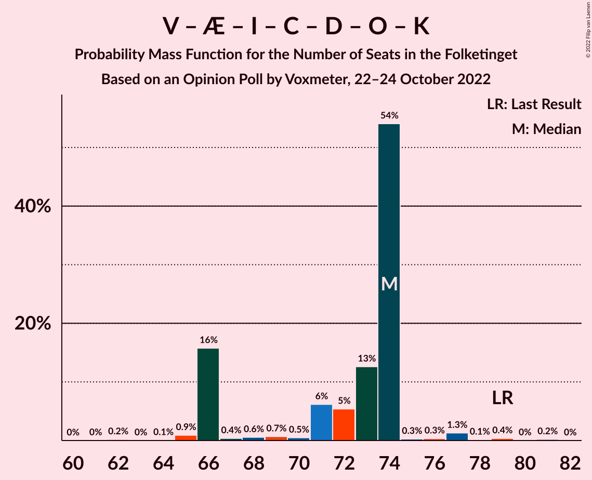

# Opinion Poll by Voxmeter, 22–24 October 2022

<a href="#voting-intentions">Voting Intentions</a> | <a href="#seats">Seats</a> | <a href="#coalitions">Coalitions</a> | <a href="#technical-information">Technical Information</a>

## Voting Intentions

### Confidence Intervals

| Party | Last Result | Poll Result | 80% Confidence Interval | 90% Confidence Interval | 95% Confidence Interval | 99% Confidence Interval |
|:-----:|:-----------:|:-----------:|:-----------------------:|:-----------------------:|:-----------------------:|:-----------------------:|
| Socialdemokraterne | 25.9% | 25.0% | 23.3–26.8% |22.8–27.3% |22.4–27.8% |21.6–28.7% |
| Venstre | 23.4% | 13.1% | 11.9–14.6% |11.5–15.0% |11.2–15.4% |10.6–16.1% |
| Moderaterne | 0.0% | 11.5% | 10.3–12.8% |9.9–13.2% |9.6–13.6% |9.1–14.3% |
| Socialistisk Folkeparti | 7.7% | 9.6% | 8.5–10.9% |8.2–11.2% |7.9–11.6% |7.4–12.2% |
| Danmarksdemokraterne | 0.0% | 8.1% | 7.1–9.3% |6.8–9.6% |6.5–9.9% |6.1–10.5% |
| Liberal Alliance | 2.3% | 7.3% | 6.3–8.4% |6.1–8.8% |5.8–9.1% |5.4–9.6% |
| Enhedslisten–De Rød-Grønne | 6.9% | 6.5% | 5.6–7.6% |5.3–7.9% |5.1–8.2% |4.7–8.7% |
| Det Konservative Folkeparti | 6.6% | 6.0% | 5.1–7.1% |4.9–7.4% |4.7–7.6% |4.3–8.2% |
| Nye Borgerlige | 2.4% | 4.2% | 3.5–5.1% |3.3–5.4% |3.1–5.6% |2.8–6.1% |
| Radikale Venstre | 8.6% | 3.8% | 3.1–4.7% |2.9–4.9% |2.8–5.2% |2.5–5.6% |
| Dansk Folkeparti | 8.7% | 1.9% | 1.4–2.6% |1.3–2.8% |1.2–2.9% |1.0–3.3% |
| Alternativet | 3.0% | 1.7% | 1.3–2.3% |1.2–2.5% |1.1–2.7% |0.9–3.0% |
| Kristendemokraterne | 1.7% | 0.6% | 0.4–1.1% |0.3–1.2% |0.3–1.3% |0.2–1.6% |
| Frie Grønne | 0.0% | 0.6% | 0.4–1.1% |0.3–1.2% |0.3–1.3% |0.2–1.6% |

*Note:* The poll result column reflects the actual value used in the calculations. Published results may vary slightly, and in addition be rounded to fewer digits.

## Seats

### Confidence Intervals

| Party | Last Result | Median | 80% Confidence Interval | 90% Confidence Interval | 95% Confidence Interval | 99% Confidence Interval |
|:-----:|:-----------:|:------:|:-----------------------:|:-----------------------:|:-----------------------:|:-----------------------:|
| <a href="#socialdemokraterne">Socialdemokraterne</a> | 48 | 45 | 42–49 |42–49 |42–49 |39–51 |
| <a href="#venstre">Venstre</a> | 43 | 25 | 23–25 |23–26 |22–28 |20–28 |
| <a href="#moderaterne">Moderaterne</a> | 0 | 20 | 19–21 |19–22 |19–23 |18–25 |
| <a href="#socialistisk-folkeparti">Socialistisk Folkeparti</a> | 14 | 18 | 15–18 |15–19 |15–20 |13–21 |
| <a href="#danmarksdemokraterne">Danmarksdemokraterne</a> | 0 | 12 | 12–15 |12–15 |12–16 |12–17 |
| <a href="#liberal-alliance">Liberal Alliance</a> | 4 | 14 | 12–14 |12–14 |10–14 |9–16 |
| <a href="#enhedslisten–de-rød-grønne">Enhedslisten–De Rød-Grønne</a> | 13 | 12 | 11–12 |11–13 |11–13 |9–15 |
| <a href="#det-konservative-folkeparti">Det Konservative Folkeparti</a> | 12 | 11 | 9–12 |9–12 |9–13 |8–14 |
| <a href="#nye-borgerlige">Nye Borgerlige</a> | 4 | 8 | 7–8 |7–10 |7–11 |5–11 |
| <a href="#radikale-venstre">Radikale Venstre</a> | 16 | 6 | 6–9 |6–9 |5–9 |5–9 |
| <a href="#dansk-folkeparti">Dansk Folkeparti</a> | 16 | 4 | 0–4 |0–4 |0–4 |0–5 |
| <a href="#alternativet">Alternativet</a> | 5 | 0 | 0–4 |0–4 |0–4 |0–5 |
| <a href="#kristendemokraterne">Kristendemokraterne</a> | 0 | 0 | 0 |0 |0 |0 |
| <a href="#frie-grønne">Frie Grønne</a> | 0 | 0 | 0 |0 |0 |0 |

### Socialdemokraterne

*For a full overview of the results for this party, see the [Socialdemokraterne](party-socialdemokraterne.html) page.*

| Number of Seats | Probability | Accumulated | Special Marks |
|:---------------:|:-----------:|:-----------:|:-------------:|
| 36 | 0.1% | 100% |  |
| 37 | 0% | 99.9% |  |
| 38 | 0.3% | 99.9% |  |
| 39 | 0.2% | 99.6% |  |
| 40 | 0.2% | 99.4% |  |
| 41 | 1.1% | 99.2% |  |
| 42 | 14% | 98% |  |
| 43 | 7% | 84% |  |
| 44 | 1.3% | 77% |  |
| 45 | 55% | 76% | Median |
| 46 | 3% | 20% |  |
| 47 | 0.1% | 17% |  |
| 48 | 0.4% | 17% | Last Result |
| 49 | 16% | 17% |  |
| 50 | 0.3% | 0.9% |  |
| 51 | 0.6% | 0.7% |  |
| 52 | 0% | 0% |  |

### Venstre

*For a full overview of the results for this party, see the [Venstre](party-venstre.html) page.*

| Number of Seats | Probability | Accumulated | Special Marks |
|:---------------:|:-----------:|:-----------:|:-------------:|
| 18 | 0.2% | 100% |  |
| 19 | 0.3% | 99.8% |  |
| 20 | 1.2% | 99.6% |  |
| 21 | 0.2% | 98% |  |
| 22 | 2% | 98% |  |
| 23 | 14% | 96% |  |
| 24 | 16% | 82% |  |
| 25 | 59% | 66% | Median |
| 26 | 4% | 7% |  |
| 27 | 1.0% | 4% |  |
| 28 | 2% | 3% |  |
| 29 | 0.2% | 0.3% |  |
| 30 | 0.1% | 0.1% |  |
| 31 | 0% | 0% |  |
| 32 | 0% | 0% |  |
| 33 | 0% | 0% |  |
| 34 | 0% | 0% |  |
| 35 | 0% | 0% |  |
| 36 | 0% | 0% |  |
| 37 | 0% | 0% |  |
| 38 | 0% | 0% |  |
| 39 | 0% | 0% |  |
| 40 | 0% | 0% |  |
| 41 | 0% | 0% |  |
| 42 | 0% | 0% |  |
| 43 | 0% | 0% | Last Result |

### Moderaterne

*For a full overview of the results for this party, see the [Moderaterne](party-moderaterne.html) page.*

| Number of Seats | Probability | Accumulated | Special Marks |
|:---------------:|:-----------:|:-----------:|:-------------:|
| 0 | 0% | 100% | Last Result |
| 1 | 0% | 100% |  |
| 2 | 0% | 100% |  |
| 3 | 0% | 100% |  |
| 4 | 0% | 100% |  |
| 5 | 0% | 100% |  |
| 6 | 0% | 100% |  |
| 7 | 0% | 100% |  |
| 8 | 0% | 100% |  |
| 9 | 0% | 100% |  |
| 10 | 0% | 100% |  |
| 11 | 0% | 100% |  |
| 12 | 0% | 100% |  |
| 13 | 0% | 100% |  |
| 14 | 0% | 100% |  |
| 15 | 0.1% | 100% |  |
| 16 | 0.1% | 99.9% |  |
| 17 | 0.1% | 99.9% |  |
| 18 | 2% | 99.7% |  |
| 19 | 19% | 98% |  |
| 20 | 54% | 79% | Median |
| 21 | 16% | 25% |  |
| 22 | 4% | 8% |  |
| 23 | 2% | 4% |  |
| 24 | 1.3% | 2% |  |
| 25 | 0.6% | 0.7% |  |
| 26 | 0.1% | 0.1% |  |
| 27 | 0% | 0% |  |

### Socialistisk Folkeparti

*For a full overview of the results for this party, see the [Socialistisk Folkeparti](party-socialistiskfolkeparti.html) page.*

| Number of Seats | Probability | Accumulated | Special Marks |
|:---------------:|:-----------:|:-----------:|:-------------:|
| 12 | 0.2% | 100% |  |
| 13 | 0.7% | 99.8% |  |
| 14 | 0.3% | 99.2% | Last Result |
| 15 | 13% | 98.9% |  |
| 16 | 0.8% | 86% |  |
| 17 | 24% | 85% |  |
| 18 | 56% | 61% | Median |
| 19 | 1.1% | 5% |  |
| 20 | 3% | 4% |  |
| 21 | 0.4% | 0.5% |  |
| 22 | 0% | 0.1% |  |
| 23 | 0.1% | 0.1% |  |
| 24 | 0% | 0% |  |

### Danmarksdemokraterne

*For a full overview of the results for this party, see the [Danmarksdemokraterne](party-danmarksdemokraterne.html) page.*

| Number of Seats | Probability | Accumulated | Special Marks |
|:---------------:|:-----------:|:-----------:|:-------------:|
| 0 | 0% | 100% | Last Result |
| 1 | 0% | 100% |  |
| 2 | 0% | 100% |  |
| 3 | 0% | 100% |  |
| 4 | 0% | 100% |  |
| 5 | 0% | 100% |  |
| 6 | 0% | 100% |  |
| 7 | 0% | 100% |  |
| 8 | 0% | 100% |  |
| 9 | 0% | 100% |  |
| 10 | 0% | 100% |  |
| 11 | 0.4% | 100% |  |
| 12 | 77% | 99.5% | Median |
| 13 | 4% | 23% |  |
| 14 | 2% | 18% |  |
| 15 | 14% | 16% |  |
| 16 | 2% | 3% |  |
| 17 | 0.5% | 0.9% |  |
| 18 | 0.2% | 0.4% |  |
| 19 | 0.2% | 0.2% |  |
| 20 | 0% | 0% |  |

### Liberal Alliance

*For a full overview of the results for this party, see the [Liberal Alliance](party-liberalalliance.html) page.*

| Number of Seats | Probability | Accumulated | Special Marks |
|:---------------:|:-----------:|:-----------:|:-------------:|
| 4 | 0% | 100% | Last Result |
| 5 | 0% | 100% |  |
| 6 | 0% | 100% |  |
| 7 | 0% | 100% |  |
| 8 | 0% | 100% |  |
| 9 | 2% | 100% |  |
| 10 | 0.4% | 98% |  |
| 11 | 0.5% | 97% |  |
| 12 | 16% | 97% |  |
| 13 | 25% | 81% |  |
| 14 | 54% | 56% | Median |
| 15 | 1.4% | 2% |  |
| 16 | 0.3% | 0.8% |  |
| 17 | 0.2% | 0.5% |  |
| 18 | 0% | 0.2% |  |
| 19 | 0.2% | 0.2% |  |
| 20 | 0% | 0% |  |

### Enhedslisten–De Rød-Grønne

*For a full overview of the results for this party, see the [Enhedslisten–De Rød-Grønne](party-enhedslisten–derød-grønne.html) page.*

| Number of Seats | Probability | Accumulated | Special Marks |
|:---------------:|:-----------:|:-----------:|:-------------:|
| 8 | 0.2% | 100% |  |
| 9 | 0.4% | 99.8% |  |
| 10 | 1.2% | 99.4% |  |
| 11 | 35% | 98% |  |
| 12 | 56% | 63% | Median |
| 13 | 6% | 7% | Last Result |
| 14 | 0.3% | 2% |  |
| 15 | 0.9% | 1.3% |  |
| 16 | 0.1% | 0.5% |  |
| 17 | 0.4% | 0.4% |  |
| 18 | 0% | 0% |  |

### Det Konservative Folkeparti

*For a full overview of the results for this party, see the [Det Konservative Folkeparti](party-detkonservativefolkeparti.html) page.*

| Number of Seats | Probability | Accumulated | Special Marks |
|:---------------:|:-----------:|:-----------:|:-------------:|
| 8 | 0.7% | 100% |  |
| 9 | 19% | 99.2% |  |
| 10 | 0.9% | 80% |  |
| 11 | 60% | 79% | Median |
| 12 | 15% | 19% | Last Result |
| 13 | 3% | 4% |  |
| 14 | 0.9% | 0.9% |  |
| 15 | 0% | 0% |  |

### Nye Borgerlige

*For a full overview of the results for this party, see the [Nye Borgerlige](party-nyeborgerlige.html) page.*

| Number of Seats | Probability | Accumulated | Special Marks |
|:---------------:|:-----------:|:-----------:|:-------------:|
| 4 | 0% | 100% | Last Result |
| 5 | 1.0% | 100% |  |
| 6 | 0.7% | 99.0% |  |
| 7 | 18% | 98% |  |
| 8 | 74% | 81% | Median |
| 9 | 1.1% | 6% |  |
| 10 | 1.0% | 5% |  |
| 11 | 4% | 4% |  |
| 12 | 0.2% | 0.2% |  |
| 13 | 0% | 0% |  |

### Radikale Venstre

*For a full overview of the results for this party, see the [Radikale Venstre](party-radikalevenstre.html) page.*

| Number of Seats | Probability | Accumulated | Special Marks |
|:---------------:|:-----------:|:-----------:|:-------------:|
| 4 | 0.2% | 100% |  |
| 5 | 2% | 99.7% |  |
| 6 | 62% | 97% | Median |
| 7 | 2% | 36% |  |
| 8 | 5% | 34% |  |
| 9 | 29% | 29% |  |
| 10 | 0.2% | 0.2% |  |
| 11 | 0% | 0% |  |
| 12 | 0% | 0% |  |
| 13 | 0% | 0% |  |
| 14 | 0% | 0% |  |
| 15 | 0% | 0% |  |
| 16 | 0% | 0% | Last Result |

### Dansk Folkeparti

*For a full overview of the results for this party, see the [Dansk Folkeparti](party-danskfolkeparti.html) page.*

| Number of Seats | Probability | Accumulated | Special Marks |
|:---------------:|:-----------:|:-----------:|:-------------:|
| 0 | 27% | 100% |  |
| 1 | 0% | 73% |  |
| 2 | 0% | 73% |  |
| 3 | 0% | 73% |  |
| 4 | 71% | 73% | Median |
| 5 | 2% | 2% |  |
| 6 | 0.2% | 0.2% |  |
| 7 | 0% | 0% |  |
| 8 | 0% | 0% |  |
| 9 | 0% | 0% |  |
| 10 | 0% | 0% |  |
| 11 | 0% | 0% |  |
| 12 | 0% | 0% |  |
| 13 | 0% | 0% |  |
| 14 | 0% | 0% |  |
| 15 | 0% | 0% |  |
| 16 | 0% | 0% | Last Result |

### Alternativet

*For a full overview of the results for this party, see the [Alternativet](party-alternativet.html) page.*

| Number of Seats | Probability | Accumulated | Special Marks |
|:---------------:|:-----------:|:-----------:|:-------------:|
| 0 | 62% | 100% | Median |
| 1 | 0% | 38% |  |
| 2 | 0% | 38% |  |
| 3 | 0% | 38% |  |
| 4 | 36% | 37% |  |
| 5 | 1.5% | 1.5% | Last Result |
| 6 | 0% | 0% |  |

### Kristendemokraterne

*For a full overview of the results for this party, see the [Kristendemokraterne](party-kristendemokraterne.html) page.*

| Number of Seats | Probability | Accumulated | Special Marks |
|:---------------:|:-----------:|:-----------:|:-------------:|
| 0 | 100% | 100% | Last Result, Median |

### Frie Grønne

*For a full overview of the results for this party, see the [Frie Grønne](party-friegrønne.html) page.*

| Number of Seats | Probability | Accumulated | Special Marks |
|:---------------:|:-----------:|:-----------:|:-------------:|
| 0 | 100% | 100% | Last Result, Median |

## Coalitions

### Confidence Intervals

| Coalition | Last Result | Median | Majority? | 80% Confidence Interval | 90% Confidence Interval | 95% Confidence Interval | 99% Confidence Interval |
|:---------:|:-----------:|:------:|:---------:|:-----------------------:|:-----------------------:|:-----------------------:|:-----------------------:|
| Socialdemokraterne – Socialistisk Folkeparti – Enhedslisten–De Rød-Grønne – Radikale Venstre – Alternativet | 96 | 81 | 16% | 81–90 | 81–90 | 79–90 | 76–90 |
| Socialdemokraterne – Socialistisk Folkeparti – Enhedslisten–De Rød-Grønne – Radikale Venstre | 91 | 81 | 0% | 77–86 | 77–86 | 77–86 | 75–86 |
| Socialdemokraterne – Socialistisk Folkeparti – Enhedslisten–De Rød-Grønne – Alternativet | 80 | 75 | 0% | 72–81 | 72–81 | 72–81 | 69–81 |
| Socialdemokraterne – Socialistisk Folkeparti – Enhedslisten–De Rød-Grønne | 75 | 75 | 0% | 68–77 | 68–77 | 68–77 | 68–78 |
| Venstre – Danmarksdemokraterne – Liberal Alliance – Det Konservative Folkeparti – Nye Borgerlige – Dansk Folkeparti – Kristendemokraterne | 79 | 74 | 0% | 66–74 | 66–74 | 66–75 | 65–79 |
| Socialdemokraterne – Socialistisk Folkeparti – Radikale Venstre | 78 | 69 | 0% | 66–75 | 66–75 | 66–75 | 63–75 |
| Venstre – Liberal Alliance – Det Konservative Folkeparti – Nye Borgerlige – Dansk Folkeparti – Kristendemokraterne | 79 | 62 | 0% | 54–62 | 54–62 | 54–62 | 51–65 |
| Venstre – Liberal Alliance – Det Konservative Folkeparti – Nye Borgerlige – Dansk Folkeparti | 79 | 62 | 0% | 54–62 | 54–62 | 54–62 | 51–65 |
| Socialdemokraterne – Radikale Venstre | 64 | 51 | 0% | 51–58 | 49–58 | 49–58 | 46–58 |
| Venstre – Liberal Alliance – Det Konservative Folkeparti – Dansk Folkeparti – Kristendemokraterne | 75 | 54 | 0% | 46–54 | 46–54 | 46–54 | 44–56 |
| Venstre – Liberal Alliance – Det Konservative Folkeparti – Dansk Folkeparti | 75 | 54 | 0% | 46–54 | 46–54 | 46–54 | 44–56 |
| Venstre – Liberal Alliance – Det Konservative Folkeparti | 59 | 50 | 0% | 46–50 | 46–50 | 46–51 | 42–53 |
| Venstre – Det Konservative Folkeparti | 55 | 36 | 0% | 33–36 | 33–36 | 33–39 | 31–41 |
| Venstre | 43 | 25 | 0% | 23–25 | 23–26 | 22–28 | 20–28 |

### Socialdemokraterne – Socialistisk Folkeparti – Enhedslisten–De Rød-Grønne – Radikale Venstre – Alternativet

| Number of Seats | Probability | Accumulated | Special Marks |
|:---------------:|:-----------:|:-----------:|:-------------:|
| 74 | 0.1% | 100% |  |
| 75 | 0.3% | 99.9% |  |
| 76 | 0.2% | 99.6% |  |
| 77 | 1.5% | 99.4% |  |
| 78 | 0.3% | 98% |  |
| 79 | 0.2% | 98% |  |
| 80 | 0.2% | 97% |  |
| 81 | 71% | 97% | Median |
| 82 | 0.9% | 26% |  |
| 83 | 3% | 25% |  |
| 84 | 0.6% | 22% |  |
| 85 | 4% | 21% |  |
| 86 | 1.1% | 17% |  |
| 87 | 0.1% | 16% |  |
| 88 | 0.1% | 16% |  |
| 89 | 0.1% | 16% |  |
| 90 | 16% | 16% | Majority |
| 91 | 0% | 0.1% |  |
| 92 | 0% | 0% |  |
| 93 | 0% | 0% |  |
| 94 | 0% | 0% |  |
| 95 | 0% | 0% |  |
| 96 | 0% | 0% | Last Result |

### Socialdemokraterne – Socialistisk Folkeparti – Enhedslisten–De Rød-Grønne – Radikale Venstre

| Number of Seats | Probability | Accumulated | Special Marks |
|:---------------:|:-----------:|:-----------:|:-------------:|
| 74 | 0.3% | 100% |  |
| 75 | 0.3% | 99.6% |  |
| 76 | 0.4% | 99.3% |  |
| 77 | 18% | 98.9% |  |
| 78 | 0.5% | 81% |  |
| 79 | 0.4% | 80% |  |
| 80 | 0.1% | 80% |  |
| 81 | 58% | 80% | Median |
| 82 | 0.8% | 22% |  |
| 83 | 3% | 21% |  |
| 84 | 0.6% | 18% |  |
| 85 | 1.3% | 17% |  |
| 86 | 16% | 16% |  |
| 87 | 0% | 0.2% |  |
| 88 | 0% | 0.2% |  |
| 89 | 0.1% | 0.2% |  |
| 90 | 0% | 0% | Majority |
| 91 | 0% | 0% | Last Result |

### Socialdemokraterne – Socialistisk Folkeparti – Enhedslisten–De Rød-Grønne – Alternativet

| Number of Seats | Probability | Accumulated | Special Marks |
|:---------------:|:-----------:|:-----------:|:-------------:|
| 68 | 0.1% | 100% |  |
| 69 | 0.4% | 99.8% |  |
| 70 | 0.1% | 99.5% |  |
| 71 | 0.5% | 99.3% |  |
| 72 | 14% | 98.8% |  |
| 73 | 1.0% | 85% |  |
| 74 | 0.4% | 84% |  |
| 75 | 59% | 84% | Median |
| 76 | 1.4% | 25% |  |
| 77 | 5% | 24% |  |
| 78 | 1.0% | 18% |  |
| 79 | 0.2% | 17% |  |
| 80 | 0.1% | 17% | Last Result |
| 81 | 16% | 17% |  |
| 82 | 0.2% | 0.4% |  |
| 83 | 0.1% | 0.2% |  |
| 84 | 0% | 0.1% |  |
| 85 | 0% | 0.1% |  |
| 86 | 0% | 0% |  |

### Socialdemokraterne – Socialistisk Folkeparti – Enhedslisten–De Rød-Grønne

| Number of Seats | Probability | Accumulated | Special Marks |
|:---------------:|:-----------:|:-----------:|:-------------:|
| 65 | 0% | 100% |  |
| 66 | 0% | 99.9% |  |
| 67 | 0% | 99.9% |  |
| 68 | 12% | 99.9% |  |
| 69 | 0.6% | 87% |  |
| 70 | 0.3% | 87% |  |
| 71 | 5% | 86% |  |
| 72 | 1.4% | 81% |  |
| 73 | 4% | 80% |  |
| 74 | 0.5% | 76% |  |
| 75 | 54% | 76% | Last Result, Median |
| 76 | 2% | 22% |  |
| 77 | 18% | 19% |  |
| 78 | 0.8% | 1.3% |  |
| 79 | 0.2% | 0.5% |  |
| 80 | 0% | 0.3% |  |
| 81 | 0.1% | 0.3% |  |
| 82 | 0.1% | 0.2% |  |
| 83 | 0.1% | 0.1% |  |
| 84 | 0% | 0% |  |

### Venstre – Danmarksdemokraterne – Liberal Alliance – Det Konservative Folkeparti – Nye Borgerlige – Dansk Folkeparti – Kristendemokraterne

| Number of Seats | Probability | Accumulated | Special Marks |
|:---------------:|:-----------:|:-----------:|:-------------:|
| 62 | 0.2% | 100% |  |
| 63 | 0% | 99.8% |  |
| 64 | 0.1% | 99.8% |  |
| 65 | 0.9% | 99.7% |  |
| 66 | 16% | 98.8% |  |
| 67 | 0.4% | 83% |  |
| 68 | 0.6% | 83% |  |
| 69 | 0.7% | 82% |  |
| 70 | 0.5% | 81% |  |
| 71 | 6% | 81% |  |
| 72 | 5% | 75% |  |
| 73 | 13% | 69% |  |
| 74 | 54% | 57% | Median |
| 75 | 0.3% | 3% |  |
| 76 | 0.3% | 2% |  |
| 77 | 1.3% | 2% |  |
| 78 | 0.1% | 0.8% |  |
| 79 | 0.4% | 0.6% | Last Result |
| 80 | 0% | 0.2% |  |
| 81 | 0.2% | 0.2% |  |
| 82 | 0% | 0% |  |

### Socialdemokraterne – Socialistisk Folkeparti – Radikale Venstre

| Number of Seats | Probability | Accumulated | Special Marks |
|:---------------:|:-----------:|:-----------:|:-------------:|
| 60 | 0.1% | 100% |  |
| 61 | 0.1% | 99.9% |  |
| 62 | 0.1% | 99.8% |  |
| 63 | 0.4% | 99.7% |  |
| 64 | 1.5% | 99.4% |  |
| 65 | 0.3% | 98% |  |
| 66 | 17% | 98% |  |
| 67 | 0.1% | 80% |  |
| 68 | 4% | 80% |  |
| 69 | 54% | 76% | Median |
| 70 | 1.3% | 22% |  |
| 71 | 1.3% | 21% |  |
| 72 | 3% | 20% |  |
| 73 | 0.2% | 16% |  |
| 74 | 0.2% | 16% |  |
| 75 | 16% | 16% |  |
| 76 | 0.2% | 0.3% |  |
| 77 | 0% | 0% |  |
| 78 | 0% | 0% | Last Result |

### Venstre – Liberal Alliance – Det Konservative Folkeparti – Nye Borgerlige – Dansk Folkeparti – Kristendemokraterne

| Number of Seats | Probability | Accumulated | Special Marks |
|:---------------:|:-----------:|:-----------:|:-------------:|
| 47 | 0.1% | 100% |  |
| 48 | 0% | 99.9% |  |
| 49 | 0.1% | 99.9% |  |
| 50 | 0% | 99.8% |  |
| 51 | 1.0% | 99.7% |  |
| 52 | 0.4% | 98.8% |  |
| 53 | 0.4% | 98% |  |
| 54 | 16% | 98% |  |
| 55 | 0.8% | 82% |  |
| 56 | 0.8% | 81% |  |
| 57 | 0.9% | 80% |  |
| 58 | 15% | 79% |  |
| 59 | 4% | 64% |  |
| 60 | 4% | 60% |  |
| 61 | 0.3% | 56% |  |
| 62 | 54% | 55% | Median |
| 63 | 0.1% | 2% |  |
| 64 | 1.1% | 2% |  |
| 65 | 0.6% | 0.6% |  |
| 66 | 0% | 0% |  |
| 67 | 0% | 0% |  |
| 68 | 0% | 0% |  |
| 69 | 0% | 0% |  |
| 70 | 0% | 0% |  |
| 71 | 0% | 0% |  |
| 72 | 0% | 0% |  |
| 73 | 0% | 0% |  |
| 74 | 0% | 0% |  |
| 75 | 0% | 0% |  |
| 76 | 0% | 0% |  |
| 77 | 0% | 0% |  |
| 78 | 0% | 0% |  |
| 79 | 0% | 0% | Last Result |

### Venstre – Liberal Alliance – Det Konservative Folkeparti – Nye Borgerlige – Dansk Folkeparti

| Number of Seats | Probability | Accumulated | Special Marks |
|:---------------:|:-----------:|:-----------:|:-------------:|
| 47 | 0.1% | 100% |  |
| 48 | 0% | 99.9% |  |
| 49 | 0.1% | 99.9% |  |
| 50 | 0% | 99.8% |  |
| 51 | 1.0% | 99.7% |  |
| 52 | 0.4% | 98.8% |  |
| 53 | 0.4% | 98% |  |
| 54 | 16% | 98% |  |
| 55 | 0.8% | 82% |  |
| 56 | 0.8% | 81% |  |
| 57 | 0.9% | 80% |  |
| 58 | 15% | 79% |  |
| 59 | 4% | 64% |  |
| 60 | 4% | 60% |  |
| 61 | 0.3% | 56% |  |
| 62 | 54% | 55% | Median |
| 63 | 0.1% | 2% |  |
| 64 | 1.1% | 2% |  |
| 65 | 0.6% | 0.6% |  |
| 66 | 0% | 0% |  |
| 67 | 0% | 0% |  |
| 68 | 0% | 0% |  |
| 69 | 0% | 0% |  |
| 70 | 0% | 0% |  |
| 71 | 0% | 0% |  |
| 72 | 0% | 0% |  |
| 73 | 0% | 0% |  |
| 74 | 0% | 0% |  |
| 75 | 0% | 0% |  |
| 76 | 0% | 0% |  |
| 77 | 0% | 0% |  |
| 78 | 0% | 0% |  |
| 79 | 0% | 0% | Last Result |

### Socialdemokraterne – Radikale Venstre

| Number of Seats | Probability | Accumulated | Special Marks |
|:---------------:|:-----------:|:-----------:|:-------------:|
| 42 | 0.1% | 100% |  |
| 43 | 0% | 99.9% |  |
| 44 | 0.1% | 99.9% |  |
| 45 | 0.3% | 99.8% |  |
| 46 | 1.0% | 99.5% |  |
| 47 | 0.4% | 98.6% |  |
| 48 | 0.6% | 98% |  |
| 49 | 5% | 98% |  |
| 50 | 0.4% | 93% |  |
| 51 | 70% | 92% | Median |
| 52 | 4% | 22% |  |
| 53 | 0.6% | 18% |  |
| 54 | 0.2% | 17% |  |
| 55 | 0.1% | 17% |  |
| 56 | 0.5% | 17% |  |
| 57 | 0.6% | 16% |  |
| 58 | 16% | 16% |  |
| 59 | 0.1% | 0.2% |  |
| 60 | 0.1% | 0.1% |  |
| 61 | 0% | 0% |  |
| 62 | 0% | 0% |  |
| 63 | 0% | 0% |  |
| 64 | 0% | 0% | Last Result |

### Venstre – Liberal Alliance – Det Konservative Folkeparti – Dansk Folkeparti – Kristendemokraterne

| Number of Seats | Probability | Accumulated | Special Marks |
|:---------------:|:-----------:|:-----------:|:-------------:|
| 40 | 0.2% | 100% |  |
| 41 | 0% | 99.8% |  |
| 42 | 0% | 99.8% |  |
| 43 | 0.1% | 99.8% |  |
| 44 | 0.4% | 99.7% |  |
| 45 | 0.3% | 99.3% |  |
| 46 | 17% | 99.0% |  |
| 47 | 0.9% | 82% |  |
| 48 | 0.2% | 81% |  |
| 49 | 4% | 80% |  |
| 50 | 4% | 76% |  |
| 51 | 13% | 72% |  |
| 52 | 3% | 59% |  |
| 53 | 0.4% | 56% |  |
| 54 | 54% | 56% | Median |
| 55 | 0.3% | 2% |  |
| 56 | 1.1% | 2% |  |
| 57 | 0.2% | 0.5% |  |
| 58 | 0.2% | 0.2% |  |
| 59 | 0% | 0% |  |
| 60 | 0% | 0% |  |
| 61 | 0% | 0% |  |
| 62 | 0% | 0% |  |
| 63 | 0% | 0% |  |
| 64 | 0% | 0% |  |
| 65 | 0% | 0% |  |
| 66 | 0% | 0% |  |
| 67 | 0% | 0% |  |
| 68 | 0% | 0% |  |
| 69 | 0% | 0% |  |
| 70 | 0% | 0% |  |
| 71 | 0% | 0% |  |
| 72 | 0% | 0% |  |
| 73 | 0% | 0% |  |
| 74 | 0% | 0% |  |
| 75 | 0% | 0% | Last Result |

### Venstre – Liberal Alliance – Det Konservative Folkeparti – Dansk Folkeparti

| Number of Seats | Probability | Accumulated | Special Marks |
|:---------------:|:-----------:|:-----------:|:-------------:|
| 40 | 0.2% | 100% |  |
| 41 | 0% | 99.8% |  |
| 42 | 0% | 99.8% |  |
| 43 | 0.1% | 99.8% |  |
| 44 | 0.4% | 99.7% |  |
| 45 | 0.3% | 99.3% |  |
| 46 | 17% | 99.0% |  |
| 47 | 0.9% | 82% |  |
| 48 | 0.2% | 81% |  |
| 49 | 4% | 80% |  |
| 50 | 4% | 76% |  |
| 51 | 13% | 72% |  |
| 52 | 3% | 59% |  |
| 53 | 0.4% | 56% |  |
| 54 | 54% | 56% | Median |
| 55 | 0.3% | 2% |  |
| 56 | 1.1% | 2% |  |
| 57 | 0.2% | 0.5% |  |
| 58 | 0.2% | 0.2% |  |
| 59 | 0% | 0% |  |
| 60 | 0% | 0% |  |
| 61 | 0% | 0% |  |
| 62 | 0% | 0% |  |
| 63 | 0% | 0% |  |
| 64 | 0% | 0% |  |
| 65 | 0% | 0% |  |
| 66 | 0% | 0% |  |
| 67 | 0% | 0% |  |
| 68 | 0% | 0% |  |
| 69 | 0% | 0% |  |
| 70 | 0% | 0% |  |
| 71 | 0% | 0% |  |
| 72 | 0% | 0% |  |
| 73 | 0% | 0% |  |
| 74 | 0% | 0% |  |
| 75 | 0% | 0% | Last Result |

### Venstre – Liberal Alliance – Det Konservative Folkeparti

| Number of Seats | Probability | Accumulated | Special Marks |
|:---------------:|:-----------:|:-----------:|:-------------:|
| 40 | 0.3% | 100% |  |
| 41 | 0% | 99.7% |  |
| 42 | 0.3% | 99.7% |  |
| 43 | 0.1% | 99.3% |  |
| 44 | 0.5% | 99.2% |  |
| 45 | 0.3% | 98.7% |  |
| 46 | 19% | 98% |  |
| 47 | 13% | 79% |  |
| 48 | 3% | 66% |  |
| 49 | 4% | 63% |  |
| 50 | 56% | 59% | Median |
| 51 | 1.0% | 3% |  |
| 52 | 0.7% | 2% |  |
| 53 | 0.4% | 0.8% |  |
| 54 | 0.2% | 0.4% |  |
| 55 | 0.1% | 0.2% |  |
| 56 | 0.1% | 0.1% |  |
| 57 | 0% | 0% |  |
| 58 | 0% | 0% |  |
| 59 | 0% | 0% | Last Result |

### Venstre – Det Konservative Folkeparti

| Number of Seats | Probability | Accumulated | Special Marks |
|:---------------:|:-----------:|:-----------:|:-------------:|
| 26 | 0.1% | 100% |  |
| 27 | 0% | 99.9% |  |
| 28 | 0.1% | 99.9% |  |
| 29 | 0% | 99.8% |  |
| 30 | 0.2% | 99.8% |  |
| 31 | 0.3% | 99.6% |  |
| 32 | 1.1% | 99.2% |  |
| 33 | 17% | 98% |  |
| 34 | 3% | 81% |  |
| 35 | 16% | 78% |  |
| 36 | 58% | 62% | Median |
| 37 | 0.6% | 5% |  |
| 38 | 0.3% | 4% |  |
| 39 | 1.3% | 4% |  |
| 40 | 0% | 2% |  |
| 41 | 2% | 2% |  |
| 42 | 0% | 0.1% |  |
| 43 | 0.1% | 0.1% |  |
| 44 | 0% | 0% |  |
| 45 | 0% | 0% |  |
| 46 | 0% | 0% |  |
| 47 | 0% | 0% |  |
| 48 | 0% | 0% |  |
| 49 | 0% | 0% |  |
| 50 | 0% | 0% |  |
| 51 | 0% | 0% |  |
| 52 | 0% | 0% |  |
| 53 | 0% | 0% |  |
| 54 | 0% | 0% |  |
| 55 | 0% | 0% | Last Result |

### Venstre

| Number of Seats | Probability | Accumulated | Special Marks |
|:---------------:|:-----------:|:-----------:|:-------------:|
| 18 | 0.2% | 100% |  |
| 19 | 0.3% | 99.8% |  |
| 20 | 1.2% | 99.6% |  |
| 21 | 0.2% | 98% |  |
| 22 | 2% | 98% |  |
| 23 | 14% | 96% |  |
| 24 | 16% | 82% |  |
| 25 | 59% | 66% | Median |
| 26 | 4% | 7% |  |
| 27 | 1.0% | 4% |  |
| 28 | 2% | 3% |  |
| 29 | 0.2% | 0.3% |  |
| 30 | 0.1% | 0.1% |  |
| 31 | 0% | 0% |  |
| 32 | 0% | 0% |  |
| 33 | 0% | 0% |  |
| 34 | 0% | 0% |  |
| 35 | 0% | 0% |  |
| 36 | 0% | 0% |  |
| 37 | 0% | 0% |  |
| 38 | 0% | 0% |  |
| 39 | 0% | 0% |  |
| 40 | 0% | 0% |  |
| 41 | 0% | 0% |  |
| 42 | 0% | 0% |  |
| 43 | 0% | 0% | Last Result |

## Technical Information

### Opinion Poll

+ **Polling firm:** Voxmeter
+ **Commissioner(s):** —
+ **Fieldwork period:** 22–24 October 2022

### Calculations

+ **Sample size:** 1004
+ **Simulations done:** 1,048,576
+ **Error estimate:** 2.30%

