# Opinion Poll by Yougov, 21–25 October 2022

<a href="#voting-intentions">Voting Intentions</a> | <a href="#seats">Seats</a> | <a href="#coalitions">Coalitions</a> | <a href="#technical-information">Technical Information</a>

## Voting Intentions

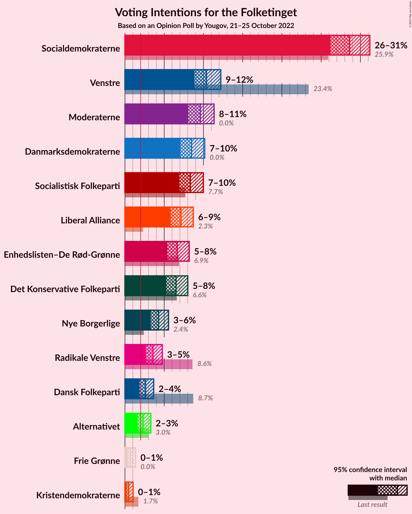

### Confidence Intervals

| Party | Last Result | Poll Result | 80% Confidence Interval | 90% Confidence Interval | 95% Confidence Interval | 99% Confidence Interval |
|:-----:|:-----------:|:-----------:|:-----------------------:|:-----------------------:|:-----------------------:|:-----------------------:|
| Socialdemokraterne | 25.9% | 28.6% | 27.0–30.3% |26.6–30.8% |26.2–31.2% |25.4–32.0% |
| Venstre | 23.4% | 10.4% | 9.4–11.6% |9.1–11.9% |8.8–12.2% |8.4–12.8% |
| Moderaterne | 0.0% | 9.6% | 8.6–10.7% |8.3–11.1% |8.1–11.4% |7.6–11.9% |
| Danmarksdemokraterne | 0.0% | 8.5% | 7.5–9.6% |7.3–9.9% |7.1–10.2% |6.6–10.7% |
| Socialistisk Folkeparti | 7.7% | 8.3% | 7.4–9.4% |7.1–9.7% |6.9–10.0% |6.5–10.5% |
| Liberal Alliance | 2.3% | 7.1% | 6.3–8.2% |6.0–8.4% |5.8–8.7% |5.5–9.2% |
| Enhedslisten–De Rød-Grønne | 6.9% | 6.7% | 5.8–7.7% |5.6–7.9% |5.4–8.2% |5.0–8.7% |
| Det Konservative Folkeparti | 6.6% | 6.5% | 5.7–7.5% |5.5–7.8% |5.3–8.0% |4.9–8.5% |
| Nye Borgerlige | 2.4% | 4.3% | 3.6–5.1% |3.4–5.3% |3.3–5.5% |3.0–6.0% |
| Radikale Venstre | 8.6% | 3.6% | 3.0–4.3% |2.8–4.6% |2.7–4.8% |2.4–5.1% |
| Dansk Folkeparti | 8.7% | 2.6% | 2.1–3.3% |2.0–3.5% |1.9–3.7% |1.6–4.0% |
| Alternativet | 3.0% | 2.3% | 1.8–2.9% |1.7–3.1% |1.6–3.3% |1.4–3.6% |
| Frie Grønne | 0.0% | 0.7% | 0.5–1.1% |0.4–1.2% |0.4–1.4% |0.3–1.6% |
| Kristendemokraterne | 1.7% | 0.5% | 0.3–0.8% |0.3–0.9% |0.2–1.0% |0.2–1.2% |

*Note:* The poll result column reflects the actual value used in the calculations. Published results may vary slightly, and in addition be rounded to fewer digits.

## Seats

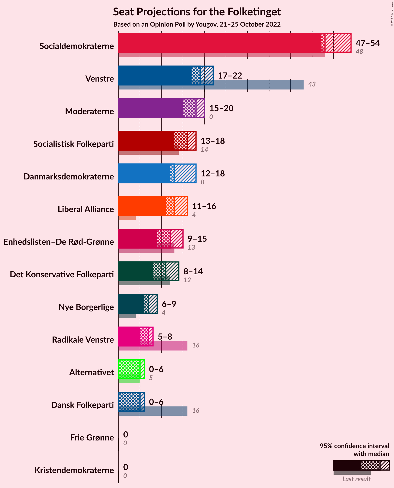

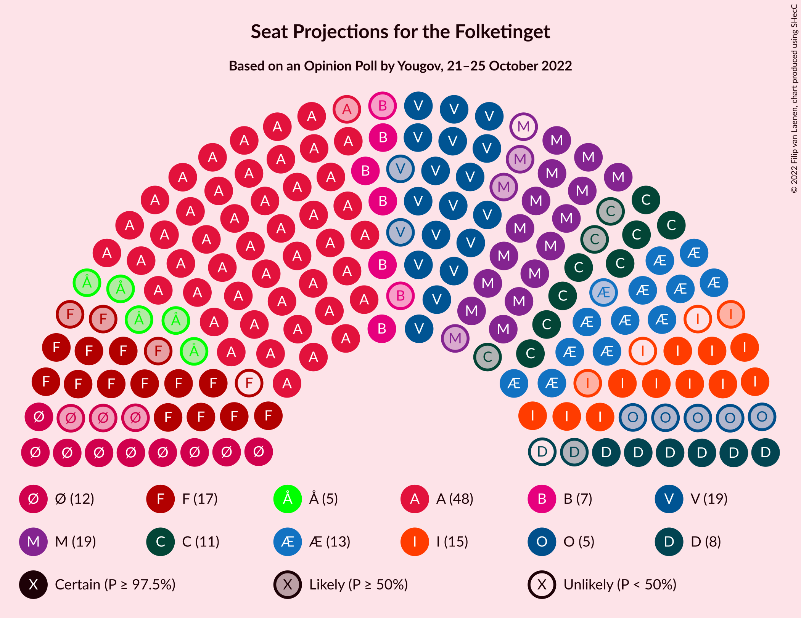

### Confidence Intervals

| Party | Last Result | Median | 80% Confidence Interval | 90% Confidence Interval | 95% Confidence Interval | 99% Confidence Interval |
|:-----:|:-----------:|:------:|:-----------------------:|:-----------------------:|:-----------------------:|:-----------------------:|
| <a href="#socialdemokraterne">Socialdemokraterne</a> | 48 | 48 | 47–53 |47–53 |47–54 |46–58 |
| <a href="#venstre">Venstre</a> | 43 | 19 | 18–21 |17–22 |17–22 |15–23 |
| <a href="#moderaterne">Moderaterne</a> | 0 | 18 | 16–19 |16–19 |15–20 |14–21 |
| <a href="#danmarksdemokraterne">Danmarksdemokraterne</a> | 0 | 13 | 12–17 |12–18 |12–18 |11–18 |
| <a href="#socialistisk-folkeparti">Socialistisk Folkeparti</a> | 14 | 16 | 15–17 |14–17 |13–18 |11–18 |
| <a href="#liberal-alliance">Liberal Alliance</a> | 4 | 13 | 12–15 |12–15 |11–16 |10–16 |
| <a href="#enhedslisten–de-rød-grønne">Enhedslisten–De Rød-Grønne</a> | 13 | 12 | 11–14 |10–14 |9–15 |9–15 |
| <a href="#det-konservative-folkeparti">Det Konservative Folkeparti</a> | 12 | 11 | 10–13 |10–13 |8–14 |8–16 |
| <a href="#nye-borgerlige">Nye Borgerlige</a> | 4 | 7 | 6–8 |6–9 |6–9 |5–10 |
| <a href="#radikale-venstre">Radikale Venstre</a> | 16 | 7 | 6–7 |6–8 |5–8 |4–8 |
| <a href="#dansk-folkeparti">Dansk Folkeparti</a> | 16 | 5 | 4–6 |0–6 |0–6 |0–7 |
| <a href="#alternativet">Alternativet</a> | 5 | 5 | 0–5 |0–5 |0–6 |0–7 |
| <a href="#frie-grønne">Frie Grønne</a> | 0 | 0 | 0 |0 |0 |0 |
| <a href="#kristendemokraterne">Kristendemokraterne</a> | 0 | 0 | 0 |0 |0 |0 |

### Socialdemokraterne

*For a full overview of the results for this party, see the [Socialdemokraterne](party-socialdemokraterne.html) page.*

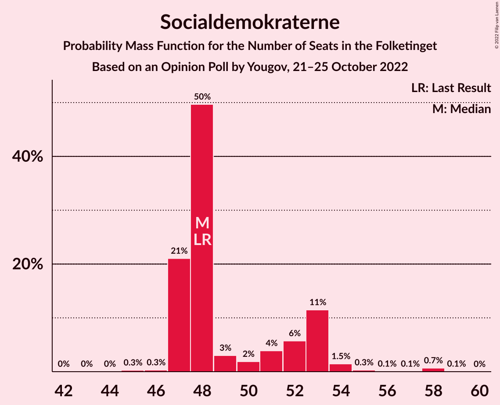

| Number of Seats | Probability | Accumulated | Special Marks |
|:---------------:|:-----------:|:-----------:|:-------------:|
| 43 | 0% | 100% |  |
| 44 | 0% | 99.9% |  |
| 45 | 0.3% | 99.9% |  |
| 46 | 0.3% | 99.6% |  |
| 47 | 21% | 99.3% |  |
| 48 | 50% | 78% | Last Result, Median |
| 49 | 3% | 29% |  |
| 50 | 2% | 26% |  |
| 51 | 4% | 24% |  |
| 52 | 6% | 20% |  |
| 53 | 11% | 14% |  |
| 54 | 1.5% | 3% |  |
| 55 | 0.3% | 1.2% |  |
| 56 | 0.1% | 0.9% |  |
| 57 | 0.1% | 0.8% |  |
| 58 | 0.7% | 0.7% |  |
| 59 | 0.1% | 0.1% |  |
| 60 | 0% | 0% |  |

### Venstre

*For a full overview of the results for this party, see the [Venstre](party-venstre.html) page.*

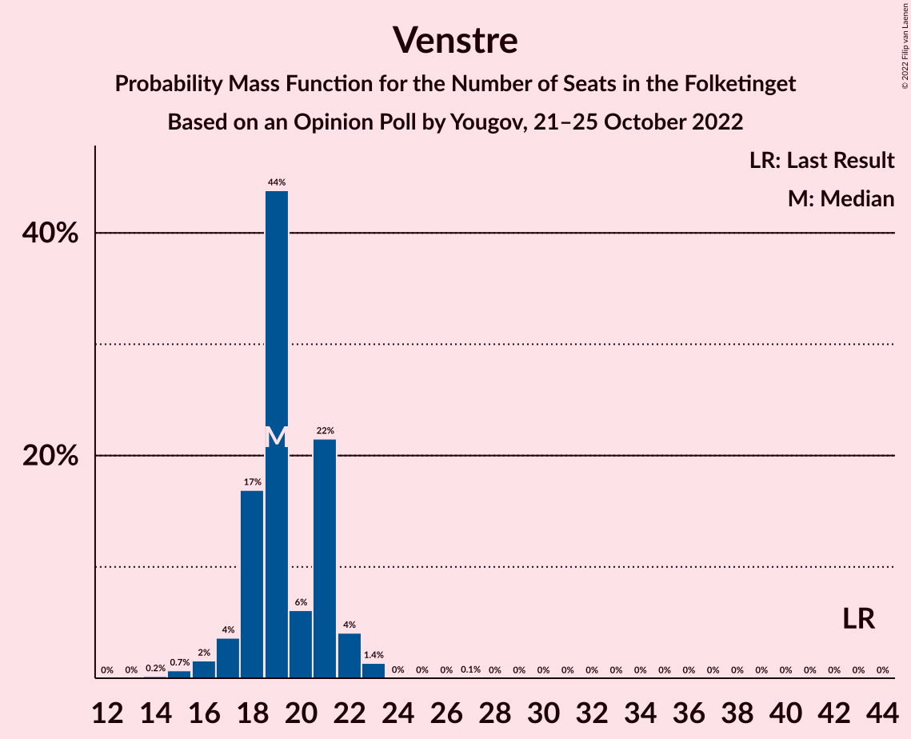

| Number of Seats | Probability | Accumulated | Special Marks |
|:---------------:|:-----------:|:-----------:|:-------------:|
| 14 | 0.2% | 100% |  |
| 15 | 0.7% | 99.8% |  |
| 16 | 2% | 99.1% |  |
| 17 | 4% | 98% |  |
| 18 | 17% | 94% |  |
| 19 | 44% | 77% | Median |
| 20 | 6% | 33% |  |
| 21 | 22% | 27% |  |
| 22 | 4% | 6% |  |
| 23 | 1.4% | 1.5% |  |
| 24 | 0% | 0.1% |  |
| 25 | 0% | 0.1% |  |
| 26 | 0% | 0.1% |  |
| 27 | 0.1% | 0.1% |  |
| 28 | 0% | 0% |  |
| 29 | 0% | 0% |  |
| 30 | 0% | 0% |  |
| 31 | 0% | 0% |  |
| 32 | 0% | 0% |  |
| 33 | 0% | 0% |  |
| 34 | 0% | 0% |  |
| 35 | 0% | 0% |  |
| 36 | 0% | 0% |  |
| 37 | 0% | 0% |  |
| 38 | 0% | 0% |  |
| 39 | 0% | 0% |  |
| 40 | 0% | 0% |  |
| 41 | 0% | 0% |  |
| 42 | 0% | 0% |  |
| 43 | 0% | 0% | Last Result |

### Moderaterne

*For a full overview of the results for this party, see the [Moderaterne](party-moderaterne.html) page.*

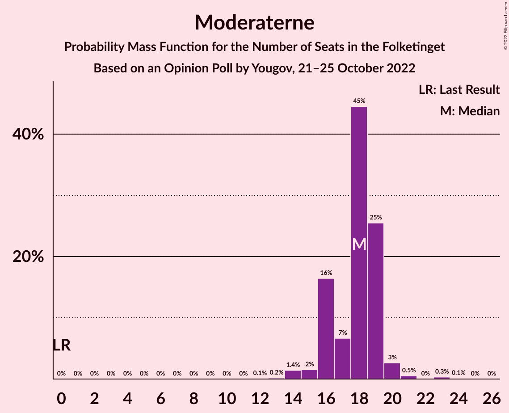

| Number of Seats | Probability | Accumulated | Special Marks |
|:---------------:|:-----------:|:-----------:|:-------------:|
| 0 | 0% | 100% | Last Result |
| 1 | 0% | 100% |  |
| 2 | 0% | 100% |  |
| 3 | 0% | 100% |  |
| 4 | 0% | 100% |  |
| 5 | 0% | 100% |  |
| 6 | 0% | 100% |  |
| 7 | 0% | 100% |  |
| 8 | 0% | 100% |  |
| 9 | 0% | 100% |  |
| 10 | 0% | 100% |  |
| 11 | 0% | 100% |  |
| 12 | 0.1% | 100% |  |
| 13 | 0.2% | 99.9% |  |
| 14 | 1.4% | 99.7% |  |
| 15 | 2% | 98% |  |
| 16 | 16% | 97% |  |
| 17 | 7% | 80% |  |
| 18 | 45% | 74% | Median |
| 19 | 25% | 29% |  |
| 20 | 3% | 4% |  |
| 21 | 0.5% | 1.0% |  |
| 22 | 0% | 0.5% |  |
| 23 | 0.3% | 0.5% |  |
| 24 | 0.1% | 0.1% |  |
| 25 | 0% | 0% |  |

### Danmarksdemokraterne

*For a full overview of the results for this party, see the [Danmarksdemokraterne](party-danmarksdemokraterne.html) page.*

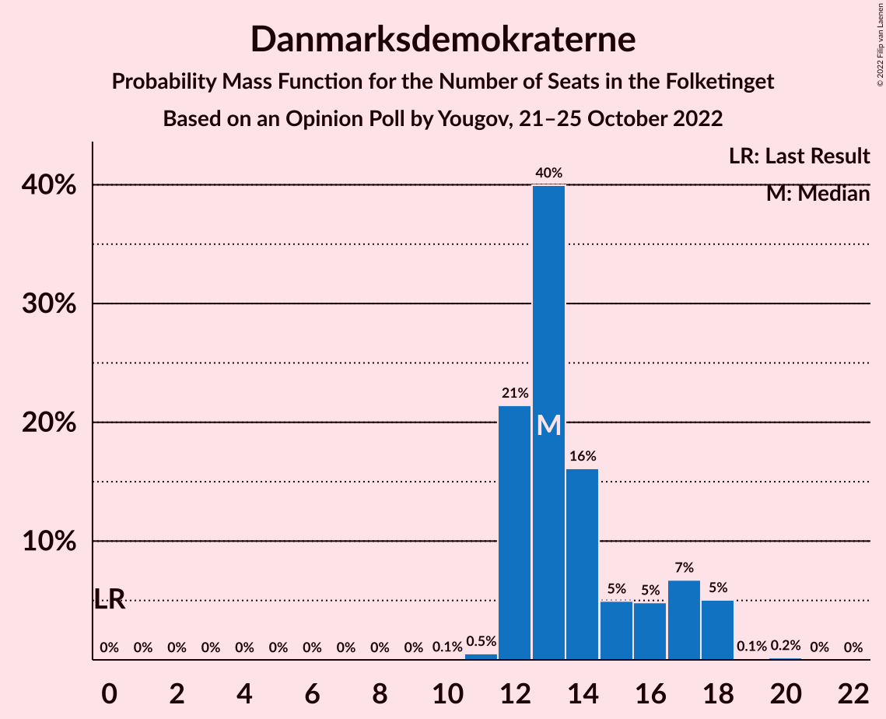

| Number of Seats | Probability | Accumulated | Special Marks |
|:---------------:|:-----------:|:-----------:|:-------------:|
| 0 | 0% | 100% | Last Result |
| 1 | 0% | 100% |  |
| 2 | 0% | 100% |  |
| 3 | 0% | 100% |  |
| 4 | 0% | 100% |  |
| 5 | 0% | 100% |  |
| 6 | 0% | 100% |  |
| 7 | 0% | 100% |  |
| 8 | 0% | 100% |  |
| 9 | 0% | 100% |  |
| 10 | 0.1% | 100% |  |
| 11 | 0.5% | 99.9% |  |
| 12 | 21% | 99.4% |  |
| 13 | 40% | 78% | Median |
| 14 | 16% | 38% |  |
| 15 | 5% | 22% |  |
| 16 | 5% | 17% |  |
| 17 | 7% | 12% |  |
| 18 | 5% | 5% |  |
| 19 | 0.1% | 0.3% |  |
| 20 | 0.2% | 0.2% |  |
| 21 | 0% | 0% |  |

### Socialistisk Folkeparti

*For a full overview of the results for this party, see the [Socialistisk Folkeparti](party-socialistiskfolkeparti.html) page.*

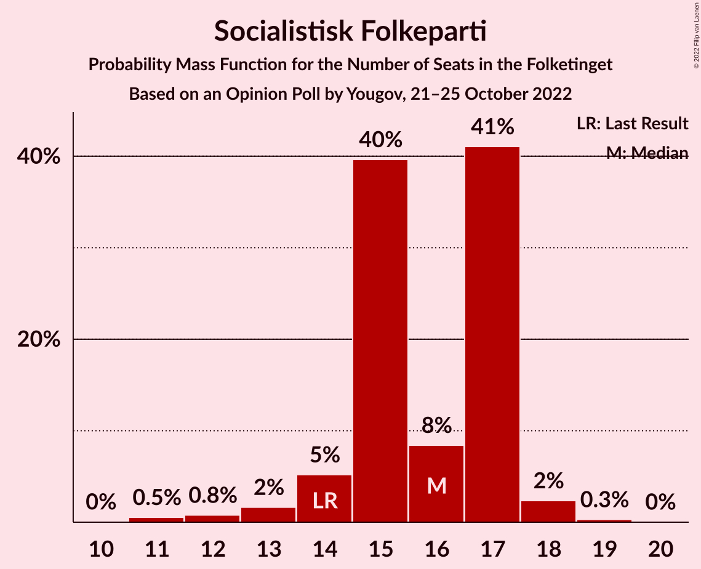

| Number of Seats | Probability | Accumulated | Special Marks |
|:---------------:|:-----------:|:-----------:|:-------------:|
| 11 | 0.5% | 100% |  |
| 12 | 0.8% | 99.4% |  |
| 13 | 2% | 98.6% |  |
| 14 | 5% | 97% | Last Result |
| 15 | 40% | 92% |  |
| 16 | 8% | 52% | Median |
| 17 | 41% | 44% |  |
| 18 | 2% | 3% |  |
| 19 | 0.3% | 0.3% |  |
| 20 | 0% | 0% |  |

### Liberal Alliance

*For a full overview of the results for this party, see the [Liberal Alliance](party-liberalalliance.html) page.*

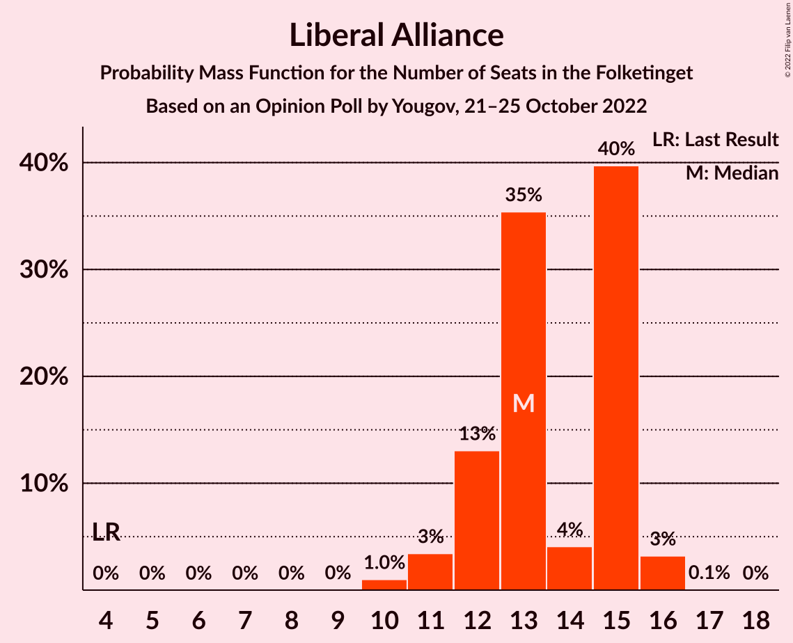

| Number of Seats | Probability | Accumulated | Special Marks |
|:---------------:|:-----------:|:-----------:|:-------------:|
| 4 | 0% | 100% | Last Result |
| 5 | 0% | 100% |  |
| 6 | 0% | 100% |  |
| 7 | 0% | 100% |  |
| 8 | 0% | 100% |  |
| 9 | 0% | 100% |  |
| 10 | 1.0% | 100% |  |
| 11 | 3% | 99.0% |  |
| 12 | 13% | 96% |  |
| 13 | 35% | 82% | Median |
| 14 | 4% | 47% |  |
| 15 | 40% | 43% |  |
| 16 | 3% | 3% |  |
| 17 | 0.1% | 0.1% |  |
| 18 | 0% | 0% |  |

### Enhedslisten–De Rød-Grønne

*For a full overview of the results for this party, see the [Enhedslisten–De Rød-Grønne](party-enhedslisten–derød-grønne.html) page.*

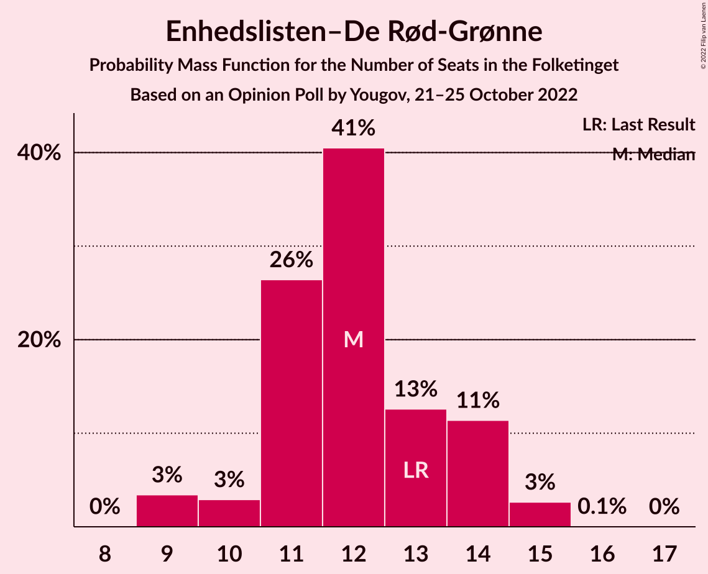

| Number of Seats | Probability | Accumulated | Special Marks |
|:---------------:|:-----------:|:-----------:|:-------------:|
| 9 | 3% | 100% |  |
| 10 | 3% | 97% |  |
| 11 | 26% | 94% |  |
| 12 | 41% | 67% | Median |
| 13 | 13% | 27% | Last Result |
| 14 | 11% | 14% |  |
| 15 | 3% | 3% |  |
| 16 | 0.1% | 0.1% |  |
| 17 | 0% | 0% |  |

### Det Konservative Folkeparti

*For a full overview of the results for this party, see the [Det Konservative Folkeparti](party-detkonservativefolkeparti.html) page.*

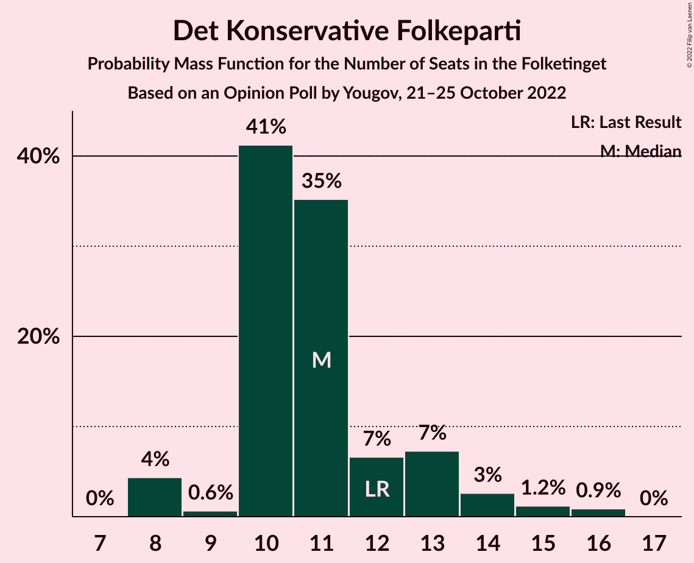

| Number of Seats | Probability | Accumulated | Special Marks |
|:---------------:|:-----------:|:-----------:|:-------------:|
| 8 | 4% | 100% |  |
| 9 | 0.6% | 96% |  |
| 10 | 41% | 95% |  |
| 11 | 35% | 54% | Median |
| 12 | 7% | 19% | Last Result |
| 13 | 7% | 12% |  |
| 14 | 3% | 5% |  |
| 15 | 1.2% | 2% |  |
| 16 | 0.9% | 0.9% |  |
| 17 | 0% | 0% |  |

### Nye Borgerlige

*For a full overview of the results for this party, see the [Nye Borgerlige](party-nyeborgerlige.html) page.*

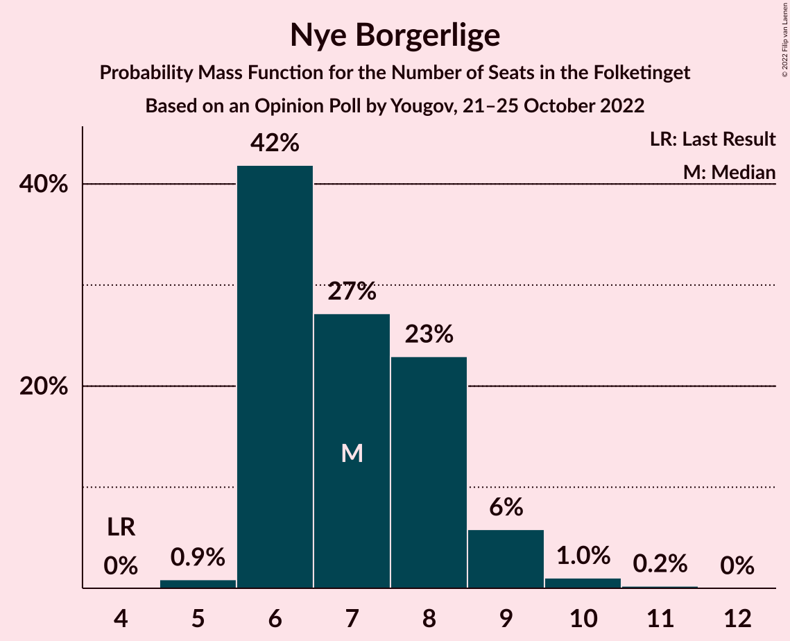

| Number of Seats | Probability | Accumulated | Special Marks |
|:---------------:|:-----------:|:-----------:|:-------------:|
| 4 | 0% | 100% | Last Result |
| 5 | 0.9% | 100% |  |
| 6 | 42% | 99.1% |  |
| 7 | 27% | 57% | Median |
| 8 | 23% | 30% |  |
| 9 | 6% | 7% |  |
| 10 | 1.0% | 1.3% |  |
| 11 | 0.2% | 0.3% |  |
| 12 | 0% | 0% |  |

### Radikale Venstre

*For a full overview of the results for this party, see the [Radikale Venstre](party-radikalevenstre.html) page.*

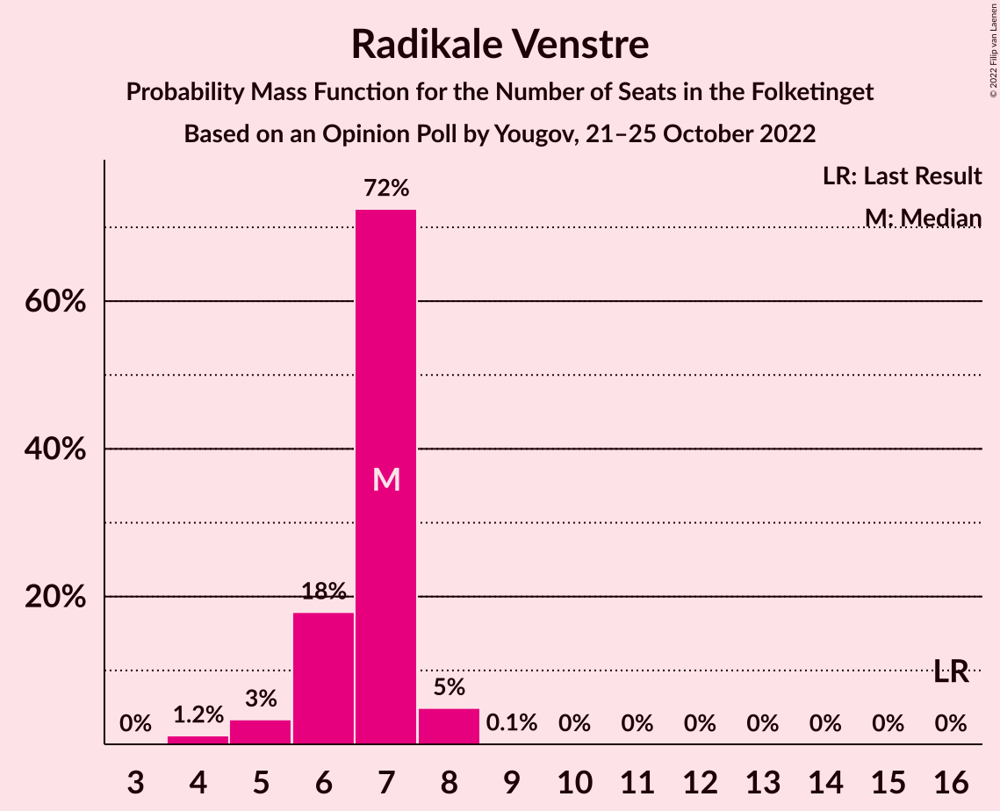

| Number of Seats | Probability | Accumulated | Special Marks |
|:---------------:|:-----------:|:-----------:|:-------------:|
| 4 | 1.2% | 100% |  |
| 5 | 3% | 98.8% |  |
| 6 | 18% | 95% |  |
| 7 | 72% | 78% | Median |
| 8 | 5% | 5% |  |
| 9 | 0.1% | 0.1% |  |
| 10 | 0% | 0% |  |
| 11 | 0% | 0% |  |
| 12 | 0% | 0% |  |
| 13 | 0% | 0% |  |
| 14 | 0% | 0% |  |
| 15 | 0% | 0% |  |
| 16 | 0% | 0% | Last Result |

### Dansk Folkeparti

*For a full overview of the results for this party, see the [Dansk Folkeparti](party-danskfolkeparti.html) page.*

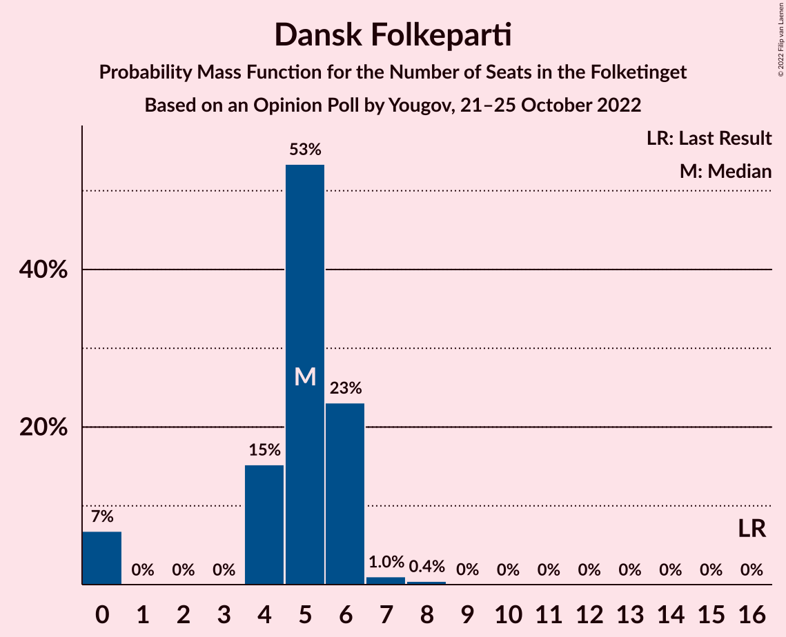

| Number of Seats | Probability | Accumulated | Special Marks |
|:---------------:|:-----------:|:-----------:|:-------------:|
| 0 | 7% | 100% |  |
| 1 | 0% | 93% |  |
| 2 | 0% | 93% |  |
| 3 | 0% | 93% |  |
| 4 | 15% | 93% |  |
| 5 | 53% | 78% | Median |
| 6 | 23% | 25% |  |
| 7 | 1.0% | 2% |  |
| 8 | 0.4% | 0.5% |  |
| 9 | 0% | 0% |  |
| 10 | 0% | 0% |  |
| 11 | 0% | 0% |  |
| 12 | 0% | 0% |  |
| 13 | 0% | 0% |  |
| 14 | 0% | 0% |  |
| 15 | 0% | 0% |  |
| 16 | 0% | 0% | Last Result |

### Alternativet

*For a full overview of the results for this party, see the [Alternativet](party-alternativet.html) page.*

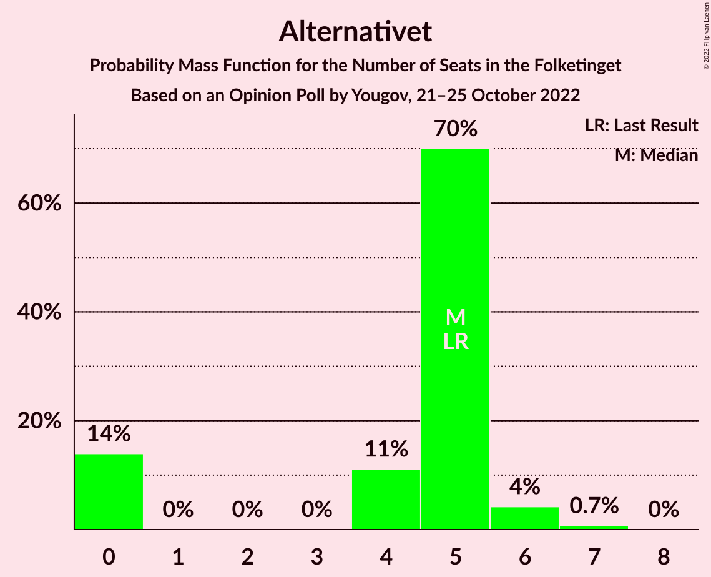

| Number of Seats | Probability | Accumulated | Special Marks |
|:---------------:|:-----------:|:-----------:|:-------------:|
| 0 | 14% | 100% |  |
| 1 | 0% | 86% |  |
| 2 | 0% | 86% |  |
| 3 | 0% | 86% |  |
| 4 | 11% | 86% |  |
| 5 | 70% | 75% | Last Result, Median |
| 6 | 4% | 5% |  |
| 7 | 0.7% | 0.7% |  |
| 8 | 0% | 0% |  |

### Frie Grønne

*For a full overview of the results for this party, see the [Frie Grønne](party-friegrønne.html) page.*

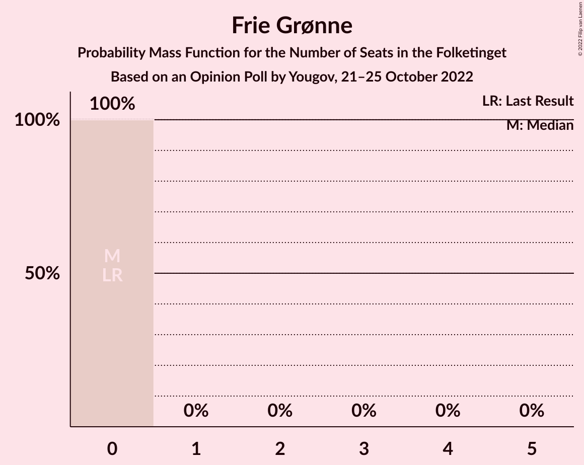

| Number of Seats | Probability | Accumulated | Special Marks |
|:---------------:|:-----------:|:-----------:|:-------------:|
| 0 | 100% | 100% | Last Result, Median |

### Kristendemokraterne

*For a full overview of the results for this party, see the [Kristendemokraterne](party-kristendemokraterne.html) page.*

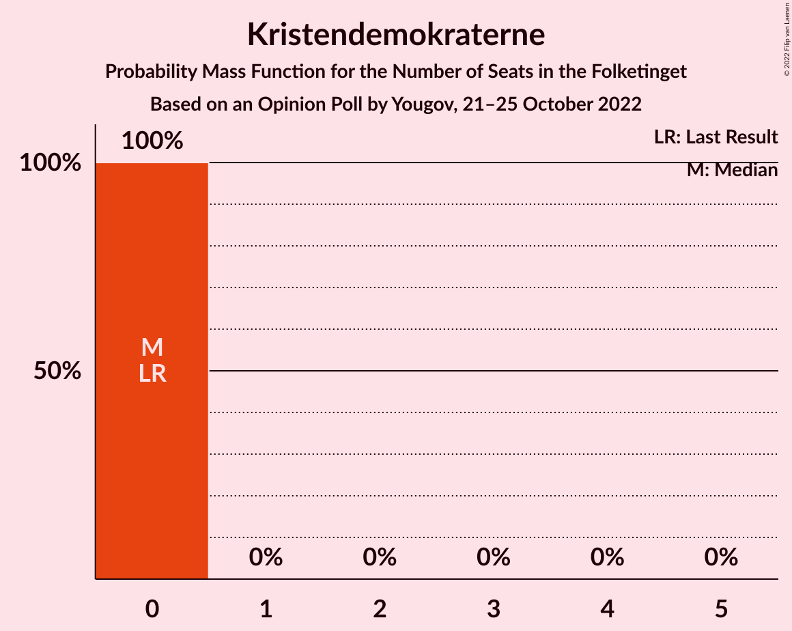

| Number of Seats | Probability | Accumulated | Special Marks |
|:---------------:|:-----------:|:-----------:|:-------------:|
| 0 | 100% | 100% | Last Result, Median |

## Coalitions

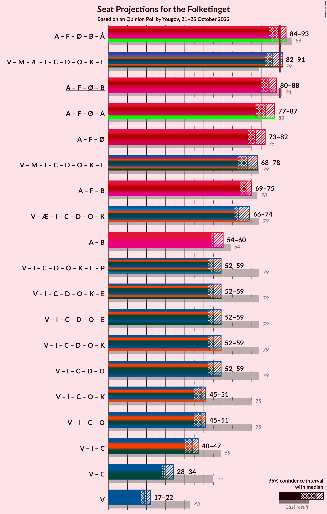

### Confidence Intervals

| Coalition | Last Result | Median | Majority? | 80% Confidence Interval | 90% Confidence Interval | 95% Confidence Interval | 99% Confidence Interval |
|:---------:|:-----------:|:------:|:---------:|:-----------------------:|:-----------------------:|:-----------------------:|:-----------------------:|
| Socialdemokraterne – Socialistisk Folkeparti – Enhedslisten–De Rød-Grønne – Radikale Venstre – Alternativet | 96 | 89 | 15% | 84–93 | 84–93 | 84–93 | 81–93 |
| Socialdemokraterne – Socialistisk Folkeparti – Enhedslisten–De Rød-Grønne – Radikale Venstre | 91 | 84 | 0.9% | 80–88 | 80–88 | 80–88 | 79–90 |
| Socialdemokraterne – Socialistisk Folkeparti – Enhedslisten–De Rød-Grønne – Alternativet | 80 | 82 | 0% | 78–87 | 77–87 | 77–87 | 75–87 |
| Socialdemokraterne – Socialistisk Folkeparti – Enhedslisten–De Rød-Grønne | 75 | 77 | 0% | 73–82 | 73–82 | 73–82 | 73–84 |
| Socialdemokraterne – Socialistisk Folkeparti – Radikale Venstre | 78 | 72 | 0% | 69–74 | 69–74 | 69–75 | 67–78 |
| Venstre – Danmarksdemokraterne – Liberal Alliance – Det Konservative Folkeparti – Nye Borgerlige – Dansk Folkeparti – Kristendemokraterne | 79 | 68 | 0% | 66–73 | 66–74 | 66–74 | 64–76 |
| Socialdemokraterne – Radikale Venstre | 64 | 55 | 0% | 54–59 | 54–59 | 54–60 | 52–64 |
| Venstre – Liberal Alliance – Det Konservative Folkeparti – Nye Borgerlige – Dansk Folkeparti – Kristendemokraterne | 79 | 55 | 0% | 52–59 | 52–59 | 52–59 | 50–60 |
| Venstre – Liberal Alliance – Det Konservative Folkeparti – Nye Borgerlige – Dansk Folkeparti | 79 | 55 | 0% | 52–59 | 52–59 | 52–59 | 50–60 |
| Venstre – Liberal Alliance – Det Konservative Folkeparti – Dansk Folkeparti – Kristendemokraterne | 75 | 49 | 0% | 45–51 | 45–51 | 45–51 | 43–53 |
| Venstre – Liberal Alliance – Det Konservative Folkeparti – Dansk Folkeparti | 75 | 49 | 0% | 45–51 | 45–51 | 45–51 | 43–53 |
| Venstre – Liberal Alliance – Det Konservative Folkeparti | 59 | 44 | 0% | 41–45 | 41–47 | 40–47 | 38–49 |
| Venstre – Det Konservative Folkeparti | 55 | 29 | 0% | 29–32 | 28–34 | 28–34 | 25–37 |
| Venstre | 43 | 19 | 0% | 18–21 | 17–22 | 17–22 | 15–23 |

### Socialdemokraterne – Socialistisk Folkeparti – Enhedslisten–De Rød-Grønne – Radikale Venstre – Alternativet

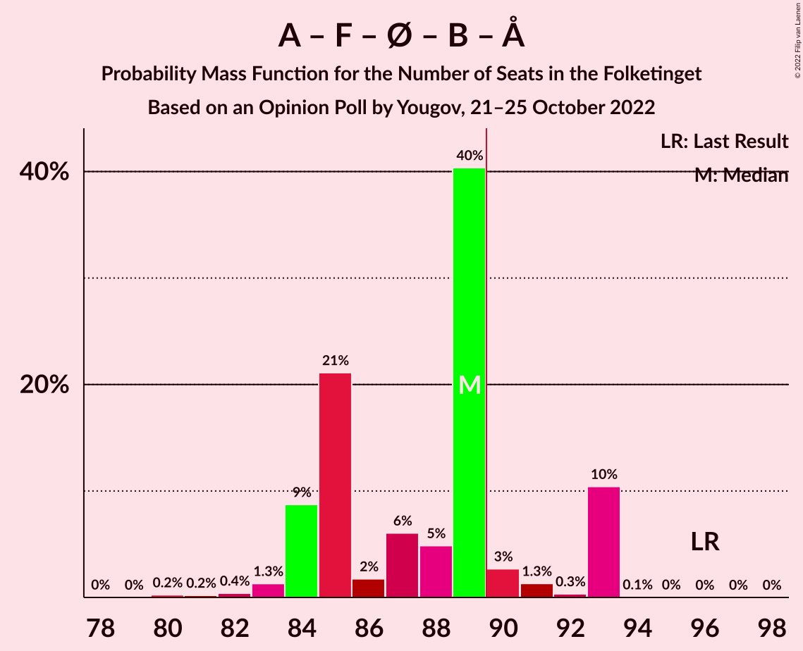

| Number of Seats | Probability | Accumulated | Special Marks |
|:---------------:|:-----------:|:-----------:|:-------------:|
| 79 | 0% | 100% |  |
| 80 | 0.2% | 99.9% |  |
| 81 | 0.2% | 99.7% |  |
| 82 | 0.4% | 99.5% |  |
| 83 | 1.3% | 99.1% |  |
| 84 | 9% | 98% |  |
| 85 | 21% | 89% |  |
| 86 | 2% | 68% |  |
| 87 | 6% | 66% |  |
| 88 | 5% | 60% | Median |
| 89 | 40% | 55% |  |
| 90 | 3% | 15% | Majority |
| 91 | 1.3% | 12% |  |
| 92 | 0.3% | 11% |  |
| 93 | 10% | 11% |  |
| 94 | 0.1% | 0.1% |  |
| 95 | 0% | 0.1% |  |
| 96 | 0% | 0.1% | Last Result |
| 97 | 0% | 0% |  |

### Socialdemokraterne – Socialistisk Folkeparti – Enhedslisten–De Rød-Grønne – Radikale Venstre

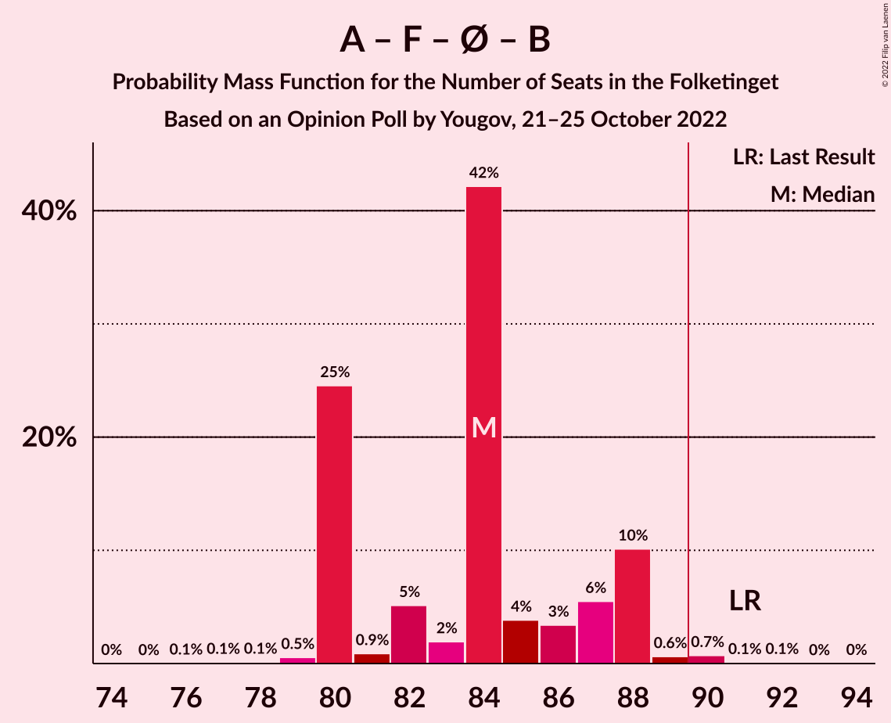

| Number of Seats | Probability | Accumulated | Special Marks |
|:---------------:|:-----------:|:-----------:|:-------------:|
| 76 | 0.1% | 100% |  |
| 77 | 0.1% | 99.9% |  |
| 78 | 0.1% | 99.8% |  |
| 79 | 0.5% | 99.7% |  |
| 80 | 25% | 99.1% |  |
| 81 | 0.9% | 75% |  |
| 82 | 5% | 74% |  |
| 83 | 2% | 69% | Median |
| 84 | 42% | 67% |  |
| 85 | 4% | 24% |  |
| 86 | 3% | 21% |  |
| 87 | 6% | 17% |  |
| 88 | 10% | 12% |  |
| 89 | 0.6% | 2% |  |
| 90 | 0.7% | 0.9% | Majority |
| 91 | 0.1% | 0.2% | Last Result |
| 92 | 0.1% | 0.1% |  |
| 93 | 0% | 0% |  |

### Socialdemokraterne – Socialistisk Folkeparti – Enhedslisten–De Rød-Grønne – Alternativet

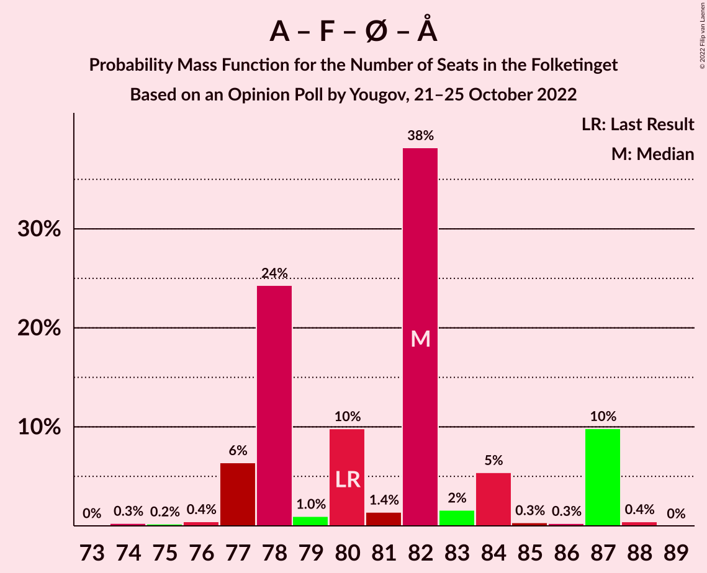

| Number of Seats | Probability | Accumulated | Special Marks |
|:---------------:|:-----------:|:-----------:|:-------------:|
| 73 | 0% | 100% |  |
| 74 | 0.3% | 99.9% |  |
| 75 | 0.2% | 99.7% |  |
| 76 | 0.4% | 99.4% |  |
| 77 | 6% | 99.0% |  |
| 78 | 24% | 93% |  |
| 79 | 1.0% | 68% |  |
| 80 | 10% | 67% | Last Result |
| 81 | 1.4% | 58% | Median |
| 82 | 38% | 56% |  |
| 83 | 2% | 18% |  |
| 84 | 5% | 16% |  |
| 85 | 0.3% | 11% |  |
| 86 | 0.3% | 11% |  |
| 87 | 10% | 10% |  |
| 88 | 0.4% | 0.5% |  |
| 89 | 0% | 0% |  |

### Socialdemokraterne – Socialistisk Folkeparti – Enhedslisten–De Rød-Grønne

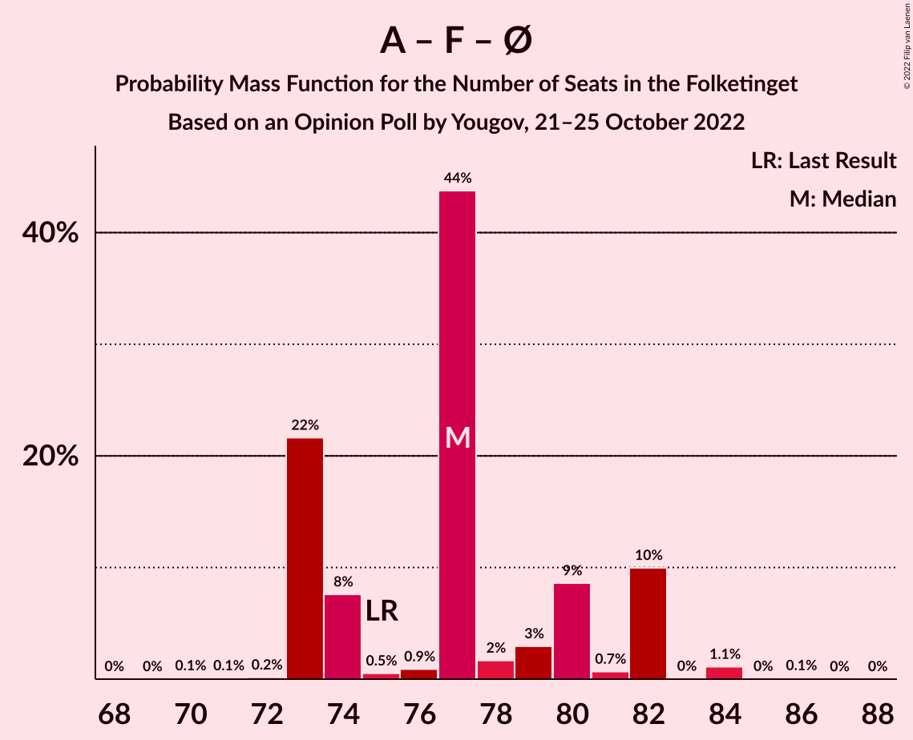

| Number of Seats | Probability | Accumulated | Special Marks |
|:---------------:|:-----------:|:-----------:|:-------------:|
| 70 | 0.1% | 100% |  |
| 71 | 0.1% | 99.9% |  |
| 72 | 0.2% | 99.8% |  |
| 73 | 22% | 99.6% |  |
| 74 | 8% | 78% |  |
| 75 | 0.5% | 70% | Last Result |
| 76 | 0.9% | 70% | Median |
| 77 | 44% | 69% |  |
| 78 | 2% | 25% |  |
| 79 | 3% | 24% |  |
| 80 | 9% | 21% |  |
| 81 | 0.7% | 12% |  |
| 82 | 10% | 11% |  |
| 83 | 0% | 1.3% |  |
| 84 | 1.1% | 1.3% |  |
| 85 | 0% | 0.2% |  |
| 86 | 0.1% | 0.1% |  |
| 87 | 0% | 0% |  |

### Socialdemokraterne – Socialistisk Folkeparti – Radikale Venstre

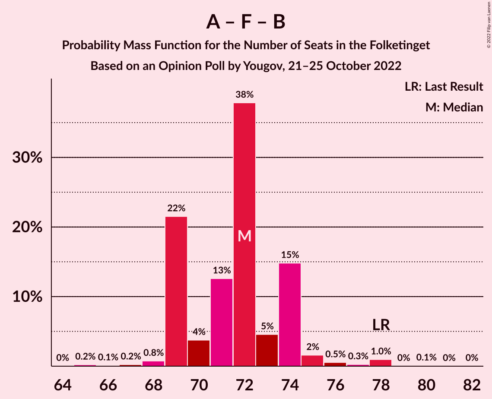

| Number of Seats | Probability | Accumulated | Special Marks |
|:---------------:|:-----------:|:-----------:|:-------------:|
| 64 | 0% | 100% |  |
| 65 | 0.2% | 99.9% |  |
| 66 | 0.1% | 99.7% |  |
| 67 | 0.2% | 99.6% |  |
| 68 | 0.8% | 99.4% |  |
| 69 | 22% | 98.6% |  |
| 70 | 4% | 77% |  |
| 71 | 13% | 73% | Median |
| 72 | 38% | 61% |  |
| 73 | 5% | 23% |  |
| 74 | 15% | 18% |  |
| 75 | 2% | 4% |  |
| 76 | 0.5% | 2% |  |
| 77 | 0.3% | 1.4% |  |
| 78 | 1.0% | 1.1% | Last Result |
| 79 | 0% | 0.2% |  |
| 80 | 0.1% | 0.1% |  |
| 81 | 0% | 0% |  |

### Venstre – Danmarksdemokraterne – Liberal Alliance – Det Konservative Folkeparti – Nye Borgerlige – Dansk Folkeparti – Kristendemokraterne

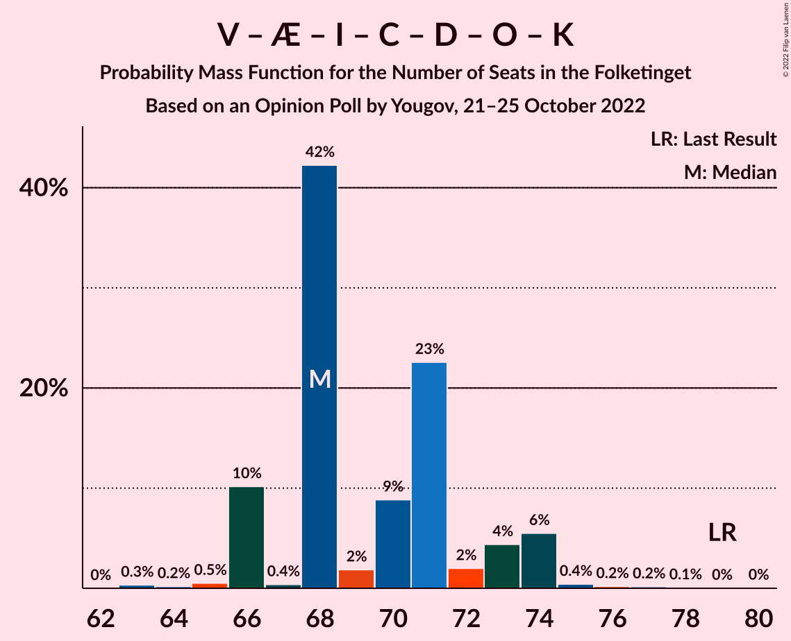

| Number of Seats | Probability | Accumulated | Special Marks |
|:---------------:|:-----------:|:-----------:|:-------------:|
| 63 | 0.3% | 100% |  |
| 64 | 0.2% | 99.6% |  |
| 65 | 0.5% | 99.4% |  |
| 66 | 10% | 98.9% |  |
| 67 | 0.4% | 89% |  |
| 68 | 42% | 88% | Median |
| 69 | 2% | 46% |  |
| 70 | 9% | 44% |  |
| 71 | 23% | 35% |  |
| 72 | 2% | 13% |  |
| 73 | 4% | 11% |  |
| 74 | 6% | 6% |  |
| 75 | 0.4% | 0.9% |  |
| 76 | 0.2% | 0.5% |  |
| 77 | 0.2% | 0.3% |  |
| 78 | 0.1% | 0.1% |  |
| 79 | 0% | 0.1% | Last Result |
| 80 | 0% | 0% |  |

### Socialdemokraterne – Radikale Venstre

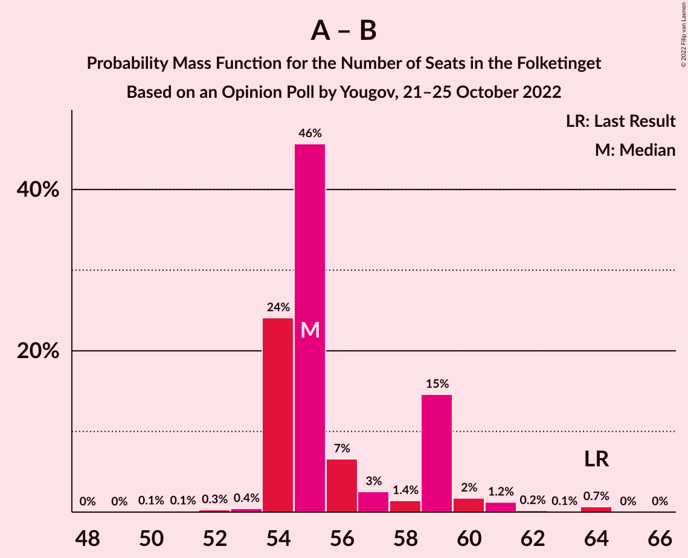

| Number of Seats | Probability | Accumulated | Special Marks |
|:---------------:|:-----------:|:-----------:|:-------------:|
| 50 | 0.1% | 100% |  |
| 51 | 0.1% | 99.8% |  |
| 52 | 0.3% | 99.7% |  |
| 53 | 0.4% | 99.4% |  |
| 54 | 24% | 98.9% |  |
| 55 | 46% | 75% | Median |
| 56 | 7% | 29% |  |
| 57 | 3% | 23% |  |
| 58 | 1.4% | 20% |  |
| 59 | 15% | 19% |  |
| 60 | 2% | 4% |  |
| 61 | 1.2% | 2% |  |
| 62 | 0.2% | 1.0% |  |
| 63 | 0.1% | 0.8% |  |
| 64 | 0.7% | 0.8% | Last Result |
| 65 | 0% | 0.1% |  |
| 66 | 0% | 0% |  |

### Venstre – Liberal Alliance – Det Konservative Folkeparti – Nye Borgerlige – Dansk Folkeparti – Kristendemokraterne

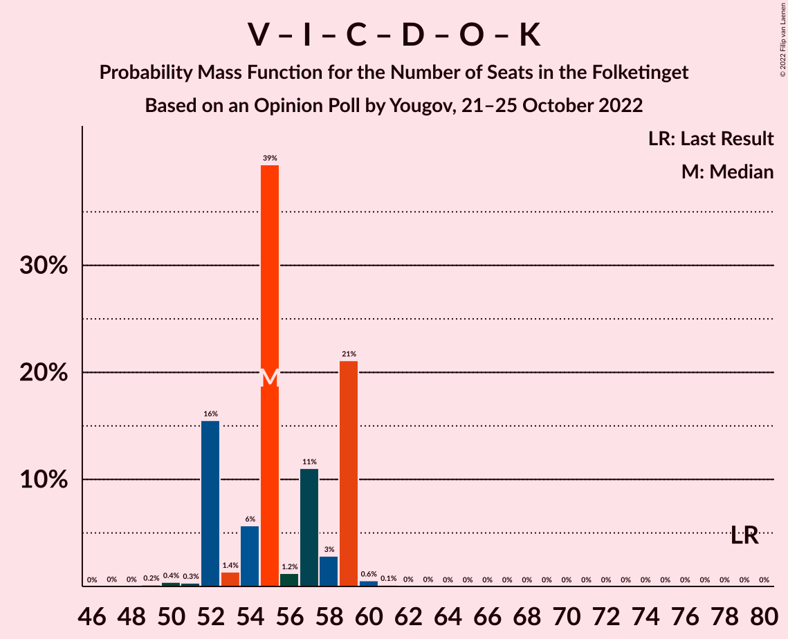

| Number of Seats | Probability | Accumulated | Special Marks |
|:---------------:|:-----------:|:-----------:|:-------------:|
| 47 | 0% | 100% |  |
| 48 | 0% | 99.9% |  |
| 49 | 0.2% | 99.9% |  |
| 50 | 0.4% | 99.7% |  |
| 51 | 0.3% | 99.3% |  |
| 52 | 16% | 99.0% |  |
| 53 | 1.4% | 83% |  |
| 54 | 6% | 82% |  |
| 55 | 39% | 76% | Median |
| 56 | 1.2% | 37% |  |
| 57 | 11% | 36% |  |
| 58 | 3% | 25% |  |
| 59 | 21% | 22% |  |
| 60 | 0.6% | 0.8% |  |
| 61 | 0.1% | 0.2% |  |
| 62 | 0% | 0.1% |  |
| 63 | 0% | 0% |  |
| 64 | 0% | 0% |  |
| 65 | 0% | 0% |  |
| 66 | 0% | 0% |  |
| 67 | 0% | 0% |  |
| 68 | 0% | 0% |  |
| 69 | 0% | 0% |  |
| 70 | 0% | 0% |  |
| 71 | 0% | 0% |  |
| 72 | 0% | 0% |  |
| 73 | 0% | 0% |  |
| 74 | 0% | 0% |  |
| 75 | 0% | 0% |  |
| 76 | 0% | 0% |  |
| 77 | 0% | 0% |  |
| 78 | 0% | 0% |  |
| 79 | 0% | 0% | Last Result |

### Venstre – Liberal Alliance – Det Konservative Folkeparti – Nye Borgerlige – Dansk Folkeparti

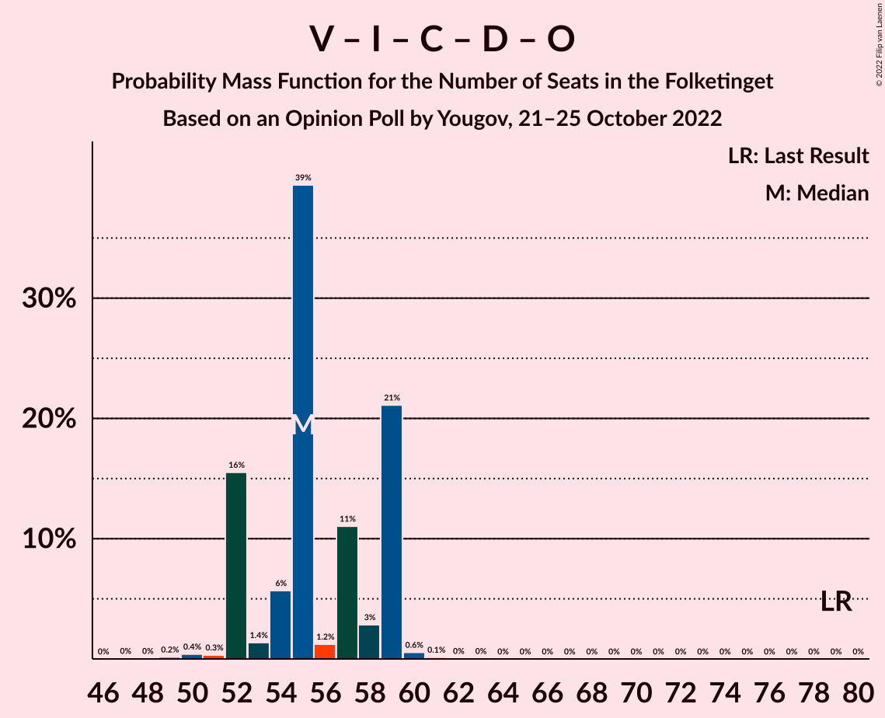

| Number of Seats | Probability | Accumulated | Special Marks |
|:---------------:|:-----------:|:-----------:|:-------------:|
| 47 | 0% | 100% |  |
| 48 | 0% | 99.9% |  |
| 49 | 0.2% | 99.9% |  |
| 50 | 0.4% | 99.7% |  |
| 51 | 0.3% | 99.3% |  |
| 52 | 16% | 99.0% |  |
| 53 | 1.4% | 83% |  |
| 54 | 6% | 82% |  |
| 55 | 39% | 76% | Median |
| 56 | 1.2% | 37% |  |
| 57 | 11% | 36% |  |
| 58 | 3% | 25% |  |
| 59 | 21% | 22% |  |
| 60 | 0.6% | 0.8% |  |
| 61 | 0.1% | 0.2% |  |
| 62 | 0% | 0.1% |  |
| 63 | 0% | 0% |  |
| 64 | 0% | 0% |  |
| 65 | 0% | 0% |  |
| 66 | 0% | 0% |  |
| 67 | 0% | 0% |  |
| 68 | 0% | 0% |  |
| 69 | 0% | 0% |  |
| 70 | 0% | 0% |  |
| 71 | 0% | 0% |  |
| 72 | 0% | 0% |  |
| 73 | 0% | 0% |  |
| 74 | 0% | 0% |  |
| 75 | 0% | 0% |  |
| 76 | 0% | 0% |  |
| 77 | 0% | 0% |  |
| 78 | 0% | 0% |  |
| 79 | 0% | 0% | Last Result |

### Venstre – Liberal Alliance – Det Konservative Folkeparti – Dansk Folkeparti – Kristendemokraterne

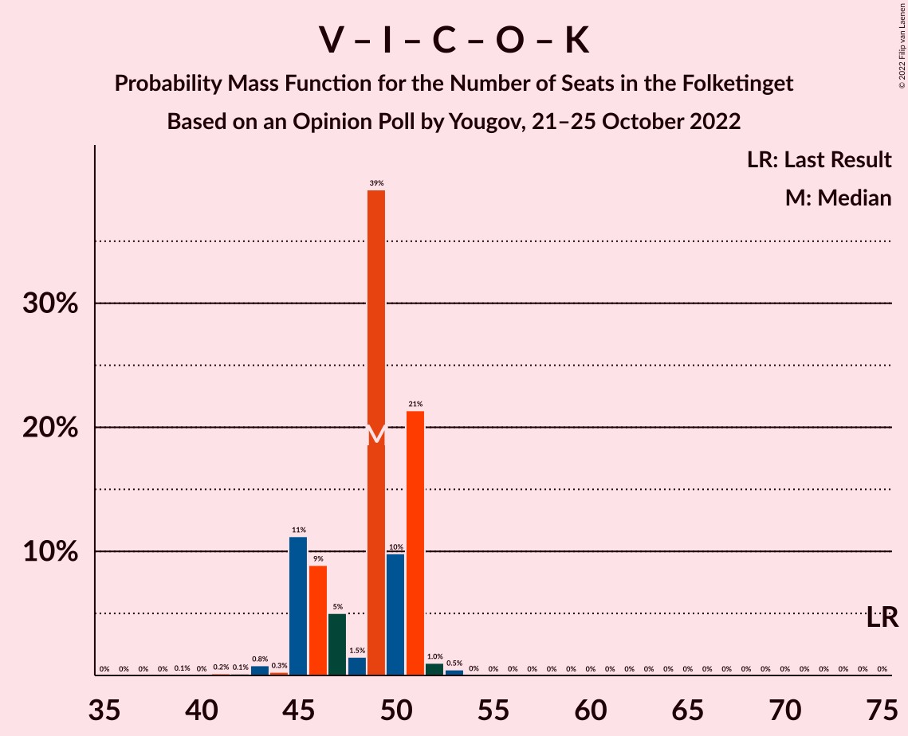

| Number of Seats | Probability | Accumulated | Special Marks |
|:---------------:|:-----------:|:-----------:|:-------------:|
| 39 | 0.1% | 100% |  |
| 40 | 0% | 99.9% |  |
| 41 | 0.2% | 99.9% |  |
| 42 | 0.1% | 99.8% |  |
| 43 | 0.8% | 99.6% |  |
| 44 | 0.3% | 98.8% |  |
| 45 | 11% | 98.5% |  |
| 46 | 9% | 87% |  |
| 47 | 5% | 78% |  |
| 48 | 1.5% | 73% | Median |
| 49 | 39% | 72% |  |
| 50 | 10% | 33% |  |
| 51 | 21% | 23% |  |
| 52 | 1.0% | 2% |  |
| 53 | 0.5% | 0.5% |  |
| 54 | 0% | 0.1% |  |
| 55 | 0% | 0% |  |
| 56 | 0% | 0% |  |
| 57 | 0% | 0% |  |
| 58 | 0% | 0% |  |
| 59 | 0% | 0% |  |
| 60 | 0% | 0% |  |
| 61 | 0% | 0% |  |
| 62 | 0% | 0% |  |
| 63 | 0% | 0% |  |
| 64 | 0% | 0% |  |
| 65 | 0% | 0% |  |
| 66 | 0% | 0% |  |
| 67 | 0% | 0% |  |
| 68 | 0% | 0% |  |
| 69 | 0% | 0% |  |
| 70 | 0% | 0% |  |
| 71 | 0% | 0% |  |
| 72 | 0% | 0% |  |
| 73 | 0% | 0% |  |
| 74 | 0% | 0% |  |
| 75 | 0% | 0% | Last Result |

### Venstre – Liberal Alliance – Det Konservative Folkeparti – Dansk Folkeparti

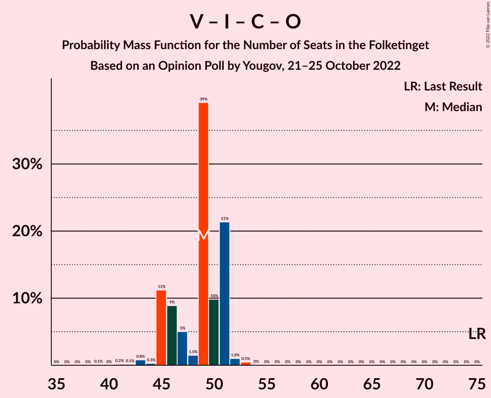

| Number of Seats | Probability | Accumulated | Special Marks |
|:---------------:|:-----------:|:-----------:|:-------------:|
| 39 | 0.1% | 100% |  |
| 40 | 0% | 99.9% |  |
| 41 | 0.2% | 99.9% |  |
| 42 | 0.1% | 99.8% |  |
| 43 | 0.8% | 99.6% |  |
| 44 | 0.3% | 98.8% |  |
| 45 | 11% | 98.5% |  |
| 46 | 9% | 87% |  |
| 47 | 5% | 78% |  |
| 48 | 1.5% | 73% | Median |
| 49 | 39% | 72% |  |
| 50 | 10% | 33% |  |
| 51 | 21% | 23% |  |
| 52 | 1.0% | 2% |  |
| 53 | 0.5% | 0.5% |  |
| 54 | 0% | 0.1% |  |
| 55 | 0% | 0% |  |
| 56 | 0% | 0% |  |
| 57 | 0% | 0% |  |
| 58 | 0% | 0% |  |
| 59 | 0% | 0% |  |
| 60 | 0% | 0% |  |
| 61 | 0% | 0% |  |
| 62 | 0% | 0% |  |
| 63 | 0% | 0% |  |
| 64 | 0% | 0% |  |
| 65 | 0% | 0% |  |
| 66 | 0% | 0% |  |
| 67 | 0% | 0% |  |
| 68 | 0% | 0% |  |
| 69 | 0% | 0% |  |
| 70 | 0% | 0% |  |
| 71 | 0% | 0% |  |
| 72 | 0% | 0% |  |
| 73 | 0% | 0% |  |
| 74 | 0% | 0% |  |
| 75 | 0% | 0% | Last Result |

### Venstre – Liberal Alliance – Det Konservative Folkeparti

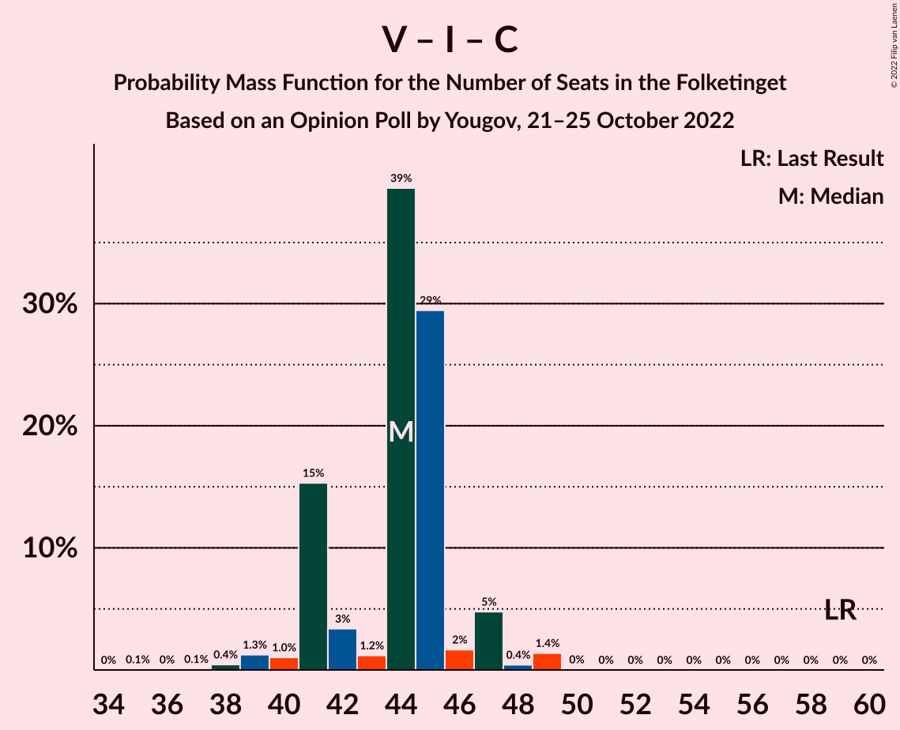

| Number of Seats | Probability | Accumulated | Special Marks |
|:---------------:|:-----------:|:-----------:|:-------------:|
| 35 | 0.1% | 100% |  |
| 36 | 0% | 99.9% |  |
| 37 | 0.1% | 99.9% |  |
| 38 | 0.4% | 99.8% |  |
| 39 | 1.3% | 99.4% |  |
| 40 | 1.0% | 98% |  |
| 41 | 15% | 97% |  |
| 42 | 3% | 82% |  |
| 43 | 1.2% | 78% | Median |
| 44 | 39% | 77% |  |
| 45 | 29% | 38% |  |
| 46 | 2% | 8% |  |
| 47 | 5% | 7% |  |
| 48 | 0.4% | 2% |  |
| 49 | 1.4% | 1.4% |  |
| 50 | 0% | 0.1% |  |
| 51 | 0% | 0% |  |
| 52 | 0% | 0% |  |
| 53 | 0% | 0% |  |
| 54 | 0% | 0% |  |
| 55 | 0% | 0% |  |
| 56 | 0% | 0% |  |
| 57 | 0% | 0% |  |
| 58 | 0% | 0% |  |
| 59 | 0% | 0% | Last Result |

### Venstre – Det Konservative Folkeparti

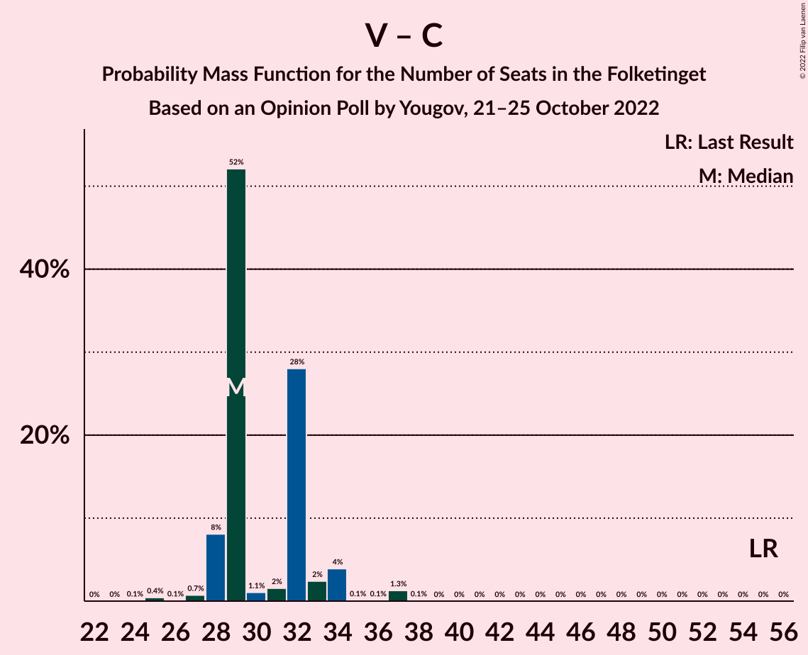

| Number of Seats | Probability | Accumulated | Special Marks |
|:---------------:|:-----------:|:-----------:|:-------------:|
| 24 | 0.1% | 100% |  |
| 25 | 0.4% | 99.9% |  |
| 26 | 0.1% | 99.5% |  |
| 27 | 0.7% | 99.4% |  |
| 28 | 8% | 98.7% |  |
| 29 | 52% | 91% |  |
| 30 | 1.1% | 38% | Median |
| 31 | 2% | 37% |  |
| 32 | 28% | 36% |  |
| 33 | 2% | 8% |  |
| 34 | 4% | 5% |  |
| 35 | 0.1% | 2% |  |
| 36 | 0.1% | 1.4% |  |
| 37 | 1.3% | 1.4% |  |
| 38 | 0.1% | 0.1% |  |
| 39 | 0% | 0% |  |
| 40 | 0% | 0% |  |
| 41 | 0% | 0% |  |
| 42 | 0% | 0% |  |
| 43 | 0% | 0% |  |
| 44 | 0% | 0% |  |
| 45 | 0% | 0% |  |
| 46 | 0% | 0% |  |
| 47 | 0% | 0% |  |
| 48 | 0% | 0% |  |
| 49 | 0% | 0% |  |
| 50 | 0% | 0% |  |
| 51 | 0% | 0% |  |
| 52 | 0% | 0% |  |
| 53 | 0% | 0% |  |
| 54 | 0% | 0% |  |
| 55 | 0% | 0% | Last Result |

### Venstre

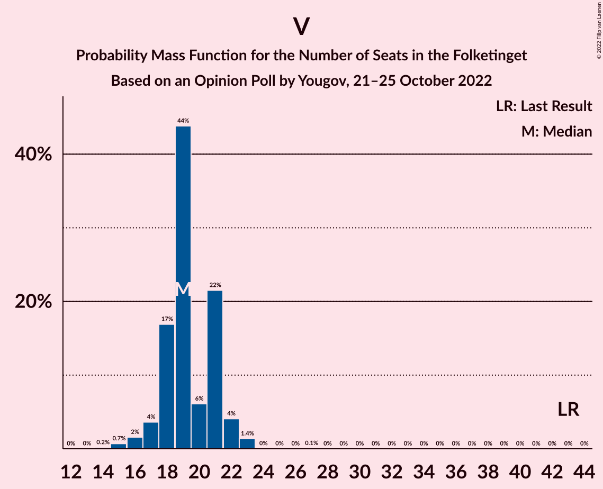

| Number of Seats | Probability | Accumulated | Special Marks |
|:---------------:|:-----------:|:-----------:|:-------------:|
| 14 | 0.2% | 100% |  |
| 15 | 0.7% | 99.8% |  |
| 16 | 2% | 99.1% |  |
| 17 | 4% | 98% |  |
| 18 | 17% | 94% |  |
| 19 | 44% | 77% | Median |
| 20 | 6% | 33% |  |
| 21 | 22% | 27% |  |
| 22 | 4% | 6% |  |
| 23 | 1.4% | 1.5% |  |
| 24 | 0% | 0.1% |  |
| 25 | 0% | 0.1% |  |
| 26 | 0% | 0.1% |  |
| 27 | 0.1% | 0.1% |  |
| 28 | 0% | 0% |  |
| 29 | 0% | 0% |  |
| 30 | 0% | 0% |  |
| 31 | 0% | 0% |  |
| 32 | 0% | 0% |  |
| 33 | 0% | 0% |  |
| 34 | 0% | 0% |  |
| 35 | 0% | 0% |  |
| 36 | 0% | 0% |  |
| 37 | 0% | 0% |  |
| 38 | 0% | 0% |  |
| 39 | 0% | 0% |  |
| 40 | 0% | 0% |  |
| 41 | 0% | 0% |  |
| 42 | 0% | 0% |  |
| 43 | 0% | 0% | Last Result |

## Technical Information

### Opinion Poll

+ **Polling firm:** Yougov
+ **Commissioner(s):** —
+ **Fieldwork period:** 21–25 October 2022

### Calculations

+ **Sample size:** 1261
+ **Simulations done:** 1,048,576
+ **Error estimate:** 1.48%

