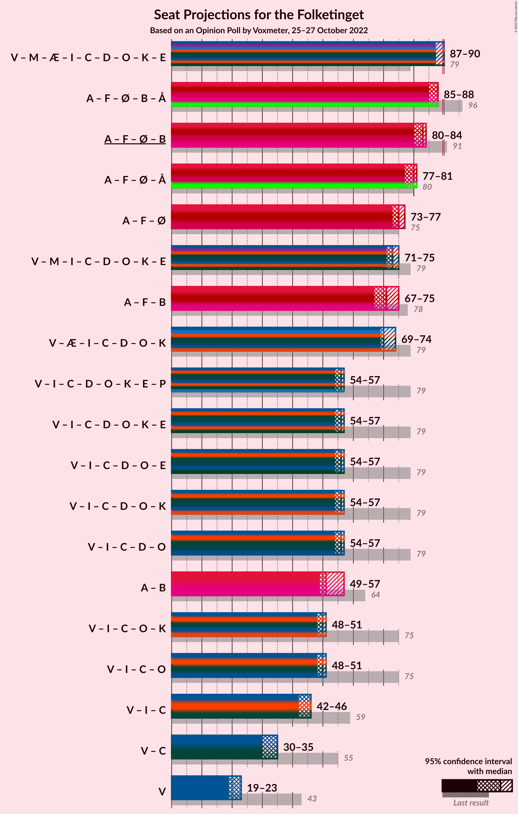
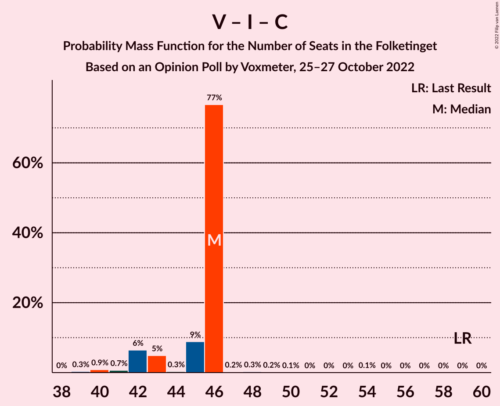

# Opinion Poll by Voxmeter, 25–27 October 2022

<a href="#voting-intentions">Voting Intentions</a> | <a href="#seats">Seats</a> | <a href="#coalitions">Coalitions</a> | <a href="#technical-information">Technical Information</a>

## Voting Intentions

### Confidence Intervals

| Party | Last Result | Poll Result | 80% Confidence Interval | 90% Confidence Interval | 95% Confidence Interval | 99% Confidence Interval |
|:-----:|:-----------:|:-----------:|:-----------------------:|:-----------------------:|:-----------------------:|:-----------------------:|
| Socialdemokraterne | 25.9% | 26.2% | 24.4–28.0% |24.0–28.5% |23.5–29.0% |22.7–29.9% |
| Venstre | 23.4% | 12.5% | 11.2–13.9% |10.9–14.3% |10.6–14.7% |10.0–15.4% |
| Moderaterne | 0.0% | 10.0% | 8.9–11.3% |8.6–11.7% |8.3–12.0% |7.8–12.7% |
| Socialistisk Folkeparti | 7.7% | 9.8% | 8.7–11.1% |8.4–11.5% |8.1–11.8% |7.6–12.5% |
| Danmarksdemokraterne | 0.0% | 8.8% | 7.7–10.0% |7.4–10.4% |7.2–10.7% |6.7–11.3% |
| Liberal Alliance | 2.3% | 6.8% | 5.9–7.9% |5.6–8.2% |5.4–8.5% |5.0–9.1% |
| Enhedslisten–De Rød-Grønne | 6.9% | 6.0% | 5.1–7.1% |4.9–7.4% |4.7–7.7% |4.3–8.2% |
| Det Konservative Folkeparti | 6.6% | 5.9% | 5.0–7.0% |4.8–7.3% |4.6–7.5% |4.2–8.1% |
| Radikale Venstre | 8.6% | 4.1% | 3.4–5.0% |3.2–5.3% |3.0–5.5% |2.7–6.0% |
| Nye Borgerlige | 2.4% | 3.7% | 3.0–4.6% |2.9–4.8% |2.7–5.1% |2.4–5.5% |
| Dansk Folkeparti | 8.7% | 3.0% | 2.4–3.8% |2.2–4.0% |2.1–4.3% |1.9–4.7% |
| Alternativet | 3.0% | 2.2% | 1.7–2.9% |1.6–3.1% |1.4–3.3% |1.2–3.7% |
| Frie Grønne | 0.0% | 0.8% | 0.5–1.3% |0.5–1.4% |0.4–1.6% |0.3–1.8% |
| Kristendemokraterne | 1.7% | 0.2% | 0.1–0.5% |0.1–0.6% |0.1–0.7% |0.0–0.9% |

*Note:* The poll result column reflects the actual value used in the calculations. Published results may vary slightly, and in addition be rounded to fewer digits.

## Seats

### Confidence Intervals

| Party | Last Result | Median | 80% Confidence Interval | 90% Confidence Interval | 95% Confidence Interval | 99% Confidence Interval |
|:-----:|:-----------:|:------:|:-----------------------:|:-----------------------:|:-----------------------:|:-----------------------:|
| <a href="#socialdemokraterne">Socialdemokraterne</a> | 48 | 43 | 43–45 |42–48 |42–50 |42–51 |
| <a href="#venstre">Venstre</a> | 43 | 23 | 22–23 |21–23 |19–23 |18–24 |
| <a href="#moderaterne">Moderaterne</a> | 0 | 17 | 15–17 |15–17 |14–18 |14–21 |
| <a href="#socialistisk-folkeparti">Socialistisk Folkeparti</a> | 14 | 20 | 18–20 |17–20 |16–21 |14–21 |
| <a href="#danmarksdemokraterne">Danmarksdemokraterne</a> | 0 | 14 | 14–17 |14–17 |13–17 |12–19 |
| <a href="#liberal-alliance">Liberal Alliance</a> | 4 | 11 | 11–13 |10–13 |10–13 |10–15 |
| <a href="#enhedslisten–de-rød-grønne">Enhedslisten–De Rød-Grønne</a> | 13 | 12 | 11–12 |10–13 |8–13 |8–13 |
| <a href="#det-konservative-folkeparti">Det Konservative Folkeparti</a> | 12 | 12 | 10–12 |10–12 |10–12 |8–13 |
| <a href="#radikale-venstre">Radikale Venstre</a> | 16 | 8 | 7–8 |7–9 |7–9 |6–10 |
| <a href="#nye-borgerlige">Nye Borgerlige</a> | 4 | 6 | 6–8 |6–8 |6–8 |5–9 |
| <a href="#dansk-folkeparti">Dansk Folkeparti</a> | 16 | 4 | 4–6 |4–7 |4–7 |4–7 |
| <a href="#alternativet">Alternativet</a> | 5 | 5 | 5 |4–6 |4–6 |0–6 |
| <a href="#frie-grønne">Frie Grønne</a> | 0 | 0 | 0 |0 |0 |0 |
| <a href="#kristendemokraterne">Kristendemokraterne</a> | 0 | 0 | 0 |0 |0 |0 |

### Socialdemokraterne

*For a full overview of the results for this party, see the [Socialdemokraterne](party-socialdemokraterne.html) page.*

| Number of Seats | Probability | Accumulated | Special Marks |
|:---------------:|:-----------:|:-----------:|:-------------:|
| 38 | 0.1% | 100% |  |
| 39 | 0.1% | 99.9% |  |
| 40 | 0.1% | 99.8% |  |
| 41 | 0.2% | 99.8% |  |
| 42 | 9% | 99.6% |  |
| 43 | 80% | 90% | Median |
| 44 | 0.3% | 10% |  |
| 45 | 0.3% | 10% |  |
| 46 | 1.1% | 10% |  |
| 47 | 2% | 9% |  |
| 48 | 2% | 6% | Last Result |
| 49 | 0.8% | 4% |  |
| 50 | 3% | 3% |  |
| 51 | 0.3% | 0.7% |  |
| 52 | 0.1% | 0.4% |  |
| 53 | 0.3% | 0.3% |  |
| 54 | 0% | 0% |  |

### Venstre

*For a full overview of the results for this party, see the [Venstre](party-venstre.html) page.*

| Number of Seats | Probability | Accumulated | Special Marks |
|:---------------:|:-----------:|:-----------:|:-------------:|
| 18 | 2% | 100% |  |
| 19 | 2% | 98% |  |
| 20 | 1.1% | 96% |  |
| 21 | 3% | 95% |  |
| 22 | 16% | 92% |  |
| 23 | 76% | 76% | Median |
| 24 | 0.1% | 0.6% |  |
| 25 | 0.2% | 0.5% |  |
| 26 | 0% | 0.2% |  |
| 27 | 0.1% | 0.2% |  |
| 28 | 0% | 0.1% |  |
| 29 | 0% | 0.1% |  |
| 30 | 0.1% | 0.1% |  |
| 31 | 0% | 0% |  |
| 32 | 0% | 0% |  |
| 33 | 0% | 0% |  |
| 34 | 0% | 0% |  |
| 35 | 0% | 0% |  |
| 36 | 0% | 0% |  |
| 37 | 0% | 0% |  |
| 38 | 0% | 0% |  |
| 39 | 0% | 0% |  |
| 40 | 0% | 0% |  |
| 41 | 0% | 0% |  |
| 42 | 0% | 0% |  |
| 43 | 0% | 0% | Last Result |

### Moderaterne

*For a full overview of the results for this party, see the [Moderaterne](party-moderaterne.html) page.*

| Number of Seats | Probability | Accumulated | Special Marks |
|:---------------:|:-----------:|:-----------:|:-------------:|
| 0 | 0% | 100% | Last Result |
| 1 | 0% | 100% |  |
| 2 | 0% | 100% |  |
| 3 | 0% | 100% |  |
| 4 | 0% | 100% |  |
| 5 | 0% | 100% |  |
| 6 | 0% | 100% |  |
| 7 | 0% | 100% |  |
| 8 | 0% | 100% |  |
| 9 | 0% | 100% |  |
| 10 | 0% | 100% |  |
| 11 | 0% | 100% |  |
| 12 | 0% | 100% |  |
| 13 | 0% | 100% |  |
| 14 | 3% | 99.9% |  |
| 15 | 13% | 97% |  |
| 16 | 0.2% | 84% |  |
| 17 | 80% | 84% | Median |
| 18 | 1.4% | 3% |  |
| 19 | 0.4% | 2% |  |
| 20 | 0.5% | 2% |  |
| 21 | 0.6% | 1.1% |  |
| 22 | 0.4% | 0.4% |  |
| 23 | 0.1% | 0.1% |  |
| 24 | 0% | 0% |  |

### Socialistisk Folkeparti

*For a full overview of the results for this party, see the [Socialistisk Folkeparti](party-socialistiskfolkeparti.html) page.*

| Number of Seats | Probability | Accumulated | Special Marks |
|:---------------:|:-----------:|:-----------:|:-------------:|
| 13 | 0.2% | 100% |  |
| 14 | 1.1% | 99.8% | Last Result |
| 15 | 0.2% | 98.6% |  |
| 16 | 3% | 98% |  |
| 17 | 0.6% | 95% |  |
| 18 | 13% | 94% |  |
| 19 | 2% | 82% |  |
| 20 | 76% | 80% | Median |
| 21 | 4% | 4% |  |
| 22 | 0% | 0% |  |

### Danmarksdemokraterne

*For a full overview of the results for this party, see the [Danmarksdemokraterne](party-danmarksdemokraterne.html) page.*

| Number of Seats | Probability | Accumulated | Special Marks |
|:---------------:|:-----------:|:-----------:|:-------------:|
| 0 | 0% | 100% | Last Result |
| 1 | 0% | 100% |  |
| 2 | 0% | 100% |  |
| 3 | 0% | 100% |  |
| 4 | 0% | 100% |  |
| 5 | 0% | 100% |  |
| 6 | 0% | 100% |  |
| 7 | 0% | 100% |  |
| 8 | 0% | 100% |  |
| 9 | 0% | 100% |  |
| 10 | 0% | 100% |  |
| 11 | 0.1% | 100% |  |
| 12 | 0.5% | 99.9% |  |
| 13 | 3% | 99.4% |  |
| 14 | 78% | 97% | Median |
| 15 | 5% | 19% |  |
| 16 | 2% | 14% |  |
| 17 | 11% | 12% |  |
| 18 | 0.2% | 1.0% |  |
| 19 | 0.4% | 0.8% |  |
| 20 | 0.1% | 0.4% |  |
| 21 | 0.3% | 0.3% |  |
| 22 | 0% | 0% |  |

### Liberal Alliance

*For a full overview of the results for this party, see the [Liberal Alliance](party-liberalalliance.html) page.*

| Number of Seats | Probability | Accumulated | Special Marks |
|:---------------:|:-----------:|:-----------:|:-------------:|
| 4 | 0% | 100% | Last Result |
| 5 | 0% | 100% |  |
| 6 | 0% | 100% |  |
| 7 | 0% | 100% |  |
| 8 | 0.1% | 100% |  |
| 9 | 0.1% | 99.9% |  |
| 10 | 5% | 99.8% |  |
| 11 | 81% | 95% | Median |
| 12 | 3% | 14% |  |
| 13 | 9% | 11% |  |
| 14 | 0.7% | 2% |  |
| 15 | 1.2% | 1.4% |  |
| 16 | 0.1% | 0.2% |  |
| 17 | 0% | 0% |  |

### Enhedslisten–De Rød-Grønne

*For a full overview of the results for this party, see the [Enhedslisten–De Rød-Grønne](party-enhedslisten–derød-grønne.html) page.*

| Number of Seats | Probability | Accumulated | Special Marks |
|:---------------:|:-----------:|:-----------:|:-------------:|
| 7 | 0.1% | 100% |  |
| 8 | 3% | 99.9% |  |
| 9 | 0.5% | 97% |  |
| 10 | 3% | 96% |  |
| 11 | 5% | 93% |  |
| 12 | 78% | 88% | Median |
| 13 | 9% | 9% | Last Result |
| 14 | 0.1% | 0.1% |  |
| 15 | 0% | 0.1% |  |
| 16 | 0% | 0% |  |

### Det Konservative Folkeparti

*For a full overview of the results for this party, see the [Det Konservative Folkeparti](party-detkonservativefolkeparti.html) page.*

| Number of Seats | Probability | Accumulated | Special Marks |
|:---------------:|:-----------:|:-----------:|:-------------:|
| 7 | 0.5% | 100% |  |
| 8 | 0.6% | 99.5% |  |
| 9 | 1.1% | 98.9% |  |
| 10 | 16% | 98% |  |
| 11 | 3% | 82% |  |
| 12 | 77% | 79% | Last Result, Median |
| 13 | 1.2% | 1.4% |  |
| 14 | 0.2% | 0.2% |  |
| 15 | 0% | 0% |  |

### Radikale Venstre

*For a full overview of the results for this party, see the [Radikale Venstre](party-radikalevenstre.html) page.*

| Number of Seats | Probability | Accumulated | Special Marks |
|:---------------:|:-----------:|:-----------:|:-------------:|
| 5 | 0.2% | 100% |  |
| 6 | 2% | 99.8% |  |
| 7 | 12% | 98% |  |
| 8 | 80% | 86% | Median |
| 9 | 5% | 6% |  |
| 10 | 0.6% | 0.8% |  |
| 11 | 0.1% | 0.1% |  |
| 12 | 0% | 0% |  |
| 13 | 0% | 0% |  |
| 14 | 0% | 0% |  |
| 15 | 0% | 0% |  |
| 16 | 0% | 0% | Last Result |

### Nye Borgerlige

*For a full overview of the results for this party, see the [Nye Borgerlige](party-nyeborgerlige.html) page.*

| Number of Seats | Probability | Accumulated | Special Marks |
|:---------------:|:-----------:|:-----------:|:-------------:|
| 0 | 0.1% | 100% |  |
| 1 | 0% | 99.9% |  |
| 2 | 0% | 99.9% |  |
| 3 | 0% | 99.9% |  |
| 4 | 0% | 99.9% | Last Result |
| 5 | 0.4% | 99.9% |  |
| 6 | 87% | 99.5% | Median |
| 7 | 1.5% | 13% |  |
| 8 | 10% | 11% |  |
| 9 | 1.3% | 2% |  |
| 10 | 0.2% | 0.4% |  |
| 11 | 0.3% | 0.3% |  |
| 12 | 0% | 0% |  |

### Dansk Folkeparti

*For a full overview of the results for this party, see the [Dansk Folkeparti](party-danskfolkeparti.html) page.*

| Number of Seats | Probability | Accumulated | Special Marks |
|:---------------:|:-----------:|:-----------:|:-------------:|
| 0 | 0.1% | 100% |  |
| 1 | 0% | 99.9% |  |
| 2 | 0% | 99.9% |  |
| 3 | 0% | 99.9% |  |
| 4 | 77% | 99.9% | Median |
| 5 | 3% | 23% |  |
| 6 | 14% | 20% |  |
| 7 | 5% | 6% |  |
| 8 | 0.3% | 0.5% |  |
| 9 | 0.1% | 0.1% |  |
| 10 | 0% | 0% |  |
| 11 | 0% | 0% |  |
| 12 | 0% | 0% |  |
| 13 | 0% | 0% |  |
| 14 | 0% | 0% |  |
| 15 | 0% | 0% |  |
| 16 | 0% | 0% | Last Result |

### Alternativet

*For a full overview of the results for this party, see the [Alternativet](party-alternativet.html) page.*

| Number of Seats | Probability | Accumulated | Special Marks |
|:---------------:|:-----------:|:-----------:|:-------------:|
| 0 | 1.0% | 100% |  |
| 1 | 0% | 99.0% |  |
| 2 | 0% | 99.0% |  |
| 3 | 0% | 99.0% |  |
| 4 | 7% | 98.9% |  |
| 5 | 83% | 92% | Last Result, Median |
| 6 | 9% | 9% |  |
| 7 | 0.3% | 0.3% |  |
| 8 | 0% | 0% |  |

### Frie Grønne

*For a full overview of the results for this party, see the [Frie Grønne](party-friegrønne.html) page.*

| Number of Seats | Probability | Accumulated | Special Marks |
|:---------------:|:-----------:|:-----------:|:-------------:|
| 0 | 100% | 100% | Last Result, Median |

### Kristendemokraterne

*For a full overview of the results for this party, see the [Kristendemokraterne](party-kristendemokraterne.html) page.*

| Number of Seats | Probability | Accumulated | Special Marks |
|:---------------:|:-----------:|:-----------:|:-------------:|
| 0 | 100% | 100% | Last Result, Median |

## Coalitions

### Confidence Intervals

| Coalition | Last Result | Median | Majority? | 80% Confidence Interval | 90% Confidence Interval | 95% Confidence Interval | 99% Confidence Interval |
|:---------:|:-----------:|:------:|:---------:|:-----------------------:|:-----------------------:|:-----------------------:|:-----------------------:|
| Socialdemokraterne – Socialistisk Folkeparti – Enhedslisten–De Rød-Grønne – Radikale Venstre – Alternativet | 96 | 88 | 2% | 86–88 | 86–88 | 85–88 | 80–91 |
| Socialdemokraterne – Socialistisk Folkeparti – Enhedslisten–De Rød-Grønne – Radikale Venstre | 91 | 83 | 0% | 80–83 | 80–83 | 80–84 | 77–87 |
| Socialdemokraterne – Socialistisk Folkeparti – Enhedslisten–De Rød-Grønne – Alternativet | 80 | 80 | 0% | 79–80 | 78–80 | 77–81 | 72–82 |
| Socialdemokraterne – Socialistisk Folkeparti – Enhedslisten–De Rød-Grønne | 75 | 75 | 0% | 73–75 | 73–76 | 73–77 | 69–78 |
| Socialdemokraterne – Socialistisk Folkeparti – Radikale Venstre | 78 | 71 | 0% | 68–72 | 67–74 | 67–75 | 65–75 |
| Venstre – Danmarksdemokraterne – Liberal Alliance – Det Konservative Folkeparti – Nye Borgerlige – Dansk Folkeparti – Kristendemokraterne | 79 | 70 | 0% | 70–74 | 70–74 | 69–74 | 67–76 |
| Venstre – Liberal Alliance – Det Konservative Folkeparti – Nye Borgerlige – Dansk Folkeparti – Kristendemokraterne | 79 | 56 | 0% | 56–57 | 56–57 | 54–57 | 52–61 |
| Venstre – Liberal Alliance – Det Konservative Folkeparti – Nye Borgerlige – Dansk Folkeparti | 79 | 56 | 0% | 56–57 | 56–57 | 54–57 | 52–61 |
| Socialdemokraterne – Radikale Venstre | 64 | 51 | 0% | 51–52 | 49–57 | 49–57 | 48–57 |
| Venstre – Liberal Alliance – Det Konservative Folkeparti – Dansk Folkeparti – Kristendemokraterne | 75 | 50 | 0% | 49–51 | 48–51 | 48–51 | 46–53 |
| Venstre – Liberal Alliance – Det Konservative Folkeparti – Dansk Folkeparti | 75 | 50 | 0% | 49–51 | 48–51 | 48–51 | 46–53 |
| Venstre – Liberal Alliance – Det Konservative Folkeparti | 59 | 46 | 0% | 43–46 | 42–46 | 42–46 | 40–48 |
| Venstre – Det Konservative Folkeparti | 55 | 35 | 0% | 32–35 | 31–35 | 30–35 | 27–35 |
| Venstre | 43 | 23 | 0% | 22–23 | 21–23 | 19–23 | 18–24 |

### Socialdemokraterne – Socialistisk Folkeparti – Enhedslisten–De Rød-Grønne – Radikale Venstre – Alternativet

| Number of Seats | Probability | Accumulated | Special Marks |
|:---------------:|:-----------:|:-----------:|:-------------:|
| 76 | 0.1% | 100% |  |
| 77 | 0.1% | 99.9% |  |
| 78 | 0.1% | 99.8% |  |
| 79 | 0% | 99.7% |  |
| 80 | 0.6% | 99.7% |  |
| 81 | 0.2% | 99.1% |  |
| 82 | 0.1% | 98.9% |  |
| 83 | 0.3% | 98.8% |  |
| 84 | 0.3% | 98.5% |  |
| 85 | 2% | 98% |  |
| 86 | 9% | 96% |  |
| 87 | 3% | 87% |  |
| 88 | 81% | 84% | Median |
| 89 | 0.1% | 2% |  |
| 90 | 0.2% | 2% | Majority |
| 91 | 2% | 2% |  |
| 92 | 0% | 0.2% |  |
| 93 | 0.1% | 0.1% |  |
| 94 | 0.1% | 0.1% |  |
| 95 | 0% | 0% |  |
| 96 | 0% | 0% | Last Result |

### Socialdemokraterne – Socialistisk Folkeparti – Enhedslisten–De Rød-Grønne – Radikale Venstre

| Number of Seats | Probability | Accumulated | Special Marks |
|:---------------:|:-----------:|:-----------:|:-------------:|
| 72 | 0.1% | 100% |  |
| 73 | 0.1% | 99.9% |  |
| 74 | 0% | 99.8% |  |
| 75 | 0.2% | 99.8% |  |
| 76 | 0.1% | 99.7% |  |
| 77 | 0.2% | 99.5% |  |
| 78 | 0.2% | 99.4% |  |
| 79 | 0.4% | 99.2% |  |
| 80 | 10% | 98.8% |  |
| 81 | 2% | 89% |  |
| 82 | 0.2% | 87% |  |
| 83 | 85% | 87% | Median |
| 84 | 0% | 3% |  |
| 85 | 0.3% | 2% |  |
| 86 | 0.1% | 2% |  |
| 87 | 2% | 2% |  |
| 88 | 0.1% | 0.2% |  |
| 89 | 0% | 0.1% |  |
| 90 | 0% | 0% | Majority |
| 91 | 0% | 0% | Last Result |

### Socialdemokraterne – Socialistisk Folkeparti – Enhedslisten–De Rød-Grønne – Alternativet

| Number of Seats | Probability | Accumulated | Special Marks |
|:---------------:|:-----------:|:-----------:|:-------------:|
| 67 | 0.1% | 100% |  |
| 68 | 0% | 99.9% |  |
| 69 | 0.1% | 99.9% |  |
| 70 | 0% | 99.8% |  |
| 71 | 0% | 99.8% |  |
| 72 | 0.3% | 99.7% |  |
| 73 | 0.2% | 99.5% |  |
| 74 | 0.4% | 99.2% |  |
| 75 | 0.2% | 98.8% |  |
| 76 | 0.9% | 98.6% |  |
| 77 | 1.0% | 98% |  |
| 78 | 3% | 97% |  |
| 79 | 9% | 94% |  |
| 80 | 79% | 84% | Last Result, Median |
| 81 | 3% | 5% |  |
| 82 | 2% | 2% |  |
| 83 | 0.1% | 0.3% |  |
| 84 | 0.1% | 0.2% |  |
| 85 | 0.1% | 0.1% |  |
| 86 | 0% | 0% |  |

### Socialdemokraterne – Socialistisk Folkeparti – Enhedslisten–De Rød-Grønne

| Number of Seats | Probability | Accumulated | Special Marks |
|:---------------:|:-----------:|:-----------:|:-------------:|
| 65 | 0.1% | 100% |  |
| 66 | 0.1% | 99.9% |  |
| 67 | 0.1% | 99.8% |  |
| 68 | 0.1% | 99.7% |  |
| 69 | 0.2% | 99.6% |  |
| 70 | 0.2% | 99.4% |  |
| 71 | 0.1% | 99.2% |  |
| 72 | 1.3% | 99.1% |  |
| 73 | 9% | 98% |  |
| 74 | 4% | 88% |  |
| 75 | 79% | 85% | Last Result, Median |
| 76 | 3% | 5% |  |
| 77 | 0.3% | 3% |  |
| 78 | 2% | 2% |  |
| 79 | 0.1% | 0.2% |  |
| 80 | 0% | 0.2% |  |
| 81 | 0% | 0.1% |  |
| 82 | 0% | 0.1% |  |
| 83 | 0.1% | 0.1% |  |
| 84 | 0% | 0% |  |

### Socialdemokraterne – Socialistisk Folkeparti – Radikale Venstre

| Number of Seats | Probability | Accumulated | Special Marks |
|:---------------:|:-----------:|:-----------:|:-------------:|
| 63 | 0.1% | 100% |  |
| 64 | 0.2% | 99.9% |  |
| 65 | 0.2% | 99.7% |  |
| 66 | 0.2% | 99.5% |  |
| 67 | 9% | 99.3% |  |
| 68 | 0.4% | 90% |  |
| 69 | 0.7% | 90% |  |
| 70 | 1.3% | 89% |  |
| 71 | 76% | 88% | Median |
| 72 | 4% | 12% |  |
| 73 | 3% | 8% |  |
| 74 | 0.6% | 5% |  |
| 75 | 4% | 5% |  |
| 76 | 0.2% | 0.3% |  |
| 77 | 0.1% | 0.1% |  |
| 78 | 0% | 0.1% | Last Result |
| 79 | 0% | 0% |  |

### Venstre – Danmarksdemokraterne – Liberal Alliance – Det Konservative Folkeparti – Nye Borgerlige – Dansk Folkeparti – Kristendemokraterne

| Number of Seats | Probability | Accumulated | Special Marks |
|:---------------:|:-----------:|:-----------:|:-------------:|
| 63 | 0.2% | 100% |  |
| 64 | 0.1% | 99.8% |  |
| 65 | 0% | 99.7% |  |
| 66 | 0.1% | 99.7% |  |
| 67 | 2% | 99.6% |  |
| 68 | 0.2% | 98% |  |
| 69 | 0.1% | 98% |  |
| 70 | 78% | 97% | Median |
| 71 | 0.4% | 20% |  |
| 72 | 5% | 19% |  |
| 73 | 1.3% | 14% |  |
| 74 | 12% | 13% |  |
| 75 | 0.4% | 1.2% |  |
| 76 | 0.4% | 0.8% |  |
| 77 | 0% | 0.4% |  |
| 78 | 0% | 0.4% |  |
| 79 | 0.2% | 0.3% | Last Result |
| 80 | 0.1% | 0.1% |  |
| 81 | 0% | 0% |  |

### Venstre – Liberal Alliance – Det Konservative Folkeparti – Nye Borgerlige – Dansk Folkeparti – Kristendemokraterne

| Number of Seats | Probability | Accumulated | Special Marks |
|:---------------:|:-----------:|:-----------:|:-------------:|
| 48 | 0.1% | 100% |  |
| 49 | 0% | 99.9% |  |
| 50 | 0.1% | 99.9% |  |
| 51 | 0.3% | 99.8% |  |
| 52 | 0.1% | 99.6% |  |
| 53 | 0.3% | 99.5% |  |
| 54 | 2% | 99.2% |  |
| 55 | 1.1% | 97% |  |
| 56 | 78% | 96% | Median |
| 57 | 16% | 18% |  |
| 58 | 0.7% | 2% |  |
| 59 | 0.2% | 2% |  |
| 60 | 1.0% | 2% |  |
| 61 | 0.3% | 0.6% |  |
| 62 | 0.1% | 0.3% |  |
| 63 | 0.1% | 0.2% |  |
| 64 | 0.1% | 0.1% |  |
| 65 | 0% | 0.1% |  |
| 66 | 0% | 0% |  |
| 67 | 0% | 0% |  |
| 68 | 0% | 0% |  |
| 69 | 0% | 0% |  |
| 70 | 0% | 0% |  |
| 71 | 0% | 0% |  |
| 72 | 0% | 0% |  |
| 73 | 0% | 0% |  |
| 74 | 0% | 0% |  |
| 75 | 0% | 0% |  |
| 76 | 0% | 0% |  |
| 77 | 0% | 0% |  |
| 78 | 0% | 0% |  |
| 79 | 0% | 0% | Last Result |

### Venstre – Liberal Alliance – Det Konservative Folkeparti – Nye Borgerlige – Dansk Folkeparti

| Number of Seats | Probability | Accumulated | Special Marks |
|:---------------:|:-----------:|:-----------:|:-------------:|
| 48 | 0.1% | 100% |  |
| 49 | 0% | 99.9% |  |
| 50 | 0.1% | 99.9% |  |
| 51 | 0.3% | 99.8% |  |
| 52 | 0.1% | 99.6% |  |
| 53 | 0.3% | 99.5% |  |
| 54 | 2% | 99.2% |  |
| 55 | 1.1% | 97% |  |
| 56 | 78% | 96% | Median |
| 57 | 16% | 18% |  |
| 58 | 0.7% | 2% |  |
| 59 | 0.2% | 2% |  |
| 60 | 1.0% | 2% |  |
| 61 | 0.3% | 0.6% |  |
| 62 | 0.1% | 0.3% |  |
| 63 | 0.1% | 0.2% |  |
| 64 | 0.1% | 0.1% |  |
| 65 | 0% | 0.1% |  |
| 66 | 0% | 0% |  |
| 67 | 0% | 0% |  |
| 68 | 0% | 0% |  |
| 69 | 0% | 0% |  |
| 70 | 0% | 0% |  |
| 71 | 0% | 0% |  |
| 72 | 0% | 0% |  |
| 73 | 0% | 0% |  |
| 74 | 0% | 0% |  |
| 75 | 0% | 0% |  |
| 76 | 0% | 0% |  |
| 77 | 0% | 0% |  |
| 78 | 0% | 0% |  |
| 79 | 0% | 0% | Last Result |

### Socialdemokraterne – Radikale Venstre

| Number of Seats | Probability | Accumulated | Special Marks |
|:---------------:|:-----------:|:-----------:|:-------------:|
| 45 | 0.1% | 100% |  |
| 46 | 0.1% | 99.9% |  |
| 47 | 0% | 99.8% |  |
| 48 | 0.3% | 99.8% |  |
| 49 | 8% | 99.5% |  |
| 50 | 0.2% | 91% |  |
| 51 | 79% | 91% | Median |
| 52 | 2% | 11% |  |
| 53 | 0.7% | 10% |  |
| 54 | 0.2% | 9% |  |
| 55 | 0.7% | 9% |  |
| 56 | 2% | 8% |  |
| 57 | 5% | 6% |  |
| 58 | 0.1% | 0.5% |  |
| 59 | 0% | 0.3% |  |
| 60 | 0.3% | 0.3% |  |
| 61 | 0% | 0% |  |
| 62 | 0% | 0% |  |
| 63 | 0% | 0% |  |
| 64 | 0% | 0% | Last Result |

### Venstre – Liberal Alliance – Det Konservative Folkeparti – Dansk Folkeparti – Kristendemokraterne

| Number of Seats | Probability | Accumulated | Special Marks |
|:---------------:|:-----------:|:-----------:|:-------------:|
| 39 | 0.1% | 100% |  |
| 40 | 0% | 99.9% |  |
| 41 | 0% | 99.9% |  |
| 42 | 0% | 99.9% |  |
| 43 | 0.1% | 99.9% |  |
| 44 | 0% | 99.8% |  |
| 45 | 0.1% | 99.8% |  |
| 46 | 1.2% | 99.7% |  |
| 47 | 0.1% | 98.5% |  |
| 48 | 5% | 98% |  |
| 49 | 7% | 93% |  |
| 50 | 75% | 86% | Median |
| 51 | 9% | 11% |  |
| 52 | 0.7% | 2% |  |
| 53 | 0.7% | 1.1% |  |
| 54 | 0.2% | 0.4% |  |
| 55 | 0% | 0.3% |  |
| 56 | 0% | 0.2% |  |
| 57 | 0% | 0.2% |  |
| 58 | 0.1% | 0.1% |  |
| 59 | 0% | 0% |  |
| 60 | 0% | 0% |  |
| 61 | 0% | 0% |  |
| 62 | 0% | 0% |  |
| 63 | 0% | 0% |  |
| 64 | 0% | 0% |  |
| 65 | 0% | 0% |  |
| 66 | 0% | 0% |  |
| 67 | 0% | 0% |  |
| 68 | 0% | 0% |  |
| 69 | 0% | 0% |  |
| 70 | 0% | 0% |  |
| 71 | 0% | 0% |  |
| 72 | 0% | 0% |  |
| 73 | 0% | 0% |  |
| 74 | 0% | 0% |  |
| 75 | 0% | 0% | Last Result |

### Venstre – Liberal Alliance – Det Konservative Folkeparti – Dansk Folkeparti

| Number of Seats | Probability | Accumulated | Special Marks |
|:---------------:|:-----------:|:-----------:|:-------------:|
| 39 | 0.1% | 100% |  |
| 40 | 0% | 99.9% |  |
| 41 | 0% | 99.9% |  |
| 42 | 0% | 99.9% |  |
| 43 | 0.1% | 99.9% |  |
| 44 | 0% | 99.8% |  |
| 45 | 0.1% | 99.8% |  |
| 46 | 1.2% | 99.7% |  |
| 47 | 0.1% | 98.5% |  |
| 48 | 5% | 98% |  |
| 49 | 7% | 93% |  |
| 50 | 75% | 86% | Median |
| 51 | 9% | 11% |  |
| 52 | 0.7% | 2% |  |
| 53 | 0.7% | 1.1% |  |
| 54 | 0.2% | 0.4% |  |
| 55 | 0% | 0.3% |  |
| 56 | 0% | 0.2% |  |
| 57 | 0% | 0.2% |  |
| 58 | 0.1% | 0.1% |  |
| 59 | 0% | 0% |  |
| 60 | 0% | 0% |  |
| 61 | 0% | 0% |  |
| 62 | 0% | 0% |  |
| 63 | 0% | 0% |  |
| 64 | 0% | 0% |  |
| 65 | 0% | 0% |  |
| 66 | 0% | 0% |  |
| 67 | 0% | 0% |  |
| 68 | 0% | 0% |  |
| 69 | 0% | 0% |  |
| 70 | 0% | 0% |  |
| 71 | 0% | 0% |  |
| 72 | 0% | 0% |  |
| 73 | 0% | 0% |  |
| 74 | 0% | 0% |  |
| 75 | 0% | 0% | Last Result |

### Venstre – Liberal Alliance – Det Konservative Folkeparti

| Number of Seats | Probability | Accumulated | Special Marks |
|:---------------:|:-----------:|:-----------:|:-------------:|
| 38 | 0% | 100% |  |
| 39 | 0.3% | 99.9% |  |
| 40 | 0.9% | 99.6% |  |
| 41 | 0.7% | 98.7% |  |
| 42 | 6% | 98% |  |
| 43 | 5% | 92% |  |
| 44 | 0.3% | 87% |  |
| 45 | 9% | 86% |  |
| 46 | 77% | 78% | Median |
| 47 | 0.2% | 0.9% |  |
| 48 | 0.3% | 0.7% |  |
| 49 | 0.2% | 0.4% |  |
| 50 | 0.1% | 0.2% |  |
| 51 | 0% | 0.1% |  |
| 52 | 0% | 0.1% |  |
| 53 | 0% | 0.1% |  |
| 54 | 0.1% | 0.1% |  |
| 55 | 0% | 0% |  |
| 56 | 0% | 0% |  |
| 57 | 0% | 0% |  |
| 58 | 0% | 0% |  |
| 59 | 0% | 0% | Last Result |

### Venstre – Det Konservative Folkeparti

| Number of Seats | Probability | Accumulated | Special Marks |
|:---------------:|:-----------:|:-----------:|:-------------:|
| 27 | 0.9% | 100% |  |
| 28 | 0.2% | 99.0% |  |
| 29 | 0.6% | 98.9% |  |
| 30 | 3% | 98% |  |
| 31 | 0.9% | 95% |  |
| 32 | 17% | 94% |  |
| 33 | 0.6% | 77% |  |
| 34 | 0.5% | 77% |  |
| 35 | 76% | 76% | Median |
| 36 | 0.3% | 0.5% |  |
| 37 | 0.1% | 0.2% |  |
| 38 | 0% | 0.1% |  |
| 39 | 0% | 0.1% |  |
| 40 | 0% | 0.1% |  |
| 41 | 0% | 0.1% |  |
| 42 | 0.1% | 0.1% |  |
| 43 | 0% | 0% |  |
| 44 | 0% | 0% |  |
| 45 | 0% | 0% |  |
| 46 | 0% | 0% |  |
| 47 | 0% | 0% |  |
| 48 | 0% | 0% |  |
| 49 | 0% | 0% |  |
| 50 | 0% | 0% |  |
| 51 | 0% | 0% |  |
| 52 | 0% | 0% |  |
| 53 | 0% | 0% |  |
| 54 | 0% | 0% |  |
| 55 | 0% | 0% | Last Result |

### Venstre

| Number of Seats | Probability | Accumulated | Special Marks |
|:---------------:|:-----------:|:-----------:|:-------------:|
| 18 | 2% | 100% |  |
| 19 | 2% | 98% |  |
| 20 | 1.1% | 96% |  |
| 21 | 3% | 95% |  |
| 22 | 16% | 92% |  |
| 23 | 76% | 76% | Median |
| 24 | 0.1% | 0.6% |  |
| 25 | 0.2% | 0.5% |  |
| 26 | 0% | 0.2% |  |
| 27 | 0.1% | 0.2% |  |
| 28 | 0% | 0.1% |  |
| 29 | 0% | 0.1% |  |
| 30 | 0.1% | 0.1% |  |
| 31 | 0% | 0% |  |
| 32 | 0% | 0% |  |
| 33 | 0% | 0% |  |
| 34 | 0% | 0% |  |
| 35 | 0% | 0% |  |
| 36 | 0% | 0% |  |
| 37 | 0% | 0% |  |
| 38 | 0% | 0% |  |
| 39 | 0% | 0% |  |
| 40 | 0% | 0% |  |
| 41 | 0% | 0% |  |
| 42 | 0% | 0% |  |
| 43 | 0% | 0% | Last Result |

## Technical Information

### Opinion Poll

+ **Polling firm:** Voxmeter
+ **Commissioner(s):** —
+ **Fieldwork period:** 25–27 October 2022

### Calculations

+ **Sample size:** 1001
+ **Simulations done:** 1,048,576
+ **Error estimate:** 1.81%

