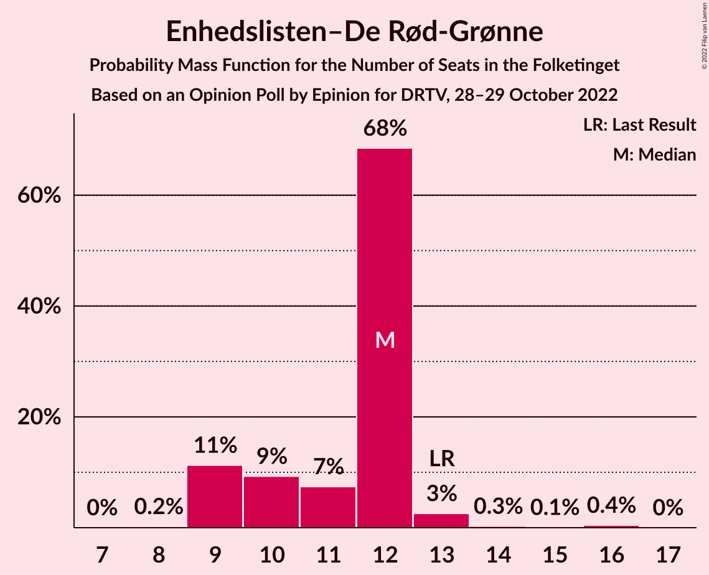
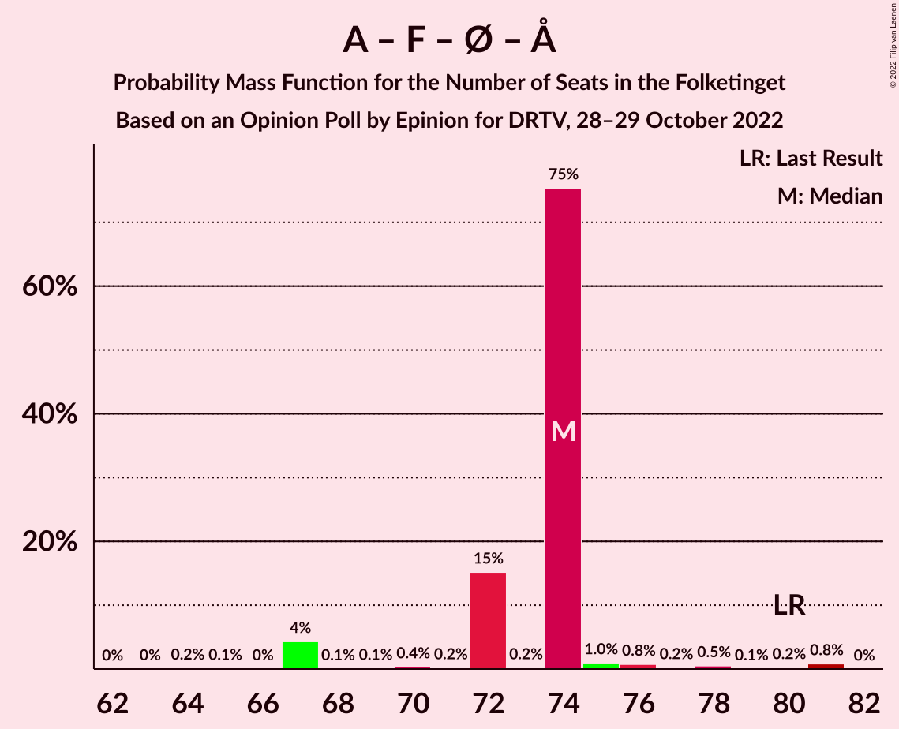
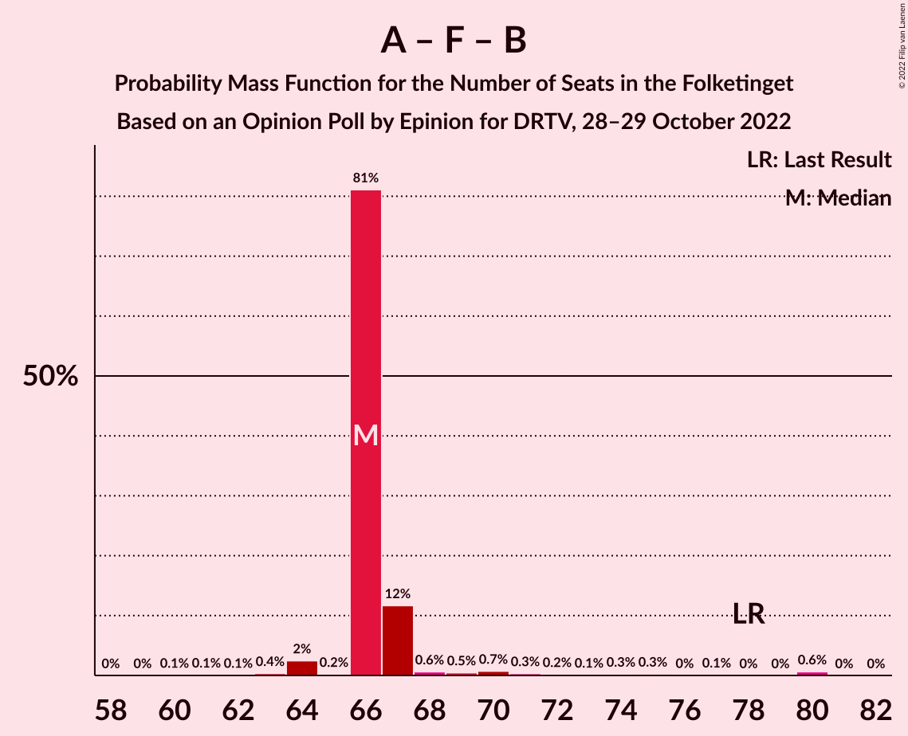

# Opinion Poll by Epinion for DRTV, 28–29 October 2022

<a href="#voting-intentions">Voting Intentions</a> | <a href="#seats">Seats</a> | <a href="#coalitions">Coalitions</a> | <a href="#technical-information">Technical Information</a>

## Voting Intentions

### Confidence Intervals

| Party | Last Result | Poll Result | 80% Confidence Interval | 90% Confidence Interval | 95% Confidence Interval | 99% Confidence Interval |
|:-----:|:-----------:|:-----------:|:-----------------------:|:-----------------------:|:-----------------------:|:-----------------------:|
| Socialdemokraterne | 25.9% | 24.4% | 22.7–26.2% |22.2–26.7% |21.8–27.1% |21.0–28.0% |
| Venstre | 23.4% | 13.3% | 12.0–14.8% |11.7–15.2% |11.4–15.5% |10.8–16.3% |
| Socialistisk Folkeparti | 7.7% | 8.7% | 7.6–9.9% |7.3–10.3% |7.1–10.6% |6.6–11.2% |
| Liberal Alliance | 2.3% | 8.6% | 7.5–9.8% |7.3–10.2% |7.0–10.5% |6.5–11.1% |
| Danmarksdemokraterne | 0.0% | 8.6% | 7.5–9.8% |7.3–10.2% |7.0–10.5% |6.5–11.1% |
| Moderaterne | 0.0% | 8.3% | 7.3–9.5% |7.0–9.8% |6.7–10.2% |6.3–10.8% |
| Enhedslisten–De Rød-Grønne | 6.9% | 6.3% | 5.4–7.4% |5.2–7.7% |5.0–8.0% |4.6–8.5% |
| Det Konservative Folkeparti | 6.6% | 5.8% | 5.0–6.9% |4.7–7.2% |4.5–7.4% |4.2–8.0% |
| Nye Borgerlige | 2.4% | 5.2% | 4.4–6.2% |4.2–6.5% |4.0–6.8% |3.7–7.3% |
| Radikale Venstre | 8.6% | 4.7% | 4.0–5.7% |3.8–6.0% |3.6–6.2% |3.2–6.7% |
| Dansk Folkeparti | 8.7% | 2.4% | 1.9–3.1% |1.7–3.3% |1.6–3.5% |1.4–3.9% |
| Alternativet | 3.0% | 2.3% | 1.8–3.0% |1.6–3.2% |1.5–3.4% |1.3–3.8% |
| Frie Grønne | 0.0% | 0.7% | 0.5–1.2% |0.4–1.3% |0.3–1.4% |0.2–1.7% |
| Kristendemokraterne | 1.7% | 0.4% | 0.2–0.8% |0.2–0.9% |0.2–1.0% |0.1–1.2% |

*Note:* The poll result column reflects the actual value used in the calculations. Published results may vary slightly, and in addition be rounded to fewer digits.

## Seats

### Confidence Intervals

| Party | Last Result | Median | 80% Confidence Interval | 90% Confidence Interval | 95% Confidence Interval | 99% Confidence Interval |
|:-----:|:-----------:|:------:|:-----------------------:|:-----------------------:|:-----------------------:|:-----------------------:|
| <a href="#socialdemokraterne">Socialdemokraterne</a> | 48 | 41 | 41 |41 |41 |41–47 |
| <a href="#venstre">Venstre</a> | 43 | 23 | 23 |23 |23 |20–26 |
| <a href="#socialistisk-folkeparti">Socialistisk Folkeparti</a> | 14 | 17 | 17 |17 |17 |14–17 |
| <a href="#liberal-alliance">Liberal Alliance</a> | 4 | 15 | 15 |15–16 |15–16 |14–18 |
| <a href="#danmarksdemokraterne">Danmarksdemokraterne</a> | 0 | 16 | 16 |16–17 |16–17 |14–17 |
| <a href="#moderaterne">Moderaterne</a> | 0 | 15 | 14–15 |14–15 |14–15 |14–16 |
| <a href="#enhedslisten–de-rød-grønne">Enhedslisten–De Rød-Grønne</a> | 13 | 12 | 11–12 |10–12 |10–12 |10–13 |
| <a href="#det-konservative-folkeparti">Det Konservative Folkeparti</a> | 12 | 10 | 9–10 |9–10 |9–10 |8–11 |
| <a href="#nye-borgerlige">Nye Borgerlige</a> | 4 | 9 | 9 |7–9 |7–9 |7–12 |
| <a href="#radikale-venstre">Radikale Venstre</a> | 16 | 8 | 8–9 |8–9 |8–9 |8–11 |
| <a href="#dansk-folkeparti">Dansk Folkeparti</a> | 16 | 5 | 5 |5–6 |5–6 |0–6 |
| <a href="#alternativet">Alternativet</a> | 5 | 4 | 4 |4–6 |4–6 |4–6 |
| <a href="#frie-grønne">Frie Grønne</a> | 0 | 0 | 0 |0 |0 |0 |
| <a href="#kristendemokraterne">Kristendemokraterne</a> | 0 | 0 | 0 |0 |0 |0 |

### Socialdemokraterne

*For a full overview of the results for this party, see the [Socialdemokraterne](party-socialdemokraterne.html) page.*

| Number of Seats | Probability | Accumulated | Special Marks |
|:---------------:|:-----------:|:-----------:|:-------------:|
| 39 | 0.3% | 100% |  |
| 40 | 0.1% | 99.6% |  |
| 41 | 98% | 99.5% | Median |
| 42 | 0.1% | 1.4% |  |
| 43 | 0.3% | 1.2% |  |
| 44 | 0.1% | 1.0% |  |
| 45 | 0% | 0.9% |  |
| 46 | 0.3% | 0.9% |  |
| 47 | 0.2% | 0.5% |  |
| 48 | 0.3% | 0.3% | Last Result |
| 49 | 0% | 0% |  |

### Venstre

*For a full overview of the results for this party, see the [Venstre](party-venstre.html) page.*

| Number of Seats | Probability | Accumulated | Special Marks |
|:---------------:|:-----------:|:-----------:|:-------------:|
| 18 | 0.3% | 100% |  |
| 19 | 0% | 99.7% |  |
| 20 | 0.3% | 99.7% |  |
| 21 | 0% | 99.4% |  |
| 22 | 0.1% | 99.3% |  |
| 23 | 98% | 99.3% | Median |
| 24 | 0.4% | 1.2% |  |
| 25 | 0.3% | 0.8% |  |
| 26 | 0.3% | 0.5% |  |
| 27 | 0% | 0.2% |  |
| 28 | 0.1% | 0.2% |  |
| 29 | 0.1% | 0.1% |  |
| 30 | 0% | 0% |  |
| 31 | 0% | 0% |  |
| 32 | 0% | 0% |  |
| 33 | 0% | 0% |  |
| 34 | 0% | 0% |  |
| 35 | 0% | 0% |  |
| 36 | 0% | 0% |  |
| 37 | 0% | 0% |  |
| 38 | 0% | 0% |  |
| 39 | 0% | 0% |  |
| 40 | 0% | 0% |  |
| 41 | 0% | 0% |  |
| 42 | 0% | 0% |  |
| 43 | 0% | 0% | Last Result |

### Socialistisk Folkeparti

*For a full overview of the results for this party, see the [Socialistisk Folkeparti](party-socialistiskfolkeparti.html) page.*

| Number of Seats | Probability | Accumulated | Special Marks |
|:---------------:|:-----------:|:-----------:|:-------------:|
| 13 | 0.3% | 100% |  |
| 14 | 0.2% | 99.7% | Last Result |
| 15 | 0.5% | 99.5% |  |
| 16 | 0.3% | 98.9% |  |
| 17 | 98% | 98.6% | Median |
| 18 | 0.2% | 0.3% |  |
| 19 | 0% | 0.1% |  |
| 20 | 0.1% | 0.1% |  |
| 21 | 0% | 0% |  |

### Liberal Alliance

*For a full overview of the results for this party, see the [Liberal Alliance](party-liberalalliance.html) page.*

| Number of Seats | Probability | Accumulated | Special Marks |
|:---------------:|:-----------:|:-----------:|:-------------:|
| 4 | 0% | 100% | Last Result |
| 5 | 0% | 100% |  |
| 6 | 0% | 100% |  |
| 7 | 0% | 100% |  |
| 8 | 0% | 100% |  |
| 9 | 0% | 100% |  |
| 10 | 0% | 100% |  |
| 11 | 0% | 100% |  |
| 12 | 0.1% | 100% |  |
| 13 | 0.3% | 99.9% |  |
| 14 | 0.7% | 99.6% |  |
| 15 | 89% | 98.9% | Median |
| 16 | 9% | 10% |  |
| 17 | 0% | 0.5% |  |
| 18 | 0.4% | 0.5% |  |
| 19 | 0% | 0.1% |  |
| 20 | 0.1% | 0.1% |  |
| 21 | 0% | 0% |  |

### Danmarksdemokraterne

*For a full overview of the results for this party, see the [Danmarksdemokraterne](party-danmarksdemokraterne.html) page.*

| Number of Seats | Probability | Accumulated | Special Marks |
|:---------------:|:-----------:|:-----------:|:-------------:|
| 0 | 0% | 100% | Last Result |
| 1 | 0% | 100% |  |
| 2 | 0% | 100% |  |
| 3 | 0% | 100% |  |
| 4 | 0% | 100% |  |
| 5 | 0% | 100% |  |
| 6 | 0% | 100% |  |
| 7 | 0% | 100% |  |
| 8 | 0% | 100% |  |
| 9 | 0% | 100% |  |
| 10 | 0% | 100% |  |
| 11 | 0% | 100% |  |
| 12 | 0.1% | 100% |  |
| 13 | 0.1% | 99.9% |  |
| 14 | 0.4% | 99.8% |  |
| 15 | 0.4% | 99.3% |  |
| 16 | 89% | 99.0% | Median |
| 17 | 9% | 10% |  |
| 18 | 0.1% | 0.2% |  |
| 19 | 0.1% | 0.2% |  |
| 20 | 0% | 0% |  |

### Moderaterne

*For a full overview of the results for this party, see the [Moderaterne](party-moderaterne.html) page.*

| Number of Seats | Probability | Accumulated | Special Marks |
|:---------------:|:-----------:|:-----------:|:-------------:|
| 0 | 0% | 100% | Last Result |
| 1 | 0% | 100% |  |
| 2 | 0% | 100% |  |
| 3 | 0% | 100% |  |
| 4 | 0% | 100% |  |
| 5 | 0% | 100% |  |
| 6 | 0% | 100% |  |
| 7 | 0% | 100% |  |
| 8 | 0% | 100% |  |
| 9 | 0% | 100% |  |
| 10 | 0% | 100% |  |
| 11 | 0% | 100% |  |
| 12 | 0.2% | 100% |  |
| 13 | 0.2% | 99.8% |  |
| 14 | 10% | 99.6% |  |
| 15 | 89% | 90% | Median |
| 16 | 0.4% | 0.8% |  |
| 17 | 0.1% | 0.4% |  |
| 18 | 0% | 0.4% |  |
| 19 | 0.3% | 0.3% |  |
| 20 | 0% | 0% |  |

### Enhedslisten–De Rød-Grønne

*For a full overview of the results for this party, see the [Enhedslisten–De Rød-Grønne](party-enhedslisten–derød-grønne.html) page.*

| Number of Seats | Probability | Accumulated | Special Marks |
|:---------------:|:-----------:|:-----------:|:-------------:|
| 8 | 0.1% | 100% |  |
| 9 | 0.1% | 99.9% |  |
| 10 | 9% | 99.8% |  |
| 11 | 0.9% | 90% |  |
| 12 | 89% | 89% | Median |
| 13 | 0.3% | 0.6% | Last Result |
| 14 | 0% | 0.3% |  |
| 15 | 0.1% | 0.2% |  |
| 16 | 0.2% | 0.2% |  |
| 17 | 0% | 0% |  |

### Det Konservative Folkeparti

*For a full overview of the results for this party, see the [Det Konservative Folkeparti](party-detkonservativefolkeparti.html) page.*

| Number of Seats | Probability | Accumulated | Special Marks |
|:---------------:|:-----------:|:-----------:|:-------------:|
| 7 | 0.1% | 100% |  |
| 8 | 0.6% | 99.9% |  |
| 9 | 9% | 99.3% |  |
| 10 | 89% | 90% | Median |
| 11 | 0.5% | 1.0% |  |
| 12 | 0.1% | 0.5% | Last Result |
| 13 | 0.3% | 0.4% |  |
| 14 | 0.1% | 0.2% |  |
| 15 | 0% | 0% |  |

### Nye Borgerlige

*For a full overview of the results for this party, see the [Nye Borgerlige](party-nyeborgerlige.html) page.*

| Number of Seats | Probability | Accumulated | Special Marks |
|:---------------:|:-----------:|:-----------:|:-------------:|
| 4 | 0% | 100% | Last Result |
| 5 | 0% | 100% |  |
| 6 | 0.2% | 100% |  |
| 7 | 10% | 99.8% |  |
| 8 | 0% | 90% |  |
| 9 | 89% | 90% | Median |
| 10 | 0.4% | 1.1% |  |
| 11 | 0% | 0.7% |  |
| 12 | 0.6% | 0.7% |  |
| 13 | 0% | 0% |  |

### Radikale Venstre

*For a full overview of the results for this party, see the [Radikale Venstre](party-radikalevenstre.html) page.*

| Number of Seats | Probability | Accumulated | Special Marks |
|:---------------:|:-----------:|:-----------:|:-------------:|
| 6 | 0.2% | 100% |  |
| 7 | 0.2% | 99.8% |  |
| 8 | 89% | 99.6% | Median |
| 9 | 10% | 10% |  |
| 10 | 0.3% | 1.0% |  |
| 11 | 0.6% | 0.7% |  |
| 12 | 0.1% | 0.1% |  |
| 13 | 0% | 0% |  |
| 14 | 0% | 0% |  |
| 15 | 0% | 0% |  |
| 16 | 0% | 0% | Last Result |

### Dansk Folkeparti

*For a full overview of the results for this party, see the [Dansk Folkeparti](party-danskfolkeparti.html) page.*

| Number of Seats | Probability | Accumulated | Special Marks |
|:---------------:|:-----------:|:-----------:|:-------------:|
| 0 | 0.9% | 100% |  |
| 1 | 0% | 99.1% |  |
| 2 | 0% | 99.1% |  |
| 3 | 0% | 99.1% |  |
| 4 | 0.3% | 99.1% |  |
| 5 | 89% | 98.8% | Median |
| 6 | 9% | 9% |  |
| 7 | 0% | 0% |  |
| 8 | 0% | 0% |  |
| 9 | 0% | 0% |  |
| 10 | 0% | 0% |  |
| 11 | 0% | 0% |  |
| 12 | 0% | 0% |  |
| 13 | 0% | 0% |  |
| 14 | 0% | 0% |  |
| 15 | 0% | 0% |  |
| 16 | 0% | 0% | Last Result |

### Alternativet

*For a full overview of the results for this party, see the [Alternativet](party-alternativet.html) page.*

| Number of Seats | Probability | Accumulated | Special Marks |
|:---------------:|:-----------:|:-----------:|:-------------:|
| 0 | 0.3% | 100% |  |
| 1 | 0% | 99.7% |  |
| 2 | 0% | 99.7% |  |
| 3 | 0% | 99.7% |  |
| 4 | 90% | 99.7% | Median |
| 5 | 0.2% | 10% | Last Result |
| 6 | 9% | 9% |  |
| 7 | 0% | 0% |  |

### Frie Grønne

*For a full overview of the results for this party, see the [Frie Grønne](party-friegrønne.html) page.*

| Number of Seats | Probability | Accumulated | Special Marks |
|:---------------:|:-----------:|:-----------:|:-------------:|
| 0 | 100% | 100% | Last Result, Median |

### Kristendemokraterne

*For a full overview of the results for this party, see the [Kristendemokraterne](party-kristendemokraterne.html) page.*

| Number of Seats | Probability | Accumulated | Special Marks |
|:---------------:|:-----------:|:-----------:|:-------------:|
| 0 | 100% | 100% | Last Result, Median |

## Coalitions

### Confidence Intervals

| Coalition | Last Result | Median | Majority? | 80% Confidence Interval | 90% Confidence Interval | 95% Confidence Interval | 99% Confidence Interval |
|:---------:|:-----------:|:------:|:---------:|:-----------------------:|:-----------------------:|:-----------------------:|:-----------------------:|
| Socialdemokraterne – Socialistisk Folkeparti – Enhedslisten–De Rød-Grønne – Radikale Venstre – Alternativet | 96 | 82 | 0% | 82–83 | 82–83 | 82–83 | 82–86 |
| Venstre – Danmarksdemokraterne – Liberal Alliance – Det Konservative Folkeparti – Nye Borgerlige – Dansk Folkeparti – Kristendemokraterne | 79 | 78 | 0.1% | 78 | 78 | 78 | 75–79 |
| Socialdemokraterne – Socialistisk Folkeparti – Enhedslisten–De Rød-Grønne – Radikale Venstre | 91 | 78 | 0% | 78 | 77–78 | 77–78 | 77–82 |
| Socialdemokraterne – Socialistisk Folkeparti – Enhedslisten–De Rød-Grønne – Alternativet | 80 | 74 | 0% | 74 | 74 | 74 | 72–78 |
| Socialdemokraterne – Socialistisk Folkeparti – Enhedslisten–De Rød-Grønne | 75 | 70 | 0% | 68–70 | 68–70 | 68–70 | 68–74 |
| Socialdemokraterne – Socialistisk Folkeparti – Radikale Venstre | 78 | 66 | 0% | 66–67 | 66–67 | 66–67 | 66–71 |
| Venstre – Liberal Alliance – Det Konservative Folkeparti – Nye Borgerlige – Dansk Folkeparti – Kristendemokraterne | 79 | 62 | 0% | 61–62 | 61–62 | 61–62 | 59–64 |
| Venstre – Liberal Alliance – Det Konservative Folkeparti – Nye Borgerlige – Dansk Folkeparti | 79 | 62 | 0% | 61–62 | 61–62 | 61–62 | 59–64 |
| Venstre – Liberal Alliance – Det Konservative Folkeparti – Dansk Folkeparti – Kristendemokraterne | 75 | 53 | 0% | 53 | 53–54 | 53–54 | 47–54 |
| Venstre – Liberal Alliance – Det Konservative Folkeparti – Dansk Folkeparti | 75 | 53 | 0% | 53 | 53–54 | 53–54 | 47–54 |
| Socialdemokraterne – Radikale Venstre | 64 | 49 | 0% | 49–50 | 49–50 | 49–50 | 49–56 |
| Venstre – Liberal Alliance – Det Konservative Folkeparti | 59 | 48 | 0% | 48 | 48 | 48 | 47–52 |
| Venstre – Det Konservative Folkeparti | 55 | 33 | 0% | 32–33 | 32–33 | 32–33 | 29–37 |
| Venstre | 43 | 23 | 0% | 23 | 23 | 23 | 20–26 |

### Socialdemokraterne – Socialistisk Folkeparti – Enhedslisten–De Rød-Grønne – Radikale Venstre – Alternativet

| Number of Seats | Probability | Accumulated | Special Marks |
|:---------------:|:-----------:|:-----------:|:-------------:|
| 70 | 0.1% | 100% |  |
| 71 | 0% | 99.9% |  |
| 72 | 0% | 99.9% |  |
| 73 | 0% | 99.9% |  |
| 74 | 0% | 99.9% |  |
| 75 | 0% | 99.9% |  |
| 76 | 0% | 99.9% |  |
| 77 | 0% | 99.9% |  |
| 78 | 0.1% | 99.9% |  |
| 79 | 0% | 99.9% |  |
| 80 | 0.3% | 99.8% |  |
| 81 | 0% | 99.6% |  |
| 82 | 89% | 99.6% | Median |
| 83 | 10% | 11% |  |
| 84 | 0.2% | 0.9% |  |
| 85 | 0% | 0.7% |  |
| 86 | 0.4% | 0.7% |  |
| 87 | 0% | 0.3% |  |
| 88 | 0% | 0.3% |  |
| 89 | 0.3% | 0.3% |  |
| 90 | 0% | 0% | Majority |
| 91 | 0% | 0% |  |
| 92 | 0% | 0% |  |
| 93 | 0% | 0% |  |
| 94 | 0% | 0% |  |
| 95 | 0% | 0% |  |
| 96 | 0% | 0% | Last Result |

### Venstre – Danmarksdemokraterne – Liberal Alliance – Det Konservative Folkeparti – Nye Borgerlige – Dansk Folkeparti – Kristendemokraterne

| Number of Seats | Probability | Accumulated | Special Marks |
|:---------------:|:-----------:|:-----------:|:-------------:|
| 67 | 0.3% | 100% |  |
| 68 | 0% | 99.7% |  |
| 69 | 0% | 99.7% |  |
| 70 | 0% | 99.7% |  |
| 71 | 0% | 99.7% |  |
| 72 | 0% | 99.7% |  |
| 73 | 0% | 99.7% |  |
| 74 | 0% | 99.7% |  |
| 75 | 0.3% | 99.7% |  |
| 76 | 0% | 99.3% |  |
| 77 | 0.2% | 99.3% |  |
| 78 | 98% | 99.1% | Median |
| 79 | 0.4% | 0.6% | Last Result |
| 80 | 0.1% | 0.2% |  |
| 81 | 0% | 0.1% |  |
| 82 | 0% | 0.1% |  |
| 83 | 0% | 0.1% |  |
| 84 | 0% | 0.1% |  |
| 85 | 0% | 0.1% |  |
| 86 | 0% | 0.1% |  |
| 87 | 0% | 0.1% |  |
| 88 | 0% | 0.1% |  |
| 89 | 0% | 0.1% |  |
| 90 | 0.1% | 0.1% | Majority |
| 91 | 0% | 0% |  |

### Socialdemokraterne – Socialistisk Folkeparti – Enhedslisten–De Rød-Grønne – Radikale Venstre

| Number of Seats | Probability | Accumulated | Special Marks |
|:---------------:|:-----------:|:-----------:|:-------------:|
| 70 | 0.1% | 100% |  |
| 71 | 0% | 99.9% |  |
| 72 | 0% | 99.9% |  |
| 73 | 0% | 99.9% |  |
| 74 | 0.1% | 99.9% |  |
| 75 | 0.1% | 99.9% |  |
| 76 | 0.2% | 99.7% |  |
| 77 | 9% | 99.5% |  |
| 78 | 89% | 90% | Median |
| 79 | 0.3% | 1.5% |  |
| 80 | 0.3% | 1.2% |  |
| 81 | 0% | 0.9% |  |
| 82 | 0.5% | 0.9% |  |
| 83 | 0% | 0.4% |  |
| 84 | 0% | 0.3% |  |
| 85 | 0.3% | 0.3% |  |
| 86 | 0% | 0% |  |
| 87 | 0% | 0% |  |
| 88 | 0% | 0% |  |
| 89 | 0% | 0% |  |
| 90 | 0% | 0% | Majority |
| 91 | 0% | 0% | Last Result |

### Socialdemokraterne – Socialistisk Folkeparti – Enhedslisten–De Rød-Grønne – Alternativet

| Number of Seats | Probability | Accumulated | Special Marks |
|:---------------:|:-----------:|:-----------:|:-------------:|
| 63 | 0.1% | 100% |  |
| 64 | 0% | 99.9% |  |
| 65 | 0% | 99.9% |  |
| 66 | 0% | 99.9% |  |
| 67 | 0% | 99.9% |  |
| 68 | 0.1% | 99.9% |  |
| 69 | 0% | 99.9% |  |
| 70 | 0.1% | 99.9% |  |
| 71 | 0.1% | 99.8% |  |
| 72 | 0.4% | 99.7% |  |
| 73 | 0.1% | 99.3% |  |
| 74 | 98% | 99.2% | Median |
| 75 | 0% | 0.9% |  |
| 76 | 0.2% | 0.9% |  |
| 77 | 0% | 0.7% |  |
| 78 | 0.6% | 0.7% |  |
| 79 | 0% | 0.1% |  |
| 80 | 0% | 0% | Last Result |

### Socialdemokraterne – Socialistisk Folkeparti – Enhedslisten–De Rød-Grønne

| Number of Seats | Probability | Accumulated | Special Marks |
|:---------------:|:-----------:|:-----------:|:-------------:|
| 63 | 0.1% | 100% |  |
| 64 | 0.1% | 99.9% |  |
| 65 | 0% | 99.9% |  |
| 66 | 0.2% | 99.9% |  |
| 67 | 0% | 99.7% |  |
| 68 | 10% | 99.7% |  |
| 69 | 0.1% | 90% |  |
| 70 | 89% | 90% | Median |
| 71 | 0% | 1.0% |  |
| 72 | 0% | 0.9% |  |
| 73 | 0% | 0.9% |  |
| 74 | 0.7% | 0.9% |  |
| 75 | 0% | 0.2% | Last Result |
| 76 | 0.2% | 0.2% |  |
| 77 | 0% | 0% |  |

### Socialdemokraterne – Socialistisk Folkeparti – Radikale Venstre

| Number of Seats | Probability | Accumulated | Special Marks |
|:---------------:|:-----------:|:-----------:|:-------------:|
| 60 | 0.1% | 100% |  |
| 61 | 0.1% | 99.9% |  |
| 62 | 0% | 99.9% |  |
| 63 | 0% | 99.9% |  |
| 64 | 0% | 99.8% |  |
| 65 | 0.1% | 99.8% |  |
| 66 | 89% | 99.7% | Median |
| 67 | 9% | 10% |  |
| 68 | 0% | 1.0% |  |
| 69 | 0.3% | 1.0% |  |
| 70 | 0% | 0.7% |  |
| 71 | 0.3% | 0.7% |  |
| 72 | 0% | 0.4% |  |
| 73 | 0% | 0.3% |  |
| 74 | 0.3% | 0.3% |  |
| 75 | 0% | 0% |  |
| 76 | 0% | 0% |  |
| 77 | 0% | 0% |  |
| 78 | 0% | 0% | Last Result |

### Venstre – Liberal Alliance – Det Konservative Folkeparti – Nye Borgerlige – Dansk Folkeparti – Kristendemokraterne

| Number of Seats | Probability | Accumulated | Special Marks |
|:---------------:|:-----------:|:-----------:|:-------------:|
| 51 | 0.3% | 100% |  |
| 52 | 0% | 99.7% |  |
| 53 | 0% | 99.7% |  |
| 54 | 0% | 99.7% |  |
| 55 | 0% | 99.7% |  |
| 56 | 0% | 99.7% |  |
| 57 | 0% | 99.7% |  |
| 58 | 0% | 99.7% |  |
| 59 | 0.3% | 99.7% |  |
| 60 | 0.1% | 99.3% |  |
| 61 | 9% | 99.2% |  |
| 62 | 89% | 90% | Median |
| 63 | 0.1% | 0.9% |  |
| 64 | 0.4% | 0.8% |  |
| 65 | 0.2% | 0.4% |  |
| 66 | 0.1% | 0.2% |  |
| 67 | 0% | 0.1% |  |
| 68 | 0% | 0.1% |  |
| 69 | 0% | 0.1% |  |
| 70 | 0% | 0.1% |  |
| 71 | 0% | 0.1% |  |
| 72 | 0% | 0.1% |  |
| 73 | 0% | 0.1% |  |
| 74 | 0.1% | 0.1% |  |
| 75 | 0% | 0% |  |
| 76 | 0% | 0% |  |
| 77 | 0% | 0% |  |
| 78 | 0% | 0% |  |
| 79 | 0% | 0% | Last Result |

### Venstre – Liberal Alliance – Det Konservative Folkeparti – Nye Borgerlige – Dansk Folkeparti

| Number of Seats | Probability | Accumulated | Special Marks |
|:---------------:|:-----------:|:-----------:|:-------------:|
| 51 | 0.3% | 100% |  |
| 52 | 0% | 99.7% |  |
| 53 | 0% | 99.7% |  |
| 54 | 0% | 99.7% |  |
| 55 | 0% | 99.7% |  |
| 56 | 0% | 99.7% |  |
| 57 | 0% | 99.7% |  |
| 58 | 0% | 99.7% |  |
| 59 | 0.3% | 99.7% |  |
| 60 | 0.1% | 99.3% |  |
| 61 | 9% | 99.2% |  |
| 62 | 89% | 90% | Median |
| 63 | 0.1% | 0.9% |  |
| 64 | 0.4% | 0.8% |  |
| 65 | 0.2% | 0.4% |  |
| 66 | 0.1% | 0.2% |  |
| 67 | 0% | 0.1% |  |
| 68 | 0% | 0.1% |  |
| 69 | 0% | 0.1% |  |
| 70 | 0% | 0.1% |  |
| 71 | 0% | 0.1% |  |
| 72 | 0% | 0.1% |  |
| 73 | 0% | 0.1% |  |
| 74 | 0.1% | 0.1% |  |
| 75 | 0% | 0% |  |
| 76 | 0% | 0% |  |
| 77 | 0% | 0% |  |
| 78 | 0% | 0% |  |
| 79 | 0% | 0% | Last Result |

### Venstre – Liberal Alliance – Det Konservative Folkeparti – Dansk Folkeparti – Kristendemokraterne

| Number of Seats | Probability | Accumulated | Special Marks |
|:---------------:|:-----------:|:-----------:|:-------------:|
| 42 | 0.3% | 100% |  |
| 43 | 0% | 99.7% |  |
| 44 | 0% | 99.7% |  |
| 45 | 0% | 99.7% |  |
| 46 | 0% | 99.7% |  |
| 47 | 0.4% | 99.7% |  |
| 48 | 0% | 99.3% |  |
| 49 | 0% | 99.3% |  |
| 50 | 0% | 99.3% |  |
| 51 | 0% | 99.3% |  |
| 52 | 0.5% | 99.3% |  |
| 53 | 89% | 98.8% | Median |
| 54 | 10% | 10% |  |
| 55 | 0.1% | 0.5% |  |
| 56 | 0.1% | 0.3% |  |
| 57 | 0.1% | 0.3% |  |
| 58 | 0.1% | 0.2% |  |
| 59 | 0% | 0.1% |  |
| 60 | 0% | 0.1% |  |
| 61 | 0% | 0.1% |  |
| 62 | 0% | 0.1% |  |
| 63 | 0% | 0.1% |  |
| 64 | 0.1% | 0.1% |  |
| 65 | 0% | 0% |  |
| 66 | 0% | 0% |  |
| 67 | 0% | 0% |  |
| 68 | 0% | 0% |  |
| 69 | 0% | 0% |  |
| 70 | 0% | 0% |  |
| 71 | 0% | 0% |  |
| 72 | 0% | 0% |  |
| 73 | 0% | 0% |  |
| 74 | 0% | 0% |  |
| 75 | 0% | 0% | Last Result |

### Venstre – Liberal Alliance – Det Konservative Folkeparti – Dansk Folkeparti

| Number of Seats | Probability | Accumulated | Special Marks |
|:---------------:|:-----------:|:-----------:|:-------------:|
| 42 | 0.3% | 100% |  |
| 43 | 0% | 99.7% |  |
| 44 | 0% | 99.7% |  |
| 45 | 0% | 99.7% |  |
| 46 | 0% | 99.7% |  |
| 47 | 0.4% | 99.7% |  |
| 48 | 0% | 99.3% |  |
| 49 | 0% | 99.3% |  |
| 50 | 0% | 99.3% |  |
| 51 | 0% | 99.3% |  |
| 52 | 0.5% | 99.3% |  |
| 53 | 89% | 98.8% | Median |
| 54 | 10% | 10% |  |
| 55 | 0.1% | 0.5% |  |
| 56 | 0.1% | 0.3% |  |
| 57 | 0.1% | 0.3% |  |
| 58 | 0.1% | 0.2% |  |
| 59 | 0% | 0.1% |  |
| 60 | 0% | 0.1% |  |
| 61 | 0% | 0.1% |  |
| 62 | 0% | 0.1% |  |
| 63 | 0% | 0.1% |  |
| 64 | 0.1% | 0.1% |  |
| 65 | 0% | 0% |  |
| 66 | 0% | 0% |  |
| 67 | 0% | 0% |  |
| 68 | 0% | 0% |  |
| 69 | 0% | 0% |  |
| 70 | 0% | 0% |  |
| 71 | 0% | 0% |  |
| 72 | 0% | 0% |  |
| 73 | 0% | 0% |  |
| 74 | 0% | 0% |  |
| 75 | 0% | 0% | Last Result |

### Socialdemokraterne – Radikale Venstre

| Number of Seats | Probability | Accumulated | Special Marks |
|:---------------:|:-----------:|:-----------:|:-------------:|
| 45 | 0.1% | 100% |  |
| 46 | 0.1% | 99.9% |  |
| 47 | 0.1% | 99.9% |  |
| 48 | 0% | 99.8% |  |
| 49 | 89% | 99.8% | Median |
| 50 | 10% | 11% |  |
| 51 | 0.2% | 2% |  |
| 52 | 0.3% | 1.3% |  |
| 53 | 0.2% | 1.0% |  |
| 54 | 0.1% | 0.8% |  |
| 55 | 0.1% | 0.7% |  |
| 56 | 0.3% | 0.7% |  |
| 57 | 0.3% | 0.3% |  |
| 58 | 0% | 0% |  |
| 59 | 0% | 0% |  |
| 60 | 0% | 0% |  |
| 61 | 0% | 0% |  |
| 62 | 0% | 0% |  |
| 63 | 0% | 0% |  |
| 64 | 0% | 0% | Last Result |

### Venstre – Liberal Alliance – Det Konservative Folkeparti

| Number of Seats | Probability | Accumulated | Special Marks |
|:---------------:|:-----------:|:-----------:|:-------------:|
| 42 | 0.3% | 100% |  |
| 43 | 0% | 99.7% |  |
| 44 | 0% | 99.7% |  |
| 45 | 0% | 99.7% |  |
| 46 | 0% | 99.6% |  |
| 47 | 0.7% | 99.6% |  |
| 48 | 98% | 99.0% | Median |
| 49 | 0.2% | 0.9% |  |
| 50 | 0.1% | 0.7% |  |
| 51 | 0.1% | 0.7% |  |
| 52 | 0.3% | 0.6% |  |
| 53 | 0.1% | 0.2% |  |
| 54 | 0% | 0.1% |  |
| 55 | 0% | 0.1% |  |
| 56 | 0% | 0.1% |  |
| 57 | 0% | 0.1% |  |
| 58 | 0% | 0.1% |  |
| 59 | 0.1% | 0.1% | Last Result |
| 60 | 0% | 0% |  |

### Venstre – Det Konservative Folkeparti

| Number of Seats | Probability | Accumulated | Special Marks |
|:---------------:|:-----------:|:-----------:|:-------------:|
| 28 | 0.3% | 100% |  |
| 29 | 0.3% | 99.7% |  |
| 30 | 0% | 99.4% |  |
| 31 | 0% | 99.4% |  |
| 32 | 9% | 99.3% |  |
| 33 | 89% | 90% | Median |
| 34 | 0.3% | 1.2% |  |
| 35 | 0.2% | 0.8% |  |
| 36 | 0% | 0.6% |  |
| 37 | 0.1% | 0.5% |  |
| 38 | 0.4% | 0.4% |  |
| 39 | 0.1% | 0.1% |  |
| 40 | 0% | 0% |  |
| 41 | 0% | 0% |  |
| 42 | 0% | 0% |  |
| 43 | 0% | 0% |  |
| 44 | 0% | 0% |  |
| 45 | 0% | 0% |  |
| 46 | 0% | 0% |  |
| 47 | 0% | 0% |  |
| 48 | 0% | 0% |  |
| 49 | 0% | 0% |  |
| 50 | 0% | 0% |  |
| 51 | 0% | 0% |  |
| 52 | 0% | 0% |  |
| 53 | 0% | 0% |  |
| 54 | 0% | 0% |  |
| 55 | 0% | 0% | Last Result |

### Venstre

| Number of Seats | Probability | Accumulated | Special Marks |
|:---------------:|:-----------:|:-----------:|:-------------:|
| 18 | 0.3% | 100% |  |
| 19 | 0% | 99.7% |  |
| 20 | 0.3% | 99.7% |  |
| 21 | 0% | 99.4% |  |
| 22 | 0.1% | 99.3% |  |
| 23 | 98% | 99.3% | Median |
| 24 | 0.4% | 1.2% |  |
| 25 | 0.3% | 0.8% |  |
| 26 | 0.3% | 0.5% |  |
| 27 | 0% | 0.2% |  |
| 28 | 0.1% | 0.2% |  |
| 29 | 0.1% | 0.1% |  |
| 30 | 0% | 0% |  |
| 31 | 0% | 0% |  |
| 32 | 0% | 0% |  |
| 33 | 0% | 0% |  |
| 34 | 0% | 0% |  |
| 35 | 0% | 0% |  |
| 36 | 0% | 0% |  |
| 37 | 0% | 0% |  |
| 38 | 0% | 0% |  |
| 39 | 0% | 0% |  |
| 40 | 0% | 0% |  |
| 41 | 0% | 0% |  |
| 42 | 0% | 0% |  |
| 43 | 0% | 0% | Last Result |

## Technical Information

### Opinion Poll

+ **Polling firm:** Epinion
+ **Commissioner(s):** DRTV
+ **Fieldwork period:** 28–29 October 2022

### Calculations

+ **Sample size:** 1014
+ **Simulations done:** 262,144
+ **Error estimate:** 1.23%

