# Opinion Poll by Megafon for TV2, 28–29 October 2022

<a href="#voting-intentions">Voting Intentions</a> | <a href="#seats">Seats</a> | <a href="#coalitions">Coalitions</a> | <a href="#technical-information">Technical Information</a>

## Voting Intentions

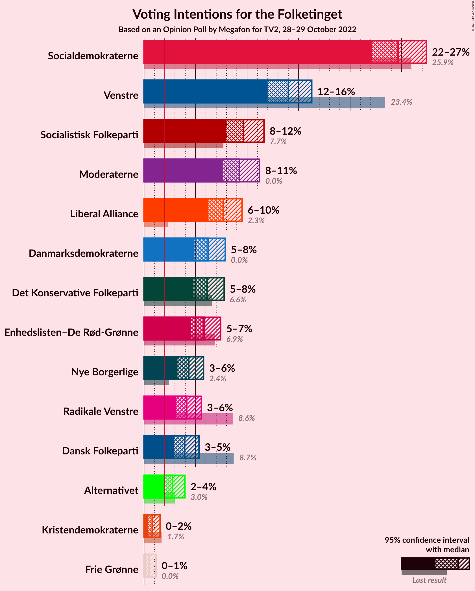

### Confidence Intervals

| Party | Last Result | Poll Result | 80% Confidence Interval | 90% Confidence Interval | 95% Confidence Interval | 99% Confidence Interval |
|:-----:|:-----------:|:-----------:|:-----------------------:|:-----------------------:|:-----------------------:|:-----------------------:|
| Socialdemokraterne | 25.9% | 24.7% | 23.0–26.5% |22.5–27.0% |22.1–27.4% |21.3–28.3% |
| Venstre | 23.4% | 14.0% | 12.7–15.5% |12.3–15.9% |12.0–16.3% |11.4–17.0% |
| Socialistisk Folkeparti | 7.7% | 9.7% | 8.6–11.0% |8.3–11.3% |8.0–11.6% |7.5–12.3% |
| Moderaterne | 0.0% | 9.3% | 8.2–10.5% |7.9–10.9% |7.6–11.2% |7.1–11.9% |
| Liberal Alliance | 2.3% | 7.7% | 6.7–8.9% |6.4–9.2% |6.2–9.5% |5.8–10.1% |
| Danmarksdemokraterne | 0.0% | 6.2% | 5.3–7.3% |5.1–7.6% |4.9–7.9% |4.5–8.4% |
| Det Konservative Folkeparti | 6.6% | 6.1% | 5.2–7.2% |5.0–7.5% |4.8–7.8% |4.4–8.3% |
| Enhedslisten–De Rød-Grønne | 6.9% | 5.8% | 5.0–6.9% |4.7–7.2% |4.5–7.4% |4.2–8.0% |
| Nye Borgerlige | 2.4% | 4.3% | 3.6–5.3% |3.4–5.5% |3.2–5.8% |2.9–6.3% |
| Radikale Venstre | 8.6% | 4.1% | 3.4–5.1% |3.2–5.3% |3.1–5.6% |2.8–6.0% |
| Dansk Folkeparti | 8.7% | 3.9% | 3.3–4.8% |3.1–5.1% |2.9–5.3% |2.6–5.8% |
| Alternativet | 3.0% | 2.8% | 2.2–3.6% |2.0–3.8% |1.9–4.0% |1.7–4.4% |
| Kristendemokraterne | 1.7% | 0.8% | 0.5–1.3% |0.5–1.4% |0.4–1.6% |0.3–1.8% |
| Frie Grønne | 0.0% | 0.5% | 0.3–0.9% |0.2–1.0% |0.2–1.2% |0.1–1.4% |

*Note:* The poll result column reflects the actual value used in the calculations. Published results may vary slightly, and in addition be rounded to fewer digits.

## Seats

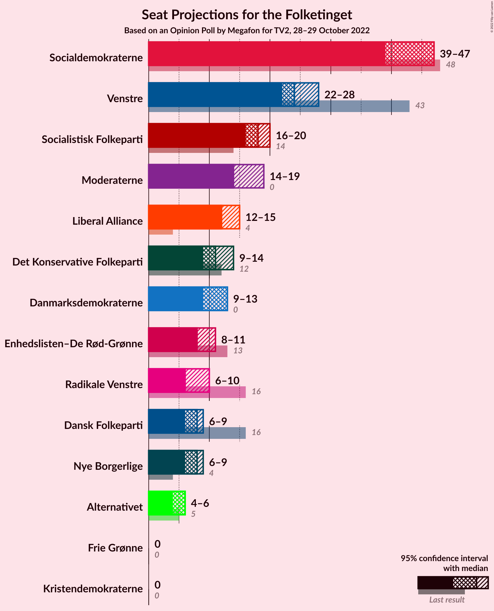

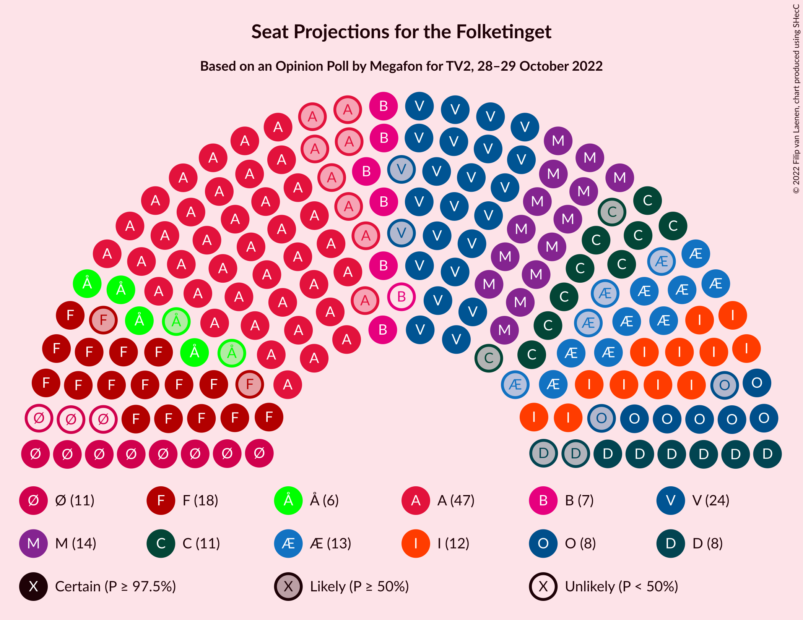

### Confidence Intervals

| Party | Last Result | Median | 80% Confidence Interval | 90% Confidence Interval | 95% Confidence Interval | 99% Confidence Interval |
|:-----:|:-----------:|:------:|:-----------------------:|:-----------------------:|:-----------------------:|:-----------------------:|
| <a href="#socialdemokraterne">Socialdemokraterne</a> | 48 | 47 | 39–47 |39–47 |39–47 |38–48 |
| <a href="#venstre">Venstre</a> | 43 | 24 | 24–26 |23–27 |22–28 |20–28 |
| <a href="#socialistisk-folkeparti">Socialistisk Folkeparti</a> | 14 | 18 | 18 |17–20 |16–20 |14–21 |
| <a href="#moderaterne">Moderaterne</a> | 0 | 14 | 14–19 |14–19 |14–19 |13–19 |
| <a href="#liberal-alliance">Liberal Alliance</a> | 4 | 12 | 12–13 |12–15 |12–15 |11–16 |
| <a href="#danmarksdemokraterne">Danmarksdemokraterne</a> | 0 | 13 | 12–13 |10–13 |9–13 |9–14 |
| <a href="#det-konservative-folkeparti">Det Konservative Folkeparti</a> | 12 | 11 | 11 |11–12 |9–14 |9–14 |
| <a href="#enhedslisten–de-rød-grønne">Enhedslisten–De Rød-Grønne</a> | 13 | 8 | 8–11 |8–11 |8–11 |8–13 |
| <a href="#nye-borgerlige">Nye Borgerlige</a> | 4 | 8 | 7–8 |7–8 |6–9 |6–11 |
| <a href="#radikale-venstre">Radikale Venstre</a> | 16 | 6 | 6–7 |6–7 |6–10 |6–11 |
| <a href="#dansk-folkeparti">Dansk Folkeparti</a> | 16 | 8 | 7–8 |7–8 |6–9 |5–9 |
| <a href="#alternativet">Alternativet</a> | 5 | 6 | 6 |4–6 |4–6 |0–7 |
| <a href="#kristendemokraterne">Kristendemokraterne</a> | 0 | 0 | 0 |0 |0 |0 |
| <a href="#frie-grønne">Frie Grønne</a> | 0 | 0 | 0 |0 |0 |0 |

### Socialdemokraterne

*For a full overview of the results for this party, see the [Socialdemokraterne](party-socialdemokraterne.html) page.*

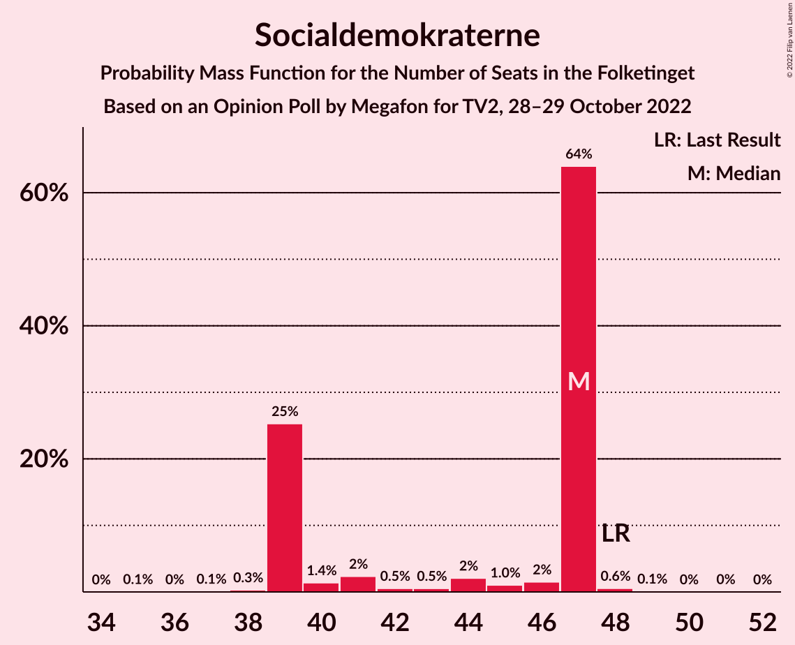

| Number of Seats | Probability | Accumulated | Special Marks |
|:---------------:|:-----------:|:-----------:|:-------------:|
| 35 | 0.1% | 100% |  |
| 36 | 0% | 99.9% |  |
| 37 | 0.1% | 99.9% |  |
| 38 | 0.3% | 99.8% |  |
| 39 | 25% | 99.5% |  |
| 40 | 1.4% | 74% |  |
| 41 | 2% | 73% |  |
| 42 | 0.5% | 70% |  |
| 43 | 0.5% | 70% |  |
| 44 | 2% | 69% |  |
| 45 | 1.0% | 67% |  |
| 46 | 2% | 66% |  |
| 47 | 64% | 65% | Median |
| 48 | 0.6% | 0.7% | Last Result |
| 49 | 0.1% | 0.2% |  |
| 50 | 0% | 0.1% |  |
| 51 | 0% | 0.1% |  |
| 52 | 0% | 0% |  |

### Venstre

*For a full overview of the results for this party, see the [Venstre](party-venstre.html) page.*

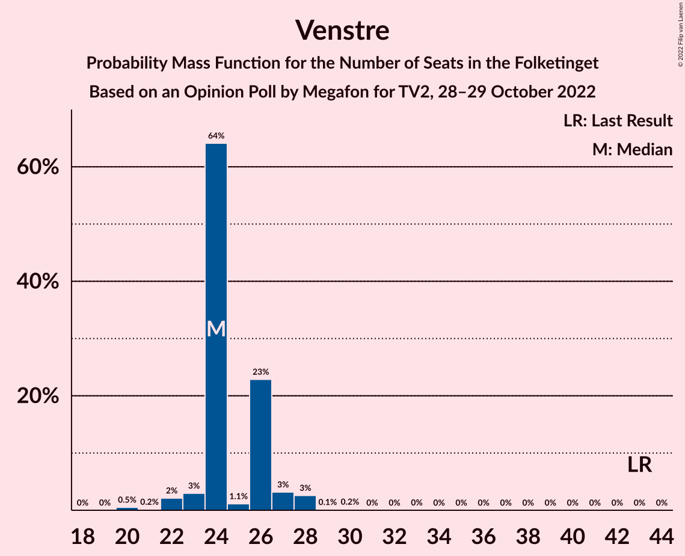

| Number of Seats | Probability | Accumulated | Special Marks |
|:---------------:|:-----------:|:-----------:|:-------------:|
| 20 | 0.5% | 100% |  |
| 21 | 0.2% | 99.5% |  |
| 22 | 2% | 99.3% |  |
| 23 | 3% | 97% |  |
| 24 | 64% | 94% | Median |
| 25 | 1.1% | 30% |  |
| 26 | 23% | 29% |  |
| 27 | 3% | 6% |  |
| 28 | 3% | 3% |  |
| 29 | 0.1% | 0.3% |  |
| 30 | 0.2% | 0.2% |  |
| 31 | 0% | 0% |  |
| 32 | 0% | 0% |  |
| 33 | 0% | 0% |  |
| 34 | 0% | 0% |  |
| 35 | 0% | 0% |  |
| 36 | 0% | 0% |  |
| 37 | 0% | 0% |  |
| 38 | 0% | 0% |  |
| 39 | 0% | 0% |  |
| 40 | 0% | 0% |  |
| 41 | 0% | 0% |  |
| 42 | 0% | 0% |  |
| 43 | 0% | 0% | Last Result |

### Socialistisk Folkeparti

*For a full overview of the results for this party, see the [Socialistisk Folkeparti](party-socialistiskfolkeparti.html) page.*

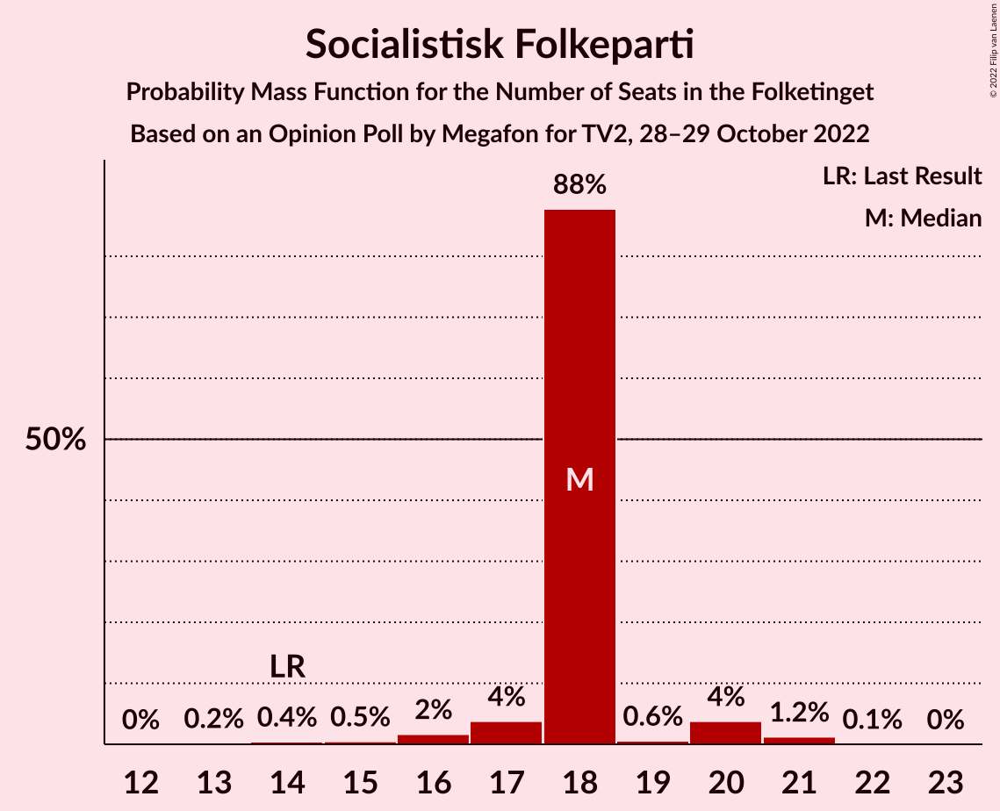

| Number of Seats | Probability | Accumulated | Special Marks |
|:---------------:|:-----------:|:-----------:|:-------------:|
| 13 | 0.2% | 100% |  |
| 14 | 0.4% | 99.8% | Last Result |
| 15 | 0.5% | 99.4% |  |
| 16 | 2% | 98.9% |  |
| 17 | 4% | 97% |  |
| 18 | 88% | 93% | Median |
| 19 | 0.6% | 6% |  |
| 20 | 4% | 5% |  |
| 21 | 1.2% | 1.3% |  |
| 22 | 0.1% | 0.1% |  |
| 23 | 0% | 0% |  |

### Moderaterne

*For a full overview of the results for this party, see the [Moderaterne](party-moderaterne.html) page.*

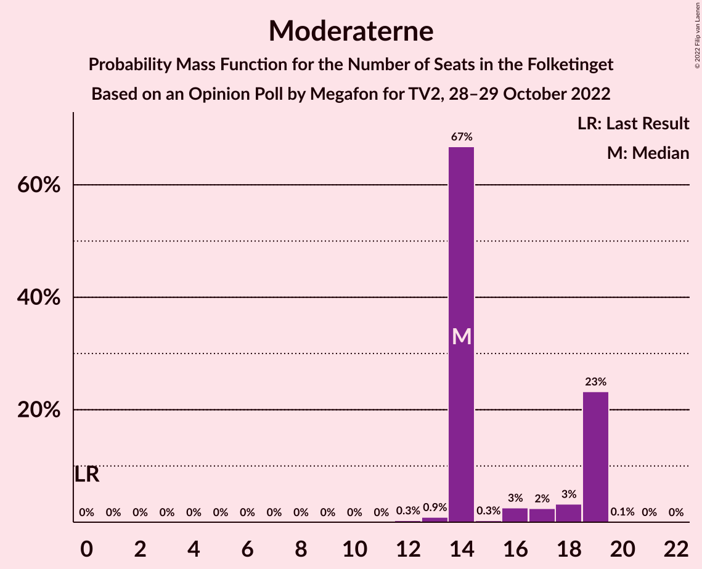

| Number of Seats | Probability | Accumulated | Special Marks |
|:---------------:|:-----------:|:-----------:|:-------------:|
| 0 | 0% | 100% | Last Result |
| 1 | 0% | 100% |  |
| 2 | 0% | 100% |  |
| 3 | 0% | 100% |  |
| 4 | 0% | 100% |  |
| 5 | 0% | 100% |  |
| 6 | 0% | 100% |  |
| 7 | 0% | 100% |  |
| 8 | 0% | 100% |  |
| 9 | 0% | 100% |  |
| 10 | 0% | 100% |  |
| 11 | 0% | 100% |  |
| 12 | 0.3% | 100% |  |
| 13 | 0.9% | 99.7% |  |
| 14 | 67% | 98.8% | Median |
| 15 | 0.3% | 32% |  |
| 16 | 3% | 32% |  |
| 17 | 2% | 29% |  |
| 18 | 3% | 27% |  |
| 19 | 23% | 23% |  |
| 20 | 0.1% | 0.2% |  |
| 21 | 0% | 0% |  |

### Liberal Alliance

*For a full overview of the results for this party, see the [Liberal Alliance](party-liberalalliance.html) page.*

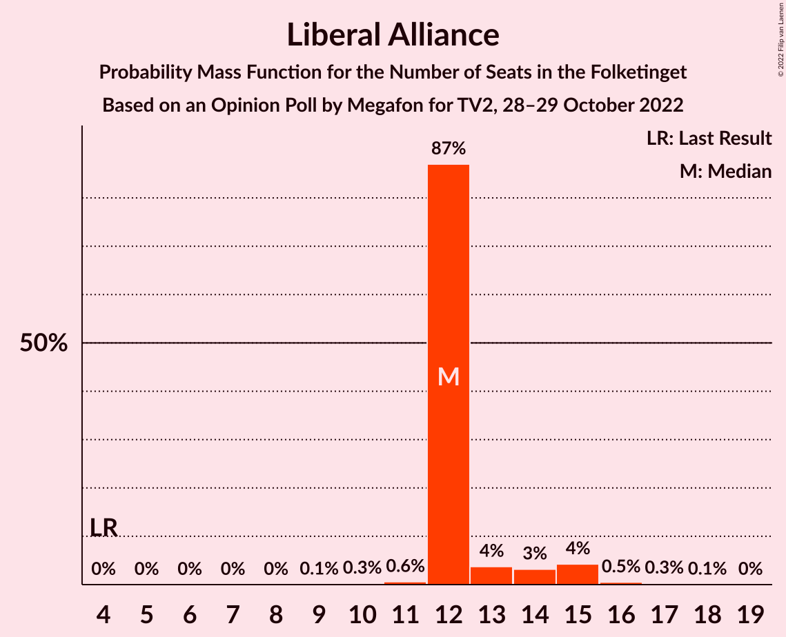

| Number of Seats | Probability | Accumulated | Special Marks |
|:---------------:|:-----------:|:-----------:|:-------------:|
| 4 | 0% | 100% | Last Result |
| 5 | 0% | 100% |  |
| 6 | 0% | 100% |  |
| 7 | 0% | 100% |  |
| 8 | 0% | 100% |  |
| 9 | 0.1% | 100% |  |
| 10 | 0.3% | 99.9% |  |
| 11 | 0.6% | 99.7% |  |
| 12 | 87% | 99.1% | Median |
| 13 | 4% | 12% |  |
| 14 | 3% | 8% |  |
| 15 | 4% | 5% |  |
| 16 | 0.5% | 0.9% |  |
| 17 | 0.3% | 0.4% |  |
| 18 | 0.1% | 0.1% |  |
| 19 | 0% | 0% |  |

### Danmarksdemokraterne

*For a full overview of the results for this party, see the [Danmarksdemokraterne](party-danmarksdemokraterne.html) page.*

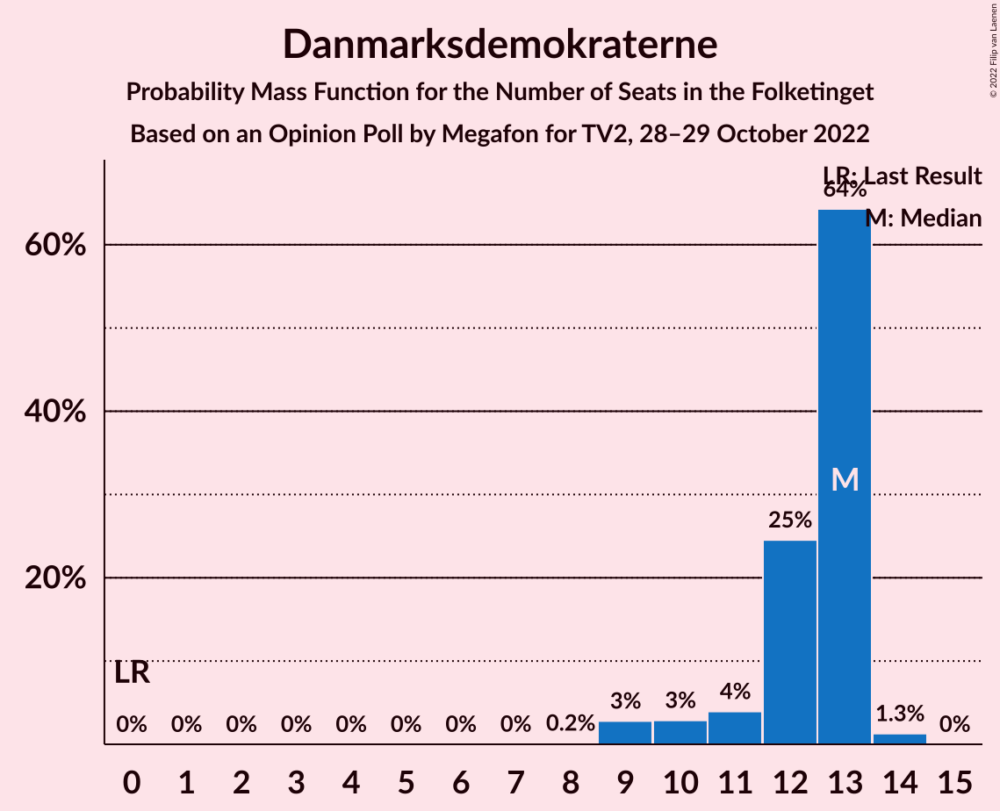

| Number of Seats | Probability | Accumulated | Special Marks |
|:---------------:|:-----------:|:-----------:|:-------------:|
| 0 | 0% | 100% | Last Result |
| 1 | 0% | 100% |  |
| 2 | 0% | 100% |  |
| 3 | 0% | 100% |  |
| 4 | 0% | 100% |  |
| 5 | 0% | 100% |  |
| 6 | 0% | 100% |  |
| 7 | 0% | 100% |  |
| 8 | 0.2% | 100% |  |
| 9 | 3% | 99.8% |  |
| 10 | 3% | 97% |  |
| 11 | 4% | 94% |  |
| 12 | 25% | 90% |  |
| 13 | 64% | 66% | Median |
| 14 | 1.3% | 1.3% |  |
| 15 | 0% | 0% |  |

### Det Konservative Folkeparti

*For a full overview of the results for this party, see the [Det Konservative Folkeparti](party-detkonservativefolkeparti.html) page.*

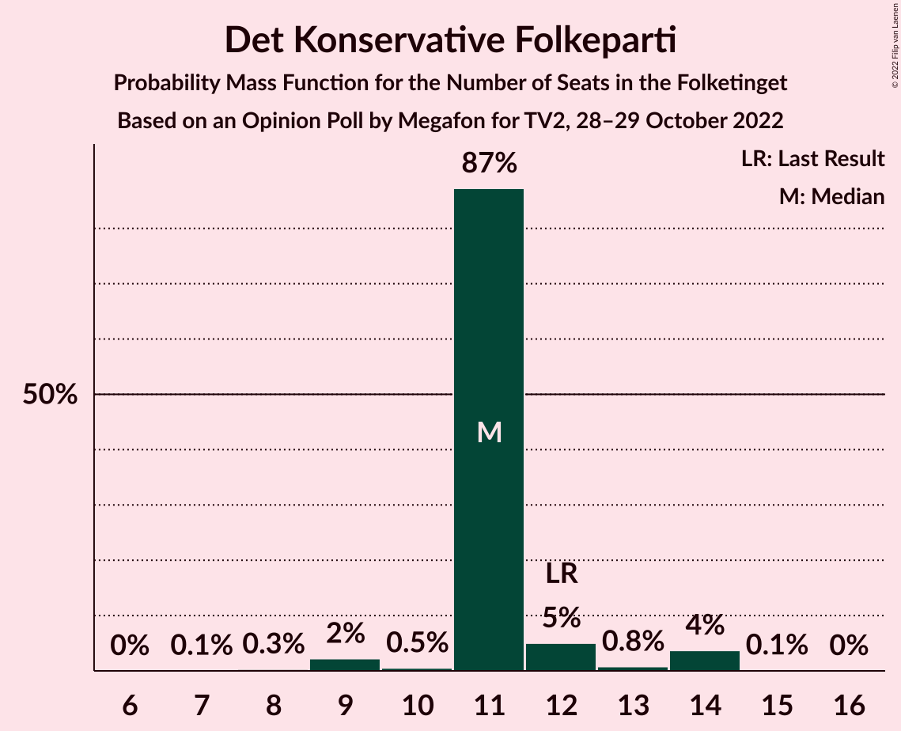

| Number of Seats | Probability | Accumulated | Special Marks |
|:---------------:|:-----------:|:-----------:|:-------------:|
| 7 | 0.1% | 100% |  |
| 8 | 0.3% | 99.9% |  |
| 9 | 2% | 99.6% |  |
| 10 | 0.5% | 97% |  |
| 11 | 87% | 97% | Median |
| 12 | 5% | 10% | Last Result |
| 13 | 0.8% | 5% |  |
| 14 | 4% | 4% |  |
| 15 | 0.1% | 0.1% |  |
| 16 | 0% | 0% |  |

### Enhedslisten–De Rød-Grønne

*For a full overview of the results for this party, see the [Enhedslisten–De Rød-Grønne](party-enhedslisten–derød-grønne.html) page.*

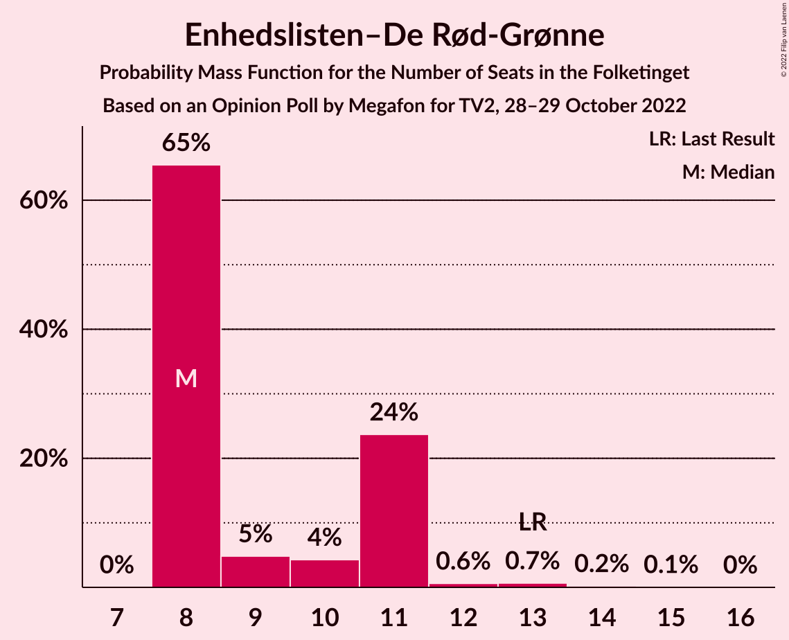

| Number of Seats | Probability | Accumulated | Special Marks |
|:---------------:|:-----------:|:-----------:|:-------------:|
| 7 | 0% | 100% |  |
| 8 | 65% | 99.9% | Median |
| 9 | 5% | 34% |  |
| 10 | 4% | 30% |  |
| 11 | 24% | 25% |  |
| 12 | 0.6% | 2% |  |
| 13 | 0.7% | 1.0% | Last Result |
| 14 | 0.2% | 0.3% |  |
| 15 | 0.1% | 0.1% |  |
| 16 | 0% | 0% |  |

### Nye Borgerlige

*For a full overview of the results for this party, see the [Nye Borgerlige](party-nyeborgerlige.html) page.*

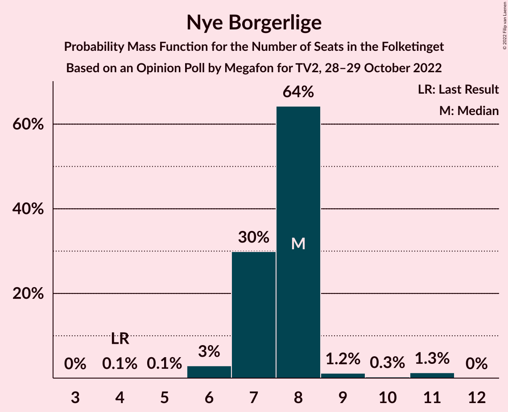

| Number of Seats | Probability | Accumulated | Special Marks |
|:---------------:|:-----------:|:-----------:|:-------------:|
| 4 | 0.1% | 100% | Last Result |
| 5 | 0.1% | 99.9% |  |
| 6 | 3% | 99.8% |  |
| 7 | 30% | 97% |  |
| 8 | 64% | 67% | Median |
| 9 | 1.2% | 3% |  |
| 10 | 0.3% | 2% |  |
| 11 | 1.3% | 1.3% |  |
| 12 | 0% | 0% |  |

### Radikale Venstre

*For a full overview of the results for this party, see the [Radikale Venstre](party-radikalevenstre.html) page.*

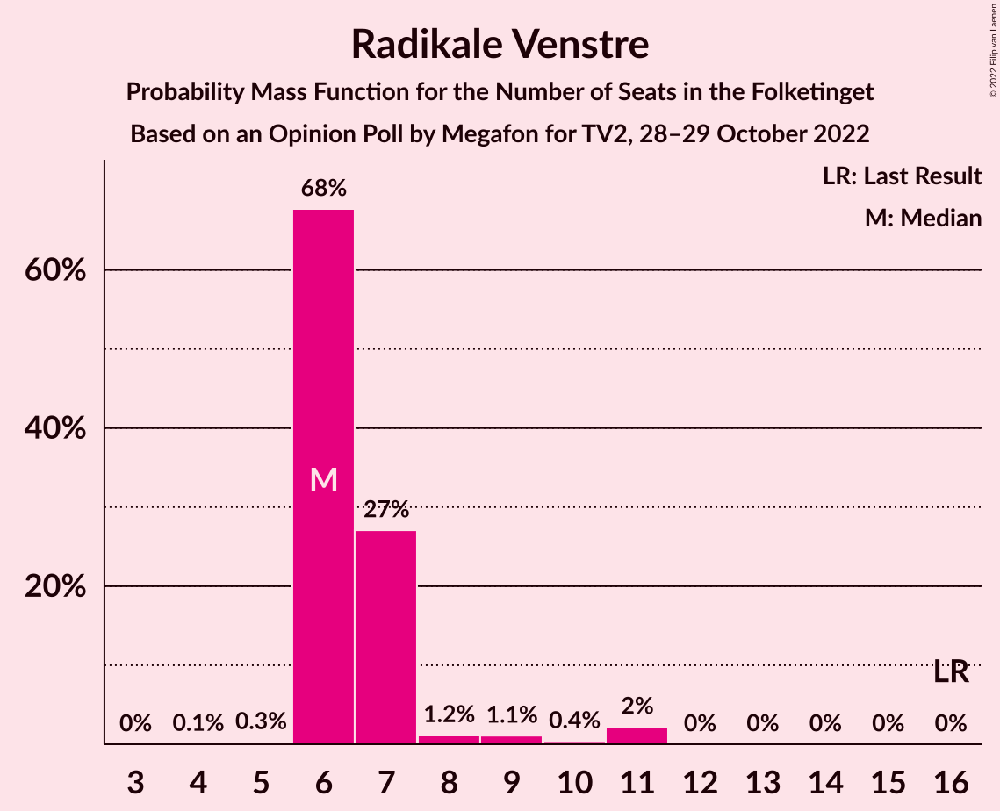

| Number of Seats | Probability | Accumulated | Special Marks |
|:---------------:|:-----------:|:-----------:|:-------------:|
| 4 | 0.1% | 100% |  |
| 5 | 0.3% | 99.9% |  |
| 6 | 68% | 99.7% | Median |
| 7 | 27% | 32% |  |
| 8 | 1.2% | 5% |  |
| 9 | 1.1% | 4% |  |
| 10 | 0.4% | 3% |  |
| 11 | 2% | 2% |  |
| 12 | 0% | 0% |  |
| 13 | 0% | 0% |  |
| 14 | 0% | 0% |  |
| 15 | 0% | 0% |  |
| 16 | 0% | 0% | Last Result |

### Dansk Folkeparti

*For a full overview of the results for this party, see the [Dansk Folkeparti](party-danskfolkeparti.html) page.*

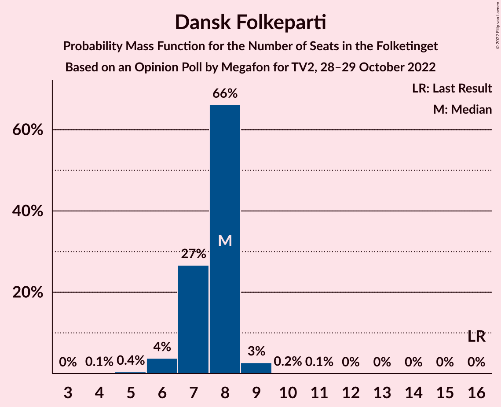

| Number of Seats | Probability | Accumulated | Special Marks |
|:---------------:|:-----------:|:-----------:|:-------------:|
| 4 | 0.1% | 100% |  |
| 5 | 0.4% | 99.9% |  |
| 6 | 4% | 99.5% |  |
| 7 | 27% | 96% |  |
| 8 | 66% | 69% | Median |
| 9 | 3% | 3% |  |
| 10 | 0.2% | 0.3% |  |
| 11 | 0.1% | 0.1% |  |
| 12 | 0% | 0% |  |
| 13 | 0% | 0% |  |
| 14 | 0% | 0% |  |
| 15 | 0% | 0% |  |
| 16 | 0% | 0% | Last Result |

### Alternativet

*For a full overview of the results for this party, see the [Alternativet](party-alternativet.html) page.*

| Number of Seats | Probability | Accumulated | Special Marks |
|:---------------:|:-----------:|:-----------:|:-------------:|
| 0 | 0.7% | 100% |  |
| 1 | 0% | 99.3% |  |
| 2 | 0% | 99.3% |  |
| 3 | 0% | 99.3% |  |
| 4 | 6% | 99.3% |  |
| 5 | 1.0% | 93% | Last Result |
| 6 | 91% | 92% | Median |
| 7 | 0.3% | 0.8% |  |
| 8 | 0.5% | 0.5% |  |
| 9 | 0% | 0% |  |

### Kristendemokraterne

*For a full overview of the results for this party, see the [Kristendemokraterne](party-kristendemokraterne.html) page.*

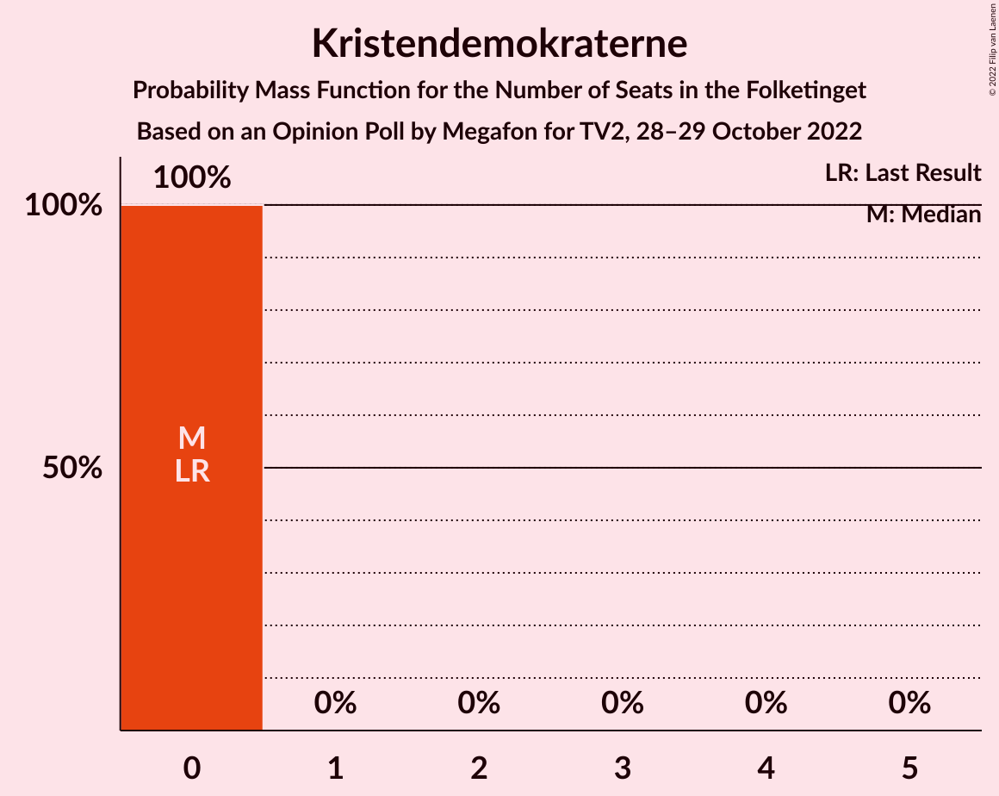

| Number of Seats | Probability | Accumulated | Special Marks |
|:---------------:|:-----------:|:-----------:|:-------------:|
| 0 | 100% | 100% | Last Result, Median |

### Frie Grønne

*For a full overview of the results for this party, see the [Frie Grønne](party-friegrønne.html) page.*

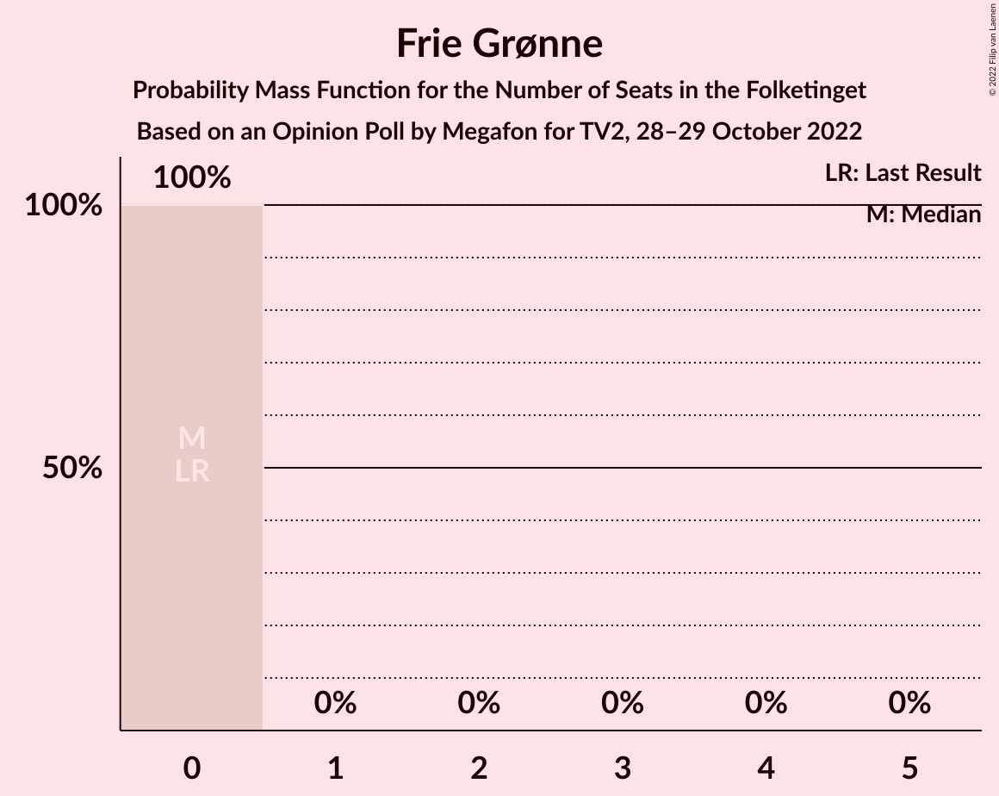

| Number of Seats | Probability | Accumulated | Special Marks |
|:---------------:|:-----------:|:-----------:|:-------------:|
| 0 | 100% | 100% | Last Result, Median |

## Coalitions

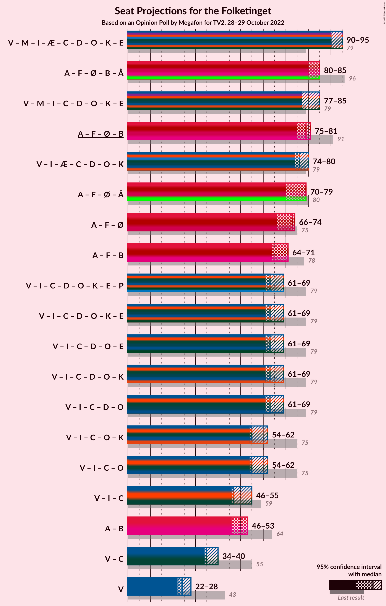

### Confidence Intervals

| Coalition | Last Result | Median | Majority? | 80% Confidence Interval | 90% Confidence Interval | 95% Confidence Interval | 99% Confidence Interval |
|:---------:|:-----------:|:------:|:---------:|:-----------------------:|:-----------------------:|:-----------------------:|:-----------------------:|
| Socialdemokraterne – Socialistisk Folkeparti – Enhedslisten–De Rød-Grønne – Radikale Venstre – Alternativet | 96 | 85 | 0.7% | 81–85 | 81–85 | 80–85 | 79–90 |
| Socialdemokraterne – Socialistisk Folkeparti – Enhedslisten–De Rød-Grønne – Radikale Venstre | 91 | 79 | 0% | 75–79 | 75–79 | 75–81 | 73–85 |
| Venstre – Liberal Alliance – Danmarksdemokraterne – Det Konservative Folkeparti – Nye Borgerlige – Dansk Folkeparti – Kristendemokraterne | 79 | 76 | 0% | 75–76 | 75–79 | 74–80 | 68–81 |
| Socialdemokraterne – Socialistisk Folkeparti – Enhedslisten–De Rød-Grønne – Alternativet | 80 | 79 | 0% | 74–79 | 74–79 | 70–79 | 70–82 |
| Socialdemokraterne – Socialistisk Folkeparti – Enhedslisten–De Rød-Grønne | 75 | 73 | 0% | 68–73 | 68–73 | 66–74 | 66–77 |
| Socialdemokraterne – Socialistisk Folkeparti – Radikale Venstre | 78 | 71 | 0% | 64–71 | 64–71 | 64–71 | 63–75 |
| Venstre – Liberal Alliance – Det Konservative Folkeparti – Nye Borgerlige – Dansk Folkeparti – Kristendemokraterne | 79 | 63 | 0% | 63 | 63–68 | 61–69 | 59–70 |
| Venstre – Liberal Alliance – Det Konservative Folkeparti – Nye Borgerlige – Dansk Folkeparti | 79 | 63 | 0% | 63 | 63–68 | 61–69 | 59–70 |
| Venstre – Liberal Alliance – Det Konservative Folkeparti – Dansk Folkeparti – Kristendemokraterne | 75 | 55 | 0% | 55–56 | 55–61 | 54–62 | 51–63 |
| Venstre – Liberal Alliance – Det Konservative Folkeparti – Dansk Folkeparti | 75 | 55 | 0% | 55–56 | 55–61 | 54–62 | 51–63 |
| Venstre – Liberal Alliance – Det Konservative Folkeparti | 59 | 47 | 0% | 47–49 | 47–53 | 46–55 | 45–55 |
| Socialdemokraterne – Radikale Venstre | 64 | 53 | 0% | 46–53 | 46–53 | 46–53 | 46–56 |
| Venstre – Det Konservative Folkeparti | 55 | 35 | 0% | 35–37 | 35–38 | 34–40 | 32–41 |
| Venstre | 43 | 24 | 0% | 24–26 | 23–27 | 22–28 | 20–28 |

### Socialdemokraterne – Socialistisk Folkeparti – Enhedslisten–De Rød-Grønne – Radikale Venstre – Alternativet

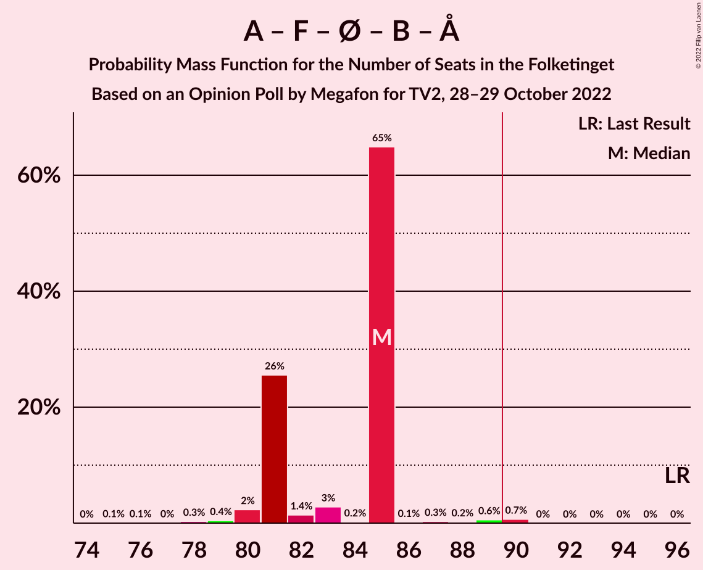

| Number of Seats | Probability | Accumulated | Special Marks |
|:---------------:|:-----------:|:-----------:|:-------------:|
| 75 | 0.1% | 100% |  |
| 76 | 0.1% | 99.9% |  |
| 77 | 0% | 99.9% |  |
| 78 | 0.3% | 99.8% |  |
| 79 | 0.4% | 99.5% |  |
| 80 | 2% | 99.1% |  |
| 81 | 26% | 97% |  |
| 82 | 1.4% | 71% |  |
| 83 | 3% | 70% |  |
| 84 | 0.2% | 67% |  |
| 85 | 65% | 67% | Median |
| 86 | 0.1% | 2% |  |
| 87 | 0.3% | 2% |  |
| 88 | 0.2% | 1.5% |  |
| 89 | 0.6% | 1.3% |  |
| 90 | 0.7% | 0.7% | Majority |
| 91 | 0% | 0% |  |
| 92 | 0% | 0% |  |
| 93 | 0% | 0% |  |
| 94 | 0% | 0% |  |
| 95 | 0% | 0% |  |
| 96 | 0% | 0% | Last Result |

### Socialdemokraterne – Socialistisk Folkeparti – Enhedslisten–De Rød-Grønne – Radikale Venstre

| Number of Seats | Probability | Accumulated | Special Marks |
|:---------------:|:-----------:|:-----------:|:-------------:|
| 69 | 0.1% | 100% |  |
| 70 | 0% | 99.9% |  |
| 71 | 0% | 99.9% |  |
| 72 | 0.2% | 99.9% |  |
| 73 | 0.4% | 99.7% |  |
| 74 | 0.1% | 99.4% |  |
| 75 | 23% | 99.3% |  |
| 76 | 4% | 76% |  |
| 77 | 5% | 73% |  |
| 78 | 0.1% | 68% |  |
| 79 | 64% | 68% | Median |
| 80 | 0.4% | 4% |  |
| 81 | 1.3% | 3% |  |
| 82 | 0.9% | 2% |  |
| 83 | 0.1% | 0.9% |  |
| 84 | 0.2% | 0.9% |  |
| 85 | 0.5% | 0.6% |  |
| 86 | 0.1% | 0.1% |  |
| 87 | 0% | 0% |  |
| 88 | 0% | 0% |  |
| 89 | 0% | 0% |  |
| 90 | 0% | 0% | Majority |
| 91 | 0% | 0% | Last Result |

### Venstre – Liberal Alliance – Danmarksdemokraterne – Det Konservative Folkeparti – Nye Borgerlige – Dansk Folkeparti – Kristendemokraterne

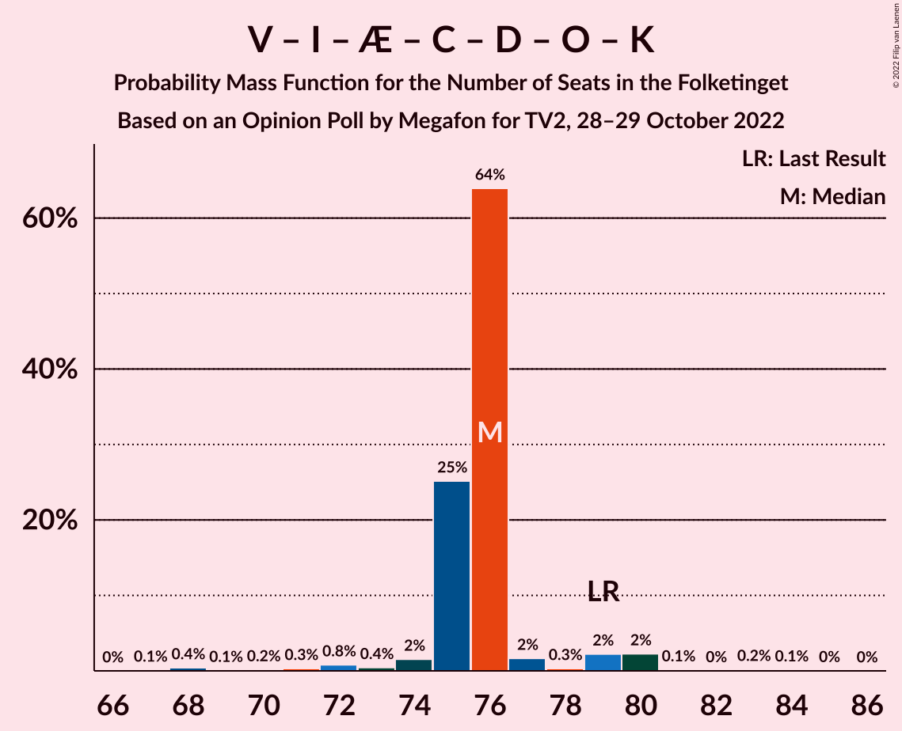

| Number of Seats | Probability | Accumulated | Special Marks |
|:---------------:|:-----------:|:-----------:|:-------------:|
| 67 | 0.1% | 100% |  |
| 68 | 0.4% | 99.9% |  |
| 69 | 0.1% | 99.5% |  |
| 70 | 0.2% | 99.4% |  |
| 71 | 0.3% | 99.3% |  |
| 72 | 0.8% | 98.9% |  |
| 73 | 0.4% | 98% |  |
| 74 | 2% | 98% |  |
| 75 | 25% | 96% |  |
| 76 | 64% | 71% | Median |
| 77 | 2% | 7% |  |
| 78 | 0.3% | 5% |  |
| 79 | 2% | 5% | Last Result |
| 80 | 2% | 3% |  |
| 81 | 0.1% | 0.5% |  |
| 82 | 0% | 0.4% |  |
| 83 | 0.2% | 0.4% |  |
| 84 | 0.1% | 0.2% |  |
| 85 | 0% | 0.1% |  |
| 86 | 0% | 0% |  |

### Socialdemokraterne – Socialistisk Folkeparti – Enhedslisten–De Rød-Grønne – Alternativet

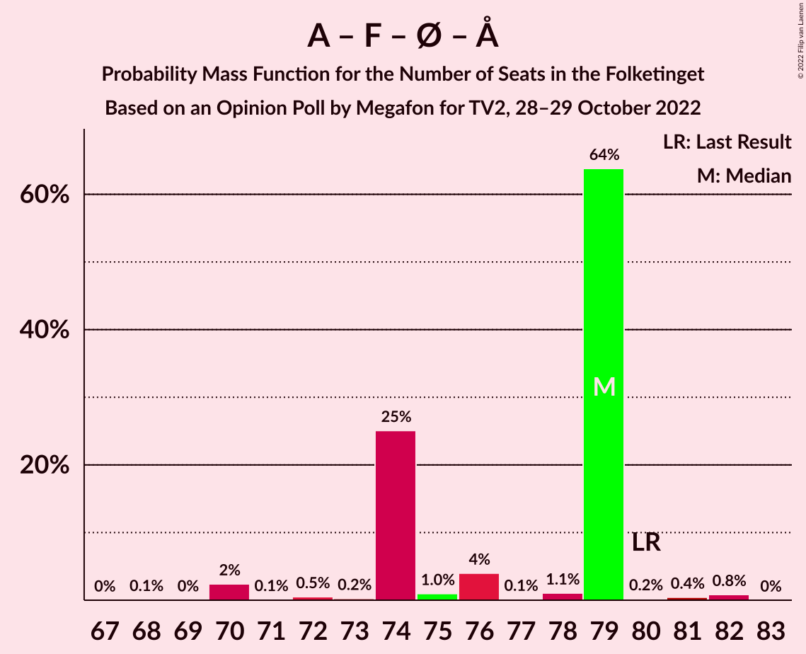

| Number of Seats | Probability | Accumulated | Special Marks |
|:---------------:|:-----------:|:-----------:|:-------------:|
| 68 | 0.1% | 100% |  |
| 69 | 0% | 99.9% |  |
| 70 | 2% | 99.8% |  |
| 71 | 0.1% | 97% |  |
| 72 | 0.5% | 97% |  |
| 73 | 0.2% | 97% |  |
| 74 | 25% | 97% |  |
| 75 | 1.0% | 71% |  |
| 76 | 4% | 71% |  |
| 77 | 0.1% | 67% |  |
| 78 | 1.1% | 66% |  |
| 79 | 64% | 65% | Median |
| 80 | 0.2% | 2% | Last Result |
| 81 | 0.4% | 1.3% |  |
| 82 | 0.8% | 0.9% |  |
| 83 | 0% | 0% |  |

### Socialdemokraterne – Socialistisk Folkeparti – Enhedslisten–De Rød-Grønne

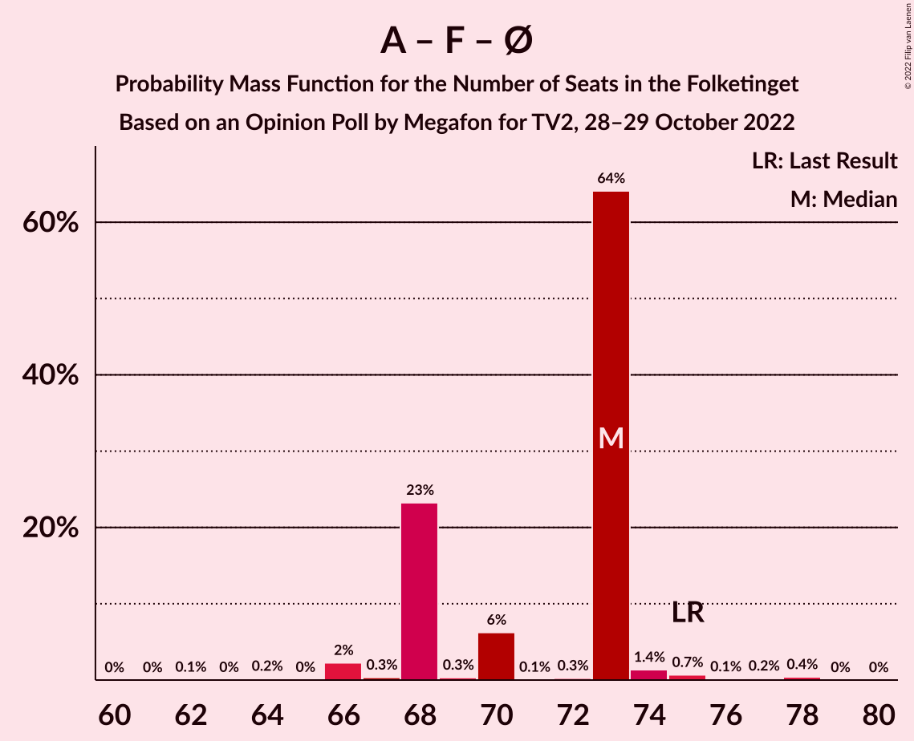

| Number of Seats | Probability | Accumulated | Special Marks |
|:---------------:|:-----------:|:-----------:|:-------------:|
| 62 | 0.1% | 100% |  |
| 63 | 0% | 99.9% |  |
| 64 | 0.2% | 99.9% |  |
| 65 | 0% | 99.7% |  |
| 66 | 2% | 99.7% |  |
| 67 | 0.3% | 97% |  |
| 68 | 23% | 97% |  |
| 69 | 0.3% | 74% |  |
| 70 | 6% | 73% |  |
| 71 | 0.1% | 67% |  |
| 72 | 0.3% | 67% |  |
| 73 | 64% | 67% | Median |
| 74 | 1.4% | 3% |  |
| 75 | 0.7% | 1.4% | Last Result |
| 76 | 0.1% | 0.8% |  |
| 77 | 0.2% | 0.6% |  |
| 78 | 0.4% | 0.4% |  |
| 79 | 0% | 0% |  |

### Socialdemokraterne – Socialistisk Folkeparti – Radikale Venstre

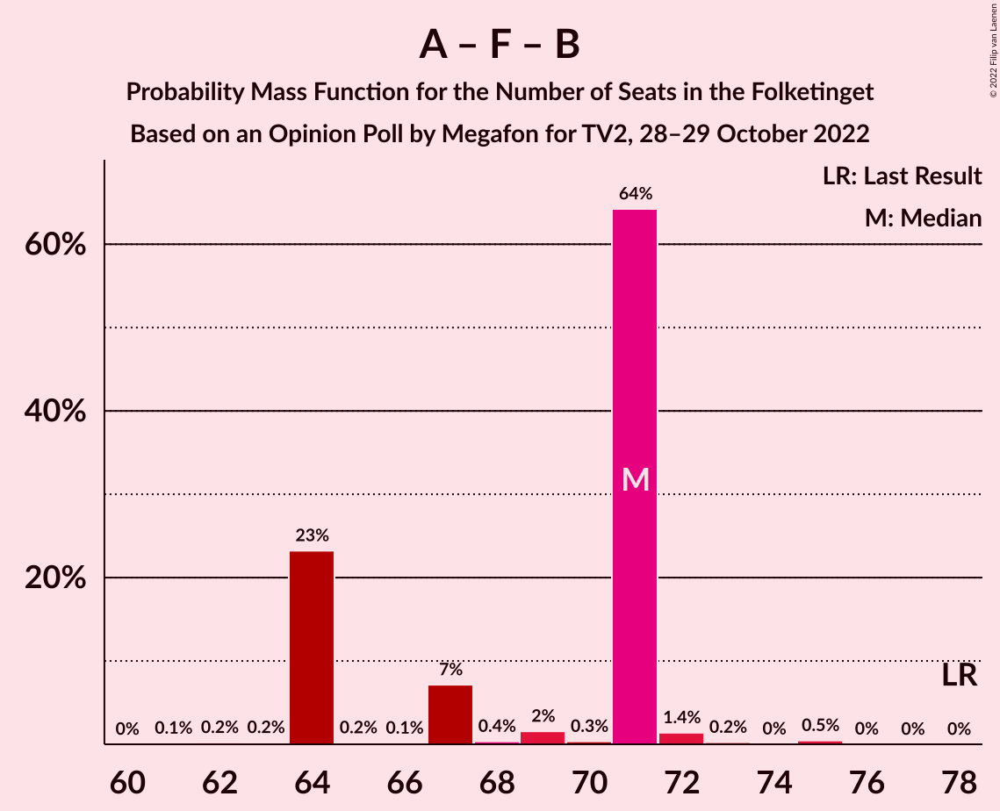

| Number of Seats | Probability | Accumulated | Special Marks |
|:---------------:|:-----------:|:-----------:|:-------------:|
| 61 | 0.1% | 100% |  |
| 62 | 0.2% | 99.8% |  |
| 63 | 0.2% | 99.6% |  |
| 64 | 23% | 99.4% |  |
| 65 | 0.2% | 76% |  |
| 66 | 0.1% | 76% |  |
| 67 | 7% | 76% |  |
| 68 | 0.4% | 69% |  |
| 69 | 2% | 68% |  |
| 70 | 0.3% | 67% |  |
| 71 | 64% | 66% | Median |
| 72 | 1.4% | 2% |  |
| 73 | 0.2% | 0.8% |  |
| 74 | 0% | 0.6% |  |
| 75 | 0.5% | 0.5% |  |
| 76 | 0% | 0% |  |
| 77 | 0% | 0% |  |
| 78 | 0% | 0% | Last Result |

### Venstre – Liberal Alliance – Det Konservative Folkeparti – Nye Borgerlige – Dansk Folkeparti – Kristendemokraterne

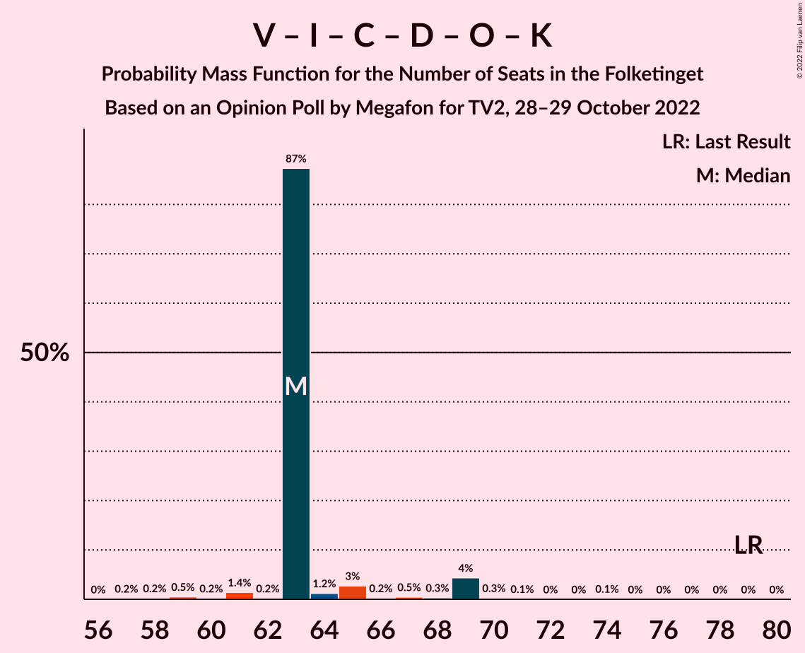

| Number of Seats | Probability | Accumulated | Special Marks |
|:---------------:|:-----------:|:-----------:|:-------------:|
| 57 | 0.2% | 100% |  |
| 58 | 0.2% | 99.8% |  |
| 59 | 0.5% | 99.6% |  |
| 60 | 0.2% | 99.1% |  |
| 61 | 1.4% | 98.9% |  |
| 62 | 0.2% | 97% |  |
| 63 | 87% | 97% | Median |
| 64 | 1.2% | 10% |  |
| 65 | 3% | 9% |  |
| 66 | 0.2% | 6% |  |
| 67 | 0.5% | 6% |  |
| 68 | 0.3% | 5% |  |
| 69 | 4% | 5% |  |
| 70 | 0.3% | 0.5% |  |
| 71 | 0.1% | 0.2% |  |
| 72 | 0% | 0.2% |  |
| 73 | 0% | 0.1% |  |
| 74 | 0.1% | 0.1% |  |
| 75 | 0% | 0% |  |
| 76 | 0% | 0% |  |
| 77 | 0% | 0% |  |
| 78 | 0% | 0% |  |
| 79 | 0% | 0% | Last Result |

### Venstre – Liberal Alliance – Det Konservative Folkeparti – Nye Borgerlige – Dansk Folkeparti

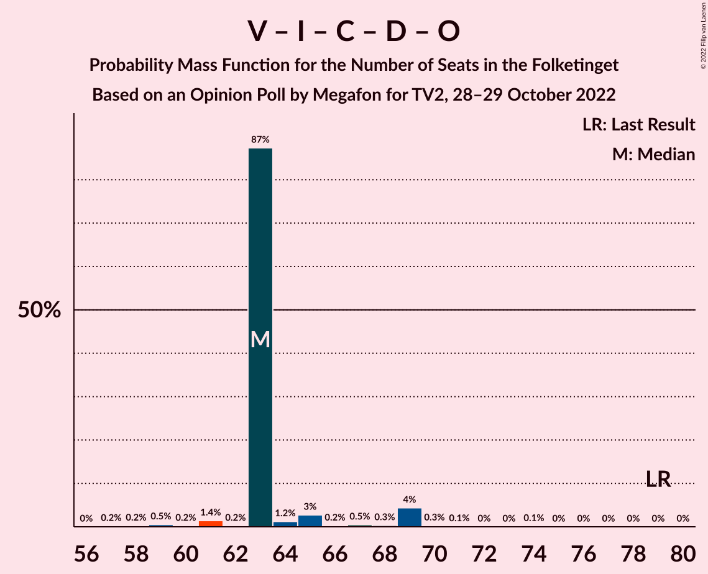

| Number of Seats | Probability | Accumulated | Special Marks |
|:---------------:|:-----------:|:-----------:|:-------------:|
| 57 | 0.2% | 100% |  |
| 58 | 0.2% | 99.8% |  |
| 59 | 0.5% | 99.6% |  |
| 60 | 0.2% | 99.1% |  |
| 61 | 1.4% | 98.9% |  |
| 62 | 0.2% | 97% |  |
| 63 | 87% | 97% | Median |
| 64 | 1.2% | 10% |  |
| 65 | 3% | 9% |  |
| 66 | 0.2% | 6% |  |
| 67 | 0.5% | 6% |  |
| 68 | 0.3% | 5% |  |
| 69 | 4% | 5% |  |
| 70 | 0.3% | 0.5% |  |
| 71 | 0.1% | 0.2% |  |
| 72 | 0% | 0.2% |  |
| 73 | 0% | 0.1% |  |
| 74 | 0.1% | 0.1% |  |
| 75 | 0% | 0% |  |
| 76 | 0% | 0% |  |
| 77 | 0% | 0% |  |
| 78 | 0% | 0% |  |
| 79 | 0% | 0% | Last Result |

### Venstre – Liberal Alliance – Det Konservative Folkeparti – Dansk Folkeparti – Kristendemokraterne

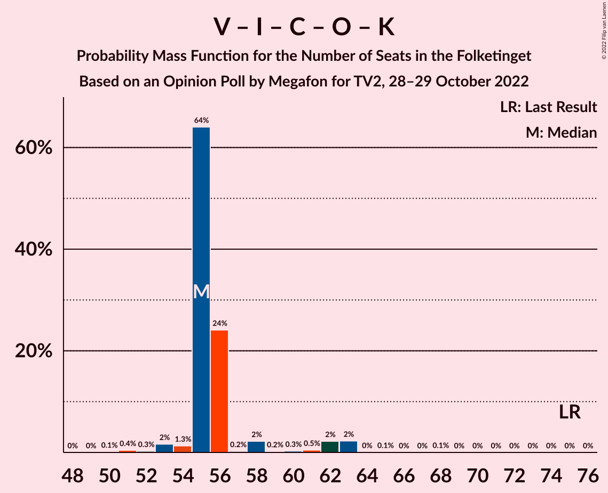

| Number of Seats | Probability | Accumulated | Special Marks |
|:---------------:|:-----------:|:-----------:|:-------------:|
| 50 | 0.1% | 100% |  |
| 51 | 0.4% | 99.9% |  |
| 52 | 0.3% | 99.4% |  |
| 53 | 2% | 99.2% |  |
| 54 | 1.3% | 98% |  |
| 55 | 64% | 96% | Median |
| 56 | 24% | 32% |  |
| 57 | 0.2% | 8% |  |
| 58 | 2% | 8% |  |
| 59 | 0.2% | 6% |  |
| 60 | 0.3% | 5% |  |
| 61 | 0.5% | 5% |  |
| 62 | 2% | 5% |  |
| 63 | 2% | 2% |  |
| 64 | 0% | 0.2% |  |
| 65 | 0.1% | 0.1% |  |
| 66 | 0% | 0.1% |  |
| 67 | 0% | 0.1% |  |
| 68 | 0.1% | 0.1% |  |
| 69 | 0% | 0% |  |
| 70 | 0% | 0% |  |
| 71 | 0% | 0% |  |
| 72 | 0% | 0% |  |
| 73 | 0% | 0% |  |
| 74 | 0% | 0% |  |
| 75 | 0% | 0% | Last Result |

### Venstre – Liberal Alliance – Det Konservative Folkeparti – Dansk Folkeparti

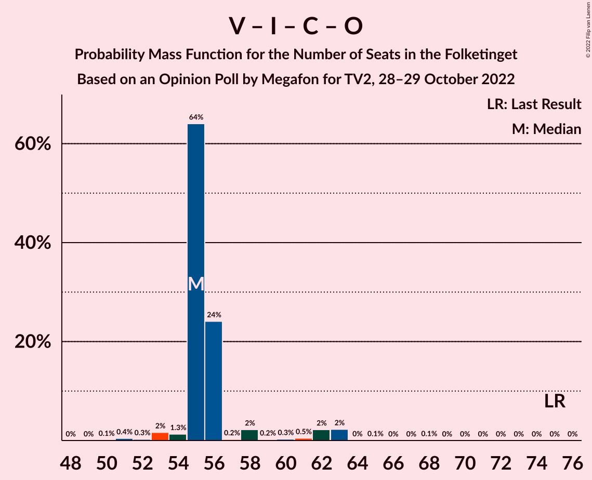

| Number of Seats | Probability | Accumulated | Special Marks |
|:---------------:|:-----------:|:-----------:|:-------------:|
| 50 | 0.1% | 100% |  |
| 51 | 0.4% | 99.9% |  |
| 52 | 0.3% | 99.4% |  |
| 53 | 2% | 99.2% |  |
| 54 | 1.3% | 98% |  |
| 55 | 64% | 96% | Median |
| 56 | 24% | 32% |  |
| 57 | 0.2% | 8% |  |
| 58 | 2% | 8% |  |
| 59 | 0.2% | 6% |  |
| 60 | 0.3% | 5% |  |
| 61 | 0.5% | 5% |  |
| 62 | 2% | 5% |  |
| 63 | 2% | 2% |  |
| 64 | 0% | 0.2% |  |
| 65 | 0.1% | 0.1% |  |
| 66 | 0% | 0.1% |  |
| 67 | 0% | 0.1% |  |
| 68 | 0.1% | 0.1% |  |
| 69 | 0% | 0% |  |
| 70 | 0% | 0% |  |
| 71 | 0% | 0% |  |
| 72 | 0% | 0% |  |
| 73 | 0% | 0% |  |
| 74 | 0% | 0% |  |
| 75 | 0% | 0% | Last Result |

### Venstre – Liberal Alliance – Det Konservative Folkeparti

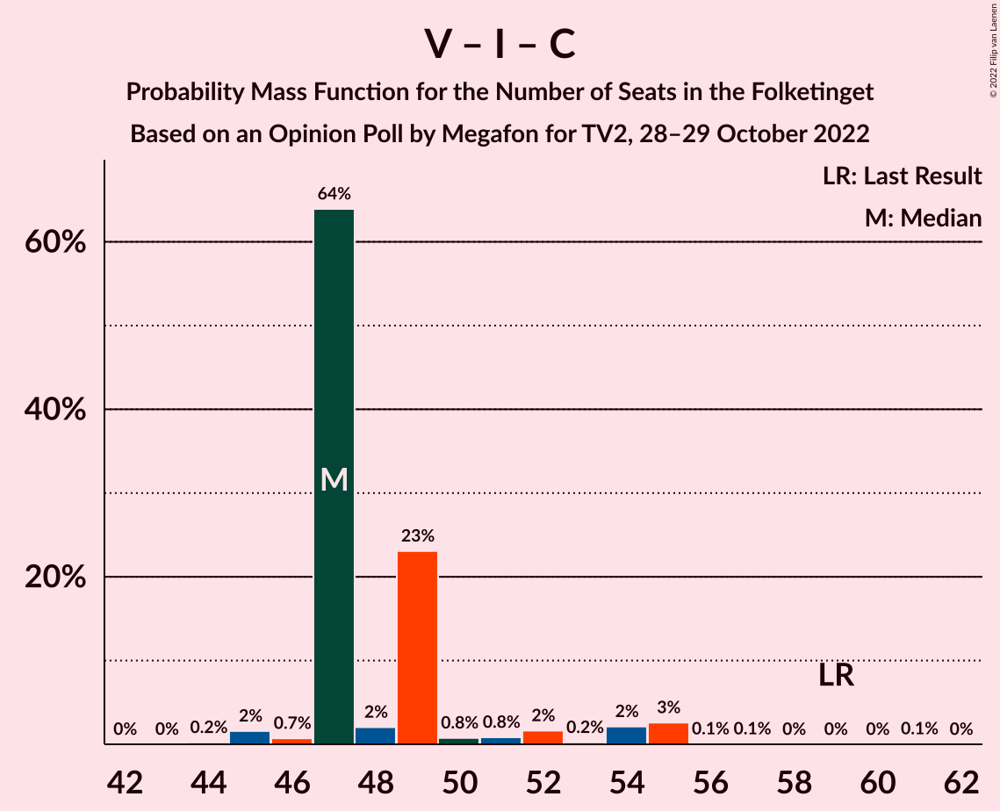

| Number of Seats | Probability | Accumulated | Special Marks |
|:---------------:|:-----------:|:-----------:|:-------------:|
| 44 | 0.2% | 100% |  |
| 45 | 2% | 99.7% |  |
| 46 | 0.7% | 98% |  |
| 47 | 64% | 97% | Median |
| 48 | 2% | 34% |  |
| 49 | 23% | 31% |  |
| 50 | 0.8% | 8% |  |
| 51 | 0.8% | 8% |  |
| 52 | 2% | 7% |  |
| 53 | 0.2% | 5% |  |
| 54 | 2% | 5% |  |
| 55 | 3% | 3% |  |
| 56 | 0.1% | 0.2% |  |
| 57 | 0.1% | 0.1% |  |
| 58 | 0% | 0.1% |  |
| 59 | 0% | 0.1% | Last Result |
| 60 | 0% | 0.1% |  |
| 61 | 0.1% | 0.1% |  |
| 62 | 0% | 0% |  |

### Socialdemokraterne – Radikale Venstre

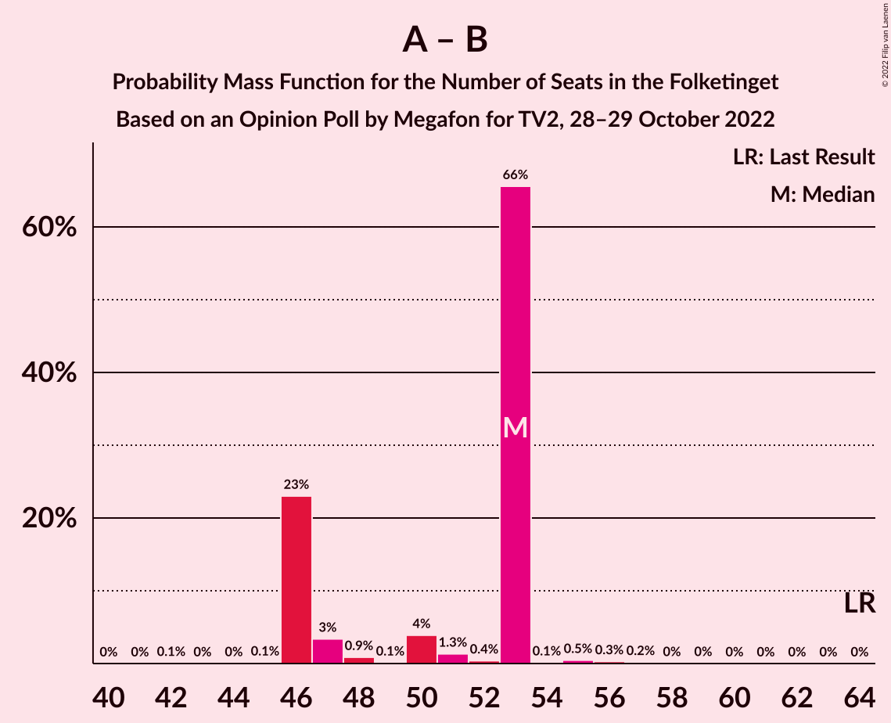

| Number of Seats | Probability | Accumulated | Special Marks |
|:---------------:|:-----------:|:-----------:|:-------------:|
| 42 | 0.1% | 100% |  |
| 43 | 0% | 99.9% |  |
| 44 | 0% | 99.9% |  |
| 45 | 0.1% | 99.9% |  |
| 46 | 23% | 99.8% |  |
| 47 | 3% | 77% |  |
| 48 | 0.9% | 73% |  |
| 49 | 0.1% | 73% |  |
| 50 | 4% | 72% |  |
| 51 | 1.3% | 68% |  |
| 52 | 0.4% | 67% |  |
| 53 | 66% | 67% | Median |
| 54 | 0.1% | 1.2% |  |
| 55 | 0.5% | 1.0% |  |
| 56 | 0.3% | 0.6% |  |
| 57 | 0.2% | 0.3% |  |
| 58 | 0% | 0.1% |  |
| 59 | 0% | 0.1% |  |
| 60 | 0% | 0% |  |
| 61 | 0% | 0% |  |
| 62 | 0% | 0% |  |
| 63 | 0% | 0% |  |
| 64 | 0% | 0% | Last Result |

### Venstre – Det Konservative Folkeparti

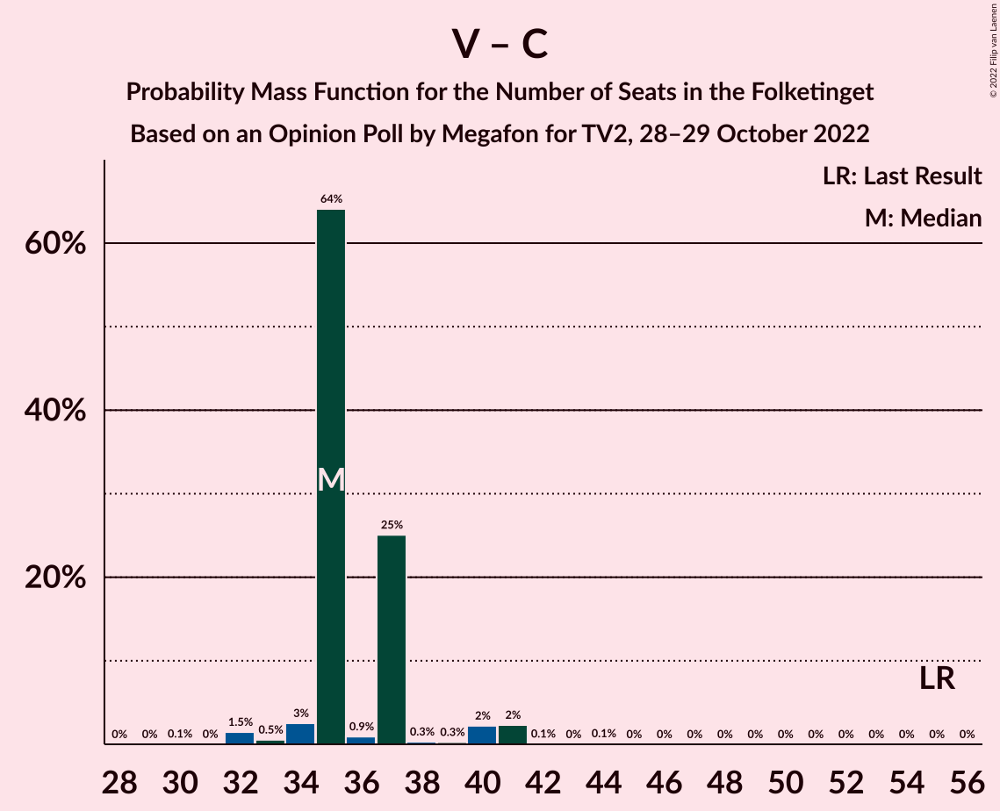

| Number of Seats | Probability | Accumulated | Special Marks |
|:---------------:|:-----------:|:-----------:|:-------------:|
| 30 | 0.1% | 100% |  |
| 31 | 0% | 99.9% |  |
| 32 | 1.5% | 99.9% |  |
| 33 | 0.5% | 98% |  |
| 34 | 3% | 98% |  |
| 35 | 64% | 95% | Median |
| 36 | 0.9% | 31% |  |
| 37 | 25% | 30% |  |
| 38 | 0.3% | 5% |  |
| 39 | 0.3% | 5% |  |
| 40 | 2% | 5% |  |
| 41 | 2% | 2% |  |
| 42 | 0.1% | 0.2% |  |
| 43 | 0% | 0.1% |  |
| 44 | 0.1% | 0.1% |  |
| 45 | 0% | 0% |  |
| 46 | 0% | 0% |  |
| 47 | 0% | 0% |  |
| 48 | 0% | 0% |  |
| 49 | 0% | 0% |  |
| 50 | 0% | 0% |  |
| 51 | 0% | 0% |  |
| 52 | 0% | 0% |  |
| 53 | 0% | 0% |  |
| 54 | 0% | 0% |  |
| 55 | 0% | 0% | Last Result |

### Venstre

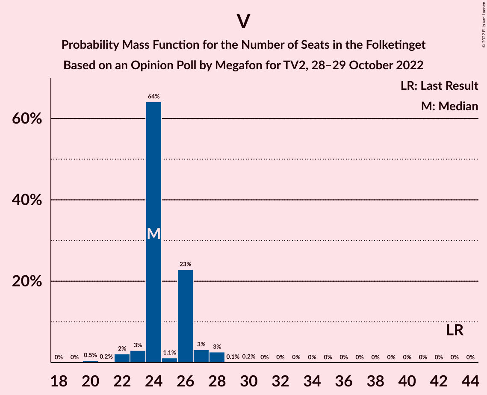

| Number of Seats | Probability | Accumulated | Special Marks |
|:---------------:|:-----------:|:-----------:|:-------------:|
| 20 | 0.5% | 100% |  |
| 21 | 0.2% | 99.5% |  |
| 22 | 2% | 99.3% |  |
| 23 | 3% | 97% |  |
| 24 | 64% | 94% | Median |
| 25 | 1.1% | 30% |  |
| 26 | 23% | 29% |  |
| 27 | 3% | 6% |  |
| 28 | 3% | 3% |  |
| 29 | 0.1% | 0.3% |  |
| 30 | 0.2% | 0.2% |  |
| 31 | 0% | 0% |  |
| 32 | 0% | 0% |  |
| 33 | 0% | 0% |  |
| 34 | 0% | 0% |  |
| 35 | 0% | 0% |  |
| 36 | 0% | 0% |  |
| 37 | 0% | 0% |  |
| 38 | 0% | 0% |  |
| 39 | 0% | 0% |  |
| 40 | 0% | 0% |  |
| 41 | 0% | 0% |  |
| 42 | 0% | 0% |  |
| 43 | 0% | 0% | Last Result |

## Technical Information

### Opinion Poll

+ **Polling firm:** Megafon
+ **Commissioner(s):** TV2
+ **Fieldwork period:** 28–29 October 2022

### Calculations

+ **Sample size:** 1014
+ **Simulations done:** 1,048,576
+ **Error estimate:** 4.51%

