# Opinion Poll by Yougov, 27–31 October 2022

<a href="#voting-intentions">Voting Intentions</a> | <a href="#seats">Seats</a> | <a href="#coalitions">Coalitions</a> | <a href="#technical-information">Technical Information</a>

## Voting Intentions

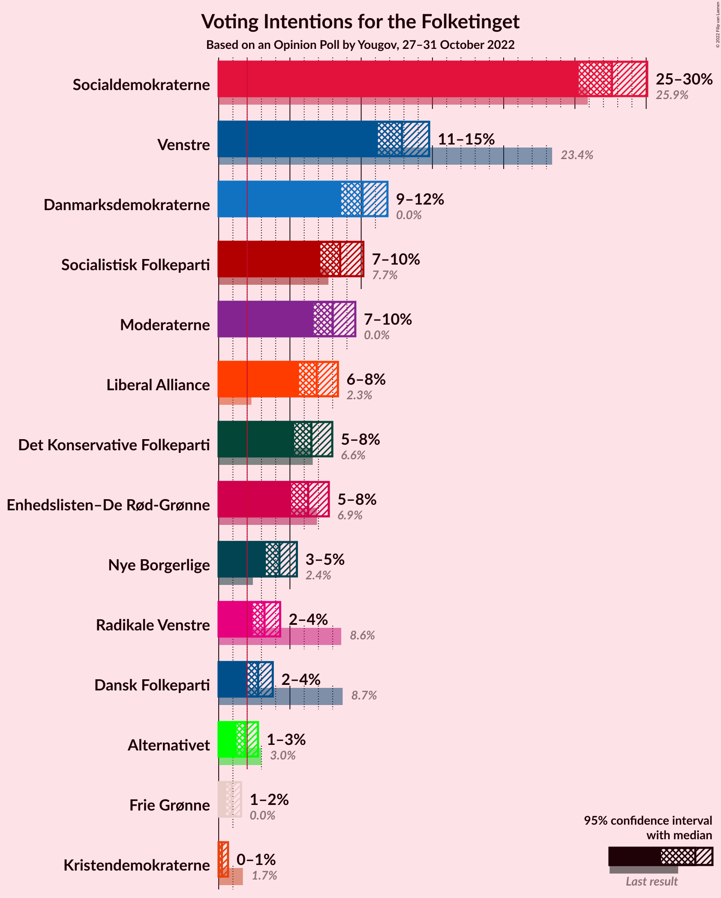

### Confidence Intervals

| Party | Last Result | Poll Result | 80% Confidence Interval | 90% Confidence Interval | 95% Confidence Interval | 99% Confidence Interval |
|:-----:|:-----------:|:-----------:|:-----------------------:|:-----------------------:|:-----------------------:|:-----------------------:|
| Socialdemokraterne | 25.9% | 27.6% | 26.1–29.2% |25.6–29.7% |25.3–30.1% |24.5–30.8% |
| Venstre | 23.4% | 12.9% | 11.8–14.1% |11.4–14.5% |11.2–14.8% |10.7–15.4% |
| Danmarksdemokraterne | 0.0% | 10.1% | 9.1–11.2% |8.8–11.6% |8.6–11.8% |8.1–12.4% |
| Socialistisk Folkeparti | 7.7% | 8.5% | 7.6–9.6% |7.4–9.9% |7.1–10.2% |6.7–10.7% |
| Moderaterne | 0.0% | 8.0% | 7.1–9.0% |6.9–9.3% |6.7–9.6% |6.3–10.1% |
| Liberal Alliance | 2.3% | 6.9% | 6.1–7.8% |5.8–8.1% |5.6–8.4% |5.3–8.9% |
| Det Konservative Folkeparti | 6.6% | 6.5% | 5.7–7.5% |5.5–7.7% |5.3–8.0% |4.9–8.4% |
| Enhedslisten–De Rød-Grønne | 6.9% | 6.3% | 5.5–7.2% |5.3–7.5% |5.1–7.7% |4.8–8.2% |
| Nye Borgerlige | 2.4% | 4.3% | 3.6–5.1% |3.4–5.3% |3.3–5.5% |3.0–5.9% |
| Radikale Venstre | 8.6% | 3.2% | 2.7–3.9% |2.5–4.1% |2.4–4.3% |2.1–4.7% |
| Dansk Folkeparti | 8.7% | 2.8% | 2.3–3.4% |2.1–3.6% |2.0–3.8% |1.8–4.1% |
| Alternativet | 3.0% | 1.9% | 1.5–2.4% |1.4–2.6% |1.3–2.8% |1.1–3.0% |
| Frie Grønne | 0.0% | 0.9% | 0.6–1.3% |0.6–1.5% |0.5–1.6% |0.4–1.8% |
| Kristendemokraterne | 1.7% | 0.2% | 0.1–0.5% |0.1–0.6% |0.1–0.7% |0.0–0.8% |

*Note:* The poll result column reflects the actual value used in the calculations. Published results may vary slightly, and in addition be rounded to fewer digits.

## Seats

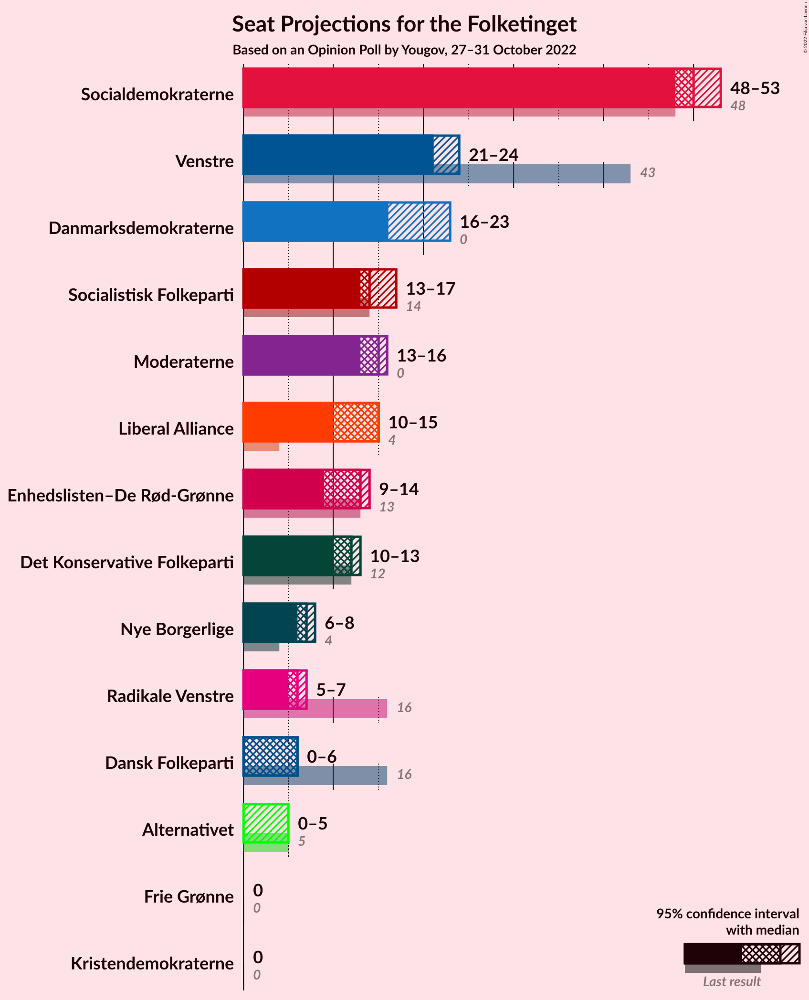

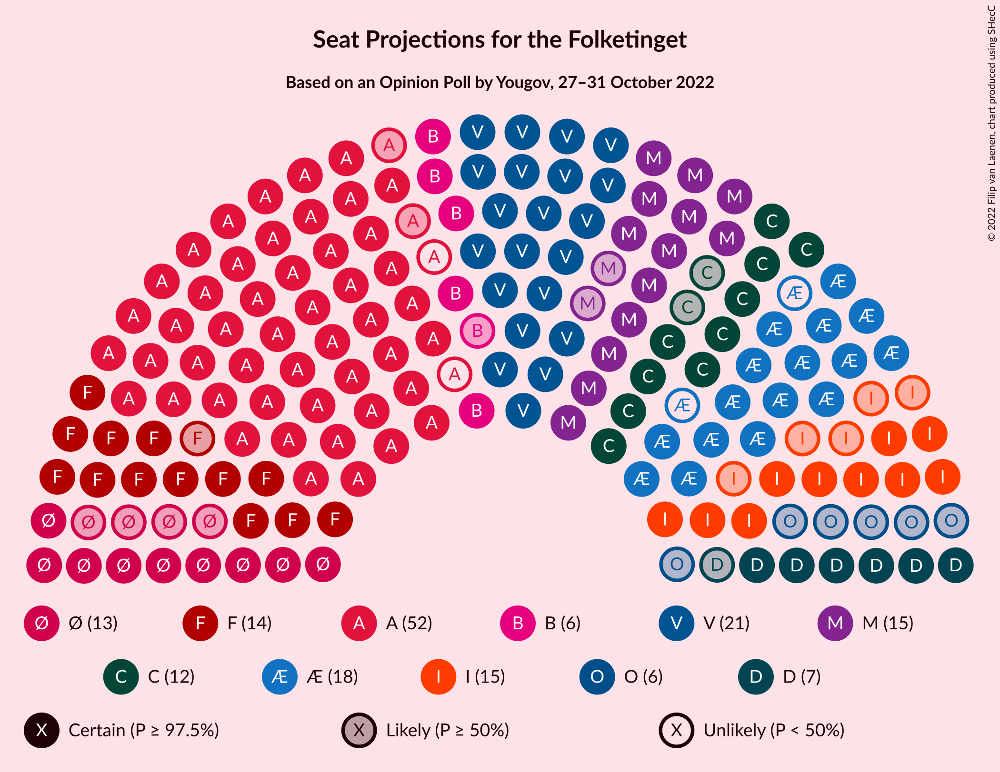

### Confidence Intervals

| Party | Last Result | Median | 80% Confidence Interval | 90% Confidence Interval | 95% Confidence Interval | 99% Confidence Interval |
|:-----:|:-----------:|:------:|:-----------------------:|:-----------------------:|:-----------------------:|:-----------------------:|
| <a href="#socialdemokraterne">Socialdemokraterne</a> | 48 | 50 | 50 |49–52 |48–53 |44–57 |
| <a href="#venstre">Venstre</a> | 43 | 21 | 21–22 |21–23 |21–24 |20–27 |
| <a href="#danmarksdemokraterne">Danmarksdemokraterne</a> | 0 | 16 | 16–17 |16–19 |16–23 |15–23 |
| <a href="#socialistisk-folkeparti">Socialistisk Folkeparti</a> | 14 | 14 | 14–15 |14–15 |13–17 |13–18 |
| <a href="#moderaterne">Moderaterne</a> | 0 | 15 | 14–15 |13–15 |13–16 |12–18 |
| <a href="#liberal-alliance">Liberal Alliance</a> | 4 | 15 | 12–15 |11–15 |10–15 |10–16 |
| <a href="#det-konservative-folkeparti">Det Konservative Folkeparti</a> | 12 | 12 | 12 |11–12 |10–13 |9–14 |
| <a href="#enhedslisten–de-rød-grønne">Enhedslisten–De Rød-Grønne</a> | 13 | 13 | 13 |10–13 |9–14 |8–14 |
| <a href="#nye-borgerlige">Nye Borgerlige</a> | 4 | 7 | 7 |7–8 |6–8 |6–10 |
| <a href="#radikale-venstre">Radikale Venstre</a> | 16 | 6 | 6 |6–7 |5–7 |4–8 |
| <a href="#dansk-folkeparti">Dansk Folkeparti</a> | 16 | 6 | 5–6 |4–6 |0–6 |0–7 |
| <a href="#alternativet">Alternativet</a> | 5 | 0 | 0 |0–4 |0–5 |0–6 |
| <a href="#frie-grønne">Frie Grønne</a> | 0 | 0 | 0 |0 |0 |0 |
| <a href="#kristendemokraterne">Kristendemokraterne</a> | 0 | 0 | 0 |0 |0 |0 |

### Socialdemokraterne

*For a full overview of the results for this party, see the [Socialdemokraterne](party-socialdemokraterne.html) page.*

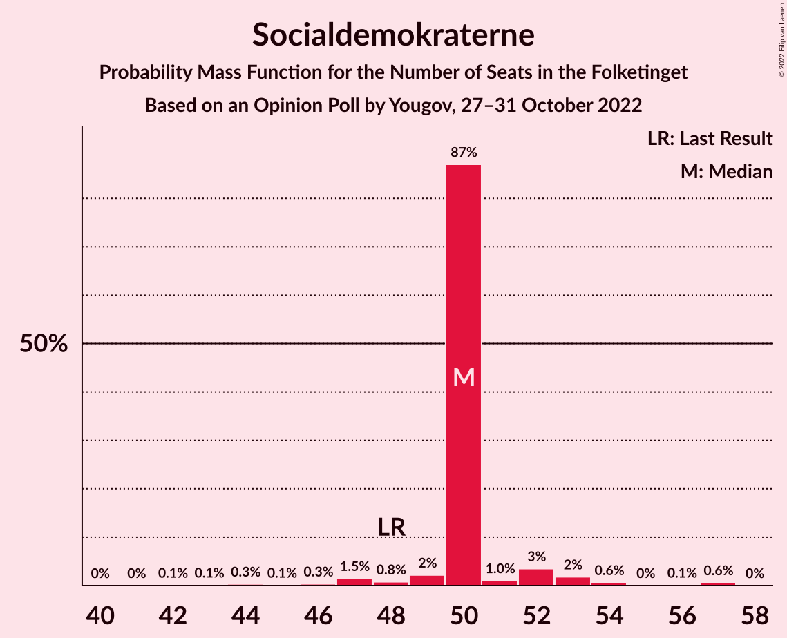

| Number of Seats | Probability | Accumulated | Special Marks |
|:---------------:|:-----------:|:-----------:|:-------------:|
| 42 | 0.1% | 100% |  |
| 43 | 0.1% | 99.9% |  |
| 44 | 0.3% | 99.8% |  |
| 45 | 0.1% | 99.5% |  |
| 46 | 0.3% | 99.4% |  |
| 47 | 1.5% | 99.1% |  |
| 48 | 0.8% | 98% | Last Result |
| 49 | 2% | 97% |  |
| 50 | 87% | 95% | Median |
| 51 | 1.0% | 8% |  |
| 52 | 3% | 7% |  |
| 53 | 2% | 3% |  |
| 54 | 0.6% | 1.3% |  |
| 55 | 0% | 0.7% |  |
| 56 | 0.1% | 0.7% |  |
| 57 | 0.6% | 0.6% |  |
| 58 | 0% | 0% |  |

### Venstre

*For a full overview of the results for this party, see the [Venstre](party-venstre.html) page.*

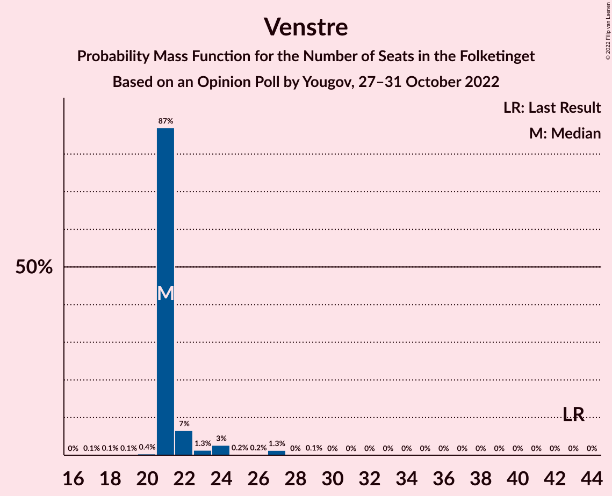

| Number of Seats | Probability | Accumulated | Special Marks |
|:---------------:|:-----------:|:-----------:|:-------------:|
| 17 | 0.1% | 100% |  |
| 18 | 0.1% | 99.9% |  |
| 19 | 0.1% | 99.9% |  |
| 20 | 0.4% | 99.8% |  |
| 21 | 87% | 99.4% | Median |
| 22 | 7% | 12% |  |
| 23 | 1.3% | 6% |  |
| 24 | 3% | 5% |  |
| 25 | 0.2% | 2% |  |
| 26 | 0.2% | 2% |  |
| 27 | 1.3% | 1.5% |  |
| 28 | 0% | 0.2% |  |
| 29 | 0.1% | 0.1% |  |
| 30 | 0% | 0% |  |
| 31 | 0% | 0% |  |
| 32 | 0% | 0% |  |
| 33 | 0% | 0% |  |
| 34 | 0% | 0% |  |
| 35 | 0% | 0% |  |
| 36 | 0% | 0% |  |
| 37 | 0% | 0% |  |
| 38 | 0% | 0% |  |
| 39 | 0% | 0% |  |
| 40 | 0% | 0% |  |
| 41 | 0% | 0% |  |
| 42 | 0% | 0% |  |
| 43 | 0% | 0% | Last Result |

### Danmarksdemokraterne

*For a full overview of the results for this party, see the [Danmarksdemokraterne](party-danmarksdemokraterne.html) page.*

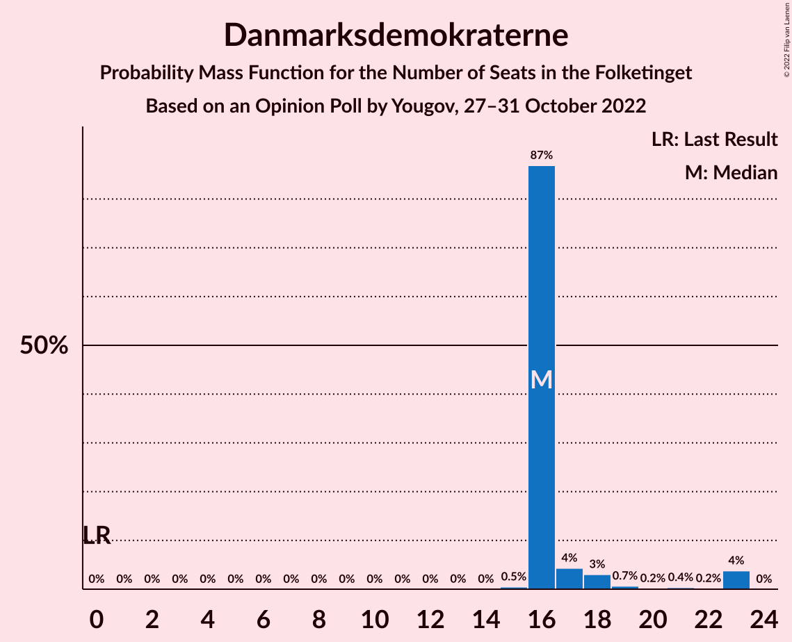

| Number of Seats | Probability | Accumulated | Special Marks |
|:---------------:|:-----------:|:-----------:|:-------------:|
| 0 | 0% | 100% | Last Result |
| 1 | 0% | 100% |  |
| 2 | 0% | 100% |  |
| 3 | 0% | 100% |  |
| 4 | 0% | 100% |  |
| 5 | 0% | 100% |  |
| 6 | 0% | 100% |  |
| 7 | 0% | 100% |  |
| 8 | 0% | 100% |  |
| 9 | 0% | 100% |  |
| 10 | 0% | 100% |  |
| 11 | 0% | 100% |  |
| 12 | 0% | 100% |  |
| 13 | 0% | 100% |  |
| 14 | 0% | 100% |  |
| 15 | 0.5% | 99.9% |  |
| 16 | 87% | 99.4% | Median |
| 17 | 4% | 13% |  |
| 18 | 3% | 8% |  |
| 19 | 0.7% | 5% |  |
| 20 | 0.2% | 5% |  |
| 21 | 0.4% | 4% |  |
| 22 | 0.2% | 4% |  |
| 23 | 4% | 4% |  |
| 24 | 0% | 0% |  |

### Socialistisk Folkeparti

*For a full overview of the results for this party, see the [Socialistisk Folkeparti](party-socialistiskfolkeparti.html) page.*

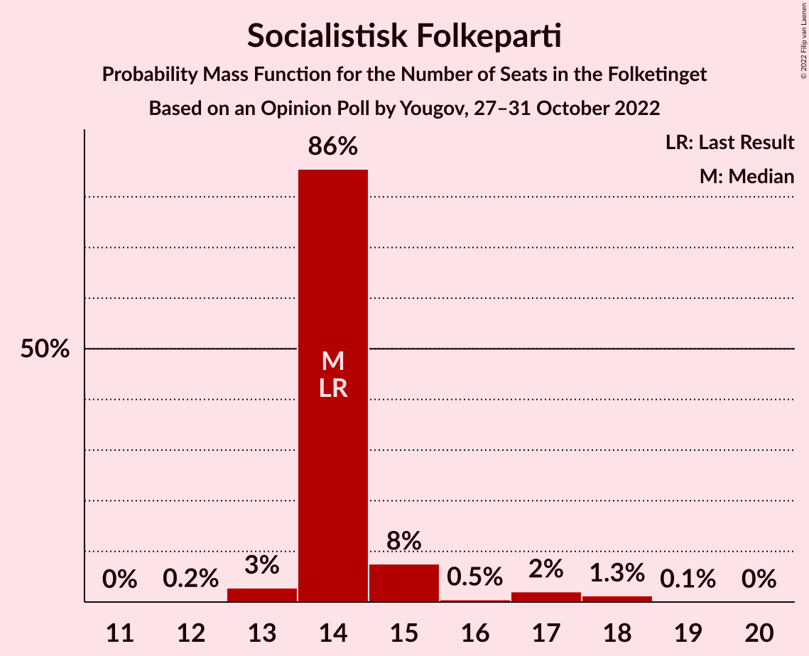

| Number of Seats | Probability | Accumulated | Special Marks |
|:---------------:|:-----------:|:-----------:|:-------------:|
| 12 | 0.2% | 100% |  |
| 13 | 3% | 99.8% |  |
| 14 | 86% | 97% | Last Result, Median |
| 15 | 8% | 11% |  |
| 16 | 0.5% | 4% |  |
| 17 | 2% | 3% |  |
| 18 | 1.3% | 1.4% |  |
| 19 | 0.1% | 0.1% |  |
| 20 | 0% | 0% |  |

### Moderaterne

*For a full overview of the results for this party, see the [Moderaterne](party-moderaterne.html) page.*

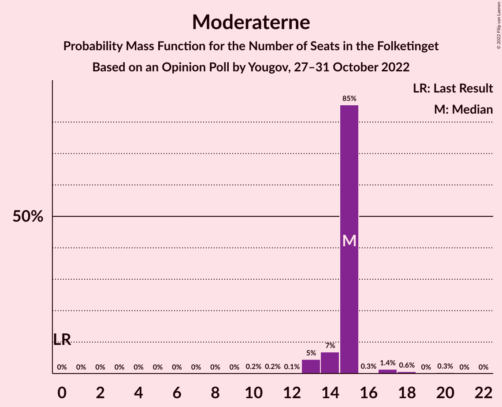

| Number of Seats | Probability | Accumulated | Special Marks |
|:---------------:|:-----------:|:-----------:|:-------------:|
| 0 | 0% | 100% | Last Result |
| 1 | 0% | 100% |  |
| 2 | 0% | 100% |  |
| 3 | 0% | 100% |  |
| 4 | 0% | 100% |  |
| 5 | 0% | 100% |  |
| 6 | 0% | 100% |  |
| 7 | 0% | 100% |  |
| 8 | 0% | 100% |  |
| 9 | 0% | 100% |  |
| 10 | 0.2% | 100% |  |
| 11 | 0.2% | 99.8% |  |
| 12 | 0.1% | 99.6% |  |
| 13 | 5% | 99.5% |  |
| 14 | 7% | 95% |  |
| 15 | 85% | 88% | Median |
| 16 | 0.3% | 3% |  |
| 17 | 1.4% | 2% |  |
| 18 | 0.6% | 1.0% |  |
| 19 | 0% | 0.3% |  |
| 20 | 0.3% | 0.3% |  |
| 21 | 0% | 0% |  |

### Liberal Alliance

*For a full overview of the results for this party, see the [Liberal Alliance](party-liberalalliance.html) page.*

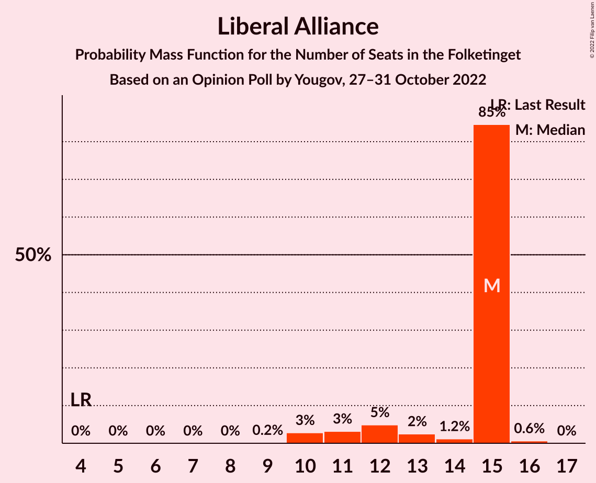

| Number of Seats | Probability | Accumulated | Special Marks |
|:---------------:|:-----------:|:-----------:|:-------------:|
| 4 | 0% | 100% | Last Result |
| 5 | 0% | 100% |  |
| 6 | 0% | 100% |  |
| 7 | 0% | 100% |  |
| 8 | 0% | 100% |  |
| 9 | 0.2% | 100% |  |
| 10 | 3% | 99.8% |  |
| 11 | 3% | 97% |  |
| 12 | 5% | 94% |  |
| 13 | 2% | 89% |  |
| 14 | 1.2% | 86% |  |
| 15 | 85% | 85% | Median |
| 16 | 0.6% | 0.7% |  |
| 17 | 0% | 0% |  |

### Det Konservative Folkeparti

*For a full overview of the results for this party, see the [Det Konservative Folkeparti](party-detkonservativefolkeparti.html) page.*

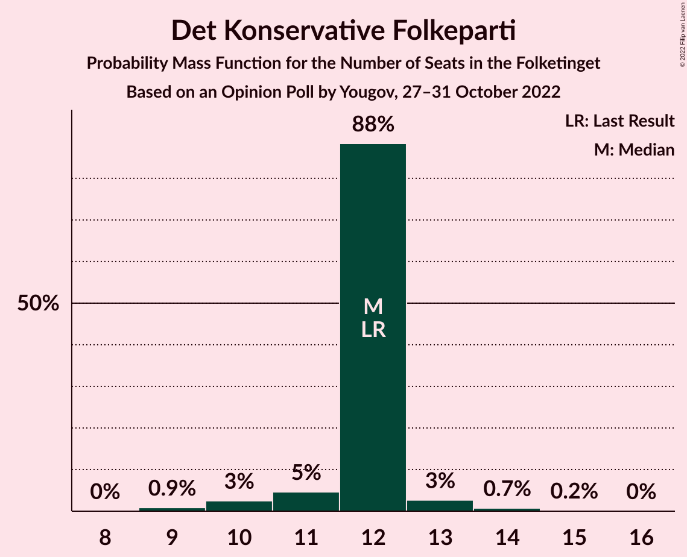

| Number of Seats | Probability | Accumulated | Special Marks |
|:---------------:|:-----------:|:-----------:|:-------------:|
| 9 | 0.9% | 100% |  |
| 10 | 3% | 99.1% |  |
| 11 | 5% | 97% |  |
| 12 | 88% | 92% | Last Result, Median |
| 13 | 3% | 4% |  |
| 14 | 0.7% | 0.9% |  |
| 15 | 0.2% | 0.2% |  |
| 16 | 0% | 0% |  |

### Enhedslisten–De Rød-Grønne

*For a full overview of the results for this party, see the [Enhedslisten–De Rød-Grønne](party-enhedslisten–derød-grønne.html) page.*

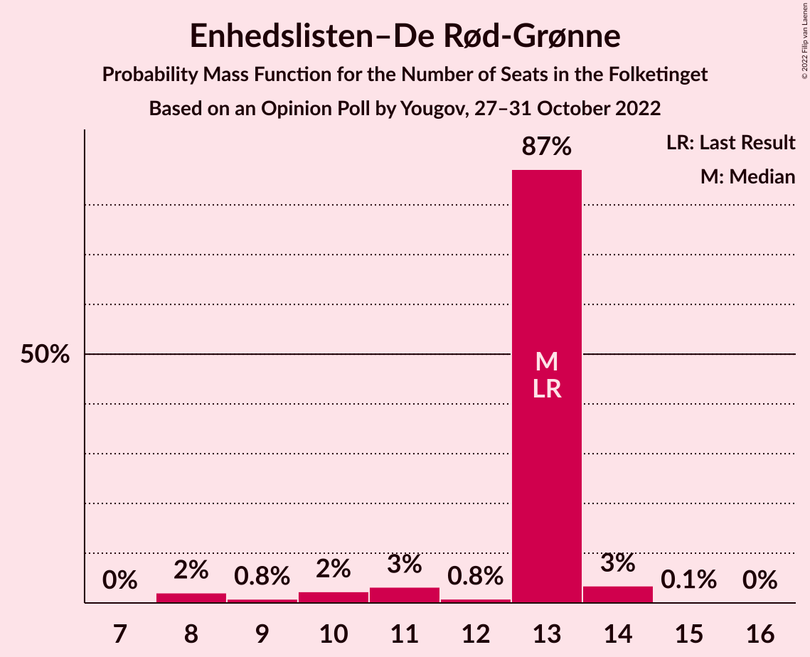

| Number of Seats | Probability | Accumulated | Special Marks |
|:---------------:|:-----------:|:-----------:|:-------------:|
| 8 | 2% | 100% |  |
| 9 | 0.8% | 98% |  |
| 10 | 2% | 97% |  |
| 11 | 3% | 95% |  |
| 12 | 0.8% | 92% |  |
| 13 | 87% | 91% | Last Result, Median |
| 14 | 3% | 4% |  |
| 15 | 0.1% | 0.1% |  |
| 16 | 0% | 0% |  |

### Nye Borgerlige

*For a full overview of the results for this party, see the [Nye Borgerlige](party-nyeborgerlige.html) page.*

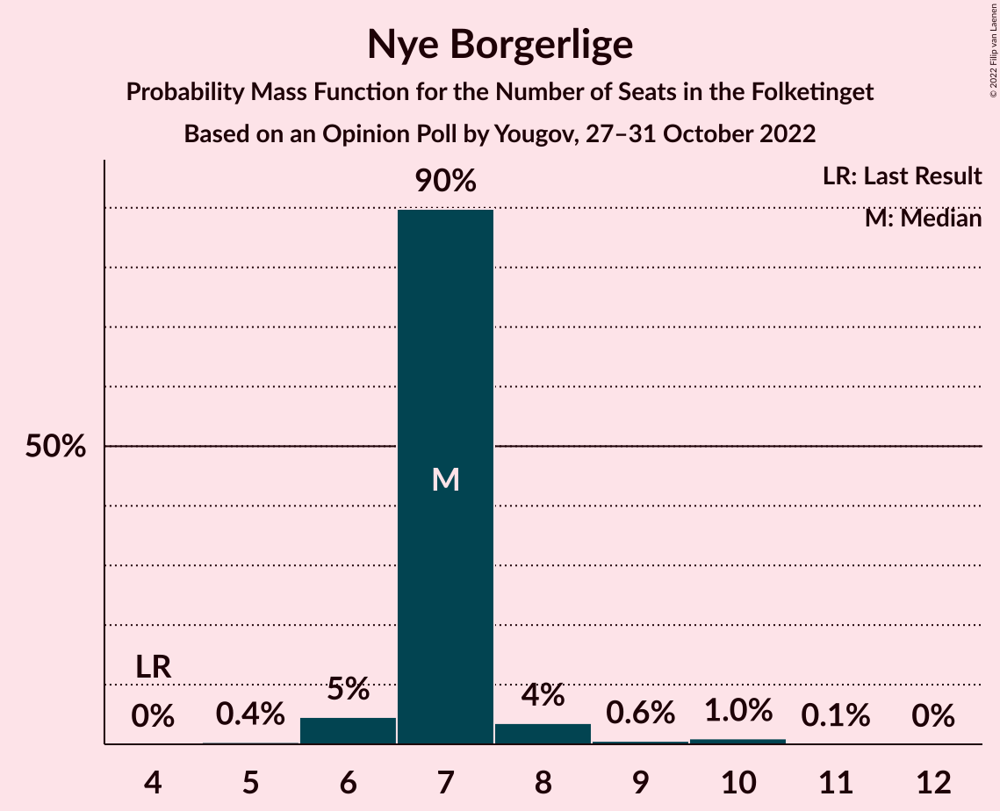

| Number of Seats | Probability | Accumulated | Special Marks |
|:---------------:|:-----------:|:-----------:|:-------------:|
| 4 | 0% | 100% | Last Result |
| 5 | 0.4% | 100% |  |
| 6 | 5% | 99.6% |  |
| 7 | 90% | 95% | Median |
| 8 | 4% | 5% |  |
| 9 | 0.6% | 2% |  |
| 10 | 1.0% | 1.1% |  |
| 11 | 0.1% | 0.1% |  |
| 12 | 0% | 0% |  |

### Radikale Venstre

*For a full overview of the results for this party, see the [Radikale Venstre](party-radikalevenstre.html) page.*

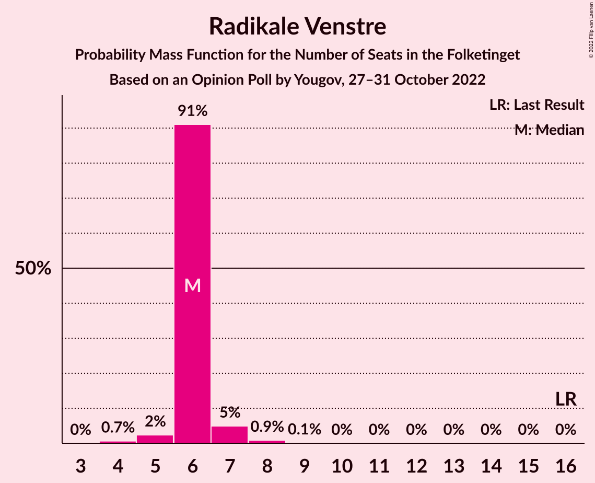

| Number of Seats | Probability | Accumulated | Special Marks |
|:---------------:|:-----------:|:-----------:|:-------------:|
| 4 | 0.7% | 100% |  |
| 5 | 2% | 99.3% |  |
| 6 | 91% | 97% | Median |
| 7 | 5% | 6% |  |
| 8 | 0.9% | 1.0% |  |
| 9 | 0.1% | 0.1% |  |
| 10 | 0% | 0% |  |
| 11 | 0% | 0% |  |
| 12 | 0% | 0% |  |
| 13 | 0% | 0% |  |
| 14 | 0% | 0% |  |
| 15 | 0% | 0% |  |
| 16 | 0% | 0% | Last Result |

### Dansk Folkeparti

*For a full overview of the results for this party, see the [Dansk Folkeparti](party-danskfolkeparti.html) page.*

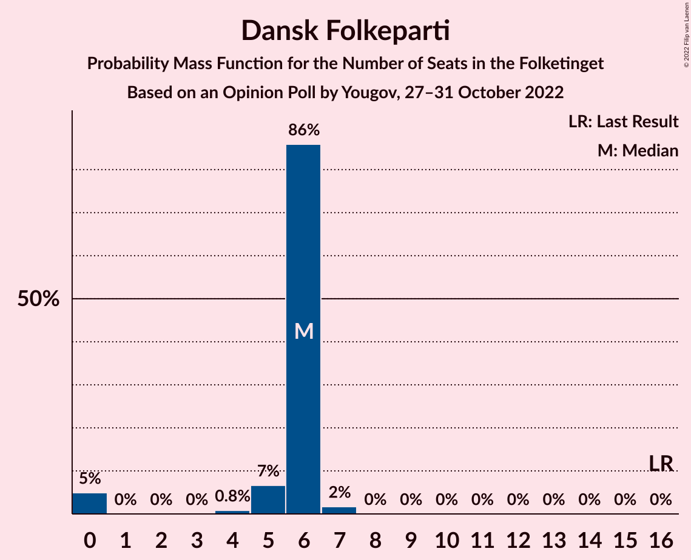

| Number of Seats | Probability | Accumulated | Special Marks |
|:---------------:|:-----------:|:-----------:|:-------------:|
| 0 | 5% | 100% |  |
| 1 | 0% | 95% |  |
| 2 | 0% | 95% |  |
| 3 | 0% | 95% |  |
| 4 | 0.8% | 95% |  |
| 5 | 7% | 94% |  |
| 6 | 86% | 88% | Median |
| 7 | 2% | 2% |  |
| 8 | 0% | 0% |  |
| 9 | 0% | 0% |  |
| 10 | 0% | 0% |  |
| 11 | 0% | 0% |  |
| 12 | 0% | 0% |  |
| 13 | 0% | 0% |  |
| 14 | 0% | 0% |  |
| 15 | 0% | 0% |  |
| 16 | 0% | 0% | Last Result |

### Alternativet

*For a full overview of the results for this party, see the [Alternativet](party-alternativet.html) page.*

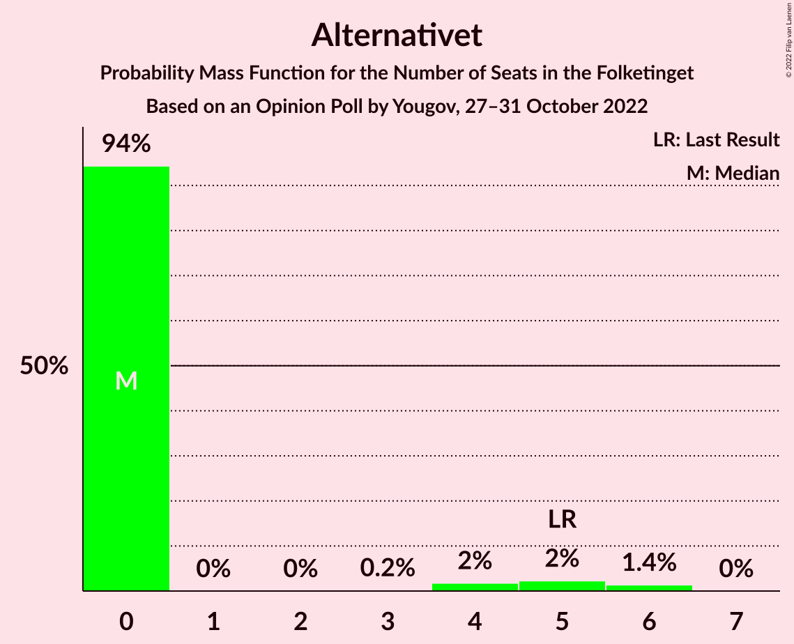

| Number of Seats | Probability | Accumulated | Special Marks |
|:---------------:|:-----------:|:-----------:|:-------------:|
| 0 | 94% | 100% | Median |
| 1 | 0% | 6% |  |
| 2 | 0% | 6% |  |
| 3 | 0.2% | 6% |  |
| 4 | 2% | 5% |  |
| 5 | 2% | 4% | Last Result |
| 6 | 1.4% | 1.4% |  |
| 7 | 0% | 0% |  |

### Frie Grønne

*For a full overview of the results for this party, see the [Frie Grønne](party-friegrønne.html) page.*

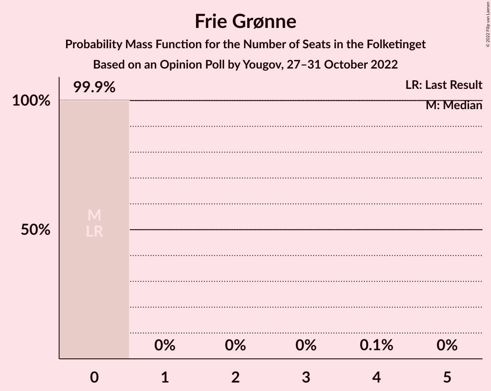

| Number of Seats | Probability | Accumulated | Special Marks |
|:---------------:|:-----------:|:-----------:|:-------------:|
| 0 | 99.9% | 100% | Last Result, Median |
| 1 | 0% | 0.1% |  |
| 2 | 0% | 0.1% |  |
| 3 | 0% | 0.1% |  |
| 4 | 0.1% | 0.1% |  |
| 5 | 0% | 0% |  |

### Kristendemokraterne

*For a full overview of the results for this party, see the [Kristendemokraterne](party-kristendemokraterne.html) page.*

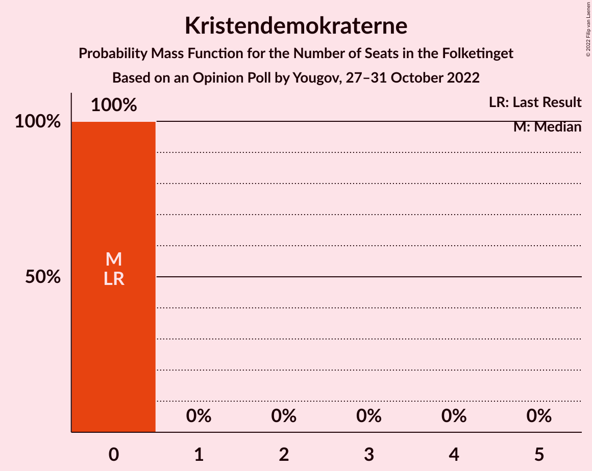

| Number of Seats | Probability | Accumulated | Special Marks |
|:---------------:|:-----------:|:-----------:|:-------------:|
| 0 | 100% | 100% | Last Result, Median |

## Coalitions

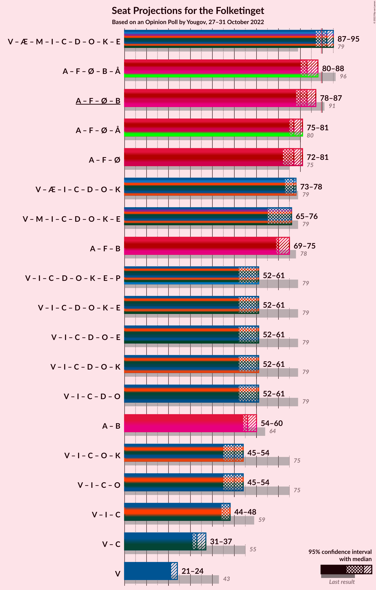

### Confidence Intervals

| Coalition | Last Result | Median | Majority? | 80% Confidence Interval | 90% Confidence Interval | 95% Confidence Interval | 99% Confidence Interval |
|:---------:|:-----------:|:------:|:---------:|:-----------------------:|:-----------------------:|:-----------------------:|:-----------------------:|
| Socialdemokraterne – Socialistisk Folkeparti – Enhedslisten–De Rød-Grønne – Radikale Venstre – Alternativet | 96 | 83 | 0.7% | 83–84 | 83–87 | 80–88 | 78–91 |
| Socialdemokraterne – Socialistisk Folkeparti – Enhedslisten–De Rød-Grønne – Radikale Venstre | 91 | 83 | 0.6% | 83 | 80–87 | 78–87 | 77–91 |
| Socialdemokraterne – Socialistisk Folkeparti – Enhedslisten–De Rød-Grønne – Alternativet | 80 | 77 | 0% | 77 | 77–81 | 75–81 | 72–85 |
| Socialdemokraterne – Socialistisk Folkeparti – Enhedslisten–De Rød-Grønne | 75 | 77 | 0% | 77 | 74–81 | 72–81 | 71–85 |
| Venstre – Danmarksdemokraterne – Liberal Alliance – Det Konservative Folkeparti – Nye Borgerlige – Dansk Folkeparti – Kristendemokraterne | 79 | 77 | 0% | 77 | 75–78 | 73–78 | 70–83 |
| Socialdemokraterne – Socialistisk Folkeparti – Radikale Venstre | 78 | 70 | 0% | 70 | 70–73 | 69–75 | 66–81 |
| Venstre – Liberal Alliance – Det Konservative Folkeparti – Nye Borgerlige – Dansk Folkeparti – Kristendemokraterne | 79 | 61 | 0% | 59–61 | 55–61 | 52–61 | 52–64 |
| Venstre – Liberal Alliance – Det Konservative Folkeparti – Nye Borgerlige – Dansk Folkeparti | 79 | 61 | 0% | 59–61 | 55–61 | 52–61 | 52–64 |
| Socialdemokraterne – Radikale Venstre | 64 | 56 | 0% | 56 | 55–58 | 54–60 | 50–63 |
| Venstre – Liberal Alliance – Det Konservative Folkeparti – Dansk Folkeparti – Kristendemokraterne | 75 | 54 | 0% | 52–54 | 48–54 | 45–54 | 44–56 |
| Venstre – Liberal Alliance – Det Konservative Folkeparti – Dansk Folkeparti | 75 | 54 | 0% | 52–54 | 48–54 | 45–54 | 44–56 |
| Venstre – Liberal Alliance – Det Konservative Folkeparti | 59 | 48 | 0% | 47–48 | 45–48 | 44–48 | 43–52 |
| Venstre – Det Konservative Folkeparti | 55 | 33 | 0% | 33 | 33–35 | 31–37 | 30–40 |
| Venstre | 43 | 21 | 0% | 21–22 | 21–23 | 21–24 | 20–27 |

### Socialdemokraterne – Socialistisk Folkeparti – Enhedslisten–De Rød-Grønne – Radikale Venstre – Alternativet

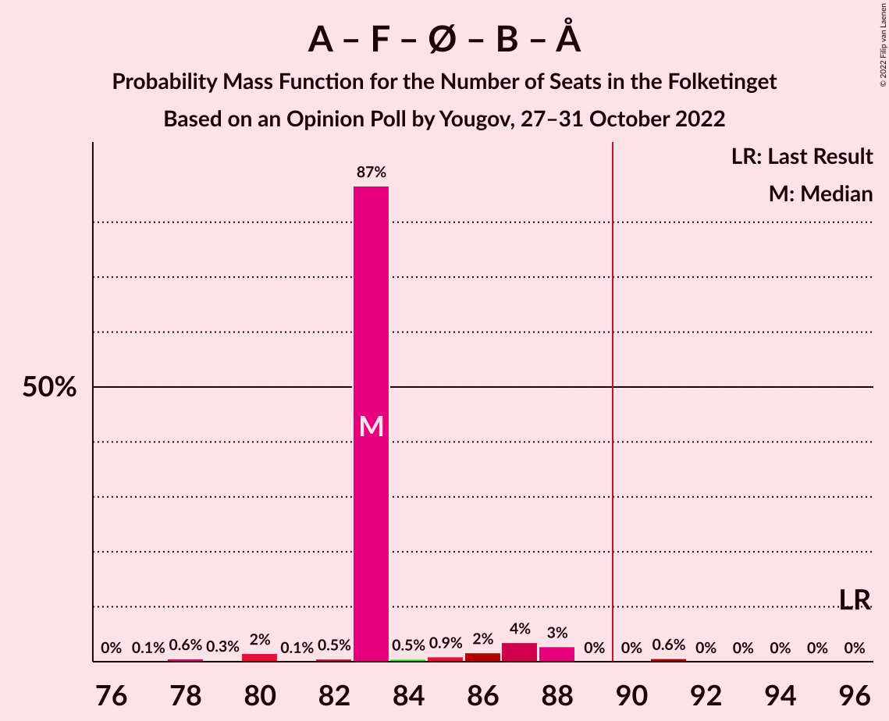

| Number of Seats | Probability | Accumulated | Special Marks |
|:---------------:|:-----------:|:-----------:|:-------------:|
| 76 | 0% | 100% |  |
| 77 | 0.1% | 99.9% |  |
| 78 | 0.6% | 99.9% |  |
| 79 | 0.3% | 99.3% |  |
| 80 | 2% | 99.0% |  |
| 81 | 0.1% | 97% |  |
| 82 | 0.5% | 97% |  |
| 83 | 87% | 97% | Median |
| 84 | 0.5% | 10% |  |
| 85 | 0.9% | 10% |  |
| 86 | 2% | 9% |  |
| 87 | 4% | 7% |  |
| 88 | 3% | 4% |  |
| 89 | 0% | 0.8% |  |
| 90 | 0% | 0.7% | Majority |
| 91 | 0.6% | 0.7% |  |
| 92 | 0% | 0% |  |
| 93 | 0% | 0% |  |
| 94 | 0% | 0% |  |
| 95 | 0% | 0% |  |
| 96 | 0% | 0% | Last Result |

### Socialdemokraterne – Socialistisk Folkeparti – Enhedslisten–De Rød-Grønne – Radikale Venstre

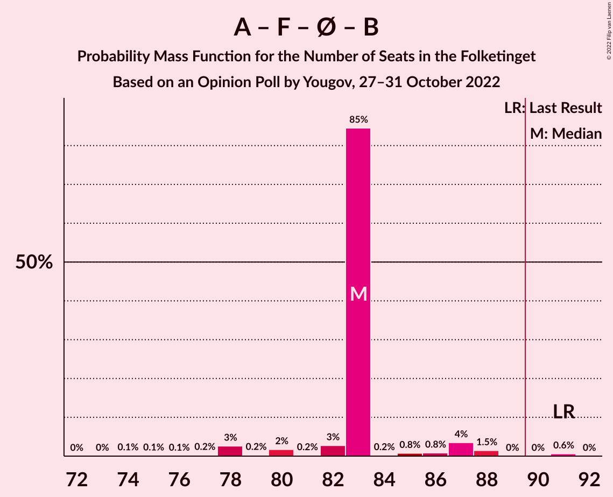

| Number of Seats | Probability | Accumulated | Special Marks |
|:---------------:|:-----------:|:-----------:|:-------------:|
| 74 | 0.1% | 100% |  |
| 75 | 0.1% | 99.8% |  |
| 76 | 0.1% | 99.7% |  |
| 77 | 0.2% | 99.7% |  |
| 78 | 3% | 99.4% |  |
| 79 | 0.2% | 97% |  |
| 80 | 2% | 97% |  |
| 81 | 0.2% | 95% |  |
| 82 | 3% | 95% |  |
| 83 | 85% | 92% | Median |
| 84 | 0.2% | 7% |  |
| 85 | 0.8% | 7% |  |
| 86 | 0.8% | 6% |  |
| 87 | 4% | 6% |  |
| 88 | 1.5% | 2% |  |
| 89 | 0% | 0.6% |  |
| 90 | 0% | 0.6% | Majority |
| 91 | 0.6% | 0.6% | Last Result |
| 92 | 0% | 0% |  |

### Socialdemokraterne – Socialistisk Folkeparti – Enhedslisten–De Rød-Grønne – Alternativet

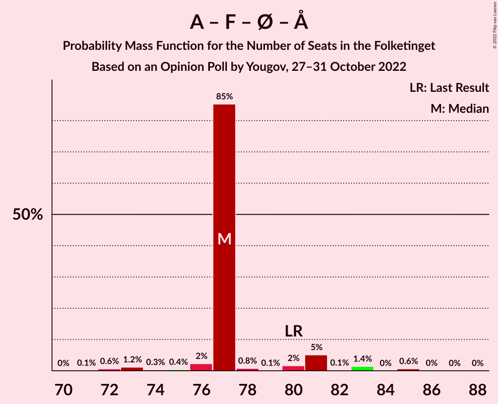

| Number of Seats | Probability | Accumulated | Special Marks |
|:---------------:|:-----------:|:-----------:|:-------------:|
| 70 | 0% | 100% |  |
| 71 | 0.1% | 99.9% |  |
| 72 | 0.6% | 99.8% |  |
| 73 | 1.2% | 99.2% |  |
| 74 | 0.3% | 98% |  |
| 75 | 0.4% | 98% |  |
| 76 | 2% | 97% |  |
| 77 | 85% | 95% | Median |
| 78 | 0.8% | 10% |  |
| 79 | 0.1% | 9% |  |
| 80 | 2% | 9% | Last Result |
| 81 | 5% | 7% |  |
| 82 | 0.1% | 2% |  |
| 83 | 1.4% | 2% |  |
| 84 | 0% | 0.7% |  |
| 85 | 0.6% | 0.7% |  |
| 86 | 0% | 0.1% |  |
| 87 | 0% | 0% |  |

### Socialdemokraterne – Socialistisk Folkeparti – Enhedslisten–De Rød-Grønne

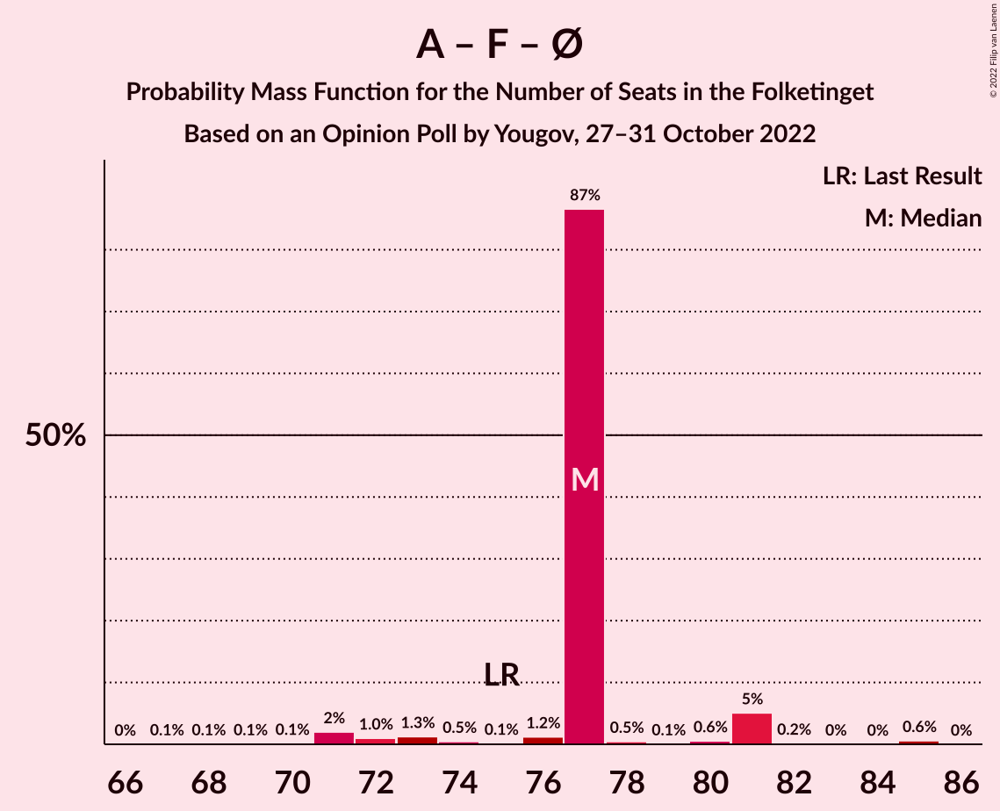

| Number of Seats | Probability | Accumulated | Special Marks |
|:---------------:|:-----------:|:-----------:|:-------------:|
| 67 | 0.1% | 100% |  |
| 68 | 0.1% | 99.9% |  |
| 69 | 0.1% | 99.9% |  |
| 70 | 0.1% | 99.8% |  |
| 71 | 2% | 99.6% |  |
| 72 | 1.0% | 98% |  |
| 73 | 1.3% | 97% |  |
| 74 | 0.5% | 95% |  |
| 75 | 0.1% | 95% | Last Result |
| 76 | 1.2% | 95% |  |
| 77 | 87% | 94% | Median |
| 78 | 0.5% | 7% |  |
| 79 | 0.1% | 6% |  |
| 80 | 0.6% | 6% |  |
| 81 | 5% | 6% |  |
| 82 | 0.2% | 0.8% |  |
| 83 | 0% | 0.6% |  |
| 84 | 0% | 0.6% |  |
| 85 | 0.6% | 0.6% |  |
| 86 | 0% | 0% |  |

### Venstre – Danmarksdemokraterne – Liberal Alliance – Det Konservative Folkeparti – Nye Borgerlige – Dansk Folkeparti – Kristendemokraterne

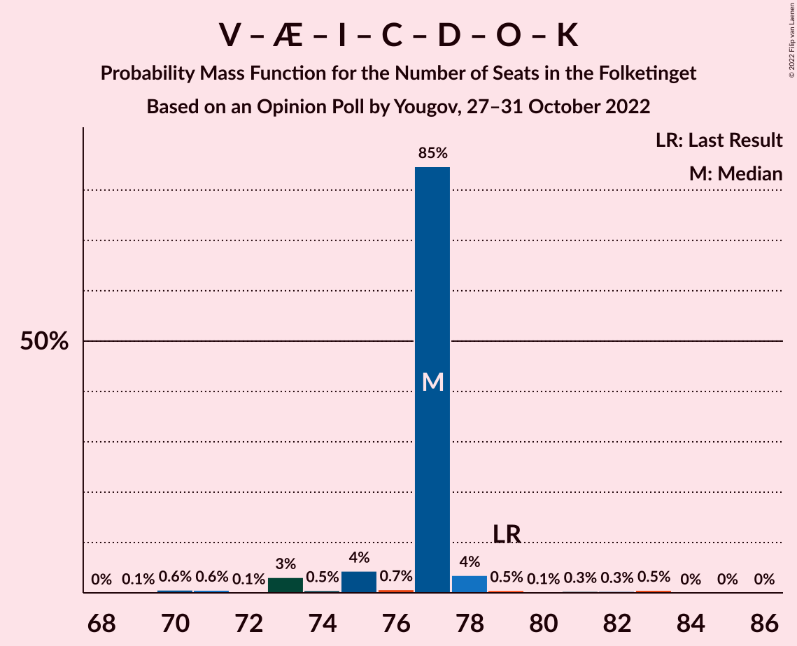

| Number of Seats | Probability | Accumulated | Special Marks |
|:---------------:|:-----------:|:-----------:|:-------------:|
| 69 | 0.1% | 100% |  |
| 70 | 0.6% | 99.9% |  |
| 71 | 0.6% | 99.3% |  |
| 72 | 0.1% | 98.8% |  |
| 73 | 3% | 98.7% |  |
| 74 | 0.5% | 96% |  |
| 75 | 4% | 95% |  |
| 76 | 0.7% | 91% |  |
| 77 | 85% | 90% | Median |
| 78 | 4% | 5% |  |
| 79 | 0.5% | 2% | Last Result |
| 80 | 0.1% | 1.4% |  |
| 81 | 0.3% | 1.3% |  |
| 82 | 0.3% | 1.0% |  |
| 83 | 0.5% | 0.6% |  |
| 84 | 0% | 0.1% |  |
| 85 | 0% | 0.1% |  |
| 86 | 0% | 0% |  |

### Socialdemokraterne – Socialistisk Folkeparti – Radikale Venstre

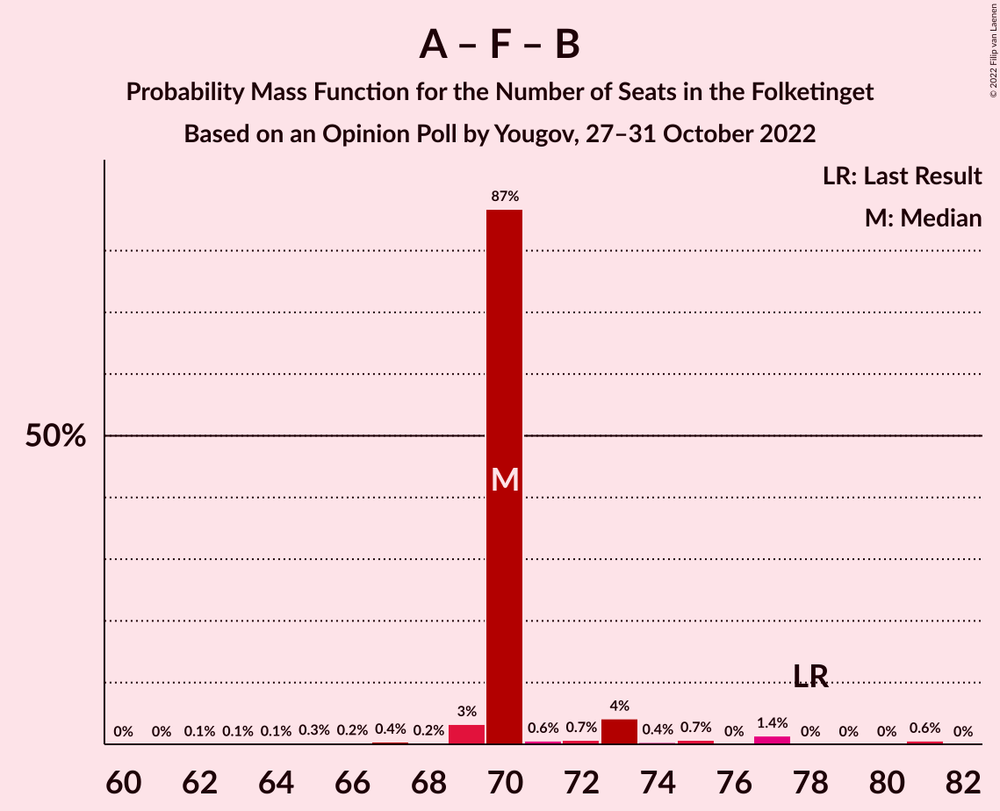

| Number of Seats | Probability | Accumulated | Special Marks |
|:---------------:|:-----------:|:-----------:|:-------------:|
| 62 | 0.1% | 100% |  |
| 63 | 0.1% | 99.9% |  |
| 64 | 0.1% | 99.9% |  |
| 65 | 0.3% | 99.8% |  |
| 66 | 0.2% | 99.5% |  |
| 67 | 0.4% | 99.3% |  |
| 68 | 0.2% | 98.9% |  |
| 69 | 3% | 98.7% |  |
| 70 | 87% | 95% | Median |
| 71 | 0.6% | 9% |  |
| 72 | 0.7% | 8% |  |
| 73 | 4% | 7% |  |
| 74 | 0.4% | 3% |  |
| 75 | 0.7% | 3% |  |
| 76 | 0% | 2% |  |
| 77 | 1.4% | 2% |  |
| 78 | 0% | 0.6% | Last Result |
| 79 | 0% | 0.6% |  |
| 80 | 0% | 0.6% |  |
| 81 | 0.6% | 0.6% |  |
| 82 | 0% | 0% |  |

### Venstre – Liberal Alliance – Det Konservative Folkeparti – Nye Borgerlige – Dansk Folkeparti – Kristendemokraterne

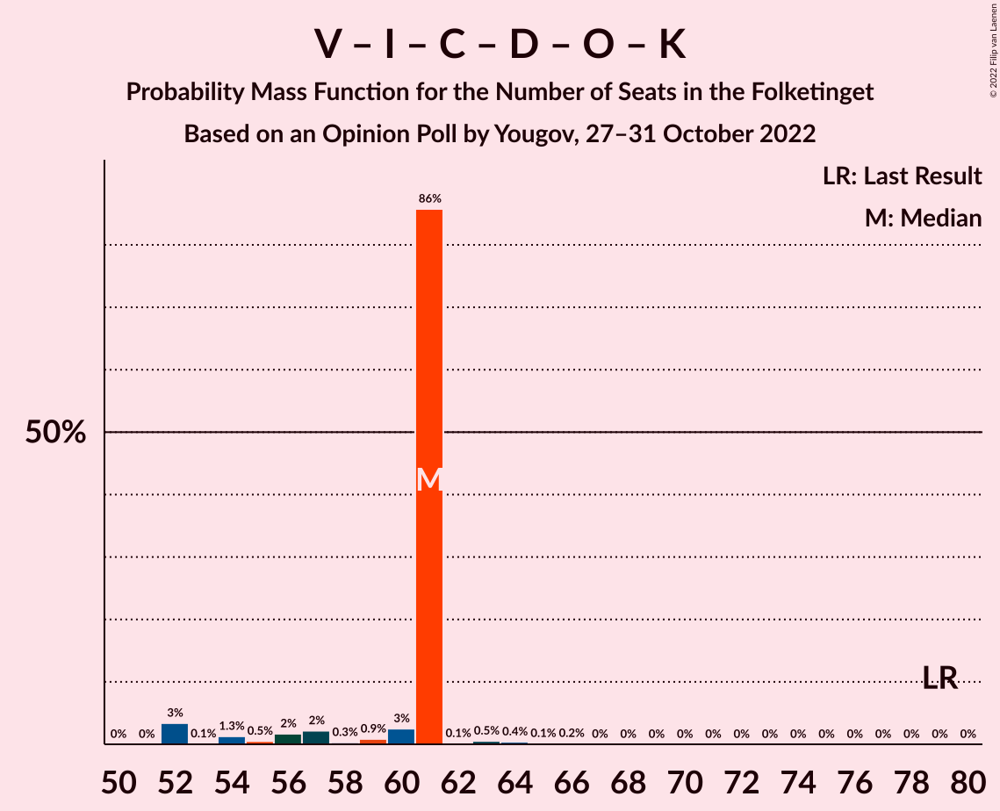

| Number of Seats | Probability | Accumulated | Special Marks |
|:---------------:|:-----------:|:-----------:|:-------------:|
| 52 | 3% | 100% |  |
| 53 | 0.1% | 97% |  |
| 54 | 1.3% | 97% |  |
| 55 | 0.5% | 95% |  |
| 56 | 2% | 95% |  |
| 57 | 2% | 93% |  |
| 58 | 0.3% | 91% |  |
| 59 | 0.9% | 91% |  |
| 60 | 3% | 90% |  |
| 61 | 86% | 87% | Median |
| 62 | 0.1% | 1.4% |  |
| 63 | 0.5% | 1.3% |  |
| 64 | 0.4% | 0.7% |  |
| 65 | 0.1% | 0.3% |  |
| 66 | 0.2% | 0.2% |  |
| 67 | 0% | 0% |  |
| 68 | 0% | 0% |  |
| 69 | 0% | 0% |  |
| 70 | 0% | 0% |  |
| 71 | 0% | 0% |  |
| 72 | 0% | 0% |  |
| 73 | 0% | 0% |  |
| 74 | 0% | 0% |  |
| 75 | 0% | 0% |  |
| 76 | 0% | 0% |  |
| 77 | 0% | 0% |  |
| 78 | 0% | 0% |  |
| 79 | 0% | 0% | Last Result |

### Venstre – Liberal Alliance – Det Konservative Folkeparti – Nye Borgerlige – Dansk Folkeparti

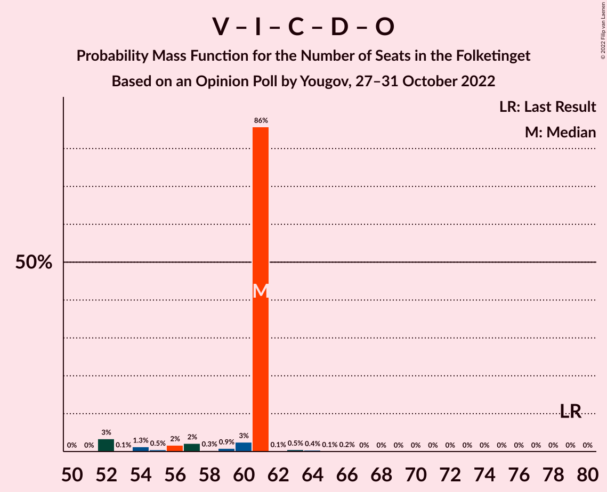

| Number of Seats | Probability | Accumulated | Special Marks |
|:---------------:|:-----------:|:-----------:|:-------------:|
| 52 | 3% | 100% |  |
| 53 | 0.1% | 97% |  |
| 54 | 1.3% | 97% |  |
| 55 | 0.5% | 95% |  |
| 56 | 2% | 95% |  |
| 57 | 2% | 93% |  |
| 58 | 0.3% | 91% |  |
| 59 | 0.9% | 91% |  |
| 60 | 3% | 90% |  |
| 61 | 86% | 87% | Median |
| 62 | 0.1% | 1.4% |  |
| 63 | 0.5% | 1.3% |  |
| 64 | 0.4% | 0.7% |  |
| 65 | 0.1% | 0.3% |  |
| 66 | 0.2% | 0.2% |  |
| 67 | 0% | 0% |  |
| 68 | 0% | 0% |  |
| 69 | 0% | 0% |  |
| 70 | 0% | 0% |  |
| 71 | 0% | 0% |  |
| 72 | 0% | 0% |  |
| 73 | 0% | 0% |  |
| 74 | 0% | 0% |  |
| 75 | 0% | 0% |  |
| 76 | 0% | 0% |  |
| 77 | 0% | 0% |  |
| 78 | 0% | 0% |  |
| 79 | 0% | 0% | Last Result |

### Socialdemokraterne – Radikale Venstre

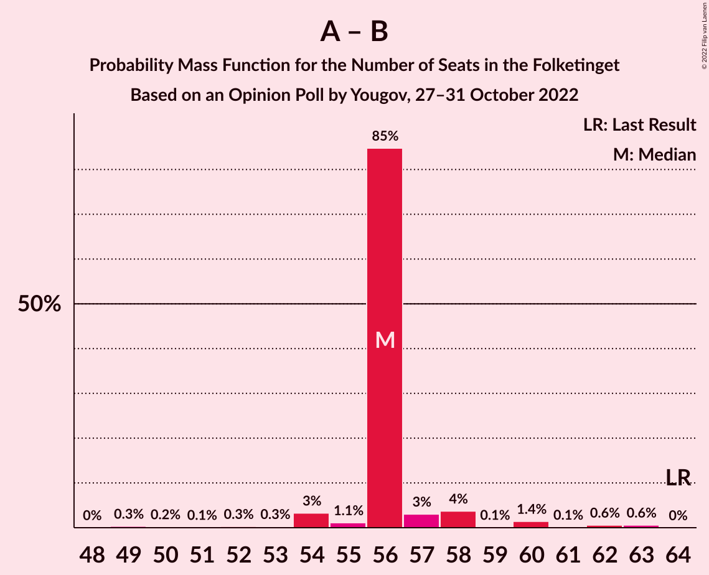

| Number of Seats | Probability | Accumulated | Special Marks |
|:---------------:|:-----------:|:-----------:|:-------------:|
| 49 | 0.3% | 100% |  |
| 50 | 0.2% | 99.6% |  |
| 51 | 0.1% | 99.4% |  |
| 52 | 0.3% | 99.3% |  |
| 53 | 0.3% | 99.0% |  |
| 54 | 3% | 98.8% |  |
| 55 | 1.1% | 95% |  |
| 56 | 85% | 94% | Median |
| 57 | 3% | 10% |  |
| 58 | 4% | 7% |  |
| 59 | 0.1% | 3% |  |
| 60 | 1.4% | 3% |  |
| 61 | 0.1% | 1.3% |  |
| 62 | 0.6% | 1.2% |  |
| 63 | 0.6% | 0.6% |  |
| 64 | 0% | 0% | Last Result |

### Venstre – Liberal Alliance – Det Konservative Folkeparti – Dansk Folkeparti – Kristendemokraterne

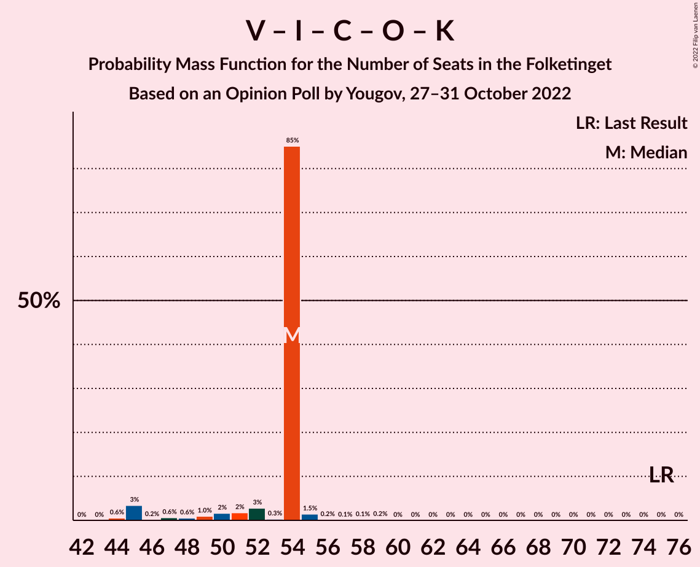

| Number of Seats | Probability | Accumulated | Special Marks |
|:---------------:|:-----------:|:-----------:|:-------------:|
| 44 | 0.6% | 100% |  |
| 45 | 3% | 99.4% |  |
| 46 | 0.2% | 96% |  |
| 47 | 0.6% | 96% |  |
| 48 | 0.6% | 95% |  |
| 49 | 1.0% | 95% |  |
| 50 | 2% | 94% |  |
| 51 | 2% | 92% |  |
| 52 | 3% | 90% |  |
| 53 | 0.3% | 87% |  |
| 54 | 85% | 87% | Median |
| 55 | 1.5% | 2% |  |
| 56 | 0.2% | 0.6% |  |
| 57 | 0.1% | 0.4% |  |
| 58 | 0.1% | 0.3% |  |
| 59 | 0.2% | 0.2% |  |
| 60 | 0% | 0% |  |
| 61 | 0% | 0% |  |
| 62 | 0% | 0% |  |
| 63 | 0% | 0% |  |
| 64 | 0% | 0% |  |
| 65 | 0% | 0% |  |
| 66 | 0% | 0% |  |
| 67 | 0% | 0% |  |
| 68 | 0% | 0% |  |
| 69 | 0% | 0% |  |
| 70 | 0% | 0% |  |
| 71 | 0% | 0% |  |
| 72 | 0% | 0% |  |
| 73 | 0% | 0% |  |
| 74 | 0% | 0% |  |
| 75 | 0% | 0% | Last Result |

### Venstre – Liberal Alliance – Det Konservative Folkeparti – Dansk Folkeparti

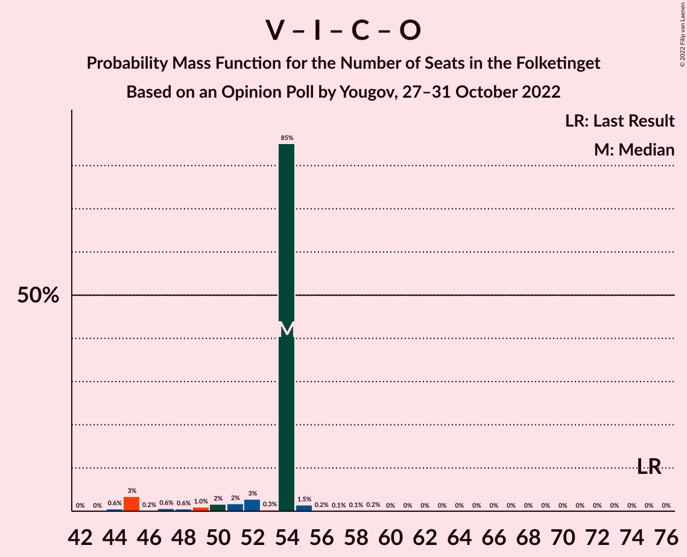

| Number of Seats | Probability | Accumulated | Special Marks |
|:---------------:|:-----------:|:-----------:|:-------------:|
| 44 | 0.6% | 100% |  |
| 45 | 3% | 99.4% |  |
| 46 | 0.2% | 96% |  |
| 47 | 0.6% | 96% |  |
| 48 | 0.6% | 95% |  |
| 49 | 1.0% | 95% |  |
| 50 | 2% | 94% |  |
| 51 | 2% | 92% |  |
| 52 | 3% | 90% |  |
| 53 | 0.3% | 87% |  |
| 54 | 85% | 87% | Median |
| 55 | 1.5% | 2% |  |
| 56 | 0.2% | 0.6% |  |
| 57 | 0.1% | 0.4% |  |
| 58 | 0.1% | 0.3% |  |
| 59 | 0.2% | 0.2% |  |
| 60 | 0% | 0% |  |
| 61 | 0% | 0% |  |
| 62 | 0% | 0% |  |
| 63 | 0% | 0% |  |
| 64 | 0% | 0% |  |
| 65 | 0% | 0% |  |
| 66 | 0% | 0% |  |
| 67 | 0% | 0% |  |
| 68 | 0% | 0% |  |
| 69 | 0% | 0% |  |
| 70 | 0% | 0% |  |
| 71 | 0% | 0% |  |
| 72 | 0% | 0% |  |
| 73 | 0% | 0% |  |
| 74 | 0% | 0% |  |
| 75 | 0% | 0% | Last Result |

### Venstre – Liberal Alliance – Det Konservative Folkeparti

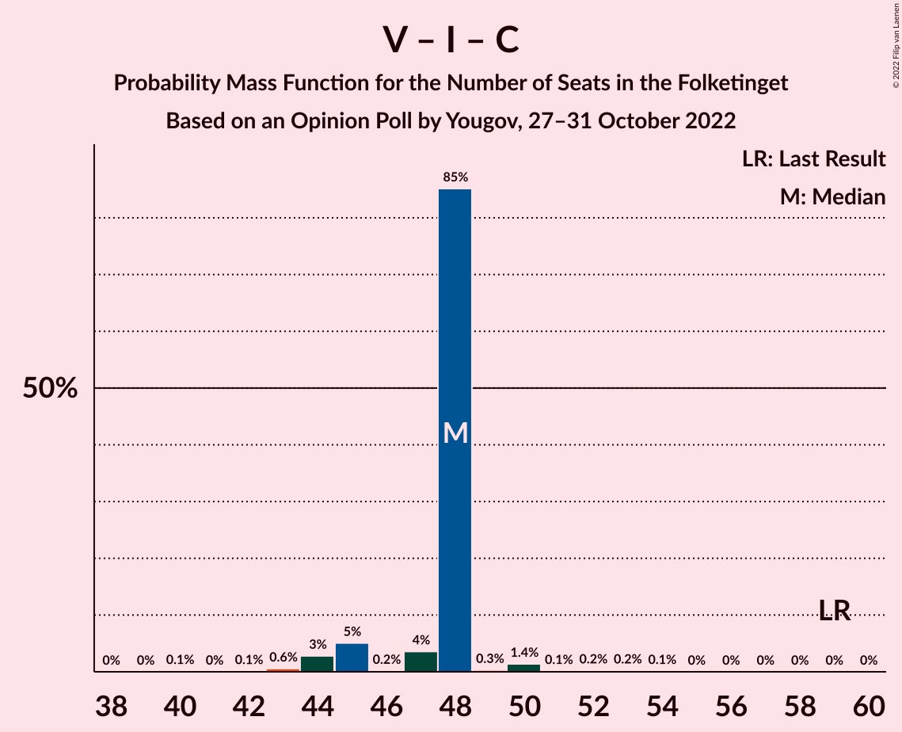

| Number of Seats | Probability | Accumulated | Special Marks |
|:---------------:|:-----------:|:-----------:|:-------------:|
| 40 | 0.1% | 100% |  |
| 41 | 0% | 99.9% |  |
| 42 | 0.1% | 99.9% |  |
| 43 | 0.6% | 99.7% |  |
| 44 | 3% | 99.2% |  |
| 45 | 5% | 96% |  |
| 46 | 0.2% | 91% |  |
| 47 | 4% | 91% |  |
| 48 | 85% | 88% | Median |
| 49 | 0.3% | 2% |  |
| 50 | 1.4% | 2% |  |
| 51 | 0.1% | 0.7% |  |
| 52 | 0.2% | 0.6% |  |
| 53 | 0.2% | 0.4% |  |
| 54 | 0.1% | 0.1% |  |
| 55 | 0% | 0% |  |
| 56 | 0% | 0% |  |
| 57 | 0% | 0% |  |
| 58 | 0% | 0% |  |
| 59 | 0% | 0% | Last Result |

### Venstre – Det Konservative Folkeparti

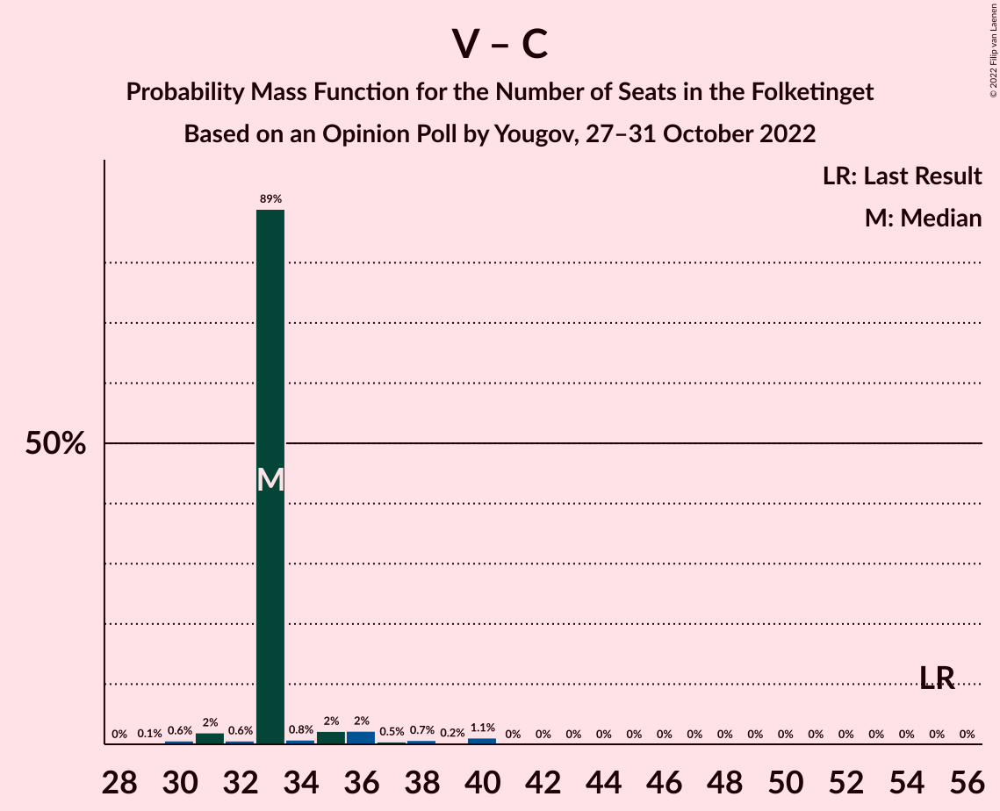

| Number of Seats | Probability | Accumulated | Special Marks |
|:---------------:|:-----------:|:-----------:|:-------------:|
| 29 | 0.1% | 100% |  |
| 30 | 0.6% | 99.8% |  |
| 31 | 2% | 99.2% |  |
| 32 | 0.6% | 97% |  |
| 33 | 89% | 97% | Median |
| 34 | 0.8% | 8% |  |
| 35 | 2% | 7% |  |
| 36 | 2% | 5% |  |
| 37 | 0.5% | 3% |  |
| 38 | 0.7% | 2% |  |
| 39 | 0.2% | 1.4% |  |
| 40 | 1.1% | 1.1% |  |
| 41 | 0% | 0% |  |
| 42 | 0% | 0% |  |
| 43 | 0% | 0% |  |
| 44 | 0% | 0% |  |
| 45 | 0% | 0% |  |
| 46 | 0% | 0% |  |
| 47 | 0% | 0% |  |
| 48 | 0% | 0% |  |
| 49 | 0% | 0% |  |
| 50 | 0% | 0% |  |
| 51 | 0% | 0% |  |
| 52 | 0% | 0% |  |
| 53 | 0% | 0% |  |
| 54 | 0% | 0% |  |
| 55 | 0% | 0% | Last Result |

### Venstre

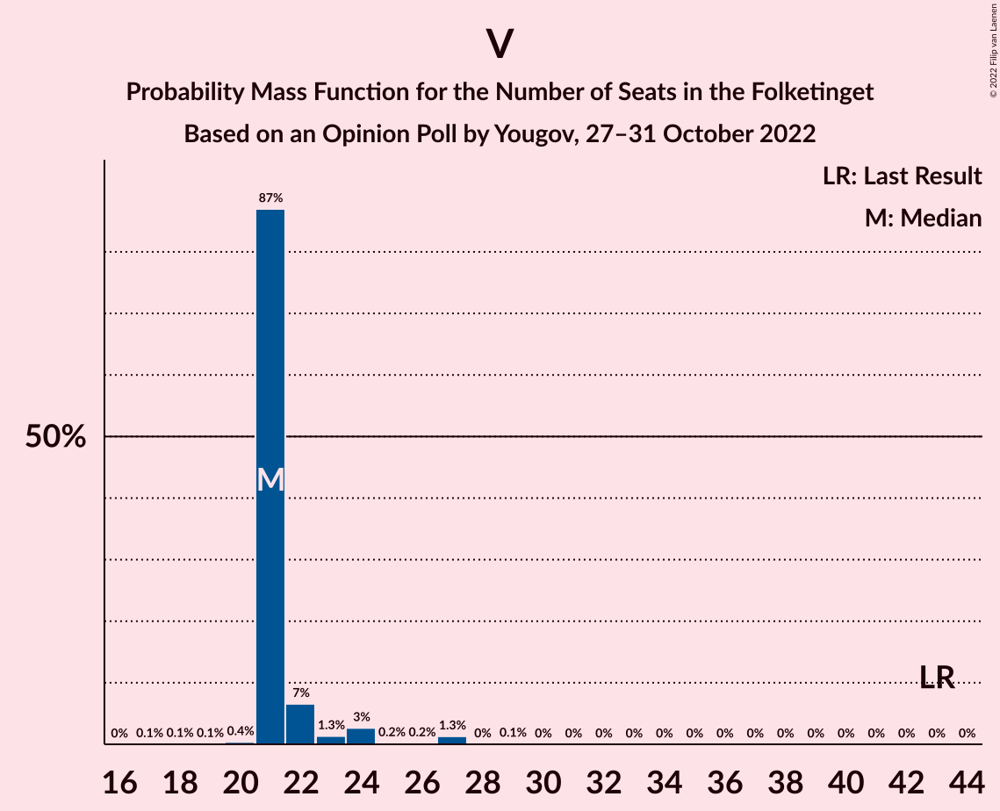

| Number of Seats | Probability | Accumulated | Special Marks |
|:---------------:|:-----------:|:-----------:|:-------------:|
| 17 | 0.1% | 100% |  |
| 18 | 0.1% | 99.9% |  |
| 19 | 0.1% | 99.9% |  |
| 20 | 0.4% | 99.8% |  |
| 21 | 87% | 99.4% | Median |
| 22 | 7% | 12% |  |
| 23 | 1.3% | 6% |  |
| 24 | 3% | 5% |  |
| 25 | 0.2% | 2% |  |
| 26 | 0.2% | 2% |  |
| 27 | 1.3% | 1.5% |  |
| 28 | 0% | 0.2% |  |
| 29 | 0.1% | 0.1% |  |
| 30 | 0% | 0% |  |
| 31 | 0% | 0% |  |
| 32 | 0% | 0% |  |
| 33 | 0% | 0% |  |
| 34 | 0% | 0% |  |
| 35 | 0% | 0% |  |
| 36 | 0% | 0% |  |
| 37 | 0% | 0% |  |
| 38 | 0% | 0% |  |
| 39 | 0% | 0% |  |
| 40 | 0% | 0% |  |
| 41 | 0% | 0% |  |
| 42 | 0% | 0% |  |
| 43 | 0% | 0% | Last Result |

## Technical Information

### Opinion Poll

+ **Polling firm:** Yougov
+ **Commissioner(s):** —
+ **Fieldwork period:** 27–31 October 2022

### Calculations

+ **Sample size:** 1337
+ **Simulations done:** 1,048,576
+ **Error estimate:** 2.59%

