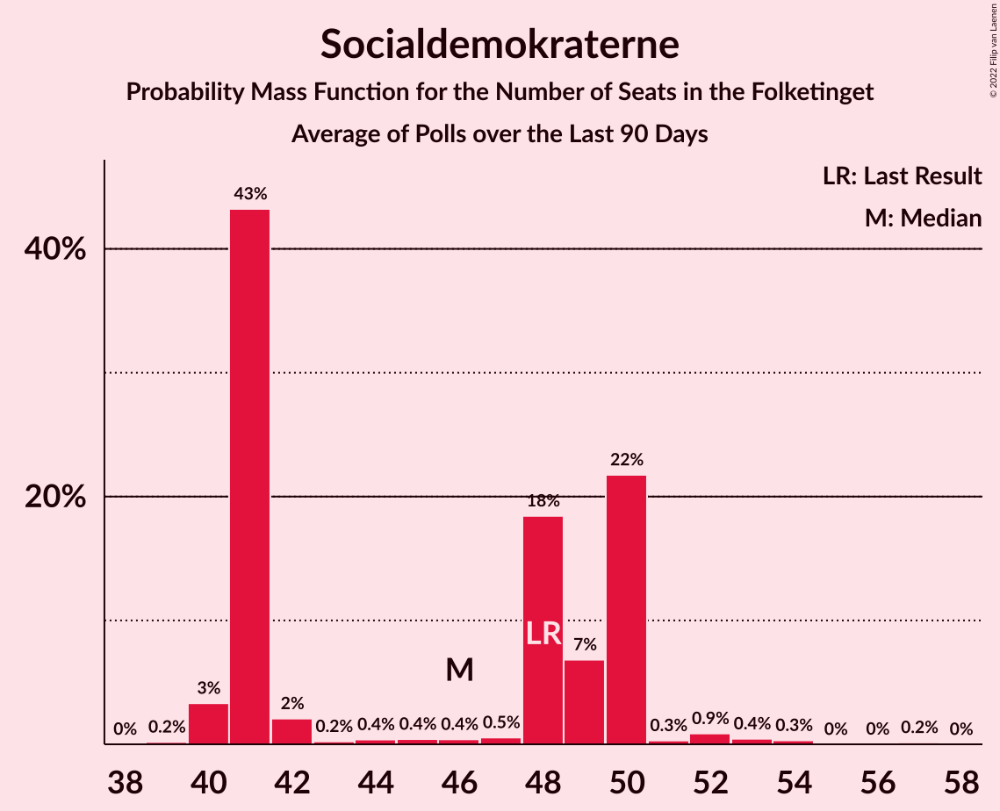

# Poll Average

<a href="#voting-intentions">Voting Intentions</a> | <a href="#seats">Seats</a> | <a href="#coalitions">Coalitions</a> | <a href="#technical-information">Technical Information</a>

## Summary

The table below lists the polls on which the average is based. They are the most recent polls (less than 90 days old) registered and analyzed so far.

| Period     | Polling firm/Commissioner(s) | A | O | V | Ø | I | Å | B | F | C | K | D | E |
|:----------:|:----------------------------:|:--:|:--:|:--:|:--:|:--:|:--:|:--:|:--:|:--:|:--:|:--:|:--:|
| 18 June 2015 | General Election | 26.3%   47 | 21.1%   37 | 19.5%   34 | 7.8%   14 | 7.5%   13 | 4.8%   9 | 4.6%   8 | 4.2%   7 | 3.4%   6 | 0.8%   0 | 0.0%   0 | 0.0%   0 |
| N/A | Poll Average | 22–31%   41–50 | 12–18%   21–30 | 16–21%   29–38 | 7–11%   12–19 | 3–6%   7–11 | 3–5%   6–8 | 5–8%   10–19 | 5–8%   9–14 | 4–6%   5–11 | 1–2%   0 | 1–6%   0–11 | 0–2%   0 |
| [25–31 March 2019](2019-03-31-Voxmeter.html) | Voxmeter   Ritzau | 26–32%   44–50 | 13–18%   21–27 | 16–21%   35–38 | 7–10%   15–17 | 3–5%   9–10 | 3–5%   6–7 | 6–9%   12–19 | 4–7%   10–11 | 3–6%   5–8 | 1–2%   0 | 1–3%   0–6 | 0–1%   0 |
| [25–28 March 2019](2019-03-28-Megafon.html) | Megafon   Politiken and TV 2 | N/A   N/A | N/A   N/A | N/A   N/A | N/A   N/A | N/A   N/A | N/A   N/A | N/A   N/A | N/A   N/A | N/A   N/A | N/A   N/A | N/A   N/A | N/A   N/A |
| [21–26 March 2019](2019-03-26-Norstat.html) | Norstat   Altinget and Jyllands-Posten | N/A   N/A | N/A   N/A | N/A   N/A | N/A   N/A | N/A   N/A | N/A   N/A | N/A   N/A | N/A   N/A | N/A   N/A | N/A   N/A | N/A   N/A | N/A   N/A |
| [18–25 March 2019](2019-03-25-Epinion.html) | Epinion   DR | N/A   N/A | N/A   N/A | N/A   N/A | N/A   N/A | N/A   N/A | N/A   N/A | N/A   N/A | N/A   N/A | N/A   N/A | N/A   N/A | N/A   N/A | N/A   N/A |
| [8–14 March 2019](2019-03-14-KantarGallup.html) | Kantar Gallup   Berlingske | 24–28%   42–50 | 12–15%   21–27 | 18–22%   32–38 | 7–9%   11–15 | 4–7%   8–11 | 3–5%   5–8 | 6–8%   10–15 | 6–8%   11–14 | 4–6%   7–11 | 1%   0 | 2–3%   0–6 | 1–2%   0 |
| [11–14 January 2019](2019-01-14-YouGov.html) | YouGov | 22–26%   40–45 | 14–18%   25–30 | 16–19%   29–35 | 9–12%   16–20 | 4–6%   7–10 | 3–5%   6–9 | 5–7%   10–12 | 5–7%   9–12 | 4–6%   7–10 | 1–2%   0 | 5–7%   9–12 | N/A   N/A |
| 18 June 2015 | General Election | 26.3%   47 | 21.1%   37 | 19.5%   34 | 7.8%   14 | 7.5%   13 | 4.8%   9 | 4.6%   8 | 4.2%   7 | 3.4%   6 | 0.8%   0 | 0.0%   0 | 0.0%   0 |

Only polls for which at least the sample size has been published are included in the table above.

**Legend:**
+ **Top half of each row:** Voting intentions (95% confidence interval)
+ **Bottom half of each row:** Seat projections for the Folketinget (95% confidence interval)
+ **A:** Socialdemokraterne
+ **O:** Dansk Folkeparti
+ **V:** Venstre
+ **Ø:** Enhedslisten–De Rød-Grønne
+ **I:** Liberal Alliance
+ **Å:** Alternativet
+ **B:** Radikale Venstre
+ **F:** Socialistisk Folkeparti
+ **C:** Det Konservative Folkeparti
+ **K:** Kristendemokraterne
+ **D:** Nye Borgerlige
+ **E:** Klaus Riskær Pedersen
+ **N/A (single party):** Party not included the published results
+ **N/A (entire row):** Calculation for this opinion poll not started yet

## Voting Intentions

### Confidence Intervals

| Party | Last Result | Median | 80% Confidence Interval | 90% Confidence Interval | 95% Confidence Interval | 99% Confidence Interval |
|:-----:|:-----------:|:------:|:-----------------------:|:-----------------------:|:-----------------------:|:-----------------------:|
| <a href="#socialdemokraterne">Socialdemokraterne</a> | 26.3% | 26.0% | 23.3–29.5% |22.8–30.2% | 22.4–30.7% | 21.7–31.8% |
| <a href="#dansk-folkeparti">Dansk Folkeparti</a> | 21.1% | 15.1% | 13.2–16.7% |12.8–17.1% | 12.5–17.5% | 11.9–18.2% |
| <a href="#venstre">Venstre</a> | 19.5% | 18.7% | 17.0–20.5% |16.7–21.0% | 16.3–21.3% | 15.7–22.1% |
| <a href="#enhedslisten–de-rød-grønne">Enhedslisten–De Rød-Grønne</a> | 7.8% | 8.7% | 7.4–10.6% |7.1–11.0% | 6.8–11.3% | 6.4–11.8% |
| <a href="#liberal-alliance">Liberal Alliance</a> | 7.5% | 4.7% | 3.7–5.8% |3.4–6.1% | 3.2–6.3% | 2.9–6.8% |
| <a href="#alternativet">Alternativet</a> | 4.8% | 3.9% | 3.3–4.7% |3.1–4.9% | 3.0–5.1% | 2.7–5.5% |
| <a href="#radikale-venstre">Radikale Venstre</a> | 4.6% | 6.8% | 5.8–7.9% |5.6–8.2% | 5.4–8.5% | 5.1–9.1% |
| <a href="#socialistisk-folkeparti">Socialistisk Folkeparti</a> | 4.2% | 6.2% | 5.3–7.2% |5.0–7.5% | 4.7–7.7% | 4.3–8.2% |
| <a href="#det-konservative-folkeparti">Det Konservative Folkeparti</a> | 3.4% | 4.8% | 3.9–5.7% |3.7–5.9% | 3.5–6.2% | 3.1–6.6% |
| <a href="#kristendemokraterne">Kristendemokraterne</a> | 0.8% | 1.0% | 0.7–1.4% |0.6–1.5% | 0.6–1.6% | 0.4–1.9% |
| <a href="#nye-borgerlige">Nye Borgerlige</a> | 0.0% | 2.7% | 1.7–6.0% |1.5–6.3% | 1.4–6.5% | 1.2–6.9% |
| <a href="#klaus-riskær-pedersen">Klaus Riskær Pedersen</a> | 0.0% | 0.9% | 0.3–1.6% |0.2–1.8% | 0.2–1.9% | 0.1–2.2% |

### Socialdemokraterne

*For a full overview of the results for this party, see the [Socialdemokraterne](party-socialdemokraterne.html) page.*

| Voting Intentions | Probability | Accumulated | Special Marks |
|:-----------------:|:-----------:|:-----------:|:-------------:|
| 19.5–20.5% | 0% | 100% |  |
| 20.5–21.5% | 0.3% | 100% |  |
| 21.5–22.5% | 3% | 99.7% |  |
| 22.5–23.5% | 10% | 97% |  |
| 23.5–24.5% | 15% | 86% |  |
| 24.5–25.5% | 14% | 71% |  |
| 25.5–26.5% | 15% | 57% | Last Result, Median |
| 26.5–27.5% | 13% | 42% |  |
| 27.5–28.5% | 11% | 30% |  |
| 28.5–29.5% | 10% | 19% |  |
| 29.5–30.5% | 6% | 9% |  |
| 30.5–31.5% | 2% | 3% |  |
| 31.5–32.5% | 0.6% | 0.8% |  |
| 32.5–33.5% | 0.1% | 0.1% |  |
| 33.5–34.5% | 0% | 0% |  |

### Dansk Folkeparti

*For a full overview of the results for this party, see the [Dansk Folkeparti](party-danskfolkeparti.html) page.*

| Voting Intentions | Probability | Accumulated | Special Marks |
|:-----------------:|:-----------:|:-----------:|:-------------:|
| 9.5–10.5% | 0% | 100% |  |
| 10.5–11.5% | 0.1% | 100% |  |
| 11.5–12.5% | 3% | 99.8% |  |
| 12.5–13.5% | 13% | 97% |  |
| 13.5–14.5% | 20% | 84% |  |
| 14.5–15.5% | 25% | 64% | Median |
| 15.5–16.5% | 26% | 39% |  |
| 16.5–17.5% | 11% | 13% |  |
| 17.5–18.5% | 2% | 2% |  |
| 18.5–19.5% | 0.2% | 0.2% |  |
| 19.5–20.5% | 0% | 0% |  |
| 20.5–21.5% | 0% | 0% | Last Result |

### Venstre

*For a full overview of the results for this party, see the [Venstre](party-venstre.html) page.*

| Voting Intentions | Probability | Accumulated | Special Marks |
|:-----------------:|:-----------:|:-----------:|:-------------:|
| 13.5–14.5% | 0% | 100% |  |
| 14.5–15.5% | 0.3% | 100% |  |
| 15.5–16.5% | 4% | 99.7% |  |
| 16.5–17.5% | 16% | 96% |  |
| 17.5–18.5% | 26% | 80% |  |
| 18.5–19.5% | 26% | 54% | Median |
| 19.5–20.5% | 18% | 28% | Last Result |
| 20.5–21.5% | 8% | 9% |  |
| 21.5–22.5% | 2% | 2% |  |
| 22.5–23.5% | 0.1% | 0.1% |  |
| 23.5–24.5% | 0% | 0% |  |

### Enhedslisten–De Rød-Grønne

*For a full overview of the results for this party, see the [Enhedslisten–De Rød-Grønne](party-enhedslisten–derød-grønne.html) page.*

| Voting Intentions | Probability | Accumulated | Special Marks |
|:-----------------:|:-----------:|:-----------:|:-------------:|
| 4.5–5.5% | 0% | 100% |  |
| 5.5–6.5% | 0.9% | 100% |  |
| 6.5–7.5% | 14% | 99.1% |  |
| 7.5–8.5% | 32% | 85% | Last Result |
| 8.5–9.5% | 22% | 53% | Median |
| 9.5–10.5% | 20% | 32% |  |
| 10.5–11.5% | 10% | 12% |  |
| 11.5–12.5% | 1.1% | 1.2% |  |
| 12.5–13.5% | 0% | 0% |  |

### Liberal Alliance

*For a full overview of the results for this party, see the [Liberal Alliance](party-liberalalliance.html) page.*

| Voting Intentions | Probability | Accumulated | Special Marks |
|:-----------------:|:-----------:|:-----------:|:-------------:|
| 1.5–2.5% | 0.1% | 100% |  |
| 2.5–3.5% | 7% | 99.9% |  |
| 3.5–4.5% | 36% | 93% |  |
| 4.5–5.5% | 41% | 57% | Median |
| 5.5–6.5% | 15% | 16% |  |
| 6.5–7.5% | 1.1% | 1.2% |  |
| 7.5–8.5% | 0% | 0% | Last Result |

### Alternativet

*For a full overview of the results for this party, see the [Alternativet](party-alternativet.html) page.*

| Voting Intentions | Probability | Accumulated | Special Marks |
|:-----------------:|:-----------:|:-----------:|:-------------:|
| 0.5–1.5% | 0% | 100% |  |
| 1.5–2.5% | 0.1% | 100% |  |
| 2.5–3.5% | 22% | 99.9% |  |
| 3.5–4.5% | 65% | 78% | Median |
| 4.5–5.5% | 13% | 13% | Last Result |
| 5.5–6.5% | 0.5% | 0.5% |  |
| 6.5–7.5% | 0% | 0% |  |

### Radikale Venstre

*For a full overview of the results for this party, see the [Radikale Venstre](party-radikalevenstre.html) page.*

| Voting Intentions | Probability | Accumulated | Special Marks |
|:-----------------:|:-----------:|:-----------:|:-------------:|
| 3.5–4.5% | 0% | 100% |  |
| 4.5–5.5% | 4% | 100% | Last Result |
| 5.5–6.5% | 36% | 96% |  |
| 6.5–7.5% | 43% | 61% | Median |
| 7.5–8.5% | 16% | 18% |  |
| 8.5–9.5% | 2% | 2% |  |
| 9.5–10.5% | 0.1% | 0.1% |  |
| 10.5–11.5% | 0% | 0% |  |

### Socialistisk Folkeparti

*For a full overview of the results for this party, see the [Socialistisk Folkeparti](party-socialistiskfolkeparti.html) page.*

| Voting Intentions | Probability | Accumulated | Special Marks |
|:-----------------:|:-----------:|:-----------:|:-------------:|
| 2.5–3.5% | 0% | 100% |  |
| 3.5–4.5% | 1.3% | 100% | Last Result |
| 4.5–5.5% | 17% | 98.7% |  |
| 5.5–6.5% | 49% | 82% | Median |
| 6.5–7.5% | 28% | 32% |  |
| 7.5–8.5% | 4% | 4% |  |
| 8.5–9.5% | 0.1% | 0.1% |  |
| 9.5–10.5% | 0% | 0% |  |

### Det Konservative Folkeparti

*For a full overview of the results for this party, see the [Det Konservative Folkeparti](party-detkonservativefolkeparti.html) page.*

| Voting Intentions | Probability | Accumulated | Special Marks |
|:-----------------:|:-----------:|:-----------:|:-------------:|
| 1.5–2.5% | 0% | 100% |  |
| 2.5–3.5% | 3% | 100% | Last Result |
| 3.5–4.5% | 31% | 97% |  |
| 4.5–5.5% | 52% | 66% | Median |
| 5.5–6.5% | 14% | 14% |  |
| 6.5–7.5% | 0.6% | 0.6% |  |
| 7.5–8.5% | 0% | 0% |  |

### Kristendemokraterne

*For a full overview of the results for this party, see the [Kristendemokraterne](party-kristendemokraterne.html) page.*

| Voting Intentions | Probability | Accumulated | Special Marks |
|:-----------------:|:-----------:|:-----------:|:-------------:|
| 0.0–0.5% | 2% | 100% |  |
| 0.5–1.5% | 94% | 98% | Last Result, Median |
| 1.5–2.5% | 3% | 3% |  |
| 2.5–3.5% | 0% | 0% |  |

### Nye Borgerlige

*For a full overview of the results for this party, see the [Nye Borgerlige](party-nyeborgerlige.html) page.*

| Voting Intentions | Probability | Accumulated | Special Marks |
|:-----------------:|:-----------:|:-----------:|:-------------:|
| 0.0–0.5% | 0% | 100% | Last Result |
| 0.5–1.5% | 5% | 100% |  |
| 1.5–2.5% | 39% | 95% |  |
| 2.5–3.5% | 22% | 56% | Median |
| 3.5–4.5% | 1.0% | 34% |  |
| 4.5–5.5% | 12% | 33% |  |
| 5.5–6.5% | 19% | 21% |  |
| 6.5–7.5% | 2% | 2% |  |
| 7.5–8.5% | 0% | 0% |  |

### Klaus Riskær Pedersen

*For a full overview of the results for this party, see the [Klaus Riskær Pedersen](party-klausriskærpedersen.html) page.*

| Voting Intentions | Probability | Accumulated | Special Marks |
|:-----------------:|:-----------:|:-----------:|:-------------:|
| 0.0–0.5% | 34% | 100% | Last Result |
| 0.5–1.5% | 52% | 66% | Median |
| 1.5–2.5% | 13% | 13% |  |
| 2.5–3.5% | 0% | 0% |  |

## Seats

### Confidence Intervals

| Party | Last Result | Median | 80% Confidence Interval | 90% Confidence Interval | 95% Confidence Interval | 99% Confidence Interval |
|:-----:|:-----------:|:------:|:-----------------------:|:-----------------------:|:-----------------------:|:-----------------------:|
| <a href="#socialdemokraterne">Socialdemokraterne</a> | 47 | 44 | 41–50 |41–50 | 41–50 | 40–52 |
| <a href="#dansk-folkeparti">Dansk Folkeparti</a> | 37 | 27 | 22–30 |21–30 | 21–30 | 21–31 |
| <a href="#venstre">Venstre</a> | 34 | 35 | 31–38 |30–38 | 29–38 | 29–38 |
| <a href="#enhedslisten–de-rød-grønne">Enhedslisten–De Rød-Grønne</a> | 14 | 17 | 13–18 |12–19 | 12–19 | 11–20 |
| <a href="#liberal-alliance">Liberal Alliance</a> | 13 | 9 | 8–11 |7–11 | 7–11 | 7–12 |
| <a href="#alternativet">Alternativet</a> | 9 | 7 | 6–8 |6–8 | 6–8 | 5–9 |
| <a href="#radikale-venstre">Radikale Venstre</a> | 8 | 12 | 10–15 |10–19 | 10–19 | 9–19 |
| <a href="#socialistisk-folkeparti">Socialistisk Folkeparti</a> | 7 | 11 | 10–12 |9–13 | 9–14 | 9–16 |
| <a href="#det-konservative-folkeparti">Det Konservative Folkeparti</a> | 6 | 8 | 5–11 |5–11 | 5–11 | 5–12 |
| <a href="#kristendemokraterne">Kristendemokraterne</a> | 0 | 0 | 0 |0 | 0 | 0 |
| <a href="#nye-borgerlige">Nye Borgerlige</a> | 0 | 6 | 0–10 |0–11 | 0–11 | 0–12 |
| <a href="#klaus-riskær-pedersen">Klaus Riskær Pedersen</a> | 0 | 0 | 0 |0 | 0 | 0–4 |

### Socialdemokraterne

*For a full overview of the results for this party, see the [Socialdemokraterne](party-socialdemokraterne.html) page.*

| Number of Seats | Probability | Accumulated | Special Marks |
|:---------------:|:-----------:|:-----------:|:-------------:|
| 37 | 0.3% | 100% |  |
| 38 | 0% | 99.7% |  |
| 39 | 0.2% | 99.7% |  |
| 40 | 0.9% | 99.5% |  |
| 41 | 18% | 98.6% |  |
| 42 | 14% | 81% |  |
| 43 | 6% | 66% |  |
| 44 | 28% | 60% | Median |
| 45 | 11% | 32% |  |
| 46 | 0.4% | 21% |  |
| 47 | 5% | 21% | Last Result |
| 48 | 5% | 16% |  |
| 49 | 0.7% | 11% |  |
| 50 | 10% | 10% |  |
| 51 | 0.1% | 0.6% |  |
| 52 | 0.1% | 0.6% |  |
| 53 | 0.4% | 0.4% |  |
| 54 | 0% | 0% |  |

### Dansk Folkeparti

*For a full overview of the results for this party, see the [Dansk Folkeparti](party-danskfolkeparti.html) page.*

| Number of Seats | Probability | Accumulated | Special Marks |
|:---------------:|:-----------:|:-----------:|:-------------:|
| 19 | 0.1% | 100% |  |
| 20 | 0.1% | 99.9% |  |
| 21 | 9% | 99.8% |  |
| 22 | 3% | 91% |  |
| 23 | 2% | 88% |  |
| 24 | 3% | 86% |  |
| 25 | 11% | 83% |  |
| 26 | 6% | 72% |  |
| 27 | 38% | 66% | Median |
| 28 | 8% | 28% |  |
| 29 | 2% | 20% |  |
| 30 | 17% | 18% |  |
| 31 | 0.4% | 0.6% |  |
| 32 | 0.1% | 0.2% |  |
| 33 | 0% | 0% |  |
| 34 | 0% | 0% |  |
| 35 | 0% | 0% |  |
| 36 | 0% | 0% |  |
| 37 | 0% | 0% | Last Result |

### Venstre

*For a full overview of the results for this party, see the [Venstre](party-venstre.html) page.*

| Number of Seats | Probability | Accumulated | Special Marks |
|:---------------:|:-----------:|:-----------:|:-------------:|
| 25 | 0.2% | 100% |  |
| 26 | 0% | 99.8% |  |
| 27 | 0% | 99.8% |  |
| 28 | 0.1% | 99.8% |  |
| 29 | 4% | 99.7% |  |
| 30 | 1.4% | 96% |  |
| 31 | 20% | 95% |  |
| 32 | 5% | 75% |  |
| 33 | 3% | 70% |  |
| 34 | 3% | 67% | Last Result |
| 35 | 23% | 64% | Median |
| 36 | 2% | 41% |  |
| 37 | 11% | 39% |  |
| 38 | 28% | 28% |  |
| 39 | 0.1% | 0.3% |  |
| 40 | 0.2% | 0.2% |  |
| 41 | 0% | 0% |  |

### Enhedslisten–De Rød-Grønne

*For a full overview of the results for this party, see the [Enhedslisten–De Rød-Grønne](party-enhedslisten–derød-grønne.html) page.*

| Number of Seats | Probability | Accumulated | Special Marks |
|:---------------:|:-----------:|:-----------:|:-------------:|
| 10 | 0.4% | 100% |  |
| 11 | 2% | 99.6% |  |
| 12 | 4% | 98% |  |
| 13 | 7% | 94% |  |
| 14 | 2% | 87% | Last Result |
| 15 | 26% | 86% |  |
| 16 | 2% | 60% |  |
| 17 | 45% | 57% | Median |
| 18 | 7% | 13% |  |
| 19 | 5% | 6% |  |
| 20 | 1.0% | 1.1% |  |
| 21 | 0.1% | 0.1% |  |
| 22 | 0% | 0.1% |  |
| 23 | 0% | 0% |  |

### Liberal Alliance

*For a full overview of the results for this party, see the [Liberal Alliance](party-liberalalliance.html) page.*

| Number of Seats | Probability | Accumulated | Special Marks |
|:---------------:|:-----------:|:-----------:|:-------------:|
| 6 | 0.3% | 100% |  |
| 7 | 7% | 99.7% |  |
| 8 | 30% | 93% |  |
| 9 | 34% | 63% | Median |
| 10 | 11% | 29% |  |
| 11 | 17% | 18% |  |
| 12 | 0.6% | 0.7% |  |
| 13 | 0% | 0.1% | Last Result |
| 14 | 0% | 0% |  |

### Alternativet

*For a full overview of the results for this party, see the [Alternativet](party-alternativet.html) page.*

| Number of Seats | Probability | Accumulated | Special Marks |
|:---------------:|:-----------:|:-----------:|:-------------:|
| 4 | 0.3% | 100% |  |
| 5 | 2% | 99.7% |  |
| 6 | 25% | 98% |  |
| 7 | 59% | 73% | Median |
| 8 | 11% | 13% |  |
| 9 | 2% | 2% | Last Result |
| 10 | 0.1% | 0.1% |  |
| 11 | 0% | 0% |  |

### Radikale Venstre

*For a full overview of the results for this party, see the [Radikale Venstre](party-radikalevenstre.html) page.*

| Number of Seats | Probability | Accumulated | Special Marks |
|:---------------:|:-----------:|:-----------:|:-------------:|
| 8 | 0% | 100% | Last Result |
| 9 | 1.1% | 100% |  |
| 10 | 11% | 98.9% |  |
| 11 | 19% | 88% |  |
| 12 | 41% | 69% | Median |
| 13 | 6% | 27% |  |
| 14 | 10% | 21% |  |
| 15 | 3% | 10% |  |
| 16 | 0% | 7% |  |
| 17 | 0% | 7% |  |
| 18 | 0% | 7% |  |
| 19 | 7% | 7% |  |
| 20 | 0% | 0% |  |

### Socialistisk Folkeparti

*For a full overview of the results for this party, see the [Socialistisk Folkeparti](party-socialistiskfolkeparti.html) page.*

| Number of Seats | Probability | Accumulated | Special Marks |
|:---------------:|:-----------:|:-----------:|:-------------:|
| 7 | 0% | 100% | Last Result |
| 8 | 0.1% | 100% |  |
| 9 | 8% | 99.9% |  |
| 10 | 31% | 92% |  |
| 11 | 24% | 61% | Median |
| 12 | 32% | 38% |  |
| 13 | 3% | 6% |  |
| 14 | 2% | 3% |  |
| 15 | 0.1% | 0.8% |  |
| 16 | 0.6% | 0.6% |  |
| 17 | 0% | 0% |  |

### Det Konservative Folkeparti

*For a full overview of the results for this party, see the [Det Konservative Folkeparti](party-detkonservativefolkeparti.html) page.*

| Number of Seats | Probability | Accumulated | Special Marks |
|:---------------:|:-----------:|:-----------:|:-------------:|
| 5 | 26% | 100% |  |
| 6 | 0.6% | 74% | Last Result |
| 7 | 2% | 74% |  |
| 8 | 34% | 72% | Median |
| 9 | 10% | 38% |  |
| 10 | 10% | 27% |  |
| 11 | 17% | 18% |  |
| 12 | 0.6% | 0.7% |  |
| 13 | 0.1% | 0.1% |  |
| 14 | 0% | 0% |  |

### Kristendemokraterne

*For a full overview of the results for this party, see the [Kristendemokraterne](party-kristendemokraterne.html) page.*

| Number of Seats | Probability | Accumulated | Special Marks |
|:---------------:|:-----------:|:-----------:|:-------------:|
| 0 | 99.9% | 100% | Last Result, Median |
| 1 | 0% | 0.1% |  |
| 2 | 0% | 0.1% |  |
| 3 | 0% | 0.1% |  |
| 4 | 0.1% | 0.1% |  |
| 5 | 0% | 0% |  |

### Nye Borgerlige

*For a full overview of the results for this party, see the [Nye Borgerlige](party-nyeborgerlige.html) page.*

| Number of Seats | Probability | Accumulated | Special Marks |
|:---------------:|:-----------:|:-----------:|:-------------:|
| 0 | 16% | 100% | Last Result |
| 1 | 0% | 84% |  |
| 2 | 0% | 84% |  |
| 3 | 0% | 84% |  |
| 4 | 5% | 84% |  |
| 5 | 15% | 78% |  |
| 6 | 29% | 63% | Median |
| 7 | 0.5% | 34% |  |
| 8 | 0.3% | 33% |  |
| 9 | 5% | 33% |  |
| 10 | 20% | 28% |  |
| 11 | 7% | 8% |  |
| 12 | 0.8% | 0.9% |  |
| 13 | 0.2% | 0.2% |  |
| 14 | 0% | 0% |  |

### Klaus Riskær Pedersen

*For a full overview of the results for this party, see the [Klaus Riskær Pedersen](party-klausriskærpedersen.html) page.*

| Number of Seats | Probability | Accumulated | Special Marks |
|:---------------:|:-----------:|:-----------:|:-------------:|
| 0 | 99.4% | 100% | Last Result, Median |
| 1 | 0% | 0.6% |  |
| 2 | 0% | 0.6% |  |
| 3 | 0% | 0.6% |  |
| 4 | 0.5% | 0.6% |  |
| 5 | 0.1% | 0.1% |  |
| 6 | 0% | 0% |  |

## Coalitions

### Confidence Intervals

| Coalition | Last Result | Median | Majority? | 80% Confidence Interval | 90% Confidence Interval | 95% Confidence Interval | 99% Confidence Interval |
|:---------:|:-----------:|:------:|:---------:|:-----------------------:|:-----------------------:|:-----------------------:|:-----------------------:|
| Socialdemokraterne – Enhedslisten–De Rød-Grønne – Alternativet – Radikale Venstre – Socialistisk Folkeparti | 85 | 90 | 62% | 88–95 | 86–101 | 86–101 | 86–101 |
| Socialdemokraterne – Enhedslisten–De Rød-Grønne – Radikale Venstre – Socialistisk Folkeparti | 76 | 83 | 9% | 81–89 | 79–95 | 79–95 | 79–95 |
| Dansk Folkeparti – Venstre – Liberal Alliance – Det Konservative Folkeparti – Kristendemokraterne – Klaus Riskær Pedersen – Nye Borgerlige | 90 | 85 | 0.4% | 80–87 | 74–89 | 74–89 | 74–89 |
| Dansk Folkeparti – Venstre – Liberal Alliance – Det Konservative Folkeparti – Klaus Riskær Pedersen – Nye Borgerlige | 90 | 85 | 0.4% | 80–87 | 74–89 | 74–89 | 74–89 |
| Dansk Folkeparti – Venstre – Liberal Alliance – Det Konservative Folkeparti – Kristendemokraterne – Nye Borgerlige | 90 | 85 | 0.4% | 80–87 | 74–89 | 74–89 | 74–89 |
| Dansk Folkeparti – Venstre – Liberal Alliance – Det Konservative Folkeparti – Nye Borgerlige | 90 | 85 | 0.4% | 80–87 | 74–89 | 74–89 | 74–89 |
| Dansk Folkeparti – Venstre – Liberal Alliance – Det Konservative Folkeparti – Kristendemokraterne | 90 | 79 | 0% | 74–82 | 74–84 | 73–84 | 72–84 |
| Dansk Folkeparti – Venstre – Liberal Alliance – Det Konservative Folkeparti | 90 | 79 | 0% | 74–82 | 74–84 | 73–84 | 72–84 |
| Socialdemokraterne – Enhedslisten–De Rød-Grønne – Alternativet – Socialistisk Folkeparti | 77 | 78 | 0% | 77–81 | 76–82 | 76–82 | 73–84 |
| Socialdemokraterne – Radikale Venstre – Socialistisk Folkeparti | 62 | 66 | 0% | 64–75 | 61–80 | 61–80 | 61–80 |
| Socialdemokraterne – Enhedslisten–De Rød-Grønne – Socialistisk Folkeparti | 68 | 71 | 0% | 69–75 | 69–76 | 69–76 | 66–78 |
| Socialdemokraterne – Radikale Venstre | 55 | 56 | 0% | 52–63 | 52–69 | 52–69 | 51–69 |
| Venstre – Liberal Alliance – Det Konservative Folkeparti | 53 | 52 | 0% | 47–57 | 47–57 | 46–57 | 45–58 |
| Venstre – Det Konservative Folkeparti | 40 | 43 | 0% | 39–47 | 39–48 | 37–48 | 37–48 |
| Venstre | 34 | 35 | 0% | 31–38 | 30–38 | 29–38 | 29–38 |

### Socialdemokraterne – Enhedslisten–De Rød-Grønne – Alternativet – Radikale Venstre – Socialistisk Folkeparti

| Number of Seats | Probability | Accumulated | Special Marks |
|:---------------:|:-----------:|:-----------:|:-------------:|
| 84 | 0% | 100% |  |
| 85 | 0.3% | 99.9% | Last Result |
| 86 | 7% | 99.6% |  |
| 87 | 1.0% | 93% |  |
| 88 | 19% | 92% |  |
| 89 | 11% | 73% |  |
| 90 | 32% | 62% | Majority |
| 91 | 16% | 30% | Median |
| 92 | 0.9% | 15% |  |
| 93 | 2% | 14% |  |
| 94 | 0.8% | 12% |  |
| 95 | 2% | 11% |  |
| 96 | 0.7% | 9% |  |
| 97 | 1.1% | 9% |  |
| 98 | 0.4% | 8% |  |
| 99 | 0.3% | 7% |  |
| 100 | 0% | 7% |  |
| 101 | 7% | 7% |  |
| 102 | 0% | 0% |  |

### Socialdemokraterne – Enhedslisten–De Rød-Grønne – Radikale Venstre – Socialistisk Folkeparti

| Number of Seats | Probability | Accumulated | Special Marks |
|:---------------:|:-----------:|:-----------:|:-------------:|
| 76 | 0% | 100% | Last Result |
| 77 | 0% | 100% |  |
| 78 | 0.1% | 99.9% |  |
| 79 | 7% | 99.9% |  |
| 80 | 1.2% | 93% |  |
| 81 | 26% | 92% |  |
| 82 | 4% | 66% |  |
| 83 | 33% | 62% |  |
| 84 | 4% | 30% | Median |
| 85 | 13% | 26% |  |
| 86 | 0.9% | 13% |  |
| 87 | 1.2% | 13% |  |
| 88 | 0.1% | 11% |  |
| 89 | 2% | 11% |  |
| 90 | 2% | 9% | Majority |
| 91 | 0.1% | 8% |  |
| 92 | 0.3% | 8% |  |
| 93 | 0.2% | 7% |  |
| 94 | 0% | 7% |  |
| 95 | 7% | 7% |  |
| 96 | 0% | 0% |  |

### Dansk Folkeparti – Venstre – Liberal Alliance – Det Konservative Folkeparti – Kristendemokraterne – Klaus Riskær Pedersen – Nye Borgerlige

| Number of Seats | Probability | Accumulated | Special Marks |
|:---------------:|:-----------:|:-----------:|:-------------:|
| 74 | 7% | 100% |  |
| 75 | 0% | 93% |  |
| 76 | 0.3% | 93% |  |
| 77 | 0.4% | 93% |  |
| 78 | 1.1% | 92% |  |
| 79 | 0.7% | 91% |  |
| 80 | 2% | 91% |  |
| 81 | 0.8% | 89% |  |
| 82 | 2% | 88% |  |
| 83 | 0.9% | 86% |  |
| 84 | 16% | 85% |  |
| 85 | 32% | 70% | Median |
| 86 | 11% | 38% |  |
| 87 | 19% | 27% |  |
| 88 | 1.0% | 8% |  |
| 89 | 7% | 7% |  |
| 90 | 0.3% | 0.4% | Last Result, Majority |
| 91 | 0% | 0.1% |  |
| 92 | 0% | 0% |  |

### Dansk Folkeparti – Venstre – Liberal Alliance – Det Konservative Folkeparti – Klaus Riskær Pedersen – Nye Borgerlige

| Number of Seats | Probability | Accumulated | Special Marks |
|:---------------:|:-----------:|:-----------:|:-------------:|
| 74 | 7% | 100% |  |
| 75 | 0% | 93% |  |
| 76 | 0.3% | 93% |  |
| 77 | 0.3% | 93% |  |
| 78 | 1.1% | 92% |  |
| 79 | 0.7% | 91% |  |
| 80 | 2% | 90% |  |
| 81 | 0.8% | 89% |  |
| 82 | 2% | 88% |  |
| 83 | 0.9% | 86% |  |
| 84 | 16% | 85% |  |
| 85 | 32% | 70% | Median |
| 86 | 11% | 38% |  |
| 87 | 19% | 27% |  |
| 88 | 1.0% | 8% |  |
| 89 | 7% | 7% |  |
| 90 | 0.3% | 0.4% | Last Result, Majority |
| 91 | 0% | 0.1% |  |
| 92 | 0% | 0% |  |

### Dansk Folkeparti – Venstre – Liberal Alliance – Det Konservative Folkeparti – Kristendemokraterne – Nye Borgerlige

| Number of Seats | Probability | Accumulated | Special Marks |
|:---------------:|:-----------:|:-----------:|:-------------:|
| 74 | 7% | 100% |  |
| 75 | 0% | 93% |  |
| 76 | 0.3% | 93% |  |
| 77 | 0.4% | 93% |  |
| 78 | 1.1% | 92% |  |
| 79 | 0.8% | 91% |  |
| 80 | 2% | 90% |  |
| 81 | 0.8% | 89% |  |
| 82 | 2% | 88% |  |
| 83 | 0.8% | 86% |  |
| 84 | 16% | 85% |  |
| 85 | 32% | 70% | Median |
| 86 | 11% | 38% |  |
| 87 | 19% | 27% |  |
| 88 | 0.9% | 8% |  |
| 89 | 7% | 7% |  |
| 90 | 0.3% | 0.4% | Last Result, Majority |
| 91 | 0% | 0.1% |  |
| 92 | 0% | 0% |  |

### Dansk Folkeparti – Venstre – Liberal Alliance – Det Konservative Folkeparti – Nye Borgerlige

| Number of Seats | Probability | Accumulated | Special Marks |
|:---------------:|:-----------:|:-----------:|:-------------:|
| 74 | 7% | 100% |  |
| 75 | 0% | 93% |  |
| 76 | 0.3% | 93% |  |
| 77 | 0.4% | 93% |  |
| 78 | 1.1% | 92% |  |
| 79 | 0.8% | 91% |  |
| 80 | 2% | 90% |  |
| 81 | 0.9% | 89% |  |
| 82 | 2% | 88% |  |
| 83 | 0.8% | 86% |  |
| 84 | 16% | 85% |  |
| 85 | 32% | 69% | Median |
| 86 | 11% | 38% |  |
| 87 | 19% | 27% |  |
| 88 | 0.9% | 8% |  |
| 89 | 7% | 7% |  |
| 90 | 0.3% | 0.4% | Last Result, Majority |
| 91 | 0% | 0.1% |  |
| 92 | 0% | 0% |  |

### Dansk Folkeparti – Venstre – Liberal Alliance – Det Konservative Folkeparti – Kristendemokraterne

| Number of Seats | Probability | Accumulated | Special Marks |
|:---------------:|:-----------:|:-----------:|:-------------:|
| 69 | 0.3% | 100% |  |
| 70 | 0% | 99.7% |  |
| 71 | 0% | 99.7% |  |
| 72 | 1.3% | 99.7% |  |
| 73 | 0.9% | 98% |  |
| 74 | 10% | 97% |  |
| 75 | 5% | 88% |  |
| 76 | 1.3% | 82% |  |
| 77 | 21% | 81% |  |
| 78 | 6% | 60% |  |
| 79 | 29% | 53% | Median |
| 80 | 3% | 24% |  |
| 81 | 9% | 21% |  |
| 82 | 2% | 12% |  |
| 83 | 0.9% | 10% |  |
| 84 | 9% | 9% |  |
| 85 | 0% | 0.1% |  |
| 86 | 0% | 0.1% |  |
| 87 | 0% | 0.1% |  |
| 88 | 0% | 0.1% |  |
| 89 | 0.1% | 0.1% |  |
| 90 | 0% | 0% | Last Result, Majority |

### Dansk Folkeparti – Venstre – Liberal Alliance – Det Konservative Folkeparti

| Number of Seats | Probability | Accumulated | Special Marks |
|:---------------:|:-----------:|:-----------:|:-------------:|
| 69 | 0.3% | 100% |  |
| 70 | 0% | 99.7% |  |
| 71 | 0% | 99.7% |  |
| 72 | 1.3% | 99.6% |  |
| 73 | 0.9% | 98% |  |
| 74 | 10% | 97% |  |
| 75 | 5% | 88% |  |
| 76 | 1.3% | 82% |  |
| 77 | 21% | 81% |  |
| 78 | 7% | 60% |  |
| 79 | 29% | 53% | Median |
| 80 | 3% | 24% |  |
| 81 | 9% | 21% |  |
| 82 | 2% | 12% |  |
| 83 | 0.9% | 10% |  |
| 84 | 9% | 9% |  |
| 85 | 0% | 0.1% |  |
| 86 | 0% | 0.1% |  |
| 87 | 0% | 0.1% |  |
| 88 | 0% | 0.1% |  |
| 89 | 0.1% | 0.1% |  |
| 90 | 0% | 0% | Last Result, Majority |

### Socialdemokraterne – Enhedslisten–De Rød-Grønne – Alternativet – Socialistisk Folkeparti

| Number of Seats | Probability | Accumulated | Special Marks |
|:---------------:|:-----------:|:-----------:|:-------------:|
| 72 | 0.1% | 100% |  |
| 73 | 0.5% | 99.9% |  |
| 74 | 0.9% | 99.4% |  |
| 75 | 0.5% | 98% |  |
| 76 | 7% | 98% |  |
| 77 | 37% | 91% | Last Result |
| 78 | 33% | 55% |  |
| 79 | 6% | 22% | Median |
| 80 | 3% | 16% |  |
| 81 | 4% | 13% |  |
| 82 | 7% | 10% |  |
| 83 | 2% | 2% |  |
| 84 | 0.4% | 0.8% |  |
| 85 | 0.1% | 0.4% |  |
| 86 | 0.1% | 0.3% |  |
| 87 | 0.2% | 0.2% |  |
| 88 | 0.1% | 0.1% |  |
| 89 | 0% | 0% |  |

### Socialdemokraterne – Radikale Venstre – Socialistisk Folkeparti

| Number of Seats | Probability | Accumulated | Special Marks |
|:---------------:|:-----------:|:-----------:|:-------------:|
| 59 | 0.3% | 100% |  |
| 60 | 0% | 99.7% |  |
| 61 | 6% | 99.7% |  |
| 62 | 1.5% | 94% | Last Result |
| 63 | 2% | 93% |  |
| 64 | 19% | 91% |  |
| 65 | 3% | 72% |  |
| 66 | 33% | 68% |  |
| 67 | 2% | 35% | Median |
| 68 | 0.7% | 33% |  |
| 69 | 2% | 32% |  |
| 70 | 10% | 30% |  |
| 71 | 3% | 20% |  |
| 72 | 3% | 17% |  |
| 73 | 2% | 14% |  |
| 74 | 0.7% | 12% |  |
| 75 | 1.0% | 11% |  |
| 76 | 2% | 10% |  |
| 77 | 0.2% | 8% |  |
| 78 | 0.6% | 8% |  |
| 79 | 0.3% | 7% |  |
| 80 | 7% | 7% |  |
| 81 | 0% | 0% |  |

### Socialdemokraterne – Enhedslisten–De Rød-Grønne – Socialistisk Folkeparti

| Number of Seats | Probability | Accumulated | Special Marks |
|:---------------:|:-----------:|:-----------:|:-------------:|
| 65 | 0% | 100% |  |
| 66 | 0.5% | 99.9% |  |
| 67 | 0.7% | 99.4% |  |
| 68 | 0.9% | 98.8% | Last Result |
| 69 | 13% | 98% |  |
| 70 | 20% | 85% |  |
| 71 | 43% | 65% |  |
| 72 | 6% | 22% | Median |
| 73 | 2% | 16% |  |
| 74 | 3% | 14% |  |
| 75 | 1.1% | 11% |  |
| 76 | 9% | 10% |  |
| 77 | 0.7% | 1.3% |  |
| 78 | 0.4% | 0.6% |  |
| 79 | 0.1% | 0.2% |  |
| 80 | 0% | 0.1% |  |
| 81 | 0% | 0.1% |  |
| 82 | 0% | 0% |  |

### Socialdemokraterne – Radikale Venstre

| Number of Seats | Probability | Accumulated | Special Marks |
|:---------------:|:-----------:|:-----------:|:-------------:|
| 48 | 0.3% | 100% |  |
| 49 | 0% | 99.7% |  |
| 50 | 0% | 99.7% |  |
| 51 | 2% | 99.7% |  |
| 52 | 24% | 98% |  |
| 53 | 0.5% | 74% |  |
| 54 | 8% | 73% |  |
| 55 | 7% | 66% | Last Result |
| 56 | 27% | 59% | Median |
| 57 | 2% | 32% |  |
| 58 | 2% | 30% |  |
| 59 | 10% | 28% |  |
| 60 | 5% | 19% |  |
| 61 | 2% | 13% |  |
| 62 | 1.3% | 12% |  |
| 63 | 0.6% | 10% |  |
| 64 | 1.0% | 10% |  |
| 65 | 1.3% | 9% |  |
| 66 | 0% | 7% |  |
| 67 | 0% | 7% |  |
| 68 | 0.4% | 7% |  |
| 69 | 7% | 7% |  |
| 70 | 0% | 0% |  |

### Venstre – Liberal Alliance – Det Konservative Folkeparti

| Number of Seats | Probability | Accumulated | Special Marks |
|:---------------:|:-----------:|:-----------:|:-------------:|
| 43 | 0.2% | 100% |  |
| 44 | 0% | 99.8% |  |
| 45 | 0.3% | 99.8% |  |
| 46 | 4% | 99.5% |  |
| 47 | 17% | 96% |  |
| 48 | 1.1% | 79% |  |
| 49 | 2% | 77% |  |
| 50 | 8% | 75% |  |
| 51 | 2% | 67% |  |
| 52 | 28% | 64% | Median |
| 53 | 8% | 36% | Last Result |
| 54 | 4% | 27% |  |
| 55 | 0.7% | 24% |  |
| 56 | 10% | 23% |  |
| 57 | 11% | 14% |  |
| 58 | 2% | 2% |  |
| 59 | 0.1% | 0.3% |  |
| 60 | 0.2% | 0.2% |  |
| 61 | 0% | 0% |  |

### Venstre – Det Konservative Folkeparti

| Number of Seats | Probability | Accumulated | Special Marks |
|:---------------:|:-----------:|:-----------:|:-------------:|
| 35 | 0.2% | 100% |  |
| 36 | 0.2% | 99.8% |  |
| 37 | 3% | 99.6% |  |
| 38 | 0.8% | 97% |  |
| 39 | 18% | 96% |  |
| 40 | 2% | 78% | Last Result |
| 41 | 4% | 75% |  |
| 42 | 4% | 71% |  |
| 43 | 41% | 68% | Median |
| 44 | 2% | 26% |  |
| 45 | 1.2% | 25% |  |
| 46 | 13% | 24% |  |
| 47 | 3% | 11% |  |
| 48 | 7% | 7% |  |
| 49 | 0.1% | 0.4% |  |
| 50 | 0.3% | 0.3% |  |
| 51 | 0% | 0% |  |

### Venstre

| Number of Seats | Probability | Accumulated | Special Marks |
|:---------------:|:-----------:|:-----------:|:-------------:|
| 25 | 0.2% | 100% |  |
| 26 | 0% | 99.8% |  |
| 27 | 0% | 99.8% |  |
| 28 | 0.1% | 99.8% |  |
| 29 | 4% | 99.7% |  |
| 30 | 1.4% | 96% |  |
| 31 | 20% | 95% |  |
| 32 | 5% | 75% |  |
| 33 | 3% | 70% |  |
| 34 | 3% | 67% | Last Result |
| 35 | 23% | 64% | Median |
| 36 | 2% | 41% |  |
| 37 | 11% | 39% |  |
| 38 | 28% | 28% |  |
| 39 | 0.1% | 0.3% |  |
| 40 | 0.2% | 0.2% |  |
| 41 | 0% | 0% |  |

## Technical Information

+ **Number of polls included in this average:** 6
+ **Lowest number of simulations done in a poll included in this average:** 0
+ **Total number of simulations done in the polls included in this average:** 2,098,176
+ **Error estimate:** 3.48%
