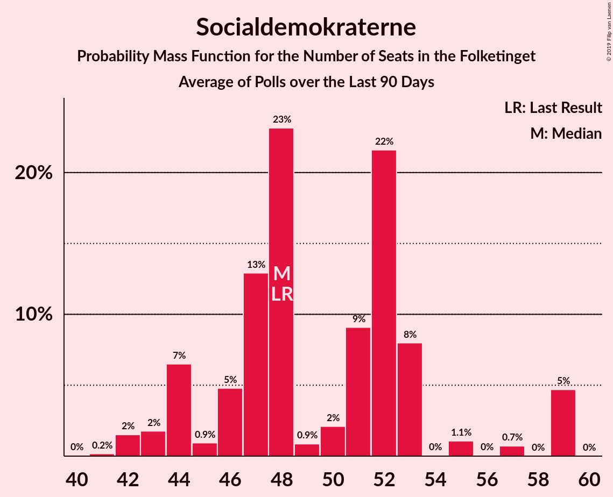
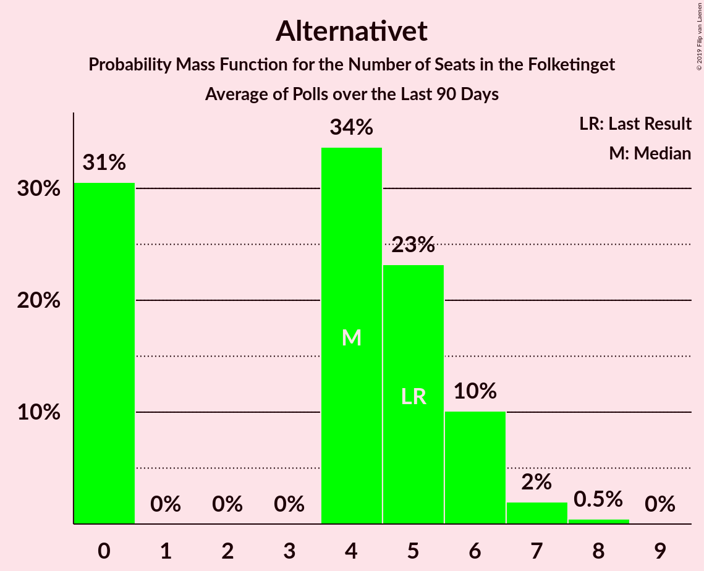

# Poll Average

<a href="#voting-intentions">Voting Intentions</a> | <a href="#seats">Seats</a> | <a href="#coalitions">Coalitions</a> | <a href="#technical-information">Technical Information</a>

## Summary

The table below lists the polls on which the average is based. They are the most recent polls (less than 90 days old) registered and analyzed so far.

| Period     | Polling firm/Commissioner(s) | A | O | V | Ø | I | Å | B | F | C | K | D | E | P |
|:----------:|:----------------------------:|:--:|:--:|:--:|:--:|:--:|:--:|:--:|:--:|:--:|:--:|:--:|:--:|:--:|
| 18 June 2015 | General Election | 26.3%   47 | 21.1%   37 | 19.5%   34 | 7.8%   14 | 7.5%   13 | 4.8%   9 | 4.6%   8 | 4.2%   7 | 3.4%   6 | 0.8%   0 | 0.0%   0 | 0.0%   0 | 0.0%   0 |
| N/A | Poll Average | 23–31%   42–55 | 9–14%   17–24 | 16–22%   27–38 | 7–11%   12–20 | 2–6%   0–10 | 2–5%   4–10 | 6–10%   11–18 | 6–10%   10–17 | 3–8%   5–14 | 1–2%   0–4 | 1–5%   0–10 | 0–2%   0–4 | 1–4%   0–7 |
| [28–30 May 2019](2019-05-30-Megafon.html) | Megafon   Politiken and TV 2 | 23–28%   41–48 | 10–14%   19–24 | 17–22%   30–36 | 7–11%   13–20 | 2–5%   5–9 | 2–5%   5–10 | 7–10%   12–16 | 6–9%   10–17 | 4–7%   8–12 | 1–2%   0–5 | 1–3%   0–6 | 0–1%   0 | 1–3%   0–5 |
| [25–29 May 2019](2019-05-29-YouGov.html) | YouGov | 24–29%   42–50 | 9–13%   18–23 | 15–20%   27–34 | 7–11%   13–21 | 2–4%   0–7 | 2–5%   5–8 | 6–10%   12–17 | 7–11%   13–18 | 4–7%   7–14 | 0–1%   0 | 3–6%   6–10 | 0–1%   0 | 2–4%   0–6 |
| [27–29 May 2019](2019-05-29-Voxmeter.html) | Voxmeter   Ritzau | 24–30%   45–53 | 9–13%   17–23 | 15–20%   28–35 | 7–10%   12–18 | 2–4%   4–7 | 3–5%   5–9 | 7–11%   13–18 | 6–10%   12–18 | 4–7%   8–12 | 1–3%   0–5 | 1–3%   0–5 | 0–2%   0 | 2–4%   0–7 |
| [28 May 2019](2019-05-28-Gallup.html) | Gallup | 23–28%   41–50 | 9–13%   17–23 | 18–22%   33–39 | 7–10%   12–17 | 2–4%   4–8 | 2–4%   4–7 | 6–8%   11–15 | 7–10%   13–17 | 6–8%   10–16 | 1–2%   0–4 | 2–4%   0–8 | 0–1%   0 | 1–2%   0–4 |
| [22 May 2019](2019-05-22-GreensAnalyseinstitut.html) | Greens Analyseinstitut   Børsen | 24–29%   43–54 | 9–12%   16–22 | 16–21%   29–37 | 8–11%   14–21 | 3–6%   7–11 | 3–6%   6–10 | 6–10%   12–18 | 6–9%   10–15 | 2–4%   4–8 | 1–3%   0–5 | 1–3%   0–6 | 0–1%   0 | 2–4%   0–7 |
| [18–20 May 2019](2019-05-20-Epinion.html) | Epinion   DR | 28–32%   48–55 | 9–12%   17–23 | 15–19%   27–34 | 8–10%   14–20 | 4–6%   6–11 | 3–4%   5–8 | 6–9%   12–15 | 6–8%   10–15 | 4–6%   7–11 | 1–2%   0–4 | 2–3%   0–5 | 0–1%   0 | 2–3%   0–6 |
| [14–17 May 2019](2019-05-17-Norstat.html) | Norstat   Altinget and Jyllands-Posten | 26–31%   45–56 | 10–13%   17–25 | 16–21%   28–37 | 7–10%   12–18 | 2–4%   4–8 | 3–5%   5–8 | 6–9%   10–16 | 6–8%   9–15 | 3–5%   5–9 | 1–2%   0–4 | 2–4%   4–8 | 1–3%   0–6 | 2–4%   0–6 |
| [8 May 2019](2019-05-08-KantarGallup.html) | Kantar Gallup   Berlingske | 22–26%   40–46 | 11–14%   19–25 | 16–20%   30–35 | 8–11%   15–19 | 3–5%   6–10 | 2–4%   4–7 | 7–10%   13–18 | 6–9%   12–15 | 4–6%   6–11 | 1–2%   0 | 2–4%   0–6 | 1–2%   0 | 3–4%   5–8 |
| 18 June 2015 | General Election | 26.3%   47 | 21.1%   37 | 19.5%   34 | 7.8%   14 | 7.5%   13 | 4.8%   9 | 4.6%   8 | 4.2%   7 | 3.4%   6 | 0.8%   0 | 0.0%   0 | 0.0%   0 | 0.0%   0 |

Only polls for which at least the sample size has been published are included in the table above.

**Legend:**
+ **Top half of each row:** Voting intentions (95% confidence interval)
+ **Bottom half of each row:** Seat projections for the Folketinget (95% confidence interval)
+ **A:** Socialdemokraterne
+ **O:** Dansk Folkeparti
+ **V:** Venstre
+ **Ø:** Enhedslisten–De Rød-Grønne
+ **I:** Liberal Alliance
+ **Å:** Alternativet
+ **B:** Radikale Venstre
+ **F:** Socialistisk Folkeparti
+ **C:** Det Konservative Folkeparti
+ **K:** Kristendemokraterne
+ **D:** Nye Borgerlige
+ **E:** Klaus Riskær Pedersen
+ **P:** Stram Kurs
+ **N/A (single party):** Party not included the published results
+ **N/A (entire row):** Calculation for this opinion poll not started yet

## Voting Intentions

### Confidence Intervals

| Party | Last Result | Median | 80% Confidence Interval | 90% Confidence Interval | 95% Confidence Interval | 99% Confidence Interval |
|:-----:|:-----------:|:------:|:-----------------------:|:-----------------------:|:-----------------------:|:-----------------------:|
| <a href="#socialdemokraterne">Socialdemokraterne</a> | 26.3% | 26.6% | 24.2–29.8% |23.7–30.5% | 23.2–31.0% | 22.4–32.0% |
| <a href="#dansk-folkeparti">Dansk Folkeparti</a> | 21.1% | 11.3% | 9.9–12.9% |9.6–13.3% | 9.3–13.7% | 8.7–14.4% |
| <a href="#venstre">Venstre</a> | 19.5% | 18.2% | 16.5–20.4% |16.0–21.0% | 15.6–21.5% | 14.9–22.4% |
| <a href="#enhedslisten–de-rød-grønne">Enhedslisten–De Rød-Grønne</a> | 7.8% | 8.8% | 7.7–10.0% |7.4–10.3% | 7.1–10.6% | 6.6–11.3% |
| <a href="#liberal-alliance">Liberal Alliance</a> | 7.5% | 3.5% | 2.5–4.9% |2.3–5.2% | 2.1–5.5% | 1.8–6.0% |
| <a href="#alternativet">Alternativet</a> | 4.8% | 3.4% | 2.7–4.4% |2.6–4.7% | 2.4–4.9% | 2.1–5.5% |
| <a href="#radikale-venstre">Radikale Venstre</a> | 4.6% | 7.9% | 6.7–9.2% |6.4–9.6% | 6.1–10.0% | 5.6–10.7% |
| <a href="#socialistisk-folkeparti">Socialistisk Folkeparti</a> | 4.2% | 7.6% | 6.4–9.2% |6.1–9.6% | 5.9–10.0% | 5.5–10.8% |
| <a href="#det-konservative-folkeparti">Det Konservative Folkeparti</a> | 3.4% | 5.1% | 3.3–6.8% |3.0–7.2% | 2.7–7.5% | 2.4–8.1% |
| <a href="#kristendemokraterne">Kristendemokraterne</a> | 0.8% | 1.4% | 0.9–2.0% |0.7–2.2% | 0.6–2.3% | 0.4–2.7% |
| <a href="#nye-borgerlige">Nye Borgerlige</a> | 0.0% | 2.6% | 1.7–4.0% |1.5–4.5% | 1.4–4.9% | 1.1–5.6% |
| <a href="#klaus-riskær-pedersen">Klaus Riskær Pedersen</a> | 0.0% | 0.8% | 0.4–1.7% |0.3–2.0% | 0.2–2.2% | 0.1–2.6% |
| <a href="#stram-kurs">Stram Kurs</a> | 0.0% | 2.5% | 1.6–3.4% |1.4–3.6% | 1.3–3.8% | 1.1–4.3% |

### Socialdemokraterne

*For a full overview of the results for this party, see the [Socialdemokraterne](party-socialdemokraterne.html) page.*

| Voting Intentions | Probability | Accumulated | Special Marks |
|:-----------------:|:-----------:|:-----------:|:-------------:|
| 20.5–21.5% | 0% | 100% |  |
| 21.5–22.5% | 0.6% | 100% |  |
| 22.5–23.5% | 4% | 99.3% |  |
| 23.5–24.5% | 10% | 96% |  |
| 24.5–25.5% | 16% | 86% |  |
| 25.5–26.5% | 19% | 69% | Last Result |
| 26.5–27.5% | 16% | 51% | Median |
| 27.5–28.5% | 12% | 35% |  |
| 28.5–29.5% | 10% | 22% |  |
| 29.5–30.5% | 7% | 12% |  |
| 30.5–31.5% | 4% | 5% |  |
| 31.5–32.5% | 0.9% | 1.1% |  |
| 32.5–33.5% | 0.1% | 0.1% |  |
| 33.5–34.5% | 0% | 0% |  |

### Dansk Folkeparti

*For a full overview of the results for this party, see the [Dansk Folkeparti](party-danskfolkeparti.html) page.*

| Voting Intentions | Probability | Accumulated | Special Marks |
|:-----------------:|:-----------:|:-----------:|:-------------:|
| 6.5–7.5% | 0% | 100% |  |
| 7.5–8.5% | 0.3% | 100% |  |
| 8.5–9.5% | 5% | 99.7% |  |
| 9.5–10.5% | 21% | 95% |  |
| 10.5–11.5% | 34% | 74% | Median |
| 11.5–12.5% | 25% | 41% |  |
| 12.5–13.5% | 12% | 15% |  |
| 13.5–14.5% | 3% | 3% |  |
| 14.5–15.5% | 0.3% | 0.3% |  |
| 15.5–16.5% | 0% | 0% |  |
| 16.5–17.5% | 0% | 0% |  |
| 17.5–18.5% | 0% | 0% |  |
| 18.5–19.5% | 0% | 0% |  |
| 19.5–20.5% | 0% | 0% |  |
| 20.5–21.5% | 0% | 0% | Last Result |

### Venstre

*For a full overview of the results for this party, see the [Venstre](party-venstre.html) page.*

| Voting Intentions | Probability | Accumulated | Special Marks |
|:-----------------:|:-----------:|:-----------:|:-------------:|
| 12.5–13.5% | 0% | 100% |  |
| 13.5–14.5% | 0.2% | 100% |  |
| 14.5–15.5% | 2% | 99.8% |  |
| 15.5–16.5% | 9% | 98% |  |
| 16.5–17.5% | 21% | 88% |  |
| 17.5–18.5% | 26% | 67% | Median |
| 18.5–19.5% | 20% | 42% |  |
| 19.5–20.5% | 13% | 22% | Last Result |
| 20.5–21.5% | 7% | 9% |  |
| 21.5–22.5% | 2% | 2% |  |
| 22.5–23.5% | 0.3% | 0.4% |  |
| 23.5–24.5% | 0% | 0% |  |

### Enhedslisten–De Rød-Grønne

*For a full overview of the results for this party, see the [Enhedslisten–De Rød-Grønne](party-enhedslisten–derød-grønne.html) page.*

| Voting Intentions | Probability | Accumulated | Special Marks |
|:-----------------:|:-----------:|:-----------:|:-------------:|
| 4.5–5.5% | 0% | 100% |  |
| 5.5–6.5% | 0.4% | 100% |  |
| 6.5–7.5% | 7% | 99.6% |  |
| 7.5–8.5% | 31% | 93% | Last Result |
| 8.5–9.5% | 41% | 61% | Median |
| 9.5–10.5% | 17% | 20% |  |
| 10.5–11.5% | 3% | 3% |  |
| 11.5–12.5% | 0.2% | 0.2% |  |
| 12.5–13.5% | 0% | 0% |  |

### Liberal Alliance

*For a full overview of the results for this party, see the [Liberal Alliance](party-liberalalliance.html) page.*

| Voting Intentions | Probability | Accumulated | Special Marks |
|:-----------------:|:-----------:|:-----------:|:-------------:|
| 0.5–1.5% | 0.1% | 100% |  |
| 1.5–2.5% | 12% | 99.9% |  |
| 2.5–3.5% | 40% | 88% | Median |
| 3.5–4.5% | 30% | 48% |  |
| 4.5–5.5% | 15% | 17% |  |
| 5.5–6.5% | 2% | 2% |  |
| 6.5–7.5% | 0.1% | 0.1% |  |
| 7.5–8.5% | 0% | 0% | Last Result |

### Alternativet

*For a full overview of the results for this party, see the [Alternativet](party-alternativet.html) page.*

| Voting Intentions | Probability | Accumulated | Special Marks |
|:-----------------:|:-----------:|:-----------:|:-------------:|
| 0.5–1.5% | 0% | 100% |  |
| 1.5–2.5% | 5% | 100% |  |
| 2.5–3.5% | 54% | 95% | Median |
| 3.5–4.5% | 35% | 41% |  |
| 4.5–5.5% | 6% | 6% | Last Result |
| 5.5–6.5% | 0.4% | 0.5% |  |
| 6.5–7.5% | 0% | 0% |  |

### Radikale Venstre

*For a full overview of the results for this party, see the [Radikale Venstre](party-radikalevenstre.html) page.*

| Voting Intentions | Probability | Accumulated | Special Marks |
|:-----------------:|:-----------:|:-----------:|:-------------:|
| 3.5–4.5% | 0% | 100% |  |
| 4.5–5.5% | 0.3% | 100% | Last Result |
| 5.5–6.5% | 7% | 99.7% |  |
| 6.5–7.5% | 27% | 92% |  |
| 7.5–8.5% | 38% | 65% | Median |
| 8.5–9.5% | 21% | 27% |  |
| 9.5–10.5% | 5% | 6% |  |
| 10.5–11.5% | 0.6% | 0.7% |  |
| 11.5–12.5% | 0% | 0% |  |

### Socialistisk Folkeparti

*For a full overview of the results for this party, see the [Socialistisk Folkeparti](party-socialistiskfolkeparti.html) page.*

| Voting Intentions | Probability | Accumulated | Special Marks |
|:-----------------:|:-----------:|:-----------:|:-------------:|
| 3.5–4.5% | 0% | 100% | Last Result |
| 4.5–5.5% | 0.6% | 100% |  |
| 5.5–6.5% | 13% | 99.4% |  |
| 6.5–7.5% | 35% | 87% |  |
| 7.5–8.5% | 30% | 52% | Median |
| 8.5–9.5% | 16% | 22% |  |
| 9.5–10.5% | 5% | 6% |  |
| 10.5–11.5% | 0.8% | 0.8% |  |
| 11.5–12.5% | 0.1% | 0.1% |  |
| 12.5–13.5% | 0% | 0% |  |

### Det Konservative Folkeparti

*For a full overview of the results for this party, see the [Det Konservative Folkeparti](party-detkonservativefolkeparti.html) page.*

| Voting Intentions | Probability | Accumulated | Special Marks |
|:-----------------:|:-----------:|:-----------:|:-------------:|
| 0.5–1.5% | 0% | 100% |  |
| 1.5–2.5% | 1.2% | 100% |  |
| 2.5–3.5% | 13% | 98.8% | Last Result |
| 3.5–4.5% | 20% | 86% |  |
| 4.5–5.5% | 31% | 65% | Median |
| 5.5–6.5% | 22% | 35% |  |
| 6.5–7.5% | 11% | 13% |  |
| 7.5–8.5% | 2% | 2% |  |
| 8.5–9.5% | 0.1% | 0.1% |  |
| 9.5–10.5% | 0% | 0% |  |

### Kristendemokraterne

*For a full overview of the results for this party, see the [Kristendemokraterne](party-kristendemokraterne.html) page.*

| Voting Intentions | Probability | Accumulated | Special Marks |
|:-----------------:|:-----------:|:-----------:|:-------------:|
| 0.0–0.5% | 2% | 100% |  |
| 0.5–1.5% | 62% | 98% | Last Result, Median |
| 1.5–2.5% | 34% | 35% |  |
| 2.5–3.5% | 1.0% | 1.0% |  |
| 3.5–4.5% | 0% | 0% |  |

### Nye Borgerlige

*For a full overview of the results for this party, see the [Nye Borgerlige](party-nyeborgerlige.html) page.*

| Voting Intentions | Probability | Accumulated | Special Marks |
|:-----------------:|:-----------:|:-----------:|:-------------:|
| 0.0–0.5% | 0% | 100% | Last Result |
| 0.5–1.5% | 6% | 100% |  |
| 1.5–2.5% | 41% | 94% |  |
| 2.5–3.5% | 36% | 53% | Median |
| 3.5–4.5% | 12% | 17% |  |
| 4.5–5.5% | 4% | 5% |  |
| 5.5–6.5% | 0.5% | 0.5% |  |
| 6.5–7.5% | 0% | 0% |  |

### Klaus Riskær Pedersen

*For a full overview of the results for this party, see the [Klaus Riskær Pedersen](party-klausriskærpedersen.html) page.*

| Voting Intentions | Probability | Accumulated | Special Marks |
|:-----------------:|:-----------:|:-----------:|:-------------:|
| 0.0–0.5% | 27% | 100% | Last Result |
| 0.5–1.5% | 61% | 73% | Median |
| 1.5–2.5% | 11% | 12% |  |
| 2.5–3.5% | 0.8% | 0.8% |  |
| 3.5–4.5% | 0% | 0% |  |

### Stram Kurs

*For a full overview of the results for this party, see the [Stram Kurs](party-stramkurs.html) page.*

| Voting Intentions | Probability | Accumulated | Special Marks |
|:-----------------:|:-----------:|:-----------:|:-------------:|
| 0.0–0.5% | 0% | 100% | Last Result |
| 0.5–1.5% | 8% | 100% |  |
| 1.5–2.5% | 46% | 92% | Median |
| 2.5–3.5% | 40% | 46% |  |
| 3.5–4.5% | 6% | 6% |  |
| 4.5–5.5% | 0.1% | 0.1% |  |
| 5.5–6.5% | 0% | 0% |  |

## Seats

### Confidence Intervals

| Party | Last Result | Median | 80% Confidence Interval | 90% Confidence Interval | 95% Confidence Interval | 99% Confidence Interval |
|:-----:|:-----------:|:------:|:-----------------------:|:-----------------------:|:-----------------------:|:-----------------------:|
| <a href="#socialdemokraterne">Socialdemokraterne</a> | 47 | 48 | 43–53 |42–54 | 42–55 | 40–56 |
| <a href="#dansk-folkeparti">Dansk Folkeparti</a> | 37 | 20 | 18–23 |17–24 | 17–24 | 15–25 |
| <a href="#venstre">Venstre</a> | 34 | 31 | 29–36 |28–37 | 27–38 | 27–39 |
| <a href="#enhedslisten–de-rød-grønne">Enhedslisten–De Rød-Grønne</a> | 14 | 16 | 13–18 |12–20 | 12–20 | 12–21 |
| <a href="#liberal-alliance">Liberal Alliance</a> | 13 | 6 | 5–9 |4–10 | 0–10 | 0–11 |
| <a href="#alternativet">Alternativet</a> | 9 | 6 | 5–9 |4–10 | 4–10 | 4–10 |
| <a href="#radikale-venstre">Radikale Venstre</a> | 8 | 14 | 12–17 |11–17 | 11–18 | 10–19 |
| <a href="#socialistisk-folkeparti">Socialistisk Folkeparti</a> | 7 | 14 | 11–16 |11–17 | 10–17 | 9–18 |
| <a href="#det-konservative-folkeparti">Det Konservative Folkeparti</a> | 6 | 9 | 7–12 |6–14 | 5–14 | 4–15 |
| <a href="#kristendemokraterne">Kristendemokraterne</a> | 0 | 0 | 0–4 |0–4 | 0–4 | 0–5 |
| <a href="#nye-borgerlige">Nye Borgerlige</a> | 0 | 5 | 0–7 |0–8 | 0–10 | 0–10 |
| <a href="#klaus-riskær-pedersen">Klaus Riskær Pedersen</a> | 0 | 0 | 0 |0–4 | 0–4 | 0–6 |
| <a href="#stram-kurs">Stram Kurs</a> | 0 | 4 | 0–6 |0–7 | 0–7 | 0–8 |

### Socialdemokraterne

*For a full overview of the results for this party, see the [Socialdemokraterne](party-socialdemokraterne.html) page.*

| Number of Seats | Probability | Accumulated | Special Marks |
|:---------------:|:-----------:|:-----------:|:-------------:|
| 39 | 0.1% | 100% |  |
| 40 | 0.5% | 99.8% |  |
| 41 | 1.4% | 99.3% |  |
| 42 | 3% | 98% |  |
| 43 | 13% | 94% |  |
| 44 | 7% | 82% |  |
| 45 | 5% | 75% |  |
| 46 | 4% | 69% |  |
| 47 | 7% | 65% | Last Result |
| 48 | 22% | 58% | Median |
| 49 | 7% | 36% |  |
| 50 | 12% | 30% |  |
| 51 | 4% | 18% |  |
| 52 | 3% | 13% |  |
| 53 | 4% | 10% |  |
| 54 | 2% | 6% |  |
| 55 | 3% | 4% |  |
| 56 | 0.3% | 0.8% |  |
| 57 | 0.3% | 0.5% |  |
| 58 | 0.1% | 0.2% |  |
| 59 | 0.1% | 0.1% |  |
| 60 | 0% | 0% |  |

### Dansk Folkeparti

*For a full overview of the results for this party, see the [Dansk Folkeparti](party-danskfolkeparti.html) page.*

| Number of Seats | Probability | Accumulated | Special Marks |
|:---------------:|:-----------:|:-----------:|:-------------:|
| 14 | 0.1% | 100% |  |
| 15 | 0.5% | 99.9% |  |
| 16 | 1.2% | 99.5% |  |
| 17 | 6% | 98% |  |
| 18 | 11% | 93% |  |
| 19 | 17% | 81% |  |
| 20 | 16% | 64% | Median |
| 21 | 21% | 48% |  |
| 22 | 10% | 27% |  |
| 23 | 10% | 17% |  |
| 24 | 6% | 8% |  |
| 25 | 0.8% | 1.3% |  |
| 26 | 0.3% | 0.5% |  |
| 27 | 0.1% | 0.2% |  |
| 28 | 0% | 0% |  |
| 29 | 0% | 0% |  |
| 30 | 0% | 0% |  |
| 31 | 0% | 0% |  |
| 32 | 0% | 0% |  |
| 33 | 0% | 0% |  |
| 34 | 0% | 0% |  |
| 35 | 0% | 0% |  |
| 36 | 0% | 0% |  |
| 37 | 0% | 0% | Last Result |

### Venstre

*For a full overview of the results for this party, see the [Venstre](party-venstre.html) page.*

| Number of Seats | Probability | Accumulated | Special Marks |
|:---------------:|:-----------:|:-----------:|:-------------:|
| 25 | 0.1% | 100% |  |
| 26 | 0.3% | 99.9% |  |
| 27 | 4% | 99.5% |  |
| 28 | 4% | 95% |  |
| 29 | 13% | 91% |  |
| 30 | 18% | 78% |  |
| 31 | 10% | 60% | Median |
| 32 | 16% | 49% |  |
| 33 | 11% | 33% |  |
| 34 | 4% | 22% | Last Result |
| 35 | 5% | 18% |  |
| 36 | 7% | 13% |  |
| 37 | 2% | 6% |  |
| 38 | 3% | 4% |  |
| 39 | 0.3% | 0.8% |  |
| 40 | 0.2% | 0.4% |  |
| 41 | 0.2% | 0.2% |  |
| 42 | 0% | 0.1% |  |
| 43 | 0% | 0% |  |

### Enhedslisten–De Rød-Grønne

*For a full overview of the results for this party, see the [Enhedslisten–De Rød-Grønne](party-enhedslisten–derød-grønne.html) page.*

| Number of Seats | Probability | Accumulated | Special Marks |
|:---------------:|:-----------:|:-----------:|:-------------:|
| 11 | 0.3% | 100% |  |
| 12 | 5% | 99.7% |  |
| 13 | 5% | 94% |  |
| 14 | 22% | 89% | Last Result |
| 15 | 16% | 67% |  |
| 16 | 26% | 51% | Median |
| 17 | 15% | 26% |  |
| 18 | 3% | 11% |  |
| 19 | 1.5% | 7% |  |
| 20 | 4% | 6% |  |
| 21 | 2% | 2% |  |
| 22 | 0.1% | 0.1% |  |
| 23 | 0% | 0% |  |

### Liberal Alliance

*For a full overview of the results for this party, see the [Liberal Alliance](party-liberalalliance.html) page.*

| Number of Seats | Probability | Accumulated | Special Marks |
|:---------------:|:-----------:|:-----------:|:-------------:|
| 0 | 3% | 100% |  |
| 1 | 0% | 97% |  |
| 2 | 0% | 97% |  |
| 3 | 0% | 97% |  |
| 4 | 4% | 97% |  |
| 5 | 22% | 93% |  |
| 6 | 26% | 72% | Median |
| 7 | 19% | 45% |  |
| 8 | 16% | 26% |  |
| 9 | 4% | 10% |  |
| 10 | 4% | 6% |  |
| 11 | 2% | 2% |  |
| 12 | 0.1% | 0.1% |  |
| 13 | 0% | 0% | Last Result |

### Alternativet

*For a full overview of the results for this party, see the [Alternativet](party-alternativet.html) page.*

| Number of Seats | Probability | Accumulated | Special Marks |
|:---------------:|:-----------:|:-----------:|:-------------:|
| 0 | 0.1% | 100% |  |
| 1 | 0% | 99.9% |  |
| 2 | 0% | 99.9% |  |
| 3 | 0% | 99.9% |  |
| 4 | 7% | 99.9% |  |
| 5 | 21% | 93% |  |
| 6 | 29% | 72% | Median |
| 7 | 21% | 43% |  |
| 8 | 7% | 21% |  |
| 9 | 7% | 15% | Last Result |
| 10 | 7% | 7% |  |
| 11 | 0.1% | 0.1% |  |
| 12 | 0% | 0% |  |

### Radikale Venstre

*For a full overview of the results for this party, see the [Radikale Venstre](party-radikalevenstre.html) page.*

| Number of Seats | Probability | Accumulated | Special Marks |
|:---------------:|:-----------:|:-----------:|:-------------:|
| 8 | 0% | 100% | Last Result |
| 9 | 0.1% | 100% |  |
| 10 | 2% | 99.9% |  |
| 11 | 6% | 98% |  |
| 12 | 8% | 92% |  |
| 13 | 21% | 84% |  |
| 14 | 23% | 63% | Median |
| 15 | 19% | 40% |  |
| 16 | 10% | 21% |  |
| 17 | 9% | 12% |  |
| 18 | 3% | 3% |  |
| 19 | 0.5% | 0.6% |  |
| 20 | 0.1% | 0.1% |  |
| 21 | 0% | 0% |  |

### Socialistisk Folkeparti

*For a full overview of the results for this party, see the [Socialistisk Folkeparti](party-socialistiskfolkeparti.html) page.*

| Number of Seats | Probability | Accumulated | Special Marks |
|:---------------:|:-----------:|:-----------:|:-------------:|
| 7 | 0% | 100% | Last Result |
| 8 | 0% | 100% |  |
| 9 | 0.6% | 100% |  |
| 10 | 2% | 99.4% |  |
| 11 | 9% | 97% |  |
| 12 | 22% | 89% |  |
| 13 | 12% | 67% |  |
| 14 | 23% | 55% | Median |
| 15 | 15% | 32% |  |
| 16 | 8% | 17% |  |
| 17 | 6% | 9% |  |
| 18 | 2% | 2% |  |
| 19 | 0.1% | 0.2% |  |
| 20 | 0.1% | 0.1% |  |
| 21 | 0% | 0% |  |

### Det Konservative Folkeparti

*For a full overview of the results for this party, see the [Det Konservative Folkeparti](party-detkonservativefolkeparti.html) page.*

| Number of Seats | Probability | Accumulated | Special Marks |
|:---------------:|:-----------:|:-----------:|:-------------:|
| 4 | 0.5% | 100% |  |
| 5 | 3% | 99.4% |  |
| 6 | 5% | 96% | Last Result |
| 7 | 15% | 91% |  |
| 8 | 11% | 76% |  |
| 9 | 20% | 65% | Median |
| 10 | 8% | 46% |  |
| 11 | 21% | 38% |  |
| 12 | 10% | 17% |  |
| 13 | 2% | 7% |  |
| 14 | 4% | 5% |  |
| 15 | 0.9% | 1.3% |  |
| 16 | 0.4% | 0.4% |  |
| 17 | 0% | 0% |  |

### Kristendemokraterne

*For a full overview of the results for this party, see the [Kristendemokraterne](party-kristendemokraterne.html) page.*

| Number of Seats | Probability | Accumulated | Special Marks |
|:---------------:|:-----------:|:-----------:|:-------------:|
| 0 | 84% | 100% | Last Result, Median |
| 1 | 0% | 16% |  |
| 2 | 0% | 16% |  |
| 3 | 0% | 16% |  |
| 4 | 15% | 16% |  |
| 5 | 1.4% | 1.5% |  |
| 6 | 0.1% | 0.1% |  |
| 7 | 0% | 0% |  |

### Nye Borgerlige

*For a full overview of the results for this party, see the [Nye Borgerlige](party-nyeborgerlige.html) page.*

| Number of Seats | Probability | Accumulated | Special Marks |
|:---------------:|:-----------:|:-----------:|:-------------:|
| 0 | 17% | 100% | Last Result |
| 1 | 0% | 83% |  |
| 2 | 0% | 83% |  |
| 3 | 0% | 83% |  |
| 4 | 18% | 83% |  |
| 5 | 26% | 65% | Median |
| 6 | 18% | 40% |  |
| 7 | 12% | 22% |  |
| 8 | 5% | 10% |  |
| 9 | 0.8% | 4% |  |
| 10 | 3% | 4% |  |
| 11 | 0.1% | 0.1% |  |
| 12 | 0% | 0% |  |

### Klaus Riskær Pedersen

*For a full overview of the results for this party, see the [Klaus Riskær Pedersen](party-klausriskærpedersen.html) page.*

| Number of Seats | Probability | Accumulated | Special Marks |
|:---------------:|:-----------:|:-----------:|:-------------:|
| 0 | 92% | 100% | Last Result, Median |
| 1 | 0% | 8% |  |
| 2 | 0% | 8% |  |
| 3 | 0% | 8% |  |
| 4 | 7% | 8% |  |
| 5 | 0.5% | 1.3% |  |
| 6 | 0.8% | 0.8% |  |
| 7 | 0% | 0% |  |

### Stram Kurs

*For a full overview of the results for this party, see the [Stram Kurs](party-stramkurs.html) page.*

| Number of Seats | Probability | Accumulated | Special Marks |
|:---------------:|:-----------:|:-----------:|:-------------:|
| 0 | 23% | 100% | Last Result |
| 1 | 0% | 77% |  |
| 2 | 0% | 77% |  |
| 3 | 0% | 77% |  |
| 4 | 29% | 77% | Median |
| 5 | 29% | 48% |  |
| 6 | 12% | 19% |  |
| 7 | 6% | 7% |  |
| 8 | 0.9% | 0.9% |  |
| 9 | 0% | 0% |  |

## Coalitions

### Confidence Intervals

| Coalition | Last Result | Median | Majority? | 80% Confidence Interval | 90% Confidence Interval | 95% Confidence Interval | 99% Confidence Interval |
|:---------:|:-----------:|:------:|:---------:|:-----------------------:|:-----------------------:|:-----------------------:|:-----------------------:|
| Socialdemokraterne – Enhedslisten–De Rød-Grønne – Alternativet – Radikale Venstre – Socialistisk Folkeparti | 85 | 98 | 99.3% | 92–102 | 91–104 | 90–106 | 88–107 |
| Socialdemokraterne – Enhedslisten–De Rød-Grønne – Radikale Venstre – Socialistisk Folkeparti | 76 | 91 | 62% | 85–96 | 85–97 | 84–101 | 82–101 |
| Socialdemokraterne – Enhedslisten–De Rød-Grønne – Alternativet – Socialistisk Folkeparti | 77 | 84 | 7% | 78–88 | 77–90 | 77–91 | 74–92 |
| Socialdemokraterne – Enhedslisten–De Rød-Grønne – Socialistisk Folkeparti | 68 | 76 | 0% | 72–82 | 71–83 | 71–86 | 68–86 |
| Dansk Folkeparti – Venstre – Liberal Alliance – Det Konservative Folkeparti – Kristendemokraterne – Klaus Riskær Pedersen – Nye Borgerlige – Stram Kurs | 90 | 77 | 0.2% | 73–83 | 71–84 | 69–85 | 68–87 |
| Socialdemokraterne – Radikale Venstre – Socialistisk Folkeparti | 62 | 75 | 0% | 71–81 | 70–82 | 69–85 | 67–85 |
| Dansk Folkeparti – Venstre – Liberal Alliance – Det Konservative Folkeparti – Kristendemokraterne – Klaus Riskær Pedersen – Nye Borgerlige | 90 | 73 | 0% | 69–80 | 67–83 | 64–85 | 64–85 |
| Dansk Folkeparti – Venstre – Liberal Alliance – Det Konservative Folkeparti – Klaus Riskær Pedersen – Nye Borgerlige | 90 | 73 | 0% | 66–79 | 66–82 | 64–85 | 63–85 |
| Dansk Folkeparti – Venstre – Liberal Alliance – Det Konservative Folkeparti – Kristendemokraterne – Nye Borgerlige | 90 | 73 | 0% | 68–80 | 66–83 | 64–85 | 64–85 |
| Dansk Folkeparti – Venstre – Liberal Alliance – Det Konservative Folkeparti – Nye Borgerlige | 90 | 72 | 0% | 66–79 | 66–82 | 64–85 | 63–85 |
| Dansk Folkeparti – Venstre – Liberal Alliance – Det Konservative Folkeparti – Kristendemokraterne | 90 | 69 | 0% | 62–74 | 60–77 | 60–78 | 60–80 |
| Dansk Folkeparti – Venstre – Liberal Alliance – Det Konservative Folkeparti | 90 | 67 | 0% | 62–74 | 60–76 | 60–78 | 59–78 |
| Socialdemokraterne – Radikale Venstre | 55 | 62 | 0% | 57–67 | 56–68 | 55–70 | 54–70 |
| Venstre – Liberal Alliance – Det Konservative Folkeparti | 53 | 47 | 0% | 43–54 | 42–55 | 42–56 | 40–58 |
| Venstre – Det Konservative Folkeparti | 40 | 40 | 0% | 37–48 | 36–49 | 35–50 | 34–51 |
| Venstre | 34 | 31 | 0% | 29–36 | 28–37 | 27–38 | 27–39 |

### Socialdemokraterne – Enhedslisten–De Rød-Grønne – Alternativet – Radikale Venstre – Socialistisk Folkeparti

| Number of Seats | Probability | Accumulated | Special Marks |
|:---------------:|:-----------:|:-----------:|:-------------:|
| 85 | 0.2% | 100% | Last Result |
| 86 | 0.1% | 99.8% |  |
| 87 | 0.1% | 99.7% |  |
| 88 | 0.1% | 99.6% |  |
| 89 | 0.2% | 99.5% |  |
| 90 | 3% | 99.3% | Majority |
| 91 | 5% | 96% |  |
| 92 | 3% | 91% |  |
| 93 | 10% | 89% |  |
| 94 | 3% | 79% |  |
| 95 | 8% | 76% |  |
| 96 | 4% | 68% |  |
| 97 | 11% | 64% |  |
| 98 | 8% | 53% | Median |
| 99 | 16% | 45% |  |
| 100 | 6% | 29% |  |
| 101 | 12% | 23% |  |
| 102 | 2% | 11% |  |
| 103 | 3% | 9% |  |
| 104 | 1.2% | 6% |  |
| 105 | 0.4% | 4% |  |
| 106 | 3% | 4% |  |
| 107 | 0.2% | 0.7% |  |
| 108 | 0.3% | 0.5% |  |
| 109 | 0% | 0.1% |  |
| 110 | 0% | 0.1% |  |
| 111 | 0.1% | 0.1% |  |
| 112 | 0% | 0% |  |

### Socialdemokraterne – Enhedslisten–De Rød-Grønne – Radikale Venstre – Socialistisk Folkeparti

| Number of Seats | Probability | Accumulated | Special Marks |
|:---------------:|:-----------:|:-----------:|:-------------:|
| 76 | 0% | 100% | Last Result |
| 77 | 0% | 100% |  |
| 78 | 0.1% | 100% |  |
| 79 | 0.2% | 99.9% |  |
| 80 | 0% | 99.7% |  |
| 81 | 0% | 99.7% |  |
| 82 | 0.1% | 99.6% |  |
| 83 | 0.2% | 99.5% |  |
| 84 | 4% | 99.3% |  |
| 85 | 7% | 96% |  |
| 86 | 4% | 89% |  |
| 87 | 2% | 85% |  |
| 88 | 5% | 82% |  |
| 89 | 15% | 78% |  |
| 90 | 12% | 62% | Majority |
| 91 | 11% | 51% |  |
| 92 | 7% | 40% | Median |
| 93 | 5% | 34% |  |
| 94 | 10% | 28% |  |
| 95 | 4% | 18% |  |
| 96 | 8% | 14% |  |
| 97 | 1.1% | 6% |  |
| 98 | 1.1% | 5% |  |
| 99 | 0.4% | 4% |  |
| 100 | 0.3% | 3% |  |
| 101 | 3% | 3% |  |
| 102 | 0.2% | 0.3% |  |
| 103 | 0.1% | 0.1% |  |
| 104 | 0% | 0% |  |

### Socialdemokraterne – Enhedslisten–De Rød-Grønne – Alternativet – Socialistisk Folkeparti

| Number of Seats | Probability | Accumulated | Special Marks |
|:---------------:|:-----------:|:-----------:|:-------------:|
| 71 | 0.2% | 100% |  |
| 72 | 0% | 99.8% |  |
| 73 | 0.1% | 99.7% |  |
| 74 | 0.2% | 99.6% |  |
| 75 | 0.2% | 99.4% |  |
| 76 | 0.4% | 99.2% |  |
| 77 | 8% | 98.8% | Last Result |
| 78 | 1.4% | 90% |  |
| 79 | 8% | 89% |  |
| 80 | 5% | 81% |  |
| 81 | 9% | 77% |  |
| 82 | 7% | 68% |  |
| 83 | 8% | 61% |  |
| 84 | 14% | 53% | Median |
| 85 | 15% | 39% |  |
| 86 | 7% | 24% |  |
| 87 | 5% | 17% |  |
| 88 | 3% | 12% |  |
| 89 | 2% | 9% |  |
| 90 | 3% | 7% | Majority |
| 91 | 4% | 4% |  |
| 92 | 0.1% | 0.5% |  |
| 93 | 0.3% | 0.4% |  |
| 94 | 0% | 0.1% |  |
| 95 | 0% | 0.1% |  |
| 96 | 0% | 0% |  |

### Socialdemokraterne – Enhedslisten–De Rød-Grønne – Socialistisk Folkeparti

| Number of Seats | Probability | Accumulated | Special Marks |
|:---------------:|:-----------:|:-----------:|:-------------:|
| 65 | 0.2% | 100% |  |
| 66 | 0.1% | 99.8% |  |
| 67 | 0.1% | 99.6% |  |
| 68 | 0.1% | 99.6% | Last Result |
| 69 | 0.4% | 99.5% |  |
| 70 | 0.3% | 99.1% |  |
| 71 | 4% | 98.8% |  |
| 72 | 5% | 95% |  |
| 73 | 13% | 90% |  |
| 74 | 8% | 77% |  |
| 75 | 9% | 69% |  |
| 76 | 12% | 60% |  |
| 77 | 3% | 48% |  |
| 78 | 7% | 45% | Median |
| 79 | 18% | 37% |  |
| 80 | 4% | 20% |  |
| 81 | 5% | 16% |  |
| 82 | 4% | 10% |  |
| 83 | 2% | 6% |  |
| 84 | 0.7% | 4% |  |
| 85 | 0.3% | 3% |  |
| 86 | 3% | 3% |  |
| 87 | 0.2% | 0.3% |  |
| 88 | 0% | 0.1% |  |
| 89 | 0% | 0% |  |

### Dansk Folkeparti – Venstre – Liberal Alliance – Det Konservative Folkeparti – Kristendemokraterne – Klaus Riskær Pedersen – Nye Borgerlige – Stram Kurs

| Number of Seats | Probability | Accumulated | Special Marks |
|:---------------:|:-----------:|:-----------:|:-------------:|
| 64 | 0.1% | 100% |  |
| 65 | 0% | 99.9% |  |
| 66 | 0% | 99.9% |  |
| 67 | 0.3% | 99.9% |  |
| 68 | 0.2% | 99.5% |  |
| 69 | 3% | 99.3% |  |
| 70 | 0.4% | 96% |  |
| 71 | 1.2% | 96% |  |
| 72 | 3% | 94% |  |
| 73 | 2% | 91% |  |
| 74 | 12% | 89% |  |
| 75 | 6% | 77% | Median |
| 76 | 16% | 71% |  |
| 77 | 8% | 55% |  |
| 78 | 11% | 47% |  |
| 79 | 4% | 36% |  |
| 80 | 8% | 32% |  |
| 81 | 3% | 24% |  |
| 82 | 10% | 21% |  |
| 83 | 3% | 11% |  |
| 84 | 5% | 9% |  |
| 85 | 3% | 4% |  |
| 86 | 0.2% | 0.7% |  |
| 87 | 0.1% | 0.5% |  |
| 88 | 0.1% | 0.4% |  |
| 89 | 0.1% | 0.3% |  |
| 90 | 0.2% | 0.2% | Last Result, Majority |
| 91 | 0% | 0% |  |

### Socialdemokraterne – Radikale Venstre – Socialistisk Folkeparti

| Number of Seats | Probability | Accumulated | Special Marks |
|:---------------:|:-----------:|:-----------:|:-------------:|
| 62 | 0% | 100% | Last Result |
| 63 | 0% | 100% |  |
| 64 | 0% | 100% |  |
| 65 | 0.3% | 100% |  |
| 66 | 0.1% | 99.7% |  |
| 67 | 0.3% | 99.6% |  |
| 68 | 0.3% | 99.3% |  |
| 69 | 4% | 99.1% |  |
| 70 | 4% | 95% |  |
| 71 | 9% | 91% |  |
| 72 | 7% | 82% |  |
| 73 | 14% | 75% |  |
| 74 | 5% | 61% |  |
| 75 | 13% | 56% |  |
| 76 | 6% | 44% | Median |
| 77 | 6% | 38% |  |
| 78 | 9% | 32% |  |
| 79 | 5% | 22% |  |
| 80 | 4% | 18% |  |
| 81 | 8% | 14% |  |
| 82 | 2% | 6% |  |
| 83 | 0.4% | 4% |  |
| 84 | 0.3% | 3% |  |
| 85 | 3% | 3% |  |
| 86 | 0% | 0.1% |  |
| 87 | 0.1% | 0.1% |  |
| 88 | 0% | 0% |  |

### Dansk Folkeparti – Venstre – Liberal Alliance – Det Konservative Folkeparti – Kristendemokraterne – Klaus Riskær Pedersen – Nye Borgerlige

| Number of Seats | Probability | Accumulated | Special Marks |
|:---------------:|:-----------:|:-----------:|:-------------:|
| 59 | 0% | 100% |  |
| 60 | 0% | 99.9% |  |
| 61 | 0% | 99.9% |  |
| 62 | 0.1% | 99.9% |  |
| 63 | 0.1% | 99.9% |  |
| 64 | 3% | 99.8% |  |
| 65 | 0.6% | 97% |  |
| 66 | 0.8% | 96% |  |
| 67 | 3% | 96% |  |
| 68 | 2% | 93% |  |
| 69 | 4% | 90% |  |
| 70 | 19% | 87% |  |
| 71 | 6% | 67% | Median |
| 72 | 4% | 62% |  |
| 73 | 11% | 58% |  |
| 74 | 5% | 47% |  |
| 75 | 3% | 42% |  |
| 76 | 10% | 39% |  |
| 77 | 13% | 29% |  |
| 78 | 1.0% | 16% |  |
| 79 | 4% | 15% |  |
| 80 | 3% | 11% |  |
| 81 | 0.8% | 8% |  |
| 82 | 1.4% | 7% |  |
| 83 | 1.2% | 5% |  |
| 84 | 0.9% | 4% |  |
| 85 | 3% | 3% |  |
| 86 | 0% | 0.1% |  |
| 87 | 0% | 0% |  |
| 88 | 0% | 0% |  |
| 89 | 0% | 0% |  |
| 90 | 0% | 0% | Last Result, Majority |

### Dansk Folkeparti – Venstre – Liberal Alliance – Det Konservative Folkeparti – Klaus Riskær Pedersen – Nye Borgerlige

| Number of Seats | Probability | Accumulated | Special Marks |
|:---------------:|:-----------:|:-----------:|:-------------:|
| 59 | 0.1% | 100% |  |
| 60 | 0% | 99.9% |  |
| 61 | 0% | 99.9% |  |
| 62 | 0.3% | 99.9% |  |
| 63 | 0.2% | 99.6% |  |
| 64 | 3% | 99.4% |  |
| 65 | 0.8% | 97% |  |
| 66 | 8% | 96% |  |
| 67 | 3% | 87% |  |
| 68 | 3% | 84% |  |
| 69 | 4% | 81% |  |
| 70 | 12% | 78% |  |
| 71 | 6% | 65% | Median |
| 72 | 4% | 60% |  |
| 73 | 11% | 55% |  |
| 74 | 5% | 44% |  |
| 75 | 3% | 39% |  |
| 76 | 10% | 36% |  |
| 77 | 13% | 26% |  |
| 78 | 2% | 14% |  |
| 79 | 3% | 12% |  |
| 80 | 4% | 9% |  |
| 81 | 0.2% | 5% |  |
| 82 | 0.8% | 5% |  |
| 83 | 1.0% | 4% |  |
| 84 | 0.5% | 4% |  |
| 85 | 3% | 3% |  |
| 86 | 0% | 0.1% |  |
| 87 | 0% | 0% |  |
| 88 | 0% | 0% |  |
| 89 | 0% | 0% |  |
| 90 | 0% | 0% | Last Result, Majority |

### Dansk Folkeparti – Venstre – Liberal Alliance – Det Konservative Folkeparti – Kristendemokraterne – Nye Borgerlige

| Number of Seats | Probability | Accumulated | Special Marks |
|:---------------:|:-----------:|:-----------:|:-------------:|
| 59 | 0% | 100% |  |
| 60 | 0% | 99.9% |  |
| 61 | 0% | 99.9% |  |
| 62 | 0.1% | 99.9% |  |
| 63 | 0.1% | 99.9% |  |
| 64 | 3% | 99.8% |  |
| 65 | 0.7% | 97% |  |
| 66 | 2% | 96% |  |
| 67 | 3% | 95% |  |
| 68 | 3% | 92% |  |
| 69 | 8% | 89% |  |
| 70 | 19% | 81% |  |
| 71 | 6% | 62% | Median |
| 72 | 5% | 56% |  |
| 73 | 7% | 51% |  |
| 74 | 5% | 44% |  |
| 75 | 2% | 39% |  |
| 76 | 9% | 37% |  |
| 77 | 12% | 28% |  |
| 78 | 1.0% | 15% |  |
| 79 | 4% | 14% |  |
| 80 | 3% | 11% |  |
| 81 | 0.8% | 8% |  |
| 82 | 1.4% | 7% |  |
| 83 | 1.2% | 5% |  |
| 84 | 0.8% | 4% |  |
| 85 | 3% | 3% |  |
| 86 | 0% | 0.1% |  |
| 87 | 0% | 0% |  |
| 88 | 0% | 0% |  |
| 89 | 0% | 0% |  |
| 90 | 0% | 0% | Last Result, Majority |

### Dansk Folkeparti – Venstre – Liberal Alliance – Det Konservative Folkeparti – Nye Borgerlige

| Number of Seats | Probability | Accumulated | Special Marks |
|:---------------:|:-----------:|:-----------:|:-------------:|
| 59 | 0.1% | 100% |  |
| 60 | 0% | 99.9% |  |
| 61 | 0% | 99.9% |  |
| 62 | 0.3% | 99.9% |  |
| 63 | 0.2% | 99.6% |  |
| 64 | 3% | 99.4% |  |
| 65 | 0.9% | 96% |  |
| 66 | 9% | 96% |  |
| 67 | 4% | 87% |  |
| 68 | 3% | 83% |  |
| 69 | 8% | 80% |  |
| 70 | 12% | 72% |  |
| 71 | 6% | 60% | Median |
| 72 | 5% | 54% |  |
| 73 | 7% | 49% |  |
| 74 | 5% | 41% |  |
| 75 | 2% | 37% |  |
| 76 | 9% | 34% |  |
| 77 | 12% | 26% |  |
| 78 | 2% | 13% |  |
| 79 | 3% | 12% |  |
| 80 | 4% | 9% |  |
| 81 | 0.2% | 5% |  |
| 82 | 0.8% | 5% |  |
| 83 | 1.0% | 4% |  |
| 84 | 0.5% | 4% |  |
| 85 | 3% | 3% |  |
| 86 | 0% | 0.1% |  |
| 87 | 0% | 0% |  |
| 88 | 0% | 0% |  |
| 89 | 0% | 0% |  |
| 90 | 0% | 0% | Last Result, Majority |

### Dansk Folkeparti – Venstre – Liberal Alliance – Det Konservative Folkeparti – Kristendemokraterne

| Number of Seats | Probability | Accumulated | Special Marks |
|:---------------:|:-----------:|:-----------:|:-------------:|
| 57 | 0% | 100% |  |
| 58 | 0.1% | 99.9% |  |
| 59 | 0.2% | 99.8% |  |
| 60 | 5% | 99.6% |  |
| 61 | 2% | 94% |  |
| 62 | 3% | 92% |  |
| 63 | 3% | 89% |  |
| 64 | 6% | 87% |  |
| 65 | 11% | 80% |  |
| 66 | 5% | 70% | Median |
| 67 | 6% | 64% |  |
| 68 | 7% | 58% |  |
| 69 | 3% | 51% |  |
| 70 | 13% | 48% |  |
| 71 | 12% | 36% |  |
| 72 | 5% | 24% |  |
| 73 | 2% | 19% |  |
| 74 | 7% | 16% |  |
| 75 | 0.5% | 9% |  |
| 76 | 3% | 9% |  |
| 77 | 1.4% | 6% |  |
| 78 | 4% | 5% |  |
| 79 | 0.4% | 1.0% |  |
| 80 | 0.3% | 0.7% |  |
| 81 | 0.3% | 0.3% |  |
| 82 | 0% | 0.1% |  |
| 83 | 0.1% | 0.1% |  |
| 84 | 0% | 0% |  |
| 85 | 0% | 0% |  |
| 86 | 0% | 0% |  |
| 87 | 0% | 0% |  |
| 88 | 0% | 0% |  |
| 89 | 0% | 0% |  |
| 90 | 0% | 0% | Last Result, Majority |

### Dansk Folkeparti – Venstre – Liberal Alliance – Det Konservative Folkeparti

| Number of Seats | Probability | Accumulated | Special Marks |
|:---------------:|:-----------:|:-----------:|:-------------:|
| 57 | 0.1% | 100% |  |
| 58 | 0.2% | 99.9% |  |
| 59 | 0.5% | 99.7% |  |
| 60 | 6% | 99.3% |  |
| 61 | 2% | 93% |  |
| 62 | 3% | 91% |  |
| 63 | 3% | 88% |  |
| 64 | 7% | 85% |  |
| 65 | 11% | 79% |  |
| 66 | 12% | 68% | Median |
| 67 | 6% | 55% |  |
| 68 | 7% | 49% |  |
| 69 | 4% | 42% |  |
| 70 | 6% | 38% |  |
| 71 | 11% | 32% |  |
| 72 | 5% | 21% |  |
| 73 | 2% | 16% |  |
| 74 | 6% | 14% |  |
| 75 | 0.5% | 8% |  |
| 76 | 3% | 7% |  |
| 77 | 0.5% | 5% |  |
| 78 | 4% | 4% |  |
| 79 | 0.3% | 0.4% |  |
| 80 | 0% | 0.1% |  |
| 81 | 0% | 0.1% |  |
| 82 | 0% | 0.1% |  |
| 83 | 0% | 0% |  |
| 84 | 0% | 0% |  |
| 85 | 0% | 0% |  |
| 86 | 0% | 0% |  |
| 87 | 0% | 0% |  |
| 88 | 0% | 0% |  |
| 89 | 0% | 0% |  |
| 90 | 0% | 0% | Last Result, Majority |

### Socialdemokraterne – Radikale Venstre

| Number of Seats | Probability | Accumulated | Special Marks |
|:---------------:|:-----------:|:-----------:|:-------------:|
| 52 | 0% | 100% |  |
| 53 | 0.3% | 99.9% |  |
| 54 | 1.0% | 99.7% |  |
| 55 | 4% | 98.7% | Last Result |
| 56 | 5% | 95% |  |
| 57 | 7% | 90% |  |
| 58 | 7% | 83% |  |
| 59 | 9% | 76% |  |
| 60 | 3% | 67% |  |
| 61 | 6% | 64% |  |
| 62 | 18% | 58% | Median |
| 63 | 12% | 40% |  |
| 64 | 6% | 28% |  |
| 65 | 3% | 22% |  |
| 66 | 2% | 19% |  |
| 67 | 10% | 17% |  |
| 68 | 2% | 7% |  |
| 69 | 1.0% | 4% |  |
| 70 | 3% | 3% |  |
| 71 | 0.1% | 0.4% |  |
| 72 | 0.2% | 0.3% |  |
| 73 | 0.1% | 0.1% |  |
| 74 | 0% | 0% |  |

### Venstre – Liberal Alliance – Det Konservative Folkeparti

| Number of Seats | Probability | Accumulated | Special Marks |
|:---------------:|:-----------:|:-----------:|:-------------:|
| 36 | 0.1% | 100% |  |
| 37 | 0.1% | 99.9% |  |
| 38 | 0.1% | 99.8% |  |
| 39 | 0.2% | 99.8% |  |
| 40 | 0.3% | 99.6% |  |
| 41 | 1.3% | 99.3% |  |
| 42 | 6% | 98% |  |
| 43 | 4% | 92% |  |
| 44 | 8% | 88% |  |
| 45 | 13% | 80% |  |
| 46 | 14% | 67% | Median |
| 47 | 10% | 53% |  |
| 48 | 2% | 43% |  |
| 49 | 17% | 41% |  |
| 50 | 4% | 24% |  |
| 51 | 6% | 21% |  |
| 52 | 2% | 14% |  |
| 53 | 0.8% | 12% | Last Result |
| 54 | 5% | 11% |  |
| 55 | 2% | 7% |  |
| 56 | 3% | 5% |  |
| 57 | 1.1% | 2% |  |
| 58 | 0.3% | 0.5% |  |
| 59 | 0.1% | 0.3% |  |
| 60 | 0.1% | 0.2% |  |
| 61 | 0% | 0% |  |

### Venstre – Det Konservative Folkeparti

| Number of Seats | Probability | Accumulated | Special Marks |
|:---------------:|:-----------:|:-----------:|:-------------:|
| 32 | 0.1% | 100% |  |
| 33 | 0.2% | 99.9% |  |
| 34 | 0.7% | 99.7% |  |
| 35 | 4% | 99.0% |  |
| 36 | 3% | 95% |  |
| 37 | 5% | 92% |  |
| 38 | 7% | 87% |  |
| 39 | 15% | 79% |  |
| 40 | 18% | 64% | Last Result, Median |
| 41 | 13% | 46% |  |
| 42 | 5% | 32% |  |
| 43 | 3% | 27% |  |
| 44 | 6% | 24% |  |
| 45 | 6% | 18% |  |
| 46 | 0.9% | 12% |  |
| 47 | 0.6% | 11% |  |
| 48 | 1.0% | 11% |  |
| 49 | 5% | 10% |  |
| 50 | 3% | 4% |  |
| 51 | 0.7% | 1.1% |  |
| 52 | 0.2% | 0.4% |  |
| 53 | 0.1% | 0.2% |  |
| 54 | 0.1% | 0.1% |  |
| 55 | 0% | 0% |  |

### Venstre

| Number of Seats | Probability | Accumulated | Special Marks |
|:---------------:|:-----------:|:-----------:|:-------------:|
| 25 | 0.1% | 100% |  |
| 26 | 0.3% | 99.9% |  |
| 27 | 4% | 99.5% |  |
| 28 | 4% | 95% |  |
| 29 | 13% | 91% |  |
| 30 | 18% | 78% |  |
| 31 | 10% | 60% | Median |
| 32 | 16% | 49% |  |
| 33 | 11% | 33% |  |
| 34 | 4% | 22% | Last Result |
| 35 | 5% | 18% |  |
| 36 | 7% | 13% |  |
| 37 | 2% | 6% |  |
| 38 | 3% | 4% |  |
| 39 | 0.3% | 0.8% |  |
| 40 | 0.2% | 0.4% |  |
| 41 | 0.2% | 0.2% |  |
| 42 | 0% | 0.1% |  |
| 43 | 0% | 0% |  |

## Technical Information

+ **Number of polls included in this average:** 8
+ **Lowest number of simulations done in a poll included in this average:** 131,072
+ **Total number of simulations done in the polls included in this average:** 6,946,816
+ **Error estimate:** 3.03%
