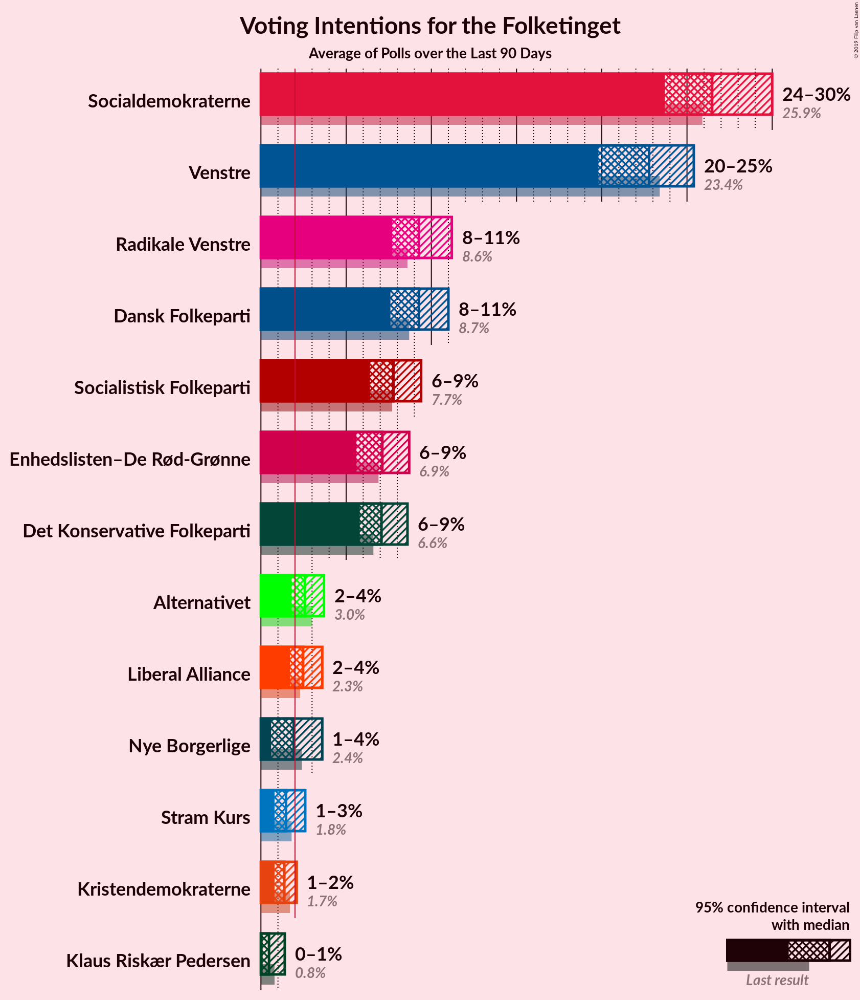
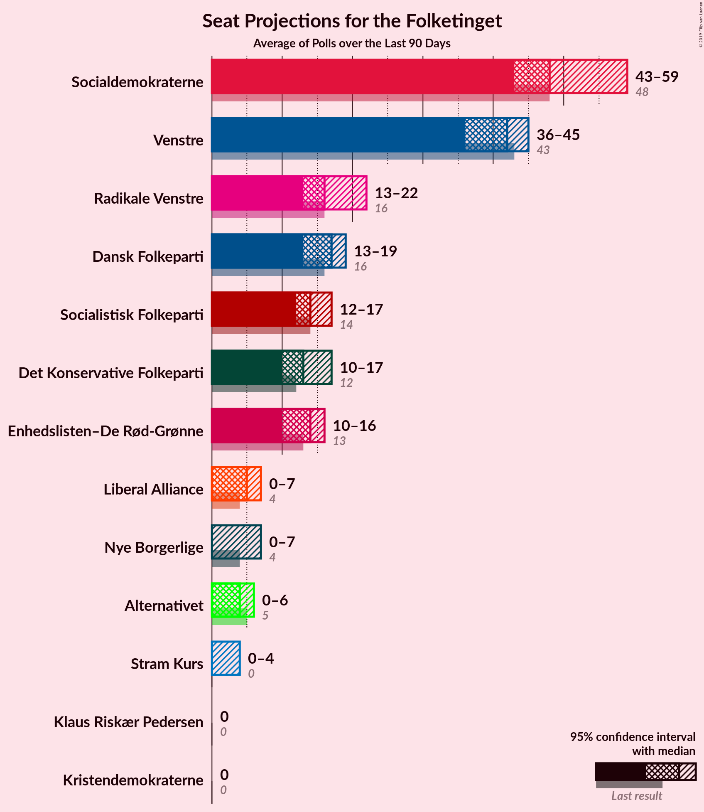
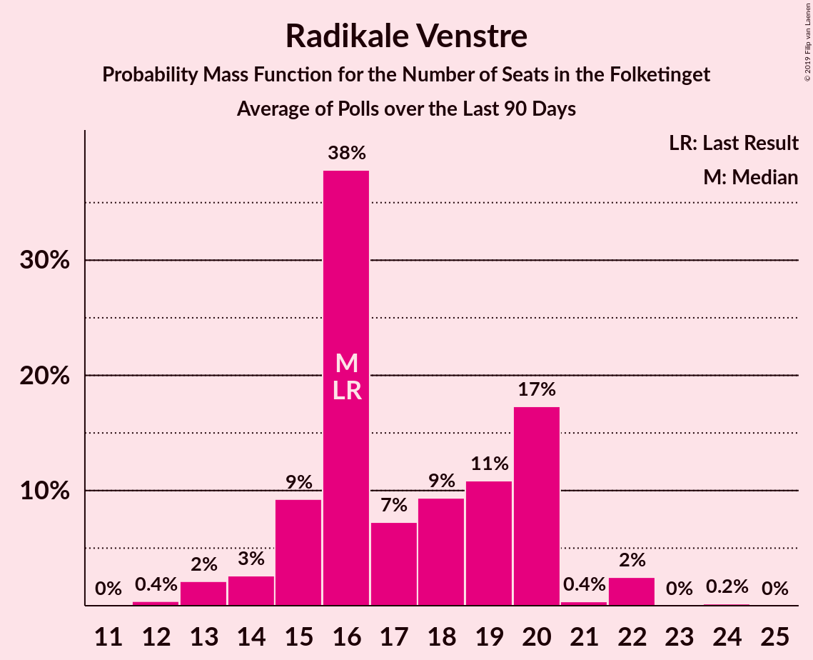
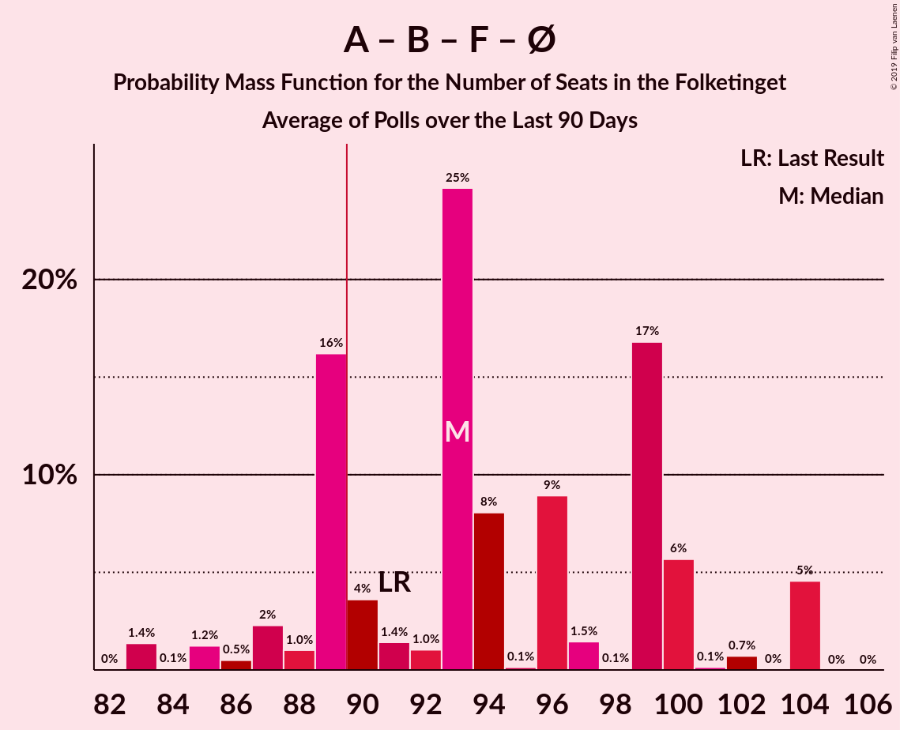
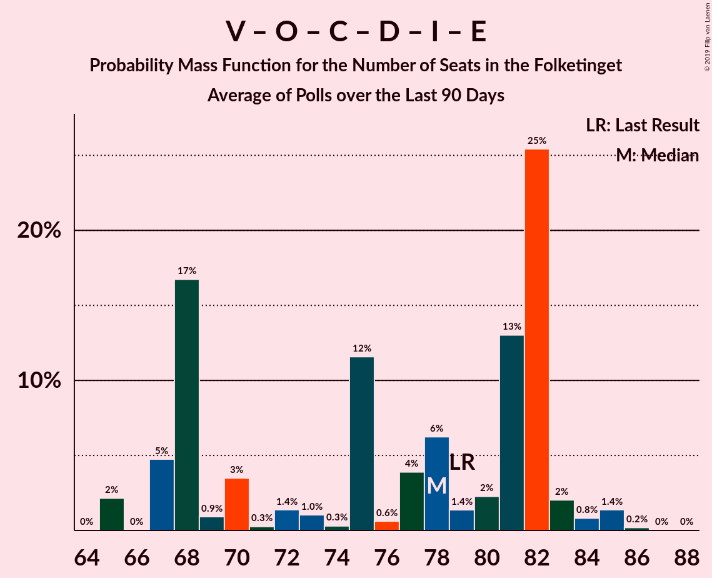
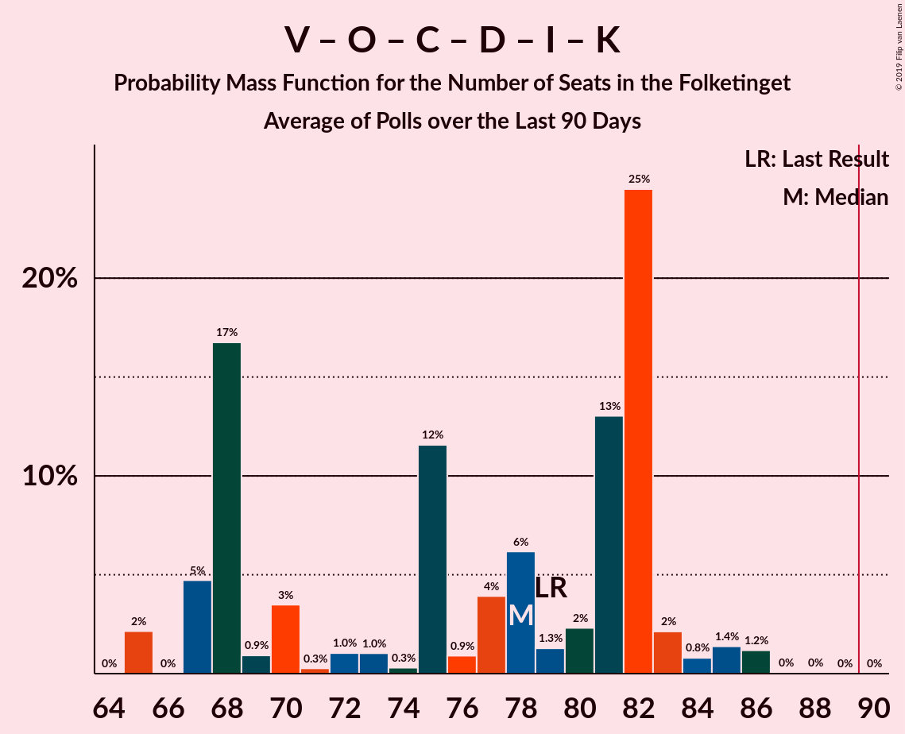

# Poll Average

<a href="#voting-intentions">Voting Intentions</a> | <a href="#seats">Seats</a> | <a href="#coalitions">Coalitions</a> | <a href="#technical-information">Technical Information</a>

## Summary

The table below lists the polls on which the average is based. They are the most recent polls (less than 90 days old) registered and analyzed so far.

| Period     | Polling firm/Commissioner(s) | A | V | O | B | F | Ø | C | Å | D | I | P | K | E |
|:----------:|:----------------------------:|:--:|:--:|:--:|:--:|:--:|:--:|:--:|:--:|:--:|:--:|:--:|:--:|:--:|
| 5 June 2019 | General Election | 25.9%   48 | 23.4%   43 | 8.7%   16 | 8.6%   16 | 7.7%   14 | 6.9%   13 | 6.6%   12 | 3.0%   5 | 2.4%   4 | 2.3%   4 | 1.8%   0 | 1.7%   0 | 0.8%   0 |
| N/A | Poll Average | 24–29%   42–54 | 21–26%   38–44 | 7–11%   12–19 | 8–11%   14–20 | 7–11%   13–19 | 6–9%   10–16 | 6–8%   10–15 | 2–3%   0–5 | 1–4%   0–6 | 2–4%   4–7 | 1–2%   0 | 1–2%   0–4 | 0–1%   0 |
| [26 August–1 September 2019](2019-09-01-Voxmeter.html) | Voxmeter   Ritzau | 24–29%   43–54 | 21–26%   38–44 | 6–10%   11–16 | 8–11%   14–20 | 8–11%   15–21 | 5–8%   10–16 | 5–9%   10–16 | 1–3%   0–6 | 1–3%   0–5 | 2–4%   4–7 | 1–2%   0 | 1–2%   0–5 | N/A   N/A |
| [8 August 2019](2019-08-08-Gallup.html) | Gallup | 23–28%   41–48 | 21–26%   41–44 | 8–11%   15–19 | 8–10%   16–19 | 6–9%   11–16 | 6–9%   12–15 | 6–8%   10–15 | 2–3%   0–5 | 2–4%   0–6 | 2–3%   4–6 | 1–2%   0 | 1–2%   0 | 0–1%   0 |
| 5 June 2019 | General Election | 25.9%   48 | 23.4%   43 | 8.7%   16 | 8.6%   16 | 7.7%   14 | 6.9%   13 | 6.6%   12 | 3.0%   5 | 2.4%   4 | 2.3%   4 | 1.8%   0 | 1.7%   0 | 0.8%   0 |

Only polls for which at least the sample size has been published are included in the table above.

**Legend:**
+ **Top half of each row:** Voting intentions (95% confidence interval)
+ **Bottom half of each row:** Seat projections for the Folketinget (95% confidence interval)
+ **A:** Socialdemokraterne
+ **V:** Venstre
+ **O:** Dansk Folkeparti
+ **B:** Radikale Venstre
+ **F:** Socialistisk Folkeparti
+ **Ø:** Enhedslisten–De Rød-Grønne
+ **C:** Det Konservative Folkeparti
+ **Å:** Alternativet
+ **D:** Nye Borgerlige
+ **I:** Liberal Alliance
+ **P:** Stram Kurs
+ **K:** Kristendemokraterne
+ **E:** Klaus Riskær Pedersen
+ **N/A (single party):** Party not included the published results
+ **N/A (entire row):** Calculation for this opinion poll not started yet

## Voting Intentions

### Confidence Intervals

| Party | Last Result | Median | 80% Confidence Interval | 90% Confidence Interval | 95% Confidence Interval | 99% Confidence Interval |
|:-----:|:-----------:|:------:|:-----------------------:|:-----------------------:|:-----------------------:|:-----------------------:|
| <a href="#socialdemokraterne">Socialdemokraterne</a> | 25.9% | 26.0% | 24.4–27.9% |24.0–28.5% | 23.6–29.0% | 22.9–29.9% |
| <a href="#venstre">Venstre</a> | 23.4% | 23.5% | 22.0–25.0% |21.6–25.5% | 21.2–25.9% | 20.4–26.7% |
| <a href="#dansk-folkeparti">Dansk Folkeparti</a> | 8.7% | 8.8% | 7.3–10.2% |6.9–10.5% | 6.7–10.8% | 6.2–11.4% |
| <a href="#radikale-venstre">Radikale Venstre</a> | 8.6% | 9.2% | 8.1–10.3% |7.9–10.7% | 7.7–11.0% | 7.2–11.6% |
| <a href="#socialistisk-folkeparti">Socialistisk Folkeparti</a> | 7.7% | 8.4% | 7.2–10.1% |6.9–10.5% | 6.7–10.8% | 6.2–11.5% |
| <a href="#enhedslisten–de-rød-grønne">Enhedslisten–De Rød-Grønne</a> | 6.9% | 7.2% | 6.1–8.2% |5.8–8.5% | 5.6–8.7% | 5.2–9.2% |
| <a href="#det-konservative-folkeparti">Det Konservative Folkeparti</a> | 6.6% | 7.0% | 6.1–7.9% |5.8–8.2% | 5.6–8.5% | 5.2–9.0% |
| <a href="#alternativet">Alternativet</a> | 3.0% | 2.3% | 1.8–2.9% |1.6–3.1% | 1.5–3.2% | 1.3–3.6% |
| <a href="#nye-borgerlige">Nye Borgerlige</a> | 2.4% | 2.4% | 1.6–3.2% |1.5–3.4% | 1.3–3.6% | 1.1–3.9% |
| <a href="#liberal-alliance">Liberal Alliance</a> | 2.3% | 2.5% | 2.0–3.2% |1.8–3.4% | 1.7–3.7% | 1.5–4.1% |
| <a href="#stram-kurs">Stram Kurs</a> | 1.8% | 1.2% | 0.9–1.7% |0.8–1.8% | 0.7–1.9% | 0.6–2.2% |
| <a href="#kristendemokraterne">Kristendemokraterne</a> | 1.7% | 1.4% | 1.1–1.9% |1.0–2.1% | 0.9–2.2% | 0.7–2.6% |
| <a href="#klaus-riskær-pedersen">Klaus Riskær Pedersen</a> | 0.8% | 0.2% | 0.1–0.4% |0.1–0.5% | 0.1–0.6% | 0.0–0.7% |

### Socialdemokraterne

*For a full overview of the results for this party, see the [Socialdemokraterne](party-socialdemokraterne.html) page.*

| Voting Intentions | Probability | Accumulated | Special Marks |
|:-----------------:|:-----------:|:-----------:|:-------------:|
| 20.5–21.5% | 0% | 100% |  |
| 21.5–22.5% | 0.2% | 100% |  |
| 22.5–23.5% | 2% | 99.8% |  |
| 23.5–24.5% | 10% | 98% |  |
| 24.5–25.5% | 23% | 87% |  |
| 25.5–26.5% | 28% | 64% | Last Result, Median |
| 26.5–27.5% | 21% | 36% |  |
| 27.5–28.5% | 10% | 15% |  |
| 28.5–29.5% | 4% | 5% |  |
| 29.5–30.5% | 0.9% | 1.0% |  |
| 30.5–31.5% | 0.1% | 0.2% |  |
| 31.5–32.5% | 0% | 0% |  |

### Venstre

*For a full overview of the results for this party, see the [Venstre](party-venstre.html) page.*

| Voting Intentions | Probability | Accumulated | Special Marks |
|:-----------------:|:-----------:|:-----------:|:-------------:|
| 18.5–19.5% | 0% | 100% |  |
| 19.5–20.5% | 0.6% | 100% |  |
| 20.5–21.5% | 4% | 99.4% |  |
| 21.5–22.5% | 16% | 95% |  |
| 22.5–23.5% | 30% | 79% | Last Result |
| 23.5–24.5% | 30% | 49% | Median |
| 24.5–25.5% | 14% | 19% |  |
| 25.5–26.5% | 4% | 5% |  |
| 26.5–27.5% | 0.6% | 0.7% |  |
| 27.5–28.5% | 0.1% | 0.1% |  |
| 28.5–29.5% | 0% | 0% |  |

### Dansk Folkeparti

*For a full overview of the results for this party, see the [Dansk Folkeparti](party-danskfolkeparti.html) page.*

| Voting Intentions | Probability | Accumulated | Special Marks |
|:-----------------:|:-----------:|:-----------:|:-------------:|
| 4.5–5.5% | 0% | 100% |  |
| 5.5–6.5% | 2% | 100% |  |
| 6.5–7.5% | 14% | 98% |  |
| 7.5–8.5% | 27% | 85% |  |
| 8.5–9.5% | 31% | 58% | Last Result, Median |
| 9.5–10.5% | 22% | 26% |  |
| 10.5–11.5% | 5% | 5% |  |
| 11.5–12.5% | 0.3% | 0.3% |  |
| 12.5–13.5% | 0% | 0% |  |

### Radikale Venstre

*For a full overview of the results for this party, see the [Radikale Venstre](party-radikalevenstre.html) page.*

| Voting Intentions | Probability | Accumulated | Special Marks |
|:-----------------:|:-----------:|:-----------:|:-------------:|
| 5.5–6.5% | 0% | 100% |  |
| 6.5–7.5% | 2% | 100% |  |
| 7.5–8.5% | 21% | 98% |  |
| 8.5–9.5% | 46% | 77% | Last Result, Median |
| 9.5–10.5% | 26% | 32% |  |
| 10.5–11.5% | 6% | 6% |  |
| 11.5–12.5% | 0.6% | 0.6% |  |
| 12.5–13.5% | 0% | 0% |  |

### Socialistisk Folkeparti

*For a full overview of the results for this party, see the [Socialistisk Folkeparti](party-socialistiskfolkeparti.html) page.*

| Voting Intentions | Probability | Accumulated | Special Marks |
|:-----------------:|:-----------:|:-----------:|:-------------:|
| 4.5–5.5% | 0% | 100% |  |
| 5.5–6.5% | 2% | 100% |  |
| 6.5–7.5% | 19% | 98% |  |
| 7.5–8.5% | 33% | 79% | Last Result, Median |
| 8.5–9.5% | 27% | 46% |  |
| 9.5–10.5% | 15% | 19% |  |
| 10.5–11.5% | 4% | 4% |  |
| 11.5–12.5% | 0.4% | 0.4% |  |
| 12.5–13.5% | 0% | 0% |  |

### Enhedslisten–De Rød-Grønne

*For a full overview of the results for this party, see the [Enhedslisten–De Rød-Grønne](party-enhedslisten–derød-grønne.html) page.*

| Voting Intentions | Probability | Accumulated | Special Marks |
|:-----------------:|:-----------:|:-----------:|:-------------:|
| 3.5–4.5% | 0% | 100% |  |
| 4.5–5.5% | 2% | 100% |  |
| 5.5–6.5% | 20% | 98% |  |
| 6.5–7.5% | 46% | 78% | Last Result, Median |
| 7.5–8.5% | 28% | 32% |  |
| 8.5–9.5% | 4% | 4% |  |
| 9.5–10.5% | 0.1% | 0.1% |  |
| 10.5–11.5% | 0% | 0% |  |

### Det Konservative Folkeparti

*For a full overview of the results for this party, see the [Det Konservative Folkeparti](party-detkonservativefolkeparti.html) page.*

| Voting Intentions | Probability | Accumulated | Special Marks |
|:-----------------:|:-----------:|:-----------:|:-------------:|
| 3.5–4.5% | 0% | 100% |  |
| 4.5–5.5% | 2% | 100% |  |
| 5.5–6.5% | 26% | 98% |  |
| 6.5–7.5% | 51% | 72% | Last Result, Median |
| 7.5–8.5% | 19% | 21% |  |
| 8.5–9.5% | 2% | 2% |  |
| 9.5–10.5% | 0.1% | 0.1% |  |
| 10.5–11.5% | 0% | 0% |  |

### Alternativet

*For a full overview of the results for this party, see the [Alternativet](party-alternativet.html) page.*

| Voting Intentions | Probability | Accumulated | Special Marks |
|:-----------------:|:-----------:|:-----------:|:-------------:|
| 0.0–0.5% | 0% | 100% |  |
| 0.5–1.5% | 4% | 100% |  |
| 1.5–2.5% | 66% | 96% | Median |
| 2.5–3.5% | 30% | 31% | Last Result |
| 3.5–4.5% | 0.6% | 0.6% |  |
| 4.5–5.5% | 0% | 0% |  |

### Nye Borgerlige

*For a full overview of the results for this party, see the [Nye Borgerlige](party-nyeborgerlige.html) page.*

| Voting Intentions | Probability | Accumulated | Special Marks |
|:-----------------:|:-----------:|:-----------:|:-------------:|
| 0.0–0.5% | 0% | 100% |  |
| 0.5–1.5% | 7% | 100% |  |
| 1.5–2.5% | 49% | 93% | Last Result, Median |
| 2.5–3.5% | 41% | 44% |  |
| 3.5–4.5% | 3% | 3% |  |
| 4.5–5.5% | 0% | 0% |  |

### Liberal Alliance

*For a full overview of the results for this party, see the [Liberal Alliance](party-liberalalliance.html) page.*

| Voting Intentions | Probability | Accumulated | Special Marks |
|:-----------------:|:-----------:|:-----------:|:-------------:|
| 0.0–0.5% | 0% | 100% |  |
| 0.5–1.5% | 0.7% | 100% |  |
| 1.5–2.5% | 53% | 99.3% | Last Result |
| 2.5–3.5% | 43% | 46% | Median |
| 3.5–4.5% | 3% | 3% |  |
| 4.5–5.5% | 0.1% | 0.1% |  |
| 5.5–6.5% | 0% | 0% |  |

### Stram Kurs

*For a full overview of the results for this party, see the [Stram Kurs](party-stramkurs.html) page.*

| Voting Intentions | Probability | Accumulated | Special Marks |
|:-----------------:|:-----------:|:-----------:|:-------------:|
| 0.0–0.5% | 0.4% | 100% |  |
| 0.5–1.5% | 85% | 99.6% | Median |
| 1.5–2.5% | 15% | 15% | Last Result |
| 2.5–3.5% | 0.1% | 0.1% |  |
| 3.5–4.5% | 0% | 0% |  |

### Kristendemokraterne

*For a full overview of the results for this party, see the [Kristendemokraterne](party-kristendemokraterne.html) page.*

| Voting Intentions | Probability | Accumulated | Special Marks |
|:-----------------:|:-----------:|:-----------:|:-------------:|
| 0.0–0.5% | 0% | 100% |  |
| 0.5–1.5% | 62% | 100% | Median |
| 1.5–2.5% | 37% | 38% | Last Result |
| 2.5–3.5% | 0.5% | 0.5% |  |
| 3.5–4.5% | 0% | 0% |  |

### Klaus Riskær Pedersen

*For a full overview of the results for this party, see the [Klaus Riskær Pedersen](party-klausriskærpedersen.html) page.*

| Voting Intentions | Probability | Accumulated | Special Marks |
|:-----------------:|:-----------:|:-----------:|:-------------:|
| 0.0–0.5% | 97% | 100% | Median |
| 0.5–1.5% | 3% | 3% | Last Result |
| 1.5–2.5% | 0% | 0% |  |

## Seats

### Confidence Intervals

| Party | Last Result | Median | 80% Confidence Interval | 90% Confidence Interval | 95% Confidence Interval | 99% Confidence Interval |
|:-----:|:-----------:|:------:|:-----------------------:|:-----------------------:|:-----------------------:|:-----------------------:|
| <a href="#socialdemokraterne">Socialdemokraterne</a> | 48 | 46 | 42–50 |42–51 | 42–54 | 41–54 |
| <a href="#venstre">Venstre</a> | 43 | 42 | 41–44 |40–44 | 38–44 | 37–47 |
| <a href="#dansk-folkeparti">Dansk Folkeparti</a> | 16 | 15 | 12–19 |12–19 | 12–19 | 11–19 |
| <a href="#radikale-venstre">Radikale Venstre</a> | 16 | 17 | 15–19 |14–19 | 14–20 | 13–20 |
| <a href="#socialistisk-folkeparti">Socialistisk Folkeparti</a> | 14 | 16 | 13–18 |13–19 | 13–19 | 11–21 |
| <a href="#enhedslisten–de-rød-grønne">Enhedslisten–De Rød-Grønne</a> | 13 | 15 | 12–15 |11–15 | 10–16 | 10–17 |
| <a href="#det-konservative-folkeparti">Det Konservative Folkeparti</a> | 12 | 13 | 11–15 |11–15 | 10–15 | 10–16 |
| <a href="#alternativet">Alternativet</a> | 5 | 4 | 0–5 |0–5 | 0–5 | 0–7 |
| <a href="#nye-borgerlige">Nye Borgerlige</a> | 4 | 4 | 0–5 |0–5 | 0–6 | 0–6 |
| <a href="#liberal-alliance">Liberal Alliance</a> | 4 | 5 | 4–6 |4–6 | 4–7 | 0–8 |
| <a href="#stram-kurs">Stram Kurs</a> | 0 | 0 | 0 |0 | 0 | 0–4 |
| <a href="#kristendemokraterne">Kristendemokraterne</a> | 0 | 0 | 0 |0 | 0–4 | 0–5 |
| <a href="#klaus-riskær-pedersen">Klaus Riskær Pedersen</a> | 0 | 0 | 0 |0 | 0 | 0 |

### Socialdemokraterne

*For a full overview of the results for this party, see the [Socialdemokraterne](party-socialdemokraterne.html) page.*

| Number of Seats | Probability | Accumulated | Special Marks |
|:---------------:|:-----------:|:-----------:|:-------------:|
| 38 | 0.1% | 100% |  |
| 39 | 0% | 99.9% |  |
| 40 | 0% | 99.9% |  |
| 41 | 2% | 99.9% |  |
| 42 | 20% | 98% |  |
| 43 | 4% | 78% |  |
| 44 | 3% | 74% |  |
| 45 | 1.4% | 71% |  |
| 46 | 34% | 69% | Median |
| 47 | 0.7% | 35% |  |
| 48 | 19% | 34% | Last Result |
| 49 | 5% | 15% |  |
| 50 | 2% | 11% |  |
| 51 | 5% | 9% |  |
| 52 | 0.7% | 4% |  |
| 53 | 0.5% | 3% |  |
| 54 | 2% | 3% |  |
| 55 | 0% | 0.4% |  |
| 56 | 0.4% | 0.4% |  |
| 57 | 0% | 0% |  |

### Venstre

*For a full overview of the results for this party, see the [Venstre](party-venstre.html) page.*

| Number of Seats | Probability | Accumulated | Special Marks |
|:---------------:|:-----------:|:-----------:|:-------------:|
| 36 | 0.3% | 100% |  |
| 37 | 0.8% | 99.7% |  |
| 38 | 2% | 98.9% |  |
| 39 | 1.0% | 97% |  |
| 40 | 5% | 96% |  |
| 41 | 21% | 91% |  |
| 42 | 24% | 71% | Median |
| 43 | 10% | 46% | Last Result |
| 44 | 35% | 36% |  |
| 45 | 0.2% | 2% |  |
| 46 | 0.7% | 1.4% |  |
| 47 | 0.4% | 0.7% |  |
| 48 | 0.1% | 0.3% |  |
| 49 | 0% | 0.1% |  |
| 50 | 0% | 0.1% |  |
| 51 | 0% | 0.1% |  |
| 52 | 0% | 0.1% |  |
| 53 | 0.1% | 0.1% |  |
| 54 | 0% | 0% |  |

### Dansk Folkeparti

*For a full overview of the results for this party, see the [Dansk Folkeparti](party-danskfolkeparti.html) page.*

| Number of Seats | Probability | Accumulated | Special Marks |
|:---------------:|:-----------:|:-----------:|:-------------:|
| 11 | 2% | 100% |  |
| 12 | 8% | 98% |  |
| 13 | 5% | 90% |  |
| 14 | 2% | 85% |  |
| 15 | 38% | 83% | Median |
| 16 | 22% | 44% | Last Result |
| 17 | 0.6% | 22% |  |
| 18 | 1.4% | 22% |  |
| 19 | 20% | 20% |  |
| 20 | 0.2% | 0.3% |  |
| 21 | 0.1% | 0.1% |  |
| 22 | 0% | 0% |  |

### Radikale Venstre

*For a full overview of the results for this party, see the [Radikale Venstre](party-radikalevenstre.html) page.*

| Number of Seats | Probability | Accumulated | Special Marks |
|:---------------:|:-----------:|:-----------:|:-------------:|
| 12 | 0.1% | 100% |  |
| 13 | 0.6% | 99.9% |  |
| 14 | 6% | 99.3% |  |
| 15 | 30% | 93% |  |
| 16 | 2% | 63% | Last Result |
| 17 | 14% | 61% | Median |
| 18 | 20% | 46% |  |
| 19 | 23% | 26% |  |
| 20 | 3% | 3% |  |
| 21 | 0.2% | 0.2% |  |
| 22 | 0% | 0.1% |  |
| 23 | 0% | 0% |  |

### Socialistisk Folkeparti

*For a full overview of the results for this party, see the [Socialistisk Folkeparti](party-socialistiskfolkeparti.html) page.*

| Number of Seats | Probability | Accumulated | Special Marks |
|:---------------:|:-----------:|:-----------:|:-------------:|
| 11 | 1.3% | 100% |  |
| 12 | 0.3% | 98.7% |  |
| 13 | 27% | 98% |  |
| 14 | 1.3% | 72% | Last Result |
| 15 | 6% | 71% |  |
| 16 | 22% | 64% | Median |
| 17 | 29% | 42% |  |
| 18 | 8% | 14% |  |
| 19 | 3% | 6% |  |
| 20 | 0.7% | 2% |  |
| 21 | 2% | 2% |  |
| 22 | 0.2% | 0.3% |  |
| 23 | 0% | 0% |  |

### Enhedslisten–De Rød-Grønne

*For a full overview of the results for this party, see the [Enhedslisten–De Rød-Grønne](party-enhedslisten–derød-grønne.html) page.*

| Number of Seats | Probability | Accumulated | Special Marks |
|:---------------:|:-----------:|:-----------:|:-------------:|
| 9 | 0.1% | 100% |  |
| 10 | 4% | 99.9% |  |
| 11 | 2% | 96% |  |
| 12 | 11% | 94% |  |
| 13 | 24% | 83% | Last Result |
| 14 | 7% | 59% |  |
| 15 | 48% | 52% | Median |
| 16 | 3% | 3% |  |
| 17 | 0.5% | 0.5% |  |
| 18 | 0.1% | 0.1% |  |
| 19 | 0% | 0% |  |

### Det Konservative Folkeparti

*For a full overview of the results for this party, see the [Det Konservative Folkeparti](party-detkonservativefolkeparti.html) page.*

| Number of Seats | Probability | Accumulated | Special Marks |
|:---------------:|:-----------:|:-----------:|:-------------:|
| 9 | 0.2% | 100% |  |
| 10 | 3% | 99.8% |  |
| 11 | 28% | 97% |  |
| 12 | 8% | 68% | Last Result |
| 13 | 27% | 60% | Median |
| 14 | 4% | 33% |  |
| 15 | 27% | 29% |  |
| 16 | 2% | 2% |  |
| 17 | 0.1% | 0.1% |  |
| 18 | 0% | 0% |  |

### Alternativet

*For a full overview of the results for this party, see the [Alternativet](party-alternativet.html) page.*

| Number of Seats | Probability | Accumulated | Special Marks |
|:---------------:|:-----------:|:-----------:|:-------------:|
| 0 | 27% | 100% |  |
| 1 | 0% | 73% |  |
| 2 | 0% | 73% |  |
| 3 | 0% | 73% |  |
| 4 | 40% | 73% | Median |
| 5 | 31% | 33% | Last Result |
| 6 | 2% | 2% |  |
| 7 | 0.4% | 0.6% |  |
| 8 | 0.2% | 0.2% |  |
| 9 | 0% | 0% |  |

### Nye Borgerlige

*For a full overview of the results for this party, see the [Nye Borgerlige](party-nyeborgerlige.html) page.*

| Number of Seats | Probability | Accumulated | Special Marks |
|:---------------:|:-----------:|:-----------:|:-------------:|
| 0 | 25% | 100% |  |
| 1 | 0% | 75% |  |
| 2 | 0% | 75% |  |
| 3 | 0% | 75% |  |
| 4 | 63% | 75% | Last Result, Median |
| 5 | 8% | 12% |  |
| 6 | 3% | 3% |  |
| 7 | 0.4% | 0.5% |  |
| 8 | 0.1% | 0.1% |  |
| 9 | 0.1% | 0.1% |  |
| 10 | 0% | 0% |  |

### Liberal Alliance

*For a full overview of the results for this party, see the [Liberal Alliance](party-liberalalliance.html) page.*

| Number of Seats | Probability | Accumulated | Special Marks |
|:---------------:|:-----------:|:-----------:|:-------------:|
| 0 | 1.0% | 100% |  |
| 1 | 0% | 99.0% |  |
| 2 | 0% | 99.0% |  |
| 3 | 0% | 99.0% |  |
| 4 | 42% | 99.0% | Last Result |
| 5 | 25% | 57% | Median |
| 6 | 29% | 32% |  |
| 7 | 3% | 4% |  |
| 8 | 0.5% | 0.5% |  |
| 9 | 0% | 0% |  |

### Stram Kurs

*For a full overview of the results for this party, see the [Stram Kurs](party-stramkurs.html) page.*

| Number of Seats | Probability | Accumulated | Special Marks |
|:---------------:|:-----------:|:-----------:|:-------------:|
| 0 | 99.4% | 100% | Last Result, Median |
| 1 | 0% | 0.6% |  |
| 2 | 0% | 0.6% |  |
| 3 | 0.1% | 0.6% |  |
| 4 | 0.5% | 0.5% |  |
| 5 | 0% | 0.1% |  |
| 6 | 0.1% | 0.1% |  |
| 7 | 0% | 0% |  |

### Kristendemokraterne

*For a full overview of the results for this party, see the [Kristendemokraterne](party-kristendemokraterne.html) page.*

| Number of Seats | Probability | Accumulated | Special Marks |
|:---------------:|:-----------:|:-----------:|:-------------:|
| 0 | 96% | 100% | Last Result, Median |
| 1 | 0% | 4% |  |
| 2 | 0% | 4% |  |
| 3 | 0% | 4% |  |
| 4 | 2% | 4% |  |
| 5 | 1.4% | 2% |  |
| 6 | 0.2% | 0.2% |  |
| 7 | 0% | 0% |  |

### Klaus Riskær Pedersen

*For a full overview of the results for this party, see the [Klaus Riskær Pedersen](party-klausriskærpedersen.html) page.*

| Number of Seats | Probability | Accumulated | Special Marks |
|:---------------:|:-----------:|:-----------:|:-------------:|
| 0 | 100% | 100% | Last Result, Median |

## Coalitions

### Confidence Intervals

| Coalition | Last Result | Median | Majority? | 80% Confidence Interval | 90% Confidence Interval | 95% Confidence Interval | 99% Confidence Interval |
|:---------:|:-----------:|:------:|:---------:|:-----------------------:|:-----------------------:|:-----------------------:|:-----------------------:|
| Socialdemokraterne – Radikale Venstre – Socialistisk Folkeparti – Enhedslisten–De Rød-Grønne – Alternativet | 96 | 97 | 99.4% | 92–99 | 92–100 | 92–105 | 89–105 |
| Socialdemokraterne – Radikale Venstre – Socialistisk Folkeparti – Enhedslisten–De Rød-Grønne | 91 | 93 | 68% | 87–97 | 87–97 | 87–101 | 85–104 |
| Socialdemokraterne – Radikale Venstre – Socialistisk Folkeparti | 78 | 78 | 0.3% | 74–83 | 74–84 | 74–88 | 72–89 |
| Socialdemokraterne – Socialistisk Folkeparti – Enhedslisten–De Rød-Grønne – Alternativet | 80 | 79 | 0.1% | 73–83 | 73–84 | 73–88 | 72–88 |
| Socialdemokraterne – Socialistisk Folkeparti – Enhedslisten–De Rød-Grønne | 75 | 78 | 0% | 68–81 | 68–83 | 68–84 | 68–86 |
| Venstre – Dansk Folkeparti – Det Konservative Folkeparti – Nye Borgerlige – Liberal Alliance – Stram Kurs – Kristendemokraterne – Klaus Riskær Pedersen | 79 | 78 | 0% | 76–83 | 75–83 | 70–83 | 70–86 |
| Venstre – Dansk Folkeparti – Det Konservative Folkeparti – Nye Borgerlige – Liberal Alliance – Kristendemokraterne – Klaus Riskær Pedersen | 79 | 78 | 0% | 76–83 | 74–83 | 70–83 | 70–85 |
| Venstre – Dansk Folkeparti – Det Konservative Folkeparti – Nye Borgerlige – Liberal Alliance – Klaus Riskær Pedersen | 79 | 78 | 0% | 76–83 | 74–83 | 70–83 | 70–85 |
| Venstre – Dansk Folkeparti – Det Konservative Folkeparti – Nye Borgerlige – Liberal Alliance – Kristendemokraterne | 79 | 78 | 0% | 76–83 | 74–83 | 70–83 | 70–85 |
| Venstre – Dansk Folkeparti – Det Konservative Folkeparti – Nye Borgerlige – Liberal Alliance | 79 | 78 | 0% | 76–83 | 74–83 | 70–83 | 70–85 |
| Venstre – Dansk Folkeparti – Det Konservative Folkeparti – Liberal Alliance – Kristendemokraterne | 75 | 77 | 0% | 74–79 | 71–79 | 70–79 | 68–81 |
| Venstre – Dansk Folkeparti – Det Konservative Folkeparti – Liberal Alliance | 75 | 75 | 0% | 73–79 | 71–79 | 70–79 | 67–81 |
| Socialdemokraterne – Radikale Venstre | 64 | 61 | 0% | 61–66 | 60–67 | 59–71 | 57–71 |
| Venstre – Det Konservative Folkeparti – Liberal Alliance | 59 | 59 | 0% | 58–63 | 57–63 | 56–63 | 54–64 |
| Venstre – Det Konservative Folkeparti | 55 | 55 | 0% | 54–57 | 52–59 | 51–59 | 49–60 |
| Venstre | 43 | 42 | 0% | 41–44 | 40–44 | 38–44 | 37–47 |

### Socialdemokraterne – Radikale Venstre – Socialistisk Folkeparti – Enhedslisten–De Rød-Grønne – Alternativet

| Number of Seats | Probability | Accumulated | Special Marks |
|:---------------:|:-----------:|:-----------:|:-------------:|
| 87 | 0.3% | 100% |  |
| 88 | 0.1% | 99.7% |  |
| 89 | 0.1% | 99.6% |  |
| 90 | 0.1% | 99.4% | Majority |
| 91 | 0.2% | 99.3% |  |
| 92 | 21% | 99.1% |  |
| 93 | 10% | 78% |  |
| 94 | 2% | 68% |  |
| 95 | 3% | 67% |  |
| 96 | 2% | 63% | Last Result |
| 97 | 50% | 61% |  |
| 98 | 0.7% | 11% | Median |
| 99 | 3% | 11% |  |
| 100 | 2% | 7% |  |
| 101 | 2% | 5% |  |
| 102 | 0.2% | 3% |  |
| 103 | 0% | 3% |  |
| 104 | 0.4% | 3% |  |
| 105 | 3% | 3% |  |
| 106 | 0.1% | 0.1% |  |
| 107 | 0% | 0% |  |

### Socialdemokraterne – Radikale Venstre – Socialistisk Folkeparti – Enhedslisten–De Rød-Grønne

| Number of Seats | Probability | Accumulated | Special Marks |
|:---------------:|:-----------:|:-----------:|:-------------:|
| 82 | 0.1% | 100% |  |
| 83 | 0.2% | 99.9% |  |
| 84 | 0.1% | 99.7% |  |
| 85 | 0.1% | 99.6% |  |
| 86 | 0.1% | 99.5% |  |
| 87 | 21% | 99.4% |  |
| 88 | 9% | 78% |  |
| 89 | 2% | 70% |  |
| 90 | 0.2% | 68% | Majority |
| 91 | 4% | 68% | Last Result |
| 92 | 2% | 64% |  |
| 93 | 28% | 62% |  |
| 94 | 0.2% | 34% | Median |
| 95 | 3% | 34% |  |
| 96 | 2% | 30% |  |
| 97 | 24% | 28% |  |
| 98 | 0.1% | 5% |  |
| 99 | 0.3% | 5% |  |
| 100 | 0.3% | 4% |  |
| 101 | 3% | 4% |  |
| 102 | 0% | 0.7% |  |
| 103 | 0% | 0.6% |  |
| 104 | 0.2% | 0.6% |  |
| 105 | 0.4% | 0.4% |  |
| 106 | 0% | 0% |  |

### Socialdemokraterne – Radikale Venstre – Socialistisk Folkeparti

| Number of Seats | Probability | Accumulated | Special Marks |
|:---------------:|:-----------:|:-----------:|:-------------:|
| 68 | 0.1% | 100% |  |
| 69 | 0.1% | 99.9% |  |
| 70 | 0.2% | 99.8% |  |
| 71 | 0.1% | 99.6% |  |
| 72 | 0% | 99.5% |  |
| 73 | 1.2% | 99.5% |  |
| 74 | 20% | 98% |  |
| 75 | 2% | 78% |  |
| 76 | 8% | 76% |  |
| 77 | 0.9% | 68% |  |
| 78 | 28% | 67% | Last Result |
| 79 | 0.5% | 39% | Median |
| 80 | 3% | 38% |  |
| 81 | 3% | 36% |  |
| 82 | 21% | 32% |  |
| 83 | 5% | 12% |  |
| 84 | 1.3% | 6% |  |
| 85 | 0.6% | 5% |  |
| 86 | 1.5% | 4% |  |
| 87 | 0.1% | 3% |  |
| 88 | 0.4% | 3% |  |
| 89 | 2% | 2% |  |
| 90 | 0.2% | 0.3% | Majority |
| 91 | 0% | 0% |  |

### Socialdemokraterne – Socialistisk Folkeparti – Enhedslisten–De Rød-Grønne – Alternativet

| Number of Seats | Probability | Accumulated | Special Marks |
|:---------------:|:-----------:|:-----------:|:-------------:|
| 71 | 0.3% | 100% |  |
| 72 | 0.4% | 99.7% |  |
| 73 | 19% | 99.3% |  |
| 74 | 1.2% | 80% |  |
| 75 | 3% | 79% |  |
| 76 | 7% | 76% |  |
| 77 | 0.4% | 69% |  |
| 78 | 5% | 68% |  |
| 79 | 21% | 63% |  |
| 80 | 2% | 42% | Last Result |
| 81 | 0.8% | 40% | Median |
| 82 | 27% | 40% |  |
| 83 | 6% | 12% |  |
| 84 | 2% | 7% |  |
| 85 | 1.5% | 5% |  |
| 86 | 0.4% | 3% |  |
| 87 | 0.2% | 3% |  |
| 88 | 2% | 3% |  |
| 89 | 0.4% | 0.4% |  |
| 90 | 0.1% | 0.1% | Majority |
| 91 | 0% | 0% |  |

### Socialdemokraterne – Socialistisk Folkeparti – Enhedslisten–De Rød-Grønne

| Number of Seats | Probability | Accumulated | Special Marks |
|:---------------:|:-----------:|:-----------:|:-------------:|
| 66 | 0.1% | 100% |  |
| 67 | 0.2% | 99.9% |  |
| 68 | 19% | 99.7% |  |
| 69 | 1.1% | 80% |  |
| 70 | 2% | 79% |  |
| 71 | 8% | 77% |  |
| 72 | 1.4% | 69% |  |
| 73 | 0.7% | 68% |  |
| 74 | 3% | 67% |  |
| 75 | 2% | 64% | Last Result |
| 76 | 2% | 62% |  |
| 77 | 0.8% | 59% | Median |
| 78 | 28% | 59% |  |
| 79 | 20% | 30% |  |
| 80 | 0.1% | 11% |  |
| 81 | 2% | 11% |  |
| 82 | 0.2% | 9% |  |
| 83 | 5% | 9% |  |
| 84 | 3% | 4% |  |
| 85 | 0% | 0.7% |  |
| 86 | 0.2% | 0.6% |  |
| 87 | 0% | 0.4% |  |
| 88 | 0% | 0.4% |  |
| 89 | 0.4% | 0.4% |  |
| 90 | 0% | 0% | Majority |

### Venstre – Dansk Folkeparti – Det Konservative Folkeparti – Nye Borgerlige – Liberal Alliance – Stram Kurs – Kristendemokraterne – Klaus Riskær Pedersen

| Number of Seats | Probability | Accumulated | Special Marks |
|:---------------:|:-----------:|:-----------:|:-------------:|
| 69 | 0.1% | 100% |  |
| 70 | 3% | 99.9% |  |
| 71 | 0.4% | 97% |  |
| 72 | 0% | 97% |  |
| 73 | 0.2% | 97% |  |
| 74 | 2% | 97% |  |
| 75 | 2% | 95% |  |
| 76 | 3% | 93% |  |
| 77 | 0.7% | 89% |  |
| 78 | 50% | 89% |  |
| 79 | 2% | 39% | Last Result, Median |
| 80 | 3% | 37% |  |
| 81 | 2% | 33% |  |
| 82 | 10% | 32% |  |
| 83 | 21% | 22% |  |
| 84 | 0.2% | 0.9% |  |
| 85 | 0.1% | 0.7% |  |
| 86 | 0.1% | 0.6% |  |
| 87 | 0.1% | 0.4% |  |
| 88 | 0.3% | 0.3% |  |
| 89 | 0% | 0% |  |

### Venstre – Dansk Folkeparti – Det Konservative Folkeparti – Nye Borgerlige – Liberal Alliance – Kristendemokraterne – Klaus Riskær Pedersen

| Number of Seats | Probability | Accumulated | Special Marks |
|:---------------:|:-----------:|:-----------:|:-------------:|
| 69 | 0.1% | 100% |  |
| 70 | 3% | 99.9% |  |
| 71 | 0.4% | 97% |  |
| 72 | 0% | 97% |  |
| 73 | 0.3% | 97% |  |
| 74 | 2% | 97% |  |
| 75 | 2% | 95% |  |
| 76 | 3% | 93% |  |
| 77 | 0.6% | 89% |  |
| 78 | 50% | 89% |  |
| 79 | 2% | 38% | Last Result, Median |
| 80 | 3% | 37% |  |
| 81 | 2% | 33% |  |
| 82 | 10% | 31% |  |
| 83 | 21% | 21% |  |
| 84 | 0.1% | 0.7% |  |
| 85 | 0.1% | 0.6% |  |
| 86 | 0.1% | 0.5% |  |
| 87 | 0.1% | 0.4% |  |
| 88 | 0.3% | 0.3% |  |
| 89 | 0% | 0% |  |

### Venstre – Dansk Folkeparti – Det Konservative Folkeparti – Nye Borgerlige – Liberal Alliance – Klaus Riskær Pedersen

| Number of Seats | Probability | Accumulated | Special Marks |
|:---------------:|:-----------:|:-----------:|:-------------:|
| 67 | 0.2% | 100% |  |
| 68 | 0% | 99.8% |  |
| 69 | 0.1% | 99.8% |  |
| 70 | 3% | 99.7% |  |
| 71 | 1.0% | 97% |  |
| 72 | 0% | 96% |  |
| 73 | 0.3% | 96% |  |
| 74 | 2% | 95% |  |
| 75 | 3% | 94% |  |
| 76 | 3% | 91% |  |
| 77 | 1.3% | 88% |  |
| 78 | 50% | 86% |  |
| 79 | 0.6% | 36% | Last Result, Median |
| 80 | 3% | 35% |  |
| 81 | 2% | 32% |  |
| 82 | 9% | 30% |  |
| 83 | 21% | 21% |  |
| 84 | 0.1% | 0.6% |  |
| 85 | 0.1% | 0.5% |  |
| 86 | 0% | 0.4% |  |
| 87 | 0.1% | 0.4% |  |
| 88 | 0.3% | 0.3% |  |
| 89 | 0% | 0% |  |

### Venstre – Dansk Folkeparti – Det Konservative Folkeparti – Nye Borgerlige – Liberal Alliance – Kristendemokraterne

| Number of Seats | Probability | Accumulated | Special Marks |
|:---------------:|:-----------:|:-----------:|:-------------:|
| 69 | 0.1% | 100% |  |
| 70 | 3% | 99.9% |  |
| 71 | 0.4% | 97% |  |
| 72 | 0% | 97% |  |
| 73 | 0.3% | 97% |  |
| 74 | 2% | 97% |  |
| 75 | 2% | 95% |  |
| 76 | 3% | 93% |  |
| 77 | 0.6% | 89% |  |
| 78 | 50% | 89% |  |
| 79 | 2% | 38% | Last Result, Median |
| 80 | 3% | 37% |  |
| 81 | 2% | 33% |  |
| 82 | 10% | 31% |  |
| 83 | 21% | 21% |  |
| 84 | 0.1% | 0.7% |  |
| 85 | 0.1% | 0.6% |  |
| 86 | 0.1% | 0.5% |  |
| 87 | 0.1% | 0.4% |  |
| 88 | 0.3% | 0.3% |  |
| 89 | 0% | 0% |  |

### Venstre – Dansk Folkeparti – Det Konservative Folkeparti – Nye Borgerlige – Liberal Alliance

| Number of Seats | Probability | Accumulated | Special Marks |
|:---------------:|:-----------:|:-----------:|:-------------:|
| 67 | 0.2% | 100% |  |
| 68 | 0% | 99.8% |  |
| 69 | 0.1% | 99.8% |  |
| 70 | 3% | 99.7% |  |
| 71 | 1.0% | 97% |  |
| 72 | 0% | 96% |  |
| 73 | 0.3% | 96% |  |
| 74 | 2% | 95% |  |
| 75 | 3% | 94% |  |
| 76 | 3% | 91% |  |
| 77 | 1.3% | 88% |  |
| 78 | 50% | 86% |  |
| 79 | 0.6% | 36% | Last Result, Median |
| 80 | 3% | 35% |  |
| 81 | 2% | 32% |  |
| 82 | 9% | 30% |  |
| 83 | 21% | 21% |  |
| 84 | 0.1% | 0.6% |  |
| 85 | 0.1% | 0.5% |  |
| 86 | 0% | 0.4% |  |
| 87 | 0.1% | 0.4% |  |
| 88 | 0.3% | 0.3% |  |
| 89 | 0% | 0% |  |

### Venstre – Dansk Folkeparti – Det Konservative Folkeparti – Liberal Alliance – Kristendemokraterne

| Number of Seats | Probability | Accumulated | Special Marks |
|:---------------:|:-----------:|:-----------:|:-------------:|
| 65 | 0.1% | 100% |  |
| 66 | 0.1% | 99.9% |  |
| 67 | 0.2% | 99.8% |  |
| 68 | 0.1% | 99.6% |  |
| 69 | 0.4% | 99.5% |  |
| 70 | 3% | 99.1% |  |
| 71 | 4% | 96% |  |
| 72 | 1.0% | 92% |  |
| 73 | 0.9% | 91% |  |
| 74 | 33% | 90% |  |
| 75 | 6% | 57% | Last Result, Median |
| 76 | 0.8% | 52% |  |
| 77 | 2% | 51% |  |
| 78 | 28% | 49% |  |
| 79 | 20% | 21% |  |
| 80 | 0.1% | 0.8% |  |
| 81 | 0.4% | 0.7% |  |
| 82 | 0% | 0.3% |  |
| 83 | 0% | 0.2% |  |
| 84 | 0.1% | 0.2% |  |
| 85 | 0% | 0.1% |  |
| 86 | 0% | 0% |  |

### Venstre – Dansk Folkeparti – Det Konservative Folkeparti – Liberal Alliance

| Number of Seats | Probability | Accumulated | Special Marks |
|:---------------:|:-----------:|:-----------:|:-------------:|
| 65 | 0.1% | 100% |  |
| 66 | 0.1% | 99.9% |  |
| 67 | 1.1% | 99.8% |  |
| 68 | 0.2% | 98.7% |  |
| 69 | 0.4% | 98.5% |  |
| 70 | 3% | 98% |  |
| 71 | 4% | 95% |  |
| 72 | 0.4% | 91% |  |
| 73 | 1.4% | 91% |  |
| 74 | 33% | 89% |  |
| 75 | 7% | 56% | Last Result, Median |
| 76 | 0.7% | 50% |  |
| 77 | 2% | 49% |  |
| 78 | 27% | 47% |  |
| 79 | 19% | 20% |  |
| 80 | 0.1% | 0.7% |  |
| 81 | 0.4% | 0.6% |  |
| 82 | 0% | 0.2% |  |
| 83 | 0% | 0.2% |  |
| 84 | 0.1% | 0.2% |  |
| 85 | 0% | 0% |  |

### Socialdemokraterne – Radikale Venstre

| Number of Seats | Probability | Accumulated | Special Marks |
|:---------------:|:-----------:|:-----------:|:-------------:|
| 54 | 0.1% | 100% |  |
| 55 | 0% | 99.9% |  |
| 56 | 0% | 99.9% |  |
| 57 | 1.1% | 99.9% |  |
| 58 | 0.4% | 98.8% |  |
| 59 | 2% | 98% |  |
| 60 | 3% | 97% |  |
| 61 | 47% | 94% |  |
| 62 | 2% | 47% |  |
| 63 | 10% | 45% | Median |
| 64 | 1.1% | 35% | Last Result |
| 65 | 5% | 34% |  |
| 66 | 22% | 28% |  |
| 67 | 2% | 6% |  |
| 68 | 0.9% | 4% |  |
| 69 | 0.2% | 3% |  |
| 70 | 0.6% | 3% |  |
| 71 | 2% | 3% |  |
| 72 | 0.4% | 0.5% |  |
| 73 | 0% | 0.1% |  |
| 74 | 0.1% | 0.1% |  |
| 75 | 0% | 0% |  |

### Venstre – Det Konservative Folkeparti – Liberal Alliance

| Number of Seats | Probability | Accumulated | Special Marks |
|:---------------:|:-----------:|:-----------:|:-------------:|
| 51 | 0% | 100% |  |
| 52 | 0.1% | 99.9% |  |
| 53 | 0.2% | 99.8% |  |
| 54 | 0.9% | 99.6% |  |
| 55 | 1.0% | 98.7% |  |
| 56 | 2% | 98% |  |
| 57 | 2% | 96% |  |
| 58 | 4% | 94% |  |
| 59 | 48% | 90% | Last Result |
| 60 | 3% | 41% | Median |
| 61 | 2% | 38% |  |
| 62 | 8% | 36% |  |
| 63 | 27% | 28% |  |
| 64 | 0.6% | 1.1% |  |
| 65 | 0.3% | 0.5% |  |
| 66 | 0% | 0.1% |  |
| 67 | 0% | 0.1% |  |
| 68 | 0% | 0.1% |  |
| 69 | 0.1% | 0.1% |  |
| 70 | 0% | 0% |  |

### Venstre – Det Konservative Folkeparti

| Number of Seats | Probability | Accumulated | Special Marks |
|:---------------:|:-----------:|:-----------:|:-------------:|
| 45 | 0.2% | 100% |  |
| 46 | 0% | 99.8% |  |
| 47 | 0% | 99.8% |  |
| 48 | 0.1% | 99.8% |  |
| 49 | 1.0% | 99.7% |  |
| 50 | 0.4% | 98.7% |  |
| 51 | 0.9% | 98% |  |
| 52 | 5% | 97% |  |
| 53 | 2% | 93% |  |
| 54 | 20% | 91% |  |
| 55 | 33% | 70% | Last Result, Median |
| 56 | 8% | 38% |  |
| 57 | 21% | 30% |  |
| 58 | 0.8% | 8% |  |
| 59 | 7% | 8% |  |
| 60 | 0.5% | 0.7% |  |
| 61 | 0% | 0.2% |  |
| 62 | 0% | 0.1% |  |
| 63 | 0% | 0.1% |  |
| 64 | 0.1% | 0.1% |  |
| 65 | 0% | 0% |  |

### Venstre

| Number of Seats | Probability | Accumulated | Special Marks |
|:---------------:|:-----------:|:-----------:|:-------------:|
| 36 | 0.3% | 100% |  |
| 37 | 0.8% | 99.7% |  |
| 38 | 2% | 98.9% |  |
| 39 | 1.0% | 97% |  |
| 40 | 5% | 96% |  |
| 41 | 21% | 91% |  |
| 42 | 24% | 71% | Median |
| 43 | 10% | 46% | Last Result |
| 44 | 35% | 36% |  |
| 45 | 0.2% | 2% |  |
| 46 | 0.7% | 1.4% |  |
| 47 | 0.4% | 0.7% |  |
| 48 | 0.1% | 0.3% |  |
| 49 | 0% | 0.1% |  |
| 50 | 0% | 0.1% |  |
| 51 | 0% | 0.1% |  |
| 52 | 0% | 0.1% |  |
| 53 | 0.1% | 0.1% |  |
| 54 | 0% | 0% |  |

## Technical Information

+ **Number of polls included in this average:** 2
+ **Lowest number of simulations done in a poll included in this average:** 131,072
+ **Total number of simulations done in the polls included in this average:** 262,144
+ **Error estimate:** 2.65%
