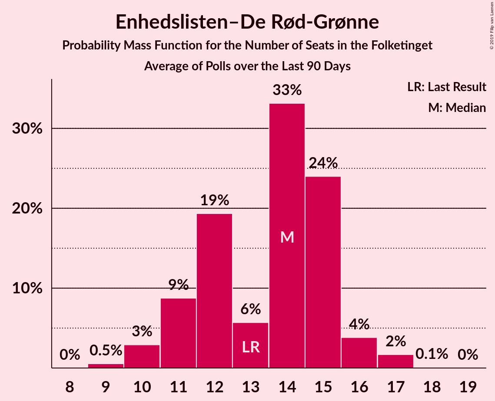
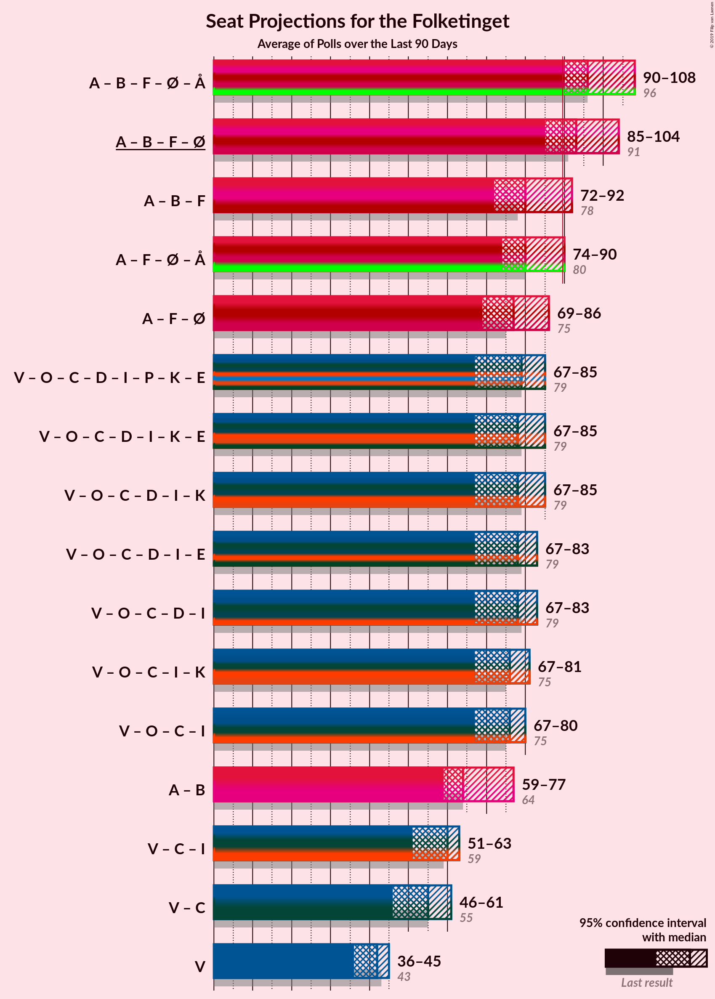
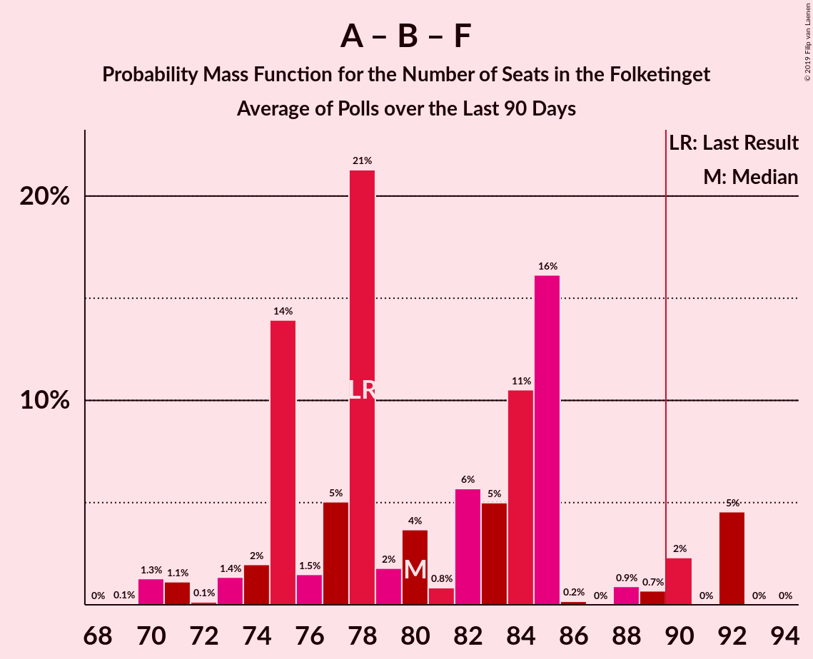

# Poll Average

<a href="#voting-intentions">Voting Intentions</a> | <a href="#seats">Seats</a> | <a href="#coalitions">Coalitions</a> | <a href="#technical-information">Technical Information</a>

## Summary

The table below lists the polls on which the average is based. They are the most recent polls (less than 90 days old) registered and analyzed so far.

| Period     | Polling firm/Commissioner(s) | A | O | V | Ø | I | Å | B | F | C | K | D | E | P |
|:----------:|:----------------------------:|:--:|:--:|:--:|:--:|:--:|:--:|:--:|:--:|:--:|:--:|:--:|:--:|:--:|
| 18 June 2015 | General Election | 26.3%   47 | 21.1%   37 | 19.5%   34 | 7.8%   14 | 7.5%   13 | 4.8%   9 | 4.6%   8 | 4.2%   7 | 3.4%   6 | 0.8%   0 | 0.0%   0 | 0.0%   0 | 0.0%   0 |
| N/A | Poll Average | 23–30%   41–54 | 10–15%   17–26 | 16–22%   27–39 | 7–12%   12–20 | 3–6%   4–10 | 2–6%   4–9 | 5–10%   9–18 | 6–10%   10–17 | 3–6%   6–11 | 0–2%   0–5 | 1–6%   0–12 | 0–2%   0 | 1–5%   0–8 |
| [8–10 May 2019](2019-05-10-Megafon.html) | Megafon   Politiken and TV 2 | 22–27%   39–47 | 9–13%   15–23 | 17–22%   31–39 | 8–11%   13–21 | 3–5%   5–9 | 2–4%   0–7 | 7–10%   12–18 | 6–10%   11–17 | 4–6%   6–11 | 1–2%   0–4 | 2–4%   4–8 | 0–1%   0 | 2–4%   0–7 |
| [7–9 May 2019](2019-05-09-Voxmeter.html) | Voxmeter   Ritzau | 25–31%   44–56 | 9–13%   17–25 | 17–22%   30–41 | 8–12%   13–21 | 3–5%   5–10 | 2–4%   0–7 | 6–10%   11–17 | 6–9%   10–17 | 3–5%   5–9 | 1–3%   0–5 | 1–3%   0–5 | 0–1%   0 | 1–3%   0–4 |
| [5–8 May 2019](2019-05-08-YouGov.html) | YouGov | 24–29%   41–51 | 9–13%   16–21 | 15–20%   27–37 | 6–10%   11–19 | 2–4%   4–7 | 4–6%   6–11 | 5–8%   10–15 | 7–10%   13–19 | 3–6%   7–10 | 0–1%   0 | 4–7%   7–12 | 0–1%   0 | 3–5%   5–8 |
| [2–8 May 2019](2019-05-08-Norstat.html) | Norstat   Altinget and Jyllands-Posten | 26–31%   47–56 | 11–15%   21–28 | 15–20%   28–34 | 8–11%   14–20 | 3–5%   4–8 | 3–5%   6–9 | 5–8%   10–14 | 6–8%   10–14 | 3–6%   6–9 | 1–2%   0–4 | 1–3%   0–6 | 0–1%   0 | 3–5%   5–8 |
| [8 May 2019](2019-05-08-KantarGallup.html) | Kantar Gallup   Berlingske | 22–26%   40–46 | 11–14%   19–25 | 16–20%   30–35 | 8–11%   15–19 | 3–5%   6–10 | 2–4%   4–7 | 7–10%   13–18 | 6–9%   12–15 | 4–6%   6–11 | 1–2%   0 | 2–4%   0–6 | 1–2%   0 | 3–4%   5–8 |
| [7 May 2019](2019-05-07-GreensAnalyseinstitut.html) | Greens Analyseinstitut   Børsen | 25–30%   46–52 | 10–14%   19–23 | 17–22%   33–41 | 9–12%   16–21 | 4–6%   7–10 | 2–4%   5–7 | 6–9%   11–15 | 5–8%   10–14 | 3–5%   5–8 | 1–2%   0 | 1–2%   0 | 0–1%   0 | 2–4%   0–6 |
| [7 May 2019](2019-05-07-Epinion.html) | Epinion   DR | 26–30%   46–51 | 12–16%   21–28 | 16–19%   28–34 | 8–10%   12–18 | 3–5%   4–8 | 3–5%   6–9 | 4–7%   8–14 | 6–8%   11–15 | 4–6%   8–12 | 0–1%   0 | 2–4%   4–7 | 0–1%   0 | 2–4%   0–5 |
| 18 June 2015 | General Election | 26.3%   47 | 21.1%   37 | 19.5%   34 | 7.8%   14 | 7.5%   13 | 4.8%   9 | 4.6%   8 | 4.2%   7 | 3.4%   6 | 0.8%   0 | 0.0%   0 | 0.0%   0 | 0.0%   0 |

Only polls for which at least the sample size has been published are included in the table above.

**Legend:**
+ **Top half of each row:** Voting intentions (95% confidence interval)
+ **Bottom half of each row:** Seat projections for the Folketinget (95% confidence interval)
+ **A:** Socialdemokraterne
+ **O:** Dansk Folkeparti
+ **V:** Venstre
+ **Ø:** Enhedslisten–De Rød-Grønne
+ **I:** Liberal Alliance
+ **Å:** Alternativet
+ **B:** Radikale Venstre
+ **F:** Socialistisk Folkeparti
+ **C:** Det Konservative Folkeparti
+ **K:** Kristendemokraterne
+ **D:** Nye Borgerlige
+ **E:** Klaus Riskær Pedersen
+ **P:** Stram Kurs
+ **N/A (single party):** Party not included the published results
+ **N/A (entire row):** Calculation for this opinion poll not started yet

## Voting Intentions

### Confidence Intervals

| Party | Last Result | Median | 80% Confidence Interval | 90% Confidence Interval | 95% Confidence Interval | 99% Confidence Interval |
|:-----:|:-----------:|:------:|:-----------------------:|:-----------------------:|:-----------------------:|:-----------------------:|
| <a href="#socialdemokraterne">Socialdemokraterne</a> | 26.3% | 27.0% | 24.0–29.2% |23.4–29.8% | 22.9–30.2% | 22.1–31.2% |
| <a href="#dansk-folkeparti">Dansk Folkeparti</a> | 21.1% | 12.1% | 10.2–14.0% |9.8–14.4% | 9.5–14.8% | 8.8–15.6% |
| <a href="#venstre">Venstre</a> | 19.5% | 18.3% | 16.5–20.4% |16.1–21.0% | 15.7–21.5% | 15.0–22.5% |
| <a href="#enhedslisten–de-rød-grønne">Enhedslisten–De Rød-Grønne</a> | 7.8% | 9.3% | 7.9–10.7% |7.5–11.2% | 7.2–11.6% | 6.5–12.4% |
| <a href="#liberal-alliance">Liberal Alliance</a> | 7.5% | 3.9% | 3.1–4.9% |2.8–5.3% | 2.6–5.6% | 2.3–6.2% |
| <a href="#alternativet">Alternativet</a> | 4.8% | 3.5% | 2.6–4.8% |2.4–5.2% | 2.2–5.5% | 1.9–6.1% |
| <a href="#radikale-venstre">Radikale Venstre</a> | 4.6% | 7.2% | 5.5–8.9% |5.2–9.3% | 5.0–9.6% | 4.5–10.3% |
| <a href="#socialistisk-folkeparti">Socialistisk Folkeparti</a> | 4.2% | 7.3% | 6.2–8.7% |5.9–9.2% | 5.7–9.6% | 5.3–10.3% |
| <a href="#det-konservative-folkeparti">Det Konservative Folkeparti</a> | 3.4% | 4.5% | 3.5–5.6% |3.2–5.9% | 3.0–6.1% | 2.6–6.6% |
| <a href="#kristendemokraterne">Kristendemokraterne</a> | 0.8% | 1.2% | 0.4–1.9% |0.3–2.1% | 0.3–2.3% | 0.2–2.8% |
| <a href="#nye-borgerlige">Nye Borgerlige</a> | 0.0% | 2.6% | 1.1–4.7% |0.9–5.3% | 0.7–5.7% | 0.5–6.4% |
| <a href="#klaus-riskær-pedersen">Klaus Riskær Pedersen</a> | 0.0% | 0.5% | 0.2–1.2% |0.1–1.3% | 0.1–1.5% | 0.1–1.7% |
| <a href="#stram-kurs">Stram Kurs</a> | 0.0% | 2.9% | 1.8–4.0% |1.5–4.4% | 1.3–4.6% | 1.0–5.2% |

### Socialdemokraterne

*For a full overview of the results for this party, see the [Socialdemokraterne](party-socialdemokraterne.html) page.*

| Voting Intentions | Probability | Accumulated | Special Marks |
|:-----------------:|:-----------:|:-----------:|:-------------:|
| 19.5–20.5% | 0% | 100% |  |
| 20.5–21.5% | 0.1% | 100% |  |
| 21.5–22.5% | 1.2% | 99.8% |  |
| 22.5–23.5% | 5% | 98.7% |  |
| 23.5–24.5% | 10% | 94% |  |
| 24.5–25.5% | 12% | 84% |  |
| 25.5–26.5% | 14% | 72% | Last Result |
| 26.5–27.5% | 19% | 57% | Median |
| 27.5–28.5% | 19% | 39% |  |
| 28.5–29.5% | 13% | 20% |  |
| 29.5–30.5% | 5% | 7% |  |
| 30.5–31.5% | 1.3% | 2% |  |
| 31.5–32.5% | 0.2% | 0.2% |  |
| 32.5–33.5% | 0% | 0% |  |

### Dansk Folkeparti

*For a full overview of the results for this party, see the [Dansk Folkeparti](party-danskfolkeparti.html) page.*

| Voting Intentions | Probability | Accumulated | Special Marks |
|:-----------------:|:-----------:|:-----------:|:-------------:|
| 6.5–7.5% | 0% | 100% |  |
| 7.5–8.5% | 0.2% | 100% |  |
| 8.5–9.5% | 3% | 99.8% |  |
| 9.5–10.5% | 12% | 97% |  |
| 10.5–11.5% | 22% | 85% |  |
| 11.5–12.5% | 26% | 64% | Median |
| 12.5–13.5% | 22% | 38% |  |
| 13.5–14.5% | 12% | 16% |  |
| 14.5–15.5% | 4% | 4% |  |
| 15.5–16.5% | 0.5% | 0.5% |  |
| 16.5–17.5% | 0% | 0% |  |
| 17.5–18.5% | 0% | 0% |  |
| 18.5–19.5% | 0% | 0% |  |
| 19.5–20.5% | 0% | 0% |  |
| 20.5–21.5% | 0% | 0% | Last Result |

### Venstre

*For a full overview of the results for this party, see the [Venstre](party-venstre.html) page.*

| Voting Intentions | Probability | Accumulated | Special Marks |
|:-----------------:|:-----------:|:-----------:|:-------------:|
| 12.5–13.5% | 0% | 100% |  |
| 13.5–14.5% | 0.1% | 100% |  |
| 14.5–15.5% | 2% | 99.9% |  |
| 15.5–16.5% | 8% | 98% |  |
| 16.5–17.5% | 20% | 90% |  |
| 17.5–18.5% | 26% | 70% | Median |
| 18.5–19.5% | 21% | 44% |  |
| 19.5–20.5% | 14% | 23% | Last Result |
| 20.5–21.5% | 7% | 9% |  |
| 21.5–22.5% | 2% | 2% |  |
| 22.5–23.5% | 0.4% | 0.4% |  |
| 23.5–24.5% | 0% | 0% |  |
| 24.5–25.5% | 0% | 0% |  |

### Enhedslisten–De Rød-Grønne

*For a full overview of the results for this party, see the [Enhedslisten–De Rød-Grønne](party-enhedslisten–derød-grønne.html) page.*

| Voting Intentions | Probability | Accumulated | Special Marks |
|:-----------------:|:-----------:|:-----------:|:-------------:|
| 4.5–5.5% | 0% | 100% |  |
| 5.5–6.5% | 0.5% | 100% |  |
| 6.5–7.5% | 5% | 99.4% |  |
| 7.5–8.5% | 18% | 95% | Last Result |
| 8.5–9.5% | 37% | 76% | Median |
| 9.5–10.5% | 27% | 40% |  |
| 10.5–11.5% | 10% | 13% |  |
| 11.5–12.5% | 2% | 3% |  |
| 12.5–13.5% | 0.3% | 0.3% |  |
| 13.5–14.5% | 0% | 0% |  |

### Liberal Alliance

*For a full overview of the results for this party, see the [Liberal Alliance](party-liberalalliance.html) page.*

| Voting Intentions | Probability | Accumulated | Special Marks |
|:-----------------:|:-----------:|:-----------:|:-------------:|
| 0.5–1.5% | 0% | 100% |  |
| 1.5–2.5% | 2% | 100% |  |
| 2.5–3.5% | 28% | 98% |  |
| 3.5–4.5% | 50% | 70% | Median |
| 4.5–5.5% | 17% | 20% |  |
| 5.5–6.5% | 3% | 3% |  |
| 6.5–7.5% | 0.1% | 0.2% |  |
| 7.5–8.5% | 0% | 0% | Last Result |

### Alternativet

*For a full overview of the results for this party, see the [Alternativet](party-alternativet.html) page.*

| Voting Intentions | Probability | Accumulated | Special Marks |
|:-----------------:|:-----------:|:-----------:|:-------------:|
| 0.5–1.5% | 0% | 100% |  |
| 1.5–2.5% | 9% | 100% |  |
| 2.5–3.5% | 43% | 91% | Median |
| 3.5–4.5% | 33% | 48% |  |
| 4.5–5.5% | 13% | 15% | Last Result |
| 5.5–6.5% | 2% | 2% |  |
| 6.5–7.5% | 0.1% | 0.1% |  |
| 7.5–8.5% | 0% | 0% |  |

### Radikale Venstre

*For a full overview of the results for this party, see the [Radikale Venstre](party-radikalevenstre.html) page.*

| Voting Intentions | Probability | Accumulated | Special Marks |
|:-----------------:|:-----------:|:-----------:|:-------------:|
| 2.5–3.5% | 0% | 100% |  |
| 3.5–4.5% | 0.5% | 100% |  |
| 4.5–5.5% | 10% | 99.5% | Last Result |
| 5.5–6.5% | 23% | 90% |  |
| 6.5–7.5% | 25% | 67% | Median |
| 7.5–8.5% | 25% | 42% |  |
| 8.5–9.5% | 14% | 17% |  |
| 9.5–10.5% | 3% | 3% |  |
| 10.5–11.5% | 0.2% | 0.2% |  |
| 11.5–12.5% | 0% | 0% |  |

### Socialistisk Folkeparti

*For a full overview of the results for this party, see the [Socialistisk Folkeparti](party-socialistiskfolkeparti.html) page.*

| Voting Intentions | Probability | Accumulated | Special Marks |
|:-----------------:|:-----------:|:-----------:|:-------------:|
| 3.5–4.5% | 0% | 100% | Last Result |
| 4.5–5.5% | 1.5% | 100% |  |
| 5.5–6.5% | 18% | 98% |  |
| 6.5–7.5% | 41% | 81% | Median |
| 7.5–8.5% | 27% | 40% |  |
| 8.5–9.5% | 10% | 13% |  |
| 9.5–10.5% | 2% | 3% |  |
| 10.5–11.5% | 0.3% | 0.3% |  |
| 11.5–12.5% | 0% | 0% |  |

### Det Konservative Folkeparti

*For a full overview of the results for this party, see the [Det Konservative Folkeparti](party-detkonservativefolkeparti.html) page.*

| Voting Intentions | Probability | Accumulated | Special Marks |
|:-----------------:|:-----------:|:-----------:|:-------------:|
| 0.5–1.5% | 0% | 100% |  |
| 1.5–2.5% | 0.4% | 100% |  |
| 2.5–3.5% | 12% | 99.6% | Last Result |
| 3.5–4.5% | 38% | 88% |  |
| 4.5–5.5% | 39% | 50% | Median |
| 5.5–6.5% | 10% | 11% |  |
| 6.5–7.5% | 0.6% | 0.6% |  |
| 7.5–8.5% | 0% | 0% |  |

### Kristendemokraterne

*For a full overview of the results for this party, see the [Kristendemokraterne](party-kristendemokraterne.html) page.*

| Voting Intentions | Probability | Accumulated | Special Marks |
|:-----------------:|:-----------:|:-----------:|:-------------:|
| 0.0–0.5% | 18% | 100% |  |
| 0.5–1.5% | 57% | 82% | Last Result, Median |
| 1.5–2.5% | 24% | 25% |  |
| 2.5–3.5% | 1.1% | 1.2% |  |
| 3.5–4.5% | 0% | 0% |  |

### Nye Borgerlige

*For a full overview of the results for this party, see the [Nye Borgerlige](party-nyeborgerlige.html) page.*

| Voting Intentions | Probability | Accumulated | Special Marks |
|:-----------------:|:-----------:|:-----------:|:-------------:|
| 0.0–0.5% | 0.6% | 100% | Last Result |
| 0.5–1.5% | 17% | 99.4% |  |
| 1.5–2.5% | 32% | 82% |  |
| 2.5–3.5% | 33% | 50% | Median |
| 3.5–4.5% | 6% | 17% |  |
| 4.5–5.5% | 8% | 11% |  |
| 5.5–6.5% | 3% | 3% |  |
| 6.5–7.5% | 0.3% | 0.3% |  |
| 7.5–8.5% | 0% | 0% |  |

### Klaus Riskær Pedersen

*For a full overview of the results for this party, see the [Klaus Riskær Pedersen](party-klausriskærpedersen.html) page.*

| Voting Intentions | Probability | Accumulated | Special Marks |
|:-----------------:|:-----------:|:-----------:|:-------------:|
| 0.0–0.5% | 55% | 100% | Last Result, Median |
| 0.5–1.5% | 44% | 45% |  |
| 1.5–2.5% | 1.5% | 1.5% |  |
| 2.5–3.5% | 0% | 0% |  |

### Stram Kurs

*For a full overview of the results for this party, see the [Stram Kurs](party-stramkurs.html) page.*

| Voting Intentions | Probability | Accumulated | Special Marks |
|:-----------------:|:-----------:|:-----------:|:-------------:|
| 0.0–0.5% | 0% | 100% | Last Result |
| 0.5–1.5% | 6% | 100% |  |
| 1.5–2.5% | 26% | 94% |  |
| 2.5–3.5% | 43% | 68% | Median |
| 3.5–4.5% | 21% | 24% |  |
| 4.5–5.5% | 3% | 3% |  |
| 5.5–6.5% | 0.1% | 0.1% |  |
| 6.5–7.5% | 0% | 0% |  |

## Seats

### Confidence Intervals

| Party | Last Result | Median | 80% Confidence Interval | 90% Confidence Interval | 95% Confidence Interval | 99% Confidence Interval |
|:-----:|:-----------:|:------:|:-----------------------:|:-----------------------:|:-----------------------:|:-----------------------:|
| <a href="#socialdemokraterne">Socialdemokraterne</a> | 47 | 48 | 42–52 |42–53 | 41–54 | 39–56 |
| <a href="#dansk-folkeparti">Dansk Folkeparti</a> | 37 | 21 | 19–25 |18–26 | 17–26 | 16–28 |
| <a href="#venstre">Venstre</a> | 34 | 33 | 29–37 |28–38 | 27–39 | 27–41 |
| <a href="#enhedslisten–de-rød-grønne">Enhedslisten–De Rød-Grønne</a> | 14 | 16 | 14–20 |12–20 | 12–20 | 12–21 |
| <a href="#liberal-alliance">Liberal Alliance</a> | 13 | 7 | 5–9 |4–10 | 4–10 | 4–10 |
| <a href="#alternativet">Alternativet</a> | 9 | 6 | 4–8 |4–9 | 4–9 | 0–10 |
| <a href="#radikale-venstre">Radikale Venstre</a> | 8 | 12 | 10–16 |9–17 | 9–18 | 8–18 |
| <a href="#socialistisk-folkeparti">Socialistisk Folkeparti</a> | 7 | 13 | 11–15 |10–16 | 10–17 | 10–19 |
| <a href="#det-konservative-folkeparti">Det Konservative Folkeparti</a> | 6 | 8 | 7–10 |6–11 | 6–11 | 5–12 |
| <a href="#kristendemokraterne">Kristendemokraterne</a> | 0 | 0 | 0 |0–4 | 0–5 | 0–5 |
| <a href="#nye-borgerlige">Nye Borgerlige</a> | 0 | 5 | 0–9 |0–9 | 0–12 | 0–12 |
| <a href="#klaus-riskær-pedersen">Klaus Riskær Pedersen</a> | 0 | 0 | 0 |0 | 0 | 0 |
| <a href="#stram-kurs">Stram Kurs</a> | 0 | 5 | 0–7 |0–7 | 0–8 | 0–8 |

### Socialdemokraterne

*For a full overview of the results for this party, see the [Socialdemokraterne](party-socialdemokraterne.html) page.*

| Number of Seats | Probability | Accumulated | Special Marks |
|:---------------:|:-----------:|:-----------:|:-------------:|
| 36 | 0.1% | 100% |  |
| 37 | 0.1% | 99.9% |  |
| 38 | 0.2% | 99.8% |  |
| 39 | 0.2% | 99.6% |  |
| 40 | 0.9% | 99.5% |  |
| 41 | 1.1% | 98.6% |  |
| 42 | 8% | 97% |  |
| 43 | 11% | 89% |  |
| 44 | 6% | 79% |  |
| 45 | 6% | 72% |  |
| 46 | 6% | 66% |  |
| 47 | 5% | 60% | Last Result |
| 48 | 8% | 55% | Median |
| 49 | 17% | 47% |  |
| 50 | 3% | 31% |  |
| 51 | 17% | 28% |  |
| 52 | 2% | 11% |  |
| 53 | 5% | 8% |  |
| 54 | 1.2% | 4% |  |
| 55 | 1.0% | 2% |  |
| 56 | 1.1% | 2% |  |
| 57 | 0.3% | 0.4% |  |
| 58 | 0% | 0% |  |

### Dansk Folkeparti

*For a full overview of the results for this party, see the [Dansk Folkeparti](party-danskfolkeparti.html) page.*

| Number of Seats | Probability | Accumulated | Special Marks |
|:---------------:|:-----------:|:-----------:|:-------------:|
| 14 | 0% | 100% |  |
| 15 | 0.4% | 99.9% |  |
| 16 | 1.3% | 99.5% |  |
| 17 | 2% | 98% |  |
| 18 | 4% | 96% |  |
| 19 | 10% | 92% |  |
| 20 | 30% | 82% |  |
| 21 | 7% | 52% | Median |
| 22 | 5% | 45% |  |
| 23 | 7% | 40% |  |
| 24 | 13% | 32% |  |
| 25 | 12% | 19% |  |
| 26 | 5% | 7% |  |
| 27 | 0.8% | 2% |  |
| 28 | 1.3% | 1.4% |  |
| 29 | 0.1% | 0.1% |  |
| 30 | 0% | 0% |  |
| 31 | 0% | 0% |  |
| 32 | 0% | 0% |  |
| 33 | 0% | 0% |  |
| 34 | 0% | 0% |  |
| 35 | 0% | 0% |  |
| 36 | 0% | 0% |  |
| 37 | 0% | 0% | Last Result |

### Venstre

*For a full overview of the results for this party, see the [Venstre](party-venstre.html) page.*

| Number of Seats | Probability | Accumulated | Special Marks |
|:---------------:|:-----------:|:-----------:|:-------------:|
| 25 | 0% | 100% |  |
| 26 | 0.1% | 99.9% |  |
| 27 | 4% | 99.8% |  |
| 28 | 2% | 96% |  |
| 29 | 7% | 94% |  |
| 30 | 11% | 87% |  |
| 31 | 15% | 76% |  |
| 32 | 10% | 61% |  |
| 33 | 11% | 51% | Median |
| 34 | 12% | 40% | Last Result |
| 35 | 3% | 29% |  |
| 36 | 12% | 26% |  |
| 37 | 5% | 14% |  |
| 38 | 5% | 9% |  |
| 39 | 2% | 4% |  |
| 40 | 0.2% | 2% |  |
| 41 | 2% | 2% |  |
| 42 | 0.2% | 0.4% |  |
| 43 | 0.1% | 0.1% |  |
| 44 | 0.1% | 0.1% |  |
| 45 | 0% | 0% |  |

### Enhedslisten–De Rød-Grønne

*For a full overview of the results for this party, see the [Enhedslisten–De Rød-Grønne](party-enhedslisten–derød-grønne.html) page.*

| Number of Seats | Probability | Accumulated | Special Marks |
|:---------------:|:-----------:|:-----------:|:-------------:|
| 10 | 0.1% | 100% |  |
| 11 | 0.4% | 99.9% |  |
| 12 | 6% | 99.5% |  |
| 13 | 2% | 93% |  |
| 14 | 9% | 91% | Last Result |
| 15 | 13% | 82% |  |
| 16 | 23% | 69% | Median |
| 17 | 9% | 46% |  |
| 18 | 7% | 37% |  |
| 19 | 15% | 29% |  |
| 20 | 12% | 14% |  |
| 21 | 2% | 2% |  |
| 22 | 0.2% | 0.4% |  |
| 23 | 0.1% | 0.2% |  |
| 24 | 0.1% | 0.1% |  |
| 25 | 0% | 0% |  |

### Liberal Alliance

*For a full overview of the results for this party, see the [Liberal Alliance](party-liberalalliance.html) page.*

| Number of Seats | Probability | Accumulated | Special Marks |
|:---------------:|:-----------:|:-----------:|:-------------:|
| 0 | 0.1% | 100% |  |
| 1 | 0% | 99.9% |  |
| 2 | 0% | 99.9% |  |
| 3 | 0% | 99.9% |  |
| 4 | 6% | 99.9% |  |
| 5 | 13% | 94% |  |
| 6 | 18% | 81% |  |
| 7 | 21% | 63% | Median |
| 8 | 21% | 42% |  |
| 9 | 16% | 21% |  |
| 10 | 5% | 5% |  |
| 11 | 0.3% | 0.5% |  |
| 12 | 0.1% | 0.1% |  |
| 13 | 0% | 0% | Last Result |

### Alternativet

*For a full overview of the results for this party, see the [Alternativet](party-alternativet.html) page.*

| Number of Seats | Probability | Accumulated | Special Marks |
|:---------------:|:-----------:|:-----------:|:-------------:|
| 0 | 1.2% | 100% |  |
| 1 | 0% | 98.8% |  |
| 2 | 0% | 98.8% |  |
| 3 | 0.1% | 98.8% |  |
| 4 | 9% | 98.6% |  |
| 5 | 23% | 89% |  |
| 6 | 26% | 67% | Median |
| 7 | 17% | 41% |  |
| 8 | 17% | 24% |  |
| 9 | 6% | 7% | Last Result |
| 10 | 0.6% | 1.1% |  |
| 11 | 0.3% | 0.4% |  |
| 12 | 0.1% | 0.1% |  |
| 13 | 0% | 0% |  |

### Radikale Venstre

*For a full overview of the results for this party, see the [Radikale Venstre](party-radikalevenstre.html) page.*

| Number of Seats | Probability | Accumulated | Special Marks |
|:---------------:|:-----------:|:-----------:|:-------------:|
| 7 | 0.2% | 100% |  |
| 8 | 2% | 99.8% | Last Result |
| 9 | 6% | 98% |  |
| 10 | 12% | 92% |  |
| 11 | 26% | 80% |  |
| 12 | 5% | 54% | Median |
| 13 | 7% | 48% |  |
| 14 | 14% | 41% |  |
| 15 | 10% | 27% |  |
| 16 | 11% | 17% |  |
| 17 | 2% | 7% |  |
| 18 | 5% | 5% |  |
| 19 | 0.2% | 0.4% |  |
| 20 | 0.2% | 0.3% |  |
| 21 | 0% | 0% |  |

### Socialistisk Folkeparti

*For a full overview of the results for this party, see the [Socialistisk Folkeparti](party-socialistiskfolkeparti.html) page.*

| Number of Seats | Probability | Accumulated | Special Marks |
|:---------------:|:-----------:|:-----------:|:-------------:|
| 7 | 0% | 100% | Last Result |
| 8 | 0.1% | 100% |  |
| 9 | 0.3% | 99.9% |  |
| 10 | 7% | 99.5% |  |
| 11 | 20% | 92% |  |
| 12 | 17% | 72% |  |
| 13 | 24% | 56% | Median |
| 14 | 17% | 32% |  |
| 15 | 7% | 15% |  |
| 16 | 4% | 8% |  |
| 17 | 3% | 4% |  |
| 18 | 0.5% | 2% |  |
| 19 | 0.9% | 1.0% |  |
| 20 | 0% | 0.2% |  |
| 21 | 0.1% | 0.1% |  |
| 22 | 0% | 0% |  |

### Det Konservative Folkeparti

*For a full overview of the results for this party, see the [Det Konservative Folkeparti](party-detkonservativefolkeparti.html) page.*

| Number of Seats | Probability | Accumulated | Special Marks |
|:---------------:|:-----------:|:-----------:|:-------------:|
| 4 | 0.3% | 100% |  |
| 5 | 1.5% | 99.7% |  |
| 6 | 5% | 98% | Last Result |
| 7 | 25% | 94% |  |
| 8 | 20% | 69% | Median |
| 9 | 29% | 49% |  |
| 10 | 10% | 20% |  |
| 11 | 9% | 9% |  |
| 12 | 0.7% | 0.8% |  |
| 13 | 0.1% | 0.1% |  |
| 14 | 0% | 0% |  |

### Kristendemokraterne

*For a full overview of the results for this party, see the [Kristendemokraterne](party-kristendemokraterne.html) page.*

| Number of Seats | Probability | Accumulated | Special Marks |
|:---------------:|:-----------:|:-----------:|:-------------:|
| 0 | 92% | 100% | Last Result, Median |
| 1 | 0% | 8% |  |
| 2 | 0% | 8% |  |
| 3 | 0% | 8% |  |
| 4 | 5% | 8% |  |
| 5 | 3% | 3% |  |
| 6 | 0.1% | 0.1% |  |
| 7 | 0% | 0% |  |

### Nye Borgerlige

*For a full overview of the results for this party, see the [Nye Borgerlige](party-nyeborgerlige.html) page.*

| Number of Seats | Probability | Accumulated | Special Marks |
|:---------------:|:-----------:|:-----------:|:-------------:|
| 0 | 37% | 100% | Last Result |
| 1 | 0% | 63% |  |
| 2 | 0% | 63% |  |
| 3 | 0% | 63% |  |
| 4 | 9% | 63% |  |
| 5 | 20% | 54% | Median |
| 6 | 13% | 34% |  |
| 7 | 8% | 22% |  |
| 8 | 3% | 14% |  |
| 9 | 6% | 11% |  |
| 10 | 0.7% | 5% |  |
| 11 | 0.2% | 4% |  |
| 12 | 4% | 4% |  |
| 13 | 0.1% | 0.1% |  |
| 14 | 0% | 0% |  |

### Klaus Riskær Pedersen

*For a full overview of the results for this party, see the [Klaus Riskær Pedersen](party-klausriskærpedersen.html) page.*

| Number of Seats | Probability | Accumulated | Special Marks |
|:---------------:|:-----------:|:-----------:|:-------------:|
| 0 | 100% | 100% | Last Result, Median |

### Stram Kurs

*For a full overview of the results for this party, see the [Stram Kurs](party-stramkurs.html) page.*

| Number of Seats | Probability | Accumulated | Special Marks |
|:---------------:|:-----------:|:-----------:|:-------------:|
| 0 | 13% | 100% | Last Result |
| 1 | 0% | 87% |  |
| 2 | 0% | 87% |  |
| 3 | 0% | 87% |  |
| 4 | 19% | 87% |  |
| 5 | 30% | 68% | Median |
| 6 | 20% | 37% |  |
| 7 | 14% | 17% |  |
| 8 | 3% | 3% |  |
| 9 | 0.1% | 0.3% |  |
| 10 | 0.2% | 0.2% |  |
| 11 | 0% | 0% |  |

## Coalitions

### Confidence Intervals

| Coalition | Last Result | Median | Majority? | 80% Confidence Interval | 90% Confidence Interval | 95% Confidence Interval | 99% Confidence Interval |
|:---------:|:-----------:|:------:|:---------:|:-----------------------:|:-----------------------:|:-----------------------:|:-----------------------:|
| Socialdemokraterne – Enhedslisten–De Rød-Grønne – Alternativet – Radikale Venstre – Socialistisk Folkeparti | 85 | 96 | 96% | 92–100 | 91–102 | 89–104 | 86–108 |
| Socialdemokraterne – Enhedslisten–De Rød-Grønne – Radikale Venstre – Socialistisk Folkeparti | 76 | 89 | 48% | 85–94 | 83–97 | 81–99 | 81–103 |
| Socialdemokraterne – Enhedslisten–De Rød-Grønne – Alternativet – Socialistisk Folkeparti | 77 | 84 | 8% | 77–88 | 77–90 | 77–91 | 73–93 |
| Dansk Folkeparti – Venstre – Liberal Alliance – Det Konservative Folkeparti – Kristendemokraterne – Klaus Riskær Pedersen – Nye Borgerlige – Stram Kurs | 90 | 79 | 0% | 75–83 | 73–84 | 71–86 | 67–89 |
| Socialdemokraterne – Enhedslisten–De Rød-Grønne – Socialistisk Folkeparti | 68 | 77 | 0% | 72–82 | 71–83 | 71–85 | 68–88 |
| Socialdemokraterne – Radikale Venstre – Socialistisk Folkeparti | 62 | 73 | 0% | 68–78 | 68–79 | 68–81 | 66–84 |
| Dansk Folkeparti – Venstre – Liberal Alliance – Det Konservative Folkeparti – Kristendemokraterne – Klaus Riskær Pedersen – Nye Borgerlige | 90 | 74 | 0% | 70–79 | 69–79 | 68–80 | 63–84 |
| Dansk Folkeparti – Venstre – Liberal Alliance – Det Konservative Folkeparti – Kristendemokraterne – Nye Borgerlige | 90 | 74 | 0% | 70–79 | 69–79 | 68–80 | 63–84 |
| Dansk Folkeparti – Venstre – Liberal Alliance – Det Konservative Folkeparti – Klaus Riskær Pedersen – Nye Borgerlige | 90 | 74 | 0% | 70–79 | 68–79 | 67–80 | 63–83 |
| Dansk Folkeparti – Venstre – Liberal Alliance – Det Konservative Folkeparti – Nye Borgerlige | 90 | 74 | 0% | 70–79 | 68–79 | 67–80 | 63–83 |
| Dansk Folkeparti – Venstre – Liberal Alliance – Det Konservative Folkeparti – Kristendemokraterne | 90 | 71 | 0% | 63–75 | 62–77 | 62–78 | 57–80 |
| Dansk Folkeparti – Venstre – Liberal Alliance – Det Konservative Folkeparti | 90 | 71 | 0% | 63–74 | 62–75 | 62–76 | 57–78 |
| Socialdemokraterne – Radikale Venstre | 55 | 60 | 0% | 56–63 | 55–66 | 54–68 | 53–71 |
| Venstre – Liberal Alliance – Det Konservative Folkeparti | 53 | 48 | 0% | 44–52 | 42–55 | 42–55 | 41–57 |
| Venstre – Det Konservative Folkeparti | 40 | 41 | 0% | 38–45 | 37–47 | 36–48 | 35–49 |
| Venstre | 34 | 33 | 0% | 29–37 | 28–38 | 27–39 | 27–41 |

### Socialdemokraterne – Enhedslisten–De Rød-Grønne – Alternativet – Radikale Venstre – Socialistisk Folkeparti

| Number of Seats | Probability | Accumulated | Special Marks |
|:---------------:|:-----------:|:-----------:|:-------------:|
| 85 | 0% | 100% | Last Result |
| 86 | 0.5% | 100% |  |
| 87 | 0.1% | 99.5% |  |
| 88 | 0.3% | 99.4% |  |
| 89 | 3% | 99.1% |  |
| 90 | 0.3% | 96% | Majority |
| 91 | 5% | 95% |  |
| 92 | 5% | 90% |  |
| 93 | 14% | 85% |  |
| 94 | 3% | 70% |  |
| 95 | 14% | 68% | Median |
| 96 | 13% | 53% |  |
| 97 | 7% | 41% |  |
| 98 | 17% | 34% |  |
| 99 | 1.3% | 17% |  |
| 100 | 6% | 15% |  |
| 101 | 3% | 10% |  |
| 102 | 3% | 7% |  |
| 103 | 0.9% | 4% |  |
| 104 | 0.4% | 3% |  |
| 105 | 0.7% | 2% |  |
| 106 | 0.6% | 2% |  |
| 107 | 0.3% | 0.9% |  |
| 108 | 0.6% | 0.6% |  |
| 109 | 0% | 0% |  |

### Socialdemokraterne – Enhedslisten–De Rød-Grønne – Radikale Venstre – Socialistisk Folkeparti

| Number of Seats | Probability | Accumulated | Special Marks |
|:---------------:|:-----------:|:-----------:|:-------------:|
| 76 | 0% | 100% | Last Result |
| 77 | 0% | 100% |  |
| 78 | 0% | 100% |  |
| 79 | 0% | 100% |  |
| 80 | 0.1% | 100% |  |
| 81 | 3% | 99.9% |  |
| 82 | 0.4% | 97% |  |
| 83 | 4% | 97% |  |
| 84 | 1.3% | 93% |  |
| 85 | 6% | 91% |  |
| 86 | 3% | 85% |  |
| 87 | 13% | 82% |  |
| 88 | 6% | 69% |  |
| 89 | 16% | 63% | Median |
| 90 | 7% | 48% | Majority |
| 91 | 7% | 41% |  |
| 92 | 9% | 34% |  |
| 93 | 15% | 25% |  |
| 94 | 2% | 10% |  |
| 95 | 2% | 8% |  |
| 96 | 0.6% | 6% |  |
| 97 | 2% | 6% |  |
| 98 | 0.6% | 3% |  |
| 99 | 0.6% | 3% |  |
| 100 | 0.4% | 2% |  |
| 101 | 1.0% | 2% |  |
| 102 | 0.2% | 0.8% |  |
| 103 | 0.6% | 0.6% |  |
| 104 | 0% | 0% |  |

### Socialdemokraterne – Enhedslisten–De Rød-Grønne – Alternativet – Socialistisk Folkeparti

| Number of Seats | Probability | Accumulated | Special Marks |
|:---------------:|:-----------:|:-----------:|:-------------:|
| 72 | 0% | 100% |  |
| 73 | 1.0% | 99.9% |  |
| 74 | 0.2% | 99.0% |  |
| 75 | 0.3% | 98.8% |  |
| 76 | 0.5% | 98% |  |
| 77 | 10% | 98% | Last Result |
| 78 | 7% | 88% |  |
| 79 | 5% | 81% |  |
| 80 | 4% | 76% |  |
| 81 | 9% | 72% |  |
| 82 | 5% | 64% |  |
| 83 | 7% | 58% | Median |
| 84 | 8% | 51% |  |
| 85 | 15% | 43% |  |
| 86 | 2% | 28% |  |
| 87 | 13% | 26% |  |
| 88 | 3% | 13% |  |
| 89 | 2% | 10% |  |
| 90 | 5% | 8% | Majority |
| 91 | 2% | 3% |  |
| 92 | 0.9% | 2% |  |
| 93 | 0.9% | 1.0% |  |
| 94 | 0.1% | 0.2% |  |
| 95 | 0% | 0% |  |

### Dansk Folkeparti – Venstre – Liberal Alliance – Det Konservative Folkeparti – Kristendemokraterne – Klaus Riskær Pedersen – Nye Borgerlige – Stram Kurs

| Number of Seats | Probability | Accumulated | Special Marks |
|:---------------:|:-----------:|:-----------:|:-------------:|
| 67 | 0.6% | 100% |  |
| 68 | 0.3% | 99.4% |  |
| 69 | 0.6% | 99.1% |  |
| 70 | 0.7% | 98% |  |
| 71 | 0.4% | 98% |  |
| 72 | 0.9% | 97% |  |
| 73 | 3% | 96% |  |
| 74 | 3% | 93% |  |
| 75 | 6% | 90% |  |
| 76 | 1.3% | 85% |  |
| 77 | 17% | 83% |  |
| 78 | 7% | 66% |  |
| 79 | 13% | 59% | Median |
| 80 | 14% | 47% |  |
| 81 | 3% | 32% |  |
| 82 | 14% | 30% |  |
| 83 | 5% | 15% |  |
| 84 | 5% | 10% |  |
| 85 | 0.3% | 5% |  |
| 86 | 3% | 4% |  |
| 87 | 0.3% | 0.9% |  |
| 88 | 0.1% | 0.6% |  |
| 89 | 0.5% | 0.5% |  |
| 90 | 0% | 0% | Last Result, Majority |

### Socialdemokraterne – Enhedslisten–De Rød-Grønne – Socialistisk Folkeparti

| Number of Seats | Probability | Accumulated | Special Marks |
|:---------------:|:-----------:|:-----------:|:-------------:|
| 66 | 0.3% | 100% |  |
| 67 | 0.1% | 99.7% |  |
| 68 | 0.2% | 99.6% | Last Result |
| 69 | 0.5% | 99.4% |  |
| 70 | 0.7% | 98.9% |  |
| 71 | 7% | 98% |  |
| 72 | 8% | 91% |  |
| 73 | 8% | 84% |  |
| 74 | 5% | 75% |  |
| 75 | 10% | 70% |  |
| 76 | 9% | 60% |  |
| 77 | 9% | 51% | Median |
| 78 | 11% | 42% |  |
| 79 | 5% | 31% |  |
| 80 | 2% | 27% |  |
| 81 | 1.2% | 24% |  |
| 82 | 16% | 23% |  |
| 83 | 3% | 7% |  |
| 84 | 1.1% | 4% |  |
| 85 | 1.1% | 3% |  |
| 86 | 0.4% | 2% |  |
| 87 | 0.9% | 2% |  |
| 88 | 0.7% | 0.8% |  |
| 89 | 0.1% | 0.1% |  |
| 90 | 0% | 0% | Majority |

### Socialdemokraterne – Radikale Venstre – Socialistisk Folkeparti

| Number of Seats | Probability | Accumulated | Special Marks |
|:---------------:|:-----------:|:-----------:|:-------------:|
| 62 | 0% | 100% | Last Result |
| 63 | 0% | 100% |  |
| 64 | 0% | 100% |  |
| 65 | 0.2% | 100% |  |
| 66 | 0.6% | 99.7% |  |
| 67 | 0.4% | 99.1% |  |
| 68 | 9% | 98.7% |  |
| 69 | 8% | 89% |  |
| 70 | 8% | 81% |  |
| 71 | 5% | 73% |  |
| 72 | 4% | 67% |  |
| 73 | 30% | 64% | Median |
| 74 | 7% | 34% |  |
| 75 | 5% | 28% |  |
| 76 | 8% | 23% |  |
| 77 | 4% | 15% |  |
| 78 | 4% | 11% |  |
| 79 | 3% | 7% |  |
| 80 | 2% | 5% |  |
| 81 | 1.0% | 3% |  |
| 82 | 0.7% | 2% |  |
| 83 | 0.4% | 1.3% |  |
| 84 | 0.7% | 0.9% |  |
| 85 | 0.1% | 0.2% |  |
| 86 | 0.1% | 0.1% |  |
| 87 | 0% | 0% |  |

### Dansk Folkeparti – Venstre – Liberal Alliance – Det Konservative Folkeparti – Kristendemokraterne – Klaus Riskær Pedersen – Nye Borgerlige

| Number of Seats | Probability | Accumulated | Special Marks |
|:---------------:|:-----------:|:-----------:|:-------------:|
| 63 | 0.6% | 100% |  |
| 64 | 0.2% | 99.4% |  |
| 65 | 0.1% | 99.2% |  |
| 66 | 0.7% | 99.1% |  |
| 67 | 0.6% | 98% |  |
| 68 | 3% | 98% |  |
| 69 | 1.5% | 95% |  |
| 70 | 7% | 94% |  |
| 71 | 6% | 87% |  |
| 72 | 16% | 82% |  |
| 73 | 11% | 66% |  |
| 74 | 9% | 55% | Median |
| 75 | 5% | 45% |  |
| 76 | 6% | 40% |  |
| 77 | 11% | 34% |  |
| 78 | 11% | 23% |  |
| 79 | 7% | 12% |  |
| 80 | 2% | 5% |  |
| 81 | 0.9% | 2% |  |
| 82 | 0.3% | 1.4% |  |
| 83 | 0.5% | 1.1% |  |
| 84 | 0.6% | 0.6% |  |
| 85 | 0% | 0% |  |
| 86 | 0% | 0% |  |
| 87 | 0% | 0% |  |
| 88 | 0% | 0% |  |
| 89 | 0% | 0% |  |
| 90 | 0% | 0% | Last Result, Majority |

### Dansk Folkeparti – Venstre – Liberal Alliance – Det Konservative Folkeparti – Kristendemokraterne – Nye Borgerlige

| Number of Seats | Probability | Accumulated | Special Marks |
|:---------------:|:-----------:|:-----------:|:-------------:|
| 63 | 0.6% | 100% |  |
| 64 | 0.2% | 99.4% |  |
| 65 | 0.1% | 99.2% |  |
| 66 | 0.7% | 99.1% |  |
| 67 | 0.6% | 98% |  |
| 68 | 3% | 98% |  |
| 69 | 1.5% | 95% |  |
| 70 | 7% | 94% |  |
| 71 | 6% | 87% |  |
| 72 | 16% | 82% |  |
| 73 | 11% | 66% |  |
| 74 | 9% | 54% | Median |
| 75 | 5% | 45% |  |
| 76 | 6% | 40% |  |
| 77 | 11% | 34% |  |
| 78 | 11% | 23% |  |
| 79 | 7% | 12% |  |
| 80 | 2% | 5% |  |
| 81 | 0.9% | 2% |  |
| 82 | 0.3% | 1.4% |  |
| 83 | 0.5% | 1.1% |  |
| 84 | 0.6% | 0.6% |  |
| 85 | 0% | 0% |  |
| 86 | 0% | 0% |  |
| 87 | 0% | 0% |  |
| 88 | 0% | 0% |  |
| 89 | 0% | 0% |  |
| 90 | 0% | 0% | Last Result, Majority |

### Dansk Folkeparti – Venstre – Liberal Alliance – Det Konservative Folkeparti – Klaus Riskær Pedersen – Nye Borgerlige

| Number of Seats | Probability | Accumulated | Special Marks |
|:---------------:|:-----------:|:-----------:|:-------------:|
| 63 | 0.6% | 100% |  |
| 64 | 0.2% | 99.4% |  |
| 65 | 0.1% | 99.2% |  |
| 66 | 0.9% | 99.1% |  |
| 67 | 0.8% | 98% |  |
| 68 | 4% | 97% |  |
| 69 | 2% | 93% |  |
| 70 | 8% | 91% |  |
| 71 | 6% | 83% |  |
| 72 | 16% | 77% |  |
| 73 | 9% | 61% |  |
| 74 | 10% | 52% | Median |
| 75 | 5% | 42% |  |
| 76 | 6% | 37% |  |
| 77 | 11% | 31% |  |
| 78 | 9% | 20% |  |
| 79 | 7% | 11% |  |
| 80 | 2% | 4% |  |
| 81 | 0.8% | 2% |  |
| 82 | 0.1% | 0.9% |  |
| 83 | 0.5% | 0.7% |  |
| 84 | 0.2% | 0.2% |  |
| 85 | 0% | 0% |  |
| 86 | 0% | 0% |  |
| 87 | 0% | 0% |  |
| 88 | 0% | 0% |  |
| 89 | 0% | 0% |  |
| 90 | 0% | 0% | Last Result, Majority |

### Dansk Folkeparti – Venstre – Liberal Alliance – Det Konservative Folkeparti – Nye Borgerlige

| Number of Seats | Probability | Accumulated | Special Marks |
|:---------------:|:-----------:|:-----------:|:-------------:|
| 63 | 0.6% | 100% |  |
| 64 | 0.2% | 99.4% |  |
| 65 | 0.1% | 99.2% |  |
| 66 | 0.9% | 99.1% |  |
| 67 | 0.8% | 98% |  |
| 68 | 4% | 97% |  |
| 69 | 2% | 93% |  |
| 70 | 8% | 91% |  |
| 71 | 6% | 83% |  |
| 72 | 16% | 77% |  |
| 73 | 9% | 61% |  |
| 74 | 10% | 52% | Median |
| 75 | 5% | 42% |  |
| 76 | 6% | 37% |  |
| 77 | 11% | 31% |  |
| 78 | 9% | 20% |  |
| 79 | 7% | 11% |  |
| 80 | 2% | 4% |  |
| 81 | 0.8% | 2% |  |
| 82 | 0.1% | 0.9% |  |
| 83 | 0.5% | 0.7% |  |
| 84 | 0.2% | 0.2% |  |
| 85 | 0% | 0% |  |
| 86 | 0% | 0% |  |
| 87 | 0% | 0% |  |
| 88 | 0% | 0% |  |
| 89 | 0% | 0% |  |
| 90 | 0% | 0% | Last Result, Majority |

### Dansk Folkeparti – Venstre – Liberal Alliance – Det Konservative Folkeparti – Kristendemokraterne

| Number of Seats | Probability | Accumulated | Special Marks |
|:---------------:|:-----------:|:-----------:|:-------------:|
| 57 | 0.6% | 100% |  |
| 58 | 0% | 99.4% |  |
| 59 | 0.1% | 99.4% |  |
| 60 | 0.9% | 99.4% |  |
| 61 | 0.5% | 98.5% |  |
| 62 | 5% | 98% |  |
| 63 | 4% | 93% |  |
| 64 | 1.0% | 90% |  |
| 65 | 1.0% | 89% |  |
| 66 | 6% | 88% |  |
| 67 | 3% | 81% |  |
| 68 | 4% | 79% |  |
| 69 | 3% | 75% | Median |
| 70 | 13% | 72% |  |
| 71 | 13% | 59% |  |
| 72 | 19% | 46% |  |
| 73 | 10% | 27% |  |
| 74 | 7% | 17% |  |
| 75 | 3% | 10% |  |
| 76 | 2% | 7% |  |
| 77 | 2% | 5% |  |
| 78 | 2% | 3% |  |
| 79 | 0% | 0.7% |  |
| 80 | 0.5% | 0.7% |  |
| 81 | 0% | 0.1% |  |
| 82 | 0.1% | 0.1% |  |
| 83 | 0% | 0% |  |
| 84 | 0% | 0% |  |
| 85 | 0% | 0% |  |
| 86 | 0% | 0% |  |
| 87 | 0% | 0% |  |
| 88 | 0% | 0% |  |
| 89 | 0% | 0% |  |
| 90 | 0% | 0% | Last Result, Majority |

### Dansk Folkeparti – Venstre – Liberal Alliance – Det Konservative Folkeparti

| Number of Seats | Probability | Accumulated | Special Marks |
|:---------------:|:-----------:|:-----------:|:-------------:|
| 57 | 0.6% | 100% |  |
| 58 | 0% | 99.4% |  |
| 59 | 0.1% | 99.4% |  |
| 60 | 0.9% | 99.4% |  |
| 61 | 0.5% | 98% |  |
| 62 | 5% | 98% |  |
| 63 | 4% | 93% |  |
| 64 | 2% | 90% |  |
| 65 | 1.3% | 88% |  |
| 66 | 6% | 86% |  |
| 67 | 3% | 80% |  |
| 68 | 6% | 77% |  |
| 69 | 3% | 72% | Median |
| 70 | 13% | 68% |  |
| 71 | 13% | 55% |  |
| 72 | 19% | 42% |  |
| 73 | 7% | 23% |  |
| 74 | 8% | 16% |  |
| 75 | 3% | 8% |  |
| 76 | 3% | 5% |  |
| 77 | 2% | 2% |  |
| 78 | 0.7% | 0.7% |  |
| 79 | 0% | 0.1% |  |
| 80 | 0% | 0% |  |
| 81 | 0% | 0% |  |
| 82 | 0% | 0% |  |
| 83 | 0% | 0% |  |
| 84 | 0% | 0% |  |
| 85 | 0% | 0% |  |
| 86 | 0% | 0% |  |
| 87 | 0% | 0% |  |
| 88 | 0% | 0% |  |
| 89 | 0% | 0% |  |
| 90 | 0% | 0% | Last Result, Majority |

### Socialdemokraterne – Radikale Venstre

| Number of Seats | Probability | Accumulated | Special Marks |
|:---------------:|:-----------:|:-----------:|:-------------:|
| 51 | 0.1% | 100% |  |
| 52 | 0.1% | 99.9% |  |
| 53 | 0.4% | 99.8% |  |
| 54 | 3% | 99.4% |  |
| 55 | 4% | 96% | Last Result |
| 56 | 2% | 92% |  |
| 57 | 15% | 90% |  |
| 58 | 2% | 75% |  |
| 59 | 9% | 72% |  |
| 60 | 16% | 63% | Median |
| 61 | 9% | 47% |  |
| 62 | 21% | 38% |  |
| 63 | 10% | 18% |  |
| 64 | 1.3% | 8% |  |
| 65 | 1.2% | 7% |  |
| 66 | 1.1% | 5% |  |
| 67 | 2% | 4% |  |
| 68 | 1.1% | 3% |  |
| 69 | 0.4% | 1.5% |  |
| 70 | 0.3% | 1.1% |  |
| 71 | 0.6% | 0.8% |  |
| 72 | 0.1% | 0.2% |  |
| 73 | 0% | 0% |  |

### Venstre – Liberal Alliance – Det Konservative Folkeparti

| Number of Seats | Probability | Accumulated | Special Marks |
|:---------------:|:-----------:|:-----------:|:-------------:|
| 39 | 0.2% | 100% |  |
| 40 | 0.1% | 99.7% |  |
| 41 | 1.2% | 99.7% |  |
| 42 | 5% | 98% |  |
| 43 | 2% | 94% |  |
| 44 | 12% | 92% |  |
| 45 | 4% | 80% |  |
| 46 | 7% | 76% |  |
| 47 | 11% | 69% |  |
| 48 | 9% | 58% | Median |
| 49 | 8% | 49% |  |
| 50 | 10% | 41% |  |
| 51 | 8% | 31% |  |
| 52 | 14% | 23% |  |
| 53 | 3% | 9% | Last Result |
| 54 | 1.4% | 6% |  |
| 55 | 3% | 5% |  |
| 56 | 0.8% | 2% |  |
| 57 | 1.3% | 2% |  |
| 58 | 0% | 0.2% |  |
| 59 | 0.2% | 0.2% |  |
| 60 | 0% | 0% |  |

### Venstre – Det Konservative Folkeparti

| Number of Seats | Probability | Accumulated | Special Marks |
|:---------------:|:-----------:|:-----------:|:-------------:|
| 33 | 0.1% | 100% |  |
| 34 | 0.3% | 99.9% |  |
| 35 | 1.4% | 99.6% |  |
| 36 | 1.4% | 98% |  |
| 37 | 7% | 97% |  |
| 38 | 6% | 90% |  |
| 39 | 11% | 84% |  |
| 40 | 20% | 73% | Last Result |
| 41 | 6% | 53% | Median |
| 42 | 7% | 46% |  |
| 43 | 22% | 40% |  |
| 44 | 4% | 17% |  |
| 45 | 5% | 13% |  |
| 46 | 1.4% | 7% |  |
| 47 | 3% | 6% |  |
| 48 | 2% | 3% |  |
| 49 | 0.7% | 1.0% |  |
| 50 | 0.2% | 0.3% |  |
| 51 | 0.1% | 0.1% |  |
| 52 | 0% | 0% |  |

### Venstre

| Number of Seats | Probability | Accumulated | Special Marks |
|:---------------:|:-----------:|:-----------:|:-------------:|
| 25 | 0% | 100% |  |
| 26 | 0.1% | 99.9% |  |
| 27 | 4% | 99.8% |  |
| 28 | 2% | 96% |  |
| 29 | 7% | 94% |  |
| 30 | 11% | 87% |  |
| 31 | 15% | 76% |  |
| 32 | 10% | 61% |  |
| 33 | 11% | 51% | Median |
| 34 | 12% | 40% | Last Result |
| 35 | 3% | 29% |  |
| 36 | 12% | 26% |  |
| 37 | 5% | 14% |  |
| 38 | 5% | 9% |  |
| 39 | 2% | 4% |  |
| 40 | 0.2% | 2% |  |
| 41 | 2% | 2% |  |
| 42 | 0.2% | 0.4% |  |
| 43 | 0.1% | 0.1% |  |
| 44 | 0.1% | 0.1% |  |
| 45 | 0% | 0% |  |

## Technical Information

+ **Number of polls included in this average:** 7
+ **Lowest number of simulations done in a poll included in this average:** 1,048,576
+ **Total number of simulations done in the polls included in this average:** 7,340,032
+ **Error estimate:** 4.60%
