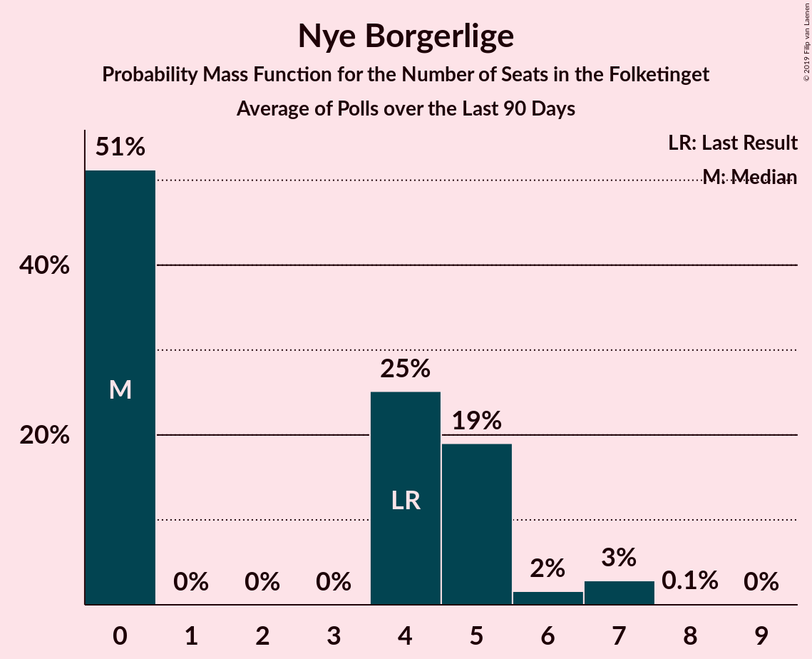

# Poll Average

<a href="#voting-intentions">Voting Intentions</a> | <a href="#seats">Seats</a> | <a href="#coalitions">Coalitions</a> | <a href="#technical-information">Technical Information</a>

## Summary

The table below lists the polls on which the average is based. They are the most recent polls (less than 90 days old) registered and analyzed so far.

| Period     | Polling firm/Commissioner(s) | A | O | V | Ø | I | Å | B | F | C | K | D | E | P |
|:----------:|:----------------------------:|:--:|:--:|:--:|:--:|:--:|:--:|:--:|:--:|:--:|:--:|:--:|:--:|:--:|
| 18 June 2015 | General Election | 26.3%   47 | 21.1%   37 | 19.5%   34 | 7.8%   14 | 7.5%   13 | 4.8%   9 | 4.6%   8 | 4.2%   7 | 3.4%   6 | 0.8%   0 | 0.0%   0 | 0.0%   0 | 0.0%   0 |
| N/A | Poll Average | 23–30%   41–53 | 10–14%   18–26 | 16–21%   29–39 | 8–12%   14–20 | 3–6%   5–10 | 2–5%   4–8 | 5–10%   10–18 | 6–9%   10–16 | 3–6%   6–11 | 1–2%   0–4 | 1–4%   0–7 | 0–2%   0 | 2–4%   4–8 |
| [14–16 May 2019](2019-05-16-Voxmeter.html) | Voxmeter   Ritzau | N/A   N/A | N/A   N/A | N/A   N/A | N/A   N/A | N/A   N/A | N/A   N/A | N/A   N/A | N/A   N/A | N/A   N/A | N/A   N/A | N/A   N/A | N/A   N/A | N/A   N/A |
| [15 May 2019](2019-05-15-YouGov.html) | YouGov | N/A   N/A | N/A   N/A | N/A   N/A | N/A   N/A | N/A   N/A | N/A   N/A | N/A   N/A | N/A   N/A | N/A   N/A | N/A   N/A | N/A   N/A | N/A   N/A | N/A   N/A |
| [15 May 2019](2019-05-15-Gallup.html) | Gallup | N/A   N/A | N/A   N/A | N/A   N/A | N/A   N/A | N/A   N/A | N/A   N/A | N/A   N/A | N/A   N/A | N/A   N/A | N/A   N/A | N/A   N/A | N/A   N/A | N/A   N/A |
| [11–13 May 2019](2019-05-13-Epinion.html) | Epinion | N/A   N/A | N/A   N/A | N/A   N/A | N/A   N/A | N/A   N/A | N/A   N/A | N/A   N/A | N/A   N/A | N/A   N/A | N/A   N/A | N/A   N/A | N/A   N/A | N/A   N/A |
| [8–10 May 2019](2019-05-10-Megafon.html) | Megafon   Politiken and TV 2 | 22–27%   39–47 | 9–13%   15–23 | 17–22%   31–39 | 8–11%   13–21 | 3–5%   5–9 | 2–4%   0–7 | 7–10%   12–18 | 6–10%   11–17 | 4–6%   6–11 | 1–2%   0–4 | 2–4%   4–8 | 0–1%   0 | 2–4%   0–7 |
| [2–8 May 2019](2019-05-08-Norstat.html) | Norstat   Altinget and Jyllands-Posten | 26–31%   47–56 | 11–15%   21–28 | 15–20%   28–34 | 8–11%   14–20 | 3–5%   4–8 | 3–5%   6–9 | 5–8%   10–14 | 6–8%   10–14 | 3–6%   6–9 | 1–2%   0–4 | 1–3%   0–6 | 0–1%   0 | 3–5%   5–8 |
| [8 May 2019](2019-05-08-KantarGallup.html) | Kantar Gallup   Berlingske | 22–26%   40–46 | 11–14%   19–25 | 16–20%   30–35 | 8–11%   15–19 | 3–5%   6–10 | 2–4%   4–7 | 7–10%   13–18 | 6–9%   12–15 | 4–6%   6–11 | 1–2%   0 | 2–4%   0–6 | 1–2%   0 | 3–4%   5–8 |
| [7 May 2019](2019-05-07-GreensAnalyseinstitut.html) | Greens Analyseinstitut   Børsen | 25–30%   46–52 | 10–14%   19–23 | 17–22%   33–41 | 9–12%   16–21 | 4–6%   7–10 | 2–4%   5–7 | 6–9%   11–15 | 5–8%   10–14 | 3–5%   5–8 | 1–2%   0 | 1–2%   0 | 0–1%   0 | 2–4%   0–6 |
| 18 June 2015 | General Election | 26.3%   47 | 21.1%   37 | 19.5%   34 | 7.8%   14 | 7.5%   13 | 4.8%   9 | 4.6%   8 | 4.2%   7 | 3.4%   6 | 0.8%   0 | 0.0%   0 | 0.0%   0 | 0.0%   0 |

Only polls for which at least the sample size has been published are included in the table above.

**Legend:**
+ **Top half of each row:** Voting intentions (95% confidence interval)
+ **Bottom half of each row:** Seat projections for the Folketinget (95% confidence interval)
+ **A:** Socialdemokraterne
+ **O:** Dansk Folkeparti
+ **V:** Venstre
+ **Ø:** Enhedslisten–De Rød-Grønne
+ **I:** Liberal Alliance
+ **Å:** Alternativet
+ **B:** Radikale Venstre
+ **F:** Socialistisk Folkeparti
+ **C:** Det Konservative Folkeparti
+ **K:** Kristendemokraterne
+ **D:** Nye Borgerlige
+ **E:** Klaus Riskær Pedersen
+ **P:** Stram Kurs
+ **N/A (single party):** Party not included the published results
+ **N/A (entire row):** Calculation for this opinion poll not started yet

## Voting Intentions

### Confidence Intervals

| Party | Last Result | Median | 80% Confidence Interval | 90% Confidence Interval | 95% Confidence Interval | 99% Confidence Interval |
|:-----:|:-----------:|:------:|:-----------------------:|:-----------------------:|:-----------------------:|:-----------------------:|
| <a href="#socialdemokraterne">Socialdemokraterne</a> | 26.3% | 26.1% | 23.5–29.1% |23.0–29.7% | 22.6–30.2% | 21.8–31.1% |
| <a href="#dansk-folkeparti">Dansk Folkeparti</a> | 21.1% | 12.2% | 10.5–13.6% |10.0–14.0% | 9.6–14.3% | 8.9–15.0% |
| <a href="#venstre">Venstre</a> | 19.5% | 18.4% | 16.7–20.4% |16.3–20.9% | 15.9–21.4% | 15.2–22.3% |
| <a href="#enhedslisten–de-rød-grønne">Enhedslisten–De Rød-Grønne</a> | 7.8% | 9.6% | 8.4–11.0% |8.1–11.4% | 7.9–11.8% | 7.4–12.6% |
| <a href="#liberal-alliance">Liberal Alliance</a> | 7.5% | 4.1% | 3.3–5.1% |3.1–5.5% | 2.9–5.8% | 2.6–6.3% |
| <a href="#alternativet">Alternativet</a> | 4.8% | 3.3% | 2.6–4.2% |2.4–4.4% | 2.2–4.7% | 1.9–5.1% |
| <a href="#radikale-venstre">Radikale Venstre</a> | 4.6% | 7.7% | 6.1–9.1% |5.7–9.5% | 5.4–9.8% | 5.0–10.4% |
| <a href="#socialistisk-folkeparti">Socialistisk Folkeparti</a> | 4.2% | 7.2% | 6.1–8.5% |5.8–8.9% | 5.6–9.2% | 5.2–10.0% |
| <a href="#det-konservative-folkeparti">Det Konservative Folkeparti</a> | 3.4% | 4.5% | 3.4–5.5% |3.1–5.8% | 2.9–6.0% | 2.5–6.6% |
| <a href="#kristendemokraterne">Kristendemokraterne</a> | 0.8% | 1.3% | 0.9–1.8% |0.8–2.0% | 0.7–2.1% | 0.5–2.5% |
| <a href="#nye-borgerlige">Nye Borgerlige</a> | 0.0% | 2.4% | 0.9–3.2% |0.8–3.4% | 0.6–3.6% | 0.5–4.1% |
| <a href="#klaus-riskær-pedersen">Klaus Riskær Pedersen</a> | 0.0% | 0.6% | 0.2–1.3% |0.1–1.4% | 0.1–1.5% | 0.1–1.8% |
| <a href="#stram-kurs">Stram Kurs</a> | 0.0% | 3.1% | 2.2–3.9% |2.0–4.1% | 1.9–4.4% | 1.6–4.8% |

### Socialdemokraterne

*For a full overview of the results for this party, see the [Socialdemokraterne](party-socialdemokraterne.html) page.*

| Voting Intentions | Probability | Accumulated | Special Marks |
|:-----------------:|:-----------:|:-----------:|:-------------:|
| 19.5–20.5% | 0% | 100% |  |
| 20.5–21.5% | 0.3% | 100% |  |
| 21.5–22.5% | 2% | 99.7% |  |
| 22.5–23.5% | 8% | 98% |  |
| 23.5–24.5% | 16% | 90% |  |
| 24.5–25.5% | 16% | 74% |  |
| 25.5–26.5% | 13% | 58% | Last Result, Median |
| 26.5–27.5% | 14% | 44% |  |
| 27.5–28.5% | 14% | 30% |  |
| 28.5–29.5% | 10% | 16% |  |
| 29.5–30.5% | 4% | 6% |  |
| 30.5–31.5% | 1.2% | 1.4% |  |
| 31.5–32.5% | 0.2% | 0.2% |  |
| 32.5–33.5% | 0% | 0% |  |

### Dansk Folkeparti

*For a full overview of the results for this party, see the [Dansk Folkeparti](party-danskfolkeparti.html) page.*

| Voting Intentions | Probability | Accumulated | Special Marks |
|:-----------------:|:-----------:|:-----------:|:-------------:|
| 6.5–7.5% | 0% | 100% |  |
| 7.5–8.5% | 0.1% | 100% |  |
| 8.5–9.5% | 2% | 99.9% |  |
| 9.5–10.5% | 8% | 98% |  |
| 10.5–11.5% | 19% | 89% |  |
| 11.5–12.5% | 31% | 71% | Median |
| 12.5–13.5% | 28% | 39% |  |
| 13.5–14.5% | 10% | 11% |  |
| 14.5–15.5% | 1.5% | 2% |  |
| 15.5–16.5% | 0.1% | 0.1% |  |
| 16.5–17.5% | 0% | 0% |  |
| 17.5–18.5% | 0% | 0% |  |
| 18.5–19.5% | 0% | 0% |  |
| 19.5–20.5% | 0% | 0% |  |
| 20.5–21.5% | 0% | 0% | Last Result |

### Venstre

*For a full overview of the results for this party, see the [Venstre](party-venstre.html) page.*

| Voting Intentions | Probability | Accumulated | Special Marks |
|:-----------------:|:-----------:|:-----------:|:-------------:|
| 12.5–13.5% | 0% | 100% |  |
| 13.5–14.5% | 0.1% | 100% |  |
| 14.5–15.5% | 1.1% | 99.9% |  |
| 15.5–16.5% | 7% | 98.8% |  |
| 16.5–17.5% | 18% | 92% |  |
| 17.5–18.5% | 27% | 74% | Median |
| 18.5–19.5% | 24% | 47% |  |
| 19.5–20.5% | 15% | 23% | Last Result |
| 20.5–21.5% | 6% | 8% |  |
| 21.5–22.5% | 2% | 2% |  |
| 22.5–23.5% | 0.3% | 0.3% |  |
| 23.5–24.5% | 0% | 0% |  |

### Enhedslisten–De Rød-Grønne

*For a full overview of the results for this party, see the [Enhedslisten–De Rød-Grønne](party-enhedslisten–derød-grønne.html) page.*

| Voting Intentions | Probability | Accumulated | Special Marks |
|:-----------------:|:-----------:|:-----------:|:-------------:|
| 5.5–6.5% | 0% | 100% |  |
| 6.5–7.5% | 0.8% | 100% |  |
| 7.5–8.5% | 12% | 99.2% | Last Result |
| 8.5–9.5% | 37% | 87% |  |
| 9.5–10.5% | 32% | 50% | Median |
| 10.5–11.5% | 14% | 18% |  |
| 11.5–12.5% | 4% | 4% |  |
| 12.5–13.5% | 0.5% | 0.5% |  |
| 13.5–14.5% | 0% | 0% |  |

### Liberal Alliance

*For a full overview of the results for this party, see the [Liberal Alliance](party-liberalalliance.html) page.*

| Voting Intentions | Probability | Accumulated | Special Marks |
|:-----------------:|:-----------:|:-----------:|:-------------:|
| 0.5–1.5% | 0% | 100% |  |
| 1.5–2.5% | 0.3% | 100% |  |
| 2.5–3.5% | 19% | 99.7% |  |
| 3.5–4.5% | 53% | 81% | Median |
| 4.5–5.5% | 23% | 27% |  |
| 5.5–6.5% | 4% | 4% |  |
| 6.5–7.5% | 0.2% | 0.3% |  |
| 7.5–8.5% | 0% | 0% | Last Result |

### Alternativet

*For a full overview of the results for this party, see the [Alternativet](party-alternativet.html) page.*

| Voting Intentions | Probability | Accumulated | Special Marks |
|:-----------------:|:-----------:|:-----------:|:-------------:|
| 0.5–1.5% | 0% | 100% |  |
| 1.5–2.5% | 9% | 100% |  |
| 2.5–3.5% | 58% | 91% | Median |
| 3.5–4.5% | 30% | 33% |  |
| 4.5–5.5% | 3% | 3% | Last Result |
| 5.5–6.5% | 0.1% | 0.1% |  |
| 6.5–7.5% | 0% | 0% |  |

### Radikale Venstre

*For a full overview of the results for this party, see the [Radikale Venstre](party-radikalevenstre.html) page.*

| Voting Intentions | Probability | Accumulated | Special Marks |
|:-----------------:|:-----------:|:-----------:|:-------------:|
| 3.5–4.5% | 0.1% | 100% |  |
| 4.5–5.5% | 3% | 99.9% | Last Result |
| 5.5–6.5% | 17% | 97% |  |
| 6.5–7.5% | 25% | 79% |  |
| 7.5–8.5% | 30% | 54% | Median |
| 8.5–9.5% | 19% | 24% |  |
| 9.5–10.5% | 4% | 4% |  |
| 10.5–11.5% | 0.4% | 0.4% |  |
| 11.5–12.5% | 0% | 0% |  |

### Socialistisk Folkeparti

*For a full overview of the results for this party, see the [Socialistisk Folkeparti](party-socialistiskfolkeparti.html) page.*

| Voting Intentions | Probability | Accumulated | Special Marks |
|:-----------------:|:-----------:|:-----------:|:-------------:|
| 3.5–4.5% | 0% | 100% | Last Result |
| 4.5–5.5% | 2% | 100% |  |
| 5.5–6.5% | 21% | 98% |  |
| 6.5–7.5% | 43% | 77% | Median |
| 7.5–8.5% | 26% | 35% |  |
| 8.5–9.5% | 7% | 9% |  |
| 9.5–10.5% | 1.2% | 1.3% |  |
| 10.5–11.5% | 0.1% | 0.1% |  |
| 11.5–12.5% | 0% | 0% |  |

### Det Konservative Folkeparti

*For a full overview of the results for this party, see the [Det Konservative Folkeparti](party-detkonservativefolkeparti.html) page.*

| Voting Intentions | Probability | Accumulated | Special Marks |
|:-----------------:|:-----------:|:-----------:|:-------------:|
| 0.5–1.5% | 0% | 100% |  |
| 1.5–2.5% | 0.5% | 100% |  |
| 2.5–3.5% | 14% | 99.5% | Last Result |
| 3.5–4.5% | 39% | 86% | Median |
| 4.5–5.5% | 38% | 47% |  |
| 5.5–6.5% | 8% | 9% |  |
| 6.5–7.5% | 0.5% | 0.5% |  |
| 7.5–8.5% | 0% | 0% |  |

### Kristendemokraterne

*For a full overview of the results for this party, see the [Kristendemokraterne](party-kristendemokraterne.html) page.*

| Voting Intentions | Probability | Accumulated | Special Marks |
|:-----------------:|:-----------:|:-----------:|:-------------:|
| 0.0–0.5% | 0.5% | 100% |  |
| 0.5–1.5% | 75% | 99.5% | Last Result, Median |
| 1.5–2.5% | 24% | 24% |  |
| 2.5–3.5% | 0.3% | 0.3% |  |
| 3.5–4.5% | 0% | 0% |  |

### Nye Borgerlige

*For a full overview of the results for this party, see the [Nye Borgerlige](party-nyeborgerlige.html) page.*

| Voting Intentions | Probability | Accumulated | Special Marks |
|:-----------------:|:-----------:|:-----------:|:-------------:|
| 0.0–0.5% | 1.0% | 100% | Last Result |
| 0.5–1.5% | 24% | 99.0% |  |
| 1.5–2.5% | 35% | 75% | Median |
| 2.5–3.5% | 36% | 40% |  |
| 3.5–4.5% | 3% | 3% |  |
| 4.5–5.5% | 0.1% | 0.1% |  |
| 5.5–6.5% | 0% | 0% |  |

### Klaus Riskær Pedersen

*For a full overview of the results for this party, see the [Klaus Riskær Pedersen](party-klausriskærpedersen.html) page.*

| Voting Intentions | Probability | Accumulated | Special Marks |
|:-----------------:|:-----------:|:-----------:|:-------------:|
| 0.0–0.5% | 41% | 100% | Last Result |
| 0.5–1.5% | 57% | 59% | Median |
| 1.5–2.5% | 2% | 2% |  |
| 2.5–3.5% | 0% | 0% |  |

### Stram Kurs

*For a full overview of the results for this party, see the [Stram Kurs](party-stramkurs.html) page.*

| Voting Intentions | Probability | Accumulated | Special Marks |
|:-----------------:|:-----------:|:-----------:|:-------------:|
| 0.0–0.5% | 0% | 100% | Last Result |
| 0.5–1.5% | 0.3% | 100% |  |
| 1.5–2.5% | 22% | 99.7% |  |
| 2.5–3.5% | 54% | 78% | Median |
| 3.5–4.5% | 22% | 23% |  |
| 4.5–5.5% | 1.1% | 1.2% |  |
| 5.5–6.5% | 0% | 0% |  |

## Seats

### Confidence Intervals

| Party | Last Result | Median | 80% Confidence Interval | 90% Confidence Interval | 95% Confidence Interval | 99% Confidence Interval |
|:-----:|:-----------:|:------:|:-----------------------:|:-----------------------:|:-----------------------:|:-----------------------:|
| <a href="#socialdemokraterne">Socialdemokraterne</a> | 47 | 47 | 42–52 |42–53 | 41–53 | 38–56 |
| <a href="#dansk-folkeparti">Dansk Folkeparti</a> | 37 | 21 | 20–25 |19–26 | 18–26 | 15–28 |
| <a href="#venstre">Venstre</a> | 34 | 32 | 30–36 |29–38 | 29–39 | 28–41 |
| <a href="#enhedslisten–de-rød-grønne">Enhedslisten–De Rød-Grønne</a> | 14 | 17 | 16–20 |14–20 | 14–20 | 13–22 |
| <a href="#liberal-alliance">Liberal Alliance</a> | 13 | 8 | 6–9 |5–10 | 5–10 | 4–11 |
| <a href="#alternativet">Alternativet</a> | 9 | 6 | 4–7 |4–8 | 4–8 | 0–9 |
| <a href="#radikale-venstre">Radikale Venstre</a> | 8 | 13 | 11–17 |10–18 | 10–18 | 10–19 |
| <a href="#socialistisk-folkeparti">Socialistisk Folkeparti</a> | 7 | 12 | 10–14 |10–15 | 10–16 | 10–17 |
| <a href="#det-konservative-folkeparti">Det Konservative Folkeparti</a> | 6 | 8 | 7–9 |7–10 | 6–11 | 5–11 |
| <a href="#kristendemokraterne">Kristendemokraterne</a> | 0 | 0 | 0 |0 | 0–4 | 0–4 |
| <a href="#nye-borgerlige">Nye Borgerlige</a> | 0 | 4 | 0–7 |0–7 | 0–7 | 0–8 |
| <a href="#klaus-riskær-pedersen">Klaus Riskær Pedersen</a> | 0 | 0 | 0 |0 | 0 | 0 |
| <a href="#stram-kurs">Stram Kurs</a> | 0 | 5 | 4–7 |4–7 | 4–8 | 0–8 |

### Socialdemokraterne

*For a full overview of the results for this party, see the [Socialdemokraterne](party-socialdemokraterne.html) page.*

| Number of Seats | Probability | Accumulated | Special Marks |
|:---------------:|:-----------:|:-----------:|:-------------:|
| 36 | 0.1% | 100% |  |
| 37 | 0.1% | 99.8% |  |
| 38 | 0.4% | 99.7% |  |
| 39 | 0.3% | 99.4% |  |
| 40 | 2% | 99.0% |  |
| 41 | 0.9% | 98% |  |
| 42 | 14% | 97% |  |
| 43 | 18% | 83% |  |
| 44 | 4% | 65% |  |
| 45 | 7% | 61% |  |
| 46 | 3% | 54% |  |
| 47 | 5% | 51% | Last Result, Median |
| 48 | 1.4% | 46% |  |
| 49 | 13% | 44% |  |
| 50 | 2% | 31% |  |
| 51 | 20% | 30% |  |
| 52 | 0.9% | 10% |  |
| 53 | 7% | 9% |  |
| 54 | 1.3% | 2% |  |
| 55 | 0% | 0.7% |  |
| 56 | 0.5% | 0.7% |  |
| 57 | 0.1% | 0.1% |  |
| 58 | 0% | 0% |  |

### Dansk Folkeparti

*For a full overview of the results for this party, see the [Dansk Folkeparti](party-danskfolkeparti.html) page.*

| Number of Seats | Probability | Accumulated | Special Marks |
|:---------------:|:-----------:|:-----------:|:-------------:|
| 14 | 0.1% | 100% |  |
| 15 | 0.6% | 99.9% |  |
| 16 | 0.4% | 99.3% |  |
| 17 | 1.3% | 98.9% |  |
| 18 | 3% | 98% |  |
| 19 | 5% | 95% |  |
| 20 | 33% | 90% |  |
| 21 | 8% | 57% | Median |
| 22 | 8% | 49% |  |
| 23 | 11% | 42% |  |
| 24 | 11% | 31% |  |
| 25 | 11% | 20% |  |
| 26 | 7% | 9% |  |
| 27 | 0.4% | 2% |  |
| 28 | 1.5% | 2% |  |
| 29 | 0% | 0% |  |
| 30 | 0% | 0% |  |
| 31 | 0% | 0% |  |
| 32 | 0% | 0% |  |
| 33 | 0% | 0% |  |
| 34 | 0% | 0% |  |
| 35 | 0% | 0% |  |
| 36 | 0% | 0% |  |
| 37 | 0% | 0% | Last Result |

### Venstre

*For a full overview of the results for this party, see the [Venstre](party-venstre.html) page.*

| Number of Seats | Probability | Accumulated | Special Marks |
|:---------------:|:-----------:|:-----------:|:-------------:|
| 26 | 0% | 100% |  |
| 27 | 0.2% | 99.9% |  |
| 28 | 2% | 99.7% |  |
| 29 | 8% | 98% |  |
| 30 | 14% | 90% |  |
| 31 | 15% | 76% |  |
| 32 | 15% | 61% | Median |
| 33 | 4% | 46% |  |
| 34 | 13% | 42% | Last Result |
| 35 | 2% | 28% |  |
| 36 | 19% | 26% |  |
| 37 | 1.3% | 7% |  |
| 38 | 2% | 6% |  |
| 39 | 2% | 4% |  |
| 40 | 0.1% | 2% |  |
| 41 | 2% | 2% |  |
| 42 | 0% | 0% |  |

### Enhedslisten–De Rød-Grønne

*For a full overview of the results for this party, see the [Enhedslisten–De Rød-Grønne](party-enhedslisten–derød-grønne.html) page.*

| Number of Seats | Probability | Accumulated | Special Marks |
|:---------------:|:-----------:|:-----------:|:-------------:|
| 12 | 0.1% | 100% |  |
| 13 | 0.7% | 99.9% |  |
| 14 | 4% | 99.2% | Last Result |
| 15 | 3% | 95% |  |
| 16 | 34% | 92% |  |
| 17 | 9% | 57% | Median |
| 18 | 4% | 48% |  |
| 19 | 22% | 44% |  |
| 20 | 19% | 22% |  |
| 21 | 2% | 2% |  |
| 22 | 0.3% | 0.5% |  |
| 23 | 0.1% | 0.2% |  |
| 24 | 0.1% | 0.1% |  |
| 25 | 0.1% | 0.1% |  |
| 26 | 0% | 0% |  |

### Liberal Alliance

*For a full overview of the results for this party, see the [Liberal Alliance](party-liberalalliance.html) page.*

| Number of Seats | Probability | Accumulated | Special Marks |
|:---------------:|:-----------:|:-----------:|:-------------:|
| 4 | 0.8% | 100% |  |
| 5 | 6% | 99.2% |  |
| 6 | 18% | 93% |  |
| 7 | 18% | 76% |  |
| 8 | 26% | 57% | Median |
| 9 | 24% | 32% |  |
| 10 | 7% | 8% |  |
| 11 | 0.4% | 0.6% |  |
| 12 | 0.1% | 0.1% |  |
| 13 | 0% | 0% | Last Result |

### Alternativet

*For a full overview of the results for this party, see the [Alternativet](party-alternativet.html) page.*

| Number of Seats | Probability | Accumulated | Special Marks |
|:---------------:|:-----------:|:-----------:|:-------------:|
| 0 | 1.2% | 100% |  |
| 1 | 0% | 98.8% |  |
| 2 | 0% | 98.8% |  |
| 3 | 0% | 98.8% |  |
| 4 | 12% | 98.8% |  |
| 5 | 31% | 87% |  |
| 6 | 27% | 56% | Median |
| 7 | 19% | 29% |  |
| 8 | 9% | 10% |  |
| 9 | 0.4% | 0.8% | Last Result |
| 10 | 0.4% | 0.4% |  |
| 11 | 0% | 0% |  |

### Radikale Venstre

*For a full overview of the results for this party, see the [Radikale Venstre](party-radikalevenstre.html) page.*

| Number of Seats | Probability | Accumulated | Special Marks |
|:---------------:|:-----------:|:-----------:|:-------------:|
| 8 | 0.1% | 100% | Last Result |
| 9 | 0.4% | 99.9% |  |
| 10 | 8% | 99.6% |  |
| 11 | 31% | 92% |  |
| 12 | 4% | 61% |  |
| 13 | 8% | 57% | Median |
| 14 | 10% | 48% |  |
| 15 | 13% | 38% |  |
| 16 | 14% | 25% |  |
| 17 | 3% | 11% |  |
| 18 | 8% | 8% |  |
| 19 | 0.2% | 0.6% |  |
| 20 | 0.4% | 0.4% |  |
| 21 | 0% | 0% |  |

### Socialistisk Folkeparti

*For a full overview of the results for this party, see the [Socialistisk Folkeparti](party-socialistiskfolkeparti.html) page.*

| Number of Seats | Probability | Accumulated | Special Marks |
|:---------------:|:-----------:|:-----------:|:-------------:|
| 7 | 0% | 100% | Last Result |
| 8 | 0.1% | 100% |  |
| 9 | 0.4% | 99.9% |  |
| 10 | 11% | 99.5% |  |
| 11 | 32% | 89% |  |
| 12 | 13% | 57% | Median |
| 13 | 19% | 44% |  |
| 14 | 18% | 25% |  |
| 15 | 4% | 7% |  |
| 16 | 1.4% | 3% |  |
| 17 | 1.1% | 1.3% |  |
| 18 | 0.2% | 0.3% |  |
| 19 | 0% | 0% |  |

### Det Konservative Folkeparti

*For a full overview of the results for this party, see the [Det Konservative Folkeparti](party-detkonservativefolkeparti.html) page.*

| Number of Seats | Probability | Accumulated | Special Marks |
|:---------------:|:-----------:|:-----------:|:-------------:|
| 4 | 0.2% | 100% |  |
| 5 | 0.6% | 99.8% |  |
| 6 | 3% | 99.2% | Last Result |
| 7 | 27% | 96% |  |
| 8 | 21% | 69% | Median |
| 9 | 40% | 48% |  |
| 10 | 3% | 7% |  |
| 11 | 4% | 5% |  |
| 12 | 0.2% | 0.4% |  |
| 13 | 0.1% | 0.1% |  |
| 14 | 0% | 0% |  |

### Kristendemokraterne

*For a full overview of the results for this party, see the [Kristendemokraterne](party-kristendemokraterne.html) page.*

| Number of Seats | Probability | Accumulated | Special Marks |
|:---------------:|:-----------:|:-----------:|:-------------:|
| 0 | 97% | 100% | Last Result, Median |
| 1 | 0% | 3% |  |
| 2 | 0% | 3% |  |
| 3 | 0% | 3% |  |
| 4 | 3% | 3% |  |
| 5 | 0.2% | 0.2% |  |
| 6 | 0% | 0% |  |

### Nye Borgerlige

*For a full overview of the results for this party, see the [Nye Borgerlige](party-nyeborgerlige.html) page.*

| Number of Seats | Probability | Accumulated | Special Marks |
|:---------------:|:-----------:|:-----------:|:-------------:|
| 0 | 47% | 100% | Last Result |
| 1 | 0% | 53% |  |
| 2 | 0% | 53% |  |
| 3 | 0% | 53% |  |
| 4 | 9% | 53% | Median |
| 5 | 16% | 44% |  |
| 6 | 16% | 28% |  |
| 7 | 12% | 12% |  |
| 8 | 0.4% | 0.6% |  |
| 9 | 0.2% | 0.2% |  |
| 10 | 0% | 0% |  |

### Klaus Riskær Pedersen

*For a full overview of the results for this party, see the [Klaus Riskær Pedersen](party-klausriskærpedersen.html) page.*

| Number of Seats | Probability | Accumulated | Special Marks |
|:---------------:|:-----------:|:-----------:|:-------------:|
| 0 | 99.9% | 100% | Last Result, Median |
| 1 | 0% | 0.1% |  |
| 2 | 0% | 0.1% |  |
| 3 | 0% | 0.1% |  |
| 4 | 0.1% | 0.1% |  |
| 5 | 0% | 0% |  |

### Stram Kurs

*For a full overview of the results for this party, see the [Stram Kurs](party-stramkurs.html) page.*

| Number of Seats | Probability | Accumulated | Special Marks |
|:---------------:|:-----------:|:-----------:|:-------------:|
| 0 | 2% | 100% | Last Result |
| 1 | 0% | 98% |  |
| 2 | 0% | 98% |  |
| 3 | 0% | 98% |  |
| 4 | 15% | 98% |  |
| 5 | 43% | 84% | Median |
| 6 | 25% | 41% |  |
| 7 | 13% | 15% |  |
| 8 | 2% | 3% |  |
| 9 | 0.1% | 0.1% |  |
| 10 | 0% | 0% |  |

## Coalitions

### Confidence Intervals

| Coalition | Last Result | Median | Majority? | 80% Confidence Interval | 90% Confidence Interval | 95% Confidence Interval | 99% Confidence Interval |
|:---------:|:-----------:|:------:|:---------:|:-----------------------:|:-----------------------:|:-----------------------:|:-----------------------:|
| Socialdemokraterne – Enhedslisten–De Rød-Grønne – Alternativet – Radikale Venstre – Socialistisk Folkeparti | 85 | 96 | 98% | 91–100 | 91–100 | 90–102 | 86–103 |
| Socialdemokraterne – Enhedslisten–De Rød-Grønne – Radikale Venstre – Socialistisk Folkeparti | 76 | 90 | 51% | 86–93 | 85–94 | 85–95 | 82–98 |
| Socialdemokraterne – Enhedslisten–De Rød-Grønne – Alternativet – Socialistisk Folkeparti | 77 | 82 | 8% | 77–88 | 77–90 | 75–90 | 73–92 |
| Dansk Folkeparti – Venstre – Liberal Alliance – Det Konservative Folkeparti – Kristendemokraterne – Klaus Riskær Pedersen – Nye Borgerlige – Stram Kurs | 90 | 79 | 0% | 75–84 | 75–84 | 73–85 | 72–89 |
| Socialdemokraterne – Enhedslisten–De Rød-Grønne – Socialistisk Folkeparti | 68 | 77 | 0% | 72–82 | 71–82 | 71–82 | 66–85 |
| Dansk Folkeparti – Venstre – Liberal Alliance – Det Konservative Folkeparti – Kristendemokraterne – Klaus Riskær Pedersen – Nye Borgerlige | 90 | 73 | 0% | 70–78 | 70–78 | 68–79 | 66–83 |
| Dansk Folkeparti – Venstre – Liberal Alliance – Det Konservative Folkeparti – Klaus Riskær Pedersen – Nye Borgerlige | 90 | 73 | 0% | 70–78 | 69–78 | 68–79 | 66–83 |
| Dansk Folkeparti – Venstre – Liberal Alliance – Det Konservative Folkeparti – Kristendemokraterne – Nye Borgerlige | 90 | 73 | 0% | 70–78 | 70–78 | 68–79 | 66–83 |
| Dansk Folkeparti – Venstre – Liberal Alliance – Det Konservative Folkeparti – Nye Borgerlige | 90 | 73 | 0% | 70–78 | 69–78 | 68–79 | 66–83 |
| Socialdemokraterne – Radikale Venstre – Socialistisk Folkeparti | 62 | 73 | 0% | 68–76 | 68–77 | 68–78 | 66–80 |
| Dansk Folkeparti – Venstre – Liberal Alliance – Det Konservative Folkeparti – Kristendemokraterne | 90 | 71 | 0% | 66–73 | 66–75 | 66–76 | 63–78 |
| Dansk Folkeparti – Venstre – Liberal Alliance – Det Konservative Folkeparti | 90 | 71 | 0% | 66–73 | 66–75 | 64–76 | 63–77 |
| Socialdemokraterne – Radikale Venstre | 55 | 60 | 0% | 57–63 | 57–63 | 56–66 | 53–68 |
| Venstre – Liberal Alliance – Det Konservative Folkeparti | 53 | 49 | 0% | 44–52 | 44–54 | 43–56 | 41–57 |
| Venstre – Det Konservative Folkeparti | 40 | 40 | 0% | 38–44 | 38–46 | 36–48 | 35–49 |
| Venstre | 34 | 32 | 0% | 30–36 | 29–38 | 29–39 | 28–41 |

### Socialdemokraterne – Enhedslisten–De Rød-Grønne – Alternativet – Radikale Venstre – Socialistisk Folkeparti

| Number of Seats | Probability | Accumulated | Special Marks |
|:---------------:|:-----------:|:-----------:|:-------------:|
| 85 | 0% | 100% | Last Result |
| 86 | 0.9% | 100% |  |
| 87 | 0% | 99.1% |  |
| 88 | 0.4% | 99.1% |  |
| 89 | 1.0% | 98.7% |  |
| 90 | 0.3% | 98% | Majority |
| 91 | 7% | 97% |  |
| 92 | 1.2% | 90% |  |
| 93 | 19% | 89% |  |
| 94 | 3% | 69% |  |
| 95 | 6% | 66% | Median |
| 96 | 16% | 60% |  |
| 97 | 6% | 45% |  |
| 98 | 25% | 39% |  |
| 99 | 1.1% | 14% |  |
| 100 | 8% | 13% |  |
| 101 | 2% | 4% |  |
| 102 | 2% | 3% |  |
| 103 | 0.4% | 0.9% |  |
| 104 | 0.1% | 0.5% |  |
| 105 | 0.1% | 0.4% |  |
| 106 | 0.2% | 0.3% |  |
| 107 | 0.1% | 0.1% |  |
| 108 | 0% | 0% |  |

### Socialdemokraterne – Enhedslisten–De Rød-Grønne – Radikale Venstre – Socialistisk Folkeparti

| Number of Seats | Probability | Accumulated | Special Marks |
|:---------------:|:-----------:|:-----------:|:-------------:|
| 76 | 0% | 100% | Last Result |
| 77 | 0% | 100% |  |
| 78 | 0% | 100% |  |
| 79 | 0% | 100% |  |
| 80 | 0% | 100% |  |
| 81 | 0% | 100% |  |
| 82 | 0.6% | 100% |  |
| 83 | 0.5% | 99.4% |  |
| 84 | 0.8% | 98.9% |  |
| 85 | 7% | 98% |  |
| 86 | 2% | 91% |  |
| 87 | 11% | 89% |  |
| 88 | 4% | 78% |  |
| 89 | 23% | 75% | Median |
| 90 | 7% | 51% | Majority |
| 91 | 5% | 44% |  |
| 92 | 9% | 39% |  |
| 93 | 24% | 30% |  |
| 94 | 3% | 6% |  |
| 95 | 2% | 3% |  |
| 96 | 0.4% | 1.2% |  |
| 97 | 0.1% | 0.8% |  |
| 98 | 0.2% | 0.7% |  |
| 99 | 0.2% | 0.5% |  |
| 100 | 0.2% | 0.3% |  |
| 101 | 0.1% | 0.1% |  |
| 102 | 0% | 0% |  |

### Socialdemokraterne – Enhedslisten–De Rød-Grønne – Alternativet – Socialistisk Folkeparti

| Number of Seats | Probability | Accumulated | Special Marks |
|:---------------:|:-----------:|:-----------:|:-------------:|
| 71 | 0.1% | 100% |  |
| 72 | 0% | 99.9% |  |
| 73 | 2% | 99.9% |  |
| 74 | 0.3% | 98% |  |
| 75 | 0.5% | 98% |  |
| 76 | 0.8% | 97% |  |
| 77 | 17% | 97% | Last Result |
| 78 | 11% | 80% |  |
| 79 | 4% | 69% |  |
| 80 | 5% | 65% |  |
| 81 | 6% | 60% |  |
| 82 | 6% | 54% | Median |
| 83 | 4% | 48% |  |
| 84 | 2% | 44% |  |
| 85 | 11% | 42% |  |
| 86 | 0.4% | 31% |  |
| 87 | 19% | 31% |  |
| 88 | 2% | 11% |  |
| 89 | 1.4% | 10% |  |
| 90 | 7% | 8% | Majority |
| 91 | 0.5% | 1.0% |  |
| 92 | 0.3% | 0.5% |  |
| 93 | 0% | 0.2% |  |
| 94 | 0.2% | 0.2% |  |
| 95 | 0% | 0% |  |

### Dansk Folkeparti – Venstre – Liberal Alliance – Det Konservative Folkeparti – Kristendemokraterne – Klaus Riskær Pedersen – Nye Borgerlige – Stram Kurs

| Number of Seats | Probability | Accumulated | Special Marks |
|:---------------:|:-----------:|:-----------:|:-------------:|
| 68 | 0.1% | 100% |  |
| 69 | 0.2% | 99.9% |  |
| 70 | 0.1% | 99.7% |  |
| 71 | 0.1% | 99.6% |  |
| 72 | 0.4% | 99.5% |  |
| 73 | 2% | 99.1% |  |
| 74 | 2% | 97% |  |
| 75 | 8% | 96% |  |
| 76 | 1.1% | 87% |  |
| 77 | 25% | 86% |  |
| 78 | 6% | 61% | Median |
| 79 | 16% | 55% |  |
| 80 | 6% | 40% |  |
| 81 | 3% | 34% |  |
| 82 | 19% | 31% |  |
| 83 | 1.2% | 11% |  |
| 84 | 7% | 10% |  |
| 85 | 0.3% | 3% |  |
| 86 | 1.0% | 2% |  |
| 87 | 0.4% | 1.3% |  |
| 88 | 0% | 0.9% |  |
| 89 | 0.9% | 0.9% |  |
| 90 | 0% | 0% | Last Result, Majority |

### Socialdemokraterne – Enhedslisten–De Rød-Grønne – Socialistisk Folkeparti

| Number of Seats | Probability | Accumulated | Special Marks |
|:---------------:|:-----------:|:-----------:|:-------------:|
| 66 | 0.5% | 100% |  |
| 67 | 0.1% | 99.5% |  |
| 68 | 0.3% | 99.3% | Last Result |
| 69 | 0.8% | 99.0% |  |
| 70 | 0.6% | 98% |  |
| 71 | 7% | 98% |  |
| 72 | 13% | 91% |  |
| 73 | 12% | 78% |  |
| 74 | 2% | 66% |  |
| 75 | 10% | 64% |  |
| 76 | 4% | 54% | Median |
| 77 | 7% | 51% |  |
| 78 | 11% | 43% |  |
| 79 | 1.4% | 32% |  |
| 80 | 2% | 31% |  |
| 81 | 1.2% | 29% |  |
| 82 | 26% | 28% |  |
| 83 | 0.9% | 2% |  |
| 84 | 0.6% | 1.2% |  |
| 85 | 0.2% | 0.6% |  |
| 86 | 0% | 0.3% |  |
| 87 | 0.1% | 0.3% |  |
| 88 | 0.2% | 0.2% |  |
| 89 | 0% | 0% |  |

### Dansk Folkeparti – Venstre – Liberal Alliance – Det Konservative Folkeparti – Kristendemokraterne – Klaus Riskær Pedersen – Nye Borgerlige

| Number of Seats | Probability | Accumulated | Special Marks |
|:---------------:|:-----------:|:-----------:|:-------------:|
| 64 | 0.3% | 100% |  |
| 65 | 0.1% | 99.7% |  |
| 66 | 0.2% | 99.6% |  |
| 67 | 0.9% | 99.4% |  |
| 68 | 2% | 98.6% |  |
| 69 | 1.1% | 97% |  |
| 70 | 9% | 95% |  |
| 71 | 8% | 87% |  |
| 72 | 22% | 79% |  |
| 73 | 14% | 57% | Median |
| 74 | 5% | 43% |  |
| 75 | 3% | 38% |  |
| 76 | 5% | 35% |  |
| 77 | 16% | 30% |  |
| 78 | 10% | 13% |  |
| 79 | 1.1% | 3% |  |
| 80 | 0.6% | 2% |  |
| 81 | 0.3% | 1.4% |  |
| 82 | 0.1% | 1.1% |  |
| 83 | 0.9% | 1.0% |  |
| 84 | 0% | 0% |  |
| 85 | 0% | 0% |  |
| 86 | 0% | 0% |  |
| 87 | 0% | 0% |  |
| 88 | 0% | 0% |  |
| 89 | 0% | 0% |  |
| 90 | 0% | 0% | Last Result, Majority |

### Dansk Folkeparti – Venstre – Liberal Alliance – Det Konservative Folkeparti – Klaus Riskær Pedersen – Nye Borgerlige

| Number of Seats | Probability | Accumulated | Special Marks |
|:---------------:|:-----------:|:-----------:|:-------------:|
| 64 | 0.3% | 100% |  |
| 65 | 0.1% | 99.6% |  |
| 66 | 0.3% | 99.5% |  |
| 67 | 0.9% | 99.2% |  |
| 68 | 2% | 98% |  |
| 69 | 1.3% | 96% |  |
| 70 | 10% | 95% |  |
| 71 | 8% | 85% |  |
| 72 | 23% | 77% |  |
| 73 | 14% | 54% | Median |
| 74 | 4% | 41% |  |
| 75 | 2% | 37% |  |
| 76 | 5% | 34% |  |
| 77 | 16% | 29% |  |
| 78 | 10% | 13% |  |
| 79 | 1.1% | 3% |  |
| 80 | 0.4% | 2% |  |
| 81 | 0.2% | 1.2% |  |
| 82 | 0.1% | 1.0% |  |
| 83 | 0.9% | 0.9% |  |
| 84 | 0% | 0% |  |
| 85 | 0% | 0% |  |
| 86 | 0% | 0% |  |
| 87 | 0% | 0% |  |
| 88 | 0% | 0% |  |
| 89 | 0% | 0% |  |
| 90 | 0% | 0% | Last Result, Majority |

### Dansk Folkeparti – Venstre – Liberal Alliance – Det Konservative Folkeparti – Kristendemokraterne – Nye Borgerlige

| Number of Seats | Probability | Accumulated | Special Marks |
|:---------------:|:-----------:|:-----------:|:-------------:|
| 64 | 0.3% | 100% |  |
| 65 | 0.1% | 99.7% |  |
| 66 | 0.2% | 99.6% |  |
| 67 | 0.9% | 99.4% |  |
| 68 | 2% | 98.6% |  |
| 69 | 1.1% | 97% |  |
| 70 | 9% | 95% |  |
| 71 | 8% | 87% |  |
| 72 | 22% | 79% |  |
| 73 | 14% | 57% | Median |
| 74 | 5% | 43% |  |
| 75 | 3% | 38% |  |
| 76 | 5% | 35% |  |
| 77 | 16% | 30% |  |
| 78 | 10% | 13% |  |
| 79 | 1.1% | 3% |  |
| 80 | 0.6% | 2% |  |
| 81 | 0.3% | 1.4% |  |
| 82 | 0.1% | 1.1% |  |
| 83 | 0.9% | 1.0% |  |
| 84 | 0% | 0% |  |
| 85 | 0% | 0% |  |
| 86 | 0% | 0% |  |
| 87 | 0% | 0% |  |
| 88 | 0% | 0% |  |
| 89 | 0% | 0% |  |
| 90 | 0% | 0% | Last Result, Majority |

### Dansk Folkeparti – Venstre – Liberal Alliance – Det Konservative Folkeparti – Nye Borgerlige

| Number of Seats | Probability | Accumulated | Special Marks |
|:---------------:|:-----------:|:-----------:|:-------------:|
| 64 | 0.3% | 100% |  |
| 65 | 0.1% | 99.6% |  |
| 66 | 0.3% | 99.5% |  |
| 67 | 0.9% | 99.2% |  |
| 68 | 2% | 98% |  |
| 69 | 1.3% | 96% |  |
| 70 | 10% | 95% |  |
| 71 | 8% | 85% |  |
| 72 | 23% | 77% |  |
| 73 | 14% | 54% | Median |
| 74 | 4% | 41% |  |
| 75 | 2% | 37% |  |
| 76 | 5% | 34% |  |
| 77 | 16% | 29% |  |
| 78 | 10% | 13% |  |
| 79 | 1.1% | 3% |  |
| 80 | 0.4% | 2% |  |
| 81 | 0.2% | 1.2% |  |
| 82 | 0.1% | 1.0% |  |
| 83 | 0.9% | 0.9% |  |
| 84 | 0% | 0% |  |
| 85 | 0% | 0% |  |
| 86 | 0% | 0% |  |
| 87 | 0% | 0% |  |
| 88 | 0% | 0% |  |
| 89 | 0% | 0% |  |
| 90 | 0% | 0% | Last Result, Majority |

### Socialdemokraterne – Radikale Venstre – Socialistisk Folkeparti

| Number of Seats | Probability | Accumulated | Special Marks |
|:---------------:|:-----------:|:-----------:|:-------------:|
| 62 | 0% | 100% | Last Result |
| 63 | 0% | 100% |  |
| 64 | 0% | 100% |  |
| 65 | 0.3% | 100% |  |
| 66 | 0.6% | 99.6% |  |
| 67 | 0.6% | 99.0% |  |
| 68 | 10% | 98% |  |
| 69 | 8% | 88% |  |
| 70 | 11% | 80% |  |
| 71 | 4% | 68% |  |
| 72 | 1.5% | 65% | Median |
| 73 | 35% | 63% |  |
| 74 | 5% | 29% |  |
| 75 | 5% | 24% |  |
| 76 | 10% | 18% |  |
| 77 | 5% | 8% |  |
| 78 | 1.0% | 3% |  |
| 79 | 0.6% | 2% |  |
| 80 | 1.2% | 2% |  |
| 81 | 0.2% | 0.3% |  |
| 82 | 0% | 0.1% |  |
| 83 | 0% | 0.1% |  |
| 84 | 0% | 0% |  |

### Dansk Folkeparti – Venstre – Liberal Alliance – Det Konservative Folkeparti – Kristendemokraterne

| Number of Seats | Probability | Accumulated | Special Marks |
|:---------------:|:-----------:|:-----------:|:-------------:|
| 60 | 0% | 100% |  |
| 61 | 0% | 99.9% |  |
| 62 | 0.2% | 99.9% |  |
| 63 | 0.7% | 99.7% |  |
| 64 | 0.7% | 99.1% |  |
| 65 | 0.2% | 98% |  |
| 66 | 9% | 98% |  |
| 67 | 3% | 89% |  |
| 68 | 6% | 86% |  |
| 69 | 4% | 80% | Median |
| 70 | 10% | 77% |  |
| 71 | 19% | 67% |  |
| 72 | 27% | 47% |  |
| 73 | 11% | 20% |  |
| 74 | 4% | 9% |  |
| 75 | 0.9% | 6% |  |
| 76 | 3% | 5% |  |
| 77 | 1.1% | 2% |  |
| 78 | 0.5% | 0.6% |  |
| 79 | 0% | 0.1% |  |
| 80 | 0% | 0% |  |
| 81 | 0% | 0% |  |
| 82 | 0% | 0% |  |
| 83 | 0% | 0% |  |
| 84 | 0% | 0% |  |
| 85 | 0% | 0% |  |
| 86 | 0% | 0% |  |
| 87 | 0% | 0% |  |
| 88 | 0% | 0% |  |
| 89 | 0% | 0% |  |
| 90 | 0% | 0% | Last Result, Majority |

### Dansk Folkeparti – Venstre – Liberal Alliance – Det Konservative Folkeparti

| Number of Seats | Probability | Accumulated | Special Marks |
|:---------------:|:-----------:|:-----------:|:-------------:|
| 60 | 0.1% | 100% |  |
| 61 | 0% | 99.9% |  |
| 62 | 0.2% | 99.9% |  |
| 63 | 0.7% | 99.7% |  |
| 64 | 2% | 99.0% |  |
| 65 | 0.8% | 97% |  |
| 66 | 9% | 96% |  |
| 67 | 3% | 87% |  |
| 68 | 5% | 84% |  |
| 69 | 3% | 79% | Median |
| 70 | 10% | 76% |  |
| 71 | 19% | 66% |  |
| 72 | 27% | 47% |  |
| 73 | 11% | 20% |  |
| 74 | 4% | 9% |  |
| 75 | 0.9% | 5% |  |
| 76 | 3% | 4% |  |
| 77 | 1.0% | 1.4% |  |
| 78 | 0.4% | 0.5% |  |
| 79 | 0% | 0% |  |
| 80 | 0% | 0% |  |
| 81 | 0% | 0% |  |
| 82 | 0% | 0% |  |
| 83 | 0% | 0% |  |
| 84 | 0% | 0% |  |
| 85 | 0% | 0% |  |
| 86 | 0% | 0% |  |
| 87 | 0% | 0% |  |
| 88 | 0% | 0% |  |
| 89 | 0% | 0% |  |
| 90 | 0% | 0% | Last Result, Majority |

### Socialdemokraterne – Radikale Venstre

| Number of Seats | Probability | Accumulated | Special Marks |
|:---------------:|:-----------:|:-----------:|:-------------:|
| 51 | 0.2% | 100% |  |
| 52 | 0.1% | 99.8% |  |
| 53 | 0.5% | 99.7% |  |
| 54 | 0.4% | 99.2% |  |
| 55 | 1.2% | 98.8% | Last Result |
| 56 | 1.2% | 98% |  |
| 57 | 21% | 96% |  |
| 58 | 2% | 76% |  |
| 59 | 12% | 74% |  |
| 60 | 16% | 62% | Median |
| 61 | 4% | 45% |  |
| 62 | 23% | 41% |  |
| 63 | 14% | 19% |  |
| 64 | 1.0% | 4% |  |
| 65 | 0.6% | 3% |  |
| 66 | 0.4% | 3% |  |
| 67 | 1.2% | 2% |  |
| 68 | 0.9% | 0.9% |  |
| 69 | 0% | 0.1% |  |
| 70 | 0% | 0% |  |

### Venstre – Liberal Alliance – Det Konservative Folkeparti

| Number of Seats | Probability | Accumulated | Special Marks |
|:---------------:|:-----------:|:-----------:|:-------------:|
| 39 | 0.2% | 100% |  |
| 40 | 0% | 99.8% |  |
| 41 | 1.0% | 99.8% |  |
| 42 | 1.1% | 98.8% |  |
| 43 | 0.6% | 98% |  |
| 44 | 12% | 97% |  |
| 45 | 4% | 85% |  |
| 46 | 4% | 80% |  |
| 47 | 14% | 77% |  |
| 48 | 11% | 63% | Median |
| 49 | 10% | 51% |  |
| 50 | 2% | 41% |  |
| 51 | 11% | 39% |  |
| 52 | 21% | 28% |  |
| 53 | 2% | 7% | Last Result |
| 54 | 1.1% | 5% |  |
| 55 | 0.6% | 4% |  |
| 56 | 1.3% | 3% |  |
| 57 | 2% | 2% |  |
| 58 | 0% | 0.1% |  |
| 59 | 0.1% | 0.1% |  |
| 60 | 0% | 0% |  |

### Venstre – Det Konservative Folkeparti

| Number of Seats | Probability | Accumulated | Special Marks |
|:---------------:|:-----------:|:-----------:|:-------------:|
| 33 | 0.1% | 100% |  |
| 34 | 0.2% | 99.9% |  |
| 35 | 1.4% | 99.7% |  |
| 36 | 1.4% | 98% |  |
| 37 | 1.1% | 97% |  |
| 38 | 9% | 96% |  |
| 39 | 17% | 87% |  |
| 40 | 22% | 70% | Last Result, Median |
| 41 | 5% | 48% |  |
| 42 | 3% | 43% |  |
| 43 | 30% | 40% |  |
| 44 | 2% | 10% |  |
| 45 | 2% | 8% |  |
| 46 | 2% | 6% |  |
| 47 | 0.6% | 4% |  |
| 48 | 2% | 4% |  |
| 49 | 1.0% | 1.1% |  |
| 50 | 0% | 0.1% |  |
| 51 | 0% | 0.1% |  |
| 52 | 0.1% | 0.1% |  |
| 53 | 0% | 0% |  |

### Venstre

| Number of Seats | Probability | Accumulated | Special Marks |
|:---------------:|:-----------:|:-----------:|:-------------:|
| 26 | 0% | 100% |  |
| 27 | 0.2% | 99.9% |  |
| 28 | 2% | 99.7% |  |
| 29 | 8% | 98% |  |
| 30 | 14% | 90% |  |
| 31 | 15% | 76% |  |
| 32 | 15% | 61% | Median |
| 33 | 4% | 46% |  |
| 34 | 13% | 42% | Last Result |
| 35 | 2% | 28% |  |
| 36 | 19% | 26% |  |
| 37 | 1.3% | 7% |  |
| 38 | 2% | 6% |  |
| 39 | 2% | 4% |  |
| 40 | 0.1% | 2% |  |
| 41 | 2% | 2% |  |
| 42 | 0% | 0% |  |

## Technical Information

+ **Number of polls included in this average:** 8
+ **Lowest number of simulations done in a poll included in this average:** 0
+ **Total number of simulations done in the polls included in this average:** 4,194,304
+ **Error estimate:** 4.60%
