# Poll Average

<a href="#voting-intentions">Voting Intentions</a> | <a href="#seats">Seats</a> | <a href="#coalitions">Coalitions</a> | <a href="#technical-information">Technical Information</a>

## Summary

The table below lists the polls on which the average is based. They are the most recent polls (less than 90 days old) registered and analyzed so far.

| Period     | Polling firm/Commissioner(s) | A | V | O | B | F | Ø | C | Å | D | I | P | K | E | G | M |
|:----------:|:----------------------------:|:--:|:--:|:--:|:--:|:--:|:--:|:--:|:--:|:--:|:--:|:--:|:--:|:--:|:--:|:--:|
| 5 June 2019 | General Election | 25.9%   48 | 23.4%   43 | 8.7%   16 | 8.6%   16 | 7.7%   14 | 6.9%   13 | 6.6%   12 | 3.0%   5 | 2.4%   4 | 2.3%   4 | 1.8%   0 | 1.7%   0 | 0.8%   0 | 0.0%   0 | 0.0%   0 |
| N/A | Poll Average | 23–33%   41–61 | 8–15%   15–27 | 5–8%   9–15 | 4–7%   6–13 | 6–11%   12–19 | 6–12%   10–22 | 13–19%   23–34 | 0–2%   0 | 5–10%   9–19 | 1–4%   0–6 | N/A   N/A | 1–3%   0–6 | N/A   N/A | 0–1%   0 | 3–6%   4–11 |
| [18–24 October 2021](2021-10-24-Voxmeter.html) | Voxmeter | N/A   N/A | N/A   N/A | N/A   N/A | N/A   N/A | N/A   N/A | N/A   N/A | N/A   N/A | N/A   N/A | N/A   N/A | N/A   N/A | N/A   N/A | N/A   N/A | N/A   N/A | N/A   N/A | N/A   N/A |
| [14–21 October 2021](2021-10-21-Epinion.html) | Epinion | N/A   N/A | N/A   N/A | N/A   N/A | N/A   N/A | N/A   N/A | N/A   N/A | N/A   N/A | N/A   N/A | N/A   N/A | N/A   N/A | N/A   N/A | N/A   N/A | N/A   N/A | N/A   N/A | N/A   N/A |
| [3 October 2021](2021-10-03-Gallup.html) | Gallup | 25–30%   45–53 | 12–15%   20–27 | 6–8%   10–15 | 5–7%   9–13 | 7–10%   12–19 | 7–10%   14–18 | 13–16%   22–29 | 0–1%   0 | 5–7%   8–12 | 1–3%   0–5 | N/A   N/A | 2–3%   0–6 | N/A   N/A | 0%   0 | 3–4%   4–8 |
| [17–20 September 2021](2021-09-20-YouGov.html) | YouGov   B.T. | 28–33%   51–61 | 8–11%   14–20 | 5–8%   10–15 | 3–6%   6–10 | 6–9%   11–16 | 6–8%   10–15 | 15–19%   27–34 | 1–2%   0 | 7–10%   12–18 | 1–3%   0–5 | N/A   N/A | 1–2%   0–4 | N/A   N/A | N/A   N/A | 3–6%   7–11 |
| [23–26 August 2021](2021-08-26-Megafon.html) | Megafon   Politiken and TV 2 | 23–28%   41–49 | 11–15%   20–27 | 5–8%   9–14 | 3–6%   6–11 | 8–12%   14–21 | 9–12%   15–22 | 14–19%   25–34 | 0–2%   0 | 7–11%   13–19 | 2–4%   0–6 | N/A   N/A | 1–3%   0–5 | N/A   N/A | 0–1%   0 | N/A   N/A |
| 5 June 2019 | General Election | 25.9%   48 | 23.4%   43 | 8.7%   16 | 8.6%   16 | 7.7%   14 | 6.9%   13 | 6.6%   12 | 3.0%   5 | 2.4%   4 | 2.3%   4 | 1.8%   0 | 1.7%   0 | 0.8%   0 | 0.0%   0 | 0.0%   0 |

Only polls for which at least the sample size has been published are included in the table above.

**Legend:**
+ **Top half of each row:** Voting intentions (95% confidence interval)
+ **Bottom half of each row:** Seat projections for the Folketinget (95% confidence interval)
+ **A:** Socialdemokraterne
+ **V:** Venstre
+ **O:** Dansk Folkeparti
+ **B:** Radikale Venstre
+ **F:** Socialistisk Folkeparti
+ **Ø:** Enhedslisten–De Rød-Grønne
+ **C:** Det Konservative Folkeparti
+ **Å:** Alternativet
+ **D:** Nye Borgerlige
+ **I:** Liberal Alliance
+ **P:** Stram Kurs
+ **K:** Kristendemokraterne
+ **E:** Borgerlisten
+ **G:** Veganerpartiet
+ **M:** Moderaterne
+ **N/A (single party):** Party not included the published results
+ **N/A (entire row):** Calculation for this opinion poll not started yet

## Voting Intentions

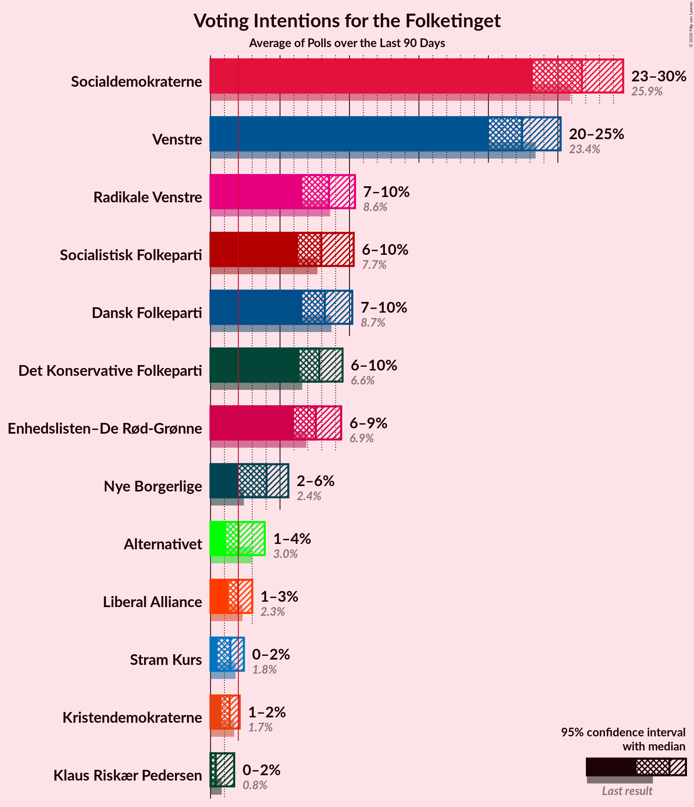

### Confidence Intervals

| Party | Last Result | Median | 80% Confidence Interval | 90% Confidence Interval | 95% Confidence Interval | 99% Confidence Interval |
|:-----:|:-----------:|:------:|:-----------------------:|:-----------------------:|:-----------------------:|:-----------------------:|
| <a href="#socialdemokraterne">Socialdemokraterne</a> | 25.9% | 27.5% | 24.5–31.5% |23.9–32.2% | 23.3–32.7% | 22.4–33.7% |
| <a href="#venstre">Venstre</a> | 23.4% | 12.3% | 9.0–14.0% |8.6–14.3% | 8.3–14.7% | 7.8–15.3% |
| <a href="#dansk-folkeparti">Dansk Folkeparti</a> | 8.7% | 6.7% | 5.8–7.6% |5.5–7.9% | 5.3–8.2% | 4.8–8.6% |
| <a href="#radikale-venstre">Radikale Venstre</a> | 8.6% | 4.9% | 3.9–6.4% |3.7–6.7% | 3.5–7.0% | 3.2–7.5% |
| <a href="#socialistisk-folkeparti">Socialistisk Folkeparti</a> | 7.7% | 8.3% | 6.9–10.1% |6.6–10.6% | 6.3–11.0% | 5.8–11.7% |
| <a href="#enhedslisten–de-rød-grønne">Enhedslisten–De Rød-Grønne</a> | 6.9% | 8.7% | 6.5–10.8% |6.1–11.3% | 5.8–11.7% | 5.4–12.5% |
| <a href="#det-konservative-folkeparti">Det Konservative Folkeparti</a> | 6.6% | 16.1% | 13.9–18.0% |13.5–18.4% | 13.1–18.8% | 12.6–19.6% |
| <a href="#alternativet">Alternativet</a> | 3.0% | 0.9% | 0.5–1.4% |0.4–1.5% | 0.4–1.7% | 0.3–1.9% |
| <a href="#nye-borgerlige">Nye Borgerlige</a> | 2.4% | 8.1% | 5.3–9.7% |5.1–10.1% | 4.9–10.4% | 4.5–11.1% |
| <a href="#liberal-alliance">Liberal Alliance</a> | 2.3% | 2.2% | 1.6–3.0% |1.5–3.2% | 1.4–3.5% | 1.2–3.9% |
| <a href="#stram-kurs">Stram Kurs</a> | 1.8% | N/A | N/A |N/A | N/A | N/A |
| <a href="#kristendemokraterne">Kristendemokraterne</a> | 1.7% | 1.9% | 1.0–2.8% |0.9–3.0% | 0.8–3.2% | 0.6–3.5% |
| <a href="#borgerlisten">Borgerlisten</a> | 0.8% | N/A | N/A |N/A | N/A | N/A |
| <a href="#veganerpartiet">Veganerpartiet</a> | 0.0% | 0.2% | 0.1–0.6% |0.1–0.7% | 0.1–0.8% | 0.0–1.0% |
| <a href="#moderaterne">Moderaterne</a> | 0.0% | 4.0% | 3.1–5.0% |3.0–5.3% | 2.8–5.5% | 2.6–6.0% |

### Socialdemokraterne

*For a full overview of the results for this party, see the [Socialdemokraterne](party-socialdemokraterne.html) page.*

| Voting Intentions | Probability | Accumulated | Special Marks |
|:-----------------:|:-----------:|:-----------:|:-------------:|
| 19.5–20.5% | 0% | 100% |  |
| 20.5–21.5% | 0.1% | 100% |  |
| 21.5–22.5% | 0.6% | 99.9% |  |
| 22.5–23.5% | 3% | 99.3% |  |
| 23.5–24.5% | 7% | 97% |  |
| 24.5–25.5% | 11% | 90% |  |
| 25.5–26.5% | 14% | 79% | Last Result |
| 26.5–27.5% | 16% | 65% | Median |
| 27.5–28.5% | 12% | 49% |  |
| 28.5–29.5% | 8% | 37% |  |
| 29.5–30.5% | 9% | 29% |  |
| 30.5–31.5% | 10% | 20% |  |
| 31.5–32.5% | 7% | 10% |  |
| 32.5–33.5% | 2% | 3% |  |
| 33.5–34.5% | 0.6% | 0.7% |  |
| 34.5–35.5% | 0.1% | 0.1% |  |
| 35.5–36.5% | 0% | 0% |  |

### Venstre

*For a full overview of the results for this party, see the [Venstre](party-venstre.html) page.*

| Voting Intentions | Probability | Accumulated | Special Marks |
|:-----------------:|:-----------:|:-----------:|:-------------:|
| 5.5–6.5% | 0% | 100% |  |
| 6.5–7.5% | 0.2% | 100% |  |
| 7.5–8.5% | 4% | 99.8% |  |
| 8.5–9.5% | 14% | 96% |  |
| 9.5–10.5% | 12% | 82% |  |
| 10.5–11.5% | 8% | 69% |  |
| 11.5–12.5% | 17% | 62% | Median |
| 12.5–13.5% | 26% | 45% |  |
| 13.5–14.5% | 15% | 18% |  |
| 14.5–15.5% | 3% | 3% |  |
| 15.5–16.5% | 0.3% | 0.3% |  |
| 16.5–17.5% | 0% | 0% |  |
| 17.5–18.5% | 0% | 0% |  |
| 18.5–19.5% | 0% | 0% |  |
| 19.5–20.5% | 0% | 0% |  |
| 20.5–21.5% | 0% | 0% |  |
| 21.5–22.5% | 0% | 0% |  |
| 22.5–23.5% | 0% | 0% | Last Result |

### Dansk Folkeparti

*For a full overview of the results for this party, see the [Dansk Folkeparti](party-danskfolkeparti.html) page.*

| Voting Intentions | Probability | Accumulated | Special Marks |
|:-----------------:|:-----------:|:-----------:|:-------------:|
| 2.5–3.5% | 0% | 100% |  |
| 3.5–4.5% | 0.1% | 100% |  |
| 4.5–5.5% | 6% | 99.9% |  |
| 5.5–6.5% | 36% | 94% |  |
| 6.5–7.5% | 45% | 58% | Median |
| 7.5–8.5% | 12% | 13% |  |
| 8.5–9.5% | 0.7% | 0.7% | Last Result |
| 9.5–10.5% | 0% | 0% |  |

### Radikale Venstre

*For a full overview of the results for this party, see the [Radikale Venstre](party-radikalevenstre.html) page.*

| Voting Intentions | Probability | Accumulated | Special Marks |
|:-----------------:|:-----------:|:-----------:|:-------------:|
| 1.5–2.5% | 0% | 100% |  |
| 2.5–3.5% | 3% | 100% |  |
| 3.5–4.5% | 32% | 97% |  |
| 4.5–5.5% | 33% | 65% | Median |
| 5.5–6.5% | 25% | 32% |  |
| 6.5–7.5% | 7% | 8% |  |
| 7.5–8.5% | 0.4% | 0.4% |  |
| 8.5–9.5% | 0% | 0% | Last Result |

### Socialistisk Folkeparti

*For a full overview of the results for this party, see the [Socialistisk Folkeparti](party-socialistiskfolkeparti.html) page.*

| Voting Intentions | Probability | Accumulated | Special Marks |
|:-----------------:|:-----------:|:-----------:|:-------------:|
| 3.5–4.5% | 0% | 100% |  |
| 4.5–5.5% | 0.2% | 100% |  |
| 5.5–6.5% | 5% | 99.8% |  |
| 6.5–7.5% | 20% | 95% |  |
| 7.5–8.5% | 31% | 75% | Last Result, Median |
| 8.5–9.5% | 25% | 44% |  |
| 9.5–10.5% | 13% | 19% |  |
| 10.5–11.5% | 5% | 5% |  |
| 11.5–12.5% | 0.7% | 0.7% |  |
| 12.5–13.5% | 0.1% | 0.1% |  |
| 13.5–14.5% | 0% | 0% |  |

### Enhedslisten–De Rød-Grønne

*For a full overview of the results for this party, see the [Enhedslisten–De Rød-Grønne](party-enhedslisten–derød-grønne.html) page.*

| Voting Intentions | Probability | Accumulated | Special Marks |
|:-----------------:|:-----------:|:-----------:|:-------------:|
| 3.5–4.5% | 0% | 100% |  |
| 4.5–5.5% | 0.9% | 100% |  |
| 5.5–6.5% | 11% | 99.1% |  |
| 6.5–7.5% | 17% | 88% | Last Result |
| 7.5–8.5% | 18% | 71% |  |
| 8.5–9.5% | 23% | 53% | Median |
| 9.5–10.5% | 17% | 30% |  |
| 10.5–11.5% | 10% | 13% |  |
| 11.5–12.5% | 3% | 3% |  |
| 12.5–13.5% | 0.4% | 0.4% |  |
| 13.5–14.5% | 0% | 0% |  |

### Det Konservative Folkeparti

*For a full overview of the results for this party, see the [Det Konservative Folkeparti](party-detkonservativefolkeparti.html) page.*

| Voting Intentions | Probability | Accumulated | Special Marks |
|:-----------------:|:-----------:|:-----------:|:-------------:|
| 6.5–7.5% | 0% | 100% | Last Result |
| 7.5–8.5% | 0% | 100% |  |
| 8.5–9.5% | 0% | 100% |  |
| 9.5–10.5% | 0% | 100% |  |
| 10.5–11.5% | 0% | 100% |  |
| 11.5–12.5% | 0.5% | 100% |  |
| 12.5–13.5% | 5% | 99.5% |  |
| 13.5–14.5% | 16% | 94% |  |
| 14.5–15.5% | 18% | 79% |  |
| 15.5–16.5% | 21% | 60% | Median |
| 16.5–17.5% | 22% | 39% |  |
| 17.5–18.5% | 13% | 17% |  |
| 18.5–19.5% | 4% | 4% |  |
| 19.5–20.5% | 0.5% | 0.6% |  |
| 20.5–21.5% | 0% | 0% |  |
| 21.5–22.5% | 0% | 0% |  |

### Alternativet

*For a full overview of the results for this party, see the [Alternativet](party-alternativet.html) page.*

| Voting Intentions | Probability | Accumulated | Special Marks |
|:-----------------:|:-----------:|:-----------:|:-------------:|
| 0.0–0.5% | 12% | 100% |  |
| 0.5–1.5% | 83% | 88% | Median |
| 1.5–2.5% | 4% | 4% |  |
| 2.5–3.5% | 0% | 0% | Last Result |

### Nye Borgerlige

*For a full overview of the results for this party, see the [Nye Borgerlige](party-nyeborgerlige.html) page.*

| Voting Intentions | Probability | Accumulated | Special Marks |
|:-----------------:|:-----------:|:-----------:|:-------------:|
| 1.5–2.5% | 0% | 100% | Last Result |
| 2.5–3.5% | 0% | 100% |  |
| 3.5–4.5% | 0.7% | 100% |  |
| 4.5–5.5% | 14% | 99.3% |  |
| 5.5–6.5% | 17% | 85% |  |
| 6.5–7.5% | 7% | 68% |  |
| 7.5–8.5% | 24% | 61% | Median |
| 8.5–9.5% | 26% | 38% |  |
| 9.5–10.5% | 10% | 12% |  |
| 10.5–11.5% | 2% | 2% |  |
| 11.5–12.5% | 0.1% | 0.1% |  |
| 12.5–13.5% | 0% | 0% |  |

### Liberal Alliance

*For a full overview of the results for this party, see the [Liberal Alliance](party-liberalalliance.html) page.*

| Voting Intentions | Probability | Accumulated | Special Marks |
|:-----------------:|:-----------:|:-----------:|:-------------:|
| 0.0–0.5% | 0% | 100% |  |
| 0.5–1.5% | 6% | 100% |  |
| 1.5–2.5% | 68% | 94% | Last Result, Median |
| 2.5–3.5% | 24% | 25% |  |
| 3.5–4.5% | 2% | 2% |  |
| 4.5–5.5% | 0% | 0% |  |

### Kristendemokraterne

*For a full overview of the results for this party, see the [Kristendemokraterne](party-kristendemokraterne.html) page.*

| Voting Intentions | Probability | Accumulated | Special Marks |
|:-----------------:|:-----------:|:-----------:|:-------------:|
| 0.0–0.5% | 0.2% | 100% |  |
| 0.5–1.5% | 37% | 99.8% |  |
| 1.5–2.5% | 43% | 63% | Last Result, Median |
| 2.5–3.5% | 19% | 20% |  |
| 3.5–4.5% | 0.4% | 0.4% |  |
| 4.5–5.5% | 0% | 0% |  |

### Veganerpartiet

*For a full overview of the results for this party, see the [Veganerpartiet](party-veganerpartiet.html) page.*

| Voting Intentions | Probability | Accumulated | Special Marks |
|:-----------------:|:-----------:|:-----------:|:-------------:|
| 0.0–0.5% | 90% | 100% | Last Result, Median |
| 0.5–1.5% | 10% | 10% |  |
| 1.5–2.5% | 0% | 0% |  |

### Moderaterne

*For a full overview of the results for this party, see the [Moderaterne](party-moderaterne.html) page.*

| Voting Intentions | Probability | Accumulated | Special Marks |
|:-----------------:|:-----------:|:-----------:|:-------------:|
| 0.0–0.5% | 0% | 100% | Last Result |
| 0.5–1.5% | 0% | 100% |  |
| 1.5–2.5% | 0.4% | 100% |  |
| 2.5–3.5% | 28% | 99.6% |  |
| 3.5–4.5% | 47% | 72% | Median |
| 4.5–5.5% | 22% | 25% |  |
| 5.5–6.5% | 2% | 2% |  |
| 6.5–7.5% | 0.1% | 0.1% |  |
| 7.5–8.5% | 0% | 0% |  |

## Seats

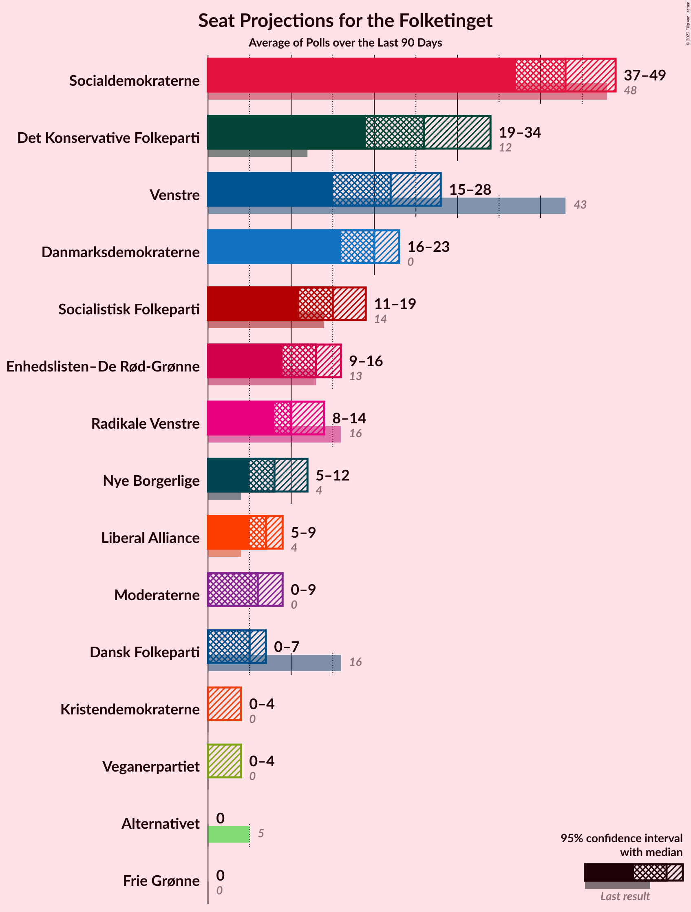

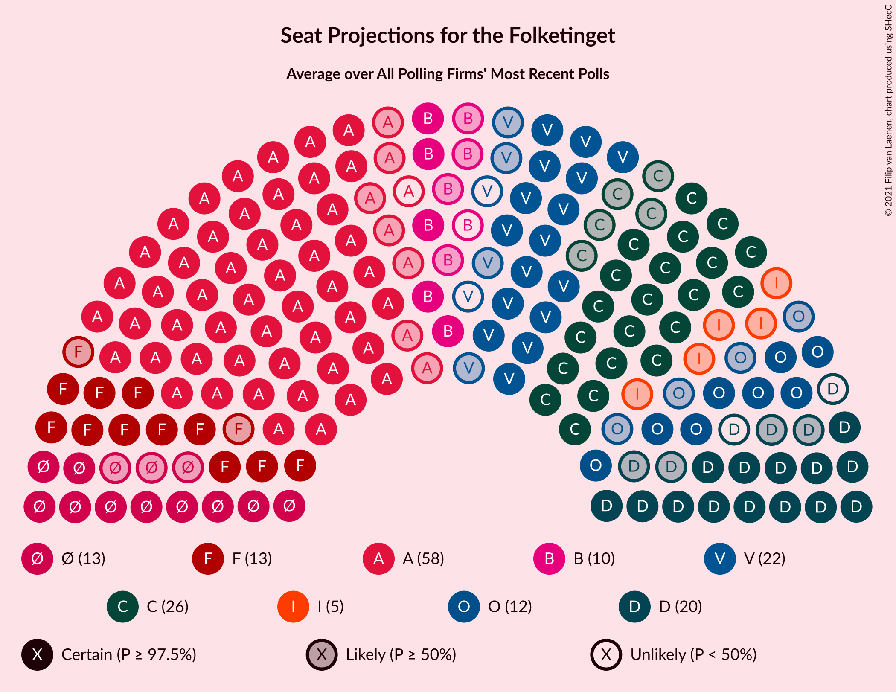

### Confidence Intervals

| Party | Last Result | Median | 80% Confidence Interval | 90% Confidence Interval | 95% Confidence Interval | 99% Confidence Interval |
|:-----:|:-----------:|:------:|:-----------------------:|:-----------------------:|:-----------------------:|:-----------------------:|
| <a href="#socialdemokraterne">Socialdemokraterne</a> | 48 | 50 | 45–56 |43–58 | 41–61 | 41–61 |
| <a href="#venstre">Venstre</a> | 43 | 22 | 16–25 |16–25 | 15–27 | 14–28 |
| <a href="#dansk-folkeparti">Dansk Folkeparti</a> | 16 | 12 | 9–14 |9–14 | 9–15 | 9–16 |
| <a href="#radikale-venstre">Radikale Venstre</a> | 16 | 9 | 7–12 |7–13 | 6–13 | 6–13 |
| <a href="#socialistisk-folkeparti">Socialistisk Folkeparti</a> | 14 | 15 | 12–18 |12–19 | 12–19 | 11–21 |
| <a href="#enhedslisten–de-rød-grønne">Enhedslisten–De Rød-Grønne</a> | 13 | 16 | 11–20 |11–22 | 10–22 | 10–23 |
| <a href="#det-konservative-folkeparti">Det Konservative Folkeparti</a> | 12 | 29 | 24–34 |23–34 | 23–34 | 22–35 |
| <a href="#alternativet">Alternativet</a> | 5 | 0 | 0 |0 | 0 | 0 |
| <a href="#nye-borgerlige">Nye Borgerlige</a> | 4 | 15 | 9–17 |9–18 | 9–19 | 8–20 |
| <a href="#liberal-alliance">Liberal Alliance</a> | 4 | 4 | 0–5 |0–5 | 0–6 | 0–7 |
| <a href="#stram-kurs">Stram Kurs</a> | 0 | N/A | N/A |N/A | N/A | N/A |
| <a href="#kristendemokraterne">Kristendemokraterne</a> | 0 | 0 | 0–5 |0–6 | 0–6 | 0–6 |
| <a href="#borgerlisten">Borgerlisten</a> | 0 | N/A | N/A |N/A | N/A | N/A |
| <a href="#veganerpartiet">Veganerpartiet</a> | 0 | 0 | 0 |0 | 0 | 0 |
| <a href="#moderaterne">Moderaterne</a> | 0 | 7 | 5–10 |4–10 | 4–11 | 4–11 |

### Socialdemokraterne

*For a full overview of the results for this party, see the [Socialdemokraterne](party-socialdemokraterne.html) page.*

| Number of Seats | Probability | Accumulated | Special Marks |
|:---------------:|:-----------:|:-----------:|:-------------:|
| 39 | 0.1% | 100% |  |
| 40 | 0.3% | 99.8% |  |
| 41 | 2% | 99.6% |  |
| 42 | 2% | 97% |  |
| 43 | 2% | 96% |  |
| 44 | 3% | 94% |  |
| 45 | 4% | 92% |  |
| 46 | 4% | 87% |  |
| 47 | 21% | 84% |  |
| 48 | 6% | 63% | Last Result |
| 49 | 6% | 56% |  |
| 50 | 9% | 51% | Median |
| 51 | 5% | 41% |  |
| 52 | 2% | 36% |  |
| 53 | 5% | 35% |  |
| 54 | 8% | 30% |  |
| 55 | 7% | 22% |  |
| 56 | 7% | 15% |  |
| 57 | 2% | 8% |  |
| 58 | 1.0% | 6% |  |
| 59 | 0.5% | 5% |  |
| 60 | 1.3% | 4% |  |
| 61 | 3% | 3% |  |
| 62 | 0.4% | 0.5% |  |
| 63 | 0% | 0% |  |

### Venstre

*For a full overview of the results for this party, see the [Venstre](party-venstre.html) page.*

| Number of Seats | Probability | Accumulated | Special Marks |
|:---------------:|:-----------:|:-----------:|:-------------:|
| 13 | 0.1% | 100% |  |
| 14 | 0.9% | 99.9% |  |
| 15 | 2% | 99.0% |  |
| 16 | 12% | 97% |  |
| 17 | 7% | 85% |  |
| 18 | 7% | 78% |  |
| 19 | 3% | 70% |  |
| 20 | 3% | 67% |  |
| 21 | 6% | 64% |  |
| 22 | 9% | 58% | Median |
| 23 | 27% | 49% |  |
| 24 | 8% | 22% |  |
| 25 | 9% | 14% |  |
| 26 | 1.4% | 4% |  |
| 27 | 2% | 3% |  |
| 28 | 0.3% | 0.7% |  |
| 29 | 0.4% | 0.4% |  |
| 30 | 0% | 0% |  |
| 31 | 0% | 0% |  |
| 32 | 0% | 0% |  |
| 33 | 0% | 0% |  |
| 34 | 0% | 0% |  |
| 35 | 0% | 0% |  |
| 36 | 0% | 0% |  |
| 37 | 0% | 0% |  |
| 38 | 0% | 0% |  |
| 39 | 0% | 0% |  |
| 40 | 0% | 0% |  |
| 41 | 0% | 0% |  |
| 42 | 0% | 0% |  |
| 43 | 0% | 0% | Last Result |

### Dansk Folkeparti

*For a full overview of the results for this party, see the [Dansk Folkeparti](party-danskfolkeparti.html) page.*

| Number of Seats | Probability | Accumulated | Special Marks |
|:---------------:|:-----------:|:-----------:|:-------------:|
| 8 | 0.3% | 100% |  |
| 9 | 11% | 99.6% |  |
| 10 | 13% | 88% |  |
| 11 | 19% | 75% |  |
| 12 | 22% | 56% | Median |
| 13 | 11% | 34% |  |
| 14 | 20% | 23% |  |
| 15 | 3% | 3% |  |
| 16 | 0.4% | 0.5% | Last Result |
| 17 | 0.1% | 0.1% |  |
| 18 | 0% | 0% |  |

### Radikale Venstre

*For a full overview of the results for this party, see the [Radikale Venstre](party-radikalevenstre.html) page.*

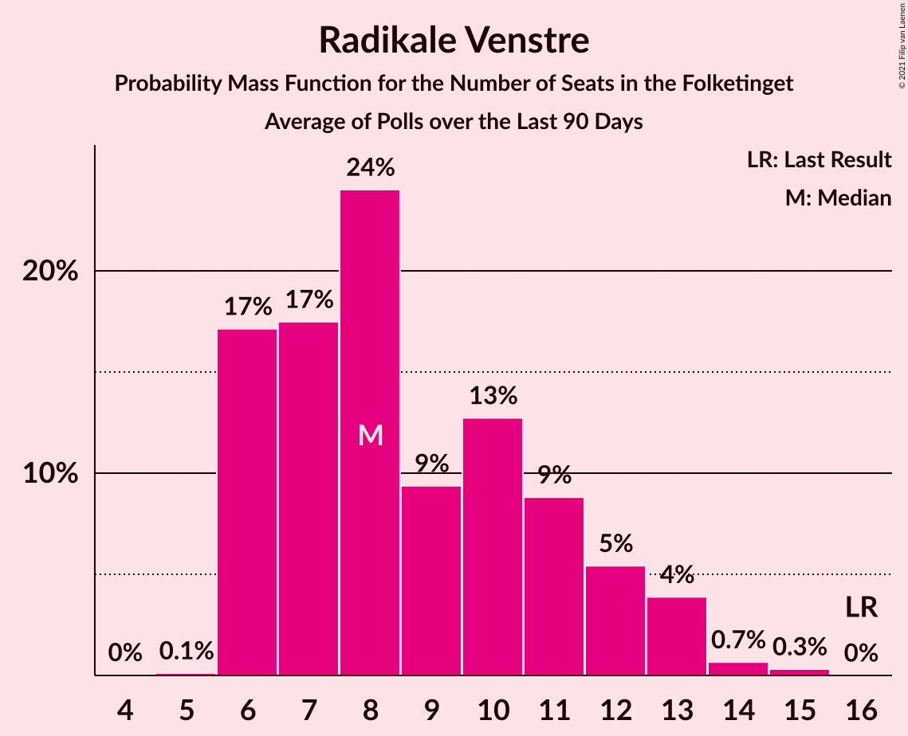

| Number of Seats | Probability | Accumulated | Special Marks |
|:---------------:|:-----------:|:-----------:|:-------------:|
| 5 | 0.3% | 100% |  |
| 6 | 3% | 99.7% |  |
| 7 | 17% | 96% |  |
| 8 | 25% | 80% |  |
| 9 | 18% | 54% | Median |
| 10 | 11% | 36% |  |
| 11 | 7% | 25% |  |
| 12 | 9% | 18% |  |
| 13 | 9% | 9% |  |
| 14 | 0.3% | 0.3% |  |
| 15 | 0% | 0% |  |
| 16 | 0% | 0% | Last Result |

### Socialistisk Folkeparti

*For a full overview of the results for this party, see the [Socialistisk Folkeparti](party-socialistiskfolkeparti.html) page.*

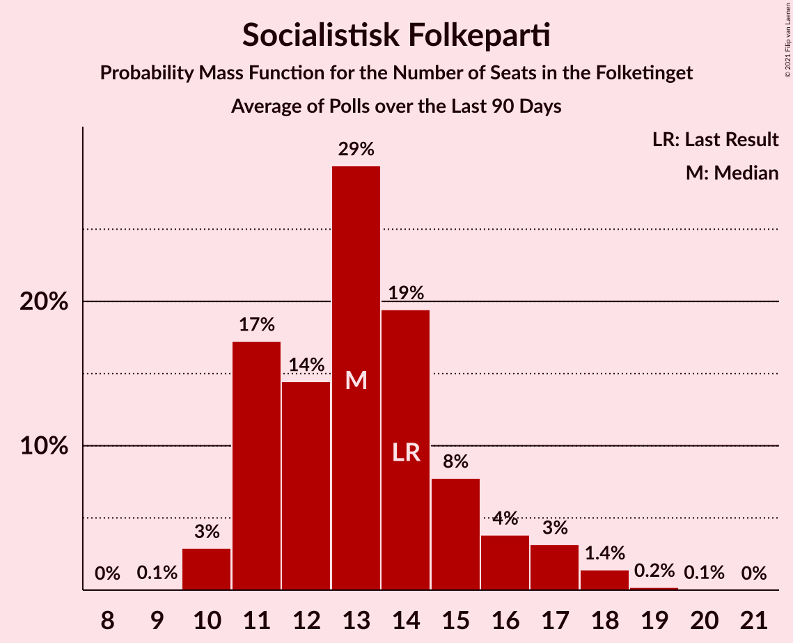

| Number of Seats | Probability | Accumulated | Special Marks |
|:---------------:|:-----------:|:-----------:|:-------------:|
| 10 | 0.3% | 100% |  |
| 11 | 1.4% | 99.6% |  |
| 12 | 11% | 98% |  |
| 13 | 14% | 87% |  |
| 14 | 18% | 73% | Last Result |
| 15 | 16% | 55% | Median |
| 16 | 20% | 39% |  |
| 17 | 3% | 19% |  |
| 18 | 10% | 16% |  |
| 19 | 4% | 6% |  |
| 20 | 0.9% | 2% |  |
| 21 | 1.0% | 1.2% |  |
| 22 | 0.2% | 0.2% |  |
| 23 | 0% | 0.1% |  |
| 24 | 0% | 0% |  |

### Enhedslisten–De Rød-Grønne

*For a full overview of the results for this party, see the [Enhedslisten–De Rød-Grønne](party-enhedslisten–derød-grønne.html) page.*

| Number of Seats | Probability | Accumulated | Special Marks |
|:---------------:|:-----------:|:-----------:|:-------------:|
| 9 | 0.1% | 100% |  |
| 10 | 3% | 99.9% |  |
| 11 | 11% | 97% |  |
| 12 | 11% | 86% |  |
| 13 | 3% | 75% | Last Result |
| 14 | 5% | 72% |  |
| 15 | 16% | 67% |  |
| 16 | 11% | 51% | Median |
| 17 | 3% | 39% |  |
| 18 | 15% | 36% |  |
| 19 | 8% | 21% |  |
| 20 | 4% | 12% |  |
| 21 | 4% | 9% |  |
| 22 | 5% | 5% |  |
| 23 | 0.2% | 0.5% |  |
| 24 | 0.2% | 0.3% |  |
| 25 | 0.1% | 0.1% |  |
| 26 | 0% | 0% |  |

### Det Konservative Folkeparti

*For a full overview of the results for this party, see the [Det Konservative Folkeparti](party-detkonservativefolkeparti.html) page.*

| Number of Seats | Probability | Accumulated | Special Marks |
|:---------------:|:-----------:|:-----------:|:-------------:|
| 12 | 0% | 100% | Last Result |
| 13 | 0% | 100% |  |
| 14 | 0% | 100% |  |
| 15 | 0% | 100% |  |
| 16 | 0% | 100% |  |
| 17 | 0% | 100% |  |
| 18 | 0% | 100% |  |
| 19 | 0% | 100% |  |
| 20 | 0% | 100% |  |
| 21 | 0.1% | 100% |  |
| 22 | 1.2% | 99.9% |  |
| 23 | 7% | 98.7% |  |
| 24 | 6% | 92% |  |
| 25 | 11% | 86% |  |
| 26 | 7% | 75% |  |
| 27 | 6% | 68% |  |
| 28 | 4% | 62% |  |
| 29 | 15% | 58% | Median |
| 30 | 9% | 43% |  |
| 31 | 15% | 34% |  |
| 32 | 6% | 19% |  |
| 33 | 3% | 13% |  |
| 34 | 10% | 11% |  |
| 35 | 0.3% | 0.5% |  |
| 36 | 0.1% | 0.2% |  |
| 37 | 0.1% | 0.1% |  |
| 38 | 0% | 0% |  |

### Alternativet

*For a full overview of the results for this party, see the [Alternativet](party-alternativet.html) page.*

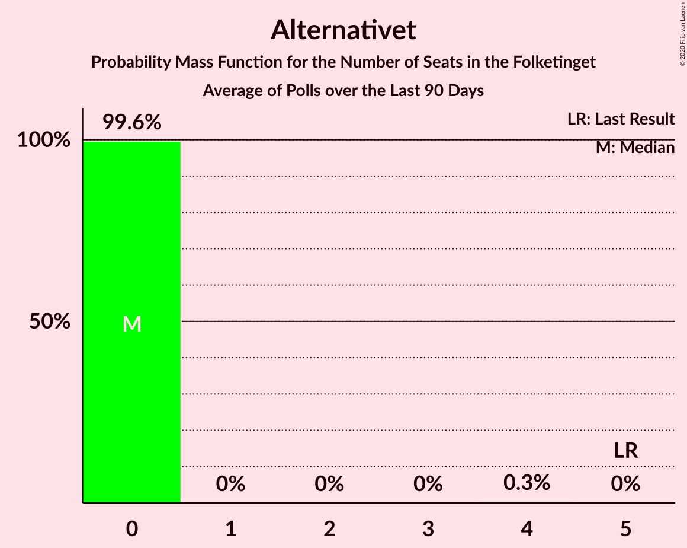

| Number of Seats | Probability | Accumulated | Special Marks |
|:---------------:|:-----------:|:-----------:|:-------------:|
| 0 | 99.7% | 100% | Median |
| 1 | 0% | 0.3% |  |
| 2 | 0% | 0.3% |  |
| 3 | 0% | 0.3% |  |
| 4 | 0.2% | 0.2% |  |
| 5 | 0% | 0% | Last Result |

### Nye Borgerlige

*For a full overview of the results for this party, see the [Nye Borgerlige](party-nyeborgerlige.html) page.*

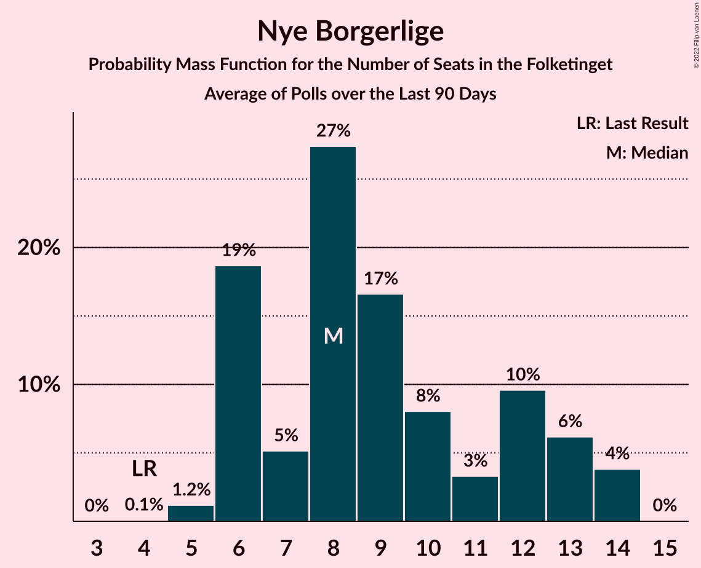

| Number of Seats | Probability | Accumulated | Special Marks |
|:---------------:|:-----------:|:-----------:|:-------------:|
| 4 | 0% | 100% | Last Result |
| 5 | 0% | 100% |  |
| 6 | 0% | 100% |  |
| 7 | 0.1% | 100% |  |
| 8 | 1.5% | 99.9% |  |
| 9 | 9% | 98% |  |
| 10 | 11% | 90% |  |
| 11 | 10% | 78% |  |
| 12 | 3% | 68% |  |
| 13 | 8% | 65% |  |
| 14 | 5% | 57% |  |
| 15 | 9% | 52% | Median |
| 16 | 16% | 43% |  |
| 17 | 20% | 28% |  |
| 18 | 4% | 7% |  |
| 19 | 3% | 3% |  |
| 20 | 0.3% | 0.6% |  |
| 21 | 0.2% | 0.3% |  |
| 22 | 0% | 0% |  |

### Liberal Alliance

*For a full overview of the results for this party, see the [Liberal Alliance](party-liberalalliance.html) page.*

| Number of Seats | Probability | Accumulated | Special Marks |
|:---------------:|:-----------:|:-----------:|:-------------:|
| 0 | 36% | 100% |  |
| 1 | 0% | 64% |  |
| 2 | 0% | 64% |  |
| 3 | 0% | 64% |  |
| 4 | 44% | 64% | Last Result, Median |
| 5 | 15% | 20% |  |
| 6 | 4% | 5% |  |
| 7 | 0.7% | 0.8% |  |
| 8 | 0.1% | 0.1% |  |
| 9 | 0% | 0% |  |

### Stram Kurs

*For a full overview of the results for this party, see the [Stram Kurs](party-stramkurs.html) page.*

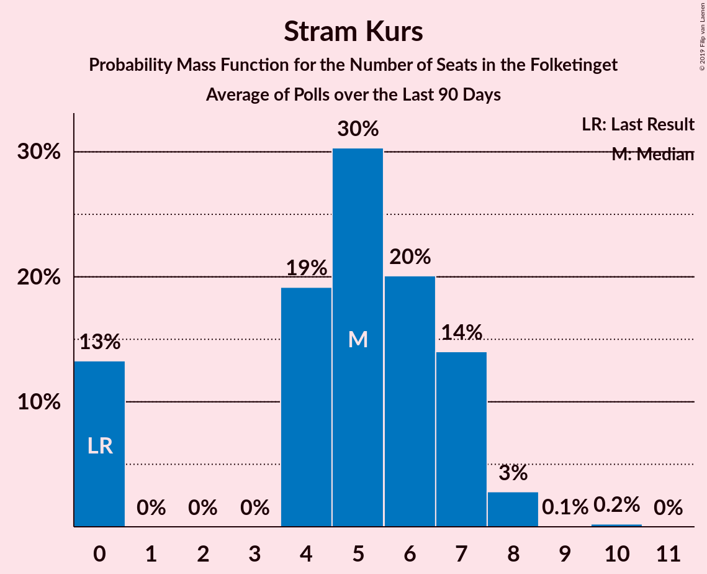

### Kristendemokraterne

*For a full overview of the results for this party, see the [Kristendemokraterne](party-kristendemokraterne.html) page.*

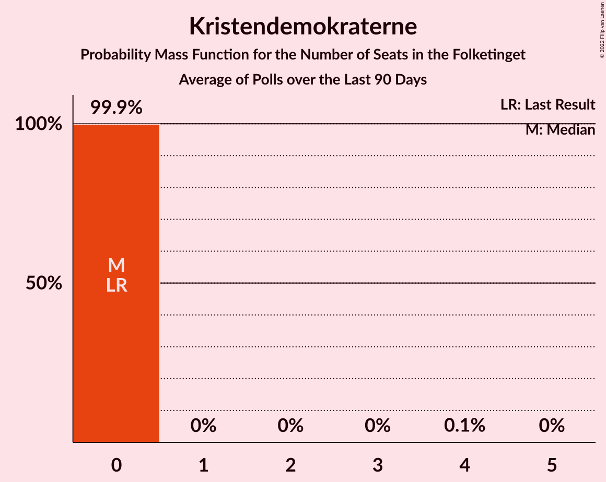

| Number of Seats | Probability | Accumulated | Special Marks |
|:---------------:|:-----------:|:-----------:|:-------------:|
| 0 | 61% | 100% | Last Result, Median |
| 1 | 0% | 39% |  |
| 2 | 0% | 39% |  |
| 3 | 0.2% | 39% |  |
| 4 | 16% | 39% |  |
| 5 | 15% | 22% |  |
| 6 | 7% | 7% |  |
| 7 | 0.2% | 0.2% |  |
| 8 | 0% | 0% |  |

### Borgerlisten

*For a full overview of the results for this party, see the [Borgerlisten](party-borgerlisten.html) page.*

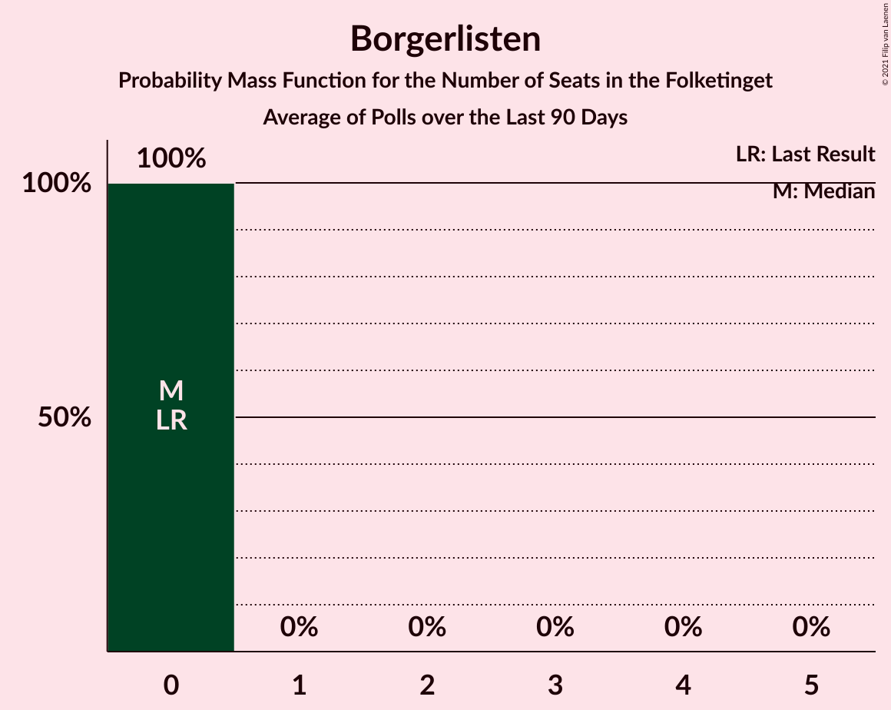

### Veganerpartiet

*For a full overview of the results for this party, see the [Veganerpartiet](party-veganerpartiet.html) page.*

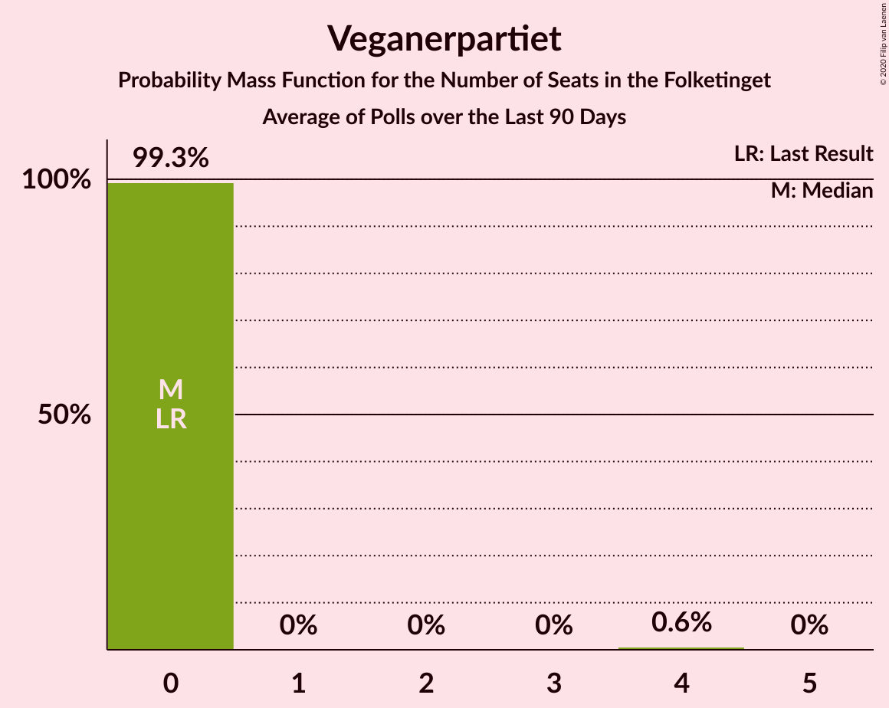

| Number of Seats | Probability | Accumulated | Special Marks |
|:---------------:|:-----------:|:-----------:|:-------------:|
| 0 | 100% | 100% | Last Result, Median |

### Moderaterne

*For a full overview of the results for this party, see the [Moderaterne](party-moderaterne.html) page.*

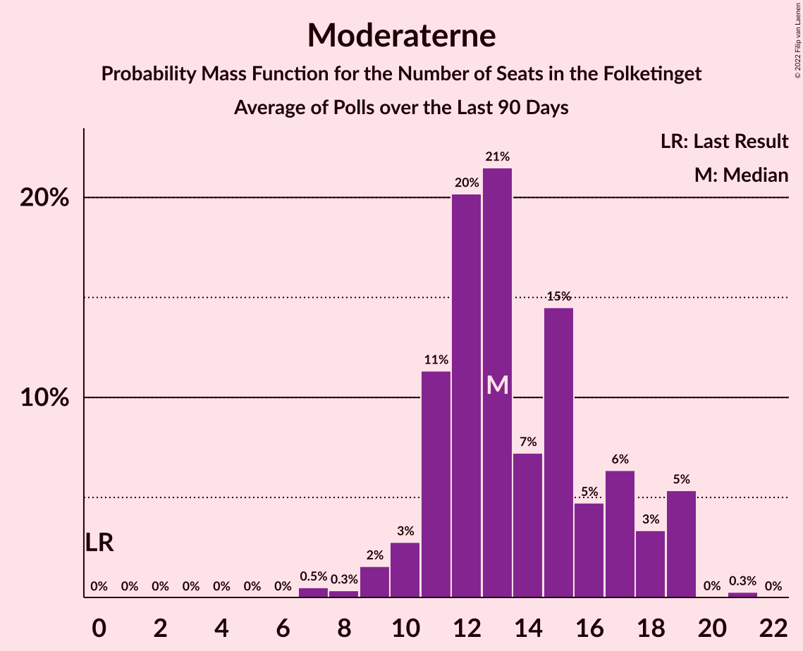

| Number of Seats | Probability | Accumulated | Special Marks |
|:---------------:|:-----------:|:-----------:|:-------------:|
| 0 | 0% | 100% | Last Result |
| 1 | 0% | 100% |  |
| 2 | 0% | 100% |  |
| 3 | 0% | 100% |  |
| 4 | 9% | 100% |  |
| 5 | 4% | 91% |  |
| 6 | 20% | 86% |  |
| 7 | 29% | 66% | Median |
| 8 | 16% | 38% |  |
| 9 | 7% | 21% |  |
| 10 | 11% | 15% |  |
| 11 | 3% | 3% |  |
| 12 | 0.2% | 0.2% |  |
| 13 | 0% | 0% |  |

## Coalitions

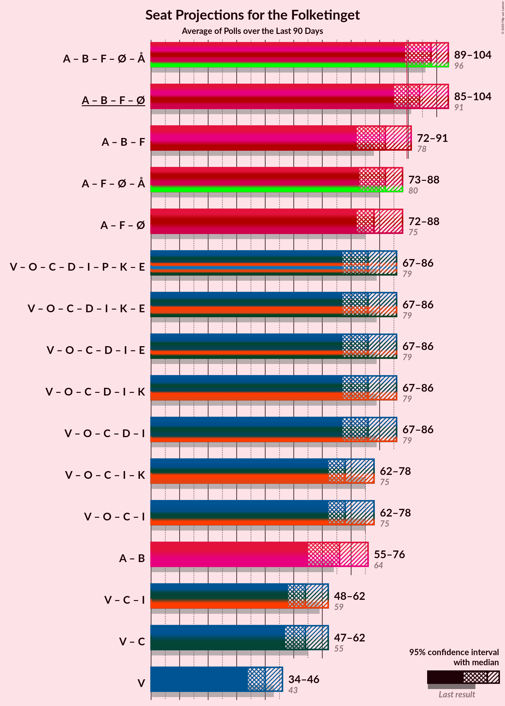

### Confidence Intervals

| Coalition | Last Result | Median | Majority? | 80% Confidence Interval | 90% Confidence Interval | 95% Confidence Interval | 99% Confidence Interval |
|:---------:|:-----------:|:------:|:---------:|:-----------------------:|:-----------------------:|:-----------------------:|:-----------------------:|
| Socialdemokraterne – Radikale Venstre – Socialistisk Folkeparti – Enhedslisten–De Rød-Grønne – Alternativet | 96 | 91 | 55% | 87–94 | 85–94 | 84–96 | 81–96 |
| Socialdemokraterne – Radikale Venstre – Socialistisk Folkeparti – Enhedslisten–De Rød-Grønne | 91 | 91 | 55% | 87–94 | 85–94 | 84–96 | 81–96 |
| Venstre – Dansk Folkeparti – Det Konservative Folkeparti – Nye Borgerlige – Liberal Alliance – Kristendemokraterne – Borgerlisten – Moderaterne | 79 | 84 | 6% | 81–88 | 81–90 | 79–91 | 79–94 |
| Venstre – Dansk Folkeparti – Det Konservative Folkeparti – Nye Borgerlige – Liberal Alliance – Stram Kurs – Kristendemokraterne – Borgerlisten | 79 | 79 | 3% | 75–87 | 74–87 | 73–90 | 71–94 |
| Venstre – Dansk Folkeparti – Det Konservative Folkeparti – Nye Borgerlige – Liberal Alliance – Kristendemokraterne – Borgerlisten | 79 | 79 | 3% | 75–87 | 74–87 | 73–90 | 71–94 |
| Venstre – Dansk Folkeparti – Det Konservative Folkeparti – Nye Borgerlige – Liberal Alliance – Kristendemokraterne | 79 | 79 | 3% | 75–87 | 74–87 | 73–90 | 71–94 |
| Venstre – Dansk Folkeparti – Det Konservative Folkeparti – Nye Borgerlige – Liberal Alliance – Borgerlisten | 79 | 77 | 2% | 71–87 | 71–87 | 70–89 | 68–91 |
| Venstre – Dansk Folkeparti – Det Konservative Folkeparti – Nye Borgerlige – Liberal Alliance | 79 | 77 | 2% | 71–87 | 71–87 | 70–89 | 68–91 |
| Socialdemokraterne – Socialistisk Folkeparti – Enhedslisten–De Rød-Grønne – Alternativet | 80 | 80 | 0% | 78–85 | 76–86 | 76–86 | 74–87 |
| Socialdemokraterne – Socialistisk Folkeparti – Enhedslisten–De Rød-Grønne | 75 | 80 | 0% | 78–85 | 76–86 | 76–86 | 74–87 |
| Socialdemokraterne – Radikale Venstre – Socialistisk Folkeparti | 78 | 75 | 0% | 70–78 | 68–80 | 67–80 | 65–84 |
| Venstre – Dansk Folkeparti – Det Konservative Folkeparti – Liberal Alliance – Kristendemokraterne | 75 | 66 | 0% | 60–70 | 60–73 | 59–74 | 55–77 |
| Venstre – Dansk Folkeparti – Det Konservative Folkeparti – Liberal Alliance | 75 | 64 | 0% | 60–70 | 59–70 | 59–73 | 55–75 |
| Socialdemokraterne – Radikale Venstre | 64 | 60 | 0% | 54–65 | 52–67 | 49–68 | 48–69 |
| Venstre – Det Konservative Folkeparti – Liberal Alliance | 59 | 52 | 0% | 47–60 | 46–60 | 46–61 | 44–62 |
| Venstre – Det Konservative Folkeparti | 55 | 49 | 0% | 45–54 | 45–56 | 44–56 | 43–57 |
| Venstre | 43 | 22 | 0% | 16–25 | 16–25 | 15–27 | 14–28 |

### Socialdemokraterne – Radikale Venstre – Socialistisk Folkeparti – Enhedslisten–De Rød-Grønne – Alternativet

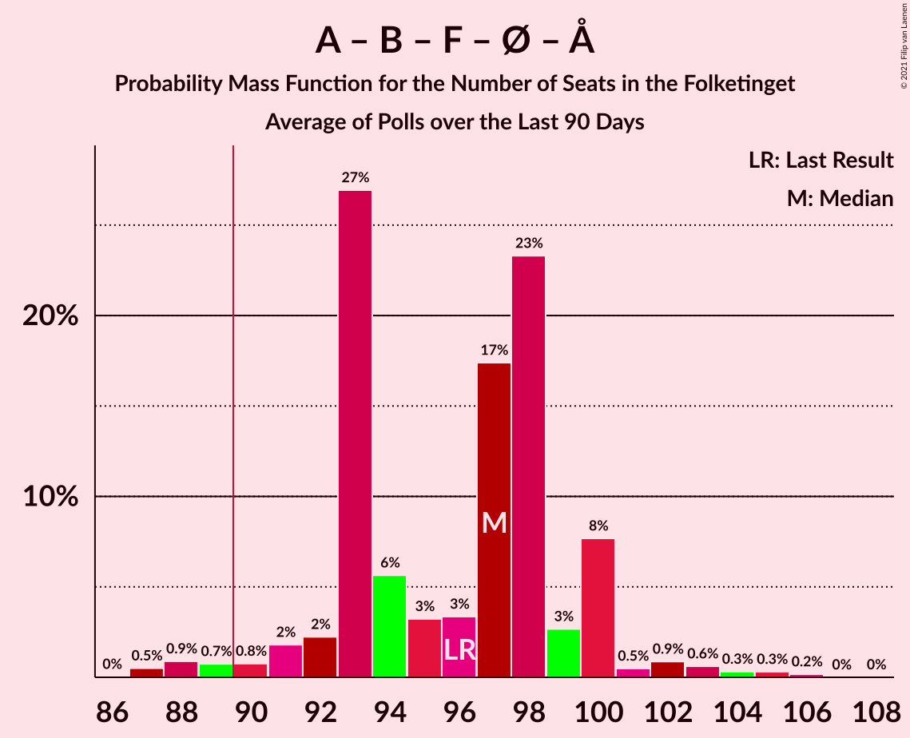

| Number of Seats | Probability | Accumulated | Special Marks |
|:---------------:|:-----------:|:-----------:|:-------------:|
| 79 | 0.1% | 100% |  |
| 80 | 0% | 99.9% |  |
| 81 | 0.5% | 99.8% |  |
| 82 | 0.3% | 99.4% |  |
| 83 | 0.8% | 99.1% |  |
| 84 | 3% | 98% |  |
| 85 | 0.9% | 95% |  |
| 86 | 3% | 94% |  |
| 87 | 6% | 92% |  |
| 88 | 27% | 86% |  |
| 89 | 4% | 59% |  |
| 90 | 4% | 55% | Median, Majority |
| 91 | 8% | 51% |  |
| 92 | 24% | 44% |  |
| 93 | 6% | 19% |  |
| 94 | 9% | 13% |  |
| 95 | 0.9% | 4% |  |
| 96 | 3% | 3% | Last Result |
| 97 | 0.1% | 0.3% |  |
| 98 | 0.1% | 0.1% |  |
| 99 | 0% | 0% |  |

### Socialdemokraterne – Radikale Venstre – Socialistisk Folkeparti – Enhedslisten–De Rød-Grønne

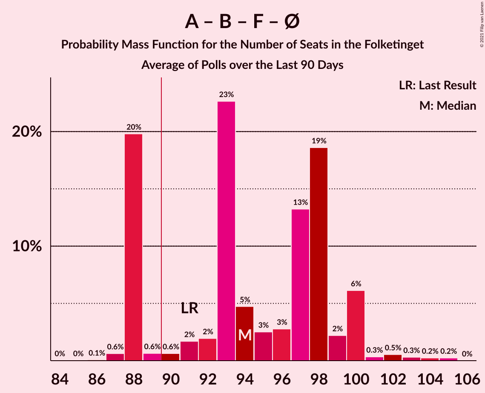

| Number of Seats | Probability | Accumulated | Special Marks |
|:---------------:|:-----------:|:-----------:|:-------------:|
| 79 | 0.1% | 100% |  |
| 80 | 0% | 99.9% |  |
| 81 | 0.5% | 99.8% |  |
| 82 | 0.3% | 99.4% |  |
| 83 | 0.9% | 99.1% |  |
| 84 | 3% | 98% |  |
| 85 | 0.9% | 95% |  |
| 86 | 3% | 94% |  |
| 87 | 6% | 92% |  |
| 88 | 27% | 85% |  |
| 89 | 4% | 59% |  |
| 90 | 4% | 55% | Median, Majority |
| 91 | 8% | 51% | Last Result |
| 92 | 24% | 44% |  |
| 93 | 6% | 19% |  |
| 94 | 9% | 13% |  |
| 95 | 0.9% | 4% |  |
| 96 | 3% | 3% |  |
| 97 | 0.1% | 0.3% |  |
| 98 | 0.1% | 0.1% |  |
| 99 | 0% | 0% |  |

### Venstre – Dansk Folkeparti – Det Konservative Folkeparti – Nye Borgerlige – Liberal Alliance – Kristendemokraterne – Borgerlisten – Moderaterne

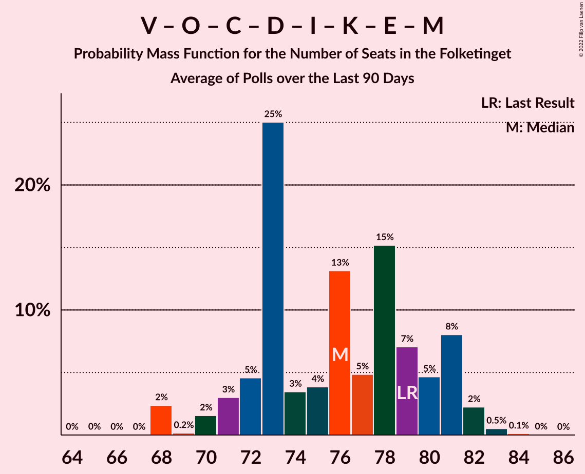

| Number of Seats | Probability | Accumulated | Special Marks |
|:---------------:|:-----------:|:-----------:|:-------------:|
| 77 | 0.1% | 100% |  |
| 78 | 0.1% | 99.9% |  |
| 79 | 3% | 99.7% | Last Result |
| 80 | 0.9% | 97% |  |
| 81 | 9% | 96% |  |
| 82 | 6% | 87% |  |
| 83 | 24% | 81% |  |
| 84 | 8% | 56% |  |
| 85 | 4% | 49% |  |
| 86 | 4% | 45% |  |
| 87 | 27% | 41% |  |
| 88 | 6% | 14% |  |
| 89 | 3% | 8% | Median |
| 90 | 0.9% | 6% | Majority |
| 91 | 3% | 5% |  |
| 92 | 0.8% | 2% |  |
| 93 | 0.3% | 0.9% |  |
| 94 | 0.5% | 0.6% |  |
| 95 | 0% | 0.2% |  |
| 96 | 0.1% | 0.1% |  |
| 97 | 0% | 0% |  |

### Venstre – Dansk Folkeparti – Det Konservative Folkeparti – Nye Borgerlige – Liberal Alliance – Stram Kurs – Kristendemokraterne – Borgerlisten

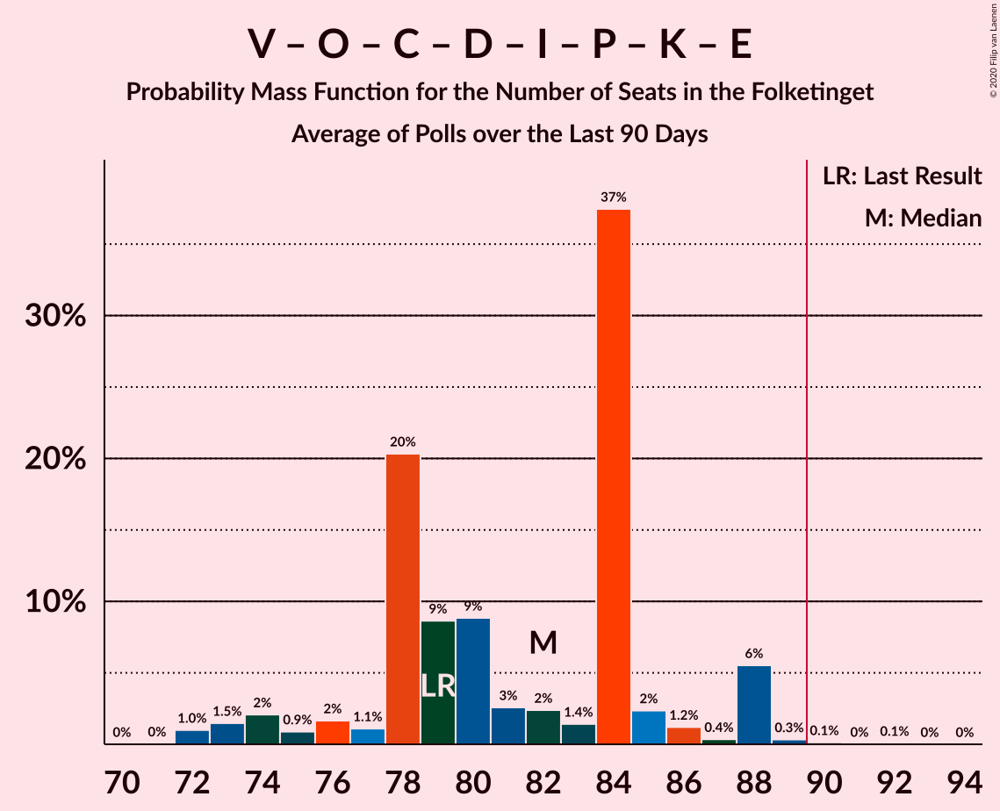

| Number of Seats | Probability | Accumulated | Special Marks |
|:---------------:|:-----------:|:-----------:|:-------------:|
| 70 | 0.3% | 100% |  |
| 71 | 0.6% | 99.7% |  |
| 72 | 0.9% | 99.1% |  |
| 73 | 3% | 98% |  |
| 74 | 2% | 95% |  |
| 75 | 4% | 93% |  |
| 76 | 9% | 89% |  |
| 77 | 17% | 81% |  |
| 78 | 3% | 64% |  |
| 79 | 13% | 61% | Last Result |
| 80 | 6% | 47% |  |
| 81 | 11% | 41% |  |
| 82 | 2% | 30% | Median |
| 83 | 9% | 28% |  |
| 84 | 3% | 20% |  |
| 85 | 2% | 17% |  |
| 86 | 2% | 15% |  |
| 87 | 9% | 13% |  |
| 88 | 1.2% | 5% |  |
| 89 | 0.9% | 3% |  |
| 90 | 0.1% | 3% | Majority |
| 91 | 2% | 2% |  |
| 92 | 0.1% | 0.8% |  |
| 93 | 0.2% | 0.8% |  |
| 94 | 0.4% | 0.6% |  |
| 95 | 0% | 0.1% |  |
| 96 | 0.1% | 0.1% |  |
| 97 | 0% | 0% |  |

### Venstre – Dansk Folkeparti – Det Konservative Folkeparti – Nye Borgerlige – Liberal Alliance – Kristendemokraterne – Borgerlisten

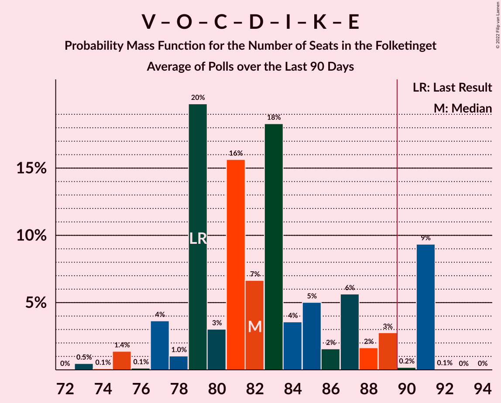

| Number of Seats | Probability | Accumulated | Special Marks |
|:---------------:|:-----------:|:-----------:|:-------------:|
| 70 | 0.3% | 100% |  |
| 71 | 0.6% | 99.7% |  |
| 72 | 0.9% | 99.1% |  |
| 73 | 3% | 98% |  |
| 74 | 2% | 95% |  |
| 75 | 4% | 93% |  |
| 76 | 9% | 89% |  |
| 77 | 17% | 81% |  |
| 78 | 3% | 64% |  |
| 79 | 13% | 61% | Last Result |
| 80 | 6% | 47% |  |
| 81 | 11% | 41% |  |
| 82 | 2% | 30% | Median |
| 83 | 9% | 28% |  |
| 84 | 3% | 20% |  |
| 85 | 2% | 17% |  |
| 86 | 2% | 15% |  |
| 87 | 9% | 13% |  |
| 88 | 1.2% | 5% |  |
| 89 | 0.9% | 3% |  |
| 90 | 0.1% | 3% | Majority |
| 91 | 2% | 2% |  |
| 92 | 0.1% | 0.8% |  |
| 93 | 0.2% | 0.8% |  |
| 94 | 0.4% | 0.6% |  |
| 95 | 0% | 0.1% |  |
| 96 | 0.1% | 0.1% |  |
| 97 | 0% | 0% |  |

### Venstre – Dansk Folkeparti – Det Konservative Folkeparti – Nye Borgerlige – Liberal Alliance – Kristendemokraterne

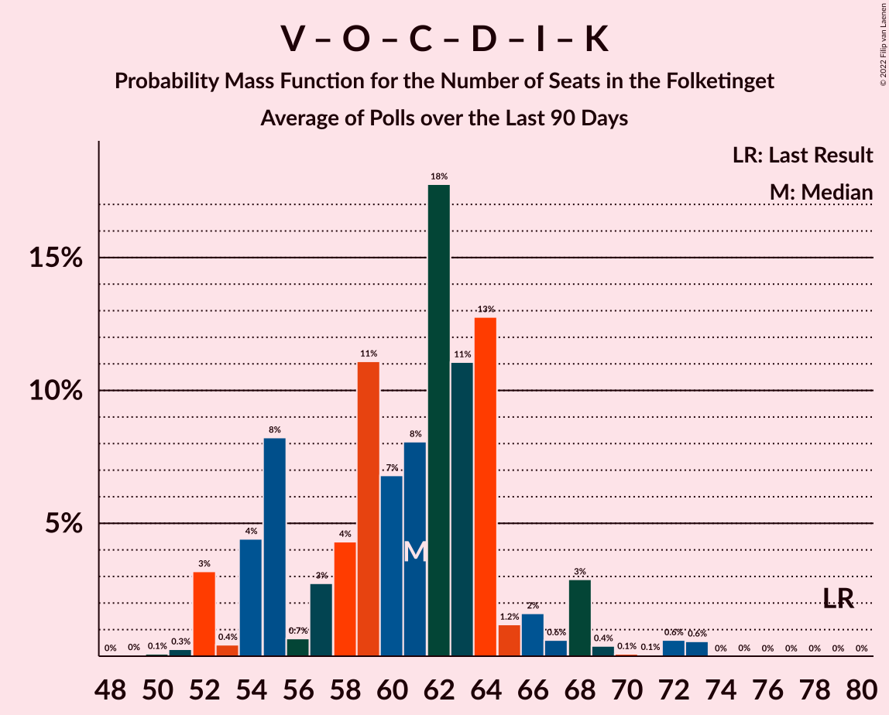

| Number of Seats | Probability | Accumulated | Special Marks |
|:---------------:|:-----------:|:-----------:|:-------------:|
| 70 | 0.3% | 100% |  |
| 71 | 0.6% | 99.7% |  |
| 72 | 0.9% | 99.1% |  |
| 73 | 3% | 98% |  |
| 74 | 2% | 95% |  |
| 75 | 4% | 93% |  |
| 76 | 9% | 89% |  |
| 77 | 17% | 81% |  |
| 78 | 3% | 64% |  |
| 79 | 13% | 61% | Last Result |
| 80 | 6% | 47% |  |
| 81 | 11% | 41% |  |
| 82 | 2% | 30% | Median |
| 83 | 9% | 28% |  |
| 84 | 3% | 20% |  |
| 85 | 2% | 17% |  |
| 86 | 2% | 15% |  |
| 87 | 9% | 13% |  |
| 88 | 1.2% | 5% |  |
| 89 | 0.9% | 3% |  |
| 90 | 0.1% | 3% | Majority |
| 91 | 2% | 2% |  |
| 92 | 0.1% | 0.8% |  |
| 93 | 0.2% | 0.8% |  |
| 94 | 0.4% | 0.6% |  |
| 95 | 0% | 0.1% |  |
| 96 | 0.1% | 0.1% |  |
| 97 | 0% | 0% |  |

### Venstre – Dansk Folkeparti – Det Konservative Folkeparti – Nye Borgerlige – Liberal Alliance – Borgerlisten

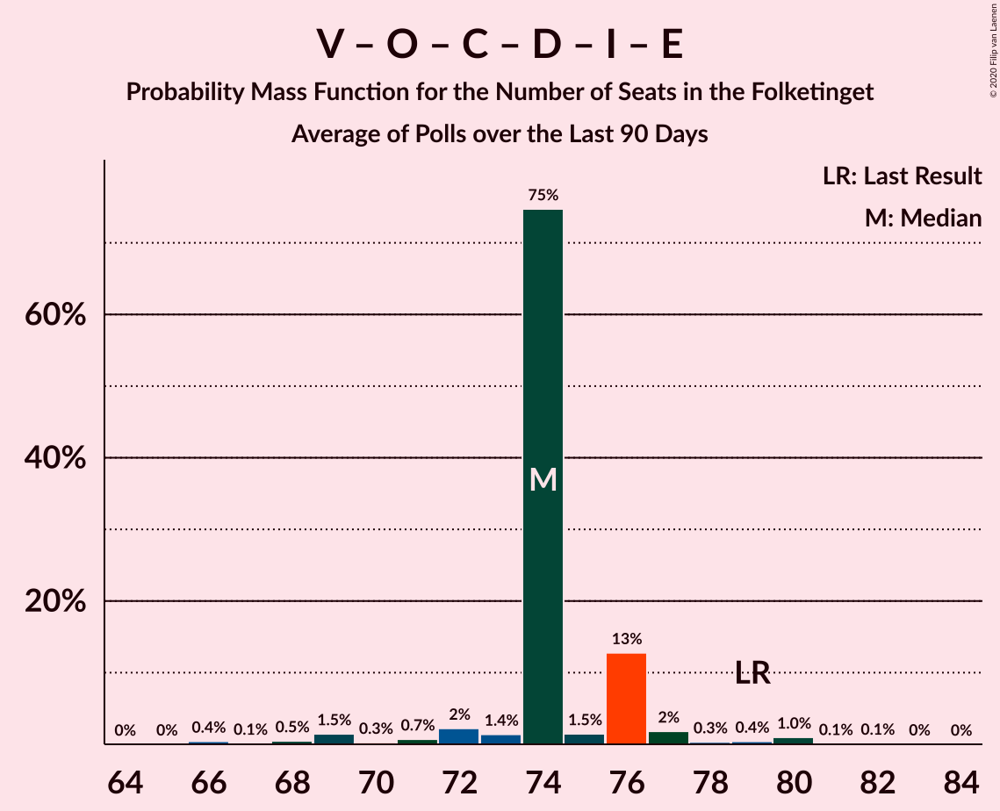

| Number of Seats | Probability | Accumulated | Special Marks |
|:---------------:|:-----------:|:-----------:|:-------------:|
| 66 | 0% | 100% |  |
| 67 | 0.2% | 99.9% |  |
| 68 | 2% | 99.8% |  |
| 69 | 0.3% | 98% |  |
| 70 | 2% | 98% |  |
| 71 | 8% | 96% |  |
| 72 | 8% | 88% |  |
| 73 | 2% | 80% |  |
| 74 | 9% | 78% |  |
| 75 | 5% | 69% |  |
| 76 | 4% | 65% |  |
| 77 | 12% | 61% |  |
| 78 | 2% | 49% |  |
| 79 | 7% | 47% | Last Result |
| 80 | 4% | 39% |  |
| 81 | 9% | 35% |  |
| 82 | 1.1% | 26% | Median |
| 83 | 8% | 25% |  |
| 84 | 2% | 17% |  |
| 85 | 2% | 15% |  |
| 86 | 2% | 13% |  |
| 87 | 8% | 12% |  |
| 88 | 0.8% | 4% |  |
| 89 | 0.8% | 3% |  |
| 90 | 0.4% | 2% | Majority |
| 91 | 2% | 2% |  |
| 92 | 0.2% | 0.3% |  |
| 93 | 0.1% | 0.1% |  |
| 94 | 0% | 0% |  |

### Venstre – Dansk Folkeparti – Det Konservative Folkeparti – Nye Borgerlige – Liberal Alliance

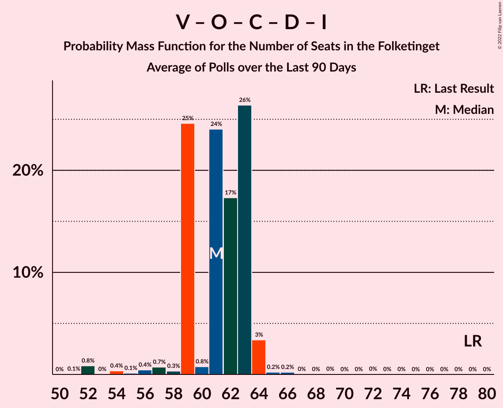

| Number of Seats | Probability | Accumulated | Special Marks |
|:---------------:|:-----------:|:-----------:|:-------------:|
| 66 | 0% | 100% |  |
| 67 | 0.2% | 99.9% |  |
| 68 | 2% | 99.8% |  |
| 69 | 0.3% | 98% |  |
| 70 | 2% | 98% |  |
| 71 | 8% | 96% |  |
| 72 | 8% | 88% |  |
| 73 | 2% | 80% |  |
| 74 | 9% | 78% |  |
| 75 | 5% | 69% |  |
| 76 | 4% | 65% |  |
| 77 | 12% | 61% |  |
| 78 | 2% | 49% |  |
| 79 | 7% | 47% | Last Result |
| 80 | 4% | 39% |  |
| 81 | 9% | 35% |  |
| 82 | 1.1% | 26% | Median |
| 83 | 8% | 25% |  |
| 84 | 2% | 17% |  |
| 85 | 2% | 15% |  |
| 86 | 2% | 13% |  |
| 87 | 8% | 12% |  |
| 88 | 0.8% | 4% |  |
| 89 | 0.8% | 3% |  |
| 90 | 0.4% | 2% | Majority |
| 91 | 2% | 2% |  |
| 92 | 0.2% | 0.3% |  |
| 93 | 0.1% | 0.1% |  |
| 94 | 0% | 0% |  |

### Socialdemokraterne – Socialistisk Folkeparti – Enhedslisten–De Rød-Grønne – Alternativet

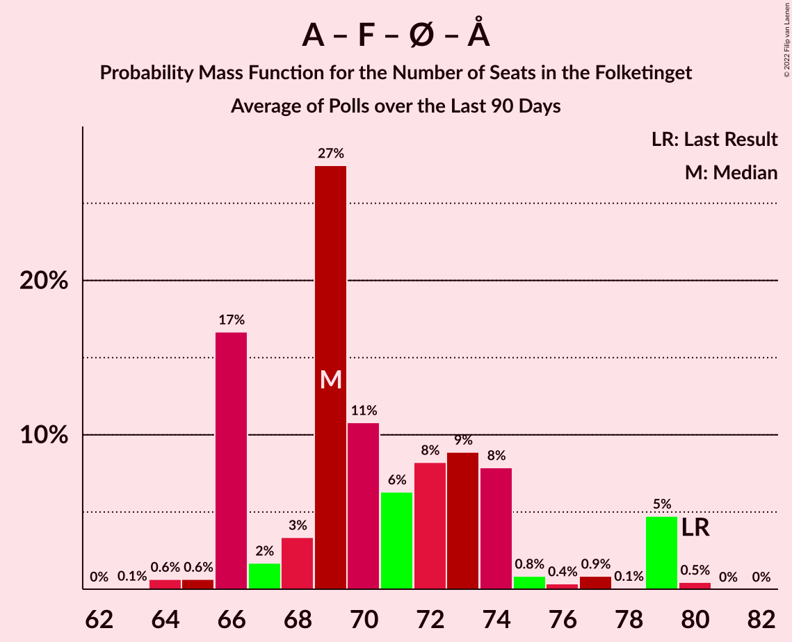

| Number of Seats | Probability | Accumulated | Special Marks |
|:---------------:|:-----------:|:-----------:|:-------------:|
| 72 | 0.1% | 100% |  |
| 73 | 0.2% | 99.9% |  |
| 74 | 0.3% | 99.7% |  |
| 75 | 1.2% | 99.4% |  |
| 76 | 4% | 98% |  |
| 77 | 3% | 94% |  |
| 78 | 4% | 91% |  |
| 79 | 17% | 87% |  |
| 80 | 22% | 70% | Last Result |
| 81 | 14% | 49% | Median |
| 82 | 6% | 35% |  |
| 83 | 7% | 30% |  |
| 84 | 13% | 23% |  |
| 85 | 4% | 10% |  |
| 86 | 5% | 6% |  |
| 87 | 1.0% | 1.2% |  |
| 88 | 0.1% | 0.3% |  |
| 89 | 0.1% | 0.1% |  |
| 90 | 0% | 0% | Majority |

### Socialdemokraterne – Socialistisk Folkeparti – Enhedslisten–De Rød-Grønne

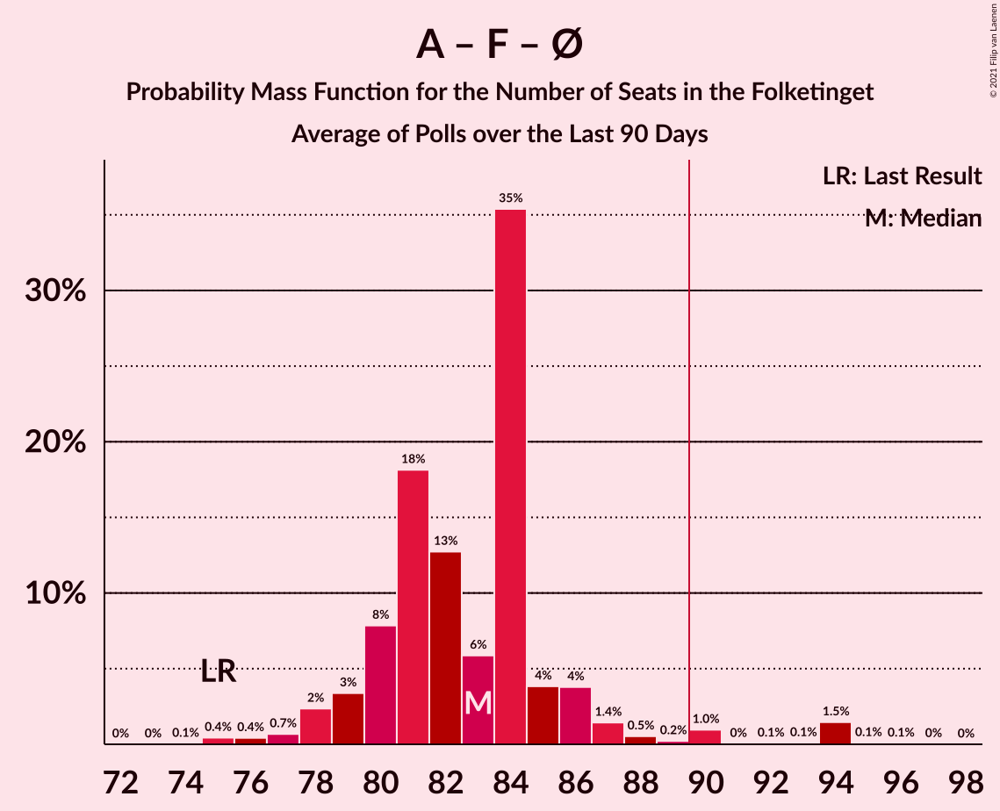

| Number of Seats | Probability | Accumulated | Special Marks |
|:---------------:|:-----------:|:-----------:|:-------------:|
| 72 | 0.1% | 100% |  |
| 73 | 0.2% | 99.9% |  |
| 74 | 0.3% | 99.7% |  |
| 75 | 1.3% | 99.4% | Last Result |
| 76 | 4% | 98% |  |
| 77 | 3% | 94% |  |
| 78 | 4% | 91% |  |
| 79 | 17% | 87% |  |
| 80 | 22% | 70% |  |
| 81 | 14% | 49% | Median |
| 82 | 6% | 35% |  |
| 83 | 7% | 30% |  |
| 84 | 13% | 23% |  |
| 85 | 4% | 10% |  |
| 86 | 5% | 6% |  |
| 87 | 1.0% | 1.2% |  |
| 88 | 0.1% | 0.3% |  |
| 89 | 0.1% | 0.1% |  |
| 90 | 0% | 0% | Majority |

### Socialdemokraterne – Radikale Venstre – Socialistisk Folkeparti

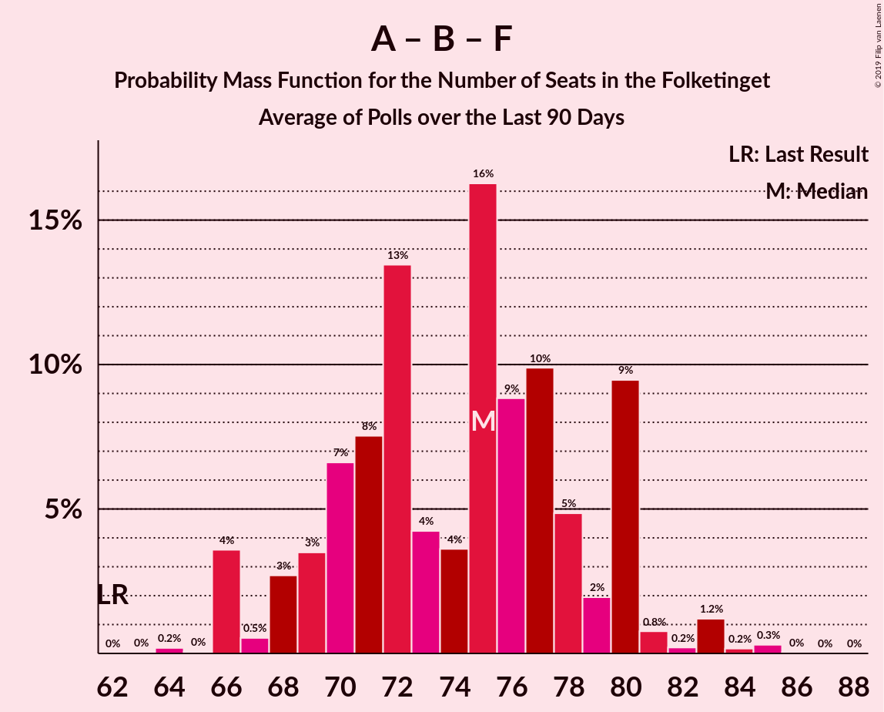

| Number of Seats | Probability | Accumulated | Special Marks |
|:---------------:|:-----------:|:-----------:|:-------------:|
| 63 | 0.2% | 100% |  |
| 64 | 0.2% | 99.8% |  |
| 65 | 0.2% | 99.6% |  |
| 66 | 0.7% | 99.4% |  |
| 67 | 2% | 98.7% |  |
| 68 | 2% | 97% |  |
| 69 | 2% | 95% |  |
| 70 | 8% | 92% |  |
| 71 | 5% | 84% |  |
| 72 | 7% | 79% |  |
| 73 | 12% | 72% |  |
| 74 | 8% | 60% | Median |
| 75 | 6% | 53% |  |
| 76 | 16% | 47% |  |
| 77 | 18% | 31% |  |
| 78 | 5% | 13% | Last Result |
| 79 | 2% | 9% |  |
| 80 | 4% | 6% |  |
| 81 | 0.3% | 2% |  |
| 82 | 0.9% | 2% |  |
| 83 | 0% | 0.7% |  |
| 84 | 0.7% | 0.7% |  |
| 85 | 0% | 0% |  |

### Venstre – Dansk Folkeparti – Det Konservative Folkeparti – Liberal Alliance – Kristendemokraterne

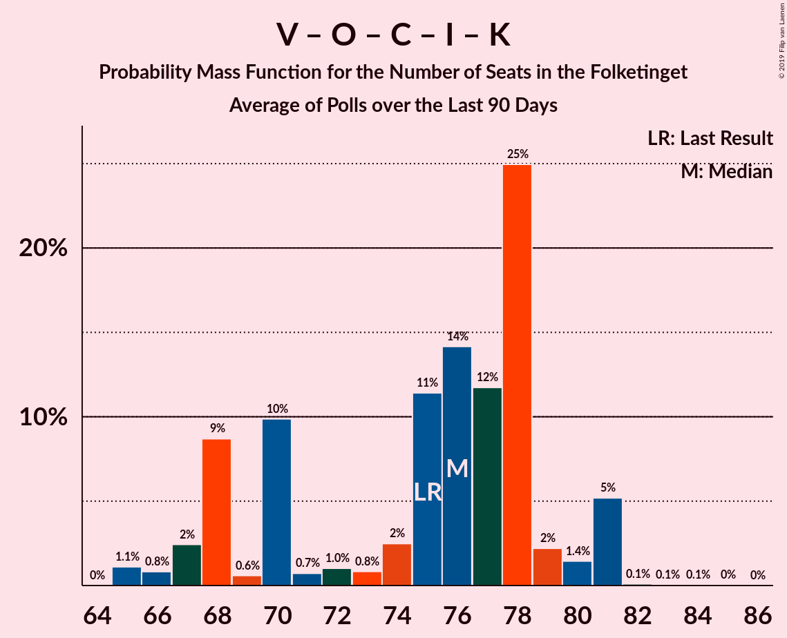

| Number of Seats | Probability | Accumulated | Special Marks |
|:---------------:|:-----------:|:-----------:|:-------------:|
| 54 | 0% | 100% |  |
| 55 | 0.5% | 99.9% |  |
| 56 | 0.2% | 99.5% |  |
| 57 | 0.2% | 99.2% |  |
| 58 | 0.6% | 99.0% |  |
| 59 | 3% | 98% |  |
| 60 | 6% | 96% |  |
| 61 | 2% | 89% |  |
| 62 | 5% | 88% |  |
| 63 | 6% | 83% |  |
| 64 | 11% | 77% |  |
| 65 | 8% | 67% |  |
| 66 | 10% | 58% |  |
| 67 | 10% | 48% | Median |
| 68 | 8% | 39% |  |
| 69 | 14% | 30% |  |
| 70 | 8% | 16% |  |
| 71 | 1.1% | 9% |  |
| 72 | 2% | 8% |  |
| 73 | 2% | 5% |  |
| 74 | 0.6% | 3% |  |
| 75 | 2% | 2% | Last Result |
| 76 | 0.1% | 0.9% |  |
| 77 | 0.6% | 0.8% |  |
| 78 | 0% | 0.2% |  |
| 79 | 0% | 0.2% |  |
| 80 | 0% | 0.1% |  |
| 81 | 0.1% | 0.1% |  |
| 82 | 0% | 0% |  |

### Venstre – Dansk Folkeparti – Det Konservative Folkeparti – Liberal Alliance

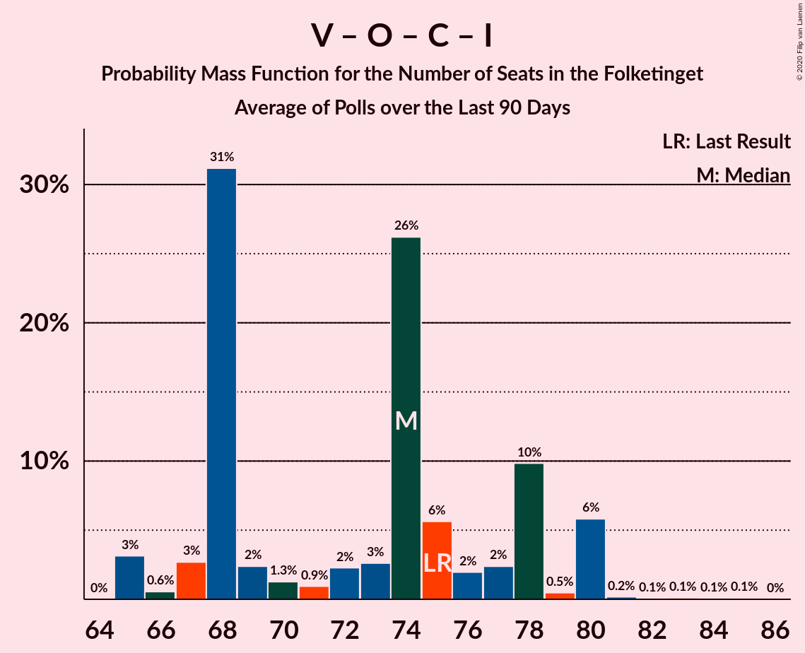

| Number of Seats | Probability | Accumulated | Special Marks |
|:---------------:|:-----------:|:-----------:|:-------------:|
| 54 | 0% | 100% |  |
| 55 | 0.5% | 99.9% |  |
| 56 | 0.3% | 99.5% |  |
| 57 | 0.4% | 99.1% |  |
| 58 | 0.9% | 98.7% |  |
| 59 | 6% | 98% |  |
| 60 | 8% | 92% |  |
| 61 | 9% | 84% |  |
| 62 | 11% | 76% |  |
| 63 | 6% | 65% |  |
| 64 | 17% | 59% |  |
| 65 | 7% | 42% |  |
| 66 | 8% | 35% |  |
| 67 | 10% | 27% | Median |
| 68 | 4% | 17% |  |
| 69 | 1.3% | 13% |  |
| 70 | 7% | 12% |  |
| 71 | 0.5% | 5% |  |
| 72 | 1.3% | 4% |  |
| 73 | 1.1% | 3% |  |
| 74 | 0.3% | 2% |  |
| 75 | 1.5% | 2% | Last Result |
| 76 | 0% | 0.3% |  |
| 77 | 0.3% | 0.3% |  |
| 78 | 0% | 0% |  |

### Socialdemokraterne – Radikale Venstre

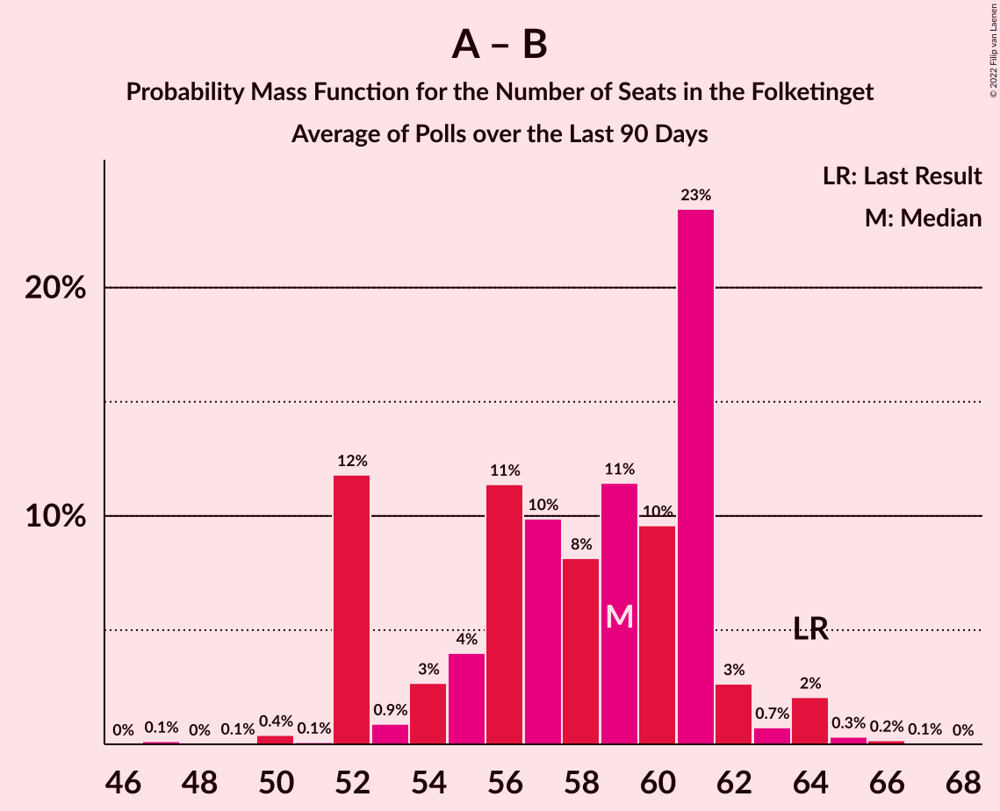

| Number of Seats | Probability | Accumulated | Special Marks |
|:---------------:|:-----------:|:-----------:|:-------------:|
| 47 | 0.3% | 100% |  |
| 48 | 0.6% | 99.7% |  |
| 49 | 2% | 99.1% |  |
| 50 | 1.2% | 97% |  |
| 51 | 0.6% | 96% |  |
| 52 | 0.5% | 95% |  |
| 53 | 4% | 95% |  |
| 54 | 9% | 91% |  |
| 55 | 6% | 82% |  |
| 56 | 10% | 76% |  |
| 57 | 2% | 66% |  |
| 58 | 4% | 64% |  |
| 59 | 7% | 60% | Median |
| 60 | 6% | 53% |  |
| 61 | 7% | 47% |  |
| 62 | 9% | 40% |  |
| 63 | 15% | 31% |  |
| 64 | 4% | 17% | Last Result |
| 65 | 6% | 13% |  |
| 66 | 2% | 7% |  |
| 67 | 0.9% | 6% |  |
| 68 | 3% | 5% |  |
| 69 | 0.7% | 1.2% |  |
| 70 | 0% | 0.5% |  |
| 71 | 0.4% | 0.5% |  |
| 72 | 0% | 0% |  |

### Venstre – Det Konservative Folkeparti – Liberal Alliance

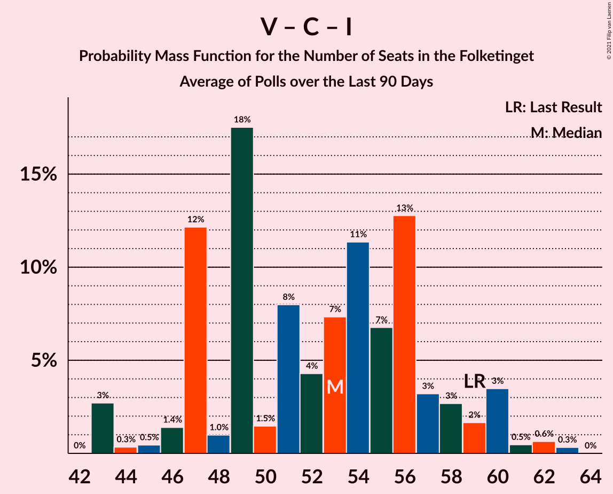

| Number of Seats | Probability | Accumulated | Special Marks |
|:---------------:|:-----------:|:-----------:|:-------------:|
| 43 | 0.1% | 100% |  |
| 44 | 0.8% | 99.9% |  |
| 45 | 0.8% | 99.1% |  |
| 46 | 5% | 98% |  |
| 47 | 6% | 94% |  |
| 48 | 11% | 88% |  |
| 49 | 11% | 77% |  |
| 50 | 3% | 66% |  |
| 51 | 3% | 63% |  |
| 52 | 17% | 60% |  |
| 53 | 6% | 43% |  |
| 54 | 4% | 37% |  |
| 55 | 5% | 32% | Median |
| 56 | 3% | 27% |  |
| 57 | 7% | 25% |  |
| 58 | 7% | 18% |  |
| 59 | 0.6% | 11% | Last Result |
| 60 | 7% | 10% |  |
| 61 | 2% | 3% |  |
| 62 | 0.9% | 1.3% |  |
| 63 | 0.3% | 0.4% |  |
| 64 | 0.1% | 0.2% |  |
| 65 | 0% | 0% |  |

### Venstre – Det Konservative Folkeparti

| Number of Seats | Probability | Accumulated | Special Marks |
|:---------------:|:-----------:|:-----------:|:-------------:|
| 41 | 0.2% | 100% |  |
| 42 | 0.2% | 99.8% |  |
| 43 | 0.3% | 99.6% |  |
| 44 | 2% | 99.3% |  |
| 45 | 7% | 97% |  |
| 46 | 7% | 90% |  |
| 47 | 8% | 83% |  |
| 48 | 24% | 75% |  |
| 49 | 8% | 51% |  |
| 50 | 5% | 43% |  |
| 51 | 5% | 38% | Median |
| 52 | 10% | 33% |  |
| 53 | 5% | 23% |  |
| 54 | 9% | 19% |  |
| 55 | 0.8% | 10% | Last Result |
| 56 | 8% | 9% |  |
| 57 | 0.7% | 1.0% |  |
| 58 | 0.2% | 0.4% |  |
| 59 | 0.1% | 0.2% |  |
| 60 | 0% | 0.1% |  |
| 61 | 0% | 0% |  |

### Venstre

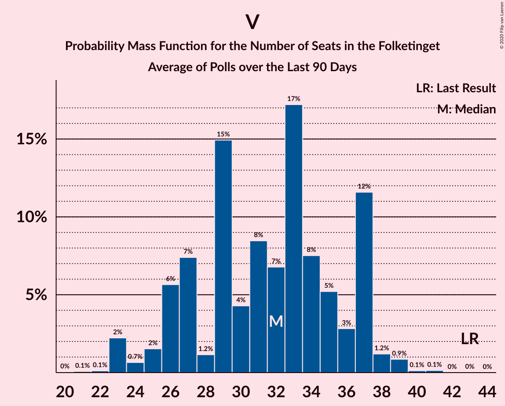

| Number of Seats | Probability | Accumulated | Special Marks |
|:---------------:|:-----------:|:-----------:|:-------------:|
| 13 | 0.1% | 100% |  |
| 14 | 0.9% | 99.9% |  |
| 15 | 2% | 99.0% |  |
| 16 | 12% | 97% |  |
| 17 | 7% | 85% |  |
| 18 | 7% | 78% |  |
| 19 | 3% | 70% |  |
| 20 | 3% | 67% |  |
| 21 | 6% | 64% |  |
| 22 | 9% | 58% | Median |
| 23 | 27% | 49% |  |
| 24 | 8% | 22% |  |
| 25 | 9% | 14% |  |
| 26 | 1.4% | 4% |  |
| 27 | 2% | 3% |  |
| 28 | 0.3% | 0.7% |  |
| 29 | 0.4% | 0.4% |  |
| 30 | 0% | 0% |  |
| 31 | 0% | 0% |  |
| 32 | 0% | 0% |  |
| 33 | 0% | 0% |  |
| 34 | 0% | 0% |  |
| 35 | 0% | 0% |  |
| 36 | 0% | 0% |  |
| 37 | 0% | 0% |  |
| 38 | 0% | 0% |  |
| 39 | 0% | 0% |  |
| 40 | 0% | 0% |  |
| 41 | 0% | 0% |  |
| 42 | 0% | 0% |  |
| 43 | 0% | 0% | Last Result |

## Technical Information

+ **Number of polls included in this average:** 5
+ **Lowest number of simulations done in a poll included in this average:** 0
+ **Total number of simulations done in the polls included in this average:** 3,145,728
+ **Error estimate:** 2.38%
