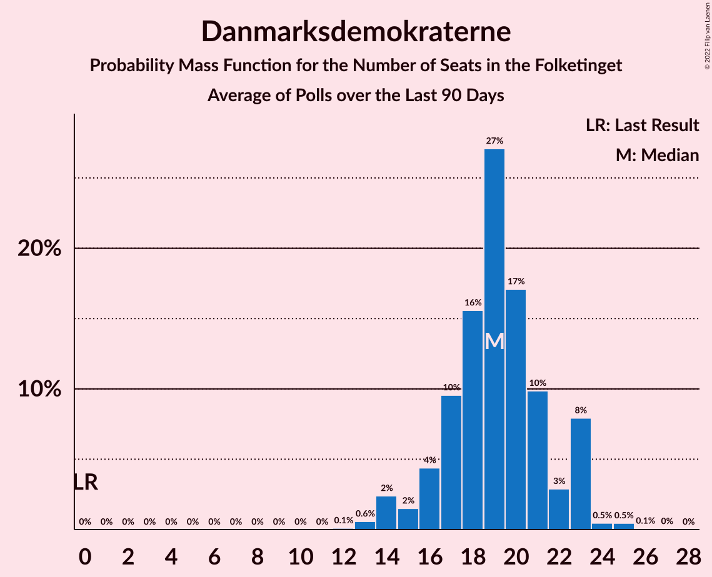
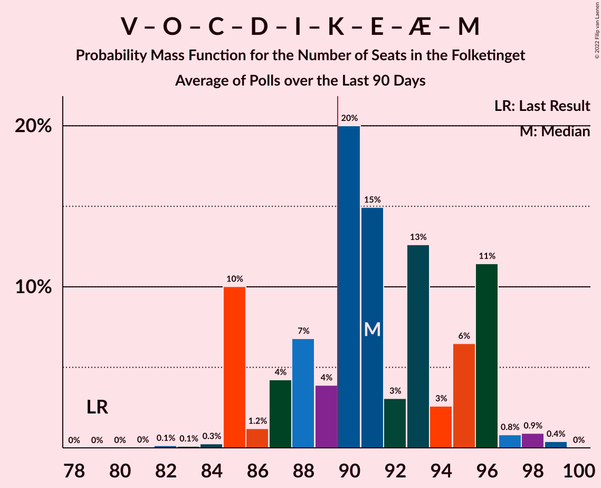
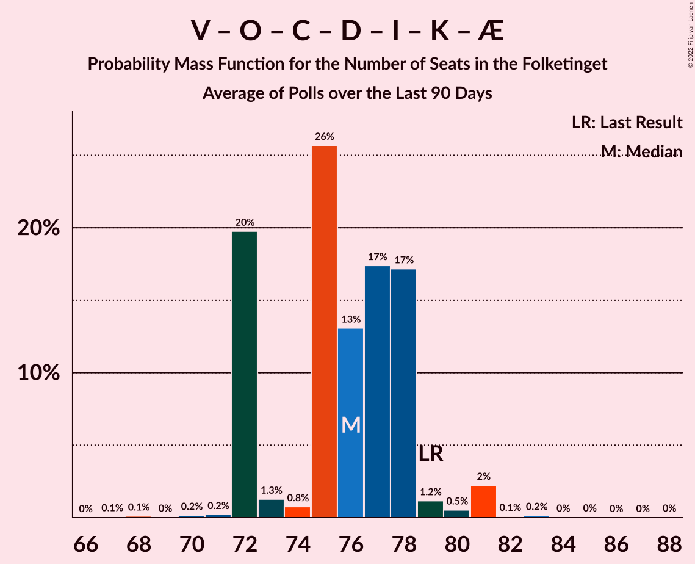

# Poll Average

<a href="#voting-intentions">Voting Intentions</a> | <a href="#seats">Seats</a> | <a href="#coalitions">Coalitions</a> | <a href="#technical-information">Technical Information</a>

## Summary

The table below lists the polls on which the average is based. They are the most recent polls (less than 90 days old) registered and analyzed so far.

| Period     | Polling firm/Commissioner(s) | A | V | O | B | F | Ø | C | Å | D | I | P | K | E | G | Q | Æ | M |
|:----------:|:----------------------------:|:--:|:--:|:--:|:--:|:--:|:--:|:--:|:--:|:--:|:--:|:--:|:--:|:--:|:--:|:--:|:--:|:--:|
| 5 June 2019 | General Election | 25.9%   48 | 23.4%   43 | 8.7%   16 | 8.6%   16 | 7.7%   14 | 6.9%   13 | 6.6%   12 | 3.0%   5 | 2.4%   4 | 2.3%   4 | 1.8%   0 | 1.7%   0 | 0.8%   0 | 0.0%   0 | 0.0%   0 | 0.0%   0 | 0.0%   0 |
| N/A | Poll Average | 20–26%   36–45 | 12–16%   21–28 | 2–4%   0–7 | 5–8%   9–15 | 7–11%   13–19 | 6–10%   11–18 | 12–17%   23–32 | 0–2%   0 | 2–7%   4–11 | 3–6%   5–9 | N/A   N/A | 0–2%   0 | N/A   N/A | 0–1%   0 | 0–1%   0 | 8–12%   15–22 | 2–3%   0–6 |
| [15–18 August 2022](2022-08-18-Megafon.html) | Megafon   Politiken and TV 2 | 20–25%   34–47 | 12–17%   21–29 | 2–4%   0–8 | 5–8%   10–15 | 7–11%   13–20 | 6–10%   10–17 | 13–18%   23–33 | 1–2%   0 | 2–4%   4–7 | 3–5%   5–9 | N/A   N/A | 0–1%   0 | N/A   N/A | 0–1%   0 | 0–2%   0 | 8–12%   14–22 | 1–3%   0–6 |
| [8–14 August 2022](2022-08-14-Voxmeter.html) | Voxmeter | 21–27%   38–44 | 11–16%   22–27 | 2–4%   0–5 | 5–8%   9–15 | 7–10%   14–19 | 7–10%   11–18 | 11–16%   20–26 | 0–1%   0 | 5–7%   8–12 | 3–6%   5–10 | N/A   N/A | 1–2%   0 | N/A   N/A | 0–1%   0 | 0–1%   0 | 8–12%   16–19 | 1–3%   0–6 |
| [7 August 2022](2022-08-07-Yougov.html) | Yougov | N/A   N/A | N/A   N/A | N/A   N/A | N/A   N/A | N/A   N/A | N/A   N/A | N/A   N/A | N/A   N/A | N/A   N/A | N/A   N/A | N/A   N/A | N/A   N/A | N/A   N/A | N/A   N/A | N/A   N/A | N/A   N/A | N/A   N/A |
| [5 August 2022](2022-08-05-Gallup.html) | Gallup   Berlingske | N/A   N/A | N/A   N/A | N/A   N/A | N/A   N/A | N/A   N/A | N/A   N/A | N/A   N/A | N/A   N/A | N/A   N/A | N/A   N/A | N/A   N/A | N/A   N/A | N/A   N/A | N/A   N/A | N/A   N/A | N/A   N/A | N/A   N/A |
| [21–28 July 2022](2022-07-28-Epinion.html) | Epinion   DR | N/A   N/A | N/A   N/A | N/A   N/A | N/A   N/A | N/A   N/A | N/A   N/A | N/A   N/A | N/A   N/A | N/A   N/A | N/A   N/A | N/A   N/A | N/A   N/A | N/A   N/A | N/A   N/A | N/A   N/A | N/A   N/A | N/A   N/A |
| 5 June 2019 | General Election | 25.9%   48 | 23.4%   43 | 8.7%   16 | 8.6%   16 | 7.7%   14 | 6.9%   13 | 6.6%   12 | 3.0%   5 | 2.4%   4 | 2.3%   4 | 1.8%   0 | 1.7%   0 | 0.8%   0 | 0.0%   0 | 0.0%   0 | 0.0%   0 | 0.0%   0 |

Only polls for which at least the sample size has been published are included in the table above.

**Legend:**
+ **Top half of each row:** Voting intentions (95% confidence interval)
+ **Bottom half of each row:** Seat projections for the Folketinget (95% confidence interval)
+ **A:** Socialdemokraterne
+ **V:** Venstre
+ **O:** Dansk Folkeparti
+ **B:** Radikale Venstre
+ **F:** Socialistisk Folkeparti
+ **Ø:** Enhedslisten–De Rød-Grønne
+ **C:** Det Konservative Folkeparti
+ **Å:** Alternativet
+ **D:** Nye Borgerlige
+ **I:** Liberal Alliance
+ **P:** Stram Kurs
+ **K:** Kristendemokraterne
+ **E:** Borgerlisten
+ **G:** Veganerpartiet
+ **Q:** Frie Grønne
+ **Æ:** Danmarksdemokraterne
+ **M:** Moderaterne
+ **N/A (single party):** Party not included the published results
+ **N/A (entire row):** Calculation for this opinion poll not started yet

## Voting Intentions

### Confidence Intervals

| Party | Last Result | Median | 80% Confidence Interval | 90% Confidence Interval | 95% Confidence Interval | 99% Confidence Interval |
|:-----:|:-----------:|:------:|:-----------------------:|:-----------------------:|:-----------------------:|:-----------------------:|
| <a href="#socialdemokraterne">Socialdemokraterne</a> | 25.9% | 23.3% | 21.4–25.2% |20.9–25.7% | 20.4–26.2% | 19.6–27.1% |
| <a href="#venstre">Venstre</a> | 23.4% | 13.9% | 12.5–15.5% |12.1–15.9% | 11.7–16.3% | 11.1–17.1% |
| <a href="#dansk-folkeparti">Dansk Folkeparti</a> | 8.7% | 2.7% | 2.1–3.4% |1.9–3.7% | 1.8–3.8% | 1.5–4.3% |
| <a href="#radikale-venstre">Radikale Venstre</a> | 8.6% | 6.6% | 5.6–7.7% |5.3–8.0% | 5.1–8.3% | 4.7–8.9% |
| <a href="#socialistisk-folkeparti">Socialistisk Folkeparti</a> | 7.7% | 8.7% | 7.6–9.9% |7.3–10.3% | 7.1–10.6% | 6.6–11.2% |
| <a href="#enhedslisten–de-rød-grønne">Enhedslisten–De Rød-Grønne</a> | 6.9% | 8.0% | 7.0–9.2% |6.7–9.5% | 6.5–9.8% | 6.0–10.4% |
| <a href="#det-konservative-folkeparti">Det Konservative Folkeparti</a> | 6.6% | 14.3% | 12.5–16.2% |12.0–16.8% | 11.7–17.2% | 11.1–18.0% |
| <a href="#alternativet">Alternativet</a> | 3.0% | 0.8% | 0.4–1.4% |0.3–1.5% | 0.3–1.7% | 0.2–2.0% |
| <a href="#nye-borgerlige">Nye Borgerlige</a> | 2.4% | 4.3% | 2.5–6.5% |2.3–6.8% | 2.2–7.1% | 1.9–7.7% |
| <a href="#liberal-alliance">Liberal Alliance</a> | 2.3% | 4.1% | 3.3–5.0% |3.1–5.3% | 3.0–5.5% | 2.7–6.0% |
| <a href="#stram-kurs">Stram Kurs</a> | 1.8% | N/A | N/A |N/A | N/A | N/A |
| <a href="#kristendemokraterne">Kristendemokraterne</a> | 1.7% | 0.9% | 0.5–1.4% |0.4–1.6% | 0.3–1.7% | 0.2–2.0% |
| <a href="#borgerlisten">Borgerlisten</a> | 0.8% | N/A | N/A |N/A | N/A | N/A |
| <a href="#veganerpartiet">Veganerpartiet</a> | 0.0% | 0.2% | 0.1–0.5% |0.1–0.6% | 0.0–0.6% | 0.0–0.8% |
| <a href="#frie-grønne">Frie Grønne</a> | 0.0% | 0.5% | 0.1–1.1% |0.1–1.3% | 0.1–1.4% | 0.0–1.7% |
| <a href="#danmarksdemokraterne">Danmarksdemokraterne</a> | 0.0% | 9.9% | 8.8–11.2% |8.4–11.6% | 8.2–11.9% | 7.7–12.6% |
| <a href="#moderaterne">Moderaterne</a> | 0.0% | 2.2% | 1.7–2.9% |1.6–3.1% | 1.5–3.3% | 1.3–3.7% |

### Socialdemokraterne

*For a full overview of the results for this party, see the [Socialdemokraterne](party-socialdemokraterne.html) page.*

| Voting Intentions | Probability | Accumulated | Special Marks |
|:-----------------:|:-----------:|:-----------:|:-------------:|
| 17.5–18.5% | 0% | 100% |  |
| 18.5–19.5% | 0.4% | 100% |  |
| 19.5–20.5% | 3% | 99.6% |  |
| 20.5–21.5% | 9% | 97% |  |
| 21.5–22.5% | 20% | 88% |  |
| 22.5–23.5% | 26% | 68% | Median |
| 23.5–24.5% | 23% | 42% |  |
| 24.5–25.5% | 13% | 19% |  |
| 25.5–26.5% | 5% | 6% | Last Result |
| 26.5–27.5% | 1.2% | 1.4% |  |
| 27.5–28.5% | 0.2% | 0.2% |  |
| 28.5–29.5% | 0% | 0% |  |

### Venstre

*For a full overview of the results for this party, see the [Venstre](party-venstre.html) page.*

| Voting Intentions | Probability | Accumulated | Special Marks |
|:-----------------:|:-----------:|:-----------:|:-------------:|
| 8.5–9.5% | 0% | 100% |  |
| 9.5–10.5% | 0.1% | 100% |  |
| 10.5–11.5% | 2% | 99.9% |  |
| 11.5–12.5% | 10% | 98% |  |
| 12.5–13.5% | 27% | 88% |  |
| 13.5–14.5% | 33% | 62% | Median |
| 14.5–15.5% | 20% | 29% |  |
| 15.5–16.5% | 7% | 9% |  |
| 16.5–17.5% | 1.4% | 2% |  |
| 17.5–18.5% | 0.2% | 0.2% |  |
| 18.5–19.5% | 0% | 0% |  |
| 19.5–20.5% | 0% | 0% |  |
| 20.5–21.5% | 0% | 0% |  |
| 21.5–22.5% | 0% | 0% |  |
| 22.5–23.5% | 0% | 0% | Last Result |

### Dansk Folkeparti

*For a full overview of the results for this party, see the [Dansk Folkeparti](party-danskfolkeparti.html) page.*

| Voting Intentions | Probability | Accumulated | Special Marks |
|:-----------------:|:-----------:|:-----------:|:-------------:|
| 0.0–0.5% | 0% | 100% |  |
| 0.5–1.5% | 0.5% | 100% |  |
| 1.5–2.5% | 39% | 99.5% |  |
| 2.5–3.5% | 54% | 61% | Median |
| 3.5–4.5% | 7% | 7% |  |
| 4.5–5.5% | 0.1% | 0.1% |  |
| 5.5–6.5% | 0% | 0% |  |
| 6.5–7.5% | 0% | 0% |  |
| 7.5–8.5% | 0% | 0% |  |
| 8.5–9.5% | 0% | 0% | Last Result |

### Radikale Venstre

*For a full overview of the results for this party, see the [Radikale Venstre](party-radikalevenstre.html) page.*

| Voting Intentions | Probability | Accumulated | Special Marks |
|:-----------------:|:-----------:|:-----------:|:-------------:|
| 2.5–3.5% | 0% | 100% |  |
| 3.5–4.5% | 0.3% | 100% |  |
| 4.5–5.5% | 9% | 99.7% |  |
| 5.5–6.5% | 40% | 91% |  |
| 6.5–7.5% | 38% | 51% | Median |
| 7.5–8.5% | 11% | 13% |  |
| 8.5–9.5% | 1.2% | 1.2% | Last Result |
| 9.5–10.5% | 0.1% | 0.1% |  |
| 10.5–11.5% | 0% | 0% |  |

### Socialistisk Folkeparti

*For a full overview of the results for this party, see the [Socialistisk Folkeparti](party-socialistiskfolkeparti.html) page.*

| Voting Intentions | Probability | Accumulated | Special Marks |
|:-----------------:|:-----------:|:-----------:|:-------------:|
| 4.5–5.5% | 0% | 100% |  |
| 5.5–6.5% | 0.4% | 100% |  |
| 6.5–7.5% | 8% | 99.6% |  |
| 7.5–8.5% | 34% | 91% | Last Result |
| 8.5–9.5% | 39% | 57% | Median |
| 9.5–10.5% | 15% | 18% |  |
| 10.5–11.5% | 3% | 3% |  |
| 11.5–12.5% | 0.2% | 0.2% |  |
| 12.5–13.5% | 0% | 0% |  |

### Enhedslisten–De Rød-Grønne

*For a full overview of the results for this party, see the [Enhedslisten–De Rød-Grønne](party-enhedslisten–derød-grønne.html) page.*

| Voting Intentions | Probability | Accumulated | Special Marks |
|:-----------------:|:-----------:|:-----------:|:-------------:|
| 4.5–5.5% | 0.1% | 100% |  |
| 5.5–6.5% | 3% | 99.9% |  |
| 6.5–7.5% | 25% | 97% | Last Result |
| 7.5–8.5% | 44% | 72% | Median |
| 8.5–9.5% | 23% | 27% |  |
| 9.5–10.5% | 4% | 4% |  |
| 10.5–11.5% | 0.3% | 0.3% |  |
| 11.5–12.5% | 0% | 0% |  |

### Det Konservative Folkeparti

*For a full overview of the results for this party, see the [Det Konservative Folkeparti](party-detkonservativefolkeparti.html) page.*

| Voting Intentions | Probability | Accumulated | Special Marks |
|:-----------------:|:-----------:|:-----------:|:-------------:|
| 6.5–7.5% | 0% | 100% | Last Result |
| 7.5–8.5% | 0% | 100% |  |
| 8.5–9.5% | 0% | 100% |  |
| 9.5–10.5% | 0.1% | 100% |  |
| 10.5–11.5% | 2% | 99.9% |  |
| 11.5–12.5% | 9% | 98% |  |
| 12.5–13.5% | 21% | 89% |  |
| 13.5–14.5% | 25% | 69% | Median |
| 14.5–15.5% | 22% | 43% |  |
| 15.5–16.5% | 14% | 21% |  |
| 16.5–17.5% | 5% | 7% |  |
| 17.5–18.5% | 1.2% | 1.3% |  |
| 18.5–19.5% | 0.1% | 0.1% |  |
| 19.5–20.5% | 0% | 0% |  |

### Alternativet

*For a full overview of the results for this party, see the [Alternativet](party-alternativet.html) page.*

| Voting Intentions | Probability | Accumulated | Special Marks |
|:-----------------:|:-----------:|:-----------:|:-------------:|
| 0.0–0.5% | 27% | 100% |  |
| 0.5–1.5% | 68% | 73% | Median |
| 1.5–2.5% | 4% | 4% |  |
| 2.5–3.5% | 0% | 0% | Last Result |

### Nye Borgerlige

*For a full overview of the results for this party, see the [Nye Borgerlige](party-nyeborgerlige.html) page.*

| Voting Intentions | Probability | Accumulated | Special Marks |
|:-----------------:|:-----------:|:-----------:|:-------------:|
| 0.5–1.5% | 0% | 100% |  |
| 1.5–2.5% | 11% | 100% | Last Result |
| 2.5–3.5% | 32% | 89% |  |
| 3.5–4.5% | 8% | 57% | Median |
| 4.5–5.5% | 15% | 49% |  |
| 5.5–6.5% | 25% | 33% |  |
| 6.5–7.5% | 8% | 9% |  |
| 7.5–8.5% | 0.8% | 0.8% |  |
| 8.5–9.5% | 0% | 0% |  |

### Liberal Alliance

*For a full overview of the results for this party, see the [Liberal Alliance](party-liberalalliance.html) page.*

| Voting Intentions | Probability | Accumulated | Special Marks |
|:-----------------:|:-----------:|:-----------:|:-------------:|
| 0.5–1.5% | 0% | 100% |  |
| 1.5–2.5% | 0.2% | 100% | Last Result |
| 2.5–3.5% | 17% | 99.8% |  |
| 3.5–4.5% | 56% | 83% | Median |
| 4.5–5.5% | 24% | 27% |  |
| 5.5–6.5% | 2% | 2% |  |
| 6.5–7.5% | 0.1% | 0.1% |  |
| 7.5–8.5% | 0% | 0% |  |

### Kristendemokraterne

*For a full overview of the results for this party, see the [Kristendemokraterne](party-kristendemokraterne.html) page.*

| Voting Intentions | Probability | Accumulated | Special Marks |
|:-----------------:|:-----------:|:-----------:|:-------------:|
| 0.0–0.5% | 17% | 100% |  |
| 0.5–1.5% | 78% | 83% | Median |
| 1.5–2.5% | 6% | 6% | Last Result |
| 2.5–3.5% | 0% | 0% |  |

### Veganerpartiet

*For a full overview of the results for this party, see the [Veganerpartiet](party-veganerpartiet.html) page.*

| Voting Intentions | Probability | Accumulated | Special Marks |
|:-----------------:|:-----------:|:-----------:|:-------------:|
| 0.0–0.5% | 95% | 100% | Last Result, Median |
| 0.5–1.5% | 5% | 5% |  |
| 1.5–2.5% | 0% | 0% |  |

### Moderaterne

*For a full overview of the results for this party, see the [Moderaterne](party-moderaterne.html) page.*

| Voting Intentions | Probability | Accumulated | Special Marks |
|:-----------------:|:-----------:|:-----------:|:-------------:|
| 0.0–0.5% | 0% | 100% | Last Result |
| 0.5–1.5% | 5% | 100% |  |
| 1.5–2.5% | 69% | 95% | Median |
| 2.5–3.5% | 26% | 27% |  |
| 3.5–4.5% | 0.8% | 0.8% |  |
| 4.5–5.5% | 0% | 0% |  |

### Frie Grønne

*For a full overview of the results for this party, see the [Frie Grønne](party-friegrønne.html) page.*

| Voting Intentions | Probability | Accumulated | Special Marks |
|:-----------------:|:-----------:|:-----------:|:-------------:|
| 0.0–0.5% | 52% | 100% | Last Result |
| 0.5–1.5% | 47% | 48% | Median |
| 1.5–2.5% | 1.3% | 1.3% |  |
| 2.5–3.5% | 0% | 0% |  |

### Danmarksdemokraterne

*For a full overview of the results for this party, see the [Danmarksdemokraterne](party-danmarksdemokraterne.html) page.*

| Voting Intentions | Probability | Accumulated | Special Marks |
|:-----------------:|:-----------:|:-----------:|:-------------:|
| 0.0–0.5% | 0% | 100% | Last Result |
| 0.5–1.5% | 0% | 100% |  |
| 1.5–2.5% | 0% | 100% |  |
| 2.5–3.5% | 0% | 100% |  |
| 3.5–4.5% | 0% | 100% |  |
| 4.5–5.5% | 0% | 100% |  |
| 5.5–6.5% | 0% | 100% |  |
| 6.5–7.5% | 0.3% | 100% |  |
| 7.5–8.5% | 6% | 99.7% |  |
| 8.5–9.5% | 28% | 94% |  |
| 9.5–10.5% | 39% | 65% | Median |
| 10.5–11.5% | 21% | 26% |  |
| 11.5–12.5% | 5% | 5% |  |
| 12.5–13.5% | 0.5% | 0.5% |  |
| 13.5–14.5% | 0% | 0% |  |

## Seats

### Confidence Intervals

| Party | Last Result | Median | 80% Confidence Interval | 90% Confidence Interval | 95% Confidence Interval | 99% Confidence Interval |
|:-----:|:-----------:|:------:|:-----------------------:|:-----------------------:|:-----------------------:|:-----------------------:|
| <a href="#socialdemokraterne">Socialdemokraterne</a> | 48 | 40 | 39–43 |37–43 | 36–45 | 34–47 |
| <a href="#venstre">Venstre</a> | 43 | 25 | 24–28 |23–28 | 21–28 | 20–30 |
| <a href="#dansk-folkeparti">Dansk Folkeparti</a> | 16 | 4 | 4–6 |4–6 | 0–7 | 0–8 |
| <a href="#radikale-venstre">Radikale Venstre</a> | 16 | 11 | 9–13 |9–15 | 9–15 | 9–16 |
| <a href="#socialistisk-folkeparti">Socialistisk Folkeparti</a> | 14 | 14 | 13–19 |13–19 | 13–19 | 12–20 |
| <a href="#enhedslisten–de-rød-grønne">Enhedslisten–De Rød-Grønne</a> | 13 | 14 | 11–18 |11–18 | 11–18 | 10–18 |
| <a href="#det-konservative-folkeparti">Det Konservative Folkeparti</a> | 12 | 25 | 23–30 |23–31 | 23–32 | 19–33 |
| <a href="#alternativet">Alternativet</a> | 5 | 0 | 0 |0 | 0 | 0 |
| <a href="#nye-borgerlige">Nye Borgerlige</a> | 4 | 8 | 5–9 |5–10 | 4–11 | 4–13 |
| <a href="#liberal-alliance">Liberal Alliance</a> | 4 | 7 | 6–8 |5–9 | 5–9 | 5–11 |
| <a href="#stram-kurs">Stram Kurs</a> | 0 | N/A | N/A |N/A | N/A | N/A |
| <a href="#kristendemokraterne">Kristendemokraterne</a> | 0 | 0 | 0 |0 | 0 | 0 |
| <a href="#borgerlisten">Borgerlisten</a> | 0 | N/A | N/A |N/A | N/A | N/A |
| <a href="#veganerpartiet">Veganerpartiet</a> | 0 | 0 | 0 |0 | 0 | 0 |
| <a href="#frie-grønne">Frie Grønne</a> | 0 | 0 | 0 |0 | 0 | 0 |
| <a href="#danmarksdemokraterne">Danmarksdemokraterne</a> | 0 | 18 | 17–20 |16–20 | 15–22 | 14–24 |
| <a href="#moderaterne">Moderaterne</a> | 0 | 4 | 0–5 |0–5 | 0–6 | 0–6 |

### Socialdemokraterne

*For a full overview of the results for this party, see the [Socialdemokraterne](party-socialdemokraterne.html) page.*

| Number of Seats | Probability | Accumulated | Special Marks |
|:---------------:|:-----------:|:-----------:|:-------------:|
| 33 | 0.1% | 100% |  |
| 34 | 2% | 99.9% |  |
| 35 | 0.2% | 98% |  |
| 36 | 2% | 98% |  |
| 37 | 2% | 96% |  |
| 38 | 3% | 95% |  |
| 39 | 23% | 92% |  |
| 40 | 22% | 69% | Median |
| 41 | 5% | 47% |  |
| 42 | 2% | 42% |  |
| 43 | 35% | 40% |  |
| 44 | 2% | 5% |  |
| 45 | 0.2% | 3% |  |
| 46 | 0.2% | 2% |  |
| 47 | 2% | 2% |  |
| 48 | 0.2% | 0.4% | Last Result |
| 49 | 0% | 0.2% |  |
| 50 | 0% | 0.1% |  |
| 51 | 0.1% | 0.1% |  |
| 52 | 0% | 0% |  |

### Venstre

*For a full overview of the results for this party, see the [Venstre](party-venstre.html) page.*

| Number of Seats | Probability | Accumulated | Special Marks |
|:---------------:|:-----------:|:-----------:|:-------------:|
| 19 | 0.1% | 100% |  |
| 20 | 1.3% | 99.8% |  |
| 21 | 2% | 98.5% |  |
| 22 | 1.0% | 97% |  |
| 23 | 2% | 96% |  |
| 24 | 37% | 94% |  |
| 25 | 15% | 58% | Median |
| 26 | 3% | 43% |  |
| 27 | 15% | 40% |  |
| 28 | 23% | 25% |  |
| 29 | 1.2% | 2% |  |
| 30 | 0.2% | 0.6% |  |
| 31 | 0.2% | 0.3% |  |
| 32 | 0.1% | 0.1% |  |
| 33 | 0.1% | 0.1% |  |
| 34 | 0% | 0% |  |
| 35 | 0% | 0% |  |
| 36 | 0% | 0% |  |
| 37 | 0% | 0% |  |
| 38 | 0% | 0% |  |
| 39 | 0% | 0% |  |
| 40 | 0% | 0% |  |
| 41 | 0% | 0% |  |
| 42 | 0% | 0% |  |
| 43 | 0% | 0% | Last Result |

### Dansk Folkeparti

*For a full overview of the results for this party, see the [Dansk Folkeparti](party-danskfolkeparti.html) page.*

| Number of Seats | Probability | Accumulated | Special Marks |
|:---------------:|:-----------:|:-----------:|:-------------:|
| 0 | 4% | 100% |  |
| 1 | 0% | 96% |  |
| 2 | 0% | 96% |  |
| 3 | 0% | 96% |  |
| 4 | 60% | 96% | Median |
| 5 | 14% | 36% |  |
| 6 | 18% | 22% |  |
| 7 | 2% | 4% |  |
| 8 | 2% | 2% |  |
| 9 | 0.3% | 0.3% |  |
| 10 | 0% | 0% |  |
| 11 | 0% | 0% |  |
| 12 | 0% | 0% |  |
| 13 | 0% | 0% |  |
| 14 | 0% | 0% |  |
| 15 | 0% | 0% |  |
| 16 | 0% | 0% | Last Result |

### Radikale Venstre

*For a full overview of the results for this party, see the [Radikale Venstre](party-radikalevenstre.html) page.*

| Number of Seats | Probability | Accumulated | Special Marks |
|:---------------:|:-----------:|:-----------:|:-------------:|
| 8 | 0.3% | 100% |  |
| 9 | 10% | 99.6% |  |
| 10 | 24% | 89% |  |
| 11 | 51% | 66% | Median |
| 12 | 4% | 15% |  |
| 13 | 4% | 11% |  |
| 14 | 1.1% | 7% |  |
| 15 | 5% | 6% |  |
| 16 | 0.7% | 0.9% | Last Result |
| 17 | 0.2% | 0.2% |  |
| 18 | 0% | 0% |  |

### Socialistisk Folkeparti

*For a full overview of the results for this party, see the [Socialistisk Folkeparti](party-socialistiskfolkeparti.html) page.*

| Number of Seats | Probability | Accumulated | Special Marks |
|:---------------:|:-----------:|:-----------:|:-------------:|
| 11 | 0.2% | 100% |  |
| 12 | 0.4% | 99.8% |  |
| 13 | 21% | 99.5% |  |
| 14 | 37% | 78% | Last Result, Median |
| 15 | 7% | 41% |  |
| 16 | 5% | 34% |  |
| 17 | 2% | 29% |  |
| 18 | 13% | 27% |  |
| 19 | 13% | 15% |  |
| 20 | 2% | 2% |  |
| 21 | 0.2% | 0.3% |  |
| 22 | 0.1% | 0.1% |  |
| 23 | 0% | 0% |  |

### Enhedslisten–De Rød-Grønne

*For a full overview of the results for this party, see the [Enhedslisten–De Rød-Grønne](party-enhedslisten–derød-grønne.html) page.*

| Number of Seats | Probability | Accumulated | Special Marks |
|:---------------:|:-----------:|:-----------:|:-------------:|
| 10 | 2% | 100% |  |
| 11 | 8% | 98% |  |
| 12 | 3% | 89% |  |
| 13 | 7% | 86% | Last Result |
| 14 | 33% | 79% | Median |
| 15 | 3% | 46% |  |
| 16 | 7% | 44% |  |
| 17 | 3% | 37% |  |
| 18 | 34% | 34% |  |
| 19 | 0.1% | 0.1% |  |
| 20 | 0% | 0.1% |  |
| 21 | 0% | 0% |  |

### Det Konservative Folkeparti

*For a full overview of the results for this party, see the [Det Konservative Folkeparti](party-detkonservativefolkeparti.html) page.*

| Number of Seats | Probability | Accumulated | Special Marks |
|:---------------:|:-----------:|:-----------:|:-------------:|
| 12 | 0% | 100% | Last Result |
| 13 | 0% | 100% |  |
| 14 | 0% | 100% |  |
| 15 | 0% | 100% |  |
| 16 | 0% | 100% |  |
| 17 | 0% | 100% |  |
| 18 | 0.1% | 100% |  |
| 19 | 1.2% | 99.9% |  |
| 20 | 0.1% | 98.8% |  |
| 21 | 0.1% | 98.6% |  |
| 22 | 0.6% | 98.6% |  |
| 23 | 14% | 98% |  |
| 24 | 2% | 84% |  |
| 25 | 34% | 82% | Median |
| 26 | 13% | 48% |  |
| 27 | 1.1% | 35% |  |
| 28 | 2% | 34% |  |
| 29 | 2% | 32% |  |
| 30 | 24% | 30% |  |
| 31 | 3% | 6% |  |
| 32 | 1.3% | 3% |  |
| 33 | 1.5% | 2% |  |
| 34 | 0.2% | 0.2% |  |
| 35 | 0% | 0% |  |

### Alternativet

*For a full overview of the results for this party, see the [Alternativet](party-alternativet.html) page.*

| Number of Seats | Probability | Accumulated | Special Marks |
|:---------------:|:-----------:|:-----------:|:-------------:|
| 0 | 99.7% | 100% | Median |
| 1 | 0% | 0.3% |  |
| 2 | 0% | 0.3% |  |
| 3 | 0% | 0.3% |  |
| 4 | 0.3% | 0.3% |  |
| 5 | 0.1% | 0.1% | Last Result |
| 6 | 0% | 0% |  |

### Nye Borgerlige

*For a full overview of the results for this party, see the [Nye Borgerlige](party-nyeborgerlige.html) page.*

| Number of Seats | Probability | Accumulated | Special Marks |
|:---------------:|:-----------:|:-----------:|:-------------:|
| 0 | 0.5% | 100% |  |
| 1 | 0% | 99.5% |  |
| 2 | 0% | 99.5% |  |
| 3 | 0% | 99.5% |  |
| 4 | 3% | 99.5% | Last Result |
| 5 | 25% | 96% |  |
| 6 | 17% | 71% |  |
| 7 | 4% | 54% |  |
| 8 | 34% | 51% | Median |
| 9 | 12% | 17% |  |
| 10 | 0.4% | 5% |  |
| 11 | 3% | 5% |  |
| 12 | 0.4% | 1.5% |  |
| 13 | 1.0% | 1.0% |  |
| 14 | 0% | 0.1% |  |
| 15 | 0.1% | 0.1% |  |
| 16 | 0% | 0% |  |

### Liberal Alliance

*For a full overview of the results for this party, see the [Liberal Alliance](party-liberalalliance.html) page.*

| Number of Seats | Probability | Accumulated | Special Marks |
|:---------------:|:-----------:|:-----------:|:-------------:|
| 4 | 0.1% | 100% | Last Result |
| 5 | 5% | 99.9% |  |
| 6 | 41% | 95% |  |
| 7 | 4% | 53% | Median |
| 8 | 43% | 49% |  |
| 9 | 4% | 6% |  |
| 10 | 0.2% | 2% |  |
| 11 | 1.5% | 1.5% |  |
| 12 | 0% | 0% |  |

### Stram Kurs

*For a full overview of the results for this party, see the [Stram Kurs](party-stramkurs.html) page.*

### Kristendemokraterne

*For a full overview of the results for this party, see the [Kristendemokraterne](party-kristendemokraterne.html) page.*

| Number of Seats | Probability | Accumulated | Special Marks |
|:---------------:|:-----------:|:-----------:|:-------------:|
| 0 | 99.9% | 100% | Last Result, Median |
| 1 | 0% | 0.1% |  |
| 2 | 0% | 0.1% |  |
| 3 | 0% | 0.1% |  |
| 4 | 0.1% | 0.1% |  |
| 5 | 0% | 0% |  |

### Borgerlisten

*For a full overview of the results for this party, see the [Borgerlisten](party-borgerlisten.html) page.*

### Veganerpartiet

*For a full overview of the results for this party, see the [Veganerpartiet](party-veganerpartiet.html) page.*

| Number of Seats | Probability | Accumulated | Special Marks |
|:---------------:|:-----------:|:-----------:|:-------------:|
| 0 | 100% | 100% | Last Result, Median |

### Frie Grønne

*For a full overview of the results for this party, see the [Frie Grønne](party-friegrønne.html) page.*

| Number of Seats | Probability | Accumulated | Special Marks |
|:---------------:|:-----------:|:-----------:|:-------------:|
| 0 | 100% | 100% | Last Result, Median |

### Danmarksdemokraterne

*For a full overview of the results for this party, see the [Danmarksdemokraterne](party-danmarksdemokraterne.html) page.*

| Number of Seats | Probability | Accumulated | Special Marks |
|:---------------:|:-----------:|:-----------:|:-------------:|
| 0 | 0% | 100% | Last Result |
| 1 | 0% | 100% |  |
| 2 | 0% | 100% |  |
| 3 | 0% | 100% |  |
| 4 | 0% | 100% |  |
| 5 | 0% | 100% |  |
| 6 | 0% | 100% |  |
| 7 | 0% | 100% |  |
| 8 | 0% | 100% |  |
| 9 | 0% | 100% |  |
| 10 | 0% | 100% |  |
| 11 | 0% | 100% |  |
| 12 | 0.2% | 100% |  |
| 13 | 0% | 99.8% |  |
| 14 | 2% | 99.7% |  |
| 15 | 2% | 98% |  |
| 16 | 4% | 95% |  |
| 17 | 13% | 91% |  |
| 18 | 39% | 78% | Median |
| 19 | 14% | 39% |  |
| 20 | 20% | 25% |  |
| 21 | 0.7% | 5% |  |
| 22 | 3% | 4% |  |
| 23 | 0.1% | 1.2% |  |
| 24 | 1.0% | 1.1% |  |
| 25 | 0% | 0% |  |

### Moderaterne

*For a full overview of the results for this party, see the [Moderaterne](party-moderaterne.html) page.*

| Number of Seats | Probability | Accumulated | Special Marks |
|:---------------:|:-----------:|:-----------:|:-------------:|
| 0 | 10% | 100% | Last Result |
| 1 | 0% | 90% |  |
| 2 | 0% | 90% |  |
| 3 | 0% | 90% |  |
| 4 | 70% | 90% | Median |
| 5 | 16% | 19% |  |
| 6 | 3% | 3% |  |
| 7 | 0.1% | 0.1% |  |
| 8 | 0% | 0% |  |

## Coalitions

### Confidence Intervals

| Coalition | Last Result | Median | Majority? | 80% Confidence Interval | 90% Confidence Interval | 95% Confidence Interval | 99% Confidence Interval |
|:---------:|:-----------:|:------:|:---------:|:-----------------------:|:-----------------------:|:-----------------------:|:-----------------------:|
| Venstre – Dansk Folkeparti – Det Konservative Folkeparti – Nye Borgerlige – Liberal Alliance – Kristendemokraterne – Borgerlisten – Danmarksdemokraterne – Moderaterne | 79 | 92 | 60% | 89–99 | 88–99 | 87–99 | 85–99 |
| Venstre – Dansk Folkeparti – Det Konservative Folkeparti – Nye Borgerlige – Liberal Alliance – Kristendemokraterne – Danmarksdemokraterne | 79 | 87 | 42% | 85–95 | 85–95 | 83–96 | 81–97 |
| Socialdemokraterne – Radikale Venstre – Socialistisk Folkeparti – Enhedslisten–De Rød-Grønne – Alternativet | 96 | 83 | 2% | 76–86 | 76–87 | 76–88 | 76–90 |
| Socialdemokraterne – Radikale Venstre – Socialistisk Folkeparti – Enhedslisten–De Rød-Grønne | 91 | 83 | 1.5% | 76–86 | 76–87 | 76–88 | 76–90 |
| Venstre – Dansk Folkeparti – Det Konservative Folkeparti – Nye Borgerlige – Liberal Alliance – Kristendemokraterne – Borgerlisten – Moderaterne | 79 | 73 | 0% | 71–79 | 71–79 | 69–81 | 67–82 |
| Venstre – Dansk Folkeparti – Det Konservative Folkeparti – Nye Borgerlige – Liberal Alliance – Stram Kurs – Kristendemokraterne – Borgerlisten | 79 | 68 | 0% | 67–75 | 67–76 | 66–77 | 63–79 |
| Venstre – Dansk Folkeparti – Det Konservative Folkeparti – Nye Borgerlige – Liberal Alliance – Kristendemokraterne – Borgerlisten | 79 | 68 | 0% | 67–75 | 67–76 | 66–77 | 63–79 |
| Venstre – Dansk Folkeparti – Det Konservative Folkeparti – Nye Borgerlige – Liberal Alliance – Borgerlisten | 79 | 68 | 0% | 67–75 | 67–76 | 66–77 | 63–79 |
| Venstre – Dansk Folkeparti – Det Konservative Folkeparti – Nye Borgerlige – Liberal Alliance – Kristendemokraterne | 79 | 68 | 0% | 67–75 | 67–76 | 66–77 | 63–79 |
| Venstre – Dansk Folkeparti – Det Konservative Folkeparti – Nye Borgerlige – Liberal Alliance | 79 | 68 | 0% | 67–75 | 67–76 | 66–77 | 63–79 |
| Socialdemokraterne – Socialistisk Folkeparti – Enhedslisten–De Rød-Grønne – Alternativet | 80 | 72 | 0% | 66–75 | 66–75 | 66–75 | 64–80 |
| Socialdemokraterne – Socialistisk Folkeparti – Enhedslisten–De Rød-Grønne | 75 | 72 | 0% | 66–75 | 66–75 | 66–75 | 64–80 |
| Socialdemokraterne – Radikale Venstre – Socialistisk Folkeparti | 78 | 68 | 0% | 62–70 | 62–72 | 62–73 | 62–75 |
| Venstre – Dansk Folkeparti – Det Konservative Folkeparti – Liberal Alliance – Kristendemokraterne | 75 | 62 | 0% | 59–70 | 59–70 | 56–71 | 53–74 |
| Venstre – Dansk Folkeparti – Det Konservative Folkeparti – Liberal Alliance | 75 | 62 | 0% | 59–70 | 59–70 | 56–71 | 53–74 |
| Venstre – Det Konservative Folkeparti – Liberal Alliance | 59 | 56 | 0% | 55–66 | 55–66 | 53–66 | 48–67 |
| Venstre – Det Konservative Folkeparti | 55 | 50 | 0% | 48–58 | 48–58 | 47–58 | 40–60 |
| Socialdemokraterne – Radikale Venstre | 64 | 51 | 0% | 49–54 | 48–57 | 47–57 | 45–59 |
| Venstre | 43 | 25 | 0% | 24–28 | 23–28 | 21–28 | 20–30 |

### Venstre – Dansk Folkeparti – Det Konservative Folkeparti – Nye Borgerlige – Liberal Alliance – Kristendemokraterne – Borgerlisten – Danmarksdemokraterne – Moderaterne

| Number of Seats | Probability | Accumulated | Special Marks |
|:---------------:|:-----------:|:-----------:|:-------------:|
| 79 | 0% | 100% | Last Result |
| 80 | 0% | 100% |  |
| 81 | 0% | 100% |  |
| 82 | 0% | 100% |  |
| 83 | 0% | 100% |  |
| 84 | 0.1% | 99.9% |  |
| 85 | 1.4% | 99.9% |  |
| 86 | 0.2% | 98% |  |
| 87 | 2% | 98% |  |
| 88 | 1.3% | 96% |  |
| 89 | 35% | 95% |  |
| 90 | 2% | 60% | Majority |
| 91 | 2% | 57% | Median |
| 92 | 14% | 55% |  |
| 93 | 3% | 41% |  |
| 94 | 0.5% | 38% |  |
| 95 | 2% | 38% |  |
| 96 | 13% | 35% |  |
| 97 | 3% | 23% |  |
| 98 | 0.4% | 19% |  |
| 99 | 19% | 19% |  |
| 100 | 0.3% | 0.4% |  |
| 101 | 0.1% | 0.1% |  |
| 102 | 0% | 0% |  |

### Venstre – Dansk Folkeparti – Det Konservative Folkeparti – Nye Borgerlige – Liberal Alliance – Kristendemokraterne – Danmarksdemokraterne

| Number of Seats | Probability | Accumulated | Special Marks |
|:---------------:|:-----------:|:-----------:|:-------------:|
| 79 | 0.1% | 100% | Last Result |
| 80 | 0.1% | 99.9% |  |
| 81 | 1.4% | 99.8% |  |
| 82 | 0% | 98% |  |
| 83 | 3% | 98% |  |
| 84 | 0.4% | 96% |  |
| 85 | 35% | 95% |  |
| 86 | 0.5% | 60% |  |
| 87 | 12% | 60% | Median |
| 88 | 2% | 48% |  |
| 89 | 3% | 45% |  |
| 90 | 2% | 42% | Majority |
| 91 | 5% | 40% |  |
| 92 | 11% | 35% |  |
| 93 | 3% | 25% |  |
| 94 | 0.2% | 22% |  |
| 95 | 19% | 22% |  |
| 96 | 0.5% | 3% |  |
| 97 | 2% | 2% |  |
| 98 | 0% | 0.3% |  |
| 99 | 0% | 0.3% |  |
| 100 | 0.3% | 0.3% |  |
| 101 | 0% | 0% |  |

### Socialdemokraterne – Radikale Venstre – Socialistisk Folkeparti – Enhedslisten–De Rød-Grønne – Alternativet

| Number of Seats | Probability | Accumulated | Special Marks |
|:---------------:|:-----------:|:-----------:|:-------------:|
| 74 | 0.1% | 100% |  |
| 75 | 0.3% | 99.9% |  |
| 76 | 19% | 99.6% |  |
| 77 | 0.4% | 81% |  |
| 78 | 3% | 81% |  |
| 79 | 13% | 77% | Median |
| 80 | 2% | 65% |  |
| 81 | 0.6% | 62% |  |
| 82 | 3% | 62% |  |
| 83 | 14% | 59% |  |
| 84 | 2% | 45% |  |
| 85 | 2% | 43% |  |
| 86 | 35% | 40% |  |
| 87 | 1.3% | 5% |  |
| 88 | 2% | 4% |  |
| 89 | 0.2% | 2% |  |
| 90 | 1.4% | 2% | Majority |
| 91 | 0.1% | 0.1% |  |
| 92 | 0% | 0.1% |  |
| 93 | 0% | 0% |  |
| 94 | 0% | 0% |  |
| 95 | 0% | 0% |  |
| 96 | 0% | 0% | Last Result |

### Socialdemokraterne – Radikale Venstre – Socialistisk Folkeparti – Enhedslisten–De Rød-Grønne

| Number of Seats | Probability | Accumulated | Special Marks |
|:---------------:|:-----------:|:-----------:|:-------------:|
| 74 | 0.1% | 100% |  |
| 75 | 0.3% | 99.8% |  |
| 76 | 19% | 99.5% |  |
| 77 | 0.4% | 81% |  |
| 78 | 3% | 80% |  |
| 79 | 13% | 77% | Median |
| 80 | 2% | 64% |  |
| 81 | 0.6% | 62% |  |
| 82 | 3% | 62% |  |
| 83 | 14% | 59% |  |
| 84 | 2% | 45% |  |
| 85 | 2% | 42% |  |
| 86 | 35% | 40% |  |
| 87 | 1.3% | 5% |  |
| 88 | 2% | 4% |  |
| 89 | 0.1% | 2% |  |
| 90 | 1.3% | 1.5% | Majority |
| 91 | 0.1% | 0.1% | Last Result |
| 92 | 0% | 0% |  |

### Venstre – Dansk Folkeparti – Det Konservative Folkeparti – Nye Borgerlige – Liberal Alliance – Kristendemokraterne – Borgerlisten – Moderaterne

| Number of Seats | Probability | Accumulated | Special Marks |
|:---------------:|:-----------:|:-----------:|:-------------:|
| 65 | 0.1% | 100% |  |
| 66 | 0% | 99.9% |  |
| 67 | 0.9% | 99.8% |  |
| 68 | 0.2% | 98.9% |  |
| 69 | 1.2% | 98.7% |  |
| 70 | 2% | 97% |  |
| 71 | 36% | 95% |  |
| 72 | 2% | 59% |  |
| 73 | 14% | 57% | Median |
| 74 | 1.2% | 43% |  |
| 75 | 2% | 42% |  |
| 76 | 4% | 40% |  |
| 77 | 3% | 35% |  |
| 78 | 1.3% | 33% |  |
| 79 | 28% | 32% | Last Result |
| 80 | 0.3% | 3% |  |
| 81 | 0.7% | 3% |  |
| 82 | 2% | 2% |  |
| 83 | 0% | 0% |  |

### Venstre – Dansk Folkeparti – Det Konservative Folkeparti – Nye Borgerlige – Liberal Alliance – Stram Kurs – Kristendemokraterne – Borgerlisten

| Number of Seats | Probability | Accumulated | Special Marks |
|:---------------:|:-----------:|:-----------:|:-------------:|
| 62 | 0% | 100% |  |
| 63 | 1.0% | 99.9% |  |
| 64 | 0.6% | 98.9% |  |
| 65 | 0.4% | 98% |  |
| 66 | 1.0% | 98% |  |
| 67 | 36% | 97% |  |
| 68 | 13% | 61% |  |
| 69 | 2% | 48% | Median |
| 70 | 3% | 46% |  |
| 71 | 0.7% | 43% |  |
| 72 | 3% | 42% |  |
| 73 | 4% | 39% |  |
| 74 | 1.4% | 35% |  |
| 75 | 29% | 34% |  |
| 76 | 0.4% | 5% |  |
| 77 | 3% | 5% |  |
| 78 | 0.1% | 2% |  |
| 79 | 2% | 2% | Last Result |
| 80 | 0% | 0.3% |  |
| 81 | 0% | 0.3% |  |
| 82 | 0.3% | 0.3% |  |
| 83 | 0% | 0% |  |

### Venstre – Dansk Folkeparti – Det Konservative Folkeparti – Nye Borgerlige – Liberal Alliance – Kristendemokraterne – Borgerlisten

| Number of Seats | Probability | Accumulated | Special Marks |
|:---------------:|:-----------:|:-----------:|:-------------:|
| 62 | 0% | 100% |  |
| 63 | 1.0% | 99.9% |  |
| 64 | 0.6% | 98.9% |  |
| 65 | 0.4% | 98% |  |
| 66 | 1.0% | 98% |  |
| 67 | 36% | 97% |  |
| 68 | 13% | 61% |  |
| 69 | 2% | 48% | Median |
| 70 | 3% | 46% |  |
| 71 | 0.7% | 43% |  |
| 72 | 3% | 42% |  |
| 73 | 4% | 39% |  |
| 74 | 1.4% | 35% |  |
| 75 | 29% | 34% |  |
| 76 | 0.4% | 5% |  |
| 77 | 3% | 5% |  |
| 78 | 0.1% | 2% |  |
| 79 | 2% | 2% | Last Result |
| 80 | 0% | 0.3% |  |
| 81 | 0% | 0.3% |  |
| 82 | 0.3% | 0.3% |  |
| 83 | 0% | 0% |  |

### Venstre – Dansk Folkeparti – Det Konservative Folkeparti – Nye Borgerlige – Liberal Alliance – Borgerlisten

| Number of Seats | Probability | Accumulated | Special Marks |
|:---------------:|:-----------:|:-----------:|:-------------:|
| 62 | 0% | 100% |  |
| 63 | 1.0% | 99.9% |  |
| 64 | 0.5% | 98.9% |  |
| 65 | 0.4% | 98% |  |
| 66 | 1.0% | 98% |  |
| 67 | 36% | 97% |  |
| 68 | 13% | 61% |  |
| 69 | 2% | 48% | Median |
| 70 | 3% | 46% |  |
| 71 | 0.7% | 43% |  |
| 72 | 3% | 42% |  |
| 73 | 3% | 39% |  |
| 74 | 1.4% | 35% |  |
| 75 | 29% | 34% |  |
| 76 | 0.4% | 5% |  |
| 77 | 3% | 5% |  |
| 78 | 0% | 2% |  |
| 79 | 2% | 2% | Last Result |
| 80 | 0% | 0.3% |  |
| 81 | 0% | 0.3% |  |
| 82 | 0.3% | 0.3% |  |
| 83 | 0% | 0% |  |

### Venstre – Dansk Folkeparti – Det Konservative Folkeparti – Nye Borgerlige – Liberal Alliance – Kristendemokraterne

| Number of Seats | Probability | Accumulated | Special Marks |
|:---------------:|:-----------:|:-----------:|:-------------:|
| 62 | 0% | 100% |  |
| 63 | 1.0% | 99.9% |  |
| 64 | 0.6% | 98.9% |  |
| 65 | 0.4% | 98% |  |
| 66 | 1.0% | 98% |  |
| 67 | 36% | 97% |  |
| 68 | 13% | 61% |  |
| 69 | 2% | 48% | Median |
| 70 | 3% | 46% |  |
| 71 | 0.7% | 43% |  |
| 72 | 3% | 42% |  |
| 73 | 4% | 39% |  |
| 74 | 1.4% | 35% |  |
| 75 | 29% | 34% |  |
| 76 | 0.4% | 5% |  |
| 77 | 3% | 5% |  |
| 78 | 0.1% | 2% |  |
| 79 | 2% | 2% | Last Result |
| 80 | 0% | 0.3% |  |
| 81 | 0% | 0.3% |  |
| 82 | 0.3% | 0.3% |  |
| 83 | 0% | 0% |  |

### Venstre – Dansk Folkeparti – Det Konservative Folkeparti – Nye Borgerlige – Liberal Alliance

| Number of Seats | Probability | Accumulated | Special Marks |
|:---------------:|:-----------:|:-----------:|:-------------:|
| 62 | 0% | 100% |  |
| 63 | 1.0% | 99.9% |  |
| 64 | 0.5% | 98.9% |  |
| 65 | 0.4% | 98% |  |
| 66 | 1.0% | 98% |  |
| 67 | 36% | 97% |  |
| 68 | 13% | 61% |  |
| 69 | 2% | 48% | Median |
| 70 | 3% | 46% |  |
| 71 | 0.7% | 43% |  |
| 72 | 3% | 42% |  |
| 73 | 3% | 39% |  |
| 74 | 1.4% | 35% |  |
| 75 | 29% | 34% |  |
| 76 | 0.4% | 5% |  |
| 77 | 3% | 5% |  |
| 78 | 0% | 2% |  |
| 79 | 2% | 2% | Last Result |
| 80 | 0% | 0.3% |  |
| 81 | 0% | 0.3% |  |
| 82 | 0.3% | 0.3% |  |
| 83 | 0% | 0% |  |

### Socialdemokraterne – Socialistisk Folkeparti – Enhedslisten–De Rød-Grønne – Alternativet

| Number of Seats | Probability | Accumulated | Special Marks |
|:---------------:|:-----------:|:-----------:|:-------------:|
| 63 | 0.1% | 100% |  |
| 64 | 0.5% | 99.9% |  |
| 65 | 0.7% | 99.4% |  |
| 66 | 20% | 98.7% |  |
| 67 | 3% | 78% |  |
| 68 | 5% | 75% | Median |
| 69 | 1.4% | 70% |  |
| 70 | 10% | 69% |  |
| 71 | 1.0% | 59% |  |
| 72 | 14% | 58% |  |
| 73 | 5% | 43% |  |
| 74 | 2% | 38% |  |
| 75 | 34% | 36% |  |
| 76 | 0.6% | 2% |  |
| 77 | 0.6% | 2% |  |
| 78 | 0.1% | 1.1% |  |
| 79 | 0.1% | 1.1% |  |
| 80 | 0.9% | 1.0% | Last Result |
| 81 | 0% | 0% |  |

### Socialdemokraterne – Socialistisk Folkeparti – Enhedslisten–De Rød-Grønne

| Number of Seats | Probability | Accumulated | Special Marks |
|:---------------:|:-----------:|:-----------:|:-------------:|
| 62 | 0% | 100% |  |
| 63 | 0.1% | 99.9% |  |
| 64 | 0.5% | 99.8% |  |
| 65 | 0.7% | 99.3% |  |
| 66 | 20% | 98.7% |  |
| 67 | 3% | 78% |  |
| 68 | 5% | 75% | Median |
| 69 | 1.4% | 70% |  |
| 70 | 10% | 69% |  |
| 71 | 1.0% | 59% |  |
| 72 | 15% | 58% |  |
| 73 | 5% | 43% |  |
| 74 | 2% | 38% |  |
| 75 | 34% | 36% | Last Result |
| 76 | 0.4% | 2% |  |
| 77 | 0.6% | 2% |  |
| 78 | 0% | 1.1% |  |
| 79 | 0.1% | 1.1% |  |
| 80 | 0.9% | 1.0% |  |
| 81 | 0% | 0% |  |

### Socialdemokraterne – Radikale Venstre – Socialistisk Folkeparti

| Number of Seats | Probability | Accumulated | Special Marks |
|:---------------:|:-----------:|:-----------:|:-------------:|
| 61 | 0.1% | 100% |  |
| 62 | 20% | 99.9% |  |
| 63 | 2% | 80% |  |
| 64 | 0.2% | 78% |  |
| 65 | 3% | 78% | Median |
| 66 | 2% | 75% |  |
| 67 | 2% | 73% |  |
| 68 | 43% | 70% |  |
| 69 | 16% | 27% |  |
| 70 | 2% | 11% |  |
| 71 | 3% | 9% |  |
| 72 | 2% | 6% |  |
| 73 | 3% | 4% |  |
| 74 | 0.1% | 0.9% |  |
| 75 | 0.5% | 0.7% |  |
| 76 | 0% | 0.2% |  |
| 77 | 0.2% | 0.2% |  |
| 78 | 0% | 0% | Last Result |

### Venstre – Dansk Folkeparti – Det Konservative Folkeparti – Liberal Alliance – Kristendemokraterne

| Number of Seats | Probability | Accumulated | Special Marks |
|:---------------:|:-----------:|:-----------:|:-------------:|
| 53 | 0.5% | 100% |  |
| 54 | 0% | 99.5% |  |
| 55 | 0.7% | 99.5% |  |
| 56 | 2% | 98.7% |  |
| 57 | 1.1% | 97% |  |
| 58 | 0.6% | 96% |  |
| 59 | 34% | 95% |  |
| 60 | 0.5% | 62% |  |
| 61 | 2% | 61% | Median |
| 62 | 12% | 59% |  |
| 63 | 4% | 47% |  |
| 64 | 2% | 43% |  |
| 65 | 1.3% | 42% |  |
| 66 | 10% | 40% |  |
| 67 | 2% | 30% |  |
| 68 | 4% | 28% |  |
| 69 | 0.1% | 24% |  |
| 70 | 19% | 24% |  |
| 71 | 3% | 5% |  |
| 72 | 0.3% | 2% |  |
| 73 | 0% | 2% |  |
| 74 | 2% | 2% |  |
| 75 | 0.1% | 0.1% | Last Result |
| 76 | 0% | 0% |  |

### Venstre – Dansk Folkeparti – Det Konservative Folkeparti – Liberal Alliance

| Number of Seats | Probability | Accumulated | Special Marks |
|:---------------:|:-----------:|:-----------:|:-------------:|
| 53 | 0.5% | 100% |  |
| 54 | 0% | 99.5% |  |
| 55 | 0.7% | 99.4% |  |
| 56 | 2% | 98.7% |  |
| 57 | 1.1% | 97% |  |
| 58 | 0.7% | 96% |  |
| 59 | 34% | 95% |  |
| 60 | 0.5% | 62% |  |
| 61 | 2% | 61% | Median |
| 62 | 12% | 59% |  |
| 63 | 4% | 47% |  |
| 64 | 2% | 43% |  |
| 65 | 1.3% | 42% |  |
| 66 | 10% | 40% |  |
| 67 | 2% | 30% |  |
| 68 | 4% | 28% |  |
| 69 | 0.1% | 24% |  |
| 70 | 19% | 24% |  |
| 71 | 3% | 5% |  |
| 72 | 0.3% | 2% |  |
| 73 | 0% | 2% |  |
| 74 | 2% | 2% |  |
| 75 | 0.1% | 0.1% | Last Result |
| 76 | 0% | 0% |  |

### Venstre – Det Konservative Folkeparti – Liberal Alliance

| Number of Seats | Probability | Accumulated | Special Marks |
|:---------------:|:-----------:|:-----------:|:-------------:|
| 48 | 0.5% | 100% |  |
| 49 | 0% | 99.5% |  |
| 50 | 0% | 99.5% |  |
| 51 | 0.7% | 99.4% |  |
| 52 | 0.2% | 98.7% |  |
| 53 | 1.2% | 98.5% |  |
| 54 | 0.3% | 97% |  |
| 55 | 34% | 97% |  |
| 56 | 15% | 63% |  |
| 57 | 2% | 47% | Median |
| 58 | 0.6% | 45% |  |
| 59 | 3% | 45% | Last Result |
| 60 | 1.3% | 42% |  |
| 61 | 9% | 41% |  |
| 62 | 2% | 32% |  |
| 63 | 2% | 29% |  |
| 64 | 2% | 27% |  |
| 65 | 3% | 24% |  |
| 66 | 21% | 22% |  |
| 67 | 0.4% | 0.8% |  |
| 68 | 0.3% | 0.4% |  |
| 69 | 0.1% | 0.1% |  |
| 70 | 0% | 0% |  |

### Venstre – Det Konservative Folkeparti

| Number of Seats | Probability | Accumulated | Special Marks |
|:---------------:|:-----------:|:-----------:|:-------------:|
| 40 | 0.5% | 100% |  |
| 41 | 0% | 99.5% |  |
| 42 | 0% | 99.5% |  |
| 43 | 0% | 99.4% |  |
| 44 | 0.3% | 99.4% |  |
| 45 | 0.7% | 99.1% |  |
| 46 | 0.2% | 98% |  |
| 47 | 1.2% | 98% |  |
| 48 | 12% | 97% |  |
| 49 | 34% | 85% |  |
| 50 | 3% | 51% | Median |
| 51 | 7% | 48% |  |
| 52 | 0.7% | 41% |  |
| 53 | 10% | 41% |  |
| 54 | 1.0% | 31% |  |
| 55 | 0.6% | 30% | Last Result |
| 56 | 2% | 29% |  |
| 57 | 2% | 27% |  |
| 58 | 23% | 25% |  |
| 59 | 1.5% | 2% |  |
| 60 | 0.3% | 0.6% |  |
| 61 | 0.3% | 0.3% |  |
| 62 | 0% | 0% |  |

### Socialdemokraterne – Radikale Venstre

| Number of Seats | Probability | Accumulated | Special Marks |
|:---------------:|:-----------:|:-----------:|:-------------:|
| 45 | 1.4% | 100% |  |
| 46 | 0.3% | 98.5% |  |
| 47 | 1.0% | 98% |  |
| 48 | 2% | 97% |  |
| 49 | 27% | 95% |  |
| 50 | 3% | 67% |  |
| 51 | 15% | 64% | Median |
| 52 | 4% | 49% |  |
| 53 | 2% | 45% |  |
| 54 | 34% | 43% |  |
| 55 | 2% | 9% |  |
| 56 | 0.7% | 7% |  |
| 57 | 5% | 6% |  |
| 58 | 0.2% | 1.3% |  |
| 59 | 0.6% | 1.1% |  |
| 60 | 0.2% | 0.5% |  |
| 61 | 0.2% | 0.2% |  |
| 62 | 0% | 0% |  |
| 63 | 0% | 0% |  |
| 64 | 0% | 0% | Last Result |

### Venstre

| Number of Seats | Probability | Accumulated | Special Marks |
|:---------------:|:-----------:|:-----------:|:-------------:|
| 19 | 0.1% | 100% |  |
| 20 | 1.3% | 99.8% |  |
| 21 | 2% | 98.5% |  |
| 22 | 1.0% | 97% |  |
| 23 | 2% | 96% |  |
| 24 | 37% | 94% |  |
| 25 | 15% | 58% | Median |
| 26 | 3% | 43% |  |
| 27 | 15% | 40% |  |
| 28 | 23% | 25% |  |
| 29 | 1.2% | 2% |  |
| 30 | 0.2% | 0.6% |  |
| 31 | 0.2% | 0.3% |  |
| 32 | 0.1% | 0.1% |  |
| 33 | 0.1% | 0.1% |  |
| 34 | 0% | 0% |  |
| 35 | 0% | 0% |  |
| 36 | 0% | 0% |  |
| 37 | 0% | 0% |  |
| 38 | 0% | 0% |  |
| 39 | 0% | 0% |  |
| 40 | 0% | 0% |  |
| 41 | 0% | 0% |  |
| 42 | 0% | 0% |  |
| 43 | 0% | 0% | Last Result |

## Technical Information

+ **Number of polls included in this average:** 5
+ **Lowest number of simulations done in a poll included in this average:** 0
+ **Total number of simulations done in the polls included in this average:** 2,097,152
+ **Error estimate:** 3.69%
