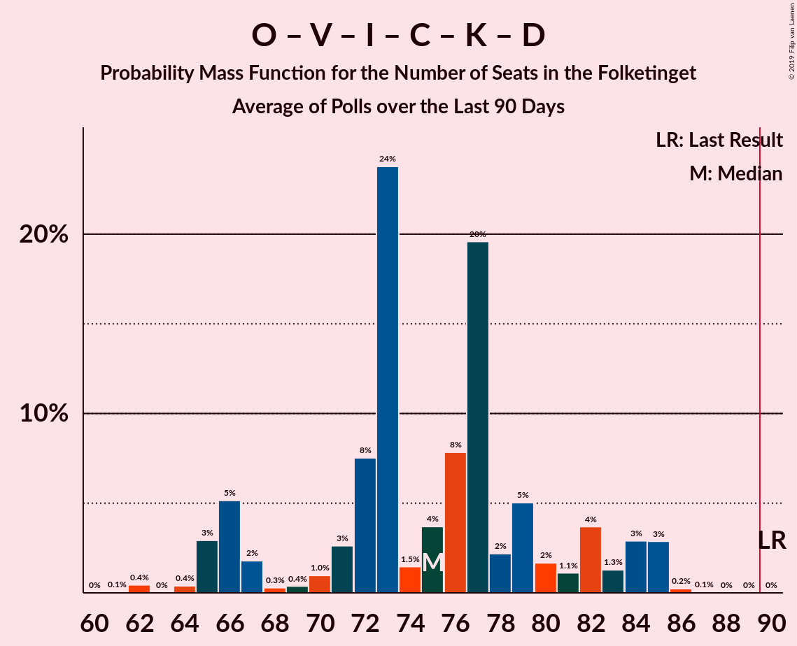

# Poll Average

<a href="#voting-intentions">Voting Intentions</a> | <a href="#seats">Seats</a> | <a href="#coalitions">Coalitions</a> | <a href="#technical-information">Technical Information</a>

## Summary

The table below lists the polls on which the average is based. They are the most recent polls (less than 90 days old) registered and analyzed so far.

| Period     | Polling firm/Commissioner(s) | A | O | V | Ø | I | Å | B | F | C | K | D | E | P |
|:----------:|:----------------------------:|:--:|:--:|:--:|:--:|:--:|:--:|:--:|:--:|:--:|:--:|:--:|:--:|:--:|
| 18 June 2015 | General Election | 26.3%   47 | 21.1%   37 | 19.5%   34 | 7.8%   14 | 7.5%   13 | 4.8%   9 | 4.6%   8 | 4.2%   7 | 3.4%   6 | 0.8%   0 | 0.0%   0 | 0.0%   0 | 0.0%   0 |
| N/A | Poll Average | 22–32%   37–56 | 10–16%   18–28 | 15–21%   26–37 | 7–12%   12–20 | 3–6%   4–11 | 2–5%   4–9 | 5–10%   9–19 | 5–9%   10–17 | 3–7%   6–12 | 0–2%   0 | 1–7%   0–11 | 0–2%   0 | 2–5%   0–9 |
| [7 May 2019](2019-05-07-Epinion.html) | Epinion   DR | 26–30%   46–51 | 12–16%   21–28 | 16–19%   28–34 | 8–10%   12–18 | 3–5%   4–8 | 3–5%   6–9 | 4–7%   8–14 | 6–8%   11–15 | 4–6%   8–12 | 0–1%   0 | 2–4%   4–7 | 0–1%   0 | 2–4%   0–5 |
| [28 April–5 May 2019](2019-05-05-Voxmeter.html) | Voxmeter   Ritzau | 25–30%   44–53 | 10–14%   19–26 | 17–22%   32–37 | 9–13%   18–22 | 4–6%   7–10 | 2–4%   5–7 | 6–9%   10–15 | 5–8%   11–15 | 3–5%   5–9 | 1–2%   0 | 0–2%   0 | 0–1%   0 | 2–4%   0–5 |
| [1–3 May 2019](2019-05-03-YouGov.html) | YouGov | 21–25%   36–44 | 10–13%   17–22 | 15–19%   28–34 | 8–11%   14–20 | 3–4%   5–7 | 3–4%   5–8 | 5–8%   10–14 | 7–10%   13–18 | 5–7%   9–12 | 1%   0 | 5–8%   9–14 | 0–1%   0 | 3–5%   6–9 |
| [29 April–2 May 2019](2019-05-02-Megafon.html) | Megafon   Politiken and TV 2 | 22–27%   41–48 | 11–15%   18–25 | 16–21%   30–35 | 8–12%   16–19 | 2–5%   5–8 | 2–5%   5–7 | 7–11%   13–19 | 6–9%   12–16 | 3–6%   5–11 | 0–1%   0 | 2–4%   4–7 | 1–2%   0–4 | 2–4%   4–6 |
| [1 April 2019](2019-04-01-GreensAnalyseinstitut.html) | Greens Analyseinstitut   Børsen | 28–33%   50–59 | 12–17%   23–30 | 14–18%   25–33 | 7–11%   14–18 | 3–5%   5–9 | 2–4%   0–7 | 5–7%   9–13 | 6–9%   10–15 | 4–6%   7–10 | 1–2%   0–4 | 2–5%   4–8 | 1–2%   0 | N/A   N/A |
| [21–26 March 2019](2019-03-26-Norstat.html) | Norstat   Altinget and Jyllands-Posten | 26–31%   48–54 | 12–16%   22–29 | 15–19%   28–32 | 7–11%   13–18 | 2–4%   4–8 | 3–6%   6–11 | 6–9%   11–15 | 5–8%   9–14 | 3–6%   6–10 | 1–2%   0 | 3–5%   5–9 | 0–2%   0 | N/A   N/A |
| [8–14 March 2019](2019-03-14-KantarGallup.html) | Kantar Gallup   Berlingske | 24–28%   42–50 | 12–15%   21–27 | 18–22%   32–38 | 7–9%   11–15 | 4–7%   8–11 | 3–5%   5–8 | 6–8%   10–15 | 6–8%   11–14 | 4–6%   7–11 | 1%   0 | 2–3%   0–6 | 1–2%   0 | N/A   N/A |
| 18 June 2015 | General Election | 26.3%   47 | 21.1%   37 | 19.5%   34 | 7.8%   14 | 7.5%   13 | 4.8%   9 | 4.6%   8 | 4.2%   7 | 3.4%   6 | 0.8%   0 | 0.0%   0 | 0.0%   0 | 0.0%   0 |

Only polls for which at least the sample size has been published are included in the table above.

**Legend:**
+ **Top half of each row:** Voting intentions (95% confidence interval)
+ **Bottom half of each row:** Seat projections for the Folketinget (95% confidence interval)
+ **A:** Socialdemokraterne
+ **O:** Dansk Folkeparti
+ **V:** Venstre
+ **Ø:** Enhedslisten–De Rød-Grønne
+ **I:** Liberal Alliance
+ **Å:** Alternativet
+ **B:** Radikale Venstre
+ **F:** Socialistisk Folkeparti
+ **C:** Det Konservative Folkeparti
+ **K:** Kristendemokraterne
+ **D:** Nye Borgerlige
+ **E:** Klaus Riskær Pedersen
+ **P:** Stram Kurs
+ **N/A (single party):** Party not included the published results
+ **N/A (entire row):** Calculation for this opinion poll not started yet

## Voting Intentions

### Confidence Intervals

| Party | Last Result | Median | 80% Confidence Interval | 90% Confidence Interval | 95% Confidence Interval | 99% Confidence Interval |
|:-----:|:-----------:|:------:|:-----------------------:|:-----------------------:|:-----------------------:|:-----------------------:|
| <a href="#socialdemokraterne">Socialdemokraterne</a> | 26.3% | 27.1% | 23.2–30.3% |22.4–31.2% | 21.9–31.8% | 21.1–33.0% |
| <a href="#dansk-folkeparti">Dansk Folkeparti</a> | 21.1% | 13.3% | 11.2–15.1% |10.7–15.5% | 10.4–15.9% | 9.8–16.7% |
| <a href="#venstre">Venstre</a> | 19.5% | 17.7% | 15.7–20.2% |15.2–20.7% | 14.7–21.2% | 13.8–22.0% |
| <a href="#enhedslisten–de-rød-grønne">Enhedslisten–De Rød-Grønne</a> | 7.8% | 9.2% | 7.8–10.7% |7.5–11.2% | 7.2–11.7% | 6.7–12.5% |
| <a href="#liberal-alliance">Liberal Alliance</a> | 7.5% | 3.8% | 2.9–5.5% |2.7–5.8% | 2.6–6.1% | 2.3–6.6% |
| <a href="#alternativet">Alternativet</a> | 4.8% | 3.7% | 2.8–4.6% |2.6–4.9% | 2.4–5.1% | 2.1–5.6% |
| <a href="#radikale-venstre">Radikale Venstre</a> | 4.6% | 6.7% | 5.4–8.6% |5.1–9.3% | 4.9–9.7% | 4.5–10.6% |
| <a href="#socialistisk-folkeparti">Socialistisk Folkeparti</a> | 4.2% | 7.1% | 6.0–8.6% |5.7–9.0% | 5.4–9.4% | 5.0–10.0% |
| <a href="#det-konservative-folkeparti">Det Konservative Folkeparti</a> | 3.4% | 4.8% | 3.6–6.0% |3.3–6.3% | 3.0–6.6% | 2.6–7.1% |
| <a href="#kristendemokraterne">Kristendemokraterne</a> | 0.8% | 0.9% | 0.4–1.4% |0.3–1.6% | 0.3–1.7% | 0.2–2.0% |
| <a href="#nye-borgerlige">Nye Borgerlige</a> | 0.0% | 3.1% | 1.1–6.0% |0.8–6.5% | 0.7–6.9% | 0.5–7.5% |
| <a href="#klaus-riskær-pedersen">Klaus Riskær Pedersen</a> | 0.0% | 0.9% | 0.2–1.5% |0.1–1.7% | 0.1–1.9% | 0.1–2.2% |
| <a href="#stram-kurs">Stram Kurs</a> | 0.0% | 2.8% | 2.1–4.1% |1.9–4.4% | 1.8–4.6% | 1.6–5.0% |

### Socialdemokraterne

*For a full overview of the results for this party, see the [Socialdemokraterne](party-socialdemokraterne.html) page.*

| Voting Intentions | Probability | Accumulated | Special Marks |
|:-----------------:|:-----------:|:-----------:|:-------------:|
| 18.5–19.5% | 0% | 100% |  |
| 19.5–20.5% | 0.1% | 100% |  |
| 20.5–21.5% | 1.2% | 99.9% |  |
| 21.5–22.5% | 4% | 98.7% |  |
| 22.5–23.5% | 7% | 94% |  |
| 23.5–24.5% | 8% | 87% |  |
| 24.5–25.5% | 9% | 79% |  |
| 25.5–26.5% | 12% | 70% | Last Result |
| 26.5–27.5% | 14% | 58% | Median |
| 27.5–28.5% | 15% | 44% |  |
| 28.5–29.5% | 12% | 29% |  |
| 29.5–30.5% | 8% | 17% |  |
| 30.5–31.5% | 5% | 8% |  |
| 31.5–32.5% | 2% | 3% |  |
| 32.5–33.5% | 0.8% | 1.0% |  |
| 33.5–34.5% | 0.2% | 0.2% |  |
| 34.5–35.5% | 0% | 0% |  |

### Dansk Folkeparti

*For a full overview of the results for this party, see the [Dansk Folkeparti](party-danskfolkeparti.html) page.*

| Voting Intentions | Probability | Accumulated | Special Marks |
|:-----------------:|:-----------:|:-----------:|:-------------:|
| 7.5–8.5% | 0% | 100% |  |
| 8.5–9.5% | 0.2% | 100% |  |
| 9.5–10.5% | 3% | 99.8% |  |
| 10.5–11.5% | 12% | 96% |  |
| 11.5–12.5% | 17% | 85% |  |
| 12.5–13.5% | 23% | 68% | Median |
| 13.5–14.5% | 26% | 45% |  |
| 14.5–15.5% | 14% | 19% |  |
| 15.5–16.5% | 4% | 5% |  |
| 16.5–17.5% | 0.7% | 0.7% |  |
| 17.5–18.5% | 0.1% | 0.1% |  |
| 18.5–19.5% | 0% | 0% |  |
| 19.5–20.5% | 0% | 0% |  |
| 20.5–21.5% | 0% | 0% | Last Result |

### Venstre

*For a full overview of the results for this party, see the [Venstre](party-venstre.html) page.*

| Voting Intentions | Probability | Accumulated | Special Marks |
|:-----------------:|:-----------:|:-----------:|:-------------:|
| 11.5–12.5% | 0% | 100% |  |
| 12.5–13.5% | 0.2% | 100% |  |
| 13.5–14.5% | 2% | 99.8% |  |
| 14.5–15.5% | 6% | 98% |  |
| 15.5–16.5% | 15% | 92% |  |
| 16.5–17.5% | 22% | 77% |  |
| 17.5–18.5% | 21% | 55% | Median |
| 18.5–19.5% | 16% | 34% |  |
| 19.5–20.5% | 11% | 18% | Last Result |
| 20.5–21.5% | 5% | 6% |  |
| 21.5–22.5% | 1.2% | 1.3% |  |
| 22.5–23.5% | 0.1% | 0.2% |  |
| 23.5–24.5% | 0% | 0% |  |

### Enhedslisten–De Rød-Grønne

*For a full overview of the results for this party, see the [Enhedslisten–De Rød-Grønne](party-enhedslisten–derød-grønne.html) page.*

| Voting Intentions | Probability | Accumulated | Special Marks |
|:-----------------:|:-----------:|:-----------:|:-------------:|
| 4.5–5.5% | 0% | 100% |  |
| 5.5–6.5% | 0.3% | 100% |  |
| 6.5–7.5% | 5% | 99.7% |  |
| 7.5–8.5% | 23% | 94% | Last Result |
| 8.5–9.5% | 36% | 72% | Median |
| 9.5–10.5% | 23% | 36% |  |
| 10.5–11.5% | 10% | 13% |  |
| 11.5–12.5% | 3% | 3% |  |
| 12.5–13.5% | 0.4% | 0.4% |  |
| 13.5–14.5% | 0% | 0% |  |

### Liberal Alliance

*For a full overview of the results for this party, see the [Liberal Alliance](party-liberalalliance.html) page.*

| Voting Intentions | Probability | Accumulated | Special Marks |
|:-----------------:|:-----------:|:-----------:|:-------------:|
| 0.5–1.5% | 0% | 100% |  |
| 1.5–2.5% | 2% | 100% |  |
| 2.5–3.5% | 36% | 98% |  |
| 3.5–4.5% | 35% | 62% | Median |
| 4.5–5.5% | 19% | 27% |  |
| 5.5–6.5% | 8% | 9% |  |
| 6.5–7.5% | 0.6% | 0.6% |  |
| 7.5–8.5% | 0% | 0% | Last Result |

### Alternativet

*For a full overview of the results for this party, see the [Alternativet](party-alternativet.html) page.*

| Voting Intentions | Probability | Accumulated | Special Marks |
|:-----------------:|:-----------:|:-----------:|:-------------:|
| 0.5–1.5% | 0% | 100% |  |
| 1.5–2.5% | 4% | 100% |  |
| 2.5–3.5% | 40% | 96% |  |
| 3.5–4.5% | 43% | 55% | Median |
| 4.5–5.5% | 11% | 12% | Last Result |
| 5.5–6.5% | 0.6% | 0.7% |  |
| 6.5–7.5% | 0% | 0% |  |

### Radikale Venstre

*For a full overview of the results for this party, see the [Radikale Venstre](party-radikalevenstre.html) page.*

| Voting Intentions | Probability | Accumulated | Special Marks |
|:-----------------:|:-----------:|:-----------:|:-------------:|
| 2.5–3.5% | 0% | 100% |  |
| 3.5–4.5% | 0.8% | 100% |  |
| 4.5–5.5% | 12% | 99.2% | Last Result |
| 5.5–6.5% | 30% | 87% |  |
| 6.5–7.5% | 32% | 57% | Median |
| 7.5–8.5% | 15% | 25% |  |
| 8.5–9.5% | 7% | 10% |  |
| 9.5–10.5% | 3% | 3% |  |
| 10.5–11.5% | 0.5% | 0.6% |  |
| 11.5–12.5% | 0% | 0% |  |

### Socialistisk Folkeparti

*For a full overview of the results for this party, see the [Socialistisk Folkeparti](party-socialistiskfolkeparti.html) page.*

| Voting Intentions | Probability | Accumulated | Special Marks |
|:-----------------:|:-----------:|:-----------:|:-------------:|
| 3.5–4.5% | 0.1% | 100% | Last Result |
| 4.5–5.5% | 3% | 99.9% |  |
| 5.5–6.5% | 25% | 97% |  |
| 6.5–7.5% | 39% | 71% | Median |
| 7.5–8.5% | 22% | 32% |  |
| 8.5–9.5% | 9% | 11% |  |
| 9.5–10.5% | 1.5% | 2% |  |
| 10.5–11.5% | 0.1% | 0.1% |  |
| 11.5–12.5% | 0% | 0% |  |

### Det Konservative Folkeparti

*For a full overview of the results for this party, see the [Det Konservative Folkeparti](party-detkonservativefolkeparti.html) page.*

| Voting Intentions | Probability | Accumulated | Special Marks |
|:-----------------:|:-----------:|:-----------:|:-------------:|
| 0.5–1.5% | 0% | 100% |  |
| 1.5–2.5% | 0.3% | 100% |  |
| 2.5–3.5% | 9% | 99.7% | Last Result |
| 3.5–4.5% | 31% | 90% |  |
| 4.5–5.5% | 38% | 60% | Median |
| 5.5–6.5% | 19% | 22% |  |
| 6.5–7.5% | 3% | 3% |  |
| 7.5–8.5% | 0.1% | 0.1% |  |
| 8.5–9.5% | 0% | 0% |  |

### Kristendemokraterne

*For a full overview of the results for this party, see the [Kristendemokraterne](party-kristendemokraterne.html) page.*

| Voting Intentions | Probability | Accumulated | Special Marks |
|:-----------------:|:-----------:|:-----------:|:-------------:|
| 0.0–0.5% | 20% | 100% |  |
| 0.5–1.5% | 75% | 80% | Last Result, Median |
| 1.5–2.5% | 5% | 5% |  |
| 2.5–3.5% | 0% | 0% |  |

### Nye Borgerlige

*For a full overview of the results for this party, see the [Nye Borgerlige](party-nyeborgerlige.html) page.*

| Voting Intentions | Probability | Accumulated | Special Marks |
|:-----------------:|:-----------:|:-----------:|:-------------:|
| 0.0–0.5% | 1.0% | 100% | Last Result |
| 0.5–1.5% | 13% | 99.0% |  |
| 1.5–2.5% | 15% | 86% |  |
| 2.5–3.5% | 36% | 71% | Median |
| 3.5–4.5% | 16% | 34% |  |
| 4.5–5.5% | 5% | 18% |  |
| 5.5–6.5% | 8% | 13% |  |
| 6.5–7.5% | 5% | 5% |  |
| 7.5–8.5% | 0.4% | 0.4% |  |
| 8.5–9.5% | 0% | 0% |  |

### Klaus Riskær Pedersen

*For a full overview of the results for this party, see the [Klaus Riskær Pedersen](party-klausriskærpedersen.html) page.*

| Voting Intentions | Probability | Accumulated | Special Marks |
|:-----------------:|:-----------:|:-----------:|:-------------:|
| 0.0–0.5% | 30% | 100% | Last Result |
| 0.5–1.5% | 61% | 70% | Median |
| 1.5–2.5% | 10% | 10% |  |
| 2.5–3.5% | 0.1% | 0.1% |  |
| 3.5–4.5% | 0% | 0% |  |

### Stram Kurs

*For a full overview of the results for this party, see the [Stram Kurs](party-stramkurs.html) page.*

| Voting Intentions | Probability | Accumulated | Special Marks |
|:-----------------:|:-----------:|:-----------:|:-------------:|
| 0.0–0.5% | 0% | 100% | Last Result |
| 0.5–1.5% | 0.5% | 100% |  |
| 1.5–2.5% | 33% | 99.5% |  |
| 2.5–3.5% | 44% | 67% | Median |
| 3.5–4.5% | 20% | 23% |  |
| 4.5–5.5% | 3% | 3% |  |
| 5.5–6.5% | 0% | 0% |  |

## Seats

### Confidence Intervals

| Party | Last Result | Median | 80% Confidence Interval | 90% Confidence Interval | 95% Confidence Interval | 99% Confidence Interval |
|:-----:|:-----------:|:------:|:-----------------------:|:-----------------------:|:-----------------------:|:-----------------------:|
| <a href="#socialdemokraterne">Socialdemokraterne</a> | 47 | 48 | 41–54 |40–54 | 37–56 | 36–59 |
| <a href="#dansk-folkeparti">Dansk Folkeparti</a> | 37 | 24 | 19–27 |19–27 | 18–28 | 17–30 |
| <a href="#venstre">Venstre</a> | 34 | 31 | 28–37 |26–37 | 26–37 | 25–38 |
| <a href="#enhedslisten–de-rød-grønne">Enhedslisten–De Rød-Grønne</a> | 14 | 16 | 14–18 |13–19 | 12–20 | 11–22 |
| <a href="#liberal-alliance">Liberal Alliance</a> | 13 | 7 | 5–9 |4–11 | 4–11 | 4–11 |
| <a href="#alternativet">Alternativet</a> | 9 | 6 | 5–8 |5–9 | 4–9 | 0–10 |
| <a href="#radikale-venstre">Radikale Venstre</a> | 8 | 12 | 10–16 |9–19 | 9–19 | 8–19 |
| <a href="#socialistisk-folkeparti">Socialistisk Folkeparti</a> | 7 | 13 | 11–15 |10–16 | 10–17 | 9–18 |
| <a href="#det-konservative-folkeparti">Det Konservative Folkeparti</a> | 6 | 9 | 7–12 |7–12 | 6–12 | 5–12 |
| <a href="#kristendemokraterne">Kristendemokraterne</a> | 0 | 0 | 0 |0 | 0 | 0–4 |
| <a href="#nye-borgerlige">Nye Borgerlige</a> | 0 | 5 | 0–9 |0–11 | 0–11 | 0–14 |
| <a href="#klaus-riskær-pedersen">Klaus Riskær Pedersen</a> | 0 | 0 | 0 |0 | 0 | 0–4 |
| <a href="#stram-kurs">Stram Kurs</a> | 0 | 4 | 4–6 |0–9 | 0–9 | 0–9 |

### Socialdemokraterne

*For a full overview of the results for this party, see the [Socialdemokraterne](party-socialdemokraterne.html) page.*

| Number of Seats | Probability | Accumulated | Special Marks |
|:---------------:|:-----------:|:-----------:|:-------------:|
| 35 | 0.1% | 100% |  |
| 36 | 1.3% | 99.9% |  |
| 37 | 2% | 98.6% |  |
| 38 | 0.9% | 97% |  |
| 39 | 0.4% | 96% |  |
| 40 | 1.2% | 96% |  |
| 41 | 7% | 94% |  |
| 42 | 6% | 88% |  |
| 43 | 6% | 82% |  |
| 44 | 7% | 75% |  |
| 45 | 5% | 68% |  |
| 46 | 4% | 63% |  |
| 47 | 3% | 59% | Last Result |
| 48 | 7% | 56% | Median |
| 49 | 7% | 49% |  |
| 50 | 7% | 43% |  |
| 51 | 15% | 36% |  |
| 52 | 1.3% | 21% |  |
| 53 | 2% | 19% |  |
| 54 | 12% | 17% |  |
| 55 | 1.1% | 5% |  |
| 56 | 2% | 4% |  |
| 57 | 0.8% | 2% |  |
| 58 | 0.4% | 1.3% |  |
| 59 | 0.6% | 0.9% |  |
| 60 | 0.2% | 0.3% |  |
| 61 | 0% | 0.1% |  |
| 62 | 0% | 0% |  |

### Dansk Folkeparti

*For a full overview of the results for this party, see the [Dansk Folkeparti](party-danskfolkeparti.html) page.*

| Number of Seats | Probability | Accumulated | Special Marks |
|:---------------:|:-----------:|:-----------:|:-------------:|
| 17 | 1.0% | 100% |  |
| 18 | 4% | 99.0% |  |
| 19 | 12% | 95% |  |
| 20 | 7% | 83% |  |
| 21 | 15% | 76% |  |
| 22 | 3% | 62% |  |
| 23 | 5% | 58% |  |
| 24 | 16% | 54% | Median |
| 25 | 10% | 38% |  |
| 26 | 4% | 28% |  |
| 27 | 19% | 24% |  |
| 28 | 3% | 5% |  |
| 29 | 1.3% | 2% |  |
| 30 | 0.4% | 0.5% |  |
| 31 | 0.1% | 0.1% |  |
| 32 | 0% | 0% |  |
| 33 | 0% | 0% |  |
| 34 | 0% | 0% |  |
| 35 | 0% | 0% |  |
| 36 | 0% | 0% |  |
| 37 | 0% | 0% | Last Result |

### Venstre

*For a full overview of the results for this party, see the [Venstre](party-venstre.html) page.*

| Number of Seats | Probability | Accumulated | Special Marks |
|:---------------:|:-----------:|:-----------:|:-------------:|
| 23 | 0.2% | 100% |  |
| 24 | 0.1% | 99.8% |  |
| 25 | 0.6% | 99.7% |  |
| 26 | 7% | 99.1% |  |
| 27 | 2% | 92% |  |
| 28 | 3% | 90% |  |
| 29 | 5% | 87% |  |
| 30 | 10% | 82% |  |
| 31 | 23% | 71% | Median |
| 32 | 5% | 48% |  |
| 33 | 17% | 44% |  |
| 34 | 3% | 27% | Last Result |
| 35 | 5% | 24% |  |
| 36 | 1.2% | 19% |  |
| 37 | 16% | 17% |  |
| 38 | 0.9% | 1.1% |  |
| 39 | 0.1% | 0.2% |  |
| 40 | 0.1% | 0.1% |  |
| 41 | 0% | 0% |  |

### Enhedslisten–De Rød-Grønne

*For a full overview of the results for this party, see the [Enhedslisten–De Rød-Grønne](party-enhedslisten–derød-grønne.html) page.*

| Number of Seats | Probability | Accumulated | Special Marks |
|:---------------:|:-----------:|:-----------:|:-------------:|
| 10 | 0.2% | 100% |  |
| 11 | 0.9% | 99.8% |  |
| 12 | 2% | 99.0% |  |
| 13 | 4% | 97% |  |
| 14 | 7% | 92% | Last Result |
| 15 | 27% | 85% |  |
| 16 | 10% | 58% | Median |
| 17 | 19% | 48% |  |
| 18 | 24% | 30% |  |
| 19 | 2% | 5% |  |
| 20 | 1.1% | 3% |  |
| 21 | 1.2% | 2% |  |
| 22 | 0.4% | 0.5% |  |
| 23 | 0% | 0.1% |  |
| 24 | 0.1% | 0.1% |  |
| 25 | 0% | 0% |  |

### Liberal Alliance

*For a full overview of the results for this party, see the [Liberal Alliance](party-liberalalliance.html) page.*

| Number of Seats | Probability | Accumulated | Special Marks |
|:---------------:|:-----------:|:-----------:|:-------------:|
| 4 | 8% | 100% |  |
| 5 | 9% | 92% |  |
| 6 | 25% | 83% |  |
| 7 | 19% | 58% | Median |
| 8 | 14% | 39% |  |
| 9 | 15% | 25% |  |
| 10 | 2% | 10% |  |
| 11 | 8% | 8% |  |
| 12 | 0.3% | 0.4% |  |
| 13 | 0% | 0% | Last Result |

### Alternativet

*For a full overview of the results for this party, see the [Alternativet](party-alternativet.html) page.*

| Number of Seats | Probability | Accumulated | Special Marks |
|:---------------:|:-----------:|:-----------:|:-------------:|
| 0 | 1.3% | 100% |  |
| 1 | 0% | 98.7% |  |
| 2 | 0% | 98.7% |  |
| 3 | 0% | 98.7% |  |
| 4 | 3% | 98.7% |  |
| 5 | 23% | 96% |  |
| 6 | 30% | 73% | Median |
| 7 | 22% | 43% |  |
| 8 | 14% | 21% |  |
| 9 | 5% | 7% | Last Result |
| 10 | 1.0% | 1.5% |  |
| 11 | 0.4% | 0.4% |  |
| 12 | 0% | 0% |  |

### Radikale Venstre

*For a full overview of the results for this party, see the [Radikale Venstre](party-radikalevenstre.html) page.*

| Number of Seats | Probability | Accumulated | Special Marks |
|:---------------:|:-----------:|:-----------:|:-------------:|
| 7 | 0.2% | 100% |  |
| 8 | 2% | 99.8% | Last Result |
| 9 | 8% | 98% |  |
| 10 | 13% | 91% |  |
| 11 | 11% | 77% |  |
| 12 | 31% | 67% | Median |
| 13 | 7% | 35% |  |
| 14 | 12% | 28% |  |
| 15 | 4% | 16% |  |
| 16 | 5% | 12% |  |
| 17 | 0.7% | 7% |  |
| 18 | 0.3% | 6% |  |
| 19 | 6% | 6% |  |
| 20 | 0% | 0% |  |

### Socialistisk Folkeparti

*For a full overview of the results for this party, see the [Socialistisk Folkeparti](party-socialistiskfolkeparti.html) page.*

| Number of Seats | Probability | Accumulated | Special Marks |
|:---------------:|:-----------:|:-----------:|:-------------:|
| 7 | 0% | 100% | Last Result |
| 8 | 0.1% | 100% |  |
| 9 | 0.7% | 99.9% |  |
| 10 | 7% | 99.2% |  |
| 11 | 16% | 93% |  |
| 12 | 16% | 77% |  |
| 13 | 27% | 61% | Median |
| 14 | 18% | 34% |  |
| 15 | 9% | 16% |  |
| 16 | 4% | 7% |  |
| 17 | 3% | 3% |  |
| 18 | 0.6% | 0.7% |  |
| 19 | 0% | 0.1% |  |
| 20 | 0.1% | 0.1% |  |
| 21 | 0% | 0% |  |

### Det Konservative Folkeparti

*For a full overview of the results for this party, see the [Det Konservative Folkeparti](party-detkonservativefolkeparti.html) page.*

| Number of Seats | Probability | Accumulated | Special Marks |
|:---------------:|:-----------:|:-----------:|:-------------:|
| 5 | 2% | 100% |  |
| 6 | 2% | 98% | Last Result |
| 7 | 29% | 96% |  |
| 8 | 11% | 67% |  |
| 9 | 16% | 56% | Median |
| 10 | 10% | 41% |  |
| 11 | 19% | 31% |  |
| 12 | 11% | 11% |  |
| 13 | 0.1% | 0.1% |  |
| 14 | 0% | 0% |  |

### Kristendemokraterne

*For a full overview of the results for this party, see the [Kristendemokraterne](party-kristendemokraterne.html) page.*

| Number of Seats | Probability | Accumulated | Special Marks |
|:---------------:|:-----------:|:-----------:|:-------------:|
| 0 | 99.5% | 100% | Last Result, Median |
| 1 | 0% | 0.5% |  |
| 2 | 0% | 0.5% |  |
| 3 | 0% | 0.5% |  |
| 4 | 0.3% | 0.5% |  |
| 5 | 0.2% | 0.2% |  |
| 6 | 0% | 0% |  |

### Nye Borgerlige

*For a full overview of the results for this party, see the [Nye Borgerlige](party-nyeborgerlige.html) page.*

| Number of Seats | Probability | Accumulated | Special Marks |
|:---------------:|:-----------:|:-----------:|:-------------:|
| 0 | 18% | 100% | Last Result |
| 1 | 0% | 82% |  |
| 2 | 0% | 82% |  |
| 3 | 0% | 82% |  |
| 4 | 8% | 82% |  |
| 5 | 28% | 73% | Median |
| 6 | 13% | 45% |  |
| 7 | 15% | 32% |  |
| 8 | 2% | 17% |  |
| 9 | 8% | 15% |  |
| 10 | 0.6% | 7% |  |
| 11 | 4% | 6% |  |
| 12 | 1.0% | 2% |  |
| 13 | 0.2% | 1.0% |  |
| 14 | 0.8% | 0.8% |  |
| 15 | 0% | 0% |  |

### Klaus Riskær Pedersen

*For a full overview of the results for this party, see the [Klaus Riskær Pedersen](party-klausriskærpedersen.html) page.*

| Number of Seats | Probability | Accumulated | Special Marks |
|:---------------:|:-----------:|:-----------:|:-------------:|
| 0 | 99.3% | 100% | Last Result, Median |
| 1 | 0% | 0.7% |  |
| 2 | 0% | 0.7% |  |
| 3 | 0% | 0.7% |  |
| 4 | 0.7% | 0.7% |  |
| 5 | 0.1% | 0.1% |  |
| 6 | 0% | 0% |  |

### Stram Kurs

*For a full overview of the results for this party, see the [Stram Kurs](party-stramkurs.html) page.*

| Number of Seats | Probability | Accumulated | Special Marks |
|:---------------:|:-----------:|:-----------:|:-------------:|
| 0 | 6% | 100% | Last Result |
| 1 | 0% | 94% |  |
| 2 | 0% | 94% |  |
| 3 | 0% | 94% |  |
| 4 | 44% | 94% | Median |
| 5 | 23% | 50% |  |
| 6 | 17% | 27% |  |
| 7 | 3% | 10% |  |
| 8 | 1.3% | 7% |  |
| 9 | 5% | 6% |  |
| 10 | 0.3% | 0.3% |  |
| 11 | 0% | 0% |  |

## Coalitions

### Confidence Intervals

| Coalition | Last Result | Median | Majority? | 80% Confidence Interval | 90% Confidence Interval | 95% Confidence Interval | 99% Confidence Interval |
|:---------:|:-----------:|:------:|:---------:|:-----------------------:|:-----------------------:|:-----------------------:|:-----------------------:|
| Socialdemokraterne – Enhedslisten–De Rød-Grønne – Alternativet – Radikale Venstre – Socialistisk Folkeparti | 85 | 97 | 90% | 90–100 | 89–101 | 88–103 | 86–106 |
| Socialdemokraterne – Enhedslisten–De Rød-Grønne – Radikale Venstre – Socialistisk Folkeparti | 76 | 91 | 54% | 83–95 | 81–95 | 81–97 | 80–100 |
| Socialdemokraterne – Enhedslisten–De Rød-Grønne – Alternativet – Socialistisk Folkeparti | 77 | 83 | 4% | 77–88 | 77–89 | 76–91 | 75–94 |
| Dansk Folkeparti – Venstre – Liberal Alliance – Det Konservative Folkeparti – Kristendemokraterne – Klaus Riskær Pedersen – Nye Borgerlige – Stram Kurs | 90 | 80 | 0.2% | 76–85 | 76–87 | 74–89 | 71–89 |
| Dansk Folkeparti – Venstre – Liberal Alliance – Det Konservative Folkeparti – Kristendemokraterne – Klaus Riskær Pedersen – Nye Borgerlige | 90 | 76 | 0% | 72–84 | 72–85 | 71–86 | 68–88 |
| Dansk Folkeparti – Venstre – Liberal Alliance – Det Konservative Folkeparti – Klaus Riskær Pedersen – Nye Borgerlige | 90 | 76 | 0% | 72–84 | 72–85 | 71–86 | 68–88 |
| Dansk Folkeparti – Venstre – Liberal Alliance – Det Konservative Folkeparti – Kristendemokraterne – Nye Borgerlige | 90 | 76 | 0% | 72–84 | 72–85 | 71–86 | 68–87 |
| Dansk Folkeparti – Venstre – Liberal Alliance – Det Konservative Folkeparti – Nye Borgerlige | 90 | 76 | 0% | 72–84 | 72–85 | 71–86 | 68–87 |
| Socialdemokraterne – Enhedslisten–De Rød-Grønne – Socialistisk Folkeparti | 68 | 76 | 0.5% | 71–83 | 69–84 | 69–85 | 68–90 |
| Dansk Folkeparti – Venstre – Liberal Alliance – Det Konservative Folkeparti – Kristendemokraterne | 90 | 70 | 0% | 67–80 | 66–82 | 65–84 | 63–84 |
| Dansk Folkeparti – Venstre – Liberal Alliance – Det Konservative Folkeparti | 90 | 70 | 0% | 67–80 | 66–82 | 65–84 | 63–84 |
| Socialdemokraterne – Radikale Venstre – Socialistisk Folkeparti | 62 | 73 | 0% | 68–79 | 66–80 | 65–80 | 62–83 |
| Socialdemokraterne – Radikale Venstre | 55 | 60 | 0% | 53–66 | 51–66 | 48–68 | 47–70 |
| Venstre – Liberal Alliance – Det Konservative Folkeparti | 53 | 48 | 0% | 42–55 | 41–57 | 41–57 | 39–58 |
| Venstre – Det Konservative Folkeparti | 40 | 42 | 0% | 35–46 | 33–46 | 33–48 | 32–48 |
| Venstre | 34 | 31 | 0% | 28–37 | 26–37 | 26–37 | 25–38 |

### Socialdemokraterne – Enhedslisten–De Rød-Grønne – Alternativet – Radikale Venstre – Socialistisk Folkeparti

| Number of Seats | Probability | Accumulated | Special Marks |
|:---------------:|:-----------:|:-----------:|:-------------:|
| 85 | 0.1% | 100% | Last Result |
| 86 | 2% | 99.9% |  |
| 87 | 0.5% | 98% |  |
| 88 | 2% | 98% |  |
| 89 | 6% | 96% |  |
| 90 | 4% | 90% | Majority |
| 91 | 12% | 87% |  |
| 92 | 5% | 75% |  |
| 93 | 4% | 70% |  |
| 94 | 1.4% | 66% |  |
| 95 | 9% | 64% | Median |
| 96 | 3% | 55% |  |
| 97 | 10% | 52% |  |
| 98 | 7% | 42% |  |
| 99 | 17% | 34% |  |
| 100 | 12% | 18% |  |
| 101 | 1.5% | 6% |  |
| 102 | 1.4% | 4% |  |
| 103 | 1.4% | 3% |  |
| 104 | 0.7% | 1.4% |  |
| 105 | 0.1% | 0.7% |  |
| 106 | 0.5% | 0.6% |  |
| 107 | 0% | 0.1% |  |
| 108 | 0% | 0% |  |

### Socialdemokraterne – Enhedslisten–De Rød-Grønne – Radikale Venstre – Socialistisk Folkeparti

| Number of Seats | Probability | Accumulated | Special Marks |
|:---------------:|:-----------:|:-----------:|:-------------:|
| 76 | 0% | 100% | Last Result |
| 77 | 0% | 100% |  |
| 78 | 0.1% | 100% |  |
| 79 | 0.3% | 99.9% |  |
| 80 | 2% | 99.6% |  |
| 81 | 3% | 98% |  |
| 82 | 2% | 94% |  |
| 83 | 8% | 92% |  |
| 84 | 2% | 84% |  |
| 85 | 13% | 82% |  |
| 86 | 3% | 69% |  |
| 87 | 4% | 66% |  |
| 88 | 4% | 62% |  |
| 89 | 4% | 58% | Median |
| 90 | 2% | 54% | Majority |
| 91 | 18% | 52% |  |
| 92 | 2% | 34% |  |
| 93 | 7% | 32% |  |
| 94 | 13% | 24% |  |
| 95 | 8% | 12% |  |
| 96 | 1.0% | 4% |  |
| 97 | 0.6% | 3% |  |
| 98 | 0.3% | 2% |  |
| 99 | 0.7% | 2% |  |
| 100 | 0.7% | 0.9% |  |
| 101 | 0% | 0.1% |  |
| 102 | 0.1% | 0.1% |  |
| 103 | 0% | 0% |  |

### Socialdemokraterne – Enhedslisten–De Rød-Grønne – Alternativet – Socialistisk Folkeparti

| Number of Seats | Probability | Accumulated | Special Marks |
|:---------------:|:-----------:|:-----------:|:-------------:|
| 73 | 0.2% | 100% |  |
| 74 | 0.1% | 99.7% |  |
| 75 | 2% | 99.7% |  |
| 76 | 1.2% | 98% |  |
| 77 | 9% | 97% | Last Result |
| 78 | 11% | 88% |  |
| 79 | 2% | 77% |  |
| 80 | 3% | 74% |  |
| 81 | 9% | 72% |  |
| 82 | 7% | 63% |  |
| 83 | 6% | 55% | Median |
| 84 | 5% | 49% |  |
| 85 | 10% | 44% |  |
| 86 | 3% | 34% |  |
| 87 | 14% | 31% |  |
| 88 | 13% | 18% |  |
| 89 | 1.0% | 5% |  |
| 90 | 0.8% | 4% | Majority |
| 91 | 1.3% | 3% |  |
| 92 | 0.7% | 2% |  |
| 93 | 0.6% | 1.2% |  |
| 94 | 0.5% | 0.6% |  |
| 95 | 0% | 0.1% |  |
| 96 | 0% | 0% |  |

### Dansk Folkeparti – Venstre – Liberal Alliance – Det Konservative Folkeparti – Kristendemokraterne – Klaus Riskær Pedersen – Nye Borgerlige – Stram Kurs

| Number of Seats | Probability | Accumulated | Special Marks |
|:---------------:|:-----------:|:-----------:|:-------------:|
| 69 | 0.2% | 100% |  |
| 70 | 0% | 99.8% |  |
| 71 | 0.5% | 99.7% |  |
| 72 | 1.3% | 99.2% |  |
| 73 | 0.3% | 98% |  |
| 74 | 0.1% | 98% |  |
| 75 | 2% | 97% |  |
| 76 | 20% | 96% |  |
| 77 | 9% | 76% |  |
| 78 | 14% | 68% |  |
| 79 | 4% | 54% |  |
| 80 | 12% | 50% | Median |
| 81 | 1.4% | 38% |  |
| 82 | 5% | 37% |  |
| 83 | 9% | 33% |  |
| 84 | 12% | 24% |  |
| 85 | 3% | 12% |  |
| 86 | 4% | 9% |  |
| 87 | 2% | 5% |  |
| 88 | 0.3% | 3% |  |
| 89 | 3% | 3% |  |
| 90 | 0.2% | 0.2% | Last Result, Majority |
| 91 | 0% | 0% |  |

### Dansk Folkeparti – Venstre – Liberal Alliance – Det Konservative Folkeparti – Kristendemokraterne – Klaus Riskær Pedersen – Nye Borgerlige

| Number of Seats | Probability | Accumulated | Special Marks |
|:---------------:|:-----------:|:-----------:|:-------------:|
| 64 | 0.1% | 100% |  |
| 65 | 0% | 99.9% |  |
| 66 | 0% | 99.9% |  |
| 67 | 0.1% | 99.8% |  |
| 68 | 0.8% | 99.7% |  |
| 69 | 0.6% | 99.0% |  |
| 70 | 0.2% | 98% |  |
| 71 | 1.5% | 98% |  |
| 72 | 12% | 97% |  |
| 73 | 12% | 85% |  |
| 74 | 4% | 72% |  |
| 75 | 15% | 68% |  |
| 76 | 8% | 53% | Median |
| 77 | 5% | 44% |  |
| 78 | 11% | 39% |  |
| 79 | 7% | 28% |  |
| 80 | 6% | 22% |  |
| 81 | 2% | 16% |  |
| 82 | 1.4% | 14% |  |
| 83 | 0.4% | 12% |  |
| 84 | 5% | 12% |  |
| 85 | 2% | 7% |  |
| 86 | 4% | 5% |  |
| 87 | 0.4% | 0.9% |  |
| 88 | 0.3% | 0.5% |  |
| 89 | 0.1% | 0.2% |  |
| 90 | 0% | 0% | Last Result, Majority |

### Dansk Folkeparti – Venstre – Liberal Alliance – Det Konservative Folkeparti – Klaus Riskær Pedersen – Nye Borgerlige

| Number of Seats | Probability | Accumulated | Special Marks |
|:---------------:|:-----------:|:-----------:|:-------------:|
| 64 | 0.1% | 100% |  |
| 65 | 0% | 99.9% |  |
| 66 | 0% | 99.9% |  |
| 67 | 0.1% | 99.8% |  |
| 68 | 0.8% | 99.7% |  |
| 69 | 0.6% | 99.0% |  |
| 70 | 0.2% | 98% |  |
| 71 | 1.5% | 98% |  |
| 72 | 12% | 97% |  |
| 73 | 12% | 85% |  |
| 74 | 5% | 72% |  |
| 75 | 15% | 68% |  |
| 76 | 8% | 52% | Median |
| 77 | 5% | 44% |  |
| 78 | 11% | 39% |  |
| 79 | 7% | 28% |  |
| 80 | 6% | 22% |  |
| 81 | 2% | 16% |  |
| 82 | 1.4% | 14% |  |
| 83 | 0.3% | 12% |  |
| 84 | 5% | 12% |  |
| 85 | 2% | 7% |  |
| 86 | 4% | 5% |  |
| 87 | 0.4% | 0.9% |  |
| 88 | 0.3% | 0.5% |  |
| 89 | 0.1% | 0.2% |  |
| 90 | 0% | 0% | Last Result, Majority |

### Dansk Folkeparti – Venstre – Liberal Alliance – Det Konservative Folkeparti – Kristendemokraterne – Nye Borgerlige

| Number of Seats | Probability | Accumulated | Special Marks |
|:---------------:|:-----------:|:-----------:|:-------------:|
| 64 | 0.1% | 100% |  |
| 65 | 0% | 99.9% |  |
| 66 | 0% | 99.9% |  |
| 67 | 0.1% | 99.8% |  |
| 68 | 0.8% | 99.7% |  |
| 69 | 0.6% | 99.0% |  |
| 70 | 0.7% | 98% |  |
| 71 | 1.5% | 98% |  |
| 72 | 12% | 96% |  |
| 73 | 12% | 84% |  |
| 74 | 4% | 72% |  |
| 75 | 15% | 68% |  |
| 76 | 8% | 53% | Median |
| 77 | 5% | 44% |  |
| 78 | 11% | 39% |  |
| 79 | 7% | 28% |  |
| 80 | 6% | 22% |  |
| 81 | 2% | 16% |  |
| 82 | 1.4% | 14% |  |
| 83 | 0.3% | 12% |  |
| 84 | 5% | 12% |  |
| 85 | 2% | 7% |  |
| 86 | 4% | 5% |  |
| 87 | 0.4% | 0.9% |  |
| 88 | 0.3% | 0.5% |  |
| 89 | 0.1% | 0.2% |  |
| 90 | 0% | 0% | Last Result, Majority |

### Dansk Folkeparti – Venstre – Liberal Alliance – Det Konservative Folkeparti – Nye Borgerlige

| Number of Seats | Probability | Accumulated | Special Marks |
|:---------------:|:-----------:|:-----------:|:-------------:|
| 64 | 0.1% | 100% |  |
| 65 | 0% | 99.9% |  |
| 66 | 0% | 99.9% |  |
| 67 | 0.1% | 99.8% |  |
| 68 | 0.8% | 99.7% |  |
| 69 | 0.6% | 99.0% |  |
| 70 | 0.7% | 98% |  |
| 71 | 1.5% | 98% |  |
| 72 | 12% | 96% |  |
| 73 | 12% | 84% |  |
| 74 | 4% | 72% |  |
| 75 | 15% | 67% |  |
| 76 | 8% | 52% | Median |
| 77 | 5% | 44% |  |
| 78 | 11% | 39% |  |
| 79 | 7% | 28% |  |
| 80 | 6% | 22% |  |
| 81 | 2% | 16% |  |
| 82 | 1.4% | 13% |  |
| 83 | 0.3% | 12% |  |
| 84 | 5% | 12% |  |
| 85 | 2% | 7% |  |
| 86 | 4% | 5% |  |
| 87 | 0.4% | 0.9% |  |
| 88 | 0.3% | 0.5% |  |
| 89 | 0.1% | 0.2% |  |
| 90 | 0% | 0% | Last Result, Majority |

### Socialdemokraterne – Enhedslisten–De Rød-Grønne – Socialistisk Folkeparti

| Number of Seats | Probability | Accumulated | Special Marks |
|:---------------:|:-----------:|:-----------:|:-------------:|
| 66 | 0.2% | 100% |  |
| 67 | 0.1% | 99.8% |  |
| 68 | 0.3% | 99.6% | Last Result |
| 69 | 5% | 99.4% |  |
| 70 | 1.5% | 94% |  |
| 71 | 6% | 93% |  |
| 72 | 12% | 87% |  |
| 73 | 2% | 75% |  |
| 74 | 5% | 73% |  |
| 75 | 14% | 67% |  |
| 76 | 5% | 53% |  |
| 77 | 9% | 49% | Median |
| 78 | 4% | 39% |  |
| 79 | 2% | 36% |  |
| 80 | 2% | 33% |  |
| 81 | 7% | 31% |  |
| 82 | 12% | 25% |  |
| 83 | 8% | 13% |  |
| 84 | 2% | 5% |  |
| 85 | 1.2% | 3% |  |
| 86 | 0.5% | 2% |  |
| 87 | 0.6% | 1.4% |  |
| 88 | 0.2% | 0.8% |  |
| 89 | 0.1% | 0.6% |  |
| 90 | 0.5% | 0.5% | Majority |
| 91 | 0% | 0% |  |

### Dansk Folkeparti – Venstre – Liberal Alliance – Det Konservative Folkeparti – Kristendemokraterne

| Number of Seats | Probability | Accumulated | Special Marks |
|:---------------:|:-----------:|:-----------:|:-------------:|
| 61 | 0% | 100% |  |
| 62 | 0.2% | 99.9% |  |
| 63 | 0.9% | 99.8% |  |
| 64 | 0.6% | 98.8% |  |
| 65 | 1.5% | 98% |  |
| 66 | 4% | 97% |  |
| 67 | 3% | 93% |  |
| 68 | 20% | 89% |  |
| 69 | 13% | 69% |  |
| 70 | 10% | 56% |  |
| 71 | 3% | 46% | Median |
| 72 | 17% | 43% |  |
| 73 | 2% | 26% |  |
| 74 | 4% | 23% |  |
| 75 | 5% | 19% |  |
| 76 | 1.0% | 14% |  |
| 77 | 1.2% | 13% |  |
| 78 | 0.7% | 12% |  |
| 79 | 1.3% | 11% |  |
| 80 | 1.2% | 10% |  |
| 81 | 4% | 9% |  |
| 82 | 1.0% | 5% |  |
| 83 | 0.4% | 4% |  |
| 84 | 4% | 4% |  |
| 85 | 0% | 0% |  |
| 86 | 0% | 0% |  |
| 87 | 0% | 0% |  |
| 88 | 0% | 0% |  |
| 89 | 0% | 0% |  |
| 90 | 0% | 0% | Last Result, Majority |

### Dansk Folkeparti – Venstre – Liberal Alliance – Det Konservative Folkeparti

| Number of Seats | Probability | Accumulated | Special Marks |
|:---------------:|:-----------:|:-----------:|:-------------:|
| 61 | 0% | 100% |  |
| 62 | 0.2% | 99.9% |  |
| 63 | 0.9% | 99.8% |  |
| 64 | 0.6% | 98.8% |  |
| 65 | 1.5% | 98% |  |
| 66 | 4% | 97% |  |
| 67 | 3% | 92% |  |
| 68 | 21% | 89% |  |
| 69 | 13% | 69% |  |
| 70 | 10% | 55% |  |
| 71 | 3% | 46% | Median |
| 72 | 17% | 42% |  |
| 73 | 2% | 25% |  |
| 74 | 4% | 23% |  |
| 75 | 5% | 19% |  |
| 76 | 1.0% | 14% |  |
| 77 | 1.1% | 13% |  |
| 78 | 0.7% | 12% |  |
| 79 | 1.3% | 11% |  |
| 80 | 1.2% | 10% |  |
| 81 | 4% | 9% |  |
| 82 | 1.0% | 5% |  |
| 83 | 0.4% | 4% |  |
| 84 | 4% | 4% |  |
| 85 | 0% | 0% |  |
| 86 | 0% | 0% |  |
| 87 | 0% | 0% |  |
| 88 | 0% | 0% |  |
| 89 | 0% | 0% |  |
| 90 | 0% | 0% | Last Result, Majority |

### Socialdemokraterne – Radikale Venstre – Socialistisk Folkeparti

| Number of Seats | Probability | Accumulated | Special Marks |
|:---------------:|:-----------:|:-----------:|:-------------:|
| 62 | 2% | 100% | Last Result |
| 63 | 0% | 98% |  |
| 64 | 0.2% | 98% |  |
| 65 | 3% | 98% |  |
| 66 | 3% | 96% |  |
| 67 | 2% | 93% |  |
| 68 | 10% | 91% |  |
| 69 | 4% | 81% |  |
| 70 | 6% | 77% |  |
| 71 | 5% | 71% |  |
| 72 | 6% | 67% |  |
| 73 | 12% | 60% | Median |
| 74 | 9% | 48% |  |
| 75 | 6% | 39% |  |
| 76 | 18% | 33% |  |
| 77 | 2% | 15% |  |
| 78 | 3% | 13% |  |
| 79 | 1.4% | 11% |  |
| 80 | 7% | 9% |  |
| 81 | 0.7% | 2% |  |
| 82 | 0.1% | 2% |  |
| 83 | 1.0% | 1.4% |  |
| 84 | 0.1% | 0.4% |  |
| 85 | 0.2% | 0.3% |  |
| 86 | 0% | 0% |  |

### Socialdemokraterne – Radikale Venstre

| Number of Seats | Probability | Accumulated | Special Marks |
|:---------------:|:-----------:|:-----------:|:-------------:|
| 46 | 0.1% | 100% |  |
| 47 | 1.3% | 99.9% |  |
| 48 | 1.5% | 98.6% |  |
| 49 | 0.4% | 97% |  |
| 50 | 0.8% | 97% |  |
| 51 | 1.4% | 96% |  |
| 52 | 0.3% | 95% |  |
| 53 | 8% | 94% |  |
| 54 | 4% | 87% |  |
| 55 | 4% | 83% | Last Result |
| 56 | 1.1% | 79% |  |
| 57 | 5% | 78% |  |
| 58 | 3% | 73% |  |
| 59 | 7% | 70% |  |
| 60 | 15% | 64% | Median |
| 61 | 5% | 48% |  |
| 62 | 3% | 43% |  |
| 63 | 14% | 40% |  |
| 64 | 7% | 26% |  |
| 65 | 2% | 19% |  |
| 66 | 12% | 17% |  |
| 67 | 2% | 4% |  |
| 68 | 0.9% | 3% |  |
| 69 | 0.7% | 2% |  |
| 70 | 0.5% | 0.9% |  |
| 71 | 0.1% | 0.4% |  |
| 72 | 0.1% | 0.3% |  |
| 73 | 0.2% | 0.3% |  |
| 74 | 0% | 0% |  |

### Venstre – Liberal Alliance – Det Konservative Folkeparti

| Number of Seats | Probability | Accumulated | Special Marks |
|:---------------:|:-----------:|:-----------:|:-------------:|
| 38 | 0.4% | 100% |  |
| 39 | 0.5% | 99.6% |  |
| 40 | 0.3% | 99.1% |  |
| 41 | 7% | 98.7% |  |
| 42 | 2% | 92% |  |
| 43 | 6% | 89% |  |
| 44 | 10% | 83% |  |
| 45 | 4% | 73% |  |
| 46 | 6% | 69% |  |
| 47 | 10% | 63% | Median |
| 48 | 9% | 53% |  |
| 49 | 9% | 44% |  |
| 50 | 6% | 35% |  |
| 51 | 3% | 28% |  |
| 52 | 2% | 26% |  |
| 53 | 11% | 24% | Last Result |
| 54 | 2% | 12% |  |
| 55 | 0.4% | 10% |  |
| 56 | 4% | 10% |  |
| 57 | 5% | 6% |  |
| 58 | 0.8% | 1.0% |  |
| 59 | 0.1% | 0.1% |  |
| 60 | 0.1% | 0.1% |  |
| 61 | 0% | 0% |  |

### Venstre – Det Konservative Folkeparti

| Number of Seats | Probability | Accumulated | Special Marks |
|:---------------:|:-----------:|:-----------:|:-------------:|
| 31 | 0.1% | 100% |  |
| 32 | 0.5% | 99.9% |  |
| 33 | 6% | 99.4% |  |
| 34 | 0.9% | 93% |  |
| 35 | 2% | 92% |  |
| 36 | 1.4% | 90% |  |
| 37 | 5% | 88% |  |
| 38 | 8% | 84% |  |
| 39 | 4% | 76% |  |
| 40 | 15% | 71% | Last Result, Median |
| 41 | 3% | 56% |  |
| 42 | 13% | 53% |  |
| 43 | 13% | 40% |  |
| 44 | 14% | 27% |  |
| 45 | 2% | 13% |  |
| 46 | 6% | 10% |  |
| 47 | 1.4% | 5% |  |
| 48 | 3% | 3% |  |
| 49 | 0% | 0.2% |  |
| 50 | 0.1% | 0.2% |  |
| 51 | 0% | 0% |  |

### Venstre

| Number of Seats | Probability | Accumulated | Special Marks |
|:---------------:|:-----------:|:-----------:|:-------------:|
| 23 | 0.2% | 100% |  |
| 24 | 0.1% | 99.8% |  |
| 25 | 0.6% | 99.7% |  |
| 26 | 7% | 99.1% |  |
| 27 | 2% | 92% |  |
| 28 | 3% | 90% |  |
| 29 | 5% | 87% |  |
| 30 | 10% | 82% |  |
| 31 | 23% | 71% | Median |
| 32 | 5% | 48% |  |
| 33 | 17% | 44% |  |
| 34 | 3% | 27% | Last Result |
| 35 | 5% | 24% |  |
| 36 | 1.2% | 19% |  |
| 37 | 16% | 17% |  |
| 38 | 0.9% | 1.1% |  |
| 39 | 0.1% | 0.2% |  |
| 40 | 0.1% | 0.1% |  |
| 41 | 0% | 0% |  |

## Technical Information

+ **Number of polls included in this average:** 7
+ **Lowest number of simulations done in a poll included in this average:** 1,048,576
+ **Total number of simulations done in the polls included in this average:** 7,340,032
+ **Error estimate:** 3.23%
