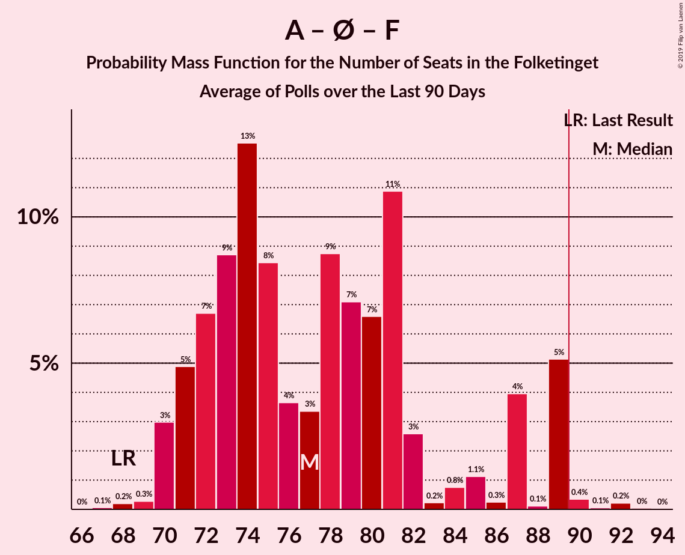

# Poll Average

<a href="#voting-intentions">Voting Intentions</a> | <a href="#seats">Seats</a> | <a href="#coalitions">Coalitions</a> | <a href="#technical-information">Technical Information</a>

## Summary

The table below lists the polls on which the average is based. They are the most recent polls (less than 90 days old) registered and analyzed so far.

| Period     | Polling firm/Commissioner(s) | A | O | V | Ø | I | Å | B | F | C | K | D | E |
|:----------:|:----------------------------:|:--:|:--:|:--:|:--:|:--:|:--:|:--:|:--:|:--:|:--:|:--:|:--:|
| 18 June 2015 | General Election | 26.3%   47 | 21.1%   37 | 19.5%   34 | 7.8%   14 | 7.5%   13 | 4.8%   9 | 4.6%   8 | 4.2%   7 | 3.4%   6 | 0.8%   0 | 0.0%   0 | 0.0%   0 |
| N/A | Poll Average | 22–30%   41–52 | 12–17%   21–30 | 16–21%   29–40 | 7–12%   12–21 | 4–6%   5–11 | 3–5%   4–9 | 5–8%   9–16 | 5–9%   6–16 | 3–6%   5–11 | 0–2%   0–4 | 2–6%   0–11 | 1–2%   0–4 |
| [18–24 March 2019](2019-03-24-Voxmeter.html) | Voxmeter   Ritzau | 25–31%   42–52 | 13–17%   20–34 | 17–22%   31–40 | 7–11%   14–21 | 3–6%   5–11 | 2–5%   4–6 | 5–8%   9–16 | 5–8%   6–13 | 3–6%   7–11 | 0–1%   0–4 | 1–3%   0–6 | 0–2%   0 |
| [8–14 March 2019](2019-03-14-KantarGallup.html) | Kantar Gallup   Berlingske | 24–28%   42–50 | 12–15%   21–27 | 18–22%   32–38 | 7–9%   11–15 | 4–7%   8–11 | 3–5%   5–8 | 6–8%   10–15 | 6–8%   11–14 | 4–6%   7–11 | 1%   0 | 2–3%   0–6 | 1–2%   0 |
| [25–28 February 2019](2019-02-28-Megafon.html) | Megafon   Politiken and TV 2 | 22–27%   39–47 | 11–16%   20–29 | 16–21%   28–36 | 8–12%   15–22 | 4–7%   7–12 | 3–5%   5–10 | 6–9%   9–17 | 7–10%   11–17 | 3–5%   5–10 | 1–2%   0–4 | 2–5%   4–8 | 1–2%   0–4 |
| [19–25 February 2019](2019-02-25-Epinion.html) | Epinion   DR | 26–31%   46–53 | 13–17%   24–31 | 16–20%   28–34 | 8–11%   15–20 | 4–6%   6–10 | 3–5%   5–8 | 5–7%   9–13 | 5–7%   9–13 | 3–5%   5–8 | 0–1%   0 | 2–4%   4–7 | N/A   N/A |
| [11–14 January 2019](2019-01-14-YouGov.html) | YouGov | 22–26%   40–45 | 14–18%   25–30 | 16–19%   29–35 | 9–12%   16–20 | 4–6%   7–10 | 3–5%   6–9 | 5–7%   10–12 | 5–7%   9–12 | 4–6%   7–10 | 1–2%   0 | 5–7%   9–12 | N/A   N/A |
| 18 June 2015 | General Election | 26.3%   47 | 21.1%   37 | 19.5%   34 | 7.8%   14 | 7.5%   13 | 4.8%   9 | 4.6%   8 | 4.2%   7 | 3.4%   6 | 0.8%   0 | 0.0%   0 | 0.0%   0 |

Only polls for which at least the sample size has been published are included in the table above.

**Legend:**
+ **Top half of each row:** Voting intentions (95% confidence interval)
+ **Bottom half of each row:** Seat projections for the Folketinget (95% confidence interval)
+ **A:** Socialdemokraterne
+ **O:** Dansk Folkeparti
+ **V:** Venstre
+ **Ø:** Enhedslisten–De Rød-Grønne
+ **I:** Liberal Alliance
+ **Å:** Alternativet
+ **B:** Radikale Venstre
+ **F:** Socialistisk Folkeparti
+ **C:** Det Konservative Folkeparti
+ **K:** Kristendemokraterne
+ **D:** Nye Borgerlige
+ **E:** Klaus Riskær Pedersen
+ **N/A (single party):** Party not included the published results
+ **N/A (entire row):** Calculation for this opinion poll not started yet

## Voting Intentions

### Confidence Intervals

| Party | Last Result | Median | 80% Confidence Interval | 90% Confidence Interval | 95% Confidence Interval | 99% Confidence Interval |
|:-----:|:-----------:|:------:|:-----------------------:|:-----------------------:|:-----------------------:|:-----------------------:|
| <a href="#socialdemokraterne">Socialdemokraterne</a> | 26.3% | 26.1% | 23.3–29.0% |22.8–29.6% | 22.4–30.1% | 21.6–31.1% |
| <a href="#dansk-folkeparti">Dansk Folkeparti</a> | 21.1% | 14.8% | 12.9–16.5% |12.5–16.9% | 12.1–17.2% | 11.4–17.9% |
| <a href="#venstre">Venstre</a> | 19.5% | 18.5% | 16.9–20.4% |16.5–20.9% | 16.1–21.3% | 15.5–22.1% |
| <a href="#enhedslisten–de-rød-grønne">Enhedslisten–De Rød-Grønne</a> | 7.8% | 9.5% | 7.8–10.9% |7.4–11.3% | 7.1–11.6% | 6.6–12.2% |
| <a href="#liberal-alliance">Liberal Alliance</a> | 7.5% | 4.9% | 4.0–5.9% |3.8–6.2% | 3.6–6.5% | 3.2–7.0% |
| <a href="#alternativet">Alternativet</a> | 4.8% | 3.7% | 3.0–4.5% |2.8–4.7% | 2.7–4.9% | 2.4–5.3% |
| <a href="#radikale-venstre">Radikale Venstre</a> | 4.6% | 6.6% | 5.7–7.7% |5.4–8.0% | 5.3–8.3% | 4.9–8.9% |
| <a href="#socialistisk-folkeparti">Socialistisk Folkeparti</a> | 4.2% | 6.4% | 5.4–8.1% |5.2–8.7% | 5.0–9.1% | 4.6–9.9% |
| <a href="#det-konservative-folkeparti">Det Konservative Folkeparti</a> | 3.4% | 4.5% | 3.5–5.5% |3.2–5.8% | 3.0–6.0% | 2.7–6.5% |
| <a href="#kristendemokraterne">Kristendemokraterne</a> | 0.8% | 0.9% | 0.6–1.5% |0.5–1.7% | 0.4–1.9% | 0.3–2.3% |
| <a href="#nye-borgerlige">Nye Borgerlige</a> | 0.0% | 2.9% | 1.9–5.7% |1.7–6.1% | 1.5–6.3% | 1.2–6.8% |
| <a href="#klaus-riskær-pedersen">Klaus Riskær Pedersen</a> | 0.0% | 1.2% | 0.8–1.7% |0.6–1.9% | 0.6–2.0% | 0.4–2.3% |

### Socialdemokraterne

*For a full overview of the results for this party, see the [Socialdemokraterne](party-socialdemokraterne.html) page.*

| Voting Intentions | Probability | Accumulated | Special Marks |
|:-----------------:|:-----------:|:-----------:|:-------------:|
| 19.5–20.5% | 0% | 100% |  |
| 20.5–21.5% | 0.4% | 100% |  |
| 21.5–22.5% | 3% | 99.5% |  |
| 22.5–23.5% | 10% | 96% |  |
| 23.5–24.5% | 15% | 87% |  |
| 24.5–25.5% | 14% | 72% |  |
| 25.5–26.5% | 14% | 58% | Last Result, Median |
| 26.5–27.5% | 14% | 44% |  |
| 27.5–28.5% | 14% | 29% |  |
| 28.5–29.5% | 10% | 15% |  |
| 29.5–30.5% | 4% | 5% |  |
| 30.5–31.5% | 1.1% | 1.3% |  |
| 31.5–32.5% | 0.2% | 0.2% |  |
| 32.5–33.5% | 0% | 0% |  |

### Dansk Folkeparti

*For a full overview of the results for this party, see the [Dansk Folkeparti](party-danskfolkeparti.html) page.*

| Voting Intentions | Probability | Accumulated | Special Marks |
|:-----------------:|:-----------:|:-----------:|:-------------:|
| 9.5–10.5% | 0% | 100% |  |
| 10.5–11.5% | 0.7% | 100% |  |
| 11.5–12.5% | 5% | 99.2% |  |
| 12.5–13.5% | 16% | 94% |  |
| 13.5–14.5% | 23% | 79% |  |
| 14.5–15.5% | 26% | 55% | Median |
| 15.5–16.5% | 21% | 29% |  |
| 16.5–17.5% | 7% | 9% |  |
| 17.5–18.5% | 1.1% | 1.2% |  |
| 18.5–19.5% | 0.1% | 0.1% |  |
| 19.5–20.5% | 0% | 0% |  |
| 20.5–21.5% | 0% | 0% | Last Result |

### Venstre

*For a full overview of the results for this party, see the [Venstre](party-venstre.html) page.*

| Voting Intentions | Probability | Accumulated | Special Marks |
|:-----------------:|:-----------:|:-----------:|:-------------:|
| 13.5–14.5% | 0% | 100% |  |
| 14.5–15.5% | 0.5% | 100% |  |
| 15.5–16.5% | 5% | 99.4% |  |
| 16.5–17.5% | 19% | 94% |  |
| 17.5–18.5% | 28% | 76% | Median |
| 18.5–19.5% | 24% | 48% |  |
| 19.5–20.5% | 15% | 23% | Last Result |
| 20.5–21.5% | 6% | 8% |  |
| 21.5–22.5% | 1.4% | 2% |  |
| 22.5–23.5% | 0.2% | 0.2% |  |
| 23.5–24.5% | 0% | 0% |  |

### Enhedslisten–De Rød-Grønne

*For a full overview of the results for this party, see the [Enhedslisten–De Rød-Grønne](party-enhedslisten–derød-grønne.html) page.*

| Voting Intentions | Probability | Accumulated | Special Marks |
|:-----------------:|:-----------:|:-----------:|:-------------:|
| 4.5–5.5% | 0% | 100% |  |
| 5.5–6.5% | 0.4% | 100% |  |
| 6.5–7.5% | 7% | 99.6% |  |
| 7.5–8.5% | 18% | 93% | Last Result |
| 8.5–9.5% | 26% | 75% |  |
| 9.5–10.5% | 31% | 49% | Median |
| 10.5–11.5% | 15% | 17% |  |
| 11.5–12.5% | 2% | 3% |  |
| 12.5–13.5% | 0.2% | 0.2% |  |
| 13.5–14.5% | 0% | 0% |  |

### Liberal Alliance

*For a full overview of the results for this party, see the [Liberal Alliance](party-liberalalliance.html) page.*

| Voting Intentions | Probability | Accumulated | Special Marks |
|:-----------------:|:-----------:|:-----------:|:-------------:|
| 1.5–2.5% | 0% | 100% |  |
| 2.5–3.5% | 2% | 100% |  |
| 3.5–4.5% | 32% | 98% |  |
| 4.5–5.5% | 46% | 66% | Median |
| 5.5–6.5% | 17% | 20% |  |
| 6.5–7.5% | 2% | 2% |  |
| 7.5–8.5% | 0.1% | 0.1% | Last Result |
| 8.5–9.5% | 0% | 0% |  |

### Alternativet

*For a full overview of the results for this party, see the [Alternativet](party-alternativet.html) page.*

| Voting Intentions | Probability | Accumulated | Special Marks |
|:-----------------:|:-----------:|:-----------:|:-------------:|
| 0.5–1.5% | 0% | 100% |  |
| 1.5–2.5% | 1.3% | 100% |  |
| 2.5–3.5% | 36% | 98.7% |  |
| 3.5–4.5% | 55% | 63% | Median |
| 4.5–5.5% | 7% | 8% | Last Result |
| 5.5–6.5% | 0.2% | 0.2% |  |
| 6.5–7.5% | 0% | 0% |  |

### Radikale Venstre

*For a full overview of the results for this party, see the [Radikale Venstre](party-radikalevenstre.html) page.*

| Voting Intentions | Probability | Accumulated | Special Marks |
|:-----------------:|:-----------:|:-----------:|:-------------:|
| 3.5–4.5% | 0.1% | 100% |  |
| 4.5–5.5% | 7% | 99.9% | Last Result |
| 5.5–6.5% | 41% | 93% |  |
| 6.5–7.5% | 39% | 52% | Median |
| 7.5–8.5% | 12% | 13% |  |
| 8.5–9.5% | 1.3% | 1.4% |  |
| 9.5–10.5% | 0.1% | 0.1% |  |
| 10.5–11.5% | 0% | 0% |  |

### Socialistisk Folkeparti

*For a full overview of the results for this party, see the [Socialistisk Folkeparti](party-socialistiskfolkeparti.html) page.*

| Voting Intentions | Probability | Accumulated | Special Marks |
|:-----------------:|:-----------:|:-----------:|:-------------:|
| 2.5–3.5% | 0% | 100% |  |
| 3.5–4.5% | 0.5% | 100% | Last Result |
| 4.5–5.5% | 13% | 99.5% |  |
| 5.5–6.5% | 43% | 86% | Median |
| 6.5–7.5% | 26% | 44% |  |
| 7.5–8.5% | 12% | 18% |  |
| 8.5–9.5% | 5% | 6% |  |
| 9.5–10.5% | 0.9% | 1.0% |  |
| 10.5–11.5% | 0.1% | 0.1% |  |
| 11.5–12.5% | 0% | 0% |  |

### Det Konservative Folkeparti

*For a full overview of the results for this party, see the [Det Konservative Folkeparti](party-detkonservativefolkeparti.html) page.*

| Voting Intentions | Probability | Accumulated | Special Marks |
|:-----------------:|:-----------:|:-----------:|:-------------:|
| 0.5–1.5% | 0% | 100% |  |
| 1.5–2.5% | 0.2% | 100% |  |
| 2.5–3.5% | 13% | 99.8% | Last Result |
| 3.5–4.5% | 40% | 87% | Median |
| 4.5–5.5% | 37% | 47% |  |
| 5.5–6.5% | 9% | 9% |  |
| 6.5–7.5% | 0.4% | 0.4% |  |
| 7.5–8.5% | 0% | 0% |  |

### Kristendemokraterne

*For a full overview of the results for this party, see the [Kristendemokraterne](party-kristendemokraterne.html) page.*

| Voting Intentions | Probability | Accumulated | Special Marks |
|:-----------------:|:-----------:|:-----------:|:-------------:|
| 0.0–0.5% | 8% | 100% |  |
| 0.5–1.5% | 83% | 92% | Last Result, Median |
| 1.5–2.5% | 9% | 9% |  |
| 2.5–3.5% | 0.2% | 0.2% |  |
| 3.5–4.5% | 0% | 0% |  |

### Nye Borgerlige

*For a full overview of the results for this party, see the [Nye Borgerlige](party-nyeborgerlige.html) page.*

| Voting Intentions | Probability | Accumulated | Special Marks |
|:-----------------:|:-----------:|:-----------:|:-------------:|
| 0.0–0.5% | 0% | 100% | Last Result |
| 0.5–1.5% | 3% | 100% |  |
| 1.5–2.5% | 29% | 97% |  |
| 2.5–3.5% | 38% | 68% | Median |
| 3.5–4.5% | 9% | 30% |  |
| 4.5–5.5% | 8% | 21% |  |
| 5.5–6.5% | 11% | 13% |  |
| 6.5–7.5% | 1.3% | 1.3% |  |
| 7.5–8.5% | 0% | 0% |  |

### Klaus Riskær Pedersen

*For a full overview of the results for this party, see the [Klaus Riskær Pedersen](party-klausriskærpedersen.html) page.*

| Voting Intentions | Probability | Accumulated | Special Marks |
|:-----------------:|:-----------:|:-----------:|:-------------:|
| 0.0–0.5% | 2% | 100% | Last Result |
| 0.5–1.5% | 78% | 98% | Median |
| 1.5–2.5% | 20% | 20% |  |
| 2.5–3.5% | 0.2% | 0.2% |  |
| 3.5–4.5% | 0% | 0% |  |

## Seats

### Confidence Intervals

| Party | Last Result | Median | 80% Confidence Interval | 90% Confidence Interval | 95% Confidence Interval | 99% Confidence Interval |
|:-----:|:-----------:|:------:|:-----------------------:|:-----------------------:|:-----------------------:|:-----------------------:|
| <a href="#socialdemokraterne">Socialdemokraterne</a> | 47 | 44 | 41–52 |41–52 | 41–52 | 38–54 |
| <a href="#dansk-folkeparti">Dansk Folkeparti</a> | 37 | 26 | 22–30 |22–30 | 21–30 | 20–34 |
| <a href="#venstre">Venstre</a> | 34 | 32 | 30–40 |29–40 | 29–40 | 28–40 |
| <a href="#enhedslisten–de-rød-grønne">Enhedslisten–De Rød-Grønne</a> | 14 | 17 | 14–20 |13–21 | 12–21 | 11–22 |
| <a href="#liberal-alliance">Liberal Alliance</a> | 13 | 9 | 7–11 |7–11 | 5–11 | 5–12 |
| <a href="#alternativet">Alternativet</a> | 9 | 6 | 4–8 |4–8 | 4–9 | 4–10 |
| <a href="#radikale-venstre">Radikale Venstre</a> | 8 | 11 | 10–14 |10–15 | 9–16 | 9–17 |
| <a href="#socialistisk-folkeparti">Socialistisk Folkeparti</a> | 7 | 12 | 9–15 |9–15 | 6–16 | 6–17 |
| <a href="#det-konservative-folkeparti">Det Konservative Folkeparti</a> | 6 | 8 | 6–11 |6–11 | 5–11 | 5–11 |
| <a href="#kristendemokraterne">Kristendemokraterne</a> | 0 | 0 | 0–4 |0–4 | 0–4 | 0–4 |
| <a href="#nye-borgerlige">Nye Borgerlige</a> | 0 | 6 | 0–10 |0–10 | 0–11 | 0–12 |
| <a href="#klaus-riskær-pedersen">Klaus Riskær Pedersen</a> | 0 | 0 | 0 |0 | 0–4 | 0–4 |

### Socialdemokraterne

*For a full overview of the results for this party, see the [Socialdemokraterne](party-socialdemokraterne.html) page.*

| Number of Seats | Probability | Accumulated | Special Marks |
|:---------------:|:-----------:|:-----------:|:-------------:|
| 36 | 0.1% | 100% |  |
| 37 | 0.2% | 99.9% |  |
| 38 | 0.2% | 99.7% |  |
| 39 | 0.5% | 99.5% |  |
| 40 | 1.2% | 99.0% |  |
| 41 | 12% | 98% |  |
| 42 | 13% | 86% |  |
| 43 | 22% | 73% |  |
| 44 | 3% | 51% | Median |
| 45 | 7% | 48% |  |
| 46 | 4% | 41% |  |
| 47 | 5% | 37% | Last Result |
| 48 | 4% | 32% |  |
| 49 | 6% | 28% |  |
| 50 | 6% | 22% |  |
| 51 | 2% | 16% |  |
| 52 | 12% | 13% |  |
| 53 | 0.6% | 1.2% |  |
| 54 | 0.3% | 0.6% |  |
| 55 | 0.2% | 0.3% |  |
| 56 | 0% | 0.1% |  |
| 57 | 0% | 0.1% |  |
| 58 | 0% | 0.1% |  |
| 59 | 0% | 0.1% |  |
| 60 | 0% | 0.1% |  |
| 61 | 0% | 0.1% |  |
| 62 | 0% | 0.1% |  |
| 63 | 0% | 0.1% |  |
| 64 | 0.1% | 0.1% |  |
| 65 | 0% | 0% |  |

### Dansk Folkeparti

*For a full overview of the results for this party, see the [Dansk Folkeparti](party-danskfolkeparti.html) page.*

| Number of Seats | Probability | Accumulated | Special Marks |
|:---------------:|:-----------:|:-----------:|:-------------:|
| 18 | 0.1% | 100% |  |
| 19 | 0.2% | 99.9% |  |
| 20 | 1.4% | 99.7% |  |
| 21 | 3% | 98% |  |
| 22 | 7% | 96% |  |
| 23 | 1.5% | 89% |  |
| 24 | 3% | 87% |  |
| 25 | 19% | 84% |  |
| 26 | 20% | 66% | Median |
| 27 | 14% | 46% |  |
| 28 | 9% | 31% |  |
| 29 | 9% | 23% |  |
| 30 | 11% | 14% |  |
| 31 | 0.8% | 2% |  |
| 32 | 0.5% | 1.3% |  |
| 33 | 0.1% | 0.9% |  |
| 34 | 0.8% | 0.8% |  |
| 35 | 0% | 0% |  |
| 36 | 0% | 0% |  |
| 37 | 0% | 0% | Last Result |

### Venstre

*For a full overview of the results for this party, see the [Venstre](party-venstre.html) page.*

| Number of Seats | Probability | Accumulated | Special Marks |
|:---------------:|:-----------:|:-----------:|:-------------:|
| 26 | 0.1% | 100% |  |
| 27 | 0.2% | 99.9% |  |
| 28 | 2% | 99.7% |  |
| 29 | 4% | 98% |  |
| 30 | 10% | 94% |  |
| 31 | 19% | 84% |  |
| 32 | 15% | 65% | Median |
| 33 | 7% | 49% |  |
| 34 | 11% | 42% | Last Result |
| 35 | 10% | 31% |  |
| 36 | 2% | 21% |  |
| 37 | 7% | 19% |  |
| 38 | 2% | 12% |  |
| 39 | 0.1% | 10% |  |
| 40 | 10% | 10% |  |
| 41 | 0.1% | 0.1% |  |
| 42 | 0% | 0% |  |

### Enhedslisten–De Rød-Grønne

*For a full overview of the results for this party, see the [Enhedslisten–De Rød-Grønne](party-enhedslisten–derød-grønne.html) page.*

| Number of Seats | Probability | Accumulated | Special Marks |
|:---------------:|:-----------:|:-----------:|:-------------:|
| 10 | 0.3% | 100% |  |
| 11 | 1.2% | 99.7% |  |
| 12 | 2% | 98.5% |  |
| 13 | 4% | 96% |  |
| 14 | 4% | 92% | Last Result |
| 15 | 13% | 88% |  |
| 16 | 6% | 75% |  |
| 17 | 38% | 68% | Median |
| 18 | 14% | 30% |  |
| 19 | 6% | 17% |  |
| 20 | 3% | 11% |  |
| 21 | 8% | 8% |  |
| 22 | 0.2% | 0.6% |  |
| 23 | 0.4% | 0.4% |  |
| 24 | 0% | 0% |  |

### Liberal Alliance

*For a full overview of the results for this party, see the [Liberal Alliance](party-liberalalliance.html) page.*

| Number of Seats | Probability | Accumulated | Special Marks |
|:---------------:|:-----------:|:-----------:|:-------------:|
| 5 | 3% | 100% |  |
| 6 | 0.8% | 97% |  |
| 7 | 11% | 96% |  |
| 8 | 22% | 86% |  |
| 9 | 37% | 63% | Median |
| 10 | 9% | 26% |  |
| 11 | 16% | 17% |  |
| 12 | 1.2% | 2% |  |
| 13 | 0.1% | 0.3% | Last Result |
| 14 | 0.2% | 0.2% |  |
| 15 | 0% | 0% |  |

### Alternativet

*For a full overview of the results for this party, see the [Alternativet](party-alternativet.html) page.*

| Number of Seats | Probability | Accumulated | Special Marks |
|:---------------:|:-----------:|:-----------:|:-------------:|
| 4 | 10% | 100% |  |
| 5 | 17% | 90% |  |
| 6 | 27% | 73% | Median |
| 7 | 32% | 46% |  |
| 8 | 11% | 14% |  |
| 9 | 2% | 3% | Last Result |
| 10 | 1.2% | 1.2% |  |
| 11 | 0% | 0% |  |

### Radikale Venstre

*For a full overview of the results for this party, see the [Radikale Venstre](party-radikalevenstre.html) page.*

| Number of Seats | Probability | Accumulated | Special Marks |
|:---------------:|:-----------:|:-----------:|:-------------:|
| 8 | 0.2% | 100% | Last Result |
| 9 | 2% | 99.8% |  |
| 10 | 12% | 97% |  |
| 11 | 37% | 85% | Median |
| 12 | 18% | 48% |  |
| 13 | 11% | 30% |  |
| 14 | 11% | 19% |  |
| 15 | 5% | 8% |  |
| 16 | 2% | 3% |  |
| 17 | 1.0% | 1.1% |  |
| 18 | 0.1% | 0.1% |  |
| 19 | 0% | 0% |  |

### Socialistisk Folkeparti

*For a full overview of the results for this party, see the [Socialistisk Folkeparti](party-socialistiskfolkeparti.html) page.*

| Number of Seats | Probability | Accumulated | Special Marks |
|:---------------:|:-----------:|:-----------:|:-------------:|
| 6 | 3% | 100% |  |
| 7 | 0.8% | 97% | Last Result |
| 8 | 0.5% | 96% |  |
| 9 | 7% | 95% |  |
| 10 | 16% | 88% |  |
| 11 | 16% | 72% |  |
| 12 | 34% | 56% | Median |
| 13 | 8% | 21% |  |
| 14 | 2% | 13% |  |
| 15 | 6% | 11% |  |
| 16 | 3% | 5% |  |
| 17 | 1.3% | 2% |  |
| 18 | 0.2% | 0.3% |  |
| 19 | 0% | 0.1% |  |
| 20 | 0% | 0% |  |

### Det Konservative Folkeparti

*For a full overview of the results for this party, see the [Det Konservative Folkeparti](party-detkonservativefolkeparti.html) page.*

| Number of Seats | Probability | Accumulated | Special Marks |
|:---------------:|:-----------:|:-----------:|:-------------:|
| 4 | 0.2% | 100% |  |
| 5 | 3% | 99.8% |  |
| 6 | 18% | 97% | Last Result |
| 7 | 17% | 79% |  |
| 8 | 21% | 62% | Median |
| 9 | 10% | 41% |  |
| 10 | 18% | 31% |  |
| 11 | 13% | 14% |  |
| 12 | 0.4% | 0.5% |  |
| 13 | 0.1% | 0.1% |  |
| 14 | 0% | 0% |  |

### Kristendemokraterne

*For a full overview of the results for this party, see the [Kristendemokraterne](party-kristendemokraterne.html) page.*

| Number of Seats | Probability | Accumulated | Special Marks |
|:---------------:|:-----------:|:-----------:|:-------------:|
| 0 | 89% | 100% | Last Result, Median |
| 1 | 0% | 11% |  |
| 2 | 0% | 11% |  |
| 3 | 0% | 11% |  |
| 4 | 11% | 11% |  |
| 5 | 0.1% | 0.1% |  |
| 6 | 0% | 0% |  |

### Nye Borgerlige

*For a full overview of the results for this party, see the [Nye Borgerlige](party-nyeborgerlige.html) page.*

| Number of Seats | Probability | Accumulated | Special Marks |
|:---------------:|:-----------:|:-----------:|:-------------:|
| 0 | 21% | 100% | Last Result |
| 1 | 0% | 79% |  |
| 2 | 0% | 79% |  |
| 3 | 0% | 79% |  |
| 4 | 5% | 79% |  |
| 5 | 20% | 73% |  |
| 6 | 25% | 53% | Median |
| 7 | 3% | 28% |  |
| 8 | 5% | 25% |  |
| 9 | 3% | 20% |  |
| 10 | 12% | 17% |  |
| 11 | 4% | 5% |  |
| 12 | 0.5% | 0.6% |  |
| 13 | 0.1% | 0.1% |  |
| 14 | 0% | 0% |  |

### Klaus Riskær Pedersen

*For a full overview of the results for this party, see the [Klaus Riskær Pedersen](party-klausriskærpedersen.html) page.*

| Number of Seats | Probability | Accumulated | Special Marks |
|:---------------:|:-----------:|:-----------:|:-------------:|
| 0 | 97% | 100% | Last Result, Median |
| 1 | 0% | 3% |  |
| 2 | 0% | 3% |  |
| 3 | 0% | 3% |  |
| 4 | 3% | 3% |  |
| 5 | 0.1% | 0.2% |  |
| 6 | 0% | 0% |  |

## Coalitions

### Confidence Intervals

| Coalition | Last Result | Median | Majority? | 80% Confidence Interval | 90% Confidence Interval | 95% Confidence Interval | 99% Confidence Interval |
|:---------:|:-----------:|:------:|:---------:|:-----------------------:|:-----------------------:|:-----------------------:|:-----------------------:|
| Socialdemokraterne – Enhedslisten–De Rød-Grønne – Alternativet – Radikale Venstre – Socialistisk Folkeparti | 85 | 91 | 65% | 87–97 | 87–100 | 86–100 | 83–102 |
| Socialdemokraterne – Enhedslisten–De Rød-Grønne – Radikale Venstre – Socialistisk Folkeparti | 76 | 85 | 28% | 81–91 | 79–93 | 79–93 | 78–95 |
| Dansk Folkeparti – Venstre – Liberal Alliance – Det Konservative Folkeparti – Kristendemokraterne – Klaus Riskær Pedersen – Nye Borgerlige | 90 | 84 | 1.1% | 76–88 | 75–88 | 75–89 | 73–92 |
| Dansk Folkeparti – Venstre – Liberal Alliance – Det Konservative Folkeparti – Klaus Riskær Pedersen – Nye Borgerlige | 90 | 84 | 1.0% | 76–87 | 75–88 | 75–89 | 73–92 |
| Dansk Folkeparti – Venstre – Liberal Alliance – Det Konservative Folkeparti – Kristendemokraterne – Nye Borgerlige | 90 | 84 | 1.0% | 76–88 | 75–88 | 75–89 | 73–92 |
| Dansk Folkeparti – Venstre – Liberal Alliance – Det Konservative Folkeparti – Nye Borgerlige | 90 | 84 | 1.0% | 76–87 | 75–88 | 75–89 | 72–92 |
| Dansk Folkeparti – Venstre – Liberal Alliance – Det Konservative Folkeparti – Kristendemokraterne | 90 | 77 | 0.8% | 71–88 | 68–88 | 67–88 | 67–92 |
| Socialdemokraterne – Enhedslisten–De Rød-Grønne – Alternativet – Socialistisk Folkeparti | 77 | 79 | 0.7% | 76–85 | 76–86 | 76–87 | 72–90 |
| Dansk Folkeparti – Venstre – Liberal Alliance – Det Konservative Folkeparti | 90 | 77 | 0.8% | 71–84 | 68–84 | 67–84 | 67–92 |
| Socialdemokraterne – Enhedslisten–De Rød-Grønne – Socialistisk Folkeparti | 68 | 73 | 0.1% | 69–79 | 69–79 | 69–80 | 67–84 |
| Socialdemokraterne – Radikale Venstre – Socialistisk Folkeparti | 62 | 69 | 0% | 64–73 | 62–76 | 61–78 | 60–78 |
| Socialdemokraterne – Radikale Venstre | 55 | 57 | 0% | 52–63 | 52–64 | 52–65 | 51–65 |
| Venstre – Liberal Alliance – Det Konservative Folkeparti | 53 | 49 | 0% | 45–59 | 45–59 | 44–59 | 42–59 |
| Venstre – Det Konservative Folkeparti | 40 | 41 | 0% | 37–50 | 36–50 | 35–50 | 34–50 |
| Venstre | 34 | 32 | 0% | 30–40 | 29–40 | 29–40 | 28–40 |

### Socialdemokraterne – Enhedslisten–De Rød-Grønne – Alternativet – Radikale Venstre – Socialistisk Folkeparti

| Number of Seats | Probability | Accumulated | Special Marks |
|:---------------:|:-----------:|:-----------:|:-------------:|
| 83 | 0.8% | 100% |  |
| 84 | 0% | 99.1% |  |
| 85 | 0.2% | 99.1% | Last Result |
| 86 | 4% | 98.9% |  |
| 87 | 11% | 95% |  |
| 88 | 12% | 84% |  |
| 89 | 7% | 72% |  |
| 90 | 7% | 65% | Median, Majority |
| 91 | 13% | 59% |  |
| 92 | 3% | 46% |  |
| 93 | 4% | 42% |  |
| 94 | 5% | 39% |  |
| 95 | 4% | 33% |  |
| 96 | 14% | 29% |  |
| 97 | 6% | 15% |  |
| 98 | 1.3% | 9% |  |
| 99 | 2% | 8% |  |
| 100 | 5% | 6% |  |
| 101 | 0.6% | 1.2% |  |
| 102 | 0.2% | 0.7% |  |
| 103 | 0.3% | 0.4% |  |
| 104 | 0% | 0.1% |  |
| 105 | 0% | 0.1% |  |
| 106 | 0% | 0.1% |  |
| 107 | 0.1% | 0.1% |  |
| 108 | 0% | 0% |  |

### Socialdemokraterne – Enhedslisten–De Rød-Grønne – Radikale Venstre – Socialistisk Folkeparti

| Number of Seats | Probability | Accumulated | Special Marks |
|:---------------:|:-----------:|:-----------:|:-------------:|
| 76 | 0% | 100% | Last Result |
| 77 | 0% | 100% |  |
| 78 | 0.9% | 100% |  |
| 79 | 4% | 99.1% |  |
| 80 | 0.8% | 95% |  |
| 81 | 16% | 94% |  |
| 82 | 2% | 78% |  |
| 83 | 15% | 76% |  |
| 84 | 3% | 61% | Median |
| 85 | 13% | 59% |  |
| 86 | 7% | 46% |  |
| 87 | 3% | 39% |  |
| 88 | 2% | 36% |  |
| 89 | 5% | 33% |  |
| 90 | 12% | 28% | Majority |
| 91 | 6% | 16% |  |
| 92 | 4% | 10% |  |
| 93 | 5% | 6% |  |
| 94 | 0.2% | 0.9% |  |
| 95 | 0.5% | 0.7% |  |
| 96 | 0.1% | 0.3% |  |
| 97 | 0% | 0.1% |  |
| 98 | 0% | 0.1% |  |
| 99 | 0% | 0.1% |  |
| 100 | 0% | 0.1% |  |
| 101 | 0% | 0.1% |  |
| 102 | 0% | 0.1% |  |
| 103 | 0.1% | 0.1% |  |
| 104 | 0% | 0% |  |

### Dansk Folkeparti – Venstre – Liberal Alliance – Det Konservative Folkeparti – Kristendemokraterne – Klaus Riskær Pedersen – Nye Borgerlige

| Number of Seats | Probability | Accumulated | Special Marks |
|:---------------:|:-----------:|:-----------:|:-------------:|
| 68 | 0.1% | 100% |  |
| 69 | 0% | 99.9% |  |
| 70 | 0% | 99.9% |  |
| 71 | 0.1% | 99.9% |  |
| 72 | 0.3% | 99.9% |  |
| 73 | 0.5% | 99.6% |  |
| 74 | 0.9% | 99.1% |  |
| 75 | 5% | 98% |  |
| 76 | 5% | 93% |  |
| 77 | 2% | 89% |  |
| 78 | 6% | 87% |  |
| 79 | 14% | 81% |  |
| 80 | 4% | 67% |  |
| 81 | 3% | 63% | Median |
| 82 | 3% | 60% |  |
| 83 | 3% | 57% |  |
| 84 | 13% | 54% |  |
| 85 | 7% | 41% |  |
| 86 | 7% | 34% |  |
| 87 | 12% | 27% |  |
| 88 | 11% | 16% |  |
| 89 | 4% | 5% |  |
| 90 | 0.2% | 1.1% | Last Result, Majority |
| 91 | 0% | 0.9% |  |
| 92 | 0.8% | 0.9% |  |
| 93 | 0% | 0% |  |

### Dansk Folkeparti – Venstre – Liberal Alliance – Det Konservative Folkeparti – Klaus Riskær Pedersen – Nye Borgerlige

| Number of Seats | Probability | Accumulated | Special Marks |
|:---------------:|:-----------:|:-----------:|:-------------:|
| 68 | 0.1% | 100% |  |
| 69 | 0% | 99.9% |  |
| 70 | 0% | 99.9% |  |
| 71 | 0.1% | 99.9% |  |
| 72 | 0.3% | 99.8% |  |
| 73 | 0.5% | 99.5% |  |
| 74 | 1.0% | 99.0% |  |
| 75 | 5% | 98% |  |
| 76 | 5% | 93% |  |
| 77 | 2% | 88% |  |
| 78 | 6% | 87% |  |
| 79 | 14% | 81% |  |
| 80 | 4% | 66% |  |
| 81 | 3% | 63% | Median |
| 82 | 3% | 60% |  |
| 83 | 3% | 56% |  |
| 84 | 23% | 53% |  |
| 85 | 7% | 31% |  |
| 86 | 7% | 24% |  |
| 87 | 12% | 17% |  |
| 88 | 0.7% | 6% |  |
| 89 | 4% | 5% |  |
| 90 | 0.2% | 1.0% | Last Result, Majority |
| 91 | 0% | 0.9% |  |
| 92 | 0.8% | 0.8% |  |
| 93 | 0% | 0% |  |

### Dansk Folkeparti – Venstre – Liberal Alliance – Det Konservative Folkeparti – Kristendemokraterne – Nye Borgerlige

| Number of Seats | Probability | Accumulated | Special Marks |
|:---------------:|:-----------:|:-----------:|:-------------:|
| 68 | 0.1% | 100% |  |
| 69 | 0% | 99.9% |  |
| 70 | 0% | 99.9% |  |
| 71 | 0.1% | 99.9% |  |
| 72 | 0.3% | 99.8% |  |
| 73 | 0.5% | 99.5% |  |
| 74 | 0.9% | 99.0% |  |
| 75 | 5% | 98% |  |
| 76 | 5% | 93% |  |
| 77 | 2% | 88% |  |
| 78 | 6% | 87% |  |
| 79 | 14% | 81% |  |
| 80 | 5% | 67% |  |
| 81 | 3% | 62% | Median |
| 82 | 3% | 59% |  |
| 83 | 3% | 56% |  |
| 84 | 12% | 53% |  |
| 85 | 7% | 41% |  |
| 86 | 7% | 34% |  |
| 87 | 12% | 27% |  |
| 88 | 10% | 15% |  |
| 89 | 4% | 5% |  |
| 90 | 0.2% | 1.0% | Last Result, Majority |
| 91 | 0% | 0.9% |  |
| 92 | 0.8% | 0.9% |  |
| 93 | 0% | 0% |  |

### Dansk Folkeparti – Venstre – Liberal Alliance – Det Konservative Folkeparti – Nye Borgerlige

| Number of Seats | Probability | Accumulated | Special Marks |
|:---------------:|:-----------:|:-----------:|:-------------:|
| 68 | 0.1% | 100% |  |
| 69 | 0% | 99.9% |  |
| 70 | 0% | 99.9% |  |
| 71 | 0.1% | 99.9% |  |
| 72 | 0.4% | 99.8% |  |
| 73 | 0.6% | 99.4% |  |
| 74 | 1.0% | 98.9% |  |
| 75 | 5% | 98% |  |
| 76 | 5% | 93% |  |
| 77 | 2% | 88% |  |
| 78 | 6% | 86% |  |
| 79 | 14% | 80% |  |
| 80 | 4% | 66% |  |
| 81 | 3% | 62% | Median |
| 82 | 3% | 59% |  |
| 83 | 3% | 55% |  |
| 84 | 22% | 52% |  |
| 85 | 6% | 30% |  |
| 86 | 7% | 24% |  |
| 87 | 12% | 17% |  |
| 88 | 0.6% | 5% |  |
| 89 | 4% | 5% |  |
| 90 | 0.2% | 1.0% | Last Result, Majority |
| 91 | 0% | 0.9% |  |
| 92 | 0.8% | 0.8% |  |
| 93 | 0% | 0% |  |

### Dansk Folkeparti – Venstre – Liberal Alliance – Det Konservative Folkeparti – Kristendemokraterne

| Number of Seats | Probability | Accumulated | Special Marks |
|:---------------:|:-----------:|:-----------:|:-------------:|
| 65 | 0.1% | 100% |  |
| 66 | 0.3% | 99.9% |  |
| 67 | 4% | 99.6% |  |
| 68 | 1.3% | 96% |  |
| 69 | 1.3% | 95% |  |
| 70 | 0.7% | 93% |  |
| 71 | 4% | 93% |  |
| 72 | 2% | 89% |  |
| 73 | 14% | 86% |  |
| 74 | 5% | 72% |  |
| 75 | 7% | 67% | Median |
| 76 | 5% | 60% |  |
| 77 | 14% | 56% |  |
| 78 | 8% | 42% |  |
| 79 | 7% | 33% |  |
| 80 | 2% | 27% |  |
| 81 | 6% | 24% |  |
| 82 | 2% | 19% |  |
| 83 | 0.6% | 17% |  |
| 84 | 5% | 16% |  |
| 85 | 0% | 11% |  |
| 86 | 0% | 11% |  |
| 87 | 0% | 11% |  |
| 88 | 10% | 11% |  |
| 89 | 0% | 0.8% |  |
| 90 | 0% | 0.8% | Last Result, Majority |
| 91 | 0% | 0.8% |  |
| 92 | 0.8% | 0.8% |  |
| 93 | 0% | 0% |  |

### Socialdemokraterne – Enhedslisten–De Rød-Grønne – Alternativet – Socialistisk Folkeparti

| Number of Seats | Probability | Accumulated | Special Marks |
|:---------------:|:-----------:|:-----------:|:-------------:|
| 72 | 0.9% | 100% |  |
| 73 | 0.3% | 99.1% |  |
| 74 | 0.6% | 98.8% |  |
| 75 | 0.6% | 98% |  |
| 76 | 14% | 98% |  |
| 77 | 22% | 84% | Last Result |
| 78 | 7% | 62% |  |
| 79 | 8% | 54% | Median |
| 80 | 4% | 47% |  |
| 81 | 5% | 42% |  |
| 82 | 7% | 37% |  |
| 83 | 5% | 30% |  |
| 84 | 6% | 25% |  |
| 85 | 10% | 20% |  |
| 86 | 6% | 10% |  |
| 87 | 2% | 4% |  |
| 88 | 0.7% | 2% |  |
| 89 | 0.3% | 1.0% |  |
| 90 | 0.3% | 0.7% | Majority |
| 91 | 0.1% | 0.4% |  |
| 92 | 0.3% | 0.3% |  |
| 93 | 0% | 0.1% |  |
| 94 | 0.1% | 0.1% |  |
| 95 | 0% | 0% |  |

### Dansk Folkeparti – Venstre – Liberal Alliance – Det Konservative Folkeparti

| Number of Seats | Probability | Accumulated | Special Marks |
|:---------------:|:-----------:|:-----------:|:-------------:|
| 64 | 0% | 100% |  |
| 65 | 0.1% | 99.9% |  |
| 66 | 0.3% | 99.9% |  |
| 67 | 4% | 99.5% |  |
| 68 | 1.3% | 96% |  |
| 69 | 1.3% | 94% |  |
| 70 | 0.8% | 93% |  |
| 71 | 4% | 92% |  |
| 72 | 3% | 88% |  |
| 73 | 14% | 86% |  |
| 74 | 5% | 71% |  |
| 75 | 7% | 67% | Median |
| 76 | 5% | 60% |  |
| 77 | 14% | 55% |  |
| 78 | 9% | 41% |  |
| 79 | 7% | 33% |  |
| 80 | 2% | 26% |  |
| 81 | 6% | 24% |  |
| 82 | 2% | 18% |  |
| 83 | 0.6% | 17% |  |
| 84 | 15% | 16% |  |
| 85 | 0% | 0.9% |  |
| 86 | 0% | 0.9% |  |
| 87 | 0% | 0.8% |  |
| 88 | 0% | 0.8% |  |
| 89 | 0% | 0.8% |  |
| 90 | 0% | 0.8% | Last Result, Majority |
| 91 | 0% | 0.8% |  |
| 92 | 0.8% | 0.8% |  |
| 93 | 0% | 0% |  |

### Socialdemokraterne – Enhedslisten–De Rød-Grønne – Socialistisk Folkeparti

| Number of Seats | Probability | Accumulated | Special Marks |
|:---------------:|:-----------:|:-----------:|:-------------:|
| 66 | 0.3% | 100% |  |
| 67 | 1.3% | 99.6% |  |
| 68 | 0.8% | 98% | Last Result |
| 69 | 8% | 98% |  |
| 70 | 12% | 90% |  |
| 71 | 11% | 78% |  |
| 72 | 15% | 67% |  |
| 73 | 6% | 52% | Median |
| 74 | 6% | 46% |  |
| 75 | 3% | 39% |  |
| 76 | 7% | 37% |  |
| 77 | 6% | 30% |  |
| 78 | 2% | 24% |  |
| 79 | 18% | 21% |  |
| 80 | 2% | 3% |  |
| 81 | 0.8% | 2% |  |
| 82 | 0.4% | 1.2% |  |
| 83 | 0.2% | 0.8% |  |
| 84 | 0.4% | 0.6% |  |
| 85 | 0% | 0.1% |  |
| 86 | 0% | 0.1% |  |
| 87 | 0% | 0.1% |  |
| 88 | 0% | 0.1% |  |
| 89 | 0% | 0.1% |  |
| 90 | 0.1% | 0.1% | Majority |
| 91 | 0% | 0% |  |

### Socialdemokraterne – Radikale Venstre – Socialistisk Folkeparti

| Number of Seats | Probability | Accumulated | Special Marks |
|:---------------:|:-----------:|:-----------:|:-------------:|
| 59 | 0.2% | 100% |  |
| 60 | 0.8% | 99.8% |  |
| 61 | 3% | 99.0% |  |
| 62 | 0.9% | 96% | Last Result |
| 63 | 1.1% | 95% |  |
| 64 | 12% | 94% |  |
| 65 | 2% | 81% |  |
| 66 | 15% | 79% |  |
| 67 | 3% | 64% | Median |
| 68 | 7% | 61% |  |
| 69 | 6% | 55% |  |
| 70 | 13% | 48% |  |
| 71 | 4% | 35% |  |
| 72 | 9% | 32% |  |
| 73 | 13% | 23% |  |
| 74 | 1.4% | 9% |  |
| 75 | 2% | 8% |  |
| 76 | 2% | 6% |  |
| 77 | 0.8% | 4% |  |
| 78 | 3% | 3% |  |
| 79 | 0.1% | 0.2% |  |
| 80 | 0% | 0.1% |  |
| 81 | 0% | 0.1% |  |
| 82 | 0% | 0.1% |  |
| 83 | 0% | 0.1% |  |
| 84 | 0% | 0.1% |  |
| 85 | 0% | 0.1% |  |
| 86 | 0% | 0.1% |  |
| 87 | 0% | 0.1% |  |
| 88 | 0% | 0.1% |  |
| 89 | 0.1% | 0.1% |  |
| 90 | 0% | 0% | Majority |

### Socialdemokraterne – Radikale Venstre

| Number of Seats | Probability | Accumulated | Special Marks |
|:---------------:|:-----------:|:-----------:|:-------------:|
| 48 | 0.2% | 100% |  |
| 49 | 0.1% | 99.7% |  |
| 50 | 0.1% | 99.7% |  |
| 51 | 1.1% | 99.5% |  |
| 52 | 15% | 98% |  |
| 53 | 3% | 83% |  |
| 54 | 17% | 80% |  |
| 55 | 6% | 63% | Last Result, Median |
| 56 | 4% | 57% |  |
| 57 | 9% | 54% |  |
| 58 | 2% | 44% |  |
| 59 | 11% | 43% |  |
| 60 | 6% | 32% |  |
| 61 | 3% | 26% |  |
| 62 | 4% | 23% |  |
| 63 | 10% | 19% |  |
| 64 | 5% | 9% |  |
| 65 | 4% | 5% |  |
| 66 | 0.2% | 0.5% |  |
| 67 | 0.1% | 0.2% |  |
| 68 | 0% | 0.2% |  |
| 69 | 0% | 0.1% |  |
| 70 | 0% | 0.1% |  |
| 71 | 0% | 0.1% |  |
| 72 | 0% | 0.1% |  |
| 73 | 0% | 0.1% |  |
| 74 | 0% | 0.1% |  |
| 75 | 0% | 0.1% |  |
| 76 | 0% | 0.1% |  |
| 77 | 0.1% | 0.1% |  |
| 78 | 0% | 0% |  |

### Venstre – Liberal Alliance – Det Konservative Folkeparti

| Number of Seats | Probability | Accumulated | Special Marks |
|:---------------:|:-----------:|:-----------:|:-------------:|
| 41 | 0.1% | 100% |  |
| 42 | 1.0% | 99.9% |  |
| 43 | 0.8% | 98.9% |  |
| 44 | 3% | 98% |  |
| 45 | 7% | 96% |  |
| 46 | 6% | 88% |  |
| 47 | 25% | 82% |  |
| 48 | 2% | 58% |  |
| 49 | 6% | 55% | Median |
| 50 | 11% | 49% |  |
| 51 | 3% | 38% |  |
| 52 | 6% | 35% |  |
| 53 | 1.1% | 29% | Last Result |
| 54 | 3% | 28% |  |
| 55 | 0.9% | 26% |  |
| 56 | 6% | 25% |  |
| 57 | 7% | 19% |  |
| 58 | 2% | 12% |  |
| 59 | 10% | 10% |  |
| 60 | 0.1% | 0.1% |  |
| 61 | 0% | 0% |  |

### Venstre – Det Konservative Folkeparti

| Number of Seats | Probability | Accumulated | Special Marks |
|:---------------:|:-----------:|:-----------:|:-------------:|
| 33 | 0.4% | 100% |  |
| 34 | 1.1% | 99.6% |  |
| 35 | 2% | 98.5% |  |
| 36 | 6% | 97% |  |
| 37 | 8% | 91% |  |
| 38 | 14% | 83% |  |
| 39 | 13% | 69% |  |
| 40 | 5% | 56% | Last Result, Median |
| 41 | 9% | 51% |  |
| 42 | 3% | 42% |  |
| 43 | 8% | 39% |  |
| 44 | 5% | 31% |  |
| 45 | 1.0% | 26% |  |
| 46 | 8% | 25% |  |
| 47 | 3% | 17% |  |
| 48 | 4% | 14% |  |
| 49 | 0.1% | 10% |  |
| 50 | 10% | 10% |  |
| 51 | 0% | 0% |  |

### Venstre

| Number of Seats | Probability | Accumulated | Special Marks |
|:---------------:|:-----------:|:-----------:|:-------------:|
| 26 | 0.1% | 100% |  |
| 27 | 0.2% | 99.9% |  |
| 28 | 2% | 99.7% |  |
| 29 | 4% | 98% |  |
| 30 | 10% | 94% |  |
| 31 | 19% | 84% |  |
| 32 | 15% | 65% | Median |
| 33 | 7% | 49% |  |
| 34 | 11% | 42% | Last Result |
| 35 | 10% | 31% |  |
| 36 | 2% | 21% |  |
| 37 | 7% | 19% |  |
| 38 | 2% | 12% |  |
| 39 | 0.1% | 10% |  |
| 40 | 10% | 10% |  |
| 41 | 0.1% | 0.1% |  |
| 42 | 0% | 0% |  |

## Technical Information

+ **Number of polls included in this average:** 5
+ **Lowest number of simulations done in a poll included in this average:** 1,024
+ **Total number of simulations done in the polls included in this average:** 4,195,328
+ **Error estimate:** 5.82%
