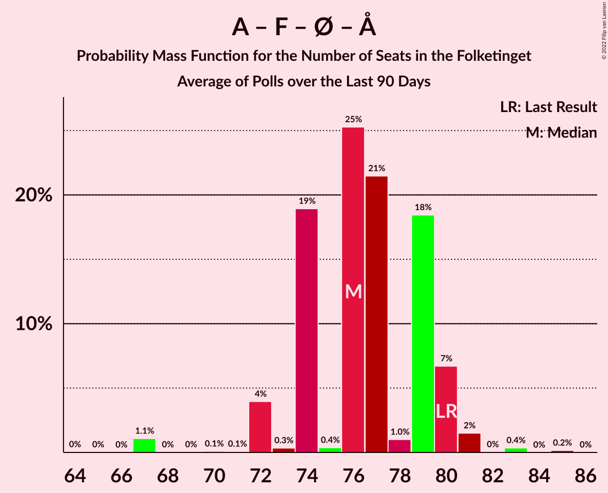

# Poll Average

<a href="#voting-intentions">Voting Intentions</a> | <a href="#seats">Seats</a> | <a href="#coalitions">Coalitions</a> | <a href="#technical-information">Technical Information</a>

## Summary

The table below lists the polls on which the average is based. They are the most recent polls (less than 90 days old) registered and analyzed so far.

| Period     | Polling firm/Commissioner(s) | A | V | O | B | F | Ø | C | Å | D | I | P | K | E |
|:----------:|:----------------------------:|:--:|:--:|:--:|:--:|:--:|:--:|:--:|:--:|:--:|:--:|:--:|:--:|:--:|
| 5 June 2019 | General Election | 25.9%   48 | 23.4%   43 | 8.7%   16 | 8.6%   16 | 7.7%   14 | 6.9%   13 | 6.6%   12 | 3.0%   5 | 2.4%   4 | 2.3%   4 | 1.8%   0 | 1.7%   0 | 0.8%   0 |
| N/A | Poll Average | 23–37%   39–69 | 19–24%   32–46 | 6–10%   11–18 | 5–10%   8–18 | 6–10%   9–19 | 6–9%   8–17 | 5–9%   10–16 | 0–2%   0–4 | 2–5%   0–8 | 1–3%   0–5 | 0–2%   0–5 | 1–2%   0 | 0–2%   0 |
| [6–19 April 2020](2020-04-19-Voxmeter.html) | Voxmeter | 32–38%   59–71 | 19–24%   36–44 | 5–9%   10–15 | 6–9%   11–17 | 6–9%   11–16 | 6–9%   11–17 | 5–8%   9–14 | 0–2%   0 | 1–3%   0–6 | 1–2%   0–4 | 1–2%   0–4 | N/A   N/A | 1–2%   0 |
| [10–16 April 2020](2020-04-16-Epinion.html) | Epinion | 33–37%   56 | 19–23%   32 | 7–10%   11 | 5–7%   8 | 6–8%   9 | 5–8%   8 | 6–9%   10 | 1–2%   0 | 2–4%   0 | 2–3%   0 | 0–1%   0 | N/A   N/A | 0–1%   0 |
| [27 March–3 April 2020](2020-04-03-Gallup.html) | Gallup | 30–34%   54–63 | 20–24%   36–46 | 7–10%   13–17 | 7–9%   12–17 | 6–8%   10–15 | 6–9%   11–16 | 6–8%   11–16 | 0–1%   0 | 3–5%   6–9 | 1–2%   0–4 | 1–2%   0 | 1–2%   0 | 0–1%   0 |
| [24–27 February 2020](2020-02-27-Megafon.html) | Megafon   TV2 | 22–28%   39–49 | 19–24%   34–46 | 7–11%   13–19 | 7–11%   14–18 | 7–11%   14–20 | 6–10%   12–17 | 6–10%   12–17 | 1–3%   0–4 | 3–5%   6–10 | 1–3%   0–5 | 1–2%   0–5 | 1–2%   0 | 0–1%   0 |
| 5 June 2019 | General Election | 25.9%   48 | 23.4%   43 | 8.7%   16 | 8.6%   16 | 7.7%   14 | 6.9%   13 | 6.6%   12 | 3.0%   5 | 2.4%   4 | 2.3%   4 | 1.8%   0 | 1.7%   0 | 0.8%   0 |

Only polls for which at least the sample size has been published are included in the table above.

**Legend:**
+ **Top half of each row:** Voting intentions (95% confidence interval)
+ **Bottom half of each row:** Seat projections for the Folketinget (95% confidence interval)
+ **A:** Socialdemokraterne
+ **V:** Venstre
+ **O:** Dansk Folkeparti
+ **B:** Radikale Venstre
+ **F:** Socialistisk Folkeparti
+ **Ø:** Enhedslisten–De Rød-Grønne
+ **C:** Det Konservative Folkeparti
+ **Å:** Alternativet
+ **D:** Nye Borgerlige
+ **I:** Liberal Alliance
+ **P:** Stram Kurs
+ **K:** Kristendemokraterne
+ **E:** Klaus Riskær Pedersen
+ **N/A (single party):** Party not included the published results
+ **N/A (entire row):** Calculation for this opinion poll not started yet

## Voting Intentions

### Confidence Intervals

| Party | Last Result | Median | 80% Confidence Interval | 90% Confidence Interval | 95% Confidence Interval | 99% Confidence Interval |
|:-----:|:-----------:|:------:|:-----------------------:|:-----------------------:|:-----------------------:|:-----------------------:|
| <a href="#socialdemokraterne">Socialdemokraterne</a> | 25.9% | 33.2% | 24.6–36.2% |23.8–36.8% | 23.2–37.3% | 22.3–38.3% |
| <a href="#venstre">Venstre</a> | 23.4% | 21.5% | 20.0–23.1% |19.6–23.6% | 19.3–24.0% | 18.6–24.8% |
| <a href="#dansk-folkeparti">Dansk Folkeparti</a> | 8.7% | 8.1% | 6.6–9.4% |6.2–9.8% | 5.9–10.2% | 5.4–10.9% |
| <a href="#radikale-venstre">Radikale Venstre</a> | 8.6% | 7.6% | 5.9–9.3% |5.6–9.8% | 5.4–10.1% | 5.0–10.9% |
| <a href="#socialistisk-folkeparti">Socialistisk Folkeparti</a> | 7.7% | 7.4% | 6.3–9.3% |6.1–9.8% | 5.9–10.2% | 5.5–11.0% |
| <a href="#enhedslisten–de-rød-grønne">Enhedslisten–De Rød-Grønne</a> | 6.9% | 7.3% | 6.3–8.6% |6.0–8.9% | 5.8–9.2% | 5.4–9.9% |
| <a href="#det-konservative-folkeparti">Det Konservative Folkeparti</a> | 6.6% | 7.2% | 5.9–8.4% |5.6–8.8% | 5.3–9.1% | 4.8–9.8% |
| <a href="#alternativet">Alternativet</a> | 3.0% | 1.0% | 0.6–1.9% |0.5–2.1% | 0.5–2.3% | 0.4–2.7% |
| <a href="#nye-borgerlige">Nye Borgerlige</a> | 2.4% | 3.5% | 2.0–4.5% |1.8–4.8% | 1.6–5.0% | 1.4–5.5% |
| <a href="#liberal-alliance">Liberal Alliance</a> | 2.3% | 1.9% | 1.3–2.6% |1.1–2.8% | 1.0–2.9% | 0.8–3.3% |
| <a href="#stram-kurs">Stram Kurs</a> | 1.8% | 1.2% | 0.6–1.9% |0.5–2.1% | 0.4–2.3% | 0.3–2.6% |
| <a href="#kristendemokraterne">Kristendemokraterne</a> | 1.7% | 1.3% | 0.9–1.8% |0.8–1.9% | 0.8–2.1% | 0.6–2.4% |
| <a href="#klaus-riskær-pedersen">Klaus Riskær Pedersen</a> | 0.8% | 0.5% | 0.1–1.2% |0.1–1.4% | 0.1–1.6% | 0.0–1.9% |

### Socialdemokraterne

*For a full overview of the results for this party, see the [Socialdemokraterne](party-socialdemokraterne.html) page.*

| Voting Intentions | Probability | Accumulated | Special Marks |
|:-----------------:|:-----------:|:-----------:|:-------------:|
| 19.5–20.5% | 0% | 100% |  |
| 20.5–21.5% | 0.1% | 100% |  |
| 21.5–22.5% | 0.8% | 99.9% |  |
| 22.5–23.5% | 3% | 99.1% |  |
| 23.5–24.5% | 6% | 96% |  |
| 24.5–25.5% | 7% | 90% |  |
| 25.5–26.5% | 5% | 83% | Last Result |
| 26.5–27.5% | 2% | 78% |  |
| 27.5–28.5% | 0.6% | 76% |  |
| 28.5–29.5% | 0.6% | 75% |  |
| 29.5–30.5% | 2% | 74% |  |
| 30.5–31.5% | 6% | 72% |  |
| 31.5–32.5% | 9% | 66% |  |
| 32.5–33.5% | 10% | 56% | Median |
| 33.5–34.5% | 13% | 46% |  |
| 34.5–35.5% | 15% | 34% |  |
| 35.5–36.5% | 12% | 18% |  |
| 36.5–37.5% | 5% | 7% |  |
| 37.5–38.5% | 1.4% | 2% |  |
| 38.5–39.5% | 0.3% | 0.3% |  |
| 39.5–40.5% | 0% | 0% |  |

### Venstre

*For a full overview of the results for this party, see the [Venstre](party-venstre.html) page.*

| Voting Intentions | Probability | Accumulated | Special Marks |
|:-----------------:|:-----------:|:-----------:|:-------------:|
| 16.5–17.5% | 0% | 100% |  |
| 17.5–18.5% | 0.4% | 100% |  |
| 18.5–19.5% | 4% | 99.5% |  |
| 19.5–20.5% | 16% | 96% |  |
| 20.5–21.5% | 31% | 80% |  |
| 21.5–22.5% | 29% | 49% | Median |
| 22.5–23.5% | 15% | 20% | Last Result |
| 23.5–24.5% | 4% | 5% |  |
| 24.5–25.5% | 0.7% | 0.8% |  |
| 25.5–26.5% | 0.1% | 0.1% |  |
| 26.5–27.5% | 0% | 0% |  |

### Dansk Folkeparti

*For a full overview of the results for this party, see the [Dansk Folkeparti](party-danskfolkeparti.html) page.*

| Voting Intentions | Probability | Accumulated | Special Marks |
|:-----------------:|:-----------:|:-----------:|:-------------:|
| 3.5–4.5% | 0% | 100% |  |
| 4.5–5.5% | 0.9% | 100% |  |
| 5.5–6.5% | 8% | 99.1% |  |
| 6.5–7.5% | 20% | 91% |  |
| 7.5–8.5% | 37% | 71% | Median |
| 8.5–9.5% | 26% | 34% | Last Result |
| 9.5–10.5% | 7% | 8% |  |
| 10.5–11.5% | 1.1% | 1.1% |  |
| 11.5–12.5% | 0.1% | 0.1% |  |
| 12.5–13.5% | 0% | 0% |  |

### Radikale Venstre

*For a full overview of the results for this party, see the [Radikale Venstre](party-radikalevenstre.html) page.*

| Voting Intentions | Probability | Accumulated | Special Marks |
|:-----------------:|:-----------:|:-----------:|:-------------:|
| 3.5–4.5% | 0% | 100% |  |
| 4.5–5.5% | 4% | 100% |  |
| 5.5–6.5% | 20% | 96% |  |
| 6.5–7.5% | 24% | 76% |  |
| 7.5–8.5% | 28% | 52% | Median |
| 8.5–9.5% | 17% | 24% | Last Result |
| 9.5–10.5% | 6% | 7% |  |
| 10.5–11.5% | 1.0% | 1.1% |  |
| 11.5–12.5% | 0.1% | 0.1% |  |
| 12.5–13.5% | 0% | 0% |  |

### Socialistisk Folkeparti

*For a full overview of the results for this party, see the [Socialistisk Folkeparti](party-socialistiskfolkeparti.html) page.*

| Voting Intentions | Probability | Accumulated | Special Marks |
|:-----------------:|:-----------:|:-----------:|:-------------:|
| 3.5–4.5% | 0% | 100% |  |
| 4.5–5.5% | 0.7% | 100% |  |
| 5.5–6.5% | 17% | 99.3% |  |
| 6.5–7.5% | 40% | 83% | Median |
| 7.5–8.5% | 23% | 43% | Last Result |
| 8.5–9.5% | 13% | 20% |  |
| 9.5–10.5% | 6% | 7% |  |
| 10.5–11.5% | 1.2% | 1.3% |  |
| 11.5–12.5% | 0.1% | 0.1% |  |
| 12.5–13.5% | 0% | 0% |  |

### Enhedslisten–De Rød-Grønne

*For a full overview of the results for this party, see the [Enhedslisten–De Rød-Grønne](party-enhedslisten–derød-grønne.html) page.*

| Voting Intentions | Probability | Accumulated | Special Marks |
|:-----------------:|:-----------:|:-----------:|:-------------:|
| 3.5–4.5% | 0% | 100% |  |
| 4.5–5.5% | 1.1% | 100% |  |
| 5.5–6.5% | 17% | 98.9% |  |
| 6.5–7.5% | 40% | 82% | Last Result, Median |
| 7.5–8.5% | 31% | 41% |  |
| 8.5–9.5% | 9% | 10% |  |
| 9.5–10.5% | 1.1% | 1.2% |  |
| 10.5–11.5% | 0.1% | 0.1% |  |
| 11.5–12.5% | 0% | 0% |  |

### Det Konservative Folkeparti

*For a full overview of the results for this party, see the [Det Konservative Folkeparti](party-detkonservativefolkeparti.html) page.*

| Voting Intentions | Probability | Accumulated | Special Marks |
|:-----------------:|:-----------:|:-----------:|:-------------:|
| 2.5–3.5% | 0% | 100% |  |
| 3.5–4.5% | 0.2% | 100% |  |
| 4.5–5.5% | 5% | 99.8% |  |
| 5.5–6.5% | 22% | 95% |  |
| 6.5–7.5% | 40% | 73% | Last Result, Median |
| 7.5–8.5% | 26% | 34% |  |
| 8.5–9.5% | 7% | 7% |  |
| 9.5–10.5% | 0.8% | 0.8% |  |
| 10.5–11.5% | 0% | 0% |  |
| 11.5–12.5% | 0% | 0% |  |

### Alternativet

*For a full overview of the results for this party, see the [Alternativet](party-alternativet.html) page.*

| Voting Intentions | Probability | Accumulated | Special Marks |
|:-----------------:|:-----------:|:-----------:|:-------------:|
| 0.0–0.5% | 5% | 100% |  |
| 0.5–1.5% | 76% | 95% | Median |
| 1.5–2.5% | 18% | 19% |  |
| 2.5–3.5% | 1.0% | 1.0% | Last Result |
| 3.5–4.5% | 0% | 0% |  |

### Nye Borgerlige

*For a full overview of the results for this party, see the [Nye Borgerlige](party-nyeborgerlige.html) page.*

| Voting Intentions | Probability | Accumulated | Special Marks |
|:-----------------:|:-----------:|:-----------:|:-------------:|
| 0.0–0.5% | 0% | 100% |  |
| 0.5–1.5% | 2% | 100% |  |
| 1.5–2.5% | 20% | 98% | Last Result |
| 2.5–3.5% | 32% | 79% | Median |
| 3.5–4.5% | 37% | 46% |  |
| 4.5–5.5% | 9% | 10% |  |
| 5.5–6.5% | 0.4% | 0.4% |  |
| 6.5–7.5% | 0% | 0% |  |

### Liberal Alliance

*For a full overview of the results for this party, see the [Liberal Alliance](party-liberalalliance.html) page.*

| Voting Intentions | Probability | Accumulated | Special Marks |
|:-----------------:|:-----------:|:-----------:|:-------------:|
| 0.0–0.5% | 0% | 100% |  |
| 0.5–1.5% | 29% | 100% |  |
| 1.5–2.5% | 61% | 71% | Last Result, Median |
| 2.5–3.5% | 10% | 10% |  |
| 3.5–4.5% | 0.1% | 0.1% |  |
| 4.5–5.5% | 0% | 0% |  |

### Stram Kurs

*For a full overview of the results for this party, see the [Stram Kurs](party-stramkurs.html) page.*

| Voting Intentions | Probability | Accumulated | Special Marks |
|:-----------------:|:-----------:|:-----------:|:-------------:|
| 0.0–0.5% | 8% | 100% |  |
| 0.5–1.5% | 65% | 92% | Median |
| 1.5–2.5% | 26% | 27% | Last Result |
| 2.5–3.5% | 0.8% | 0.8% |  |
| 3.5–4.5% | 0% | 0% |  |

### Kristendemokraterne

*For a full overview of the results for this party, see the [Kristendemokraterne](party-kristendemokraterne.html) page.*

| Voting Intentions | Probability | Accumulated | Special Marks |
|:-----------------:|:-----------:|:-----------:|:-------------:|
| 0.0–0.5% | 0.1% | 100% |  |
| 0.5–1.5% | 77% | 99.9% | Median |
| 1.5–2.5% | 23% | 23% | Last Result |
| 2.5–3.5% | 0.2% | 0.2% |  |
| 3.5–4.5% | 0% | 0% |  |

### Klaus Riskær Pedersen

*For a full overview of the results for this party, see the [Klaus Riskær Pedersen](party-klausriskærpedersen.html) page.*

| Voting Intentions | Probability | Accumulated | Special Marks |
|:-----------------:|:-----------:|:-----------:|:-------------:|
| 0.0–0.5% | 59% | 100% | Median |
| 0.5–1.5% | 38% | 41% | Last Result |
| 1.5–2.5% | 3% | 3% |  |
| 2.5–3.5% | 0% | 0% |  |

## Seats

### Confidence Intervals

| Party | Last Result | Median | 80% Confidence Interval | 90% Confidence Interval | 95% Confidence Interval | 99% Confidence Interval |
|:-----:|:-----------:|:------:|:-----------------------:|:-----------------------:|:-----------------------:|:-----------------------:|
| <a href="#socialdemokraterne">Socialdemokraterne</a> | 48 | 56 | 46–66 |43–67 | 39–69 | 39–71 |
| <a href="#venstre">Venstre</a> | 43 | 37 | 32–44 |32–46 | 32–46 | 32–46 |
| <a href="#dansk-folkeparti">Dansk Folkeparti</a> | 16 | 13 | 11–17 |11–18 | 11–18 | 10–19 |
| <a href="#radikale-venstre">Radikale Venstre</a> | 16 | 14 | 8–17 |8–18 | 8–18 | 8–19 |
| <a href="#socialistisk-folkeparti">Socialistisk Folkeparti</a> | 14 | 12 | 9–17 |9–19 | 9–19 | 9–20 |
| <a href="#enhedslisten–de-rød-grønne">Enhedslisten–De Rød-Grønne</a> | 13 | 13 | 8–17 |8–17 | 8–17 | 8–17 |
| <a href="#det-konservative-folkeparti">Det Konservative Folkeparti</a> | 12 | 13 | 10–15 |10–16 | 10–16 | 9–18 |
| <a href="#alternativet">Alternativet</a> | 5 | 0 | 0 |0–4 | 0–4 | 0–5 |
| <a href="#nye-borgerlige">Nye Borgerlige</a> | 4 | 6 | 0–8 |0–8 | 0–8 | 0–10 |
| <a href="#liberal-alliance">Liberal Alliance</a> | 4 | 0 | 0–5 |0–5 | 0–5 | 0–5 |
| <a href="#stram-kurs">Stram Kurs</a> | 0 | 0 | 0 |0–4 | 0–5 | 0–5 |
| <a href="#kristendemokraterne">Kristendemokraterne</a> | 0 | 0 | 0 |0 | 0 | 0–4 |
| <a href="#klaus-riskær-pedersen">Klaus Riskær Pedersen</a> | 0 | 0 | 0 |0 | 0 | 0 |

### Socialdemokraterne

*For a full overview of the results for this party, see the [Socialdemokraterne](party-socialdemokraterne.html) page.*

| Number of Seats | Probability | Accumulated | Special Marks |
|:---------------:|:-----------:|:-----------:|:-------------:|
| 37 | 0% | 100% |  |
| 38 | 0.2% | 99.9% |  |
| 39 | 4% | 99.8% |  |
| 40 | 0% | 96% |  |
| 41 | 0.1% | 96% |  |
| 42 | 0.4% | 96% |  |
| 43 | 2% | 95% |  |
| 44 | 0.6% | 93% |  |
| 45 | 2% | 93% |  |
| 46 | 12% | 91% |  |
| 47 | 3% | 79% |  |
| 48 | 0.2% | 76% | Last Result |
| 49 | 0.7% | 76% |  |
| 50 | 0.1% | 75% |  |
| 51 | 0% | 75% |  |
| 52 | 0.1% | 75% |  |
| 53 | 0.1% | 75% |  |
| 54 | 0.6% | 75% |  |
| 55 | 1.4% | 74% |  |
| 56 | 26% | 73% | Median |
| 57 | 0.6% | 47% |  |
| 58 | 0.6% | 46% |  |
| 59 | 5% | 45% |  |
| 60 | 2% | 40% |  |
| 61 | 5% | 38% |  |
| 62 | 13% | 34% |  |
| 63 | 3% | 21% |  |
| 64 | 3% | 18% |  |
| 65 | 1.0% | 15% |  |
| 66 | 9% | 14% |  |
| 67 | 0.7% | 5% |  |
| 68 | 1.0% | 5% |  |
| 69 | 2% | 4% |  |
| 70 | 0.9% | 2% |  |
| 71 | 1.0% | 1.1% |  |
| 72 | 0% | 0.1% |  |
| 73 | 0.1% | 0.1% |  |
| 74 | 0% | 0% |  |

### Venstre

*For a full overview of the results for this party, see the [Venstre](party-venstre.html) page.*

| Number of Seats | Probability | Accumulated | Special Marks |
|:---------------:|:-----------:|:-----------:|:-------------:|
| 32 | 25% | 100% |  |
| 33 | 0.4% | 75% |  |
| 34 | 0.7% | 75% |  |
| 35 | 0.8% | 74% |  |
| 36 | 19% | 73% |  |
| 37 | 5% | 54% | Median |
| 38 | 8% | 48% |  |
| 39 | 4% | 40% |  |
| 40 | 4% | 36% |  |
| 41 | 12% | 32% |  |
| 42 | 4% | 20% |  |
| 43 | 5% | 15% | Last Result |
| 44 | 3% | 10% |  |
| 45 | 0.5% | 7% |  |
| 46 | 7% | 7% |  |
| 47 | 0% | 0.1% |  |
| 48 | 0% | 0% |  |

### Dansk Folkeparti

*For a full overview of the results for this party, see the [Dansk Folkeparti](party-danskfolkeparti.html) page.*

| Number of Seats | Probability | Accumulated | Special Marks |
|:---------------:|:-----------:|:-----------:|:-------------:|
| 9 | 0.2% | 100% |  |
| 10 | 1.2% | 99.8% |  |
| 11 | 28% | 98.7% |  |
| 12 | 9% | 71% |  |
| 13 | 15% | 61% | Median |
| 14 | 18% | 46% |  |
| 15 | 9% | 28% |  |
| 16 | 7% | 20% | Last Result |
| 17 | 3% | 12% |  |
| 18 | 9% | 10% |  |
| 19 | 0.6% | 0.9% |  |
| 20 | 0.2% | 0.2% |  |
| 21 | 0% | 0% |  |

### Radikale Venstre

*For a full overview of the results for this party, see the [Radikale Venstre](party-radikalevenstre.html) page.*

| Number of Seats | Probability | Accumulated | Special Marks |
|:---------------:|:-----------:|:-----------:|:-------------:|
| 8 | 25% | 100% |  |
| 9 | 0.1% | 75% |  |
| 10 | 0.4% | 75% |  |
| 11 | 2% | 75% |  |
| 12 | 6% | 73% |  |
| 13 | 11% | 67% |  |
| 14 | 21% | 56% | Median |
| 15 | 11% | 35% |  |
| 16 | 7% | 24% | Last Result |
| 17 | 10% | 17% |  |
| 18 | 6% | 7% |  |
| 19 | 0.2% | 0.5% |  |
| 20 | 0.2% | 0.3% |  |
| 21 | 0.1% | 0.1% |  |
| 22 | 0% | 0% |  |

### Socialistisk Folkeparti

*For a full overview of the results for this party, see the [Socialistisk Folkeparti](party-socialistiskfolkeparti.html) page.*

| Number of Seats | Probability | Accumulated | Special Marks |
|:---------------:|:-----------:|:-----------:|:-------------:|
| 9 | 25% | 100% |  |
| 10 | 1.2% | 75% |  |
| 11 | 10% | 74% |  |
| 12 | 16% | 63% | Median |
| 13 | 7% | 48% |  |
| 14 | 9% | 41% | Last Result |
| 15 | 8% | 32% |  |
| 16 | 13% | 24% |  |
| 17 | 4% | 11% |  |
| 18 | 2% | 7% |  |
| 19 | 4% | 5% |  |
| 20 | 0.5% | 1.0% |  |
| 21 | 0.1% | 0.5% |  |
| 22 | 0.4% | 0.4% |  |
| 23 | 0% | 0% |  |

### Enhedslisten–De Rød-Grønne

*For a full overview of the results for this party, see the [Enhedslisten–De Rød-Grønne](party-enhedslisten–derød-grønne.html) page.*

| Number of Seats | Probability | Accumulated | Special Marks |
|:---------------:|:-----------:|:-----------:|:-------------:|
| 8 | 25% | 100% |  |
| 9 | 0% | 75% |  |
| 10 | 0.2% | 75% |  |
| 11 | 5% | 75% |  |
| 12 | 4% | 70% |  |
| 13 | 18% | 65% | Last Result, Median |
| 14 | 6% | 47% |  |
| 15 | 17% | 41% |  |
| 16 | 13% | 25% |  |
| 17 | 11% | 11% |  |
| 18 | 0.3% | 0.5% |  |
| 19 | 0.1% | 0.2% |  |
| 20 | 0.2% | 0.2% |  |
| 21 | 0% | 0% |  |

### Det Konservative Folkeparti

*For a full overview of the results for this party, see the [Det Konservative Folkeparti](party-detkonservativefolkeparti.html) page.*

| Number of Seats | Probability | Accumulated | Special Marks |
|:---------------:|:-----------:|:-----------:|:-------------:|
| 8 | 0.3% | 100% |  |
| 9 | 2% | 99.7% |  |
| 10 | 31% | 98% |  |
| 11 | 6% | 67% |  |
| 12 | 8% | 61% | Last Result |
| 13 | 20% | 52% | Median |
| 14 | 21% | 32% |  |
| 15 | 2% | 10% |  |
| 16 | 7% | 8% |  |
| 17 | 0.5% | 1.1% |  |
| 18 | 0.1% | 0.6% |  |
| 19 | 0.4% | 0.4% |  |
| 20 | 0% | 0% |  |

### Alternativet

*For a full overview of the results for this party, see the [Alternativet](party-alternativet.html) page.*

| Number of Seats | Probability | Accumulated | Special Marks |
|:---------------:|:-----------:|:-----------:|:-------------:|
| 0 | 91% | 100% | Median |
| 1 | 0% | 9% |  |
| 2 | 0% | 9% |  |
| 3 | 0% | 9% |  |
| 4 | 9% | 9% |  |
| 5 | 0.4% | 0.5% | Last Result |
| 6 | 0.1% | 0.1% |  |
| 7 | 0% | 0% |  |

### Nye Borgerlige

*For a full overview of the results for this party, see the [Nye Borgerlige](party-nyeborgerlige.html) page.*

| Number of Seats | Probability | Accumulated | Special Marks |
|:---------------:|:-----------:|:-----------:|:-------------:|
| 0 | 37% | 100% |  |
| 1 | 0% | 63% |  |
| 2 | 0% | 63% |  |
| 3 | 0% | 63% |  |
| 4 | 9% | 63% | Last Result |
| 5 | 2% | 53% |  |
| 6 | 13% | 51% | Median |
| 7 | 25% | 38% |  |
| 8 | 10% | 12% |  |
| 9 | 1.1% | 2% |  |
| 10 | 1.0% | 1.1% |  |
| 11 | 0% | 0.1% |  |
| 12 | 0.1% | 0.1% |  |
| 13 | 0% | 0% |  |

### Liberal Alliance

*For a full overview of the results for this party, see the [Liberal Alliance](party-liberalalliance.html) page.*

| Number of Seats | Probability | Accumulated | Special Marks |
|:---------------:|:-----------:|:-----------:|:-------------:|
| 0 | 81% | 100% | Median |
| 1 | 0% | 19% |  |
| 2 | 0% | 19% |  |
| 3 | 0% | 19% |  |
| 4 | 8% | 19% | Last Result |
| 5 | 11% | 11% |  |
| 6 | 0.2% | 0.3% |  |
| 7 | 0% | 0% |  |

### Stram Kurs

*For a full overview of the results for this party, see the [Stram Kurs](party-stramkurs.html) page.*

| Number of Seats | Probability | Accumulated | Special Marks |
|:---------------:|:-----------:|:-----------:|:-------------:|
| 0 | 92% | 100% | Last Result, Median |
| 1 | 0% | 8% |  |
| 2 | 0% | 8% |  |
| 3 | 0% | 8% |  |
| 4 | 5% | 8% |  |
| 5 | 4% | 4% |  |
| 6 | 0% | 0% |  |

### Kristendemokraterne

*For a full overview of the results for this party, see the [Kristendemokraterne](party-kristendemokraterne.html) page.*

| Number of Seats | Probability | Accumulated | Special Marks |
|:---------------:|:-----------:|:-----------:|:-------------:|
| 0 | 99.4% | 100% | Last Result, Median |
| 1 | 0% | 0.6% |  |
| 2 | 0% | 0.6% |  |
| 3 | 0% | 0.6% |  |
| 4 | 0.5% | 0.6% |  |
| 5 | 0.1% | 0.1% |  |
| 6 | 0% | 0% |  |

### Klaus Riskær Pedersen

*For a full overview of the results for this party, see the [Klaus Riskær Pedersen](party-klausriskærpedersen.html) page.*

| Number of Seats | Probability | Accumulated | Special Marks |
|:---------------:|:-----------:|:-----------:|:-------------:|
| 0 | 99.6% | 100% | Last Result, Median |
| 1 | 0% | 0.4% |  |
| 2 | 0% | 0.4% |  |
| 3 | 0% | 0.4% |  |
| 4 | 0.3% | 0.4% |  |
| 5 | 0% | 0% |  |

## Coalitions

### Confidence Intervals

| Coalition | Last Result | Median | Majority? | 80% Confidence Interval | 90% Confidence Interval | 95% Confidence Interval | 99% Confidence Interval |
|:---------:|:-----------:|:------:|:---------:|:-----------------------:|:-----------------------:|:-----------------------:|:-----------------------:|
| Socialdemokraterne – Radikale Venstre – Socialistisk Folkeparti – Enhedslisten–De Rød-Grønne – Alternativet | 96 | 97 | 70% | 81–106 | 81–108 | 81–109 | 81–112 |
| Socialdemokraterne – Radikale Venstre – Socialistisk Folkeparti – Enhedslisten–De Rød-Grønne | 91 | 96 | 70% | 81–106 | 81–108 | 81–109 | 81–112 |
| Socialdemokraterne – Socialistisk Folkeparti – Enhedslisten–De Rød-Grønne – Alternativet | 80 | 81 | 33% | 73–93 | 73–95 | 73–97 | 72–99 |
| Socialdemokraterne – Socialistisk Folkeparti – Enhedslisten–De Rød-Grønne | 75 | 80 | 33% | 73–93 | 73–95 | 73–97 | 70–99 |
| Socialdemokraterne – Radikale Venstre – Socialistisk Folkeparti | 78 | 82 | 22% | 73–92 | 73–95 | 73–97 | 73–99 |
| Venstre – Dansk Folkeparti – Det Konservative Folkeparti – Nye Borgerlige – Liberal Alliance – Stram Kurs – Kristendemokraterne – Klaus Riskær Pedersen | 79 | 71 | 0% | 53–80 | 53–85 | 53–86 | 53–86 |
| Venstre – Dansk Folkeparti – Det Konservative Folkeparti – Nye Borgerlige – Liberal Alliance – Kristendemokraterne – Klaus Riskær Pedersen | 79 | 71 | 0% | 53–80 | 53–85 | 53–86 | 53–86 |
| Venstre – Dansk Folkeparti – Det Konservative Folkeparti – Nye Borgerlige – Liberal Alliance – Klaus Riskær Pedersen | 79 | 71 | 0% | 53–79 | 53–85 | 53–86 | 53–86 |
| Venstre – Dansk Folkeparti – Det Konservative Folkeparti – Nye Borgerlige – Liberal Alliance – Kristendemokraterne | 79 | 71 | 0% | 53–80 | 53–85 | 53–86 | 53–86 |
| Venstre – Dansk Folkeparti – Det Konservative Folkeparti – Nye Borgerlige – Liberal Alliance | 79 | 71 | 0% | 53–79 | 53–85 | 53–86 | 53–86 |
| Socialdemokraterne – Radikale Venstre | 64 | 68 | 0% | 61–79 | 59–81 | 55–81 | 55–84 |
| Venstre – Dansk Folkeparti – Det Konservative Folkeparti – Liberal Alliance – Kristendemokraterne | 75 | 65 | 0% | 53–73 | 53–78 | 53–78 | 53–78 |
| Venstre – Dansk Folkeparti – Det Konservative Folkeparti – Liberal Alliance | 75 | 65 | 0% | 53–73 | 53–78 | 53–78 | 53–78 |
| Venstre – Det Konservative Folkeparti – Liberal Alliance | 59 | 53 | 0% | 42–59 | 42–60 | 42–62 | 42–62 |
| Venstre – Det Konservative Folkeparti | 55 | 50 | 0% | 42–57 | 42–59 | 42–62 | 42–62 |
| Venstre | 43 | 37 | 0% | 32–44 | 32–46 | 32–46 | 32–46 |

### Socialdemokraterne – Radikale Venstre – Socialistisk Folkeparti – Enhedslisten–De Rød-Grønne – Alternativet

| Number of Seats | Probability | Accumulated | Special Marks |
|:---------------:|:-----------:|:-----------:|:-------------:|
| 81 | 25% | 100% |  |
| 82 | 0% | 75% |  |
| 83 | 0% | 75% |  |
| 84 | 0% | 75% |  |
| 85 | 0% | 75% |  |
| 86 | 0.1% | 75% |  |
| 87 | 0.1% | 75% |  |
| 88 | 0.1% | 75% |  |
| 89 | 4% | 75% |  |
| 90 | 1.2% | 70% | Majority |
| 91 | 0.2% | 69% |  |
| 92 | 1.3% | 69% |  |
| 93 | 0.7% | 68% |  |
| 94 | 0.9% | 67% |  |
| 95 | 4% | 66% | Median |
| 96 | 10% | 62% | Last Result |
| 97 | 7% | 51% |  |
| 98 | 0.8% | 44% |  |
| 99 | 1.0% | 43% |  |
| 100 | 1.2% | 42% |  |
| 101 | 1.5% | 41% |  |
| 102 | 5% | 40% |  |
| 103 | 2% | 34% |  |
| 104 | 11% | 32% |  |
| 105 | 7% | 21% |  |
| 106 | 5% | 14% |  |
| 107 | 0.9% | 9% |  |
| 108 | 5% | 8% |  |
| 109 | 1.1% | 3% |  |
| 110 | 0.2% | 2% |  |
| 111 | 0.4% | 2% |  |
| 112 | 0.9% | 1.2% |  |
| 113 | 0.1% | 0.2% |  |
| 114 | 0% | 0.1% |  |
| 115 | 0.1% | 0.1% |  |
| 116 | 0% | 0% |  |

### Socialdemokraterne – Radikale Venstre – Socialistisk Folkeparti – Enhedslisten–De Rød-Grønne

| Number of Seats | Probability | Accumulated | Special Marks |
|:---------------:|:-----------:|:-----------:|:-------------:|
| 81 | 25% | 100% |  |
| 82 | 0% | 75% |  |
| 83 | 0% | 75% |  |
| 84 | 0.3% | 75% |  |
| 85 | 0.1% | 75% |  |
| 86 | 0.1% | 75% |  |
| 87 | 0.2% | 75% |  |
| 88 | 0.1% | 74% |  |
| 89 | 4% | 74% |  |
| 90 | 1.4% | 70% | Majority |
| 91 | 3% | 69% | Last Result |
| 92 | 1.3% | 65% |  |
| 93 | 5% | 64% |  |
| 94 | 0.9% | 59% |  |
| 95 | 2% | 58% | Median |
| 96 | 11% | 56% |  |
| 97 | 2% | 46% |  |
| 98 | 0.7% | 44% |  |
| 99 | 0.6% | 43% |  |
| 100 | 1.2% | 42% |  |
| 101 | 1.4% | 41% |  |
| 102 | 5% | 40% |  |
| 103 | 2% | 34% |  |
| 104 | 11% | 32% |  |
| 105 | 7% | 21% |  |
| 106 | 5% | 14% |  |
| 107 | 0.9% | 9% |  |
| 108 | 5% | 8% |  |
| 109 | 1.1% | 3% |  |
| 110 | 0.2% | 2% |  |
| 111 | 0.4% | 2% |  |
| 112 | 0.9% | 1.2% |  |
| 113 | 0.1% | 0.2% |  |
| 114 | 0% | 0.1% |  |
| 115 | 0.1% | 0.1% |  |
| 116 | 0% | 0% |  |

### Socialdemokraterne – Socialistisk Folkeparti – Enhedslisten–De Rød-Grønne – Alternativet

| Number of Seats | Probability | Accumulated | Special Marks |
|:---------------:|:-----------:|:-----------:|:-------------:|
| 69 | 0.1% | 100% |  |
| 70 | 0.1% | 99.9% |  |
| 71 | 0.1% | 99.8% |  |
| 72 | 1.1% | 99.7% |  |
| 73 | 29% | 98.6% |  |
| 74 | 0.1% | 69% |  |
| 75 | 0.5% | 69% |  |
| 76 | 0.8% | 69% |  |
| 77 | 0.6% | 68% |  |
| 78 | 0.3% | 67% |  |
| 79 | 13% | 67% |  |
| 80 | 1.5% | 55% | Last Result |
| 81 | 7% | 53% | Median |
| 82 | 0.6% | 46% |  |
| 83 | 2% | 46% |  |
| 84 | 0.8% | 44% |  |
| 85 | 0.8% | 43% |  |
| 86 | 3% | 42% |  |
| 87 | 5% | 40% |  |
| 88 | 1.0% | 34% |  |
| 89 | 0.7% | 33% |  |
| 90 | 11% | 33% | Majority |
| 91 | 3% | 21% |  |
| 92 | 8% | 18% |  |
| 93 | 0.9% | 11% |  |
| 94 | 3% | 10% |  |
| 95 | 2% | 7% |  |
| 96 | 2% | 4% |  |
| 97 | 0.9% | 3% |  |
| 98 | 0.7% | 2% |  |
| 99 | 1.0% | 1.2% |  |
| 100 | 0.1% | 0.1% |  |
| 101 | 0% | 0.1% |  |
| 102 | 0% | 0% |  |

### Socialdemokraterne – Socialistisk Folkeparti – Enhedslisten–De Rød-Grønne

| Number of Seats | Probability | Accumulated | Special Marks |
|:---------------:|:-----------:|:-----------:|:-------------:|
| 67 | 0.1% | 100% |  |
| 68 | 0% | 99.9% |  |
| 69 | 0.1% | 99.9% |  |
| 70 | 0.4% | 99.8% |  |
| 71 | 0.2% | 99.4% |  |
| 72 | 1.2% | 99.3% |  |
| 73 | 29% | 98% |  |
| 74 | 0.1% | 69% |  |
| 75 | 4% | 69% | Last Result |
| 76 | 1.0% | 64% |  |
| 77 | 4% | 63% |  |
| 78 | 0.3% | 59% |  |
| 79 | 8% | 59% |  |
| 80 | 2% | 51% |  |
| 81 | 3% | 49% | Median |
| 82 | 0.6% | 46% |  |
| 83 | 2% | 45% |  |
| 84 | 0.5% | 43% |  |
| 85 | 0.7% | 43% |  |
| 86 | 3% | 42% |  |
| 87 | 5% | 40% |  |
| 88 | 1.0% | 34% |  |
| 89 | 0.7% | 33% |  |
| 90 | 11% | 33% | Majority |
| 91 | 3% | 21% |  |
| 92 | 8% | 18% |  |
| 93 | 0.9% | 11% |  |
| 94 | 3% | 10% |  |
| 95 | 2% | 6% |  |
| 96 | 2% | 4% |  |
| 97 | 0.9% | 3% |  |
| 98 | 0.7% | 2% |  |
| 99 | 1.0% | 1.2% |  |
| 100 | 0.1% | 0.1% |  |
| 101 | 0% | 0.1% |  |
| 102 | 0% | 0% |  |

### Socialdemokraterne – Radikale Venstre – Socialistisk Folkeparti

| Number of Seats | Probability | Accumulated | Special Marks |
|:---------------:|:-----------:|:-----------:|:-------------:|
| 70 | 0.4% | 100% |  |
| 71 | 0% | 99.6% |  |
| 72 | 0% | 99.6% |  |
| 73 | 25% | 99.6% |  |
| 74 | 4% | 75% |  |
| 75 | 0.3% | 70% |  |
| 76 | 0.2% | 70% |  |
| 77 | 2% | 70% |  |
| 78 | 8% | 68% | Last Result |
| 79 | 8% | 59% |  |
| 80 | 0.8% | 52% |  |
| 81 | 0.7% | 51% |  |
| 82 | 2% | 50% | Median |
| 83 | 1.0% | 49% |  |
| 84 | 2% | 48% |  |
| 85 | 4% | 46% |  |
| 86 | 1.0% | 42% |  |
| 87 | 6% | 41% |  |
| 88 | 11% | 35% |  |
| 89 | 2% | 24% |  |
| 90 | 0.8% | 22% | Majority |
| 91 | 5% | 22% |  |
| 92 | 9% | 16% |  |
| 93 | 0.6% | 7% |  |
| 94 | 1.3% | 6% |  |
| 95 | 2% | 5% |  |
| 96 | 0.2% | 3% |  |
| 97 | 2% | 3% |  |
| 98 | 0.1% | 1.2% |  |
| 99 | 1.0% | 1.1% |  |
| 100 | 0% | 0.1% |  |
| 101 | 0.1% | 0.1% |  |
| 102 | 0% | 0% |  |

### Venstre – Dansk Folkeparti – Det Konservative Folkeparti – Nye Borgerlige – Liberal Alliance – Stram Kurs – Kristendemokraterne – Klaus Riskær Pedersen

| Number of Seats | Probability | Accumulated | Special Marks |
|:---------------:|:-----------:|:-----------:|:-------------:|
| 53 | 25% | 100% |  |
| 54 | 0% | 75% |  |
| 55 | 0% | 75% |  |
| 56 | 0% | 75% |  |
| 57 | 0% | 75% |  |
| 58 | 0% | 75% |  |
| 59 | 0% | 75% |  |
| 60 | 0.2% | 75% |  |
| 61 | 0% | 75% |  |
| 62 | 0.8% | 75% |  |
| 63 | 3% | 74% |  |
| 64 | 3% | 71% |  |
| 65 | 0.3% | 69% |  |
| 66 | 0.7% | 68% |  |
| 67 | 4% | 68% |  |
| 68 | 2% | 64% |  |
| 69 | 3% | 62% | Median |
| 70 | 7% | 59% |  |
| 71 | 11% | 52% |  |
| 72 | 2% | 41% |  |
| 73 | 5% | 39% |  |
| 74 | 0.9% | 34% |  |
| 75 | 0.6% | 33% |  |
| 76 | 0.9% | 32% |  |
| 77 | 0.4% | 31% |  |
| 78 | 7% | 31% |  |
| 79 | 10% | 24% | Last Result |
| 80 | 4% | 13% |  |
| 81 | 0.9% | 9% |  |
| 82 | 0.7% | 8% |  |
| 83 | 1.2% | 7% |  |
| 84 | 0.2% | 6% |  |
| 85 | 1.2% | 6% |  |
| 86 | 4% | 5% |  |
| 87 | 0.1% | 0.3% |  |
| 88 | 0.1% | 0.2% |  |
| 89 | 0.1% | 0.1% |  |
| 90 | 0% | 0% | Majority |

### Venstre – Dansk Folkeparti – Det Konservative Folkeparti – Nye Borgerlige – Liberal Alliance – Kristendemokraterne – Klaus Riskær Pedersen

| Number of Seats | Probability | Accumulated | Special Marks |
|:---------------:|:-----------:|:-----------:|:-------------:|
| 53 | 25% | 100% |  |
| 54 | 0% | 75% |  |
| 55 | 0% | 75% |  |
| 56 | 0% | 75% |  |
| 57 | 0% | 75% |  |
| 58 | 0% | 75% |  |
| 59 | 0% | 75% |  |
| 60 | 2% | 75% |  |
| 61 | 0.1% | 73% |  |
| 62 | 1.1% | 73% |  |
| 63 | 3% | 71% |  |
| 64 | 0.7% | 69% |  |
| 65 | 0.6% | 68% |  |
| 66 | 0.6% | 67% |  |
| 67 | 4% | 67% |  |
| 68 | 2% | 63% |  |
| 69 | 3% | 61% | Median |
| 70 | 7% | 59% |  |
| 71 | 11% | 51% |  |
| 72 | 2% | 40% |  |
| 73 | 5% | 39% |  |
| 74 | 1.0% | 33% |  |
| 75 | 4% | 32% |  |
| 76 | 0.9% | 29% |  |
| 77 | 0.5% | 28% |  |
| 78 | 7% | 27% |  |
| 79 | 10% | 20% | Last Result |
| 80 | 1.4% | 10% |  |
| 81 | 0.8% | 9% |  |
| 82 | 1.0% | 8% |  |
| 83 | 1.2% | 7% |  |
| 84 | 0.1% | 6% |  |
| 85 | 1.3% | 5% |  |
| 86 | 4% | 4% |  |
| 87 | 0.1% | 0.3% |  |
| 88 | 0.1% | 0.1% |  |
| 89 | 0% | 0% |  |

### Venstre – Dansk Folkeparti – Det Konservative Folkeparti – Nye Borgerlige – Liberal Alliance – Klaus Riskær Pedersen

| Number of Seats | Probability | Accumulated | Special Marks |
|:---------------:|:-----------:|:-----------:|:-------------:|
| 53 | 25% | 100% |  |
| 54 | 0% | 75% |  |
| 55 | 0% | 75% |  |
| 56 | 0% | 75% |  |
| 57 | 0% | 75% |  |
| 58 | 0% | 75% |  |
| 59 | 0% | 75% |  |
| 60 | 2% | 75% |  |
| 61 | 0.1% | 73% |  |
| 62 | 1.1% | 73% |  |
| 63 | 3% | 71% |  |
| 64 | 0.7% | 69% |  |
| 65 | 0.6% | 68% |  |
| 66 | 0.6% | 67% |  |
| 67 | 4% | 67% |  |
| 68 | 2% | 63% |  |
| 69 | 3% | 61% | Median |
| 70 | 7% | 59% |  |
| 71 | 11% | 51% |  |
| 72 | 2% | 40% |  |
| 73 | 5% | 39% |  |
| 74 | 1.0% | 33% |  |
| 75 | 4% | 32% |  |
| 76 | 0.9% | 28% |  |
| 77 | 0.5% | 28% |  |
| 78 | 7% | 27% |  |
| 79 | 10% | 20% | Last Result |
| 80 | 1.4% | 10% |  |
| 81 | 0.8% | 8% |  |
| 82 | 0.9% | 8% |  |
| 83 | 1.2% | 7% |  |
| 84 | 0% | 5% |  |
| 85 | 1.2% | 5% |  |
| 86 | 4% | 4% |  |
| 87 | 0.1% | 0.3% |  |
| 88 | 0.1% | 0.1% |  |
| 89 | 0% | 0% |  |

### Venstre – Dansk Folkeparti – Det Konservative Folkeparti – Nye Borgerlige – Liberal Alliance – Kristendemokraterne

| Number of Seats | Probability | Accumulated | Special Marks |
|:---------------:|:-----------:|:-----------:|:-------------:|
| 53 | 25% | 100% |  |
| 54 | 0% | 75% |  |
| 55 | 0% | 75% |  |
| 56 | 0% | 75% |  |
| 57 | 0% | 75% |  |
| 58 | 0% | 75% |  |
| 59 | 0% | 75% |  |
| 60 | 2% | 75% |  |
| 61 | 0.1% | 73% |  |
| 62 | 1.1% | 73% |  |
| 63 | 3% | 71% |  |
| 64 | 0.8% | 69% |  |
| 65 | 0.6% | 68% |  |
| 66 | 0.6% | 67% |  |
| 67 | 4% | 67% |  |
| 68 | 1.5% | 63% |  |
| 69 | 3% | 61% | Median |
| 70 | 7% | 58% |  |
| 71 | 11% | 51% |  |
| 72 | 2% | 40% |  |
| 73 | 5% | 39% |  |
| 74 | 1.0% | 33% |  |
| 75 | 4% | 32% |  |
| 76 | 0.9% | 29% |  |
| 77 | 0.5% | 28% |  |
| 78 | 7% | 27% |  |
| 79 | 10% | 20% | Last Result |
| 80 | 1.4% | 10% |  |
| 81 | 0.8% | 9% |  |
| 82 | 1.0% | 8% |  |
| 83 | 1.2% | 7% |  |
| 84 | 0.1% | 6% |  |
| 85 | 1.3% | 5% |  |
| 86 | 4% | 4% |  |
| 87 | 0.1% | 0.3% |  |
| 88 | 0.1% | 0.1% |  |
| 89 | 0% | 0% |  |

### Venstre – Dansk Folkeparti – Det Konservative Folkeparti – Nye Borgerlige – Liberal Alliance

| Number of Seats | Probability | Accumulated | Special Marks |
|:---------------:|:-----------:|:-----------:|:-------------:|
| 53 | 25% | 100% |  |
| 54 | 0% | 75% |  |
| 55 | 0% | 75% |  |
| 56 | 0% | 75% |  |
| 57 | 0% | 75% |  |
| 58 | 0% | 75% |  |
| 59 | 0% | 75% |  |
| 60 | 2% | 75% |  |
| 61 | 0.1% | 73% |  |
| 62 | 1.1% | 73% |  |
| 63 | 3% | 71% |  |
| 64 | 0.8% | 69% |  |
| 65 | 0.6% | 68% |  |
| 66 | 0.7% | 67% |  |
| 67 | 4% | 67% |  |
| 68 | 1.5% | 63% |  |
| 69 | 3% | 61% | Median |
| 70 | 7% | 58% |  |
| 71 | 11% | 51% |  |
| 72 | 2% | 40% |  |
| 73 | 5% | 39% |  |
| 74 | 1.0% | 33% |  |
| 75 | 4% | 32% |  |
| 76 | 0.9% | 28% |  |
| 77 | 0.5% | 28% |  |
| 78 | 7% | 27% |  |
| 79 | 10% | 20% | Last Result |
| 80 | 1.4% | 10% |  |
| 81 | 0.8% | 8% |  |
| 82 | 0.9% | 8% |  |
| 83 | 1.2% | 7% |  |
| 84 | 0% | 5% |  |
| 85 | 1.2% | 5% |  |
| 86 | 4% | 4% |  |
| 87 | 0.1% | 0.3% |  |
| 88 | 0.1% | 0.1% |  |
| 89 | 0% | 0% |  |

### Socialdemokraterne – Radikale Venstre

| Number of Seats | Probability | Accumulated | Special Marks |
|:---------------:|:-----------:|:-----------:|:-------------:|
| 54 | 0.2% | 100% |  |
| 55 | 4% | 99.8% |  |
| 56 | 0.4% | 96% |  |
| 57 | 0.1% | 95% |  |
| 58 | 0% | 95% |  |
| 59 | 0.5% | 95% |  |
| 60 | 2% | 95% |  |
| 61 | 5% | 93% |  |
| 62 | 0.6% | 88% |  |
| 63 | 8% | 88% |  |
| 64 | 29% | 80% | Last Result |
| 65 | 0.1% | 51% |  |
| 66 | 0.2% | 50% |  |
| 67 | 0.2% | 50% |  |
| 68 | 0.6% | 50% |  |
| 69 | 0.1% | 49% |  |
| 70 | 0.5% | 49% | Median |
| 71 | 2% | 49% |  |
| 72 | 3% | 47% |  |
| 73 | 2% | 44% |  |
| 74 | 4% | 42% |  |
| 75 | 1.0% | 39% |  |
| 76 | 19% | 38% |  |
| 77 | 2% | 19% |  |
| 78 | 1.3% | 17% |  |
| 79 | 8% | 15% |  |
| 80 | 2% | 7% |  |
| 81 | 3% | 5% |  |
| 82 | 0.7% | 2% |  |
| 83 | 0.3% | 2% |  |
| 84 | 1.1% | 1.2% |  |
| 85 | 0.1% | 0.2% |  |
| 86 | 0.1% | 0.1% |  |
| 87 | 0% | 0% |  |

### Venstre – Dansk Folkeparti – Det Konservative Folkeparti – Liberal Alliance – Kristendemokraterne

| Number of Seats | Probability | Accumulated | Special Marks |
|:---------------:|:-----------:|:-----------:|:-------------:|
| 53 | 25% | 100% |  |
| 54 | 0% | 75% |  |
| 55 | 0% | 75% |  |
| 56 | 0% | 75% |  |
| 57 | 0% | 75% |  |
| 58 | 1.0% | 75% |  |
| 59 | 0.2% | 74% |  |
| 60 | 3% | 74% |  |
| 61 | 0.5% | 71% |  |
| 62 | 2% | 71% |  |
| 63 | 3% | 68% | Median |
| 64 | 11% | 65% |  |
| 65 | 5% | 54% |  |
| 66 | 6% | 49% |  |
| 67 | 8% | 43% |  |
| 68 | 5% | 35% |  |
| 69 | 0.9% | 30% |  |
| 70 | 4% | 29% |  |
| 71 | 0.9% | 25% |  |
| 72 | 12% | 25% |  |
| 73 | 4% | 12% |  |
| 74 | 1.0% | 8% |  |
| 75 | 1.2% | 7% | Last Result |
| 76 | 0.4% | 6% |  |
| 77 | 0% | 5% |  |
| 78 | 5% | 5% |  |
| 79 | 0.2% | 0.3% |  |
| 80 | 0% | 0.1% |  |
| 81 | 0% | 0% |  |

### Venstre – Dansk Folkeparti – Det Konservative Folkeparti – Liberal Alliance

| Number of Seats | Probability | Accumulated | Special Marks |
|:---------------:|:-----------:|:-----------:|:-------------:|
| 53 | 25% | 100% |  |
| 54 | 0% | 75% |  |
| 55 | 0% | 75% |  |
| 56 | 0% | 75% |  |
| 57 | 0% | 75% |  |
| 58 | 1.0% | 75% |  |
| 59 | 0.2% | 74% |  |
| 60 | 3% | 74% |  |
| 61 | 0.5% | 71% |  |
| 62 | 2% | 71% |  |
| 63 | 3% | 68% | Median |
| 64 | 11% | 65% |  |
| 65 | 5% | 54% |  |
| 66 | 6% | 49% |  |
| 67 | 8% | 43% |  |
| 68 | 5% | 35% |  |
| 69 | 1.0% | 30% |  |
| 70 | 4% | 29% |  |
| 71 | 0.9% | 25% |  |
| 72 | 13% | 24% |  |
| 73 | 4% | 12% |  |
| 74 | 0.9% | 8% |  |
| 75 | 1.2% | 7% | Last Result |
| 76 | 0.2% | 6% |  |
| 77 | 0% | 5% |  |
| 78 | 5% | 5% |  |
| 79 | 0.2% | 0.3% |  |
| 80 | 0% | 0.1% |  |
| 81 | 0% | 0% |  |

### Venstre – Det Konservative Folkeparti – Liberal Alliance

| Number of Seats | Probability | Accumulated | Special Marks |
|:---------------:|:-----------:|:-----------:|:-------------:|
| 42 | 25% | 100% |  |
| 43 | 0% | 75% |  |
| 44 | 0% | 75% |  |
| 45 | 0.2% | 75% |  |
| 46 | 0.3% | 75% |  |
| 47 | 0.3% | 74% |  |
| 48 | 4% | 74% |  |
| 49 | 2% | 70% |  |
| 50 | 11% | 67% | Median |
| 51 | 2% | 56% |  |
| 52 | 3% | 53% |  |
| 53 | 11% | 51% |  |
| 54 | 13% | 40% |  |
| 55 | 8% | 27% |  |
| 56 | 3% | 19% |  |
| 57 | 6% | 17% |  |
| 58 | 0.7% | 11% |  |
| 59 | 4% | 10% | Last Result |
| 60 | 2% | 7% |  |
| 61 | 0.2% | 5% |  |
| 62 | 4% | 5% |  |
| 63 | 0.1% | 0.1% |  |
| 64 | 0% | 0% |  |

### Venstre – Det Konservative Folkeparti

| Number of Seats | Probability | Accumulated | Special Marks |
|:---------------:|:-----------:|:-----------:|:-------------:|
| 42 | 25% | 100% |  |
| 43 | 0% | 75% |  |
| 44 | 0.1% | 75% |  |
| 45 | 0.2% | 75% |  |
| 46 | 1.1% | 75% |  |
| 47 | 0.4% | 74% |  |
| 48 | 5% | 73% |  |
| 49 | 10% | 69% |  |
| 50 | 11% | 58% | Median |
| 51 | 7% | 47% |  |
| 52 | 5% | 41% |  |
| 53 | 11% | 36% |  |
| 54 | 6% | 25% |  |
| 55 | 5% | 19% | Last Result |
| 56 | 0.7% | 14% |  |
| 57 | 6% | 13% |  |
| 58 | 0.2% | 8% |  |
| 59 | 3% | 7% |  |
| 60 | 0.4% | 4% |  |
| 61 | 0% | 4% |  |
| 62 | 4% | 4% |  |
| 63 | 0% | 0% |  |

### Venstre

| Number of Seats | Probability | Accumulated | Special Marks |
|:---------------:|:-----------:|:-----------:|:-------------:|
| 32 | 25% | 100% |  |
| 33 | 0.4% | 75% |  |
| 34 | 0.7% | 75% |  |
| 35 | 0.8% | 74% |  |
| 36 | 19% | 73% |  |
| 37 | 5% | 54% | Median |
| 38 | 8% | 48% |  |
| 39 | 4% | 40% |  |
| 40 | 4% | 36% |  |
| 41 | 12% | 32% |  |
| 42 | 4% | 20% |  |
| 43 | 5% | 15% | Last Result |
| 44 | 3% | 10% |  |
| 45 | 0.5% | 7% |  |
| 46 | 7% | 7% |  |
| 47 | 0% | 0.1% |  |
| 48 | 0% | 0% |  |

## Technical Information

+ **Number of polls included in this average:** 4
+ **Lowest number of simulations done in a poll included in this average:** 2
+ **Total number of simulations done in the polls included in this average:** 3,145,730
+ **Error estimate:** 3.60%
