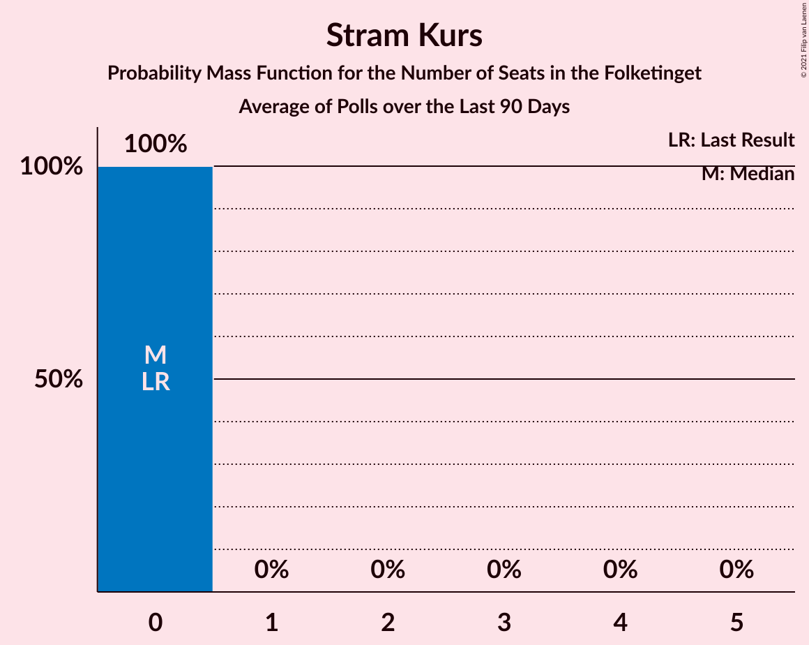

# Poll Average

<a href="#voting-intentions">Voting Intentions</a> | <a href="#seats">Seats</a> | <a href="#coalitions">Coalitions</a> | <a href="#technical-information">Technical Information</a>

## Summary

The table below lists the polls on which the average is based. They are the most recent polls (less than 90 days old) registered and analyzed so far.

| Period     | Polling firm/Commissioner(s) | A | V | O | B | F | Ø | C | Å | D | I | P | K | E |
|:----------:|:----------------------------:|:--:|:--:|:--:|:--:|:--:|:--:|:--:|:--:|:--:|:--:|:--:|:--:|:--:|
| 5 June 2019 | General Election | 25.9%   48 | 23.4%   43 | 8.7%   16 | 8.6%   16 | 7.7%   14 | 6.9%   13 | 6.6%   12 | 3.0%   5 | 2.4%   4 | 2.3%   4 | 1.8%   0 | 1.7%   0 | 0.8%   0 |
| N/A | Poll Average | 24–30%   43–53 | 20–26%   34–48 | 8–12%   15–23 | 7–11%   12–19 | 6–10%   10–19 | 6–9%   11–16 | 5–8%   10–15 | 2–4%   0–7 | 1–4%   0–7 | 2–4%   0–6 | 1–2%   0–4 | 1–2%   0–4 | 0–1%   0 |
| [16–22 September 2019](2019-09-22-Voxmeter.html) | Voxmeter   Ritzau | 25–30%   46–53 | 20–25%   36–46 | 8–11%   14–20 | 7–11%   13–20 | 7–10%   12–21 | 6–9%   10–16 | 6–9%   11–16 | 1–3%   0–5 | 1–2%   0–5 | 1–3%   0–6 | 1–2%   0–4 | 1–2%   0–4 | N/A   N/A |
| [19 September 2019](2019-09-19-Norstat.html) | Norstat   Altinget and Jyllands-Posten | 24–29%   43–52 | 20–25%   34–48 | 9–13%   16–23 | 6–10%   11–18 | 6–9%   10–17 | 6–9%   11–16 | 5–8%   10–14 | 2–4%   0–8 | 2–4%   0–6 | 2–4%   0–8 | 1–2%   0–4 | 1–2%   0–4 | 0–1%   0 |
| [8 August 2019](2019-08-08-Gallup.html) | Gallup | 23–28%   42–50 | 21–26%   39–46 | 8–11%   15–19 | 8–10%   13–19 | 6–9%   12–17 | 6–9%   12–15 | 6–8%   10–15 | 2–3%   0–7 | 2–4%   0–7 | 2–3%   0–6 | 1–2%   0 | 1–2%   0 | 0–1%   0 |
| 5 June 2019 | General Election | 25.9%   48 | 23.4%   43 | 8.7%   16 | 8.6%   16 | 7.7%   14 | 6.9%   13 | 6.6%   12 | 3.0%   5 | 2.4%   4 | 2.3%   4 | 1.8%   0 | 1.7%   0 | 0.8%   0 |

Only polls for which at least the sample size has been published are included in the table above.

**Legend:**
+ **Top half of each row:** Voting intentions (95% confidence interval)
+ **Bottom half of each row:** Seat projections for the Folketinget (95% confidence interval)
+ **A:** Socialdemokraterne
+ **V:** Venstre
+ **O:** Dansk Folkeparti
+ **B:** Radikale Venstre
+ **F:** Socialistisk Folkeparti
+ **Ø:** Enhedslisten–De Rød-Grønne
+ **C:** Det Konservative Folkeparti
+ **Å:** Alternativet
+ **D:** Nye Borgerlige
+ **I:** Liberal Alliance
+ **P:** Stram Kurs
+ **K:** Kristendemokraterne
+ **E:** Klaus Riskær Pedersen
+ **N/A (single party):** Party not included the published results
+ **N/A (entire row):** Calculation for this opinion poll not started yet

## Voting Intentions

### Confidence Intervals

| Party | Last Result | Median | 80% Confidence Interval | 90% Confidence Interval | 95% Confidence Interval | 99% Confidence Interval |
|:-----:|:-----------:|:------:|:-----------------------:|:-----------------------:|:-----------------------:|:-----------------------:|
| <a href="#socialdemokraterne">Socialdemokraterne</a> | 25.9% | 26.4% | 24.5–28.6% |24.0–29.3% | 23.6–29.8% | 22.9–30.8% |
| <a href="#venstre">Venstre</a> | 23.4% | 23.0% | 21.3–24.6% |20.8–25.1% | 20.4–25.5% | 19.6–26.3% |
| <a href="#dansk-folkeparti">Dansk Folkeparti</a> | 8.7% | 9.9% | 8.7–11.5% |8.3–12.0% | 8.1–12.4% | 7.6–13.2% |
| <a href="#radikale-venstre">Radikale Venstre</a> | 8.6% | 8.7% | 7.5–9.9% |7.1–10.3% | 6.9–10.6% | 6.3–11.2% |
| <a href="#socialistisk-folkeparti">Socialistisk Folkeparti</a> | 7.7% | 7.8% | 6.7–9.1% |6.4–9.5% | 6.1–9.8% | 5.6–10.5% |
| <a href="#enhedslisten–de-rød-grønne">Enhedslisten–De Rød-Grønne</a> | 6.9% | 7.3% | 6.3–8.3% |6.1–8.6% | 5.8–8.9% | 5.4–9.4% |
| <a href="#det-konservative-folkeparti">Det Konservative Folkeparti</a> | 6.6% | 6.9% | 5.9–7.9% |5.6–8.2% | 5.4–8.4% | 4.9–9.0% |
| <a href="#alternativet">Alternativet</a> | 3.0% | 2.5% | 1.9–3.2% |1.7–3.5% | 1.6–3.7% | 1.3–4.2% |
| <a href="#nye-borgerlige">Nye Borgerlige</a> | 2.4% | 2.4% | 1.3–3.2% |1.2–3.4% | 1.0–3.6% | 0.8–4.0% |
| <a href="#liberal-alliance">Liberal Alliance</a> | 2.3% | 2.4% | 1.9–3.2% |1.7–3.4% | 1.6–3.6% | 1.4–4.0% |
| <a href="#stram-kurs">Stram Kurs</a> | 1.8% | 1.4% | 1.0–1.9% |0.9–2.1% | 0.8–2.3% | 0.7–2.6% |
| <a href="#kristendemokraterne">Kristendemokraterne</a> | 1.7% | 1.4% | 1.0–1.9% |0.9–2.0% | 0.8–2.2% | 0.7–2.5% |
| <a href="#klaus-riskær-pedersen">Klaus Riskær Pedersen</a> | 0.8% | 0.4% | 0.1–0.8% |0.1–0.9% | 0.1–1.0% | 0.1–1.3% |

### Socialdemokraterne

*For a full overview of the results for this party, see the [Socialdemokraterne](party-socialdemokraterne.html) page.*

| Voting Intentions | Probability | Accumulated | Special Marks |
|:-----------------:|:-----------:|:-----------:|:-------------:|
| 20.5–21.5% | 0% | 100% |  |
| 21.5–22.5% | 0.2% | 100% |  |
| 22.5–23.5% | 2% | 99.8% |  |
| 23.5–24.5% | 9% | 98% |  |
| 24.5–25.5% | 19% | 89% |  |
| 25.5–26.5% | 24% | 70% | Last Result, Median |
| 26.5–27.5% | 21% | 46% |  |
| 27.5–28.5% | 14% | 25% |  |
| 28.5–29.5% | 7% | 11% |  |
| 29.5–30.5% | 3% | 3% |  |
| 30.5–31.5% | 0.7% | 0.8% |  |
| 31.5–32.5% | 0.1% | 0.1% |  |
| 32.5–33.5% | 0% | 0% |  |

### Venstre

*For a full overview of the results for this party, see the [Venstre](party-venstre.html) page.*

| Voting Intentions | Probability | Accumulated | Special Marks |
|:-----------------:|:-----------:|:-----------:|:-------------:|
| 17.5–18.5% | 0% | 100% |  |
| 18.5–19.5% | 0.4% | 100% |  |
| 19.5–20.5% | 3% | 99.5% |  |
| 20.5–21.5% | 11% | 97% |  |
| 21.5–22.5% | 23% | 86% |  |
| 22.5–23.5% | 29% | 63% | Last Result, Median |
| 23.5–24.5% | 22% | 34% |  |
| 24.5–25.5% | 9% | 11% |  |
| 25.5–26.5% | 2% | 2% |  |
| 26.5–27.5% | 0.2% | 0.3% |  |
| 27.5–28.5% | 0% | 0% |  |

### Dansk Folkeparti

*For a full overview of the results for this party, see the [Dansk Folkeparti](party-danskfolkeparti.html) page.*

| Voting Intentions | Probability | Accumulated | Special Marks |
|:-----------------:|:-----------:|:-----------:|:-------------:|
| 5.5–6.5% | 0% | 100% |  |
| 6.5–7.5% | 0.5% | 100% |  |
| 7.5–8.5% | 7% | 99.5% |  |
| 8.5–9.5% | 29% | 92% | Last Result |
| 9.5–10.5% | 33% | 63% | Median |
| 10.5–11.5% | 20% | 29% |  |
| 11.5–12.5% | 8% | 10% |  |
| 12.5–13.5% | 2% | 2% |  |
| 13.5–14.5% | 0.2% | 0.2% |  |
| 14.5–15.5% | 0% | 0% |  |

### Radikale Venstre

*For a full overview of the results for this party, see the [Radikale Venstre](party-radikalevenstre.html) page.*

| Voting Intentions | Probability | Accumulated | Special Marks |
|:-----------------:|:-----------:|:-----------:|:-------------:|
| 4.5–5.5% | 0% | 100% |  |
| 5.5–6.5% | 1.1% | 100% |  |
| 6.5–7.5% | 10% | 98.9% |  |
| 7.5–8.5% | 31% | 89% |  |
| 8.5–9.5% | 39% | 58% | Last Result, Median |
| 9.5–10.5% | 16% | 19% |  |
| 10.5–11.5% | 3% | 3% |  |
| 11.5–12.5% | 0.2% | 0.2% |  |
| 12.5–13.5% | 0% | 0% |  |

### Socialistisk Folkeparti

*For a full overview of the results for this party, see the [Socialistisk Folkeparti](party-socialistiskfolkeparti.html) page.*

| Voting Intentions | Probability | Accumulated | Special Marks |
|:-----------------:|:-----------:|:-----------:|:-------------:|
| 3.5–4.5% | 0% | 100% |  |
| 4.5–5.5% | 0.4% | 100% |  |
| 5.5–6.5% | 7% | 99.6% |  |
| 6.5–7.5% | 31% | 92% |  |
| 7.5–8.5% | 39% | 61% | Last Result, Median |
| 8.5–9.5% | 18% | 22% |  |
| 9.5–10.5% | 4% | 4% |  |
| 10.5–11.5% | 0.4% | 0.5% |  |
| 11.5–12.5% | 0% | 0% |  |

### Enhedslisten–De Rød-Grønne

*For a full overview of the results for this party, see the [Enhedslisten–De Rød-Grønne](party-enhedslisten–derød-grønne.html) page.*

| Voting Intentions | Probability | Accumulated | Special Marks |
|:-----------------:|:-----------:|:-----------:|:-------------:|
| 3.5–4.5% | 0% | 100% |  |
| 4.5–5.5% | 0.9% | 100% |  |
| 5.5–6.5% | 15% | 99.1% |  |
| 6.5–7.5% | 46% | 84% | Last Result, Median |
| 7.5–8.5% | 32% | 38% |  |
| 8.5–9.5% | 6% | 6% |  |
| 9.5–10.5% | 0.3% | 0.3% |  |
| 10.5–11.5% | 0% | 0% |  |

### Det Konservative Folkeparti

*For a full overview of the results for this party, see the [Det Konservative Folkeparti](party-detkonservativefolkeparti.html) page.*

| Voting Intentions | Probability | Accumulated | Special Marks |
|:-----------------:|:-----------:|:-----------:|:-------------:|
| 3.5–4.5% | 0.1% | 100% |  |
| 4.5–5.5% | 4% | 99.9% |  |
| 5.5–6.5% | 30% | 96% |  |
| 6.5–7.5% | 47% | 66% | Last Result, Median |
| 7.5–8.5% | 17% | 19% |  |
| 8.5–9.5% | 2% | 2% |  |
| 9.5–10.5% | 0.1% | 0.1% |  |
| 10.5–11.5% | 0% | 0% |  |

### Alternativet

*For a full overview of the results for this party, see the [Alternativet](party-alternativet.html) page.*

| Voting Intentions | Probability | Accumulated | Special Marks |
|:-----------------:|:-----------:|:-----------:|:-------------:|
| 0.0–0.5% | 0% | 100% |  |
| 0.5–1.5% | 2% | 100% |  |
| 1.5–2.5% | 52% | 98% | Median |
| 2.5–3.5% | 41% | 45% | Last Result |
| 3.5–4.5% | 4% | 4% |  |
| 4.5–5.5% | 0.1% | 0.1% |  |
| 5.5–6.5% | 0% | 0% |  |

### Nye Borgerlige

*For a full overview of the results for this party, see the [Nye Borgerlige](party-nyeborgerlige.html) page.*

| Voting Intentions | Probability | Accumulated | Special Marks |
|:-----------------:|:-----------:|:-----------:|:-------------:|
| 0.0–0.5% | 0% | 100% |  |
| 0.5–1.5% | 19% | 100% |  |
| 1.5–2.5% | 38% | 81% | Last Result, Median |
| 2.5–3.5% | 40% | 43% |  |
| 3.5–4.5% | 3% | 3% |  |
| 4.5–5.5% | 0% | 0% |  |

### Liberal Alliance

*For a full overview of the results for this party, see the [Liberal Alliance](party-liberalalliance.html) page.*

| Voting Intentions | Probability | Accumulated | Special Marks |
|:-----------------:|:-----------:|:-----------:|:-------------:|
| 0.0–0.5% | 0% | 100% |  |
| 0.5–1.5% | 2% | 100% |  |
| 1.5–2.5% | 57% | 98% | Last Result, Median |
| 2.5–3.5% | 38% | 41% |  |
| 3.5–4.5% | 3% | 3% |  |
| 4.5–5.5% | 0.1% | 0.1% |  |
| 5.5–6.5% | 0% | 0% |  |

### Stram Kurs

*For a full overview of the results for this party, see the [Stram Kurs](party-stramkurs.html) page.*

| Voting Intentions | Probability | Accumulated | Special Marks |
|:-----------------:|:-----------:|:-----------:|:-------------:|
| 0.0–0.5% | 0.1% | 100% |  |
| 0.5–1.5% | 67% | 99.9% | Median |
| 1.5–2.5% | 32% | 33% | Last Result |
| 2.5–3.5% | 0.7% | 0.7% |  |
| 3.5–4.5% | 0% | 0% |  |

### Kristendemokraterne

*For a full overview of the results for this party, see the [Kristendemokraterne](party-kristendemokraterne.html) page.*

| Voting Intentions | Probability | Accumulated | Special Marks |
|:-----------------:|:-----------:|:-----------:|:-------------:|
| 0.0–0.5% | 0.1% | 100% |  |
| 0.5–1.5% | 67% | 99.9% | Median |
| 1.5–2.5% | 32% | 33% | Last Result |
| 2.5–3.5% | 0.4% | 0.4% |  |
| 3.5–4.5% | 0% | 0% |  |

### Klaus Riskær Pedersen

*For a full overview of the results for this party, see the [Klaus Riskær Pedersen](party-klausriskærpedersen.html) page.*

| Voting Intentions | Probability | Accumulated | Special Marks |
|:-----------------:|:-----------:|:-----------:|:-------------:|
| 0.0–0.5% | 72% | 100% | Median |
| 0.5–1.5% | 28% | 28% | Last Result |
| 1.5–2.5% | 0.1% | 0.1% |  |
| 2.5–3.5% | 0% | 0% |  |

## Seats

### Confidence Intervals

| Party | Last Result | Median | 80% Confidence Interval | 90% Confidence Interval | 95% Confidence Interval | 99% Confidence Interval |
|:-----:|:-----------:|:------:|:-----------------------:|:-----------------------:|:-----------------------:|:-----------------------:|
| <a href="#socialdemokraterne">Socialdemokraterne</a> | 48 | 48 | 44–53 |43–53 | 43–53 | 42–54 |
| <a href="#venstre">Venstre</a> | 43 | 42 | 38–45 |37–46 | 34–48 | 34–48 |
| <a href="#dansk-folkeparti">Dansk Folkeparti</a> | 16 | 17 | 16–22 |16–23 | 15–23 | 14–23 |
| <a href="#radikale-venstre">Radikale Venstre</a> | 16 | 16 | 13–19 |13–19 | 12–19 | 11–20 |
| <a href="#socialistisk-folkeparti">Socialistisk Folkeparti</a> | 14 | 14 | 11–17 |10–18 | 10–19 | 10–21 |
| <a href="#enhedslisten–de-rød-grønne">Enhedslisten–De Rød-Grønne</a> | 13 | 14 | 11–15 |11–16 | 11–16 | 10–17 |
| <a href="#det-konservative-folkeparti">Det Konservative Folkeparti</a> | 12 | 12 | 10–14 |10–15 | 10–15 | 9–16 |
| <a href="#alternativet">Alternativet</a> | 5 | 5 | 0–6 |0–7 | 0–7 | 0–8 |
| <a href="#nye-borgerlige">Nye Borgerlige</a> | 4 | 4 | 0–6 |0–6 | 0–7 | 0–7 |
| <a href="#liberal-alliance">Liberal Alliance</a> | 4 | 4 | 0–6 |0–6 | 0–6 | 0–8 |
| <a href="#stram-kurs">Stram Kurs</a> | 0 | 0 | 0–4 |0–4 | 0–4 | 0–5 |
| <a href="#kristendemokraterne">Kristendemokraterne</a> | 0 | 0 | 0 |0–4 | 0–4 | 0–5 |
| <a href="#klaus-riskær-pedersen">Klaus Riskær Pedersen</a> | 0 | 0 | 0 |0 | 0 | 0 |

### Socialdemokraterne

*For a full overview of the results for this party, see the [Socialdemokraterne](party-socialdemokraterne.html) page.*

| Number of Seats | Probability | Accumulated | Special Marks |
|:---------------:|:-----------:|:-----------:|:-------------:|
| 40 | 0% | 100% |  |
| 41 | 0.1% | 99.9% |  |
| 42 | 2% | 99.8% |  |
| 43 | 4% | 98% |  |
| 44 | 5% | 94% |  |
| 45 | 5% | 89% |  |
| 46 | 10% | 84% |  |
| 47 | 9% | 74% |  |
| 48 | 26% | 65% | Last Result, Median |
| 49 | 3% | 39% |  |
| 50 | 13% | 36% |  |
| 51 | 3% | 22% |  |
| 52 | 7% | 20% |  |
| 53 | 12% | 13% |  |
| 54 | 0.4% | 0.8% |  |
| 55 | 0.1% | 0.4% |  |
| 56 | 0.2% | 0.3% |  |
| 57 | 0% | 0.1% |  |
| 58 | 0% | 0.1% |  |
| 59 | 0% | 0% |  |

### Venstre

*For a full overview of the results for this party, see the [Venstre](party-venstre.html) page.*

| Number of Seats | Probability | Accumulated | Special Marks |
|:---------------:|:-----------:|:-----------:|:-------------:|
| 32 | 0.1% | 100% |  |
| 33 | 0.1% | 99.9% |  |
| 34 | 3% | 99.9% |  |
| 35 | 0.3% | 97% |  |
| 36 | 0.9% | 96% |  |
| 37 | 2% | 95% |  |
| 38 | 9% | 94% |  |
| 39 | 4% | 85% |  |
| 40 | 13% | 81% |  |
| 41 | 18% | 69% |  |
| 42 | 26% | 51% | Median |
| 43 | 2% | 25% | Last Result |
| 44 | 10% | 22% |  |
| 45 | 5% | 12% |  |
| 46 | 3% | 8% |  |
| 47 | 0.4% | 4% |  |
| 48 | 4% | 4% |  |
| 49 | 0.1% | 0.1% |  |
| 50 | 0% | 0% |  |

### Dansk Folkeparti

*For a full overview of the results for this party, see the [Dansk Folkeparti](party-danskfolkeparti.html) page.*

| Number of Seats | Probability | Accumulated | Special Marks |
|:---------------:|:-----------:|:-----------:|:-------------:|
| 13 | 0.2% | 100% |  |
| 14 | 2% | 99.8% |  |
| 15 | 1.4% | 98% |  |
| 16 | 15% | 97% | Last Result |
| 17 | 37% | 81% | Median |
| 18 | 11% | 45% |  |
| 19 | 7% | 34% |  |
| 20 | 7% | 27% |  |
| 21 | 0.3% | 20% |  |
| 22 | 11% | 19% |  |
| 23 | 9% | 9% |  |
| 24 | 0.1% | 0.2% |  |
| 25 | 0.1% | 0.1% |  |
| 26 | 0% | 0% |  |

### Radikale Venstre

*For a full overview of the results for this party, see the [Radikale Venstre](party-radikalevenstre.html) page.*

| Number of Seats | Probability | Accumulated | Special Marks |
|:---------------:|:-----------:|:-----------:|:-------------:|
| 10 | 0.1% | 100% |  |
| 11 | 2% | 99.9% |  |
| 12 | 2% | 98% |  |
| 13 | 10% | 96% |  |
| 14 | 8% | 86% |  |
| 15 | 17% | 77% |  |
| 16 | 31% | 60% | Last Result, Median |
| 17 | 6% | 29% |  |
| 18 | 12% | 23% |  |
| 19 | 10% | 11% |  |
| 20 | 1.1% | 1.2% |  |
| 21 | 0.1% | 0.2% |  |
| 22 | 0% | 0% |  |

### Socialistisk Folkeparti

*For a full overview of the results for this party, see the [Socialistisk Folkeparti](party-socialistiskfolkeparti.html) page.*

| Number of Seats | Probability | Accumulated | Special Marks |
|:---------------:|:-----------:|:-----------:|:-------------:|
| 9 | 0.3% | 100% |  |
| 10 | 8% | 99.7% |  |
| 11 | 7% | 92% |  |
| 12 | 13% | 85% |  |
| 13 | 12% | 73% |  |
| 14 | 25% | 61% | Last Result, Median |
| 15 | 14% | 36% |  |
| 16 | 7% | 22% |  |
| 17 | 5% | 15% |  |
| 18 | 6% | 10% |  |
| 19 | 1.1% | 3% |  |
| 20 | 1.2% | 2% |  |
| 21 | 1.0% | 1.0% |  |
| 22 | 0% | 0% |  |

### Enhedslisten–De Rød-Grønne

*For a full overview of the results for this party, see the [Enhedslisten–De Rød-Grønne](party-enhedslisten–derød-grønne.html) page.*

| Number of Seats | Probability | Accumulated | Special Marks |
|:---------------:|:-----------:|:-----------:|:-------------:|
| 9 | 0.2% | 100% |  |
| 10 | 2% | 99.8% |  |
| 11 | 11% | 98% |  |
| 12 | 20% | 87% |  |
| 13 | 7% | 67% | Last Result |
| 14 | 32% | 59% | Median |
| 15 | 18% | 27% |  |
| 16 | 7% | 9% |  |
| 17 | 1.3% | 2% |  |
| 18 | 0.2% | 0.3% |  |
| 19 | 0% | 0% |  |

### Det Konservative Folkeparti

*For a full overview of the results for this party, see the [Det Konservative Folkeparti](party-detkonservativefolkeparti.html) page.*

| Number of Seats | Probability | Accumulated | Special Marks |
|:---------------:|:-----------:|:-----------:|:-------------:|
| 8 | 0.3% | 100% |  |
| 9 | 0.3% | 99.7% |  |
| 10 | 11% | 99.3% |  |
| 11 | 15% | 88% |  |
| 12 | 24% | 73% | Last Result, Median |
| 13 | 33% | 49% |  |
| 14 | 11% | 16% |  |
| 15 | 4% | 5% |  |
| 16 | 1.2% | 2% |  |
| 17 | 0.2% | 0.3% |  |
| 18 | 0.1% | 0.1% |  |
| 19 | 0% | 0% |  |

### Alternativet

*For a full overview of the results for this party, see the [Alternativet](party-alternativet.html) page.*

| Number of Seats | Probability | Accumulated | Special Marks |
|:---------------:|:-----------:|:-----------:|:-------------:|
| 0 | 32% | 100% |  |
| 1 | 0% | 68% |  |
| 2 | 0% | 68% |  |
| 3 | 0% | 68% |  |
| 4 | 17% | 68% |  |
| 5 | 40% | 51% | Last Result, Median |
| 6 | 5% | 11% |  |
| 7 | 4% | 6% |  |
| 8 | 2% | 2% |  |
| 9 | 0.5% | 0.5% |  |
| 10 | 0% | 0% |  |

### Nye Borgerlige

*For a full overview of the results for this party, see the [Nye Borgerlige](party-nyeborgerlige.html) page.*

| Number of Seats | Probability | Accumulated | Special Marks |
|:---------------:|:-----------:|:-----------:|:-------------:|
| 0 | 36% | 100% |  |
| 1 | 0% | 64% |  |
| 2 | 0% | 64% |  |
| 3 | 0% | 64% |  |
| 4 | 28% | 64% | Last Result, Median |
| 5 | 21% | 36% |  |
| 6 | 13% | 16% |  |
| 7 | 2% | 3% |  |
| 8 | 0.2% | 0.2% |  |
| 9 | 0% | 0% |  |

### Liberal Alliance

*For a full overview of the results for this party, see the [Liberal Alliance](party-liberalalliance.html) page.*

| Number of Seats | Probability | Accumulated | Special Marks |
|:---------------:|:-----------:|:-----------:|:-------------:|
| 0 | 25% | 100% |  |
| 1 | 0% | 75% |  |
| 2 | 0% | 75% |  |
| 3 | 0% | 75% |  |
| 4 | 37% | 75% | Last Result, Median |
| 5 | 14% | 38% |  |
| 6 | 22% | 24% |  |
| 7 | 0.9% | 2% |  |
| 8 | 1.0% | 1.1% |  |
| 9 | 0.1% | 0.1% |  |
| 10 | 0% | 0% |  |

### Stram Kurs

*For a full overview of the results for this party, see the [Stram Kurs](party-stramkurs.html) page.*

| Number of Seats | Probability | Accumulated | Special Marks |
|:---------------:|:-----------:|:-----------:|:-------------:|
| 0 | 77% | 100% | Last Result, Median |
| 1 | 0% | 23% |  |
| 2 | 0% | 23% |  |
| 3 | 0% | 23% |  |
| 4 | 21% | 23% |  |
| 5 | 1.4% | 1.5% |  |
| 6 | 0% | 0% |  |

### Kristendemokraterne

*For a full overview of the results for this party, see the [Kristendemokraterne](party-kristendemokraterne.html) page.*

| Number of Seats | Probability | Accumulated | Special Marks |
|:---------------:|:-----------:|:-----------:|:-------------:|
| 0 | 95% | 100% | Last Result, Median |
| 1 | 0% | 5% |  |
| 2 | 0% | 5% |  |
| 3 | 0% | 5% |  |
| 4 | 5% | 5% |  |
| 5 | 0.5% | 0.5% |  |
| 6 | 0% | 0% |  |

### Klaus Riskær Pedersen

*For a full overview of the results for this party, see the [Klaus Riskær Pedersen](party-klausriskærpedersen.html) page.*

| Number of Seats | Probability | Accumulated | Special Marks |
|:---------------:|:-----------:|:-----------:|:-------------:|
| 0 | 100% | 100% | Last Result, Median |

## Coalitions

### Confidence Intervals

| Coalition | Last Result | Median | Majority? | 80% Confidence Interval | 90% Confidence Interval | 95% Confidence Interval | 99% Confidence Interval |
|:---------:|:-----------:|:------:|:---------:|:-----------------------:|:-----------------------:|:-----------------------:|:-----------------------:|
| Socialdemokraterne – Radikale Venstre – Socialistisk Folkeparti – Enhedslisten–De Rød-Grønne – Alternativet | 96 | 94 | 85% | 88–102 | 87–102 | 87–102 | 85–103 |
| Socialdemokraterne – Radikale Venstre – Socialistisk Folkeparti – Enhedslisten–De Rød-Grønne | 91 | 93 | 63% | 83–97 | 83–98 | 83–100 | 80–101 |
| Venstre – Dansk Folkeparti – Det Konservative Folkeparti – Nye Borgerlige – Liberal Alliance – Stram Kurs – Kristendemokraterne – Klaus Riskær Pedersen | 79 | 81 | 0.6% | 73–87 | 73–88 | 73–88 | 72–90 |
| Venstre – Dansk Folkeparti – Det Konservative Folkeparti – Nye Borgerlige – Liberal Alliance – Kristendemokraterne – Klaus Riskær Pedersen | 79 | 81 | 0.6% | 70–83 | 69–86 | 69–88 | 69–90 |
| Venstre – Dansk Folkeparti – Det Konservative Folkeparti – Nye Borgerlige – Liberal Alliance – Klaus Riskær Pedersen | 79 | 80 | 0.6% | 70–83 | 69–85 | 69–88 | 69–90 |
| Venstre – Dansk Folkeparti – Det Konservative Folkeparti – Nye Borgerlige – Liberal Alliance – Kristendemokraterne | 79 | 81 | 0.6% | 70–83 | 69–86 | 69–88 | 69–90 |
| Venstre – Dansk Folkeparti – Det Konservative Folkeparti – Nye Borgerlige – Liberal Alliance | 79 | 80 | 0.6% | 70–83 | 69–85 | 69–88 | 69–90 |
| Socialdemokraterne – Socialistisk Folkeparti – Enhedslisten–De Rød-Grønne – Alternativet | 80 | 78 | 0.1% | 75–87 | 73–87 | 73–87 | 73–87 |
| Socialdemokraterne – Radikale Venstre – Socialistisk Folkeparti | 78 | 78 | 0.8% | 71–85 | 71–87 | 70–87 | 67–90 |
| Venstre – Dansk Folkeparti – Det Konservative Folkeparti – Liberal Alliance – Kristendemokraterne | 75 | 77 | 0% | 70–81 | 69–83 | 69–83 | 68–84 |
| Venstre – Dansk Folkeparti – Det Konservative Folkeparti – Liberal Alliance | 75 | 77 | 0% | 70–79 | 69–81 | 69–83 | 68–84 |
| Socialdemokraterne – Socialistisk Folkeparti – Enhedslisten–De Rød-Grønne | 75 | 76 | 0.1% | 70–82 | 70–82 | 68–82 | 68–87 |
| Socialdemokraterne – Radikale Venstre | 64 | 64 | 0% | 60–69 | 58–69 | 58–71 | 55–73 |
| Venstre – Det Konservative Folkeparti – Liberal Alliance | 59 | 58 | 0% | 52–61 | 52–62 | 52–63 | 51–65 |
| Venstre – Det Konservative Folkeparti | 55 | 54 | 0% | 50–57 | 49–59 | 47–61 | 47–61 |
| Venstre | 43 | 42 | 0% | 38–45 | 37–46 | 34–48 | 34–48 |

### Socialdemokraterne – Radikale Venstre – Socialistisk Folkeparti – Enhedslisten–De Rød-Grønne – Alternativet

| Number of Seats | Probability | Accumulated | Special Marks |
|:---------------:|:-----------:|:-----------:|:-------------:|
| 84 | 0% | 100% |  |
| 85 | 0.6% | 99.9% |  |
| 86 | 0.1% | 99.4% |  |
| 87 | 5% | 99.2% |  |
| 88 | 8% | 94% |  |
| 89 | 2% | 87% |  |
| 90 | 1.2% | 85% | Majority |
| 91 | 2% | 84% |  |
| 92 | 7% | 82% |  |
| 93 | 17% | 75% |  |
| 94 | 12% | 59% |  |
| 95 | 3% | 47% |  |
| 96 | 5% | 43% | Last Result |
| 97 | 2% | 38% | Median |
| 98 | 9% | 36% |  |
| 99 | 0.7% | 27% |  |
| 100 | 13% | 26% |  |
| 101 | 2% | 13% |  |
| 102 | 9% | 11% |  |
| 103 | 1.2% | 2% |  |
| 104 | 0.2% | 0.5% |  |
| 105 | 0% | 0.3% |  |
| 106 | 0.1% | 0.2% |  |
| 107 | 0% | 0.1% |  |
| 108 | 0.1% | 0.1% |  |
| 109 | 0% | 0.1% |  |
| 110 | 0.1% | 0.1% |  |
| 111 | 0% | 0% |  |

### Socialdemokraterne – Radikale Venstre – Socialistisk Folkeparti – Enhedslisten–De Rød-Grønne

| Number of Seats | Probability | Accumulated | Special Marks |
|:---------------:|:-----------:|:-----------:|:-------------:|
| 80 | 0.6% | 100% |  |
| 81 | 0.2% | 99.3% |  |
| 82 | 0.1% | 99.2% |  |
| 83 | 10% | 99.1% |  |
| 84 | 0.7% | 89% |  |
| 85 | 1.0% | 89% |  |
| 86 | 2% | 88% |  |
| 87 | 9% | 86% |  |
| 88 | 2% | 77% |  |
| 89 | 12% | 75% |  |
| 90 | 7% | 63% | Majority |
| 91 | 2% | 56% | Last Result |
| 92 | 2% | 54% | Median |
| 93 | 14% | 52% |  |
| 94 | 5% | 38% |  |
| 95 | 6% | 33% |  |
| 96 | 6% | 27% |  |
| 97 | 11% | 21% |  |
| 98 | 7% | 10% |  |
| 99 | 0.3% | 3% |  |
| 100 | 1.3% | 3% |  |
| 101 | 0.8% | 1.3% |  |
| 102 | 0.2% | 0.4% |  |
| 103 | 0.1% | 0.2% |  |
| 104 | 0% | 0.1% |  |
| 105 | 0% | 0.1% |  |
| 106 | 0% | 0.1% |  |
| 107 | 0% | 0.1% |  |
| 108 | 0% | 0.1% |  |
| 109 | 0% | 0.1% |  |
| 110 | 0.1% | 0.1% |  |
| 111 | 0% | 0% |  |

### Venstre – Dansk Folkeparti – Det Konservative Folkeparti – Nye Borgerlige – Liberal Alliance – Stram Kurs – Kristendemokraterne – Klaus Riskær Pedersen

| Number of Seats | Probability | Accumulated | Special Marks |
|:---------------:|:-----------:|:-----------:|:-------------:|
| 65 | 0.1% | 100% |  |
| 66 | 0% | 99.9% |  |
| 67 | 0.1% | 99.9% |  |
| 68 | 0% | 99.9% |  |
| 69 | 0.1% | 99.9% |  |
| 70 | 0% | 99.8% |  |
| 71 | 0.2% | 99.7% |  |
| 72 | 1.2% | 99.5% |  |
| 73 | 9% | 98% |  |
| 74 | 2% | 89% |  |
| 75 | 13% | 87% |  |
| 76 | 0.7% | 74% |  |
| 77 | 9% | 73% |  |
| 78 | 2% | 64% |  |
| 79 | 5% | 62% | Last Result, Median |
| 80 | 3% | 57% |  |
| 81 | 12% | 53% |  |
| 82 | 17% | 41% |  |
| 83 | 7% | 25% |  |
| 84 | 2% | 18% |  |
| 85 | 1.2% | 16% |  |
| 86 | 2% | 15% |  |
| 87 | 8% | 13% |  |
| 88 | 5% | 6% |  |
| 89 | 0.1% | 0.8% |  |
| 90 | 0.6% | 0.6% | Majority |
| 91 | 0% | 0.1% |  |
| 92 | 0% | 0% |  |

### Venstre – Dansk Folkeparti – Det Konservative Folkeparti – Nye Borgerlige – Liberal Alliance – Kristendemokraterne – Klaus Riskær Pedersen

| Number of Seats | Probability | Accumulated | Special Marks |
|:---------------:|:-----------:|:-----------:|:-------------:|
| 65 | 0.1% | 100% |  |
| 66 | 0% | 99.9% |  |
| 67 | 0.1% | 99.9% |  |
| 68 | 0% | 99.9% |  |
| 69 | 9% | 99.8% |  |
| 70 | 1.1% | 91% |  |
| 71 | 0.6% | 90% |  |
| 72 | 1.3% | 89% |  |
| 73 | 0.3% | 88% |  |
| 74 | 1.2% | 87% |  |
| 75 | 13% | 86% |  |
| 76 | 2% | 73% |  |
| 77 | 9% | 72% |  |
| 78 | 3% | 63% |  |
| 79 | 6% | 60% | Last Result, Median |
| 80 | 3% | 54% |  |
| 81 | 11% | 52% |  |
| 82 | 17% | 40% |  |
| 83 | 13% | 23% |  |
| 84 | 3% | 10% |  |
| 85 | 1.1% | 7% |  |
| 86 | 0.9% | 6% |  |
| 87 | 0.4% | 5% |  |
| 88 | 4% | 4% |  |
| 89 | 0.1% | 0.7% |  |
| 90 | 0.6% | 0.6% | Majority |
| 91 | 0% | 0% |  |

### Venstre – Dansk Folkeparti – Det Konservative Folkeparti – Nye Borgerlige – Liberal Alliance – Klaus Riskær Pedersen

| Number of Seats | Probability | Accumulated | Special Marks |
|:---------------:|:-----------:|:-----------:|:-------------:|
| 65 | 0.1% | 100% |  |
| 66 | 0% | 99.9% |  |
| 67 | 0.1% | 99.9% |  |
| 68 | 0% | 99.8% |  |
| 69 | 9% | 99.8% |  |
| 70 | 1.2% | 91% |  |
| 71 | 0.6% | 89% |  |
| 72 | 1.3% | 89% |  |
| 73 | 0.3% | 88% |  |
| 74 | 1.2% | 87% |  |
| 75 | 13% | 86% |  |
| 76 | 2% | 73% |  |
| 77 | 10% | 71% |  |
| 78 | 3% | 61% |  |
| 79 | 7% | 58% | Last Result, Median |
| 80 | 3% | 51% |  |
| 81 | 11% | 48% |  |
| 82 | 17% | 37% |  |
| 83 | 11% | 20% |  |
| 84 | 3% | 9% |  |
| 85 | 1.1% | 6% |  |
| 86 | 0.2% | 5% |  |
| 87 | 0.4% | 5% |  |
| 88 | 4% | 4% |  |
| 89 | 0% | 0.6% |  |
| 90 | 0.5% | 0.6% | Majority |
| 91 | 0% | 0% |  |

### Venstre – Dansk Folkeparti – Det Konservative Folkeparti – Nye Borgerlige – Liberal Alliance – Kristendemokraterne

| Number of Seats | Probability | Accumulated | Special Marks |
|:---------------:|:-----------:|:-----------:|:-------------:|
| 65 | 0.1% | 100% |  |
| 66 | 0% | 99.9% |  |
| 67 | 0.1% | 99.9% |  |
| 68 | 0% | 99.9% |  |
| 69 | 9% | 99.8% |  |
| 70 | 1.1% | 91% |  |
| 71 | 0.6% | 90% |  |
| 72 | 1.3% | 89% |  |
| 73 | 0.3% | 88% |  |
| 74 | 1.2% | 87% |  |
| 75 | 13% | 86% |  |
| 76 | 2% | 73% |  |
| 77 | 9% | 72% |  |
| 78 | 3% | 63% |  |
| 79 | 6% | 60% | Last Result, Median |
| 80 | 3% | 54% |  |
| 81 | 11% | 52% |  |
| 82 | 17% | 40% |  |
| 83 | 13% | 23% |  |
| 84 | 3% | 10% |  |
| 85 | 1.1% | 7% |  |
| 86 | 0.9% | 6% |  |
| 87 | 0.4% | 5% |  |
| 88 | 4% | 4% |  |
| 89 | 0.1% | 0.7% |  |
| 90 | 0.6% | 0.6% | Majority |
| 91 | 0% | 0% |  |

### Venstre – Dansk Folkeparti – Det Konservative Folkeparti – Nye Borgerlige – Liberal Alliance

| Number of Seats | Probability | Accumulated | Special Marks |
|:---------------:|:-----------:|:-----------:|:-------------:|
| 65 | 0.1% | 100% |  |
| 66 | 0% | 99.9% |  |
| 67 | 0.1% | 99.9% |  |
| 68 | 0% | 99.8% |  |
| 69 | 9% | 99.8% |  |
| 70 | 1.2% | 91% |  |
| 71 | 0.6% | 89% |  |
| 72 | 1.3% | 89% |  |
| 73 | 0.3% | 88% |  |
| 74 | 1.2% | 87% |  |
| 75 | 13% | 86% |  |
| 76 | 2% | 73% |  |
| 77 | 10% | 71% |  |
| 78 | 3% | 61% |  |
| 79 | 7% | 58% | Last Result, Median |
| 80 | 3% | 51% |  |
| 81 | 11% | 48% |  |
| 82 | 17% | 37% |  |
| 83 | 11% | 20% |  |
| 84 | 3% | 9% |  |
| 85 | 1.1% | 6% |  |
| 86 | 0.2% | 5% |  |
| 87 | 0.4% | 5% |  |
| 88 | 4% | 4% |  |
| 89 | 0% | 0.6% |  |
| 90 | 0.5% | 0.6% | Majority |
| 91 | 0% | 0% |  |

### Socialdemokraterne – Socialistisk Folkeparti – Enhedslisten–De Rød-Grønne – Alternativet

| Number of Seats | Probability | Accumulated | Special Marks |
|:---------------:|:-----------:|:-----------:|:-------------:|
| 70 | 0% | 100% |  |
| 71 | 0.2% | 99.9% |  |
| 72 | 0.1% | 99.7% |  |
| 73 | 5% | 99.6% |  |
| 74 | 2% | 95% |  |
| 75 | 11% | 93% |  |
| 76 | 5% | 82% |  |
| 77 | 21% | 78% |  |
| 78 | 10% | 57% |  |
| 79 | 12% | 47% |  |
| 80 | 3% | 35% | Last Result |
| 81 | 3% | 32% | Median |
| 82 | 7% | 29% |  |
| 83 | 2% | 22% |  |
| 84 | 6% | 20% |  |
| 85 | 2% | 14% |  |
| 86 | 1.3% | 12% |  |
| 87 | 10% | 10% |  |
| 88 | 0.1% | 0.3% |  |
| 89 | 0.1% | 0.2% |  |
| 90 | 0.1% | 0.1% | Majority |
| 91 | 0% | 0% |  |

### Socialdemokraterne – Radikale Venstre – Socialistisk Folkeparti

| Number of Seats | Probability | Accumulated | Special Marks |
|:---------------:|:-----------:|:-----------:|:-------------:|
| 67 | 0.7% | 100% |  |
| 68 | 0.3% | 99.3% |  |
| 69 | 0.3% | 98.9% |  |
| 70 | 1.4% | 98.6% |  |
| 71 | 9% | 97% |  |
| 72 | 1.0% | 88% |  |
| 73 | 2% | 87% |  |
| 74 | 5% | 85% |  |
| 75 | 15% | 80% |  |
| 76 | 5% | 65% |  |
| 77 | 4% | 60% |  |
| 78 | 14% | 56% | Last Result, Median |
| 79 | 8% | 42% |  |
| 80 | 3% | 34% |  |
| 81 | 3% | 31% |  |
| 82 | 7% | 28% |  |
| 83 | 10% | 22% |  |
| 84 | 0.8% | 12% |  |
| 85 | 2% | 11% |  |
| 86 | 1.0% | 9% |  |
| 87 | 7% | 8% |  |
| 88 | 0.3% | 1.2% |  |
| 89 | 0% | 0.9% |  |
| 90 | 0.8% | 0.8% | Majority |
| 91 | 0% | 0.1% |  |
| 92 | 0% | 0.1% |  |
| 93 | 0.1% | 0.1% |  |
| 94 | 0% | 0% |  |

### Venstre – Dansk Folkeparti – Det Konservative Folkeparti – Liberal Alliance – Kristendemokraterne

| Number of Seats | Probability | Accumulated | Special Marks |
|:---------------:|:-----------:|:-----------:|:-------------:|
| 64 | 0.1% | 100% |  |
| 65 | 0.2% | 99.9% |  |
| 66 | 0% | 99.7% |  |
| 67 | 0.1% | 99.7% |  |
| 68 | 0.1% | 99.6% |  |
| 69 | 9% | 99.5% |  |
| 70 | 3% | 90% |  |
| 71 | 7% | 87% |  |
| 72 | 2% | 80% |  |
| 73 | 2% | 78% |  |
| 74 | 1.5% | 76% |  |
| 75 | 12% | 75% | Last Result, Median |
| 76 | 10% | 62% |  |
| 77 | 19% | 52% |  |
| 78 | 18% | 34% |  |
| 79 | 3% | 16% |  |
| 80 | 2% | 13% |  |
| 81 | 5% | 12% |  |
| 82 | 0.4% | 7% |  |
| 83 | 6% | 7% |  |
| 84 | 0.6% | 0.8% |  |
| 85 | 0.1% | 0.2% |  |
| 86 | 0% | 0.1% |  |
| 87 | 0% | 0% |  |

### Venstre – Dansk Folkeparti – Det Konservative Folkeparti – Liberal Alliance

| Number of Seats | Probability | Accumulated | Special Marks |
|:---------------:|:-----------:|:-----------:|:-------------:|
| 64 | 0.1% | 100% |  |
| 65 | 0.3% | 99.9% |  |
| 66 | 0% | 99.7% |  |
| 67 | 0.1% | 99.6% |  |
| 68 | 0.2% | 99.5% |  |
| 69 | 9% | 99.4% |  |
| 70 | 3% | 90% |  |
| 71 | 7% | 87% |  |
| 72 | 2% | 80% |  |
| 73 | 2% | 78% |  |
| 74 | 1.5% | 76% |  |
| 75 | 13% | 74% | Last Result, Median |
| 76 | 10% | 61% |  |
| 77 | 19% | 51% |  |
| 78 | 18% | 32% |  |
| 79 | 4% | 14% |  |
| 80 | 2% | 10% |  |
| 81 | 4% | 8% |  |
| 82 | 0.1% | 5% |  |
| 83 | 4% | 4% |  |
| 84 | 0.6% | 0.7% |  |
| 85 | 0% | 0.1% |  |
| 86 | 0% | 0% |  |

### Socialdemokraterne – Socialistisk Folkeparti – Enhedslisten–De Rød-Grønne

| Number of Seats | Probability | Accumulated | Special Marks |
|:---------------:|:-----------:|:-----------:|:-------------:|
| 66 | 0.2% | 100% |  |
| 67 | 0.1% | 99.7% |  |
| 68 | 3% | 99.7% |  |
| 69 | 2% | 97% |  |
| 70 | 8% | 95% |  |
| 71 | 2% | 87% |  |
| 72 | 3% | 86% |  |
| 73 | 20% | 82% |  |
| 74 | 2% | 62% |  |
| 75 | 4% | 59% | Last Result |
| 76 | 6% | 56% | Median |
| 77 | 21% | 50% |  |
| 78 | 2% | 29% |  |
| 79 | 8% | 27% |  |
| 80 | 7% | 20% |  |
| 81 | 1.3% | 13% |  |
| 82 | 10% | 12% |  |
| 83 | 0% | 2% |  |
| 84 | 0.2% | 2% |  |
| 85 | 0.3% | 2% |  |
| 86 | 0.3% | 1.3% |  |
| 87 | 1.0% | 1.1% |  |
| 88 | 0% | 0.1% |  |
| 89 | 0% | 0.1% |  |
| 90 | 0.1% | 0.1% | Majority |
| 91 | 0% | 0% |  |

### Socialdemokraterne – Radikale Venstre

| Number of Seats | Probability | Accumulated | Special Marks |
|:---------------:|:-----------:|:-----------:|:-------------:|
| 55 | 0.9% | 100% |  |
| 56 | 0.6% | 99.1% |  |
| 57 | 0.7% | 98.5% |  |
| 58 | 4% | 98% |  |
| 59 | 2% | 94% |  |
| 60 | 7% | 92% |  |
| 61 | 10% | 85% |  |
| 62 | 8% | 75% |  |
| 63 | 9% | 67% |  |
| 64 | 18% | 57% | Last Result, Median |
| 65 | 6% | 39% |  |
| 66 | 1.4% | 33% |  |
| 67 | 2% | 32% |  |
| 68 | 20% | 30% |  |
| 69 | 6% | 10% |  |
| 70 | 0.5% | 4% |  |
| 71 | 3% | 3% |  |
| 72 | 0% | 0.5% |  |
| 73 | 0.4% | 0.5% |  |
| 74 | 0% | 0.1% |  |
| 75 | 0% | 0.1% |  |
| 76 | 0.1% | 0.1% |  |
| 77 | 0% | 0% |  |

### Venstre – Det Konservative Folkeparti – Liberal Alliance

| Number of Seats | Probability | Accumulated | Special Marks |
|:---------------:|:-----------:|:-----------:|:-------------:|
| 48 | 0.1% | 100% |  |
| 49 | 0% | 99.8% |  |
| 50 | 0.2% | 99.8% |  |
| 51 | 0.5% | 99.6% |  |
| 52 | 9% | 99.1% |  |
| 53 | 11% | 90% |  |
| 54 | 10% | 79% |  |
| 55 | 7% | 69% |  |
| 56 | 5% | 62% |  |
| 57 | 3% | 56% |  |
| 58 | 5% | 54% | Median |
| 59 | 5% | 48% | Last Result |
| 60 | 16% | 44% |  |
| 61 | 20% | 28% |  |
| 62 | 5% | 8% |  |
| 63 | 2% | 3% |  |
| 64 | 0.4% | 1.4% |  |
| 65 | 0.9% | 1.0% |  |
| 66 | 0% | 0.1% |  |
| 67 | 0% | 0% |  |

### Venstre – Det Konservative Folkeparti

| Number of Seats | Probability | Accumulated | Special Marks |
|:---------------:|:-----------:|:-----------:|:-------------:|
| 44 | 0% | 100% |  |
| 45 | 0.1% | 99.9% |  |
| 46 | 0.2% | 99.9% |  |
| 47 | 3% | 99.7% |  |
| 48 | 1.0% | 96% |  |
| 49 | 1.1% | 95% |  |
| 50 | 15% | 94% |  |
| 51 | 4% | 79% |  |
| 52 | 13% | 76% |  |
| 53 | 9% | 63% |  |
| 54 | 5% | 54% | Median |
| 55 | 17% | 49% | Last Result |
| 56 | 18% | 32% |  |
| 57 | 7% | 14% |  |
| 58 | 2% | 7% |  |
| 59 | 0.7% | 5% |  |
| 60 | 0.2% | 5% |  |
| 61 | 4% | 5% |  |
| 62 | 0% | 0.1% |  |
| 63 | 0% | 0.1% |  |
| 64 | 0.1% | 0.1% |  |
| 65 | 0% | 0% |  |

### Venstre

| Number of Seats | Probability | Accumulated | Special Marks |
|:---------------:|:-----------:|:-----------:|:-------------:|
| 32 | 0.1% | 100% |  |
| 33 | 0.1% | 99.9% |  |
| 34 | 3% | 99.9% |  |
| 35 | 0.3% | 97% |  |
| 36 | 0.9% | 96% |  |
| 37 | 2% | 95% |  |
| 38 | 9% | 94% |  |
| 39 | 4% | 85% |  |
| 40 | 13% | 81% |  |
| 41 | 18% | 69% |  |
| 42 | 26% | 51% | Median |
| 43 | 2% | 25% | Last Result |
| 44 | 10% | 22% |  |
| 45 | 5% | 12% |  |
| 46 | 3% | 8% |  |
| 47 | 0.4% | 4% |  |
| 48 | 4% | 4% |  |
| 49 | 0.1% | 0.1% |  |
| 50 | 0% | 0% |  |

## Technical Information

+ **Number of polls included in this average:** 3
+ **Lowest number of simulations done in a poll included in this average:** 524,288
+ **Total number of simulations done in the polls included in this average:** 1,572,864
+ **Error estimate:** 3.17%
