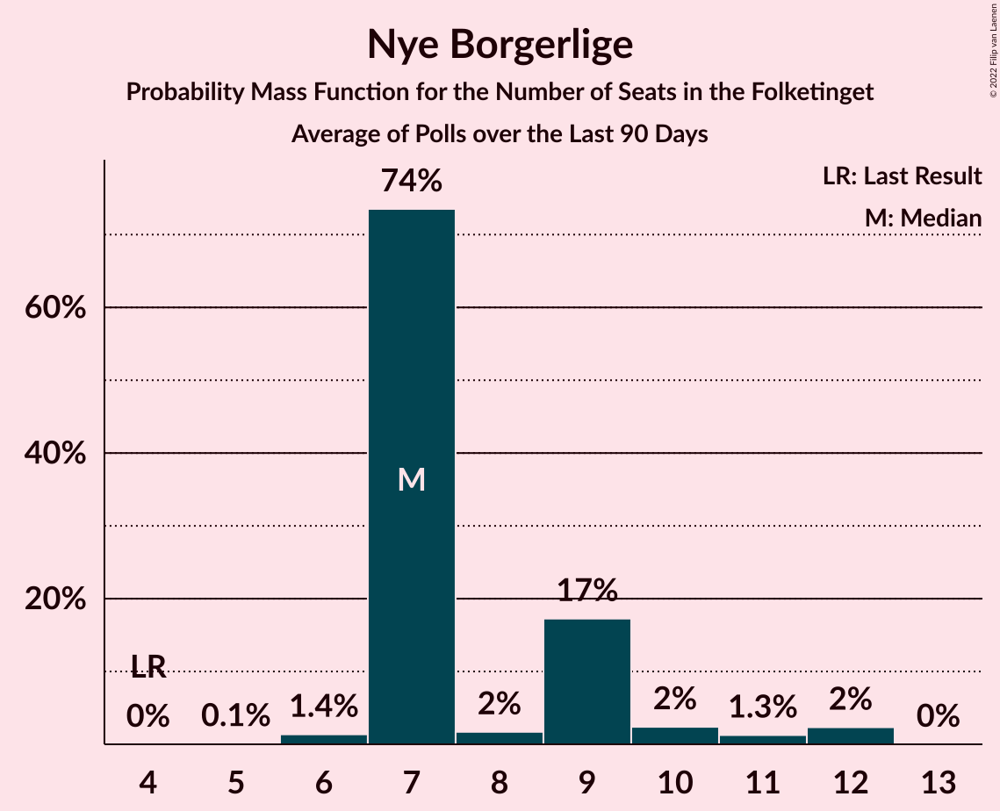
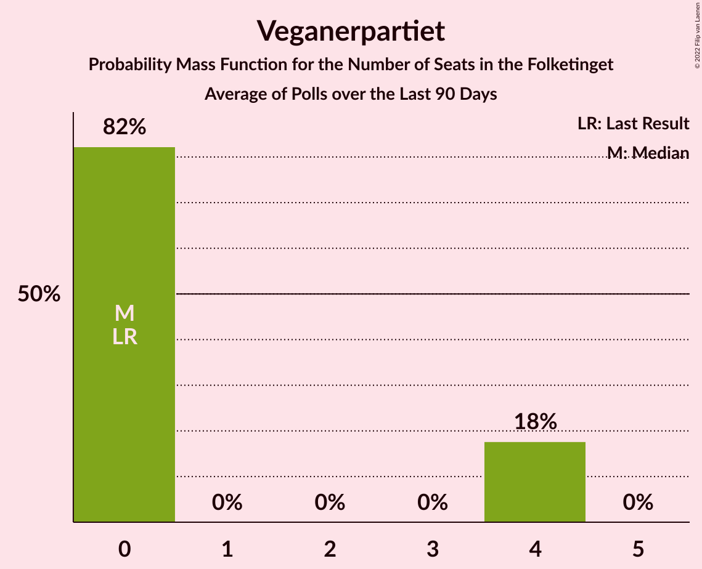

# Poll Average

<a href="#voting-intentions">Voting Intentions</a> | <a href="#seats">Seats</a> | <a href="#coalitions">Coalitions</a> | <a href="#technical-information">Technical Information</a>

## Summary

The table below lists the polls on which the average is based. They are the most recent polls (less than 90 days old) registered and analyzed so far.

| Period     | Polling firm/Commissioner(s) | A | V | O | B | F | Ø | C | Å | D | I | P | K | E | G |
|:----------:|:----------------------------:|:--:|:--:|:--:|:--:|:--:|:--:|:--:|:--:|:--:|:--:|:--:|:--:|:--:|:--:|
| 5 June 2019 | General Election | 25.9%   48 | 23.4%   43 | 8.7%   16 | 8.6%   16 | 7.7%   14 | 6.9%   13 | 6.6%   12 | 3.0%   5 | 2.4%   4 | 2.3%   4 | 1.8%   0 | 1.7%   0 | 0.8%   0 | 0.0%   0 |
| N/A | Poll Average | 24–35%   46–63 | 10–17%   19–29 | 5–8%   9–15 | 3–7%   6–13 | 7–11%   12–21 | 6–12%   11–19 | 12–18%   22–31 | 0–2%   0 | 5–10%   9–18 | 2–4%   0–8 | 0–1%   0 | 1–3%   0–4 | 0%   0 | 0–1%   0 |
| [23–29 August 2021](2021-08-29-Voxmeter.html) | Voxmeter | 26–31%   46–55 | 13–17%   24–30 | 4–7%   8–11 | 4–7%   9–12 | 7–11%   14–18 | 8–11%   15–20 | 12–16%   22–27 | 0–1%   0 | 4–7%   9–13 | 2–4%   4–8 | N/A   N/A | 1–3%   0–5 | N/A   N/A | N/A   N/A |
| [23–26 August 2021](2021-08-26-Megafon.html) | Megafon   Politiken and TV 2 | 23–28%   41–47 | 11–15%   21–25 | 5–8%   9–11 | 3–6%   7–9 | 8–12%   17–20 | 9–12%   17–20 | 14–19%   27–32 | 0–2%   0 | 7–11%   14–18 | 2–4%   0–5 | N/A   N/A | 1–3%   0–4 | N/A   N/A | 0–1%   0 |
| [19–26 August 2021](2021-08-26-Epinion.html) | Epinion   DR | 26–31%   49–53 | 14–17%   26–31 | 4–7%   9–12 | 5–8%   11–14 | 7–9%   11–18 | 6–8%   12–15 | 12–15%   24–28 | 1–2%   0 | 8–11%   14–19 | 2–3%   0–5 | N/A   N/A | 1–2%   0 | N/A   N/A | 0–1%   0 |
| [30 July–5 August 2021](2021-08-05-Gallup.html) | Gallup | 26–30%   48–55 | 12–15%   23–28 | 6–8%   11–15 | 5–7%   9–13 | 8–11%   15–21 | 7–9%   12–17 | 13–16%   24–28 | 0–1%   0 | 6–8%   11–15 | 1–3%   0–5 | 0–1%   0 | 1–3%   0–5 | 0–1%   0 | 0%   0 |
| [4–6 June 2021](2021-06-06-YouGov.html) | YouGov   B.T. | 31–36%   56–66 | 10–13%   18–25 | 6–9%   10–15 | 3–5%   5–10 | 7–10%   11–19 | 7–10%   11–16 | 12–16%   21–28 | 0–1%   0 | 7–10%   13–19 | 2–4%   0–7 | N/A   N/A | 1–2%   0 | N/A   N/A | 0–1%   0 |
| 5 June 2019 | General Election | 25.9%   48 | 23.4%   43 | 8.7%   16 | 8.6%   16 | 7.7%   14 | 6.9%   13 | 6.6%   12 | 3.0%   5 | 2.4%   4 | 2.3%   4 | 1.8%   0 | 1.7%   0 | 0.8%   0 | 0.0%   0 |

Only polls for which at least the sample size has been published are included in the table above.

**Legend:**
+ **Top half of each row:** Voting intentions (95% confidence interval)
+ **Bottom half of each row:** Seat projections for the Folketinget (95% confidence interval)
+ **A:** Socialdemokraterne
+ **V:** Venstre
+ **O:** Dansk Folkeparti
+ **B:** Radikale Venstre
+ **F:** Socialistisk Folkeparti
+ **Ø:** Enhedslisten–De Rød-Grønne
+ **C:** Det Konservative Folkeparti
+ **Å:** Alternativet
+ **D:** Nye Borgerlige
+ **I:** Liberal Alliance
+ **P:** Stram Kurs
+ **K:** Kristendemokraterne
+ **E:** Borgerlisten
+ **G:** Veganerpartiet
+ **N/A (single party):** Party not included the published results
+ **N/A (entire row):** Calculation for this opinion poll not started yet

## Voting Intentions

### Confidence Intervals

| Party | Last Result | Median | 80% Confidence Interval | 90% Confidence Interval | 95% Confidence Interval | 99% Confidence Interval |
|:-----:|:-----------:|:------:|:-----------------------:|:-----------------------:|:-----------------------:|:-----------------------:|
| <a href="#socialdemokraterne">Socialdemokraterne</a> | 25.9% | 28.3% | 25.2–33.3% |24.3–34.2% | 23.7–34.8% | 22.6–35.9% |
| <a href="#venstre">Venstre</a> | 23.4% | 13.7% | 11.4–15.9% |10.9–16.4% | 10.5–16.8% | 9.9–17.6% |
| <a href="#dansk-folkeparti">Dansk Folkeparti</a> | 8.7% | 6.4% | 5.1–7.7% |4.9–8.0% | 4.6–8.3% | 4.2–8.9% |
| <a href="#radikale-venstre">Radikale Venstre</a> | 8.6% | 5.5% | 3.8–6.8% |3.5–7.1% | 3.3–7.3% | 2.9–7.8% |
| <a href="#socialistisk-folkeparti">Socialistisk Folkeparti</a> | 7.7% | 8.8% | 7.4–10.3% |7.1–10.7% | 6.9–11.0% | 6.5–11.6% |
| <a href="#enhedslisten–de-rød-grønne">Enhedslisten–De Rød-Grønne</a> | 6.9% | 8.3% | 6.9–10.6% |6.6–11.1% | 6.3–11.5% | 5.9–12.3% |
| <a href="#det-konservative-folkeparti">Det Konservative Folkeparti</a> | 6.6% | 14.3% | 12.9–16.6% |12.6–17.3% | 12.2–17.9% | 11.7–18.9% |
| <a href="#alternativet">Alternativet</a> | 3.0% | 0.8% | 0.4–1.4% |0.4–1.6% | 0.3–1.7% | 0.2–2.0% |
| <a href="#nye-borgerlige">Nye Borgerlige</a> | 2.4% | 8.3% | 5.8–9.9% |5.3–10.2% | 5.0–10.5% | 4.5–11.1% |
| <a href="#liberal-alliance">Liberal Alliance</a> | 2.3% | 2.5% | 1.9–3.3% |1.8–3.5% | 1.7–3.7% | 1.5–4.2% |
| <a href="#stram-kurs">Stram Kurs</a> | 1.8% | 0.6% | 0.4–0.9% |0.4–1.0% | 0.3–1.1% | 0.3–1.2% |
| <a href="#kristendemokraterne">Kristendemokraterne</a> | 1.7% | 1.7% | 1.1–2.4% |0.9–2.6% | 0.8–2.7% | 0.7–3.1% |
| <a href="#borgerlisten">Borgerlisten</a> | 0.8% | 0.2% | 0.1–0.4% |0.1–0.4% | 0.1–0.5% | 0.0–0.6% |
| <a href="#veganerpartiet">Veganerpartiet</a> | 0.0% | 0.4% | 0.1–0.8% |0.1–0.9% | 0.1–1.0% | 0.0–1.3% |

### Socialdemokraterne

*For a full overview of the results for this party, see the [Socialdemokraterne](party-socialdemokraterne.html) page.*

| Voting Intentions | Probability | Accumulated | Special Marks |
|:-----------------:|:-----------:|:-----------:|:-------------:|
| 20.5–21.5% | 0% | 100% |  |
| 21.5–22.5% | 0.4% | 99.9% |  |
| 22.5–23.5% | 2% | 99.6% |  |
| 23.5–24.5% | 4% | 98% |  |
| 24.5–25.5% | 6% | 94% |  |
| 25.5–26.5% | 9% | 88% | Last Result |
| 26.5–27.5% | 14% | 79% |  |
| 27.5–28.5% | 19% | 65% | Median |
| 28.5–29.5% | 16% | 46% |  |
| 29.5–30.5% | 8% | 30% |  |
| 30.5–31.5% | 4% | 22% |  |
| 31.5–32.5% | 4% | 19% |  |
| 32.5–33.5% | 6% | 14% |  |
| 33.5–34.5% | 5% | 8% |  |
| 34.5–35.5% | 2% | 3% |  |
| 35.5–36.5% | 0.8% | 0.9% |  |
| 36.5–37.5% | 0.1% | 0.1% |  |
| 37.5–38.5% | 0% | 0% |  |

### Venstre

*For a full overview of the results for this party, see the [Venstre](party-venstre.html) page.*

| Voting Intentions | Probability | Accumulated | Special Marks |
|:-----------------:|:-----------:|:-----------:|:-------------:|
| 7.5–8.5% | 0% | 100% |  |
| 8.5–9.5% | 0.2% | 100% |  |
| 9.5–10.5% | 2% | 99.8% |  |
| 10.5–11.5% | 10% | 97% |  |
| 11.5–12.5% | 16% | 88% |  |
| 12.5–13.5% | 19% | 72% |  |
| 13.5–14.5% | 20% | 52% | Median |
| 14.5–15.5% | 18% | 33% |  |
| 15.5–16.5% | 11% | 15% |  |
| 16.5–17.5% | 3% | 4% |  |
| 17.5–18.5% | 0.5% | 0.5% |  |
| 18.5–19.5% | 0% | 0% |  |
| 19.5–20.5% | 0% | 0% |  |
| 20.5–21.5% | 0% | 0% |  |
| 21.5–22.5% | 0% | 0% |  |
| 22.5–23.5% | 0% | 0% | Last Result |

### Dansk Folkeparti

*For a full overview of the results for this party, see the [Dansk Folkeparti](party-danskfolkeparti.html) page.*

| Voting Intentions | Probability | Accumulated | Special Marks |
|:-----------------:|:-----------:|:-----------:|:-------------:|
| 2.5–3.5% | 0% | 100% |  |
| 3.5–4.5% | 2% | 100% |  |
| 4.5–5.5% | 20% | 98% |  |
| 5.5–6.5% | 34% | 78% | Median |
| 6.5–7.5% | 31% | 44% |  |
| 7.5–8.5% | 12% | 13% |  |
| 8.5–9.5% | 1.4% | 1.4% | Last Result |
| 9.5–10.5% | 0.1% | 0.1% |  |
| 10.5–11.5% | 0% | 0% |  |

### Radikale Venstre

*For a full overview of the results for this party, see the [Radikale Venstre](party-radikalevenstre.html) page.*

| Voting Intentions | Probability | Accumulated | Special Marks |
|:-----------------:|:-----------:|:-----------:|:-------------:|
| 1.5–2.5% | 0% | 100% |  |
| 2.5–3.5% | 5% | 100% |  |
| 3.5–4.5% | 22% | 94% |  |
| 4.5–5.5% | 24% | 72% |  |
| 5.5–6.5% | 33% | 49% | Median |
| 6.5–7.5% | 14% | 16% |  |
| 7.5–8.5% | 1.2% | 1.2% |  |
| 8.5–9.5% | 0% | 0% | Last Result |

### Socialistisk Folkeparti

*For a full overview of the results for this party, see the [Socialistisk Folkeparti](party-socialistiskfolkeparti.html) page.*

| Voting Intentions | Probability | Accumulated | Special Marks |
|:-----------------:|:-----------:|:-----------:|:-------------:|
| 4.5–5.5% | 0% | 100% |  |
| 5.5–6.5% | 0.7% | 100% |  |
| 6.5–7.5% | 11% | 99.3% |  |
| 7.5–8.5% | 29% | 88% | Last Result |
| 8.5–9.5% | 31% | 58% | Median |
| 9.5–10.5% | 21% | 27% |  |
| 10.5–11.5% | 6% | 6% |  |
| 11.5–12.5% | 0.6% | 0.6% |  |
| 12.5–13.5% | 0% | 0% |  |

### Enhedslisten–De Rød-Grønne

*For a full overview of the results for this party, see the [Enhedslisten–De Rød-Grønne](party-enhedslisten–derød-grønne.html) page.*

| Voting Intentions | Probability | Accumulated | Special Marks |
|:-----------------:|:-----------:|:-----------:|:-------------:|
| 4.5–5.5% | 0.1% | 100% |  |
| 5.5–6.5% | 4% | 99.9% |  |
| 6.5–7.5% | 23% | 95% | Last Result |
| 7.5–8.5% | 28% | 72% | Median |
| 8.5–9.5% | 19% | 44% |  |
| 9.5–10.5% | 15% | 25% |  |
| 10.5–11.5% | 8% | 10% |  |
| 11.5–12.5% | 2% | 2% |  |
| 12.5–13.5% | 0.3% | 0.3% |  |
| 13.5–14.5% | 0% | 0% |  |

### Det Konservative Folkeparti

*For a full overview of the results for this party, see the [Det Konservative Folkeparti](party-detkonservativefolkeparti.html) page.*

| Voting Intentions | Probability | Accumulated | Special Marks |
|:-----------------:|:-----------:|:-----------:|:-------------:|
| 6.5–7.5% | 0% | 100% | Last Result |
| 7.5–8.5% | 0% | 100% |  |
| 8.5–9.5% | 0% | 100% |  |
| 9.5–10.5% | 0% | 100% |  |
| 10.5–11.5% | 0.4% | 100% |  |
| 11.5–12.5% | 5% | 99.6% |  |
| 12.5–13.5% | 20% | 95% |  |
| 13.5–14.5% | 32% | 75% | Median |
| 14.5–15.5% | 22% | 43% |  |
| 15.5–16.5% | 11% | 21% |  |
| 16.5–17.5% | 6% | 10% |  |
| 17.5–18.5% | 3% | 4% |  |
| 18.5–19.5% | 0.8% | 0.9% |  |
| 19.5–20.5% | 0.1% | 0.1% |  |
| 20.5–21.5% | 0% | 0% |  |

### Alternativet

*For a full overview of the results for this party, see the [Alternativet](party-alternativet.html) page.*

| Voting Intentions | Probability | Accumulated | Special Marks |
|:-----------------:|:-----------:|:-----------:|:-------------:|
| 0.0–0.5% | 21% | 100% |  |
| 0.5–1.5% | 74% | 79% | Median |
| 1.5–2.5% | 5% | 5% |  |
| 2.5–3.5% | 0% | 0% | Last Result |

### Nye Borgerlige

*For a full overview of the results for this party, see the [Nye Borgerlige](party-nyeborgerlige.html) page.*

| Voting Intentions | Probability | Accumulated | Special Marks |
|:-----------------:|:-----------:|:-----------:|:-------------:|
| 1.5–2.5% | 0% | 100% | Last Result |
| 2.5–3.5% | 0% | 100% |  |
| 3.5–4.5% | 0.6% | 100% |  |
| 4.5–5.5% | 7% | 99.4% |  |
| 5.5–6.5% | 14% | 93% |  |
| 6.5–7.5% | 17% | 79% |  |
| 7.5–8.5% | 18% | 62% | Median |
| 8.5–9.5% | 28% | 44% |  |
| 9.5–10.5% | 14% | 16% |  |
| 10.5–11.5% | 2% | 2% |  |
| 11.5–12.5% | 0.1% | 0.1% |  |
| 12.5–13.5% | 0% | 0% |  |

### Liberal Alliance

*For a full overview of the results for this party, see the [Liberal Alliance](party-liberalalliance.html) page.*

| Voting Intentions | Probability | Accumulated | Special Marks |
|:-----------------:|:-----------:|:-----------:|:-------------:|
| 0.0–0.5% | 0% | 100% |  |
| 0.5–1.5% | 1.1% | 100% |  |
| 1.5–2.5% | 51% | 98.9% | Last Result |
| 2.5–3.5% | 43% | 48% | Median |
| 3.5–4.5% | 5% | 5% |  |
| 4.5–5.5% | 0.1% | 0.1% |  |
| 5.5–6.5% | 0% | 0% |  |

### Stram Kurs

*For a full overview of the results for this party, see the [Stram Kurs](party-stramkurs.html) page.*

| Voting Intentions | Probability | Accumulated | Special Marks |
|:-----------------:|:-----------:|:-----------:|:-------------:|
| 0.0–0.5% | 36% | 100% |  |
| 0.5–1.5% | 64% | 64% | Median |
| 1.5–2.5% | 0% | 0% | Last Result |

### Kristendemokraterne

*For a full overview of the results for this party, see the [Kristendemokraterne](party-kristendemokraterne.html) page.*

| Voting Intentions | Probability | Accumulated | Special Marks |
|:-----------------:|:-----------:|:-----------:|:-------------:|
| 0.0–0.5% | 0.1% | 100% |  |
| 0.5–1.5% | 43% | 99.9% |  |
| 1.5–2.5% | 52% | 57% | Last Result, Median |
| 2.5–3.5% | 5% | 5% |  |
| 3.5–4.5% | 0% | 0% |  |

### Borgerlisten

*For a full overview of the results for this party, see the [Borgerlisten](party-borgerlisten.html) page.*

| Voting Intentions | Probability | Accumulated | Special Marks |
|:-----------------:|:-----------:|:-----------:|:-------------:|
| 0.0–0.5% | 98.6% | 100% | Median |
| 0.5–1.5% | 1.4% | 1.4% | Last Result |
| 1.5–2.5% | 0% | 0% |  |

### Veganerpartiet

*For a full overview of the results for this party, see the [Veganerpartiet](party-veganerpartiet.html) page.*

| Voting Intentions | Probability | Accumulated | Special Marks |
|:-----------------:|:-----------:|:-----------:|:-------------:|
| 0.0–0.5% | 74% | 100% | Last Result, Median |
| 0.5–1.5% | 26% | 26% |  |
| 1.5–2.5% | 0.1% | 0.1% |  |
| 2.5–3.5% | 0% | 0% |  |

## Seats

### Confidence Intervals

| Party | Last Result | Median | 80% Confidence Interval | 90% Confidence Interval | 95% Confidence Interval | 99% Confidence Interval |
|:-----:|:-----------:|:------:|:-----------------------:|:-----------------------:|:-----------------------:|:-----------------------:|
| <a href="#socialdemokraterne">Socialdemokraterne</a> | 48 | 51 | 47–60 |47–62 | 46–63 | 41–66 |
| <a href="#venstre">Venstre</a> | 43 | 24 | 21–28 |20–29 | 19–29 | 18–31 |
| <a href="#dansk-folkeparti">Dansk Folkeparti</a> | 16 | 11 | 9–14 |9–15 | 9–15 | 8–15 |
| <a href="#radikale-venstre">Radikale Venstre</a> | 16 | 10 | 6–12 |6–13 | 6–13 | 5–14 |
| <a href="#socialistisk-folkeparti">Socialistisk Folkeparti</a> | 14 | 16 | 13–19 |13–20 | 12–21 | 11–21 |
| <a href="#enhedslisten–de-rød-grønne">Enhedslisten–De Rød-Grønne</a> | 13 | 15 | 13–19 |12–19 | 11–19 | 11–20 |
| <a href="#det-konservative-folkeparti">Det Konservative Folkeparti</a> | 12 | 26 | 24–31 |23–31 | 22–31 | 21–32 |
| <a href="#alternativet">Alternativet</a> | 5 | 0 | 0 |0 | 0 | 0 |
| <a href="#nye-borgerlige">Nye Borgerlige</a> | 4 | 16 | 11–17 |10–18 | 9–18 | 9–19 |
| <a href="#liberal-alliance">Liberal Alliance</a> | 4 | 5 | 0–5 |0–7 | 0–8 | 0–8 |
| <a href="#stram-kurs">Stram Kurs</a> | 0 | 0 | 0 |0 | 0 | 0 |
| <a href="#kristendemokraterne">Kristendemokraterne</a> | 0 | 0 | 0–4 |0–4 | 0–4 | 0–5 |
| <a href="#borgerlisten">Borgerlisten</a> | 0 | 0 | 0 |0 | 0 | 0 |
| <a href="#veganerpartiet">Veganerpartiet</a> | 0 | 0 | 0 |0 | 0 | 0 |

### Socialdemokraterne

*For a full overview of the results for this party, see the [Socialdemokraterne](party-socialdemokraterne.html) page.*

| Number of Seats | Probability | Accumulated | Special Marks |
|:---------------:|:-----------:|:-----------:|:-------------:|
| 39 | 0% | 100% |  |
| 40 | 0.2% | 99.9% |  |
| 41 | 0.5% | 99.8% |  |
| 42 | 0.2% | 99.3% |  |
| 43 | 0.2% | 99.1% |  |
| 44 | 0.3% | 99.0% |  |
| 45 | 0.1% | 98.6% |  |
| 46 | 3% | 98.5% |  |
| 47 | 28% | 96% |  |
| 48 | 3% | 67% | Last Result |
| 49 | 10% | 65% |  |
| 50 | 2% | 55% |  |
| 51 | 15% | 52% | Median |
| 52 | 6% | 37% |  |
| 53 | 7% | 31% |  |
| 54 | 0.4% | 24% |  |
| 55 | 3% | 24% |  |
| 56 | 0.6% | 20% |  |
| 57 | 5% | 20% |  |
| 58 | 2% | 15% |  |
| 59 | 2% | 13% |  |
| 60 | 4% | 11% |  |
| 61 | 0.5% | 7% |  |
| 62 | 3% | 6% |  |
| 63 | 1.4% | 4% |  |
| 64 | 0.1% | 2% |  |
| 65 | 0.1% | 2% |  |
| 66 | 2% | 2% |  |
| 67 | 0.1% | 0.1% |  |
| 68 | 0% | 0% |  |

### Venstre

*For a full overview of the results for this party, see the [Venstre](party-venstre.html) page.*

| Number of Seats | Probability | Accumulated | Special Marks |
|:---------------:|:-----------:|:-----------:|:-------------:|
| 16 | 0.2% | 100% |  |
| 17 | 0.1% | 99.8% |  |
| 18 | 0.7% | 99.7% |  |
| 19 | 3% | 99.0% |  |
| 20 | 5% | 96% |  |
| 21 | 4% | 91% |  |
| 22 | 4% | 86% |  |
| 23 | 29% | 82% |  |
| 24 | 5% | 53% | Median |
| 25 | 8% | 48% |  |
| 26 | 5% | 40% |  |
| 27 | 14% | 35% |  |
| 28 | 14% | 21% |  |
| 29 | 4% | 7% |  |
| 30 | 0.9% | 2% |  |
| 31 | 1.5% | 2% |  |
| 32 | 0% | 0.1% |  |
| 33 | 0% | 0% |  |
| 34 | 0% | 0% |  |
| 35 | 0% | 0% |  |
| 36 | 0% | 0% |  |
| 37 | 0% | 0% |  |
| 38 | 0% | 0% |  |
| 39 | 0% | 0% |  |
| 40 | 0% | 0% |  |
| 41 | 0% | 0% |  |
| 42 | 0% | 0% |  |
| 43 | 0% | 0% | Last Result |

### Dansk Folkeparti

*For a full overview of the results for this party, see the [Dansk Folkeparti](party-danskfolkeparti.html) page.*

| Number of Seats | Probability | Accumulated | Special Marks |
|:---------------:|:-----------:|:-----------:|:-------------:|
| 7 | 0.3% | 100% |  |
| 8 | 0.7% | 99.7% |  |
| 9 | 24% | 99.0% |  |
| 10 | 22% | 75% |  |
| 11 | 15% | 53% | Median |
| 12 | 16% | 38% |  |
| 13 | 8% | 22% |  |
| 14 | 7% | 14% |  |
| 15 | 8% | 8% |  |
| 16 | 0.2% | 0.3% | Last Result |
| 17 | 0% | 0.1% |  |
| 18 | 0% | 0% |  |

### Radikale Venstre

*For a full overview of the results for this party, see the [Radikale Venstre](party-radikalevenstre.html) page.*

| Number of Seats | Probability | Accumulated | Special Marks |
|:---------------:|:-----------:|:-----------:|:-------------:|
| 4 | 0.1% | 100% |  |
| 5 | 0.6% | 99.9% |  |
| 6 | 10% | 99.3% |  |
| 7 | 5% | 89% |  |
| 8 | 17% | 84% |  |
| 9 | 7% | 66% |  |
| 10 | 13% | 59% | Median |
| 11 | 11% | 46% |  |
| 12 | 27% | 35% |  |
| 13 | 6% | 8% |  |
| 14 | 2% | 2% |  |
| 15 | 0% | 0% |  |
| 16 | 0% | 0% | Last Result |

### Socialistisk Folkeparti

*For a full overview of the results for this party, see the [Socialistisk Folkeparti](party-socialistiskfolkeparti.html) page.*

| Number of Seats | Probability | Accumulated | Special Marks |
|:---------------:|:-----------:|:-----------:|:-------------:|
| 11 | 2% | 100% |  |
| 12 | 3% | 98% |  |
| 13 | 6% | 95% |  |
| 14 | 19% | 89% | Last Result |
| 15 | 4% | 70% |  |
| 16 | 23% | 66% | Median |
| 17 | 5% | 42% |  |
| 18 | 17% | 38% |  |
| 19 | 11% | 21% |  |
| 20 | 7% | 10% |  |
| 21 | 3% | 3% |  |
| 22 | 0.4% | 0.4% |  |
| 23 | 0% | 0% |  |

### Enhedslisten–De Rød-Grønne

*For a full overview of the results for this party, see the [Enhedslisten–De Rød-Grønne](party-enhedslisten–derød-grønne.html) page.*

| Number of Seats | Probability | Accumulated | Special Marks |
|:---------------:|:-----------:|:-----------:|:-------------:|
| 10 | 0.1% | 100% |  |
| 11 | 4% | 99.9% |  |
| 12 | 4% | 96% |  |
| 13 | 26% | 92% | Last Result |
| 14 | 11% | 67% |  |
| 15 | 11% | 56% | Median |
| 16 | 6% | 44% |  |
| 17 | 16% | 38% |  |
| 18 | 0.9% | 22% |  |
| 19 | 19% | 21% |  |
| 20 | 2% | 2% |  |
| 21 | 0.1% | 0.4% |  |
| 22 | 0.2% | 0.3% |  |
| 23 | 0.1% | 0.1% |  |
| 24 | 0% | 0% |  |

### Det Konservative Folkeparti

*For a full overview of the results for this party, see the [Det Konservative Folkeparti](party-detkonservativefolkeparti.html) page.*

| Number of Seats | Probability | Accumulated | Special Marks |
|:---------------:|:-----------:|:-----------:|:-------------:|
| 12 | 0% | 100% | Last Result |
| 13 | 0% | 100% |  |
| 14 | 0% | 100% |  |
| 15 | 0% | 100% |  |
| 16 | 0% | 100% |  |
| 17 | 0% | 100% |  |
| 18 | 0% | 100% |  |
| 19 | 0% | 100% |  |
| 20 | 0.5% | 100% |  |
| 21 | 0.2% | 99.5% |  |
| 22 | 2% | 99.3% |  |
| 23 | 3% | 97% |  |
| 24 | 4% | 94% |  |
| 25 | 37% | 90% |  |
| 26 | 5% | 52% | Median |
| 27 | 16% | 48% |  |
| 28 | 12% | 32% |  |
| 29 | 0.7% | 20% |  |
| 30 | 0.4% | 19% |  |
| 31 | 18% | 19% |  |
| 32 | 0.8% | 1.1% |  |
| 33 | 0.2% | 0.2% |  |
| 34 | 0% | 0% |  |

### Alternativet

*For a full overview of the results for this party, see the [Alternativet](party-alternativet.html) page.*

| Number of Seats | Probability | Accumulated | Special Marks |
|:---------------:|:-----------:|:-----------:|:-------------:|
| 0 | 99.6% | 100% | Median |
| 1 | 0% | 0.4% |  |
| 2 | 0% | 0.4% |  |
| 3 | 0% | 0.4% |  |
| 4 | 0.4% | 0.4% |  |
| 5 | 0% | 0% | Last Result |

### Nye Borgerlige

*For a full overview of the results for this party, see the [Nye Borgerlige](party-nyeborgerlige.html) page.*

| Number of Seats | Probability | Accumulated | Special Marks |
|:---------------:|:-----------:|:-----------:|:-------------:|
| 4 | 0% | 100% | Last Result |
| 5 | 0% | 100% |  |
| 6 | 0.1% | 100% |  |
| 7 | 0.1% | 99.9% |  |
| 8 | 0.3% | 99.9% |  |
| 9 | 3% | 99.6% |  |
| 10 | 3% | 96% |  |
| 11 | 4% | 93% |  |
| 12 | 15% | 89% |  |
| 13 | 12% | 73% |  |
| 14 | 8% | 62% |  |
| 15 | 2% | 54% |  |
| 16 | 22% | 52% | Median |
| 17 | 20% | 30% |  |
| 18 | 7% | 9% |  |
| 19 | 2% | 2% |  |
| 20 | 0.2% | 0.4% |  |
| 21 | 0.2% | 0.2% |  |
| 22 | 0% | 0% |  |

### Liberal Alliance

*For a full overview of the results for this party, see the [Liberal Alliance](party-liberalalliance.html) page.*

| Number of Seats | Probability | Accumulated | Special Marks |
|:---------------:|:-----------:|:-----------:|:-------------:|
| 0 | 27% | 100% |  |
| 1 | 0% | 73% |  |
| 2 | 0% | 73% |  |
| 3 | 0% | 73% |  |
| 4 | 22% | 73% | Last Result |
| 5 | 42% | 51% | Median |
| 6 | 3% | 9% |  |
| 7 | 3% | 5% |  |
| 8 | 3% | 3% |  |
| 9 | 0% | 0% |  |

### Stram Kurs

*For a full overview of the results for this party, see the [Stram Kurs](party-stramkurs.html) page.*

| Number of Seats | Probability | Accumulated | Special Marks |
|:---------------:|:-----------:|:-----------:|:-------------:|
| 0 | 100% | 100% | Last Result, Median |

### Kristendemokraterne

*For a full overview of the results for this party, see the [Kristendemokraterne](party-kristendemokraterne.html) page.*

| Number of Seats | Probability | Accumulated | Special Marks |
|:---------------:|:-----------:|:-----------:|:-------------:|
| 0 | 88% | 100% | Last Result, Median |
| 1 | 0% | 12% |  |
| 2 | 0% | 12% |  |
| 3 | 0% | 12% |  |
| 4 | 10% | 12% |  |
| 5 | 1.2% | 1.4% |  |
| 6 | 0.2% | 0.2% |  |
| 7 | 0% | 0% |  |

### Borgerlisten

*For a full overview of the results for this party, see the [Borgerlisten](party-borgerlisten.html) page.*

| Number of Seats | Probability | Accumulated | Special Marks |
|:---------------:|:-----------:|:-----------:|:-------------:|
| 0 | 100% | 100% | Last Result, Median |

### Veganerpartiet

*For a full overview of the results for this party, see the [Veganerpartiet](party-veganerpartiet.html) page.*

| Number of Seats | Probability | Accumulated | Special Marks |
|:---------------:|:-----------:|:-----------:|:-------------:|
| 0 | 100% | 100% | Last Result, Median |

## Coalitions

### Confidence Intervals

| Coalition | Last Result | Median | Majority? | 80% Confidence Interval | 90% Confidence Interval | 95% Confidence Interval | 99% Confidence Interval |
|:---------:|:-----------:|:------:|:---------:|:-----------------------:|:-----------------------:|:-----------------------:|:-----------------------:|
| Socialdemokraterne – Radikale Venstre – Socialistisk Folkeparti – Enhedslisten–De Rød-Grønne – Alternativet | 96 | 92 | 96% | 90–100 | 90–101 | 89–103 | 87–103 |
| Socialdemokraterne – Radikale Venstre – Socialistisk Folkeparti – Enhedslisten–De Rød-Grønne | 91 | 92 | 96% | 90–100 | 90–101 | 89–103 | 86–103 |
| Socialdemokraterne – Socialistisk Folkeparti – Enhedslisten–De Rød-Grønne – Alternativet | 80 | 83 | 7% | 78–89 | 78–90 | 77–94 | 75–95 |
| Socialdemokraterne – Socialistisk Folkeparti – Enhedslisten–De Rød-Grønne | 75 | 83 | 7% | 78–89 | 78–90 | 77–94 | 75–95 |
| Socialdemokraterne – Radikale Venstre – Socialistisk Folkeparti | 78 | 77 | 0% | 73–83 | 73–86 | 73–89 | 69–89 |
| Venstre – Dansk Folkeparti – Det Konservative Folkeparti – Nye Borgerlige – Liberal Alliance – Stram Kurs – Kristendemokraterne – Borgerlisten | 79 | 83 | 0.2% | 77–85 | 76–85 | 73–86 | 72–88 |
| Venstre – Dansk Folkeparti – Det Konservative Folkeparti – Nye Borgerlige – Liberal Alliance – Kristendemokraterne – Borgerlisten | 79 | 83 | 0.2% | 77–85 | 76–85 | 73–86 | 72–88 |
| Venstre – Dansk Folkeparti – Det Konservative Folkeparti – Nye Borgerlige – Liberal Alliance – Borgerlisten | 79 | 82 | 0% | 77–85 | 75–85 | 73–86 | 72–88 |
| Venstre – Dansk Folkeparti – Det Konservative Folkeparti – Nye Borgerlige – Liberal Alliance – Kristendemokraterne | 79 | 81 | 0.1% | 75–85 | 74–85 | 72–86 | 72–88 |
| Venstre – Dansk Folkeparti – Det Konservative Folkeparti – Nye Borgerlige – Liberal Alliance | 79 | 81 | 0% | 75–85 | 73–85 | 72–85 | 72–88 |
| Venstre – Dansk Folkeparti – Det Konservative Folkeparti – Liberal Alliance – Kristendemokraterne | 75 | 67 | 0% | 63–69 | 60–71 | 59–71 | 56–75 |
| Venstre – Dansk Folkeparti – Det Konservative Folkeparti – Liberal Alliance | 75 | 67 | 0% | 63–68 | 60–70 | 59–71 | 56–72 |
| Socialdemokraterne – Radikale Venstre | 64 | 63 | 0% | 55–68 | 55–69 | 55–70 | 50–74 |
| Venstre – Det Konservative Folkeparti – Liberal Alliance | 59 | 56 | 0% | 50–58 | 48–59 | 48–61 | 44–61 |
| Venstre – Det Konservative Folkeparti | 55 | 52 | 0% | 47–54 | 45–55 | 44–56 | 41–56 |
| Venstre | 43 | 24 | 0% | 21–28 | 20–29 | 19–29 | 18–31 |

### Socialdemokraterne – Radikale Venstre – Socialistisk Folkeparti – Enhedslisten–De Rød-Grønne – Alternativet

| Number of Seats | Probability | Accumulated | Special Marks |
|:---------------:|:-----------:|:-----------:|:-------------:|
| 82 | 0.1% | 100% |  |
| 83 | 0% | 99.9% |  |
| 84 | 0% | 99.9% |  |
| 85 | 0% | 99.9% |  |
| 86 | 0.1% | 99.8% |  |
| 87 | 0.6% | 99.7% |  |
| 88 | 0.8% | 99.1% |  |
| 89 | 2% | 98% |  |
| 90 | 28% | 96% | Majority |
| 91 | 4% | 68% |  |
| 92 | 21% | 65% | Median |
| 93 | 7% | 43% |  |
| 94 | 16% | 36% |  |
| 95 | 3% | 20% |  |
| 96 | 3% | 17% | Last Result |
| 97 | 1.1% | 14% |  |
| 98 | 0.7% | 13% |  |
| 99 | 0.8% | 12% |  |
| 100 | 6% | 12% |  |
| 101 | 0.6% | 5% |  |
| 102 | 1.1% | 5% |  |
| 103 | 3% | 4% |  |
| 104 | 0.1% | 0.2% |  |
| 105 | 0% | 0% |  |

### Socialdemokraterne – Radikale Venstre – Socialistisk Folkeparti – Enhedslisten–De Rød-Grønne

| Number of Seats | Probability | Accumulated | Special Marks |
|:---------------:|:-----------:|:-----------:|:-------------:|
| 82 | 0.1% | 100% |  |
| 83 | 0% | 99.9% |  |
| 84 | 0.1% | 99.9% |  |
| 85 | 0.2% | 99.8% |  |
| 86 | 0.2% | 99.6% |  |
| 87 | 0.7% | 99.5% |  |
| 88 | 0.8% | 98.8% |  |
| 89 | 2% | 98% |  |
| 90 | 28% | 96% | Majority |
| 91 | 4% | 68% | Last Result |
| 92 | 21% | 65% | Median |
| 93 | 7% | 43% |  |
| 94 | 16% | 36% |  |
| 95 | 3% | 20% |  |
| 96 | 3% | 17% |  |
| 97 | 1.1% | 14% |  |
| 98 | 0.7% | 13% |  |
| 99 | 0.8% | 12% |  |
| 100 | 6% | 12% |  |
| 101 | 0.6% | 5% |  |
| 102 | 1.1% | 5% |  |
| 103 | 3% | 4% |  |
| 104 | 0.1% | 0.2% |  |
| 105 | 0% | 0% |  |

### Socialdemokraterne – Socialistisk Folkeparti – Enhedslisten–De Rød-Grønne – Alternativet

| Number of Seats | Probability | Accumulated | Special Marks |
|:---------------:|:-----------:|:-----------:|:-------------:|
| 74 | 0% | 100% |  |
| 75 | 1.3% | 99.9% |  |
| 76 | 0.1% | 98.7% |  |
| 77 | 1.2% | 98.5% |  |
| 78 | 18% | 97% |  |
| 79 | 2% | 79% |  |
| 80 | 12% | 77% | Last Result |
| 81 | 1.0% | 65% |  |
| 82 | 8% | 64% | Median |
| 83 | 7% | 56% |  |
| 84 | 15% | 50% |  |
| 85 | 6% | 34% |  |
| 86 | 6% | 28% |  |
| 87 | 7% | 22% |  |
| 88 | 1.1% | 15% |  |
| 89 | 7% | 14% |  |
| 90 | 3% | 7% | Majority |
| 91 | 0.6% | 4% |  |
| 92 | 0.1% | 3% |  |
| 93 | 0.4% | 3% |  |
| 94 | 2% | 3% |  |
| 95 | 1.0% | 1.2% |  |
| 96 | 0.2% | 0.2% |  |
| 97 | 0% | 0% |  |

### Socialdemokraterne – Socialistisk Folkeparti – Enhedslisten–De Rød-Grønne

| Number of Seats | Probability | Accumulated | Special Marks |
|:---------------:|:-----------:|:-----------:|:-------------:|
| 73 | 0.1% | 100% |  |
| 74 | 0% | 99.9% |  |
| 75 | 1.4% | 99.9% | Last Result |
| 76 | 0.2% | 98% |  |
| 77 | 1.2% | 98% |  |
| 78 | 18% | 97% |  |
| 79 | 2% | 79% |  |
| 80 | 12% | 77% |  |
| 81 | 0.8% | 65% |  |
| 82 | 7% | 64% | Median |
| 83 | 7% | 56% |  |
| 84 | 15% | 50% |  |
| 85 | 6% | 34% |  |
| 86 | 6% | 28% |  |
| 87 | 7% | 22% |  |
| 88 | 1.1% | 15% |  |
| 89 | 7% | 14% |  |
| 90 | 3% | 7% | Majority |
| 91 | 0.6% | 4% |  |
| 92 | 0.1% | 3% |  |
| 93 | 0.4% | 3% |  |
| 94 | 2% | 3% |  |
| 95 | 1.0% | 1.2% |  |
| 96 | 0.2% | 0.2% |  |
| 97 | 0% | 0% |  |

### Socialdemokraterne – Radikale Venstre – Socialistisk Folkeparti

| Number of Seats | Probability | Accumulated | Special Marks |
|:---------------:|:-----------:|:-----------:|:-------------:|
| 66 | 0.3% | 100% |  |
| 67 | 0% | 99.7% |  |
| 68 | 0.1% | 99.7% |  |
| 69 | 0.6% | 99.6% |  |
| 70 | 0.2% | 99.0% |  |
| 71 | 0.4% | 98.9% |  |
| 72 | 0.4% | 98% |  |
| 73 | 24% | 98% |  |
| 74 | 4% | 74% |  |
| 75 | 7% | 70% |  |
| 76 | 2% | 64% |  |
| 77 | 18% | 62% | Median |
| 78 | 5% | 44% | Last Result |
| 79 | 9% | 38% |  |
| 80 | 0.9% | 29% |  |
| 81 | 10% | 28% |  |
| 82 | 2% | 18% |  |
| 83 | 9% | 16% |  |
| 84 | 0.4% | 7% |  |
| 85 | 1.2% | 6% |  |
| 86 | 0.5% | 5% |  |
| 87 | 0.2% | 5% |  |
| 88 | 2% | 5% |  |
| 89 | 3% | 3% |  |
| 90 | 0% | 0% | Majority |

### Venstre – Dansk Folkeparti – Det Konservative Folkeparti – Nye Borgerlige – Liberal Alliance – Stram Kurs – Kristendemokraterne – Borgerlisten

| Number of Seats | Probability | Accumulated | Special Marks |
|:---------------:|:-----------:|:-----------:|:-------------:|
| 71 | 0.2% | 100% |  |
| 72 | 1.2% | 99.8% |  |
| 73 | 1.4% | 98.6% |  |
| 74 | 0.9% | 97% |  |
| 75 | 0.9% | 96% |  |
| 76 | 4% | 95% |  |
| 77 | 4% | 92% |  |
| 78 | 1.1% | 87% |  |
| 79 | 3% | 86% | Last Result |
| 80 | 6% | 83% |  |
| 81 | 20% | 77% |  |
| 82 | 7% | 57% | Median |
| 83 | 25% | 50% |  |
| 84 | 4% | 25% |  |
| 85 | 18% | 21% |  |
| 86 | 2% | 3% |  |
| 87 | 0.1% | 0.9% |  |
| 88 | 0.6% | 0.8% |  |
| 89 | 0.1% | 0.2% |  |
| 90 | 0% | 0.2% | Majority |
| 91 | 0% | 0.1% |  |
| 92 | 0% | 0.1% |  |
| 93 | 0.1% | 0.1% |  |
| 94 | 0% | 0% |  |

### Venstre – Dansk Folkeparti – Det Konservative Folkeparti – Nye Borgerlige – Liberal Alliance – Kristendemokraterne – Borgerlisten

| Number of Seats | Probability | Accumulated | Special Marks |
|:---------------:|:-----------:|:-----------:|:-------------:|
| 71 | 0.2% | 100% |  |
| 72 | 1.2% | 99.8% |  |
| 73 | 1.4% | 98.6% |  |
| 74 | 0.9% | 97% |  |
| 75 | 0.9% | 96% |  |
| 76 | 4% | 95% |  |
| 77 | 4% | 92% |  |
| 78 | 1.1% | 87% |  |
| 79 | 3% | 86% | Last Result |
| 80 | 6% | 83% |  |
| 81 | 20% | 77% |  |
| 82 | 7% | 57% | Median |
| 83 | 25% | 50% |  |
| 84 | 4% | 25% |  |
| 85 | 18% | 21% |  |
| 86 | 2% | 3% |  |
| 87 | 0.1% | 0.9% |  |
| 88 | 0.6% | 0.8% |  |
| 89 | 0.1% | 0.2% |  |
| 90 | 0% | 0.2% | Majority |
| 91 | 0% | 0.1% |  |
| 92 | 0% | 0.1% |  |
| 93 | 0.1% | 0.1% |  |
| 94 | 0% | 0% |  |

### Venstre – Dansk Folkeparti – Det Konservative Folkeparti – Nye Borgerlige – Liberal Alliance – Borgerlisten

| Number of Seats | Probability | Accumulated | Special Marks |
|:---------------:|:-----------:|:-----------:|:-------------:|
| 70 | 0% | 100% |  |
| 71 | 0.2% | 99.9% |  |
| 72 | 1.2% | 99.7% |  |
| 73 | 2% | 98.5% |  |
| 74 | 1.0% | 97% |  |
| 75 | 1.0% | 96% |  |
| 76 | 4% | 95% |  |
| 77 | 4% | 91% |  |
| 78 | 1.1% | 86% |  |
| 79 | 3% | 85% | Last Result |
| 80 | 6% | 82% |  |
| 81 | 20% | 76% |  |
| 82 | 7% | 56% | Median |
| 83 | 25% | 50% |  |
| 84 | 4% | 25% |  |
| 85 | 18% | 21% |  |
| 86 | 2% | 3% |  |
| 87 | 0.1% | 0.7% |  |
| 88 | 0.5% | 0.7% |  |
| 89 | 0.1% | 0.2% |  |
| 90 | 0% | 0% | Majority |

### Venstre – Dansk Folkeparti – Det Konservative Folkeparti – Nye Borgerlige – Liberal Alliance – Kristendemokraterne

| Number of Seats | Probability | Accumulated | Special Marks |
|:---------------:|:-----------:|:-----------:|:-------------:|
| 71 | 0.1% | 100% |  |
| 72 | 3% | 99.8% |  |
| 73 | 1.1% | 96% |  |
| 74 | 0.7% | 95% |  |
| 75 | 7% | 95% |  |
| 76 | 3% | 88% |  |
| 77 | 4% | 85% |  |
| 78 | 1.1% | 81% |  |
| 79 | 3% | 80% | Last Result |
| 80 | 5% | 77% |  |
| 81 | 22% | 72% |  |
| 82 | 7% | 50% | Median |
| 83 | 21% | 43% |  |
| 84 | 4% | 22% |  |
| 85 | 15% | 19% |  |
| 86 | 2% | 3% |  |
| 87 | 0.6% | 1.3% |  |
| 88 | 0.5% | 0.7% |  |
| 89 | 0.1% | 0.2% |  |
| 90 | 0% | 0.1% | Majority |
| 91 | 0% | 0.1% |  |
| 92 | 0% | 0.1% |  |
| 93 | 0.1% | 0.1% |  |
| 94 | 0% | 0% |  |

### Venstre – Dansk Folkeparti – Det Konservative Folkeparti – Nye Borgerlige – Liberal Alliance

| Number of Seats | Probability | Accumulated | Special Marks |
|:---------------:|:-----------:|:-----------:|:-------------:|
| 70 | 0% | 100% |  |
| 71 | 0.2% | 99.9% |  |
| 72 | 4% | 99.8% |  |
| 73 | 2% | 96% |  |
| 74 | 0.9% | 95% |  |
| 75 | 7% | 94% |  |
| 76 | 3% | 87% |  |
| 77 | 10% | 84% |  |
| 78 | 2% | 74% |  |
| 79 | 4% | 72% | Last Result |
| 80 | 5% | 68% |  |
| 81 | 17% | 64% |  |
| 82 | 6% | 47% | Median |
| 83 | 20% | 41% |  |
| 84 | 3% | 20% |  |
| 85 | 14% | 17% |  |
| 86 | 2% | 2% |  |
| 87 | 0.1% | 0.7% |  |
| 88 | 0.4% | 0.5% |  |
| 89 | 0.1% | 0.1% |  |
| 90 | 0% | 0% | Majority |

### Venstre – Dansk Folkeparti – Det Konservative Folkeparti – Liberal Alliance – Kristendemokraterne

| Number of Seats | Probability | Accumulated | Special Marks |
|:---------------:|:-----------:|:-----------:|:-------------:|
| 55 | 0.1% | 100% |  |
| 56 | 0.9% | 99.9% |  |
| 57 | 0.5% | 99.0% |  |
| 58 | 0.2% | 98.5% |  |
| 59 | 1.1% | 98% |  |
| 60 | 3% | 97% |  |
| 61 | 0.3% | 94% |  |
| 62 | 3% | 94% |  |
| 63 | 12% | 91% |  |
| 64 | 2% | 79% |  |
| 65 | 4% | 77% |  |
| 66 | 9% | 73% | Median |
| 67 | 20% | 64% |  |
| 68 | 25% | 44% |  |
| 69 | 11% | 19% |  |
| 70 | 0.7% | 7% |  |
| 71 | 5% | 7% |  |
| 72 | 0.5% | 2% |  |
| 73 | 0.2% | 1.5% |  |
| 74 | 0.4% | 1.3% |  |
| 75 | 0.4% | 0.9% | Last Result |
| 76 | 0.4% | 0.5% |  |
| 77 | 0% | 0.1% |  |
| 78 | 0.1% | 0.1% |  |
| 79 | 0% | 0% |  |

### Venstre – Dansk Folkeparti – Det Konservative Folkeparti – Liberal Alliance

| Number of Seats | Probability | Accumulated | Special Marks |
|:---------------:|:-----------:|:-----------:|:-------------:|
| 55 | 0.1% | 100% |  |
| 56 | 0.9% | 99.9% |  |
| 57 | 0.5% | 99.0% |  |
| 58 | 0.2% | 98.5% |  |
| 59 | 1.1% | 98% |  |
| 60 | 3% | 97% |  |
| 61 | 0.4% | 94% |  |
| 62 | 3% | 94% |  |
| 63 | 12% | 91% |  |
| 64 | 2% | 78% |  |
| 65 | 10% | 76% |  |
| 66 | 9% | 65% | Median |
| 67 | 21% | 56% |  |
| 68 | 25% | 35% |  |
| 69 | 4% | 9% |  |
| 70 | 0.8% | 5% |  |
| 71 | 4% | 4% |  |
| 72 | 0.3% | 0.6% |  |
| 73 | 0.1% | 0.2% |  |
| 74 | 0.1% | 0.2% |  |
| 75 | 0% | 0.1% | Last Result |
| 76 | 0% | 0% |  |

### Socialdemokraterne – Radikale Venstre

| Number of Seats | Probability | Accumulated | Special Marks |
|:---------------:|:-----------:|:-----------:|:-------------:|
| 48 | 0.2% | 100% |  |
| 49 | 0% | 99.8% |  |
| 50 | 0.6% | 99.8% |  |
| 51 | 0.1% | 99.2% |  |
| 52 | 0.3% | 99.1% |  |
| 53 | 0.5% | 98.8% |  |
| 54 | 0.1% | 98% |  |
| 55 | 14% | 98% |  |
| 56 | 5% | 85% |  |
| 57 | 10% | 80% |  |
| 58 | 4% | 70% |  |
| 59 | 1.5% | 66% |  |
| 60 | 2% | 65% |  |
| 61 | 9% | 63% | Median |
| 62 | 4% | 54% |  |
| 63 | 21% | 50% |  |
| 64 | 10% | 30% | Last Result |
| 65 | 3% | 20% |  |
| 66 | 3% | 17% |  |
| 67 | 3% | 14% |  |
| 68 | 5% | 11% |  |
| 69 | 2% | 5% |  |
| 70 | 1.2% | 4% |  |
| 71 | 0.4% | 2% |  |
| 72 | 0.1% | 2% |  |
| 73 | 0% | 2% |  |
| 74 | 2% | 2% |  |
| 75 | 0.1% | 0.1% |  |
| 76 | 0% | 0% |  |

### Venstre – Det Konservative Folkeparti – Liberal Alliance

| Number of Seats | Probability | Accumulated | Special Marks |
|:---------------:|:-----------:|:-----------:|:-------------:|
| 42 | 0% | 100% |  |
| 43 | 0% | 99.9% |  |
| 44 | 0.4% | 99.9% |  |
| 45 | 0.1% | 99.5% |  |
| 46 | 0.9% | 99.4% |  |
| 47 | 0.3% | 98% |  |
| 48 | 4% | 98% |  |
| 49 | 3% | 94% |  |
| 50 | 9% | 91% |  |
| 51 | 7% | 83% |  |
| 52 | 5% | 76% |  |
| 53 | 2% | 71% |  |
| 54 | 9% | 69% |  |
| 55 | 4% | 60% | Median |
| 56 | 7% | 55% |  |
| 57 | 13% | 49% |  |
| 58 | 30% | 35% |  |
| 59 | 1.1% | 6% | Last Result |
| 60 | 2% | 5% |  |
| 61 | 3% | 3% |  |
| 62 | 0.1% | 0.1% |  |
| 63 | 0% | 0% |  |

### Venstre – Det Konservative Folkeparti

| Number of Seats | Probability | Accumulated | Special Marks |
|:---------------:|:-----------:|:-----------:|:-------------:|
| 39 | 0.4% | 100% |  |
| 40 | 0.1% | 99.6% |  |
| 41 | 0.1% | 99.5% |  |
| 42 | 0.1% | 99.5% |  |
| 43 | 2% | 99.3% |  |
| 44 | 1.1% | 98% |  |
| 45 | 2% | 97% |  |
| 46 | 2% | 95% |  |
| 47 | 5% | 93% |  |
| 48 | 4% | 88% |  |
| 49 | 8% | 84% |  |
| 50 | 12% | 76% | Median |
| 51 | 9% | 65% |  |
| 52 | 11% | 56% |  |
| 53 | 16% | 45% |  |
| 54 | 22% | 28% |  |
| 55 | 1.2% | 6% | Last Result |
| 56 | 5% | 5% |  |
| 57 | 0.1% | 0.1% |  |
| 58 | 0% | 0.1% |  |
| 59 | 0% | 0% |  |

### Venstre

| Number of Seats | Probability | Accumulated | Special Marks |
|:---------------:|:-----------:|:-----------:|:-------------:|
| 16 | 0.2% | 100% |  |
| 17 | 0.1% | 99.8% |  |
| 18 | 0.7% | 99.7% |  |
| 19 | 3% | 99.0% |  |
| 20 | 5% | 96% |  |
| 21 | 4% | 91% |  |
| 22 | 4% | 86% |  |
| 23 | 29% | 82% |  |
| 24 | 5% | 53% | Median |
| 25 | 8% | 48% |  |
| 26 | 5% | 40% |  |
| 27 | 14% | 35% |  |
| 28 | 14% | 21% |  |
| 29 | 4% | 7% |  |
| 30 | 0.9% | 2% |  |
| 31 | 1.5% | 2% |  |
| 32 | 0% | 0.1% |  |
| 33 | 0% | 0% |  |
| 34 | 0% | 0% |  |
| 35 | 0% | 0% |  |
| 36 | 0% | 0% |  |
| 37 | 0% | 0% |  |
| 38 | 0% | 0% |  |
| 39 | 0% | 0% |  |
| 40 | 0% | 0% |  |
| 41 | 0% | 0% |  |
| 42 | 0% | 0% |  |
| 43 | 0% | 0% | Last Result |

## Technical Information

+ **Number of polls included in this average:** 5
+ **Lowest number of simulations done in a poll included in this average:** 131,072
+ **Total number of simulations done in the polls included in this average:** 2,490,368
+ **Error estimate:** 3.23%
