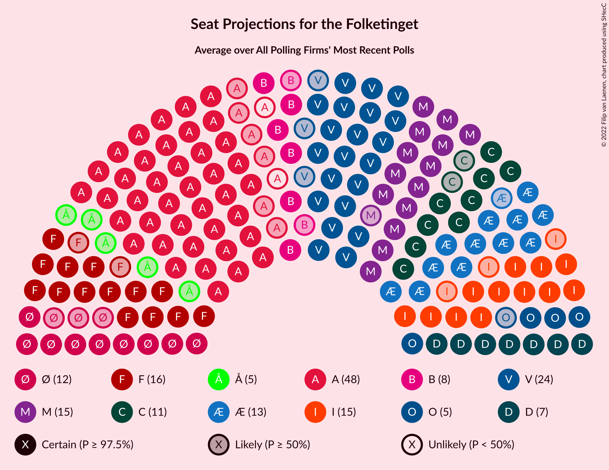

# Poll Average

<a href="#voting-intentions">Voting Intentions</a> | <a href="#seats">Seats</a> | <a href="#coalitions">Coalitions</a> | <a href="#technical-information">Technical Information</a>

## Summary

The table below lists the polls on which the average is based. They are the most recent polls (less than 90 days old) registered and analyzed so far.

| Period     | Polling firm/Commissioner(s) | A | V | O | B | F | Ø | C | Å | D | I | P | K | E |
|:----------:|:----------------------------:|:--:|:--:|:--:|:--:|:--:|:--:|:--:|:--:|:--:|:--:|:--:|:--:|:--:|
| 5 June 2019 | General Election | 25.9%   48 | 23.4%   43 | 8.7%   16 | 8.6%   16 | 7.7%   14 | 6.9%   13 | 6.6%   12 | 3.0%   5 | 2.4%   4 | 2.3%   4 | 1.8%   0 | 1.7%   0 | 0.8%   0 |
| N/A | Poll Average | 29–36%   50–63 | 16–22%   29–37 | 5–8%   10–15 | 6–9%   10–16 | 6–10%   10–16 | 6–9%   10–16 | 7–11%   13–19 | 0–1%   0 | 4–9%   8–16 | 2–4%   0–6 | 0–2%   0–4 | 0–3%   0–5 | 0–1%   0 |
| [1–8 September 2020](2020-09-08-Epinion.html) | Epinion | 31–36%   56–63 | 15–19%   28–35 | 6–8%   11–15 | 6–8%   12–16 | 6–8%   10–14 | 5–8%   9–13 | 7–10%   12–17 | 1–2%   0 | 5–7%   10–13 | 2–3%   0–6 | 0–1%   0 | 2–3%   0–5 | N/A   N/A |
| [31 August–6 September 2020](2020-09-06-Voxmeter.html) | Voxmeter | 31–36%   57–62 | 18–23%   33–39 | 5–8%   9–14 | 5–8%   10–14 | 7–10%   14–18 | 6–10%   12–16 | 6–9%   12–16 | 0–1%   0 | 4–6%   7–10 | 2–3%   3–6 | 0–1%   0 | 1–2%   0 | N/A   N/A |
| [24–27 August 2020](2020-08-27-Megafon.html) | Megafon   Politiken and TV 2 | 28–34%   52–59 | 16–21%   30–37 | 5–8%   10–14 | 6–9%   10–15 | 6–9%   11–17 | 6–9%   10–14 | 8–11%   15–19 | 0–1%   0 | 5–8%   10–16 | 2–4%   0–6 | 1–3%   0–4 | 1–2%   0–4 | 0–1%   0 |
| [1–31 July 2020](2020-07-31-Gallup.html) | Gallup | 28–33%   49–59 | 17–21%   30–38 | 6–9%   12–16 | 6–9%   11–16 | 6–9%   11–17 | 6–9%   11–16 | 8–11%   13–19 | 0–1%   0 | 5–8%   10–14 | 2–3%   0–6 | 0–1%   0 | N/A   N/A | N/A   N/A |
| [2–6 July 2020](2020-07-06-YouGov.html) | YouGov | 30–35%   55–65 | 15–19%   27–36 | 5–8%   9–14 | 5–8%   10–15 | 5–8%   10–14 | 6–9%   12–16 | 7–11%   14–19 | 0–1%   0 | 7–10%   12–17 | 2–4%   4–7 | 0–1%   0 | 0–1%   0 | N/A   N/A |
| 5 June 2019 | General Election | 25.9%   48 | 23.4%   43 | 8.7%   16 | 8.6%   16 | 7.7%   14 | 6.9%   13 | 6.6%   12 | 3.0%   5 | 2.4%   4 | 2.3%   4 | 1.8%   0 | 1.7%   0 | 0.8%   0 |

Only polls for which at least the sample size has been published are included in the table above.

**Legend:**
+ **Top half of each row:** Voting intentions (95% confidence interval)
+ **Bottom half of each row:** Seat projections for the Folketinget (95% confidence interval)
+ **A:** Socialdemokraterne
+ **V:** Venstre
+ **O:** Dansk Folkeparti
+ **B:** Radikale Venstre
+ **F:** Socialistisk Folkeparti
+ **Ø:** Enhedslisten–De Rød-Grønne
+ **C:** Det Konservative Folkeparti
+ **Å:** Alternativet
+ **D:** Nye Borgerlige
+ **I:** Liberal Alliance
+ **P:** Stram Kurs
+ **K:** Kristendemokraterne
+ **E:** Klaus Riskær Pedersen
+ **N/A (single party):** Party not included the published results
+ **N/A (entire row):** Calculation for this opinion poll not started yet

## Voting Intentions

### Confidence Intervals

| Party | Last Result | Median | 80% Confidence Interval | 90% Confidence Interval | 95% Confidence Interval | 99% Confidence Interval |
|:-----:|:-----------:|:------:|:-----------------------:|:-----------------------:|:-----------------------:|:-----------------------:|
| <a href="#socialdemokraterne">Socialdemokraterne</a> | 25.9% | 32.3% | 29.8–34.5% |29.2–35.0% | 28.7–35.5% | 27.8–36.5% |
| <a href="#venstre">Venstre</a> | 23.4% | 18.3% | 16.4–20.7% |16.0–21.4% | 15.6–21.9% | 14.9–23.0% |
| <a href="#dansk-folkeparti">Dansk Folkeparti</a> | 8.7% | 6.7% | 5.6–7.9% |5.3–8.2% | 5.0–8.5% | 4.6–9.1% |
| <a href="#radikale-venstre">Radikale Venstre</a> | 8.6% | 7.1% | 6.0–8.2% |5.7–8.5% | 5.5–8.8% | 5.1–9.3% |
| <a href="#socialistisk-folkeparti">Socialistisk Folkeparti</a> | 7.7% | 7.3% | 6.2–8.9% |5.9–9.3% | 5.7–9.7% | 5.3–10.5% |
| <a href="#enhedslisten–de-rød-grønne">Enhedslisten–De Rød-Grønne</a> | 6.9% | 7.3% | 6.1–8.5% |5.8–8.8% | 5.6–9.1% | 5.2–9.7% |
| <a href="#det-konservative-folkeparti">Det Konservative Folkeparti</a> | 6.6% | 8.8% | 7.4–10.0% |7.0–10.3% | 6.7–10.6% | 6.1–11.3% |
| <a href="#alternativet">Alternativet</a> | 3.0% | 0.7% | 0.3–1.1% |0.3–1.3% | 0.2–1.4% | 0.1–1.6% |
| <a href="#nye-borgerlige">Nye Borgerlige</a> | 2.4% | 6.5% | 4.8–8.2% |4.4–8.7% | 4.1–9.0% | 3.6–9.7% |
| <a href="#liberal-alliance">Liberal Alliance</a> | 2.3% | 2.6% | 2.0–3.3% |1.8–3.5% | 1.7–3.7% | 1.5–4.1% |
| <a href="#stram-kurs">Stram Kurs</a> | 1.8% | 0.7% | 0.3–1.8% |0.2–2.0% | 0.2–2.3% | 0.1–2.7% |
| <a href="#kristendemokraterne">Kristendemokraterne</a> | 1.7% | 1.6% | 0.7–2.6% |0.6–2.8% | 0.5–3.0% | 0.4–3.3% |
| <a href="#klaus-riskær-pedersen">Klaus Riskær Pedersen</a> | 0.8% | 0.5% | 0.2–0.8% |0.2–0.9% | 0.2–1.0% | 0.1–1.2% |

### Socialdemokraterne

*For a full overview of the results for this party, see the [Socialdemokraterne](party-socialdemokraterne.html) page.*

| Voting Intentions | Probability | Accumulated | Special Marks |
|:-----------------:|:-----------:|:-----------:|:-------------:|
| 25.5–26.5% | 0% | 100% | Last Result |
| 26.5–27.5% | 0.3% | 100% |  |
| 27.5–28.5% | 2% | 99.7% |  |
| 28.5–29.5% | 6% | 98% |  |
| 29.5–30.5% | 12% | 92% |  |
| 30.5–31.5% | 16% | 81% |  |
| 31.5–32.5% | 20% | 64% | Median |
| 32.5–33.5% | 21% | 44% |  |
| 33.5–34.5% | 15% | 24% |  |
| 34.5–35.5% | 7% | 9% |  |
| 35.5–36.5% | 2% | 2% |  |
| 36.5–37.5% | 0.4% | 0.4% |  |
| 37.5–38.5% | 0.1% | 0.1% |  |
| 38.5–39.5% | 0% | 0% |  |

### Venstre

*For a full overview of the results for this party, see the [Venstre](party-venstre.html) page.*

| Voting Intentions | Probability | Accumulated | Special Marks |
|:-----------------:|:-----------:|:-----------:|:-------------:|
| 12.5–13.5% | 0% | 100% |  |
| 13.5–14.5% | 0.2% | 100% |  |
| 14.5–15.5% | 2% | 99.8% |  |
| 15.5–16.5% | 10% | 98% |  |
| 16.5–17.5% | 20% | 87% |  |
| 17.5–18.5% | 23% | 67% | Median |
| 18.5–19.5% | 19% | 44% |  |
| 19.5–20.5% | 13% | 25% |  |
| 20.5–21.5% | 7% | 12% |  |
| 21.5–22.5% | 3% | 4% |  |
| 22.5–23.5% | 0.8% | 1.0% | Last Result |
| 23.5–24.5% | 0.2% | 0.2% |  |
| 24.5–25.5% | 0% | 0% |  |

### Dansk Folkeparti

*For a full overview of the results for this party, see the [Dansk Folkeparti](party-danskfolkeparti.html) page.*

| Voting Intentions | Probability | Accumulated | Special Marks |
|:-----------------:|:-----------:|:-----------:|:-------------:|
| 2.5–3.5% | 0% | 100% |  |
| 3.5–4.5% | 0.5% | 100% |  |
| 4.5–5.5% | 9% | 99.5% |  |
| 5.5–6.5% | 35% | 90% |  |
| 6.5–7.5% | 38% | 55% | Median |
| 7.5–8.5% | 15% | 18% |  |
| 8.5–9.5% | 2% | 2% | Last Result |
| 9.5–10.5% | 0.1% | 0.1% |  |
| 10.5–11.5% | 0% | 0% |  |

### Radikale Venstre

*For a full overview of the results for this party, see the [Radikale Venstre](party-radikalevenstre.html) page.*

| Voting Intentions | Probability | Accumulated | Special Marks |
|:-----------------:|:-----------:|:-----------:|:-------------:|
| 3.5–4.5% | 0% | 100% |  |
| 4.5–5.5% | 3% | 100% |  |
| 5.5–6.5% | 23% | 97% |  |
| 6.5–7.5% | 45% | 74% | Median |
| 7.5–8.5% | 25% | 29% |  |
| 8.5–9.5% | 4% | 4% | Last Result |
| 9.5–10.5% | 0.2% | 0.3% |  |
| 10.5–11.5% | 0% | 0% |  |

### Socialistisk Folkeparti

*For a full overview of the results for this party, see the [Socialistisk Folkeparti](party-socialistiskfolkeparti.html) page.*

| Voting Intentions | Probability | Accumulated | Special Marks |
|:-----------------:|:-----------:|:-----------:|:-------------:|
| 3.5–4.5% | 0% | 100% |  |
| 4.5–5.5% | 1.4% | 100% |  |
| 5.5–6.5% | 19% | 98.6% |  |
| 6.5–7.5% | 37% | 80% | Median |
| 7.5–8.5% | 27% | 42% | Last Result |
| 8.5–9.5% | 12% | 15% |  |
| 9.5–10.5% | 3% | 3% |  |
| 10.5–11.5% | 0.4% | 0.4% |  |
| 11.5–12.5% | 0% | 0% |  |

### Enhedslisten–De Rød-Grønne

*For a full overview of the results for this party, see the [Enhedslisten–De Rød-Grønne](party-enhedslisten–derød-grønne.html) page.*

| Voting Intentions | Probability | Accumulated | Special Marks |
|:-----------------:|:-----------:|:-----------:|:-------------:|
| 3.5–4.5% | 0% | 100% |  |
| 4.5–5.5% | 2% | 100% |  |
| 5.5–6.5% | 19% | 98% |  |
| 6.5–7.5% | 38% | 78% | Last Result, Median |
| 7.5–8.5% | 31% | 40% |  |
| 8.5–9.5% | 8% | 9% |  |
| 9.5–10.5% | 0.8% | 0.8% |  |
| 10.5–11.5% | 0% | 0% |  |

### Det Konservative Folkeparti

*For a full overview of the results for this party, see the [Det Konservative Folkeparti](party-detkonservativefolkeparti.html) page.*

| Voting Intentions | Probability | Accumulated | Special Marks |
|:-----------------:|:-----------:|:-----------:|:-------------:|
| 4.5–5.5% | 0.1% | 100% |  |
| 5.5–6.5% | 2% | 99.9% |  |
| 6.5–7.5% | 10% | 98% | Last Result |
| 7.5–8.5% | 29% | 88% |  |
| 8.5–9.5% | 39% | 59% | Median |
| 9.5–10.5% | 17% | 20% |  |
| 10.5–11.5% | 3% | 3% |  |
| 11.5–12.5% | 0.2% | 0.2% |  |
| 12.5–13.5% | 0% | 0% |  |

### Alternativet

*For a full overview of the results for this party, see the [Alternativet](party-alternativet.html) page.*

| Voting Intentions | Probability | Accumulated | Special Marks |
|:-----------------:|:-----------:|:-----------:|:-------------:|
| 0.0–0.5% | 35% | 100% |  |
| 0.5–1.5% | 65% | 65% | Median |
| 1.5–2.5% | 0.8% | 0.8% |  |
| 2.5–3.5% | 0% | 0% | Last Result |

### Nye Borgerlige

*For a full overview of the results for this party, see the [Nye Borgerlige](party-nyeborgerlige.html) page.*

| Voting Intentions | Probability | Accumulated | Special Marks |
|:-----------------:|:-----------:|:-----------:|:-------------:|
| 1.5–2.5% | 0% | 100% | Last Result |
| 2.5–3.5% | 0.4% | 100% |  |
| 3.5–4.5% | 7% | 99.6% |  |
| 4.5–5.5% | 15% | 93% |  |
| 5.5–6.5% | 32% | 78% | Median |
| 6.5–7.5% | 27% | 46% |  |
| 7.5–8.5% | 14% | 20% |  |
| 8.5–9.5% | 5% | 6% |  |
| 9.5–10.5% | 0.7% | 0.8% |  |
| 10.5–11.5% | 0% | 0% |  |

### Liberal Alliance

*For a full overview of the results for this party, see the [Liberal Alliance](party-liberalalliance.html) page.*

| Voting Intentions | Probability | Accumulated | Special Marks |
|:-----------------:|:-----------:|:-----------:|:-------------:|
| 0.0–0.5% | 0% | 100% |  |
| 0.5–1.5% | 1.0% | 100% |  |
| 1.5–2.5% | 48% | 99.0% | Last Result |
| 2.5–3.5% | 46% | 51% | Median |
| 3.5–4.5% | 4% | 4% |  |
| 4.5–5.5% | 0.1% | 0.1% |  |
| 5.5–6.5% | 0% | 0% |  |

### Stram Kurs

*For a full overview of the results for this party, see the [Stram Kurs](party-stramkurs.html) page.*

| Voting Intentions | Probability | Accumulated | Special Marks |
|:-----------------:|:-----------:|:-----------:|:-------------:|
| 0.0–0.5% | 32% | 100% |  |
| 0.5–1.5% | 54% | 68% | Median |
| 1.5–2.5% | 13% | 14% | Last Result |
| 2.5–3.5% | 0.9% | 0.9% |  |
| 3.5–4.5% | 0% | 0% |  |

### Kristendemokraterne

*For a full overview of the results for this party, see the [Kristendemokraterne](party-kristendemokraterne.html) page.*

| Voting Intentions | Probability | Accumulated | Special Marks |
|:-----------------:|:-----------:|:-----------:|:-------------:|
| 0.0–0.5% | 4% | 100% |  |
| 0.5–1.5% | 45% | 96% |  |
| 1.5–2.5% | 41% | 51% | Last Result, Median |
| 2.5–3.5% | 10% | 11% |  |
| 3.5–4.5% | 0.1% | 0.1% |  |
| 4.5–5.5% | 0% | 0% |  |

### Klaus Riskær Pedersen

*For a full overview of the results for this party, see the [Klaus Riskær Pedersen](party-klausriskærpedersen.html) page.*

| Voting Intentions | Probability | Accumulated | Special Marks |
|:-----------------:|:-----------:|:-----------:|:-------------:|
| 0.0–0.5% | 65% | 100% | Median |
| 0.5–1.5% | 35% | 35% | Last Result |
| 1.5–2.5% | 0% | 0% |  |
| 2.5–3.5% | 0% | 0% |  |

## Seats

### Confidence Intervals

| Party | Last Result | Median | 80% Confidence Interval | 90% Confidence Interval | 95% Confidence Interval | 99% Confidence Interval |
|:-----:|:-----------:|:------:|:-----------------------:|:-----------------------:|:-----------------------:|:-----------------------:|
| <a href="#socialdemokraterne">Socialdemokraterne</a> | 48 | 58 | 53–60 |50–62 | 50–63 | 49–65 |
| <a href="#venstre">Venstre</a> | 43 | 33 | 31–36 |30–37 | 29–37 | 27–39 |
| <a href="#dansk-folkeparti">Dansk Folkeparti</a> | 16 | 12 | 10–14 |10–15 | 10–15 | 9–16 |
| <a href="#radikale-venstre">Radikale Venstre</a> | 16 | 12 | 10–14 |10–15 | 10–16 | 10–16 |
| <a href="#socialistisk-folkeparti">Socialistisk Folkeparti</a> | 14 | 13 | 11–16 |10–16 | 10–16 | 10–18 |
| <a href="#enhedslisten–de-rød-grønne">Enhedslisten–De Rød-Grønne</a> | 13 | 13 | 10–15 |10–15 | 10–16 | 9–17 |
| <a href="#det-konservative-folkeparti">Det Konservative Folkeparti</a> | 12 | 16 | 14–18 |14–18 | 13–19 | 12–20 |
| <a href="#alternativet">Alternativet</a> | 5 | 0 | 0 |0 | 0 | 0 |
| <a href="#nye-borgerlige">Nye Borgerlige</a> | 4 | 12 | 8–15 |8–15 | 8–16 | 7–17 |
| <a href="#liberal-alliance">Liberal Alliance</a> | 4 | 5 | 4–6 |0–6 | 0–6 | 0–7 |
| <a href="#stram-kurs">Stram Kurs</a> | 0 | 0 | 0 |0–4 | 0–4 | 0–4 |
| <a href="#kristendemokraterne">Kristendemokraterne</a> | 0 | 0 | 0–5 |0–5 | 0–5 | 0–5 |
| <a href="#klaus-riskær-pedersen">Klaus Riskær Pedersen</a> | 0 | 0 | 0 |0 | 0 | 0 |

### Socialdemokraterne

*For a full overview of the results for this party, see the [Socialdemokraterne](party-socialdemokraterne.html) page.*

| Number of Seats | Probability | Accumulated | Special Marks |
|:---------------:|:-----------:|:-----------:|:-------------:|
| 48 | 0.1% | 100% | Last Result |
| 49 | 0.6% | 99.9% |  |
| 50 | 5% | 99.3% |  |
| 51 | 0.9% | 94% |  |
| 52 | 2% | 94% |  |
| 53 | 4% | 91% |  |
| 54 | 8% | 87% |  |
| 55 | 11% | 79% |  |
| 56 | 6% | 68% |  |
| 57 | 6% | 62% |  |
| 58 | 24% | 56% | Median |
| 59 | 6% | 31% |  |
| 60 | 17% | 25% |  |
| 61 | 3% | 8% |  |
| 62 | 1.4% | 5% |  |
| 63 | 2% | 4% |  |
| 64 | 0.4% | 1.4% |  |
| 65 | 0.9% | 1.0% |  |
| 66 | 0% | 0.1% |  |
| 67 | 0% | 0% |  |

### Venstre

*For a full overview of the results for this party, see the [Venstre](party-venstre.html) page.*

| Number of Seats | Probability | Accumulated | Special Marks |
|:---------------:|:-----------:|:-----------:|:-------------:|
| 26 | 0.1% | 100% |  |
| 27 | 0.7% | 99.9% |  |
| 28 | 2% | 99.2% |  |
| 29 | 2% | 98% |  |
| 30 | 4% | 95% |  |
| 31 | 15% | 91% |  |
| 32 | 12% | 76% |  |
| 33 | 20% | 64% | Median |
| 34 | 26% | 44% |  |
| 35 | 5% | 18% |  |
| 36 | 8% | 13% |  |
| 37 | 3% | 5% |  |
| 38 | 1.3% | 2% |  |
| 39 | 0.4% | 0.8% |  |
| 40 | 0.1% | 0.4% |  |
| 41 | 0.1% | 0.2% |  |
| 42 | 0.1% | 0.1% |  |
| 43 | 0% | 0% | Last Result |

### Dansk Folkeparti

*For a full overview of the results for this party, see the [Dansk Folkeparti](party-danskfolkeparti.html) page.*

| Number of Seats | Probability | Accumulated | Special Marks |
|:---------------:|:-----------:|:-----------:|:-------------:|
| 7 | 0.1% | 100% |  |
| 8 | 0.4% | 99.9% |  |
| 9 | 1.4% | 99.5% |  |
| 10 | 19% | 98% |  |
| 11 | 14% | 79% |  |
| 12 | 18% | 64% | Median |
| 13 | 31% | 47% |  |
| 14 | 9% | 16% |  |
| 15 | 6% | 7% |  |
| 16 | 0.6% | 1.0% | Last Result |
| 17 | 0.3% | 0.3% |  |
| 18 | 0% | 0% |  |

### Radikale Venstre

*For a full overview of the results for this party, see the [Radikale Venstre](party-radikalevenstre.html) page.*

| Number of Seats | Probability | Accumulated | Special Marks |
|:---------------:|:-----------:|:-----------:|:-------------:|
| 9 | 0.3% | 100% |  |
| 10 | 10% | 99.6% |  |
| 11 | 4% | 89% |  |
| 12 | 40% | 85% | Median |
| 13 | 28% | 45% |  |
| 14 | 10% | 17% |  |
| 15 | 4% | 7% |  |
| 16 | 2% | 3% | Last Result |
| 17 | 0.1% | 0.3% |  |
| 18 | 0.1% | 0.2% |  |
| 19 | 0.1% | 0.1% |  |
| 20 | 0% | 0% |  |

### Socialistisk Folkeparti

*For a full overview of the results for this party, see the [Socialistisk Folkeparti](party-socialistiskfolkeparti.html) page.*

| Number of Seats | Probability | Accumulated | Special Marks |
|:---------------:|:-----------:|:-----------:|:-------------:|
| 9 | 0.3% | 100% |  |
| 10 | 6% | 99.7% |  |
| 11 | 9% | 93% |  |
| 12 | 24% | 84% |  |
| 13 | 14% | 60% | Median |
| 14 | 12% | 45% | Last Result |
| 15 | 13% | 33% |  |
| 16 | 18% | 21% |  |
| 17 | 1.4% | 2% |  |
| 18 | 0.7% | 1.1% |  |
| 19 | 0.3% | 0.4% |  |
| 20 | 0% | 0.1% |  |
| 21 | 0.1% | 0.1% |  |
| 22 | 0% | 0% |  |

### Enhedslisten–De Rød-Grønne

*For a full overview of the results for this party, see the [Enhedslisten–De Rød-Grønne](party-enhedslisten–derød-grønne.html) page.*

| Number of Seats | Probability | Accumulated | Special Marks |
|:---------------:|:-----------:|:-----------:|:-------------:|
| 8 | 0.1% | 100% |  |
| 9 | 2% | 99.9% |  |
| 10 | 9% | 98% |  |
| 11 | 12% | 89% |  |
| 12 | 18% | 77% |  |
| 13 | 14% | 59% | Last Result, Median |
| 14 | 16% | 45% |  |
| 15 | 26% | 29% |  |
| 16 | 2% | 3% |  |
| 17 | 0.5% | 1.0% |  |
| 18 | 0.4% | 0.4% |  |
| 19 | 0.1% | 0.1% |  |
| 20 | 0% | 0% |  |

### Det Konservative Folkeparti

*For a full overview of the results for this party, see the [Det Konservative Folkeparti](party-detkonservativefolkeparti.html) page.*

| Number of Seats | Probability | Accumulated | Special Marks |
|:---------------:|:-----------:|:-----------:|:-------------:|
| 10 | 0.1% | 100% |  |
| 11 | 0.4% | 99.9% |  |
| 12 | 2% | 99.6% | Last Result |
| 13 | 2% | 98% |  |
| 14 | 11% | 96% |  |
| 15 | 21% | 85% |  |
| 16 | 30% | 63% | Median |
| 17 | 9% | 34% |  |
| 18 | 21% | 24% |  |
| 19 | 2% | 3% |  |
| 20 | 0.8% | 0.9% |  |
| 21 | 0.1% | 0.2% |  |
| 22 | 0% | 0% |  |

### Alternativet

*For a full overview of the results for this party, see the [Alternativet](party-alternativet.html) page.*

| Number of Seats | Probability | Accumulated | Special Marks |
|:---------------:|:-----------:|:-----------:|:-------------:|
| 0 | 100% | 100% | Median |
| 1 | 0% | 0% |  |
| 2 | 0% | 0% |  |
| 3 | 0% | 0% |  |
| 4 | 0% | 0% |  |
| 5 | 0% | 0% | Last Result |

### Nye Borgerlige

*For a full overview of the results for this party, see the [Nye Borgerlige](party-nyeborgerlige.html) page.*

| Number of Seats | Probability | Accumulated | Special Marks |
|:---------------:|:-----------:|:-----------:|:-------------:|
| 4 | 0% | 100% | Last Result |
| 5 | 0% | 100% |  |
| 6 | 0% | 100% |  |
| 7 | 0.8% | 99.9% |  |
| 8 | 16% | 99.2% |  |
| 9 | 2% | 83% |  |
| 10 | 3% | 80% |  |
| 11 | 14% | 77% |  |
| 12 | 21% | 63% | Median |
| 13 | 19% | 42% |  |
| 14 | 9% | 23% |  |
| 15 | 9% | 14% |  |
| 16 | 3% | 5% |  |
| 17 | 1.1% | 2% |  |
| 18 | 0.4% | 0.4% |  |
| 19 | 0% | 0% |  |

### Liberal Alliance

*For a full overview of the results for this party, see the [Liberal Alliance](party-liberalalliance.html) page.*

| Number of Seats | Probability | Accumulated | Special Marks |
|:---------------:|:-----------:|:-----------:|:-------------:|
| 0 | 6% | 100% |  |
| 1 | 0% | 94% |  |
| 2 | 0% | 94% |  |
| 3 | 0% | 94% |  |
| 4 | 30% | 94% | Last Result |
| 5 | 34% | 64% | Median |
| 6 | 28% | 30% |  |
| 7 | 2% | 2% |  |
| 8 | 0.2% | 0.2% |  |
| 9 | 0% | 0% |  |

### Stram Kurs

*For a full overview of the results for this party, see the [Stram Kurs](party-stramkurs.html) page.*

| Number of Seats | Probability | Accumulated | Special Marks |
|:---------------:|:-----------:|:-----------:|:-------------:|
| 0 | 92% | 100% | Last Result, Median |
| 1 | 0% | 8% |  |
| 2 | 0% | 8% |  |
| 3 | 0% | 8% |  |
| 4 | 8% | 8% |  |
| 5 | 0.1% | 0.1% |  |
| 6 | 0% | 0% |  |

### Kristendemokraterne

*For a full overview of the results for this party, see the [Kristendemokraterne](party-kristendemokraterne.html) page.*

| Number of Seats | Probability | Accumulated | Special Marks |
|:---------------:|:-----------:|:-----------:|:-------------:|
| 0 | 79% | 100% | Last Result, Median |
| 1 | 0% | 21% |  |
| 2 | 0% | 21% |  |
| 3 | 0% | 21% |  |
| 4 | 10% | 21% |  |
| 5 | 10% | 11% |  |
| 6 | 0.3% | 0.3% |  |
| 7 | 0% | 0% |  |

### Klaus Riskær Pedersen

*For a full overview of the results for this party, see the [Klaus Riskær Pedersen](party-klausriskærpedersen.html) page.*

| Number of Seats | Probability | Accumulated | Special Marks |
|:---------------:|:-----------:|:-----------:|:-------------:|
| 0 | 100% | 100% | Last Result, Median |

## Coalitions

### Confidence Intervals

| Coalition | Last Result | Median | Majority? | 80% Confidence Interval | 90% Confidence Interval | 95% Confidence Interval | 99% Confidence Interval |
|:---------:|:-----------:|:------:|:---------:|:-----------------------:|:-----------------------:|:-----------------------:|:-----------------------:|
| Socialdemokraterne – Radikale Venstre – Socialistisk Folkeparti – Enhedslisten–De Rød-Grønne – Alternativet | 96 | 95 | 99.4% | 91–103 | 90–103 | 90–103 | 89–105 |
| Socialdemokraterne – Radikale Venstre – Socialistisk Folkeparti – Enhedslisten–De Rød-Grønne | 91 | 95 | 99.4% | 91–103 | 90–103 | 90–103 | 89–105 |
| Socialdemokraterne – Socialistisk Folkeparti – Enhedslisten–De Rød-Grønne – Alternativet | 80 | 83 | 18% | 78–91 | 77–91 | 77–91 | 76–92 |
| Socialdemokraterne – Socialistisk Folkeparti – Enhedslisten–De Rød-Grønne | 75 | 83 | 18% | 78–91 | 77–91 | 77–91 | 76–92 |
| Socialdemokraterne – Radikale Venstre – Socialistisk Folkeparti | 78 | 82 | 0.7% | 78–88 | 77–88 | 76–88 | 76–92 |
| Venstre – Dansk Folkeparti – Det Konservative Folkeparti – Nye Borgerlige – Liberal Alliance – Stram Kurs – Kristendemokraterne – Klaus Riskær Pedersen | 79 | 80 | 0% | 72–84 | 72–84 | 72–85 | 70–85 |
| Venstre – Dansk Folkeparti – Det Konservative Folkeparti – Nye Borgerlige – Liberal Alliance – Kristendemokraterne – Klaus Riskær Pedersen | 79 | 80 | 0% | 72–83 | 72–84 | 72–85 | 70–85 |
| Venstre – Dansk Folkeparti – Det Konservative Folkeparti – Nye Borgerlige – Liberal Alliance – Klaus Riskær Pedersen | 79 | 78 | 0% | 72–82 | 72–84 | 72–85 | 70–85 |
| Venstre – Dansk Folkeparti – Det Konservative Folkeparti – Nye Borgerlige – Liberal Alliance – Kristendemokraterne | 79 | 80 | 0% | 72–83 | 72–84 | 72–85 | 70–85 |
| Venstre – Dansk Folkeparti – Det Konservative Folkeparti – Nye Borgerlige – Liberal Alliance | 79 | 78 | 0% | 72–82 | 72–84 | 72–85 | 70–85 |
| Socialdemokraterne – Radikale Venstre | 64 | 70 | 0% | 65–73 | 63–75 | 63–76 | 63–77 |
| Venstre – Dansk Folkeparti – Det Konservative Folkeparti – Liberal Alliance – Kristendemokraterne | 75 | 67 | 0% | 64–70 | 62–72 | 61–72 | 60–73 |
| Venstre – Dansk Folkeparti – Det Konservative Folkeparti – Liberal Alliance | 75 | 65 | 0% | 63–70 | 62–72 | 60–72 | 59–73 |
| Venstre – Det Konservative Folkeparti – Liberal Alliance | 59 | 54 | 0% | 51–57 | 49–59 | 48–59 | 47–61 |
| Venstre – Det Konservative Folkeparti | 55 | 49 | 0% | 46–52 | 45–54 | 44–54 | 42–55 |
| Venstre | 43 | 33 | 0% | 31–36 | 30–37 | 29–37 | 27–39 |

### Socialdemokraterne – Radikale Venstre – Socialistisk Folkeparti – Enhedslisten–De Rød-Grønne – Alternativet

| Number of Seats | Probability | Accumulated | Special Marks |
|:---------------:|:-----------:|:-----------:|:-------------:|
| 87 | 0% | 100% |  |
| 88 | 0.2% | 99.9% |  |
| 89 | 0.4% | 99.8% |  |
| 90 | 5% | 99.4% | Majority |
| 91 | 8% | 95% |  |
| 92 | 6% | 87% |  |
| 93 | 16% | 81% |  |
| 94 | 7% | 65% |  |
| 95 | 15% | 58% |  |
| 96 | 6% | 42% | Last Result, Median |
| 97 | 8% | 36% |  |
| 98 | 3% | 28% |  |
| 99 | 3% | 25% |  |
| 100 | 4% | 22% |  |
| 101 | 2% | 19% |  |
| 102 | 0.5% | 17% |  |
| 103 | 16% | 17% |  |
| 104 | 0.1% | 0.9% |  |
| 105 | 0.4% | 0.7% |  |
| 106 | 0.3% | 0.4% |  |
| 107 | 0% | 0% |  |

### Socialdemokraterne – Radikale Venstre – Socialistisk Folkeparti – Enhedslisten–De Rød-Grønne

| Number of Seats | Probability | Accumulated | Special Marks |
|:---------------:|:-----------:|:-----------:|:-------------:|
| 87 | 0% | 100% |  |
| 88 | 0.2% | 99.9% |  |
| 89 | 0.4% | 99.8% |  |
| 90 | 5% | 99.4% | Majority |
| 91 | 8% | 95% | Last Result |
| 92 | 6% | 87% |  |
| 93 | 16% | 81% |  |
| 94 | 7% | 65% |  |
| 95 | 15% | 58% |  |
| 96 | 6% | 42% | Median |
| 97 | 8% | 36% |  |
| 98 | 3% | 28% |  |
| 99 | 3% | 25% |  |
| 100 | 4% | 22% |  |
| 101 | 2% | 19% |  |
| 102 | 0.5% | 17% |  |
| 103 | 16% | 17% |  |
| 104 | 0.1% | 0.9% |  |
| 105 | 0.4% | 0.7% |  |
| 106 | 0.3% | 0.4% |  |
| 107 | 0% | 0% |  |

### Socialdemokraterne – Socialistisk Folkeparti – Enhedslisten–De Rød-Grønne – Alternativet

| Number of Seats | Probability | Accumulated | Special Marks |
|:---------------:|:-----------:|:-----------:|:-------------:|
| 74 | 0.2% | 100% |  |
| 75 | 0.2% | 99.8% |  |
| 76 | 0.3% | 99.6% |  |
| 77 | 5% | 99.3% |  |
| 78 | 6% | 94% |  |
| 79 | 3% | 88% |  |
| 80 | 13% | 85% | Last Result |
| 81 | 16% | 72% |  |
| 82 | 3% | 56% |  |
| 83 | 12% | 53% |  |
| 84 | 6% | 41% | Median |
| 85 | 11% | 36% |  |
| 86 | 2% | 25% |  |
| 87 | 2% | 22% |  |
| 88 | 0.9% | 20% |  |
| 89 | 2% | 19% |  |
| 90 | 0.9% | 18% | Majority |
| 91 | 16% | 17% |  |
| 92 | 0.4% | 0.8% |  |
| 93 | 0.1% | 0.4% |  |
| 94 | 0.3% | 0.3% |  |
| 95 | 0% | 0% |  |

### Socialdemokraterne – Socialistisk Folkeparti – Enhedslisten–De Rød-Grønne

| Number of Seats | Probability | Accumulated | Special Marks |
|:---------------:|:-----------:|:-----------:|:-------------:|
| 74 | 0.2% | 100% |  |
| 75 | 0.2% | 99.8% | Last Result |
| 76 | 0.3% | 99.6% |  |
| 77 | 5% | 99.3% |  |
| 78 | 6% | 94% |  |
| 79 | 3% | 88% |  |
| 80 | 13% | 85% |  |
| 81 | 16% | 72% |  |
| 82 | 3% | 56% |  |
| 83 | 12% | 53% |  |
| 84 | 6% | 41% | Median |
| 85 | 11% | 36% |  |
| 86 | 2% | 25% |  |
| 87 | 2% | 22% |  |
| 88 | 0.9% | 20% |  |
| 89 | 2% | 19% |  |
| 90 | 0.9% | 18% | Majority |
| 91 | 16% | 17% |  |
| 92 | 0.4% | 0.8% |  |
| 93 | 0.1% | 0.4% |  |
| 94 | 0.3% | 0.3% |  |
| 95 | 0% | 0% |  |

### Socialdemokraterne – Radikale Venstre – Socialistisk Folkeparti

| Number of Seats | Probability | Accumulated | Special Marks |
|:---------------:|:-----------:|:-----------:|:-------------:|
| 74 | 0.1% | 100% |  |
| 75 | 0.2% | 99.9% |  |
| 76 | 5% | 99.8% |  |
| 77 | 2% | 95% |  |
| 78 | 4% | 94% | Last Result |
| 79 | 3% | 89% |  |
| 80 | 12% | 86% |  |
| 81 | 14% | 75% |  |
| 82 | 17% | 60% |  |
| 83 | 5% | 44% | Median |
| 84 | 7% | 39% |  |
| 85 | 2% | 32% |  |
| 86 | 6% | 30% |  |
| 87 | 3% | 24% |  |
| 88 | 20% | 21% |  |
| 89 | 0.7% | 1.4% |  |
| 90 | 0.1% | 0.7% | Majority |
| 91 | 0.1% | 0.6% |  |
| 92 | 0.4% | 0.6% |  |
| 93 | 0.1% | 0.2% |  |
| 94 | 0.1% | 0.1% |  |
| 95 | 0% | 0% |  |

### Venstre – Dansk Folkeparti – Det Konservative Folkeparti – Nye Borgerlige – Liberal Alliance – Stram Kurs – Kristendemokraterne – Klaus Riskær Pedersen

| Number of Seats | Probability | Accumulated | Special Marks |
|:---------------:|:-----------:|:-----------:|:-------------:|
| 68 | 0% | 100% |  |
| 69 | 0.3% | 99.9% |  |
| 70 | 0.4% | 99.6% |  |
| 71 | 0.1% | 99.2% |  |
| 72 | 16% | 99.1% |  |
| 73 | 0.5% | 83% |  |
| 74 | 2% | 83% |  |
| 75 | 4% | 81% |  |
| 76 | 4% | 77% |  |
| 77 | 4% | 74% |  |
| 78 | 9% | 70% | Median |
| 79 | 6% | 61% | Last Result |
| 80 | 15% | 55% |  |
| 81 | 7% | 40% |  |
| 82 | 15% | 33% |  |
| 83 | 6% | 18% |  |
| 84 | 7% | 12% |  |
| 85 | 4% | 5% |  |
| 86 | 0.2% | 0.3% |  |
| 87 | 0.1% | 0.2% |  |
| 88 | 0% | 0% |  |

### Venstre – Dansk Folkeparti – Det Konservative Folkeparti – Nye Borgerlige – Liberal Alliance – Kristendemokraterne – Klaus Riskær Pedersen

| Number of Seats | Probability | Accumulated | Special Marks |
|:---------------:|:-----------:|:-----------:|:-------------:|
| 68 | 0% | 100% |  |
| 69 | 0.3% | 99.9% |  |
| 70 | 0.4% | 99.6% |  |
| 71 | 0.2% | 99.2% |  |
| 72 | 16% | 99.1% |  |
| 73 | 0.5% | 83% |  |
| 74 | 2% | 83% |  |
| 75 | 4% | 81% |  |
| 76 | 4% | 77% |  |
| 77 | 4% | 74% |  |
| 78 | 9% | 70% | Median |
| 79 | 9% | 61% | Last Result |
| 80 | 20% | 52% |  |
| 81 | 6% | 32% |  |
| 82 | 15% | 26% |  |
| 83 | 4% | 11% |  |
| 84 | 2% | 7% |  |
| 85 | 4% | 5% |  |
| 86 | 0.1% | 0.3% |  |
| 87 | 0.1% | 0.1% |  |
| 88 | 0% | 0% |  |

### Venstre – Dansk Folkeparti – Det Konservative Folkeparti – Nye Borgerlige – Liberal Alliance – Klaus Riskær Pedersen

| Number of Seats | Probability | Accumulated | Special Marks |
|:---------------:|:-----------:|:-----------:|:-------------:|
| 67 | 0% | 100% |  |
| 68 | 0% | 99.9% |  |
| 69 | 0.4% | 99.9% |  |
| 70 | 0.6% | 99.5% |  |
| 71 | 0.4% | 98.9% |  |
| 72 | 16% | 98% |  |
| 73 | 2% | 82% |  |
| 74 | 5% | 80% |  |
| 75 | 4% | 75% |  |
| 76 | 4% | 71% |  |
| 77 | 11% | 67% |  |
| 78 | 7% | 56% | Median |
| 79 | 7% | 49% | Last Result |
| 80 | 20% | 42% |  |
| 81 | 3% | 22% |  |
| 82 | 10% | 20% |  |
| 83 | 3% | 10% |  |
| 84 | 2% | 6% |  |
| 85 | 4% | 5% |  |
| 86 | 0.1% | 0.2% |  |
| 87 | 0.1% | 0.1% |  |
| 88 | 0% | 0% |  |

### Venstre – Dansk Folkeparti – Det Konservative Folkeparti – Nye Borgerlige – Liberal Alliance – Kristendemokraterne

| Number of Seats | Probability | Accumulated | Special Marks |
|:---------------:|:-----------:|:-----------:|:-------------:|
| 68 | 0% | 100% |  |
| 69 | 0.3% | 99.9% |  |
| 70 | 0.4% | 99.6% |  |
| 71 | 0.2% | 99.2% |  |
| 72 | 16% | 99.1% |  |
| 73 | 0.5% | 83% |  |
| 74 | 2% | 83% |  |
| 75 | 4% | 81% |  |
| 76 | 4% | 77% |  |
| 77 | 4% | 74% |  |
| 78 | 9% | 70% | Median |
| 79 | 9% | 61% | Last Result |
| 80 | 20% | 52% |  |
| 81 | 6% | 32% |  |
| 82 | 15% | 26% |  |
| 83 | 4% | 11% |  |
| 84 | 2% | 7% |  |
| 85 | 4% | 5% |  |
| 86 | 0.1% | 0.3% |  |
| 87 | 0.1% | 0.1% |  |
| 88 | 0% | 0% |  |

### Venstre – Dansk Folkeparti – Det Konservative Folkeparti – Nye Borgerlige – Liberal Alliance

| Number of Seats | Probability | Accumulated | Special Marks |
|:---------------:|:-----------:|:-----------:|:-------------:|
| 67 | 0% | 100% |  |
| 68 | 0% | 99.9% |  |
| 69 | 0.4% | 99.9% |  |
| 70 | 0.6% | 99.5% |  |
| 71 | 0.4% | 98.9% |  |
| 72 | 16% | 98% |  |
| 73 | 2% | 82% |  |
| 74 | 5% | 80% |  |
| 75 | 4% | 75% |  |
| 76 | 4% | 71% |  |
| 77 | 11% | 67% |  |
| 78 | 7% | 56% | Median |
| 79 | 7% | 49% | Last Result |
| 80 | 20% | 42% |  |
| 81 | 3% | 22% |  |
| 82 | 10% | 20% |  |
| 83 | 3% | 10% |  |
| 84 | 2% | 6% |  |
| 85 | 4% | 5% |  |
| 86 | 0.1% | 0.2% |  |
| 87 | 0.1% | 0.1% |  |
| 88 | 0% | 0% |  |

### Socialdemokraterne – Radikale Venstre

| Number of Seats | Probability | Accumulated | Special Marks |
|:---------------:|:-----------:|:-----------:|:-------------:|
| 61 | 0% | 100% |  |
| 62 | 0.3% | 99.9% |  |
| 63 | 5% | 99.6% |  |
| 64 | 2% | 95% | Last Result |
| 65 | 5% | 93% |  |
| 66 | 2% | 88% |  |
| 67 | 15% | 86% |  |
| 68 | 9% | 71% |  |
| 69 | 8% | 62% |  |
| 70 | 10% | 54% | Median |
| 71 | 12% | 44% |  |
| 72 | 21% | 32% |  |
| 73 | 3% | 11% |  |
| 74 | 0.9% | 7% |  |
| 75 | 3% | 6% |  |
| 76 | 3% | 3% |  |
| 77 | 0.4% | 0.6% |  |
| 78 | 0.1% | 0.2% |  |
| 79 | 0.1% | 0.1% |  |
| 80 | 0% | 0% |  |

### Venstre – Dansk Folkeparti – Det Konservative Folkeparti – Liberal Alliance – Kristendemokraterne

| Number of Seats | Probability | Accumulated | Special Marks |
|:---------------:|:-----------:|:-----------:|:-------------:|
| 57 | 0.1% | 100% |  |
| 58 | 0.1% | 99.9% |  |
| 59 | 0.2% | 99.8% |  |
| 60 | 2% | 99.6% |  |
| 61 | 1.2% | 98% |  |
| 62 | 2% | 97% |  |
| 63 | 1.2% | 94% |  |
| 64 | 20% | 93% |  |
| 65 | 10% | 73% |  |
| 66 | 13% | 63% | Median |
| 67 | 14% | 50% |  |
| 68 | 8% | 36% |  |
| 69 | 6% | 29% |  |
| 70 | 15% | 23% |  |
| 71 | 1.2% | 8% |  |
| 72 | 5% | 6% |  |
| 73 | 1.2% | 1.3% |  |
| 74 | 0.1% | 0.1% |  |
| 75 | 0% | 0% | Last Result |

### Venstre – Dansk Folkeparti – Det Konservative Folkeparti – Liberal Alliance

| Number of Seats | Probability | Accumulated | Special Marks |
|:---------------:|:-----------:|:-----------:|:-------------:|
| 57 | 0.3% | 100% |  |
| 58 | 0.1% | 99.7% |  |
| 59 | 0.3% | 99.5% |  |
| 60 | 2% | 99.2% |  |
| 61 | 1.4% | 97% |  |
| 62 | 5% | 96% |  |
| 63 | 4% | 91% |  |
| 64 | 23% | 87% |  |
| 65 | 15% | 64% |  |
| 66 | 12% | 50% | Median |
| 67 | 14% | 37% |  |
| 68 | 3% | 23% |  |
| 69 | 5% | 21% |  |
| 70 | 10% | 16% |  |
| 71 | 0.3% | 7% |  |
| 72 | 5% | 6% |  |
| 73 | 1.1% | 1.2% |  |
| 74 | 0.1% | 0.1% |  |
| 75 | 0% | 0% | Last Result |

### Venstre – Det Konservative Folkeparti – Liberal Alliance

| Number of Seats | Probability | Accumulated | Special Marks |
|:---------------:|:-----------:|:-----------:|:-------------:|
| 44 | 0.2% | 100% |  |
| 45 | 0.1% | 99.8% |  |
| 46 | 0.1% | 99.7% |  |
| 47 | 2% | 99.6% |  |
| 48 | 2% | 98% |  |
| 49 | 2% | 96% |  |
| 50 | 3% | 94% |  |
| 51 | 6% | 91% |  |
| 52 | 14% | 85% |  |
| 53 | 10% | 70% |  |
| 54 | 27% | 60% | Median |
| 55 | 9% | 34% |  |
| 56 | 8% | 25% |  |
| 57 | 9% | 17% |  |
| 58 | 2% | 7% |  |
| 59 | 5% | 5% | Last Result |
| 60 | 0.2% | 0.7% |  |
| 61 | 0.5% | 0.5% |  |
| 62 | 0% | 0% |  |

### Venstre – Det Konservative Folkeparti

| Number of Seats | Probability | Accumulated | Special Marks |
|:---------------:|:-----------:|:-----------:|:-------------:|
| 41 | 0.1% | 100% |  |
| 42 | 0.8% | 99.9% |  |
| 43 | 0.3% | 99.1% |  |
| 44 | 3% | 98.7% |  |
| 45 | 3% | 96% |  |
| 46 | 11% | 93% |  |
| 47 | 10% | 82% |  |
| 48 | 11% | 72% |  |
| 49 | 14% | 62% | Median |
| 50 | 24% | 48% |  |
| 51 | 4% | 24% |  |
| 52 | 11% | 20% |  |
| 53 | 3% | 9% |  |
| 54 | 5% | 6% |  |
| 55 | 0.6% | 0.9% | Last Result |
| 56 | 0.3% | 0.3% |  |
| 57 | 0% | 0.1% |  |
| 58 | 0% | 0% |  |

### Venstre

| Number of Seats | Probability | Accumulated | Special Marks |
|:---------------:|:-----------:|:-----------:|:-------------:|
| 26 | 0.1% | 100% |  |
| 27 | 0.7% | 99.9% |  |
| 28 | 2% | 99.2% |  |
| 29 | 2% | 98% |  |
| 30 | 4% | 95% |  |
| 31 | 15% | 91% |  |
| 32 | 12% | 76% |  |
| 33 | 20% | 64% | Median |
| 34 | 26% | 44% |  |
| 35 | 5% | 18% |  |
| 36 | 8% | 13% |  |
| 37 | 3% | 5% |  |
| 38 | 1.3% | 2% |  |
| 39 | 0.4% | 0.8% |  |
| 40 | 0.1% | 0.4% |  |
| 41 | 0.1% | 0.2% |  |
| 42 | 0.1% | 0.1% |  |
| 43 | 0% | 0% | Last Result |

## Technical Information

+ **Number of polls included in this average:** 5
+ **Lowest number of simulations done in a poll included in this average:** 524,288
+ **Total number of simulations done in the polls included in this average:** 4,718,592
+ **Error estimate:** 1.97%
