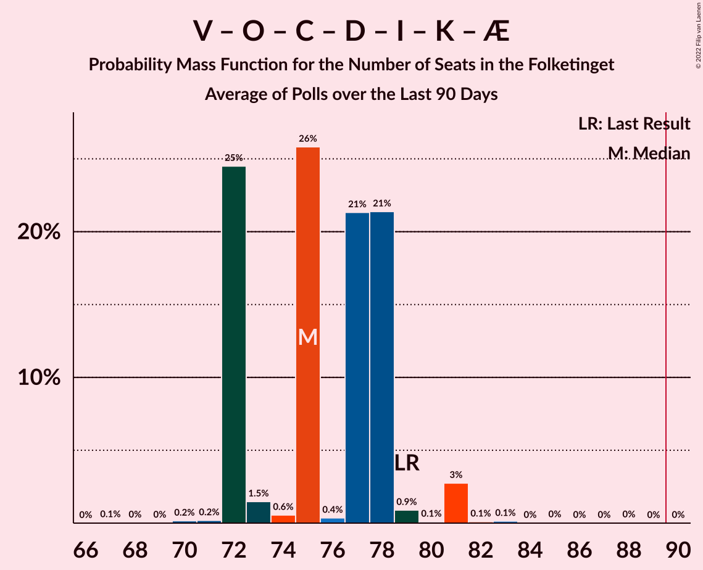
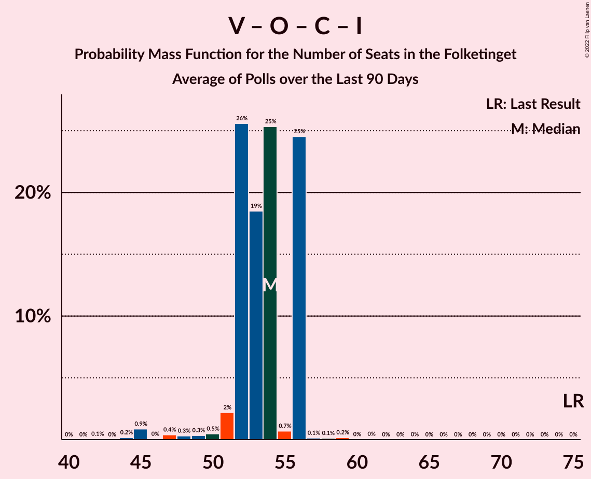

# Poll Average

<a href="#voting-intentions">Voting Intentions</a> | <a href="#seats">Seats</a> | <a href="#coalitions">Coalitions</a> | <a href="#technical-information">Technical Information</a>

## Summary

The table below lists the polls on which the average is based. They are the most recent polls (less than 90 days old) registered and analyzed so far.

| Period     | Polling firm/Commissioner(s) | A | V | O | B | F | Ø | C | Å | D | I | P | K | E | G | Q | Æ | M |
|:----------:|:----------------------------:|:--:|:--:|:--:|:--:|:--:|:--:|:--:|:--:|:--:|:--:|:--:|:--:|:--:|:--:|:--:|:--:|:--:|
| 5 June 2019 | General Election | 25.9%   48 | 23.4%   43 | 8.7%   16 | 8.6%   16 | 7.7%   14 | 6.9%   13 | 6.6%   12 | 3.0%   5 | 2.4%   4 | 2.3%   4 | 1.8%   0 | 1.7%   0 | 0.8%   0 | 0.0%   0 | 0.0%   0 | 0.0%   0 | 0.0%   0 |
| N/A | Poll Average | 24–32%   44–54 | 10–16%   19–27 | 2–4%   0–7 | 3–6%   6–11 | 7–10%   13–18 | 4–8%   10–14 | 8–12%   14–21 | 1–3%   0–5 | 3–6%   6–12 | 4–7%   7–12 | N/A   N/A | 0–2%   0 | N/A   N/A | N/A   N/A | 0–1%   0 | 7–12%   13–18 | 4–8%   8–14 |
| [13 October 2022](2022-10-13-Epinion.html) | Epinion   DR | 24–28%   43–50 | 12–14%   22–26 | 2–3%   0–6 | 4–6%   8–11 | 7–9%   13–16 | 6–8%   10–13 | 8–10%   14–17 | 2–3%   0–5 | 5–7%   9–12 | 5–7%   9–12 | N/A   N/A | 0–1%   0 | N/A   N/A | N/A   N/A | 0–1%   0 | 7–9%   12–17 | 6–8%   11–13 |
| [10–12 October 2022](2022-10-12-Voxmeter.html) | Voxmeter | 25–30%   46–52 | 12–17%   21–26 | 2–3%   0–5 | 3–6%   6–9 | 6–10%   13–17 | 6–9%   11–15 | 7–11%   14–19 | 2–3%   0–5 | 3–5%   6–8 | 4–7%   8–12 | N/A   N/A | 0–1%   0 | N/A   N/A | N/A   N/A | 0–2%   0 | 7–11%   14–18 | 5–8%   10–13 |
| [12 October 2022](2022-10-12-Gallup.html) | Gallup   Berlingske | 25–29%   44–52 | 11–14%   19–28 | 2–4%   4–7 | 4–6%   8–11 | 7–10%   13–17 | 5–7%   9–13 | 9–11%   15–21 | 1–2%   0–4 | 4–6%   7–10 | 5–7%   8–12 | N/A   N/A | 1–2%   0–4 | N/A   N/A | N/A   N/A | 0–1%   0 | 7–9%   13–17 | 5–7%   8–13 |
| [11 October 2022](2022-10-11-Yougov.html) | Yougov | 28–33%   54 | 9–12%   19 | 3–5%   6 | 3–6%   8 | 7–10%   15 | 4–6%   10 | 9–12%   17 | 1–3%   0 | 3–6%   8 | 4–7%   12 | N/A   N/A | 0%   0 | N/A   N/A | N/A   N/A | 0–1%   0 | 9–12%   18 | 3–6%   8 |
| [7–9 October 2022](2022-10-09-Megafon.html) | Megafon   Politiken and TV | 24–29%   41–49 | 11–15%   19–27 | 2–3%   0–6 | 3–6%   6–11 | 7–11%   12–22 | 5–8%   8–15 | 9–13%   15–22 | 1–2%   0–4 | 3–6%   6–10 | 4–7%   7–11 | N/A   N/A | 0–1%   0 | N/A   N/A | N/A   N/A | 0–1%   0 | 8–12%   15–19 | 5–8%   9–15 |
| 5 June 2019 | General Election | 25.9%   48 | 23.4%   43 | 8.7%   16 | 8.6%   16 | 7.7%   14 | 6.9%   13 | 6.6%   12 | 3.0%   5 | 2.4%   4 | 2.3%   4 | 1.8%   0 | 1.7%   0 | 0.8%   0 | 0.0%   0 | 0.0%   0 | 0.0%   0 | 0.0%   0 |

Only polls for which at least the sample size has been published are included in the table above.

**Legend:**
+ **Top half of each row:** Voting intentions (95% confidence interval)
+ **Bottom half of each row:** Seat projections for the Folketinget (95% confidence interval)
+ **A:** Socialdemokraterne
+ **V:** Venstre
+ **O:** Dansk Folkeparti
+ **B:** Radikale Venstre
+ **F:** Socialistisk Folkeparti
+ **Ø:** Enhedslisten–De Rød-Grønne
+ **C:** Det Konservative Folkeparti
+ **Å:** Alternativet
+ **D:** Nye Borgerlige
+ **I:** Liberal Alliance
+ **P:** Stram Kurs
+ **K:** Kristendemokraterne
+ **E:** Borgerlisten
+ **G:** Veganerpartiet
+ **Q:** Frie Grønne
+ **Æ:** Danmarksdemokraterne
+ **M:** Moderaterne
+ **N/A (single party):** Party not included the published results
+ **N/A (entire row):** Calculation for this opinion poll not started yet

## Voting Intentions

### Confidence Intervals

| Party | Last Result | Median | 80% Confidence Interval | 90% Confidence Interval | 95% Confidence Interval | 99% Confidence Interval |
|:-----:|:-----------:|:------:|:-----------------------:|:-----------------------:|:-----------------------:|:-----------------------:|
| <a href="#socialdemokraterne">Socialdemokraterne</a> | 25.9% | 27.2% | 25.2–30.7% |24.7–31.5% | 24.3–32.1% | 23.4–33.2% |
| <a href="#venstre">Venstre</a> | 23.4% | 12.9% | 10.5–14.6% |9.9–15.2% | 9.5–15.7% | 8.9–16.6% |
| <a href="#dansk-folkeparti">Dansk Folkeparti</a> | 8.7% | 2.7% | 2.0–3.6% |1.9–3.9% | 1.7–4.1% | 1.5–4.5% |
| <a href="#radikale-venstre">Radikale Venstre</a> | 8.6% | 4.7% | 3.8–5.5% |3.5–5.7% | 3.4–5.9% | 3.0–6.3% |
| <a href="#socialistisk-folkeparti">Socialistisk Folkeparti</a> | 7.7% | 8.3% | 7.4–9.4% |7.1–9.7% | 6.8–10.0% | 6.3–10.7% |
| <a href="#enhedslisten–de-rød-grønne">Enhedslisten–De Rød-Grønne</a> | 6.9% | 6.4% | 5.1–7.6% |4.7–8.0% | 4.5–8.3% | 4.0–9.0% |
| <a href="#det-konservative-folkeparti">Det Konservative Folkeparti</a> | 6.6% | 9.7% | 8.3–11.2% |8.0–11.6% | 7.7–12.0% | 7.3–12.7% |
| <a href="#alternativet">Alternativet</a> | 3.0% | 1.9% | 1.2–2.7% |1.0–2.9% | 0.9–3.1% | 0.7–3.5% |
| <a href="#nye-borgerlige">Nye Borgerlige</a> | 2.4% | 4.5% | 3.6–6.0% |3.4–6.2% | 3.2–6.5% | 2.8–6.9% |
| <a href="#liberal-alliance">Liberal Alliance</a> | 2.3% | 5.5% | 4.6–6.3% |4.4–6.5% | 4.1–6.7% | 3.7–7.2% |
| <a href="#stram-kurs">Stram Kurs</a> | 1.8% | N/A | N/A |N/A | N/A | N/A |
| <a href="#kristendemokraterne">Kristendemokraterne</a> | 1.7% | 0.6% | 0.1–1.5% |0.1–1.6% | 0.1–1.8% | 0.0–2.0% |
| <a href="#borgerlisten">Borgerlisten</a> | 0.8% | N/A | N/A |N/A | N/A | N/A |
| <a href="#veganerpartiet">Veganerpartiet</a> | 0.0% | N/A | N/A |N/A | N/A | N/A |
| <a href="#frie-grønne">Frie Grønne</a> | 0.0% | 0.7% | 0.4–1.0% |0.4–1.2% | 0.3–1.3% | 0.2–1.6% |
| <a href="#danmarksdemokraterne">Danmarksdemokraterne</a> | 0.0% | 8.9% | 7.6–11.1% |7.3–11.5% | 7.1–11.9% | 6.8–12.6% |
| <a href="#moderaterne">Moderaterne</a> | 0.0% | 6.0% | 4.4–7.3% |4.1–7.6% | 3.8–7.8% | 3.4–8.3% |

### Socialdemokraterne

*For a full overview of the results for this party, see the [Socialdemokraterne](party-socialdemokraterne.html) page.*

| Voting Intentions | Probability | Accumulated | Special Marks |
|:-----------------:|:-----------:|:-----------:|:-------------:|
| 20.5–21.5% | 0% | 100% |  |
| 21.5–22.5% | 0.1% | 100% |  |
| 22.5–23.5% | 0.5% | 99.9% |  |
| 23.5–24.5% | 3% | 99.4% |  |
| 24.5–25.5% | 12% | 96% |  |
| 25.5–26.5% | 21% | 85% | Last Result |
| 26.5–27.5% | 21% | 63% | Median |
| 27.5–28.5% | 15% | 42% |  |
| 28.5–29.5% | 9% | 27% |  |
| 29.5–30.5% | 7% | 18% |  |
| 30.5–31.5% | 6% | 11% |  |
| 31.5–32.5% | 3% | 5% |  |
| 32.5–33.5% | 1.1% | 1.4% |  |
| 33.5–34.5% | 0.2% | 0.3% |  |
| 34.5–35.5% | 0% | 0% |  |

### Venstre

*For a full overview of the results for this party, see the [Venstre](party-venstre.html) page.*

| Voting Intentions | Probability | Accumulated | Special Marks |
|:-----------------:|:-----------:|:-----------:|:-------------:|
| 6.5–7.5% | 0% | 100% |  |
| 7.5–8.5% | 0.2% | 100% |  |
| 8.5–9.5% | 2% | 99.8% |  |
| 9.5–10.5% | 8% | 97% |  |
| 10.5–11.5% | 10% | 89% |  |
| 11.5–12.5% | 19% | 80% |  |
| 12.5–13.5% | 32% | 60% | Median |
| 13.5–14.5% | 18% | 28% |  |
| 14.5–15.5% | 7% | 10% |  |
| 15.5–16.5% | 3% | 3% |  |
| 16.5–17.5% | 0.5% | 0.6% |  |
| 17.5–18.5% | 0.1% | 0.1% |  |
| 18.5–19.5% | 0% | 0% |  |
| 19.5–20.5% | 0% | 0% |  |
| 20.5–21.5% | 0% | 0% |  |
| 21.5–22.5% | 0% | 0% |  |
| 22.5–23.5% | 0% | 0% | Last Result |

### Dansk Folkeparti

*For a full overview of the results for this party, see the [Dansk Folkeparti](party-danskfolkeparti.html) page.*

| Voting Intentions | Probability | Accumulated | Special Marks |
|:-----------------:|:-----------:|:-----------:|:-------------:|
| 0.0–0.5% | 0% | 100% |  |
| 0.5–1.5% | 0.8% | 100% |  |
| 1.5–2.5% | 40% | 99.2% |  |
| 2.5–3.5% | 47% | 59% | Median |
| 3.5–4.5% | 12% | 12% |  |
| 4.5–5.5% | 0.5% | 0.5% |  |
| 5.5–6.5% | 0% | 0% |  |
| 6.5–7.5% | 0% | 0% |  |
| 7.5–8.5% | 0% | 0% |  |
| 8.5–9.5% | 0% | 0% | Last Result |

### Radikale Venstre

*For a full overview of the results for this party, see the [Radikale Venstre](party-radikalevenstre.html) page.*

| Voting Intentions | Probability | Accumulated | Special Marks |
|:-----------------:|:-----------:|:-----------:|:-------------:|
| 1.5–2.5% | 0% | 100% |  |
| 2.5–3.5% | 5% | 100% |  |
| 3.5–4.5% | 39% | 95% |  |
| 4.5–5.5% | 48% | 56% | Median |
| 5.5–6.5% | 8% | 8% |  |
| 6.5–7.5% | 0.1% | 0.1% |  |
| 7.5–8.5% | 0% | 0% |  |
| 8.5–9.5% | 0% | 0% | Last Result |

### Socialistisk Folkeparti

*For a full overview of the results for this party, see the [Socialistisk Folkeparti](party-socialistiskfolkeparti.html) page.*

| Voting Intentions | Probability | Accumulated | Special Marks |
|:-----------------:|:-----------:|:-----------:|:-------------:|
| 4.5–5.5% | 0% | 100% |  |
| 5.5–6.5% | 1.2% | 100% |  |
| 6.5–7.5% | 13% | 98.8% |  |
| 7.5–8.5% | 46% | 85% | Last Result, Median |
| 8.5–9.5% | 33% | 40% |  |
| 9.5–10.5% | 6% | 7% |  |
| 10.5–11.5% | 0.7% | 0.7% |  |
| 11.5–12.5% | 0% | 0% |  |
| 12.5–13.5% | 0% | 0% |  |

### Enhedslisten–De Rød-Grønne

*For a full overview of the results for this party, see the [Enhedslisten–De Rød-Grønne](party-enhedslisten–derød-grønne.html) page.*

| Voting Intentions | Probability | Accumulated | Special Marks |
|:-----------------:|:-----------:|:-----------:|:-------------:|
| 2.5–3.5% | 0% | 100% |  |
| 3.5–4.5% | 3% | 100% |  |
| 4.5–5.5% | 16% | 97% |  |
| 5.5–6.5% | 39% | 81% | Median |
| 6.5–7.5% | 32% | 42% | Last Result |
| 7.5–8.5% | 9% | 11% |  |
| 8.5–9.5% | 1.4% | 2% |  |
| 9.5–10.5% | 0.1% | 0.1% |  |
| 10.5–11.5% | 0% | 0% |  |

### Det Konservative Folkeparti

*For a full overview of the results for this party, see the [Det Konservative Folkeparti](party-detkonservativefolkeparti.html) page.*

| Voting Intentions | Probability | Accumulated | Special Marks |
|:-----------------:|:-----------:|:-----------:|:-------------:|
| 5.5–6.5% | 0% | 100% |  |
| 6.5–7.5% | 1.3% | 100% | Last Result |
| 7.5–8.5% | 15% | 98.7% |  |
| 8.5–9.5% | 29% | 84% |  |
| 9.5–10.5% | 31% | 55% | Median |
| 10.5–11.5% | 18% | 24% |  |
| 11.5–12.5% | 5% | 5% |  |
| 12.5–13.5% | 0.7% | 0.7% |  |
| 13.5–14.5% | 0% | 0% |  |
| 14.5–15.5% | 0% | 0% |  |

### Alternativet

*For a full overview of the results for this party, see the [Alternativet](party-alternativet.html) page.*

| Voting Intentions | Probability | Accumulated | Special Marks |
|:-----------------:|:-----------:|:-----------:|:-------------:|
| 0.0–0.5% | 0.1% | 100% |  |
| 0.5–1.5% | 29% | 99.9% |  |
| 1.5–2.5% | 56% | 71% | Median |
| 2.5–3.5% | 15% | 15% | Last Result |
| 3.5–4.5% | 0.4% | 0.4% |  |
| 4.5–5.5% | 0% | 0% |  |

### Nye Borgerlige

*For a full overview of the results for this party, see the [Nye Borgerlige](party-nyeborgerlige.html) page.*

| Voting Intentions | Probability | Accumulated | Special Marks |
|:-----------------:|:-----------:|:-----------:|:-------------:|
| 1.5–2.5% | 0.1% | 100% | Last Result |
| 2.5–3.5% | 8% | 99.9% |  |
| 3.5–4.5% | 43% | 92% |  |
| 4.5–5.5% | 31% | 49% | Median |
| 5.5–6.5% | 16% | 18% |  |
| 6.5–7.5% | 2% | 2% |  |
| 7.5–8.5% | 0% | 0% |  |

### Liberal Alliance

*For a full overview of the results for this party, see the [Liberal Alliance](party-liberalalliance.html) page.*

| Voting Intentions | Probability | Accumulated | Special Marks |
|:-----------------:|:-----------:|:-----------:|:-------------:|
| 1.5–2.5% | 0% | 100% | Last Result |
| 2.5–3.5% | 0.2% | 100% |  |
| 3.5–4.5% | 9% | 99.8% |  |
| 4.5–5.5% | 45% | 91% | Median |
| 5.5–6.5% | 42% | 46% |  |
| 6.5–7.5% | 4% | 4% |  |
| 7.5–8.5% | 0.1% | 0.1% |  |
| 8.5–9.5% | 0% | 0% |  |

### Kristendemokraterne

*For a full overview of the results for this party, see the [Kristendemokraterne](party-kristendemokraterne.html) page.*

| Voting Intentions | Probability | Accumulated | Special Marks |
|:-----------------:|:-----------:|:-----------:|:-------------:|
| 0.0–0.5% | 46% | 100% |  |
| 0.5–1.5% | 47% | 54% | Median |
| 1.5–2.5% | 7% | 7% | Last Result |
| 2.5–3.5% | 0% | 0% |  |

### Moderaterne

*For a full overview of the results for this party, see the [Moderaterne](party-moderaterne.html) page.*

| Voting Intentions | Probability | Accumulated | Special Marks |
|:-----------------:|:-----------:|:-----------:|:-------------:|
| 0.0–0.5% | 0% | 100% | Last Result |
| 0.5–1.5% | 0% | 100% |  |
| 1.5–2.5% | 0% | 100% |  |
| 2.5–3.5% | 0.9% | 100% |  |
| 3.5–4.5% | 11% | 99.1% |  |
| 4.5–5.5% | 23% | 88% |  |
| 5.5–6.5% | 33% | 65% | Median |
| 6.5–7.5% | 27% | 32% |  |
| 7.5–8.5% | 5% | 5% |  |
| 8.5–9.5% | 0.2% | 0.2% |  |
| 9.5–10.5% | 0% | 0% |  |

### Frie Grønne

*For a full overview of the results for this party, see the [Frie Grønne](party-friegrønne.html) page.*

| Voting Intentions | Probability | Accumulated | Special Marks |
|:-----------------:|:-----------:|:-----------:|:-------------:|
| 0.0–0.5% | 27% | 100% | Last Result |
| 0.5–1.5% | 73% | 73% | Median |
| 1.5–2.5% | 0.6% | 0.6% |  |
| 2.5–3.5% | 0% | 0% |  |

### Danmarksdemokraterne

*For a full overview of the results for this party, see the [Danmarksdemokraterne](party-danmarksdemokraterne.html) page.*

| Voting Intentions | Probability | Accumulated | Special Marks |
|:-----------------:|:-----------:|:-----------:|:-------------:|
| 0.0–0.5% | 0% | 100% | Last Result |
| 0.5–1.5% | 0% | 100% |  |
| 1.5–2.5% | 0% | 100% |  |
| 2.5–3.5% | 0% | 100% |  |
| 3.5–4.5% | 0% | 100% |  |
| 4.5–5.5% | 0% | 100% |  |
| 5.5–6.5% | 0.2% | 100% |  |
| 6.5–7.5% | 9% | 99.8% |  |
| 7.5–8.5% | 32% | 91% |  |
| 8.5–9.5% | 22% | 59% | Median |
| 9.5–10.5% | 19% | 37% |  |
| 10.5–11.5% | 14% | 19% |  |
| 11.5–12.5% | 4% | 5% |  |
| 12.5–13.5% | 0.5% | 0.6% |  |
| 13.5–14.5% | 0% | 0% |  |

## Seats

### Confidence Intervals

| Party | Last Result | Median | 80% Confidence Interval | 90% Confidence Interval | 95% Confidence Interval | 99% Confidence Interval |
|:-----:|:-----------:|:------:|:-----------------------:|:-----------------------:|:-----------------------:|:-----------------------:|
| <a href="#socialdemokraterne">Socialdemokraterne</a> | 48 | 48 | 45–54 |44–54 | 44–54 | 41–55 |
| <a href="#venstre">Venstre</a> | 43 | 23 | 19–26 |19–27 | 19–27 | 19–28 |
| <a href="#dansk-folkeparti">Dansk Folkeparti</a> | 16 | 4 | 0–6 |0–7 | 0–7 | 0–7 |
| <a href="#radikale-venstre">Radikale Venstre</a> | 16 | 8 | 7–10 |7–11 | 6–11 | 6–11 |
| <a href="#socialistisk-folkeparti">Socialistisk Folkeparti</a> | 14 | 15 | 14–16 |14–17 | 13–18 | 12–22 |
| <a href="#enhedslisten–de-rød-grønne">Enhedslisten–De Rød-Grønne</a> | 13 | 11 | 10–14 |10–14 | 10–14 | 8–15 |
| <a href="#det-konservative-folkeparti">Det Konservative Folkeparti</a> | 12 | 17 | 15–19 |14–21 | 14–21 | 13–22 |
| <a href="#alternativet">Alternativet</a> | 5 | 0 | 0–4 |0–4 | 0–5 | 0–6 |
| <a href="#nye-borgerlige">Nye Borgerlige</a> | 4 | 8 | 7–11 |7–11 | 6–12 | 5–12 |
| <a href="#liberal-alliance">Liberal Alliance</a> | 4 | 10 | 8–12 |8–12 | 7–12 | 7–12 |
| <a href="#stram-kurs">Stram Kurs</a> | 0 | N/A | N/A |N/A | N/A | N/A |
| <a href="#kristendemokraterne">Kristendemokraterne</a> | 0 | 0 | 0 |0 | 0 | 0–4 |
| <a href="#borgerlisten">Borgerlisten</a> | 0 | N/A | N/A |N/A | N/A | N/A |
| <a href="#veganerpartiet">Veganerpartiet</a> | 0 | N/A | N/A |N/A | N/A | N/A |
| <a href="#frie-grønne">Frie Grønne</a> | 0 | 0 | 0 |0 | 0 | 0 |
| <a href="#danmarksdemokraterne">Danmarksdemokraterne</a> | 0 | 17 | 14–18 |14–18 | 13–18 | 12–19 |
| <a href="#moderaterne">Moderaterne</a> | 0 | 12 | 8–13 |8–13 | 8–14 | 8–15 |

### Socialdemokraterne

*For a full overview of the results for this party, see the [Socialdemokraterne](party-socialdemokraterne.html) page.*

| Number of Seats | Probability | Accumulated | Special Marks |
|:---------------:|:-----------:|:-----------:|:-------------:|
| 38 | 0.2% | 100% |  |
| 39 | 0% | 99.8% |  |
| 40 | 0.1% | 99.8% |  |
| 41 | 0.6% | 99.7% |  |
| 42 | 0.2% | 99.1% |  |
| 43 | 0.8% | 98.8% |  |
| 44 | 5% | 98% |  |
| 45 | 8% | 93% |  |
| 46 | 18% | 85% |  |
| 47 | 9% | 67% |  |
| 48 | 10% | 58% | Last Result, Median |
| 49 | 16% | 48% |  |
| 50 | 9% | 32% |  |
| 51 | 2% | 23% |  |
| 52 | 0.5% | 21% |  |
| 53 | 0% | 21% |  |
| 54 | 20% | 21% |  |
| 55 | 0.3% | 0.5% |  |
| 56 | 0% | 0.2% |  |
| 57 | 0% | 0.2% |  |
| 58 | 0.2% | 0.2% |  |
| 59 | 0% | 0% |  |

### Venstre

*For a full overview of the results for this party, see the [Venstre](party-venstre.html) page.*

| Number of Seats | Probability | Accumulated | Special Marks |
|:---------------:|:-----------:|:-----------:|:-------------:|
| 17 | 0% | 100% |  |
| 18 | 0.1% | 99.9% |  |
| 19 | 26% | 99.8% |  |
| 20 | 0.5% | 74% |  |
| 21 | 4% | 74% |  |
| 22 | 11% | 70% |  |
| 23 | 23% | 59% | Median |
| 24 | 5% | 36% |  |
| 25 | 5% | 31% |  |
| 26 | 18% | 26% |  |
| 27 | 7% | 8% |  |
| 28 | 1.0% | 1.3% |  |
| 29 | 0.1% | 0.3% |  |
| 30 | 0.1% | 0.2% |  |
| 31 | 0% | 0.1% |  |
| 32 | 0.1% | 0.1% |  |
| 33 | 0% | 0% |  |
| 34 | 0% | 0% |  |
| 35 | 0% | 0% |  |
| 36 | 0% | 0% |  |
| 37 | 0% | 0% |  |
| 38 | 0% | 0% |  |
| 39 | 0% | 0% |  |
| 40 | 0% | 0% |  |
| 41 | 0% | 0% |  |
| 42 | 0% | 0% |  |
| 43 | 0% | 0% | Last Result |

### Dansk Folkeparti

*For a full overview of the results for this party, see the [Dansk Folkeparti](party-danskfolkeparti.html) page.*

| Number of Seats | Probability | Accumulated | Special Marks |
|:---------------:|:-----------:|:-----------:|:-------------:|
| 0 | 24% | 100% |  |
| 1 | 0% | 76% |  |
| 2 | 0% | 76% |  |
| 3 | 0% | 76% |  |
| 4 | 31% | 76% | Median |
| 5 | 11% | 45% |  |
| 6 | 28% | 34% |  |
| 7 | 5% | 5% |  |
| 8 | 0.1% | 0.1% |  |
| 9 | 0% | 0% |  |
| 10 | 0% | 0% |  |
| 11 | 0% | 0% |  |
| 12 | 0% | 0% |  |
| 13 | 0% | 0% |  |
| 14 | 0% | 0% |  |
| 15 | 0% | 0% |  |
| 16 | 0% | 0% | Last Result |

### Radikale Venstre

*For a full overview of the results for this party, see the [Radikale Venstre](party-radikalevenstre.html) page.*

| Number of Seats | Probability | Accumulated | Special Marks |
|:---------------:|:-----------:|:-----------:|:-------------:|
| 5 | 0.1% | 100% |  |
| 6 | 3% | 99.8% |  |
| 7 | 20% | 97% |  |
| 8 | 43% | 77% | Median |
| 9 | 22% | 34% |  |
| 10 | 5% | 12% |  |
| 11 | 6% | 6% |  |
| 12 | 0.1% | 0.4% |  |
| 13 | 0.3% | 0.3% |  |
| 14 | 0% | 0% |  |
| 15 | 0% | 0% |  |
| 16 | 0% | 0% | Last Result |

### Socialistisk Folkeparti

*For a full overview of the results for this party, see the [Socialistisk Folkeparti](party-socialistiskfolkeparti.html) page.*

| Number of Seats | Probability | Accumulated | Special Marks |
|:---------------:|:-----------:|:-----------:|:-------------:|
| 11 | 0.1% | 100% |  |
| 12 | 1.3% | 99.9% |  |
| 13 | 3% | 98.5% |  |
| 14 | 14% | 96% | Last Result |
| 15 | 60% | 82% | Median |
| 16 | 17% | 22% |  |
| 17 | 2% | 6% |  |
| 18 | 2% | 3% |  |
| 19 | 0.2% | 2% |  |
| 20 | 0.1% | 1.4% |  |
| 21 | 0% | 1.3% |  |
| 22 | 1.3% | 1.3% |  |
| 23 | 0% | 0% |  |

### Enhedslisten–De Rød-Grønne

*For a full overview of the results for this party, see the [Enhedslisten–De Rød-Grønne](party-enhedslisten–derød-grønne.html) page.*

| Number of Seats | Probability | Accumulated | Special Marks |
|:---------------:|:-----------:|:-----------:|:-------------:|
| 8 | 0.6% | 100% |  |
| 9 | 0.9% | 99.4% |  |
| 10 | 37% | 98% |  |
| 11 | 20% | 62% | Median |
| 12 | 11% | 42% |  |
| 13 | 12% | 31% | Last Result |
| 14 | 17% | 19% |  |
| 15 | 2% | 2% |  |
| 16 | 0.1% | 0.2% |  |
| 17 | 0.1% | 0.1% |  |
| 18 | 0% | 0% |  |

### Det Konservative Folkeparti

*For a full overview of the results for this party, see the [Det Konservative Folkeparti](party-detkonservativefolkeparti.html) page.*

| Number of Seats | Probability | Accumulated | Special Marks |
|:---------------:|:-----------:|:-----------:|:-------------:|
| 12 | 0% | 100% | Last Result |
| 13 | 0.6% | 100% |  |
| 14 | 5% | 99.4% |  |
| 15 | 15% | 94% |  |
| 16 | 9% | 79% |  |
| 17 | 47% | 70% | Median |
| 18 | 10% | 23% |  |
| 19 | 8% | 13% |  |
| 20 | 0.7% | 6% |  |
| 21 | 4% | 5% |  |
| 22 | 0.9% | 1.0% |  |
| 23 | 0.1% | 0.1% |  |
| 24 | 0% | 0% |  |

### Alternativet

*For a full overview of the results for this party, see the [Alternativet](party-alternativet.html) page.*

| Number of Seats | Probability | Accumulated | Special Marks |
|:---------------:|:-----------:|:-----------:|:-------------:|
| 0 | 53% | 100% | Median |
| 1 | 0% | 47% |  |
| 2 | 0% | 47% |  |
| 3 | 0% | 47% |  |
| 4 | 43% | 47% |  |
| 5 | 4% | 4% | Last Result |
| 6 | 0.6% | 0.7% |  |
| 7 | 0.2% | 0.2% |  |
| 8 | 0% | 0% |  |

### Nye Borgerlige

*For a full overview of the results for this party, see the [Nye Borgerlige](party-nyeborgerlige.html) page.*

| Number of Seats | Probability | Accumulated | Special Marks |
|:---------------:|:-----------:|:-----------:|:-------------:|
| 4 | 0% | 100% | Last Result |
| 5 | 0.5% | 100% |  |
| 6 | 2% | 99.4% |  |
| 7 | 7% | 97% |  |
| 8 | 54% | 90% | Median |
| 9 | 14% | 36% |  |
| 10 | 10% | 22% |  |
| 11 | 7% | 12% |  |
| 12 | 4% | 4% |  |
| 13 | 0.1% | 0.2% |  |
| 14 | 0% | 0% |  |

### Liberal Alliance

*For a full overview of the results for this party, see the [Liberal Alliance](party-liberalalliance.html) page.*

| Number of Seats | Probability | Accumulated | Special Marks |
|:---------------:|:-----------:|:-----------:|:-------------:|
| 4 | 0% | 100% | Last Result |
| 5 | 0% | 100% |  |
| 6 | 0.1% | 100% |  |
| 7 | 3% | 99.9% |  |
| 8 | 28% | 97% |  |
| 9 | 5% | 69% |  |
| 10 | 22% | 64% | Median |
| 11 | 20% | 42% |  |
| 12 | 22% | 22% |  |
| 13 | 0.3% | 0.3% |  |
| 14 | 0% | 0% |  |

### Stram Kurs

*For a full overview of the results for this party, see the [Stram Kurs](party-stramkurs.html) page.*

### Kristendemokraterne

*For a full overview of the results for this party, see the [Kristendemokraterne](party-kristendemokraterne.html) page.*

| Number of Seats | Probability | Accumulated | Special Marks |
|:---------------:|:-----------:|:-----------:|:-------------:|
| 0 | 98.5% | 100% | Last Result, Median |
| 1 | 0% | 1.5% |  |
| 2 | 0% | 1.5% |  |
| 3 | 0% | 1.5% |  |
| 4 | 1.5% | 1.5% |  |
| 5 | 0% | 0% |  |

### Borgerlisten

*For a full overview of the results for this party, see the [Borgerlisten](party-borgerlisten.html) page.*

### Veganerpartiet

*For a full overview of the results for this party, see the [Veganerpartiet](party-veganerpartiet.html) page.*

### Frie Grønne

*For a full overview of the results for this party, see the [Frie Grønne](party-friegrønne.html) page.*

| Number of Seats | Probability | Accumulated | Special Marks |
|:---------------:|:-----------:|:-----------:|:-------------:|
| 0 | 100% | 100% | Last Result, Median |

### Danmarksdemokraterne

*For a full overview of the results for this party, see the [Danmarksdemokraterne](party-danmarksdemokraterne.html) page.*

| Number of Seats | Probability | Accumulated | Special Marks |
|:---------------:|:-----------:|:-----------:|:-------------:|
| 0 | 0% | 100% | Last Result |
| 1 | 0% | 100% |  |
| 2 | 0% | 100% |  |
| 3 | 0% | 100% |  |
| 4 | 0% | 100% |  |
| 5 | 0% | 100% |  |
| 6 | 0% | 100% |  |
| 7 | 0% | 100% |  |
| 8 | 0% | 100% |  |
| 9 | 0% | 100% |  |
| 10 | 0% | 100% |  |
| 11 | 0.1% | 100% |  |
| 12 | 1.3% | 99.9% |  |
| 13 | 3% | 98.7% |  |
| 14 | 15% | 95% |  |
| 15 | 11% | 81% |  |
| 16 | 14% | 70% |  |
| 17 | 17% | 56% | Median |
| 18 | 37% | 39% |  |
| 19 | 0.7% | 1.2% |  |
| 20 | 0.2% | 0.5% |  |
| 21 | 0.1% | 0.3% |  |
| 22 | 0.2% | 0.2% |  |
| 23 | 0% | 0% |  |

### Moderaterne

*For a full overview of the results for this party, see the [Moderaterne](party-moderaterne.html) page.*

| Number of Seats | Probability | Accumulated | Special Marks |
|:---------------:|:-----------:|:-----------:|:-------------:|
| 0 | 0% | 100% | Last Result |
| 1 | 0% | 100% |  |
| 2 | 0% | 100% |  |
| 3 | 0% | 100% |  |
| 4 | 0% | 100% |  |
| 5 | 0% | 100% |  |
| 6 | 0.2% | 100% |  |
| 7 | 0.1% | 99.8% |  |
| 8 | 22% | 99.7% |  |
| 9 | 7% | 78% |  |
| 10 | 5% | 71% |  |
| 11 | 15% | 66% |  |
| 12 | 30% | 51% | Median |
| 13 | 17% | 21% |  |
| 14 | 3% | 4% |  |
| 15 | 1.0% | 1.1% |  |
| 16 | 0% | 0.1% |  |
| 17 | 0.1% | 0.1% |  |
| 18 | 0% | 0% |  |

## Coalitions

### Confidence Intervals

| Coalition | Last Result | Median | Majority? | 80% Confidence Interval | 90% Confidence Interval | 95% Confidence Interval | 99% Confidence Interval |
|:---------:|:-----------:|:------:|:---------:|:-----------------------:|:-----------------------:|:-----------------------:|:-----------------------:|
| Venstre – Dansk Folkeparti – Det Konservative Folkeparti – Nye Borgerlige – Liberal Alliance – Kristendemokraterne – Borgerlisten – Danmarksdemokraterne – Moderaterne | 79 | 89 | 38% | 87–93 | 87–93 | 86–95 | 82–100 |
| Socialdemokraterne – Radikale Venstre – Socialistisk Folkeparti – Enhedslisten–De Rød-Grønne – Alternativet | 96 | 86 | 2% | 82–88 | 82–88 | 80–89 | 75–93 |
| Socialdemokraterne – Radikale Venstre – Socialistisk Folkeparti – Enhedslisten–De Rød-Grønne | 91 | 84 | 0.6% | 81–87 | 79–87 | 78–87 | 75–90 |
| Venstre – Dansk Folkeparti – Det Konservative Folkeparti – Nye Borgerlige – Liberal Alliance – Kristendemokraterne – Danmarksdemokraterne | 79 | 79 | 0% | 75–81 | 74–84 | 74–84 | 71–86 |
| Socialdemokraterne – Socialistisk Folkeparti – Enhedslisten–De Rød-Grønne – Alternativet | 80 | 79 | 0% | 73–80 | 73–80 | 72–80 | 69–84 |
| Venstre – Dansk Folkeparti – Det Konservative Folkeparti – Nye Borgerlige – Liberal Alliance – Kristendemokraterne – Borgerlisten – Moderaterne | 79 | 72 | 0% | 70–78 | 70–78 | 70–79 | 67–82 |
| Socialdemokraterne – Socialistisk Folkeparti – Enhedslisten–De Rød-Grønne | 75 | 75 | 0% | 73–79 | 70–79 | 69–79 | 69–82 |
| Socialdemokraterne – Radikale Venstre – Socialistisk Folkeparti | 78 | 72 | 0% | 68–77 | 68–77 | 67–77 | 65–78 |
| Venstre – Dansk Folkeparti – Det Konservative Folkeparti – Nye Borgerlige – Liberal Alliance – Stram Kurs – Kristendemokraterne – Borgerlisten | 79 | 62 | 0% | 58–67 | 58–68 | 58–68 | 56–70 |
| Venstre – Dansk Folkeparti – Det Konservative Folkeparti – Nye Borgerlige – Liberal Alliance – Kristendemokraterne – Borgerlisten | 79 | 62 | 0% | 58–67 | 58–68 | 58–68 | 56–70 |
| Venstre – Dansk Folkeparti – Det Konservative Folkeparti – Nye Borgerlige – Liberal Alliance – Borgerlisten | 79 | 62 | 0% | 58–65 | 58–68 | 58–68 | 56–69 |
| Venstre – Dansk Folkeparti – Det Konservative Folkeparti – Nye Borgerlige – Liberal Alliance – Kristendemokraterne | 79 | 62 | 0% | 58–67 | 58–68 | 58–68 | 56–70 |
| Venstre – Dansk Folkeparti – Det Konservative Folkeparti – Nye Borgerlige – Liberal Alliance | 79 | 62 | 0% | 58–65 | 58–68 | 58–68 | 56–69 |
| Socialdemokraterne – Radikale Venstre | 64 | 57 | 0% | 53–62 | 53–62 | 53–62 | 49–63 |
| Venstre – Dansk Folkeparti – Det Konservative Folkeparti – Liberal Alliance – Kristendemokraterne | 75 | 54 | 0% | 50–58 | 47–60 | 47–60 | 47–62 |
| Venstre – Dansk Folkeparti – Det Konservative Folkeparti – Liberal Alliance | 75 | 54 | 0% | 50–57 | 47–60 | 47–60 | 47–62 |
| Venstre – Det Konservative Folkeparti – Liberal Alliance | 59 | 49 | 0% | 47–52 | 46–54 | 46–54 | 45–57 |
| Venstre – Det Konservative Folkeparti | 55 | 40 | 0% | 36–44 | 35–44 | 35–44 | 35–48 |
| Venstre | 43 | 23 | 0% | 19–26 | 19–27 | 19–27 | 19–28 |

### Venstre – Dansk Folkeparti – Det Konservative Folkeparti – Nye Borgerlige – Liberal Alliance – Kristendemokraterne – Borgerlisten – Danmarksdemokraterne – Moderaterne

| Number of Seats | Probability | Accumulated | Special Marks |
|:---------------:|:-----------:|:-----------:|:-------------:|
| 79 | 0% | 100% | Last Result |
| 80 | 0.1% | 100% |  |
| 81 | 0.3% | 99.9% |  |
| 82 | 0.6% | 99.6% |  |
| 83 | 0.2% | 99.0% |  |
| 84 | 0.3% | 98.7% |  |
| 85 | 0.3% | 98% |  |
| 86 | 2% | 98% |  |
| 87 | 16% | 97% |  |
| 88 | 23% | 81% |  |
| 89 | 20% | 58% |  |
| 90 | 5% | 38% | Majority |
| 91 | 10% | 33% | Median |
| 92 | 10% | 23% |  |
| 93 | 10% | 13% |  |
| 94 | 1.1% | 4% |  |
| 95 | 0.7% | 3% |  |
| 96 | 0.4% | 2% |  |
| 97 | 0.7% | 2% |  |
| 98 | 0.1% | 0.9% |  |
| 99 | 0.1% | 0.7% |  |
| 100 | 0.6% | 0.6% |  |
| 101 | 0% | 0% |  |

### Socialdemokraterne – Radikale Venstre – Socialistisk Folkeparti – Enhedslisten–De Rød-Grønne – Alternativet

| Number of Seats | Probability | Accumulated | Special Marks |
|:---------------:|:-----------:|:-----------:|:-------------:|
| 75 | 0.6% | 100% |  |
| 76 | 0.1% | 99.4% |  |
| 77 | 0.1% | 99.3% |  |
| 78 | 0.7% | 99.1% |  |
| 79 | 0.4% | 98% |  |
| 80 | 0.7% | 98% |  |
| 81 | 1.1% | 97% |  |
| 82 | 10% | 96% | Median |
| 83 | 10% | 87% |  |
| 84 | 10% | 77% |  |
| 85 | 5% | 67% |  |
| 86 | 20% | 62% |  |
| 87 | 23% | 42% |  |
| 88 | 16% | 19% |  |
| 89 | 2% | 3% |  |
| 90 | 0.3% | 2% | Majority |
| 91 | 0.3% | 2% |  |
| 92 | 0.2% | 1.2% |  |
| 93 | 0.6% | 1.0% |  |
| 94 | 0.3% | 0.4% |  |
| 95 | 0.1% | 0.1% |  |
| 96 | 0% | 0% | Last Result |

### Socialdemokraterne – Radikale Venstre – Socialistisk Folkeparti – Enhedslisten–De Rød-Grønne

| Number of Seats | Probability | Accumulated | Special Marks |
|:---------------:|:-----------:|:-----------:|:-------------:|
| 75 | 0.6% | 100% |  |
| 76 | 0.1% | 99.4% |  |
| 77 | 0.4% | 99.2% |  |
| 78 | 3% | 98.9% |  |
| 79 | 1.0% | 96% |  |
| 80 | 4% | 95% |  |
| 81 | 5% | 91% |  |
| 82 | 24% | 86% | Median |
| 83 | 11% | 62% |  |
| 84 | 23% | 51% |  |
| 85 | 4% | 28% |  |
| 86 | 2% | 25% |  |
| 87 | 21% | 22% |  |
| 88 | 0.3% | 2% |  |
| 89 | 0.8% | 1.4% |  |
| 90 | 0.3% | 0.6% | Majority |
| 91 | 0.2% | 0.3% | Last Result |
| 92 | 0% | 0.1% |  |
| 93 | 0% | 0% |  |

### Venstre – Dansk Folkeparti – Det Konservative Folkeparti – Nye Borgerlige – Liberal Alliance – Kristendemokraterne – Danmarksdemokraterne

| Number of Seats | Probability | Accumulated | Special Marks |
|:---------------:|:-----------:|:-----------:|:-------------:|
| 68 | 0.1% | 100% |  |
| 69 | 0% | 99.9% |  |
| 70 | 0.4% | 99.9% |  |
| 71 | 0.5% | 99.5% |  |
| 72 | 0% | 99.0% |  |
| 73 | 0.3% | 98.9% |  |
| 74 | 6% | 98.6% |  |
| 75 | 7% | 92% |  |
| 76 | 7% | 85% |  |
| 77 | 20% | 78% |  |
| 78 | 4% | 58% |  |
| 79 | 6% | 55% | Last Result, Median |
| 80 | 28% | 48% |  |
| 81 | 11% | 21% |  |
| 82 | 4% | 10% |  |
| 83 | 0.2% | 5% |  |
| 84 | 3% | 5% |  |
| 85 | 0.9% | 2% |  |
| 86 | 0.9% | 1.1% |  |
| 87 | 0% | 0.3% |  |
| 88 | 0.2% | 0.2% |  |
| 89 | 0% | 0.1% |  |
| 90 | 0% | 0% | Majority |

### Socialdemokraterne – Socialistisk Folkeparti – Enhedslisten–De Rød-Grønne – Alternativet

| Number of Seats | Probability | Accumulated | Special Marks |
|:---------------:|:-----------:|:-----------:|:-------------:|
| 67 | 0.1% | 100% |  |
| 68 | 0% | 99.9% |  |
| 69 | 1.3% | 99.9% |  |
| 70 | 0.6% | 98.5% |  |
| 71 | 0.2% | 98% |  |
| 72 | 1.2% | 98% |  |
| 73 | 13% | 97% |  |
| 74 | 5% | 84% | Median |
| 75 | 11% | 79% |  |
| 76 | 2% | 68% |  |
| 77 | 6% | 67% |  |
| 78 | 4% | 61% |  |
| 79 | 44% | 57% |  |
| 80 | 11% | 13% | Last Result |
| 81 | 0.4% | 2% |  |
| 82 | 0.3% | 2% |  |
| 83 | 0.2% | 1.3% |  |
| 84 | 0.6% | 1.1% |  |
| 85 | 0.1% | 0.5% |  |
| 86 | 0.2% | 0.4% |  |
| 87 | 0.1% | 0.2% |  |
| 88 | 0.1% | 0.1% |  |
| 89 | 0% | 0% |  |

### Venstre – Dansk Folkeparti – Det Konservative Folkeparti – Nye Borgerlige – Liberal Alliance – Kristendemokraterne – Borgerlisten – Moderaterne

| Number of Seats | Probability | Accumulated | Special Marks |
|:---------------:|:-----------:|:-----------:|:-------------:|
| 65 | 0.1% | 100% |  |
| 66 | 0.3% | 99.9% |  |
| 67 | 0.7% | 99.6% |  |
| 68 | 0.5% | 98.8% |  |
| 69 | 0.1% | 98% |  |
| 70 | 25% | 98% |  |
| 71 | 21% | 73% |  |
| 72 | 5% | 52% |  |
| 73 | 5% | 47% |  |
| 74 | 7% | 41% | Median |
| 75 | 10% | 35% |  |
| 76 | 2% | 25% |  |
| 77 | 11% | 22% |  |
| 78 | 8% | 11% |  |
| 79 | 2% | 4% | Last Result |
| 80 | 1.0% | 2% |  |
| 81 | 0% | 1.0% |  |
| 82 | 0.8% | 0.9% |  |
| 83 | 0.1% | 0.2% |  |
| 84 | 0% | 0% |  |

### Socialdemokraterne – Socialistisk Folkeparti – Enhedslisten–De Rød-Grønne

| Number of Seats | Probability | Accumulated | Special Marks |
|:---------------:|:-----------:|:-----------:|:-------------:|
| 67 | 0.1% | 100% |  |
| 68 | 0% | 99.8% |  |
| 69 | 4% | 99.8% |  |
| 70 | 1.5% | 96% |  |
| 71 | 1.3% | 95% |  |
| 72 | 3% | 93% |  |
| 73 | 15% | 90% |  |
| 74 | 7% | 76% | Median |
| 75 | 32% | 69% | Last Result |
| 76 | 12% | 37% |  |
| 77 | 1.1% | 26% |  |
| 78 | 2% | 24% |  |
| 79 | 21% | 23% |  |
| 80 | 0.7% | 2% |  |
| 81 | 0.2% | 0.8% |  |
| 82 | 0.2% | 0.6% |  |
| 83 | 0.3% | 0.3% |  |
| 84 | 0% | 0% |  |

### Socialdemokraterne – Radikale Venstre – Socialistisk Folkeparti

| Number of Seats | Probability | Accumulated | Special Marks |
|:---------------:|:-----------:|:-----------:|:-------------:|
| 63 | 0% | 100% |  |
| 64 | 0.1% | 99.9% |  |
| 65 | 1.0% | 99.8% |  |
| 66 | 1.3% | 98.8% |  |
| 67 | 1.3% | 98% |  |
| 68 | 19% | 96% |  |
| 69 | 6% | 77% |  |
| 70 | 3% | 71% |  |
| 71 | 17% | 68% | Median |
| 72 | 6% | 52% |  |
| 73 | 17% | 46% |  |
| 74 | 4% | 29% |  |
| 75 | 3% | 24% |  |
| 76 | 0.4% | 21% |  |
| 77 | 20% | 21% |  |
| 78 | 0.4% | 0.8% | Last Result |
| 79 | 0.4% | 0.4% |  |
| 80 | 0% | 0.1% |  |
| 81 | 0% | 0% |  |

### Venstre – Dansk Folkeparti – Det Konservative Folkeparti – Nye Borgerlige – Liberal Alliance – Stram Kurs – Kristendemokraterne – Borgerlisten

| Number of Seats | Probability | Accumulated | Special Marks |
|:---------------:|:-----------:|:-----------:|:-------------:|
| 53 | 0.1% | 100% |  |
| 54 | 0% | 99.9% |  |
| 55 | 0.2% | 99.9% |  |
| 56 | 0.8% | 99.6% |  |
| 57 | 0.2% | 98.8% |  |
| 58 | 11% | 98.7% |  |
| 59 | 18% | 88% |  |
| 60 | 2% | 70% |  |
| 61 | 2% | 67% |  |
| 62 | 28% | 66% | Median |
| 63 | 2% | 38% |  |
| 64 | 13% | 36% |  |
| 65 | 12% | 23% |  |
| 66 | 0.9% | 11% |  |
| 67 | 0.7% | 10% |  |
| 68 | 8% | 9% |  |
| 69 | 1.1% | 2% |  |
| 70 | 0.2% | 0.5% |  |
| 71 | 0.2% | 0.3% |  |
| 72 | 0.1% | 0.1% |  |
| 73 | 0% | 0% |  |
| 74 | 0% | 0% |  |
| 75 | 0% | 0% |  |
| 76 | 0% | 0% |  |
| 77 | 0% | 0% |  |
| 78 | 0% | 0% |  |
| 79 | 0% | 0% | Last Result |

### Venstre – Dansk Folkeparti – Det Konservative Folkeparti – Nye Borgerlige – Liberal Alliance – Kristendemokraterne – Borgerlisten

| Number of Seats | Probability | Accumulated | Special Marks |
|:---------------:|:-----------:|:-----------:|:-------------:|
| 53 | 0.1% | 100% |  |
| 54 | 0% | 99.9% |  |
| 55 | 0.2% | 99.9% |  |
| 56 | 0.8% | 99.6% |  |
| 57 | 0.2% | 98.8% |  |
| 58 | 11% | 98.7% |  |
| 59 | 18% | 88% |  |
| 60 | 2% | 70% |  |
| 61 | 2% | 67% |  |
| 62 | 28% | 66% | Median |
| 63 | 2% | 38% |  |
| 64 | 13% | 36% |  |
| 65 | 12% | 23% |  |
| 66 | 0.9% | 11% |  |
| 67 | 0.7% | 10% |  |
| 68 | 8% | 9% |  |
| 69 | 1.1% | 2% |  |
| 70 | 0.2% | 0.5% |  |
| 71 | 0.2% | 0.3% |  |
| 72 | 0.1% | 0.1% |  |
| 73 | 0% | 0% |  |
| 74 | 0% | 0% |  |
| 75 | 0% | 0% |  |
| 76 | 0% | 0% |  |
| 77 | 0% | 0% |  |
| 78 | 0% | 0% |  |
| 79 | 0% | 0% | Last Result |

### Venstre – Dansk Folkeparti – Det Konservative Folkeparti – Nye Borgerlige – Liberal Alliance – Borgerlisten

| Number of Seats | Probability | Accumulated | Special Marks |
|:---------------:|:-----------:|:-----------:|:-------------:|
| 53 | 0.1% | 100% |  |
| 54 | 0% | 99.9% |  |
| 55 | 0.2% | 99.9% |  |
| 56 | 0.8% | 99.6% |  |
| 57 | 0.2% | 98.8% |  |
| 58 | 11% | 98.6% |  |
| 59 | 18% | 88% |  |
| 60 | 2% | 70% |  |
| 61 | 2% | 67% |  |
| 62 | 28% | 66% | Median |
| 63 | 2% | 38% |  |
| 64 | 14% | 35% |  |
| 65 | 12% | 21% |  |
| 66 | 0.7% | 10% |  |
| 67 | 0.7% | 9% |  |
| 68 | 7% | 8% |  |
| 69 | 1.1% | 2% |  |
| 70 | 0.2% | 0.5% |  |
| 71 | 0.2% | 0.3% |  |
| 72 | 0.1% | 0.1% |  |
| 73 | 0% | 0% |  |
| 74 | 0% | 0% |  |
| 75 | 0% | 0% |  |
| 76 | 0% | 0% |  |
| 77 | 0% | 0% |  |
| 78 | 0% | 0% |  |
| 79 | 0% | 0% | Last Result |

### Venstre – Dansk Folkeparti – Det Konservative Folkeparti – Nye Borgerlige – Liberal Alliance – Kristendemokraterne

| Number of Seats | Probability | Accumulated | Special Marks |
|:---------------:|:-----------:|:-----------:|:-------------:|
| 53 | 0.1% | 100% |  |
| 54 | 0% | 99.9% |  |
| 55 | 0.2% | 99.9% |  |
| 56 | 0.8% | 99.6% |  |
| 57 | 0.2% | 98.8% |  |
| 58 | 11% | 98.7% |  |
| 59 | 18% | 88% |  |
| 60 | 2% | 70% |  |
| 61 | 2% | 67% |  |
| 62 | 28% | 66% | Median |
| 63 | 2% | 38% |  |
| 64 | 13% | 36% |  |
| 65 | 12% | 23% |  |
| 66 | 0.9% | 11% |  |
| 67 | 0.7% | 10% |  |
| 68 | 8% | 9% |  |
| 69 | 1.1% | 2% |  |
| 70 | 0.2% | 0.5% |  |
| 71 | 0.2% | 0.3% |  |
| 72 | 0.1% | 0.1% |  |
| 73 | 0% | 0% |  |
| 74 | 0% | 0% |  |
| 75 | 0% | 0% |  |
| 76 | 0% | 0% |  |
| 77 | 0% | 0% |  |
| 78 | 0% | 0% |  |
| 79 | 0% | 0% | Last Result |

### Venstre – Dansk Folkeparti – Det Konservative Folkeparti – Nye Borgerlige – Liberal Alliance

| Number of Seats | Probability | Accumulated | Special Marks |
|:---------------:|:-----------:|:-----------:|:-------------:|
| 53 | 0.1% | 100% |  |
| 54 | 0% | 99.9% |  |
| 55 | 0.2% | 99.9% |  |
| 56 | 0.8% | 99.6% |  |
| 57 | 0.2% | 98.8% |  |
| 58 | 11% | 98.6% |  |
| 59 | 18% | 88% |  |
| 60 | 2% | 70% |  |
| 61 | 2% | 67% |  |
| 62 | 28% | 66% | Median |
| 63 | 2% | 38% |  |
| 64 | 14% | 35% |  |
| 65 | 12% | 21% |  |
| 66 | 0.7% | 10% |  |
| 67 | 0.7% | 9% |  |
| 68 | 7% | 8% |  |
| 69 | 1.1% | 2% |  |
| 70 | 0.2% | 0.5% |  |
| 71 | 0.2% | 0.3% |  |
| 72 | 0.1% | 0.1% |  |
| 73 | 0% | 0% |  |
| 74 | 0% | 0% |  |
| 75 | 0% | 0% |  |
| 76 | 0% | 0% |  |
| 77 | 0% | 0% |  |
| 78 | 0% | 0% |  |
| 79 | 0% | 0% | Last Result |

### Socialdemokraterne – Radikale Venstre

| Number of Seats | Probability | Accumulated | Special Marks |
|:---------------:|:-----------:|:-----------:|:-------------:|
| 47 | 0% | 100% |  |
| 48 | 0.2% | 99.9% |  |
| 49 | 0.7% | 99.7% |  |
| 50 | 0.2% | 99.1% |  |
| 51 | 0.4% | 98.8% |  |
| 52 | 0.7% | 98% |  |
| 53 | 22% | 98% |  |
| 54 | 5% | 76% |  |
| 55 | 5% | 72% |  |
| 56 | 16% | 66% | Median |
| 57 | 14% | 51% |  |
| 58 | 8% | 36% |  |
| 59 | 5% | 28% |  |
| 60 | 2% | 23% |  |
| 61 | 0.3% | 22% |  |
| 62 | 20% | 21% |  |
| 63 | 0.5% | 0.8% |  |
| 64 | 0% | 0.3% | Last Result |
| 65 | 0% | 0.3% |  |
| 66 | 0.2% | 0.2% |  |
| 67 | 0% | 0% |  |

### Venstre – Dansk Folkeparti – Det Konservative Folkeparti – Liberal Alliance – Kristendemokraterne

| Number of Seats | Probability | Accumulated | Special Marks |
|:---------------:|:-----------:|:-----------:|:-------------:|
| 46 | 0.3% | 100% |  |
| 47 | 6% | 99.7% |  |
| 48 | 0.1% | 94% |  |
| 49 | 2% | 94% |  |
| 50 | 5% | 92% |  |
| 51 | 17% | 87% |  |
| 52 | 7% | 70% |  |
| 53 | 8% | 63% |  |
| 54 | 21% | 54% | Median |
| 55 | 3% | 33% |  |
| 56 | 16% | 30% |  |
| 57 | 3% | 14% |  |
| 58 | 3% | 11% |  |
| 59 | 3% | 8% |  |
| 60 | 5% | 6% |  |
| 61 | 0.2% | 0.8% |  |
| 62 | 0.4% | 0.6% |  |
| 63 | 0.1% | 0.2% |  |
| 64 | 0.1% | 0.1% |  |
| 65 | 0% | 0% |  |
| 66 | 0% | 0% |  |
| 67 | 0% | 0% |  |
| 68 | 0% | 0% |  |
| 69 | 0% | 0% |  |
| 70 | 0% | 0% |  |
| 71 | 0% | 0% |  |
| 72 | 0% | 0% |  |
| 73 | 0% | 0% |  |
| 74 | 0% | 0% |  |
| 75 | 0% | 0% | Last Result |

### Venstre – Dansk Folkeparti – Det Konservative Folkeparti – Liberal Alliance

| Number of Seats | Probability | Accumulated | Special Marks |
|:---------------:|:-----------:|:-----------:|:-------------:|
| 46 | 0.3% | 100% |  |
| 47 | 6% | 99.7% |  |
| 48 | 0.1% | 94% |  |
| 49 | 2% | 94% |  |
| 50 | 5% | 92% |  |
| 51 | 17% | 87% |  |
| 52 | 7% | 70% |  |
| 53 | 8% | 63% |  |
| 54 | 22% | 54% | Median |
| 55 | 3% | 32% |  |
| 56 | 16% | 29% |  |
| 57 | 3% | 12% |  |
| 58 | 2% | 10% |  |
| 59 | 2% | 8% |  |
| 60 | 5% | 6% |  |
| 61 | 0.2% | 0.8% |  |
| 62 | 0.4% | 0.6% |  |
| 63 | 0.1% | 0.2% |  |
| 64 | 0.1% | 0.1% |  |
| 65 | 0% | 0% |  |
| 66 | 0% | 0% |  |
| 67 | 0% | 0% |  |
| 68 | 0% | 0% |  |
| 69 | 0% | 0% |  |
| 70 | 0% | 0% |  |
| 71 | 0% | 0% |  |
| 72 | 0% | 0% |  |
| 73 | 0% | 0% |  |
| 74 | 0% | 0% |  |
| 75 | 0% | 0% | Last Result |

### Venstre – Det Konservative Folkeparti – Liberal Alliance

| Number of Seats | Probability | Accumulated | Special Marks |
|:---------------:|:-----------:|:-----------:|:-------------:|
| 41 | 0.1% | 100% |  |
| 42 | 0% | 99.9% |  |
| 43 | 0.1% | 99.9% |  |
| 44 | 0.1% | 99.8% |  |
| 45 | 0.3% | 99.8% |  |
| 46 | 6% | 99.4% |  |
| 47 | 12% | 94% |  |
| 48 | 27% | 82% |  |
| 49 | 7% | 55% |  |
| 50 | 5% | 48% | Median |
| 51 | 17% | 43% |  |
| 52 | 19% | 26% |  |
| 53 | 1.4% | 7% |  |
| 54 | 4% | 6% |  |
| 55 | 0.9% | 2% |  |
| 56 | 0.1% | 0.7% |  |
| 57 | 0.3% | 0.7% |  |
| 58 | 0.3% | 0.4% |  |
| 59 | 0% | 0.1% | Last Result |
| 60 | 0.1% | 0.1% |  |
| 61 | 0% | 0% |  |

### Venstre – Det Konservative Folkeparti

| Number of Seats | Probability | Accumulated | Special Marks |
|:---------------:|:-----------:|:-----------:|:-------------:|
| 34 | 0.1% | 100% |  |
| 35 | 5% | 99.9% |  |
| 36 | 20% | 95% |  |
| 37 | 13% | 74% |  |
| 38 | 6% | 61% |  |
| 39 | 4% | 55% |  |
| 40 | 4% | 51% | Median |
| 41 | 12% | 46% |  |
| 42 | 2% | 34% |  |
| 43 | 16% | 32% |  |
| 44 | 14% | 16% |  |
| 45 | 0.8% | 2% |  |
| 46 | 0.2% | 0.9% |  |
| 47 | 0.1% | 0.7% |  |
| 48 | 0.2% | 0.6% |  |
| 49 | 0% | 0.4% |  |
| 50 | 0.3% | 0.4% |  |
| 51 | 0% | 0.1% |  |
| 52 | 0.1% | 0.1% |  |
| 53 | 0% | 0% |  |
| 54 | 0% | 0% |  |
| 55 | 0% | 0% | Last Result |

### Venstre

| Number of Seats | Probability | Accumulated | Special Marks |
|:---------------:|:-----------:|:-----------:|:-------------:|
| 17 | 0% | 100% |  |
| 18 | 0.1% | 99.9% |  |
| 19 | 26% | 99.8% |  |
| 20 | 0.5% | 74% |  |
| 21 | 4% | 74% |  |
| 22 | 11% | 70% |  |
| 23 | 23% | 59% | Median |
| 24 | 5% | 36% |  |
| 25 | 5% | 31% |  |
| 26 | 18% | 26% |  |
| 27 | 7% | 8% |  |
| 28 | 1.0% | 1.3% |  |
| 29 | 0.1% | 0.3% |  |
| 30 | 0.1% | 0.2% |  |
| 31 | 0% | 0.1% |  |
| 32 | 0.1% | 0.1% |  |
| 33 | 0% | 0% |  |
| 34 | 0% | 0% |  |
| 35 | 0% | 0% |  |
| 36 | 0% | 0% |  |
| 37 | 0% | 0% |  |
| 38 | 0% | 0% |  |
| 39 | 0% | 0% |  |
| 40 | 0% | 0% |  |
| 41 | 0% | 0% |  |
| 42 | 0% | 0% |  |
| 43 | 0% | 0% | Last Result |

## Technical Information

+ **Number of polls included in this average:** 5
+ **Lowest number of simulations done in a poll included in this average:** 1,048,576
+ **Total number of simulations done in the polls included in this average:** 5,242,880
+ **Error estimate:** 4.13%
