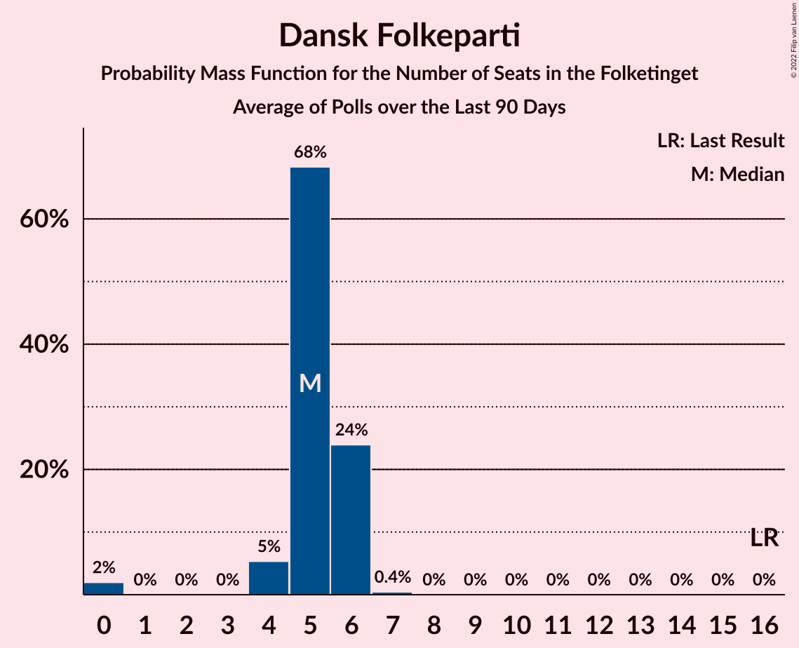

# Poll Average

<a href="#voting-intentions">Voting Intentions</a> | <a href="#seats">Seats</a> | <a href="#coalitions">Coalitions</a> | <a href="#technical-information">Technical Information</a>

## Summary

The table below lists the polls on which the average is based. They are the most recent polls (less than 90 days old) registered and analyzed so far.

| Period     | Polling firm/Commissioner(s) | A | V | O | B | F | Ø | C | Å | D | I | P | K | E | G |
|:----------:|:----------------------------:|:--:|:--:|:--:|:--:|:--:|:--:|:--:|:--:|:--:|:--:|:--:|:--:|:--:|:--:|
| 5 June 2019 | General Election | 25.9%   48 | 23.4%   43 | 8.7%   16 | 8.6%   16 | 7.7%   14 | 6.9%   13 | 6.6%   12 | 3.0%   5 | 2.4%   4 | 2.3%   4 | 1.8%   0 | 1.7%   0 | 0.8%   0 | 0.0%   0 |
| N/A | Poll Average | 28–35%   51–64 | 13–19%   24–35 | 4–7%   7–13 | 4–8%   8–14 | 6–10%   11–17 | 6–9%   11–16 | 9–13%   16–24 | 0–2%   0 | 6–10%   12–17 | 2–5%   4–8 | 0–1%   0 | 1–2%   0–5 | 0–1%   0 | 0–2%   0 |
| [14–20 December 2020](2020-12-20-Voxmeter.html) | Voxmeter | 30–36%   52–62 | 15–20%   28–35 | 4–7%   8–13 | 5–8%   10–13 | 6–10%   12–16 | 6–10%   12–16 | 8–12%   15–20 | 1–2%   0 | 6–9%   12–16 | 2–4%   4–8 | N/A   N/A | 1–2%   0 | N/A   N/A | 0–1%   0 |
| [4–10 December 2020](2020-12-10-Gallup.html) | Gallup | 27–32%   49–59 | 16–20%   26–35 | 4–6%   7–11 | 5–8%   9–14 | 7–10%   12–18 | 6–9%   11–16 | 10–13%   19–25 | 0–1%   0 | 7–9%   12–17 | 2–4%   0–7 | 0–1%   0 | 1–2%   0–4 | 0–1%   0 | 0–1%   0 |
| [1–8 December 2020](2020-12-08-Epinion.html) | Epinion | 29–34%   52–60 | 16–20%   28–35 | 5–7%   8–13 | 6–8%   9–14 | 6–8%   10–15 | 6–8%   10–15 | 9–11%   16–22 | 0–1%   0 | 7–9%   12–17 | 3–5%   5–9 | N/A   N/A | 1–2%   0–4 | N/A   N/A | 0–1%   0 |
| [4–7 December 2020](2020-12-07-YouGov.html) | YouGov   B.T. | 30–36%   56–64 | 12–16%   23–30 | 5–8%   9–13 | 4–7%   8–12 | 6–9%   11–16 | 6–9%   12–16 | 9–12%   15–21 | 0–1%   0 | 7–10%   13–18 | 2–4%   4–7 | 0–1%   0 | 1–2%   0–4 | N/A   N/A | 1–2%   0 |
| [30 November–3 December 2020](2020-12-03-Megafon.html) | Megafon   Politiken and TV 2 | 28–33%   51–58 | 14–19%   28–33 | 4–7%   9–13 | 4–7%   7–11 | 7–10%   12–17 | 6–9%   11–16 | 9–13%   18–22 | 0–2%   0 | 7–10%   12–18 | 3–5%   6–8 | N/A   N/A | 1–3%   0–5 | N/A   N/A | 1–2%   0 |
| 5 June 2019 | General Election | 25.9%   48 | 23.4%   43 | 8.7%   16 | 8.6%   16 | 7.7%   14 | 6.9%   13 | 6.6%   12 | 3.0%   5 | 2.4%   4 | 2.3%   4 | 1.8%   0 | 1.7%   0 | 0.8%   0 | 0.0%   0 |

Only polls for which at least the sample size has been published are included in the table above.

**Legend:**
+ **Top half of each row:** Voting intentions (95% confidence interval)
+ **Bottom half of each row:** Seat projections for the Folketinget (95% confidence interval)
+ **A:** Socialdemokraterne
+ **V:** Venstre
+ **O:** Dansk Folkeparti
+ **B:** Radikale Venstre
+ **F:** Socialistisk Folkeparti
+ **Ø:** Enhedslisten–De Rød-Grønne
+ **C:** Det Konservative Folkeparti
+ **Å:** Alternativet
+ **D:** Nye Borgerlige
+ **I:** Liberal Alliance
+ **P:** Stram Kurs
+ **K:** Kristendemokraterne
+ **E:** Borgerlisten
+ **G:** Veganerpartiet
+ **N/A (single party):** Party not included the published results
+ **N/A (entire row):** Calculation for this opinion poll not started yet

## Voting Intentions

### Confidence Intervals

| Party | Last Result | Median | 80% Confidence Interval | 90% Confidence Interval | 95% Confidence Interval | 99% Confidence Interval |
|:-----:|:-----------:|:------:|:-----------------------:|:-----------------------:|:-----------------------:|:-----------------------:|
| <a href="#socialdemokraterne">Socialdemokraterne</a> | 25.9% | 31.5% | 29.0–33.9% |28.4–34.6% | 27.9–35.1% | 27.1–36.1% |
| <a href="#venstre">Venstre</a> | 23.4% | 16.9% | 14.1–18.6% |13.5–19.0% | 13.1–19.3% | 12.3–20.1% |
| <a href="#dansk-folkeparti">Dansk Folkeparti</a> | 8.7% | 5.6% | 4.5–6.8% |4.3–7.1% | 4.1–7.4% | 3.7–8.0% |
| <a href="#radikale-venstre">Radikale Venstre</a> | 8.6% | 6.0% | 4.8–7.2% |4.5–7.4% | 4.3–7.7% | 3.8–8.2% |
| <a href="#socialistisk-folkeparti">Socialistisk Folkeparti</a> | 7.7% | 7.8% | 6.7–9.0% |6.4–9.4% | 6.2–9.7% | 5.8–10.4% |
| <a href="#enhedslisten–de-rød-grønne">Enhedslisten–De Rød-Grønne</a> | 6.9% | 7.3% | 6.4–8.4% |6.1–8.8% | 5.9–9.1% | 5.6–9.8% |
| <a href="#det-konservative-folkeparti">Det Konservative Folkeparti</a> | 6.6% | 10.5% | 9.3–12.1% |9.0–12.5% | 8.7–12.9% | 8.2–13.5% |
| <a href="#alternativet">Alternativet</a> | 3.0% | 0.7% | 0.2–1.2% |0.1–1.4% | 0.1–1.5% | 0.1–1.8% |
| <a href="#nye-borgerlige">Nye Borgerlige</a> | 2.4% | 7.9% | 6.7–9.1% |6.4–9.5% | 6.1–9.8% | 5.6–10.4% |
| <a href="#liberal-alliance">Liberal Alliance</a> | 2.3% | 3.3% | 2.6–4.4% |2.4–4.7% | 2.2–4.9% | 2.0–5.4% |
| <a href="#stram-kurs">Stram Kurs</a> | 1.8% | 0.8% | 0.5–1.2% |0.5–1.3% | 0.4–1.4% | 0.3–1.6% |
| <a href="#kristendemokraterne">Kristendemokraterne</a> | 1.7% | 1.5% | 1.1–2.1% |1.0–2.3% | 0.9–2.5% | 0.8–2.9% |
| <a href="#borgerlisten">Borgerlisten</a> | 0.8% | 0.6% | 0.4–1.0% |0.4–1.0% | 0.3–1.1% | 0.3–1.3% |
| <a href="#veganerpartiet">Veganerpartiet</a> | 0.0% | 0.6% | 0.2–1.5% |0.2–1.7% | 0.1–1.8% | 0.1–2.1% |

### Socialdemokraterne

*For a full overview of the results for this party, see the [Socialdemokraterne](party-socialdemokraterne.html) page.*

| Voting Intentions | Probability | Accumulated | Special Marks |
|:-----------------:|:-----------:|:-----------:|:-------------:|
| 24.5–25.5% | 0% | 100% |  |
| 25.5–26.5% | 0.1% | 100% | Last Result |
| 26.5–27.5% | 1.2% | 99.8% |  |
| 27.5–28.5% | 5% | 98.7% |  |
| 28.5–29.5% | 11% | 94% |  |
| 29.5–30.5% | 16% | 83% |  |
| 30.5–31.5% | 19% | 68% | Median |
| 31.5–32.5% | 19% | 49% |  |
| 32.5–33.5% | 15% | 29% |  |
| 33.5–34.5% | 9% | 14% |  |
| 34.5–35.5% | 4% | 5% |  |
| 35.5–36.5% | 1.1% | 1.3% |  |
| 36.5–37.5% | 0.2% | 0.2% |  |
| 37.5–38.5% | 0% | 0% |  |

### Venstre

*For a full overview of the results for this party, see the [Venstre](party-venstre.html) page.*

| Voting Intentions | Probability | Accumulated | Special Marks |
|:-----------------:|:-----------:|:-----------:|:-------------:|
| 10.5–11.5% | 0% | 100% |  |
| 11.5–12.5% | 0.8% | 100% |  |
| 12.5–13.5% | 4% | 99.2% |  |
| 13.5–14.5% | 9% | 95% |  |
| 14.5–15.5% | 10% | 86% |  |
| 15.5–16.5% | 17% | 76% |  |
| 16.5–17.5% | 26% | 59% | Median |
| 17.5–18.5% | 23% | 33% |  |
| 18.5–19.5% | 9% | 10% |  |
| 19.5–20.5% | 2% | 2% |  |
| 20.5–21.5% | 0.1% | 0.2% |  |
| 21.5–22.5% | 0% | 0% |  |
| 22.5–23.5% | 0% | 0% | Last Result |

### Dansk Folkeparti

*For a full overview of the results for this party, see the [Dansk Folkeparti](party-danskfolkeparti.html) page.*

| Voting Intentions | Probability | Accumulated | Special Marks |
|:-----------------:|:-----------:|:-----------:|:-------------:|
| 1.5–2.5% | 0% | 100% |  |
| 2.5–3.5% | 0.2% | 100% |  |
| 3.5–4.5% | 10% | 99.8% |  |
| 4.5–5.5% | 35% | 89% |  |
| 5.5–6.5% | 38% | 54% | Median |
| 6.5–7.5% | 14% | 16% |  |
| 7.5–8.5% | 2% | 2% |  |
| 8.5–9.5% | 0.1% | 0.1% | Last Result |
| 9.5–10.5% | 0% | 0% |  |

### Radikale Venstre

*For a full overview of the results for this party, see the [Radikale Venstre](party-radikalevenstre.html) page.*

| Voting Intentions | Probability | Accumulated | Special Marks |
|:-----------------:|:-----------:|:-----------:|:-------------:|
| 1.5–2.5% | 0% | 100% |  |
| 2.5–3.5% | 0.1% | 100% |  |
| 3.5–4.5% | 6% | 99.9% |  |
| 4.5–5.5% | 27% | 94% |  |
| 5.5–6.5% | 39% | 67% | Median |
| 6.5–7.5% | 24% | 28% |  |
| 7.5–8.5% | 4% | 4% |  |
| 8.5–9.5% | 0.1% | 0.1% | Last Result |
| 9.5–10.5% | 0% | 0% |  |

### Socialistisk Folkeparti

*For a full overview of the results for this party, see the [Socialistisk Folkeparti](party-socialistiskfolkeparti.html) page.*

| Voting Intentions | Probability | Accumulated | Special Marks |
|:-----------------:|:-----------:|:-----------:|:-------------:|
| 3.5–4.5% | 0% | 100% |  |
| 4.5–5.5% | 0.1% | 100% |  |
| 5.5–6.5% | 7% | 99.9% |  |
| 6.5–7.5% | 32% | 93% |  |
| 7.5–8.5% | 39% | 61% | Last Result, Median |
| 8.5–9.5% | 18% | 22% |  |
| 9.5–10.5% | 3% | 4% |  |
| 10.5–11.5% | 0.3% | 0.3% |  |
| 11.5–12.5% | 0% | 0% |  |

### Enhedslisten–De Rød-Grønne

*For a full overview of the results for this party, see the [Enhedslisten–De Rød-Grønne](party-enhedslisten–derød-grønne.html) page.*

| Voting Intentions | Probability | Accumulated | Special Marks |
|:-----------------:|:-----------:|:-----------:|:-------------:|
| 3.5–4.5% | 0% | 100% |  |
| 4.5–5.5% | 0.5% | 100% |  |
| 5.5–6.5% | 15% | 99.5% |  |
| 6.5–7.5% | 46% | 85% | Last Result, Median |
| 7.5–8.5% | 31% | 39% |  |
| 8.5–9.5% | 7% | 8% |  |
| 9.5–10.5% | 0.8% | 0.8% |  |
| 10.5–11.5% | 0% | 0% |  |
| 11.5–12.5% | 0% | 0% |  |

### Det Konservative Folkeparti

*For a full overview of the results for this party, see the [Det Konservative Folkeparti](party-detkonservativefolkeparti.html) page.*

| Voting Intentions | Probability | Accumulated | Special Marks |
|:-----------------:|:-----------:|:-----------:|:-------------:|
| 6.5–7.5% | 0% | 100% | Last Result |
| 7.5–8.5% | 2% | 100% |  |
| 8.5–9.5% | 15% | 98% |  |
| 9.5–10.5% | 33% | 83% |  |
| 10.5–11.5% | 30% | 50% | Median |
| 11.5–12.5% | 15% | 20% |  |
| 12.5–13.5% | 4% | 5% |  |
| 13.5–14.5% | 0.5% | 0.5% |  |
| 14.5–15.5% | 0% | 0% |  |

### Alternativet

*For a full overview of the results for this party, see the [Alternativet](party-alternativet.html) page.*

| Voting Intentions | Probability | Accumulated | Special Marks |
|:-----------------:|:-----------:|:-----------:|:-------------:|
| 0.0–0.5% | 38% | 100% |  |
| 0.5–1.5% | 60% | 62% | Median |
| 1.5–2.5% | 2% | 2% |  |
| 2.5–3.5% | 0% | 0% | Last Result |

### Nye Borgerlige

*For a full overview of the results for this party, see the [Nye Borgerlige](party-nyeborgerlige.html) page.*

| Voting Intentions | Probability | Accumulated | Special Marks |
|:-----------------:|:-----------:|:-----------:|:-------------:|
| 1.5–2.5% | 0% | 100% | Last Result |
| 2.5–3.5% | 0% | 100% |  |
| 3.5–4.5% | 0% | 100% |  |
| 4.5–5.5% | 0.5% | 100% |  |
| 5.5–6.5% | 6% | 99.5% |  |
| 6.5–7.5% | 27% | 93% |  |
| 7.5–8.5% | 42% | 66% | Median |
| 8.5–9.5% | 20% | 24% |  |
| 9.5–10.5% | 4% | 4% |  |
| 10.5–11.5% | 0.3% | 0.3% |  |
| 11.5–12.5% | 0% | 0% |  |

### Liberal Alliance

*For a full overview of the results for this party, see the [Liberal Alliance](party-liberalalliance.html) page.*

| Voting Intentions | Probability | Accumulated | Special Marks |
|:-----------------:|:-----------:|:-----------:|:-------------:|
| 0.5–1.5% | 0% | 100% |  |
| 1.5–2.5% | 10% | 100% | Last Result |
| 2.5–3.5% | 51% | 90% | Median |
| 3.5–4.5% | 33% | 39% |  |
| 4.5–5.5% | 6% | 6% |  |
| 5.5–6.5% | 0.4% | 0.4% |  |
| 6.5–7.5% | 0% | 0% |  |

### Stram Kurs

*For a full overview of the results for this party, see the [Stram Kurs](party-stramkurs.html) page.*

| Voting Intentions | Probability | Accumulated | Special Marks |
|:-----------------:|:-----------:|:-----------:|:-------------:|
| 0.0–0.5% | 11% | 100% |  |
| 0.5–1.5% | 88% | 89% | Median |
| 1.5–2.5% | 0.7% | 0.7% | Last Result |
| 2.5–3.5% | 0% | 0% |  |

### Kristendemokraterne

*For a full overview of the results for this party, see the [Kristendemokraterne](party-kristendemokraterne.html) page.*

| Voting Intentions | Probability | Accumulated | Special Marks |
|:-----------------:|:-----------:|:-----------:|:-------------:|
| 0.0–0.5% | 0% | 100% |  |
| 0.5–1.5% | 50% | 100% |  |
| 1.5–2.5% | 48% | 50% | Last Result, Median |
| 2.5–3.5% | 2% | 2% |  |
| 3.5–4.5% | 0% | 0% |  |

### Borgerlisten

*For a full overview of the results for this party, see the [Borgerlisten](party-borgerlisten.html) page.*

| Voting Intentions | Probability | Accumulated | Special Marks |
|:-----------------:|:-----------:|:-----------:|:-------------:|
| 0.0–0.5% | 31% | 100% |  |
| 0.5–1.5% | 69% | 69% | Last Result, Median |
| 1.5–2.5% | 0.1% | 0.1% |  |
| 2.5–3.5% | 0% | 0% |  |

### Veganerpartiet

*For a full overview of the results for this party, see the [Veganerpartiet](party-veganerpartiet.html) page.*

| Voting Intentions | Probability | Accumulated | Special Marks |
|:-----------------:|:-----------:|:-----------:|:-------------:|
| 0.0–0.5% | 45% | 100% | Last Result |
| 0.5–1.5% | 48% | 55% | Median |
| 1.5–2.5% | 7% | 8% |  |
| 2.5–3.5% | 0% | 0% |  |
| 3.5–4.5% | 0% | 0% |  |

## Seats

### Confidence Intervals

| Party | Last Result | Median | 80% Confidence Interval | 90% Confidence Interval | 95% Confidence Interval | 99% Confidence Interval |
|:-----:|:-----------:|:------:|:-----------------------:|:-----------------------:|:-----------------------:|:-----------------------:|
| <a href="#socialdemokraterne">Socialdemokraterne</a> | 48 | 57 | 52–63 |52–63 | 51–64 | 49–64 |
| <a href="#venstre">Venstre</a> | 43 | 31 | 26–33 |26–35 | 24–35 | 23–35 |
| <a href="#dansk-folkeparti">Dansk Folkeparti</a> | 16 | 10 | 8–13 |8–13 | 7–13 | 7–14 |
| <a href="#radikale-venstre">Radikale Venstre</a> | 16 | 11 | 9–13 |8–13 | 8–14 | 7–15 |
| <a href="#socialistisk-folkeparti">Socialistisk Folkeparti</a> | 14 | 14 | 12–16 |11–17 | 11–17 | 10–19 |
| <a href="#enhedslisten–de-rød-grønne">Enhedslisten–De Rød-Grønne</a> | 13 | 13 | 11–15 |11–16 | 11–16 | 10–17 |
| <a href="#det-konservative-folkeparti">Det Konservative Folkeparti</a> | 12 | 18 | 17–22 |16–23 | 16–24 | 15–25 |
| <a href="#alternativet">Alternativet</a> | 5 | 0 | 0 |0 | 0 | 0 |
| <a href="#nye-borgerlige">Nye Borgerlige</a> | 4 | 15 | 13–16 |13–17 | 12–17 | 11–19 |
| <a href="#liberal-alliance">Liberal Alliance</a> | 4 | 6 | 5–8 |4–8 | 4–8 | 0–9 |
| <a href="#stram-kurs">Stram Kurs</a> | 0 | 0 | 0 |0 | 0 | 0 |
| <a href="#kristendemokraterne">Kristendemokraterne</a> | 0 | 0 | 0–5 |0–5 | 0–5 | 0–5 |
| <a href="#borgerlisten">Borgerlisten</a> | 0 | 0 | 0 |0 | 0 | 0 |
| <a href="#veganerpartiet">Veganerpartiet</a> | 0 | 0 | 0 |0 | 0 | 0–4 |

### Socialdemokraterne

*For a full overview of the results for this party, see the [Socialdemokraterne](party-socialdemokraterne.html) page.*

| Number of Seats | Probability | Accumulated | Special Marks |
|:---------------:|:-----------:|:-----------:|:-------------:|
| 47 | 0.1% | 100% |  |
| 48 | 0.3% | 99.9% | Last Result |
| 49 | 0.7% | 99.6% |  |
| 50 | 1.0% | 98.9% |  |
| 51 | 1.3% | 98% |  |
| 52 | 9% | 97% |  |
| 53 | 2% | 88% |  |
| 54 | 11% | 85% |  |
| 55 | 17% | 74% |  |
| 56 | 7% | 57% |  |
| 57 | 8% | 50% | Median |
| 58 | 3% | 42% |  |
| 59 | 19% | 39% |  |
| 60 | 5% | 20% |  |
| 61 | 0.6% | 15% |  |
| 62 | 3% | 15% |  |
| 63 | 8% | 11% |  |
| 64 | 3% | 4% |  |
| 65 | 0.1% | 0.2% |  |
| 66 | 0% | 0.1% |  |
| 67 | 0% | 0% |  |

### Venstre

*For a full overview of the results for this party, see the [Venstre](party-venstre.html) page.*

| Number of Seats | Probability | Accumulated | Special Marks |
|:---------------:|:-----------:|:-----------:|:-------------:|
| 21 | 0.1% | 100% |  |
| 22 | 0.1% | 99.9% |  |
| 23 | 2% | 99.8% |  |
| 24 | 0.7% | 98% |  |
| 25 | 2% | 97% |  |
| 26 | 7% | 95% |  |
| 27 | 8% | 88% |  |
| 28 | 3% | 80% |  |
| 29 | 20% | 78% |  |
| 30 | 8% | 58% |  |
| 31 | 15% | 50% | Median |
| 32 | 20% | 36% |  |
| 33 | 6% | 16% |  |
| 34 | 3% | 10% |  |
| 35 | 7% | 7% |  |
| 36 | 0.3% | 0.4% |  |
| 37 | 0.1% | 0.1% |  |
| 38 | 0% | 0% |  |
| 39 | 0% | 0% |  |
| 40 | 0% | 0% |  |
| 41 | 0% | 0% |  |
| 42 | 0% | 0% |  |
| 43 | 0% | 0% | Last Result |

### Dansk Folkeparti

*For a full overview of the results for this party, see the [Dansk Folkeparti](party-danskfolkeparti.html) page.*

| Number of Seats | Probability | Accumulated | Special Marks |
|:---------------:|:-----------:|:-----------:|:-------------:|
| 6 | 0.5% | 100% |  |
| 7 | 3% | 99.5% |  |
| 8 | 23% | 96% |  |
| 9 | 10% | 74% |  |
| 10 | 25% | 63% | Median |
| 11 | 15% | 39% |  |
| 12 | 11% | 24% |  |
| 13 | 12% | 13% |  |
| 14 | 0.4% | 0.6% |  |
| 15 | 0.2% | 0.2% |  |
| 16 | 0% | 0% | Last Result |

### Radikale Venstre

*For a full overview of the results for this party, see the [Radikale Venstre](party-radikalevenstre.html) page.*

| Number of Seats | Probability | Accumulated | Special Marks |
|:---------------:|:-----------:|:-----------:|:-------------:|
| 6 | 0.1% | 100% |  |
| 7 | 1.3% | 99.9% |  |
| 8 | 4% | 98.6% |  |
| 9 | 27% | 95% |  |
| 10 | 12% | 68% |  |
| 11 | 16% | 56% | Median |
| 12 | 26% | 39% |  |
| 13 | 8% | 13% |  |
| 14 | 4% | 5% |  |
| 15 | 0.6% | 0.7% |  |
| 16 | 0.1% | 0.1% | Last Result |
| 17 | 0% | 0% |  |

### Socialistisk Folkeparti

*For a full overview of the results for this party, see the [Socialistisk Folkeparti](party-socialistiskfolkeparti.html) page.*

| Number of Seats | Probability | Accumulated | Special Marks |
|:---------------:|:-----------:|:-----------:|:-------------:|
| 10 | 2% | 100% |  |
| 11 | 6% | 98% |  |
| 12 | 19% | 92% |  |
| 13 | 19% | 73% |  |
| 14 | 12% | 53% | Last Result, Median |
| 15 | 25% | 41% |  |
| 16 | 10% | 16% |  |
| 17 | 5% | 6% |  |
| 18 | 0.6% | 1.1% |  |
| 19 | 0.5% | 0.5% |  |
| 20 | 0.1% | 0.1% |  |
| 21 | 0% | 0% |  |

### Enhedslisten–De Rød-Grønne

*For a full overview of the results for this party, see the [Enhedslisten–De Rød-Grønne](party-enhedslisten–derød-grønne.html) page.*

| Number of Seats | Probability | Accumulated | Special Marks |
|:---------------:|:-----------:|:-----------:|:-------------:|
| 9 | 0.2% | 100% |  |
| 10 | 2% | 99.8% |  |
| 11 | 9% | 98% |  |
| 12 | 28% | 89% |  |
| 13 | 29% | 61% | Last Result, Median |
| 14 | 9% | 32% |  |
| 15 | 18% | 23% |  |
| 16 | 4% | 5% |  |
| 17 | 0.8% | 0.9% |  |
| 18 | 0% | 0% |  |

### Det Konservative Folkeparti

*For a full overview of the results for this party, see the [Det Konservative Folkeparti](party-detkonservativefolkeparti.html) page.*

| Number of Seats | Probability | Accumulated | Special Marks |
|:---------------:|:-----------:|:-----------:|:-------------:|
| 12 | 0% | 100% | Last Result |
| 13 | 0.2% | 100% |  |
| 14 | 0.3% | 99.8% |  |
| 15 | 2% | 99.6% |  |
| 16 | 4% | 98% |  |
| 17 | 36% | 94% |  |
| 18 | 10% | 58% | Median |
| 19 | 6% | 48% |  |
| 20 | 20% | 42% |  |
| 21 | 11% | 22% |  |
| 22 | 5% | 12% |  |
| 23 | 2% | 7% |  |
| 24 | 4% | 5% |  |
| 25 | 0.6% | 0.7% |  |
| 26 | 0.1% | 0.1% |  |
| 27 | 0% | 0% |  |

### Alternativet

*For a full overview of the results for this party, see the [Alternativet](party-alternativet.html) page.*

| Number of Seats | Probability | Accumulated | Special Marks |
|:---------------:|:-----------:|:-----------:|:-------------:|
| 0 | 99.9% | 100% | Median |
| 1 | 0% | 0.1% |  |
| 2 | 0% | 0.1% |  |
| 3 | 0% | 0.1% |  |
| 4 | 0.1% | 0.1% |  |
| 5 | 0% | 0% | Last Result |

### Nye Borgerlige

*For a full overview of the results for this party, see the [Nye Borgerlige](party-nyeborgerlige.html) page.*

| Number of Seats | Probability | Accumulated | Special Marks |
|:---------------:|:-----------:|:-----------:|:-------------:|
| 4 | 0% | 100% | Last Result |
| 5 | 0% | 100% |  |
| 6 | 0% | 100% |  |
| 7 | 0% | 100% |  |
| 8 | 0% | 100% |  |
| 9 | 0% | 100% |  |
| 10 | 0.1% | 100% |  |
| 11 | 0.5% | 99.8% |  |
| 12 | 4% | 99.4% |  |
| 13 | 31% | 96% |  |
| 14 | 14% | 65% |  |
| 15 | 31% | 51% | Median |
| 16 | 10% | 20% |  |
| 17 | 7% | 9% |  |
| 18 | 1.5% | 2% |  |
| 19 | 0.5% | 0.6% |  |
| 20 | 0.1% | 0.1% |  |
| 21 | 0% | 0% |  |

### Liberal Alliance

*For a full overview of the results for this party, see the [Liberal Alliance](party-liberalalliance.html) page.*

| Number of Seats | Probability | Accumulated | Special Marks |
|:---------------:|:-----------:|:-----------:|:-------------:|
| 0 | 1.1% | 100% |  |
| 1 | 0% | 98.9% |  |
| 2 | 0% | 98.9% |  |
| 3 | 0.2% | 98.9% |  |
| 4 | 6% | 98.7% | Last Result |
| 5 | 36% | 93% |  |
| 6 | 19% | 57% | Median |
| 7 | 27% | 38% |  |
| 8 | 10% | 11% |  |
| 9 | 1.0% | 1.3% |  |
| 10 | 0.3% | 0.3% |  |
| 11 | 0% | 0% |  |

### Stram Kurs

*For a full overview of the results for this party, see the [Stram Kurs](party-stramkurs.html) page.*

| Number of Seats | Probability | Accumulated | Special Marks |
|:---------------:|:-----------:|:-----------:|:-------------:|
| 0 | 100% | 100% | Last Result, Median |

### Kristendemokraterne

*For a full overview of the results for this party, see the [Kristendemokraterne](party-kristendemokraterne.html) page.*

| Number of Seats | Probability | Accumulated | Special Marks |
|:---------------:|:-----------:|:-----------:|:-------------:|
| 0 | 80% | 100% | Last Result, Median |
| 1 | 0% | 20% |  |
| 2 | 0% | 20% |  |
| 3 | 0% | 20% |  |
| 4 | 6% | 20% |  |
| 5 | 14% | 14% |  |
| 6 | 0% | 0.1% |  |
| 7 | 0% | 0% |  |

### Borgerlisten

*For a full overview of the results for this party, see the [Borgerlisten](party-borgerlisten.html) page.*

| Number of Seats | Probability | Accumulated | Special Marks |
|:---------------:|:-----------:|:-----------:|:-------------:|
| 0 | 100% | 100% | Last Result, Median |

### Veganerpartiet

*For a full overview of the results for this party, see the [Veganerpartiet](party-veganerpartiet.html) page.*

| Number of Seats | Probability | Accumulated | Special Marks |
|:---------------:|:-----------:|:-----------:|:-------------:|
| 0 | 99.5% | 100% | Last Result, Median |
| 1 | 0% | 0.5% |  |
| 2 | 0% | 0.5% |  |
| 3 | 0% | 0.5% |  |
| 4 | 0.5% | 0.5% |  |
| 5 | 0% | 0% |  |

## Coalitions

### Confidence Intervals

| Coalition | Last Result | Median | Majority? | 80% Confidence Interval | 90% Confidence Interval | 95% Confidence Interval | 99% Confidence Interval |
|:---------:|:-----------:|:------:|:---------:|:-----------------------:|:-----------------------:|:-----------------------:|:-----------------------:|
| Socialdemokraterne – Radikale Venstre – Socialistisk Folkeparti – Enhedslisten–De Rød-Grønne – Alternativet | 96 | 95 | 94% | 90–98 | 89–100 | 87–101 | 87–103 |
| Socialdemokraterne – Radikale Venstre – Socialistisk Folkeparti – Enhedslisten–De Rød-Grønne | 91 | 95 | 94% | 90–98 | 89–100 | 87–101 | 87–103 |
| Socialdemokraterne – Socialistisk Folkeparti – Enhedslisten–De Rød-Grønne – Alternativet | 80 | 84 | 9% | 79–89 | 77–90 | 77–92 | 75–92 |
| Socialdemokraterne – Socialistisk Folkeparti – Enhedslisten–De Rød-Grønne | 75 | 84 | 9% | 79–89 | 77–90 | 77–92 | 75–92 |
| Venstre – Dansk Folkeparti – Det Konservative Folkeparti – Nye Borgerlige – Liberal Alliance – Stram Kurs – Kristendemokraterne – Borgerlisten | 79 | 82 | 0.2% | 77–85 | 77–87 | 76–88 | 72–88 |
| Venstre – Dansk Folkeparti – Det Konservative Folkeparti – Nye Borgerlige – Liberal Alliance – Kristendemokraterne – Borgerlisten | 79 | 82 | 0.2% | 77–85 | 77–87 | 76–88 | 72–88 |
| Venstre – Dansk Folkeparti – Det Konservative Folkeparti – Nye Borgerlige – Liberal Alliance – Kristendemokraterne | 79 | 80 | 0.1% | 77–85 | 75–86 | 74–88 | 72–88 |
| Socialdemokraterne – Radikale Venstre – Socialistisk Folkeparti | 78 | 81 | 0.3% | 78–86 | 76–86 | 76–87 | 75–89 |
| Venstre – Dansk Folkeparti – Det Konservative Folkeparti – Nye Borgerlige – Liberal Alliance – Borgerlisten | 79 | 79 | 0% | 77–84 | 77–85 | 76–86 | 71–87 |
| Venstre – Dansk Folkeparti – Det Konservative Folkeparti – Nye Borgerlige – Liberal Alliance | 79 | 79 | 0% | 76–84 | 75–85 | 74–86 | 72–88 |
| Socialdemokraterne – Radikale Venstre | 64 | 68 | 0% | 63–72 | 62–73 | 61–74 | 59–75 |
| Venstre – Dansk Folkeparti – Det Konservative Folkeparti – Liberal Alliance – Kristendemokraterne | 75 | 66 | 0% | 61–71 | 59–71 | 57–73 | 56–74 |
| Venstre – Dansk Folkeparti – Det Konservative Folkeparti – Liberal Alliance | 75 | 66 | 0% | 61–70 | 59–70 | 57–71 | 56–72 |
| Venstre – Det Konservative Folkeparti – Liberal Alliance | 59 | 55 | 0% | 49–60 | 49–61 | 45–61 | 45–63 |
| Venstre – Det Konservative Folkeparti | 55 | 49 | 0% | 44–54 | 43–56 | 40–56 | 39–57 |
| Venstre | 43 | 31 | 0% | 26–33 | 26–35 | 24–35 | 23–35 |

### Socialdemokraterne – Radikale Venstre – Socialistisk Folkeparti – Enhedslisten–De Rød-Grønne – Alternativet

| Number of Seats | Probability | Accumulated | Special Marks |
|:---------------:|:-----------:|:-----------:|:-------------:|
| 85 | 0.1% | 100% |  |
| 86 | 0.2% | 99.9% |  |
| 87 | 3% | 99.7% |  |
| 88 | 2% | 97% |  |
| 89 | 2% | 95% |  |
| 90 | 6% | 94% | Majority |
| 91 | 18% | 88% |  |
| 92 | 5% | 70% |  |
| 93 | 6% | 65% |  |
| 94 | 5% | 59% |  |
| 95 | 10% | 53% | Median |
| 96 | 4% | 43% | Last Result |
| 97 | 7% | 39% |  |
| 98 | 23% | 33% |  |
| 99 | 3% | 10% |  |
| 100 | 4% | 7% |  |
| 101 | 2% | 3% |  |
| 102 | 0.1% | 1.1% |  |
| 103 | 0.7% | 1.0% |  |
| 104 | 0% | 0.3% |  |
| 105 | 0.2% | 0.3% |  |
| 106 | 0% | 0% |  |

### Socialdemokraterne – Radikale Venstre – Socialistisk Folkeparti – Enhedslisten–De Rød-Grønne

| Number of Seats | Probability | Accumulated | Special Marks |
|:---------------:|:-----------:|:-----------:|:-------------:|
| 85 | 0.1% | 100% |  |
| 86 | 0.2% | 99.9% |  |
| 87 | 3% | 99.7% |  |
| 88 | 2% | 97% |  |
| 89 | 2% | 95% |  |
| 90 | 6% | 94% | Majority |
| 91 | 18% | 88% | Last Result |
| 92 | 5% | 70% |  |
| 93 | 6% | 65% |  |
| 94 | 5% | 59% |  |
| 95 | 10% | 53% | Median |
| 96 | 4% | 43% |  |
| 97 | 7% | 39% |  |
| 98 | 23% | 33% |  |
| 99 | 3% | 10% |  |
| 100 | 4% | 7% |  |
| 101 | 2% | 3% |  |
| 102 | 0.1% | 1.0% |  |
| 103 | 0.7% | 1.0% |  |
| 104 | 0% | 0.3% |  |
| 105 | 0.2% | 0.3% |  |
| 106 | 0% | 0% |  |

### Socialdemokraterne – Socialistisk Folkeparti – Enhedslisten–De Rød-Grønne – Alternativet

| Number of Seats | Probability | Accumulated | Special Marks |
|:---------------:|:-----------:|:-----------:|:-------------:|
| 74 | 0.1% | 100% |  |
| 75 | 0.4% | 99.9% |  |
| 76 | 1.5% | 99.4% |  |
| 77 | 4% | 98% |  |
| 78 | 2% | 94% |  |
| 79 | 6% | 92% |  |
| 80 | 5% | 86% | Last Result |
| 81 | 7% | 81% |  |
| 82 | 19% | 75% |  |
| 83 | 2% | 56% |  |
| 84 | 12% | 54% | Median |
| 85 | 3% | 42% |  |
| 86 | 20% | 39% |  |
| 87 | 2% | 19% |  |
| 88 | 0.5% | 17% |  |
| 89 | 8% | 17% |  |
| 90 | 6% | 9% | Majority |
| 91 | 0.9% | 3% |  |
| 92 | 2% | 3% |  |
| 93 | 0.1% | 0.2% |  |
| 94 | 0% | 0.1% |  |
| 95 | 0% | 0% |  |

### Socialdemokraterne – Socialistisk Folkeparti – Enhedslisten–De Rød-Grønne

| Number of Seats | Probability | Accumulated | Special Marks |
|:---------------:|:-----------:|:-----------:|:-------------:|
| 74 | 0.1% | 100% |  |
| 75 | 0.4% | 99.9% | Last Result |
| 76 | 1.5% | 99.4% |  |
| 77 | 4% | 98% |  |
| 78 | 2% | 94% |  |
| 79 | 6% | 92% |  |
| 80 | 5% | 86% |  |
| 81 | 7% | 81% |  |
| 82 | 19% | 75% |  |
| 83 | 2% | 56% |  |
| 84 | 12% | 54% | Median |
| 85 | 3% | 42% |  |
| 86 | 20% | 39% |  |
| 87 | 2% | 19% |  |
| 88 | 0.5% | 17% |  |
| 89 | 8% | 17% |  |
| 90 | 6% | 9% | Majority |
| 91 | 0.9% | 3% |  |
| 92 | 2% | 3% |  |
| 93 | 0.1% | 0.2% |  |
| 94 | 0% | 0.1% |  |
| 95 | 0% | 0% |  |

### Venstre – Dansk Folkeparti – Det Konservative Folkeparti – Nye Borgerlige – Liberal Alliance – Stram Kurs – Kristendemokraterne – Borgerlisten

| Number of Seats | Probability | Accumulated | Special Marks |
|:---------------:|:-----------:|:-----------:|:-------------:|
| 70 | 0.4% | 100% |  |
| 71 | 0% | 99.6% |  |
| 72 | 0.1% | 99.6% |  |
| 73 | 0% | 99.5% |  |
| 74 | 0.1% | 99.5% |  |
| 75 | 1.2% | 99.4% |  |
| 76 | 1.0% | 98% |  |
| 77 | 22% | 97% |  |
| 78 | 3% | 75% |  |
| 79 | 2% | 72% | Last Result |
| 80 | 7% | 70% | Median |
| 81 | 8% | 62% |  |
| 82 | 9% | 54% |  |
| 83 | 6% | 46% |  |
| 84 | 28% | 39% |  |
| 85 | 3% | 11% |  |
| 86 | 2% | 8% |  |
| 87 | 1.4% | 6% |  |
| 88 | 4% | 4% |  |
| 89 | 0.3% | 0.5% |  |
| 90 | 0.1% | 0.2% | Majority |
| 91 | 0% | 0.1% |  |
| 92 | 0.1% | 0.1% |  |
| 93 | 0% | 0% |  |

### Venstre – Dansk Folkeparti – Det Konservative Folkeparti – Nye Borgerlige – Liberal Alliance – Kristendemokraterne – Borgerlisten

| Number of Seats | Probability | Accumulated | Special Marks |
|:---------------:|:-----------:|:-----------:|:-------------:|
| 70 | 0.4% | 100% |  |
| 71 | 0% | 99.6% |  |
| 72 | 0.1% | 99.6% |  |
| 73 | 0% | 99.5% |  |
| 74 | 0.1% | 99.5% |  |
| 75 | 1.2% | 99.4% |  |
| 76 | 1.0% | 98% |  |
| 77 | 22% | 97% |  |
| 78 | 3% | 75% |  |
| 79 | 2% | 72% | Last Result |
| 80 | 7% | 70% | Median |
| 81 | 8% | 62% |  |
| 82 | 9% | 54% |  |
| 83 | 6% | 46% |  |
| 84 | 28% | 39% |  |
| 85 | 3% | 11% |  |
| 86 | 2% | 8% |  |
| 87 | 1.4% | 6% |  |
| 88 | 4% | 4% |  |
| 89 | 0.3% | 0.5% |  |
| 90 | 0.1% | 0.2% | Majority |
| 91 | 0% | 0.1% |  |
| 92 | 0.1% | 0.1% |  |
| 93 | 0% | 0% |  |

### Venstre – Dansk Folkeparti – Det Konservative Folkeparti – Nye Borgerlige – Liberal Alliance – Kristendemokraterne

| Number of Seats | Probability | Accumulated | Special Marks |
|:---------------:|:-----------:|:-----------:|:-------------:|
| 70 | 0.2% | 100% |  |
| 71 | 0% | 99.7% |  |
| 72 | 0.7% | 99.7% |  |
| 73 | 0.1% | 99.0% |  |
| 74 | 2% | 98.9% |  |
| 75 | 4% | 97% |  |
| 76 | 2% | 93% |  |
| 77 | 23% | 90% |  |
| 78 | 7% | 67% |  |
| 79 | 4% | 60% | Last Result |
| 80 | 10% | 57% | Median |
| 81 | 5% | 47% |  |
| 82 | 6% | 41% |  |
| 83 | 5% | 35% |  |
| 84 | 18% | 30% |  |
| 85 | 6% | 12% |  |
| 86 | 2% | 6% |  |
| 87 | 1.3% | 4% |  |
| 88 | 3% | 3% |  |
| 89 | 0.2% | 0.3% |  |
| 90 | 0.1% | 0.1% | Majority |
| 91 | 0% | 0% |  |

### Socialdemokraterne – Radikale Venstre – Socialistisk Folkeparti

| Number of Seats | Probability | Accumulated | Special Marks |
|:---------------:|:-----------:|:-----------:|:-------------:|
| 71 | 0.1% | 100% |  |
| 72 | 0% | 99.9% |  |
| 73 | 0.2% | 99.9% |  |
| 74 | 0.1% | 99.7% |  |
| 75 | 2% | 99.6% |  |
| 76 | 4% | 98% |  |
| 77 | 3% | 93% |  |
| 78 | 7% | 90% | Last Result |
| 79 | 18% | 83% |  |
| 80 | 7% | 65% |  |
| 81 | 9% | 59% |  |
| 82 | 3% | 50% | Median |
| 83 | 18% | 46% |  |
| 84 | 8% | 28% |  |
| 85 | 9% | 20% |  |
| 86 | 7% | 11% |  |
| 87 | 3% | 4% |  |
| 88 | 0.4% | 1.3% |  |
| 89 | 0.6% | 0.8% |  |
| 90 | 0.2% | 0.3% | Majority |
| 91 | 0% | 0% |  |

### Venstre – Dansk Folkeparti – Det Konservative Folkeparti – Nye Borgerlige – Liberal Alliance – Borgerlisten

| Number of Seats | Probability | Accumulated | Special Marks |
|:---------------:|:-----------:|:-----------:|:-------------:|
| 66 | 0.2% | 100% |  |
| 67 | 0% | 99.7% |  |
| 68 | 0% | 99.7% |  |
| 69 | 0% | 99.7% |  |
| 70 | 0.2% | 99.7% |  |
| 71 | 0.3% | 99.6% |  |
| 72 | 0.1% | 99.3% |  |
| 73 | 0.2% | 99.2% |  |
| 74 | 0.3% | 99.0% |  |
| 75 | 1.2% | 98.7% |  |
| 76 | 1.1% | 98% |  |
| 77 | 23% | 96% |  |
| 78 | 3% | 74% |  |
| 79 | 25% | 71% | Last Result |
| 80 | 8% | 46% | Median |
| 81 | 8% | 37% |  |
| 82 | 9% | 29% |  |
| 83 | 7% | 20% |  |
| 84 | 8% | 14% |  |
| 85 | 2% | 6% |  |
| 86 | 2% | 3% |  |
| 87 | 1.0% | 1.4% |  |
| 88 | 0.1% | 0.4% |  |
| 89 | 0.2% | 0.2% |  |
| 90 | 0% | 0% | Majority |

### Venstre – Dansk Folkeparti – Det Konservative Folkeparti – Nye Borgerlige – Liberal Alliance

| Number of Seats | Probability | Accumulated | Special Marks |
|:---------------:|:-----------:|:-----------:|:-------------:|
| 66 | 0.1% | 100% |  |
| 67 | 0% | 99.8% |  |
| 68 | 0% | 99.8% |  |
| 69 | 0% | 99.8% |  |
| 70 | 0.1% | 99.8% |  |
| 71 | 0.2% | 99.7% |  |
| 72 | 0.8% | 99.5% |  |
| 73 | 0.2% | 98.8% |  |
| 74 | 2% | 98.6% |  |
| 75 | 4% | 96% |  |
| 76 | 3% | 92% |  |
| 77 | 23% | 89% |  |
| 78 | 7% | 66% |  |
| 79 | 17% | 59% | Last Result |
| 80 | 11% | 42% | Median |
| 81 | 6% | 31% |  |
| 82 | 6% | 25% |  |
| 83 | 5% | 19% |  |
| 84 | 6% | 14% |  |
| 85 | 5% | 8% |  |
| 86 | 2% | 3% |  |
| 87 | 1.0% | 2% |  |
| 88 | 0.5% | 0.6% |  |
| 89 | 0.1% | 0.2% |  |
| 90 | 0% | 0% | Majority |

### Socialdemokraterne – Radikale Venstre

| Number of Seats | Probability | Accumulated | Special Marks |
|:---------------:|:-----------:|:-----------:|:-------------:|
| 57 | 0.1% | 100% |  |
| 58 | 0.1% | 99.8% |  |
| 59 | 1.1% | 99.8% |  |
| 60 | 1.0% | 98.7% |  |
| 61 | 1.1% | 98% |  |
| 62 | 3% | 97% |  |
| 63 | 4% | 93% |  |
| 64 | 19% | 90% | Last Result |
| 65 | 4% | 71% |  |
| 66 | 5% | 66% |  |
| 67 | 8% | 61% |  |
| 68 | 6% | 54% | Median |
| 69 | 9% | 48% |  |
| 70 | 9% | 39% |  |
| 71 | 16% | 30% |  |
| 72 | 8% | 14% |  |
| 73 | 1.0% | 5% |  |
| 74 | 3% | 4% |  |
| 75 | 0.9% | 1.1% |  |
| 76 | 0.1% | 0.2% |  |
| 77 | 0.1% | 0.1% |  |
| 78 | 0% | 0% |  |

### Venstre – Dansk Folkeparti – Det Konservative Folkeparti – Liberal Alliance – Kristendemokraterne

| Number of Seats | Probability | Accumulated | Special Marks |
|:---------------:|:-----------:|:-----------:|:-------------:|
| 54 | 0% | 100% |  |
| 55 | 0% | 99.9% |  |
| 56 | 0.6% | 99.9% |  |
| 57 | 2% | 99.3% |  |
| 58 | 0.8% | 97% |  |
| 59 | 2% | 96% |  |
| 60 | 0.5% | 95% |  |
| 61 | 6% | 94% |  |
| 62 | 19% | 88% |  |
| 63 | 4% | 69% |  |
| 64 | 3% | 65% |  |
| 65 | 8% | 62% | Median |
| 66 | 6% | 54% |  |
| 67 | 11% | 48% |  |
| 68 | 3% | 37% |  |
| 69 | 6% | 34% |  |
| 70 | 7% | 28% |  |
| 71 | 16% | 21% |  |
| 72 | 2% | 5% |  |
| 73 | 2% | 3% |  |
| 74 | 0.5% | 0.8% |  |
| 75 | 0.3% | 0.3% | Last Result |
| 76 | 0% | 0.1% |  |
| 77 | 0% | 0% |  |

### Venstre – Dansk Folkeparti – Det Konservative Folkeparti – Liberal Alliance

| Number of Seats | Probability | Accumulated | Special Marks |
|:---------------:|:-----------:|:-----------:|:-------------:|
| 54 | 0.2% | 100% |  |
| 55 | 0% | 99.8% |  |
| 56 | 0.6% | 99.8% |  |
| 57 | 2% | 99.1% |  |
| 58 | 0.7% | 97% |  |
| 59 | 2% | 96% |  |
| 60 | 0.8% | 95% |  |
| 61 | 6% | 94% |  |
| 62 | 19% | 87% |  |
| 63 | 4% | 68% |  |
| 64 | 3% | 64% |  |
| 65 | 8% | 61% | Median |
| 66 | 20% | 53% |  |
| 67 | 11% | 32% |  |
| 68 | 4% | 21% |  |
| 69 | 7% | 18% |  |
| 70 | 6% | 10% |  |
| 71 | 2% | 4% |  |
| 72 | 1.3% | 2% |  |
| 73 | 0.1% | 0.4% |  |
| 74 | 0.2% | 0.3% |  |
| 75 | 0% | 0.1% | Last Result |
| 76 | 0% | 0% |  |

### Venstre – Det Konservative Folkeparti – Liberal Alliance

| Number of Seats | Probability | Accumulated | Special Marks |
|:---------------:|:-----------:|:-----------:|:-------------:|
| 43 | 0% | 100% |  |
| 44 | 0.1% | 99.9% |  |
| 45 | 3% | 99.9% |  |
| 46 | 0.1% | 97% |  |
| 47 | 0.4% | 97% |  |
| 48 | 0.1% | 97% |  |
| 49 | 8% | 96% |  |
| 50 | 6% | 88% |  |
| 51 | 2% | 82% |  |
| 52 | 1.0% | 81% |  |
| 53 | 3% | 80% |  |
| 54 | 16% | 77% |  |
| 55 | 11% | 60% | Median |
| 56 | 21% | 49% |  |
| 57 | 7% | 28% |  |
| 58 | 5% | 21% |  |
| 59 | 3% | 16% | Last Result |
| 60 | 5% | 13% |  |
| 61 | 6% | 8% |  |
| 62 | 0.9% | 2% |  |
| 63 | 0.5% | 0.8% |  |
| 64 | 0.2% | 0.2% |  |
| 65 | 0.1% | 0.1% |  |
| 66 | 0% | 0% |  |

### Venstre – Det Konservative Folkeparti

| Number of Seats | Probability | Accumulated | Special Marks |
|:---------------:|:-----------:|:-----------:|:-------------:|
| 38 | 0% | 100% |  |
| 39 | 0.6% | 99.9% |  |
| 40 | 2% | 99.4% |  |
| 41 | 0.2% | 97% |  |
| 42 | 0.6% | 97% |  |
| 43 | 6% | 97% |  |
| 44 | 8% | 91% |  |
| 45 | 1.1% | 83% |  |
| 46 | 2% | 82% |  |
| 47 | 6% | 80% |  |
| 48 | 4% | 74% |  |
| 49 | 34% | 69% | Median |
| 50 | 7% | 35% |  |
| 51 | 5% | 28% |  |
| 52 | 6% | 23% |  |
| 53 | 6% | 16% |  |
| 54 | 1.1% | 11% |  |
| 55 | 3% | 9% | Last Result |
| 56 | 5% | 6% |  |
| 57 | 0.1% | 0.6% |  |
| 58 | 0.1% | 0.5% |  |
| 59 | 0.3% | 0.4% |  |
| 60 | 0% | 0% |  |

### Venstre

| Number of Seats | Probability | Accumulated | Special Marks |
|:---------------:|:-----------:|:-----------:|:-------------:|
| 21 | 0.1% | 100% |  |
| 22 | 0.1% | 99.9% |  |
| 23 | 2% | 99.8% |  |
| 24 | 0.7% | 98% |  |
| 25 | 2% | 97% |  |
| 26 | 7% | 95% |  |
| 27 | 8% | 88% |  |
| 28 | 3% | 80% |  |
| 29 | 20% | 78% |  |
| 30 | 8% | 58% |  |
| 31 | 15% | 50% | Median |
| 32 | 20% | 36% |  |
| 33 | 6% | 16% |  |
| 34 | 3% | 10% |  |
| 35 | 7% | 7% |  |
| 36 | 0.3% | 0.4% |  |
| 37 | 0.1% | 0.1% |  |
| 38 | 0% | 0% |  |
| 39 | 0% | 0% |  |
| 40 | 0% | 0% |  |
| 41 | 0% | 0% |  |
| 42 | 0% | 0% |  |
| 43 | 0% | 0% | Last Result |

## Technical Information

+ **Number of polls included in this average:** 5
+ **Lowest number of simulations done in a poll included in this average:** 131,072
+ **Total number of simulations done in the polls included in this average:** 4,325,376
+ **Error estimate:** 2.59%
