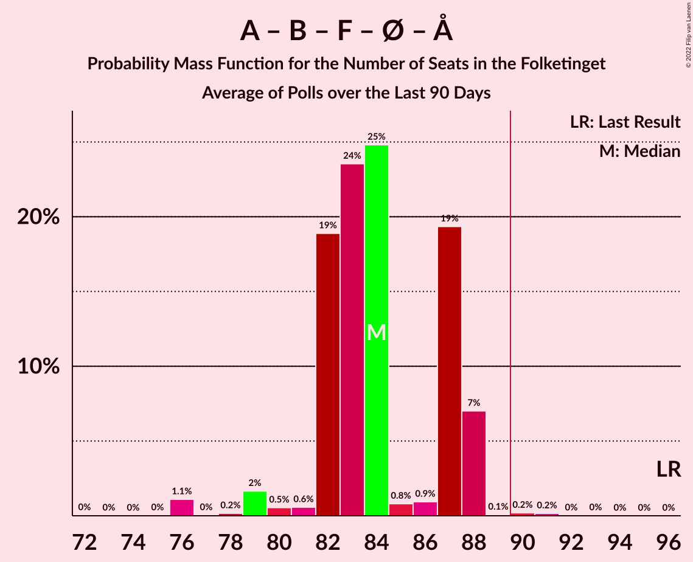

# Poll Average

<a href="#voting-intentions">Voting Intentions</a> | <a href="#seats">Seats</a> | <a href="#coalitions">Coalitions</a> | <a href="#technical-information">Technical Information</a>

## Summary

The table below lists the polls on which the average is based. They are the most recent polls (less than 90 days old) registered and analyzed so far.

| Period     | Polling firm/Commissioner(s) | A | V | O | B | F | Ø | C | Å | D | I | P | K | E | G | M |
|:----------:|:----------------------------:|:--:|:--:|:--:|:--:|:--:|:--:|:--:|:--:|:--:|:--:|:--:|:--:|:--:|:--:|:--:|
| 5 June 2019 | General Election | 25.9%   48 | 23.4%   43 | 8.7%   16 | 8.6%   16 | 7.7%   14 | 6.9%   13 | 6.6%   12 | 3.0%   5 | 2.4%   4 | 2.3%   4 | 1.8%   0 | 1.7%   0 | 0.8%   0 | 0.0%   0 | 0.0%   0 |
| N/A | Poll Average | 24–32%   42–60 | 8–17%   16–31 | 5–8%   9–15 | 4–7%   7–13 | 6–11%   12–19 | 6–11%   11–22 | 12–19%   22–34 | 0–2%   0 | 5–10%   9–18 | 2–5%   0–9 | N/A   N/A | 1–3%   0–6 | N/A   N/A | 0–1%   0 | 3–6%   4–11 |
| [18–24 October 2021](2021-10-24-Voxmeter.html) | Voxmeter | 24–30%   44–52 | 12–17%   21–30 | 5–9%   10–15 | 4–7%   8–12 | 6–10%   11–17 | 7–10%   12–18 | 12–16%   21–28 | 0–1%   0 | 5–8%   9–14 | 3–6%   6–10 | N/A   N/A | 1–2%   0–4 | N/A   N/A | 0–1%   0 | N/A   N/A |
| [14–21 October 2021](2021-10-21-Epinion.html) | Epinion | 26–30%   47–55 | 14–18%   28–32 | 5–7%   9–12 | 5–7%   9–12 | 7–9%   13–17 | 7–9%   13–16 | 12–15%   21–26 | 1–2%   0 | 5–7%   9–12 | 2–4%   4–6 | N/A   N/A | 1–2%   0–4 | N/A   N/A | 0–1%   0 | N/A   N/A |
| [3 October 2021](2021-10-03-Gallup.html) | Gallup | 25–30%   45–53 | 12–15%   20–27 | 6–8%   10–15 | 5–7%   9–13 | 7–10%   12–19 | 7–10%   14–18 | 13–16%   22–29 | 0–1%   0 | 5–7%   8–12 | 1–3%   0–5 | N/A   N/A | 2–3%   0–6 | N/A   N/A | 0%   0 | 3–4%   4–8 |
| [17–20 September 2021](2021-09-20-YouGov.html) | YouGov   B.T. | 28–33%   51–61 | 8–11%   14–20 | 5–8%   10–15 | 3–6%   6–10 | 6–9%   11–16 | 6–8%   10–15 | 15–19%   27–34 | 1–2%   0 | 7–10%   12–18 | 1–3%   0–5 | N/A   N/A | 1–2%   0–4 | N/A   N/A | N/A   N/A | 3–6%   7–11 |
| [23–26 August 2021](2021-08-26-Megafon.html) | Megafon   Politiken and TV 2 | 23–28%   41–49 | 11–15%   20–27 | 5–8%   9–14 | 3–6%   6–11 | 8–12%   14–21 | 9–12%   15–22 | 14–19%   25–34 | 0–2%   0 | 7–11%   13–19 | 2–4%   0–6 | N/A   N/A | 1–3%   0–5 | N/A   N/A | 0–1%   0 | N/A   N/A |
| 5 June 2019 | General Election | 25.9%   48 | 23.4%   43 | 8.7%   16 | 8.6%   16 | 7.7%   14 | 6.9%   13 | 6.6%   12 | 3.0%   5 | 2.4%   4 | 2.3%   4 | 1.8%   0 | 1.7%   0 | 0.8%   0 | 0.0%   0 | 0.0%   0 |

Only polls for which at least the sample size has been published are included in the table above.

**Legend:**
+ **Top half of each row:** Voting intentions (95% confidence interval)
+ **Bottom half of each row:** Seat projections for the Folketinget (95% confidence interval)
+ **A:** Socialdemokraterne
+ **V:** Venstre
+ **O:** Dansk Folkeparti
+ **B:** Radikale Venstre
+ **F:** Socialistisk Folkeparti
+ **Ø:** Enhedslisten–De Rød-Grønne
+ **C:** Det Konservative Folkeparti
+ **Å:** Alternativet
+ **D:** Nye Borgerlige
+ **I:** Liberal Alliance
+ **P:** Stram Kurs
+ **K:** Kristendemokraterne
+ **E:** Borgerlisten
+ **G:** Veganerpartiet
+ **M:** Moderaterne
+ **N/A (single party):** Party not included the published results
+ **N/A (entire row):** Calculation for this opinion poll not started yet

## Voting Intentions

### Confidence Intervals

| Party | Last Result | Median | 80% Confidence Interval | 90% Confidence Interval | 95% Confidence Interval | 99% Confidence Interval |
|:-----:|:-----------:|:------:|:-----------------------:|:-----------------------:|:-----------------------:|:-----------------------:|
| <a href="#socialdemokraterne">Socialdemokraterne</a> | 25.9% | 27.6% | 25.0–30.9% |24.3–31.7% | 23.7–32.3% | 22.6–33.4% |
| <a href="#venstre">Venstre</a> | 23.4% | 13.3% | 9.5–16.1% |8.9–16.6% | 8.5–17.0% | 7.9–17.8% |
| <a href="#dansk-folkeparti">Dansk Folkeparti</a> | 8.7% | 6.6% | 5.6–7.6% |5.3–7.9% | 5.1–8.2% | 4.7–8.8% |
| <a href="#radikale-venstre">Radikale Venstre</a> | 8.6% | 5.4% | 4.1–6.5% |3.8–6.8% | 3.6–7.1% | 3.3–7.5% |
| <a href="#socialistisk-folkeparti">Socialistisk Folkeparti</a> | 7.7% | 8.1% | 6.9–9.7% |6.6–10.2% | 6.4–10.7% | 5.9–11.5% |
| <a href="#enhedslisten–de-rød-grønne">Enhedslisten–De Rød-Grønne</a> | 6.9% | 8.3% | 6.7–10.3% |6.3–11.0% | 6.0–11.4% | 5.5–12.3% |
| <a href="#det-konservative-folkeparti">Det Konservative Folkeparti</a> | 6.6% | 14.8% | 13.0–17.6% |12.6–18.1% | 12.3–18.6% | 11.7–19.4% |
| <a href="#alternativet">Alternativet</a> | 3.0% | 0.9% | 0.5–1.5% |0.4–1.7% | 0.4–1.9% | 0.3–2.1% |
| <a href="#nye-borgerlige">Nye Borgerlige</a> | 2.4% | 6.8% | 5.3–9.3% |5.1–9.8% | 4.9–10.2% | 4.5–10.9% |
| <a href="#liberal-alliance">Liberal Alliance</a> | 2.3% | 2.6% | 1.7–4.3% |1.6–4.7% | 1.5–5.0% | 1.3–5.6% |
| <a href="#stram-kurs">Stram Kurs</a> | 1.8% | N/A | N/A |N/A | N/A | N/A |
| <a href="#kristendemokraterne">Kristendemokraterne</a> | 1.7% | 1.6% | 1.0–2.6% |0.9–2.9% | 0.8–3.1% | 0.6–3.4% |
| <a href="#borgerlisten">Borgerlisten</a> | 0.8% | N/A | N/A |N/A | N/A | N/A |
| <a href="#veganerpartiet">Veganerpartiet</a> | 0.0% | 0.4% | 0.1–0.8% |0.1–1.0% | 0.1–1.1% | 0.0–1.3% |
| <a href="#moderaterne">Moderaterne</a> | 0.0% | 4.0% | 3.1–5.0% |3.0–5.3% | 2.8–5.5% | 2.6–6.0% |

### Socialdemokraterne

*For a full overview of the results for this party, see the [Socialdemokraterne](party-socialdemokraterne.html) page.*

| Voting Intentions | Probability | Accumulated | Special Marks |
|:-----------------:|:-----------:|:-----------:|:-------------:|
| 20.5–21.5% | 0% | 100% |  |
| 21.5–22.5% | 0.4% | 99.9% |  |
| 22.5–23.5% | 2% | 99.6% |  |
| 23.5–24.5% | 5% | 98% |  |
| 24.5–25.5% | 9% | 93% |  |
| 25.5–26.5% | 14% | 85% | Last Result |
| 26.5–27.5% | 20% | 70% |  |
| 27.5–28.5% | 19% | 50% | Median |
| 28.5–29.5% | 12% | 32% |  |
| 29.5–30.5% | 8% | 20% |  |
| 30.5–31.5% | 6% | 12% |  |
| 31.5–32.5% | 4% | 6% |  |
| 32.5–33.5% | 1.5% | 2% |  |
| 33.5–34.5% | 0.3% | 0.4% |  |
| 34.5–35.5% | 0% | 0.1% |  |
| 35.5–36.5% | 0% | 0% |  |

### Venstre

*For a full overview of the results for this party, see the [Venstre](party-venstre.html) page.*

| Voting Intentions | Probability | Accumulated | Special Marks |
|:-----------------:|:-----------:|:-----------:|:-------------:|
| 5.5–6.5% | 0% | 100% |  |
| 6.5–7.5% | 0.1% | 100% |  |
| 7.5–8.5% | 2% | 99.9% |  |
| 8.5–9.5% | 8% | 97% |  |
| 9.5–10.5% | 7% | 89% |  |
| 10.5–11.5% | 5% | 82% |  |
| 11.5–12.5% | 11% | 77% |  |
| 12.5–13.5% | 20% | 66% | Median |
| 13.5–14.5% | 17% | 46% |  |
| 14.5–15.5% | 13% | 29% |  |
| 15.5–16.5% | 11% | 16% |  |
| 16.5–17.5% | 5% | 6% |  |
| 17.5–18.5% | 0.8% | 0.9% |  |
| 18.5–19.5% | 0.1% | 0.1% |  |
| 19.5–20.5% | 0% | 0% |  |
| 20.5–21.5% | 0% | 0% |  |
| 21.5–22.5% | 0% | 0% |  |
| 22.5–23.5% | 0% | 0% | Last Result |

### Dansk Folkeparti

*For a full overview of the results for this party, see the [Dansk Folkeparti](party-danskfolkeparti.html) page.*

| Voting Intentions | Probability | Accumulated | Special Marks |
|:-----------------:|:-----------:|:-----------:|:-------------:|
| 2.5–3.5% | 0% | 100% |  |
| 3.5–4.5% | 0.2% | 100% |  |
| 4.5–5.5% | 9% | 99.8% |  |
| 5.5–6.5% | 39% | 91% |  |
| 6.5–7.5% | 39% | 51% | Median |
| 7.5–8.5% | 11% | 12% |  |
| 8.5–9.5% | 1.0% | 1.0% | Last Result |
| 9.5–10.5% | 0% | 0% |  |

### Radikale Venstre

*For a full overview of the results for this party, see the [Radikale Venstre](party-radikalevenstre.html) page.*

| Voting Intentions | Probability | Accumulated | Special Marks |
|:-----------------:|:-----------:|:-----------:|:-------------:|
| 1.5–2.5% | 0% | 100% |  |
| 2.5–3.5% | 2% | 100% |  |
| 3.5–4.5% | 21% | 98% |  |
| 4.5–5.5% | 33% | 77% | Median |
| 5.5–6.5% | 34% | 43% |  |
| 6.5–7.5% | 9% | 10% |  |
| 7.5–8.5% | 0.4% | 0.4% |  |
| 8.5–9.5% | 0% | 0% | Last Result |

### Socialistisk Folkeparti

*For a full overview of the results for this party, see the [Socialistisk Folkeparti](party-socialistiskfolkeparti.html) page.*

| Voting Intentions | Probability | Accumulated | Special Marks |
|:-----------------:|:-----------:|:-----------:|:-------------:|
| 3.5–4.5% | 0% | 100% |  |
| 4.5–5.5% | 0.1% | 100% |  |
| 5.5–6.5% | 4% | 99.9% |  |
| 6.5–7.5% | 22% | 96% |  |
| 7.5–8.5% | 38% | 73% | Last Result, Median |
| 8.5–9.5% | 23% | 35% |  |
| 9.5–10.5% | 9% | 12% |  |
| 10.5–11.5% | 3% | 3% |  |
| 11.5–12.5% | 0.4% | 0.4% |  |
| 12.5–13.5% | 0% | 0% |  |

### Enhedslisten–De Rød-Grønne

*For a full overview of the results for this party, see the [Enhedslisten–De Rød-Grønne](party-enhedslisten–derød-grønne.html) page.*

| Voting Intentions | Probability | Accumulated | Special Marks |
|:-----------------:|:-----------:|:-----------:|:-------------:|
| 3.5–4.5% | 0% | 100% |  |
| 4.5–5.5% | 0.6% | 100% |  |
| 5.5–6.5% | 7% | 99.4% |  |
| 6.5–7.5% | 19% | 92% | Last Result |
| 7.5–8.5% | 30% | 73% | Median |
| 8.5–9.5% | 23% | 43% |  |
| 9.5–10.5% | 12% | 20% |  |
| 10.5–11.5% | 6% | 8% |  |
| 11.5–12.5% | 2% | 2% |  |
| 12.5–13.5% | 0.2% | 0.3% |  |
| 13.5–14.5% | 0% | 0% |  |

### Det Konservative Folkeparti

*For a full overview of the results for this party, see the [Det Konservative Folkeparti](party-detkonservativefolkeparti.html) page.*

| Voting Intentions | Probability | Accumulated | Special Marks |
|:-----------------:|:-----------:|:-----------:|:-------------:|
| 6.5–7.5% | 0% | 100% | Last Result |
| 7.5–8.5% | 0% | 100% |  |
| 8.5–9.5% | 0% | 100% |  |
| 9.5–10.5% | 0% | 100% |  |
| 10.5–11.5% | 0.4% | 100% |  |
| 11.5–12.5% | 4% | 99.6% |  |
| 12.5–13.5% | 16% | 95% |  |
| 13.5–14.5% | 24% | 79% |  |
| 14.5–15.5% | 17% | 55% | Median |
| 15.5–16.5% | 14% | 38% |  |
| 16.5–17.5% | 13% | 24% |  |
| 17.5–18.5% | 8% | 10% |  |
| 18.5–19.5% | 2% | 3% |  |
| 19.5–20.5% | 0.3% | 0.4% |  |
| 20.5–21.5% | 0% | 0% |  |

### Alternativet

*For a full overview of the results for this party, see the [Alternativet](party-alternativet.html) page.*

| Voting Intentions | Probability | Accumulated | Special Marks |
|:-----------------:|:-----------:|:-----------:|:-------------:|
| 0.0–0.5% | 14% | 100% |  |
| 0.5–1.5% | 76% | 86% | Median |
| 1.5–2.5% | 10% | 10% |  |
| 2.5–3.5% | 0% | 0% | Last Result |

### Nye Borgerlige

*For a full overview of the results for this party, see the [Nye Borgerlige](party-nyeborgerlige.html) page.*

| Voting Intentions | Probability | Accumulated | Special Marks |
|:-----------------:|:-----------:|:-----------:|:-------------:|
| 1.5–2.5% | 0% | 100% | Last Result |
| 2.5–3.5% | 0% | 100% |  |
| 3.5–4.5% | 0.6% | 100% |  |
| 4.5–5.5% | 16% | 99.4% |  |
| 5.5–6.5% | 29% | 84% |  |
| 6.5–7.5% | 15% | 54% | Median |
| 7.5–8.5% | 17% | 39% |  |
| 8.5–9.5% | 16% | 23% |  |
| 9.5–10.5% | 6% | 7% |  |
| 10.5–11.5% | 1.0% | 1.1% |  |
| 11.5–12.5% | 0.1% | 0.1% |  |
| 12.5–13.5% | 0% | 0% |  |

### Liberal Alliance

*For a full overview of the results for this party, see the [Liberal Alliance](party-liberalalliance.html) page.*

| Voting Intentions | Probability | Accumulated | Special Marks |
|:-----------------:|:-----------:|:-----------:|:-------------:|
| 0.0–0.5% | 0% | 100% |  |
| 0.5–1.5% | 4% | 100% |  |
| 1.5–2.5% | 45% | 96% | Last Result |
| 2.5–3.5% | 32% | 52% | Median |
| 3.5–4.5% | 14% | 20% |  |
| 4.5–5.5% | 6% | 6% |  |
| 5.5–6.5% | 0.6% | 0.6% |  |
| 6.5–7.5% | 0% | 0% |  |

### Kristendemokraterne

*For a full overview of the results for this party, see the [Kristendemokraterne](party-kristendemokraterne.html) page.*

| Voting Intentions | Probability | Accumulated | Special Marks |
|:-----------------:|:-----------:|:-----------:|:-------------:|
| 0.0–0.5% | 0.2% | 100% |  |
| 0.5–1.5% | 47% | 99.8% |  |
| 1.5–2.5% | 41% | 53% | Last Result, Median |
| 2.5–3.5% | 12% | 12% |  |
| 3.5–4.5% | 0.2% | 0.2% |  |
| 4.5–5.5% | 0% | 0% |  |

### Veganerpartiet

*For a full overview of the results for this party, see the [Veganerpartiet](party-veganerpartiet.html) page.*

| Voting Intentions | Probability | Accumulated | Special Marks |
|:-----------------:|:-----------:|:-----------:|:-------------:|
| 0.0–0.5% | 66% | 100% | Last Result, Median |
| 0.5–1.5% | 34% | 34% |  |
| 1.5–2.5% | 0% | 0% |  |
| 2.5–3.5% | 0% | 0% |  |

### Moderaterne

*For a full overview of the results for this party, see the [Moderaterne](party-moderaterne.html) page.*

| Voting Intentions | Probability | Accumulated | Special Marks |
|:-----------------:|:-----------:|:-----------:|:-------------:|
| 0.0–0.5% | 0% | 100% | Last Result |
| 0.5–1.5% | 0% | 100% |  |
| 1.5–2.5% | 0.4% | 100% |  |
| 2.5–3.5% | 28% | 99.6% |  |
| 3.5–4.5% | 47% | 72% | Median |
| 4.5–5.5% | 22% | 25% |  |
| 5.5–6.5% | 2% | 2% |  |
| 6.5–7.5% | 0.1% | 0.1% |  |
| 7.5–8.5% | 0% | 0% |  |

## Seats

### Confidence Intervals

| Party | Last Result | Median | 80% Confidence Interval | 90% Confidence Interval | 95% Confidence Interval | 99% Confidence Interval |
|:-----:|:-----------:|:------:|:-----------------------:|:-----------------------:|:-----------------------:|:-----------------------:|
| <a href="#socialdemokraterne">Socialdemokraterne</a> | 48 | 50 | 45–55 |44–56 | 42–60 | 41–61 |
| <a href="#venstre">Venstre</a> | 43 | 23 | 17–31 |16–31 | 16–31 | 14–32 |
| <a href="#dansk-folkeparti">Dansk Folkeparti</a> | 16 | 11 | 10–14 |9–14 | 9–15 | 9–16 |
| <a href="#radikale-venstre">Radikale Venstre</a> | 16 | 10 | 7–12 |7–13 | 7–13 | 6–13 |
| <a href="#socialistisk-folkeparti">Socialistisk Folkeparti</a> | 14 | 15 | 12–17 |12–18 | 12–19 | 11–21 |
| <a href="#enhedslisten–de-rød-grønne">Enhedslisten–De Rød-Grønne</a> | 13 | 15 | 12–19 |11–21 | 11–22 | 10–22 |
| <a href="#det-konservative-folkeparti">Det Konservative Folkeparti</a> | 12 | 26 | 23–32 |22–34 | 22–34 | 21–34 |
| <a href="#alternativet">Alternativet</a> | 5 | 0 | 0 |0 | 0 | 0 |
| <a href="#nye-borgerlige">Nye Borgerlige</a> | 4 | 13 | 9–17 |9–17 | 9–18 | 8–19 |
| <a href="#liberal-alliance">Liberal Alliance</a> | 4 | 5 | 0–8 |0–9 | 0–9 | 0–10 |
| <a href="#stram-kurs">Stram Kurs</a> | 0 | N/A | N/A |N/A | N/A | N/A |
| <a href="#kristendemokraterne">Kristendemokraterne</a> | 0 | 0 | 0–5 |0–5 | 0–6 | 0–6 |
| <a href="#borgerlisten">Borgerlisten</a> | 0 | N/A | N/A |N/A | N/A | N/A |
| <a href="#veganerpartiet">Veganerpartiet</a> | 0 | 0 | 0 |0 | 0 | 0 |
| <a href="#moderaterne">Moderaterne</a> | 0 | 7 | 5–10 |4–10 | 4–11 | 4–11 |

### Socialdemokraterne

*For a full overview of the results for this party, see the [Socialdemokraterne](party-socialdemokraterne.html) page.*

| Number of Seats | Probability | Accumulated | Special Marks |
|:---------------:|:-----------:|:-----------:|:-------------:|
| 39 | 0.1% | 100% |  |
| 40 | 0.2% | 99.9% |  |
| 41 | 1.4% | 99.7% |  |
| 42 | 1.0% | 98% |  |
| 43 | 1.1% | 97% |  |
| 44 | 4% | 96% |  |
| 45 | 3% | 93% |  |
| 46 | 3% | 89% |  |
| 47 | 19% | 86% |  |
| 48 | 8% | 67% | Last Result |
| 49 | 5% | 59% |  |
| 50 | 8% | 54% | Median |
| 51 | 20% | 46% |  |
| 52 | 2% | 26% |  |
| 53 | 5% | 25% |  |
| 54 | 5% | 19% |  |
| 55 | 5% | 14% |  |
| 56 | 5% | 9% |  |
| 57 | 1.3% | 5% |  |
| 58 | 0.6% | 4% |  |
| 59 | 0.3% | 3% |  |
| 60 | 0.8% | 3% |  |
| 61 | 2% | 2% |  |
| 62 | 0.3% | 0.3% |  |
| 63 | 0% | 0% |  |

### Venstre

*For a full overview of the results for this party, see the [Venstre](party-venstre.html) page.*

| Number of Seats | Probability | Accumulated | Special Marks |
|:---------------:|:-----------:|:-----------:|:-------------:|
| 13 | 0.1% | 100% |  |
| 14 | 0.6% | 99.9% |  |
| 15 | 1.2% | 99.4% |  |
| 16 | 7% | 98% |  |
| 17 | 4% | 91% |  |
| 18 | 4% | 87% |  |
| 19 | 2% | 82% |  |
| 20 | 2% | 80% |  |
| 21 | 4% | 78% |  |
| 22 | 6% | 74% |  |
| 23 | 20% | 68% | Median |
| 24 | 5% | 48% |  |
| 25 | 9% | 43% |  |
| 26 | 6% | 34% |  |
| 27 | 2% | 28% |  |
| 28 | 3% | 25% |  |
| 29 | 2% | 23% |  |
| 30 | 7% | 20% |  |
| 31 | 12% | 13% |  |
| 32 | 0.4% | 0.5% |  |
| 33 | 0.1% | 0.1% |  |
| 34 | 0% | 0% |  |
| 35 | 0% | 0% |  |
| 36 | 0% | 0% |  |
| 37 | 0% | 0% |  |
| 38 | 0% | 0% |  |
| 39 | 0% | 0% |  |
| 40 | 0% | 0% |  |
| 41 | 0% | 0% |  |
| 42 | 0% | 0% |  |
| 43 | 0% | 0% | Last Result |

### Dansk Folkeparti

*For a full overview of the results for this party, see the [Dansk Folkeparti](party-danskfolkeparti.html) page.*

| Number of Seats | Probability | Accumulated | Special Marks |
|:---------------:|:-----------:|:-----------:|:-------------:|
| 8 | 0.4% | 100% |  |
| 9 | 7% | 99.6% |  |
| 10 | 26% | 92% |  |
| 11 | 17% | 66% | Median |
| 12 | 23% | 49% |  |
| 13 | 10% | 26% |  |
| 14 | 14% | 17% |  |
| 15 | 2% | 3% |  |
| 16 | 0.6% | 0.7% | Last Result |
| 17 | 0.1% | 0.1% |  |
| 18 | 0% | 0% |  |

### Radikale Venstre

*For a full overview of the results for this party, see the [Radikale Venstre](party-radikalevenstre.html) page.*

| Number of Seats | Probability | Accumulated | Special Marks |
|:---------------:|:-----------:|:-----------:|:-------------:|
| 5 | 0.2% | 100% |  |
| 6 | 2% | 99.8% |  |
| 7 | 10% | 98% |  |
| 8 | 21% | 87% |  |
| 9 | 13% | 67% |  |
| 10 | 20% | 54% | Median |
| 11 | 21% | 33% |  |
| 12 | 7% | 12% |  |
| 13 | 6% | 6% |  |
| 14 | 0.2% | 0.2% |  |
| 15 | 0% | 0% |  |
| 16 | 0% | 0% | Last Result |

### Socialistisk Folkeparti

*For a full overview of the results for this party, see the [Socialistisk Folkeparti](party-socialistiskfolkeparti.html) page.*

| Number of Seats | Probability | Accumulated | Special Marks |
|:---------------:|:-----------:|:-----------:|:-------------:|
| 10 | 0.3% | 100% |  |
| 11 | 2% | 99.7% |  |
| 12 | 12% | 98% |  |
| 13 | 16% | 86% |  |
| 14 | 16% | 70% | Last Result |
| 15 | 27% | 54% | Median |
| 16 | 14% | 28% |  |
| 17 | 4% | 14% |  |
| 18 | 6% | 10% |  |
| 19 | 2% | 4% |  |
| 20 | 0.5% | 1.3% |  |
| 21 | 0.6% | 0.7% |  |
| 22 | 0.1% | 0.1% |  |
| 23 | 0% | 0% |  |

### Enhedslisten–De Rød-Grønne

*For a full overview of the results for this party, see the [Enhedslisten–De Rød-Grønne](party-enhedslisten–derød-grønne.html) page.*

| Number of Seats | Probability | Accumulated | Special Marks |
|:---------------:|:-----------:|:-----------:|:-------------:|
| 9 | 0.1% | 100% |  |
| 10 | 2% | 99.9% |  |
| 11 | 7% | 98% |  |
| 12 | 8% | 91% |  |
| 13 | 12% | 83% | Last Result |
| 14 | 18% | 72% |  |
| 15 | 14% | 54% | Median |
| 16 | 15% | 40% |  |
| 17 | 3% | 25% |  |
| 18 | 10% | 22% |  |
| 19 | 5% | 12% |  |
| 20 | 2% | 7% |  |
| 21 | 2% | 5% |  |
| 22 | 3% | 3% |  |
| 23 | 0.1% | 0.3% |  |
| 24 | 0.1% | 0.2% |  |
| 25 | 0.1% | 0.1% |  |
| 26 | 0% | 0% |  |

### Det Konservative Folkeparti

*For a full overview of the results for this party, see the [Det Konservative Folkeparti](party-detkonservativefolkeparti.html) page.*

| Number of Seats | Probability | Accumulated | Special Marks |
|:---------------:|:-----------:|:-----------:|:-------------:|
| 12 | 0% | 100% | Last Result |
| 13 | 0% | 100% |  |
| 14 | 0% | 100% |  |
| 15 | 0% | 100% |  |
| 16 | 0% | 100% |  |
| 17 | 0% | 100% |  |
| 18 | 0% | 100% |  |
| 19 | 0% | 100% |  |
| 20 | 0.2% | 100% |  |
| 21 | 1.3% | 99.8% |  |
| 22 | 5% | 98.6% |  |
| 23 | 11% | 94% |  |
| 24 | 9% | 83% |  |
| 25 | 21% | 74% |  |
| 26 | 7% | 53% | Median |
| 27 | 8% | 46% |  |
| 28 | 3% | 38% |  |
| 29 | 10% | 35% |  |
| 30 | 5% | 26% |  |
| 31 | 9% | 21% |  |
| 32 | 3% | 11% |  |
| 33 | 2% | 8% |  |
| 34 | 6% | 6% |  |
| 35 | 0.2% | 0.3% |  |
| 36 | 0.1% | 0.1% |  |
| 37 | 0.1% | 0.1% |  |
| 38 | 0% | 0% |  |

### Alternativet

*For a full overview of the results for this party, see the [Alternativet](party-alternativet.html) page.*

| Number of Seats | Probability | Accumulated | Special Marks |
|:---------------:|:-----------:|:-----------:|:-------------:|
| 0 | 99.6% | 100% | Median |
| 1 | 0% | 0.4% |  |
| 2 | 0% | 0.4% |  |
| 3 | 0% | 0.4% |  |
| 4 | 0.4% | 0.4% |  |
| 5 | 0% | 0% | Last Result |

### Nye Borgerlige

*For a full overview of the results for this party, see the [Nye Borgerlige](party-nyeborgerlige.html) page.*

| Number of Seats | Probability | Accumulated | Special Marks |
|:---------------:|:-----------:|:-----------:|:-------------:|
| 4 | 0% | 100% | Last Result |
| 5 | 0% | 100% |  |
| 6 | 0% | 100% |  |
| 7 | 0.1% | 100% |  |
| 8 | 1.2% | 99.9% |  |
| 9 | 18% | 98.7% |  |
| 10 | 10% | 81% |  |
| 11 | 13% | 71% |  |
| 12 | 8% | 58% |  |
| 13 | 12% | 50% | Median |
| 14 | 6% | 38% |  |
| 15 | 5% | 31% |  |
| 16 | 10% | 26% |  |
| 17 | 12% | 17% |  |
| 18 | 3% | 4% |  |
| 19 | 2% | 2% |  |
| 20 | 0.2% | 0.3% |  |
| 21 | 0.1% | 0.2% |  |
| 22 | 0% | 0% |  |

### Liberal Alliance

*For a full overview of the results for this party, see the [Liberal Alliance](party-liberalalliance.html) page.*

| Number of Seats | Probability | Accumulated | Special Marks |
|:---------------:|:-----------:|:-----------:|:-------------:|
| 0 | 22% | 100% |  |
| 1 | 0% | 78% |  |
| 2 | 0% | 78% |  |
| 3 | 0% | 78% |  |
| 4 | 28% | 78% | Last Result |
| 5 | 23% | 50% | Median |
| 6 | 7% | 27% |  |
| 7 | 9% | 20% |  |
| 8 | 5% | 11% |  |
| 9 | 4% | 6% |  |
| 10 | 1.0% | 1.2% |  |
| 11 | 0.2% | 0.2% |  |
| 12 | 0% | 0% |  |

### Stram Kurs

*For a full overview of the results for this party, see the [Stram Kurs](party-stramkurs.html) page.*

### Kristendemokraterne

*For a full overview of the results for this party, see the [Kristendemokraterne](party-kristendemokraterne.html) page.*

| Number of Seats | Probability | Accumulated | Special Marks |
|:---------------:|:-----------:|:-----------:|:-------------:|
| 0 | 75% | 100% | Last Result, Median |
| 1 | 0% | 25% |  |
| 2 | 0% | 25% |  |
| 3 | 0.1% | 25% |  |
| 4 | 11% | 25% |  |
| 5 | 9% | 13% |  |
| 6 | 4% | 4% |  |
| 7 | 0.1% | 0.1% |  |
| 8 | 0% | 0% |  |

### Borgerlisten

*For a full overview of the results for this party, see the [Borgerlisten](party-borgerlisten.html) page.*

### Veganerpartiet

*For a full overview of the results for this party, see the [Veganerpartiet](party-veganerpartiet.html) page.*

| Number of Seats | Probability | Accumulated | Special Marks |
|:---------------:|:-----------:|:-----------:|:-------------:|
| 0 | 100% | 100% | Last Result, Median |

### Moderaterne

*For a full overview of the results for this party, see the [Moderaterne](party-moderaterne.html) page.*

| Number of Seats | Probability | Accumulated | Special Marks |
|:---------------:|:-----------:|:-----------:|:-------------:|
| 0 | 0% | 100% | Last Result |
| 1 | 0% | 100% |  |
| 2 | 0% | 100% |  |
| 3 | 0% | 100% |  |
| 4 | 9% | 100% |  |
| 5 | 4% | 91% |  |
| 6 | 20% | 86% |  |
| 7 | 29% | 66% | Median |
| 8 | 16% | 38% |  |
| 9 | 7% | 21% |  |
| 10 | 11% | 15% |  |
| 11 | 3% | 3% |  |
| 12 | 0.2% | 0.2% |  |
| 13 | 0% | 0% |  |

## Coalitions

### Confidence Intervals

| Coalition | Last Result | Median | Majority? | 80% Confidence Interval | 90% Confidence Interval | 95% Confidence Interval | 99% Confidence Interval |
|:---------:|:-----------:|:------:|:---------:|:-----------------------:|:-----------------------:|:-----------------------:|:-----------------------:|
| Socialdemokraterne – Radikale Venstre – Socialistisk Folkeparti – Enhedslisten–De Rød-Grønne – Alternativet | 96 | 90 | 50% | 85–93 | 84–94 | 83–95 | 81–96 |
| Socialdemokraterne – Radikale Venstre – Socialistisk Folkeparti – Enhedslisten–De Rød-Grønne | 91 | 90 | 50% | 85–93 | 84–94 | 83–95 | 81–96 |
| Venstre – Dansk Folkeparti – Det Konservative Folkeparti – Nye Borgerlige – Liberal Alliance – Kristendemokraterne – Borgerlisten – Moderaterne | 79 | 83 | 3% | 80–87 | 79–89 | 78–91 | 76–93 |
| Venstre – Dansk Folkeparti – Det Konservative Folkeparti – Nye Borgerlige – Liberal Alliance – Stram Kurs – Kristendemokraterne – Borgerlisten | 79 | 80 | 2% | 76–86 | 75–87 | 73–88 | 71–92 |
| Venstre – Dansk Folkeparti – Det Konservative Folkeparti – Nye Borgerlige – Liberal Alliance – Kristendemokraterne – Borgerlisten | 79 | 80 | 2% | 76–86 | 75–87 | 73–88 | 71–92 |
| Venstre – Dansk Folkeparti – Det Konservative Folkeparti – Nye Borgerlige – Liberal Alliance – Kristendemokraterne | 79 | 80 | 2% | 76–86 | 75–87 | 73–88 | 71–92 |
| Venstre – Dansk Folkeparti – Det Konservative Folkeparti – Nye Borgerlige – Liberal Alliance – Borgerlisten | 79 | 80 | 1.4% | 72–85 | 71–87 | 71–88 | 68–91 |
| Venstre – Dansk Folkeparti – Det Konservative Folkeparti – Nye Borgerlige – Liberal Alliance | 79 | 80 | 1.4% | 72–85 | 71–87 | 71–88 | 68–91 |
| Socialdemokraterne – Socialistisk Folkeparti – Enhedslisten–De Rød-Grønne – Alternativet | 80 | 80 | 0% | 76–84 | 74–85 | 73–86 | 70–87 |
| Socialdemokraterne – Socialistisk Folkeparti – Enhedslisten–De Rød-Grønne | 75 | 80 | 0% | 76–84 | 74–85 | 73–86 | 70–87 |
| Socialdemokraterne – Radikale Venstre – Socialistisk Folkeparti | 78 | 74 | 0% | 70–78 | 68–80 | 67–80 | 65–82 |
| Venstre – Dansk Folkeparti – Det Konservative Folkeparti – Liberal Alliance – Kristendemokraterne | 75 | 69 | 0% | 62–72 | 60–73 | 59–75 | 57–77 |
| Venstre – Dansk Folkeparti – Det Konservative Folkeparti – Liberal Alliance | 75 | 67 | 0% | 61–71 | 60–73 | 59–74 | 56–76 |
| Socialdemokraterne – Radikale Venstre | 64 | 61 | 0% | 54–64 | 53–65 | 51–68 | 48–69 |
| Venstre – Det Konservative Folkeparti – Liberal Alliance | 59 | 57 | 0% | 48–61 | 47–61 | 46–62 | 44–63 |
| Venstre – Det Konservative Folkeparti | 55 | 50 | 0% | 46–56 | 45–56 | 45–56 | 44–57 |
| Venstre | 43 | 23 | 0% | 17–31 | 16–31 | 16–31 | 14–32 |

### Socialdemokraterne – Radikale Venstre – Socialistisk Folkeparti – Enhedslisten–De Rød-Grønne – Alternativet

| Number of Seats | Probability | Accumulated | Special Marks |
|:---------------:|:-----------:|:-----------:|:-------------:|
| 79 | 0.1% | 100% |  |
| 80 | 0.2% | 99.8% |  |
| 81 | 1.4% | 99.7% |  |
| 82 | 0.5% | 98% |  |
| 83 | 1.1% | 98% |  |
| 84 | 6% | 97% |  |
| 85 | 1.4% | 91% |  |
| 86 | 11% | 89% |  |
| 87 | 5% | 78% |  |
| 88 | 19% | 73% |  |
| 89 | 4% | 54% |  |
| 90 | 3% | 50% | Median, Majority |
| 91 | 18% | 48% |  |
| 92 | 16% | 29% |  |
| 93 | 4% | 14% |  |
| 94 | 6% | 10% |  |
| 95 | 2% | 4% |  |
| 96 | 2% | 2% | Last Result |
| 97 | 0.1% | 0.3% |  |
| 98 | 0.1% | 0.1% |  |
| 99 | 0% | 0% |  |

### Socialdemokraterne – Radikale Venstre – Socialistisk Folkeparti – Enhedslisten–De Rød-Grønne

| Number of Seats | Probability | Accumulated | Special Marks |
|:---------------:|:-----------:|:-----------:|:-------------:|
| 79 | 0.1% | 100% |  |
| 80 | 0.2% | 99.8% |  |
| 81 | 1.4% | 99.7% |  |
| 82 | 0.5% | 98% |  |
| 83 | 1.1% | 98% |  |
| 84 | 6% | 97% |  |
| 85 | 1.4% | 90% |  |
| 86 | 11% | 89% |  |
| 87 | 5% | 78% |  |
| 88 | 19% | 73% |  |
| 89 | 4% | 54% |  |
| 90 | 3% | 50% | Median, Majority |
| 91 | 18% | 47% | Last Result |
| 92 | 16% | 29% |  |
| 93 | 4% | 14% |  |
| 94 | 6% | 10% |  |
| 95 | 2% | 4% |  |
| 96 | 2% | 2% |  |
| 97 | 0.1% | 0.2% |  |
| 98 | 0.1% | 0.1% |  |
| 99 | 0% | 0% |  |

### Venstre – Dansk Folkeparti – Det Konservative Folkeparti – Nye Borgerlige – Liberal Alliance – Kristendemokraterne – Borgerlisten – Moderaterne

| Number of Seats | Probability | Accumulated | Special Marks |
|:---------------:|:-----------:|:-----------:|:-------------:|
| 74 | 0% | 100% |  |
| 75 | 0.1% | 99.9% |  |
| 76 | 2% | 99.9% |  |
| 77 | 0.2% | 98% |  |
| 78 | 0.5% | 98% |  |
| 79 | 3% | 97% | Last Result |
| 80 | 14% | 94% |  |
| 81 | 6% | 80% |  |
| 82 | 12% | 74% |  |
| 83 | 23% | 62% |  |
| 84 | 7% | 39% |  |
| 85 | 3% | 32% | Median |
| 86 | 3% | 29% |  |
| 87 | 16% | 26% |  |
| 88 | 4% | 9% |  |
| 89 | 2% | 5% |  |
| 90 | 0.6% | 3% | Majority |
| 91 | 2% | 3% |  |
| 92 | 0.5% | 1.0% |  |
| 93 | 0.2% | 0.5% |  |
| 94 | 0.3% | 0.4% |  |
| 95 | 0% | 0.1% |  |
| 96 | 0.1% | 0.1% |  |
| 97 | 0% | 0% |  |

### Venstre – Dansk Folkeparti – Det Konservative Folkeparti – Nye Borgerlige – Liberal Alliance – Stram Kurs – Kristendemokraterne – Borgerlisten

| Number of Seats | Probability | Accumulated | Special Marks |
|:---------------:|:-----------:|:-----------:|:-------------:|
| 70 | 0.2% | 100% |  |
| 71 | 0.4% | 99.8% |  |
| 72 | 0.6% | 99.5% |  |
| 73 | 2% | 98.9% |  |
| 74 | 1.4% | 97% |  |
| 75 | 2% | 96% |  |
| 76 | 7% | 94% |  |
| 77 | 10% | 86% |  |
| 78 | 2% | 76% | Median |
| 79 | 9% | 74% | Last Result |
| 80 | 18% | 65% |  |
| 81 | 7% | 47% |  |
| 82 | 9% | 39% |  |
| 83 | 13% | 30% |  |
| 84 | 4% | 17% |  |
| 85 | 2% | 13% |  |
| 86 | 2% | 11% |  |
| 87 | 6% | 9% |  |
| 88 | 0.8% | 3% |  |
| 89 | 0.9% | 2% |  |
| 90 | 0.1% | 2% | Majority |
| 91 | 1.0% | 2% |  |
| 92 | 0.1% | 0.5% |  |
| 93 | 0.1% | 0.5% |  |
| 94 | 0.3% | 0.3% |  |
| 95 | 0% | 0.1% |  |
| 96 | 0.1% | 0.1% |  |
| 97 | 0% | 0% |  |

### Venstre – Dansk Folkeparti – Det Konservative Folkeparti – Nye Borgerlige – Liberal Alliance – Kristendemokraterne – Borgerlisten

| Number of Seats | Probability | Accumulated | Special Marks |
|:---------------:|:-----------:|:-----------:|:-------------:|
| 70 | 0.2% | 100% |  |
| 71 | 0.4% | 99.8% |  |
| 72 | 0.6% | 99.5% |  |
| 73 | 2% | 98.9% |  |
| 74 | 1.4% | 97% |  |
| 75 | 2% | 96% |  |
| 76 | 7% | 94% |  |
| 77 | 10% | 86% |  |
| 78 | 2% | 76% | Median |
| 79 | 9% | 74% | Last Result |
| 80 | 18% | 65% |  |
| 81 | 7% | 47% |  |
| 82 | 9% | 39% |  |
| 83 | 13% | 30% |  |
| 84 | 4% | 17% |  |
| 85 | 2% | 13% |  |
| 86 | 2% | 11% |  |
| 87 | 6% | 9% |  |
| 88 | 0.8% | 3% |  |
| 89 | 0.9% | 2% |  |
| 90 | 0.1% | 2% | Majority |
| 91 | 1.0% | 2% |  |
| 92 | 0.1% | 0.5% |  |
| 93 | 0.1% | 0.5% |  |
| 94 | 0.3% | 0.3% |  |
| 95 | 0% | 0.1% |  |
| 96 | 0.1% | 0.1% |  |
| 97 | 0% | 0% |  |

### Venstre – Dansk Folkeparti – Det Konservative Folkeparti – Nye Borgerlige – Liberal Alliance – Kristendemokraterne

| Number of Seats | Probability | Accumulated | Special Marks |
|:---------------:|:-----------:|:-----------:|:-------------:|
| 70 | 0.2% | 100% |  |
| 71 | 0.4% | 99.8% |  |
| 72 | 0.6% | 99.5% |  |
| 73 | 2% | 98.9% |  |
| 74 | 1.4% | 97% |  |
| 75 | 2% | 96% |  |
| 76 | 7% | 94% |  |
| 77 | 10% | 86% |  |
| 78 | 2% | 76% | Median |
| 79 | 9% | 74% | Last Result |
| 80 | 18% | 65% |  |
| 81 | 7% | 47% |  |
| 82 | 9% | 39% |  |
| 83 | 13% | 30% |  |
| 84 | 4% | 17% |  |
| 85 | 2% | 13% |  |
| 86 | 2% | 11% |  |
| 87 | 6% | 9% |  |
| 88 | 0.8% | 3% |  |
| 89 | 0.9% | 2% |  |
| 90 | 0.1% | 2% | Majority |
| 91 | 1.0% | 2% |  |
| 92 | 0.1% | 0.5% |  |
| 93 | 0.1% | 0.5% |  |
| 94 | 0.3% | 0.3% |  |
| 95 | 0% | 0.1% |  |
| 96 | 0.1% | 0.1% |  |
| 97 | 0% | 0% |  |

### Venstre – Dansk Folkeparti – Det Konservative Folkeparti – Nye Borgerlige – Liberal Alliance – Borgerlisten

| Number of Seats | Probability | Accumulated | Special Marks |
|:---------------:|:-----------:|:-----------:|:-------------:|
| 67 | 0.1% | 100% |  |
| 68 | 1.0% | 99.9% |  |
| 69 | 0.2% | 98.9% |  |
| 70 | 1.2% | 98.7% |  |
| 71 | 5% | 98% |  |
| 72 | 5% | 93% |  |
| 73 | 1.3% | 88% |  |
| 74 | 5% | 87% |  |
| 75 | 3% | 81% |  |
| 76 | 4% | 79% |  |
| 77 | 7% | 74% |  |
| 78 | 2% | 67% | Median |
| 79 | 6% | 65% | Last Result |
| 80 | 16% | 59% |  |
| 81 | 7% | 43% |  |
| 82 | 8% | 36% |  |
| 83 | 13% | 28% |  |
| 84 | 3% | 15% |  |
| 85 | 2% | 12% |  |
| 86 | 2% | 10% |  |
| 87 | 5% | 8% |  |
| 88 | 0.6% | 3% |  |
| 89 | 0.7% | 2% |  |
| 90 | 0.3% | 1.4% | Majority |
| 91 | 0.9% | 1.1% |  |
| 92 | 0.1% | 0.2% |  |
| 93 | 0.1% | 0.1% |  |
| 94 | 0% | 0% |  |

### Venstre – Dansk Folkeparti – Det Konservative Folkeparti – Nye Borgerlige – Liberal Alliance

| Number of Seats | Probability | Accumulated | Special Marks |
|:---------------:|:-----------:|:-----------:|:-------------:|
| 67 | 0.1% | 100% |  |
| 68 | 1.0% | 99.9% |  |
| 69 | 0.2% | 98.9% |  |
| 70 | 1.2% | 98.7% |  |
| 71 | 5% | 98% |  |
| 72 | 5% | 93% |  |
| 73 | 1.3% | 88% |  |
| 74 | 5% | 87% |  |
| 75 | 3% | 81% |  |
| 76 | 4% | 79% |  |
| 77 | 7% | 74% |  |
| 78 | 2% | 67% | Median |
| 79 | 6% | 65% | Last Result |
| 80 | 16% | 59% |  |
| 81 | 7% | 43% |  |
| 82 | 8% | 36% |  |
| 83 | 13% | 28% |  |
| 84 | 3% | 15% |  |
| 85 | 2% | 12% |  |
| 86 | 2% | 10% |  |
| 87 | 5% | 8% |  |
| 88 | 0.6% | 3% |  |
| 89 | 0.7% | 2% |  |
| 90 | 0.3% | 1.4% | Majority |
| 91 | 0.9% | 1.1% |  |
| 92 | 0.1% | 0.2% |  |
| 93 | 0.1% | 0.1% |  |
| 94 | 0% | 0% |  |

### Socialdemokraterne – Socialistisk Folkeparti – Enhedslisten–De Rød-Grønne – Alternativet

| Number of Seats | Probability | Accumulated | Special Marks |
|:---------------:|:-----------:|:-----------:|:-------------:|
| 69 | 0.1% | 100% |  |
| 70 | 0.8% | 99.9% |  |
| 71 | 0.1% | 99.1% |  |
| 72 | 1.1% | 99.0% |  |
| 73 | 0.6% | 98% |  |
| 74 | 4% | 97% |  |
| 75 | 2% | 93% |  |
| 76 | 8% | 92% |  |
| 77 | 5% | 84% |  |
| 78 | 8% | 79% |  |
| 79 | 12% | 71% |  |
| 80 | 26% | 59% | Last Result, Median |
| 81 | 10% | 34% |  |
| 82 | 4% | 24% |  |
| 83 | 4% | 20% |  |
| 84 | 8% | 16% |  |
| 85 | 4% | 8% |  |
| 86 | 3% | 4% |  |
| 87 | 0.6% | 0.8% |  |
| 88 | 0.1% | 0.2% |  |
| 89 | 0.1% | 0.1% |  |
| 90 | 0% | 0% | Majority |

### Socialdemokraterne – Socialistisk Folkeparti – Enhedslisten–De Rød-Grønne

| Number of Seats | Probability | Accumulated | Special Marks |
|:---------------:|:-----------:|:-----------:|:-------------:|
| 69 | 0.1% | 100% |  |
| 70 | 0.8% | 99.9% |  |
| 71 | 0.1% | 99.1% |  |
| 72 | 1.1% | 99.0% |  |
| 73 | 0.6% | 98% |  |
| 74 | 4% | 97% |  |
| 75 | 2% | 93% | Last Result |
| 76 | 8% | 92% |  |
| 77 | 6% | 84% |  |
| 78 | 8% | 78% |  |
| 79 | 12% | 71% |  |
| 80 | 26% | 59% | Median |
| 81 | 10% | 34% |  |
| 82 | 4% | 24% |  |
| 83 | 4% | 20% |  |
| 84 | 8% | 16% |  |
| 85 | 4% | 8% |  |
| 86 | 3% | 4% |  |
| 87 | 0.6% | 0.8% |  |
| 88 | 0.1% | 0.2% |  |
| 89 | 0.1% | 0.1% |  |
| 90 | 0% | 0% | Majority |

### Socialdemokraterne – Radikale Venstre – Socialistisk Folkeparti

| Number of Seats | Probability | Accumulated | Special Marks |
|:---------------:|:-----------:|:-----------:|:-------------:|
| 63 | 0.1% | 100% |  |
| 64 | 0.2% | 99.8% |  |
| 65 | 0.2% | 99.7% |  |
| 66 | 1.2% | 99.4% |  |
| 67 | 2% | 98% |  |
| 68 | 2% | 97% |  |
| 69 | 3% | 95% |  |
| 70 | 9% | 92% |  |
| 71 | 8% | 83% |  |
| 72 | 7% | 75% |  |
| 73 | 13% | 68% |  |
| 74 | 5% | 55% |  |
| 75 | 4% | 49% | Median |
| 76 | 11% | 45% |  |
| 77 | 23% | 34% |  |
| 78 | 4% | 11% | Last Result |
| 79 | 2% | 7% |  |
| 80 | 4% | 5% |  |
| 81 | 0.2% | 1.2% |  |
| 82 | 0.5% | 1.0% |  |
| 83 | 0% | 0.5% |  |
| 84 | 0.4% | 0.4% |  |
| 85 | 0% | 0% |  |

### Venstre – Dansk Folkeparti – Det Konservative Folkeparti – Liberal Alliance – Kristendemokraterne

| Number of Seats | Probability | Accumulated | Special Marks |
|:---------------:|:-----------:|:-----------:|:-------------:|
| 55 | 0.3% | 100% |  |
| 56 | 0.1% | 99.7% |  |
| 57 | 0.1% | 99.5% |  |
| 58 | 0.4% | 99.4% |  |
| 59 | 2% | 99.0% |  |
| 60 | 4% | 97% |  |
| 61 | 1.0% | 94% |  |
| 62 | 3% | 93% |  |
| 63 | 4% | 90% |  |
| 64 | 7% | 86% |  |
| 65 | 5% | 80% | Median |
| 66 | 7% | 74% |  |
| 67 | 7% | 67% |  |
| 68 | 6% | 60% |  |
| 69 | 15% | 54% |  |
| 70 | 13% | 39% |  |
| 71 | 15% | 26% |  |
| 72 | 3% | 10% |  |
| 73 | 3% | 7% |  |
| 74 | 1.4% | 4% |  |
| 75 | 2% | 3% | Last Result |
| 76 | 0.3% | 1.2% |  |
| 77 | 0.5% | 0.9% |  |
| 78 | 0.2% | 0.4% |  |
| 79 | 0.1% | 0.2% |  |
| 80 | 0% | 0.1% |  |
| 81 | 0.1% | 0.1% |  |
| 82 | 0% | 0% |  |

### Venstre – Dansk Folkeparti – Det Konservative Folkeparti – Liberal Alliance

| Number of Seats | Probability | Accumulated | Special Marks |
|:---------------:|:-----------:|:-----------:|:-------------:|
| 55 | 0.3% | 100% |  |
| 56 | 0.2% | 99.7% |  |
| 57 | 0.3% | 99.5% |  |
| 58 | 0.5% | 99.2% |  |
| 59 | 4% | 98.7% |  |
| 60 | 5% | 95% |  |
| 61 | 5% | 91% |  |
| 62 | 7% | 85% |  |
| 63 | 4% | 79% |  |
| 64 | 11% | 75% |  |
| 65 | 4% | 65% | Median |
| 66 | 6% | 60% |  |
| 67 | 7% | 54% |  |
| 68 | 4% | 47% |  |
| 69 | 8% | 43% |  |
| 70 | 13% | 35% |  |
| 71 | 15% | 22% |  |
| 72 | 2% | 8% |  |
| 73 | 3% | 6% |  |
| 74 | 1.2% | 3% |  |
| 75 | 1.5% | 2% | Last Result |
| 76 | 0.2% | 0.6% |  |
| 77 | 0.3% | 0.4% |  |
| 78 | 0.1% | 0.1% |  |
| 79 | 0% | 0% |  |

### Socialdemokraterne – Radikale Venstre

| Number of Seats | Probability | Accumulated | Special Marks |
|:---------------:|:-----------:|:-----------:|:-------------:|
| 47 | 0.2% | 100% |  |
| 48 | 0.4% | 99.8% |  |
| 49 | 1.1% | 99.4% |  |
| 50 | 0.8% | 98% |  |
| 51 | 0.5% | 98% |  |
| 52 | 0.5% | 97% |  |
| 53 | 3% | 97% |  |
| 54 | 5% | 94% |  |
| 55 | 9% | 88% |  |
| 56 | 8% | 79% |  |
| 57 | 2% | 71% |  |
| 58 | 9% | 70% |  |
| 59 | 5% | 60% |  |
| 60 | 5% | 56% | Median |
| 61 | 10% | 50% |  |
| 62 | 17% | 40% |  |
| 63 | 11% | 23% |  |
| 64 | 3% | 12% | Last Result |
| 65 | 5% | 9% |  |
| 66 | 1.3% | 5% |  |
| 67 | 0.6% | 3% |  |
| 68 | 2% | 3% |  |
| 69 | 0.4% | 0.7% |  |
| 70 | 0% | 0.3% |  |
| 71 | 0.3% | 0.3% |  |
| 72 | 0% | 0% |  |

### Venstre – Det Konservative Folkeparti – Liberal Alliance

| Number of Seats | Probability | Accumulated | Special Marks |
|:---------------:|:-----------:|:-----------:|:-------------:|
| 43 | 0% | 100% |  |
| 44 | 0.5% | 99.9% |  |
| 45 | 0.5% | 99.5% |  |
| 46 | 3% | 99.0% |  |
| 47 | 3% | 96% |  |
| 48 | 7% | 93% |  |
| 49 | 6% | 86% |  |
| 50 | 2% | 79% |  |
| 51 | 2% | 78% |  |
| 52 | 11% | 76% |  |
| 53 | 4% | 65% |  |
| 54 | 3% | 61% | Median |
| 55 | 5% | 58% |  |
| 56 | 3% | 53% |  |
| 57 | 10% | 50% |  |
| 58 | 9% | 40% |  |
| 59 | 4% | 31% | Last Result |
| 60 | 12% | 28% |  |
| 61 | 14% | 16% |  |
| 62 | 2% | 3% |  |
| 63 | 0.5% | 0.9% |  |
| 64 | 0.3% | 0.4% |  |
| 65 | 0.1% | 0.1% |  |
| 66 | 0% | 0% |  |

### Venstre – Det Konservative Folkeparti

| Number of Seats | Probability | Accumulated | Special Marks |
|:---------------:|:-----------:|:-----------:|:-------------:|
| 41 | 0.1% | 100% |  |
| 42 | 0.1% | 99.9% |  |
| 43 | 0.2% | 99.8% |  |
| 44 | 1.2% | 99.6% |  |
| 45 | 5% | 98% |  |
| 46 | 5% | 93% |  |
| 47 | 5% | 89% |  |
| 48 | 18% | 83% |  |
| 49 | 6% | 65% | Median |
| 50 | 10% | 59% |  |
| 51 | 5% | 49% |  |
| 52 | 6% | 44% |  |
| 53 | 10% | 38% |  |
| 54 | 9% | 28% |  |
| 55 | 1.2% | 19% | Last Result |
| 56 | 17% | 18% |  |
| 57 | 1.1% | 2% |  |
| 58 | 0.3% | 0.5% |  |
| 59 | 0.1% | 0.2% |  |
| 60 | 0% | 0.1% |  |
| 61 | 0% | 0% |  |

### Venstre

| Number of Seats | Probability | Accumulated | Special Marks |
|:---------------:|:-----------:|:-----------:|:-------------:|
| 13 | 0.1% | 100% |  |
| 14 | 0.6% | 99.9% |  |
| 15 | 1.2% | 99.4% |  |
| 16 | 7% | 98% |  |
| 17 | 4% | 91% |  |
| 18 | 4% | 87% |  |
| 19 | 2% | 82% |  |
| 20 | 2% | 80% |  |
| 21 | 4% | 78% |  |
| 22 | 6% | 74% |  |
| 23 | 20% | 68% | Median |
| 24 | 5% | 48% |  |
| 25 | 9% | 43% |  |
| 26 | 6% | 34% |  |
| 27 | 2% | 28% |  |
| 28 | 3% | 25% |  |
| 29 | 2% | 23% |  |
| 30 | 7% | 20% |  |
| 31 | 12% | 13% |  |
| 32 | 0.4% | 0.5% |  |
| 33 | 0.1% | 0.1% |  |
| 34 | 0% | 0% |  |
| 35 | 0% | 0% |  |
| 36 | 0% | 0% |  |
| 37 | 0% | 0% |  |
| 38 | 0% | 0% |  |
| 39 | 0% | 0% |  |
| 40 | 0% | 0% |  |
| 41 | 0% | 0% |  |
| 42 | 0% | 0% |  |
| 43 | 0% | 0% | Last Result |

## Technical Information

+ **Number of polls included in this average:** 5
+ **Lowest number of simulations done in a poll included in this average:** 1,048,576
+ **Total number of simulations done in the polls included in this average:** 5,242,880
+ **Error estimate:** 2.68%
