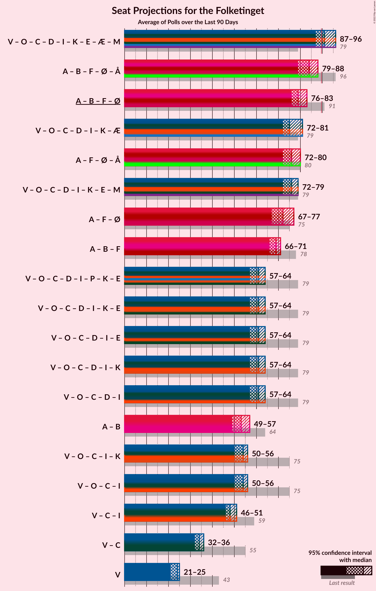
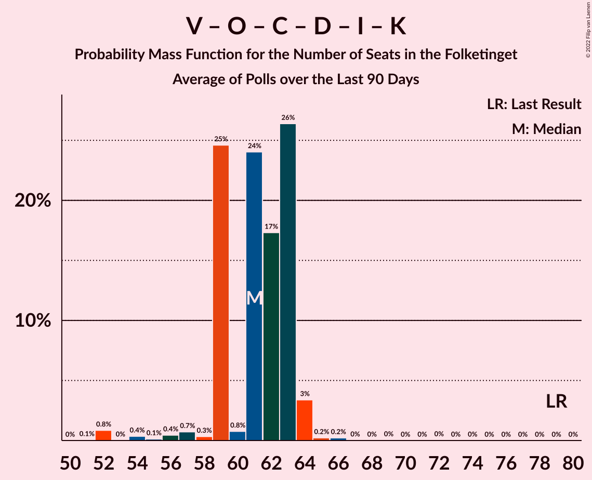

# Poll Average

<a href="#voting-intentions">Voting Intentions</a> | <a href="#seats">Seats</a> | <a href="#coalitions">Coalitions</a> | <a href="#technical-information">Technical Information</a>

## Summary

The table below lists the polls on which the average is based. They are the most recent polls (less than 90 days old) registered and analyzed so far.

| Period     | Polling firm/Commissioner(s) | A | V | O | B | F | Ø | C | Å | D | I | P | K | E | G | Q | Æ | M |
|:----------:|:----------------------------:|:--:|:--:|:--:|:--:|:--:|:--:|:--:|:--:|:--:|:--:|:--:|:--:|:--:|:--:|:--:|:--:|:--:|
| 5 June 2019 | General Election | 25.9%   48 | 23.4%   43 | 8.7%   16 | 8.6%   16 | 7.7%   14 | 6.9%   13 | 6.6%   12 | 3.0%   5 | 2.4%   4 | 2.3%   4 | 1.8%   0 | 1.7%   0 | 0.8%   0 | 0.0%   0 | 0.0%   0 | 0.0%   0 | 0.0%   0 |
| N/A | Poll Average | 21–28%   39–49 | 9–17%   15–29 | 1–4%   0–7 | 4–8%   8–15 | 6–10%   11–20 | 6–10%   12–19 | 10–15%   15–26 | 1–2%   0–4 | 4–7%   7–12 | 3–6%   5–10 | N/A   N/A | 0–2%   0 | N/A   N/A | 0–1%   0–4 | 0–1%   0 | 8–13%   13–23 | 2–6%   0–9 |
| [26 September–2 October 2022](2022-10-02-Voxmeter.html) | Voxmeter | 23–28%   40–49 | 13–18%   25–33 | 2–5%   5–8 | 5–8%   9–14 | 7–11%   13–20 | 6–10%   12–17 | 9–13%   15–23 | 1–2%   0–5 | 4–6%   6–11 | 3–6%   6–10 | N/A   N/A | 0–1%   0 | N/A   N/A | N/A   N/A | 0–1%   0 | 7–10%   13–18 | 1–3%   0–6 |
| [2 October 2022](2022-10-02-Gallup.html) | Gallup   Berlingske | 22–27%   41–48 | 10–14%   20–24 | 1–3%   0–5 | 6–8%   11–15 | 7–9%   13–17 | 7–10%   14–18 | 11–14%   21–25 | 1–2%   0 | 5–7%   9–13 | 3–5%   6–9 | N/A   N/A | 1–2%   0 | N/A   N/A | N/A   N/A | 0–1%   0 | 8–11%   15–21 | 3–4%   5–8 |
| [26–29 September 2022](2022-09-29-Megafon.html) | Megafon   Politiken and TV 2 | 20–26%   38–44 | 12–16%   22–28 | 1–3%   0–5 | 4–7%   8–11 | 7–11%   14–19 | 7–10%   13–19 | 11–15%   21–25 | 1–2%   0 | 3–6%   8–10 | 3–6%   7–10 | N/A   N/A | 0–2%   0 | N/A   N/A | N/A   N/A | 0–1%   0 | 8–12%   15–21 | 3–6%   7–10 |
| [13–20 September 2022](2022-09-20-Epinion.html) | Epinion   DR | 24–27%   42–48 | 11–13%   20–24 | 1–3%   0–4 | 4–6%   7–10 | 7–9%   12–16 | 7–9%   13–17 | 12–15%   23–26 | 1%   0 | 4–6%   6–9 | 4–6%   8–11 | N/A   N/A | 0–1%   0 | N/A   N/A | 0–1%   0 | 1–2%   0 | 10–12%   19–22 | 3–4%   5–8 |
| [7 August 2022](2022-08-07-Yougov.html) | Yougov | 24–29%   42–49 | 8–12%   15–21 | 2–4%   5–7 | 4–7%   8–12 | 6–9%   11–17 | 6–8%   10–14 | 12–16%   22–26 | 1–2%   0 | 4–7%   8–12 | 2–4%   5–7 | N/A   N/A | 0–1%   0 | N/A   N/A | 0–1%   0–4 | 0–1%   0 | 10–14%   18–25 | 4–6%   6–9 |
| 5 June 2019 | General Election | 25.9%   48 | 23.4%   43 | 8.7%   16 | 8.6%   16 | 7.7%   14 | 6.9%   13 | 6.6%   12 | 3.0%   5 | 2.4%   4 | 2.3%   4 | 1.8%   0 | 1.7%   0 | 0.8%   0 | 0.0%   0 | 0.0%   0 | 0.0%   0 | 0.0%   0 |

Only polls for which at least the sample size has been published are included in the table above.

**Legend:**
+ **Top half of each row:** Voting intentions (95% confidence interval)
+ **Bottom half of each row:** Seat projections for the Folketinget (95% confidence interval)
+ **A:** Socialdemokraterne
+ **V:** Venstre
+ **O:** Dansk Folkeparti
+ **B:** Radikale Venstre
+ **F:** Socialistisk Folkeparti
+ **Ø:** Enhedslisten–De Rød-Grønne
+ **C:** Det Konservative Folkeparti
+ **Å:** Alternativet
+ **D:** Nye Borgerlige
+ **I:** Liberal Alliance
+ **P:** Stram Kurs
+ **K:** Kristendemokraterne
+ **E:** Borgerlisten
+ **G:** Veganerpartiet
+ **Q:** Frie Grønne
+ **Æ:** Danmarksdemokraterne
+ **M:** Moderaterne
+ **N/A (single party):** Party not included the published results
+ **N/A (entire row):** Calculation for this opinion poll not started yet

## Voting Intentions

### Confidence Intervals

| Party | Last Result | Median | 80% Confidence Interval | 90% Confidence Interval | 95% Confidence Interval | 99% Confidence Interval |
|:-----:|:-----------:|:------:|:-----------------------:|:-----------------------:|:-----------------------:|:-----------------------:|
| <a href="#socialdemokraterne">Socialdemokraterne</a> | 25.9% | 25.0% | 22.7–26.8% |22.0–27.4% | 21.4–27.8% | 20.4–28.8% |
| <a href="#venstre">Venstre</a> | 23.4% | 12.3% | 10.0–15.7% |9.5–16.4% | 9.1–16.9% | 8.4–17.9% |
| <a href="#dansk-folkeparti">Dansk Folkeparti</a> | 8.7% | 2.3% | 1.7–3.7% |1.5–3.9% | 1.4–4.2% | 1.2–4.7% |
| <a href="#radikale-venstre">Radikale Venstre</a> | 8.6% | 5.6% | 4.4–7.0% |4.2–7.4% | 4.0–7.7% | 3.7–8.2% |
| <a href="#socialistisk-folkeparti">Socialistisk Folkeparti</a> | 7.7% | 8.0% | 6.9–9.5% |6.6–10.0% | 6.3–10.4% | 5.8–11.1% |
| <a href="#enhedslisten–de-rød-grønne">Enhedslisten–De Rød-Grønne</a> | 6.9% | 8.1% | 6.8–9.3% |6.4–9.6% | 6.1–9.9% | 5.6–10.5% |
| <a href="#det-konservative-folkeparti">Det Konservative Folkeparti</a> | 6.6% | 12.8% | 10.9–14.4% |10.4–14.8% | 9.9–15.2% | 9.2–16.0% |
| <a href="#alternativet">Alternativet</a> | 3.0% | 1.2% | 0.8–1.8% |0.7–2.0% | 0.6–2.1% | 0.5–2.5% |
| <a href="#nye-borgerlige">Nye Borgerlige</a> | 2.4% | 4.9% | 4.0–6.2% |3.7–6.5% | 3.5–6.8% | 3.1–7.3% |
| <a href="#liberal-alliance">Liberal Alliance</a> | 2.3% | 4.2% | 3.2–5.4% |2.9–5.7% | 2.7–5.9% | 2.4–6.3% |
| <a href="#stram-kurs">Stram Kurs</a> | 1.8% | N/A | N/A |N/A | N/A | N/A |
| <a href="#kristendemokraterne">Kristendemokraterne</a> | 1.7% | 0.7% | 0.3–1.4% |0.2–1.6% | 0.2–1.7% | 0.1–2.0% |
| <a href="#borgerlisten">Borgerlisten</a> | 0.8% | N/A | N/A |N/A | N/A | N/A |
| <a href="#veganerpartiet">Veganerpartiet</a> | 0.0% | 0.5% | 0.3–1.1% |0.2–1.2% | 0.2–1.4% | 0.1–1.6% |
| <a href="#frie-grønne">Frie Grønne</a> | 0.0% | 0.6% | 0.3–1.1% |0.2–1.3% | 0.2–1.4% | 0.1–1.6% |
| <a href="#danmarksdemokraterne">Danmarksdemokraterne</a> | 0.0% | 10.3% | 8.4–12.1% |7.8–12.6% | 7.5–13.0% | 6.8–13.8% |
| <a href="#moderaterne">Moderaterne</a> | 0.0% | 3.6% | 2.3–5.0% |2.0–5.3% | 1.8–5.6% | 1.5–6.1% |

### Socialdemokraterne

*For a full overview of the results for this party, see the [Socialdemokraterne](party-socialdemokraterne.html) page.*

| Voting Intentions | Probability | Accumulated | Special Marks |
|:-----------------:|:-----------:|:-----------:|:-------------:|
| 17.5–18.5% | 0% | 100% |  |
| 18.5–19.5% | 0.1% | 100% |  |
| 19.5–20.5% | 0.6% | 99.9% |  |
| 20.5–21.5% | 2% | 99.3% |  |
| 21.5–22.5% | 6% | 97% |  |
| 22.5–23.5% | 11% | 91% |  |
| 23.5–24.5% | 20% | 79% |  |
| 24.5–25.5% | 25% | 60% | Median |
| 25.5–26.5% | 21% | 35% | Last Result |
| 26.5–27.5% | 10% | 14% |  |
| 27.5–28.5% | 3% | 4% |  |
| 28.5–29.5% | 0.7% | 0.8% |  |
| 29.5–30.5% | 0.1% | 0.1% |  |
| 30.5–31.5% | 0% | 0% |  |

### Venstre

*For a full overview of the results for this party, see the [Venstre](party-venstre.html) page.*

| Voting Intentions | Probability | Accumulated | Special Marks |
|:-----------------:|:-----------:|:-----------:|:-------------:|
| 6.5–7.5% | 0% | 100% |  |
| 7.5–8.5% | 0.7% | 100% |  |
| 8.5–9.5% | 5% | 99.3% |  |
| 9.5–10.5% | 10% | 94% |  |
| 10.5–11.5% | 16% | 84% |  |
| 11.5–12.5% | 22% | 68% | Median |
| 12.5–13.5% | 14% | 46% |  |
| 13.5–14.5% | 11% | 32% |  |
| 14.5–15.5% | 10% | 21% |  |
| 15.5–16.5% | 7% | 11% |  |
| 16.5–17.5% | 3% | 4% |  |
| 17.5–18.5% | 0.8% | 0.9% |  |
| 18.5–19.5% | 0.1% | 0.1% |  |
| 19.5–20.5% | 0% | 0% |  |
| 20.5–21.5% | 0% | 0% |  |
| 21.5–22.5% | 0% | 0% |  |
| 22.5–23.5% | 0% | 0% | Last Result |

### Dansk Folkeparti

*For a full overview of the results for this party, see the [Dansk Folkeparti](party-danskfolkeparti.html) page.*

| Voting Intentions | Probability | Accumulated | Special Marks |
|:-----------------:|:-----------:|:-----------:|:-------------:|
| 0.0–0.5% | 0% | 100% |  |
| 0.5–1.5% | 6% | 100% |  |
| 1.5–2.5% | 52% | 94% | Median |
| 2.5–3.5% | 30% | 42% |  |
| 3.5–4.5% | 12% | 12% |  |
| 4.5–5.5% | 0.7% | 0.7% |  |
| 5.5–6.5% | 0% | 0% |  |
| 6.5–7.5% | 0% | 0% |  |
| 7.5–8.5% | 0% | 0% |  |
| 8.5–9.5% | 0% | 0% | Last Result |

### Radikale Venstre

*For a full overview of the results for this party, see the [Radikale Venstre](party-radikalevenstre.html) page.*

| Voting Intentions | Probability | Accumulated | Special Marks |
|:-----------------:|:-----------:|:-----------:|:-------------:|
| 1.5–2.5% | 0% | 100% |  |
| 2.5–3.5% | 0.1% | 100% |  |
| 3.5–4.5% | 14% | 99.9% |  |
| 4.5–5.5% | 36% | 86% |  |
| 5.5–6.5% | 30% | 50% | Median |
| 6.5–7.5% | 17% | 20% |  |
| 7.5–8.5% | 3% | 3% |  |
| 8.5–9.5% | 0.1% | 0.1% | Last Result |
| 9.5–10.5% | 0% | 0% |  |

### Socialistisk Folkeparti

*For a full overview of the results for this party, see the [Socialistisk Folkeparti](party-socialistiskfolkeparti.html) page.*

| Voting Intentions | Probability | Accumulated | Special Marks |
|:-----------------:|:-----------:|:-----------:|:-------------:|
| 3.5–4.5% | 0% | 100% |  |
| 4.5–5.5% | 0.1% | 100% |  |
| 5.5–6.5% | 4% | 99.9% |  |
| 6.5–7.5% | 25% | 96% |  |
| 7.5–8.5% | 38% | 70% | Last Result, Median |
| 8.5–9.5% | 22% | 32% |  |
| 9.5–10.5% | 8% | 10% |  |
| 10.5–11.5% | 2% | 2% |  |
| 11.5–12.5% | 0.1% | 0.1% |  |
| 12.5–13.5% | 0% | 0% |  |

### Enhedslisten–De Rød-Grønne

*For a full overview of the results for this party, see the [Enhedslisten–De Rød-Grønne](party-enhedslisten–derød-grønne.html) page.*

| Voting Intentions | Probability | Accumulated | Special Marks |
|:-----------------:|:-----------:|:-----------:|:-------------:|
| 3.5–4.5% | 0% | 100% |  |
| 4.5–5.5% | 0.4% | 100% |  |
| 5.5–6.5% | 6% | 99.6% |  |
| 6.5–7.5% | 22% | 93% | Last Result |
| 7.5–8.5% | 41% | 72% | Median |
| 8.5–9.5% | 26% | 31% |  |
| 9.5–10.5% | 5% | 6% |  |
| 10.5–11.5% | 0.4% | 0.4% |  |
| 11.5–12.5% | 0% | 0% |  |

### Det Konservative Folkeparti

*For a full overview of the results for this party, see the [Det Konservative Folkeparti](party-detkonservativefolkeparti.html) page.*

| Voting Intentions | Probability | Accumulated | Special Marks |
|:-----------------:|:-----------:|:-----------:|:-------------:|
| 6.5–7.5% | 0% | 100% | Last Result |
| 7.5–8.5% | 0.1% | 100% |  |
| 8.5–9.5% | 1.1% | 99.9% |  |
| 9.5–10.5% | 5% | 98.8% |  |
| 10.5–11.5% | 13% | 93% |  |
| 11.5–12.5% | 22% | 81% |  |
| 12.5–13.5% | 30% | 58% | Median |
| 13.5–14.5% | 21% | 28% |  |
| 14.5–15.5% | 7% | 8% |  |
| 15.5–16.5% | 1.2% | 1.3% |  |
| 16.5–17.5% | 0.1% | 0.1% |  |
| 17.5–18.5% | 0% | 0% |  |

### Alternativet

*For a full overview of the results for this party, see the [Alternativet](party-alternativet.html) page.*

| Voting Intentions | Probability | Accumulated | Special Marks |
|:-----------------:|:-----------:|:-----------:|:-------------:|
| 0.0–0.5% | 0.8% | 100% |  |
| 0.5–1.5% | 79% | 99.2% | Median |
| 1.5–2.5% | 19% | 20% |  |
| 2.5–3.5% | 0.4% | 0.4% | Last Result |
| 3.5–4.5% | 0% | 0% |  |

### Nye Borgerlige

*For a full overview of the results for this party, see the [Nye Borgerlige](party-nyeborgerlige.html) page.*

| Voting Intentions | Probability | Accumulated | Special Marks |
|:-----------------:|:-----------:|:-----------:|:-------------:|
| 1.5–2.5% | 0% | 100% | Last Result |
| 2.5–3.5% | 3% | 100% |  |
| 3.5–4.5% | 30% | 97% |  |
| 4.5–5.5% | 41% | 67% | Median |
| 5.5–6.5% | 22% | 26% |  |
| 6.5–7.5% | 4% | 4% |  |
| 7.5–8.5% | 0.2% | 0.2% |  |
| 8.5–9.5% | 0% | 0% |  |

### Liberal Alliance

*For a full overview of the results for this party, see the [Liberal Alliance](party-liberalalliance.html) page.*

| Voting Intentions | Probability | Accumulated | Special Marks |
|:-----------------:|:-----------:|:-----------:|:-------------:|
| 0.5–1.5% | 0% | 100% |  |
| 1.5–2.5% | 1.2% | 100% | Last Result |
| 2.5–3.5% | 20% | 98.8% |  |
| 3.5–4.5% | 42% | 79% | Median |
| 4.5–5.5% | 29% | 37% |  |
| 5.5–6.5% | 8% | 8% |  |
| 6.5–7.5% | 0.2% | 0.2% |  |
| 7.5–8.5% | 0% | 0% |  |

### Kristendemokraterne

*For a full overview of the results for this party, see the [Kristendemokraterne](party-kristendemokraterne.html) page.*

| Voting Intentions | Probability | Accumulated | Special Marks |
|:-----------------:|:-----------:|:-----------:|:-------------:|
| 0.0–0.5% | 41% | 100% |  |
| 0.5–1.5% | 54% | 59% | Median |
| 1.5–2.5% | 6% | 6% | Last Result |
| 2.5–3.5% | 0% | 0% |  |

### Moderaterne

*For a full overview of the results for this party, see the [Moderaterne](party-moderaterne.html) page.*

| Voting Intentions | Probability | Accumulated | Special Marks |
|:-----------------:|:-----------:|:-----------:|:-------------:|
| 0.0–0.5% | 0% | 100% | Last Result |
| 0.5–1.5% | 0.9% | 100% |  |
| 1.5–2.5% | 14% | 99.1% |  |
| 2.5–3.5% | 32% | 85% |  |
| 3.5–4.5% | 32% | 53% | Median |
| 4.5–5.5% | 18% | 21% |  |
| 5.5–6.5% | 3% | 3% |  |
| 6.5–7.5% | 0.1% | 0.1% |  |
| 7.5–8.5% | 0% | 0% |  |

### Frie Grønne

*For a full overview of the results for this party, see the [Frie Grønne](party-friegrønne.html) page.*

| Voting Intentions | Probability | Accumulated | Special Marks |
|:-----------------:|:-----------:|:-----------:|:-------------:|
| 0.0–0.5% | 42% | 100% | Last Result |
| 0.5–1.5% | 58% | 58% | Median |
| 1.5–2.5% | 0.6% | 0.6% |  |
| 2.5–3.5% | 0% | 0% |  |

### Danmarksdemokraterne

*For a full overview of the results for this party, see the [Danmarksdemokraterne](party-danmarksdemokraterne.html) page.*

| Voting Intentions | Probability | Accumulated | Special Marks |
|:-----------------:|:-----------:|:-----------:|:-------------:|
| 0.0–0.5% | 0% | 100% | Last Result |
| 0.5–1.5% | 0% | 100% |  |
| 1.5–2.5% | 0% | 100% |  |
| 2.5–3.5% | 0% | 100% |  |
| 3.5–4.5% | 0% | 100% |  |
| 4.5–5.5% | 0% | 100% |  |
| 5.5–6.5% | 0.2% | 100% |  |
| 6.5–7.5% | 3% | 99.8% |  |
| 7.5–8.5% | 10% | 97% |  |
| 8.5–9.5% | 18% | 88% |  |
| 9.5–10.5% | 27% | 69% | Median |
| 10.5–11.5% | 25% | 42% |  |
| 11.5–12.5% | 12% | 18% |  |
| 12.5–13.5% | 5% | 6% |  |
| 13.5–14.5% | 0.9% | 0.9% |  |
| 14.5–15.5% | 0.1% | 0.1% |  |
| 15.5–16.5% | 0% | 0% |  |

### Veganerpartiet

*For a full overview of the results for this party, see the [Veganerpartiet](party-veganerpartiet.html) page.*

| Voting Intentions | Probability | Accumulated | Special Marks |
|:-----------------:|:-----------:|:-----------:|:-------------:|
| 0.0–0.5% | 51% | 100% | Last Result |
| 0.5–1.5% | 48% | 49% | Median |
| 1.5–2.5% | 0.7% | 0.7% |  |
| 2.5–3.5% | 0% | 0% |  |

## Seats

### Confidence Intervals

| Party | Last Result | Median | 80% Confidence Interval | 90% Confidence Interval | 95% Confidence Interval | 99% Confidence Interval |
|:-----:|:-----------:|:------:|:-----------------------:|:-----------------------:|:-----------------------:|:-----------------------:|
| <a href="#socialdemokraterne">Socialdemokraterne</a> | 48 | 44 | 39–48 |39–49 | 39–49 | 38–50 |
| <a href="#venstre">Venstre</a> | 43 | 23 | 15–29 |15–29 | 15–29 | 15–33 |
| <a href="#dansk-folkeparti">Dansk Folkeparti</a> | 16 | 4 | 0–6 |0–7 | 0–7 | 0–8 |
| <a href="#radikale-venstre">Radikale Venstre</a> | 16 | 10 | 9–14 |8–15 | 8–15 | 7–15 |
| <a href="#socialistisk-folkeparti">Socialistisk Folkeparti</a> | 14 | 14 | 12–17 |11–18 | 11–20 | 11–20 |
| <a href="#enhedslisten–de-rød-grønne">Enhedslisten–De Rød-Grønne</a> | 13 | 15 | 13–19 |13–19 | 12–19 | 10–19 |
| <a href="#det-konservative-folkeparti">Det Konservative Folkeparti</a> | 12 | 23 | 17–26 |17–26 | 15–26 | 15–27 |
| <a href="#alternativet">Alternativet</a> | 5 | 0 | 0–4 |0–4 | 0–4 | 0–5 |
| <a href="#nye-borgerlige">Nye Borgerlige</a> | 4 | 9 | 8–11 |7–12 | 7–12 | 6–13 |
| <a href="#liberal-alliance">Liberal Alliance</a> | 4 | 8 | 6–10 |5–10 | 5–10 | 5–11 |
| <a href="#stram-kurs">Stram Kurs</a> | 0 | N/A | N/A |N/A | N/A | N/A |
| <a href="#kristendemokraterne">Kristendemokraterne</a> | 0 | 0 | 0 |0 | 0 | 0 |
| <a href="#borgerlisten">Borgerlisten</a> | 0 | N/A | N/A |N/A | N/A | N/A |
| <a href="#veganerpartiet">Veganerpartiet</a> | 0 | 0 | 0 |0–4 | 0–4 | 0–4 |
| <a href="#frie-grønne">Frie Grønne</a> | 0 | 0 | 0 |0 | 0 | 0 |
| <a href="#danmarksdemokraterne">Danmarksdemokraterne</a> | 0 | 19 | 15–22 |13–23 | 13–23 | 13–25 |
| <a href="#moderaterne">Moderaterne</a> | 0 | 6 | 0–9 |0–9 | 0–9 | 0–10 |

### Socialdemokraterne

*For a full overview of the results for this party, see the [Socialdemokraterne](party-socialdemokraterne.html) page.*

| Number of Seats | Probability | Accumulated | Special Marks |
|:---------------:|:-----------:|:-----------:|:-------------:|
| 34 | 0.1% | 100% |  |
| 35 | 0% | 99.9% |  |
| 36 | 0% | 99.9% |  |
| 37 | 0.2% | 99.8% |  |
| 38 | 2% | 99.6% |  |
| 39 | 17% | 98% |  |
| 40 | 0.6% | 81% |  |
| 41 | 2% | 81% |  |
| 42 | 3% | 79% |  |
| 43 | 21% | 76% |  |
| 44 | 17% | 55% | Median |
| 45 | 7% | 38% |  |
| 46 | 14% | 31% |  |
| 47 | 4% | 17% |  |
| 48 | 4% | 12% | Last Result |
| 49 | 7% | 8% |  |
| 50 | 0.3% | 0.6% |  |
| 51 | 0.1% | 0.2% |  |
| 52 | 0.1% | 0.2% |  |
| 53 | 0% | 0.1% |  |
| 54 | 0.1% | 0.1% |  |
| 55 | 0% | 0% |  |

### Venstre

*For a full overview of the results for this party, see the [Venstre](party-venstre.html) page.*

| Number of Seats | Probability | Accumulated | Special Marks |
|:---------------:|:-----------:|:-----------:|:-------------:|
| 14 | 0.1% | 100% |  |
| 15 | 10% | 99.9% |  |
| 16 | 4% | 90% |  |
| 17 | 0.1% | 86% |  |
| 18 | 5% | 86% |  |
| 19 | 0.4% | 81% |  |
| 20 | 5% | 81% |  |
| 21 | 6% | 76% |  |
| 22 | 11% | 70% |  |
| 23 | 15% | 60% | Median |
| 24 | 20% | 44% |  |
| 25 | 6% | 24% |  |
| 26 | 0.7% | 18% |  |
| 27 | 3% | 17% |  |
| 28 | 2% | 14% |  |
| 29 | 10% | 12% |  |
| 30 | 0.8% | 2% |  |
| 31 | 0.7% | 2% |  |
| 32 | 0% | 0.9% |  |
| 33 | 0.7% | 0.8% |  |
| 34 | 0.2% | 0.2% |  |
| 35 | 0% | 0% |  |
| 36 | 0% | 0% |  |
| 37 | 0% | 0% |  |
| 38 | 0% | 0% |  |
| 39 | 0% | 0% |  |
| 40 | 0% | 0% |  |
| 41 | 0% | 0% |  |
| 42 | 0% | 0% |  |
| 43 | 0% | 0% | Last Result |

### Dansk Folkeparti

*For a full overview of the results for this party, see the [Dansk Folkeparti](party-danskfolkeparti.html) page.*

| Number of Seats | Probability | Accumulated | Special Marks |
|:---------------:|:-----------:|:-----------:|:-------------:|
| 0 | 49% | 100% |  |
| 1 | 0% | 51% |  |
| 2 | 0% | 51% |  |
| 3 | 0% | 51% |  |
| 4 | 7% | 51% | Median |
| 5 | 18% | 43% |  |
| 6 | 19% | 25% |  |
| 7 | 4% | 6% |  |
| 8 | 1.3% | 2% |  |
| 9 | 0.2% | 0.2% |  |
| 10 | 0% | 0% |  |
| 11 | 0% | 0% |  |
| 12 | 0% | 0% |  |
| 13 | 0% | 0% |  |
| 14 | 0% | 0% |  |
| 15 | 0% | 0% |  |
| 16 | 0% | 0% | Last Result |

### Radikale Venstre

*For a full overview of the results for this party, see the [Radikale Venstre](party-radikalevenstre.html) page.*

| Number of Seats | Probability | Accumulated | Special Marks |
|:---------------:|:-----------:|:-----------:|:-------------:|
| 6 | 0.1% | 100% |  |
| 7 | 1.1% | 99.9% |  |
| 8 | 9% | 98.7% |  |
| 9 | 29% | 90% |  |
| 10 | 23% | 62% | Median |
| 11 | 6% | 38% |  |
| 12 | 11% | 32% |  |
| 13 | 3% | 21% |  |
| 14 | 9% | 18% |  |
| 15 | 9% | 9% |  |
| 16 | 0.2% | 0.2% | Last Result |
| 17 | 0% | 0% |  |

### Socialistisk Folkeparti

*For a full overview of the results for this party, see the [Socialistisk Folkeparti](party-socialistiskfolkeparti.html) page.*

| Number of Seats | Probability | Accumulated | Special Marks |
|:---------------:|:-----------:|:-----------:|:-------------:|
| 8 | 0.2% | 100% |  |
| 9 | 0% | 99.8% |  |
| 10 | 0.2% | 99.8% |  |
| 11 | 8% | 99.6% |  |
| 12 | 3% | 92% |  |
| 13 | 24% | 89% |  |
| 14 | 17% | 65% | Last Result, Median |
| 15 | 28% | 49% |  |
| 16 | 7% | 20% |  |
| 17 | 7% | 13% |  |
| 18 | 3% | 7% |  |
| 19 | 0.7% | 4% |  |
| 20 | 3% | 4% |  |
| 21 | 0% | 0% |  |

### Enhedslisten–De Rød-Grønne

*For a full overview of the results for this party, see the [Enhedslisten–De Rød-Grønne](party-enhedslisten–derød-grønne.html) page.*

| Number of Seats | Probability | Accumulated | Special Marks |
|:---------------:|:-----------:|:-----------:|:-------------:|
| 9 | 0.3% | 100% |  |
| 10 | 0.3% | 99.7% |  |
| 11 | 0.8% | 99.4% |  |
| 12 | 2% | 98.6% |  |
| 13 | 19% | 97% | Last Result |
| 14 | 12% | 78% |  |
| 15 | 23% | 66% | Median |
| 16 | 18% | 43% |  |
| 17 | 8% | 25% |  |
| 18 | 2% | 17% |  |
| 19 | 15% | 15% |  |
| 20 | 0% | 0% |  |

### Det Konservative Folkeparti

*For a full overview of the results for this party, see the [Det Konservative Folkeparti](party-detkonservativefolkeparti.html) page.*

| Number of Seats | Probability | Accumulated | Special Marks |
|:---------------:|:-----------:|:-----------:|:-------------:|
| 12 | 0% | 100% | Last Result |
| 13 | 0% | 100% |  |
| 14 | 0% | 100% |  |
| 15 | 3% | 100% |  |
| 16 | 0.3% | 97% |  |
| 17 | 6% | 96% |  |
| 18 | 1.2% | 90% |  |
| 19 | 4% | 89% |  |
| 20 | 2% | 85% |  |
| 21 | 7% | 83% |  |
| 22 | 4% | 76% |  |
| 23 | 29% | 72% | Median |
| 24 | 12% | 43% |  |
| 25 | 7% | 31% |  |
| 26 | 24% | 25% |  |
| 27 | 0.6% | 0.9% |  |
| 28 | 0.3% | 0.3% |  |
| 29 | 0% | 0.1% |  |
| 30 | 0% | 0% |  |

### Alternativet

*For a full overview of the results for this party, see the [Alternativet](party-alternativet.html) page.*

| Number of Seats | Probability | Accumulated | Special Marks |
|:---------------:|:-----------:|:-----------:|:-------------:|
| 0 | 88% | 100% | Median |
| 1 | 0% | 12% |  |
| 2 | 0% | 12% |  |
| 3 | 0% | 12% |  |
| 4 | 11% | 12% |  |
| 5 | 2% | 2% | Last Result |
| 6 | 0% | 0% |  |

### Nye Borgerlige

*For a full overview of the results for this party, see the [Nye Borgerlige](party-nyeborgerlige.html) page.*

| Number of Seats | Probability | Accumulated | Special Marks |
|:---------------:|:-----------:|:-----------:|:-------------:|
| 4 | 0% | 100% | Last Result |
| 5 | 0.2% | 100% |  |
| 6 | 2% | 99.8% |  |
| 7 | 6% | 98% |  |
| 8 | 27% | 91% |  |
| 9 | 27% | 64% | Median |
| 10 | 14% | 37% |  |
| 11 | 16% | 23% |  |
| 12 | 6% | 8% |  |
| 13 | 1.3% | 1.4% |  |
| 14 | 0.1% | 0.1% |  |
| 15 | 0% | 0% |  |

### Liberal Alliance

*For a full overview of the results for this party, see the [Liberal Alliance](party-liberalalliance.html) page.*

| Number of Seats | Probability | Accumulated | Special Marks |
|:---------------:|:-----------:|:-----------:|:-------------:|
| 0 | 0.1% | 100% |  |
| 1 | 0% | 99.9% |  |
| 2 | 0% | 99.9% |  |
| 3 | 0% | 99.9% |  |
| 4 | 0.4% | 99.9% | Last Result |
| 5 | 5% | 99.5% |  |
| 6 | 17% | 95% |  |
| 7 | 24% | 78% |  |
| 8 | 13% | 54% | Median |
| 9 | 22% | 41% |  |
| 10 | 18% | 19% |  |
| 11 | 0.6% | 0.7% |  |
| 12 | 0% | 0.1% |  |
| 13 | 0% | 0% |  |

### Stram Kurs

*For a full overview of the results for this party, see the [Stram Kurs](party-stramkurs.html) page.*

### Kristendemokraterne

*For a full overview of the results for this party, see the [Kristendemokraterne](party-kristendemokraterne.html) page.*

| Number of Seats | Probability | Accumulated | Special Marks |
|:---------------:|:-----------:|:-----------:|:-------------:|
| 0 | 99.8% | 100% | Last Result, Median |
| 1 | 0% | 0.2% |  |
| 2 | 0% | 0.2% |  |
| 3 | 0% | 0.2% |  |
| 4 | 0.2% | 0.2% |  |
| 5 | 0% | 0% |  |

### Borgerlisten

*For a full overview of the results for this party, see the [Borgerlisten](party-borgerlisten.html) page.*

### Veganerpartiet

*For a full overview of the results for this party, see the [Veganerpartiet](party-veganerpartiet.html) page.*

| Number of Seats | Probability | Accumulated | Special Marks |
|:---------------:|:-----------:|:-----------:|:-------------:|
| 0 | 91% | 100% | Last Result, Median |
| 1 | 0% | 9% |  |
| 2 | 0% | 9% |  |
| 3 | 0% | 9% |  |
| 4 | 9% | 9% |  |
| 5 | 0% | 0% |  |

### Frie Grønne

*For a full overview of the results for this party, see the [Frie Grønne](party-friegrønne.html) page.*

| Number of Seats | Probability | Accumulated | Special Marks |
|:---------------:|:-----------:|:-----------:|:-------------:|
| 0 | 100% | 100% | Last Result, Median |

### Danmarksdemokraterne

*For a full overview of the results for this party, see the [Danmarksdemokraterne](party-danmarksdemokraterne.html) page.*

| Number of Seats | Probability | Accumulated | Special Marks |
|:---------------:|:-----------:|:-----------:|:-------------:|
| 0 | 0% | 100% | Last Result |
| 1 | 0% | 100% |  |
| 2 | 0% | 100% |  |
| 3 | 0% | 100% |  |
| 4 | 0% | 100% |  |
| 5 | 0% | 100% |  |
| 6 | 0% | 100% |  |
| 7 | 0% | 100% |  |
| 8 | 0% | 100% |  |
| 9 | 0% | 100% |  |
| 10 | 0% | 100% |  |
| 11 | 0% | 100% |  |
| 12 | 0.4% | 100% |  |
| 13 | 7% | 99.6% |  |
| 14 | 2% | 93% |  |
| 15 | 7% | 91% |  |
| 16 | 5% | 83% |  |
| 17 | 18% | 78% |  |
| 18 | 2% | 60% |  |
| 19 | 22% | 58% | Median |
| 20 | 1.0% | 36% |  |
| 21 | 24% | 34% |  |
| 22 | 2% | 10% |  |
| 23 | 8% | 9% |  |
| 24 | 0.1% | 0.6% |  |
| 25 | 0.4% | 0.6% |  |
| 26 | 0.1% | 0.1% |  |
| 27 | 0% | 0% |  |

### Moderaterne

*For a full overview of the results for this party, see the [Moderaterne](party-moderaterne.html) page.*

| Number of Seats | Probability | Accumulated | Special Marks |
|:---------------:|:-----------:|:-----------:|:-------------:|
| 0 | 12% | 100% | Last Result |
| 1 | 0% | 88% |  |
| 2 | 0% | 88% |  |
| 3 | 0% | 88% |  |
| 4 | 3% | 88% |  |
| 5 | 17% | 85% |  |
| 6 | 25% | 68% | Median |
| 7 | 6% | 43% |  |
| 8 | 8% | 37% |  |
| 9 | 26% | 28% |  |
| 10 | 2% | 2% |  |
| 11 | 0.1% | 0.1% |  |
| 12 | 0% | 0% |  |

## Coalitions

### Confidence Intervals

| Coalition | Last Result | Median | Majority? | 80% Confidence Interval | 90% Confidence Interval | 95% Confidence Interval | 99% Confidence Interval |
|:---------:|:-----------:|:------:|:---------:|:-----------------------:|:-----------------------:|:-----------------------:|:-----------------------:|
| Venstre – Dansk Folkeparti – Det Konservative Folkeparti – Nye Borgerlige – Liberal Alliance – Kristendemokraterne – Borgerlisten – Danmarksdemokraterne – Moderaterne | 79 | 92 | 61% | 84–94 | 82–96 | 82–97 | 82–99 |
| Socialdemokraterne – Radikale Venstre – Socialistisk Folkeparti – Enhedslisten–De Rød-Grønne – Alternativet | 96 | 82 | 25% | 81–91 | 79–93 | 78–93 | 76–93 |
| Socialdemokraterne – Radikale Venstre – Socialistisk Folkeparti – Enhedslisten–De Rød-Grønne | 91 | 82 | 14% | 81–91 | 79–91 | 78–91 | 76–91 |
| Venstre – Dansk Folkeparti – Det Konservative Folkeparti – Nye Borgerlige – Liberal Alliance – Kristendemokraterne – Danmarksdemokraterne | 79 | 84 | 1.1% | 79–88 | 79–88 | 78–88 | 77–92 |
| Socialdemokraterne – Socialistisk Folkeparti – Enhedslisten–De Rød-Grønne – Alternativet | 80 | 73 | 0% | 69–79 | 69–82 | 69–82 | 67–83 |
| Socialdemokraterne – Socialistisk Folkeparti – Enhedslisten–De Rød-Grønne | 75 | 73 | 0% | 69–78 | 69–79 | 68–79 | 65–82 |
| Venstre – Dansk Folkeparti – Det Konservative Folkeparti – Nye Borgerlige – Liberal Alliance – Kristendemokraterne – Borgerlisten – Moderaterne | 79 | 71 | 0% | 67–75 | 67–76 | 66–79 | 64–81 |
| Socialdemokraterne – Radikale Venstre – Socialistisk Folkeparti | 78 | 68 | 0% | 63–75 | 63–75 | 63–75 | 63–76 |
| Venstre – Dansk Folkeparti – Det Konservative Folkeparti – Nye Borgerlige – Liberal Alliance – Stram Kurs – Kristendemokraterne – Borgerlisten | 79 | 64 | 0% | 62–69 | 61–71 | 60–71 | 59–75 |
| Venstre – Dansk Folkeparti – Det Konservative Folkeparti – Nye Borgerlige – Liberal Alliance – Kristendemokraterne – Borgerlisten | 79 | 64 | 0% | 62–69 | 61–71 | 60–71 | 59–75 |
| Venstre – Dansk Folkeparti – Det Konservative Folkeparti – Nye Borgerlige – Liberal Alliance – Borgerlisten | 79 | 64 | 0% | 62–69 | 61–71 | 60–71 | 59–75 |
| Venstre – Dansk Folkeparti – Det Konservative Folkeparti – Nye Borgerlige – Liberal Alliance – Kristendemokraterne | 79 | 64 | 0% | 62–69 | 61–71 | 60–71 | 59–75 |
| Venstre – Dansk Folkeparti – Det Konservative Folkeparti – Nye Borgerlige – Liberal Alliance | 79 | 64 | 0% | 62–69 | 61–71 | 60–71 | 59–75 |
| Venstre – Dansk Folkeparti – Det Konservative Folkeparti – Liberal Alliance – Kristendemokraterne | 75 | 55 | 0% | 51–60 | 51–63 | 49–64 | 49–66 |
| Venstre – Dansk Folkeparti – Det Konservative Folkeparti – Liberal Alliance | 75 | 55 | 0% | 51–60 | 51–63 | 49–64 | 49–66 |
| Socialdemokraterne – Radikale Venstre | 64 | 54 | 0% | 48–60 | 48–61 | 48–61 | 48–61 |
| Venstre – Det Konservative Folkeparti – Liberal Alliance | 59 | 53 | 0% | 47–60 | 47–60 | 46–60 | 46–63 |
| Venstre – Det Konservative Folkeparti | 55 | 46 | 0% | 41–50 | 40–50 | 40–52 | 40–53 |
| Venstre | 43 | 23 | 0% | 15–29 | 15–29 | 15–29 | 15–33 |

### Venstre – Dansk Folkeparti – Det Konservative Folkeparti – Nye Borgerlige – Liberal Alliance – Kristendemokraterne – Borgerlisten – Danmarksdemokraterne – Moderaterne

| Number of Seats | Probability | Accumulated | Special Marks |
|:---------------:|:-----------:|:-----------:|:-------------:|
| 79 | 0% | 100% | Last Result |
| 80 | 0.1% | 100% |  |
| 81 | 0.1% | 99.9% |  |
| 82 | 8% | 99.7% |  |
| 83 | 0.1% | 92% |  |
| 84 | 13% | 92% |  |
| 85 | 4% | 78% |  |
| 86 | 0.8% | 75% |  |
| 87 | 8% | 74% |  |
| 88 | 1.4% | 66% |  |
| 89 | 3% | 64% |  |
| 90 | 6% | 61% | Majority |
| 91 | 2% | 55% |  |
| 92 | 5% | 53% | Median |
| 93 | 17% | 48% |  |
| 94 | 25% | 31% |  |
| 95 | 0.8% | 6% |  |
| 96 | 3% | 5% |  |
| 97 | 0.3% | 3% |  |
| 98 | 2% | 2% |  |
| 99 | 0.3% | 0.6% |  |
| 100 | 0% | 0.3% |  |
| 101 | 0% | 0.3% |  |
| 102 | 0.2% | 0.3% |  |
| 103 | 0% | 0% |  |

### Socialdemokraterne – Radikale Venstre – Socialistisk Folkeparti – Enhedslisten–De Rød-Grønne – Alternativet

| Number of Seats | Probability | Accumulated | Special Marks |
|:---------------:|:-----------:|:-----------:|:-------------:|
| 73 | 0.2% | 100% |  |
| 74 | 0% | 99.7% |  |
| 75 | 0% | 99.7% |  |
| 76 | 0.3% | 99.7% |  |
| 77 | 2% | 99.4% |  |
| 78 | 0.3% | 98% |  |
| 79 | 3% | 97% |  |
| 80 | 0.8% | 95% |  |
| 81 | 29% | 94% |  |
| 82 | 17% | 65% |  |
| 83 | 5% | 48% | Median |
| 84 | 2% | 43% |  |
| 85 | 2% | 41% |  |
| 86 | 3% | 39% |  |
| 87 | 1.4% | 36% |  |
| 88 | 8% | 34% |  |
| 89 | 0.8% | 26% |  |
| 90 | 4% | 25% | Majority |
| 91 | 13% | 22% |  |
| 92 | 0.1% | 8% |  |
| 93 | 8% | 8% |  |
| 94 | 0.1% | 0.3% |  |
| 95 | 0.1% | 0.1% |  |
| 96 | 0% | 0% | Last Result |

### Socialdemokraterne – Radikale Venstre – Socialistisk Folkeparti – Enhedslisten–De Rød-Grønne

| Number of Seats | Probability | Accumulated | Special Marks |
|:---------------:|:-----------:|:-----------:|:-------------:|
| 73 | 0.2% | 100% |  |
| 74 | 0.1% | 99.7% |  |
| 75 | 0% | 99.7% |  |
| 76 | 0.3% | 99.7% |  |
| 77 | 2% | 99.4% |  |
| 78 | 0.2% | 98% |  |
| 79 | 3% | 97% |  |
| 80 | 0.9% | 95% |  |
| 81 | 29% | 94% |  |
| 82 | 17% | 65% |  |
| 83 | 5% | 48% | Median |
| 84 | 2% | 43% |  |
| 85 | 3% | 40% |  |
| 86 | 3% | 38% |  |
| 87 | 4% | 35% |  |
| 88 | 9% | 30% |  |
| 89 | 7% | 21% |  |
| 90 | 4% | 14% | Majority |
| 91 | 10% | 11% | Last Result |
| 92 | 0.1% | 0.3% |  |
| 93 | 0% | 0.2% |  |
| 94 | 0.1% | 0.2% |  |
| 95 | 0% | 0% |  |

### Venstre – Dansk Folkeparti – Det Konservative Folkeparti – Nye Borgerlige – Liberal Alliance – Kristendemokraterne – Danmarksdemokraterne

| Number of Seats | Probability | Accumulated | Special Marks |
|:---------------:|:-----------:|:-----------:|:-------------:|
| 76 | 0% | 100% |  |
| 77 | 0.5% | 99.9% |  |
| 78 | 3% | 99.4% |  |
| 79 | 9% | 97% | Last Result |
| 80 | 4% | 88% |  |
| 81 | 5% | 84% |  |
| 82 | 16% | 79% |  |
| 83 | 4% | 64% |  |
| 84 | 19% | 60% |  |
| 85 | 11% | 41% |  |
| 86 | 5% | 30% | Median |
| 87 | 6% | 25% |  |
| 88 | 18% | 20% |  |
| 89 | 0.3% | 1.4% |  |
| 90 | 0.4% | 1.1% | Majority |
| 91 | 0.1% | 0.7% |  |
| 92 | 0.1% | 0.6% |  |
| 93 | 0.2% | 0.5% |  |
| 94 | 0.3% | 0.3% |  |
| 95 | 0% | 0% |  |

### Socialdemokraterne – Socialistisk Folkeparti – Enhedslisten–De Rød-Grønne – Alternativet

| Number of Seats | Probability | Accumulated | Special Marks |
|:---------------:|:-----------:|:-----------:|:-------------:|
| 64 | 0.2% | 100% |  |
| 65 | 0.2% | 99.7% |  |
| 66 | 0% | 99.5% |  |
| 67 | 0.4% | 99.5% |  |
| 68 | 2% | 99.2% |  |
| 69 | 8% | 98% |  |
| 70 | 0.7% | 90% |  |
| 71 | 22% | 89% |  |
| 72 | 6% | 68% |  |
| 73 | 21% | 62% | Median |
| 74 | 2% | 41% |  |
| 75 | 1.0% | 39% |  |
| 76 | 11% | 38% |  |
| 77 | 4% | 27% |  |
| 78 | 7% | 23% |  |
| 79 | 11% | 17% |  |
| 80 | 0.5% | 6% | Last Result |
| 81 | 0.2% | 6% |  |
| 82 | 4% | 6% |  |
| 83 | 2% | 2% |  |
| 84 | 0% | 0.1% |  |
| 85 | 0% | 0% |  |

### Socialdemokraterne – Socialistisk Folkeparti – Enhedslisten–De Rød-Grønne

| Number of Seats | Probability | Accumulated | Special Marks |
|:---------------:|:-----------:|:-----------:|:-------------:|
| 64 | 0.2% | 100% |  |
| 65 | 0.3% | 99.7% |  |
| 66 | 0% | 99.5% |  |
| 67 | 0.5% | 99.5% |  |
| 68 | 2% | 99.0% |  |
| 69 | 7% | 97% |  |
| 70 | 0.7% | 90% |  |
| 71 | 22% | 89% |  |
| 72 | 6% | 67% |  |
| 73 | 21% | 61% | Median |
| 74 | 2% | 41% |  |
| 75 | 7% | 39% | Last Result |
| 76 | 11% | 31% |  |
| 77 | 4% | 20% |  |
| 78 | 11% | 17% |  |
| 79 | 4% | 5% |  |
| 80 | 0.1% | 1.1% |  |
| 81 | 0.1% | 1.0% |  |
| 82 | 0.8% | 0.8% |  |
| 83 | 0% | 0.1% |  |
| 84 | 0% | 0% |  |

### Venstre – Dansk Folkeparti – Det Konservative Folkeparti – Nye Borgerlige – Liberal Alliance – Kristendemokraterne – Borgerlisten – Moderaterne

| Number of Seats | Probability | Accumulated | Special Marks |
|:---------------:|:-----------:|:-----------:|:-------------:|
| 64 | 2% | 100% |  |
| 65 | 0.2% | 98% |  |
| 66 | 0.5% | 98% |  |
| 67 | 9% | 97% |  |
| 68 | 9% | 89% |  |
| 69 | 13% | 80% |  |
| 70 | 8% | 67% |  |
| 71 | 10% | 59% |  |
| 72 | 16% | 49% |  |
| 73 | 1.0% | 33% | Median |
| 74 | 2% | 32% |  |
| 75 | 22% | 30% |  |
| 76 | 2% | 7% |  |
| 77 | 1.0% | 5% |  |
| 78 | 0.1% | 4% |  |
| 79 | 2% | 4% | Last Result |
| 80 | 0.1% | 2% |  |
| 81 | 2% | 2% |  |
| 82 | 0.1% | 0.1% |  |
| 83 | 0% | 0% |  |

### Socialdemokraterne – Radikale Venstre – Socialistisk Folkeparti

| Number of Seats | Probability | Accumulated | Special Marks |
|:---------------:|:-----------:|:-----------:|:-------------:|
| 60 | 0% | 100% |  |
| 61 | 0.1% | 99.9% |  |
| 62 | 0.2% | 99.9% |  |
| 63 | 15% | 99.6% |  |
| 64 | 2% | 84% |  |
| 65 | 0.3% | 82% |  |
| 66 | 20% | 82% |  |
| 67 | 9% | 62% |  |
| 68 | 6% | 53% | Median |
| 69 | 8% | 47% |  |
| 70 | 1.3% | 38% |  |
| 71 | 3% | 37% |  |
| 72 | 3% | 33% |  |
| 73 | 9% | 30% |  |
| 74 | 4% | 21% |  |
| 75 | 16% | 17% |  |
| 76 | 1.3% | 1.4% |  |
| 77 | 0% | 0.1% |  |
| 78 | 0% | 0.1% | Last Result |
| 79 | 0% | 0% |  |

### Venstre – Dansk Folkeparti – Det Konservative Folkeparti – Nye Borgerlige – Liberal Alliance – Stram Kurs – Kristendemokraterne – Borgerlisten

| Number of Seats | Probability | Accumulated | Special Marks |
|:---------------:|:-----------:|:-----------:|:-------------:|
| 55 | 0.1% | 100% |  |
| 56 | 0% | 99.9% |  |
| 57 | 0.1% | 99.9% |  |
| 58 | 0.1% | 99.8% |  |
| 59 | 2% | 99.7% |  |
| 60 | 0.5% | 98% |  |
| 61 | 4% | 97% |  |
| 62 | 22% | 93% |  |
| 63 | 18% | 71% |  |
| 64 | 3% | 53% |  |
| 65 | 5% | 50% |  |
| 66 | 3% | 45% |  |
| 67 | 1.4% | 41% | Median |
| 68 | 6% | 40% |  |
| 69 | 26% | 34% |  |
| 70 | 2% | 8% |  |
| 71 | 4% | 6% |  |
| 72 | 0.9% | 2% |  |
| 73 | 0.2% | 0.8% |  |
| 74 | 0.1% | 0.6% |  |
| 75 | 0.2% | 0.6% |  |
| 76 | 0.1% | 0.3% |  |
| 77 | 0.2% | 0.2% |  |
| 78 | 0% | 0.1% |  |
| 79 | 0% | 0% | Last Result |

### Venstre – Dansk Folkeparti – Det Konservative Folkeparti – Nye Borgerlige – Liberal Alliance – Kristendemokraterne – Borgerlisten

| Number of Seats | Probability | Accumulated | Special Marks |
|:---------------:|:-----------:|:-----------:|:-------------:|
| 55 | 0.1% | 100% |  |
| 56 | 0% | 99.9% |  |
| 57 | 0.1% | 99.9% |  |
| 58 | 0.1% | 99.8% |  |
| 59 | 2% | 99.7% |  |
| 60 | 0.5% | 98% |  |
| 61 | 4% | 97% |  |
| 62 | 22% | 93% |  |
| 63 | 18% | 71% |  |
| 64 | 3% | 53% |  |
| 65 | 5% | 50% |  |
| 66 | 3% | 45% |  |
| 67 | 1.4% | 41% | Median |
| 68 | 6% | 40% |  |
| 69 | 26% | 34% |  |
| 70 | 2% | 8% |  |
| 71 | 4% | 6% |  |
| 72 | 0.9% | 2% |  |
| 73 | 0.2% | 0.8% |  |
| 74 | 0.1% | 0.6% |  |
| 75 | 0.2% | 0.6% |  |
| 76 | 0.1% | 0.3% |  |
| 77 | 0.2% | 0.2% |  |
| 78 | 0% | 0.1% |  |
| 79 | 0% | 0% | Last Result |

### Venstre – Dansk Folkeparti – Det Konservative Folkeparti – Nye Borgerlige – Liberal Alliance – Borgerlisten

| Number of Seats | Probability | Accumulated | Special Marks |
|:---------------:|:-----------:|:-----------:|:-------------:|
| 55 | 0.1% | 100% |  |
| 56 | 0% | 99.9% |  |
| 57 | 0.1% | 99.9% |  |
| 58 | 0.1% | 99.8% |  |
| 59 | 2% | 99.7% |  |
| 60 | 0.4% | 98% |  |
| 61 | 4% | 97% |  |
| 62 | 22% | 93% |  |
| 63 | 18% | 71% |  |
| 64 | 3% | 53% |  |
| 65 | 5% | 50% |  |
| 66 | 3% | 45% |  |
| 67 | 1.4% | 41% | Median |
| 68 | 6% | 40% |  |
| 69 | 26% | 34% |  |
| 70 | 2% | 8% |  |
| 71 | 4% | 6% |  |
| 72 | 0.8% | 2% |  |
| 73 | 0.2% | 0.8% |  |
| 74 | 0.1% | 0.6% |  |
| 75 | 0.2% | 0.6% |  |
| 76 | 0.1% | 0.3% |  |
| 77 | 0.2% | 0.2% |  |
| 78 | 0% | 0.1% |  |
| 79 | 0% | 0% | Last Result |

### Venstre – Dansk Folkeparti – Det Konservative Folkeparti – Nye Borgerlige – Liberal Alliance – Kristendemokraterne

| Number of Seats | Probability | Accumulated | Special Marks |
|:---------------:|:-----------:|:-----------:|:-------------:|
| 55 | 0.1% | 100% |  |
| 56 | 0% | 99.9% |  |
| 57 | 0.1% | 99.9% |  |
| 58 | 0.1% | 99.8% |  |
| 59 | 2% | 99.7% |  |
| 60 | 0.5% | 98% |  |
| 61 | 4% | 97% |  |
| 62 | 22% | 93% |  |
| 63 | 18% | 71% |  |
| 64 | 3% | 53% |  |
| 65 | 5% | 50% |  |
| 66 | 3% | 45% |  |
| 67 | 1.4% | 41% | Median |
| 68 | 6% | 40% |  |
| 69 | 26% | 34% |  |
| 70 | 2% | 8% |  |
| 71 | 4% | 6% |  |
| 72 | 0.9% | 2% |  |
| 73 | 0.2% | 0.8% |  |
| 74 | 0.1% | 0.6% |  |
| 75 | 0.2% | 0.6% |  |
| 76 | 0.1% | 0.3% |  |
| 77 | 0.2% | 0.2% |  |
| 78 | 0% | 0.1% |  |
| 79 | 0% | 0% | Last Result |

### Venstre – Dansk Folkeparti – Det Konservative Folkeparti – Nye Borgerlige – Liberal Alliance

| Number of Seats | Probability | Accumulated | Special Marks |
|:---------------:|:-----------:|:-----------:|:-------------:|
| 55 | 0.1% | 100% |  |
| 56 | 0% | 99.9% |  |
| 57 | 0.1% | 99.9% |  |
| 58 | 0.1% | 99.8% |  |
| 59 | 2% | 99.7% |  |
| 60 | 0.4% | 98% |  |
| 61 | 4% | 97% |  |
| 62 | 22% | 93% |  |
| 63 | 18% | 71% |  |
| 64 | 3% | 53% |  |
| 65 | 5% | 50% |  |
| 66 | 3% | 45% |  |
| 67 | 1.4% | 41% | Median |
| 68 | 6% | 40% |  |
| 69 | 26% | 34% |  |
| 70 | 2% | 8% |  |
| 71 | 4% | 6% |  |
| 72 | 0.8% | 2% |  |
| 73 | 0.2% | 0.8% |  |
| 74 | 0.1% | 0.6% |  |
| 75 | 0.2% | 0.6% |  |
| 76 | 0.1% | 0.3% |  |
| 77 | 0.2% | 0.2% |  |
| 78 | 0% | 0.1% |  |
| 79 | 0% | 0% | Last Result |

### Venstre – Dansk Folkeparti – Det Konservative Folkeparti – Liberal Alliance – Kristendemokraterne

| Number of Seats | Probability | Accumulated | Special Marks |
|:---------------:|:-----------:|:-----------:|:-------------:|
| 47 | 0.1% | 100% |  |
| 48 | 0.1% | 99.9% |  |
| 49 | 3% | 99.8% |  |
| 50 | 0.2% | 97% |  |
| 51 | 9% | 97% |  |
| 52 | 6% | 87% |  |
| 53 | 13% | 81% |  |
| 54 | 4% | 68% |  |
| 55 | 15% | 65% |  |
| 56 | 5% | 50% |  |
| 57 | 6% | 45% |  |
| 58 | 4% | 39% | Median |
| 59 | 8% | 34% |  |
| 60 | 17% | 26% |  |
| 61 | 2% | 9% |  |
| 62 | 0.5% | 7% |  |
| 63 | 4% | 7% |  |
| 64 | 2% | 3% |  |
| 65 | 0% | 1.1% |  |
| 66 | 0.7% | 1.1% |  |
| 67 | 0.1% | 0.4% |  |
| 68 | 0.2% | 0.3% |  |
| 69 | 0% | 0.1% |  |
| 70 | 0% | 0.1% |  |
| 71 | 0% | 0% |  |
| 72 | 0% | 0% |  |
| 73 | 0% | 0% |  |
| 74 | 0% | 0% |  |
| 75 | 0% | 0% | Last Result |

### Venstre – Dansk Folkeparti – Det Konservative Folkeparti – Liberal Alliance

| Number of Seats | Probability | Accumulated | Special Marks |
|:---------------:|:-----------:|:-----------:|:-------------:|
| 46 | 0% | 100% |  |
| 47 | 0.1% | 99.9% |  |
| 48 | 0% | 99.8% |  |
| 49 | 3% | 99.8% |  |
| 50 | 0.2% | 97% |  |
| 51 | 9% | 97% |  |
| 52 | 6% | 87% |  |
| 53 | 13% | 81% |  |
| 54 | 4% | 68% |  |
| 55 | 15% | 65% |  |
| 56 | 5% | 49% |  |
| 57 | 6% | 45% |  |
| 58 | 4% | 39% | Median |
| 59 | 8% | 34% |  |
| 60 | 17% | 26% |  |
| 61 | 2% | 9% |  |
| 62 | 0.5% | 7% |  |
| 63 | 4% | 7% |  |
| 64 | 2% | 3% |  |
| 65 | 0% | 1.1% |  |
| 66 | 0.7% | 1.1% |  |
| 67 | 0.1% | 0.4% |  |
| 68 | 0.2% | 0.3% |  |
| 69 | 0% | 0.1% |  |
| 70 | 0% | 0.1% |  |
| 71 | 0% | 0% |  |
| 72 | 0% | 0% |  |
| 73 | 0% | 0% |  |
| 74 | 0% | 0% |  |
| 75 | 0% | 0% | Last Result |

### Socialdemokraterne – Radikale Venstre

| Number of Seats | Probability | Accumulated | Special Marks |
|:---------------:|:-----------:|:-----------:|:-------------:|
| 45 | 0.2% | 100% |  |
| 46 | 0.1% | 99.7% |  |
| 47 | 0% | 99.6% |  |
| 48 | 18% | 99.6% |  |
| 49 | 0.3% | 81% |  |
| 50 | 2% | 81% |  |
| 51 | 3% | 80% |  |
| 52 | 1.2% | 77% |  |
| 53 | 17% | 76% |  |
| 54 | 9% | 59% | Median |
| 55 | 2% | 49% |  |
| 56 | 15% | 47% |  |
| 57 | 6% | 33% |  |
| 58 | 11% | 27% |  |
| 59 | 5% | 16% |  |
| 60 | 2% | 11% |  |
| 61 | 8% | 9% |  |
| 62 | 0.2% | 0.2% |  |
| 63 | 0% | 0.1% |  |
| 64 | 0% | 0% | Last Result |

### Venstre – Det Konservative Folkeparti – Liberal Alliance

| Number of Seats | Probability | Accumulated | Special Marks |
|:---------------:|:-----------:|:-----------:|:-------------:|
| 44 | 0.1% | 100% |  |
| 45 | 0.2% | 99.8% |  |
| 46 | 4% | 99.6% |  |
| 47 | 7% | 95% |  |
| 48 | 7% | 89% |  |
| 49 | 4% | 81% |  |
| 50 | 1.1% | 77% |  |
| 51 | 10% | 76% |  |
| 52 | 12% | 66% |  |
| 53 | 10% | 54% |  |
| 54 | 2% | 44% | Median |
| 55 | 16% | 42% |  |
| 56 | 3% | 26% |  |
| 57 | 2% | 23% |  |
| 58 | 2% | 21% |  |
| 59 | 0.8% | 19% | Last Result |
| 60 | 16% | 18% |  |
| 61 | 0.7% | 2% |  |
| 62 | 0.1% | 2% |  |
| 63 | 2% | 2% |  |
| 64 | 0.1% | 0.1% |  |
| 65 | 0% | 0% |  |

### Venstre – Det Konservative Folkeparti

| Number of Seats | Probability | Accumulated | Special Marks |
|:---------------:|:-----------:|:-----------:|:-------------:|
| 36 | 0% | 100% |  |
| 37 | 0% | 99.9% |  |
| 38 | 0.1% | 99.9% |  |
| 39 | 0.1% | 99.9% |  |
| 40 | 7% | 99.8% |  |
| 41 | 8% | 93% |  |
| 42 | 5% | 85% |  |
| 43 | 5% | 80% |  |
| 44 | 11% | 75% |  |
| 45 | 13% | 64% |  |
| 46 | 23% | 51% | Median |
| 47 | 3% | 28% |  |
| 48 | 3% | 25% |  |
| 49 | 2% | 22% |  |
| 50 | 17% | 20% |  |
| 51 | 0.3% | 3% |  |
| 52 | 0.8% | 3% |  |
| 53 | 2% | 2% |  |
| 54 | 0.3% | 0.4% |  |
| 55 | 0% | 0.1% | Last Result |
| 56 | 0% | 0% |  |

### Venstre

| Number of Seats | Probability | Accumulated | Special Marks |
|:---------------:|:-----------:|:-----------:|:-------------:|
| 14 | 0.1% | 100% |  |
| 15 | 10% | 99.9% |  |
| 16 | 4% | 90% |  |
| 17 | 0.1% | 86% |  |
| 18 | 5% | 86% |  |
| 19 | 0.4% | 81% |  |
| 20 | 5% | 81% |  |
| 21 | 6% | 76% |  |
| 22 | 11% | 70% |  |
| 23 | 15% | 60% | Median |
| 24 | 20% | 44% |  |
| 25 | 6% | 24% |  |
| 26 | 0.7% | 18% |  |
| 27 | 3% | 17% |  |
| 28 | 2% | 14% |  |
| 29 | 10% | 12% |  |
| 30 | 0.8% | 2% |  |
| 31 | 0.7% | 2% |  |
| 32 | 0% | 0.9% |  |
| 33 | 0.7% | 0.8% |  |
| 34 | 0.2% | 0.2% |  |
| 35 | 0% | 0% |  |
| 36 | 0% | 0% |  |
| 37 | 0% | 0% |  |
| 38 | 0% | 0% |  |
| 39 | 0% | 0% |  |
| 40 | 0% | 0% |  |
| 41 | 0% | 0% |  |
| 42 | 0% | 0% |  |
| 43 | 0% | 0% | Last Result |

## Technical Information

+ **Number of polls included in this average:** 5
+ **Lowest number of simulations done in a poll included in this average:** 1,048,576
+ **Total number of simulations done in the polls included in this average:** 5,242,880
+ **Error estimate:** 3.17%
