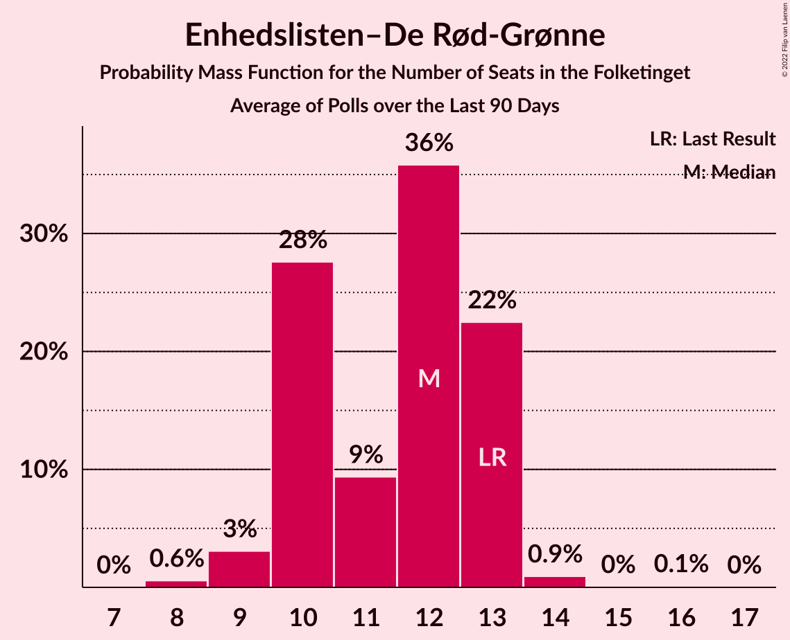
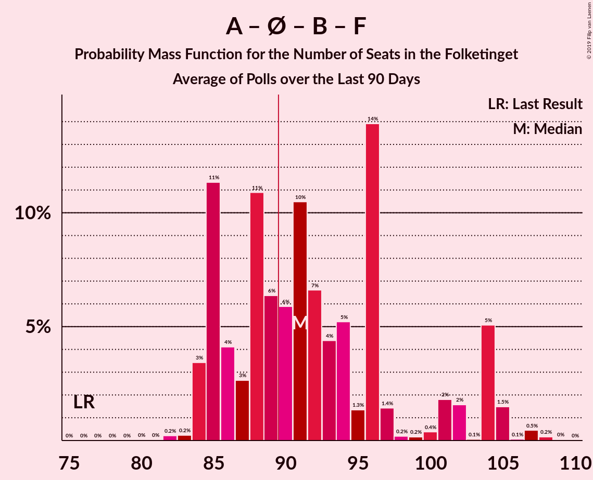

# Poll Average

<a href="#voting-intentions">Voting Intentions</a> | <a href="#seats">Seats</a> | <a href="#coalitions">Coalitions</a> | <a href="#technical-information">Technical Information</a>

## Summary

The table below lists the polls on which the average is based. They are the most recent polls (less than 90 days old) registered and analyzed so far.

| Period     | Polling firm/Commissioner(s) | A | O | V | Ø | I | Å | B | F | C | K | D |
|:----------:|:----------------------------:|:--:|:--:|:--:|:--:|:--:|:--:|:--:|:--:|:--:|:--:|:--:|
| 18 June 2015 | General Election | 26.3%   47 | 21.1%   37 | 19.5%   34 | 7.8%   14 | 7.5%   13 | 4.8%   9 | 4.6%   8 | 4.2%   7 | 3.4%   6 | 0.8%   0 | 0.0%   0 |
| N/A | Poll Average | 23–29%   40–51 | 15–20%   25–36 | 16–21%   28–37 | 7–11%   13–20 | 2–6%   4–12 | 3–6%   5–10 | 4–9%   8–15 | 4–8%   7–14 | 3–6%   6–11 | 0–2%   0 | 1–5%   0–8 |
| [14–21 January 2019](2019-01-21-Epinion.html) | Epinion   DR | N/A   N/A | N/A   N/A | N/A   N/A | N/A   N/A | N/A   N/A | N/A   N/A | N/A   N/A | N/A   N/A | N/A   N/A | N/A   N/A | N/A   N/A |
| [14–20 January 2019](2019-01-20-Voxmeter.html) | Voxmeter   Ritzau | N/A   N/A | N/A   N/A | N/A   N/A | N/A   N/A | N/A   N/A | N/A   N/A | N/A   N/A | N/A   N/A | N/A   N/A | N/A   N/A | N/A   N/A |
| [20 December 2018](2018-12-20-Megafon.html) | Megafon   Politiken and TV 2 | 23–28%   40–48 | 14–19%   25–32 | 15–19%   27–34 | 8–12%   15–21 | 4–6%   7–12 | 3–6%   6–10 | 6–9%   10–15 | 5–8%   9–15 | 3–6%   6–10 | 0–2%   0 | 2–4%   4–7 |
| [13 December 2018](2018-12-13-KantarGallup.html) | Kantar Gallup   Berlingske | 24–29%   43–51 | 17–20%   29–38 | 17–20%   29–36 | 7–10%   12–18 | 4–7%   7–12 | 3–4%   4–8 | 6–8%   9–15 | 5–7%   8–12 | 4–6%   7–11 | 0–1%   0 | 1–2%   0–4 |
| [6–11 December 2018](2018-12-11-Norstat.html) | Norstat   Altinget and Jyllands-Posten | 24–29%   42–51 | 16–20%   27–35 | 16–20%   28–36 | 7–11%   13–19 | 4–7%   7–12 | 3–6%   6–10 | 4–6%   7–11 | 5–8%   9–14 | 3–5%   5–9 | 0–1%   0 | 2–4%   4–7 |
| [29 November 2018](2018-11-29-GreensAnalyseinstitut.html) | Greens Analyseinstitut   Børsen | 22–27%   39–48 | 15–19%   26–35 | 17–22%   30–38 | 8–12%   15–20 | 2–4%   4–7 | 3–5%   6–9 | 6–9%   11–16 | 4–6%   6–11 | 4–6%   6–11 | 1–2%   0 | 3–5%   5–9 |
| 18 June 2015 | General Election | 26.3%   47 | 21.1%   37 | 19.5%   34 | 7.8%   14 | 7.5%   13 | 4.8%   9 | 4.6%   8 | 4.2%   7 | 3.4%   6 | 0.8%   0 | 0.0%   0 |

Only polls for which at least the sample size has been published are included in the table above.

**Legend:**
+ **Top half of each row:** Voting intentions (95% confidence interval)
+ **Bottom half of each row:** Seat projections for the Folketinget (95% confidence interval)
+ **A:** Socialdemokraterne
+ **O:** Dansk Folkeparti
+ **V:** Venstre
+ **Ø:** Enhedslisten–De Rød-Grønne
+ **I:** Liberal Alliance
+ **Å:** Alternativet
+ **B:** Radikale Venstre
+ **F:** Socialistisk Folkeparti
+ **C:** Det Konservative Folkeparti
+ **K:** Kristendemokraterne
+ **D:** Nye Borgerlige
+ **N/A (single party):** Party not included the published results
+ **N/A (entire row):** Calculation for this opinion poll not started yet

## Voting Intentions

### Confidence Intervals

| Party | Last Result | Median | 80% Confidence Interval | 90% Confidence Interval | 95% Confidence Interval | 99% Confidence Interval |
|:-----:|:-----------:|:------:|:-----------------------:|:-----------------------:|:-----------------------:|:-----------------------:|
| <a href="#socialdemokraterne">Socialdemokraterne</a> | 26.3% | 25.8% | 23.7–27.6% |23.2–28.1% | 22.7–28.6% | 21.9–29.4% |
| <a href="#dansk-folkeparti">Dansk Folkeparti</a> | 21.1% | 17.4% | 15.6–19.1% |15.1–19.5% | 14.7–19.9% | 13.9–20.6% |
| <a href="#venstre">Venstre</a> | 19.5% | 18.3% | 16.5–19.9% |16.0–20.4% | 15.5–20.9% | 14.7–21.8% |
| <a href="#enhedslisten–de-rød-grønne">Enhedslisten–De Rød-Grønne</a> | 7.8% | 9.2% | 7.9–10.6% |7.7–11.1% | 7.4–11.4% | 7.0–12.1% |
| <a href="#liberal-alliance">Liberal Alliance</a> | 7.5% | 4.9% | 3.0–6.0% |2.7–6.2% | 2.5–6.5% | 2.2–6.9% |
| <a href="#alternativet">Alternativet</a> | 4.8% | 4.0% | 3.1–5.0% |2.9–5.3% | 2.8–5.5% | 2.5–6.0% |
| <a href="#radikale-venstre">Radikale Venstre</a> | 4.6% | 6.9% | 4.7–8.3% |4.4–8.7% | 4.1–9.0% | 3.7–9.6% |
| <a href="#socialistisk-folkeparti">Socialistisk Folkeparti</a> | 4.2% | 5.9% | 4.6–7.1% |4.3–7.4% | 4.1–7.7% | 3.7–8.3% |
| <a href="#det-konservative-folkeparti">Det Konservative Folkeparti</a> | 3.4% | 4.6% | 3.7–5.5% |3.4–5.7% | 3.3–6.0% | 2.9–6.4% |
| <a href="#kristendemokraterne">Kristendemokraterne</a> | 0.8% | 0.8% | 0.4–1.4% |0.4–1.6% | 0.3–1.8% | 0.2–2.1% |
| <a href="#nye-borgerlige">Nye Borgerlige</a> | 0.0% | 3.0% | 1.3–4.1% |1.2–4.4% | 1.1–4.7% | 0.9–5.2% |

### Socialdemokraterne

*For a full overview of the results for this party, see the [Socialdemokraterne](party-socialdemokraterne.html) page.*

| Voting Intentions | Probability | Accumulated | Special Marks |
|:-----------------:|:-----------:|:-----------:|:-------------:|
| 19.5–20.5% | 0% | 100% |  |
| 20.5–21.5% | 0.2% | 100% |  |
| 21.5–22.5% | 2% | 99.7% |  |
| 22.5–23.5% | 6% | 98% |  |
| 23.5–24.5% | 14% | 92% |  |
| 24.5–25.5% | 22% | 78% |  |
| 25.5–26.5% | 26% | 55% | Last Result, Median |
| 26.5–27.5% | 19% | 30% |  |
| 27.5–28.5% | 8% | 11% |  |
| 28.5–29.5% | 2% | 3% |  |
| 29.5–30.5% | 0.3% | 0.4% |  |
| 30.5–31.5% | 0% | 0% |  |

### Dansk Folkeparti

*For a full overview of the results for this party, see the [Dansk Folkeparti](party-danskfolkeparti.html) page.*

| Voting Intentions | Probability | Accumulated | Special Marks |
|:-----------------:|:-----------:|:-----------:|:-------------:|
| 11.5–12.5% | 0% | 100% |  |
| 12.5–13.5% | 0.2% | 100% |  |
| 13.5–14.5% | 2% | 99.8% |  |
| 14.5–15.5% | 7% | 98% |  |
| 15.5–16.5% | 18% | 91% |  |
| 16.5–17.5% | 27% | 73% | Median |
| 17.5–18.5% | 27% | 46% |  |
| 18.5–19.5% | 15% | 19% |  |
| 19.5–20.5% | 4% | 5% |  |
| 20.5–21.5% | 0.5% | 0.5% | Last Result |
| 21.5–22.5% | 0% | 0% |  |

### Venstre

*For a full overview of the results for this party, see the [Venstre](party-venstre.html) page.*

| Voting Intentions | Probability | Accumulated | Special Marks |
|:-----------------:|:-----------:|:-----------:|:-------------:|
| 12.5–13.5% | 0% | 100% |  |
| 13.5–14.5% | 0.3% | 100% |  |
| 14.5–15.5% | 2% | 99.6% |  |
| 15.5–16.5% | 8% | 97% |  |
| 16.5–17.5% | 19% | 89% |  |
| 17.5–18.5% | 29% | 70% | Median |
| 18.5–19.5% | 25% | 41% |  |
| 19.5–20.5% | 12% | 16% | Last Result |
| 20.5–21.5% | 4% | 4% |  |
| 21.5–22.5% | 0.7% | 0.8% |  |
| 22.5–23.5% | 0.1% | 0.1% |  |
| 23.5–24.5% | 0% | 0% |  |

### Enhedslisten–De Rød-Grønne

*For a full overview of the results for this party, see the [Enhedslisten–De Rød-Grønne](party-enhedslisten–derød-grønne.html) page.*

| Voting Intentions | Probability | Accumulated | Special Marks |
|:-----------------:|:-----------:|:-----------:|:-------------:|
| 5.5–6.5% | 0.1% | 100% |  |
| 6.5–7.5% | 4% | 99.9% |  |
| 7.5–8.5% | 23% | 96% | Last Result |
| 8.5–9.5% | 36% | 73% | Median |
| 9.5–10.5% | 25% | 37% |  |
| 10.5–11.5% | 10% | 12% |  |
| 11.5–12.5% | 2% | 2% |  |
| 12.5–13.5% | 0.2% | 0.2% |  |
| 13.5–14.5% | 0% | 0% |  |

### Liberal Alliance

*For a full overview of the results for this party, see the [Liberal Alliance](party-liberalalliance.html) page.*

| Voting Intentions | Probability | Accumulated | Special Marks |
|:-----------------:|:-----------:|:-----------:|:-------------:|
| 0.5–1.5% | 0% | 100% |  |
| 1.5–2.5% | 3% | 100% |  |
| 2.5–3.5% | 17% | 97% |  |
| 3.5–4.5% | 17% | 80% |  |
| 4.5–5.5% | 40% | 64% | Median |
| 5.5–6.5% | 22% | 24% |  |
| 6.5–7.5% | 2% | 2% |  |
| 7.5–8.5% | 0% | 0% | Last Result |

### Alternativet

*For a full overview of the results for this party, see the [Alternativet](party-alternativet.html) page.*

| Voting Intentions | Probability | Accumulated | Special Marks |
|:-----------------:|:-----------:|:-----------:|:-------------:|
| 0.5–1.5% | 0% | 100% |  |
| 1.5–2.5% | 0.8% | 100% |  |
| 2.5–3.5% | 28% | 99.2% |  |
| 3.5–4.5% | 48% | 71% | Median |
| 4.5–5.5% | 21% | 23% | Last Result |
| 5.5–6.5% | 2% | 2% |  |
| 6.5–7.5% | 0.1% | 0.1% |  |
| 7.5–8.5% | 0% | 0% |  |

### Radikale Venstre

*For a full overview of the results for this party, see the [Radikale Venstre](party-radikalevenstre.html) page.*

| Voting Intentions | Probability | Accumulated | Special Marks |
|:-----------------:|:-----------:|:-----------:|:-------------:|
| 1.5–2.5% | 0% | 100% |  |
| 2.5–3.5% | 0.2% | 100% |  |
| 3.5–4.5% | 7% | 99.8% |  |
| 4.5–5.5% | 15% | 93% | Last Result |
| 5.5–6.5% | 18% | 78% |  |
| 6.5–7.5% | 32% | 60% | Median |
| 7.5–8.5% | 22% | 28% |  |
| 8.5–9.5% | 6% | 6% |  |
| 9.5–10.5% | 0.6% | 0.6% |  |
| 10.5–11.5% | 0% | 0% |  |

### Socialistisk Folkeparti

*For a full overview of the results for this party, see the [Socialistisk Folkeparti](party-socialistiskfolkeparti.html) page.*

| Voting Intentions | Probability | Accumulated | Special Marks |
|:-----------------:|:-----------:|:-----------:|:-------------:|
| 1.5–2.5% | 0% | 100% |  |
| 2.5–3.5% | 0.3% | 100% |  |
| 3.5–4.5% | 8% | 99.7% | Last Result |
| 4.5–5.5% | 29% | 92% |  |
| 5.5–6.5% | 40% | 63% | Median |
| 6.5–7.5% | 19% | 23% |  |
| 7.5–8.5% | 3% | 4% |  |
| 8.5–9.5% | 0.2% | 0.2% |  |
| 9.5–10.5% | 0% | 0% |  |

### Det Konservative Folkeparti

*For a full overview of the results for this party, see the [Det Konservative Folkeparti](party-detkonservativefolkeparti.html) page.*

| Voting Intentions | Probability | Accumulated | Special Marks |
|:-----------------:|:-----------:|:-----------:|:-------------:|
| 1.5–2.5% | 0% | 100% |  |
| 2.5–3.5% | 7% | 100% | Last Result |
| 3.5–4.5% | 42% | 93% |  |
| 4.5–5.5% | 42% | 51% | Median |
| 5.5–6.5% | 8% | 8% |  |
| 6.5–7.5% | 0.3% | 0.3% |  |
| 7.5–8.5% | 0% | 0% |  |

### Kristendemokraterne

*For a full overview of the results for this party, see the [Kristendemokraterne](party-kristendemokraterne.html) page.*

| Voting Intentions | Probability | Accumulated | Special Marks |
|:-----------------:|:-----------:|:-----------:|:-------------:|
| 0.0–0.5% | 18% | 100% |  |
| 0.5–1.5% | 75% | 82% | Last Result, Median |
| 1.5–2.5% | 6% | 6% |  |
| 2.5–3.5% | 0% | 0% |  |

### Nye Borgerlige

*For a full overview of the results for this party, see the [Nye Borgerlige](party-nyeborgerlige.html) page.*

| Voting Intentions | Probability | Accumulated | Special Marks |
|:-----------------:|:-----------:|:-----------:|:-------------:|
| 0.0–0.5% | 0% | 100% | Last Result |
| 0.5–1.5% | 17% | 100% |  |
| 1.5–2.5% | 17% | 83% |  |
| 2.5–3.5% | 39% | 66% | Median |
| 3.5–4.5% | 23% | 26% |  |
| 4.5–5.5% | 4% | 4% |  |
| 5.5–6.5% | 0.1% | 0.1% |  |
| 6.5–7.5% | 0% | 0% |  |

## Seats

### Confidence Intervals

| Party | Last Result | Median | 80% Confidence Interval | 90% Confidence Interval | 95% Confidence Interval | 99% Confidence Interval |
|:-----:|:-----------:|:------:|:-----------------------:|:-----------------------:|:-----------------------:|:-----------------------:|
| <a href="#socialdemokraterne">Socialdemokraterne</a> | 47 | 46 | 42–49 |40–50 | 40–51 | 39–51 |
| <a href="#dansk-folkeparti">Dansk Folkeparti</a> | 37 | 30 | 27–34 |26–35 | 25–36 | 25–38 |
| <a href="#venstre">Venstre</a> | 34 | 32 | 28–35 |28–36 | 28–37 | 26–38 |
| <a href="#enhedslisten–de-rød-grønne">Enhedslisten–De Rød-Grønne</a> | 14 | 16 | 14–19 |13–19 | 13–20 | 12–22 |
| <a href="#liberal-alliance">Liberal Alliance</a> | 13 | 8 | 5–11 |4–11 | 4–12 | 4–12 |
| <a href="#alternativet">Alternativet</a> | 9 | 7 | 6–9 |5–10 | 5–10 | 4–11 |
| <a href="#radikale-venstre">Radikale Venstre</a> | 8 | 13 | 8–15 |8–15 | 8–15 | 6–17 |
| <a href="#socialistisk-folkeparti">Socialistisk Folkeparti</a> | 7 | 10 | 8–12 |8–13 | 7–14 | 6–15 |
| <a href="#det-konservative-folkeparti">Det Konservative Folkeparti</a> | 6 | 8 | 6–10 |6–10 | 6–11 | 5–11 |
| <a href="#kristendemokraterne">Kristendemokraterne</a> | 0 | 0 | 0 |0 | 0 | 0 |
| <a href="#nye-borgerlige">Nye Borgerlige</a> | 0 | 5 | 0–7 |0–8 | 0–8 | 0–9 |

### Socialdemokraterne

*For a full overview of the results for this party, see the [Socialdemokraterne](party-socialdemokraterne.html) page.*

| Number of Seats | Probability | Accumulated | Special Marks |
|:---------------:|:-----------:|:-----------:|:-------------:|
| 37 | 0.2% | 100% |  |
| 38 | 0.3% | 99.8% |  |
| 39 | 0.9% | 99.6% |  |
| 40 | 4% | 98.7% |  |
| 41 | 3% | 95% |  |
| 42 | 7% | 92% |  |
| 43 | 7% | 85% |  |
| 44 | 11% | 78% |  |
| 45 | 11% | 67% |  |
| 46 | 21% | 56% | Median |
| 47 | 7% | 34% | Last Result |
| 48 | 9% | 28% |  |
| 49 | 10% | 19% |  |
| 50 | 4% | 8% |  |
| 51 | 4% | 5% |  |
| 52 | 0.2% | 0.4% |  |
| 53 | 0.1% | 0.2% |  |
| 54 | 0.1% | 0.1% |  |
| 55 | 0% | 0% |  |

### Dansk Folkeparti

*For a full overview of the results for this party, see the [Dansk Folkeparti](party-danskfolkeparti.html) page.*

| Number of Seats | Probability | Accumulated | Special Marks |
|:---------------:|:-----------:|:-----------:|:-------------:|
| 24 | 0.2% | 100% |  |
| 25 | 2% | 99.7% |  |
| 26 | 4% | 97% |  |
| 27 | 4% | 93% |  |
| 28 | 7% | 89% |  |
| 29 | 17% | 81% |  |
| 30 | 17% | 64% | Median |
| 31 | 8% | 47% |  |
| 32 | 13% | 39% |  |
| 33 | 9% | 26% |  |
| 34 | 8% | 17% |  |
| 35 | 5% | 9% |  |
| 36 | 3% | 5% |  |
| 37 | 1.0% | 2% | Last Result |
| 38 | 0.7% | 0.8% |  |
| 39 | 0.2% | 0.2% |  |
| 40 | 0% | 0% |  |

### Venstre

*For a full overview of the results for this party, see the [Venstre](party-venstre.html) page.*

| Number of Seats | Probability | Accumulated | Special Marks |
|:---------------:|:-----------:|:-----------:|:-------------:|
| 25 | 0.1% | 100% |  |
| 26 | 0.4% | 99.9% |  |
| 27 | 0.6% | 99.5% |  |
| 28 | 11% | 98.9% |  |
| 29 | 10% | 88% |  |
| 30 | 13% | 78% |  |
| 31 | 8% | 65% |  |
| 32 | 14% | 57% | Median |
| 33 | 10% | 43% |  |
| 34 | 15% | 33% | Last Result |
| 35 | 9% | 19% |  |
| 36 | 6% | 10% |  |
| 37 | 2% | 3% |  |
| 38 | 0.7% | 1.1% |  |
| 39 | 0.3% | 0.3% |  |
| 40 | 0% | 0.1% |  |
| 41 | 0% | 0% |  |

### Enhedslisten–De Rød-Grønne

*For a full overview of the results for this party, see the [Enhedslisten–De Rød-Grønne](party-enhedslisten–derød-grønne.html) page.*

| Number of Seats | Probability | Accumulated | Special Marks |
|:---------------:|:-----------:|:-----------:|:-------------:|
| 11 | 0.1% | 100% |  |
| 12 | 0.8% | 99.9% |  |
| 13 | 5% | 99.0% |  |
| 14 | 7% | 94% | Last Result |
| 15 | 15% | 87% |  |
| 16 | 23% | 72% | Median |
| 17 | 14% | 49% |  |
| 18 | 13% | 34% |  |
| 19 | 18% | 21% |  |
| 20 | 2% | 3% |  |
| 21 | 0.6% | 1.2% |  |
| 22 | 0.5% | 0.6% |  |
| 23 | 0% | 0.1% |  |
| 24 | 0% | 0% |  |

### Liberal Alliance

*For a full overview of the results for this party, see the [Liberal Alliance](party-liberalalliance.html) page.*

| Number of Seats | Probability | Accumulated | Special Marks |
|:---------------:|:-----------:|:-----------:|:-------------:|
| 0 | 0.2% | 100% |  |
| 1 | 0% | 99.8% |  |
| 2 | 0% | 99.8% |  |
| 3 | 0% | 99.8% |  |
| 4 | 6% | 99.8% |  |
| 5 | 9% | 94% |  |
| 6 | 6% | 85% |  |
| 7 | 18% | 79% |  |
| 8 | 11% | 61% | Median |
| 9 | 20% | 49% |  |
| 10 | 17% | 29% |  |
| 11 | 10% | 12% |  |
| 12 | 2% | 3% |  |
| 13 | 0.3% | 0.3% | Last Result |
| 14 | 0% | 0% |  |

### Alternativet

*For a full overview of the results for this party, see the [Alternativet](party-alternativet.html) page.*

| Number of Seats | Probability | Accumulated | Special Marks |
|:---------------:|:-----------:|:-----------:|:-------------:|
| 4 | 1.0% | 100% |  |
| 5 | 7% | 99.0% |  |
| 6 | 21% | 92% |  |
| 7 | 28% | 71% | Median |
| 8 | 31% | 43% |  |
| 9 | 7% | 12% | Last Result |
| 10 | 5% | 6% |  |
| 11 | 0.5% | 0.6% |  |
| 12 | 0% | 0% |  |

### Radikale Venstre

*For a full overview of the results for this party, see the [Radikale Venstre](party-radikalevenstre.html) page.*

| Number of Seats | Probability | Accumulated | Special Marks |
|:---------------:|:-----------:|:-----------:|:-------------:|
| 6 | 0.6% | 100% |  |
| 7 | 2% | 99.4% |  |
| 8 | 13% | 98% | Last Result |
| 9 | 7% | 85% |  |
| 10 | 5% | 78% |  |
| 11 | 12% | 72% |  |
| 12 | 10% | 61% |  |
| 13 | 20% | 51% | Median |
| 14 | 21% | 31% |  |
| 15 | 9% | 11% |  |
| 16 | 1.1% | 2% |  |
| 17 | 0.4% | 0.5% |  |
| 18 | 0.1% | 0.2% |  |
| 19 | 0% | 0% |  |

### Socialistisk Folkeparti

*For a full overview of the results for this party, see the [Socialistisk Folkeparti](party-socialistiskfolkeparti.html) page.*

| Number of Seats | Probability | Accumulated | Special Marks |
|:---------------:|:-----------:|:-----------:|:-------------:|
| 6 | 1.0% | 100% |  |
| 7 | 3% | 99.0% | Last Result |
| 8 | 13% | 96% |  |
| 9 | 12% | 83% |  |
| 10 | 26% | 71% | Median |
| 11 | 17% | 45% |  |
| 12 | 20% | 28% |  |
| 13 | 5% | 8% |  |
| 14 | 2% | 3% |  |
| 15 | 1.1% | 1.1% |  |
| 16 | 0% | 0% |  |

### Det Konservative Folkeparti

*For a full overview of the results for this party, see the [Det Konservative Folkeparti](party-detkonservativefolkeparti.html) page.*

| Number of Seats | Probability | Accumulated | Special Marks |
|:---------------:|:-----------:|:-----------:|:-------------:|
| 5 | 2% | 100% |  |
| 6 | 14% | 98% | Last Result |
| 7 | 13% | 85% |  |
| 8 | 30% | 72% | Median |
| 9 | 30% | 42% |  |
| 10 | 7% | 12% |  |
| 11 | 4% | 4% |  |
| 12 | 0.4% | 0.4% |  |
| 13 | 0.1% | 0.1% |  |
| 14 | 0% | 0% |  |

### Kristendemokraterne

*For a full overview of the results for this party, see the [Kristendemokraterne](party-kristendemokraterne.html) page.*

| Number of Seats | Probability | Accumulated | Special Marks |
|:---------------:|:-----------:|:-----------:|:-------------:|
| 0 | 99.7% | 100% | Last Result, Median |
| 1 | 0% | 0.3% |  |
| 2 | 0% | 0.3% |  |
| 3 | 0% | 0.3% |  |
| 4 | 0.3% | 0.3% |  |
| 5 | 0% | 0% |  |

### Nye Borgerlige

*For a full overview of the results for this party, see the [Nye Borgerlige](party-nyeborgerlige.html) page.*

| Number of Seats | Probability | Accumulated | Special Marks |
|:---------------:|:-----------:|:-----------:|:-------------:|
| 0 | 24% | 100% | Last Result |
| 1 | 0% | 76% |  |
| 2 | 0% | 76% |  |
| 3 | 0% | 76% |  |
| 4 | 9% | 76% |  |
| 5 | 19% | 66% | Median |
| 6 | 34% | 48% |  |
| 7 | 6% | 14% |  |
| 8 | 7% | 8% |  |
| 9 | 0.6% | 0.7% |  |
| 10 | 0.1% | 0.1% |  |
| 11 | 0% | 0% |  |

## Coalitions

### Confidence Intervals

| Coalition | Last Result | Median | Majority? | 80% Confidence Interval | 90% Confidence Interval | 95% Confidence Interval | 99% Confidence Interval |
|:---------:|:-----------:|:------:|:---------:|:-----------------------:|:-----------------------:|:-----------------------:|:-----------------------:|
| Socialdemokraterne – Enhedslisten–De Rød-Grønne – Alternativet – Radikale Venstre – Socialistisk Folkeparti | 85 | 91 | 75% | 88–96 | 86–96 | 85–97 | 84–99 |
| Dansk Folkeparti – Venstre – Liberal Alliance – Det Konservative Folkeparti – Kristendemokraterne – Nye Borgerlige | 90 | 84 | 4% | 79–87 | 79–89 | 78–90 | 76–91 |
| Dansk Folkeparti – Venstre – Liberal Alliance – Det Konservative Folkeparti – Nye Borgerlige | 90 | 83 | 4% | 79–87 | 79–89 | 78–90 | 76–91 |
| Socialdemokraterne – Enhedslisten–De Rød-Grønne – Radikale Venstre – Socialistisk Folkeparti | 76 | 85 | 2% | 80–88 | 79–89 | 78–89 | 76–91 |
| Dansk Folkeparti – Venstre – Liberal Alliance – Det Konservative Folkeparti – Kristendemokraterne | 90 | 78 | 1.0% | 73–84 | 73–86 | 73–88 | 71–91 |
| Dansk Folkeparti – Venstre – Liberal Alliance – Det Konservative Folkeparti | 90 | 78 | 1.0% | 73–84 | 73–86 | 73–88 | 71–91 |
| Socialdemokraterne – Radikale Venstre – Socialistisk Folkeparti | 62 | 68 | 0% | 64–72 | 63–72 | 62–73 | 59–75 |
| Socialdemokraterne – Radikale Venstre | 55 | 58 | 0% | 54–61 | 53–62 | 52–63 | 50–64 |
| Venstre – Liberal Alliance – Det Konservative Folkeparti | 53 | 48 | 0% | 44–52 | 44–53 | 44–54 | 42–57 |
| Venstre – Det Konservative Folkeparti | 40 | 40 | 0% | 37–44 | 36–45 | 36–45 | 34–47 |
| Venstre | 34 | 32 | 0% | 28–35 | 28–36 | 28–37 | 26–38 |

### Socialdemokraterne – Enhedslisten–De Rød-Grønne – Alternativet – Radikale Venstre – Socialistisk Folkeparti

| Number of Seats | Probability | Accumulated | Special Marks |
|:---------------:|:-----------:|:-----------:|:-------------:|
| 82 | 0.3% | 100% |  |
| 83 | 0.2% | 99.7% |  |
| 84 | 1.4% | 99.6% |  |
| 85 | 2% | 98% | Last Result |
| 86 | 2% | 96% |  |
| 87 | 2% | 94% |  |
| 88 | 7% | 92% |  |
| 89 | 11% | 85% |  |
| 90 | 10% | 75% | Majority |
| 91 | 15% | 65% |  |
| 92 | 6% | 50% | Median |
| 93 | 13% | 44% |  |
| 94 | 11% | 31% |  |
| 95 | 6% | 20% |  |
| 96 | 11% | 14% |  |
| 97 | 0.9% | 3% |  |
| 98 | 1.1% | 2% |  |
| 99 | 0.2% | 0.6% |  |
| 100 | 0.1% | 0.4% |  |
| 101 | 0.2% | 0.2% |  |
| 102 | 0% | 0% |  |

### Dansk Folkeparti – Venstre – Liberal Alliance – Det Konservative Folkeparti – Kristendemokraterne – Nye Borgerlige

| Number of Seats | Probability | Accumulated | Special Marks |
|:---------------:|:-----------:|:-----------:|:-------------:|
| 74 | 0.2% | 100% |  |
| 75 | 0.1% | 99.8% |  |
| 76 | 0.2% | 99.6% |  |
| 77 | 1.1% | 99.4% |  |
| 78 | 0.9% | 98% |  |
| 79 | 11% | 97% |  |
| 80 | 6% | 86% |  |
| 81 | 11% | 80% |  |
| 82 | 13% | 69% |  |
| 83 | 6% | 56% | Median |
| 84 | 15% | 50% |  |
| 85 | 10% | 35% |  |
| 86 | 11% | 25% |  |
| 87 | 7% | 15% |  |
| 88 | 2% | 8% |  |
| 89 | 2% | 6% |  |
| 90 | 2% | 4% | Last Result, Majority |
| 91 | 1.4% | 2% |  |
| 92 | 0.2% | 0.4% |  |
| 93 | 0.3% | 0.3% |  |
| 94 | 0% | 0% |  |

### Dansk Folkeparti – Venstre – Liberal Alliance – Det Konservative Folkeparti – Nye Borgerlige

| Number of Seats | Probability | Accumulated | Special Marks |
|:---------------:|:-----------:|:-----------:|:-------------:|
| 74 | 0.2% | 100% |  |
| 75 | 0.1% | 99.8% |  |
| 76 | 0.2% | 99.6% |  |
| 77 | 1.1% | 99.4% |  |
| 78 | 0.9% | 98% |  |
| 79 | 11% | 97% |  |
| 80 | 6% | 86% |  |
| 81 | 12% | 80% |  |
| 82 | 13% | 69% |  |
| 83 | 6% | 56% | Median |
| 84 | 15% | 50% |  |
| 85 | 10% | 35% |  |
| 86 | 11% | 25% |  |
| 87 | 7% | 15% |  |
| 88 | 2% | 8% |  |
| 89 | 2% | 6% |  |
| 90 | 2% | 4% | Last Result, Majority |
| 91 | 1.4% | 2% |  |
| 92 | 0.2% | 0.4% |  |
| 93 | 0.3% | 0.3% |  |
| 94 | 0% | 0% |  |

### Socialdemokraterne – Enhedslisten–De Rød-Grønne – Radikale Venstre – Socialistisk Folkeparti

| Number of Seats | Probability | Accumulated | Special Marks |
|:---------------:|:-----------:|:-----------:|:-------------:|
| 73 | 0.1% | 100% |  |
| 74 | 0% | 99.9% |  |
| 75 | 0.1% | 99.9% |  |
| 76 | 1.0% | 99.9% | Last Result |
| 77 | 0.9% | 98.8% |  |
| 78 | 1.1% | 98% |  |
| 79 | 5% | 97% |  |
| 80 | 3% | 92% |  |
| 81 | 6% | 88% |  |
| 82 | 10% | 83% |  |
| 83 | 8% | 73% |  |
| 84 | 9% | 65% |  |
| 85 | 12% | 56% | Median |
| 86 | 15% | 44% |  |
| 87 | 12% | 28% |  |
| 88 | 11% | 16% |  |
| 89 | 3% | 5% |  |
| 90 | 1.5% | 2% | Majority |
| 91 | 0.3% | 0.8% |  |
| 92 | 0.2% | 0.4% |  |
| 93 | 0.1% | 0.2% |  |
| 94 | 0% | 0.1% |  |
| 95 | 0% | 0% |  |

### Dansk Folkeparti – Venstre – Liberal Alliance – Det Konservative Folkeparti – Kristendemokraterne

| Number of Seats | Probability | Accumulated | Special Marks |
|:---------------:|:-----------:|:-----------:|:-------------:|
| 68 | 0% | 100% |  |
| 69 | 0.1% | 99.9% |  |
| 70 | 0.3% | 99.8% |  |
| 71 | 0.3% | 99.5% |  |
| 72 | 1.5% | 99.3% |  |
| 73 | 11% | 98% |  |
| 74 | 4% | 87% |  |
| 75 | 3% | 83% |  |
| 76 | 8% | 80% |  |
| 77 | 10% | 73% |  |
| 78 | 13% | 63% | Median |
| 79 | 7% | 49% |  |
| 80 | 9% | 42% |  |
| 81 | 7% | 33% |  |
| 82 | 8% | 26% |  |
| 83 | 3% | 18% |  |
| 84 | 6% | 15% |  |
| 85 | 3% | 9% |  |
| 86 | 1.3% | 6% |  |
| 87 | 2% | 5% |  |
| 88 | 0.6% | 3% |  |
| 89 | 0.9% | 2% |  |
| 90 | 0.5% | 1.0% | Last Result, Majority |
| 91 | 0.4% | 0.5% |  |
| 92 | 0.1% | 0.1% |  |
| 93 | 0% | 0% |  |

### Dansk Folkeparti – Venstre – Liberal Alliance – Det Konservative Folkeparti

| Number of Seats | Probability | Accumulated | Special Marks |
|:---------------:|:-----------:|:-----------:|:-------------:|
| 68 | 0% | 100% |  |
| 69 | 0.1% | 99.9% |  |
| 70 | 0.3% | 99.8% |  |
| 71 | 0.3% | 99.5% |  |
| 72 | 1.5% | 99.3% |  |
| 73 | 11% | 98% |  |
| 74 | 4% | 87% |  |
| 75 | 3% | 83% |  |
| 76 | 8% | 80% |  |
| 77 | 10% | 72% |  |
| 78 | 13% | 62% | Median |
| 79 | 7% | 49% |  |
| 80 | 9% | 42% |  |
| 81 | 7% | 33% |  |
| 82 | 8% | 26% |  |
| 83 | 3% | 18% |  |
| 84 | 6% | 15% |  |
| 85 | 3% | 9% |  |
| 86 | 1.3% | 6% |  |
| 87 | 2% | 5% |  |
| 88 | 0.6% | 3% |  |
| 89 | 0.9% | 2% |  |
| 90 | 0.5% | 1.0% | Last Result, Majority |
| 91 | 0.4% | 0.5% |  |
| 92 | 0.1% | 0.1% |  |
| 93 | 0% | 0% |  |

### Socialdemokraterne – Radikale Venstre – Socialistisk Folkeparti

| Number of Seats | Probability | Accumulated | Special Marks |
|:---------------:|:-----------:|:-----------:|:-------------:|
| 58 | 0.1% | 100% |  |
| 59 | 0.4% | 99.9% |  |
| 60 | 0.6% | 99.5% |  |
| 61 | 0.8% | 98.9% |  |
| 62 | 3% | 98% | Last Result |
| 63 | 4% | 95% |  |
| 64 | 8% | 91% |  |
| 65 | 7% | 83% |  |
| 66 | 13% | 76% |  |
| 67 | 9% | 63% |  |
| 68 | 8% | 54% |  |
| 69 | 14% | 46% | Median |
| 70 | 8% | 32% |  |
| 71 | 8% | 24% |  |
| 72 | 12% | 16% |  |
| 73 | 2% | 4% |  |
| 74 | 1.4% | 2% |  |
| 75 | 0.4% | 0.7% |  |
| 76 | 0.2% | 0.3% |  |
| 77 | 0.1% | 0.1% |  |
| 78 | 0% | 0% |  |

### Socialdemokraterne – Radikale Venstre

| Number of Seats | Probability | Accumulated | Special Marks |
|:---------------:|:-----------:|:-----------:|:-------------:|
| 49 | 0.1% | 100% |  |
| 50 | 0.4% | 99.8% |  |
| 51 | 0.7% | 99.4% |  |
| 52 | 1.4% | 98.7% |  |
| 53 | 4% | 97% |  |
| 54 | 14% | 94% |  |
| 55 | 10% | 80% | Last Result |
| 56 | 9% | 69% |  |
| 57 | 7% | 61% |  |
| 58 | 15% | 54% |  |
| 59 | 7% | 39% | Median |
| 60 | 13% | 32% |  |
| 61 | 12% | 18% |  |
| 62 | 4% | 7% |  |
| 63 | 1.4% | 3% |  |
| 64 | 0.7% | 1.2% |  |
| 65 | 0.3% | 0.4% |  |
| 66 | 0.1% | 0.1% |  |
| 67 | 0% | 0% |  |

### Venstre – Liberal Alliance – Det Konservative Folkeparti

| Number of Seats | Probability | Accumulated | Special Marks |
|:---------------:|:-----------:|:-----------:|:-------------:|
| 40 | 0.1% | 100% |  |
| 41 | 0.1% | 99.9% |  |
| 42 | 0.5% | 99.8% |  |
| 43 | 1.2% | 99.3% |  |
| 44 | 9% | 98% |  |
| 45 | 6% | 89% |  |
| 46 | 11% | 83% |  |
| 47 | 14% | 72% |  |
| 48 | 14% | 59% | Median |
| 49 | 15% | 45% |  |
| 50 | 12% | 30% |  |
| 51 | 6% | 17% |  |
| 52 | 4% | 11% |  |
| 53 | 2% | 7% | Last Result |
| 54 | 3% | 5% |  |
| 55 | 0.6% | 2% |  |
| 56 | 0.4% | 1.3% |  |
| 57 | 0.6% | 0.9% |  |
| 58 | 0.2% | 0.3% |  |
| 59 | 0% | 0.1% |  |
| 60 | 0% | 0% |  |

### Venstre – Det Konservative Folkeparti

| Number of Seats | Probability | Accumulated | Special Marks |
|:---------------:|:-----------:|:-----------:|:-------------:|
| 32 | 0% | 100% |  |
| 33 | 0.2% | 99.9% |  |
| 34 | 0.7% | 99.8% |  |
| 35 | 0.9% | 99.1% |  |
| 36 | 6% | 98% |  |
| 37 | 18% | 92% |  |
| 38 | 7% | 74% |  |
| 39 | 8% | 68% |  |
| 40 | 18% | 60% | Last Result, Median |
| 41 | 11% | 42% |  |
| 42 | 10% | 31% |  |
| 43 | 8% | 20% |  |
| 44 | 4% | 12% |  |
| 45 | 6% | 9% |  |
| 46 | 1.1% | 2% |  |
| 47 | 0.8% | 1.1% |  |
| 48 | 0.3% | 0.4% |  |
| 49 | 0% | 0.1% |  |
| 50 | 0% | 0% |  |

### Venstre

| Number of Seats | Probability | Accumulated | Special Marks |
|:---------------:|:-----------:|:-----------:|:-------------:|
| 25 | 0.1% | 100% |  |
| 26 | 0.4% | 99.9% |  |
| 27 | 0.6% | 99.5% |  |
| 28 | 11% | 98.9% |  |
| 29 | 10% | 88% |  |
| 30 | 13% | 78% |  |
| 31 | 8% | 65% |  |
| 32 | 14% | 57% | Median |
| 33 | 10% | 43% |  |
| 34 | 15% | 33% | Last Result |
| 35 | 9% | 19% |  |
| 36 | 6% | 10% |  |
| 37 | 2% | 3% |  |
| 38 | 0.7% | 1.1% |  |
| 39 | 0.3% | 0.3% |  |
| 40 | 0% | 0.1% |  |
| 41 | 0% | 0% |  |

## Technical Information

+ **Number of polls included in this average:** 6
+ **Lowest number of simulations done in a poll included in this average:** 0
+ **Total number of simulations done in the polls included in this average:** 4,194,300
+ **Error estimate:** 2.97%
