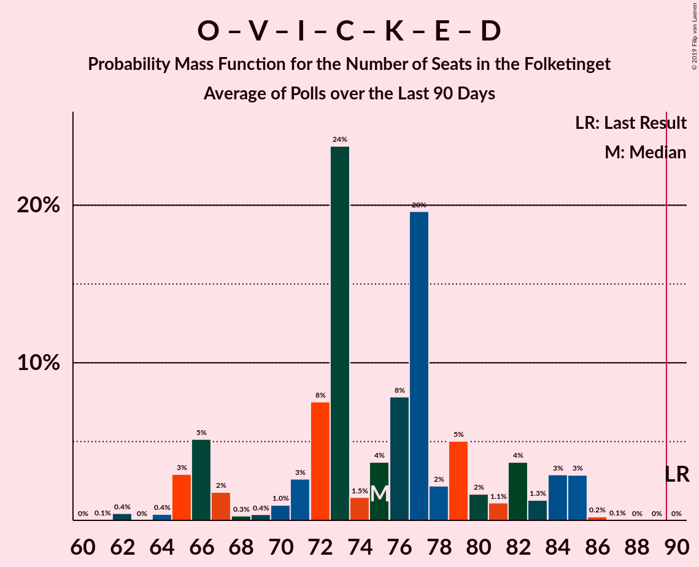

# Poll Average

<a href="#voting-intentions">Voting Intentions</a> | <a href="#seats">Seats</a> | <a href="#coalitions">Coalitions</a> | <a href="#technical-information">Technical Information</a>

## Summary

The table below lists the polls on which the average is based. They are the most recent polls (less than 90 days old) registered and analyzed so far.

| Period     | Polling firm/Commissioner(s) | A | O | V | Ø | I | Å | B | F | C | K | D | E |
|:----------:|:----------------------------:|:--:|:--:|:--:|:--:|:--:|:--:|:--:|:--:|:--:|:--:|:--:|:--:|
| 18 June 2015 | General Election | 26.3%   47 | 21.1%   37 | 19.5%   34 | 7.8%   14 | 7.5%   13 | 4.8%   9 | 4.6%   8 | 4.2%   7 | 3.4%   6 | 0.8%   0 | 0.0%   0 | 0.0%   0 |
| N/A | Poll Average | 23–30%   40–54 | 13–20%   23–33 | 16–20%   29–36 | 7–11%   12–21 | 4–7%   7–11 | 3–6%   5–7 | 4–8%   7–15 | 5–8%   9–12 | 3–6%   6–10 | 0–2%   0 | 1–6%   0–12 | 0–2%   0 |
| [25 February–3 March 2019](2019-03-03-Voxmeter.html) | Voxmeter   Ritzau | 25–31%   47–57 | 13–17%   23–29 | 16–21%   28–36 | 7–11%   10–12 | 4–7%   9–11 | 3–6%   7–9 | 5–8%   13–14 | 5–8%   11–12 | 3–6%   8–10 | 0–2%   0 | 1–3%   0–4 | 0–1%   0 |
| [19–25 February 2019](2019-02-25-Epinion.html) | Epinion   DR | 26–31%   46–56 | 13–17%   25–29 | 16–20%   31–33 | 8–11%   14–21 | 4–6%   7 | 3–5%   5–9 | 5–7%   11–13 | 5–7%   8–12 | 3–5%   7 | 0–1%   0 | 2–4%   4–5 | 1–3%   0 |
| [11–14 January 2019](2019-01-14-YouGov.html) | YouGov | 22–26%   40–46 | 14–18%   23–31 | 16–19%   29–31 | 9–12%   19–20 | 4–6%   7–9 | 3–5%   5–7 | 5–7%   9–12 | 5–7%   11–12 | 4–6%   8–9 | 1–2%   0 | 5–7%   10–12 | N/A   N/A |
| [20 December 2018](2018-12-20-Megafon.html) | Megafon   Politiken and TV 2 | 23–28%   42–51 | 14–19%   24–31 | 15–19%   28–32 | 8–12%   18–19 | 4–6%   9–11 | 3–6%   5–9 | 6–9%   10–15 | 5–8%   9–12 | 3–6%   7–9 | 0–2%   0 | 2–4%   4–6 | N/A   N/A |
| [13 December 2018](2018-12-13-KantarGallup.html) | Kantar Gallup   Berlingske | 24–29%   49 | 17–20%   33 | 17–20%   32 | 7–10%   15 | 4–7%   9 | 3–4%   6 | 6–8%   13 | 5–7%   10 | 4–6%   8 | 0–1%   0 | 1–2%   0 | N/A   N/A |
| [6–11 December 2018](2018-12-11-Norstat.html) | Norstat   Altinget and Jyllands-Posten | 24–29%   45–54 | 16–20%   27–34 | 16–20%   30–35 | 7–11%   16–22 | 4–7%   6–10 | 3–6%   5–7 | 4–6%   7–12 | 5–8%   9–11 | 3–5%   5–8 | 0–1%   0 | 2–4%   4–9 | N/A   N/A |
| 18 June 2015 | General Election | 26.3%   47 | 21.1%   37 | 19.5%   34 | 7.8%   14 | 7.5%   13 | 4.8%   9 | 4.6%   8 | 4.2%   7 | 3.4%   6 | 0.8%   0 | 0.0%   0 | 0.0%   0 |

Only polls for which at least the sample size has been published are included in the table above.

**Legend:**
+ **Top half of each row:** Voting intentions (95% confidence interval)
+ **Bottom half of each row:** Seat projections for the Folketinget (95% confidence interval)
+ **A:** Socialdemokraterne
+ **O:** Dansk Folkeparti
+ **V:** Venstre
+ **Ø:** Enhedslisten–De Rød-Grønne
+ **I:** Liberal Alliance
+ **Å:** Alternativet
+ **B:** Radikale Venstre
+ **F:** Socialistisk Folkeparti
+ **C:** Det Konservative Folkeparti
+ **K:** Kristendemokraterne
+ **D:** Nye Borgerlige
+ **E:** Klaus Riskær Pedersen
+ **N/A (single party):** Party not included the published results
+ **N/A (entire row):** Calculation for this opinion poll not started yet

## Voting Intentions

### Confidence Intervals

| Party | Last Result | Median | 80% Confidence Interval | 90% Confidence Interval | 95% Confidence Interval | 99% Confidence Interval |
|:-----:|:-----------:|:------:|:-----------------------:|:-----------------------:|:-----------------------:|:-----------------------:|
| <a href="#socialdemokraterne">Socialdemokraterne</a> | 26.3% | 26.5% | 23.7–28.9% |23.1–29.5% | 22.7–30.0% | 21.9–30.9% |
| <a href="#dansk-folkeparti">Dansk Folkeparti</a> | 21.1% | 16.2% | 14.3–18.6% |13.8–19.2% | 13.4–19.6% | 12.6–20.4% |
| <a href="#venstre">Venstre</a> | 19.5% | 17.9% | 16.5–19.4% |16.0–19.8% | 15.6–20.2% | 14.8–20.9% |
| <a href="#enhedslisten–de-rød-grønne">Enhedslisten–De Rød-Grønne</a> | 7.8% | 9.3% | 8.0–10.7% |7.7–11.1% | 7.4–11.4% | 6.9–12.0% |
| <a href="#liberal-alliance">Liberal Alliance</a> | 7.5% | 5.1% | 4.2–6.1% |4.0–6.4% | 3.8–6.7% | 3.5–7.2% |
| <a href="#alternativet">Alternativet</a> | 4.8% | 4.0% | 3.2–5.0% |3.0–5.2% | 2.8–5.5% | 2.5–6.0% |
| <a href="#radikale-venstre">Radikale Venstre</a> | 4.6% | 6.4% | 5.0–7.7% |4.6–8.1% | 4.3–8.5% | 3.8–9.2% |
| <a href="#socialistisk-folkeparti">Socialistisk Folkeparti</a> | 4.2% | 6.1% | 5.2–7.0% |5.0–7.4% | 4.8–7.6% | 4.4–8.2% |
| <a href="#det-konservative-folkeparti">Det Konservative Folkeparti</a> | 3.4% | 4.4% | 3.5–5.3% |3.3–5.6% | 3.1–5.8% | 2.8–6.2% |
| <a href="#kristendemokraterne">Kristendemokraterne</a> | 0.8% | 0.8% | 0.5–1.2% |0.4–1.4% | 0.3–1.5% | 0.2–1.8% |
| <a href="#nye-borgerlige">Nye Borgerlige</a> | 0.0% | 2.8% | 1.5–5.6% |1.3–6.0% | 1.1–6.3% | 0.9–6.8% |
| <a href="#klaus-riskær-pedersen">Klaus Riskær Pedersen</a> | 0.0% | 1.3% | 0.4–2.2% |0.4–2.3% | 0.3–2.5% | 0.2–2.8% |

### Socialdemokraterne

*For a full overview of the results for this party, see the [Socialdemokraterne](party-socialdemokraterne.html) page.*

| Voting Intentions | Probability | Accumulated | Special Marks |
|:-----------------:|:-----------:|:-----------:|:-------------:|
| 19.5–20.5% | 0% | 100% |  |
| 20.5–21.5% | 0.2% | 100% |  |
| 21.5–22.5% | 2% | 99.8% |  |
| 22.5–23.5% | 7% | 98% |  |
| 23.5–24.5% | 11% | 91% |  |
| 24.5–25.5% | 14% | 80% |  |
| 25.5–26.5% | 18% | 66% | Last Result, Median |
| 26.5–27.5% | 19% | 48% |  |
| 27.5–28.5% | 15% | 29% |  |
| 28.5–29.5% | 9% | 14% |  |
| 29.5–30.5% | 4% | 5% |  |
| 30.5–31.5% | 0.9% | 1.0% |  |
| 31.5–32.5% | 0.1% | 0.1% |  |
| 32.5–33.5% | 0% | 0% |  |

### Dansk Folkeparti

*For a full overview of the results for this party, see the [Dansk Folkeparti](party-danskfolkeparti.html) page.*

| Voting Intentions | Probability | Accumulated | Special Marks |
|:-----------------:|:-----------:|:-----------:|:-------------:|
| 10.5–11.5% | 0% | 100% |  |
| 11.5–12.5% | 0.4% | 100% |  |
| 12.5–13.5% | 3% | 99.6% |  |
| 13.5–14.5% | 10% | 97% |  |
| 14.5–15.5% | 20% | 86% |  |
| 15.5–16.5% | 23% | 66% | Median |
| 16.5–17.5% | 17% | 43% |  |
| 17.5–18.5% | 14% | 26% |  |
| 18.5–19.5% | 8% | 11% |  |
| 19.5–20.5% | 2% | 3% |  |
| 20.5–21.5% | 0.3% | 0.3% | Last Result |
| 21.5–22.5% | 0% | 0% |  |

### Venstre

*For a full overview of the results for this party, see the [Venstre](party-venstre.html) page.*

| Voting Intentions | Probability | Accumulated | Special Marks |
|:-----------------:|:-----------:|:-----------:|:-------------:|
| 12.5–13.5% | 0% | 100% |  |
| 13.5–14.5% | 0.2% | 100% |  |
| 14.5–15.5% | 2% | 99.7% |  |
| 15.5–16.5% | 9% | 98% |  |
| 16.5–17.5% | 26% | 89% |  |
| 17.5–18.5% | 35% | 63% | Median |
| 18.5–19.5% | 21% | 28% |  |
| 19.5–20.5% | 6% | 7% | Last Result |
| 20.5–21.5% | 1.0% | 1.2% |  |
| 21.5–22.5% | 0.1% | 0.1% |  |
| 22.5–23.5% | 0% | 0% |  |

### Enhedslisten–De Rød-Grønne

*For a full overview of the results for this party, see the [Enhedslisten–De Rød-Grønne](party-enhedslisten–derød-grønne.html) page.*

| Voting Intentions | Probability | Accumulated | Special Marks |
|:-----------------:|:-----------:|:-----------:|:-------------:|
| 4.5–5.5% | 0% | 100% |  |
| 5.5–6.5% | 0.1% | 100% |  |
| 6.5–7.5% | 4% | 99.9% |  |
| 7.5–8.5% | 21% | 96% | Last Result |
| 8.5–9.5% | 33% | 75% | Median |
| 9.5–10.5% | 29% | 42% |  |
| 10.5–11.5% | 12% | 13% |  |
| 11.5–12.5% | 2% | 2% |  |
| 12.5–13.5% | 0.1% | 0.1% |  |
| 13.5–14.5% | 0% | 0% |  |

### Liberal Alliance

*For a full overview of the results for this party, see the [Liberal Alliance](party-liberalalliance.html) page.*

| Voting Intentions | Probability | Accumulated | Special Marks |
|:-----------------:|:-----------:|:-----------:|:-------------:|
| 1.5–2.5% | 0% | 100% |  |
| 2.5–3.5% | 0.7% | 100% |  |
| 3.5–4.5% | 24% | 99.3% |  |
| 4.5–5.5% | 49% | 76% | Median |
| 5.5–6.5% | 23% | 27% |  |
| 6.5–7.5% | 3% | 3% |  |
| 7.5–8.5% | 0.2% | 0.2% | Last Result |
| 8.5–9.5% | 0% | 0% |  |

### Alternativet

*For a full overview of the results for this party, see the [Alternativet](party-alternativet.html) page.*

| Voting Intentions | Probability | Accumulated | Special Marks |
|:-----------------:|:-----------:|:-----------:|:-------------:|
| 0.5–1.5% | 0% | 100% |  |
| 1.5–2.5% | 0.6% | 100% |  |
| 2.5–3.5% | 25% | 99.4% |  |
| 3.5–4.5% | 52% | 74% | Median |
| 4.5–5.5% | 20% | 22% | Last Result |
| 5.5–6.5% | 2% | 2% |  |
| 6.5–7.5% | 0.1% | 0.1% |  |
| 7.5–8.5% | 0% | 0% |  |

### Radikale Venstre

*For a full overview of the results for this party, see the [Radikale Venstre](party-radikalevenstre.html) page.*

| Voting Intentions | Probability | Accumulated | Special Marks |
|:-----------------:|:-----------:|:-----------:|:-------------:|
| 1.5–2.5% | 0% | 100% |  |
| 2.5–3.5% | 0.1% | 100% |  |
| 3.5–4.5% | 5% | 99.9% |  |
| 4.5–5.5% | 15% | 95% | Last Result |
| 5.5–6.5% | 37% | 80% | Median |
| 6.5–7.5% | 31% | 43% |  |
| 7.5–8.5% | 10% | 12% |  |
| 8.5–9.5% | 2% | 2% |  |
| 9.5–10.5% | 0.2% | 0.2% |  |
| 10.5–11.5% | 0% | 0% |  |

### Socialistisk Folkeparti

*For a full overview of the results for this party, see the [Socialistisk Folkeparti](party-socialistiskfolkeparti.html) page.*

| Voting Intentions | Probability | Accumulated | Special Marks |
|:-----------------:|:-----------:|:-----------:|:-------------:|
| 2.5–3.5% | 0% | 100% |  |
| 3.5–4.5% | 0.9% | 100% | Last Result |
| 4.5–5.5% | 21% | 99.1% |  |
| 5.5–6.5% | 53% | 78% | Median |
| 6.5–7.5% | 22% | 25% |  |
| 7.5–8.5% | 3% | 3% |  |
| 8.5–9.5% | 0.2% | 0.2% |  |
| 9.5–10.5% | 0% | 0% |  |

### Det Konservative Folkeparti

*For a full overview of the results for this party, see the [Det Konservative Folkeparti](party-detkonservativefolkeparti.html) page.*

| Voting Intentions | Probability | Accumulated | Special Marks |
|:-----------------:|:-----------:|:-----------:|:-------------:|
| 1.5–2.5% | 0.1% | 100% |  |
| 2.5–3.5% | 11% | 99.9% | Last Result |
| 3.5–4.5% | 47% | 89% | Median |
| 4.5–5.5% | 36% | 42% |  |
| 5.5–6.5% | 5% | 6% |  |
| 6.5–7.5% | 0.1% | 0.1% |  |
| 7.5–8.5% | 0% | 0% |  |

### Kristendemokraterne

*For a full overview of the results for this party, see the [Kristendemokraterne](party-kristendemokraterne.html) page.*

| Voting Intentions | Probability | Accumulated | Special Marks |
|:-----------------:|:-----------:|:-----------:|:-------------:|
| 0.0–0.5% | 16% | 100% |  |
| 0.5–1.5% | 82% | 84% | Last Result, Median |
| 1.5–2.5% | 2% | 2% |  |
| 2.5–3.5% | 0% | 0% |  |

### Nye Borgerlige

*For a full overview of the results for this party, see the [Nye Borgerlige](party-nyeborgerlige.html) page.*

| Voting Intentions | Probability | Accumulated | Special Marks |
|:-----------------:|:-----------:|:-----------:|:-------------:|
| 0.0–0.5% | 0% | 100% | Last Result |
| 0.5–1.5% | 12% | 100% |  |
| 1.5–2.5% | 27% | 88% |  |
| 2.5–3.5% | 37% | 60% | Median |
| 3.5–4.5% | 7% | 23% |  |
| 4.5–5.5% | 6% | 17% |  |
| 5.5–6.5% | 9% | 10% |  |
| 6.5–7.5% | 1.1% | 1.1% |  |
| 7.5–8.5% | 0% | 0% |  |

### Klaus Riskær Pedersen

*For a full overview of the results for this party, see the [Klaus Riskær Pedersen](party-klausriskærpedersen.html) page.*

| Voting Intentions | Probability | Accumulated | Special Marks |
|:-----------------:|:-----------:|:-----------:|:-------------:|
| 0.0–0.5% | 18% | 100% | Last Result |
| 0.5–1.5% | 41% | 82% | Median |
| 1.5–2.5% | 40% | 42% |  |
| 2.5–3.5% | 2% | 2% |  |
| 3.5–4.5% | 0% | 0% |  |

## Seats

### Confidence Intervals

| Party | Last Result | Median | 80% Confidence Interval | 90% Confidence Interval | 95% Confidence Interval | 99% Confidence Interval |
|:-----:|:-----------:|:------:|:-----------------------:|:-----------------------:|:-----------------------:|:-----------------------:|
| <a href="#socialdemokraterne">Socialdemokraterne</a> | 47 | 46 | 40–54 |40–54 | 40–54 | 40–56 |
| <a href="#dansk-folkeparti">Dansk Folkeparti</a> | 37 | 30 | 23–33 |23–33 | 23–33 | 23–34 |
| <a href="#venstre">Venstre</a> | 34 | 32 | 29–36 |29–36 | 29–36 | 28–36 |
| <a href="#enhedslisten–de-rød-grønne">Enhedslisten–De Rød-Grønne</a> | 14 | 19 | 12–21 |12–21 | 12–21 | 11–22 |
| <a href="#liberal-alliance">Liberal Alliance</a> | 13 | 9 | 7–11 |7–11 | 7–11 | 6–11 |
| <a href="#alternativet">Alternativet</a> | 9 | 6 | 5–7 |5–7 | 5–7 | 5–9 |
| <a href="#radikale-venstre">Radikale Venstre</a> | 8 | 12 | 7–14 |7–15 | 7–15 | 7–15 |
| <a href="#socialistisk-folkeparti">Socialistisk Folkeparti</a> | 7 | 11 | 9–12 |9–12 | 9–12 | 8–12 |
| <a href="#det-konservative-folkeparti">Det Konservative Folkeparti</a> | 6 | 8 | 7–10 |7–10 | 6–10 | 5–10 |
| <a href="#kristendemokraterne">Kristendemokraterne</a> | 0 | 0 | 0 |0 | 0 | 0 |
| <a href="#nye-borgerlige">Nye Borgerlige</a> | 0 | 4 | 0–12 |0–12 | 0–12 | 0–12 |
| <a href="#klaus-riskær-pedersen">Klaus Riskær Pedersen</a> | 0 | 0 | 0 |0 | 0 | 0 |

### Socialdemokraterne

*For a full overview of the results for this party, see the [Socialdemokraterne](party-socialdemokraterne.html) page.*

| Number of Seats | Probability | Accumulated | Special Marks |
|:---------------:|:-----------:|:-----------:|:-------------:|
| 40 | 12% | 100% |  |
| 41 | 0% | 88% |  |
| 42 | 10% | 88% |  |
| 43 | 0.2% | 78% |  |
| 44 | 0% | 78% |  |
| 45 | 7% | 78% |  |
| 46 | 23% | 71% | Median |
| 47 | 16% | 49% | Last Result |
| 48 | 0% | 32% |  |
| 49 | 17% | 32% |  |
| 50 | 0% | 16% |  |
| 51 | 1.0% | 16% |  |
| 52 | 0% | 15% |  |
| 53 | 0% | 15% |  |
| 54 | 13% | 14% |  |
| 55 | 0% | 1.3% |  |
| 56 | 0.8% | 1.3% |  |
| 57 | 0.4% | 0.4% |  |
| 58 | 0% | 0% |  |

### Dansk Folkeparti

*For a full overview of the results for this party, see the [Dansk Folkeparti](party-danskfolkeparti.html) page.*

| Number of Seats | Probability | Accumulated | Special Marks |
|:---------------:|:-----------:|:-----------:|:-------------:|
| 23 | 21% | 100% |  |
| 24 | 1.0% | 79% |  |
| 25 | 0.9% | 78% |  |
| 26 | 0.1% | 77% |  |
| 27 | 0.8% | 77% |  |
| 28 | 6% | 76% |  |
| 29 | 18% | 71% |  |
| 30 | 13% | 53% | Median |
| 31 | 22% | 40% |  |
| 32 | 0% | 18% |  |
| 33 | 17% | 18% |  |
| 34 | 1.2% | 1.2% |  |
| 35 | 0% | 0% |  |
| 36 | 0% | 0% |  |
| 37 | 0% | 0% | Last Result |

### Venstre

*For a full overview of the results for this party, see the [Venstre](party-venstre.html) page.*

| Number of Seats | Probability | Accumulated | Special Marks |
|:---------------:|:-----------:|:-----------:|:-------------:|
| 24 | 0.1% | 100% |  |
| 25 | 0% | 99.9% |  |
| 26 | 0% | 99.9% |  |
| 27 | 0% | 99.9% |  |
| 28 | 1.4% | 99.9% |  |
| 29 | 22% | 98% |  |
| 30 | 13% | 77% |  |
| 31 | 6% | 63% |  |
| 32 | 22% | 58% | Median |
| 33 | 18% | 36% |  |
| 34 | 0% | 18% | Last Result |
| 35 | 1.2% | 18% |  |
| 36 | 16% | 16% |  |
| 37 | 0% | 0% |  |

### Enhedslisten–De Rød-Grønne

*For a full overview of the results for this party, see the [Enhedslisten–De Rød-Grønne](party-enhedslisten–derød-grønne.html) page.*

| Number of Seats | Probability | Accumulated | Special Marks |
|:---------------:|:-----------:|:-----------:|:-------------:|
| 10 | 0.4% | 100% |  |
| 11 | 0.2% | 99.6% |  |
| 12 | 16% | 99.4% |  |
| 13 | 0% | 83% |  |
| 14 | 0.9% | 83% | Last Result |
| 15 | 17% | 82% |  |
| 16 | 1.2% | 66% |  |
| 17 | 13% | 64% |  |
| 18 | 1.0% | 51% |  |
| 19 | 22% | 50% | Median |
| 20 | 12% | 29% |  |
| 21 | 16% | 17% |  |
| 22 | 0.6% | 0.7% |  |
| 23 | 0% | 0% |  |

### Liberal Alliance

*For a full overview of the results for this party, see the [Liberal Alliance](party-liberalalliance.html) page.*

| Number of Seats | Probability | Accumulated | Special Marks |
|:---------------:|:-----------:|:-----------:|:-------------:|
| 6 | 1.2% | 100% |  |
| 7 | 29% | 98.8% |  |
| 8 | 2% | 70% |  |
| 9 | 41% | 68% | Median |
| 10 | 11% | 28% |  |
| 11 | 17% | 17% |  |
| 12 | 0% | 0.1% |  |
| 13 | 0% | 0.1% | Last Result |
| 14 | 0% | 0.1% |  |
| 15 | 0.1% | 0.1% |  |
| 16 | 0% | 0% |  |

### Alternativet

*For a full overview of the results for this party, see the [Alternativet](party-alternativet.html) page.*

| Number of Seats | Probability | Accumulated | Special Marks |
|:---------------:|:-----------:|:-----------:|:-------------:|
| 5 | 43% | 100% |  |
| 6 | 24% | 56% | Median |
| 7 | 30% | 32% |  |
| 8 | 0% | 2% |  |
| 9 | 2% | 2% | Last Result |
| 10 | 0.1% | 0.1% |  |
| 11 | 0% | 0% |  |

### Radikale Venstre

*For a full overview of the results for this party, see the [Radikale Venstre](party-radikalevenstre.html) page.*

| Number of Seats | Probability | Accumulated | Special Marks |
|:---------------:|:-----------:|:-----------:|:-------------:|
| 7 | 13% | 100% |  |
| 8 | 0% | 87% | Last Result |
| 9 | 14% | 87% |  |
| 10 | 1.0% | 72% |  |
| 11 | 16% | 71% |  |
| 12 | 6% | 56% | Median |
| 13 | 34% | 50% |  |
| 14 | 6% | 16% |  |
| 15 | 10% | 10% |  |
| 16 | 0% | 0.2% |  |
| 17 | 0% | 0.2% |  |
| 18 | 0.2% | 0.2% |  |
| 19 | 0% | 0% |  |

### Socialistisk Folkeparti

*For a full overview of the results for this party, see the [Socialistisk Folkeparti](party-socialistiskfolkeparti.html) page.*

| Number of Seats | Probability | Accumulated | Special Marks |
|:---------------:|:-----------:|:-----------:|:-------------:|
| 7 | 0% | 100% | Last Result |
| 8 | 0.9% | 100% |  |
| 9 | 11% | 99.1% |  |
| 10 | 31% | 89% |  |
| 11 | 20% | 58% | Median |
| 12 | 38% | 38% |  |
| 13 | 0% | 0.1% |  |
| 14 | 0% | 0% |  |

### Det Konservative Folkeparti

*For a full overview of the results for this party, see the [Det Konservative Folkeparti](party-detkonservativefolkeparti.html) page.*

| Number of Seats | Probability | Accumulated | Special Marks |
|:---------------:|:-----------:|:-----------:|:-------------:|
| 5 | 2% | 100% |  |
| 6 | 1.3% | 98% | Last Result |
| 7 | 24% | 97% |  |
| 8 | 35% | 73% | Median |
| 9 | 22% | 38% |  |
| 10 | 16% | 16% |  |
| 11 | 0% | 0% |  |

### Kristendemokraterne

*For a full overview of the results for this party, see the [Kristendemokraterne](party-kristendemokraterne.html) page.*

| Number of Seats | Probability | Accumulated | Special Marks |
|:---------------:|:-----------:|:-----------:|:-------------:|
| 0 | 100% | 100% | Last Result, Median |

### Nye Borgerlige

*For a full overview of the results for this party, see the [Nye Borgerlige](party-nyeborgerlige.html) page.*

| Number of Seats | Probability | Accumulated | Special Marks |
|:---------------:|:-----------:|:-----------:|:-------------:|
| 0 | 17% | 100% | Last Result |
| 1 | 0% | 83% |  |
| 2 | 0% | 83% |  |
| 3 | 0% | 83% |  |
| 4 | 39% | 83% | Median |
| 5 | 15% | 44% |  |
| 6 | 10% | 29% |  |
| 7 | 0% | 18% |  |
| 8 | 0% | 18% |  |
| 9 | 2% | 18% |  |
| 10 | 5% | 17% |  |
| 11 | 0% | 12% |  |
| 12 | 12% | 12% |  |
| 13 | 0% | 0% |  |

### Klaus Riskær Pedersen

*For a full overview of the results for this party, see the [Klaus Riskær Pedersen](party-klausriskærpedersen.html) page.*

| Number of Seats | Probability | Accumulated | Special Marks |
|:---------------:|:-----------:|:-----------:|:-------------:|
| 0 | 99.9% | 100% | Last Result, Median |
| 1 | 0% | 0.1% |  |
| 2 | 0% | 0.1% |  |
| 3 | 0% | 0.1% |  |
| 4 | 0.1% | 0.1% |  |
| 5 | 0% | 0% |  |

## Coalitions

### Confidence Intervals

| Coalition | Last Result | Median | Majority? | 80% Confidence Interval | 90% Confidence Interval | 95% Confidence Interval | 99% Confidence Interval |
|:---------:|:-----------:|:------:|:---------:|:-----------------------:|:-----------------------:|:-----------------------:|:-----------------------:|
| Socialdemokraterne – Enhedslisten–De Rød-Grønne – Alternativet – Radikale Venstre – Socialistisk Folkeparti | 85 | 93 | 88% | 87–95 | 87–95 | 87–95 | 87–100 |
| Socialdemokraterne – Enhedslisten–De Rød-Grønne – Radikale Venstre – Socialistisk Folkeparti | 76 | 87 | 18% | 80–90 | 80–90 | 80–90 | 80–91 |
| Dansk Folkeparti – Venstre – Liberal Alliance – Det Konservative Folkeparti – Kristendemokraterne – Klaus Riskær Pedersen – Nye Borgerlige | 90 | 82 | 0.1% | 80–88 | 80–88 | 80–88 | 75–88 |
| Dansk Folkeparti – Venstre – Liberal Alliance – Det Konservative Folkeparti – Klaus Riskær Pedersen – Nye Borgerlige | 90 | 82 | 0.1% | 80–88 | 80–88 | 80–88 | 75–88 |
| Dansk Folkeparti – Venstre – Liberal Alliance – Det Konservative Folkeparti – Kristendemokraterne – Nye Borgerlige | 90 | 82 | 0.1% | 80–88 | 80–88 | 80–88 | 75–88 |
| Dansk Folkeparti – Venstre – Liberal Alliance – Det Konservative Folkeparti – Nye Borgerlige | 90 | 82 | 0.1% | 80–88 | 80–88 | 80–88 | 75–88 |
| Socialdemokraterne – Enhedslisten–De Rød-Grønne – Alternativet – Socialistisk Folkeparti | 77 | 80 | 1.0% | 78–86 | 75–86 | 75–86 | 75–90 |
| Dansk Folkeparti – Venstre – Liberal Alliance – Det Konservative Folkeparti – Kristendemokraterne | 90 | 77 | 0% | 76–82 | 71–82 | 71–82 | 70–82 |
| Dansk Folkeparti – Venstre – Liberal Alliance – Det Konservative Folkeparti | 90 | 77 | 0% | 76–82 | 71–82 | 71–82 | 70–82 |
| Socialdemokraterne – Enhedslisten–De Rød-Grønne – Socialistisk Folkeparti | 68 | 74 | 0% | 71–81 | 70–81 | 70–81 | 70–81 |
| Socialdemokraterne – Radikale Venstre – Socialistisk Folkeparti | 62 | 70 | 0% | 60–72 | 60–72 | 60–72 | 60–77 |
| Socialdemokraterne – Radikale Venstre | 55 | 59 | 0% | 49–62 | 49–62 | 49–62 | 49–69 |
| Venstre – Liberal Alliance – Det Konservative Folkeparti | 53 | 48 | 0% | 45–57 | 45–57 | 45–57 | 45–57 |
| Venstre – Det Konservative Folkeparti | 40 | 40 | 0% | 38–46 | 38–46 | 38–46 | 35–46 |
| Venstre | 34 | 32 | 0% | 29–36 | 29–36 | 29–36 | 28–36 |

### Socialdemokraterne – Enhedslisten–De Rød-Grønne – Alternativet – Radikale Venstre – Socialistisk Folkeparti

| Number of Seats | Probability | Accumulated | Special Marks |
|:---------------:|:-----------:|:-----------:|:-------------:|
| 83 | 0.1% | 100% |  |
| 84 | 0% | 99.9% |  |
| 85 | 0% | 99.9% | Last Result |
| 86 | 0% | 99.9% |  |
| 87 | 12% | 99.9% |  |
| 88 | 0% | 88% |  |
| 89 | 0.1% | 88% |  |
| 90 | 11% | 88% | Majority |
| 91 | 18% | 77% |  |
| 92 | 0.7% | 59% |  |
| 93 | 30% | 58% |  |
| 94 | 5% | 28% | Median |
| 95 | 21% | 24% |  |
| 96 | 0% | 2% |  |
| 97 | 0.1% | 2% |  |
| 98 | 0% | 2% |  |
| 99 | 0% | 2% |  |
| 100 | 2% | 2% |  |
| 101 | 0.4% | 0.5% |  |
| 102 | 0% | 0% |  |

### Socialdemokraterne – Enhedslisten–De Rød-Grønne – Radikale Venstre – Socialistisk Folkeparti

| Number of Seats | Probability | Accumulated | Special Marks |
|:---------------:|:-----------:|:-----------:|:-------------:|
| 76 | 0% | 100% | Last Result |
| 77 | 0% | 100% |  |
| 78 | 0% | 100% |  |
| 79 | 0% | 99.9% |  |
| 80 | 12% | 99.9% |  |
| 81 | 0% | 88% |  |
| 82 | 0% | 88% |  |
| 83 | 1.3% | 88% |  |
| 84 | 16% | 87% |  |
| 85 | 11% | 70% |  |
| 86 | 0.7% | 59% |  |
| 87 | 17% | 58% |  |
| 88 | 13% | 42% | Median |
| 89 | 10% | 28% |  |
| 90 | 16% | 18% | Majority |
| 91 | 2% | 2% |  |
| 92 | 0.4% | 0.5% |  |
| 93 | 0% | 0.1% |  |
| 94 | 0% | 0% |  |

### Dansk Folkeparti – Venstre – Liberal Alliance – Det Konservative Folkeparti – Kristendemokraterne – Klaus Riskær Pedersen – Nye Borgerlige

| Number of Seats | Probability | Accumulated | Special Marks |
|:---------------:|:-----------:|:-----------:|:-------------:|
| 74 | 0.4% | 100% |  |
| 75 | 2% | 99.5% |  |
| 76 | 0% | 98% |  |
| 77 | 0% | 98% |  |
| 78 | 0.1% | 98% |  |
| 79 | 0% | 98% |  |
| 80 | 21% | 98% |  |
| 81 | 5% | 76% |  |
| 82 | 30% | 72% |  |
| 83 | 0.7% | 42% | Median |
| 84 | 18% | 41% |  |
| 85 | 11% | 23% |  |
| 86 | 0.1% | 12% |  |
| 87 | 0% | 12% |  |
| 88 | 12% | 12% |  |
| 89 | 0% | 0.1% |  |
| 90 | 0% | 0.1% | Last Result, Majority |
| 91 | 0% | 0.1% |  |
| 92 | 0.1% | 0.1% |  |
| 93 | 0% | 0% |  |

### Dansk Folkeparti – Venstre – Liberal Alliance – Det Konservative Folkeparti – Klaus Riskær Pedersen – Nye Borgerlige

| Number of Seats | Probability | Accumulated | Special Marks |
|:---------------:|:-----------:|:-----------:|:-------------:|
| 74 | 0.4% | 100% |  |
| 75 | 2% | 99.5% |  |
| 76 | 0% | 98% |  |
| 77 | 0% | 98% |  |
| 78 | 0.1% | 98% |  |
| 79 | 0% | 98% |  |
| 80 | 21% | 98% |  |
| 81 | 5% | 76% |  |
| 82 | 30% | 71% |  |
| 83 | 0.7% | 42% | Median |
| 84 | 18% | 41% |  |
| 85 | 11% | 23% |  |
| 86 | 0.1% | 12% |  |
| 87 | 0% | 12% |  |
| 88 | 12% | 12% |  |
| 89 | 0% | 0.1% |  |
| 90 | 0% | 0.1% | Last Result, Majority |
| 91 | 0% | 0.1% |  |
| 92 | 0.1% | 0.1% |  |
| 93 | 0% | 0% |  |

### Dansk Folkeparti – Venstre – Liberal Alliance – Det Konservative Folkeparti – Kristendemokraterne – Nye Borgerlige

| Number of Seats | Probability | Accumulated | Special Marks |
|:---------------:|:-----------:|:-----------:|:-------------:|
| 74 | 0.4% | 100% |  |
| 75 | 2% | 99.5% |  |
| 76 | 0% | 98% |  |
| 77 | 0% | 98% |  |
| 78 | 0.1% | 98% |  |
| 79 | 0% | 98% |  |
| 80 | 21% | 98% |  |
| 81 | 5% | 76% |  |
| 82 | 30% | 72% |  |
| 83 | 0.7% | 42% | Median |
| 84 | 18% | 41% |  |
| 85 | 11% | 23% |  |
| 86 | 0% | 12% |  |
| 87 | 0% | 12% |  |
| 88 | 12% | 12% |  |
| 89 | 0% | 0.1% |  |
| 90 | 0% | 0.1% | Last Result, Majority |
| 91 | 0% | 0.1% |  |
| 92 | 0.1% | 0.1% |  |
| 93 | 0% | 0% |  |

### Dansk Folkeparti – Venstre – Liberal Alliance – Det Konservative Folkeparti – Nye Borgerlige

| Number of Seats | Probability | Accumulated | Special Marks |
|:---------------:|:-----------:|:-----------:|:-------------:|
| 74 | 0.4% | 100% |  |
| 75 | 2% | 99.5% |  |
| 76 | 0% | 98% |  |
| 77 | 0% | 98% |  |
| 78 | 0.1% | 98% |  |
| 79 | 0% | 98% |  |
| 80 | 21% | 98% |  |
| 81 | 5% | 76% |  |
| 82 | 30% | 71% |  |
| 83 | 0.7% | 42% | Median |
| 84 | 18% | 41% |  |
| 85 | 11% | 23% |  |
| 86 | 0% | 12% |  |
| 87 | 0% | 12% |  |
| 88 | 12% | 12% |  |
| 89 | 0% | 0.1% |  |
| 90 | 0% | 0.1% | Last Result, Majority |
| 91 | 0% | 0.1% |  |
| 92 | 0.1% | 0.1% |  |
| 93 | 0% | 0% |  |

### Socialdemokraterne – Enhedslisten–De Rød-Grønne – Alternativet – Socialistisk Folkeparti

| Number of Seats | Probability | Accumulated | Special Marks |
|:---------------:|:-----------:|:-----------:|:-------------:|
| 72 | 0.1% | 100% |  |
| 73 | 0% | 99.9% |  |
| 74 | 0% | 99.9% |  |
| 75 | 10% | 99.9% |  |
| 76 | 0% | 90% |  |
| 77 | 0.1% | 90% | Last Result |
| 78 | 29% | 90% |  |
| 79 | 0% | 61% |  |
| 80 | 17% | 61% |  |
| 81 | 6% | 44% |  |
| 82 | 6% | 38% | Median |
| 83 | 0.7% | 32% |  |
| 84 | 16% | 31% |  |
| 85 | 0% | 16% |  |
| 86 | 13% | 16% |  |
| 87 | 1.3% | 2% |  |
| 88 | 0% | 1.1% |  |
| 89 | 0% | 1.1% |  |
| 90 | 1.0% | 1.0% | Majority |
| 91 | 0% | 0.1% |  |
| 92 | 0% | 0% |  |

### Dansk Folkeparti – Venstre – Liberal Alliance – Det Konservative Folkeparti – Kristendemokraterne

| Number of Seats | Probability | Accumulated | Special Marks |
|:---------------:|:-----------:|:-----------:|:-------------:|
| 70 | 2% | 100% |  |
| 71 | 5% | 98% |  |
| 72 | 0.1% | 93% |  |
| 73 | 0% | 93% |  |
| 74 | 0.5% | 93% |  |
| 75 | 2% | 93% |  |
| 76 | 33% | 91% |  |
| 77 | 14% | 58% |  |
| 78 | 0% | 44% |  |
| 79 | 10% | 44% | Median |
| 80 | 16% | 34% |  |
| 81 | 1.2% | 18% |  |
| 82 | 17% | 17% |  |
| 83 | 0% | 0.1% |  |
| 84 | 0% | 0.1% |  |
| 85 | 0% | 0.1% |  |
| 86 | 0% | 0% |  |
| 87 | 0% | 0% |  |
| 88 | 0% | 0% |  |
| 89 | 0% | 0% |  |
| 90 | 0% | 0% | Last Result, Majority |

### Dansk Folkeparti – Venstre – Liberal Alliance – Det Konservative Folkeparti

| Number of Seats | Probability | Accumulated | Special Marks |
|:---------------:|:-----------:|:-----------:|:-------------:|
| 70 | 2% | 100% |  |
| 71 | 5% | 98% |  |
| 72 | 0.1% | 93% |  |
| 73 | 0% | 93% |  |
| 74 | 0.5% | 93% |  |
| 75 | 2% | 93% |  |
| 76 | 33% | 91% |  |
| 77 | 14% | 58% |  |
| 78 | 0% | 44% |  |
| 79 | 10% | 44% | Median |
| 80 | 16% | 34% |  |
| 81 | 1.2% | 18% |  |
| 82 | 17% | 17% |  |
| 83 | 0% | 0.1% |  |
| 84 | 0% | 0.1% |  |
| 85 | 0% | 0.1% |  |
| 86 | 0% | 0% |  |
| 87 | 0% | 0% |  |
| 88 | 0% | 0% |  |
| 89 | 0% | 0% |  |
| 90 | 0% | 0% | Last Result, Majority |

### Socialdemokraterne – Enhedslisten–De Rød-Grønne – Socialistisk Folkeparti

| Number of Seats | Probability | Accumulated | Special Marks |
|:---------------:|:-----------:|:-----------:|:-------------:|
| 65 | 0.1% | 100% |  |
| 66 | 0% | 99.9% |  |
| 67 | 0% | 99.9% |  |
| 68 | 0% | 99.9% | Last Result |
| 69 | 0% | 99.8% |  |
| 70 | 10% | 99.8% |  |
| 71 | 29% | 90% |  |
| 72 | 0.1% | 61% |  |
| 73 | 0% | 61% |  |
| 74 | 17% | 61% |  |
| 75 | 6% | 44% |  |
| 76 | 2% | 38% | Median |
| 77 | 5% | 37% |  |
| 78 | 1.3% | 31% |  |
| 79 | 16% | 30% |  |
| 80 | 0% | 14% |  |
| 81 | 14% | 14% |  |
| 82 | 0% | 0% |  |

### Socialdemokraterne – Radikale Venstre – Socialistisk Folkeparti

| Number of Seats | Probability | Accumulated | Special Marks |
|:---------------:|:-----------:|:-----------:|:-------------:|
| 60 | 12% | 100% |  |
| 61 | 0% | 88% |  |
| 62 | 0% | 88% | Last Result |
| 63 | 0% | 88% |  |
| 64 | 0.7% | 88% |  |
| 65 | 0% | 87% |  |
| 66 | 11% | 87% |  |
| 67 | 1.2% | 76% |  |
| 68 | 0% | 75% |  |
| 69 | 16% | 75% | Median |
| 70 | 10% | 59% |  |
| 71 | 13% | 49% |  |
| 72 | 33% | 35% |  |
| 73 | 1.0% | 2% |  |
| 74 | 0% | 1.3% |  |
| 75 | 0% | 1.3% |  |
| 76 | 0% | 1.3% |  |
| 77 | 0.8% | 1.3% |  |
| 78 | 0% | 0.4% |  |
| 79 | 0% | 0.4% |  |
| 80 | 0% | 0.4% |  |
| 81 | 0% | 0.4% |  |
| 82 | 0.4% | 0.4% |  |
| 83 | 0% | 0% |  |

### Socialdemokraterne – Radikale Venstre

| Number of Seats | Probability | Accumulated | Special Marks |
|:---------------:|:-----------:|:-----------:|:-------------:|
| 49 | 12% | 100% |  |
| 50 | 0.1% | 88% |  |
| 51 | 0% | 88% |  |
| 52 | 0% | 88% |  |
| 53 | 0.1% | 88% |  |
| 54 | 0% | 88% |  |
| 55 | 2% | 88% | Last Result |
| 56 | 0% | 86% |  |
| 57 | 27% | 86% |  |
| 58 | 5% | 59% | Median |
| 59 | 6% | 54% |  |
| 60 | 16% | 49% |  |
| 61 | 14% | 32% |  |
| 62 | 17% | 18% |  |
| 63 | 0% | 1.3% |  |
| 64 | 0% | 1.3% |  |
| 65 | 0% | 1.3% |  |
| 66 | 0% | 1.3% |  |
| 67 | 0% | 1.3% |  |
| 68 | 0% | 1.3% |  |
| 69 | 0.8% | 1.3% |  |
| 70 | 0% | 0.4% |  |
| 71 | 0.4% | 0.4% |  |
| 72 | 0% | 0% |  |

### Venstre – Liberal Alliance – Det Konservative Folkeparti

| Number of Seats | Probability | Accumulated | Special Marks |
|:---------------:|:-----------:|:-----------:|:-------------:|
| 43 | 0% | 100% |  |
| 44 | 0% | 99.9% |  |
| 45 | 13% | 99.9% |  |
| 46 | 3% | 87% |  |
| 47 | 30% | 84% |  |
| 48 | 20% | 54% |  |
| 49 | 17% | 34% | Median |
| 50 | 0.6% | 17% |  |
| 51 | 0% | 16% |  |
| 52 | 0.1% | 16% |  |
| 53 | 0.2% | 16% | Last Result |
| 54 | 0% | 16% |  |
| 55 | 0% | 16% |  |
| 56 | 0% | 16% |  |
| 57 | 16% | 16% |  |
| 58 | 0% | 0% |  |

### Venstre – Det Konservative Folkeparti

| Number of Seats | Probability | Accumulated | Special Marks |
|:---------------:|:-----------:|:-----------:|:-------------:|
| 32 | 0.1% | 100% |  |
| 33 | 0% | 99.9% |  |
| 34 | 0% | 99.9% |  |
| 35 | 1.0% | 99.9% |  |
| 36 | 0.5% | 98.9% |  |
| 37 | 0.1% | 98% |  |
| 38 | 37% | 98% |  |
| 39 | 10% | 61% |  |
| 40 | 33% | 51% | Last Result, Median |
| 41 | 1.2% | 18% |  |
| 42 | 0% | 16% |  |
| 43 | 0.2% | 16% |  |
| 44 | 0% | 16% |  |
| 45 | 0% | 16% |  |
| 46 | 16% | 16% |  |
| 47 | 0% | 0% |  |

### Venstre

| Number of Seats | Probability | Accumulated | Special Marks |
|:---------------:|:-----------:|:-----------:|:-------------:|
| 24 | 0.1% | 100% |  |
| 25 | 0% | 99.9% |  |
| 26 | 0% | 99.9% |  |
| 27 | 0% | 99.9% |  |
| 28 | 1.4% | 99.9% |  |
| 29 | 22% | 98% |  |
| 30 | 13% | 77% |  |
| 31 | 6% | 63% |  |
| 32 | 22% | 58% | Median |
| 33 | 18% | 36% |  |
| 34 | 0% | 18% | Last Result |
| 35 | 1.2% | 18% |  |
| 36 | 16% | 16% |  |
| 37 | 0% | 0% |  |

## Technical Information

+ **Number of polls included in this average:** 6
+ **Lowest number of simulations done in a poll included in this average:** 1,024
+ **Total number of simulations done in the polls included in this average:** 6,144
+ **Error estimate:** 6.95%
