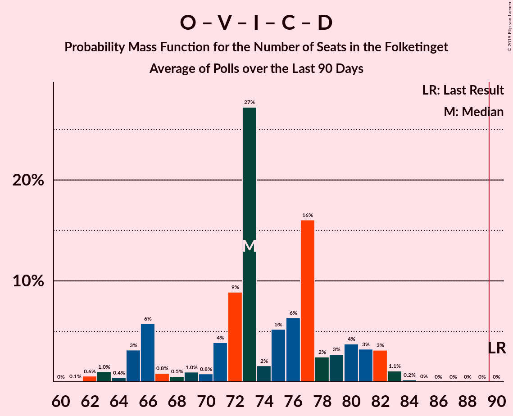

# Poll Average

<a href="#voting-intentions">Voting Intentions</a> | <a href="#seats">Seats</a> | <a href="#coalitions">Coalitions</a> | <a href="#technical-information">Technical Information</a>

## Summary

The table below lists the polls on which the average is based. They are the most recent polls (less than 90 days old) registered and analyzed so far.

| Period     | Polling firm/Commissioner(s) | A | O | V | Ø | I | Å | B | F | C | K | D |
|:----------:|:----------------------------:|:--:|:--:|:--:|:--:|:--:|:--:|:--:|:--:|:--:|:--:|:--:|
| 18 June 2015 | General Election | 26.3%   47 | 21.1%   37 | 19.5%   34 | 7.8%   14 | 7.5%   13 | 4.8%   9 | 4.6%   8 | 4.2%   7 | 3.4%   6 | 0.8%   0 | 0.0%   0 |
| N/A | Poll Average | 23–30%   40–54 | 14–20%   25–36 | 16–21%   28–36 | 7–11%   13–19 | 3–7%   4–13 | 3–5%   5–10 | 4–9%   8–15 | 4–8%   7–14 | 3–6%   5–11 | 0–2%   0 | 1–4%   0–8 |
| [4–9 February 2019](2019-02-09-Voxmeter.html) | Voxmeter   Ritzau | 26–31%   45–55 | 14–18%   25–32 | 16–20%   28–36 | 7–11%   13–18 | 5–8%   8–13 | 3–5%   5–9 | 5–8%   10–15 | 5–7%   8–13 | 3–5%   5–10 | 1–2%   0 | 1–3%   0–5 |
| [14–21 January 2019](2019-01-21-Epinion.html) | Epinion   DR | 26–30%   45–52 | 15–18%   27–32 | 16–19%   28–33 | 8–10%   13–18 | 4–6%   7–10 | 3–5%   6–9 | 5–7%   9–12 | 6–8%   9–14 | 3–5%   6–9 | 0–1%   0 | 2–4%   4–6 |
| [20 December 2018](2018-12-20-Megafon.html) | Megafon   Politiken and TV 2 | 23–28%   40–48 | 14–19%   25–32 | 15–19%   27–34 | 8–12%   15–21 | 4–6%   7–12 | 3–6%   6–10 | 6–9%   10–15 | 5–8%   9–15 | 3–6%   6–10 | 0–2%   0 | 2–4%   4–7 |
| [13 December 2018](2018-12-13-KantarGallup.html) | Kantar Gallup   Berlingske | 24–29%   43–51 | 17–20%   29–38 | 17–20%   29–36 | 7–10%   12–18 | 4–7%   7–12 | 3–4%   4–8 | 6–8%   9–15 | 5–7%   8–12 | 4–6%   7–11 | 0–1%   0 | 1–2%   0–4 |
| [6–11 December 2018](2018-12-11-Norstat.html) | Norstat   Altinget and Jyllands-Posten | 24–29%   42–51 | 16–20%   27–35 | 16–20%   28–36 | 7–11%   13–19 | 4–7%   7–12 | 3–6%   6–10 | 4–6%   7–11 | 5–8%   9–14 | 3–5%   5–9 | 0–1%   0 | 2–4%   4–7 |
| [29 November 2018](2018-11-29-GreensAnalyseinstitut.html) | Greens Analyseinstitut   Børsen | 22–27%   39–48 | 15–19%   26–35 | 17–22%   30–38 | 8–12%   15–20 | 2–4%   4–7 | 3–5%   6–9 | 6–9%   11–16 | 4–6%   6–11 | 4–6%   6–11 | 1–2%   0 | 3–5%   5–9 |
| 18 June 2015 | General Election | 26.3%   47 | 21.1%   37 | 19.5%   34 | 7.8%   14 | 7.5%   13 | 4.8%   9 | 4.6%   8 | 4.2%   7 | 3.4%   6 | 0.8%   0 | 0.0%   0 |

Only polls for which at least the sample size has been published are included in the table above.

**Legend:**
+ **Top half of each row:** Voting intentions (95% confidence interval)
+ **Bottom half of each row:** Seat projections for the Folketinget (95% confidence interval)
+ **A:** Socialdemokraterne
+ **O:** Dansk Folkeparti
+ **V:** Venstre
+ **Ø:** Enhedslisten–De Rød-Grønne
+ **I:** Liberal Alliance
+ **Å:** Alternativet
+ **B:** Radikale Venstre
+ **F:** Socialistisk Folkeparti
+ **C:** Det Konservative Folkeparti
+ **K:** Kristendemokraterne
+ **D:** Nye Borgerlige
+ **N/A (single party):** Party not included the published results
+ **N/A (entire row):** Calculation for this opinion poll not started yet

## Voting Intentions

### Confidence Intervals

| Party | Last Result | Median | 80% Confidence Interval | 90% Confidence Interval | 95% Confidence Interval | 99% Confidence Interval |
|:-----:|:-----------:|:------:|:-----------------------:|:-----------------------:|:-----------------------:|:-----------------------:|
| <a href="#socialdemokraterne">Socialdemokraterne</a> | 26.3% | 26.5% | 24.1–28.9% |23.5–29.5% | 23.0–30.0% | 22.1–31.1% |
| <a href="#dansk-folkeparti">Dansk Folkeparti</a> | 21.1% | 17.0% | 15.2–18.8% |14.8–19.3% | 14.4–19.7% | 13.6–20.4% |
| <a href="#venstre">Venstre</a> | 19.5% | 18.0% | 16.5–19.7% |16.0–20.2% | 15.6–20.7% | 14.8–21.6% |
| <a href="#enhedslisten–de-rød-grønne">Enhedslisten–De Rød-Grønne</a> | 7.8% | 9.0% | 7.9–10.4% |7.6–10.9% | 7.4–11.2% | 6.9–12.0% |
| <a href="#liberal-alliance">Liberal Alliance</a> | 7.5% | 5.0% | 3.3–6.2% |2.9–6.6% | 2.6–6.9% | 2.3–7.6% |
| <a href="#alternativet">Alternativet</a> | 4.8% | 4.0% | 3.1–4.9% |2.9–5.2% | 2.8–5.4% | 2.5–5.9% |
| <a href="#radikale-venstre">Radikale Venstre</a> | 4.6% | 6.7% | 5.0–8.1% |4.6–8.5% | 4.3–8.8% | 3.8–9.5% |
| <a href="#socialistisk-folkeparti">Socialistisk Folkeparti</a> | 4.2% | 6.0% | 4.8–7.2% |4.5–7.5% | 4.2–7.8% | 3.7–8.3% |
| <a href="#det-konservative-folkeparti">Det Konservative Folkeparti</a> | 3.4% | 4.3% | 3.5–5.3% |3.3–5.6% | 3.1–5.8% | 2.8–6.3% |
| <a href="#kristendemokraterne">Kristendemokraterne</a> | 0.8% | 0.8% | 0.4–1.4% |0.4–1.6% | 0.3–1.7% | 0.2–2.0% |
| <a href="#nye-borgerlige">Nye Borgerlige</a> | 0.0% | 2.8% | 1.4–3.9% |1.2–4.3% | 1.1–4.5% | 0.9–5.1% |

### Socialdemokraterne

*For a full overview of the results for this party, see the [Socialdemokraterne](party-socialdemokraterne.html) page.*

| Voting Intentions | Probability | Accumulated | Special Marks |
|:-----------------:|:-----------:|:-----------:|:-------------:|
| 19.5–20.5% | 0% | 100% |  |
| 20.5–21.5% | 0.2% | 100% |  |
| 21.5–22.5% | 1.1% | 99.8% |  |
| 22.5–23.5% | 4% | 98.7% |  |
| 23.5–24.5% | 10% | 95% |  |
| 24.5–25.5% | 15% | 85% |  |
| 25.5–26.5% | 20% | 70% | Last Result |
| 26.5–27.5% | 20% | 50% | Median |
| 27.5–28.5% | 16% | 30% |  |
| 28.5–29.5% | 9% | 14% |  |
| 29.5–30.5% | 3% | 5% |  |
| 30.5–31.5% | 0.9% | 1.1% |  |
| 31.5–32.5% | 0.2% | 0.2% |  |
| 32.5–33.5% | 0% | 0% |  |

### Dansk Folkeparti

*For a full overview of the results for this party, see the [Dansk Folkeparti](party-danskfolkeparti.html) page.*

| Voting Intentions | Probability | Accumulated | Special Marks |
|:-----------------:|:-----------:|:-----------:|:-------------:|
| 11.5–12.5% | 0% | 100% |  |
| 12.5–13.5% | 0.4% | 100% |  |
| 13.5–14.5% | 3% | 99.6% |  |
| 14.5–15.5% | 11% | 97% |  |
| 15.5–16.5% | 23% | 85% |  |
| 16.5–17.5% | 27% | 62% | Median |
| 17.5–18.5% | 21% | 35% |  |
| 18.5–19.5% | 10% | 13% |  |
| 19.5–20.5% | 3% | 3% |  |
| 20.5–21.5% | 0.3% | 0.4% | Last Result |
| 21.5–22.5% | 0% | 0% |  |

### Venstre

*For a full overview of the results for this party, see the [Venstre](party-venstre.html) page.*

| Voting Intentions | Probability | Accumulated | Special Marks |
|:-----------------:|:-----------:|:-----------:|:-------------:|
| 12.5–13.5% | 0% | 100% |  |
| 13.5–14.5% | 0.3% | 100% |  |
| 14.5–15.5% | 2% | 99.7% |  |
| 15.5–16.5% | 9% | 98% |  |
| 16.5–17.5% | 23% | 88% |  |
| 17.5–18.5% | 31% | 65% | Median |
| 18.5–19.5% | 22% | 35% |  |
| 19.5–20.5% | 9% | 13% | Last Result |
| 20.5–21.5% | 3% | 3% |  |
| 21.5–22.5% | 0.5% | 0.6% |  |
| 22.5–23.5% | 0.1% | 0.1% |  |
| 23.5–24.5% | 0% | 0% |  |

### Enhedslisten–De Rød-Grønne

*For a full overview of the results for this party, see the [Enhedslisten–De Rød-Grønne](party-enhedslisten–derød-grønne.html) page.*

| Voting Intentions | Probability | Accumulated | Special Marks |
|:-----------------:|:-----------:|:-----------:|:-------------:|
| 4.5–5.5% | 0% | 100% |  |
| 5.5–6.5% | 0.1% | 100% |  |
| 6.5–7.5% | 4% | 99.9% |  |
| 7.5–8.5% | 26% | 96% | Last Result |
| 8.5–9.5% | 39% | 70% | Median |
| 9.5–10.5% | 22% | 30% |  |
| 10.5–11.5% | 7% | 8% |  |
| 11.5–12.5% | 1.2% | 1.3% |  |
| 12.5–13.5% | 0.1% | 0.1% |  |
| 13.5–14.5% | 0% | 0% |  |

### Liberal Alliance

*For a full overview of the results for this party, see the [Liberal Alliance](party-liberalalliance.html) page.*

| Voting Intentions | Probability | Accumulated | Special Marks |
|:-----------------:|:-----------:|:-----------:|:-------------:|
| 0.5–1.5% | 0% | 100% |  |
| 1.5–2.5% | 2% | 100% |  |
| 2.5–3.5% | 11% | 98% |  |
| 3.5–4.5% | 19% | 87% |  |
| 4.5–5.5% | 39% | 68% | Median |
| 5.5–6.5% | 24% | 29% |  |
| 6.5–7.5% | 5% | 6% |  |
| 7.5–8.5% | 0.5% | 0.5% | Last Result |
| 8.5–9.5% | 0% | 0% |  |

### Alternativet

*For a full overview of the results for this party, see the [Alternativet](party-alternativet.html) page.*

| Voting Intentions | Probability | Accumulated | Special Marks |
|:-----------------:|:-----------:|:-----------:|:-------------:|
| 0.5–1.5% | 0% | 100% |  |
| 1.5–2.5% | 0.7% | 100% |  |
| 2.5–3.5% | 26% | 99.3% |  |
| 3.5–4.5% | 53% | 73% | Median |
| 4.5–5.5% | 19% | 20% | Last Result |
| 5.5–6.5% | 2% | 2% |  |
| 6.5–7.5% | 0% | 0% |  |

### Radikale Venstre

*For a full overview of the results for this party, see the [Radikale Venstre](party-radikalevenstre.html) page.*

| Voting Intentions | Probability | Accumulated | Special Marks |
|:-----------------:|:-----------:|:-----------:|:-------------:|
| 1.5–2.5% | 0% | 100% |  |
| 2.5–3.5% | 0.1% | 100% |  |
| 3.5–4.5% | 5% | 99.9% |  |
| 4.5–5.5% | 12% | 95% | Last Result |
| 5.5–6.5% | 27% | 83% |  |
| 6.5–7.5% | 33% | 56% | Median |
| 7.5–8.5% | 18% | 22% |  |
| 8.5–9.5% | 4% | 5% |  |
| 9.5–10.5% | 0.4% | 0.4% |  |
| 10.5–11.5% | 0% | 0% |  |

### Socialistisk Folkeparti

*For a full overview of the results for this party, see the [Socialistisk Folkeparti](party-socialistiskfolkeparti.html) page.*

| Voting Intentions | Probability | Accumulated | Special Marks |
|:-----------------:|:-----------:|:-----------:|:-------------:|
| 1.5–2.5% | 0% | 100% |  |
| 2.5–3.5% | 0.2% | 100% |  |
| 3.5–4.5% | 6% | 99.8% | Last Result |
| 4.5–5.5% | 25% | 94% |  |
| 5.5–6.5% | 41% | 69% | Median |
| 6.5–7.5% | 24% | 29% |  |
| 7.5–8.5% | 4% | 4% |  |
| 8.5–9.5% | 0.2% | 0.2% |  |
| 9.5–10.5% | 0% | 0% |  |

### Det Konservative Folkeparti

*For a full overview of the results for this party, see the [Det Konservative Folkeparti](party-detkonservativefolkeparti.html) page.*

| Voting Intentions | Probability | Accumulated | Special Marks |
|:-----------------:|:-----------:|:-----------:|:-------------:|
| 0.5–1.5% | 0% | 100% |  |
| 1.5–2.5% | 0.1% | 100% |  |
| 2.5–3.5% | 12% | 99.9% | Last Result |
| 3.5–4.5% | 49% | 88% | Median |
| 4.5–5.5% | 33% | 38% |  |
| 5.5–6.5% | 6% | 6% |  |
| 6.5–7.5% | 0.2% | 0.2% |  |
| 7.5–8.5% | 0% | 0% |  |

### Kristendemokraterne

*For a full overview of the results for this party, see the [Kristendemokraterne](party-kristendemokraterne.html) page.*

| Voting Intentions | Probability | Accumulated | Special Marks |
|:-----------------:|:-----------:|:-----------:|:-------------:|
| 0.0–0.5% | 19% | 100% |  |
| 0.5–1.5% | 76% | 81% | Last Result, Median |
| 1.5–2.5% | 5% | 5% |  |
| 2.5–3.5% | 0% | 0% |  |

### Nye Borgerlige

*For a full overview of the results for this party, see the [Nye Borgerlige](party-nyeborgerlige.html) page.*

| Voting Intentions | Probability | Accumulated | Special Marks |
|:-----------------:|:-----------:|:-----------:|:-------------:|
| 0.0–0.5% | 0% | 100% | Last Result |
| 0.5–1.5% | 14% | 100% |  |
| 1.5–2.5% | 28% | 86% |  |
| 2.5–3.5% | 40% | 59% | Median |
| 3.5–4.5% | 16% | 18% |  |
| 4.5–5.5% | 2% | 2% |  |
| 5.5–6.5% | 0.1% | 0.1% |  |
| 6.5–7.5% | 0% | 0% |  |

## Seats

### Confidence Intervals

| Party | Last Result | Median | 80% Confidence Interval | 90% Confidence Interval | 95% Confidence Interval | 99% Confidence Interval |
|:-----:|:-----------:|:------:|:-----------------------:|:-----------------------:|:-----------------------:|:-----------------------:|
| <a href="#socialdemokraterne">Socialdemokraterne</a> | 47 | 47 | 42–51 |41–53 | 40–54 | 39–55 |
| <a href="#dansk-folkeparti">Dansk Folkeparti</a> | 37 | 29 | 27–34 |26–35 | 25–36 | 24–38 |
| <a href="#venstre">Venstre</a> | 34 | 32 | 29–35 |28–36 | 28–36 | 27–38 |
| <a href="#enhedslisten–de-rød-grønne">Enhedslisten–De Rød-Grønne</a> | 14 | 16 | 14–19 |13–19 | 13–19 | 12–21 |
| <a href="#liberal-alliance">Liberal Alliance</a> | 13 | 9 | 5–12 |5–13 | 4–13 | 4–13 |
| <a href="#alternativet">Alternativet</a> | 9 | 7 | 6–9 |5–9 | 5–10 | 4–10 |
| <a href="#radikale-venstre">Radikale Venstre</a> | 8 | 12 | 8–14 |8–15 | 8–15 | 7–16 |
| <a href="#socialistisk-folkeparti">Socialistisk Folkeparti</a> | 7 | 11 | 8–13 |8–13 | 7–14 | 6–15 |
| <a href="#det-konservative-folkeparti">Det Konservative Folkeparti</a> | 6 | 8 | 6–9 |6–10 | 5–11 | 5–11 |
| <a href="#kristendemokraterne">Kristendemokraterne</a> | 0 | 0 | 0 |0 | 0 | 0 |
| <a href="#nye-borgerlige">Nye Borgerlige</a> | 0 | 5 | 0–6 |0–8 | 0–8 | 0–8 |

### Socialdemokraterne

*For a full overview of the results for this party, see the [Socialdemokraterne](party-socialdemokraterne.html) page.*

| Number of Seats | Probability | Accumulated | Special Marks |
|:---------------:|:-----------:|:-----------:|:-------------:|
| 37 | 0.1% | 100% |  |
| 38 | 0.2% | 99.9% |  |
| 39 | 0.6% | 99.7% |  |
| 40 | 3% | 99.1% |  |
| 41 | 2% | 96% |  |
| 42 | 5% | 95% |  |
| 43 | 5% | 90% |  |
| 44 | 8% | 85% |  |
| 45 | 9% | 78% |  |
| 46 | 15% | 69% |  |
| 47 | 6% | 54% | Last Result, Median |
| 48 | 11% | 48% |  |
| 49 | 17% | 37% |  |
| 50 | 4% | 21% |  |
| 51 | 8% | 17% |  |
| 52 | 2% | 9% |  |
| 53 | 3% | 7% |  |
| 54 | 3% | 4% |  |
| 55 | 0.3% | 0.6% |  |
| 56 | 0.2% | 0.3% |  |
| 57 | 0.1% | 0.1% |  |
| 58 | 0% | 0% |  |

### Dansk Folkeparti

*For a full overview of the results for this party, see the [Dansk Folkeparti](party-danskfolkeparti.html) page.*

| Number of Seats | Probability | Accumulated | Special Marks |
|:---------------:|:-----------:|:-----------:|:-------------:|
| 23 | 0.1% | 100% |  |
| 24 | 0.5% | 99.9% |  |
| 25 | 2% | 99.4% |  |
| 26 | 4% | 97% |  |
| 27 | 10% | 93% |  |
| 28 | 12% | 83% |  |
| 29 | 23% | 72% | Median |
| 30 | 14% | 49% |  |
| 31 | 6% | 35% |  |
| 32 | 11% | 29% |  |
| 33 | 6% | 17% |  |
| 34 | 5% | 11% |  |
| 35 | 3% | 6% |  |
| 36 | 2% | 3% |  |
| 37 | 0.7% | 1.2% | Last Result |
| 38 | 0.4% | 0.5% |  |
| 39 | 0.1% | 0.1% |  |
| 40 | 0% | 0% |  |

### Venstre

*For a full overview of the results for this party, see the [Venstre](party-venstre.html) page.*

| Number of Seats | Probability | Accumulated | Special Marks |
|:---------------:|:-----------:|:-----------:|:-------------:|
| 25 | 0.1% | 100% |  |
| 26 | 0.3% | 99.9% |  |
| 27 | 0.8% | 99.6% |  |
| 28 | 8% | 98.8% |  |
| 29 | 13% | 91% |  |
| 30 | 11% | 77% |  |
| 31 | 14% | 66% |  |
| 32 | 15% | 52% | Median |
| 33 | 12% | 37% |  |
| 34 | 11% | 25% | Last Result |
| 35 | 6% | 14% |  |
| 36 | 5% | 8% |  |
| 37 | 2% | 2% |  |
| 38 | 0.6% | 0.8% |  |
| 39 | 0.2% | 0.2% |  |
| 40 | 0% | 0% |  |

### Enhedslisten–De Rød-Grønne

*For a full overview of the results for this party, see the [Enhedslisten–De Rød-Grønne](party-enhedslisten–derød-grønne.html) page.*

| Number of Seats | Probability | Accumulated | Special Marks |
|:---------------:|:-----------:|:-----------:|:-------------:|
| 11 | 0.1% | 100% |  |
| 12 | 0.8% | 99.8% |  |
| 13 | 6% | 99.1% |  |
| 14 | 8% | 93% | Last Result |
| 15 | 20% | 86% |  |
| 16 | 22% | 66% | Median |
| 17 | 18% | 43% |  |
| 18 | 10% | 25% |  |
| 19 | 12% | 15% |  |
| 20 | 1.4% | 2% |  |
| 21 | 0.4% | 0.8% |  |
| 22 | 0.3% | 0.4% |  |
| 23 | 0% | 0% |  |

### Liberal Alliance

*For a full overview of the results for this party, see the [Liberal Alliance](party-liberalalliance.html) page.*

| Number of Seats | Probability | Accumulated | Special Marks |
|:---------------:|:-----------:|:-----------:|:-------------:|
| 0 | 0.1% | 100% |  |
| 1 | 0% | 99.9% |  |
| 2 | 0% | 99.9% |  |
| 3 | 0% | 99.9% |  |
| 4 | 4% | 99.9% |  |
| 5 | 6% | 96% |  |
| 6 | 4% | 90% |  |
| 7 | 19% | 85% |  |
| 8 | 13% | 67% |  |
| 9 | 19% | 54% | Median |
| 10 | 16% | 35% |  |
| 11 | 9% | 19% |  |
| 12 | 5% | 10% |  |
| 13 | 5% | 5% | Last Result |
| 14 | 0.1% | 0.2% |  |
| 15 | 0.1% | 0.1% |  |
| 16 | 0% | 0% |  |

### Alternativet

*For a full overview of the results for this party, see the [Alternativet](party-alternativet.html) page.*

| Number of Seats | Probability | Accumulated | Special Marks |
|:---------------:|:-----------:|:-----------:|:-------------:|
| 4 | 0.8% | 100% |  |
| 5 | 8% | 99.2% |  |
| 6 | 27% | 92% |  |
| 7 | 25% | 65% | Median |
| 8 | 27% | 40% |  |
| 9 | 9% | 13% | Last Result |
| 10 | 4% | 4% |  |
| 11 | 0.4% | 0.4% |  |
| 12 | 0% | 0% |  |

### Radikale Venstre

*For a full overview of the results for this party, see the [Radikale Venstre](party-radikalevenstre.html) page.*

| Number of Seats | Probability | Accumulated | Special Marks |
|:---------------:|:-----------:|:-----------:|:-------------:|
| 6 | 0.4% | 100% |  |
| 7 | 1.2% | 99.6% |  |
| 8 | 9% | 98% | Last Result |
| 9 | 5% | 90% |  |
| 10 | 8% | 84% |  |
| 11 | 17% | 76% |  |
| 12 | 18% | 60% | Median |
| 13 | 16% | 42% |  |
| 14 | 18% | 26% |  |
| 15 | 7% | 8% |  |
| 16 | 0.9% | 1.3% |  |
| 17 | 0.3% | 0.4% |  |
| 18 | 0.1% | 0.1% |  |
| 19 | 0% | 0% |  |

### Socialistisk Folkeparti

*For a full overview of the results for this party, see the [Socialistisk Folkeparti](party-socialistiskfolkeparti.html) page.*

| Number of Seats | Probability | Accumulated | Special Marks |
|:---------------:|:-----------:|:-----------:|:-------------:|
| 6 | 0.7% | 100% |  |
| 7 | 2% | 99.3% | Last Result |
| 8 | 10% | 97% |  |
| 9 | 13% | 87% |  |
| 10 | 23% | 74% |  |
| 11 | 23% | 51% | Median |
| 12 | 16% | 28% |  |
| 13 | 8% | 12% |  |
| 14 | 3% | 4% |  |
| 15 | 0.9% | 0.9% |  |
| 16 | 0% | 0% |  |

### Det Konservative Folkeparti

*For a full overview of the results for this party, see the [Det Konservative Folkeparti](party-detkonservativefolkeparti.html) page.*

| Number of Seats | Probability | Accumulated | Special Marks |
|:---------------:|:-----------:|:-----------:|:-------------:|
| 5 | 3% | 100% |  |
| 6 | 18% | 97% | Last Result |
| 7 | 21% | 79% |  |
| 8 | 24% | 58% | Median |
| 9 | 26% | 34% |  |
| 10 | 6% | 8% |  |
| 11 | 3% | 3% |  |
| 12 | 0.3% | 0.3% |  |
| 13 | 0% | 0% |  |

### Kristendemokraterne

*For a full overview of the results for this party, see the [Kristendemokraterne](party-kristendemokraterne.html) page.*

| Number of Seats | Probability | Accumulated | Special Marks |
|:---------------:|:-----------:|:-----------:|:-------------:|
| 0 | 99.7% | 100% | Last Result, Median |
| 1 | 0% | 0.3% |  |
| 2 | 0% | 0.3% |  |
| 3 | 0% | 0.3% |  |
| 4 | 0.3% | 0.3% |  |
| 5 | 0% | 0% |  |

### Nye Borgerlige

*For a full overview of the results for this party, see the [Nye Borgerlige](party-nyeborgerlige.html) page.*

| Number of Seats | Probability | Accumulated | Special Marks |
|:---------------:|:-----------:|:-----------:|:-------------:|
| 0 | 28% | 100% | Last Result |
| 1 | 0% | 72% |  |
| 2 | 0% | 72% |  |
| 3 | 0% | 72% |  |
| 4 | 13% | 72% |  |
| 5 | 24% | 59% | Median |
| 6 | 25% | 35% |  |
| 7 | 4% | 9% |  |
| 8 | 5% | 5% |  |
| 9 | 0.4% | 0.5% |  |
| 10 | 0% | 0.1% |  |
| 11 | 0% | 0% |  |

## Coalitions

### Confidence Intervals

| Coalition | Last Result | Median | Majority? | 80% Confidence Interval | 90% Confidence Interval | 95% Confidence Interval | 99% Confidence Interval |
|:---------:|:-----------:|:------:|:---------:|:-----------------------:|:-----------------------:|:-----------------------:|:-----------------------:|
| Socialdemokraterne – Enhedslisten–De Rød-Grønne – Alternativet – Radikale Venstre – Socialistisk Folkeparti | 85 | 93 | 83% | 89–97 | 87–98 | 86–98 | 84–100 |
| Socialdemokraterne – Enhedslisten–De Rød-Grønne – Radikale Venstre – Socialistisk Folkeparti | 76 | 86 | 16% | 81–90 | 79–91 | 79–92 | 76–93 |
| Dansk Folkeparti – Venstre – Liberal Alliance – Det Konservative Folkeparti – Kristendemokraterne – Nye Borgerlige | 90 | 82 | 2% | 78–86 | 77–88 | 77–89 | 75–91 |
| Dansk Folkeparti – Venstre – Liberal Alliance – Det Konservative Folkeparti – Nye Borgerlige | 90 | 82 | 2% | 78–86 | 77–88 | 77–89 | 75–91 |
| Socialdemokraterne – Enhedslisten–De Rød-Grønne – Alternativet – Socialistisk Folkeparti | 77 | 84 | 0.5% | 80–86 | 80–86 | 79–88 | 76–89 |
| Dansk Folkeparti – Venstre – Liberal Alliance – Det Konservative Folkeparti – Kristendemokraterne | 90 | 78 | 0.7% | 73–84 | 72–85 | 72–87 | 71–90 |
| Dansk Folkeparti – Venstre – Liberal Alliance – Det Konservative Folkeparti | 90 | 78 | 0.7% | 73–84 | 72–85 | 72–87 | 71–90 |
| Socialdemokraterne – Enhedslisten–De Rød-Grønne – Socialistisk Folkeparti | 68 | 77 | 0% | 72–80 | 72–80 | 72–80 | 69–83 |
| Socialdemokraterne – Radikale Venstre – Socialistisk Folkeparti | 62 | 70 | 0% | 64–75 | 63–75 | 62–76 | 60–78 |
| Socialdemokraterne – Radikale Venstre | 55 | 59 | 0% | 54–63 | 54–65 | 53–66 | 51–67 |
| Venstre – Liberal Alliance – Det Konservative Folkeparti | 53 | 48 | 0% | 44–51 | 43–53 | 43–54 | 42–57 |
| Venstre – Det Konservative Folkeparti | 40 | 39 | 0% | 36–43 | 36–45 | 35–45 | 34–47 |
| Venstre | 34 | 32 | 0% | 29–35 | 28–36 | 28–36 | 27–38 |

### Socialdemokraterne – Enhedslisten–De Rød-Grønne – Alternativet – Radikale Venstre – Socialistisk Folkeparti

| Number of Seats | Probability | Accumulated | Special Marks |
|:---------------:|:-----------:|:-----------:|:-------------:|
| 82 | 0.2% | 100% |  |
| 83 | 0.1% | 99.8% |  |
| 84 | 0.9% | 99.7% |  |
| 85 | 1.1% | 98.8% | Last Result |
| 86 | 1.5% | 98% |  |
| 87 | 2% | 96% |  |
| 88 | 4% | 95% |  |
| 89 | 7% | 90% |  |
| 90 | 8% | 83% | Majority |
| 91 | 12% | 75% |  |
| 92 | 6% | 63% |  |
| 93 | 10% | 57% | Median |
| 94 | 10% | 47% |  |
| 95 | 7% | 37% |  |
| 96 | 17% | 29% |  |
| 97 | 3% | 12% |  |
| 98 | 7% | 9% |  |
| 99 | 0.6% | 2% |  |
| 100 | 0.7% | 1.2% |  |
| 101 | 0.3% | 0.4% |  |
| 102 | 0% | 0.2% |  |
| 103 | 0.1% | 0.1% |  |
| 104 | 0% | 0% |  |

### Socialdemokraterne – Enhedslisten–De Rød-Grønne – Radikale Venstre – Socialistisk Folkeparti

| Number of Seats | Probability | Accumulated | Special Marks |
|:---------------:|:-----------:|:-----------:|:-------------:|
| 74 | 0% | 100% |  |
| 75 | 0% | 99.9% |  |
| 76 | 0.7% | 99.9% | Last Result |
| 77 | 0.6% | 99.2% |  |
| 78 | 0.8% | 98.6% |  |
| 79 | 3% | 98% |  |
| 80 | 2% | 94% |  |
| 81 | 4% | 92% |  |
| 82 | 7% | 88% |  |
| 83 | 8% | 81% |  |
| 84 | 7% | 73% |  |
| 85 | 9% | 67% |  |
| 86 | 11% | 58% | Median |
| 87 | 13% | 46% |  |
| 88 | 9% | 33% |  |
| 89 | 8% | 24% |  |
| 90 | 11% | 16% | Majority |
| 91 | 3% | 5% |  |
| 92 | 2% | 3% |  |
| 93 | 0.6% | 1.0% |  |
| 94 | 0.2% | 0.4% |  |
| 95 | 0.2% | 0.2% |  |
| 96 | 0% | 0% |  |

### Dansk Folkeparti – Venstre – Liberal Alliance – Det Konservative Folkeparti – Kristendemokraterne – Nye Borgerlige

| Number of Seats | Probability | Accumulated | Special Marks |
|:---------------:|:-----------:|:-----------:|:-------------:|
| 72 | 0.1% | 100% |  |
| 73 | 0% | 99.9% |  |
| 74 | 0.3% | 99.8% |  |
| 75 | 0.7% | 99.6% |  |
| 76 | 0.6% | 98.8% |  |
| 77 | 7% | 98% |  |
| 78 | 3% | 91% |  |
| 79 | 17% | 88% |  |
| 80 | 7% | 71% |  |
| 81 | 10% | 63% |  |
| 82 | 10% | 53% |  |
| 83 | 6% | 43% | Median |
| 84 | 12% | 37% |  |
| 85 | 8% | 25% |  |
| 86 | 7% | 17% |  |
| 87 | 4% | 10% |  |
| 88 | 2% | 5% |  |
| 89 | 1.5% | 4% |  |
| 90 | 1.1% | 2% | Last Result, Majority |
| 91 | 0.9% | 1.2% |  |
| 92 | 0.1% | 0.3% |  |
| 93 | 0.2% | 0.2% |  |
| 94 | 0% | 0% |  |

### Dansk Folkeparti – Venstre – Liberal Alliance – Det Konservative Folkeparti – Nye Borgerlige

| Number of Seats | Probability | Accumulated | Special Marks |
|:---------------:|:-----------:|:-----------:|:-------------:|
| 72 | 0.1% | 100% |  |
| 73 | 0% | 99.9% |  |
| 74 | 0.3% | 99.8% |  |
| 75 | 0.7% | 99.5% |  |
| 76 | 0.6% | 98.8% |  |
| 77 | 7% | 98% |  |
| 78 | 3% | 91% |  |
| 79 | 17% | 88% |  |
| 80 | 7% | 71% |  |
| 81 | 10% | 63% |  |
| 82 | 10% | 53% |  |
| 83 | 6% | 43% | Median |
| 84 | 12% | 37% |  |
| 85 | 8% | 25% |  |
| 86 | 7% | 17% |  |
| 87 | 4% | 10% |  |
| 88 | 2% | 5% |  |
| 89 | 1.5% | 4% |  |
| 90 | 1.1% | 2% | Last Result, Majority |
| 91 | 0.9% | 1.2% |  |
| 92 | 0.1% | 0.3% |  |
| 93 | 0.2% | 0.2% |  |
| 94 | 0% | 0% |  |

### Socialdemokraterne – Enhedslisten–De Rød-Grønne – Alternativet – Socialistisk Folkeparti

| Number of Seats | Probability | Accumulated | Special Marks |
|:---------------:|:-----------:|:-----------:|:-------------:|
| 75 | 0.2% | 100% |  |
| 76 | 0.5% | 99.7% |  |
| 77 | 0.2% | 99.2% | Last Result |
| 78 | 0.9% | 99.0% |  |
| 79 | 2% | 98% |  |
| 80 | 9% | 96% |  |
| 81 | 7% | 87% | Median |
| 82 | 17% | 80% |  |
| 83 | 12% | 63% |  |
| 84 | 11% | 51% |  |
| 85 | 5% | 40% |  |
| 86 | 31% | 35% |  |
| 87 | 2% | 4% |  |
| 88 | 1.5% | 3% |  |
| 89 | 0.6% | 1.1% |  |
| 90 | 0.2% | 0.5% | Majority |
| 91 | 0.2% | 0.3% |  |
| 92 | 0% | 0.1% |  |
| 93 | 0% | 0% |  |

### Dansk Folkeparti – Venstre – Liberal Alliance – Det Konservative Folkeparti – Kristendemokraterne

| Number of Seats | Probability | Accumulated | Special Marks |
|:---------------:|:-----------:|:-----------:|:-------------:|
| 68 | 0% | 100% |  |
| 69 | 0.1% | 99.9% |  |
| 70 | 0.3% | 99.8% |  |
| 71 | 0.4% | 99.5% |  |
| 72 | 6% | 99.1% |  |
| 73 | 9% | 93% |  |
| 74 | 5% | 84% |  |
| 75 | 6% | 79% |  |
| 76 | 6% | 72% |  |
| 77 | 9% | 67% |  |
| 78 | 10% | 57% | Median |
| 79 | 14% | 47% |  |
| 80 | 9% | 33% |  |
| 81 | 6% | 24% |  |
| 82 | 5% | 18% |  |
| 83 | 2% | 12% |  |
| 84 | 4% | 10% |  |
| 85 | 2% | 6% |  |
| 86 | 0.9% | 4% |  |
| 87 | 2% | 3% |  |
| 88 | 0.4% | 2% |  |
| 89 | 0.6% | 1.3% |  |
| 90 | 0.3% | 0.7% | Last Result, Majority |
| 91 | 0.3% | 0.3% |  |
| 92 | 0% | 0% |  |

### Dansk Folkeparti – Venstre – Liberal Alliance – Det Konservative Folkeparti

| Number of Seats | Probability | Accumulated | Special Marks |
|:---------------:|:-----------:|:-----------:|:-------------:|
| 68 | 0% | 100% |  |
| 69 | 0.2% | 99.9% |  |
| 70 | 0.3% | 99.8% |  |
| 71 | 0.4% | 99.5% |  |
| 72 | 6% | 99.1% |  |
| 73 | 9% | 93% |  |
| 74 | 5% | 84% |  |
| 75 | 6% | 79% |  |
| 76 | 6% | 72% |  |
| 77 | 9% | 66% |  |
| 78 | 10% | 57% | Median |
| 79 | 14% | 47% |  |
| 80 | 9% | 33% |  |
| 81 | 6% | 24% |  |
| 82 | 5% | 18% |  |
| 83 | 2% | 12% |  |
| 84 | 4% | 10% |  |
| 85 | 2% | 6% |  |
| 86 | 0.9% | 4% |  |
| 87 | 2% | 3% |  |
| 88 | 0.4% | 2% |  |
| 89 | 0.6% | 1.3% |  |
| 90 | 0.3% | 0.7% | Last Result, Majority |
| 91 | 0.3% | 0.3% |  |
| 92 | 0% | 0% |  |

### Socialdemokraterne – Enhedslisten–De Rød-Grønne – Socialistisk Folkeparti

| Number of Seats | Probability | Accumulated | Special Marks |
|:---------------:|:-----------:|:-----------:|:-------------:|
| 67 | 0.2% | 100% |  |
| 68 | 0% | 99.8% | Last Result |
| 69 | 0.3% | 99.8% |  |
| 70 | 0.3% | 99.5% |  |
| 71 | 1.2% | 99.2% |  |
| 72 | 9% | 98% |  |
| 73 | 0.8% | 89% |  |
| 74 | 5% | 88% | Median |
| 75 | 6% | 84% |  |
| 76 | 25% | 78% |  |
| 77 | 20% | 52% |  |
| 78 | 7% | 32% |  |
| 79 | 10% | 25% |  |
| 80 | 13% | 15% |  |
| 81 | 0.8% | 2% |  |
| 82 | 0.2% | 0.9% |  |
| 83 | 0.4% | 0.7% |  |
| 84 | 0.3% | 0.3% |  |
| 85 | 0% | 0% |  |

### Socialdemokraterne – Radikale Venstre – Socialistisk Folkeparti

| Number of Seats | Probability | Accumulated | Special Marks |
|:---------------:|:-----------:|:-----------:|:-------------:|
| 58 | 0.1% | 100% |  |
| 59 | 0.3% | 99.9% |  |
| 60 | 0.4% | 99.7% |  |
| 61 | 0.5% | 99.2% |  |
| 62 | 2% | 98.7% | Last Result |
| 63 | 2% | 97% |  |
| 64 | 5% | 94% |  |
| 65 | 5% | 89% |  |
| 66 | 10% | 84% |  |
| 67 | 6% | 74% |  |
| 68 | 6% | 68% |  |
| 69 | 11% | 62% |  |
| 70 | 8% | 51% | Median |
| 71 | 8% | 43% |  |
| 72 | 15% | 35% |  |
| 73 | 6% | 20% |  |
| 74 | 4% | 15% |  |
| 75 | 6% | 10% |  |
| 76 | 2% | 4% |  |
| 77 | 1.2% | 2% |  |
| 78 | 0.6% | 0.7% |  |
| 79 | 0% | 0.2% |  |
| 80 | 0% | 0.2% |  |
| 81 | 0.1% | 0.1% |  |
| 82 | 0% | 0% |  |

### Socialdemokraterne – Radikale Venstre

| Number of Seats | Probability | Accumulated | Special Marks |
|:---------------:|:-----------:|:-----------:|:-------------:|
| 49 | 0.1% | 100% |  |
| 50 | 0.3% | 99.9% |  |
| 51 | 0.5% | 99.6% |  |
| 52 | 1.0% | 99.1% |  |
| 53 | 2% | 98% |  |
| 54 | 9% | 96% |  |
| 55 | 8% | 86% | Last Result |
| 56 | 6% | 78% |  |
| 57 | 5% | 72% |  |
| 58 | 12% | 67% |  |
| 59 | 8% | 56% | Median |
| 60 | 10% | 47% |  |
| 61 | 15% | 37% |  |
| 62 | 6% | 22% |  |
| 63 | 6% | 16% |  |
| 64 | 5% | 10% |  |
| 65 | 1.5% | 5% |  |
| 66 | 3% | 4% |  |
| 67 | 0.6% | 1.1% |  |
| 68 | 0.3% | 0.4% |  |
| 69 | 0.1% | 0.1% |  |
| 70 | 0% | 0.1% |  |
| 71 | 0% | 0% |  |

### Venstre – Liberal Alliance – Det Konservative Folkeparti

| Number of Seats | Probability | Accumulated | Special Marks |
|:---------------:|:-----------:|:-----------:|:-------------:|
| 40 | 0.1% | 100% |  |
| 41 | 0.1% | 99.9% |  |
| 42 | 0.5% | 99.8% |  |
| 43 | 5% | 99.2% |  |
| 44 | 8% | 94% |  |
| 45 | 5% | 86% |  |
| 46 | 10% | 82% |  |
| 47 | 13% | 72% |  |
| 48 | 14% | 59% |  |
| 49 | 12% | 46% | Median |
| 50 | 15% | 34% |  |
| 51 | 9% | 19% |  |
| 52 | 3% | 10% |  |
| 53 | 2% | 7% | Last Result |
| 54 | 3% | 4% |  |
| 55 | 0.6% | 1.5% |  |
| 56 | 0.3% | 0.9% |  |
| 57 | 0.4% | 0.6% |  |
| 58 | 0.2% | 0.2% |  |
| 59 | 0% | 0% |  |

### Venstre – Det Konservative Folkeparti

| Number of Seats | Probability | Accumulated | Special Marks |
|:---------------:|:-----------:|:-----------:|:-------------:|
| 32 | 0.1% | 100% |  |
| 33 | 0.3% | 99.9% |  |
| 34 | 1.0% | 99.7% |  |
| 35 | 1.5% | 98.7% |  |
| 36 | 10% | 97% |  |
| 37 | 16% | 87% |  |
| 38 | 9% | 71% |  |
| 39 | 12% | 62% |  |
| 40 | 18% | 50% | Last Result, Median |
| 41 | 10% | 32% |  |
| 42 | 7% | 22% |  |
| 43 | 6% | 15% |  |
| 44 | 3% | 9% |  |
| 45 | 5% | 6% |  |
| 46 | 0.8% | 2% |  |
| 47 | 0.5% | 0.8% |  |
| 48 | 0.2% | 0.2% |  |
| 49 | 0% | 0% |  |

### Venstre

| Number of Seats | Probability | Accumulated | Special Marks |
|:---------------:|:-----------:|:-----------:|:-------------:|
| 25 | 0.1% | 100% |  |
| 26 | 0.3% | 99.9% |  |
| 27 | 0.8% | 99.6% |  |
| 28 | 8% | 98.8% |  |
| 29 | 13% | 91% |  |
| 30 | 11% | 77% |  |
| 31 | 14% | 66% |  |
| 32 | 15% | 52% | Median |
| 33 | 12% | 37% |  |
| 34 | 11% | 25% | Last Result |
| 35 | 6% | 14% |  |
| 36 | 5% | 8% |  |
| 37 | 2% | 2% |  |
| 38 | 0.6% | 0.8% |  |
| 39 | 0.2% | 0.2% |  |
| 40 | 0% | 0% |  |

## Technical Information

+ **Number of polls included in this average:** 6
+ **Lowest number of simulations done in a poll included in this average:** 1,048,575
+ **Total number of simulations done in the polls included in this average:** 6,291,452
+ **Error estimate:** 2.97%
