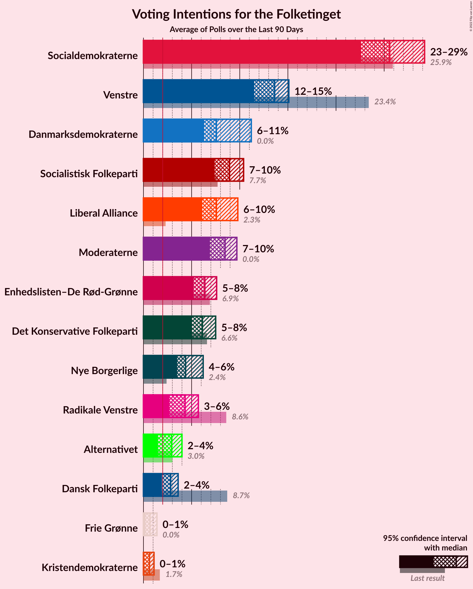

# Overview

The table below lists the most recent polls (less than 90 days old) registered and analyzed so far.

| Period     | Polling firm/Commissioner(s) | A | V | O | B | F | Ø | C | Å | D | I | P | K | E | G | Q | Æ | M |
|:----------:|:----------------------------:|:--:|:--:|:--:|:--:|:--:|:--:|:--:|:--:|:--:|:--:|:--:|:--:|:--:|:--:|:--:|:--:|:--:|
| 5 June 2019 | General Election | 25.9%   48 | 23.4%   43 | 8.7%   16 | 8.6%   16 | 7.7%   14 | 6.9%   13 | 6.6%   12 | 3.0%   5 | 2.4%   4 | 2.3%   4 | 1.8%   0 | 1.7%   0 | 0.8%   0 | 0.0%   0 | 0.0%   0 | 0.0%   0 | 0.0%   0 |
| N/A | [Poll Average](average.html) | 21–28%   37–49 | 9–16%   15–28 | 1–4%   0–7 | 4–8%   8–15 | 6–10%   11–19 | 5–9%   9–18 | 10–17%   19–30 | 0–2%   0 | 2–7%   5–12 | 3–5%   5–9 | N/A   N/A | 0–2%   0–4 | N/A   N/A | 0–1%   0–4 | 0–1%   0 | 8–13%   16–23 | 2–5%   0–9 |
| [15–18 August 2022](2022-08-18-Megafon.html) | Megafon   Politiken and TV 2 | 20–25%   34–47 | 12–17%   21–29 | 2–4%   0–8 | 5–8%   10–15 | 7–11%   13–20 | 6–10%   10–17 | 13–18%   23–33 | 1–2%   0 | 2–4%   4–7 | 3–5%   5–9 | N/A   N/A | 0–1%   0 | N/A   N/A | 0–1%   0 | 0–2%   0 | 8–12%   14–22 | 1–3%   0–6 |
| [8–14 August 2022](2022-08-14-Voxmeter.html) | Voxmeter | 21–27%   38–44 | 11–16%   22–27 | 2–4%   0–5 | 5–8%   9–15 | 7–10%   14–19 | 7–10%   11–18 | 11–16%   20–26 | 0–1%   0 | 5–7%   8–12 | 3–6%   5–10 | N/A   N/A | 1–2%   0 | N/A   N/A | 0–1%   0 | 0–1%   0 | 8–12%   16–19 | 1–3%   0–6 |
| [7 August 2022](2022-08-07-Yougov.html) | Yougov | 24–29%   42–49 | 8–12%   15–21 | 2–4%   5–7 | 4–7%   8–12 | 6–9%   11–17 | 6–8%   10–14 | 12–16%   22–26 | 1–2%   0 | 4–7%   8–12 | 2–4%   5–7 | N/A   N/A | 0–1%   0 | N/A   N/A | 0–1%   0–4 | 0–1%   0 | 10–14%   18–25 | 4–6%   6–9 |
| [5 August 2022](2022-08-05-Gallup.html) | Gallup   Berlingske | 21–26%   38–49 | 12–15%   22–26 | 1–3%   0–4 | 6–8%   11–15 | 8–11%   14–19 | 5–7%   9–13 | 10–13%   19–23 | 0–1%   0 | 5–7%   9–12 | 3–5%   6–10 | N/A   N/A | 1–2%   0–4 | N/A   N/A | 0–1%   0 | 0–1%   0 | 9–12%   16–21 | 3–5%   6–9 |
| [21–28 July 2022](2022-07-28-Epinion.html) | Epinion   DR | 22–26%   42–47 | 13–16%   25–27 | 2–3%   0–4 | 5–7%   9–12 | 7–9%   12–18 | 6–9%   11–15 | 10–13%   20–23 | 1–2%   0 | 4–5%   7–10 | 3–5%   6–8 | N/A   N/A | 1–2%   0 | N/A   N/A | 0–1%   0 | 0–1%   0 | 10–12%   18–22 | 2–4%   4–7 |
| 5 June 2019 | General Election | 25.9%   48 | 23.4%   43 | 8.7%   16 | 8.6%   16 | 7.7%   14 | 6.9%   13 | 6.6%   12 | 3.0%   5 | 2.4%   4 | 2.3%   4 | 1.8%   0 | 1.7%   0 | 0.8%   0 | 0.0%   0 | 0.0%   0 | 0.0%   0 | 0.0%   0 |

Only polls for which at least the sample size has been published are included in the table above.

**Legend:**
+ **Top half of each row:** Voting intentions (95% confidence interval)
+ **Bottom half of each row:** Seat projections for the Folketinget (95% confidence interval)
+ **A:** Socialdemokraterne
+ **V:** Venstre
+ **O:** Dansk Folkeparti
+ **B:** Radikale Venstre
+ **F:** Socialistisk Folkeparti
+ **Ø:** Enhedslisten–De Rød-Grønne
+ **C:** Det Konservative Folkeparti
+ **Å:** Alternativet
+ **D:** Nye Borgerlige
+ **I:** Liberal Alliance
+ **P:** Stram Kurs
+ **K:** Kristendemokraterne
+ **E:** Borgerlisten
+ **G:** Veganerpartiet
+ **Q:** Frie Grønne
+ **Æ:** Danmarksdemokraterne
+ **M:** Moderaterne
+ **N/A (single party):** Party not included the published results
+ **N/A (entire row):** Calculation for this opinion poll not started yet

