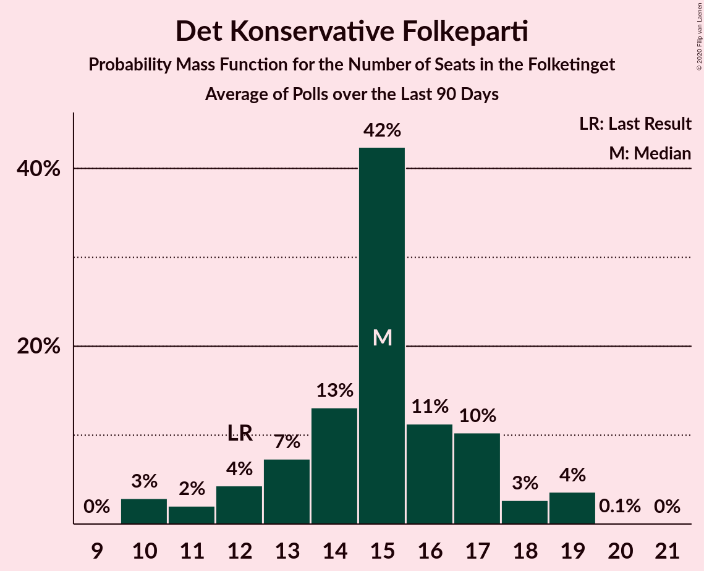

# Det Konservative Folkeparti

<a href="#voting-intentions">Voting Intentions</a> | <a href="#seats">Seats</a>

## Voting Intentions

Last result: **6.6%** (General Election of 5 June 2019)

### Confidence Intervals

| Period     | Polling firm/Commissioner(s) | Median | 80% Confidence Interval | 90% Confidence Interval | 95% Confidence Interval | 99% Confidence Interval |
|:----------:|:----------------:|:-----------:|:-----------------------:|:-----------------------:|:-----------------------:|:-----------------------:|
| N/A | [Poll Average](average.html) | 6.9% | 6.0–8.0% | 5.7–8.3% | 5.5–8.5% | 5.1–9.1% |
| [26 August–1 September 2019](2019-09-01-Voxmeter.html) | Voxmeter   Ritzau | 6.9% | 5.9–8.0% | 5.7–8.3% | 5.5–8.6% | 5.1–9.1% |
| [18–25 August 2019](2019-08-25-Voxmeter.html) | Voxmeter   Ritzau | 7.0% | N/A | N/A | N/A | N/A |
| [12–18 August 2019](2019-08-18-Voxmeter.html) | Voxmeter   Ritzau | 7.4% | N/A | N/A | N/A | N/A |
| [5–10 August 2019](2019-08-10-Voxmeter.html) | Voxmeter   Ritzau | 7.3% | N/A | N/A | N/A | N/A |
| [8 August 2019](2019-08-08-Gallup.html) | Gallup | 7.0% | N/A | N/A | N/A | N/A |
| [24–30 June 2019](2019-06-30-Voxmeter.html) | Voxmeter   Ritzau | 7.2% | N/A | N/A | N/A | N/A |
| [17–23 June 2019](2019-06-23-Voxmeter.html) | Voxmeter   Ritzau | 6.9% | N/A | N/A | N/A | N/A |
| [10–15 June 2019](2019-06-15-Voxmeter.html) | Voxmeter   Ritzau | 7.3% | N/A | N/A | N/A | N/A |

### Probability Mass Function

The following table shows the probability mass function per percentage block of voting intentions for the [poll average](average.html) for Det Konservative Folkeparti.

| Voting Intentions | Probability | Accumulated | Special Marks |
|:-----------------:|:-----------:|:-----------:|:-------------:|
| 3.5–4.5% | 0% | 100% |  |
| 4.5–5.5% | 3% | 100% |  |
| 5.5–6.5% | 29% | 97% |  |
| 6.5–7.5% | 46% | 68% | Last Result, Median |
| 7.5–8.5% | 19% | 22% |  |
| 8.5–9.5% | 2% | 2% |  |
| 9.5–10.5% | 0.1% | 0.1% |  |
| 10.5–11.5% | 0% | 0% |  |

## Seats

Last result: **12** seats (General Election of 5 June 2019)

### Confidence Intervals

| Period     | Polling firm/Commissioner(s) | Median | 80% Confidence Interval | 90% Confidence Interval | 95% Confidence Interval | 99% Confidence Interval |
|:----------:|:----------------:|:------:|:-----------------------:|:-----------------------:|:-----------------------:|:-----------------------:|
| N/A | [Poll Average](average.html) | 12 | 10–17 | 10–17 | 10–17 | 10–17 |
| [26 August–1 September 2019](2019-09-01-Voxmeter.html) | Voxmeter   Ritzau | 12 | 10–17 | 10–17 | 10–17 | 10–17 |
| [18–25 August 2019](2019-08-25-Voxmeter.html) | Voxmeter   Ritzau |  |  |  |  |  |
| [12–18 August 2019](2019-08-18-Voxmeter.html) | Voxmeter   Ritzau |  |  |  |  |  |
| [5–10 August 2019](2019-08-10-Voxmeter.html) | Voxmeter   Ritzau |  |  |  |  |  |
| [8 August 2019](2019-08-08-Gallup.html) | Gallup |  |  |  |  |  |
| [24–30 June 2019](2019-06-30-Voxmeter.html) | Voxmeter   Ritzau |  |  |  |  |  |
| [17–23 June 2019](2019-06-23-Voxmeter.html) | Voxmeter   Ritzau |  |  |  |  |  |
| [10–15 June 2019](2019-06-15-Voxmeter.html) | Voxmeter   Ritzau |  |  |  |  |  |

### Probability Mass Function

The following table shows the probability mass function per seat for the [poll average](average.html) for Det Konservative Folkeparti.

| Number of Seats | Probability | Accumulated | Special Marks |
|:---------------:|:-----------:|:-----------:|:-------------:|
| 9 | 0.1% | 100% |  |
| 10 | 39% | 99.9% |  |
| 11 | 3% | 61% |  |
| 12 | 15% | 58% | Last Result, Median |
| 13 | 2% | 43% |  |
| 14 | 20% | 41% |  |
| 15 | 3% | 21% |  |
| 16 | 0% | 19% |  |
| 17 | 19% | 19% |  |
| 18 | 0% | 0% |  |

