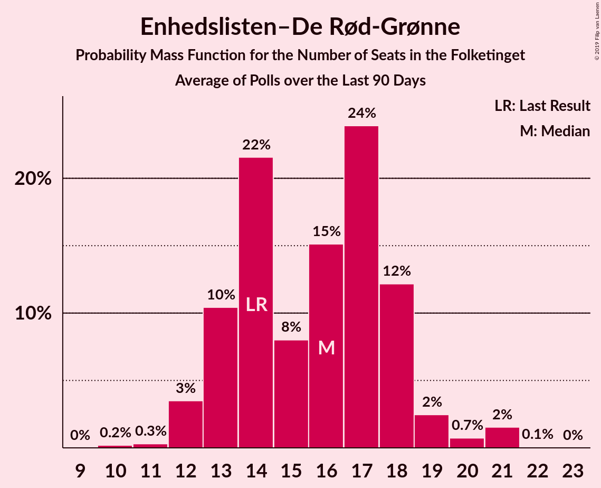

# Enhedslisten–De Rød-Grønne

<a href="#voting-intentions">Voting Intentions</a> | <a href="#seats">Seats</a>

## Voting Intentions

Last result: **6.9%** (General Election of 5 June 2019)

### Confidence Intervals

| Period     | Polling firm/Commissioner(s) | Median | 80% Confidence Interval | 90% Confidence Interval | 95% Confidence Interval | 99% Confidence Interval |
|:----------:|:----------------:|:-----------:|:-----------------------:|:-----------------------:|:-----------------------:|:-----------------------:|
| N/A | [Poll Average](average.html) | 6.9% | 5.8–8.2% | 5.6–8.6% | 5.4–8.9% | 5.0–9.5% |
| [2–6 July 2020](2020-07-06-YouGov.html) | YouGov | 7.7% | 6.8–8.7% | 6.5–9.0% | 6.3–9.3% | 5.9–9.8% |
| [22–28 June 2020](2020-06-28-Voxmeter.html) | Voxmeter   Ritzau | 7.3% | 6.4–8.5% | 6.1–8.8% | 5.9–9.1% | 5.5–9.7% |
| [22–25 June 2020](2020-06-25-Megafon.html) | Megafon   Politiken and TV 2 | 6.8% | 5.9–7.9% | 5.7–8.2% | 5.4–8.5% | 5.0–9.0% |
| [15–21 June 2020](2020-06-21-Voxmeter.html) | Voxmeter   Ritzau | 8.0% | 7.0–9.2% | 6.8–9.6% | 6.5–9.9% | 6.1–10.5% |
| [8–13 June 2020](2020-06-13-Voxmeter.html) | Voxmeter   Ritzau | 7.9% | 6.9–9.1% | 6.6–9.4% | 6.4–9.7% | 6.0–10.3% |
| [11 June 2020](2020-06-11-Gallup.html) | Gallup | 6.6% | 5.8–7.5% | 5.6–7.7% | 5.4–7.9% | 5.1–8.4% |
| [8–10 June 2020](2020-06-10-YouGov.html) | YouGov | 7.0% | 6.2–8.0% | 5.9–8.3% | 5.7–8.6% | 5.3–9.1% |
| [1–7 June 2020](2020-06-07-Voxmeter.html) | Voxmeter   Ritzau | 8.5% | 7.5–9.7% | 7.2–10.1% | 7.0–10.4% | 6.5–11.0% |
| [25–31 May 2020](2020-05-31-Voxmeter.html) | Voxmeter   Ritzau | 9.0% | 7.9–10.2% | 7.6–10.6% | 7.4–10.9% | 6.9–11.5% |
| [22–29 May 2020](2020-05-29-Epinion.html) | Epinion | 6.1% | 5.4–6.9% | 5.2–7.1% | 5.0–7.4% | 4.7–7.8% |
| [18–24 May 2020](2020-05-24-Voxmeter.html) | Voxmeter   Ritzau | 7.8% | 6.8–9.0% | 6.5–9.3% | 6.3–9.6% | 5.9–10.2% |
| [11–17 May 2020](2020-05-17-Voxmeter.html) | Voxmeter   Ritzau | 8.0% | 7.0–9.2% | 6.7–9.5% | 6.5–9.8% | 6.0–10.4% |
| [7–11 May 2020](2020-05-11-YouGov.html) | YouGov | 6.6% | 5.7–7.5% | 5.5–7.8% | 5.3–8.1% | 4.9–8.6% |
| [4–9 May 2020](2020-05-09-Voxmeter.html) | Voxmeter   Ritzau | 7.4% | 6.4–8.5% | 6.2–8.9% | 5.9–9.1% | 5.5–9.7% |
| [27 April–3 May 2020](2020-05-03-Voxmeter.html) | Voxmeter   Ritzau | 7.9% | 6.9–9.1% | 6.6–9.4% | 6.4–9.7% | 6.0–10.3% |
| [27–30 April 2020](2020-04-30-Megafon.html) | Megafon   Politiken and TV 2 | 7.9% | 6.9–9.1% | 6.6–9.4% | 6.4–9.7% | 5.9–10.3% |
| [20–26 April 2020](2020-04-26-Voxmeter.html) | Voxmeter   Ritzau | 7.1% | 6.2–8.2% | 5.9–8.6% | 5.7–8.8% | 5.3–9.4% |
| [6–19 April 2020](2020-04-19-Voxmeter.html) | Voxmeter   Ritzau | 7.2% | 6.2–8.3% | 6.0–8.6% | 5.8–8.9% | 5.3–9.5% |
| [10–16 April 2020](2020-04-16-Epinion.html) | Epinion | 6.6% | 5.9–7.5% | 5.7–7.7% | 5.5–7.9% | 5.2–8.4% |
| [30 March–11 April 2020](2020-04-11-Voxmeter.html) | Voxmeter   Ritzau | 6.7% | 5.8–7.7% | 5.5–8.1% | 5.3–8.3% | 4.9–8.9% |
| [23 March–5 April 2020](2020-04-05-Voxmeter.html) | Voxmeter   Ritzau | 6.9% | 6.0–8.0% | 5.7–8.3% | 5.5–8.6% | 5.1–9.1% |
| [27 March–3 April 2020](2020-04-03-Gallup.html) | Gallup | 7.5% | 6.7–8.4% | 6.5–8.7% | 6.3–8.9% | 5.9–9.4% |
| [23–29 March 2020](2020-03-29-Voxmeter.html) | Voxmeter   Ritzau | 7.4% | 6.4–8.5% | 6.2–8.8% | 6.0–9.1% | 5.5–9.7% |
| [16–22 March 2020](2020-03-22-Voxmeter.html) | Voxmeter   Ritzau | 7.8% | 6.8–8.9% | 6.5–9.3% | 6.3–9.6% | 5.9–10.1% |
| [9–15 March 2020](2020-03-15-Voxmeter.html) | Voxmeter   Ritzau | 8.1% | 7.1–9.3% | 6.8–9.6% | 6.6–9.9% | 6.1–10.5% |
| [2–7 March 2020](2020-03-07-Voxmeter.html) | Voxmeter   Ritzau | 7.7% | 6.7–8.8% | 6.4–9.2% | 6.2–9.4% | 5.8–10.0% |
| [25 February–2 March 2020](2020-03-02-Epinion.html) | Epinion   DR | 7.6% | 6.8–8.5% | 6.6–8.8% | 6.4–9.0% | 6.1–9.5% |
| [24 February–1 March 2020](2020-03-01-Voxmeter.html) | Voxmeter   Ritzau | 7.7% | 6.8–8.9% | 6.5–9.2% | 6.2–9.5% | 5.8–10.1% |
| [24–27 February 2020](2020-02-27-Megafon.html) | Megafon   TV2 | 8.0% | 7.0–9.1% | 6.7–9.5% | 6.5–9.8% | 6.1–10.4% |
| [17–23 February 2020](2020-02-23-Voxmeter.html) | Voxmeter   Ritzau | 7.2% | 6.3–8.4% | 6.1–8.7% | 5.8–9.0% | 5.4–9.6% |
| [10–16 February 2020](2020-02-16-Voxmeter.html) | Voxmeter   Ritzau | 7.7% | 6.7–8.9% | 6.4–9.2% | 6.2–9.5% | 5.7–10.1% |
| [7–13 February 2020](2020-02-13-Gallup.html) | Gallup | 6.9% | 6.1–7.8% | 5.9–8.1% | 5.7–8.3% | 5.4–8.7% |
| [3–8 February 2020](2020-02-08-Voxmeter.html) | Voxmeter   Ritzau | 7.2% | 6.2–8.3% | 6.0–8.6% | 5.7–8.9% | 5.3–9.4% |
| [27 January–2 February 2020](2020-02-02-Voxmeter.html) | Voxmeter   Ritzau | 6.9% | 6.0–8.1% | 5.7–8.4% | 5.5–8.7% | 5.1–9.2% |
| [20–26 January 2020](2020-01-26-Voxmeter.html) | Voxmeter   Ritzau | 7.3% | 6.4–8.5% | 6.1–8.8% | 5.9–9.1% | 5.4–9.6% |
| [13–19 January 2020](2020-01-19-Voxmeter.html) | Voxmeter   Ritzau | 7.1% | 6.2–8.3% | 5.9–8.6% | 5.7–8.9% | 5.3–9.4% |
| [6–11 January 2020](2020-01-11-Voxmeter.html) | Voxmeter   Ritzau | 6.6% | 5.7–7.7% | 5.5–8.0% | 5.2–8.3% | 4.8–8.9% |
| [30 December 2019–5 January 2020](2020-01-05-Voxmeter.html) | Voxmeter   Ritzau | 7.4% | 6.4–8.5% | 6.2–8.9% | 5.9–9.2% | 5.5–9.7% |
| [16–22 December 2019](2019-12-22-Voxmeter.html) | Voxmeter   Ritzau | 7.8% | 6.8–8.9% | 6.5–9.3% | 6.3–9.6% | 5.8–10.1% |
| [9–15 December 2019](2019-12-15-Voxmeter.html) | Voxmeter   Ritzau | 7.5% | 6.6–8.7% | 6.3–9.0% | 6.1–9.3% | 5.6–9.9% |
| [12 December 2019](2019-12-12-Gallup.html) | Gallup | 8.0% | 7.1–8.9% | 6.9–9.2% | 6.7–9.4% | 6.3–9.9% |
| [2–8 December 2019](2019-12-08-Voxmeter.html) | Voxmeter   Ritzau | 8.3% | 7.3–9.5% | 7.0–9.9% | 6.7–10.2% | 6.3–10.8% |
| [25 November–2 December 2019](2019-12-02-Voxmeter.html) | Voxmeter   Ritzau | 7.4% | 6.4–8.5% | 6.2–8.8% | 6.0–9.1% | 5.5–9.7% |
| [26–28 November 2019](2019-11-28-Megafon.html) | Megafon   Politiken and TV 2 | 7.2% | 6.2–8.3% | 6.0–8.7% | 5.7–8.9% | 5.3–9.5% |
| [18–25 November 2019](2019-11-25-Voxmeter.html) | Voxmeter   Ritzau | 8.1% | 7.1–9.3% | 6.8–9.6% | 6.6–9.9% | 6.1–10.5% |
| [20 November 2019](2019-11-20-Epinion.html) | Epinion   DR | 7.0% | 6.3–7.9% | 6.1–8.2% | 5.9–8.4% | 5.5–8.9% |
| [11–18 November 2019](2019-11-18-Voxmeter.html) | Voxmeter   Ritzau | 8.3% | 7.3–9.5% | 7.0–9.9% | 6.8–10.2% | 6.3–10.8% |
| [4–10 November 2019](2019-11-10-Voxmeter.html) | Voxmeter   Ritzau | 7.7% | 6.8–8.9% | 6.5–9.2% | 6.2–9.5% | 5.8–10.1% |
| [8 November 2019](2019-11-08-Gallup.html) | Gallup | 7.1% | 6.3–8.0% | 6.1–8.3% | 5.9–8.5% | 5.5–8.9% |
| [27 October–4 November 2019](2019-11-04-Voxmeter.html) | Voxmeter   Ritzau | 8.1% | 7.1–9.2% | 6.8–9.6% | 6.6–9.9% | 6.1–10.5% |
| [21–27 October 2019](2019-10-27-Voxmeter.html) | Voxmeter   Ritzau | 7.7% | 6.7–8.8% | 6.4–9.2% | 6.2–9.5% | 5.8–10.1% |
| [23 October 2019](2019-10-23-Epinion.html) | Epinion   DR | 8.0% | 7.2–8.9% | 6.9–9.2% | 6.7–9.5% | 6.4–9.9% |
| [14–20 October 2019](2019-10-20-Voxmeter.html) | Voxmeter   Ritzau | 7.4% | 6.4–8.5% | 6.2–8.8% | 5.9–9.1% | 5.5–9.7% |
| [7–12 October 2019](2019-10-12-Voxmeter.html) | Voxmeter   Ritzau | 7.7% | 6.7–8.9% | 6.5–9.2% | 6.2–9.5% | 5.8–10.1% |
| [30 September–7 October 2019](2019-10-07-Voxmeter.html) | Voxmeter   2019-10-07 | 7.0% | 6.0–8.1% | 5.8–8.4% | 5.6–8.7% | 5.2–9.2% |
| [23–29 September 2019](2019-09-29-Voxmeter.html) | Voxmeter   Ritzau | 6.9% | 6.0–8.0% | 5.7–8.4% | 5.5–8.6% | 5.1–9.2% |
| [29 September 2019](2019-09-29-Gallup.html) | Gallup | 7.3% | 6.5–8.3% | 6.3–8.5% | 6.1–8.8% | 5.7–9.2% |
| [16–22 September 2019](2019-09-22-Voxmeter.html) | Voxmeter   Ritzau | 7.1% | 6.2–8.2% | 5.9–8.6% | 5.7–8.8% | 5.3–9.4% |
| [19 September 2019](2019-09-19-Norstat.html) | Norstat   Altinget and Jyllands-Posten | 7.2% | 6.2–8.4% | 6.0–8.7% | 5.7–9.0% | 5.3–9.6% |
| [9–15 September 2019](2019-09-15-Voxmeter.html) | Voxmeter   Ritzau | 6.7% | 5.8–7.8% | 5.6–8.1% | 5.3–8.4% | 4.9–9.0% |
| [12 September 2019](2019-09-12-Gallup.html) | Gallup | 7.5% | 6.7–8.4% | 6.5–8.7% | 6.3–8.9% | 6.0–9.3% |
| [9 September 2019](2019-09-09-YouGov.html) | YouGov | 7.6% | 6.6–8.8% | 6.3–9.1% | 6.1–9.4% | 5.7–10.0% |
| [2–9 September 2019](2019-09-09-Voxmeter.html) | Voxmeter   Ritzau | 7.5% | 6.5–8.6% | 6.2–9.0% | 6.0–9.3% | 5.6–9.8% |
| [26 August–1 September 2019](2019-09-01-Voxmeter.html) | Voxmeter   Ritzau | 6.8% | 5.9–7.9% | 5.6–8.2% | 5.4–8.5% | 5.0–9.0% |
| [18–26 August 2019](2019-08-26-Voxmeter.html) | Voxmeter   Ritzau | 7.0% | 6.0–8.1% | 5.8–8.4% | 5.6–8.7% | 5.2–9.3% |
| [16–20 August 2019](2019-08-20-Megafon.html) | Megafon   Politiken and TV 2 | 7.6% | 6.6–8.7% | 6.3–9.1% | 6.1–9.4% | 5.6–10.0% |
| [12–18 August 2019](2019-08-18-Voxmeter.html) | Voxmeter   Ritzau | 7.4% | 6.5–8.6% | 6.2–8.9% | 6.0–9.2% | 5.6–9.7% |
| [5–10 August 2019](2019-08-10-Voxmeter.html) | Voxmeter   Ritzau | 8.3% | 7.2–9.5% | 7.0–9.8% | 6.7–10.1% | 6.2–10.7% |
| [8 August 2019](2019-08-08-Gallup.html) | Gallup | 7.4% | 6.6–8.4% | 6.4–8.6% | 6.2–8.9% | 5.9–9.3% |
| [24–30 June 2019](2019-06-30-Voxmeter.html) | Voxmeter   Ritzau | 7.1% | 6.2–8.2% | 5.9–8.6% | 5.7–8.8% | 5.3–9.4% |
| [17–23 June 2019](2019-06-23-Voxmeter.html) | Voxmeter   Ritzau | 7.0% | 6.1–8.2% | 5.9–8.5% | 5.6–8.8% | 5.2–9.3% |
| [10–15 June 2019](2019-06-15-Voxmeter.html) | Voxmeter   Ritzau | 7.1% | 6.2–8.3% | 5.9–8.6% | 5.7–8.9% | 5.3–9.5% |

### Probability Mass Function

The following table shows the probability mass function per percentage block of voting intentions for the [poll average](average.html) for Enhedslisten–De Rød-Grønne.

| Voting Intentions | Probability | Accumulated | Special Marks |
|:-----------------:|:-----------:|:-----------:|:-------------:|
| 3.5–4.5% | 0% | 100% |  |
| 4.5–5.5% | 5% | 100% |  |
| 5.5–6.5% | 31% | 95% |  |
| 6.5–7.5% | 39% | 65% | Last Result, Median |
| 7.5–8.5% | 21% | 26% |  |
| 8.5–9.5% | 5% | 5% |  |
| 9.5–10.5% | 0.4% | 0.4% |  |
| 10.5–11.5% | 0% | 0% |  |

## Seats

Last result: **13** seats (General Election of 5 June 2019)

### Confidence Intervals

| Period     | Polling firm/Commissioner(s) | Median | 80% Confidence Interval | 90% Confidence Interval | 95% Confidence Interval | 99% Confidence Interval |
|:----------:|:----------------:|:------:|:-----------------------:|:-----------------------:|:-----------------------:|:-----------------------:|
| N/A | [Poll Average](average.html) | 13 | 10–15 | 10–15 | 10–15 | 9–17 |
| [2–6 July 2020](2020-07-06-YouGov.html) | YouGov | 14 | 13–15 | 12–16 | 12–16 | 11–18 |
| [22–28 June 2020](2020-06-28-Voxmeter.html) | Voxmeter   Ritzau | 15 | 12–15 | 11–15 | 11–15 | 10–17 |
| [22–25 June 2020](2020-06-25-Megafon.html) | Megafon   Politiken and TV 2 | 13 | 10–13 | 10–15 | 10–15 | 9–17 |
| [15–21 June 2020](2020-06-21-Voxmeter.html) | Voxmeter   Ritzau | 16 | 12–17 | 12–17 | 12–17 | 11–18 |
| [8–13 June 2020](2020-06-13-Voxmeter.html) | Voxmeter   Ritzau | 14 | 12–16 | 12–18 | 12–18 | 11–18 |
| [11 June 2020](2020-06-11-Gallup.html) | Gallup | 12 | 10–13 | 10–14 | 10–14 | 9–16 |
| [8–10 June 2020](2020-06-10-YouGov.html) | YouGov | 14 | 11–14 | 10–14 | 10–14 | 10–15 |
| [1–7 June 2020](2020-06-07-Voxmeter.html) | Voxmeter   Ritzau | 15 | 13–18 | 13–18 | 12–19 | 11–21 |
| [25–31 May 2020](2020-05-31-Voxmeter.html) | Voxmeter   Ritzau | 16 | 14–18 | 14–19 | 13–19 | 13–20 |
| [22–29 May 2020](2020-05-29-Epinion.html) | Epinion | 11 | 10–13 | 10–13 | 9–13 | 9–13 |
| [18–24 May 2020](2020-05-24-Voxmeter.html) | Voxmeter   Ritzau | 14 | 12–16 | 12–17 | 12–18 | 11–19 |
| [11–17 May 2020](2020-05-17-Voxmeter.html) | Voxmeter   Ritzau | 14 | 13–17 | 12–18 | 12–18 | 11–19 |
| [7–11 May 2020](2020-05-11-YouGov.html) | YouGov | 10 | 10–13 | 10–14 | 10–14 | 9–15 |
| [4–9 May 2020](2020-05-09-Voxmeter.html) | Voxmeter   Ritzau | 14 | 13–17 | 11–17 | 11–17 | 10–18 |
| [27 April–3 May 2020](2020-05-03-Voxmeter.html) | Voxmeter   Ritzau | 14 | 13–16 | 12–17 | 12–17 | 11–18 |
| [27–30 April 2020](2020-04-30-Megafon.html) | Megafon   Politiken and TV 2 | 13 | 13–19 | 12–20 | 11–20 | 11–20 |
| [20–26 April 2020](2020-04-26-Voxmeter.html) | Voxmeter   Ritzau | 13 | 11–15 | 11–16 | 10–16 | 9–17 |
| [6–19 April 2020](2020-04-19-Voxmeter.html) | Voxmeter   Ritzau | 13 | 12–17 | 11–17 | 11–17 | 10–18 |
| [10–16 April 2020](2020-04-16-Epinion.html) | Epinion | 12 | 12–13 | 11–13 | 10–13 | 10–15 |
| [30 March–11 April 2020](2020-04-11-Voxmeter.html) | Voxmeter   Ritzau | 12 | 11–14 | 10–14 | 10–15 | 10–16 |
| [23 March–5 April 2020](2020-04-05-Voxmeter.html) | Voxmeter   Ritzau | 13 | 11–15 | 11–15 | 10–15 | 9–16 |
| [27 March–3 April 2020](2020-04-03-Gallup.html) | Gallup | 15 | 11–16 | 11–16 | 11–16 | 11–17 |
| [23–29 March 2020](2020-03-29-Voxmeter.html) | Voxmeter   Ritzau | 14 | 12–16 | 11–16 | 11–16 | 10–17 |
| [16–22 March 2020](2020-03-22-Voxmeter.html) | Voxmeter   Ritzau | 15 | 12–17 | 11–17 | 11–17 | 11–18 |
| [9–15 March 2020](2020-03-15-Voxmeter.html) | Voxmeter   Ritzau | 15 | 13–18 | 11–19 | 11–19 | 11–19 |
| [2–7 March 2020](2020-03-07-Voxmeter.html) | Voxmeter   Ritzau | 13 | 12–16 | 12–17 | 12–17 | 11–18 |
| [25 February–2 March 2020](2020-03-02-Epinion.html) | Epinion   DR | 14 | 13–15 | 13–16 | 12–17 | 11–17 |
| [24 February–1 March 2020](2020-03-01-Voxmeter.html) | Voxmeter   Ritzau | 14 | 12–17 | 12–18 | 12–18 | 11–18 |
| [24–27 February 2020](2020-02-27-Megafon.html) | Megafon   TV2 | 15 | 13–17 | 13–17 | 12–17 | 11–20 |
| [17–23 February 2020](2020-02-23-Voxmeter.html) | Voxmeter   Ritzau | 14 | 12–16 | 11–17 | 11–17 | 10–18 |
| [10–16 February 2020](2020-02-16-Voxmeter.html) | Voxmeter   Ritzau | 14 | 12–16 | 11–16 | 11–16 | 11–18 |
| [7–13 February 2020](2020-02-13-Gallup.html) | Gallup | 11 | 11–13 | 11–14 | 11–14 | 10–15 |
| [3–8 February 2020](2020-02-08-Voxmeter.html) | Voxmeter   Ritzau | 13 | 11–15 | 11–15 | 11–16 | 9–17 |
| [27 January–2 February 2020](2020-02-02-Voxmeter.html) | Voxmeter   Ritzau | 13 | 11–14 | 10–15 | 10–15 | 9–16 |
| [20–26 January 2020](2020-01-26-Voxmeter.html) | Voxmeter   Ritzau | 12 | 10–13 | 10–15 | 10–17 | 10–17 |
| [13–19 January 2020](2020-01-19-Voxmeter.html) | Voxmeter   Ritzau | 12 | 12–14 | 12–15 | 11–15 | 10–18 |
| [6–11 January 2020](2020-01-11-Voxmeter.html) | Voxmeter   Ritzau | 12 | 11–14 | 10–14 | 10–15 | 9–16 |
| [30 December 2019–5 January 2020](2020-01-05-Voxmeter.html) | Voxmeter   Ritzau | 14 | 12–15 | 12–16 | 11–16 | 10–18 |
| [16–22 December 2019](2019-12-22-Voxmeter.html) | Voxmeter   Ritzau | 14 | 12–16 | 12–17 | 11–18 | 11–19 |
| [9–15 December 2019](2019-12-15-Voxmeter.html) | Voxmeter   Ritzau | 14 | 12–16 | 12–16 | 11–17 | 11–18 |
| [12 December 2019](2019-12-12-Gallup.html) | Gallup | 15 | 14–15 | 11–16 | 11–17 | 11–18 |
| [2–8 December 2019](2019-12-08-Voxmeter.html) | Voxmeter   Ritzau | 16 | 13–17 | 13–18 | 12–18 | 11–19 |
| [25 November–2 December 2019](2019-12-02-Voxmeter.html) | Voxmeter   Ritzau | 13 | 11–15 | 11–16 | 11–16 | 10–18 |
| [26–28 November 2019](2019-11-28-Megafon.html) | Megafon   Politiken and TV 2 | 14 | 12–16 | 9–16 | 9–16 | 8–16 |
| [18–25 November 2019](2019-11-25-Voxmeter.html) | Voxmeter   Ritzau | 15 | 14–18 | 13–18 | 13–18 | 11–18 |
| [20 November 2019](2019-11-20-Epinion.html) | Epinion   DR | 13 | 10–13 | 10–14 | 10–14 | 10–16 |
| [11–18 November 2019](2019-11-18-Voxmeter.html) | Voxmeter   Ritzau | 16 | 14–17 | 13–19 | 12–19 | 12–22 |
| [4–10 November 2019](2019-11-10-Voxmeter.html) | Voxmeter   Ritzau | 13 | 13–15 | 13–19 | 11–19 | 11–19 |
| [8 November 2019](2019-11-08-Gallup.html) | Gallup | 12 | 12–14 | 11–15 | 10–15 | 10–16 |
| [27 October–4 November 2019](2019-11-04-Voxmeter.html) | Voxmeter   Ritzau | 18 | 14–18 | 14–18 | 14–18 | 13–18 |
| [21–27 October 2019](2019-10-27-Voxmeter.html) | Voxmeter   Ritzau | 11 | 11–14 | 11–14 | 11–15 | 11–18 |
| [23 October 2019](2019-10-23-Epinion.html) | Epinion   DR | 15 | 13–15 | 13–15 | 12–15 | 12–17 |
| [14–20 October 2019](2019-10-20-Voxmeter.html) | Voxmeter   Ritzau | 12 | 11–14 | 10–16 | 10–17 | 10–17 |
| [7–12 October 2019](2019-10-12-Voxmeter.html) | Voxmeter   Ritzau | 15 | 12–16 | 12–17 | 12–18 | 10–19 |
| [30 September–7 October 2019](2019-10-07-Voxmeter.html) | Voxmeter   2019-10-07 | 13 | 11–14 | 11–14 | 11–15 | 10–16 |
| [23–29 September 2019](2019-09-29-Voxmeter.html) | Voxmeter   Ritzau | 14 | 13–16 | 13–16 | 12–16 | 9–16 |
| [29 September 2019](2019-09-29-Gallup.html) | Gallup | 11 | 11–14 | 11–14 | 11–14 | 11–16 |
| [16–22 September 2019](2019-09-22-Voxmeter.html) | Voxmeter   Ritzau | 14 | 11–14 | 11–15 | 10–16 | 10–17 |
| [19 September 2019](2019-09-19-Norstat.html) | Norstat   Altinget and Jyllands-Posten | 12 | 10–14 | 10–14 | 10–16 | 10–16 |
| [9–15 September 2019](2019-09-15-Voxmeter.html) | Voxmeter   Ritzau | 15 | 10–16 | 10–17 | 10–17 | 9–17 |
| [12 September 2019](2019-09-12-Gallup.html) | Gallup | 14 | 12–15 | 12–15 | 12–15 | 12–16 |
| [9 September 2019](2019-09-09-YouGov.html) | YouGov | 14 | 14 | 13–14 | 12–14 | 11–16 |
| [2–9 September 2019](2019-09-09-Voxmeter.html) | Voxmeter   Ritzau | 13 | 12–15 | 12–15 | 11–16 | 10–18 |
| [26 August–1 September 2019](2019-09-01-Voxmeter.html) | Voxmeter   Ritzau | 13 | 11–15 | 11–15 | 10–16 | 9–16 |
| [18–26 August 2019](2019-08-26-Voxmeter.html) | Voxmeter   Ritzau | 11 | 11–13 | 11–13 | 11–13 | 11–17 |
| [16–20 August 2019](2019-08-20-Megafon.html) | Megafon   Politiken and TV 2 | 14 | 11–14 | 11–15 | 11–18 | 11–19 |
| [12–18 August 2019](2019-08-18-Voxmeter.html) | Voxmeter   Ritzau | 13 | 10–17 | 10–17 | 10–17 | 10–19 |
| [5–10 August 2019](2019-08-10-Voxmeter.html) | Voxmeter   Ritzau | 17 | 12–19 | 12–19 | 12–19 | 12–19 |
| [8 August 2019](2019-08-08-Gallup.html) | Gallup | 14 | 12–15 | 11–16 | 11–16 | 11–17 |
| [24–30 June 2019](2019-06-30-Voxmeter.html) | Voxmeter   Ritzau | 13 | 10–14 | 10–15 | 10–16 | 10–17 |
| [17–23 June 2019](2019-06-23-Voxmeter.html) | Voxmeter   Ritzau | 12 | 9–15 | 9–15 | 9–15 | 9–16 |
| [10–15 June 2019](2019-06-15-Voxmeter.html) | Voxmeter   Ritzau | 13 | 11–14 | 11–16 | 10–17 | 10–18 |

### Probability Mass Function

The following table shows the probability mass function per seat for the [poll average](average.html) for Enhedslisten–De Rød-Grønne.

| Number of Seats | Probability | Accumulated | Special Marks |
|:---------------:|:-----------:|:-----------:|:-------------:|
| 8 | 0.1% | 100% |  |
| 9 | 1.4% | 99.9% |  |
| 10 | 11% | 98% |  |
| 11 | 13% | 87% |  |
| 12 | 19% | 74% |  |
| 13 | 26% | 56% | Last Result, Median |
| 14 | 8% | 29% |  |
| 15 | 19% | 22% |  |
| 16 | 2% | 2% |  |
| 17 | 0.6% | 0.8% |  |
| 18 | 0.2% | 0.2% |  |
| 19 | 0% | 0% |  |

