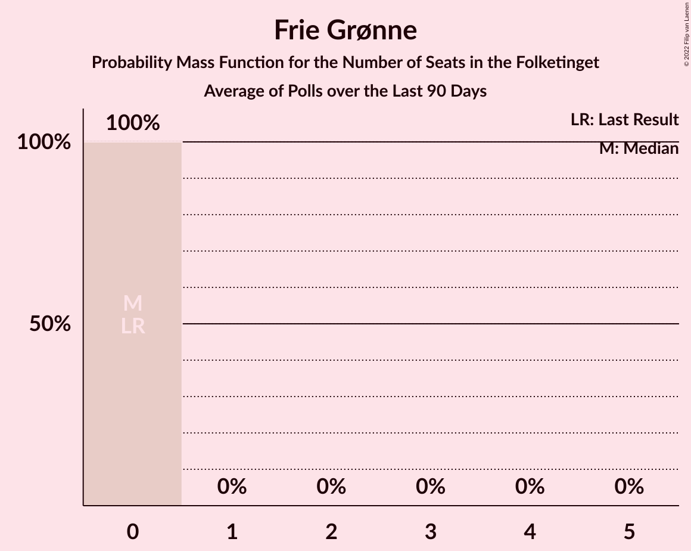

# Frie Grønne

<a href="#voting-intentions">Voting Intentions</a> | <a href="#seats">Seats</a>

## Voting Intentions

Last result: **0.0%** (General Election of 5 June 2019)

### Confidence Intervals

| Period     | Polling firm/Commissioner(s) | Median | 80% Confidence Interval | 90% Confidence Interval | 95% Confidence Interval | 99% Confidence Interval |
|:----------:|:----------------:|:-----------:|:-----------------------:|:-----------------------:|:-----------------------:|:-----------------------:|
| N/A | [Poll Average](average.html) | 0.8% | 0.4–1.2% | 0.3–1.3% | 0.3–1.5% | 0.2–1.8% |
| [25–27 October 2022](2022-10-27-Voxmeter.html) | Voxmeter | 0.8% | 0.5–1.3% | 0.5–1.4% | 0.4–1.6% | 0.3–1.8% |
| [21–25 October 2022](2022-10-25-Yougov.html) | Yougov | 0.7% | 0.5–1.1% | 0.4–1.2% | 0.4–1.4% | 0.3–1.6% |
| [22–24 October 2022](2022-10-24-Voxmeter.html) | Voxmeter | 0.6% | 0.4–1.1% | 0.3–1.2% | 0.3–1.3% | 0.2–1.6% |
| [24 October 2022](2022-10-24-Gallup.html) | Gallup   Berlingske | 0.4% | 0.3–0.7% | 0.2–0.8% | 0.2–0.8% | 0.2–1.0% |
| [19–21 October 2022](2022-10-21-Voxmeter.html) | Voxmeter | 0.5% | 0.3–1.0% | 0.3–1.1% | 0.2–1.2% | 0.2–1.5% |
| [20 October 2022](2022-10-20-Epinion.html) | Epinion   DR | 0.8% | 0.6–1.1% | 0.5–1.2% | 0.5–1.2% | 0.4–1.4% |
| [15–18 October 2022](2022-10-18-Yougov.html) | Yougov | 1.6% | 1.2–2.1% | 1.1–2.3% | 1.0–2.4% | 0.9–2.7% |
| [16–18 October 2022](2022-10-18-Voxmeter.html) | Voxmeter | 0.5% | 0.3–0.9% | 0.3–1.1% | 0.2–1.2% | 0.2–1.4% |
| [18 October 2022](2022-10-18-Gallup.html) | Gallup   Berlingske | 0.7% | 0.5–1.0% | 0.5–1.1% | 0.4–1.2% | 0.3–1.4% |
| [12–16 October 2022](2022-10-16-Megafon.html) | Megafon   Politiken and TV | 0.9% | 0.6–1.4% | 0.5–1.6% | 0.5–1.7% | 0.4–2.0% |
| [13–15 October 2022](2022-10-15-Voxmeter.html) | Voxmeter | 0.4% | N/A | N/A | N/A | N/A |
| [13 October 2022](2022-10-13-Epinion.html) | Epinion   DR | 0.7% | 0.5–1.0% | 0.5–1.1% | 0.5–1.1% | 0.4–1.3% |
| [10–12 October 2022](2022-10-12-Voxmeter.html) | Voxmeter | 0.8% | 0.5–1.3% | 0.5–1.4% | 0.4–1.5% | 0.3–1.8% |
| [12 October 2022](2022-10-12-Gallup.html) | Gallup   Berlingske | 0.5% | 0.4–0.8% | 0.3–0.9% | 0.3–0.9% | 0.2–1.1% |
| [11 October 2022](2022-10-11-Yougov.html) | Yougov | 0.6% | 0.4–1.0% | 0.4–1.1% | 0.3–1.2% | 0.2–1.5% |
| [7–9 October 2022](2022-10-09-Voxmeter.html) | Voxmeter | 0.6% | 0.4–1.0% | 0.3–1.2% | 0.3–1.3% | 0.2–1.5% |
| [7–9 October 2022](2022-10-09-Megafon.html) | Megafon   Politiken and TV | 0.6% | 0.4–1.0% | 0.3–1.2% | 0.3–1.3% | 0.2–1.5% |
| [7 October 2022](2022-10-07-Yougov.html) | Yougov | 0.6% | N/A | N/A | N/A | N/A |
| [3–6 October 2022](2022-10-06-Voxmeter.html) | Voxmeter | 0.3% | 0.2–0.6% | 0.1–0.7% | 0.1–0.8% | 0.1–1.0% |
| [6 October 2022](2022-10-06-Gallup.html) | Gallup   Berlingske | 0.5% | 0.4–0.8% | 0.3–0.9% | 0.3–1.0% | 0.2–1.2% |
| [5 October 2022](2022-10-05-Megafon.html) | Megafon   Politiken and TV | 0.3% | 0.2–0.7% | 0.1–0.8% | 0.1–0.9% | 0.1–1.1% |
| [5 October 2022](2022-10-05-Epinion.html) | Epinion   DR | 0.7% | 0.5–1.0% | 0.4–1.1% | 0.4–1.2% | 0.3–1.3% |
| [26 September–2 October 2022](2022-10-02-Voxmeter.html) | Voxmeter | 0.4% | 0.2–0.8% | 0.2–0.9% | 0.2–1.0% | 0.1–1.3% |
| [2 October 2022](2022-10-02-Gallup.html) | Gallup   Berlingske | 0.3% | 0.2–0.6% | 0.2–0.7% | 0.1–0.7% | 0.1–0.9% |
| [26–29 September 2022](2022-09-29-Megafon.html) | Megafon   Politiken and TV 2 | 0.7% | 0.5–1.2% | 0.4–1.3% | 0.3–1.4% | 0.2–1.7% |
| [19–25 September 2022](2022-09-25-Voxmeter.html) | Voxmeter | 0.6% | 0.4–1.1% | 0.3–1.2% | 0.3–1.3% | 0.2–1.6% |
| [13–20 September 2022](2022-09-20-Epinion.html) | Epinion   DR | 1.0% | 0.8–1.3% | 0.7–1.4% | 0.7–1.5% | 0.6–1.7% |
| [12–18 September 2022](2022-09-18-Voxmeter.html) | Voxmeter | 0.4% | 0.2–0.8% | 0.2–0.9% | 0.2–1.0% | 0.1–1.3% |
| [5–11 September 2022](2022-09-11-Voxmeter.html) | Voxmeter | 0.5% | N/A | N/A | N/A | N/A |
| [29 August–4 September 2022](2022-09-04-Voxmeter.html) | Voxmeter | 0.3% | 0.2–0.7% | 0.1–0.8% | 0.1–0.9% | 0.1–1.1% |
| [2 September 2022](2022-09-02-Gallup.html) | Gallup   Berlingske | 0.7% | 0.5–1.2% | 0.4–1.3% | 0.3–1.4% | 0.2–1.7% |
| [22–28 August 2022](2022-08-28-Voxmeter.html) | Voxmeter | 0.4% | 0.2–0.8% | 0.2–0.9% | 0.2–1.0% | 0.1–1.3% |
| [16–24 August 2022](2022-08-24-Epinion.html) | Epinion   DR | 0.5% | 0.3–0.7% | 0.3–0.8% | 0.3–0.9% | 0.2–1.0% |
| [15–21 August 2022](2022-08-21-Voxmeter.html) | Voxmeter | 0.5% | 0.3–0.9% | 0.2–1.0% | 0.2–1.1% | 0.1–1.3% |
| [15–18 August 2022](2022-08-18-Megafon.html) | Megafon   Politiken and TV 2 | 0.8% | 0.5–1.3% | 0.5–1.4% | 0.4–1.6% | 0.3–1.8% |
| [8–14 August 2022](2022-08-14-Voxmeter.html) | Voxmeter | 0.2% | 0.1–0.5% | 0.1–0.6% | 0.0–0.7% | 0.0–0.9% |
| [7 August 2022](2022-08-07-Yougov.html) | Yougov | 0.6% | 0.4–0.9% | 0.3–1.1% | 0.3–1.2% | 0.2–1.4% |
| [1–6 August 2022](2022-08-06-Voxmeter.html) | Voxmeter | 0.3% | N/A | N/A | N/A | N/A |
| [5 August 2022](2022-08-05-Gallup.html) | Gallup   Berlingske | 0.3% | 0.2–0.6% | 0.2–0.7% | 0.1–0.7% | 0.1–0.9% |
| [21–28 July 2022](2022-07-28-Epinion.html) | Epinion   DR | 0.8% | 0.6–1.2% | 0.5–1.3% | 0.5–1.4% | 0.4–1.5% |
| [4–7 July 2022](2022-07-07-Megafon.html) | Megafon   Politiken and TV 2 | 0.1% | 0.0–0.5% | 0.0–0.5% | 0.0–0.6% | 0.0–0.9% |
| [27 June–3 July 2022](2022-07-03-Voxmeter.html) | Voxmeter | 0.8% | 0.5–1.3% | 0.5–1.4% | 0.4–1.6% | 0.3–1.8% |
| [20–26 June 2022](2022-06-26-Voxmeter.html) | Voxmeter | 0.6% | 0.4–1.1% | 0.3–1.2% | 0.3–1.3% | 0.2–1.6% |
| [20–23 June 2022](2022-06-23-Megafon.html) | Megafon   Politiken and TV 2 | 0.6% | 0.4–1.0% | 0.3–1.2% | 0.3–1.3% | 0.2–1.5% |
| [13–19 June 2022](2022-06-19-Voxmeter.html) | Voxmeter | 0.8% | 0.5–1.2% | 0.4–1.4% | 0.4–1.5% | 0.3–1.8% |
| [14 June 2022](2022-06-14-Gallup.html) | Gallup   Berlingske | 0.5% | 0.4–0.9% | 0.3–0.9% | 0.3–1.0% | 0.2–1.2% |
| [6–12 June 2022](2022-06-12-Voxmeter.html) | Voxmeter | 0.3% | N/A | N/A | N/A | N/A |
| [30 May–5 June 2022](2022-06-05-Voxmeter.html) | Voxmeter | 0.3% | 0.2–0.7% | 0.1–0.8% | 0.1–0.9% | 0.1–1.1% |
| [23–29 May 2022](2022-05-29-Voxmeter.html) | Voxmeter | 0.7% | 0.5–1.2% | 0.4–1.3% | 0.3–1.4% | 0.2–1.7% |
| [22–29 May 2022](2022-05-29-Epinion.html) | Epinion   DR | 1.6% | 1.3–2.0% | 1.2–2.2% | 1.2–2.3% | 1.0–2.5% |
| [16–22 May 2022](2022-05-22-Voxmeter.html) | Voxmeter | 0.3% | 0.2–0.7% | 0.1–0.8% | 0.1–0.9% | 0.1–1.1% |
| [11–18 May 2022](2022-05-18-Epinion.html) | Epinion   DR | 0.8% | 0.6–1.1% | 0.5–1.2% | 0.5–1.3% | 0.4–1.5% |
| [9–15 May 2022](2022-05-15-Voxmeter.html) | Voxmeter | 0.6% | 0.4–1.0% | 0.3–1.2% | 0.3–1.3% | 0.2–1.5% |
| [2–8 May 2022](2022-05-08-Voxmeter.html) | Voxmeter | 0.5% | 0.3–0.9% | 0.2–1.0% | 0.2–1.1% | 0.1–1.4% |
| [29 April–5 May 2022](2022-05-05-Gallup.html) | Gallup   Berlingske | 0.7% | 0.5–1.1% | 0.4–1.2% | 0.4–1.3% | 0.3–1.5% |
| [25 April–1 May 2022](2022-05-01-Voxmeter.html) | Voxmeter | 0.2% | N/A | N/A | N/A | N/A |
| [20–27 April 2022](2022-04-27-Epinion.html) | Epinion   DR | 0.6% | 0.4–0.9% | 0.4–1.0% | 0.3–1.1% | 0.2–1.3% |
| [18–24 April 2022](2022-04-24-Voxmeter.html) | Voxmeter | 0.4% | 0.2–0.8% | 0.2–0.9% | 0.2–1.0% | 0.1–1.3% |
| [8–11 April 2022](2022-04-11-YouGov.html) | YouGov   B.T. | 1.0% | 0.7–1.4% | 0.6–1.6% | 0.5–1.7% | 0.4–1.9% |
| [4–9 April 2022](2022-04-09-Voxmeter.html) | Voxmeter | 0.2% | 0.1–0.5% | 0.1–0.6% | 0.1–0.7% | 0.0–0.9% |
| [4 April 2022](2022-04-04-Gallup.html) | Gallup   Berlingske | 0.9% | 0.6–1.3% | 0.6–1.4% | 0.5–1.5% | 0.4–1.7% |
| [28 March–3 April 2022](2022-04-03-Voxmeter.html) | Voxmeter | 0.5% | 0.3–0.9% | 0.3–1.1% | 0.2–1.2% | 0.2–1.4% |
| [21–27 March 2022](2022-03-27-Voxmeter.html) | Voxmeter | 0.5% | 0.3–0.9% | 0.3–1.1% | 0.2–1.2% | 0.2–1.4% |
| [21–24 March 2022](2022-03-24-Megafon.html) | Megafon   Politiken and TV 2 | 0.2% | 0.1–0.5% | 0.1–0.6% | 0.0–0.7% | 0.0–0.9% |
| [14–20 March 2022](2022-03-20-Voxmeter.html) | Voxmeter | 0.2% | 0.1–0.5% | 0.1–0.6% | 0.1–0.7% | 0.0–0.9% |
| [8–15 March 2022](2022-03-15-Epinion.html) | Epinion   DR | 0.7% | 0.5–1.0% | 0.5–1.1% | 0.4–1.2% | 0.3–1.3% |
| [7–12 March 2022](2022-03-12-Voxmeter.html) | Voxmeter | 0.0% | N/A | N/A | N/A | N/A |
| [4–7 March 2022](2022-03-07-YouGov.html) | YouGov   B.T. | 0.3% | 0.2–0.6% | 0.2–0.7% | 0.1–0.8% | 0.1–1.0% |
| [21–27 February 2022](2022-02-27-Voxmeter.html) | Voxmeter | 0.3% | 0.2–0.7% | 0.1–0.8% | 0.1–0.9% | 0.1–1.1% |
| [14–20 February 2022](2022-02-20-Voxmeter.html) | Voxmeter | 0.0% | N/A | N/A | N/A | N/A |
| [9–16 February 2022](2022-02-16-Epinion.html) | Epinion   DR | 0.9% | 0.7–1.2% | 0.6–1.3% | 0.6–1.4% | 0.5–1.6% |
| [7–12 February 2022](2022-02-12-Voxmeter.html) | Voxmeter | 0.2% | 0.1–0.5% | 0.1–0.6% | 0.1–0.7% | 0.0–0.9% |
| [4–6 February 2022](2022-02-06-YouGov.html) | YouGov   B.T. | 0.3% | 0.2–0.6% | 0.2–0.7% | 0.1–0.8% | 0.1–1.0% |
| [31 January–6 February 2022](2022-02-06-Voxmeter.html) | Voxmeter | 0.2% | N/A | N/A | N/A | N/A |
| [26 January–3 February 2022](2022-02-03-Gallup.html) | Gallup   Berlingske | 0.5% | 0.3–0.8% | 0.3–0.9% | 0.2–1.0% | 0.2–1.1% |
| [24–30 January 2022](2022-01-30-Voxmeter.html) | Voxmeter | 0.0% | N/A | N/A | N/A | N/A |
| [17–23 January 2022](2022-01-23-Voxmeter.html) | Voxmeter | 0.1% | N/A | N/A | N/A | N/A |
| [10–20 January 2022](2022-01-20-Megafon.html) | Megafon | 0.2% | 0.1–0.6% | 0.1–0.7% | 0.1–0.8% | 0.0–1.1% |
| [10–16 January 2022](2022-01-16-Voxmeter.html) | Voxmeter | 0.3% | 0.2–0.7% | 0.1–0.8% | 0.1–0.9% | 0.1–1.1% |
| [7–10 January 2022](2022-01-10-YouGov.html) | YouGov   B.T. | 0.5% | N/A | N/A | N/A | N/A |
| [3–8 January 2022](2022-01-08-Voxmeter.html) | Voxmeter | 0.1% | 0.0–0.4% | 0.0–0.5% | 0.0–0.6% | 0.0–0.7% |
| [20–23 December 2021](2021-12-23-Voxmeter.html) | Voxmeter | 0.2% | 0.1–0.5% | 0.1–0.6% | 0.1–0.7% | 0.0–0.9% |
| [13–19 December 2021](2021-12-19-Voxmeter.html) | Voxmeter | 0.0% | N/A | N/A | N/A | N/A |
| [6–11 December 2021](2021-12-11-Voxmeter.html) | Voxmeter | 0.1% | N/A | N/A | N/A | N/A |
| [3–9 December 2021](2021-12-09-Gallup.html) | Gallup | 0.2% | 0.1–0.4% | 0.1–0.5% | 0.1–0.5% | 0.0–0.7% |
| [30 November–8 December 2021](2021-12-08-Epinion.html) | Epinion   DR | 0.6% | 0.4–0.9% | 0.4–1.0% | 0.3–1.1% | 0.2–1.2% |
| [29 November–5 December 2021](2021-12-05-Voxmeter.html) | Voxmeter | 0.0% | N/A | N/A | N/A | N/A |
| [22–28 November 2021](2021-11-28-Voxmeter.html) | Voxmeter | 0.4% | 0.2–0.8% | 0.2–0.9% | 0.2–1.0% | 0.1–1.2% |
| [15–21 November 2021](2021-11-21-Voxmeter.html) | Voxmeter | 0.0% | N/A | N/A | N/A | N/A |
| [8–14 November 2021](2021-11-14-Voxmeter.html) | Voxmeter | 0.2% | N/A | N/A | N/A | N/A |
| [8–10 November 2021](2021-11-10-Megafon.html) | Megafon | 0.6% | 0.4–1.1% | 0.3–1.2% | 0.3–1.4% | 0.2–1.7% |
| [1–6 November 2021](2021-11-06-Voxmeter.html) | Voxmeter | 0.0% | N/A | N/A | N/A | N/A |
| [29 October–4 November 2021](2021-11-04-Gallup.html) | Gallup | 0.0% | N/A | N/A | N/A | N/A |
| [25–31 October 2021](2021-10-31-Voxmeter.html) | Voxmeter | 0.0% | N/A | N/A | N/A | N/A |
| [25–28 October 2021](2021-10-28-Megafon.html) | Megafon   TV 2 | 0.0% | N/A | N/A | N/A | N/A |
| [18–24 October 2021](2021-10-24-Voxmeter.html) | Voxmeter | 0.0% | N/A | N/A | N/A | N/A |
| [14–21 October 2021](2021-10-21-Epinion.html) | Epinion | 0.0% | N/A | N/A | N/A | N/A |
| [11–17 October 2021](2021-10-17-Voxmeter.html) | Voxmeter | 0.0% | N/A | N/A | N/A | N/A |
| [4–11 October 2021](2021-10-11-Voxmeter.html) | Voxmeter | 0.0% | N/A | N/A | N/A | N/A |
| [27 September–3 October 2021](2021-10-03-Voxmeter.html) | Voxmeter | 0.0% | N/A | N/A | N/A | N/A |
| [3 October 2021](2021-10-03-Gallup.html) | Gallup | 0.0% | N/A | N/A | N/A | N/A |
| [21–29 September 2021](2021-09-29-Epinion.html) | Epinion | 0.0% | N/A | N/A | N/A | N/A |
| [17–20 September 2021](2021-09-20-YouGov.html) | YouGov   B.T. | 0.0% | N/A | N/A | N/A | N/A |
| [13–19 September 2021](2021-09-19-Voxmeter.html) | Voxmeter | 0.0% | N/A | N/A | N/A | N/A |
| [10–12 September 2021](2021-09-12-YouGov.html) | YouGov   B.T. | 0.0% | N/A | N/A | N/A | N/A |
| [23–29 August 2021](2021-08-29-Voxmeter.html) | Voxmeter | 0.0% | N/A | N/A | N/A | N/A |
| [23–26 August 2021](2021-08-26-Megafon.html) | Megafon   Politiken and TV 2 | 0.0% | N/A | N/A | N/A | N/A |
| [19–26 August 2021](2021-08-26-Epinion.html) | Epinion   DR | 0.0% | N/A | N/A | N/A | N/A |
| [16–22 August 2021](2021-08-22-Voxmeter.html) | Voxmeter | 0.0% | N/A | N/A | N/A | N/A |
| [13–16 August 2021](2021-08-16-YouGov.html) | YouGov   B.T. | 0.0% | N/A | N/A | N/A | N/A |
| [9–15 August 2021](2021-08-15-Voxmeter.html) | Voxmeter | 0.0% | N/A | N/A | N/A | N/A |
| [2–7 August 2021](2021-08-07-Voxmeter.html) | Voxmeter | 0.0% | N/A | N/A | N/A | N/A |
| [30 July–5 August 2021](2021-08-05-Gallup.html) | Gallup | 0.0% | N/A | N/A | N/A | N/A |
| [21–27 June 2021](2021-06-27-Voxmeter.html) | Voxmeter | 0.0% | N/A | N/A | N/A | N/A |
| [14–20 June 2021](2021-06-20-Voxmeter.html) | Voxmeter | 0.0% | N/A | N/A | N/A | N/A |
| [7–12 June 2021](2021-06-12-Voxmeter.html) | Voxmeter | 0.0% | N/A | N/A | N/A | N/A |
| [4–10 June 2021](2021-06-10-Gallup.html) | Gallup | 0.0% | N/A | N/A | N/A | N/A |
| [4–6 June 2021](2021-06-06-YouGov.html) | YouGov   B.T. | 0.0% | N/A | N/A | N/A | N/A |
| [31 May–6 June 2021](2021-06-06-Voxmeter.html) | Voxmeter | 0.0% | N/A | N/A | N/A | N/A |
| [24–30 May 2021](2021-05-30-Voxmeter.html) | Voxmeter | 0.0% | N/A | N/A | N/A | N/A |
| [25–27 May 2021](2021-05-27-Megafon.html) | Megafon | 0.0% | N/A | N/A | N/A | N/A |
| [17–23 May 2021](2021-05-23-Voxmeter.html) | Voxmeter | 0.0% | N/A | N/A | N/A | N/A |
| [11–19 May 2021](2021-05-19-Epinion.html) | Epinion | 0.0% | N/A | N/A | N/A | N/A |
| [10–16 May 2021](2021-05-16-Voxmeter.html) | Voxmeter | 0.0% | N/A | N/A | N/A | N/A |
| [7–9 May 2021](2021-05-09-YouGov.html) | YouGov   B.T. | 0.0% | N/A | N/A | N/A | N/A |
| [3–8 May 2021](2021-05-08-Voxmeter.html) | Voxmeter | 0.0% | N/A | N/A | N/A | N/A |
| [26 April–2 May 2021](2021-05-02-Voxmeter.html) | Voxmeter | 0.0% | N/A | N/A | N/A | N/A |
| [19–25 April 2021](2021-04-25-Voxmeter.html) | Voxmeter | 0.0% | N/A | N/A | N/A | N/A |
| [12–18 April 2021](2021-04-18-Voxmeter.html) | Voxmeter | 0.0% | N/A | N/A | N/A | N/A |
| [7–13 April 2021](2021-04-13-Epinion.html) | Epinion | 0.0% | N/A | N/A | N/A | N/A |
| [9–11 April 2021](2021-04-11-YouGov.html) | YouGov   B.T. | 0.0% | N/A | N/A | N/A | N/A |
| [5–10 April 2021](2021-04-10-Voxmeter.html) | Voxmeter | 0.0% | N/A | N/A | N/A | N/A |
| [2–8 April 2021](2021-04-08-Gallup.html) | Gallup | 0.0% | N/A | N/A | N/A | N/A |
| [29 March–4 April 2021](2021-04-04-Voxmeter.html) | Voxmeter | 0.0% | N/A | N/A | N/A | N/A |
| [22–28 March 2021](2021-03-28-Voxmeter.html) | Voxmeter | 0.0% | N/A | N/A | N/A | N/A |
| [15–21 March 2021](2021-03-21-Voxmeter.html) | Voxmeter | 0.0% | N/A | N/A | N/A | N/A |
| [7–14 March 2021](2021-03-14-Voxmeter.html) | Voxmeter | 0.0% | N/A | N/A | N/A | N/A |
| [1–6 March 2021](2021-03-06-Voxmeter.html) | Voxmeter | 0.0% | N/A | N/A | N/A | N/A |
| [22–28 February 2021](2021-02-28-Voxmeter.html) | Voxmeter | 0.0% | N/A | N/A | N/A | N/A |
| [22–25 February 2021](2021-02-25-Megafon.html) | Megafon | 0.0% | N/A | N/A | N/A | N/A |
| [15–21 February 2021](2021-02-21-Voxmeter.html) | Voxmeter | 0.0% | N/A | N/A | N/A | N/A |
| [8–15 February 2021](2021-02-15-Voxmeter.html) | Voxmeter | 0.0% | N/A | N/A | N/A | N/A |
| [1–14 February 2021](2021-02-14-Electica.html) | Electica   Alliancen | 0.0% | N/A | N/A | N/A | N/A |
| [5–8 February 2021](2021-02-08-YouGov.html) | YouGov   B.T. | 0.0% | N/A | N/A | N/A | N/A |
| [1–6 February 2021](2021-02-06-Voxmeter.html) | Voxmeter | 0.0% | N/A | N/A | N/A | N/A |
| [25–31 January 2021](2021-01-31-Voxmeter.html) | Voxmeter | 0.0% | N/A | N/A | N/A | N/A |
| [22–28 January 2021](2021-01-28-Gallup.html) | Gallup | 0.0% | N/A | N/A | N/A | N/A |
| [18–24 January 2021](2021-01-24-Voxmeter.html) | Voxmeter | 0.0% | N/A | N/A | N/A | N/A |
| [18–21 January 2021](2021-01-21-Megafon.html) | Megafon   Politiken and TV 2 | 0.0% | N/A | N/A | N/A | N/A |
| [18–21 January 2021](2021-01-21-Epinion.html) | Epinion | 0.0% | N/A | N/A | N/A | N/A |
| [15–18 January 2021](2021-01-18-YouGov.html) | YouGov   B.T. | 0.0% | N/A | N/A | N/A | N/A |
| [11–17 January 2021](2021-01-17-Voxmeter.html) | Voxmeter | 0.0% | N/A | N/A | N/A | N/A |
| [4–9 January 2021](2021-01-09-Voxmeter.html) | Voxmeter | 0.0% | N/A | N/A | N/A | N/A |
| [14–20 December 2020](2020-12-20-Voxmeter.html) | Voxmeter | 0.0% | N/A | N/A | N/A | N/A |
| [7–12 December 2020](2020-12-12-Voxmeter.html) | Voxmeter | 0.0% | N/A | N/A | N/A | N/A |
| [4–10 December 2020](2020-12-10-Gallup.html) | Gallup | 0.0% | N/A | N/A | N/A | N/A |
| [1–8 December 2020](2020-12-08-Epinion.html) | Epinion | 0.0% | N/A | N/A | N/A | N/A |
| [4–7 December 2020](2020-12-07-YouGov.html) | YouGov   B.T. | 0.0% | N/A | N/A | N/A | N/A |
| [30 November–5 December 2020](2020-12-05-Voxmeter.html) | Voxmeter | 0.0% | N/A | N/A | N/A | N/A |
| [30 November–3 December 2020](2020-12-03-Megafon.html) | Megafon   Politiken and TV 2 | 0.0% | N/A | N/A | N/A | N/A |
| [23–29 November 2020](2020-11-29-Voxmeter.html) | Voxmeter | 0.0% | N/A | N/A | N/A | N/A |
| [16–22 November 2020](2020-11-22-Voxmeter.html) | Voxmeter | 0.0% | N/A | N/A | N/A | N/A |
| [9–15 November 2020](2020-11-15-Voxmeter.html) | Voxmeter | 0.0% | N/A | N/A | N/A | N/A |
| [6–12 November 2020](2020-11-12-Gallup.html) | Gallup | 0.0% | N/A | N/A | N/A | N/A |
| [6–11 November 2020](2020-11-11-YouGov.html) | YouGov   B.T. | 0.0% | N/A | N/A | N/A | N/A |
| [2–7 November 2020](2020-11-07-Voxmeter.html) | Voxmeter | 0.0% | N/A | N/A | N/A | N/A |
| [26 October–1 November 2020](2020-11-01-Voxmeter.html) | Voxmeter | 0.0% | N/A | N/A | N/A | N/A |
| [19–25 October 2020](2020-10-25-Voxmeter.html) | Voxmeter | 0.0% | N/A | N/A | N/A | N/A |
| [19–22 October 2020](2020-10-22-Megafon.html) | Megafon   Politiken and TV 2 | 0.0% | N/A | N/A | N/A | N/A |
| [12–18 October 2020](2020-10-18-Voxmeter.html) | Voxmeter | 0.0% | N/A | N/A | N/A | N/A |
| [5–10 October 2020](2020-10-10-Voxmeter.html) | Voxmeter | 0.0% | N/A | N/A | N/A | N/A |
| [2–5 October 2020](2020-10-05-YouGov.html) | YouGov | 0.0% | N/A | N/A | N/A | N/A |
| [28 September–4 October 2020](2020-10-04-Voxmeter.html) | Voxmeter | 0.0% | N/A | N/A | N/A | N/A |
| [28 September–4 October 2020](2020-10-04-Gallup.html) | Gallup | 0.0% | N/A | N/A | N/A | N/A |
| [22–28 September 2020](2020-09-28-Epinion.html) | Epinion | 0.0% | N/A | N/A | N/A | N/A |
| [21–27 September 2020](2020-09-27-Voxmeter.html) | Voxmeter | 0.0% | N/A | N/A | N/A | N/A |
| [14–20 September 2020](2020-09-20-Voxmeter.html) | Voxmeter | 0.0% | N/A | N/A | N/A | N/A |
| [7–12 September 2020](2020-09-12-Voxmeter.html) | Voxmeter | 0.0% | N/A | N/A | N/A | N/A |
| [1–8 September 2020](2020-09-08-Epinion.html) | Epinion | 0.0% | N/A | N/A | N/A | N/A |
| [31 August–6 September 2020](2020-09-06-Voxmeter.html) | Voxmeter | 0.0% | N/A | N/A | N/A | N/A |
| [31 August–1 September 2020](2020-09-01-Voxmeter.html) | Voxmeter | 0.0% | N/A | N/A | N/A | N/A |
| [24–30 August 2020](2020-08-30-Voxmeter.html) | Voxmeter | 0.0% | N/A | N/A | N/A | N/A |
| [24–27 August 2020](2020-08-27-Megafon.html) | Megafon   Politiken and TV 2 | 0.0% | N/A | N/A | N/A | N/A |
| [17–23 August 2020](2020-08-23-Voxmeter.html) | Voxmeter | 0.0% | N/A | N/A | N/A | N/A |
| [10–16 August 2020](2020-08-16-Voxmeter.html) | Voxmeter   Ritzau | 0.0% | N/A | N/A | N/A | N/A |
| [3–8 August 2020](2020-08-08-Voxmeter.html) | Voxmeter   Ritzau | 0.0% | N/A | N/A | N/A | N/A |
| [1–31 July 2020](2020-07-31-Gallup.html) | Gallup | 0.0% | N/A | N/A | N/A | N/A |
| [2–6 July 2020](2020-07-06-YouGov.html) | YouGov | 0.0% | N/A | N/A | N/A | N/A |
| [22–28 June 2020](2020-06-28-Voxmeter.html) | Voxmeter   Ritzau | 0.0% | N/A | N/A | N/A | N/A |
| [22–25 June 2020](2020-06-25-Megafon.html) | Megafon   Politiken and TV 2 | 0.0% | N/A | N/A | N/A | N/A |
| [15–21 June 2020](2020-06-21-Voxmeter.html) | Voxmeter   Ritzau | 0.0% | N/A | N/A | N/A | N/A |
| [8–13 June 2020](2020-06-13-Voxmeter.html) | Voxmeter   Ritzau | 0.0% | N/A | N/A | N/A | N/A |
| [11 June 2020](2020-06-11-Gallup.html) | Gallup | 0.0% | N/A | N/A | N/A | N/A |
| [8–10 June 2020](2020-06-10-YouGov.html) | YouGov | 0.0% | N/A | N/A | N/A | N/A |
| [1–7 June 2020](2020-06-07-Voxmeter.html) | Voxmeter   Ritzau | 0.0% | N/A | N/A | N/A | N/A |
| [25–31 May 2020](2020-05-31-Voxmeter.html) | Voxmeter   Ritzau | 0.0% | N/A | N/A | N/A | N/A |
| [22–29 May 2020](2020-05-29-Epinion.html) | Epinion | 0.0% | N/A | N/A | N/A | N/A |
| [18–24 May 2020](2020-05-24-Voxmeter.html) | Voxmeter   Ritzau | 0.0% | N/A | N/A | N/A | N/A |
| [11–17 May 2020](2020-05-17-Voxmeter.html) | Voxmeter   Ritzau | 0.0% | N/A | N/A | N/A | N/A |
| [7–11 May 2020](2020-05-11-YouGov.html) | YouGov | 0.0% | N/A | N/A | N/A | N/A |
| [4–9 May 2020](2020-05-09-Voxmeter.html) | Voxmeter   Ritzau | 0.0% | N/A | N/A | N/A | N/A |
| [27 April–3 May 2020](2020-05-03-Voxmeter.html) | Voxmeter   Ritzau | 0.0% | N/A | N/A | N/A | N/A |
| [27–30 April 2020](2020-04-30-Megafon.html) | Megafon   Politiken and TV 2 | 0.0% | N/A | N/A | N/A | N/A |
| [20–26 April 2020](2020-04-26-Voxmeter.html) | Voxmeter   Ritzau | 0.0% | N/A | N/A | N/A | N/A |
| [6–19 April 2020](2020-04-19-Voxmeter.html) | Voxmeter   Ritzau | 0.0% | N/A | N/A | N/A | N/A |
| [10–16 April 2020](2020-04-16-Epinion.html) | Epinion | 0.0% | N/A | N/A | N/A | N/A |
| [30 March–11 April 2020](2020-04-11-Voxmeter.html) | Voxmeter   Ritzau | 0.0% | N/A | N/A | N/A | N/A |
| [23 March–5 April 2020](2020-04-05-Voxmeter.html) | Voxmeter   Ritzau | 0.0% | N/A | N/A | N/A | N/A |
| [27 March–3 April 2020](2020-04-03-Gallup.html) | Gallup | 0.0% | N/A | N/A | N/A | N/A |
| [23–29 March 2020](2020-03-29-Voxmeter.html) | Voxmeter   Ritzau | 0.0% | N/A | N/A | N/A | N/A |
| [16–22 March 2020](2020-03-22-Voxmeter.html) | Voxmeter   Ritzau | 0.0% | N/A | N/A | N/A | N/A |
| [9–15 March 2020](2020-03-15-Voxmeter.html) | Voxmeter   Ritzau | 0.0% | N/A | N/A | N/A | N/A |
| [2–7 March 2020](2020-03-07-Voxmeter.html) | Voxmeter   Ritzau | 0.0% | N/A | N/A | N/A | N/A |
| [25 February–2 March 2020](2020-03-02-Epinion.html) | Epinion   DR | 0.0% | N/A | N/A | N/A | N/A |
| [24 February–1 March 2020](2020-03-01-Voxmeter.html) | Voxmeter   Ritzau | 0.0% | N/A | N/A | N/A | N/A |
| [24–27 February 2020](2020-02-27-Megafon.html) | Megafon   TV2 | 0.0% | N/A | N/A | N/A | N/A |
| [17–23 February 2020](2020-02-23-Voxmeter.html) | Voxmeter   Ritzau | 0.0% | N/A | N/A | N/A | N/A |
| [10–16 February 2020](2020-02-16-Voxmeter.html) | Voxmeter   Ritzau | 0.0% | N/A | N/A | N/A | N/A |
| [7–13 February 2020](2020-02-13-Gallup.html) | Gallup | 0.0% | N/A | N/A | N/A | N/A |
| [3–8 February 2020](2020-02-08-Voxmeter.html) | Voxmeter   Ritzau | 0.0% | N/A | N/A | N/A | N/A |
| [27 January–2 February 2020](2020-02-02-Voxmeter.html) | Voxmeter   Ritzau | 0.0% | N/A | N/A | N/A | N/A |
| [20–26 January 2020](2020-01-26-Voxmeter.html) | Voxmeter   Ritzau | 0.0% | N/A | N/A | N/A | N/A |
| [13–19 January 2020](2020-01-19-Voxmeter.html) | Voxmeter   Ritzau | 0.0% | N/A | N/A | N/A | N/A |
| [6–11 January 2020](2020-01-11-Voxmeter.html) | Voxmeter   Ritzau | 0.0% | N/A | N/A | N/A | N/A |
| [30 December 2019–5 January 2020](2020-01-05-Voxmeter.html) | Voxmeter   Ritzau | 0.0% | N/A | N/A | N/A | N/A |
| [16–22 December 2019](2019-12-22-Voxmeter.html) | Voxmeter   Ritzau | 0.0% | N/A | N/A | N/A | N/A |
| [9–15 December 2019](2019-12-15-Voxmeter.html) | Voxmeter   Ritzau | 0.0% | N/A | N/A | N/A | N/A |
| [12 December 2019](2019-12-12-Gallup.html) | Gallup | 0.0% | N/A | N/A | N/A | N/A |
| [2–8 December 2019](2019-12-08-Voxmeter.html) | Voxmeter   Ritzau | 0.0% | N/A | N/A | N/A | N/A |
| [25 November–2 December 2019](2019-12-02-Voxmeter.html) | Voxmeter   Ritzau | 0.0% | N/A | N/A | N/A | N/A |
| [26–28 November 2019](2019-11-28-Megafon.html) | Megafon   Politiken and TV 2 | 0.0% | N/A | N/A | N/A | N/A |
| [18–25 November 2019](2019-11-25-Voxmeter.html) | Voxmeter   Ritzau | 0.0% | N/A | N/A | N/A | N/A |
| [20 November 2019](2019-11-20-Epinion.html) | Epinion   DR | 0.0% | N/A | N/A | N/A | N/A |
| [11–18 November 2019](2019-11-18-Voxmeter.html) | Voxmeter   Ritzau | 0.0% | N/A | N/A | N/A | N/A |
| [4–10 November 2019](2019-11-10-Voxmeter.html) | Voxmeter   Ritzau | 0.0% | N/A | N/A | N/A | N/A |
| [8 November 2019](2019-11-08-Gallup.html) | Gallup | 0.0% | N/A | N/A | N/A | N/A |
| [27 October–4 November 2019](2019-11-04-Voxmeter.html) | Voxmeter   Ritzau | 0.0% | N/A | N/A | N/A | N/A |
| [21–27 October 2019](2019-10-27-Voxmeter.html) | Voxmeter   Ritzau | 0.0% | N/A | N/A | N/A | N/A |
| [23 October 2019](2019-10-23-Epinion.html) | Epinion   DR | 0.0% | N/A | N/A | N/A | N/A |
| [14–20 October 2019](2019-10-20-Voxmeter.html) | Voxmeter   Ritzau | 0.0% | N/A | N/A | N/A | N/A |
| [7–12 October 2019](2019-10-12-Voxmeter.html) | Voxmeter   Ritzau | 0.0% | N/A | N/A | N/A | N/A |
| [30 September–7 October 2019](2019-10-07-Voxmeter.html) | Voxmeter   Ritzau | 0.0% | N/A | N/A | N/A | N/A |
| [23–29 September 2019](2019-09-29-Voxmeter.html) | Voxmeter   Ritzau | 0.0% | N/A | N/A | N/A | N/A |
| [29 September 2019](2019-09-29-Gallup.html) | Gallup | 0.0% | N/A | N/A | N/A | N/A |
| [16–22 September 2019](2019-09-22-Voxmeter.html) | Voxmeter   Ritzau | 0.0% | N/A | N/A | N/A | N/A |
| [19 September 2019](2019-09-19-Norstat.html) | Norstat   Altinget and Jyllands-Posten | 0.0% | N/A | N/A | N/A | N/A |
| [9–15 September 2019](2019-09-15-Voxmeter.html) | Voxmeter   Ritzau | 0.0% | N/A | N/A | N/A | N/A |
| [12 September 2019](2019-09-12-Gallup.html) | Gallup | 0.0% | N/A | N/A | N/A | N/A |
| [9 September 2019](2019-09-09-YouGov.html) | YouGov | 0.0% | N/A | N/A | N/A | N/A |
| [2–9 September 2019](2019-09-09-Voxmeter.html) | Voxmeter   Ritzau | 0.0% | N/A | N/A | N/A | N/A |
| [26 August–1 September 2019](2019-09-01-Voxmeter.html) | Voxmeter   Ritzau | 0.0% | N/A | N/A | N/A | N/A |
| [18–26 August 2019](2019-08-26-Voxmeter.html) | Voxmeter   Ritzau | 0.0% | N/A | N/A | N/A | N/A |
| [16–20 August 2019](2019-08-20-Megafon.html) | Megafon   Politiken and TV 2 | 0.0% | N/A | N/A | N/A | N/A |
| [12–18 August 2019](2019-08-18-Voxmeter.html) | Voxmeter   Ritzau | 0.0% | N/A | N/A | N/A | N/A |
| [5–10 August 2019](2019-08-10-Voxmeter.html) | Voxmeter   Ritzau | 0.0% | N/A | N/A | N/A | N/A |
| [8 August 2019](2019-08-08-Gallup.html) | Gallup | 0.0% | N/A | N/A | N/A | N/A |
| [24–30 June 2019](2019-06-30-Voxmeter.html) | Voxmeter   Ritzau | 0.0% | N/A | N/A | N/A | N/A |
| [17–23 June 2019](2019-06-23-Voxmeter.html) | Voxmeter   Ritzau | 0.0% | N/A | N/A | N/A | N/A |
| [10–15 June 2019](2019-06-15-Voxmeter.html) | Voxmeter   Ritzau | 0.0% | N/A | N/A | N/A | N/A |

### Probability Mass Function

The following table shows the probability mass function per percentage block of voting intentions for the [poll average](average.html) for Frie Grønne.

| Voting Intentions | Probability | Accumulated | Special Marks |
|:-----------------:|:-----------:|:-----------:|:-------------:|
| 0.0–0.5% | 22% | 100% | Last Result |
| 0.5–1.5% | 76% | 78% | Median |
| 1.5–2.5% | 2% | 2% |  |
| 2.5–3.5% | 0% | 0% |  |

## Seats

Last result: **0** seats (General Election of 5 June 2019)

### Confidence Intervals

| Period     | Polling firm/Commissioner(s) | Median | 80% Confidence Interval | 90% Confidence Interval | 95% Confidence Interval | 99% Confidence Interval |
|:----------:|:----------------:|:------:|:-----------------------:|:-----------------------:|:-----------------------:|:-----------------------:|
| N/A | [Poll Average](average.html) | 0 | 0 | 0 | 0 | 0 |
| [25–27 October 2022](2022-10-27-Voxmeter.html) | Voxmeter | 0 | 0 | 0 | 0 | 0 |
| [21–25 October 2022](2022-10-25-Yougov.html) | Yougov | 0 | 0 | 0 | 0 | 0 |
| [22–24 October 2022](2022-10-24-Voxmeter.html) | Voxmeter | 0 | 0 | 0 | 0 | 0 |
| [24 October 2022](2022-10-24-Gallup.html) | Gallup   Berlingske | 0 | 0 | 0 | 0 | 0 |
| [19–21 October 2022](2022-10-21-Voxmeter.html) | Voxmeter | 0 | 0 | 0 | 0 | 0 |
| [20 October 2022](2022-10-20-Epinion.html) | Epinion   DR | 0 | 0 | 0 | 0 | 0 |
| [15–18 October 2022](2022-10-18-Yougov.html) | Yougov | 0 | 0–4 | 0–4 | 0–4 | 0–5 |
| [16–18 October 2022](2022-10-18-Voxmeter.html) | Voxmeter | 0 | 0 | 0 | 0 | 0 |
| [18 October 2022](2022-10-18-Gallup.html) | Gallup   Berlingske | 0 | 0 | 0 | 0 | 0 |
| [12–16 October 2022](2022-10-16-Megafon.html) | Megafon   Politiken and TV | 0 | 0 | 0 | 0 | 0 |
| [13–15 October 2022](2022-10-15-Voxmeter.html) | Voxmeter |  |  |  |  |  |
| [13 October 2022](2022-10-13-Epinion.html) | Epinion   DR | 0 | 0 | 0 | 0 | 0 |
| [10–12 October 2022](2022-10-12-Voxmeter.html) | Voxmeter | 0 | 0 | 0 | 0 | 0 |
| [12 October 2022](2022-10-12-Gallup.html) | Gallup   Berlingske | 0 | 0 | 0 | 0 | 0 |
| [11 October 2022](2022-10-11-Yougov.html) | Yougov | 0 | 0 | 0 | 0 | 0 |
| [7–9 October 2022](2022-10-09-Voxmeter.html) | Voxmeter | 0 | 0 | 0 | 0 | 0 |
| [7–9 October 2022](2022-10-09-Megafon.html) | Megafon   Politiken and TV | 0 | 0 | 0 | 0 | 0 |
| [7 October 2022](2022-10-07-Yougov.html) | Yougov |  |  |  |  |  |
| [3–6 October 2022](2022-10-06-Voxmeter.html) | Voxmeter | 0 | 0 | 0 | 0 | 0 |
| [6 October 2022](2022-10-06-Gallup.html) | Gallup   Berlingske | 0 | 0 | 0 | 0 | 0 |
| [5 October 2022](2022-10-05-Megafon.html) | Megafon   Politiken and TV | 0 | 0 | 0 | 0 | 0 |
| [5 October 2022](2022-10-05-Epinion.html) | Epinion   DR | 0 | 0 | 0 | 0 | 0 |
| [26 September–2 October 2022](2022-10-02-Voxmeter.html) | Voxmeter | 0 | 0 | 0 | 0 | 0 |
| [2 October 2022](2022-10-02-Gallup.html) | Gallup   Berlingske | 0 | 0 | 0 | 0 | 0 |
| [26–29 September 2022](2022-09-29-Megafon.html) | Megafon   Politiken and TV 2 | 0 | 0 | 0 | 0 | 0 |
| [19–25 September 2022](2022-09-25-Voxmeter.html) | Voxmeter | 0 | 0 | 0 | 0 | 0 |
| [13–20 September 2022](2022-09-20-Epinion.html) | Epinion   DR | 0 | 0 | 0 | 0 | 0 |
| [12–18 September 2022](2022-09-18-Voxmeter.html) | Voxmeter | 0 | 0 | 0 | 0 | 0 |
| [5–11 September 2022](2022-09-11-Voxmeter.html) | Voxmeter |  |  |  |  |  |
| [29 August–4 September 2022](2022-09-04-Voxmeter.html) | Voxmeter | 0 | 0 | 0 | 0 | 0 |
| [2 September 2022](2022-09-02-Gallup.html) | Gallup   Berlingske | 0 | 0 | 0 | 0 | 0 |
| [22–28 August 2022](2022-08-28-Voxmeter.html) | Voxmeter | 0 | 0 | 0 | 0 | 0 |
| [16–24 August 2022](2022-08-24-Epinion.html) | Epinion   DR | 0 | 0 | 0 | 0 | 0 |
| [15–21 August 2022](2022-08-21-Voxmeter.html) | Voxmeter | 0 | 0 | 0 | 0 | 0 |
| [15–18 August 2022](2022-08-18-Megafon.html) | Megafon   Politiken and TV 2 | 0 | 0 | 0 | 0 | 0 |
| [8–14 August 2022](2022-08-14-Voxmeter.html) | Voxmeter | 0 | 0 | 0 | 0 | 0 |
| [7 August 2022](2022-08-07-Yougov.html) | Yougov | 0 | 0 | 0 | 0 | 0 |
| [1–6 August 2022](2022-08-06-Voxmeter.html) | Voxmeter |  |  |  |  |  |
| [5 August 2022](2022-08-05-Gallup.html) | Gallup   Berlingske | 0 | 0 | 0 | 0 | 0 |
| [21–28 July 2022](2022-07-28-Epinion.html) | Epinion   DR | 0 | 0 | 0 | 0 | 0 |
| [4–7 July 2022](2022-07-07-Megafon.html) | Megafon   Politiken and TV 2 | 0 | 0 | 0 | 0 | 0 |
| [27 June–3 July 2022](2022-07-03-Voxmeter.html) | Voxmeter | 0 | 0 | 0 | 0 | 0 |
| [20–26 June 2022](2022-06-26-Voxmeter.html) | Voxmeter | 0 | 0 | 0 | 0 | 0 |
| [20–23 June 2022](2022-06-23-Megafon.html) | Megafon   Politiken and TV 2 | 0 | 0 | 0 | 0 | 0 |
| [13–19 June 2022](2022-06-19-Voxmeter.html) | Voxmeter | 0 | 0 | 0 | 0 | 0 |
| [14 June 2022](2022-06-14-Gallup.html) | Gallup   Berlingske | 0 | 0 | 0 | 0 | 0 |
| [6–12 June 2022](2022-06-12-Voxmeter.html) | Voxmeter |  |  |  |  |  |
| [30 May–5 June 2022](2022-06-05-Voxmeter.html) | Voxmeter | 0 | 0 | 0 | 0 | 0 |
| [23–29 May 2022](2022-05-29-Voxmeter.html) | Voxmeter | 0 | 0 | 0 | 0 | 0 |
| [22–29 May 2022](2022-05-29-Epinion.html) | Epinion   DR | 0 | 0 | 0–4 | 0–4 | 0–4 |
| [16–22 May 2022](2022-05-22-Voxmeter.html) | Voxmeter | 0 | 0 | 0 | 0 | 0 |
| [11–18 May 2022](2022-05-18-Epinion.html) | Epinion   DR | 0 | 0 | 0 | 0 | 0 |
| [9–15 May 2022](2022-05-15-Voxmeter.html) | Voxmeter | 0 | 0 | 0 | 0 | 0 |
| [2–8 May 2022](2022-05-08-Voxmeter.html) | Voxmeter | 0 | 0 | 0 | 0 | 0 |
| [29 April–5 May 2022](2022-05-05-Gallup.html) | Gallup   Berlingske | 0 | 0 | 0 | 0 | 0 |
| [25 April–1 May 2022](2022-05-01-Voxmeter.html) | Voxmeter |  |  |  |  |  |
| [20–27 April 2022](2022-04-27-Epinion.html) | Epinion   DR | 0 | 0 | 0 | 0 | 0 |
| [18–24 April 2022](2022-04-24-Voxmeter.html) | Voxmeter | 0 | 0 | 0 | 0 | 0 |
| [8–11 April 2022](2022-04-11-YouGov.html) | YouGov   B.T. | 0 | 0 | 0 | 0 | 0 |
| [4–9 April 2022](2022-04-09-Voxmeter.html) | Voxmeter | 0 | 0 | 0 | 0 | 0 |
| [4 April 2022](2022-04-04-Gallup.html) | Gallup   Berlingske | 0 | 0 | 0 | 0 | 0 |
| [28 March–3 April 2022](2022-04-03-Voxmeter.html) | Voxmeter | 0 | 0 | 0 | 0 | 0 |
| [21–27 March 2022](2022-03-27-Voxmeter.html) | Voxmeter | 0 | 0 | 0 | 0 | 0 |
| [21–24 March 2022](2022-03-24-Megafon.html) | Megafon   Politiken and TV 2 | 0 | 0 | 0 | 0 | 0 |
| [14–20 March 2022](2022-03-20-Voxmeter.html) | Voxmeter | 0 | 0 | 0 | 0 | 0 |
| [8–15 March 2022](2022-03-15-Epinion.html) | Epinion   DR | 0 | 0 | 0 | 0 | 0 |
| [7–12 March 2022](2022-03-12-Voxmeter.html) | Voxmeter |  |  |  |  |  |
| [4–7 March 2022](2022-03-07-YouGov.html) | YouGov   B.T. | 0 | 0 | 0 | 0 | 0 |
| [21–27 February 2022](2022-02-27-Voxmeter.html) | Voxmeter | 0 | 0 | 0 | 0 | 0 |
| [14–20 February 2022](2022-02-20-Voxmeter.html) | Voxmeter |  |  |  |  |  |
| [9–16 February 2022](2022-02-16-Epinion.html) | Epinion   DR | 0 | 0 | 0 | 0 | 0 |
| [7–12 February 2022](2022-02-12-Voxmeter.html) | Voxmeter | 0 | 0 | 0 | 0 | 0 |
| [4–6 February 2022](2022-02-06-YouGov.html) | YouGov   B.T. | 0 | 0 | 0 | 0 | 0 |
| [31 January–6 February 2022](2022-02-06-Voxmeter.html) | Voxmeter |  |  |  |  |  |
| [26 January–3 February 2022](2022-02-03-Gallup.html) | Gallup   Berlingske | 0 | 0 | 0 | 0 | 0 |
| [24–30 January 2022](2022-01-30-Voxmeter.html) | Voxmeter |  |  |  |  |  |
| [17–23 January 2022](2022-01-23-Voxmeter.html) | Voxmeter |  |  |  |  |  |
| [10–20 January 2022](2022-01-20-Megafon.html) | Megafon | 0 | 0 | 0 | 0 | 0 |
| [10–16 January 2022](2022-01-16-Voxmeter.html) | Voxmeter | 0 | 0 | 0 | 0 | 0 |
| [7–10 January 2022](2022-01-10-YouGov.html) | YouGov   B.T. |  |  |  |  |  |
| [3–8 January 2022](2022-01-08-Voxmeter.html) | Voxmeter | 0 | 0 | 0 | 0 | 0 |
| [20–23 December 2021](2021-12-23-Voxmeter.html) | Voxmeter | 0 | 0 | 0 | 0 | 0 |
| [13–19 December 2021](2021-12-19-Voxmeter.html) | Voxmeter |  |  |  |  |  |
| [6–11 December 2021](2021-12-11-Voxmeter.html) | Voxmeter |  |  |  |  |  |
| [3–9 December 2021](2021-12-09-Gallup.html) | Gallup | 0 | 0 | 0 | 0 | 0 |
| [30 November–8 December 2021](2021-12-08-Epinion.html) | Epinion   DR | 0 | 0 | 0 | 0 | 0 |
| [29 November–5 December 2021](2021-12-05-Voxmeter.html) | Voxmeter |  |  |  |  |  |
| [22–28 November 2021](2021-11-28-Voxmeter.html) | Voxmeter | 0 | 0 | 0 | 0 | 0 |
| [15–21 November 2021](2021-11-21-Voxmeter.html) | Voxmeter |  |  |  |  |  |
| [8–14 November 2021](2021-11-14-Voxmeter.html) | Voxmeter |  |  |  |  |  |
| [8–10 November 2021](2021-11-10-Megafon.html) | Megafon | 0 | 0 | 0 | 0 | 0 |
| [1–6 November 2021](2021-11-06-Voxmeter.html) | Voxmeter |  |  |  |  |  |
| [29 October–4 November 2021](2021-11-04-Gallup.html) | Gallup |  |  |  |  |  |
| [25–31 October 2021](2021-10-31-Voxmeter.html) | Voxmeter |  |  |  |  |  |
| [25–28 October 2021](2021-10-28-Megafon.html) | Megafon   TV 2 |  |  |  |  |  |
| [18–24 October 2021](2021-10-24-Voxmeter.html) | Voxmeter |  |  |  |  |  |
| [14–21 October 2021](2021-10-21-Epinion.html) | Epinion |  |  |  |  |  |
| [11–17 October 2021](2021-10-17-Voxmeter.html) | Voxmeter |  |  |  |  |  |
| [4–11 October 2021](2021-10-11-Voxmeter.html) | Voxmeter |  |  |  |  |  |
| [27 September–3 October 2021](2021-10-03-Voxmeter.html) | Voxmeter |  |  |  |  |  |
| [3 October 2021](2021-10-03-Gallup.html) | Gallup |  |  |  |  |  |
| [21–29 September 2021](2021-09-29-Epinion.html) | Epinion |  |  |  |  |  |
| [17–20 September 2021](2021-09-20-YouGov.html) | YouGov   B.T. |  |  |  |  |  |
| [13–19 September 2021](2021-09-19-Voxmeter.html) | Voxmeter |  |  |  |  |  |
| [10–12 September 2021](2021-09-12-YouGov.html) | YouGov   B.T. |  |  |  |  |  |
| [23–29 August 2021](2021-08-29-Voxmeter.html) | Voxmeter |  |  |  |  |  |
| [23–26 August 2021](2021-08-26-Megafon.html) | Megafon   Politiken and TV 2 |  |  |  |  |  |
| [19–26 August 2021](2021-08-26-Epinion.html) | Epinion   DR |  |  |  |  |  |
| [16–22 August 2021](2021-08-22-Voxmeter.html) | Voxmeter |  |  |  |  |  |
| [13–16 August 2021](2021-08-16-YouGov.html) | YouGov   B.T. |  |  |  |  |  |
| [9–15 August 2021](2021-08-15-Voxmeter.html) | Voxmeter |  |  |  |  |  |
| [2–7 August 2021](2021-08-07-Voxmeter.html) | Voxmeter |  |  |  |  |  |
| [30 July–5 August 2021](2021-08-05-Gallup.html) | Gallup |  |  |  |  |  |
| [21–27 June 2021](2021-06-27-Voxmeter.html) | Voxmeter |  |  |  |  |  |
| [14–20 June 2021](2021-06-20-Voxmeter.html) | Voxmeter |  |  |  |  |  |
| [7–12 June 2021](2021-06-12-Voxmeter.html) | Voxmeter |  |  |  |  |  |
| [4–10 June 2021](2021-06-10-Gallup.html) | Gallup |  |  |  |  |  |
| [4–6 June 2021](2021-06-06-YouGov.html) | YouGov   B.T. |  |  |  |  |  |
| [31 May–6 June 2021](2021-06-06-Voxmeter.html) | Voxmeter |  |  |  |  |  |
| [24–30 May 2021](2021-05-30-Voxmeter.html) | Voxmeter |  |  |  |  |  |
| [25–27 May 2021](2021-05-27-Megafon.html) | Megafon |  |  |  |  |  |
| [17–23 May 2021](2021-05-23-Voxmeter.html) | Voxmeter |  |  |  |  |  |
| [11–19 May 2021](2021-05-19-Epinion.html) | Epinion |  |  |  |  |  |
| [10–16 May 2021](2021-05-16-Voxmeter.html) | Voxmeter |  |  |  |  |  |
| [7–9 May 2021](2021-05-09-YouGov.html) | YouGov   B.T. |  |  |  |  |  |
| [3–8 May 2021](2021-05-08-Voxmeter.html) | Voxmeter |  |  |  |  |  |
| [26 April–2 May 2021](2021-05-02-Voxmeter.html) | Voxmeter |  |  |  |  |  |
| [19–25 April 2021](2021-04-25-Voxmeter.html) | Voxmeter |  |  |  |  |  |
| [12–18 April 2021](2021-04-18-Voxmeter.html) | Voxmeter |  |  |  |  |  |
| [7–13 April 2021](2021-04-13-Epinion.html) | Epinion |  |  |  |  |  |
| [9–11 April 2021](2021-04-11-YouGov.html) | YouGov   B.T. |  |  |  |  |  |
| [5–10 April 2021](2021-04-10-Voxmeter.html) | Voxmeter |  |  |  |  |  |
| [2–8 April 2021](2021-04-08-Gallup.html) | Gallup |  |  |  |  |  |
| [29 March–4 April 2021](2021-04-04-Voxmeter.html) | Voxmeter |  |  |  |  |  |
| [22–28 March 2021](2021-03-28-Voxmeter.html) | Voxmeter |  |  |  |  |  |
| [15–21 March 2021](2021-03-21-Voxmeter.html) | Voxmeter |  |  |  |  |  |
| [7–14 March 2021](2021-03-14-Voxmeter.html) | Voxmeter |  |  |  |  |  |
| [1–6 March 2021](2021-03-06-Voxmeter.html) | Voxmeter |  |  |  |  |  |
| [22–28 February 2021](2021-02-28-Voxmeter.html) | Voxmeter |  |  |  |  |  |
| [22–25 February 2021](2021-02-25-Megafon.html) | Megafon |  |  |  |  |  |
| [15–21 February 2021](2021-02-21-Voxmeter.html) | Voxmeter |  |  |  |  |  |
| [8–15 February 2021](2021-02-15-Voxmeter.html) | Voxmeter |  |  |  |  |  |
| [1–14 February 2021](2021-02-14-Electica.html) | Electica   Alliancen |  |  |  |  |  |
| [5–8 February 2021](2021-02-08-YouGov.html) | YouGov   B.T. |  |  |  |  |  |
| [1–6 February 2021](2021-02-06-Voxmeter.html) | Voxmeter |  |  |  |  |  |
| [25–31 January 2021](2021-01-31-Voxmeter.html) | Voxmeter |  |  |  |  |  |
| [22–28 January 2021](2021-01-28-Gallup.html) | Gallup |  |  |  |  |  |
| [18–24 January 2021](2021-01-24-Voxmeter.html) | Voxmeter |  |  |  |  |  |
| [18–21 January 2021](2021-01-21-Megafon.html) | Megafon   Politiken and TV 2 |  |  |  |  |  |
| [18–21 January 2021](2021-01-21-Epinion.html) | Epinion |  |  |  |  |  |
| [15–18 January 2021](2021-01-18-YouGov.html) | YouGov   B.T. |  |  |  |  |  |
| [11–17 January 2021](2021-01-17-Voxmeter.html) | Voxmeter |  |  |  |  |  |
| [4–9 January 2021](2021-01-09-Voxmeter.html) | Voxmeter |  |  |  |  |  |
| [14–20 December 2020](2020-12-20-Voxmeter.html) | Voxmeter |  |  |  |  |  |
| [7–12 December 2020](2020-12-12-Voxmeter.html) | Voxmeter |  |  |  |  |  |
| [4–10 December 2020](2020-12-10-Gallup.html) | Gallup |  |  |  |  |  |
| [1–8 December 2020](2020-12-08-Epinion.html) | Epinion |  |  |  |  |  |
| [4–7 December 2020](2020-12-07-YouGov.html) | YouGov   B.T. |  |  |  |  |  |
| [30 November–5 December 2020](2020-12-05-Voxmeter.html) | Voxmeter |  |  |  |  |  |
| [30 November–3 December 2020](2020-12-03-Megafon.html) | Megafon   Politiken and TV 2 |  |  |  |  |  |
| [23–29 November 2020](2020-11-29-Voxmeter.html) | Voxmeter |  |  |  |  |  |
| [16–22 November 2020](2020-11-22-Voxmeter.html) | Voxmeter |  |  |  |  |  |
| [9–15 November 2020](2020-11-15-Voxmeter.html) | Voxmeter |  |  |  |  |  |
| [6–12 November 2020](2020-11-12-Gallup.html) | Gallup |  |  |  |  |  |
| [6–11 November 2020](2020-11-11-YouGov.html) | YouGov   B.T. |  |  |  |  |  |
| [2–7 November 2020](2020-11-07-Voxmeter.html) | Voxmeter |  |  |  |  |  |
| [26 October–1 November 2020](2020-11-01-Voxmeter.html) | Voxmeter |  |  |  |  |  |
| [19–25 October 2020](2020-10-25-Voxmeter.html) | Voxmeter |  |  |  |  |  |
| [19–22 October 2020](2020-10-22-Megafon.html) | Megafon   Politiken and TV 2 |  |  |  |  |  |
| [12–18 October 2020](2020-10-18-Voxmeter.html) | Voxmeter |  |  |  |  |  |
| [5–10 October 2020](2020-10-10-Voxmeter.html) | Voxmeter |  |  |  |  |  |
| [2–5 October 2020](2020-10-05-YouGov.html) | YouGov |  |  |  |  |  |
| [28 September–4 October 2020](2020-10-04-Voxmeter.html) | Voxmeter |  |  |  |  |  |
| [28 September–4 October 2020](2020-10-04-Gallup.html) | Gallup |  |  |  |  |  |
| [22–28 September 2020](2020-09-28-Epinion.html) | Epinion |  |  |  |  |  |
| [21–27 September 2020](2020-09-27-Voxmeter.html) | Voxmeter |  |  |  |  |  |
| [14–20 September 2020](2020-09-20-Voxmeter.html) | Voxmeter |  |  |  |  |  |
| [7–12 September 2020](2020-09-12-Voxmeter.html) | Voxmeter |  |  |  |  |  |
| [1–8 September 2020](2020-09-08-Epinion.html) | Epinion |  |  |  |  |  |
| [31 August–6 September 2020](2020-09-06-Voxmeter.html) | Voxmeter |  |  |  |  |  |
| [31 August–1 September 2020](2020-09-01-Voxmeter.html) | Voxmeter |  |  |  |  |  |
| [24–30 August 2020](2020-08-30-Voxmeter.html) | Voxmeter |  |  |  |  |  |
| [24–27 August 2020](2020-08-27-Megafon.html) | Megafon   Politiken and TV 2 |  |  |  |  |  |
| [17–23 August 2020](2020-08-23-Voxmeter.html) | Voxmeter |  |  |  |  |  |
| [10–16 August 2020](2020-08-16-Voxmeter.html) | Voxmeter   Ritzau |  |  |  |  |  |
| [3–8 August 2020](2020-08-08-Voxmeter.html) | Voxmeter   Ritzau |  |  |  |  |  |
| [1–31 July 2020](2020-07-31-Gallup.html) | Gallup |  |  |  |  |  |
| [2–6 July 2020](2020-07-06-YouGov.html) | YouGov |  |  |  |  |  |
| [22–28 June 2020](2020-06-28-Voxmeter.html) | Voxmeter   Ritzau |  |  |  |  |  |
| [22–25 June 2020](2020-06-25-Megafon.html) | Megafon   Politiken and TV 2 |  |  |  |  |  |
| [15–21 June 2020](2020-06-21-Voxmeter.html) | Voxmeter   Ritzau |  |  |  |  |  |
| [8–13 June 2020](2020-06-13-Voxmeter.html) | Voxmeter   Ritzau |  |  |  |  |  |
| [11 June 2020](2020-06-11-Gallup.html) | Gallup |  |  |  |  |  |
| [8–10 June 2020](2020-06-10-YouGov.html) | YouGov |  |  |  |  |  |
| [1–7 June 2020](2020-06-07-Voxmeter.html) | Voxmeter   Ritzau |  |  |  |  |  |
| [25–31 May 2020](2020-05-31-Voxmeter.html) | Voxmeter   Ritzau |  |  |  |  |  |
| [22–29 May 2020](2020-05-29-Epinion.html) | Epinion |  |  |  |  |  |
| [18–24 May 2020](2020-05-24-Voxmeter.html) | Voxmeter   Ritzau |  |  |  |  |  |
| [11–17 May 2020](2020-05-17-Voxmeter.html) | Voxmeter   Ritzau |  |  |  |  |  |
| [7–11 May 2020](2020-05-11-YouGov.html) | YouGov |  |  |  |  |  |
| [4–9 May 2020](2020-05-09-Voxmeter.html) | Voxmeter   Ritzau |  |  |  |  |  |
| [27 April–3 May 2020](2020-05-03-Voxmeter.html) | Voxmeter   Ritzau |  |  |  |  |  |
| [27–30 April 2020](2020-04-30-Megafon.html) | Megafon   Politiken and TV 2 |  |  |  |  |  |
| [20–26 April 2020](2020-04-26-Voxmeter.html) | Voxmeter   Ritzau |  |  |  |  |  |
| [6–19 April 2020](2020-04-19-Voxmeter.html) | Voxmeter   Ritzau |  |  |  |  |  |
| [10–16 April 2020](2020-04-16-Epinion.html) | Epinion |  |  |  |  |  |
| [30 March–11 April 2020](2020-04-11-Voxmeter.html) | Voxmeter   Ritzau |  |  |  |  |  |
| [23 March–5 April 2020](2020-04-05-Voxmeter.html) | Voxmeter   Ritzau |  |  |  |  |  |
| [27 March–3 April 2020](2020-04-03-Gallup.html) | Gallup |  |  |  |  |  |
| [23–29 March 2020](2020-03-29-Voxmeter.html) | Voxmeter   Ritzau |  |  |  |  |  |
| [16–22 March 2020](2020-03-22-Voxmeter.html) | Voxmeter   Ritzau |  |  |  |  |  |
| [9–15 March 2020](2020-03-15-Voxmeter.html) | Voxmeter   Ritzau |  |  |  |  |  |
| [2–7 March 2020](2020-03-07-Voxmeter.html) | Voxmeter   Ritzau |  |  |  |  |  |
| [25 February–2 March 2020](2020-03-02-Epinion.html) | Epinion   DR |  |  |  |  |  |
| [24 February–1 March 2020](2020-03-01-Voxmeter.html) | Voxmeter   Ritzau |  |  |  |  |  |
| [24–27 February 2020](2020-02-27-Megafon.html) | Megafon   TV2 |  |  |  |  |  |
| [17–23 February 2020](2020-02-23-Voxmeter.html) | Voxmeter   Ritzau |  |  |  |  |  |
| [10–16 February 2020](2020-02-16-Voxmeter.html) | Voxmeter   Ritzau |  |  |  |  |  |
| [7–13 February 2020](2020-02-13-Gallup.html) | Gallup |  |  |  |  |  |
| [3–8 February 2020](2020-02-08-Voxmeter.html) | Voxmeter   Ritzau |  |  |  |  |  |
| [27 January–2 February 2020](2020-02-02-Voxmeter.html) | Voxmeter   Ritzau |  |  |  |  |  |
| [20–26 January 2020](2020-01-26-Voxmeter.html) | Voxmeter   Ritzau |  |  |  |  |  |
| [13–19 January 2020](2020-01-19-Voxmeter.html) | Voxmeter   Ritzau |  |  |  |  |  |
| [6–11 January 2020](2020-01-11-Voxmeter.html) | Voxmeter   Ritzau |  |  |  |  |  |
| [30 December 2019–5 January 2020](2020-01-05-Voxmeter.html) | Voxmeter   Ritzau |  |  |  |  |  |
| [16–22 December 2019](2019-12-22-Voxmeter.html) | Voxmeter   Ritzau |  |  |  |  |  |
| [9–15 December 2019](2019-12-15-Voxmeter.html) | Voxmeter   Ritzau |  |  |  |  |  |
| [12 December 2019](2019-12-12-Gallup.html) | Gallup |  |  |  |  |  |
| [2–8 December 2019](2019-12-08-Voxmeter.html) | Voxmeter   Ritzau |  |  |  |  |  |
| [25 November–2 December 2019](2019-12-02-Voxmeter.html) | Voxmeter   Ritzau |  |  |  |  |  |
| [26–28 November 2019](2019-11-28-Megafon.html) | Megafon   Politiken and TV 2 |  |  |  |  |  |
| [18–25 November 2019](2019-11-25-Voxmeter.html) | Voxmeter   Ritzau |  |  |  |  |  |
| [20 November 2019](2019-11-20-Epinion.html) | Epinion   DR |  |  |  |  |  |
| [11–18 November 2019](2019-11-18-Voxmeter.html) | Voxmeter   Ritzau |  |  |  |  |  |
| [4–10 November 2019](2019-11-10-Voxmeter.html) | Voxmeter   Ritzau |  |  |  |  |  |
| [8 November 2019](2019-11-08-Gallup.html) | Gallup |  |  |  |  |  |
| [27 October–4 November 2019](2019-11-04-Voxmeter.html) | Voxmeter   Ritzau |  |  |  |  |  |
| [21–27 October 2019](2019-10-27-Voxmeter.html) | Voxmeter   Ritzau |  |  |  |  |  |
| [23 October 2019](2019-10-23-Epinion.html) | Epinion   DR |  |  |  |  |  |
| [14–20 October 2019](2019-10-20-Voxmeter.html) | Voxmeter   Ritzau |  |  |  |  |  |
| [7–12 October 2019](2019-10-12-Voxmeter.html) | Voxmeter   Ritzau |  |  |  |  |  |
| [30 September–7 October 2019](2019-10-07-Voxmeter.html) | Voxmeter   Ritzau |  |  |  |  |  |
| [23–29 September 2019](2019-09-29-Voxmeter.html) | Voxmeter   Ritzau |  |  |  |  |  |
| [29 September 2019](2019-09-29-Gallup.html) | Gallup |  |  |  |  |  |
| [16–22 September 2019](2019-09-22-Voxmeter.html) | Voxmeter   Ritzau |  |  |  |  |  |
| [19 September 2019](2019-09-19-Norstat.html) | Norstat   Altinget and Jyllands-Posten |  |  |  |  |  |
| [9–15 September 2019](2019-09-15-Voxmeter.html) | Voxmeter   Ritzau |  |  |  |  |  |
| [12 September 2019](2019-09-12-Gallup.html) | Gallup |  |  |  |  |  |
| [9 September 2019](2019-09-09-YouGov.html) | YouGov |  |  |  |  |  |
| [2–9 September 2019](2019-09-09-Voxmeter.html) | Voxmeter   Ritzau |  |  |  |  |  |
| [26 August–1 September 2019](2019-09-01-Voxmeter.html) | Voxmeter   Ritzau |  |  |  |  |  |
| [18–26 August 2019](2019-08-26-Voxmeter.html) | Voxmeter   Ritzau |  |  |  |  |  |
| [16–20 August 2019](2019-08-20-Megafon.html) | Megafon   Politiken and TV 2 |  |  |  |  |  |
| [12–18 August 2019](2019-08-18-Voxmeter.html) | Voxmeter   Ritzau |  |  |  |  |  |
| [5–10 August 2019](2019-08-10-Voxmeter.html) | Voxmeter   Ritzau |  |  |  |  |  |
| [8 August 2019](2019-08-08-Gallup.html) | Gallup |  |  |  |  |  |
| [24–30 June 2019](2019-06-30-Voxmeter.html) | Voxmeter   Ritzau |  |  |  |  |  |
| [17–23 June 2019](2019-06-23-Voxmeter.html) | Voxmeter   Ritzau |  |  |  |  |  |
| [10–15 June 2019](2019-06-15-Voxmeter.html) | Voxmeter   Ritzau |  |  |  |  |  |

### Probability Mass Function

The following table shows the probability mass function per seat for the [poll average](average.html) for Frie Grønne.

| Number of Seats | Probability | Accumulated | Special Marks |
|:---------------:|:-----------:|:-----------:|:-------------:|
| 0 | 100% | 100% | Last Result, Median |

