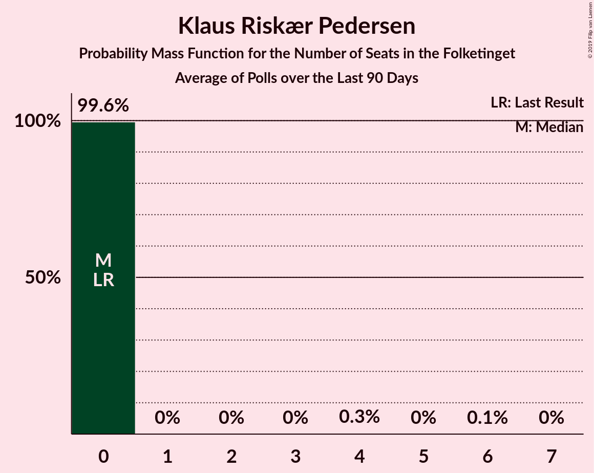

# Klaus Riskær Pedersen

<a href="#voting-intentions">Voting Intentions</a> | <a href="#seats">Seats</a>

## Voting Intentions

Last result: **0.8%** (General Election of 5 June 2019)

### Confidence Intervals

| Period     | Polling firm/Commissioner(s) | Median | 80% Confidence Interval | 90% Confidence Interval | 95% Confidence Interval | 99% Confidence Interval |
|:----------:|:----------------:|:-----------:|:-----------------------:|:-----------------------:|:-----------------------:|:-----------------------:|
| N/A | [Poll Average](average.html) | 0.2% | 0.1–0.4% | 0.1–0.5% | 0.1–0.6% | 0.0–0.7% |
| [9–14 September 2019](2019-09-14-Voxmeter.html) | Voxmeter   Ritzau | 0.8% | N/A | N/A | N/A | N/A |
| [2–9 September 2019](2019-09-09-Voxmeter.html) | Voxmeter   Ritzau | 0.0% | N/A | N/A | N/A | N/A |
| [26 August–1 September 2019](2019-09-01-Voxmeter.html) | Voxmeter   Ritzau | 0.0% | N/A | N/A | N/A | N/A |
| [18–25 August 2019](2019-08-25-Voxmeter.html) | Voxmeter   Ritzau | 0.0% | N/A | N/A | N/A | N/A |
| [12–18 August 2019](2019-08-18-Voxmeter.html) | Voxmeter   Ritzau | 0.1% | N/A | N/A | N/A | N/A |
| [5–10 August 2019](2019-08-10-Voxmeter.html) | Voxmeter   Ritzau | 0.0% | N/A | N/A | N/A | N/A |
| [8 August 2019](2019-08-08-Gallup.html) | Gallup | 0.2% | 0.1–0.4% | 0.1–0.5% | 0.1–0.6% | 0.0–0.7% |
| [24–30 June 2019](2019-06-30-Voxmeter.html) | Voxmeter   Ritzau | 0.0% | N/A | N/A | N/A | N/A |
| [17–23 June 2019](2019-06-23-Voxmeter.html) | Voxmeter   Ritzau | 0.0% | N/A | N/A | N/A | N/A |
| [10–15 June 2019](2019-06-15-Voxmeter.html) | Voxmeter   Ritzau | 0.0% | N/A | N/A | N/A | N/A |

### Probability Mass Function

The following table shows the probability mass function per percentage block of voting intentions for the [poll average](average.html) for Klaus Riskær Pedersen.

| Voting Intentions | Probability | Accumulated | Special Marks |
|:-----------------:|:-----------:|:-----------:|:-------------:|
| 0.0–0.5% | 97% | 100% | Median |
| 0.5–1.5% | 3% | 3% | Last Result |
| 1.5–2.5% | 0% | 0% |  |

## Seats

Last result: **0** seats (General Election of 5 June 2019)

### Confidence Intervals

| Period     | Polling firm/Commissioner(s) | Median | 80% Confidence Interval | 90% Confidence Interval | 95% Confidence Interval | 99% Confidence Interval |
|:----------:|:----------------:|:------:|:-----------------------:|:-----------------------:|:-----------------------:|:-----------------------:|
| N/A | [Poll Average](average.html) | 0 | 0 | 0 | 0 | 0 |
| [9–14 September 2019](2019-09-14-Voxmeter.html) | Voxmeter   Ritzau |  |  |  |  |  |
| [2–9 September 2019](2019-09-09-Voxmeter.html) | Voxmeter   Ritzau |  |  |  |  |  |
| [26 August–1 September 2019](2019-09-01-Voxmeter.html) | Voxmeter   Ritzau |  |  |  |  |  |
| [18–25 August 2019](2019-08-25-Voxmeter.html) | Voxmeter   Ritzau |  |  |  |  |  |
| [12–18 August 2019](2019-08-18-Voxmeter.html) | Voxmeter   Ritzau |  |  |  |  |  |
| [5–10 August 2019](2019-08-10-Voxmeter.html) | Voxmeter   Ritzau |  |  |  |  |  |
| [8 August 2019](2019-08-08-Gallup.html) | Gallup | 0 | 0 | 0 | 0 | 0 |
| [24–30 June 2019](2019-06-30-Voxmeter.html) | Voxmeter   Ritzau |  |  |  |  |  |
| [17–23 June 2019](2019-06-23-Voxmeter.html) | Voxmeter   Ritzau |  |  |  |  |  |
| [10–15 June 2019](2019-06-15-Voxmeter.html) | Voxmeter   Ritzau |  |  |  |  |  |

### Probability Mass Function

The following table shows the probability mass function per seat for the [poll average](average.html) for Klaus Riskær Pedersen.

| Number of Seats | Probability | Accumulated | Special Marks |
|:---------------:|:-----------:|:-----------:|:-------------:|
| 0 | 100% | 100% | Last Result, Median |

