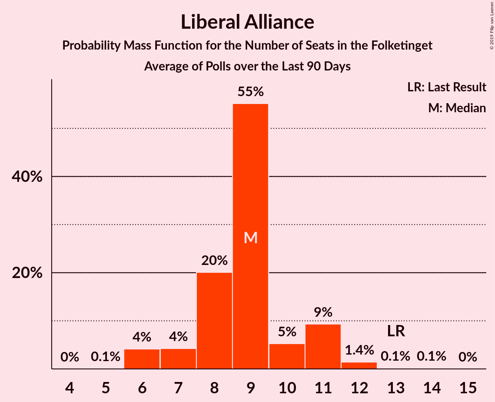

# Liberal Alliance

<a href="#voting-intentions">Voting Intentions</a> | <a href="#seats">Seats</a>

## Voting Intentions

Last result: **7.5%** (General Election of 18 June 2015)

### Confidence Intervals

| Period     | Polling firm/Commissioner(s) | Median | 80% Confidence Interval | 90% Confidence Interval | 95% Confidence Interval | 99% Confidence Interval |
|:----------:|:----------------:|:-----------:|:-----------------------:|:-----------------------:|:-----------------------:|:-----------------------:|
| N/A | [Poll Average](average.html) | 4.8% | 3.2–5.9% | 2.9–6.2% | 2.6–6.5% | 2.3–6.9% |
| [2–6 January 2019](2019-01-06-Voxmeter.html) | Voxmeter   Ritzau | 5.2% | 4.4–6.1% | 4.1–6.4% | 4.0–6.7% | 3.6–7.2% |
| [20 December 2018](2018-12-20-Megafon.html) | Megafon   Politiken and TV 2 | 4.9% | 4.1–5.9% | 3.9–6.2% | 3.7–6.4% | 3.4–6.9% |
| [10–16 December 2018](2018-12-16-Voxmeter.html) | Voxmeter   Ritzau | 5.4% | 4.6–6.4% | 4.3–6.7% | 4.1–6.9% | 3.8–7.4% |
| [13 December 2018](2018-12-13-KantarGallup.html) | Kantar Gallup   Berlingske | 5.4% | 4.8–6.2% | 4.6–6.4% | 4.4–6.6% | 4.1–7.1% |
| [6–11 December 2018](2018-12-11-Norstat.html) | Norstat   Altinget and Jyllands-Posten | 5.2% | 4.4–6.1% | 4.2–6.3% | 4.1–6.6% | 3.7–7.0% |
| [3–8 December 2018](2018-12-08-Voxmeter.html) | Voxmeter   Ritzau | 4.6% | 3.9–5.5% | 3.7–5.8% | 3.5–6.1% | 3.2–6.5% |
| [26 November–2 December 2018](2018-12-02-Voxmeter.html) | Voxmeter   Ritzau | 5.1% | 4.3–6.1% | 4.1–6.4% | 3.9–6.6% | 3.6–7.1% |
| [29 November 2018](2018-11-29-GreensAnalyseinstitut.html) | Greens Analyseinstitut   Børsen | 3.1% | 2.5–3.9% | 2.3–4.1% | 2.2–4.3% | 2.0–4.7% |
| [19–25 November 2018](2018-11-25-Voxmeter.html) | Voxmeter   Ritzau | 5.9% | 5.0–6.9% | 4.8–7.2% | 4.6–7.4% | 4.3–8.0% |
| [12–17 November 2018](2018-11-17-Voxmeter.html) | Voxmeter   Ritzau | 5.7% | 4.8–6.7% | 4.6–7.0% | 4.4–7.2% | 4.0–7.8% |
| [7–15 November 2018](2018-11-15-Epinion.html) | Epinion   DR | 4.1% | 3.5–4.8% | 3.3–5.0% | 3.2–5.2% | 2.9–5.5% |
| [5–10 November 2018](2018-11-10-Voxmeter.html) | Voxmeter   Ritzau | 4.5% | 3.8–5.5% | 3.6–5.7% | 3.4–6.0% | 3.1–6.4% |
| [29 October–5 November 2018](2018-11-05-Voxmeter.html) | Voxmeter   Ritzau | 4.8% | 4.0–5.7% | 3.8–6.0% | 3.6–6.2% | 3.3–6.7% |
| [22–28 October 2018](2018-10-28-Voxmeter.html) | Voxmeter   Ritzau | 5.7% | 4.9–6.8% | 4.6–7.0% | 4.5–7.3% | 4.1–7.8% |
| [22–25 October 2018](2018-10-25-Megafon.html) | Megafon   Politiken and TV 2 | 4.5% | 3.7–5.5% | 3.5–5.8% | 3.3–6.1% | 3.0–6.6% |
| [16–24 October 2018](2018-10-24-Epinion.html) | Epinion   DR | 4.8% | 4.2–5.6% | 4.0–5.8% | 3.8–6.0% | 3.6–6.4% |
| [15–21 October 2018](2018-10-21-Voxmeter.html) | Voxmeter   Ritzau | 6.4% | 5.5–7.5% | 5.3–7.8% | 5.1–8.1% | 4.7–8.6% |
| [8–14 October 2018](2018-10-14-Voxmeter.html) | Voxmeter   Ritzau | 5.7% | 4.9–6.8% | 4.6–7.1% | 4.4–7.3% | 4.1–7.8% |
| [11 October 2018](2018-10-11-KantarGallup.html) | Kantar Gallup   Berlingske | 5.2% | 4.6–6.0% | 4.4–6.2% | 4.2–6.4% | 3.9–6.8% |
| [3–9 October 2018](2018-10-09-Norstat.html) | Norstat   Altinget | 5.1% | 4.4–6.0% | 4.2–6.3% | 4.0–6.5% | 3.7–7.0% |
| [1–6 October 2018](2018-10-06-Voxmeter.html) | Voxmeter   Ritzau | 5.2% | 4.4–6.2% | 4.2–6.5% | 4.0–6.7% | 3.6–7.2% |
| [1 October 2018](2018-10-01-GreensAnalyseinstitut.html) | Greens Analyseinstitut   Børsen | 4.1% | 3.4–4.9% | 3.2–5.2% | 3.1–5.4% | 2.8–5.8% |
| [24–30 September 2018](2018-09-30-Voxmeter.html) | Voxmeter   Ritzau | 4.8% | 4.0–5.7% | 3.8–6.0% | 3.6–6.2% | 3.3–6.7% |
| [27 September 2018](2018-09-27-Megafon.html) | Megafon   Politiken and TV 2 | 4.7% | 3.9–5.8% | 3.7–6.1% | 3.5–6.3% | 3.1–6.9% |
| [17–23 September 2018](2018-09-23-Voxmeter.html) | Voxmeter   Ritzau | 5.1% | 4.3–6.1% | 4.1–6.3% | 3.9–6.6% | 3.6–7.1% |
| [11–18 September 2018](2018-09-18-Epinion.html) | Epinion   DR | 5.4% | 4.7–6.2% | 4.5–6.4% | 4.4–6.7% | 4.1–7.1% |
| [10–16 September 2018](2018-09-16-Voxmeter.html) | Voxmeter   Ritzau | 4.8% | 4.1–5.8% | 3.8–6.1% | 3.7–6.3% | 3.3–6.8% |
| [6–11 September 2018](2018-09-11-Norstat.html) | Norstat   Altinget and Jyllands-Posten | 4.1% | 3.5–5.0% | 3.3–5.2% | 3.1–5.4% | 2.9–5.8% |
| [3–9 September 2018](2018-09-09-Voxmeter.html) | Voxmeter   Ritzau | 5.9% | 5.1–7.0% | 4.9–7.3% | 4.7–7.6% | 4.3–8.1% |
| [27 August–2 September 2018](2018-09-02-Voxmeter.html) | Voxmeter   Ritzau | 5.2% | 4.4–6.2% | 4.2–6.5% | 4.0–6.7% | 3.7–7.3% |
| [27–30 August 2018](2018-08-30-Megafon.html) | Megafon   Politiken and TV 2 | 4.2% | 3.5–5.1% | 3.3–5.4% | 3.1–5.6% | 2.8–6.1% |
| [20–26 August 2018](2018-08-26-Voxmeter.html) | Voxmeter   Ritzau | 5.1% | 4.3–6.1% | 4.1–6.4% | 3.9–6.6% | 3.6–7.1% |
| [13–19 August 2018](2018-08-19-Voxmeter.html) | Voxmeter   Ritzau | 4.5% | 3.7–5.4% | 3.5–5.7% | 3.4–5.9% | 3.0–6.4% |
| [10–17 August 2018](2018-08-17-Epinion.html) | Epinion   DR | 4.5% | 3.9–5.3% | 3.7–5.5% | 3.6–5.7% | 3.3–6.1% |
| [6–11 August 2018](2018-08-11-Voxmeter.html) | Voxmeter   Ritzau | 5.2% | 4.4–6.2% | 4.2–6.5% | 4.0–6.7% | 3.7–7.2% |
| [30 July–5 August 2018](2018-08-05-Voxmeter.html) | Voxmeter   Ritzau | 4.8% | 4.0–5.8% | 3.8–6.0% | 3.6–6.3% | 3.3–6.8% |
| [25 June–1 July 2018](2018-07-01-Voxmeter.html) | Voxmeter   Ritzau | 5.1% | 4.4–6.1% | 4.1–6.4% | 3.9–6.7% | 3.6–7.2% |
| [25–28 June 2018](2018-06-28-Megafon.html) | Megafon   Politiken and TV 2 | 5.2% | 4.4–6.2% | 4.2–6.5% | 4.0–6.7% | 3.6–7.2% |
| [18–24 June 2018](2018-06-24-Voxmeter.html) | Voxmeter   Ritzau | 4.6% | 3.8–5.5% | 3.6–5.8% | 3.4–6.0% | 3.1–6.5% |
| [15–23 June 2018](2018-06-23-Epinion.html) | Epinion   DR | 5.6% | 4.9–6.4% | 4.8–6.6% | 4.6–6.8% | 4.3–7.2% |
| [11–16 June 2018](2018-06-16-Voxmeter.html) | Voxmeter   Ritzau | 4.5% | 3.7–5.4% | 3.6–5.7% | 3.4–5.9% | 3.0–6.4% |
| [4–10 June 2018](2018-06-10-Voxmeter.html) | Voxmeter   Ritzau | 4.0% | 3.3–4.9% | 3.1–5.1% | 2.9–5.4% | 2.7–5.8% |
| [28 May–3 June 2018](2018-06-03-Voxmeter.html) | Voxmeter   Ritzau | 3.6% | 2.9–4.5% | 2.8–4.7% | 2.6–4.9% | 2.3–5.4% |
| [21–27 May 2018](2018-05-27-Voxmeter.html) | Voxmeter   Ritzau | 4.2% | 3.5–5.1% | 3.3–5.4% | 3.1–5.6% | 2.8–6.1% |
| [17–23 May 2018](2018-05-23-Norstat.html) | Norstat   Altinget | 4.5% | 3.8–5.3% | 3.6–5.6% | 3.4–5.8% | 3.1–6.2% |
| [14–19 May 2018](2018-05-19-Voxmeter.html) | Voxmeter   Ritzau | 5.2% | 4.4–6.2% | 4.2–6.5% | 4.0–6.8% | 3.7–7.3% |
| [7–13 May 2018](2018-05-13-Voxmeter.html) | Voxmeter   Ritzau | 5.5% | 4.7–6.5% | 4.4–6.8% | 4.3–7.0% | 3.9–7.6% |
| [30 April–6 May 2018](2018-05-06-Voxmeter.html) | Voxmeter   Ritzau | 6.2% | 5.3–7.3% | 5.1–7.6% | 4.8–7.9% | 4.5–8.4% |
| [23–29 April 2018](2018-04-29-Voxmeter.html) | Voxmeter   Ritzau | 5.8% | 5.0–6.8% | 4.7–7.1% | 4.5–7.4% | 4.1–7.9% |
| [16–22 April 2018](2018-04-22-Voxmeter.html) | Voxmeter   Ritzau | 6.2% | 5.3–7.2% | 5.0–7.5% | 4.8–7.8% | 4.5–8.3% |
| [8–15 April 2018](2018-04-15-Voxmeter.html) | Voxmeter   Ritzau | 5.8% | 4.9–6.8% | 4.7–7.1% | 4.5–7.4% | 4.1–7.9% |
| [2–7 April 2018](2018-04-07-Voxmeter.html) | Voxmeter   Ritzau | 4.7% | 3.9–5.6% | 3.7–5.9% | 3.5–6.1% | 3.2–6.6% |
| [26–31 March 2018](2018-03-31-Voxmeter.html) | Voxmeter   Ritzau | 4.9% | 4.2–5.9% | 3.9–6.2% | 3.8–6.4% | 3.4–6.9% |
| [19–25 March 2018](2018-03-25-Voxmeter.html) | Voxmeter   Ritzau | 5.6% | 4.8–6.6% | 4.5–6.9% | 4.3–7.2% | 4.0–7.7% |
| [14–20 March 2018](2018-03-20-Norstat.html) | Norstat   Altinget | 4.3% | 3.7–5.1% | 3.6–5.3% | 3.4–5.5% | 3.1–5.9% |
| [14–20 March 2018](2018-03-20-Epinion.html) | Epinion   DR | 3.9% | 3.4–4.6% | 3.2–4.8% | 3.1–5.0% | 2.9–5.3% |
| [12–18 March 2018](2018-03-18-Voxmeter.html) | Voxmeter   Ritzau | 5.1% | 4.3–6.1% | 4.1–6.3% | 3.9–6.6% | 3.6–7.1% |
| [5–11 March 2018](2018-03-11-Voxmeter.html) | Voxmeter   Ritzau | 5.6% | 4.7–6.6% | 4.5–6.9% | 4.3–7.1% | 4.0–7.7% |
| [19–25 February 2018](2018-02-25-Voxmeter.html) | Voxmeter   Ritzau | 5.8% | 5.0–6.8% | 4.7–7.1% | 4.5–7.4% | 4.1–7.9% |
| [19–22 February 2018](2018-02-22-Megafon.html) | Megafon   Politiken and TV 2 | 4.1% | 3.4–5.0% | 3.2–5.2% | 3.0–5.5% | 2.7–5.9% |
| [12–18 February 2018](2018-02-18-Voxmeter.html) | Voxmeter   Ritzau | 4.8% | 4.0–5.7% | 3.8–6.0% | 3.6–6.3% | 3.3–6.8% |
| [8–14 February 2018](2018-02-14-Epinion.html) | Epinion   DR | 5.3% | 4.6–6.1% | 4.4–6.3% | 4.3–6.5% | 4.0–6.9% |
| [5–10 February 2018](2018-02-10-Voxmeter.html) | Voxmeter   Ritzau | 4.3% | 3.6–5.3% | 3.4–5.5% | 3.3–5.8% | 2.9–6.2% |
| [2–8 February 2018](2018-02-08-KantarGallup.html) | Kantar Gallup   Berlingske | 5.2% | 4.5–6.0% | 4.3–6.2% | 4.2–6.4% | 3.9–6.9% |
| [2–8 February 2018](2018-02-08-GreensAnalyseinstitut.html) | Greens Analyseinstitut   Børsen | 5.2% | 4.4–6.1% | 4.2–6.4% | 4.0–6.7% | 3.7–7.1% |
| [29 January–4 February 2018](2018-02-04-Voxmeter.html) | Voxmeter   Ritzau | 4.2% | 3.5–5.1% | 3.3–5.4% | 3.1–5.6% | 2.8–6.1% |
| [24–29 January 2018](2018-01-29-Norstat.html) | Norstat   Altinget | 4.8% | 4.1–5.6% | 4.0–5.8% | 3.8–6.0% | 3.5–6.4% |
| [22–28 January 2018](2018-01-28-Voxmeter.html) | Voxmeter   Ritzau | 4.6% | 3.9–5.6% | 3.7–5.9% | 3.5–6.1% | 3.2–6.6% |
| [22–25 January 2018](2018-01-25-Megafon.html) | Megafon   Politiken and TV 2 | 4.8% | 4.1–5.8% | 3.9–6.1% | 3.7–6.3% | 3.3–6.8% |
| [19–25 January 2018](2018-01-25-Epinion.html) | Epinion   DR | 5.2% | 4.6–6.0% | 4.4–6.2% | 4.3–6.4% | 4.0–6.7% |
| [19–22 January 2018](2018-01-22-YouGov.html) | YouGov | 4.7% | 4.1–5.5% | 3.9–5.7% | 3.7–5.9% | 3.5–6.3% |
| [15–21 January 2018](2018-01-21-Voxmeter.html) | Voxmeter   Ritzau | 5.1% | 4.3–6.1% | 4.1–6.4% | 3.9–6.6% | 3.6–7.1% |
| [8–14 January 2018](2018-01-14-Voxmeter.html) | Voxmeter   Ritzau | 5.7% | 4.9–6.8% | 4.6–7.0% | 4.4–7.3% | 4.1–7.8% |
| [5–11 January 2018](2018-01-11-KantarGallup.html) | Kantar Gallup   Berlingske | 3.4% | 2.9–4.1% | 2.7–4.3% | 2.6–4.4% | 2.4–4.8% |
| [5–7 January 2018](2018-01-07-YouGov.html) | YouGov   Metroxpress | 3.8% | 3.2–4.6% | 3.1–4.8% | 2.9–5.0% | 2.7–5.3% |
| [2–7 January 2018](2018-01-07-Voxmeter.html) | Voxmeter   Ritzau | 5.1% | 4.3–6.1% | 4.1–6.4% | 3.9–6.6% | 3.6–7.1% |

### Probability Mass Function

The following table shows the probability mass function per percentage block of voting intentions for the [poll average](average.html) for Liberal Alliance.

| Voting Intentions | Probability | Accumulated | Special Marks |
|:-----------------:|:-----------:|:-----------:|:-------------:|
| 0.5–1.5% | 0% | 100% |  |
| 1.5–2.5% | 2% | 100% |  |
| 2.5–3.5% | 13% | 98% |  |
| 3.5–4.5% | 25% | 85% |  |
| 4.5–5.5% | 39% | 60% | Median |
| 5.5–6.5% | 19% | 21% |  |
| 6.5–7.5% | 2% | 2% |  |
| 7.5–8.5% | 0% | 0% | Last Result |
| 8.5–9.5% | 0% | 0% |  |

## Seats

Last result: **13** seats (General Election of 18 June 2015)

### Confidence Intervals

| Period     | Polling firm/Commissioner(s) | Median | 80% Confidence Interval | 90% Confidence Interval | 95% Confidence Interval | 99% Confidence Interval |
|:----------:|:----------------:|:------:|:-----------------------:|:-----------------------:|:-----------------------:|:-----------------------:|
| N/A | [Poll Average](average.html) | 8 | 5–11 | 5–11 | 4–12 | 4–12 |
| [2–6 January 2019](2019-01-06-Voxmeter.html) | Voxmeter   Ritzau | 9 | 7–11 | 7–11 | 7–12 | 6–13 |
| [20 December 2018](2018-12-20-Megafon.html) | Megafon   Politiken and TV 2 | 7 | 7–10 | 7–11 | 7–12 | 6–12 |
| [10–16 December 2018](2018-12-16-Voxmeter.html) | Voxmeter   Ritzau | 9 | 9–11 | 9–11 | 8–11 | 7–12 |
| [13 December 2018](2018-12-13-KantarGallup.html) | Kantar Gallup   Berlingske | 10 | 8–11 | 8–11 | 7–12 | 7–13 |
| [6–11 December 2018](2018-12-11-Norstat.html) | Norstat   Altinget and Jyllands-Posten | 10 | 8–11 | 8–11 | 7–12 | 7–12 |
| [3–8 December 2018](2018-12-08-Voxmeter.html) | Voxmeter   Ritzau | 8 | 7–9 | 7–9 | 6–10 | 6–13 |
| [26 November–2 December 2018](2018-12-02-Voxmeter.html) | Voxmeter   Ritzau | 8 | 8–10 | 7–10 | 7–11 | 7–13 |
| [29 November 2018](2018-11-29-GreensAnalyseinstitut.html) | Greens Analyseinstitut   Børsen | 5 | 4–7 | 4–7 | 4–7 | 0–8 |
| [19–25 November 2018](2018-11-25-Voxmeter.html) | Voxmeter   Ritzau | 10 | 9–12 | 9–12 | 8–13 | 7–14 |
| [12–17 November 2018](2018-11-17-Voxmeter.html) | Voxmeter   Ritzau | 9 | 8–10 | 8–11 | 7–12 | 7–13 |
| [7–15 November 2018](2018-11-15-Epinion.html) | Epinion   DR | 8 | 7–8 | 6–8 | 6–9 | 5–9 |
| [5–10 November 2018](2018-11-10-Voxmeter.html) | Voxmeter   Ritzau | 7 | 7–10 | 7–10 | 7–11 | 6–12 |
| [29 October–5 November 2018](2018-11-05-Voxmeter.html) | Voxmeter   Ritzau | 9 | 7–11 | 7–11 | 6–11 | 5–12 |
| [22–28 October 2018](2018-10-28-Voxmeter.html) | Voxmeter   Ritzau | 12 | 8–13 | 8–13 | 8–13 | 8–15 |
| [22–25 October 2018](2018-10-25-Megafon.html) | Megafon   Politiken and TV 2 | 8 | 7–9 | 6–10 | 6–10 | 5–12 |
| [16–24 October 2018](2018-10-24-Epinion.html) | Epinion   DR | 10 | 10 | 9–10 | 7–10 | 6–10 |
| [15–21 October 2018](2018-10-21-Voxmeter.html) | Voxmeter   Ritzau | 11 | 11–13 | 10–13 | 10–13 | 9–14 |
| [8–14 October 2018](2018-10-14-Voxmeter.html) | Voxmeter   Ritzau | 10 | 9–12 | 8–13 | 8–13 | 8–15 |
| [11 October 2018](2018-10-11-KantarGallup.html) | Kantar Gallup   Berlingske | 12 | 8–12 | 8–12 | 8–12 | 8–12 |
| [3–9 October 2018](2018-10-09-Norstat.html) | Norstat   Altinget | 10 | 8–11 | 8–11 | 8–11 | 6–11 |
| [1–6 October 2018](2018-10-06-Voxmeter.html) | Voxmeter   Ritzau | 11 | 8–12 | 8–13 | 6–13 | 6–13 |
| [1 October 2018](2018-10-01-GreensAnalyseinstitut.html) | Greens Analyseinstitut   Børsen | 7 | 7–8 | 6–9 | 6–9 | 5–10 |
| [24–30 September 2018](2018-09-30-Voxmeter.html) | Voxmeter   Ritzau | 9 | 7–10 | 7–10 | 7–11 | 6–14 |
| [27 September 2018](2018-09-27-Megafon.html) | Megafon   Politiken and TV 2 | 8 | 7–10 | 6–10 | 6–11 | 6–12 |
| [17–23 September 2018](2018-09-23-Voxmeter.html) | Voxmeter   Ritzau | 10 | 9–11 | 8–12 | 8–12 | 7–12 |
| [11–18 September 2018](2018-09-18-Epinion.html) | Epinion   DR | 11 | 9–11 | 9–11 | 8–11 | 7–12 |
| [10–16 September 2018](2018-09-16-Voxmeter.html) | Voxmeter   Ritzau | 8 | 7–10 | 7–10 | 7–11 | 6–12 |
| [6–11 September 2018](2018-09-11-Norstat.html) | Norstat   Altinget and Jyllands-Posten | 7 | 6–9 | 6–9 | 6–9 | 5–10 |
| [3–9 September 2018](2018-09-09-Voxmeter.html) | Voxmeter   Ritzau | 10 | 8–13 | 7–14 | 7–15 | 7–15 |
| [27 August–2 September 2018](2018-09-02-Voxmeter.html) | Voxmeter   Ritzau | 9 | 8–11 | 8–11 | 7–12 | 6–13 |
| [27–30 August 2018](2018-08-30-Megafon.html) | Megafon   Politiken and TV 2 | 7 | 7–8 | 6–10 | 6–10 | 5–11 |
| [20–26 August 2018](2018-08-26-Voxmeter.html) | Voxmeter   Ritzau | 8 | 7–8 | 7–11 | 6–12 | 6–12 |
| [13–19 August 2018](2018-08-19-Voxmeter.html) | Voxmeter   Ritzau | 8 | 8–9 | 7–10 | 7–12 | 6–12 |
| [10–17 August 2018](2018-08-17-Epinion.html) | Epinion   DR | 9 | 7–9 | 7–9 | 7–9 | 7–9 |
| [6–11 August 2018](2018-08-11-Voxmeter.html) | Voxmeter   Ritzau | 11 | 8–11 | 8–12 | 7–12 | 6–12 |
| [30 July–5 August 2018](2018-08-05-Voxmeter.html) | Voxmeter   Ritzau | 9 | 7–11 | 7–11 | 7–12 | 6–13 |
| [25 June–1 July 2018](2018-07-01-Voxmeter.html) | Voxmeter   Ritzau | 11 | 8–11 | 7–11 | 7–11 | 7–12 |
| [25–28 June 2018](2018-06-28-Megafon.html) | Megafon   Politiken and TV 2 | 9 | 7–12 | 7–12 | 7–12 | 7–12 |
| [18–24 June 2018](2018-06-24-Voxmeter.html) | Voxmeter   Ritzau | 9 | 6–10 | 6–10 | 6–11 | 6–12 |
| [15–23 June 2018](2018-06-23-Epinion.html) | Epinion   DR | 9 | 9–11 | 8–12 | 8–12 | 8–13 |
| [11–16 June 2018](2018-06-16-Voxmeter.html) | Voxmeter   Ritzau | 7 | 6–8 | 6–10 | 6–11 | 5–11 |
| [4–10 June 2018](2018-06-10-Voxmeter.html) | Voxmeter   Ritzau | 7 | 6–8 | 5–9 | 5–9 | 4–10 |
| [28 May–3 June 2018](2018-06-03-Voxmeter.html) | Voxmeter   Ritzau | 7 | 6–8 | 5–9 | 5–9 | 5–9 |
| [21–27 May 2018](2018-05-27-Voxmeter.html) | Voxmeter   Ritzau | 8 | 7–8 | 7–8 | 7–9 | 5–10 |
| [17–23 May 2018](2018-05-23-Norstat.html) | Norstat   Altinget | 9 | 8–9 | 7–9 | 6–10 | 5–11 |
| [14–19 May 2018](2018-05-19-Voxmeter.html) | Voxmeter   Ritzau | 9 | 8–11 | 7–11 | 7–11 | 7–13 |
| [7–13 May 2018](2018-05-13-Voxmeter.html) | Voxmeter   Ritzau | 9 | 7–11 | 7–13 | 7–13 | 7–14 |
| [30 April–6 May 2018](2018-05-06-Voxmeter.html) | Voxmeter   Ritzau | 10 | 10–13 | 10–13 | 9–14 | 8–15 |
| [23–29 April 2018](2018-04-29-Voxmeter.html) | Voxmeter   Ritzau | 11 | 9–12 | 9–12 | 9–12 | 8–13 |
| [16–22 April 2018](2018-04-22-Voxmeter.html) | Voxmeter   Ritzau | 11 | 10–13 | 9–13 | 9–13 | 8–14 |
| [8–15 April 2018](2018-04-15-Voxmeter.html) | Voxmeter   Ritzau | 9 | 9–11 | 9–12 | 8–13 | 6–14 |
| [2–7 April 2018](2018-04-07-Voxmeter.html) | Voxmeter   Ritzau | 9 | 6–11 | 6–11 | 6–11 | 6–11 |
| [26–31 March 2018](2018-03-31-Voxmeter.html) | Voxmeter   Ritzau | 8 | 7–10 | 7–12 | 7–12 | 6–13 |
| [19–25 March 2018](2018-03-25-Voxmeter.html) | Voxmeter   Ritzau | 9 | 9–12 | 9–12 | 8–12 | 7–14 |
| [14–20 March 2018](2018-03-20-Norstat.html) | Norstat   Altinget | 8 | 7–9 | 7–9 | 6–9 | 6–10 |
| [14–20 March 2018](2018-03-20-Epinion.html) | Epinion   DR | 8 | 6–8 | 6–8 | 6–8 | 6–8 |
| [12–18 March 2018](2018-03-18-Voxmeter.html) | Voxmeter   Ritzau | 10 | 8–10 | 8–11 | 8–11 | 6–12 |
| [5–11 March 2018](2018-03-11-Voxmeter.html) | Voxmeter   Ritzau | 10 | 9–11 | 8–12 | 8–12 | 8–14 |
| [19–25 February 2018](2018-02-25-Voxmeter.html) | Voxmeter   Ritzau | 12 | 11–12 | 10–12 | 9–12 | 8–13 |
| [19–22 February 2018](2018-02-22-Megafon.html) | Megafon   Politiken and TV 2 | 8 | 6–11 | 6–11 | 5–11 | 5–11 |
| [12–18 February 2018](2018-02-18-Voxmeter.html) | Voxmeter   Ritzau | 9 | 7–11 | 7–11 | 6–11 | 6–12 |
| [8–14 February 2018](2018-02-14-Epinion.html) | Epinion   DR | 10 | 8–11 | 8–11 | 8–11 | 8–12 |
| [5–10 February 2018](2018-02-10-Voxmeter.html) | Voxmeter   Ritzau | 8 | 7–9 | 6–10 | 6–10 | 5–11 |
| [2–8 February 2018](2018-02-08-KantarGallup.html) | Kantar Gallup   Berlingske | 10 | 8–11 | 8–11 | 7–12 | 6–12 |
| [2–8 February 2018](2018-02-08-GreensAnalyseinstitut.html) | Greens Analyseinstitut   Børsen | 8 | 8–11 | 8–11 | 8–11 | 7–13 |
| [29 January–4 February 2018](2018-02-04-Voxmeter.html) | Voxmeter   Ritzau | 7 | 6–9 | 6–10 | 6–10 | 5–10 |
| [24–29 January 2018](2018-01-29-Norstat.html) | Norstat   Altinget | 9 | 7–10 | 7–10 | 7–11 | 6–11 |
| [22–28 January 2018](2018-01-28-Voxmeter.html) | Voxmeter   Ritzau | 7 | 7–9 | 7–10 | 6–10 | 5–11 |
| [22–25 January 2018](2018-01-25-Megafon.html) | Megafon   Politiken and TV 2 | 9 | 7–10 | 7–11 | 7–11 | 6–12 |
| [19–25 January 2018](2018-01-25-Epinion.html) | Epinion   DR | 8 | 8–9 | 8–9 | 8–10 | 8–11 |
| [19–22 January 2018](2018-01-22-YouGov.html) | YouGov | 8 | 7–9 | 7–10 | 7–10 | 6–11 |
| [15–21 January 2018](2018-01-21-Voxmeter.html) | Voxmeter   Ritzau | 10 | 10–11 | 8–12 | 7–12 | 6–13 |
| [8–14 January 2018](2018-01-14-Voxmeter.html) | Voxmeter   Ritzau | 9 | 8–11 | 8–12 | 8–12 | 7–13 |
| [5–11 January 2018](2018-01-11-KantarGallup.html) | Kantar Gallup   Berlingske | 6 | 6 | 5–6 | 5–7 | 5–8 |
| [5–7 January 2018](2018-01-07-YouGov.html) | YouGov   Metroxpress | 9 | 5–9 | 5–9 | 5–9 | 5–10 |
| [2–7 January 2018](2018-01-07-Voxmeter.html) | Voxmeter   Ritzau | 8 | 7–13 | 7–13 | 7–13 | 7–13 |

### Probability Mass Function

The following table shows the probability mass function per seat for the [poll average](average.html) for Liberal Alliance.

| Number of Seats | Probability | Accumulated | Special Marks |
|:---------------:|:-----------:|:-----------:|:-------------:|
| 0 | 0.1% | 100% |  |
| 1 | 0% | 99.9% |  |
| 2 | 0% | 99.9% |  |
| 3 | 0% | 99.9% |  |
| 4 | 4% | 99.9% |  |
| 5 | 6% | 96% |  |
| 6 | 5% | 90% |  |
| 7 | 16% | 85% |  |
| 8 | 22% | 69% | Median |
| 9 | 19% | 47% |  |
| 10 | 14% | 27% |  |
| 11 | 10% | 13% |  |
| 12 | 2% | 3% |  |
| 13 | 0.4% | 0.4% | Last Result |
| 14 | 0% | 0% |  |

