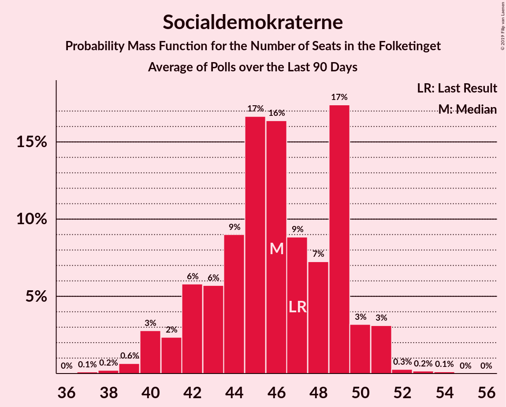

# Socialdemokraterne

<a href="#voting-intentions">Voting Intentions</a> | <a href="#seats">Seats</a>

## Voting Intentions

Last result: **25.9%** (General Election of 5 June 2019)

### Confidence Intervals

| Period     | Polling firm/Commissioner(s) | Median | 80% Confidence Interval | 90% Confidence Interval | 95% Confidence Interval | 99% Confidence Interval |
|:----------:|:----------------:|:-----------:|:-----------------------:|:-----------------------:|:-----------------------:|:-----------------------:|
| N/A | [Poll Average](average.html) | 29.8% | 24.6–35.5% | 23.8–36.3% | 23.2–37.0% | 22.3–38.2% |
| [30 March–11 April 2020](2020-04-11-Voxmeter.html) | Voxmeter   Ritzau | 35.1% | 33.2–37.0% | 32.7–37.5% | 32.3–38.0% | 31.4–38.9% |
| [23 March–5 April 2020](2020-04-05-Voxmeter.html) | Voxmeter   Ritzau | 34.0% | 32.2–35.9% | 31.7–36.5% | 31.2–36.9% | 30.4–37.8% |
| [27 March–3 April 2020](2020-04-03-Gallup.html) | Gallup | 31.9% | 30.4–33.5% | 30.0–33.9% | 29.6–34.3% | 28.9–35.1% |
| [23–29 March 2020](2020-03-29-Voxmeter.html) | Voxmeter   Ritzau | 31.5% | 29.7–33.3% | 29.2–33.9% | 28.7–34.3% | 27.9–35.2% |
| [16–22 March 2020](2020-03-22-Voxmeter.html) | Voxmeter   Ritzau | 28.2% | 26.5–30.1% | 26.0–30.6% | 25.6–31.0% | 24.8–31.9% |
| [9–15 March 2020](2020-03-15-Voxmeter.html) | Voxmeter   Ritzau | 27.2% | 25.5–29.0% | 25.0–29.5% | 24.6–30.0% | 23.8–30.9% |
| [2–7 March 2020](2020-03-07-Voxmeter.html) | Voxmeter   Ritzau | 27.5% | 25.8–29.3% | 25.3–29.8% | 24.9–30.3% | 24.1–31.2% |
| [25 February–2 March 2020](2020-03-02-Epinion.html) | Epinion   DR | 27.7% | 26.3–29.2% | 25.9–29.6% | 25.6–30.0% | 24.9–30.7% |
| [24 February–1 March 2020](2020-03-01-Voxmeter.html) | Voxmeter   Ritzau | 26.8% | 25.1–28.6% | 24.6–29.1% | 24.2–29.6% | 23.4–30.5% |
| [24–27 February 2020](2020-02-27-Megafon.html) | Megafon   TV2 | 24.9% | 23.2–26.6% | 22.8–27.1% | 22.4–27.6% | 21.6–28.4% |
| [17–23 February 2020](2020-02-23-Voxmeter.html) | Voxmeter   Ritzau | 27.5% | 25.7–29.3% | 25.3–29.8% | 24.8–30.2% | 24.0–31.1% |
| [10–16 February 2020](2020-02-16-Voxmeter.html) | Voxmeter   Ritzau | 27.8% | 26.0–29.7% | 25.6–30.2% | 25.1–30.7% | 24.3–31.6% |
| [7–13 February 2020](2020-02-13-Gallup.html) | Gallup | 26.4% | 25.0–27.9% | 24.6–28.3% | 24.2–28.7% | 23.6–29.4% |
| [3–8 February 2020](2020-02-08-Voxmeter.html) | Voxmeter   Ritzau | 28.4% | 26.7–30.3% | 26.2–30.8% | 25.8–31.2% | 25.0–32.1% |
| [27 January–2 February 2020](2020-02-02-Voxmeter.html) | Voxmeter   Ritzau | 27.2% | 25.5–29.1% | 25.0–29.6% | 24.6–30.0% | 23.8–30.9% |
| [20–26 January 2020](2020-01-26-Voxmeter.html) | Voxmeter   Ritzau | 27.8% | 26.1–29.7% | 25.6–30.2% | 25.2–30.7% | 24.4–31.6% |
| [13–19 January 2020](2020-01-19-Voxmeter.html) | Voxmeter   Ritzau | 27.2% | 25.5–29.0% | 25.0–29.5% | 24.6–30.0% | 23.8–30.9% |
| [6–11 January 2020](2020-01-11-Voxmeter.html) | Voxmeter   Ritzau | 27.0% | 25.3–28.8% | 24.8–29.3% | 24.4–29.8% | 23.5–30.7% |
| [30 December 2019–5 January 2020](2020-01-05-Voxmeter.html) | Voxmeter   Ritzau | 26.0% | 24.3–27.9% | 23.9–28.4% | 23.5–28.8% | 22.6–29.7% |
| [16–22 December 2019](2019-12-22-Voxmeter.html) | Voxmeter   Ritzau | 25.5% | 23.8–27.3% | 23.3–27.8% | 22.9–28.2% | 22.1–29.1% |
| [9–15 December 2019](2019-12-15-Voxmeter.html) | Voxmeter   Ritzau | 26.4% | 24.6–28.2% | 24.2–28.7% | 23.7–29.1% | 23.0–30.0% |
| [12 December 2019](2019-12-12-Gallup.html) | Gallup | 25.9% | 24.5–27.5% | 24.1–27.9% | 23.8–28.2% | 23.1–29.0% |
| [2–8 December 2019](2019-12-08-Voxmeter.html) | Voxmeter   Ritzau | 25.9% | 24.2–27.8% | 23.7–28.3% | 23.3–28.8% | 22.5–29.7% |
| [25 November–2 December 2019](2019-12-02-Voxmeter.html) | Voxmeter   Ritzau | 26.6% | 24.9–28.4% | 24.4–28.9% | 24.0–29.4% | 23.2–30.2% |
| [26–28 November 2019](2019-11-28-Megafon.html) | Megafon   Politiken and TV 2 | 24.0% | 22.3–25.8% | 21.9–26.3% | 21.5–26.7% | 20.7–27.6% |
| [18–25 November 2019](2019-11-25-Voxmeter.html) | Voxmeter   Ritzau | 26.9% | 25.2–28.8% | 24.7–29.3% | 24.3–29.8% | 23.5–30.7% |
| [20 November 2019](2019-11-20-Epinion.html) | Epinion   DR | 25.7% | 24.4–27.2% | 24.0–27.6% | 23.6–27.9% | 23.0–28.6% |
| [11–18 November 2019](2019-11-18-Voxmeter.html) | Voxmeter   Ritzau | 27.5% | 25.8–29.3% | 25.3–29.9% | 24.8–30.3% | 24.0–31.2% |
| [4–10 November 2019](2019-11-10-Voxmeter.html) | Voxmeter   Ritzau | 26.9% | 25.2–28.7% | 24.7–29.2% | 24.3–29.7% | 23.5–30.6% |
| [8 November 2019](2019-11-08-Gallup.html) | Gallup | 26.0% | 24.6–27.5% | 24.2–27.9% | 23.8–28.2% | 23.2–29.0% |
| [27 October–4 November 2019](2019-11-04-Voxmeter.html) | Voxmeter   Ritzau | 27.2% | 25.5–29.1% | 25.0–29.6% | 24.6–30.0% | 23.8–30.9% |
| [21–27 October 2019](2019-10-27-Voxmeter.html) | Voxmeter   Ritzau | 26.9% | 25.2–28.7% | 24.7–29.2% | 24.3–29.7% | 23.5–30.6% |
| [23 October 2019](2019-10-23-Epinion.html) | Epinion   DR | 26.1% | 24.7–27.6% | 24.3–28.0% | 24.0–28.4% | 23.3–29.1% |
| [14–20 October 2019](2019-10-20-Voxmeter.html) | Voxmeter   Ritzau | 27.6% | 25.8–29.4% | 25.3–29.9% | 24.9–30.4% | 24.1–31.2% |
| [7–12 October 2019](2019-10-12-Voxmeter.html) | Voxmeter   Ritzau | 26.9% | 25.2–28.8% | 24.7–29.3% | 24.3–29.7% | 23.5–30.6% |
| [30 September–7 October 2019](2019-10-07-Voxmeter.html) | Voxmeter   2019-10-07 | 28.0% | 26.3–29.8% | 25.8–30.3% | 25.4–30.8% | 24.6–31.7% |
| [23–29 September 2019](2019-09-29-Voxmeter.html) | Voxmeter   Ritzau | 27.2% | N/A | N/A | N/A | N/A |
| [29 September 2019](2019-09-29-Gallup.html) | Gallup | 26.1% | 24.7–27.6% | 24.3–28.1% | 24.0–28.4% | 23.3–29.2% |
| [16–22 September 2019](2019-09-22-Voxmeter.html) | Voxmeter   Ritzau | 27.7% | 25.9–29.5% | 25.5–30.0% | 25.0–30.5% | 24.2–31.4% |
| [19 September 2019](2019-09-19-Norstat.html) | Norstat   Altinget and Jyllands-Posten | 26.2% | 24.5–28.0% | 24.0–28.6% | 23.6–29.0% | 22.8–29.9% |
| [9–15 September 2019](2019-09-15-Voxmeter.html) | Voxmeter   Ritzau | 27.7% | N/A | N/A | N/A | N/A |
| [12 September 2019](2019-09-12-Gallup.html) | Gallup | 25.6% | 24.2–27.0% | 23.9–27.4% | 23.5–27.7% | 22.9–28.4% |
| [9 September 2019](2019-09-09-YouGov.html) | YouGov | 27.1% | 25.3–28.9% | 24.8–29.5% | 24.4–29.9% | 23.6–30.8% |
| [2–9 September 2019](2019-09-09-Voxmeter.html) | Voxmeter   Ritzau | 27.3% | 25.6–29.2% | 25.1–29.7% | 24.7–30.1% | 23.9–31.0% |
| [26 August–1 September 2019](2019-09-01-Voxmeter.html) | Voxmeter   Ritzau | 26.7% | 25.0–28.5% | 24.5–29.0% | 24.1–29.4% | 23.3–30.3% |
| [18–26 August 2019](2019-08-26-Voxmeter.html) | Voxmeter   Ritzau | 27.3% | N/A | N/A | N/A | N/A |
| [16–20 August 2019](2019-08-20-Megafon.html) | Megafon   Politiken and TV 2 | 27.1% | N/A | N/A | N/A | N/A |
| [12–18 August 2019](2019-08-18-Voxmeter.html) | Voxmeter   Ritzau | 26.2% | 24.6–28.0% | 24.1–28.5% | 23.7–29.0% | 22.9–29.9% |
| [5–10 August 2019](2019-08-10-Voxmeter.html) | Voxmeter   Ritzau | 25.7% | 24.0–27.6% | 23.5–28.1% | 23.1–28.5% | 22.3–29.4% |
| [8 August 2019](2019-08-08-Gallup.html) | Gallup | 25.5% | 24.1–26.9% | 23.7–27.4% | 23.4–27.7% | 22.7–28.4% |
| [24–30 June 2019](2019-06-30-Voxmeter.html) | Voxmeter   Ritzau | 25.0% | 23.4–26.8% | 22.9–27.3% | 22.5–27.7% | 21.7–28.5% |
| [17–23 June 2019](2019-06-23-Voxmeter.html) | Voxmeter   Ritzau | 25.4% | 23.7–27.2% | 23.2–27.7% | 22.8–28.1% | 22.0–29.0% |
| [10–15 June 2019](2019-06-15-Voxmeter.html) | Voxmeter   Ritzau | 25.2% | 23.5–27.0% | 23.0–27.6% | 22.6–28.0% | 21.8–28.9% |

### Probability Mass Function

The following table shows the probability mass function per percentage block of voting intentions for the [poll average](average.html) for Socialdemokraterne.

| Voting Intentions | Probability | Accumulated | Special Marks |
|:-----------------:|:-----------:|:-----------:|:-------------:|
| 19.5–20.5% | 0% | 100% |  |
| 20.5–21.5% | 0.1% | 100% |  |
| 21.5–22.5% | 0.8% | 99.9% |  |
| 22.5–23.5% | 3% | 99.1% |  |
| 23.5–24.5% | 6% | 96% |  |
| 24.5–25.5% | 8% | 90% |  |
| 25.5–26.5% | 8% | 82% | Last Result |
| 26.5–27.5% | 10% | 74% |  |
| 27.5–28.5% | 9% | 65% |  |
| 28.5–29.5% | 5% | 56% |  |
| 29.5–30.5% | 4% | 51% | Median |
| 30.5–31.5% | 7% | 47% |  |
| 31.5–32.5% | 9% | 41% |  |
| 32.5–33.5% | 8% | 32% |  |
| 33.5–34.5% | 7% | 24% |  |
| 34.5–35.5% | 7% | 16% |  |
| 35.5–36.5% | 5% | 10% |  |
| 36.5–37.5% | 3% | 4% |  |
| 37.5–38.5% | 1.0% | 1.2% |  |
| 38.5–39.5% | 0.2% | 0.3% |  |
| 39.5–40.5% | 0% | 0% |  |

## Seats

Last result: **48** seats (General Election of 5 June 2019)

### Confidence Intervals

| Period     | Polling firm/Commissioner(s) | Median | 80% Confidence Interval | 90% Confidence Interval | 95% Confidence Interval | 99% Confidence Interval |
|:----------:|:----------------:|:------:|:-----------------------:|:-----------------------:|:-----------------------:|:-----------------------:|
| N/A | [Poll Average](average.html) | 55 | 46–65 | 43–66 | 39–67 | 39–71 |
| [30 March–11 April 2020](2020-04-11-Voxmeter.html) | Voxmeter   Ritzau | 64 | 61–67 | 59–67 | 58–70 | 57–72 |
| [23 March–5 April 2020](2020-04-05-Voxmeter.html) | Voxmeter   Ritzau | 63 | 59–65 | 58–66 | 57–66 | 55–68 |
| [27 March–3 April 2020](2020-04-03-Gallup.html) | Gallup | 61 | 56–62 | 55–62 | 54–63 | 54–65 |
| [23–29 March 2020](2020-03-29-Voxmeter.html) | Voxmeter   Ritzau | 57 | 54–61 | 52–62 | 51–62 | 50–63 |
| [16–22 March 2020](2020-03-22-Voxmeter.html) | Voxmeter   Ritzau | 51 | 48–54 | 47–55 | 47–56 | 44–57 |
| [9–15 March 2020](2020-03-15-Voxmeter.html) | Voxmeter   Ritzau | 49 | 45–53 | 45–54 | 45–54 | 43–56 |
| [2–7 March 2020](2020-03-07-Voxmeter.html) | Voxmeter   Ritzau | 53 | 49–55 | 46–56 | 45–56 | 45–58 |
| [25 February–2 March 2020](2020-03-02-Epinion.html) | Epinion   DR | 52 | 48–55 | 47–56 | 46–56 | 45–58 |
| [24 February–1 March 2020](2020-03-01-Voxmeter.html) | Voxmeter   Ritzau | 49 | 45–51 | 44–52 | 44–53 | 44–54 |
| [24–27 February 2020](2020-02-27-Megafon.html) | Megafon   TV2 | 46 | 39–47 | 39–47 | 39–49 | 38–50 |
| [17–23 February 2020](2020-02-23-Voxmeter.html) | Voxmeter   Ritzau | 50 | 47–53 | 46–54 | 46–56 | 44–56 |
| [10–16 February 2020](2020-02-16-Voxmeter.html) | Voxmeter   Ritzau | 51 | 49–58 | 48–58 | 48–58 | 45–58 |
| [7–13 February 2020](2020-02-13-Gallup.html) | Gallup | 51 | 46–51 | 45–51 | 44–51 | 42–53 |
| [3–8 February 2020](2020-02-08-Voxmeter.html) | Voxmeter   Ritzau | 52 | 48–56 | 46–56 | 46–57 | 44–61 |
| [27 January–2 February 2020](2020-02-02-Voxmeter.html) | Voxmeter   Ritzau | 49 | 45–54 | 45–55 | 44–55 | 43–56 |
| [20–26 January 2020](2020-01-26-Voxmeter.html) | Voxmeter   Ritzau | 54 | 52–54 | 50–55 | 46–56 | 44–56 |
| [13–19 January 2020](2020-01-19-Voxmeter.html) | Voxmeter   Ritzau | 50 | 50 | 46–50 | 45–51 | 42–54 |
| [6–11 January 2020](2020-01-11-Voxmeter.html) | Voxmeter   Ritzau | 49 | 47–52 | 46–52 | 44–53 | 42–55 |
| [30 December 2019–5 January 2020](2020-01-05-Voxmeter.html) | Voxmeter   Ritzau | 47 | 43–51 | 43–51 | 43–51 | 41–53 |
| [16–22 December 2019](2019-12-22-Voxmeter.html) | Voxmeter   Ritzau | 46 | 43–50 | 43–51 | 41–52 | 41–54 |
| [9–15 December 2019](2019-12-15-Voxmeter.html) | Voxmeter   Ritzau | 48 | 44–53 | 44–53 | 42–54 | 41–55 |
| [12 December 2019](2019-12-12-Gallup.html) | Gallup | 47 | 47–48 | 45–49 | 43–49 | 43–51 |
| [2–8 December 2019](2019-12-08-Voxmeter.html) | Voxmeter   Ritzau | 47 | 44–51 | 44–51 | 42–52 | 40–55 |
| [25 November–2 December 2019](2019-12-02-Voxmeter.html) | Voxmeter   Ritzau | 49 | 45–52 | 45–52 | 44–52 | 42–55 |
| [26–28 November 2019](2019-11-28-Megafon.html) | Megafon   Politiken and TV 2 | 45 | 40–48 | 39–48 | 38–48 | 36–50 |
| [18–25 November 2019](2019-11-25-Voxmeter.html) | Voxmeter   Ritzau | 52 | 47–55 | 45–55 | 44–55 | 43–55 |
| [20 November 2019](2019-11-20-Epinion.html) | Epinion   DR | 44 | 44–47 | 44–48 | 43–48 | 40–52 |
| [11–18 November 2019](2019-11-18-Voxmeter.html) | Voxmeter   Ritzau | 48 | 44–54 | 44–54 | 44–57 | 43–59 |
| [4–10 November 2019](2019-11-10-Voxmeter.html) | Voxmeter   Ritzau | 50 | 46–52 | 45–54 | 45–54 | 42–56 |
| [8 November 2019](2019-11-08-Gallup.html) | Gallup | 47 | 44–52 | 44–52 | 43–52 | 43–53 |
| [27 October–4 November 2019](2019-11-04-Voxmeter.html) | Voxmeter   Ritzau | 46 | 46–48 | 44–48 | 44–51 | 44–57 |
| [21–27 October 2019](2019-10-27-Voxmeter.html) | Voxmeter   Ritzau | 47 | 47–48 | 47–48 | 47–51 | 43–53 |
| [23 October 2019](2019-10-23-Epinion.html) | Epinion   DR | 47 | 44–48 | 42–49 | 42–49 | 42–51 |
| [14–20 October 2019](2019-10-20-Voxmeter.html) | Voxmeter   Ritzau | 49 | 43–53 | 43–54 | 43–56 | 43–57 |
| [7–12 October 2019](2019-10-12-Voxmeter.html) | Voxmeter   Ritzau | 49 | 46–53 | 44–53 | 44–53 | 43–56 |
| [30 September–7 October 2019](2019-10-07-Voxmeter.html) | Voxmeter   2019-10-07 | 49 | 48–55 | 48–57 | 46–57 | 45–57 |
| [23–29 September 2019](2019-09-29-Voxmeter.html) | Voxmeter   Ritzau |  |  |  |  |  |
| [29 September 2019](2019-09-29-Gallup.html) | Gallup | 48 | 44–48 | 44–48 | 44–48 | 44–48 |
| [16–22 September 2019](2019-09-22-Voxmeter.html) | Voxmeter   Ritzau | 52 | 47–53 | 46–53 | 46–53 | 43–56 |
| [19 September 2019](2019-09-19-Norstat.html) | Norstat   Altinget and Jyllands-Posten | 48 | 44–50 | 43–50 | 41–50 | 41–52 |
| [9–15 September 2019](2019-09-15-Voxmeter.html) | Voxmeter   Ritzau |  |  |  |  |  |
| [12 September 2019](2019-09-12-Gallup.html) | Gallup | 44 | 40–48 | 40–49 | 40–49 | 40–49 |
| [9 September 2019](2019-09-09-YouGov.html) | YouGov | 45 | 45 | 45–50 | 45–52 | 43–58 |
| [2–9 September 2019](2019-09-09-Voxmeter.html) | Voxmeter   Ritzau | 49 | 46–57 | 45–57 | 44–57 | 41–57 |
| [26 August–1 September 2019](2019-09-01-Voxmeter.html) | Voxmeter   Ritzau | 49 | 43–52 | 43–54 | 43–55 | 42–56 |
| [18–26 August 2019](2019-08-26-Voxmeter.html) | Voxmeter   Ritzau |  |  |  |  |  |
| [16–20 August 2019](2019-08-20-Megafon.html) | Megafon   Politiken and TV 2 |  |  |  |  |  |
| [12–18 August 2019](2019-08-18-Voxmeter.html) | Voxmeter   Ritzau | 46 | 42–55 | 42–55 | 42–55 | 40–55 |
| [5–10 August 2019](2019-08-10-Voxmeter.html) | Voxmeter   Ritzau | 45 | 43–49 | 43–49 | 41–50 | 39–52 |
| [8 August 2019](2019-08-08-Gallup.html) | Gallup | 47 | 44–50 | 44–50 | 42–50 | 41–52 |
| [24–30 June 2019](2019-06-30-Voxmeter.html) | Voxmeter   Ritzau | 45 | 44–47 | 41–47 | 39–47 | 39–50 |
| [17–23 June 2019](2019-06-23-Voxmeter.html) | Voxmeter   Ritzau | 46 | 42–49 | 42–50 | 41–51 | 39–51 |
| [10–15 June 2019](2019-06-15-Voxmeter.html) | Voxmeter   Ritzau | 47 | 43–47 | 43–48 | 43–51 | 42–51 |

### Probability Mass Function

The following table shows the probability mass function per seat for the [poll average](average.html) for Socialdemokraterne.

| Number of Seats | Probability | Accumulated | Special Marks |
|:---------------:|:-----------:|:-----------:|:-------------:|
| 37 | 0% | 100% |  |
| 38 | 0.2% | 99.9% |  |
| 39 | 4% | 99.8% |  |
| 40 | 0% | 96% |  |
| 41 | 0.1% | 96% |  |
| 42 | 0.4% | 96% |  |
| 43 | 2% | 95% |  |
| 44 | 0.6% | 93% |  |
| 45 | 2% | 93% |  |
| 46 | 12% | 91% |  |
| 47 | 4% | 78% |  |
| 48 | 0.9% | 74% | Last Result |
| 49 | 5% | 73% |  |
| 50 | 0.9% | 68% |  |
| 51 | 4% | 67% |  |
| 52 | 2% | 63% |  |
| 53 | 0.3% | 61% |  |
| 54 | 0.8% | 61% |  |
| 55 | 10% | 60% | Median |
| 56 | 3% | 50% |  |
| 57 | 0.7% | 47% |  |
| 58 | 1.4% | 46% |  |
| 59 | 5% | 45% |  |
| 60 | 2% | 40% |  |
| 61 | 5% | 38% |  |
| 62 | 11% | 33% |  |
| 63 | 3% | 22% |  |
| 64 | 7% | 19% |  |
| 65 | 3% | 12% |  |
| 66 | 5% | 9% |  |
| 67 | 2% | 3% |  |
| 68 | 0.2% | 1.1% |  |
| 69 | 0.3% | 1.0% |  |
| 70 | 0.1% | 0.7% |  |
| 71 | 0.5% | 0.6% |  |
| 72 | 0.1% | 0.2% |  |
| 73 | 0% | 0% |  |

