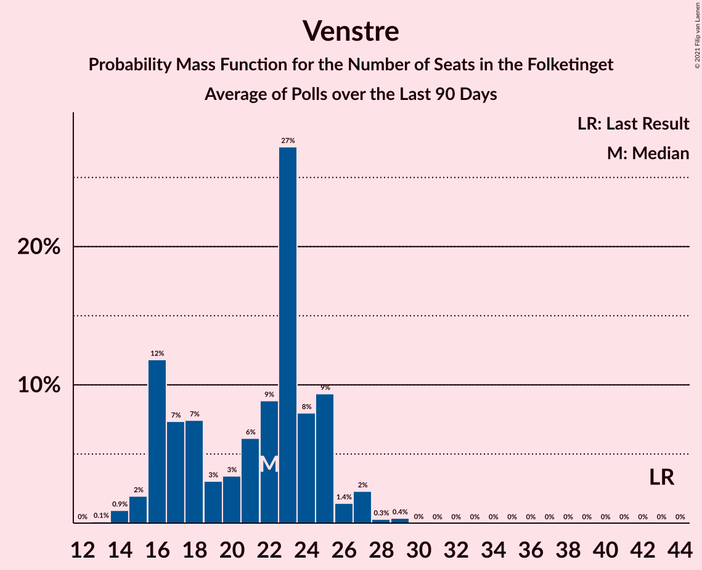

# Venstre

<a href="#voting-intentions">Voting Intentions</a> | <a href="#seats">Seats</a>

## Voting Intentions

Last result: **23.4%** (General Election of 5 June 2019)

### Confidence Intervals

| Period     | Polling firm/Commissioner(s) | Median | 80% Confidence Interval | 90% Confidence Interval | 95% Confidence Interval | 99% Confidence Interval |
|:----------:|:----------------:|:-----------:|:-----------------------:|:-----------------------:|:-----------------------:|:-----------------------:|
| N/A | [Poll Average](average.html) | 11.1% | 9.6–13.0% | 9.3–13.4% | 9.1–13.8% | 8.8–14.4% |
| [3–8 May 2021](2021-05-08-Voxmeter.html) | Voxmeter | 11.6% | 10.4–13.0% | 10.1–13.4% | 9.8–13.7% | 9.3–14.4% |
| [26 April–2 May 2021](2021-05-02-Voxmeter.html) | Voxmeter | 12.3% | 11.1–13.7% | 10.7–14.1% | 10.4–14.5% | 9.9–15.2% |
| [19–25 April 2021](2021-04-25-Voxmeter.html) | Voxmeter | 11.5% | N/A | N/A | N/A | N/A |
| [12–18 April 2021](2021-04-18-Voxmeter.html) | Voxmeter | 11.3% | 10.1–12.7% | 9.8–13.1% | 9.5–13.4% | 9.0–14.1% |
| [7–13 April 2021](2021-04-13-Epinion.html) | Epinion | 10.4% | 9.5–11.4% | 9.2–11.7% | 9.0–12.0% | 8.6–12.5% |
| [5–10 April 2021](2021-04-10-Voxmeter.html) | Voxmeter | 12.1% | 10.9–13.5% | 10.5–13.9% | 10.3–14.3% | 9.7–15.0% |
| [2–8 April 2021](2021-04-08-Gallup.html) | Gallup | 12.6% | 11.6–13.7% | 11.3–14.0% | 11.1–14.3% | 10.7–14.8% |
| [29 March–4 April 2021](2021-04-04-Voxmeter.html) | Voxmeter | 12.7% | 11.4–14.1% | 11.1–14.5% | 10.7–14.8% | 10.2–15.6% |
| [22–28 March 2021](2021-03-28-Voxmeter.html) | Voxmeter | 11.2% | 10.0–12.5% | 9.6–12.9% | 9.4–13.2% | 8.8–13.9% |
| [15–21 March 2021](2021-03-21-Voxmeter.html) | Voxmeter | 11.9% | 10.7–13.3% | 10.3–13.7% | 10.1–14.0% | 9.5–14.7% |
| [7–14 March 2021](2021-03-14-Voxmeter.html) | Voxmeter | 12.1% | 10.9–13.5% | 10.5–13.9% | 10.3–14.3% | 9.7–15.0% |
| [1–6 March 2021](2021-03-06-Voxmeter.html) | Voxmeter | 12.3% | 11.0–13.7% | 10.7–14.1% | 10.4–14.4% | 9.8–15.1% |
| [22–28 February 2021](2021-02-28-Voxmeter.html) | Voxmeter | 11.2% | 10.0–12.6% | 9.7–13.0% | 9.4–13.3% | 8.9–14.0% |
| [22–25 February 2021](2021-02-25-Megafon.html) | Megafon | 11.4% | 10.2–12.7% | 9.8–13.1% | 9.5–13.5% | 9.0–14.2% |
| [15–21 February 2021](2021-02-21-Voxmeter.html) | Voxmeter | 12.7% | 11.4–14.1% | 11.1–14.5% | 10.8–14.8% | 10.2–15.5% |
| [8–15 February 2021](2021-02-15-Voxmeter.html) | Voxmeter | 11.8% | 10.6–13.2% | 10.3–13.6% | 10.0–13.9% | 9.4–14.6% |
| [1–14 February 2021](2021-02-14-Electica.html) | Electica   Alliancen | 9.8% | 9.2–10.4% | 9.1–10.6% | 8.9–10.7% | 8.6–11.0% |
| [5–8 February 2021](2021-02-08-YouGov.html) | YouGov   B.T. | 9.3% | 8.3–10.4% | 8.0–10.7% | 7.8–11.0% | 7.3–11.6% |
| [1–6 February 2021](2021-02-06-Voxmeter.html) | Voxmeter | 12.3% | 11.1–13.7% | 10.7–14.1% | 10.4–14.4% | 9.9–15.1% |
| [25–31 January 2021](2021-01-31-Voxmeter.html) | Voxmeter | 12.5% | 11.3–14.0% | 11.0–14.4% | 10.7–14.7% | 10.1–15.4% |
| [22–28 January 2021](2021-01-28-Gallup.html) | Gallup | 12.8% | 11.8–14.0% | 11.5–14.3% | 11.2–14.6% | 10.7–15.2% |
| [18–24 January 2021](2021-01-24-Voxmeter.html) | Voxmeter | 13.6% | 12.3–15.1% | 11.9–15.5% | 11.6–15.8% | 11.0–16.6% |
| [18–21 January 2021](2021-01-21-Megafon.html) | Megafon   Politiken and TV 2 | 11.3% | 10.1–12.7% | 9.8–13.1% | 9.5–13.4% | 8.9–14.1% |
| [18–21 January 2021](2021-01-21-Epinion.html) | Epinion | 13.3% | 12.3–14.4% | 12.0–14.7% | 11.8–15.0% | 11.3–15.5% |
| [15–18 January 2021](2021-01-18-YouGov.html) | YouGov   B.T. | 9.2% | 8.2–10.3% | 8.0–10.7% | 7.7–11.0% | 7.3–11.5% |
| [11–17 January 2021](2021-01-17-Voxmeter.html) | Voxmeter | 13.0% | 11.8–14.5% | 11.4–14.9% | 11.1–15.2% | 10.5–16.0% |
| [4–9 January 2021](2021-01-09-Voxmeter.html) | Voxmeter | 13.8% | 12.5–15.3% | 12.2–15.7% | 11.9–16.1% | 11.3–16.8% |
| [14–20 December 2020](2020-12-20-Voxmeter.html) | Voxmeter | 17.3% | 15.8–18.9% | 15.4–19.3% | 15.1–19.7% | 14.4–20.5% |
| [7–12 December 2020](2020-12-12-Voxmeter.html) | Voxmeter | 18.9% | 17.4–20.5% | 16.9–21.0% | 16.6–21.4% | 15.9–22.2% |
| [4–10 December 2020](2020-12-10-Gallup.html) | Gallup | 17.5% | 16.3–18.8% | 16.0–19.2% | 15.7–19.5% | 15.1–20.2% |
| [1–8 December 2020](2020-12-08-Epinion.html) | Epinion | 17.6% | 16.5–18.9% | 16.1–19.2% | 15.9–19.5% | 15.3–20.1% |
| [4–7 December 2020](2020-12-07-YouGov.html) | YouGov   B.T. | 14.1% | 12.9–15.5% | 12.6–15.9% | 12.3–16.2% | 11.8–16.9% |
| [30 November–5 December 2020](2020-12-05-Voxmeter.html) | Voxmeter | 19.2% | 17.7–20.8% | 17.2–21.3% | 16.9–21.7% | 16.2–22.5% |
| [30 November–3 December 2020](2020-12-03-Megafon.html) | Megafon   Politiken and TV 2 | 16.4% | 15.0–18.0% | 14.6–18.4% | 14.3–18.8% | 13.7–19.6% |
| [23–29 November 2020](2020-11-29-Voxmeter.html) | Voxmeter | 19.7% | 18.1–21.3% | 17.7–21.8% | 17.3–22.2% | 16.6–23.0% |
| [16–22 November 2020](2020-11-22-Voxmeter.html) | Voxmeter | 20.3% | 18.7–22.0% | 18.3–22.4% | 17.9–22.9% | 17.2–23.7% |
| [9–15 November 2020](2020-11-15-Voxmeter.html) | Voxmeter | 18.6% | 17.1–20.2% | 16.7–20.7% | 16.3–21.1% | 15.6–21.9% |
| [6–12 November 2020](2020-11-12-Gallup.html) | Gallup | 18.4% | 17.2–19.7% | 16.9–20.0% | 16.6–20.3% | 16.0–21.0% |
| [6–11 November 2020](2020-11-11-YouGov.html) | YouGov   B.T. | 15.7% | 14.4–17.1% | 14.1–17.5% | 13.8–17.8% | 13.2–18.5% |
| [2–7 November 2020](2020-11-07-Voxmeter.html) | Voxmeter | 18.5% | 17.0–20.1% | 16.6–20.6% | 16.2–21.0% | 15.5–21.8% |
| [26 October–1 November 2020](2020-11-01-Voxmeter.html) | Voxmeter | 19.4% | 17.9–21.1% | 17.5–21.5% | 17.1–21.9% | 16.4–22.8% |
| [19–25 October 2020](2020-10-25-Voxmeter.html) | Voxmeter | 20.4% | 18.9–22.1% | 18.4–22.6% | 18.1–23.0% | 17.3–23.9% |
| [19–22 October 2020](2020-10-22-Megafon.html) | Megafon   Politiken and TV 2 | 17.3% | 15.9–18.9% | 15.5–19.4% | 15.1–19.8% | 14.5–20.6% |
| [12–18 October 2020](2020-10-18-Voxmeter.html) | Voxmeter | 18.3% | 16.8–19.9% | 16.4–20.4% | 16.0–20.8% | 15.3–21.6% |
| [5–10 October 2020](2020-10-10-Voxmeter.html) | Voxmeter | 19.7% | 18.1–21.4% | 17.7–21.8% | 17.3–22.2% | 16.6–23.1% |
| [2–5 October 2020](2020-10-05-YouGov.html) | YouGov | 15.8% | 14.5–17.1% | 14.1–17.5% | 13.8–17.9% | 13.3–18.6% |
| [28 September–4 October 2020](2020-10-04-Voxmeter.html) | Voxmeter | 18.5% | 17.3–19.8% | 16.9–20.1% | 16.7–20.4% | 16.1–21.1% |
| [28 September–4 October 2020](2020-10-04-Gallup.html) | Gallup | 19.1% | 18.0–20.3% | 17.7–20.6% | 17.5–20.9% | 16.9–21.4% |
| [22–28 September 2020](2020-09-28-Epinion.html) | Epinion | 17.7% | 16.5–18.9% | 16.2–19.3% | 15.9–19.6% | 15.3–20.2% |
| [21–27 September 2020](2020-09-27-Voxmeter.html) | Voxmeter | 19.3% | 17.8–20.9% | 17.3–21.4% | 17.0–21.8% | 16.3–22.6% |
| [14–20 September 2020](2020-09-20-Voxmeter.html) | Voxmeter | 18.4% | 16.9–20.0% | 16.5–20.5% | 16.2–20.9% | 15.5–21.7% |
| [7–12 September 2020](2020-09-12-Voxmeter.html) | Voxmeter | 19.9% | 18.4–21.5% | 18.0–22.0% | 17.6–22.4% | 16.9–23.1% |
| [1–8 September 2020](2020-09-08-Epinion.html) | Epinion | 17.2% | 16.0–18.4% | 15.7–18.8% | 15.4–19.1% | 14.9–19.7% |
| [31 August–6 September 2020](2020-09-06-Voxmeter.html) | Voxmeter | 20.4% | 18.9–22.1% | 18.4–22.6% | 18.1–23.0% | 17.3–23.8% |
| [31 August–1 September 2020](2020-09-01-Voxmeter.html) | Voxmeter | 20.4% | 18.9–22.1% | 18.4–22.6% | 18.1–23.0% | 17.3–23.8% |
| [24–30 August 2020](2020-08-30-Voxmeter.html) | Voxmeter | 19.4% | 17.9–21.1% | 17.5–21.6% | 17.1–22.0% | 16.4–22.8% |
| [24–27 August 2020](2020-08-27-Megafon.html) | Megafon   Politiken and TV 2 | 18.3% | 16.8–19.9% | 16.4–20.4% | 16.0–20.8% | 15.3–21.6% |
| [17–23 August 2020](2020-08-23-Voxmeter.html) | Voxmeter | 18.8% | 17.3–20.4% | 16.9–20.9% | 16.5–21.3% | 15.9–22.1% |
| [10–16 August 2020](2020-08-16-Voxmeter.html) | Voxmeter   Ritzau | 17.8% | 16.4–19.4% | 15.9–19.9% | 15.6–20.3% | 14.9–21.1% |
| [3–8 August 2020](2020-08-08-Voxmeter.html) | Voxmeter   Ritzau | 18.9% | 17.4–20.5% | 16.9–21.0% | 16.6–21.4% | 15.9–22.2% |
| [1–31 July 2020](2020-07-31-Gallup.html) | Gallup | 19.0% | 17.7–20.3% | 17.3–20.7% | 17.0–21.1% | 16.5–21.7% |
| [2–6 July 2020](2020-07-06-YouGov.html) | YouGov | 17.0% | 15.7–18.5% | 15.3–18.9% | 15.0–19.2% | 14.4–19.9% |
| [22–28 June 2020](2020-06-28-Voxmeter.html) | Voxmeter   Ritzau | 20.1% | 18.6–21.8% | 18.1–22.2% | 17.8–22.6% | 17.1–23.5% |
| [22–25 June 2020](2020-06-25-Megafon.html) | Megafon   Politiken and TV 2 | 17.4% | 16.0–19.0% | 15.6–19.4% | 15.3–19.8% | 14.6–20.6% |
| [15–21 June 2020](2020-06-21-Voxmeter.html) | Voxmeter   Ritzau | 19.9% | 18.3–21.5% | 17.9–22.0% | 17.5–22.4% | 16.8–23.2% |
| [8–13 June 2020](2020-06-13-Voxmeter.html) | Voxmeter   Ritzau | 20.4% | 18.8–22.0% | 18.4–22.5% | 18.0–22.9% | 17.3–23.8% |
| [11 June 2020](2020-06-11-Gallup.html) | Gallup | 21.4% | 20.1–22.8% | 19.7–23.2% | 19.4–23.5% | 18.7–24.2% |
| [8–10 June 2020](2020-06-10-YouGov.html) | YouGov | 18.6% | 17.2–20.0% | 16.8–20.5% | 16.5–20.8% | 15.9–21.5% |
| [1–7 June 2020](2020-06-07-Voxmeter.html) | Voxmeter   Ritzau | 19.1% | 17.6–20.7% | 17.1–21.2% | 16.8–21.6% | 16.1–22.4% |
| [25–31 May 2020](2020-05-31-Voxmeter.html) | Voxmeter   Ritzau | 19.6% | 18.1–21.2% | 17.6–21.7% | 17.3–22.1% | 16.6–22.9% |
| [22–29 May 2020](2020-05-29-Epinion.html) | Epinion | 20.4% | 19.2–21.7% | 18.8–22.1% | 18.5–22.4% | 17.9–23.1% |
| [18–24 May 2020](2020-05-24-Voxmeter.html) | Voxmeter   Ritzau | 19.1% | 17.6–20.7% | 17.2–21.2% | 16.8–21.6% | 16.1–22.4% |
| [11–17 May 2020](2020-05-17-Voxmeter.html) | Voxmeter   Ritzau | 20.4% | 18.9–22.1% | 18.5–22.6% | 18.1–23.0% | 17.4–23.9% |
| [7–11 May 2020](2020-05-11-YouGov.html) | YouGov | 19.3% | 18.0–20.8% | 17.6–21.3% | 17.2–21.6% | 16.6–22.4% |
| [4–9 May 2020](2020-05-09-Voxmeter.html) | Voxmeter   Ritzau | 21.9% | 20.3–23.6% | 19.8–24.1% | 19.4–24.5% | 18.7–25.3% |
| [27 April–3 May 2020](2020-05-03-Voxmeter.html) | Voxmeter   Ritzau | 21.1% | 19.5–22.8% | 19.1–23.3% | 18.7–23.7% | 18.0–24.5% |
| [27–30 April 2020](2020-04-30-Megafon.html) | Megafon   Politiken and TV 2 | 19.8% | 18.2–21.4% | 17.8–21.9% | 17.4–22.3% | 16.7–23.2% |
| [20–26 April 2020](2020-04-26-Voxmeter.html) | Voxmeter   Ritzau | 20.9% | 19.3–22.6% | 18.9–23.1% | 18.5–23.5% | 17.8–24.3% |
| [6–19 April 2020](2020-04-19-Voxmeter.html) | Voxmeter   Ritzau | 21.5% | 19.9–23.2% | 19.5–23.7% | 19.1–24.1% | 18.4–24.9% |
| [10–16 April 2020](2020-04-16-Epinion.html) | Epinion | 21.0% | 19.8–22.4% | 19.4–22.7% | 19.1–23.1% | 18.5–23.7% |
| [30 March–11 April 2020](2020-04-11-Voxmeter.html) | Voxmeter   Ritzau | 22.0% | 20.4–23.7% | 19.9–24.1% | 19.6–24.6% | 18.8–25.4% |
| [23 March–5 April 2020](2020-04-05-Voxmeter.html) | Voxmeter   Ritzau | 21.8% | 20.2–23.5% | 19.8–24.0% | 19.4–24.4% | 18.7–25.2% |
| [27 March–3 April 2020](2020-04-03-Gallup.html) | Gallup | 21.9% | 20.5–23.3% | 20.2–23.7% | 19.8–24.0% | 19.2–24.7% |
| [23–29 March 2020](2020-03-29-Voxmeter.html) | Voxmeter   Ritzau | 22.2% | 20.7–23.9% | 20.2–24.4% | 19.8–24.8% | 19.1–25.7% |
| [16–22 March 2020](2020-03-22-Voxmeter.html) | Voxmeter   Ritzau | 23.3% | 21.7–25.1% | 21.2–25.5% | 20.9–26.0% | 20.1–26.8% |
| [9–15 March 2020](2020-03-15-Voxmeter.html) | Voxmeter   Ritzau | 24.0% | 22.4–25.8% | 21.9–26.3% | 21.5–26.7% | 20.7–27.6% |
| [2–7 March 2020](2020-03-07-Voxmeter.html) | Voxmeter   Ritzau | 23.3% | 21.7–25.1% | 21.2–25.5% | 20.9–26.0% | 20.1–26.8% |
| [25 February–2 March 2020](2020-03-02-Epinion.html) | Epinion   DR | 22.3% | 21.0–23.7% | 20.6–24.1% | 20.3–24.4% | 19.7–25.1% |
| [24 February–1 March 2020](2020-03-01-Voxmeter.html) | Voxmeter   Ritzau | 23.6% | 22.0–25.4% | 21.5–25.8% | 21.1–26.3% | 20.3–27.1% |
| [24–27 February 2020](2020-02-27-Megafon.html) | Megafon   TV2 | 21.7% | 20.1–23.4% | 19.7–23.9% | 19.3–24.3% | 18.6–25.1% |
| [17–23 February 2020](2020-02-23-Voxmeter.html) | Voxmeter   Ritzau | 23.8% | 22.2–25.6% | 21.7–26.1% | 21.4–26.5% | 20.6–27.4% |
| [10–16 February 2020](2020-02-16-Voxmeter.html) | Voxmeter   Ritzau | 24.4% | 22.7–26.2% | 22.3–26.7% | 21.9–27.2% | 21.1–28.1% |
| [7–13 February 2020](2020-02-13-Gallup.html) | Gallup | 22.4% | 21.1–23.8% | 20.7–24.2% | 20.4–24.6% | 19.7–25.3% |
| [3–8 February 2020](2020-02-08-Voxmeter.html) | Voxmeter   Ritzau | 23.9% | 22.2–25.6% | 21.8–26.1% | 21.4–26.5% | 20.6–27.4% |
| [27 January–2 February 2020](2020-02-02-Voxmeter.html) | Voxmeter   Ritzau | 22.1% | 20.5–23.9% | 20.1–24.4% | 19.7–24.8% | 19.0–25.7% |
| [20–26 January 2020](2020-01-26-Voxmeter.html) | Voxmeter   Ritzau | 22.6% | 21.0–24.3% | 20.5–24.8% | 20.1–25.3% | 19.4–26.1% |
| [13–19 January 2020](2020-01-19-Voxmeter.html) | Voxmeter   Ritzau | 22.3% | 20.7–24.0% | 20.2–24.5% | 19.8–24.9% | 19.1–25.8% |
| [6–11 January 2020](2020-01-11-Voxmeter.html) | Voxmeter   Ritzau | 22.8% | 21.2–24.6% | 20.7–25.1% | 20.3–25.5% | 19.6–26.3% |
| [30 December 2019–5 January 2020](2020-01-05-Voxmeter.html) | Voxmeter   Ritzau | 23.8% | 22.2–25.6% | 21.7–26.1% | 21.3–26.5% | 20.5–27.4% |
| [16–22 December 2019](2019-12-22-Voxmeter.html) | Voxmeter   Ritzau | 23.8% | 22.2–25.6% | 21.7–26.1% | 21.3–26.5% | 20.6–27.4% |
| [9–15 December 2019](2019-12-15-Voxmeter.html) | Voxmeter   Ritzau | 23.2% | 21.5–24.9% | 21.1–25.4% | 20.7–25.8% | 19.9–26.7% |
| [12 December 2019](2019-12-12-Gallup.html) | Gallup | 23.3% | 21.9–24.8% | 21.6–25.2% | 21.2–25.5% | 20.6–26.2% |
| [2–8 December 2019](2019-12-08-Voxmeter.html) | Voxmeter   Ritzau | 23.9% | 22.2–25.7% | 21.7–26.2% | 21.3–26.6% | 20.5–27.5% |
| [25 November–2 December 2019](2019-12-02-Voxmeter.html) | Voxmeter   Ritzau | 22.9% | 21.3–24.6% | 20.9–25.1% | 20.5–25.6% | 19.7–26.4% |
| [26–28 November 2019](2019-11-28-Megafon.html) | Megafon   Politiken and TV 2 | 21.8% | 20.2–23.6% | 19.8–24.1% | 19.4–24.5% | 18.6–25.3% |
| [18–25 November 2019](2019-11-25-Voxmeter.html) | Voxmeter   Ritzau | 23.7% | 22.0–25.4% | 21.5–25.9% | 21.1–26.4% | 20.3–27.3% |
| [20 November 2019](2019-11-20-Epinion.html) | Epinion   DR | 23.2% | 21.9–24.6% | 21.6–25.0% | 21.2–25.4% | 20.6–26.0% |
| [11–18 November 2019](2019-11-18-Voxmeter.html) | Voxmeter   Ritzau | 24.3% | 22.6–26.1% | 22.2–26.6% | 21.8–27.0% | 21.0–27.9% |
| [4–10 November 2019](2019-11-10-Voxmeter.html) | Voxmeter   Ritzau | 23.7% | 22.1–25.5% | 21.6–26.0% | 21.2–26.4% | 20.4–27.3% |
| [8 November 2019](2019-11-08-Gallup.html) | Gallup | 22.9% | 21.5–24.3% | 21.2–24.7% | 20.8–25.1% | 20.2–25.8% |
| [27 October–4 November 2019](2019-11-04-Voxmeter.html) | Voxmeter   Ritzau | 22.9% | 21.3–24.6% | 20.9–25.1% | 20.5–25.6% | 19.7–26.4% |
| [21–27 October 2019](2019-10-27-Voxmeter.html) | Voxmeter   Ritzau | 23.4% | 21.8–25.2% | 21.3–25.7% | 20.9–26.1% | 20.1–26.9% |
| [23 October 2019](2019-10-23-Epinion.html) | Epinion   DR | 23.8% | 22.4–25.2% | 22.1–25.6% | 21.7–26.0% | 21.1–26.7% |
| [14–20 October 2019](2019-10-20-Voxmeter.html) | Voxmeter   Ritzau | 24.2% | 22.6–26.0% | 22.1–26.5% | 21.7–26.9% | 20.9–27.8% |
| [7–12 October 2019](2019-10-12-Voxmeter.html) | Voxmeter   Ritzau | 23.5% | 21.9–25.3% | 21.4–25.8% | 21.0–26.2% | 20.2–27.1% |
| [30 September–7 October 2019](2019-10-07-Voxmeter.html) | Voxmeter   2019-10-07 | 24.5% | 22.8–26.2% | 22.4–26.7% | 22.0–27.2% | 21.2–28.0% |
| [23–29 September 2019](2019-09-29-Voxmeter.html) | Voxmeter   Ritzau | 23.8% | 22.2–25.6% | 21.7–26.1% | 21.3–26.5% | 20.6–27.4% |
| [29 September 2019](2019-09-29-Gallup.html) | Gallup | 23.0% | 21.7–24.5% | 21.3–24.9% | 21.0–25.3% | 20.3–26.0% |
| [16–22 September 2019](2019-09-22-Voxmeter.html) | Voxmeter   Ritzau | 22.8% | 21.2–24.5% | 20.7–25.0% | 20.3–25.4% | 19.6–26.3% |
| [19 September 2019](2019-09-19-Norstat.html) | Norstat   Altinget and Jyllands-Posten | 22.5% | 20.9–24.3% | 20.4–24.8% | 20.0–25.2% | 19.3–26.1% |
| [9–15 September 2019](2019-09-15-Voxmeter.html) | Voxmeter   Ritzau | 21.9% | 20.3–23.6% | 19.8–24.1% | 19.4–24.5% | 18.7–25.3% |
| [12 September 2019](2019-09-12-Gallup.html) | Gallup | 22.4% | 21.2–23.8% | 20.8–24.2% | 20.5–24.5% | 19.9–25.2% |
| [9 September 2019](2019-09-09-YouGov.html) | YouGov | 20.7% | 19.1–22.4% | 18.7–22.9% | 18.3–23.3% | 17.5–24.1% |
| [2–9 September 2019](2019-09-09-Voxmeter.html) | Voxmeter   Ritzau | 22.6% | 21.0–24.4% | 20.6–24.8% | 20.2–25.3% | 19.4–26.1% |
| [26 August–1 September 2019](2019-09-01-Voxmeter.html) | Voxmeter   Ritzau | 23.4% | 21.8–25.2% | 21.4–25.7% | 21.0–26.1% | 20.2–26.9% |
| [18–26 August 2019](2019-08-26-Voxmeter.html) | Voxmeter   Ritzau | 23.2% | 21.6–25.0% | 21.1–25.5% | 20.7–25.9% | 20.0–26.7% |
| [16–20 August 2019](2019-08-20-Megafon.html) | Megafon   Politiken and TV 2 | 21.3% | 19.7–23.0% | 19.3–23.5% | 18.9–23.9% | 18.1–24.8% |
| [12–18 August 2019](2019-08-18-Voxmeter.html) | Voxmeter   Ritzau | 23.8% | 22.2–25.5% | 21.7–26.0% | 21.3–26.5% | 20.6–27.3% |
| [5–10 August 2019](2019-08-10-Voxmeter.html) | Voxmeter   Ritzau | 25.4% | 23.7–27.3% | 23.3–27.8% | 22.8–28.2% | 22.1–29.1% |
| [8 August 2019](2019-08-08-Gallup.html) | Gallup | 23.5% | 22.2–25.0% | 21.8–25.4% | 21.5–25.7% | 20.8–26.4% |
| [24–30 June 2019](2019-06-30-Voxmeter.html) | Voxmeter   Ritzau | 24.5% | 22.9–26.3% | 22.4–26.8% | 22.0–27.2% | 21.3–28.1% |
| [17–23 June 2019](2019-06-23-Voxmeter.html) | Voxmeter   Ritzau | 25.1% | 23.4–26.9% | 22.9–27.4% | 22.5–27.8% | 21.7–28.7% |
| [10–15 June 2019](2019-06-15-Voxmeter.html) | Voxmeter   Ritzau | 24.2% | 22.6–26.0% | 22.1–26.5% | 21.7–27.0% | 20.9–27.9% |

### Probability Mass Function

The following table shows the probability mass function per percentage block of voting intentions for the [poll average](average.html) for Venstre.

| Voting Intentions | Probability | Accumulated | Special Marks |
|:-----------------:|:-----------:|:-----------:|:-------------:|
| 6.5–7.5% | 0% | 100% |  |
| 7.5–8.5% | 0.2% | 100% |  |
| 8.5–9.5% | 9% | 99.8% |  |
| 9.5–10.5% | 27% | 91% |  |
| 10.5–11.5% | 24% | 64% | Median |
| 11.5–12.5% | 22% | 40% |  |
| 12.5–13.5% | 14% | 18% |  |
| 13.5–14.5% | 3% | 4% |  |
| 14.5–15.5% | 0.3% | 0.3% |  |
| 15.5–16.5% | 0% | 0% |  |
| 16.5–17.5% | 0% | 0% |  |
| 17.5–18.5% | 0% | 0% |  |
| 18.5–19.5% | 0% | 0% |  |
| 19.5–20.5% | 0% | 0% |  |
| 20.5–21.5% | 0% | 0% |  |
| 21.5–22.5% | 0% | 0% |  |
| 22.5–23.5% | 0% | 0% | Last Result |

## Seats

Last result: **43** seats (General Election of 5 June 2019)

### Confidence Intervals

| Period     | Polling firm/Commissioner(s) | Median | 80% Confidence Interval | 90% Confidence Interval | 95% Confidence Interval | 99% Confidence Interval |
|:----------:|:----------------:|:------:|:-----------------------:|:-----------------------:|:-----------------------:|:-----------------------:|
| N/A | [Poll Average](average.html) | 19 | 18–23 | 17–24 | 17–25 | 16–26 |
| [3–8 May 2021](2021-05-08-Voxmeter.html) | Voxmeter | 21 | 19–23 | 18–24 | 17–24 | 17–25 |
| [26 April–2 May 2021](2021-05-02-Voxmeter.html) | Voxmeter | 22 | 20–27 | 20–27 | 20–27 | 18–27 |
| [19–25 April 2021](2021-04-25-Voxmeter.html) | Voxmeter |  |  |  |  |  |
| [12–18 April 2021](2021-04-18-Voxmeter.html) | Voxmeter | 21 | 19–23 | 18–24 | 18–25 | 16–25 |
| [7–13 April 2021](2021-04-13-Epinion.html) | Epinion | 18 | 18–19 | 18–20 | 18–21 | 16–22 |
| [5–10 April 2021](2021-04-10-Voxmeter.html) | Voxmeter | 22 | 19–24 | 19–24 | 18–26 | 18–27 |
| [2–8 April 2021](2021-04-08-Gallup.html) | Gallup | 23 | 21–25 | 20–25 | 20–25 | 19–27 |
| [29 March–4 April 2021](2021-04-04-Voxmeter.html) | Voxmeter | 23 | 20–26 | 20–27 | 19–28 | 19–28 |
| [22–28 March 2021](2021-03-28-Voxmeter.html) | Voxmeter | 20 | 17–22 | 17–23 | 17–23 | 15–25 |
| [15–21 March 2021](2021-03-21-Voxmeter.html) | Voxmeter | 22 | 19–24 | 19–25 | 18–26 | 17–26 |
| [7–14 March 2021](2021-03-14-Voxmeter.html) | Voxmeter | 22 | 20–25 | 19–26 | 19–26 | 17–26 |
| [1–6 March 2021](2021-03-06-Voxmeter.html) | Voxmeter | 23 | 21–24 | 19–25 | 19–25 | 17–27 |
| [22–28 February 2021](2021-02-28-Voxmeter.html) | Voxmeter | 21 | 17–23 | 16–23 | 16–24 | 16–26 |
| [22–25 February 2021](2021-02-25-Megafon.html) | Megafon | 20 | 18–22 | 17–24 | 17–24 | 16–24 |
| [15–21 February 2021](2021-02-21-Voxmeter.html) | Voxmeter | 23 | 21–25 | 21–26 | 20–26 | 19–27 |
| [8–15 February 2021](2021-02-15-Voxmeter.html) | Voxmeter | 21 | 19–24 | 18–25 | 18–25 | 17–25 |
| [1–14 February 2021](2021-02-14-Electica.html) | Electica   Alliancen | 18 | 17–19 | 17–19 | 17–19 | 16–20 |
| [5–8 February 2021](2021-02-08-YouGov.html) | YouGov   B.T. | 17 | 16–18 | 15–19 | 15–19 | 14–21 |
| [1–6 February 2021](2021-02-06-Voxmeter.html) | Voxmeter | 23 | 20–24 | 19–25 | 18–26 | 18–27 |
| [25–31 January 2021](2021-01-31-Voxmeter.html) | Voxmeter | 22 | 20–23 | 20–24 | 19–26 | 19–28 |
| [22–28 January 2021](2021-01-28-Gallup.html) | Gallup | 24 | 22–27 | 22–27 | 21–27 | 20–27 |
| [18–24 January 2021](2021-01-24-Voxmeter.html) | Voxmeter | 25 | 22–28 | 21–29 | 20–31 | 19–31 |
| [18–21 January 2021](2021-01-21-Megafon.html) | Megafon   Politiken and TV 2 | 20 | 18–24 | 17–24 | 17–25 | 16–26 |
| [18–21 January 2021](2021-01-21-Epinion.html) | Epinion | 22 | 22–25 | 22–26 | 21–26 | 21–28 |
| [15–18 January 2021](2021-01-18-YouGov.html) | YouGov   B.T. | 14 | 14–18 | 14–18 | 14–18 | 14–21 |
| [11–17 January 2021](2021-01-17-Voxmeter.html) | Voxmeter | 23 | 20–26 | 19–27 | 19–27 | 18–28 |
| [4–9 January 2021](2021-01-09-Voxmeter.html) | Voxmeter | 26 | 23–27 | 22–28 | 22–29 | 20–30 |
| [14–20 December 2020](2020-12-20-Voxmeter.html) | Voxmeter | 32 | 29–33 | 28–33 | 27–34 | 26–36 |
| [7–12 December 2020](2020-12-12-Voxmeter.html) | Voxmeter | 35 | 31–37 | 30–39 | 30–40 | 27–40 |
| [4–10 December 2020](2020-12-10-Gallup.html) | Gallup | 31 | 28–35 | 26–35 | 26–35 | 26–35 |
| [1–8 December 2020](2020-12-08-Epinion.html) | Epinion | 31 | 29–35 | 29–35 | 28–35 | 27–36 |
| [4–7 December 2020](2020-12-07-YouGov.html) | YouGov   B.T. | 26 | 23–29 | 23–30 | 23–30 | 21–31 |
| [30 November–5 December 2020](2020-12-05-Voxmeter.html) | Voxmeter | 34 | 32–38 | 31–39 | 30–39 | 28–41 |
| [30 November–3 December 2020](2020-12-03-Megafon.html) | Megafon   Politiken and TV 2 | 29 | 29–31 | 29–32 | 28–33 | 25–34 |
| [23–29 November 2020](2020-11-29-Voxmeter.html) | Voxmeter | 33 | 32–36 | 30–38 | 30–39 | 30–41 |
| [16–22 November 2020](2020-11-22-Voxmeter.html) | Voxmeter | 37 | 33–38 | 33–38 | 32–40 | 30–41 |
| [9–15 November 2020](2020-11-15-Voxmeter.html) | Voxmeter | 34 | 31–35 | 30–37 | 29–37 | 28–38 |
| [6–12 November 2020](2020-11-12-Gallup.html) | Gallup | 37 | 33–37 | 32–37 | 30–37 | 30–38 |
| [6–11 November 2020](2020-11-11-YouGov.html) | YouGov   B.T. | 29 | 26–34 | 24–34 | 24–34 | 23–34 |
| [2–7 November 2020](2020-11-07-Voxmeter.html) | Voxmeter | 31 | 31–34 | 31–35 | 31–35 | 29–37 |
| [26 October–1 November 2020](2020-11-01-Voxmeter.html) | Voxmeter | 35 | 31–37 | 31–39 | 30–39 | 29–40 |
| [19–25 October 2020](2020-10-25-Voxmeter.html) | Voxmeter | 38 | 32–39 | 32–40 | 32–41 | 31–44 |
| [19–22 October 2020](2020-10-22-Megafon.html) | Megafon   Politiken and TV 2 | 31 | 28–33 | 28–34 | 27–35 | 26–37 |
| [12–18 October 2020](2020-10-18-Voxmeter.html) | Voxmeter | 31 | 31–35 | 30–35 | 29–37 | 27–39 |
| [5–10 October 2020](2020-10-10-Voxmeter.html) | Voxmeter | 36 | 34–39 | 33–39 | 32–39 | 31–41 |
| [2–5 October 2020](2020-10-05-YouGov.html) | YouGov | 28 | 26–31 | 26–32 | 25–32 | 24–33 |
| [28 September–4 October 2020](2020-10-04-Voxmeter.html) | Voxmeter | 33 | 33 | 32–34 | 32–35 | 30–36 |
| [28 September–4 October 2020](2020-10-04-Gallup.html) | Gallup | 37 | 33–37 | 33–37 | 33–37 | 33–37 |
| [22–28 September 2020](2020-09-28-Epinion.html) | Epinion | 33 | 30–35 | 30–36 | 29–36 | 28–36 |
| [21–27 September 2020](2020-09-27-Voxmeter.html) | Voxmeter | 40 | 34–40 | 32–40 | 31–40 | 30–41 |
| [14–20 September 2020](2020-09-20-Voxmeter.html) | Voxmeter | 32 | 30–36 | 30–36 | 29–38 | 27–38 |
| [7–12 September 2020](2020-09-12-Voxmeter.html) | Voxmeter | 36 | 33–39 | 32–39 | 31–39 | 31–42 |
| [1–8 September 2020](2020-09-08-Epinion.html) | Epinion | 32 | 29–33 | 29–34 | 28–35 | 28–35 |
| [31 August–6 September 2020](2020-09-06-Voxmeter.html) | Voxmeter | 34 | 34–36 | 33–38 | 33–39 | 31–42 |
| [31 August–1 September 2020](2020-09-01-Voxmeter.html) | Voxmeter | 34 | 32–40 | 31–40 | 31–42 | 30–43 |
| [24–30 August 2020](2020-08-30-Voxmeter.html) | Voxmeter | 35 | 34–36 | 33–37 | 33–37 | 31–39 |
| [24–27 August 2020](2020-08-27-Megafon.html) | Megafon   Politiken and TV 2 | 33 | 31–34 | 30–37 | 30–37 | 29–38 |
| [17–23 August 2020](2020-08-23-Voxmeter.html) | Voxmeter | 33 | 33–36 | 31–36 | 29–37 | 28–40 |
| [10–16 August 2020](2020-08-16-Voxmeter.html) | Voxmeter   Ritzau | 31 | 28–34 | 28–35 | 27–35 | 27–37 |
| [3–8 August 2020](2020-08-08-Voxmeter.html) | Voxmeter   Ritzau | 34 | 32–36 | 31–40 | 31–40 | 28–40 |
| [1–31 July 2020](2020-07-31-Gallup.html) | Gallup | 35 | 31–37 | 31–37 | 30–38 | 30–38 |
| [2–6 July 2020](2020-07-06-YouGov.html) | YouGov | 31 | 29–33 | 28–33 | 27–36 | 27–36 |
| [22–28 June 2020](2020-06-28-Voxmeter.html) | Voxmeter   Ritzau | 36 | 33–38 | 33–39 | 32–40 | 31–42 |
| [22–25 June 2020](2020-06-25-Megafon.html) | Megafon   Politiken and TV 2 | 32 | 28–34 | 28–36 | 28–36 | 26–37 |
| [15–21 June 2020](2020-06-21-Voxmeter.html) | Voxmeter   Ritzau | 36 | 34–41 | 34–41 | 33–41 | 31–41 |
| [8–13 June 2020](2020-06-13-Voxmeter.html) | Voxmeter   Ritzau | 37 | 33–41 | 32–42 | 32–42 | 32–43 |
| [11 June 2020](2020-06-11-Gallup.html) | Gallup | 40 | 37–43 | 36–43 | 35–43 | 34–44 |
| [8–10 June 2020](2020-06-10-YouGov.html) | YouGov | 33 | 32–34 | 31–35 | 31–36 | 29–38 |
| [1–7 June 2020](2020-06-07-Voxmeter.html) | Voxmeter   Ritzau | 34 | 32–38 | 32–38 | 30–39 | 29–42 |
| [25–31 May 2020](2020-05-31-Voxmeter.html) | Voxmeter   Ritzau | 35 | 31–38 | 31–39 | 31–39 | 30–40 |
| [22–29 May 2020](2020-05-29-Epinion.html) | Epinion | 37 | 34–38 | 34–39 | 34–40 | 32–41 |
| [18–24 May 2020](2020-05-24-Voxmeter.html) | Voxmeter   Ritzau | 34 | 31–38 | 30–39 | 30–39 | 29–42 |
| [11–17 May 2020](2020-05-17-Voxmeter.html) | Voxmeter   Ritzau | 37 | 34–40 | 34–42 | 33–42 | 31–43 |
| [7–11 May 2020](2020-05-11-YouGov.html) | YouGov | 34 | 33–36 | 31–37 | 31–40 | 30–40 |
| [4–9 May 2020](2020-05-09-Voxmeter.html) | Voxmeter   Ritzau | 40 | 35–42 | 35–43 | 35–44 | 34–45 |
| [27 April–3 May 2020](2020-05-03-Voxmeter.html) | Voxmeter   Ritzau | 38 | 37–41 | 35–42 | 34–43 | 31–44 |
| [27–30 April 2020](2020-04-30-Megafon.html) | Megafon   Politiken and TV 2 | 35 | 34–39 | 32–40 | 32–40 | 30–45 |
| [20–26 April 2020](2020-04-26-Voxmeter.html) | Voxmeter   Ritzau | 39 | 35–42 | 35–43 | 33–45 | 32–45 |
| [6–19 April 2020](2020-04-19-Voxmeter.html) | Voxmeter   Ritzau | 41 | 38–44 | 37–44 | 36–44 | 35–46 |
| [10–16 April 2020](2020-04-16-Epinion.html) | Epinion | 39 | 36–41 | 36–41 | 36–41 | 34–42 |
| [30 March–11 April 2020](2020-04-11-Voxmeter.html) | Voxmeter   Ritzau | 40 | 38–42 | 37–42 | 36–43 | 35–45 |
| [23 March–5 April 2020](2020-04-05-Voxmeter.html) | Voxmeter   Ritzau | 40 | 37–42 | 36–44 | 35–44 | 34–45 |
| [27 March–3 April 2020](2020-04-03-Gallup.html) | Gallup | 37 | 36–46 | 36–46 | 36–46 | 35–46 |
| [23–29 March 2020](2020-03-29-Voxmeter.html) | Voxmeter   Ritzau | 41 | 39–43 | 38–44 | 36–44 | 34–45 |
| [16–22 March 2020](2020-03-22-Voxmeter.html) | Voxmeter   Ritzau | 43 | 39–47 | 38–47 | 37–52 | 37–52 |
| [9–15 March 2020](2020-03-15-Voxmeter.html) | Voxmeter   Ritzau | 44 | 40–47 | 39–49 | 38–49 | 38–51 |
| [2–7 March 2020](2020-03-07-Voxmeter.html) | Voxmeter   Ritzau | 43 | 40–45 | 39–46 | 39–48 | 37–50 |
| [25 February–2 March 2020](2020-03-02-Epinion.html) | Epinion   DR | 40 | 39–43 | 38–44 | 37–44 | 37–45 |
| [24 February–1 March 2020](2020-03-01-Voxmeter.html) | Voxmeter   Ritzau | 43 | 38–45 | 37–45 | 37–46 | 36–47 |
| [24–27 February 2020](2020-02-27-Megafon.html) | Megafon   TV2 | 38 | 36–46 | 36–46 | 34–46 | 33–46 |
| [17–23 February 2020](2020-02-23-Voxmeter.html) | Voxmeter   Ritzau | 43 | 41–48 | 40–49 | 38–49 | 37–51 |
| [10–16 February 2020](2020-02-16-Voxmeter.html) | Voxmeter   Ritzau | 45 | 43–48 | 41–48 | 40–50 | 39–51 |
| [7–13 February 2020](2020-02-13-Gallup.html) | Gallup | 40 | 39–41 | 39–43 | 37–43 | 37–43 |
| [3–8 February 2020](2020-02-08-Voxmeter.html) | Voxmeter   Ritzau | 42 | 41–47 | 39–48 | 38–48 | 38–50 |
| [27 January–2 February 2020](2020-02-02-Voxmeter.html) | Voxmeter   Ritzau | 39 | 36–44 | 36–44 | 36–44 | 34–47 |
| [20–26 January 2020](2020-01-26-Voxmeter.html) | Voxmeter   Ritzau | 41 | 39–42 | 39–43 | 39–44 | 37–45 |
| [13–19 January 2020](2020-01-19-Voxmeter.html) | Voxmeter   Ritzau | 41 | 38–43 | 38–44 | 37–45 | 33–46 |
| [6–11 January 2020](2020-01-11-Voxmeter.html) | Voxmeter   Ritzau | 41 | 39–45 | 39–46 | 38–46 | 35–49 |
| [30 December 2019–5 January 2020](2020-01-05-Voxmeter.html) | Voxmeter   Ritzau | 43 | 41–47 | 41–47 | 39–48 | 37–49 |
| [16–22 December 2019](2019-12-22-Voxmeter.html) | Voxmeter   Ritzau | 43 | 40–45 | 38–47 | 38–48 | 37–50 |
| [9–15 December 2019](2019-12-15-Voxmeter.html) | Voxmeter   Ritzau | 42 | 39–45 | 38–46 | 37–47 | 36–49 |
| [12 December 2019](2019-12-12-Gallup.html) | Gallup | 44 | 40–48 | 40–48 | 39–48 | 38–48 |
| [2–8 December 2019](2019-12-08-Voxmeter.html) | Voxmeter   Ritzau | 43 | 40–46 | 39–47 | 38–48 | 37–49 |
| [25 November–2 December 2019](2019-12-02-Voxmeter.html) | Voxmeter   Ritzau | 42 | 38–45 | 38–47 | 37–47 | 35–49 |
| [26–28 November 2019](2019-11-28-Megafon.html) | Megafon   Politiken and TV 2 | 37 | 37–43 | 35–45 | 34–45 | 34–47 |
| [18–25 November 2019](2019-11-25-Voxmeter.html) | Voxmeter   Ritzau | 42 | 41–47 | 41–48 | 39–48 | 36–50 |
| [20 November 2019](2019-11-20-Epinion.html) | Epinion   DR | 39 | 39–45 | 39–45 | 38–45 | 38–47 |
| [11–18 November 2019](2019-11-18-Voxmeter.html) | Voxmeter   Ritzau | 45 | 43–48 | 42–49 | 40–49 | 38–50 |
| [4–10 November 2019](2019-11-10-Voxmeter.html) | Voxmeter   Ritzau | 42 | 39–43 | 39–47 | 38–49 | 37–50 |
| [8 November 2019](2019-11-08-Gallup.html) | Gallup | 42 | 39–45 | 38–45 | 38–46 | 36–46 |
| [27 October–4 November 2019](2019-11-04-Voxmeter.html) | Voxmeter   Ritzau | 38 | 38–43 | 38–43 | 36–44 | 36–45 |
| [21–27 October 2019](2019-10-27-Voxmeter.html) | Voxmeter   Ritzau | 39 | 39–46 | 39–46 | 39–46 | 37–49 |
| [23 October 2019](2019-10-23-Epinion.html) | Epinion   DR | 42 | 39–44 | 39–45 | 38–46 | 37–47 |
| [14–20 October 2019](2019-10-20-Voxmeter.html) | Voxmeter   Ritzau | 43 | 41–46 | 40–47 | 40–48 | 38–50 |
| [7–12 October 2019](2019-10-12-Voxmeter.html) | Voxmeter   Ritzau | 43 | 40–47 | 39–48 | 38–48 | 37–49 |
| [30 September–7 October 2019](2019-10-07-Voxmeter.html) | Voxmeter   2019-10-07 | 46 | 42–47 | 40–48 | 40–48 | 39–51 |
| [23–29 September 2019](2019-09-29-Voxmeter.html) | Voxmeter   Ritzau | 45 | 42–48 | 39–48 | 39–48 | 35–48 |
| [29 September 2019](2019-09-29-Gallup.html) | Gallup | 40 | 39–46 | 39–46 | 38–46 | 37–46 |
| [16–22 September 2019](2019-09-22-Voxmeter.html) | Voxmeter   Ritzau | 40 | 38–44 | 38–46 | 38–46 | 35–46 |
| [19 September 2019](2019-09-19-Norstat.html) | Norstat   Altinget and Jyllands-Posten | 41 | 38–42 | 38–43 | 37–45 | 34–48 |
| [9–15 September 2019](2019-09-15-Voxmeter.html) | Voxmeter   Ritzau | 38 | 36–43 | 35–44 | 35–45 | 34–46 |
| [12 September 2019](2019-09-12-Gallup.html) | Gallup | 38 | 38–40 | 38–41 | 38–43 | 36–45 |
| [9 September 2019](2019-09-09-YouGov.html) | YouGov | 40 | 38–40 | 36–40 | 33–40 | 32–41 |
| [2–9 September 2019](2019-09-09-Voxmeter.html) | Voxmeter   Ritzau | 41 | 38–44 | 37–47 | 37–47 | 35–48 |
| [26 August–1 September 2019](2019-09-01-Voxmeter.html) | Voxmeter   Ritzau | 42 | 37–47 | 37–47 | 37–48 | 36–49 |
| [18–26 August 2019](2019-08-26-Voxmeter.html) | Voxmeter   Ritzau | 39 | 38–41 | 37–44 | 37–45 | 37–47 |
| [16–20 August 2019](2019-08-20-Megafon.html) | Megafon   Politiken and TV 2 | 39 | 35–43 | 35–44 | 34–44 | 32–45 |
| [12–18 August 2019](2019-08-18-Voxmeter.html) | Voxmeter   Ritzau | 44 | 44 | 43–44 | 42–45 | 40–51 |
| [5–10 August 2019](2019-08-10-Voxmeter.html) | Voxmeter   Ritzau | 50 | 44–50 | 43–50 | 43–50 | 40–51 |
| [8 August 2019](2019-08-08-Gallup.html) | Gallup | 42 | 39–45 | 37–45 | 37–46 | 37–47 |
| [24–30 June 2019](2019-06-30-Voxmeter.html) | Voxmeter   Ritzau | 45 | 41–48 | 41–48 | 39–48 | 37–50 |
| [17–23 June 2019](2019-06-23-Voxmeter.html) | Voxmeter   Ritzau | 43 | 40–46 | 40–47 | 39–48 | 39–50 |
| [10–15 June 2019](2019-06-15-Voxmeter.html) | Voxmeter   Ritzau | 43 | 41–49 | 40–49 | 39–49 | 37–49 |

### Probability Mass Function

The following table shows the probability mass function per seat for the [poll average](average.html) for Venstre.

| Number of Seats | Probability | Accumulated | Special Marks |
|:---------------:|:-----------:|:-----------:|:-------------:|
| 15 | 0.1% | 100% |  |
| 16 | 1.0% | 99.9% |  |
| 17 | 6% | 98.9% |  |
| 18 | 32% | 93% |  |
| 19 | 13% | 62% | Median |
| 20 | 6% | 48% |  |
| 21 | 18% | 42% |  |
| 22 | 5% | 24% |  |
| 23 | 10% | 19% |  |
| 24 | 7% | 10% |  |
| 25 | 2% | 3% |  |
| 26 | 0.3% | 0.5% |  |
| 27 | 0.1% | 0.2% |  |
| 28 | 0% | 0% |  |
| 29 | 0% | 0% |  |
| 30 | 0% | 0% |  |
| 31 | 0% | 0% |  |
| 32 | 0% | 0% |  |
| 33 | 0% | 0% |  |
| 34 | 0% | 0% |  |
| 35 | 0% | 0% |  |
| 36 | 0% | 0% |  |
| 37 | 0% | 0% |  |
| 38 | 0% | 0% |  |
| 39 | 0% | 0% |  |
| 40 | 0% | 0% |  |
| 41 | 0% | 0% |  |
| 42 | 0% | 0% |  |
| 43 | 0% | 0% | Last Result |

